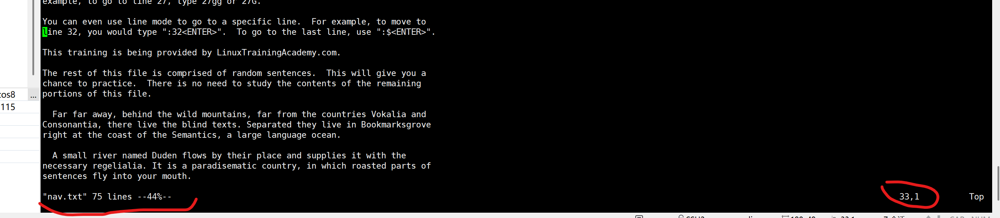
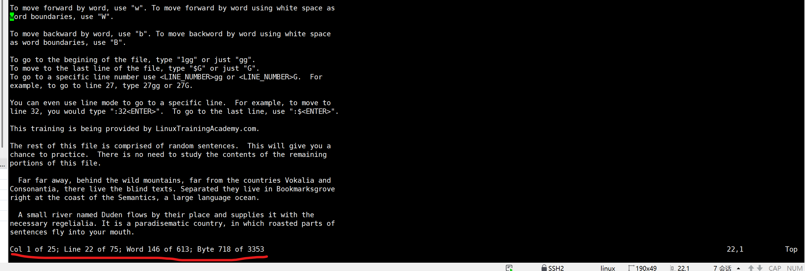
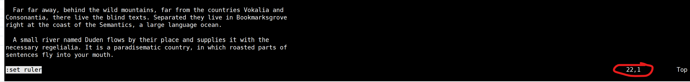

# VIM


## quit

we can exit with `:q!<ENTER>` if we aren't making any changes and don't want to save any changes

type `:wq<ENTER>`  or `:x<ENTER>` to save the file and exit vim.

## navigation - move around

To move down a line, press `j`.

To move up a line, press `k`.

To move to the right, press `l`.

To move to the left, press `h`.

You can also press and hold a navigation key so that it repeats.
To move all the way to the top of the file, press and hold `k`.
To move all the way to the bottom of the file, press and hold `j`.

To move forward in the file, use `Ctrl-f`. Hold down the `control` key and press `f`.
`Ctrl-f` is the same as the page down operation.

To move backward in the file, use `Ctrl-b`. Hold down the control key and press b.
Ctrl-b is the same as the page up operation.

To move forward by word, use `w`. To move forward by word using white space as
word boundaries, use `W`.

To move backward by word, use `b`. To move backword by word using white space
as word boundaries, use `B`.

To go to the begining of the file, type `1gg` or just `gg`.
To move to the last line of the file, type `$G` or just `G` or `shift g`
To go to a specific line number use `<LINE_NUMBER>gg` or `<LINE_NUMBER>G`.  For
example, to go to line 27, type `27gg` or `27G`.

You can even use line mode to go to a specific line.  For example, to move to
line 32, you would type `:32<ENTER>`.  To go to the last line, use `:$<ENTER>`.

`0` move to the start of the line 

`^` move to the first non-whitespace character

`$` move to the end of the line 

```sh
To move all the way to the top of the file, press and hold "k".
   To move all the way to the bottom of the file, press and hold "j".

To move forward in the file, use Ctrl-f. Hold down the control key and press "f".

```


## position info

Press `z<Enter>` to reposition the screen to make the current line to be the first line of your screen

`ctrl+g` or  `:f` in normal mode check the current position of where you are




`g + ctrl + g`  gives you more info




`:set ruler`  to see the current row and column number of your cursor

`:set noruler` to revert it back



this is a pattern, so there are also lots of other settings, like `:set nu` (or `:set number` )and `:set nonu` to set or unset the line numbers

we can also use `!` to be the toggler, so `:set ruler!` turn on the ruler, `:set ruler!` again to turn it off.


## deletion commands

use `d3w` to delete three words

use `di"` to delete words in the quotes

```sh
this is jsut testing
aaa "test with in quotes" dddd
one two three four five


```


The simplest of the deletion commands is lowercase **`x`** , It deletes the character at your current cursor position, You can press upper case **`X`** to delete the character that is right before or just to the left of your cursor position, to delete  a word just use `dw` or `db` to delete backwards，The operator is `d` for delete. The motion is `w` for word motion(direction), that the deletion starts where your cursor is.

so now instead of trying to remember a new command for each and every possible thing you would like to delete.
You just remember the pattern **`operator motion`** 

**`dj`** deletes the current line you're on.  and the line below it because that is where the motion would have taken you. likewise **`dk`** will delete the current line you're on and the one above it because that is where the motion takes you.

So to delete all the way to the beginning of the line from your current cursor position just type **d0**, And  use **d$** so to delete to the end of the line.

Capital **D** is a shortcut for the **d$**. So  type **D** to delete to the end of the line. delete the entire line no matter where my cursor is I'll just type **dd** and that line is deleted.

to delete three lines type **3dd** and those three lines are deleted.

> Start to think in VIM

**operation {motion}**
`dw`
**d** = The delete operation
**w** = The word motion

**[count] operation {motion}**
`5dw`
5 = The count / how many times to repeat.
`dw` = The command (delete word).

**[count]operation[count]{motion}**
**3w** = Repeat word motion 3 times.
**d3w** = Delete the 3w motion. (And it reads just like English.  Delete three words so it's pretty easy to remember.)
**2d3w** = Delete the 3w motion 2 times.(If you want to delete six words you'll probably use 6dw or d6w but I wanted to show you the possibilities)

**The dot command**
**.** = Repeat the previous command.


## redo undo

`ctrl + r` or `:redo`    redo changes

`u` undo changes


type `:w<Enter>`  your file will be saved and you'll be placed back into normal mode where you can continue editing.

When you're ready to quit you can use `: wq<Enter>`  to write and quit.

type `:q<Enter>` If there aren't any changes to the file them will quit.

However if there are changes that haven't been saved them will not quit but instead show you a warning message that says something along the lines of no write since last change.  you need to use `:q!<Enter>` to force quit

## Vim help system

Use `:help` to get help.

To exit out of help, type
`:q<ENTER>`

You can specify a command to get help with, too.
`:help <COMMAND>`

For example, if you wanted to know what "dd" does, type:
`:help dd<ENTER>`

You can also get help on a given subject:
`:help {subject}`

Example:
`:help count`

You can even get help with :help.
`:help :help<ENTER>`

The short version of the :help command is :h

To switch between the help window and the editing window, click twice`CTRL-W `  *this only works in a linux OS, if you're using ssh from win10 with a command line tool, click* `ctrl+w` will close the window itself,  to go back to the last position lclick twice`Ctrl+O` , go forward with `Ctrl+i`(may only work in vim 8.0, not work in vim 7.4)

Oh there is another way to navigate through the help file instead of typing `:help linewise`  or you can place your cursor under the word linewise which has a link format on it and type `control+]`

Let's say you want to look at the documentation for a command but you're not quite sure what the entire command is in this situation.

You can use command line completion and to do that will type` :h` followed by the start of the command you're looking for and then type `ctrl+d` .

So if you were to type :h space `:q` And then type `control+ d `them will list all the commands that start with `:q`.  you can also use `Tab` key to do the same thing, although you need also have the `wildmenu` set to be on to be able to show the available options as menu, if you do a `:set nowildmenu`, there will be no menu when you click `Tab`, it will only switch from the available choice by itself if you keep clicking `Tab,  this is default to `on`in vim8.0+, in vim7.4,  it's default to off, you have to set it with`:set wildmenu`. [wild-menu.png](https://trello.com/1/cards/5fc814e6288c16503300f83e/attachments/5fd86f0a833bed30a9b94130/download/image.png)

while finding command like `ctrl+f` with a ctrl in it, we can use `^` to replace ctrl

## Cut Copy and Paste

d and x cut text, not just delete it. cut = delete and save into a register. Register is a clipboard-like storage location.

standard vs  VIM
cut = delete  use `dd` to cut a line, `x` to cut a character
copy = yank  use `y` to copy
paste = put   use `p` to copy after the cursor, `P` before the cursor if it's use after `x`, if it's line move(use `dd`) then it will be `p` to the below line, `P` to the upper line

we can combine with motion to do certain action, like `dwp` to delete a word and paste/put after the cursor, `ywP` copy a word and put  before the cursor, etc.

`yy` yanks/copy the entire line  `yyp` to copy the entire line and paste after it, `4yyP` copy 4 lines and paste it before the cursor, here we use a capital P, cause if you use lower case p, it will paste after the first line, that's not what we want.

Use `u` to undo the command, use `Ctrl+r` to redo it
the command does is totally undoes your last command no matter how many
lines in the file or how many characters it affects.

## Register types

- Unnamed
- Numbered
- Named

### Registers

- Unnamed register = "" when using `p`  the value in it will get pasted
- Numbered registers = "0 "1 … "9

### Registers

- "" holds text from d, c, s, x, and y operations.
- "0 holds last text yanked (y).
- "1 holds last text deleted (d) or changed (c).
- Numbered registers shift with each d or c.

Up until this point we've been using the unnamed or default register to perform our cut copy and paste operations there are actually many type of registers in them.

But we're going to focus on the next two most commonly used registers.
The first is **numbered registers** and the other register type is called **named registers**

registers are preceded with a double quote The unnamed register is actually `""` the numbered registers are 0 through 9 so register 0 is double quote zero and register 9 is double quote 9 and so on.

The unnamed register contains the last bit of text from an operation like delete or yank as you've already seen.

But to be completely accurate VIM fills the unnamed register with text copied or deleted with `a d c s x` and `y` commands.

Although we haven't covered all of them yet quickly `c` is the change command and as the substitute command.

In any case register 0 contains the text from the most recent yank operation and register 1 contains the most recent text from a delete or change operation.

With each successive deletion or change them shifts the previous contents of register 1 into register 2 to register 2 and to register 3 and so forth , losing the previous contents of register 9 it falls off the end if you will.

Let's put this into action. Let's move down to the line that starts with to do.
Now let's yank it with a `yy` .

And now to look at the registers we can type `:reg`  and press `enter` the first register u see is the unnamed register represented by `""`


```
:reg
--- Registers ---
""   TODO^J
"0   TODO^J
"1   Many discourses concerning realism exist. Therefore, Sartre's model of^Jsemioticist desituationism holds that co "2   Many discourses concerning realism exist. Therefore, Sartre's model of^J
"3   Move this to the beginning. ^J
"4   Move this to the beginning. ^J
"5   Move this to the beginning. ^J
"6   Move this to the beginning. ^J
"7   Move this to the beginning. ^J
"8   Move this to the beginning. ^J
"9   Move this to the beginning. ^J
"-   double
".
":   f
"%   cutcopypaste.txt
```

Remember any text yanked or deleted will be stored there. Also notice that registers 0 contains the yanked text as well because **register 0 always contains the text when the most recent yank operation executing**

the put command duplicate to this line as expected
so will press enter here and press P and the line is duplicated.


```

TODO
TODO #by clicking yyp
This line needs to be fixed at some point in the future.
Fix this line too!
You're work is not quite finished...

```

Now it's moved down a line and delete that with `dd`  will move down one with `j` and type `d`.

When you look at the registers now with `:reg`  inner you'll see that the unnamed register contains the deleted text as well as register 1.


```
--- Registers ---
""   This line needs to be fixed at some point in the future.^J
"0   TODO^J
"1   This line needs to be fixed at some point in the future.^J
```

That's because **register 1 stores the most recent deleted text**. Also notice that register 0 still contains the text yanked.

Lets press enter to return to normal mode and let's see what happens if we execute the put command capital P (shift p).

That's right the line you deleted is pasted because it was what was stored in the unnamed register. But let's say what you really wanted to do was paste the yanked text so you can undo your mistake with `u`.

Will do that now you undoes that mistake.

Now to paste the most recently yanked text precede the put command with the registers so type `"0P`  Now the desired text is pasted.


```
TODO
TODO
TODO #by clicking "0P
Fix this line too!
You're work is not quite finished...
```

Can you see how storing the most recent yank text in one register while storing the most recent deleted text in another is useful.

If you find yourself needing to paste the same thing over and over again while deleting and cleaning up things in between those times you'll find yourself using the zero register.

Another way you can approach this is to use what's called the Black Hole register the black hole register as represented by double quote underscore (`"_`) when writing to the black hole register. Nothing happens. **with** `"_dd` the line got deleted and won't be saved into any register, so it won't impact the original value, so it's called black hole register

------

below are the txt file
...
TODO
This line needs to be fixed at some point in the future. (use `"_dd` here)
Fix this line too!

see the register with `:reg`


```
--- Registers ---
""   TODO^J
"0   TODO^J
"1   TODO^J
"2   This line needs to be fixed at some point in the future.^J
```

Normally a deletion operation would cause the unnamed and 1 register to be changed but when you use the black hole register nothing happens.

Press Enter to go back to normal mode and now you can paste that to do text using the unnamed registers so just type P and to do is pasted or put on the line below the cursor again with them there is usually more than one way to achieve the exact same end result.

Just use what makes the most sense to you if you like the idea of the black hole register will then use that if you want to use the default behavior of Yank text being placed into register 0 and deleted text being placed in register 1.

Go ahead and use that.

Now let's move to another line and delete it with DD. Now when we look at the registers we see how it's placed in register 1. While what was previously in register 1 is now and registered 2 and so on.

So if you've recently deleted something and you want to use it again simply look for it in the numbered registers. For example let's say we want place what's in a register to the line that says this line needs to be fixed.

So we'll press enter to go into normal mode and then type `"2P`  and that line gets pasted.

That's numbered registers in a nutshell but before we move on I want to point out one more thing.

Let's Yank of the next three lines into the unnamed and zero registers with `3yy` at first position

Now let's look at registers with `:reg` and pressing enter.


```
--- Registers ---
""   This line needs to be fixed at some point in the future.^JMany discourses concerning realism exist. Therefore, S "0   This line needs to be fixed at some point in the future.^JMany discourses concerning realism exist. Therefore, S "1   TODO^J
```

When you looked at what we just yanked you'll notice a `^J`  symbol that simply represents a new line character.

When you paste that text that `^J` will be replaced with an `Enter` effectively.

I'm going to reposition my cursor down here a couple of lines and then put this text toward the top of our screen with Z and hit enter instead of relying on the numbered register behaviors you can use named registers.

**There are 26 named registers from a to z just like you can specify a register when pasting. you can specify one when yanking or deleting.**

Let's yank the next line of text into the a register and to do that will use `"ayy` that ginks the entire line into the a register.

Now let's look at the registers with `:reg` and press enter.


```
--- Registers ---
""   Put this line in the a register.^J
"0   This line needs to be fixed at some point in the future.^JMany discourses concerning realism exist. Therefore, S "1   TODO^J
"2   This line needs to be fixed at some point in the future.^J
"3   Many discourses concerning realism exist. Therefore, Sartre's model of^Jsemioticist desituationism holds that co "4   Many discourses concerning realism exist. Therefore, Sartre's model of^J
"5   Move this to the beginning. ^J
"6   Move this to the beginning. ^J
"7   Move this to the beginning. ^J
"8   Move this to the beginning. ^J
"9   Move this to the beginning. ^J
"a   Put this line in the a register.^J
```

You can see that that text is indeed stored in the a named register which is represented by `"a` will hit enter and go back to normal mode will move down to the next line with J and this time let's store this text into the b register.

So will do `"byy`

Now let's look at the registers again.


```
--- Registers ---
...
"a   Put this line in the a register.^J
"b   Put this one in the b register.^J
```

Read enter and you'll see the text that we just yanked in the register. Hit enter to go back to normal mode.

Now you can paste from the a register with `"ap` as well as the B register with `"bp`.

If you want to append up more text to the register use the capital letter of the register name. So let's move down a line here.

Go to this line and then type `"Ayy`. Now let's look at the registers.


```
"a   Put this line in the a register.^JAppend this line to the a register.^J
"b   Put this one in the b register.^J
```

You can see that the line was appended to the existing text. If you were to use lowercase a (`"ayy`) then the text would have been replaced. But since we used uppercase a it appended to the a register.

Let's do the same thing with the B register will move down the line.
`"byy`


```
"a   Put this line in the a register.^JAppend this line to the a register.^J
"b   Put this one in the b register.^JAppend this line to the b register.^J
```

Look at the registers and again you can see that it was appended to the b register

remember that you can use registers with the delete operation too so to delete the word zebra into the z register would just position our cursor on that word and type `"zdw`


```
--- Registers ---
""   Zebra
"0   This line needs to be fixed at some point in the future.^JMany discourses concerning realism exist. Therefore, S "1   Zebra
...
"b   Put this one in the b register.^JAppend this line to the b register.^J
"z   Zebra
```

By the way you can look at a specific register by supplying it as an argument to the read command. So if you want to look at just register z will type.

`:reg z` and press enter.


```
<= Cut this word into the z register.
:reg z
--- Registers ---
"z   Zebra
```

If you want to look at multiple registers just list them. Let's try this again will do colon. E.g. let's look at register 1 and Z and press ENTER


```
<= Cut this word into the z register.
:reg 1z
--- Registers ---
"1   Zebra
"z   Zebra
```

------

you already know how to repeat a command multiple times by starting that command with the number working with registers is no different.

### Repeating with Registers

`[count][register]operator`
Or...
`[register][count]operator`
Again you're thinking in vim.

You can use count register operator or register count operator.
For example let's move down to the line of hyphens.

We'll do that and reposition the text higher in our screen with Z and hit enter to yank that into the H register.


```
--------------------------------------------------------------------------------

:reg h
--- Registers ---
"h   --------------------------------------------------------------------------------^J
```

We can run double quote h y y if we want to paste two lines of dashes are those hyphens there.

We can run `2"hp` or `"h2p`  that simply executes the command twice.


```
--------------------------------------------------------------------------------
--------------------------------------------------------------------------------
--------------------------------------------------------------------------------

--------------------------------------------------------------------------------
--------------------------------------------------------------------------------
```

You've learned a lot in this lesson.

So let's take a couple of minutes to quickly recap what you did learn.

Remember that in them speak cut copy and paste or actually delete yank and put registers are used to store and retrieve text.

Them's unnamed registers sometimes called the default register. Makes it easy to quickly cut copy and paste or should I say delete yank and put the unnamed register contains the contents of the most recent delete it or yanked text when no register is specified for a command like.

Put the unnamed register is use the name register as represented by double quote double quote. There are 10 numbered registers ranging from 0 to 9 register 0 contains the text from the most recent yank operation and register one contains the most recent text from a delete or change operation. With each successive deletion or change of them shifts the previous contents of register one into register to 2 into three and so forth losing the previous contents of register 9.

In addition to numbered registers there are 26 named registers ranging from a to z with named registers you have full control over what goes in each of the named registers.

You can even append to a register by using the uppercase version of the register so to append to register are for example use double quote capital R when deleting are yanking to display the registers use of the colon e.g. command.

You can specify a register or list of registers to display by passing them as arguments to the range command. Otherwise all the registers are displayed in addition to all the information you learned about registers

you also learned how to undo a command with you and to redo a command with control are the undo and redo operations undo or redo an entire command no matter how much or how little text was affected by the command.

## Insert, replace

use `i` command to enter insert mode.
see some example


```
[root@centos7 vim-commands-cheat-sheet]# cat inserting.txt
One of these lines is not like the other one.
One of these is like the other one.

```

Let's say you want to make the second line in this file just like the first line.
One way to do this is to move your cursor to the second line and position it where there is some missing text just in front of the word is so I'll press `j` and I can press `w` to move over a couple of words here and now you can press `i` to enter insert mode and type the word lines followed by a space and then press `escape` to get to normal mode and then move over again to the next place hit `i` go in insert mode type the word `not` press escape again to get back to normal mode.


```
One of these lines is not like the other one.
One of these lines is not like the other one.
```

Now this is pretty much the method you already know. So now let's move down the line that begins with `my` don't just do that by pressing `j` three times here or if you're going for efficiency you could have just used `3j`.


```
One of these lines is not like the other one.
One of these is like the other one.
Hello, my name is Jason.
my name is Jason.

Once upon a time.
Oce upon a time.

There was no possibility of taking a walk that day.
There was no possibility of taking a walk that

```

Now to make this line look like the one above it you have a few choices.
If you were to use the method you already know you would have to position the cursor at the beginning of the line and then enter insert mode to position the cursor at the beginning of this line you could use `0` or the carrot symbol `^`  Both are the same because this line starts with a non-blank character but remember that the `^` moves to the first non-blank character of the line.


```
Hello, my name is Jason.
Hello, my name is Jason.
```

So the lower case `i` command lets you insert text before your current cursor position and capital `I` lets you insert text before the first non-blank character on the line you're on to make this line just like the one above it.


```
...
Hello, my name is Jason.
my name is Jason.

Once upon a time.
Oce upon a time.

There was no possibility of taking a walk that day.
There was no possibility of taking a walk that

```

Now let's move down to the line that begins with `Oce` and I can do that with three J. And then press 0 to go to the beginning of the line, You can move the cursor over a character and use the `i` command to enter insert mode or you can simply press the `a` command from your current cursor position,  And what happens is that the command appends text after the current cursor position.

So to fix this mistake we just type `a` like we did it in to fix our mistake press Escape to return to normal mode and we're all set again.


```
Once upon a time.
Once upon a time.
```

Let's jump to the bottom line of the next pair using `3j` Now this line is missing the last word in the sentence.


```
There was no possibility of taking a walk that day.
There was no possibility of taking a walk that day.
```

So you can use the capital `A` command which appends to the end of the line.


```
What is 2 + 2?  Answer on the line below:

What is 3 + 1?  Answer on the line above:
...

```

Answer on the line below to do this. Use the `o` command lower case `o`.
It begins a new line below the cursor and places you in insert mode.
And let's say you want to create a line above the current line and immediately start inserting text on that line.
Well to do that you would use capital `O`


```
What is 2 + 2?  Answer on the line below:
4

4
What is 3 + 1?  Answer on the line above:
```

Next let's move down a few more spaces here.


```
...
Create a line of asterisks below:

Create 5 lines that begin with "#".

Create 4 lines that begin with "10.11.12.".


```

I'm going to position my cursor below this line that says Create a line of asterisks, You already know how you can make it come and repeat as many times as you want it to by proceeding that command with a number which is called a `count.`

This also works with the insert command. It may not be obvious at first but it's pretty cool. So if you want to create a line that contains 80 asterisks then you just type `80i`.

And now you're in insert mode. enter an asterisk `*`. And now when you press `escape` that command is repeated 80 times and you're left with a line of 80 asterisks right there in your editor.


```
Create a line of asterisks below:
\********************************************************************************
Create 5 lines that begin with "#".
```

And let's say you want to create five new lines that began with the pound sign `#` to where some people call it a number sign or a Hash.

Think about how you would create one new line follow your current cursor position that's right you can use the `o` command to do that.
Let's do that five times by typing `5o`   now you're placed in insert mode at the pound sign here and then press escape.


```
Create 5 lines that begin with "#".
#
#
#
#
#
```

This might be a quick way to create a comment section in a configuration file shellscript or other program. By the way you can repeat these commands with more than just one character.

For example let's say you want to create a list of IP addresses and they all start with `10.11.12.`


```
Create 5 lines that begin with "#".

Create 4 lines that begin with "10.11.12.".
```

Well to create four lines that start like that we can just go down here and type `4o` and type `10.11.12.`  and press escape and now you can quickly go back and fill in the last section of each IP address because you created four lines really quickly that started out the same way.


```
Create 4 lines that begin with "10.11.12.".
10.11.12.
10.11.12.
10.11.12.
10.11.12.
```

There is a very similar mode to insert mode in them and it's called replace mode. Some would actually argue that it's just really another form of insert mode. In any case when you enter replace mode each character you type replaces an existing character.


```
10.11.12.

Replace me!

The dog chased the mouse.

```

Let's try this with a line that reads `replace me` so versal position or cursor where you want to start the replace and so will go down here and then I'm going to press 0 to jump to the beginning of the line and then. Now what we can do is type capital `R`  or you'll see replace appear on the status line at the
bottom of your screen indicating that you're in replacement.

Now whatever you type will overwrite the existing tech text so let's try.
`I love using vim!` And then when we're done we can press `Escape`.
And now we're returned to normal mode.


```
10.11.12.

I love using VIM!

The dog chased the mouse.

```

In this example we typed over the characters and even beyond the original end of the line. So in replace mode one character in the line is deleted for every character you type.

If there is no character truly like at the end of the line then that type character is appended to the line.

It's actually pretty intuitive once you use this once or twice you will really understand how that works. So let's use Replace mode to change the word dog to Cat in the next line.


```

The dog chased the mouse.

The bat chased the mouse.


```

So I'll just go down a couple here and then go back a couple of words by using `B`. Now we can type capital `R` and then `cat` and press `escape` and we're back into normal mode


```
The cat chased the mouse.

The bat chased the mouse.
...
-- REPLACE --
```

and we replaced a dog with cat.

If you just want to replace one character use lowercase or so in the next sentence let's change `bat` to `cat` so will position our cursor under the `b` dowe here and go back to the beginning of the word type `r` and type `c`


```
The cat chased the mouse.

The cat chased the mouse.
```

Now notice how we didn't have to hit escape to go back to normal mode. Lower case `r` only lets you replace one character so you just hit that one character and you're automatically placed back into normal mode.

## Change and Join

OK let's move down to the next line that has some text here.


```
The canine chased the mouse.

The canine chased the mouse.

The canine chased the mouse.


```

And let's say you want to replace the word `canine` with the word `dog`. You could use the replace mode but after you replace the first three characters you would have to delete the remaining characters in the word since it's longer than the word you want to replace it with.

This is where the `c` or change command is useful. The format of the `c` command is an `optional register` followed by `c` followed by a `motion`.

So to change a word we could type `cw`

So let's do that here with `canine` can position the cursor right at the beginning of the word `canine` type `c` for change `w` for word motion.

Now we're into insert mode and now we can just type `cat`  press `escape` and that word was changed from `Canine` to `cat`. Pretty easy.


```
The cat chased the mouse.

The canine chased the mouse.

The canine chased the mouse.
-- INSERT --
```

What essentially happens is the word is deleted and you're placed in insert mode. So whatever you type replaces the motion you specified. It doesn't have to be equal either.

So let's move down to the next line go be to go back to the beginning of this word and this time let's change `canine` to `black cat`.

Again you can use `cw`  and then type your replacement text,  We're going to type `black cat` and press `escape` so you can quickly change a single word into multiple words or multiple lines or whatever replacement text that you want when you're using this `c motion` command.


```
The cat chased the mouse.

The black cat chased the mouse.

The canine chased the mouse.
```

All right let's do this one more time let's change `canine` to `cat` and this time what we want to do is save it into the `a` named register.

So we'll position the cursor at the beginning of `canine` . and  couple of `b` to go back here and then we'll type `"acw`  type `cat` and then hit `escape`.

Now we can look at the registers with `:reg a`, you'll see that the text that we replaced is now in the register.


```
The cat chased the mouse.

The black cat chased the mouse.

The cat chased the mouse.

:reg a
--- Registers ---
"a   canine
```

The word canine you already know how to use registers but I just wanted to give you a little reminder using this new command that you were just introduced to.


```
The cat chased the car as it sped down the street.

The cat chased the car as it sped down the street.

This line doesn't belong here!

```

Let's move down a couple of lines here Let's say you want to replace all the text on the line starting at the word car. So to do this just position your cursor at `car` and I'll just do this with `ww` over to a `car` and then we can type `c$`
Now remember that the `dollar sign motion` takes you to the end of the line.

So `c$` means replace from your current cursor position all the way through the end of the line and now we can just type `mouse` for example period  `.` and press `escape`.


```
The cat chased the mouse.

The cat chased the car as it sped down the street.

This line doesn't belong here!
```

You might have noticed that the command is really behaving a lot like the `D` command you learned in an earlier lesson.
Remember how the dollar sign command deletes the characters from under the cursor until the end of the line. And do you remember the one letter command that does the exact same thing.

Yep that's capital `D`. So if I `c$`  changes text to the end of the line while what one letter command do you think does the same thing. I hope you guessed capital `C`.

So let's place our cursor under car and the next line and use capital C will go down here. Well just hit `b` to go back to car and type `shift+c`   for capital `C ` it's going to let us replace the entire line. Really. It deletes the line from our current cursor position all the way to the end places this in insert mode and allows us to type or text which we're going to do with `mouse .`  and press `Escape` to return to normal mode.


```
The cat chased the mouse.

The cat chased the mouse.

This line doesn't belong here!
```

Another handy command to know is `cc`  which allows you to change an entire line of text. So let's move down to the next line with `j` and `j` type `cc` and then we'll just type the replacement text so I'll type `The cat chased the mouse .`  escape and we're back into normal mode now.


```
The cat chased the mouse.

The cat chased the mouse.

The cat chased the mouse.
```

Just like the `c` command you can obstinately use a register to store the text that you replaced. You can also use an `optional count` with the command so if you wanted to change three lines then just use `3cc` for example the next line begins with the lowercase letter.

If you wanted to change that lowercase `t` to an uppercase `T` you have a few options. One possibility would be to use the lower case `r` command followed by uppercase `T` to make that single character replacement.


```
the cat chased the mouse.

the cat chased the mouse.

Make uppEr uppercase.
```

However that tilde `~` commands which is the case of the character under the cursor so position or cursor under the lower case `t` and type tilde `~`.


```
The cat chased the mouse.

the cat chased the mouse.

Make uppEr uppercase.
```

see the lowercase `t` gets changed to uppercase `T`.
Let's change the case of the first **word** on the next line. So we position our cursor on the next line at the beginning and we could type `~`  multiple times
and that would get the job done.

However you can use `g tilde the motion`.

So to change the case of a word we can use `g~w` and that entire motion is changed to uppercase or swaps the case.


```
the cat chased the mouse.

THE cat chased the mouse.

Make uppEr uppercase
```

Now let's switch the case of the entire next **line** so I'll move down here. And then what we can do is `g~$` which does what we want.

You can also use `g~~` which also does the same thing as `g~$`.
Can you see the pattern here. think about `cc`, `dd` , etc. Two of the same command operate on an entire line.
the more you use them and the more you start thinking of them the easier this all becomes.

All of these little patterns start to accumulate and before long you're going to know lots and lots of Vim commands because of all these neat little connections that you're making while we're working.

with this, let's go ahead and change the word `upper` on the next line to be upper case. And you'll notice that the is already in uppercase So if we use the switch case command the `~` on that entire word we would end up with everything in uppercase letters except for that `e`.

Luckily there is a command to force all uppercase letters and that is a `g capital U followed by a motion.`

So let's position your cursor under. You will do `2j` or `jj` ,Well go forward a word with `w`. And now we can type `gUw` that makes all the letters in that motion uppercase no matter what case they were before.


```
the cat chased the mouse.

THE cat chased the mouse.

Make UPPER uppercase.
```

Now let's move down to the next line here with `2j`


```
Make UPPER uppercase.

make this all uppercase.

Make LOwER lowercase.

Make This All Lowercase.
```

and let's make this entire line uppercase with the command `gUU`. Both upper case `U`


```
Make UPPER uppercase.

MAKE THIS ALL UPPERCASE.

Make LOwER lowercase.

Make This All Lowercase.
```

Like there is an upper case command there is also a lowercase command so lets move to the next line and change the word `LOwER` to all lowercase and it already contains a letter that is in lower case so using the `~` the command to switch the case will not give you what you're looking for.

So the command to do this is `g u motion` and notice how this is a lowercase `u` so we'll use `guw`  and that moves everything to lower case for that motion.


```
Make UPPER uppercase.

MAKE THIS ALL UPPERCASE.

Make lower lowercase.

Make This All Lowercase.
```

K. let's move to the next line and make it all lowercase. It should come to us no surprise that the command `guu`  will do just that.


```
Make UPPER uppercase.

MAKE THIS ALL UPPERCASE.

Make lower lowercase.

make this all lowercase.
```

So far we've talked about more ways to enter insert mode. We looked at a few different ways to perform replacements. And just now we finished with making case changes within our text.

------

Finally I want to share with you just one more time and in this lesson that command is the capital `J` command which joins the lines together.


```
The cat chased
the mouse.

The cat chased.
The mouse ran.

```

So let's combine the next pair of lines on the screen. First I'm just going to position my cursor down there and hit `z` and enter to move that text into view on the screen.
Now what we want to do is combine these two lines so it reads `the cat chase` `the mouse` all on one line.
So now with your cursor anywhere on this first line we can hit  capital `J` command


```
The cat chased the mouse.

The cat chased.
The mouse ran.
```

and you'll notice that a `space` was appended to the end of the current line and the line below it was moved to the end of this line.

So the uppercase `J` command tries to be smart about how it includes spaces at the end of the line. If there is already a space at the end of the line it will not add an additional space for example.

Also if the line ends with a period then the uppercase J command will append two spaces to the end of the line before it happens. The line below it.
let's look at this in-action by joining the next two lines together saw just move down a couple of lines here.

Press `J`.


```
make this all lowercase.

The cat chased the mouse.

The cat chased.  The mouse ran.
```

so there are two spaces appended after the period because that's how the uppercase `J` works when it tries to be smart for you.


```
3.
4159

Thing 1
Thing 2
Thing 3

This training is provided by LinuxTrainingAcademy.com.

```

OK let's move down to the next pair of lines and let's say we want to join these two lines but we don't want them adding additional spaces for us to do that.

We can use the `g capital J` command.

So  type `gJ`.


```
3.4159

Thing 1
Thing 2
Thing 3
```

And you'll notice that there are no spaces after the period. If you had just used the capital `J` command two spaces would have come after the period and then you would have not gotten the desired result.

Again like most commands in VM you can make it repeat by providing a count. So let's go down here to these three lines and let's join them all together by typing `3J`


```
3.4159

Thing 1 Thing 2 Thing 3

This training is provided by LinuxTrainingAcademy.com.
```

and those three lines are all joined together.

## Search Find in line-wise

One of the compelling reasons to learn vim is that it's so ubiquitous it's practically everywhere.

I can't ever recall logging on to a UNIX or Linux system and not having access to either VI or VM. Also as a system administrator I often find myself connecting to a server and quickly editing a configuration file.

Of course I invariably end up using them to make those configuration changes and when I'm making such a change I'm typically looking for a specific thing to change. And this means I need a way to quickly search within a file to find exactly what I'm looking for.

If you're a developer you'll find yourself in a similar situation. For example let's say you have a bug to fix Well typically you know where to start looking.

For instance you might know the name of the function the bug is associated with or you might know the name the variable that's key in that bit of code that's causing you troubles or whatever.

And if we zoom in a little bit you might have noticed a typing mistake on the line you're editing. It would be nice to have a way to quickly jump directly to what you're looking for on that line with all these examples you have an idea of what to search for.

So being able to quickly find what you're looking for is super valuable.

Let's open the searching.txt file for this lesson.


```
Searching forward is accomplished by typing f{char}.  Also, zebras eat grass.

Delete THIS<<--- word.
...
```

Let's start with line wise searching to search for it or to the right on the same line. Use `f` followed by the character you're searching for.

For example if you want to move your cursor to the next occurrence of the letter `b` on the line type `fb` ,  you'll find your cursor under the `b` of the word `by` on this line.

Let's say you want to move your cursor to the letter capital `A` to do that type `fA`.  Notice how this is case sensitive.

If you were to type `fA` again  Your cursor won't move because there isn't another capital `A` on the line.

Using `fa`  with the lowercase  `a` will put cursor under `a` of `zebras` .
If you want to search backwards on the same line use capital `F` followed by the character you're looking for. So you can place your cursor under the `z` of `zebra`  by typing `Fz`  , to move your cursor under the period. You can type `F.`

to move your cursor to the beginning of the line you can use `FS`

Let's do another forward search with `fa`.  and we're jump to the first occurrence of a in this line. Now we can repeat this search by typing `fa`  again. However you can also use the semi-colon `;` to repeat the search so as you keep pressing `;`  which the cursor keeps advancing to the next the search result. If there are no more search results on the line than the cursor will stay where it is.

So we can do this I'll just hit to the last and the line and if you keep hitting this semi-colon the cursor doesn't move anywhere because there are no more instances of your search on your particular line.

Now if you want to repeat this search but in the opposite direction you can type a comma `,`  It goes back to the previous `a`,   comma `,` again,  Back to the previous `a` and then we can keep doing this until we're back to the beginning of the line again,  hitting a comma when there are no more search results doesn't move your cursor.

so know that the semi-colon repeats the search in the same direction that it was started in and the comma repeats the search in the opposite direction that the search was started in. ** notice that `; ` doesn't mean forward direction and `,` doesn't mean backward direction**

If you want to position your cursor one position before a given character.
Use the `t` command which is lowercase t followed by the character you're searching for. For example if you type `ti`.

The cursor moves to the position before the letter `i` which in this example is the letter `h` of word `Searching`.

If you were to repeat that command your cursor wouldn't go anywhere because it is already  1 character before the `i`.

I'll just move over a couple of letters with `l`  and then I'll type `ti` again.
Now your cursor is under the space before the next `i` on the line, (**it's like a one time thing,** `ti` only found the first match, even if you click that `ti` again, it won't search for another match)

if you want to redo the search without having to change your current cursor position use the semi-colon `;`
You can also perform a reverse or backwards till search by using the capital-`T `command. So when you type capital `Ta`  Your cursor is positioned just after the `a` in the line.

Likewise you can use semi-colon puts your cursor under the letter `R` in the word forward to go the other way remember that you can use the comma `,`

Of course you already know how to repeat a command by starting it with a number so if you were to type `2f space` your cursor would jump directly to the second space it found on the line.

So again you can use count with these commands as well. By the way these are considered motions.

This means you can combine these motions with other commands you already know such as the `d` to delete `c` command to change or the `y` command to yank.

Now let's move down to the next line of text here.


```

Delete THIS<<--- word.
...
```

I'm going to position my cursor at the very beginning of the line with `0`.
And now let's practice this motion that we've just learned so we can use `fT`  to bring it to the first occurrence of the capital T on this line which is at the beginning of the word `this`.

Now to delete everything from your current cursor position up until the letter `w`. Use `dtw`, `w` here means the first letter of `word`, not the motion `w` for one word without whitespace characters(in this example means `THIS`),  Let's undo that with `u`.

Can you think of another way to do the same thing. Sure you can use `df space` that deletes forward up to and including the next space on the line, notice there is a space between `word` and `-`.

There's another way that we could have done the same thing using the uppercase `W`, `W` here means the motion one whole word including the blank or other whitespace characters (in this example means this `THIS<<--- `)


```
Delete word.
```

Now that is perhaps more efficient for this particular example but what really matters is that you know how to think in vim.

This way you have options you can go for super efficiency or you can just use what you can remember and what feels right to you.

So that's how you search on the same line.

## Find in file with keyword and replace


```
...
Adam's aunt ate apples and acorns around August.
Beth's beagle barked and bayed, becoming bothersome for Billy by the bay.
Cathy's cat clawed her couch, creating chaos.
Doug's dog dove deep in the dam, drinking dirty water as he dove.
Erin's eagle eats eggs, enjoying each episode of eating.
Fran's friends fried Fritos for Friday's food.
Gertrude's giraffe gobbled gooseberryies greedily, getting good at grabbing goodies.
Harry's home has heat hopefully.
Isaac's ice cream is interesting and Isaac is imbibing it.
Jason's jaguar is jumping and jiggling jauntily.
Kate's kid's kept kiting.
Lorri's lizard likes leaping leopards.
Michael's microphone made much music.
Nellie's nephew needed new notebooks now not never.
Oliver's owl out-performed ostriches.
Paul's piglet pranced priggishly.
Quinn's quilters quit quilting quickly.
Randy's reindeer rose rapidly and ran round the room.
Sam's seven sisters slept soundly in sand.
Terri's took tons of tools to make toys for tots.
Uncle Umar's united union uses umbrellas.
Victoria's very vixen-like and vexing.
Wallis walked wearily while wondering where Wally was.
Yolanda yanked you at yoga, and Yvette yelled.
"searching.txt" [Modified] line 3 of 43 --6%-- col 8
...
```

what if you want to find something that may or may not be on the same line.
Or what if you want to search for an entire word or series of characters instead of just one single character.

Well that's when you can use the forward slash `/` search command simply type forward slash followed by whatever it is you're looking for.

For example to find the next occurrence of the word `and` type forward slash `/and`  press `n` to repeat your forward search.
And if you keep pressing in eventually the search will wrap back around to the first occurrence and you'll see a message at the bottom of your screen that says search hit bottom continuing at top and

If you want to repeat the same search but in the reverse direction use capital `N` , By the way you can start a new Forward search at any time,  to search for the characters `for` or we can just use `/for`

If you're seeing something slightly different than what I'm demonstrating here it's probably due to a couple of settings.

The first setting is `is` which is short for `incsearch` which stands for incremental search. Now I have this option turned on and to check if you do or not you can type the command `:set is?` .

you'll see what's on your screen at the bottom and the status line which says `incsearch` or `noincsearch`

Now you can explicitly turn it on with `:set is`  and press enter.

Now I'm going to position my cursor at the top of the file with `gg`.

**below action seems only work in vim8.0+**
Now watch closely as I perform a `/a`. Do you see that the `a` is being highlighted. My cursor hasn't moved yet because I haven't hit enter but them as showing me where I would end up if I did hit enter right now. OK let's keep typing. I'll add an `nd` to my search.

Now the nearest match of `and` is highlighted. If that's where you want to position your cursor hit enter. Which I'll do now. And that is where your cursor is placed.

Let's do the same thing again but this time with the incremental search setting off and to turn it off. Use `:set nois`  and press enter and you can check to make sure it's off with `set is?` and  it says no incsearch. So it is disabled.

OK so I'm back at the top of the file we go with `gg`. Now when I type `/a` nothing on my screen is highlighted. I'll keep typing by adding an `nd` and then pressing enter. Now our cursor moves to the nearest match.

So that's the increment search option.

Another option that can affect how searching appears is the highlight search option represented by `hls`   which is the short for `highlight searching`  to check the setting we can type `:set hls?`  and press enter.

we can turn it on with `:set hls`
Now all those matches that we previously search for are highlighted. we can temporarily turn it off with `:nohls` just for current search

and we can turn them off for good with a `:set nohls`  and those highlights are gone from your screen.

OK so let's get back to the point of this lesson which is searching now.
I'm going to position my cursor back to the beginning of the file with `gg`  and now I'm going to search for the word and with `/and` and press enter.

I want to point out a common pattern I find myself using And I think you'll end up using it too. And that is performing a search such as forward slash and like we've done here executing a command let me execute.

Now do `cw`  to change word and I'll change this word to an ampersand `&` and then pressing escape and the next part of the pattern is using `n` to move forward to the next match and using the dot `.` command to repeat the previous command.

So I hit it here and then I'll do this again I go in for the next. and  I can keep doing this as many times as I want.

If I need to make 4 or 5 quick edits I'll use this pattern of searching performing a command moving to the next occurrence with in and repeating that command with Dot.

Now in just a bit you'll learn how to do a global find and replace which can often do the same thing. But again for quick edits this method it works fairly well.

OK again back to searching So to start a backwards or reverse search use question mark `?` followed by the character if you wanted to find the characters.

I asked that come before your current cursor position just use question mark I guess and press enter again you can use `n`  to repeat the search in the same direction as you search for it and then you can also use capital `N`  to reverse the direction of the search as well.

So you can think of `?` and `N` and this instance is reversing the reverse search which of course means it's forward

let's position our cursor back on the first line in the file and place it under the word `is`  and then I'll just hit w a couple of times here to move into position.

Now to search for the next occurrence of the word `is`  under or near the cursor type an asterisk `\*`. (this will find the exact word `is` not is within other word)

The asterisk is meant for matching an entire word.

Let's go back to the first line again and position our cursor under the word `by`.

to perform a backwards exact search for the word nearest or under the curse or use the pound `\#` sign.

So I do shift 3 on my keyboard. And again I can keep hitting shift 3 which is the pound sign to do this backwards search where I can hit and to keep searching in the same direction of course `shift +n`  or capital `N` reverses the direction of the search which you know we talked about this before.

A reverse of reverse  actually forward
You can use these search motions with commands such as `d` `c` and `y` for example let's say we move our cursor to `LOCAL_DOMAIN` , you can easily delete everything from your current cursor position all the way until the last line by typing `d/This`.


```

# Global configuration

DOMAIN=example.net                      # The example.net domain.
MAIL_SERVER=mail.example.net
MAIL_PATH=/var/spool/mail

# Local configuration

LOCAL_DOMAIN=internal.example.net       # The internal.example.net domain.
LOCAL_MAIL_SERVER=mail.internal.example.net
MAIL_PATH=/var/spool/mail

This training is provided by LinuxTrainingAcademy.com.
```

and so everything from our current cursor position up until that search result `This` was deleted.


```
# Global configuration

DOMAIN=example.net                      # The example.net domain.
MAIL_SERVER=mail.example.net
MAIL_PATH=/var/spool/mail

# Local configuration

This training is provided by LinuxTrainingAcademy.com.
~
```

Let me jump to the beginning of the file here with `gg`.


```
arching forward is accomplished by typing f{char}.  Also, zebras eat grass.
```

Also note that you don't have to make these big motions you can do something even on the same line such as `"a y/z` that Yank's all the text from your current cursor position up to the next occurrence of the letter `z` of word `zebras` and  Type `reg a` ,  You can see that the text was yanked into the a register.


```
:reg a
--- Registers ---
"a   Searching forward is accomplished by typing f{char}.  Also,
```

## Replace word with `:s` command

Pattern is `:[range]s/old/new/[flags]`, default range is current line, one or more line specifiers separated by a comma or semi-colon.
There are also some special characters that represent lines.

- the dollar sign `$` represents the last line in the file.
- a period `.` represents the current line in the file.

see some example below:

- use `:s/old/new/` to replace the word, this will only replace the first occurrence of the **line**
- use `Escape` to abandon the `s` command,
- use `:s/old/new/g` to replace all the occurrence of the **line**
- use `:1s/is/isn't/` to replace the word `is` in the first line to `isn't`
- use `:1,5s/for/FOR/g` to replace the word `for` in line 1 till line5 to `FOR`
- use `:.,$s/for/FOR/g` will replace the word `for` with `FOR` in the entire file.
- use `:%s/for/FOR/g` do the same thing as above, so `%=.,$`

There's another way to specify a range and that is by a pattern. You can specify a pattern with `/`  so if we only want to change `net` to `org` in the section starting with `#global configuration` and ending with `# local configuration `

format is `:/Pattern-1/,/Pattern-2/s/old/new/[Flags] `, see the file:


```
# Global configuration

DOMAIN=example.net                      # The example.net domain.
MAIL_SERVER=mail.example.net
MAIL_PATH=/var/spool/mail

# Local configuration

LOCAL_DOMAIN=internal.example.net       # The internal.example.net domain.
LOCAL_MAIL_SERVER=mail.internal.example.net
MAIL_PATH=/var/spool/mail

This training is provided by LinuxTrainingAcademy.com.

```

you can use `:/Global/,/Local/s/net/org/g`


```
# Global configuration

DOMAIN=example.org                      # The example.org domain.
MAIL_SERVER=mail.example.org
MAIL_PATH=/var/spool/mail

# Local configuration

LOCAL_DOMAIN=internal.example.net       # The internal.example.net domain.
LOCAL_MAIL_SERVER=mail.internal.example.net
MAIL_PATH=/var/spool/mail

This training is provided by LinuxTrainingAcademy.com.
3 substitutions on 2 lines
```

As you can see only the Global configuration is changed
you can combine the search patterns with line numbers or special characters like the dollar sign too.
so `:/Local/,$s/net/org/g` will change `net` to `org` from `# Local configuration` till the end of the file


```
# Local configuration

LOCAL_DOMAIN=internal.example.org       # The internal.example.org domain.
LOCAL_MAIL_SERVER=mail.internal.example.org
MAIL_PATH=/var/spool/mail

This training is provided by LinuxTrainingAcademy.com.
3 substitutions on 2 lines
```

noticed that the pattern separator we're using in vim also happens to be the directory separator for linux/Mac operating systems.

it's common that you'll need to change a path with a substitute command especially if you're working with configuration files. so in order to change `/var/spool` to `/usr/local` in above example file,

first move your cursor in the line start with `MAIL_PATH`, then we can use `:s/\/var\/spool/\/usr\/local/`


```
# Local configuration

MAIL_PATH=/usr/local/mail

This training is provided by LinuxTrainingAcademy.com.
```

So that's the hard way. That's a lot of thinking. Now the easy way is just to use a different character for the pattern separator. I like to use the pound sign `#`.
You can use any other single non-alphanumeric characters that you like.

so to do the same thing as above, we can use `:s#/var/pool#/usr/local#`
I could have made this even a bit simpler by leaving out the leading forward slash because it really wasn't replaced but I wanted to leave it there just to demonstrate how this method works.

Again I like the pound sign. Some people like to use the pipe `|` symbol. Others like to use a comma `,` whatever. You can use a plus `+` sign or even an equal `=` sign.

since we're working with ranges, now we'd better to turn on the line number, we can do it with `set nu` (nu short for number)


```
     37 # Local configuration
     38
     39 LOCAL_DOMAIN=internal.example.org       # The internal.example.org domain.
     40 LOCAL_MAIL_SERVER=mail.internal.example.org
     41 MAIL_PATH=/var/spool/mail
     42
     43 This training is provided by LinuxTrainingAcademy.com.
```

we can turn it off with `set nonu`, notice the pattern here with the `no` in front of settings `nu` or others like we learned `hls`, `is`, etc,  we can also toggle it like `set nu!` with the exclamation mark

## Summary - Same Line Searching

- `f{char}` - Forward search
- `F{char}` - Reverse search
- `t{char}` - Forward till search
- `T{char} `- Reverse till search
- `;` - Repeat in the same direction
- `,` - Repeat in the opposite direction

## Summary - Searching

- `/{pattern}` - Forward search
- `?{pattern}` - Reverse search
- `n` - Repeat search in the same direction
- `N` - Repeat search in the opposite direction
- `*` - Forward search for word
- `#` - Reverse search for word

## Summary - Substitute Command

Format:
`:[range]s/{pattern}/{string}/[flags]`
Global Substitution:
`:%s/{pattern}/{string}/g`

## Text Objects

When you're editing text you'll often find yourself working with text constructs such as words , sentences and paragraphs.

Sometimes when you're editing a file you want to change an entire paragraph or delete a sentence or save a word into a register when you're editing shell script, source code or html you'll find yourself working with text that is delimited by various bits of punctuation such as quotation marks back ticks
and brackets curly braces and tags.

For example it's nice to have a quick way to change the value of a variable or even replace an entire function with a bit of text. All of these objects , words, sentences paragraphs or text enclosed within quotes are  `Vim text objects`

these text objects or logical regions if you will are fairly intuitive for us humans are often very efficient blocks for us to edit.

Objects are used after an operator. It's a very similar to using motions.

For example you previously learned how to delete a word by using `dw`  which is an operator d and a motion w, say your cursor is in the middle of a word, if you click `dw`, you will only delete the part of word from the cursor to the end of the word, so we need to use `vim text objects`.

see below example


```
This is a sentence comprised of many words.  This is another sentence. A
paragraph is made up of multiple sentences.  Just like this one!

This is also paragraph.
No only is it made up of multiple sentences, it's made up of multiple lines.
This is the last line in this paragraph.

```

with **vim text objects** , say your cursor is in the middle of word **comprised** in the first line, to delete this word, you can type `daw`, so `d` means delete, `a` is the text object for word, `w` is for one word forward motion.


```
This is a sentence of many words.  This is another sentence. A
paragraph is made up of multiple sentences.  Just like this one!
```

patter is like below


```
{operator}{a}{object}
{operator}{i}{object}
Examples:
daw = Delete A Word
ciw = Change Inner Word
```

so the text objects are:

- `w` for word
- `s` for sentence
- `p` for paragraph
- `t` for tag
- `"` for contents within double quotes
- `'` for contents within single quote
- \```for contents within backtick
- `{` or `}` or `B` for contents within curly braces(Block)
- `[` or `]` for contents within brackets
- `(` or `)`  or `b` for contents within parentheses(block)
  so you can combine the operation with `i` (inner) or `a` (around, all) and the object(kind of like motion shows what kind of or how much of contents need to be operated on with inner or all way.

like `ci{` will change all the word within the curly braces

## Macros

You've already learned a couple of different ways to repeat single commands for example you can proceed a command with a count to have that command repeat multiple times `3dw`  for instance will repeat `dw` three times and ultimately end up deleting three words if you want to repeat that command again you could simply type a period `.` which is the dot command and three more words will be deleted.

But if you need to repeat a series of commands How do you do that. Well you use macros actually vim called macros  complex repeats because they go beyond simple one command repetitions and can involve many steps.

One of the most common uses of vim macros is to change the format of data or text. You can do things like normalize data into a desired format move columns around in a C S V file delete extraneous text within a line to clean up your data and so much more.

In short you should consider using a macro. Anytime you have a complex or lengthy edit that needs to be repeated multiple times.

Macros are nothing more than a recorded sequence of keystrokes. These keystrokes are actually saved in registers. When you play back a macro all the keystrokes recorded in the register are played back and it's exactly the same as if you were to type those keystrokes again.

This means you have access to the full power of vim in your macros. The only slight limitation is that you can't make an existing macro record a new macro but past that you can do pretty much anything you can think of

To start recording a macro use the `q` command followed by a register
for instance, see below file


```
To record a macro, use the q command followed by a register. To stop, type q.
There are no special macro registers. There is only one a register, for example.
To replay the macro use @ followed by the register.
To repeat the most recently executed marco, use @@.

```

type `qa`, Now you'll notice recording at a is displayed on a status line at the bottom of the screen letting you know that you're currently recording a macro.
let's say we want to add a `NOTE: ` at the beginning of the first line, so you type `I` to insert text at the beginning  and type `NOTE:`, type `Escape` to get back to the normal mode, and type `q` to quit the macro recording.

we  can check the recorded macro with `reg a`


```
:reg a
--- Registers ---
"a   INOTE: ^[
```

notice  the escape key which is represented by the carrot and open bracket. So if for some reason the escape key isn't working you can just use that keystroke anyway.
So now you have a macro recorded and saved into the a register to play it back.
to play it back. Use the at `@` sign followed by the register. so move to the next line with `j` and  type `@a`,  a very quick way to repeat the most recently executed macro is to use `@@`


```
NOTE: To record a macro, use the q command followed by a regsiter. To stop, type q.
NOTE: There are no special macro registers. There is only one a register, for example.
NOTE: To replay the macro use @ followed by the register.
NOTE: To repeat the most recently executed marco, use @@.
```

You might have noticed that every time you wanted to execute this macro you had to first position the cursor on the line and then execute the macro because macro simply replay key strokes.

We can include a `j` key stroke to position the cursor on the next line for us.
That way when we replay the macro it changes the current line and puts you in position on the next line.

with this in mind, let's talk about the **Macro Best Practices**

- Normalize the cursor position with `0` to put at the beginning so for each line it will be the same position in case the line length are different
- Perform edits and operations. now we can add our actual edit and operations.
- Position your cursor to next line with `j` to  enable easy replays. so we don't have to manually type `j` each time when we replay it

see below example


```
Think big.
Feed and strengthen your mind.
Better to have written a lousy ballet than to have composed no ballet at all.
If you don’t prioritize your life, someone else will.
Without great solitude no serious work is possible.
```

type `qb` to save the macro to register b, and then type `0` to put your cursor at the beginning of the line, then `i` ( we can actually use `I` to do the same thing if all you does is insert text, but sometime you'll delete or yank stuff), ok, so then type `TIP: ` and `Escape` then type `j` to move on to the next line and end the recording with `q`, see the register b with `:reg b`


```
:reg b
--- Registers ---
"b   0iTIP: ^[j
```

let's replay with `@b`, then we can use `@@` to repeat it, see the result


```
TIP: Think big.
TIP: Feed and strengthen your mind.
TIP: Better to have written a lousy ballet than to have composed no ballet at all.
TIP: If you don’t prioritize your life, someone else will.
TIP: Without great solitude no serious work is possible.
```

Let's undo our changes there with a series of `u` s and you and now are back to how that block looked like originally. Now let's say you want to repeat that macro over the entire block of text all at once.
You can see that there are five lines here in this block of text so like any other command you can repeat a macro by using a count. So when you type `5@b`, the entire block of text is transformed.


```
FIRST NAME: Joseph LAST NAME: Andrews
FIRST NAME: Scott LAST NAME: Young
FIRST NAME: Jessica LAST NAME: Smith
FIRST NAME: Shirley LAST NAME: Landers
FIRST NAME: Pamela LAST NAME: Lewis"
```

Now let's say we want to create a slightly more involved macro. Let's say we want to remove first name and last name from each of these lines.

Let's create a new macro using the c register so we can type `qc` and we'll normalize our cursor position by typing zero. There are many ways to go about this of course but I'm going to delete the first two words and I'm going
to use `2dW`  because capital W ignores punctuation.

So there you can see first name a colon space was deleted with our command there. Now let's advance to the word `Last`. I'm going to use `fL ` Forward search on the same line to the next occurrence of capital L because we need to do the exact same thing as the last command. We can use the dot  `.` command, so `.` and we have deleted those two words.
Now we can stop the recording with `q`.

Let's look at the contents of the register with `:reg c`


```
Joseph Andrews
FIRST NAME: Scott LAST NAME: Young
FIRST NAME: Jessica LAST NAME: Smith
FIRST NAME: Shirley LAST NAME: Landers
FIRST NAME: Pamela LAST NAME: Lewis
:reg c
--- Registers ---
"c   02dWfL.
```

If you wanted to repeat this macro on multiple lines it would be nice to position the cursor on the next line but as you can see I didn't do that.

The good news is that macros use registers and as you know registers can be appended to. So to append a `j` to the macro we can use q capital C  `qC` then `j`  just as you learnt when you were working with registers using the capitalized register letter appends to the register.
Now let's look at the registry again.


```
:reg c
--- Registers ---
"c   02dWfL.j
```

we can type `@c` to replay the recording move, then use `@@` to repeat the action


```
Joseph Andrews
Scott Young
Jessica Smith
Shirley Landers
Pamela Lewis

```

Up until this point you've just been inserting and deleting text on a line but remember that macro simply replay keystrokes so you can use commands in different modes too.

Let's move to the next bit of text.


```
BEFORE: "Montgomery", "(Alabama)" => "usa"
AFTER:  'Montgomery', 'Alabama', 'USA'
"Montgomery", "(Alabama)" => "usa"
"Juneau", "(Alaska)" => "usa"
"Phoenix", "(Arizona)" => "usa"
"Little", "(Arkansas)" => "usa"
"Sacramento", "(California)" => "usa"
"Denver", "(Colorado)" => "usa"
"Hartford", "(Connecticut)" => "usa"
"Dover", "(Delaware)" => "usa"
"Tallahassee", "(Florida)" => "usa"
"Atlanta", "(Georgia)" => "usa"
```

Let's say you want to change these lines in a few different ways. For starters you want to replace the double quotes with single quotes. Next you want to get rid of the parentheses on the line. Also you want to remove the equal sign followed by the greater side.

By the way some people call that punctuation combination a fat comma a hash rocket or a fat arrow. Anyway let's say you also want to make sure that the three strings are separated by a comma and finally you want to make sure `USA`  is capitalized.

Those are a lot of changes. Let's tackle them one by one.   Just move down to the first line of text here and let's record this macro into the d register.

So let's type `qd`,  and replace all the related word with `:s` command,


```
'Montgomery', 'Alabama', 'USA'
"Juneau", "(Alaska)" => "usa"
"Phoenix", "(Arizona)" => "usa"
"Little", "(Arkansas)" => "usa"
"Sacramento", "(California)" => "usa"
"Denver", "(Colorado)" => "usa"
"Hartford", "(Connecticut)" => "usa"
"Dover", "(Delaware)" => "usa"
"Tallahassee", "(Florida)" => "usa"
"Atlanta", "(Georgia)" => "usa"
:reg d
--- Registers ---
"d   :s/"/'/g^M:s/(//g^M:s/)//g^M:s/ =>/,/g^M:s/usa/USA/g^Mj
```

By the way positioning the cursor at the very beginning of the line with 0 really wasn't needed in this case. It's still a good practice especially if you don't know exactly how you're going to perform all the and it's in the macro.

Of course you could always normalize the cursor position later in the macro if needed. Anyway I just wanted to point this out and as always do it makes sense to you.

Up until this point you've been eyeballing how many times you need to repeat a macro and then supplying that count. That works when you're working with small data sets but if you want to apply a macro to many lines maybe lines that even scroll beyond the end of your screen you'll need a way to apply your macro to that exact range.

And if you need to apply the macro to every line in the file you could use `control+g` to get the line count and then use that line count with the macro.

but there's an even better way. Even when you know the line count. And that way is with the `normal` command. First you in command mode supply a `range`, then  type the `normal` command and then follow it with the `macro`.

First let's turn on line numbering with `:set nu` and pressing enter. Now you can see that you want to apply this macro on lines 27 through 35 , now enter command mode with  `:27,35normal @d` in this case and press enter.

Now that macro is executed over the specified range in an example where you wanted to change every line in a file you could use a range like a `.,$` sign which represents the current line through the end of the file.


```
'Montgomery', 'Alabama', 'USA'
'Juneau', 'Alaska', 'USA'
'Phoenix', 'Arizona', 'USA'
'Little', 'Arkansas', 'USA'
'Sacramento', 'California', 'USA'
'Denver', 'Colorado', 'USA'
'Hartford', 'Connecticut', 'USA'
'Dover', 'Delaware', 'USA'
'Tallahassee', 'Florida', 'USA'
'Atlanta', 'Georgia', 'USA'
```

Note that macros don't have to operate just on a single line. Let's run through a quick example that demonstrates this point.

Let's say you have a list of Web sites with their names on one line and their IP address on the line that follows. And each one of these pairs is separated by a blank line.


```
amazon.com has address:
54.239.17.7

google.com has address:
216.58.192.78

wikipedia.org has address:
208.80.154.224


Remember, macros just replay what's stored in a register.

```

Let's say you want to format this line so that the IP address is first on the line followed by the website name and then nothing else on the line going to position my cursor at the beginning of this list to start recording our macro by typing `qe`
Make sure your cursor starts in the same position each time by using `0`.
Now move down to the next line with `j` and then delete the IP address with capital `D`.

Now move back up to the original line and paste it with `k` and paste it with  capital `P`. You want a space after the IP address so just use `a` and `space` and hit escape to get back to normal mode. You want to delete everything after the hostname so you can just use a forward search with forward slash `/ h`
and press enter.

Now delete the rest of the line with capital `D` . Now you want to delete the blank line so you can use `j2dd`. Now the cursor is in position so you can end the recording with `q`.

We have two more sets of data so we can just use`2@e` and you're done.


```
54.239.17.7 amazon.com
216.58.192.78 google.com
208.80.154.224 wikipedia.org
:reg e
--- Registers ---
"e   0jDkPa kb^[/ h^MDj2dd
```

Another scenario you may find yourself in with macros is that you want to change something in the macro you already know how you can append to a macro but what if you want to do something like insert a 0 at the beginning of your macro, you can first paste it into the file and add a 0 at the beginning and yank it back to register, here, we type `"ap`,
I got


```
INOTE: ^[
```

then we can change it to


```
IA NOTE: ^[
```

type `0` go to the beginning, then we can save it back to register `a` with `"ay$`

check it with `:reg a`
we got


```
:reg a
--- Registers ---
"a   IA NOTE: ^[
```

now we can use it with `@a` in next line


```
IA NOTE: ^[

A NOTE: Remember, macros just replay what's stored in a register.
```

## Save macro to virmrc file

------

Let's say you want to save one of your macros for future use. There are a couple of ways to go about this.

One is relying on the VM info file which is stored in your home directory as `.viminfo` for Unix like systems such as Linux and Mac and `_viminfo` on Windows systems.

The vim info file stores a lot of information like the command line history the search history and the contents of non empty registers. When vim starts it reads the contents of the info file.

So if you were to exit out of them and then start it tomorrow all the registers would be available to you so you could just use your macro right away.

The only problem with this method is that if you overwrite the register then you'll lose the contents of your macro. You could get around this by assigning your must have macros to registers and just make sure that you never use them for anything else.

However there is a more reliable way to save your macros and that's in your VM RC file. The vim RC file is covered in more detail elsewhere in this course but briefly it's a file that contains initialization commands on Unix like systems that stored in your home directory as `.vimrc`.
And on Windows systems it's stored in your home directory as `_vimrc`

When you're editing your vim RC file use the following syntax. Now I'm just going to place this in this example file but when you're doing this for real.
You're going to put it in your vim rc file against the vim rc lesson For more details.

So what we want to do is create a line that starts with the word `let`  followed by a space followed by the at `@`sign and then the register letter you want to store your macro into let's use `d` for example.

Now we can follow that with an equal sign and a single quote. This is way to save the contents of your prerecord and macro is to simply paste it so you can paste the contents of the `d` register with `"dp`

Now all that's left to do is to append a single quote and we can do that by hitting a single quote and pressing escape. This is pretty much a variable assignment statement.

```
let @d = ':s/"/'/g^M:s/(//g^M:s/)//g^M:s/ =>/,/g^M:s/usa/USA/g^Mj'
```

You're pretty much programming your text editor at this point anyway.
When you start vim the contents of the register will be exactly as specified in the VM RC file. If you were to overwrite the contents of the `d` register that would last for the duration of that vim's session but when you start them again that let command will set the contents of the d register.

I highly recommend the method of pasting your prerecord and macros in order to save them. That way you know they work and they contain all the special characters you need.

However you can manually enter macros too. For example let's create a macro for the `t` register that inserts` to do` at the beginning of the current line and then positions the cursor on the line below it to do that.

I'll just start a new line here and type

```
let @t = 'ITODO: ^[j'
```

You want to include the escape character in your macro but if you were to hit escape now you would just exit out of this insert mode. If you just type that carrot symbol followed by the opening bracket like this. `^[`

Thinking you would cause them to interpret that as an escape character.
It would be a good guess but it would be wrong. Going to backspace over that and tell you how to insert** a literal character** and to do that you just type `control+v` the and then type the character.(not working in a ssh window, cause control+v is taken)

So now we'll just hit escape and now the proper character has been inserted.
Finally we can end this macro with `j` and add the closing single quotation mark `'`

If you have single quotes that are in your macro you can surround the let statement with double quotes.

So that's how you create edit play and save macros.

## Visual mode

If you're using a text editor and a graphical user environment then you can do things like highlight text with your mouse and then do something with that highlighted text like delete it or copy it.

If you're using vim and a non graphical environment then you simply don't have the option of using a mouse. However Vim has a visual mode that behaves in a very similar way and in many cases it's actually more

powerful than simply using a graphical application that has mouse support.

For example you can select and operate on a vertical block of text that spans multiple lines allowing you to make edits in the middle of many lines at once.

Even if you don't plan to take advantage of some of the more advanced features using them as a visual mode can be a good way to select irregular text or at the very least see what portion of a document your change will affect before actually making that change.

If you're using a graphical version of them it doesn't mean you have to use the mouse if you're going for pure efficiency.

You could argue that using visual mode commands is quicker than moving your hand back and forth from the mouse and keyboard.

there are three kinds of visual mode

- Characterwise : `v`
- Linewise : `V`
- Blockwise : `Ctrl-V` (column mode)
  You can use motions to expand the visual area.
  You can also use text objects to expand the visual area.

Just some of commands you can use in visual mode include:
`~` - Switch case
`c` - Change
`d` - Delete
`y` - Yank
`r` - Replace
`x` - Delete
`I` - Insert
`A` - Append
`J` - Join
`u` - Make lowercase
`U` - Make uppercase
`>` - Shift right
`<` - Shift left

btw,** lowercase `a` and `i` not working in visual mode**
You can use capital `O` which moves the cursor to the other corner on the same line.

So if we type capital `O` here a few times it just moves the cursor from one end of the highlighted line to the other press lowercase `o`. And you're positioned at the opposite vertical end of the highlighted area.

Now you can use capital O to switch back and forth on the same line just like in the other modes you can use this method to expand the selected area. So if you wanted to extend the selection to the right just move to the right.

Let's say you want to append some text to every line.


```
line 1: one
line 2: one,two
line 3: one,two,three
line 4: one,two,three,four
line 5: one,two,three,four,five
line 6: one,two,three,four
line 7: one,two,three
line 8: one,two
line 9: one
```

Start out by entering block wise visual mode with `control+v`.  Let's go to the bottom line here with the forward search to 9. If you start moving to the right with `l` eventually you'll hit the end of the current line. But the text on the longer lines isn't selected, you have to use `$` to select all text from line 1 to line 9. then you  can type `A` to add text like `end`, then you got


```
line 1: one end
line 2: one,two end
line 3: one,two,three end
line 4: one,two,three,four end
line 5: one,two,three,four,five end
line 6: one,two,three,four end
line 7: one,two,three end
line 8: one,two end
line 9: one end
```

It can also work with text object, so use `Vi{` can select all the text within the curly braces, then type `>` could add a tab space in front of it, also use `>>` could indent one line


```
function make_slave_device_file () {
                # Pass in slave device, slave device file, bond device.
        local S_DEVICE=$1
        local S_FILE=$2
        local BOND_D=$3
        echo "DEVICE=${S_DEVICE}" > $S_FILE
        echo "BOOTPROTO=none" >> $S_FILE
        echo "ONBOOT=yes" >> $S_FILE
        echo "MASTER=${BOND_D}" >> $S_FILE
        echo "SLAVE=yes" >> $S_FILE
        echo "USERCTL=no" >> $S_FILE
        echo "NM_CONTROLLED=no" >> $S_FILE
}
```

you can also did this without visual mode, use `>i}`, it just won't visually show you selected all the text within {}, others are the same.

to quickly reselect at the last visual area. Use `gv`

------

I want to take just a minute to talk about indentation in tabs.
It's not as exciting as visual mode but since we're shifting around text now so a good time to talk about these fine spacing details when you perform one of these shift operations it shifts text by the shift with a setting to view the value of the shift width setting.

You can use `:set shiftwidth?` and press enter.


```
 shiftwidth=8
```

As you can see here it's set to 8. So each time you perform a shift operation the text gets shifted by 8 characters also by default the tab stops setting is set to 8 as well.

And we can confirm this with `:set tabstop?`  and pressing Enter
the tab stop setting is the number of spaces that a tab character in a file accounts for.


```
  tabstop=8
```

Tab Stop is the width of a tab, another setting that comes into play when working with tabs. Is the expand tab setting. By default it's disabled which you can see here with `:set expandtab?`  and hit enter.


```
noexpandtab
```

It displays no expand tab because it is disabled, when it's enabled. It inserts the appropriate number of spaces instead of an actual tab character. So given that the shift width is 8 and tab stops are 8 and expand tab is off.

That means when you perform a right shift operation a tab gets inserted.
If you want to make tabs easy to spot turn on list mode with `:set list` and press enter.


```
function make_slave_device_file () {$
^I# Pass in slave device, slave device file, bond device.$
^Ilocal S_DEVICE=$1$
^Ilocal S_FILE=$2$
^Ilocal BOND_D=$3$
^Iecho "DEVICE=${S_DEVICE}" > $S_FILE$
^Iecho "BOOTPROTO=none" >> $S_FILE$
^Iecho "ONBOOT=yes" >> $S_FILE$
^Iecho "MASTER=${BOND_D}" >> $S_FILE$
^Iecho "SLAVE=yes" >> $S_FILE$
^Iecho "USERCTL=no" >> $S_FILE$
^Iecho "NM_CONTROLLED=no" >> $S_FILE$
}$
$
```

when you have list turned on you see the actual tab character which is represented by `^I`. Also you'll notice dollar signs `$` at the end of each line.
This helps you spot any extraneous whitespace at the end of lines.

if you set shiftwidth=4, and you hit shift twice, it will equals 8 which is the value of tabstops, that will shown as a ^I in the front even you changed the shiftwidth,

If you're like me you're not a big fan of tabs especially tabs mixed with spaces throughout a file. you can change this with `:set expandtab`, then it won't show any tab symbol anymore.

So now let's look at how you can limit the range of command mode commands on a selected region of text , Let's say you have a file where you want to make a substitution to only part of that file.


```
START:United States of America State Capital List
United States of America,Alabama,Montgomery
United States of America,Juneau,Alaska
United States of America,Phoenix,Arizona
United States of America,Little,Arkansas
United States of America,Sacramento,California
United States of America,Denver,Colorado
United States of America,Hartford,Connecticut
United States of America,Dover,Delaware
United States of America,Tallahassee,Florida
United States of America,Atlanta,Georgia
END:United States of America State Capital List
```

In this example you can see the text. **United States of America** appears on each line. Let's say you want to change that text to just USA but only on the lines that include states and their capitals.(that excludes the first and last line)

first type `V` start the line visual mode and select all the text with `/G` which find the `G` of `Georgia in the second last line, so after select all the text, type `:` (`:` will show the visual area range)
colon.

You'll see a bit of text that is automatically inserted. (`'<,'>`)

That text is a range which represents the visually selected area. The single quote less than sign is the start of the visual area and the single quote greater than sign is the end of the visual area like any other range the start and end points are separated by commas.

Now you can perform your command on that range so you can type for example the substitute command which is `:s/United States of America/USA` and hit enter.

right now command mode commands affect entire lines. So if you were to use character wise visual mode commands would affect an entire line even if the line was partially visually selected.


```
START:United States of America State Capital List
USA,Alabama,Montgomery
USA,Juneau,Alaska
USA,Phoenix,Arizona
USA,Little,Arkansas
USA,Sacramento,California
USA,Denver,Colorado
USA,Hartford,Connecticut
USA,Dover,Delaware
USA,Tallahassee,Florida
USA,Atlanta,Georgia
END:United States of America State Capital List
```

Let's work on another quick example of using visual mode with commands.
Let's say you want to center the text between the lines of pound signs.


```
################################################################################
Episode V:
The Empire Strikes Back
################################################################################
```

we can first select all the text within the pound signs with visual line mode `V`, then we can type `:center` or `:ce` to move the text in the center


```
################################################################################
                                   Episode V:
                            The Empire Strikes Back
################################################################################
```

you see how this is going on, now it's the list
`:'<,'>center` or `'<,'>:ce` to align the text to the center
`'<,'>:left` or `'<,'>:le` to align the text to the left
`'<,'>:right` or `'<,'>ri` to align the text to the right
the center command uses a default of 80 columns to center with the lines of pound sides are 80 characters long. If you want to disinter the selection with a width the 40 just supply that after the center command. `:'<,'>center 40`

## Vim Settings and the vimrc File

**virmrc file**

- rc = run commands
- System-wide vimrc and personal vimrc
- Unix / Linux / Mac: ~/.vimrc
- Windows: $HOME/_vimrc
- Each line is executed as a command.

So each time vim starts it runs the commands in the vimrc file.

There's a system wide vim RC file that will be executed each time anyone on the system starts vim. Additionally each individual user can have their own vim RC file. This is where you want to put your customizations.

You can also use the version command to see where the system wide and user specific VIM RC files are located.  just type `:version` when you opened vim


```
VIM - Vi IMproved 7.4 (2013 Aug 10, compiled Oct 13 2020 16:13:17)
...
   system vimrc file: "/etc/vimrc"
     user vimrc file: "$HOME/.vimrc"
```

each line in the VIM RC file is executed as a command,  said another way it contains a list of commands as you would type them after a colon.

For example a line in a VIM RC file that reads `set ruler` is the same thing as you typing ` :set ruler`  enter when you're in vim. However the commands in the vim RC file are not proceeded with a colon

Let's take a closer look at one of the commands will be using a lot in the vim RC file and that command is `set`.

When you type `:set` and press enter all the options that are set at something other than their defaults are displayed.


```
:set
--- Options ---
  background=dark     helplang=en         ruler               textwidth=78
  commentstring="%s   hlsearch            scroll=13           viminfo='20,"50
  filetype=vim      nomodeline            syntax=vim
  backspace=indent,eol,start
  comments=sO:" -,mO:"  ,eO:"",:"
  directory=~/tmp,/var/tmp,/tmp
  fileencoding=utf-8
  fileencodings=ucs-bom,utf-8,latin1
  formatoptions=croql
  guicursor=n-v-c:block,o:hor50,i-ci:hor15,r-cr:hor30,sm:block,a:blinkon0
  iskeyword=@,48-57,_,192-255,#
```

If you want to display the value of an option. Use `:set option-name?`.
below is the sample virmrc file


```
" Save 1,000 items in history
set history=1000

" Show the line and column number of the cursor position
set ruler

" Display the incomplete commands in the bottom right-hand side of your screen.  
set showcmd

" Display completion matches on your status line
set wildmenu

" Show a few lines of context around the cursor
set scrolloff=5

" Highlight search matches
set hlsearch

" Enable incremental searching
set incsearch

" Ignore case when searching
set ignorecase

" Override the 'ignorecase' option if the search pattern contains upper case characters.
set smartcase

" Turn on line numbering
set number

" Turn on file backups, will add an ~ at the end of the file
set backup

" Don't line wrap mid-word.
set lbr

" Copy the indentation from the current line.
set autoindent

" Enable smart autoindenting.
set smartindent

" Use spaces instead of tabs
set expandtab

" Enable smart tabs
set smarttab

" Make a tab equal to 4 spaces
set shiftwidth=4
set tabstop=4


" Specifiy a color scheme.
colorscheme slate

" Tell vim what background you are using
" set bg=light
" set bg=dark

" Map Y to act like D and C, i.e. yank until EOL, rather than act like yy
" map Y y$

" Remap VIM 0 to first non-blank character
" map 0 ^

" Easily create HTML unorded lists. 
map <F3> i<ul><CR><Space><Space><li></li><CR><Esc>I</ul><Esc>kcit
map <F4> <Esc>o<li></li><Esc>cit

" change the mapleader from \ to ,
" NOTE: This has to be set before <leader> is used.
let mapleader=","

" Quickly save your file.
map <leader>w :w!<cr>

" For more options see ":help option-list" and ":options".
```

use `:h history` to check the help doc of command `history`
It says the command lines that you enter are remembered in a history table.
**You can recall them with the up and down cursor keys.** so that you can reuse the old commands, you can do this by type `:` and use up or down key to find the history commands

You can actually narrow your search by typing a partial command line and then pressing the up arrow key to go back through your history displaying only what matches your partial command.

you can change the default settings with `:set history=1000` and If you want to return an option to its default value append an ampersand to it like `set history&`

So now what I'm going to do is create a vim RC file for my user. I'm going to create it from scratch but later I'll show you how to create a VIM RC file with make vimrc command
so type `vim ~/.vimrc` or first `vim` then `:e ~/.vimrc` in bash command line
the latter one with `:e ` can actually let you edit other file when you're in current file, it will open a new window
escape to abandon that command.

So at this point I'm just going to start going over some commonly used vim options. There are tons and tons of options and you can configure vim to do almost anything you want.

When I last counted the options there were something like 1407 line different settings.
By the way you can view those options by typing `:h option-list` and pressing enter.


```
1 quickref.txt  For Vim version 7.4.  Last change: 2013 Jun 29
   2
   3
   4                   VIM REFERENCE MANUAL    by Bram Moolenaar
   5
   6                             Quick reference guide
   7
   8                                                          quickref Contents
   9  tag      subject                        tag      subject
  10 Q_ct    list of help files              Q_re    Repeating commands
  11 Q_lr    motion: Left-right              Q_km    Key mapping
  12 Q_ud    motion: Up-down                 Q_ab    Abbreviations
  13 Q_tm    motion: Text object             Q_op    Options
  14 Q_pa    motion: Pattern searches        Q_ur    Undo/Redo commands
  15 Q_ma    motion: Marks                   Q_et    External commands
  16 Q_vm    motion: Various                 Q_qf    Quickfix commands
  17 Q_ta    motion: Using tags              Q_vc    Various commands
...
1400 zM              zM                      close all folds: make 'foldlevel' zero
1401 zr              zr                      reduce folding: increase 'foldlevel'
1402 zR              zR                      open all folds: make 'foldlevel' max.
1403
1404 zn              zn                      fold none: reset 'foldenable'
1405 zN              zN                      fold normal set 'foldenable'
1406 zi              zi                      invert 'foldenable'
1407
```

use `:q` to quit the help doc, you can also see a concise list by `:options`

I'm just going to go over a few that I think you'll find really helpful of course use what you like and leave the rest alone.
Let's start out with `history`. I personally like to keep a large command history so I'm going to override the default history value of 50 with a set history equals 1000.
so within .vimrc file


```
set history=1000
```

Now remember that the commands in the rc file will be executed as if they had been preceded with a colon. So if you want to change this option while vim is running we can use`:set` in the vim RC file however just use the word `set` without a colon.
so save and close that .vimrc file and reopen it again, check it with `:set history?`, you will see


```
set history=1000

~
~
~
  history=1000
```

By the way if you want to use comments in your vim RC file to remember why you are setting these options in the first place. Start a line with a double quote `"`.

So I'll insert a line above with capital O command.


```
" Keep one thousand items in the history 
set history=1000
```

I'm going to save my changes here with `:w` so that they don't get lost.
Now let's move on to some other options. If you want to show the cursor position at all time use set ruler.

you could also click `tab` to suggest you the options when you type command like `:set hist` in status line

`:set scrolloff` used to set the distance to the top when you type `z` to reposition the current line, it defaults to 0, you can set it to 5 or others, so it will keep 5lines above the current line if you click  `z`

Turn on file backups, will add an ~ at the end of the file with `set backup` in .vimrc file, you can change the extension with `set bex=Something else` bex is short for backup extension

use `set ai` or `set autoindent` to do the indentation when you hit a tab, the next line after you hit enter will also insert a tab

with `set si` or `set smartindent`, you'll get auto indent according to the code format when you hit enter


```
log(){
        echo "nice"
}
~
```

use `:color ` to set the color skin of vim, you could also search online with `vim color skin` to find more skin

There are plenty of resources out there and there are tons of different color schemes to choose from how you install a custom color scheme is to create a dot directory in your home directory and then a subdirectory under that called colors. in linux it's `~/.vim/colors`

So far we've covered the set command and the color scheme command. Next up is the `map` command the map command is used to change the behavior of typed keys. Said another way.  A mapping allows you to bind a set of them commands to a single key.

The most common use is to define a series of commands for a function key the function keys are typically unassigned by default. pattern is
`map KEY KEYSTROKES`
For example we could assign F2 do insert your name and address to do that you would use something:
`map <F2> iJohn Smith<CR>123 Main Street<CR>Anytown, NY<CR><ESC>`

Here's a list of characters you can use with a map command.


```
<BS> Backspace
<CR> Enter
<Enter> Enter
<Return> Enter
<Esc> Escape
<Space> Space
<Up> Up arrow
<Down> Down arrow
<Left> Left arrow
<Right> Right arrow
<Insert> Insert
<Del> Delete
<Home> Home
<End> End
<PageUp> Page-Up
<PageDown> Page-Down
<Tab> Tab
<bar> '|'
<C-X> Ctrl-X
<F1>-<F12> Function keys
```

you can quickly insert a html code block with something like `map <F3> i<ul><CR><Space><Space><li></li><CR><Esc>I</ul><Esc>kcit`, then we can quite vim and open it again to refresh the new change or just use `:source ~/.vimrc` to make it effect right now, create a new file and press `F3`, you'll see
and the cursor is put in between with <li> </li>


```
<ul>
  <li></li>
</ul>
```

now with `map <F4> <Esc>o<li></li><Esc>cit`,  you can  add more <li></li>, you see how convenient for adding code, you can bind everything to the key

use `:map` to check all the current map command list
Now it's important to remember that when you're remapping keys you can actually override existing vim commands.

If you want to do that that's totally fine you can do that. I don't typically recommend that.
But again vim is powerful and lets you do pretty much anything you want as you already know Vim has many many commands so it can be hard to find a key that doesn't already have a purpose.

in order to get around this challenge. Vim provides what it calls a leader key.
By default the leader key is the backslash `\`. What this does is gives you your very own namespace that won't collide with any existing vim commands.

So many people start their custom mappings with the leader key. For example if you wanted a quick way to save a file you could create a mapping like this will do `map <leader>w :w !<CR>` then `:source ~/.vimrc`
And so now if I were to type `\w` , ` :w!` +Enter will be executed and your file will be save.

If you didn't use the leader in this example then you would have overridden the `w` command which you already know moves forward by a word.

By the way if you don't like the default leader key a backslash you can change it with this `let mapleader="," and then put whatever key you want , a comma for example and enclose that in quotes.

Make sure you place this statement before the special leader variable. Otherwise mapping will use the default leader key.


```
" change the mapleader from \ to ,
" NOTE: This has to be set before <leader> is used.
let mapleader=","

" Quickly save your file.
map <leader>w :w!<cr>

```

check the map list with `:map`


```
   ,w            :w!<CR>
   \w            :w!<CR>
...
   <F4>          <Esc>o<li></li><CR><Esc>cit
   <F3>          i<ul><CR>  <li></li><CR><Esc>I</ul><Esc>kcit
```

you can see both `,w` and `\w` is there, and they're doing the same save operation ,
that's a quick introduction to mapping but that takes care of most people's needs in that area.
Of course if you want to explore more on this topic then you can check out the help with `:h mapping` and pressing Enter there.

So that's how you can create a VIM RC file by hand. However you can also just get everything configured the way you like it while you're using vim and then use this `makevimrc` command to write out your settings to your vim rc file the  command writes out all the map and set commands in such a way that when these commands are executed the current key mappings in options will be set to the same values.

since you already have a .vimrc file, it will gives you a warning that you already have a .vimrc file if you want to overwrite that file.

Then you have to use an exclamation mark at the end of that command to force it. By the way you can use this command `makevimrc` and provide another file name so you can see what it's going to create before you overwrite your file.

For example I could just say `:mkvimrc testvimrc` and hit enter and that file `testvimrc` is created.


```
version 6.0
if &cp | set nocp | endif
map ,w :w!^V^M
map \w :w!^V^M
let s:cpo_save=&cpo
set cpo&vim
nmap gx <Plug>NetrwBrowseX
nnoremap <silent> <Plug>NetrwBrowseX :call netrw#NetrwBrowseX(expand("^V<cWORD>"),0)^V^M
map <F4> ^V^[o^V<li>^V</li>^V^M^V^[cit
map <F3> i^V<ul>^V^M  ^V<li>^V</li>^V^M^V^[I^V</ul>^V^[kcit
let &cpo=s:cpo_save
unlet s:cpo_save
set background=dark
set backspace=indent,eol,start
set fileencodings=ucs-bom,utf-8,latin1
set guicursor=n-v-c:block,o:hor50,i-ci:hor15,r-cr:hor30,sm:block,a:blinkon0
set helplang=en
set history=1000
set hlsearch
set nomodeline
set ruler
set showcmd
set viminfo='20,\"50
" vim: set ft=vim :
~
~
~
"testvimrc" 24L, 615C
```

so use `:mkvimrc!` to overwrite the existing one, and type `:e` to reload the current settings.

normally we don't need so many settings, just 3 or 4 of them is fine,


```
set bg=dark
color slate
set wildmenu
set ruler
```

## Buff 

You might find yourself in a situation where you want to edit or at least view multiple files at once and quickly switch between them.

For example if you're programming in C you might want to quickly switch between your source code file and your header file.

Maybe your writing tests for your code so you're switching back and forth between your source code and your test file.

Maybe your system administrator and you need to make changes to a main configuration file as well as some or all of the files that that main configuration file includes.

Maybe you just want a temporary place to keep some notes while you're working on a file. One way to do things like this would be to have multiple terminals open.

You could even use something called a terminal multiplexer like screen or TMX or you can use vim built in mechanisms for handling multiple files which is what we're going to be covering in this lesson.

Let's start out by talking about buffers.

Whether you realize it or not you've been using buffers this whole time. Any time you open a file with vim,  it reads the contents of that file into memory that in memory representation of the file is what VIM calls a buffer.

A common computer science definition of a buffer is a temporary memory area in which data is stored while it is being processed or transferred.

Said another way. A buffer is a file loaded into memory for editing. The original file remains unchanged until you write that buffer to the file when you think about it

it makes total sense when you make a change it's not automatically saved to the file only the buffer is updated when you're sure about your changes. Then you write those changes to the associated underlying file.

If you don't like those changes then you can discard the buffer and the actual file remains unchanged. By the way even though a buffer is typically associated with a file it doesn't have to be.

For example when you start VIM without supplying a file for it to open, VIM starts with an empty buffer. If you want to save the changes to that buffer then you have to tell vim  what file to write those changes to.

So again a buffer resides in memory.

Let's get into some examples by opening several files at once.

One way to open several files at once is to supply multiple files as arguments to the vim command.
For example like,  type `vim buff-ant.txt  buff-bed.txt` and hit` enter` what you see here is the contents of the first file supplied on the command line.

Even though we actually opened two files if you want to open even more files you can do so within vim by using the Edit (`:e`)command.

Let's open another file with `:e` which is the shorthand version of edit buf-cat.txt and press enter.

Now the file is opened and we can see its contents. We still have two other files open even though we can't see them. We can even add another file with this let's add `:e buf-dad.txt` and press enter.

Now we have a total of four files open. We'll get back to dealing with multiple files in just a second. But first let me quit them with `:q!`

Another way to open multiple files at once is to use your shell expansion feature a common shell expansion is the asterisk（`*`) which matches zero or more characters.

So you can open every file that starts with the characters `buf` by typing `vim buf*` and then pressing enter.

What happens when you execute that command is your command line shell expands the asterisk into the matching files which then become arguments to the vim command. This has nothing to do with vim.

This is how your shell works with any command. I'm not going to get into every possible shell expansion for every possible operating system but just
know that this is a common way to open multiple files at once.

So now we have all the files that start with buf open in vim,  even though we can only see one file which is buf-ant.txt . to view all the open buffers let's use the buffers command cell type `:buffers` and press enter.


```
:buffers
  1 %a   "buf-ant.txt"                  line 1
  2      "buf-bed.txt"                  line 0
  3      "buf-cat.txt"                  line 0
  4      "buf-dad.txt"                  line 0
```

This displays the list of buffers and the far left column you see a number.
This number is a unique number for each buffer. By the way this number will not change for the duration of your current VIM session so the buff-ant.txt file will always be buffer number one.

The next column is used for indicators and flags the indicators and flags for buffer one are a percent sign `%` and an `a`.

The next column displays the file name and the last column displays your current cursor position in that buffer.

Let's quickly look at the help for the buffers command with `:h :buffers` and pressing Enter. You'll see that you can also run `:files` or `:ls` to execute the exact same command as `:buffers`.

Personally I like the `:ls` command because it's short for list and it's one of the first commands you learn on a Unix or Linux system.

Let's exit out of help here with `:q` and press enter. So now you know how to see the buffers you have opened with a buffer's command.

Or as I like to use the ls command so let me demonstrate that here. `:ls` and pressing enter.
So how do we open another buffer. Well you use the buffer command and either supply a buffer number or a buffer name which is the same as the file name.

So to bring the buff-bed.txt file into our window we can type `:buffer 2` or `buffe 2` or `buff 2` or `buf 2` or even `b 2` or `b2` without space and press enter.

By the way the shorthand version of the buffer command is `:b`.

So again you can supply the buffer number or buffer name as an argument to the buffer command to place that buffer in the current window.

You can also use tab completion so let's type `:b space` and hit the tab key.
Now you can cycle through your open buffers and simply hit enter when you're at the one you want to open.

So I'll just hit Tab a couple of times here to go to this file and press enter and now that buffer is open you can also do this.

You can hit `:b `+ `control+D` and that gives you a list of buffers to select from.
Then you can type out the buffer name or use tab completion to open the desired buffer.


```
buf-ant.txt  buf-bed.txt  buf-cat.txt  buf-dad.txt
:b
```

And hit a escape because I'm just going to stay in this buffer.

You can move to the next buffer with the next command so `:bnext`, Press enter. The shorter version of the next command is `:bn`  This actually loops the buffer list so as you saw here we were at the last  buffer file  buffer 4 in the list  and when we executed the `:bn` command we actually looped it back around to the first buffer or the beginning of our buffer list.

You can also move in the other direction with the previous `:bprevious` and press enter. Luckily there is a shorter version of that command which is `:bp`.

There's also a `b first` command which takes you to the first to buffer the short version of that is `bf`, also there's a `blast` command which takes you to the last buffer and the shorthand version of that command is `:bl`

Let's open up buffer number two with a buffer command that we just learned a second ago. So do `:b2` and press Enter if you want to quickly switch back to the previously open buffer, use `control+ ^` , I want to get back to the other buffer we'll use `Control +^` again.

I can keep hitting control carrot and quickly switch back and forth between those buffers. Now if we look at our buffer's list with `:ls` and press Enter you'll see. %a and the indicator column next to the current buffer loaded in the window.


```
:ls
  1 #    "buf-ant.txt"                  line 1
  2      "buf-bed.txt"                  line 1
  3      "buf-cat.txt"                  line 1
  4 %a   "buf-dad.txt"                  line 1
```

The percent sign `%` means it's the buffer in the current window and the `a` means it's an active buffer which means it's loaded and visible.
You'll notice a buffer that has a pound sign in the indicator column next to it the pound sign represents the alternate buffer which is the buffer that you were previously editing.

So another way to quickly switch back to the alternate buffer is `:b#` sign.

Let's move back to the first buffer with `:b1`. Now let's make a small change to this file we'll just insert some text, Now let's look at the buffers with `:ls` and press enter. You'll see a plus sign indicator for the buffer that you're working on.


```
:ls
  1 %a + "buf-ant.txt"                  line 1
  2      "buf-bed.txt"                  line 1
  3      "buf-cat.txt"                  line 1
  4 #    "buf-dad.txt"                  line 1
```

This signifies that the buffer has been modified but those changes have not been saved by default. If we try to switch to another buffer without saving or changes we'll get an error. It tells us that our modifications haven't been saved with the no right since last change message.

There are a couple of ways to handle this. One way is to write changes to the file and then load the other buffer. So what I can do here is type `:w` to write our changes.

Now we can load the other buffer with `:bn` and and press enter.
Let's make a change to this buffer, going to insert mode and type bed and hit escape.

Now let's try to switch again `:bn` this time. Let's take the error messages guidance and append an exclamation mark to the command to force it.
Now let's look at our buffers the buffer we just change has a plus sign because it has unsafe changes


```
:ls
  1      "buf-ant.txt"                  line 1
  2 #h + "buf-bed.txt"                  line 1
  3 %a   "buf-cat.txt"                  line 1
  4      "buf-dad.txt"                  line 1
```

and now it also has a `h` indicator which means it's what VIM calls a hidden buffer. A buffer can be in one of three states.

Active meaning it's loaded into memory and displayed in a window hidden which means it's loaded into memory and not displayed in a window. And finally it can be inactive meaning it is not loaded into memory and it is not being displayed.

So the buffers that don't have any indicators are actually not loaded into memory,  when you switch to them. They are then loaded into memory.

So when you switch away from them vim unloads them and freeze that memory even though the file itself is loaded into memory when it's inactive vim remembers the meta data about that file and buffer.

For example it remembers what line you are on the setting specific to that buffer and so on. If you want to change this default behavior of unloading a buffer each time you switch away from it you can turn on the hidden option with `:set hidden` and press enter.

This allows you to edit multiple files at once without saving before switching buffers or forcing the switch with an exclamation mark once a buffer is loaded into memory.

It stays in memory set another way when you load a different buffer in the window the buffer you were just editing becomes hidden.

now let's edit buf-cat.txt with `:b3` and insert text cat then escape, type `:bn`, you get


```
:ls
  1      "buf-ant.txt"                  line 1
  2  h + "buf-bed.txt"                  line 1
  3 #h + "buf-cat.txt"                  line 1
  4 %a   "buf-dad.txt"                  line 1
```

notice the error message is not shown even when you didn't write it to file and when you switch it back with `:bp`, the changes are still there


```
cat
 #####      #     #######
#     #    # #       #
#         #   #      #
#        #     #     #
#        #######     #
#     #  #     #     #
 #####   #     #     #

This training is provided by LinuxTrainingAcademy.com.
```

Even if you don't make a change to a buffer it becomes hidden because we turn on the hidden option if we forget the save your changes to one or more of your buffers and try to exit vim it'll give you an error message and switch to the first buffer with unsaved changes so you can either save or abandon them.


```
:ls
  1 #h   "buf-ant.txt"                  line 1
  2  h + "buf-bed.txt"                  line 1
  3  h + "buf-cat.txt"                  line 1
  4 %a + "buf-dad.txt"                  line 1
E37: No write since last change
E162: No write since last change for buffer "buf-bed.txt"
Press ENTER or type command to continue
```

If you want to save your change then you can use `:w` and press enter or if you want to discard your changes then you can just execute `:q!` again.

By the way if you want to abandon all of your changes and all of your buffers then you can use the `:qall` command. Likewise if you want to save all the changes to all of your buffers you can use the`:wall` command.

You already know how to open a file for editing in the current window with a `:e` command. If you want to open a file without switching to it immediately you can use the `badd` command. no space within b and add, you'll see


```
:ls
  1 %a   "buf-ant.txt"                  line 1
  2      "buf-bed.txt"                  line 0
  3      "buf-cat.txt"                  line 0
  4      "buf-dad.txt"                  line 0
  5      "modes.txt"                    line 1
```

the file modes.txt has been added to buffer ow let's switch to it with `:b5` and press enter.

Let's say you're done with the buffer and you want to remove it from your list of buffers. To do that. Use the `:bdelete` command or `:bd` for short.

B. delete unloads the current buffer from memory and flags it as unlisted.
When you look at the buffer list with `:ls` You won't see it in the list


```
:ls
  1 %a   "buf-ant.txt"                  line 1
  2      "buf-bed.txt"                  line 0
  3      "buf-cat.txt"                  line 0
  4      "buf-dad.txt"                  line 0
```

you can specify a buffer to delete by passing its name or number as an argument to `bd` .So let's delete buffer 3 with `bd 3` and press enter.

Now let's look at our list.


```
:ls
  1 %a   "buf-ant.txt"                  line 1
  2      "buf-bed.txt"                  line 0
  4      "buf-dad.txt"                  line 0
```

It's gone. Now we can add it back by using`:badd buf-cat.txt`  and press enter.
Now when we look at it here it's back in our buffer list.


```
:ls
  1 %a   "buf-ant.txt"                  line 1
  2      "buf-bed.txt"                  line 0
  3      "buf-cat.txt"                  line 1
  4      "buf-dad.txt"                  line 0
  6      "buff.txt"                     line 1
```

You can also give the `bd` command a range so you can do something like this.

`:1,3 bd` and press enter.


```
"buf-dad.txt" 10L, 240C
3 buffers deleted
:ls
  4 %a   "buf-dad.txt"                  line 1
  6      "buff.txt"                     line 1
```

you can delete all with `%bd`


```
:ls
  4 %a   "buf-dad.txt"                  line 1
  6      "buff.txt"                     line 1
2 buffers deleted
:ls
  7 %a   "[No Name]"                    line 1
```

Now all the buffers have been deleted and them gives you a fresh no name to buffer to work with. Just like you would have if you started vim without opening a file.

Let's reopen our buffers quickly. If you want to execute a command in every buffer use the `bufdo` command.

For example let's turn on line numbering for each buffer with `:bufdo set nu` and let's press enter.

Now when we cycle through the buffers with `:bn` we'll see that they all have line numbering enabled


```
  1 cat
  2  #####      #     #######
  3 #     #    # #       #
  4 #         #   #      #
  5 #        #     #     #
  6 #        #######     #
  7 #     #  #     #     #
  8  #####   #     #     #
  9
 10 This training is provided by LinuxTrainingAcademy.com.
```

Let's perform a global substitution across all of our buffers, Let's see if this will work we'll use buff do global substitution `s`.

Let's substitute the pound sign `#` here with an `@` symbol and we'll use the `g` flag so that it replaces everything on each line and let's hit enter and see what happens.

We get an error message saying that we haven't saved our changes.

What happened was` bufdo` executed the command in the current window and got an error when it tried to switch to the next buffer so it stopped.

There are a couple of ways to deal with this. One way we can handle this is to save our changes along the way.

So let me just use my history here.   type `:` and use up arrow, find the same command and add a pipe `|` symbol and `w`, the pipe symbol and vim is the command separator.

So what this command will do is execute the substitute command first then execute the right command the next buffer will be loaded and the substitute command will get executed and then the right command will get executed on that buffer and so on and so forth.

So let's try it here.  type with `:bufdo %s/#/@/g | w`

It looks like it worked.


```
1 dad
  2 @@@@@@      @     @@@@@@
  3 @     @    @ @    @     @
  4 @     @   @   @   @     @
  5 @     @  @     @  @     @
  6 @     @  @@@@@@@  @     @
  7 @     @  @     @  @     @
  8 @@@@@@   @     @  @@@@@@
  9
 10 This training is provided by LinuxTrainingAcademy.com.
~
```

the other way to handle this is to use the hidden option which we talked about earlier, right now hidden is off because I restarted vim and it's not in MY vimrc file.

We can check the current status of that setting with `:set hidden?` and press
enter. And sure enough it says no hidden,  let's make our command fail again here let's do `:bufdo %s/@/*/g`  and press enter.


```
"buf-ant.txt" 10L, 224C
50 substitutions on 7 lines
E37: No write since last change (add ! to override)
Press ENTER or type command to continue
```

And sure enough it fails let me undo that with `u`.

Now let's turn on the hidden options so `:set hidden` and check it with `:set hidden?`,  sure enough hidden option is on.

So now let's try our command again on his hit `:b`  and press the up arrow to use my history here. Very quickly so that's the last of Buff do command we ran. Let me hit enter and see what happens.

Great.

We see our substitutions have been made.


```
  1 ant
  2    *     *     *  *******
  3   * *    **    *     *
  4  *   *   * *   *     *
  5 *     *  *  *  *     *
  6 *******  *   * *     *
  7 *     *  *    **     *
  8 *     *  *     *     *
  9
 10 This training is provided by LinuxTrainingAcademy.com.
~
~
  1 dad
  2 ******      *     ******
  3 *     *    * *    *     *
  4 *     *   *   *   *     *
  5 *     *  *     *  *     *
  6 *     *  *******  *     *
  7 *     *  *     *  *     *
  8 ******   *     *  ******
  9
 10 This training is provided by LinuxTrainingAcademy.com.
~
E486: Pattern not found: @
"buf-bed.txt" 10 lines, 240 characters
71 substitutions on 7 lines
"buf-cat.txt" 10 lines, 224 characters
48 substitutions on 7 lines
"buf-dad.txt" 10 lines, 240 characters
62 substitutions on 7 lines
Press ENTER or type command to continue
```

Now let's look at our buffers here with `:ls`


```
:ls
  1 %a + "buf-ant.txt"                  line 8
  2  h + "buf-bed.txt"                  line 8
  3  h + "buf-cat.txt"                  line 8
  4 #h + "buf-dad.txt"                  line 8
```

You can see plus signs for each buffer because they've all been modified but not saved. If we want to save our changes we can use this command `:wall` stands for write all.

Now let's look at our buffer's with `:ls` and the plus symbol is gone because all of our changes have been saved.


```
:ls
  1 %a   "buf-ant.txt"                  line 8
  2  h   "buf-bed.txt"                  line 8
  3  h   "buf-cat.txt"                  line 8
  4 #h   "buf-dad.txt"                  line 8
```

Before we wrap things up I want to show you just one more command and that command is `: explore` or `:E` for short.


```
" ============================================================================
" Netrw Directory Listing                                        (netrw v149)
"   /media/sf_Soveran/study/udemy/vim-commands-cheat-sheet
"   Sorted by      name
"   Sort sequence: [\/]$,\<core\%(\.\d\+\)\=\>,\.h$,\.c$,\.cpp$,\~\=\*$,*,\.o$,\.obj$,\.info$,\.swp$,\.bak$,\~$
"   Quick Help: <F1>:help  -:go up dir  D:delete  R:rename  s:sort-by  x:exec
" ============================================================================
../
./
slides/
.cutcopypaste.txt.swp*
.help.txt.swn*
.help.txt.swo*
.help.txt.swp*
.inserting.txt.swp*
.test2.txt.swp*
.textobjects.txt.swp*
.vimrc*
.visual-new.txt.swp*
.visual.txt.swp*
Exercise-01-CreatingandEditingaNewFilewithVim.pdf*
Exercise-02-Essential-Navigation-Commands.pdf*
Exercise-02-EssentialNavigationCommands.pdf*
Exercise-03-DeletingText.pdf*
Exercise-04-GettingHelp.pdf*
Exercise-05-CutCopyPaste.pdf*
Exercise-06-InsertingChangingReplacingandJoining.pdf*
```

When you execute this command you get a file explorer window you can use your normal VIM navigation commands like J K control A F forward search and so on.

Once you found the file you want to open then place your cursor somewhere underneath that file and press enter.

So let me open the `vimrc-sample` file with `/vimrc-sample` and press enter.


```
:ls
  1  h   "buf-ant.txt"                  line 8
  2  h   "buf-bed.txt"                  line 8
  3  h   "buf-cat.txt"                  line 8
  4  h   "buf-dad.txt"                  line 9
  6 %a   "vimrc-sample"                 line 85
```

If you decide not to open any files than you can use the `bd` command because this is just a special  buffer that vim is using for this.

I'll do it again.

`:E` here. Let's say we decide not to open any files. `:bd` to delete this current buffer and we're looking back at our first buffer.

## Multiple windows

In the lesson on buffer's we talked about reasons you might want to have multiple files open at once for editing.

We looked at different ways to open those files and buffers and quickly switch between vim. But what we didn't do was cover how to view more than one of those buffers at the same time or how to view the same buffer in multiple places all at once.

Well and this lesson on Windows we'll be doing just that,  in vim a window is a view of a buffer by default when you start vim without supplying any file names as arguments.

vim starts with one window open and it loads an unnamed buffer into that window. If you start vim by passing in one or more files to it then we'll start with one window open and it will display the first buffer which is an and memory representation of the first file in that window.

Previously when you were working with buffers you were using the same window. For example when you open a file for editing with a `:edit1` command you loaded that buffer into the current window when you move to the next buffer in your buffer list with `:bn` or `bnext` you loaded that next buffer into your current window the whole time you are working with a single window.

However when you were using the Help system you were using two windows.
These were two windows that were split horizontally on your screen. If you remember way back to that lesson on the Help system you learn how to switch between those windows with a `control w control w` command what control W.W. really does is cycles through all of your open windows.

If you only have two windows open this effectively switches between vim.
You also learn how to close the window with a `:q` or `:quit` command which is how you can close any window regardless of what is being displayed in that window.

So enough about what you already know let's start adding to it.

Now I'm going to open up all the files that start with the characters `buf`  so type `vim buf*` and press enter.

At this point we're looking at one buffer in one window. If you want to split the window horizontally type `:sp` and press enter.

sp is the short form of the split command. So you can use `:sp` or `:split`.

Now we're looking at the same buffer in two different windows.


```
this is ant
    * *     *  *******
  * *    **    *     *
  * *   * *   *     *
* *  *  *  *     *
*******  *   * *     *
* *  *    **     *
* *  *     *     *

This training is provided by LinuxTrainingAcademy.com.
~
~
~
buf-ant.txt [+]                                                                                                                                                                                  1,9            All
this is ant
    * *     *  *******
  * *    **    *     *
  * *   * *   *     *
* *  *  *  *     *
*******  *   * *     *
* *  *    **     *
* *  *     *     *

This training is provided by LinuxTrainingAcademy.com.
~
~
~
```

So if you ever find yourself needing to view or edit two sections of the same file this will come in handy since you're looking at the same buffer in two different views. Any edits made to the buffer will be displayed in both Windows.

Let me insert some text at the top of our window here with my ant and press escape notice how the edits also appear in the lower window even though I'm only active in the top window.

Let's close this window with `:q` and press enter.

You can also use the `control w s` command to perform the same action as the split command. So I'm going to hold down the control key type w release the control key and then type s.

Now we're looking at the same buffer in two different windows. Let's close this window again with `:q` and press enter. If you want to open a different buffer or file in the newly split window supply that to the split command if the file is in the buffer list then that buffer is loaded.

If that file is not already in the buffer list then it's added to the buffer list and displayed in the newly created window. So let's do this with `:sp` buf-bed.txt and press enter.


```
ant
    * *     *  *******
  * *    **    *     *
  * *   * *   *     *
* *  *  *  *     *
*******  *   * *     *
* *  *    **     *
* *  *     *     *


~
~
buf-ant.txt                                                                                                                                                                                      1,1            All
this is bed
******   *******  ******
* *  *        *     *
* *  *        *     *
******   *****    *     *
* *  *        *     *
* *  *        *     *
******   *******  ******

~
```

So now we're looking at two different buffers loaded into two different windows. Let's close this newly created window with a `:q`,

if you want to view buffers side by side then use the `:vsplit` command. The short version of that command is `:vs` , You can also use the `control w v` command to do the same thing.

Now to load a different buffer in the newly created vertically split window.
Supply the file or buffer name to the split command like `:vs buf-cat.txt` or you could just first create a vertical split window with `:vs` then open other buf files with `:e buf-cat.txt`
You can close the window with `control w q` Just hold down the control key.
Type w release the control key and type q. You can have more than just two windows open at once.

Let's create for Windows and load our 4 buffers into vim so we already have one window with one buffer in it.

Let's load buf-bed.txt into it with `:sp buf-bed.txt` and `:sp buf-cat.txt` and `:sp buf-dog.txt`, Now we have four windows open at once. If you have more room on your screen you can keep going if you'd like.

You already know that you can close the current window with `control wq`
You could keep repeating that command to close the other windows as well.
However if you want to close all the other windows except for the one you're currently in use the `:only` command.

This makes the current window the only window on the screen. The short version of the only command is `:on` and the `control w` ,shortcut is `control w o`.

you can combine horizontal and vertical splits to make a more complex grouping of Windows. Let's open up our four buffers in a square pattern.

I'll type `:sp buf-bed.txt`  and this place is our new window on top of our current window,  Now let's vertically split this window with `:vs buf-dog.txt`
Now we have three windows open. Let's split the bottom window into two vertical windows.

First we need to navigate to that window and let's do that with the `control ww` command  and we're moved over one window and `control ww` again and we're moved to the next window.

OK let's split this window with `:vs buf-ant.txt`  and press enter. So now we're looking at four different buffers in four different windows. You can make even more complex patterns by performing more splits.

So far you only know how to cycle through the windows with `control ww`.
Let's go ahead and do that quickly and just cycle through all these windows.

By the way you can also use control w in conjunction with the H J K L pattern.
So if you want to go to the window below the current window use `control w j `to go to the window to the right `control w l` to go to the window above your current window `Control w k` And of course to go to the window to the left you're going to use `control w h`.

If you work with Windows often you could create mappings to make this even quicker. For example you can map control eight's to control W.H. control J to control W.J. and so on.

You can also map these using the leader key as well. For more information about mapping see the lessons on vim settings in the vim RC file by the way if

Vim also provides a few shortcuts you can use to resize windows as well for example

Use `control w` followed by the plus `+` sign to increase the height of a window.
Use `control w` followed by minus `-`  to decrease the height
Use `control w` followed by the greater than `>` symbol to increase the width of a window
Use `control w` followed by the less than `<` symbol to decrease the width of a window
to maximize the height of a window use `control w_`  ( underscore symbol `_`)
to maximize the width of a window use  `control w|` ( pipe symbol `|`)
to make all the windows the same or equal size use `control w=`.

Let's open another window in the top row with `:vs buf-cat.txt`, Now let's say you have all your windows arranged the way you like vim but you want to rearrange which buffers are displayed into which windows one way to do this is with the `control wr`, the shortcut which rotates the windows.

Here I'll type it now `control w`, Lift off the control key and hit `r`,  now the first window becomes the second window the second window, becomes the third window and the last window becomes the first window. Notice how this rotates everything to the right.

If you are dealing with just horizontally split windows then control w r rotates everything down. Let's do this again control w r control w r.

You can also use control w uppercase `R` this performs the rotation in the opposite direction.

In addition to just rotating windows you can be more explicit using control w followed by capital H capital J capital K or capital L.

By the way you can still use all the buffer commands you know in any window.
For example let's load the first buffer into this window with `:b1` and pressing enter.

Now we can go to the next buffer with `:bn`  the last buffer with `:bl` , and so forth.

Speaking of buffer commands Let's list our buffer windows with `:ls` .

You'll see that every buffer has an indicator meaning that they are all being actively displayed in a window.

The buffer that's in the current window has the percent sign indicator.

Let's add another file to our buffer list with `:badd modes.txt`  and press enter.
Now let's look at our buffer list `:ls`,  the buffer we just added is not being displayed in a window so it doesn't have the indicator.

So if you were wondering when you might ever see an indicator without the percent sign indicator. Well now you know it's when you're working with multiple windows.

Let's close all the other windows except the current window with `:only` and press enter.

If you want to open all the buffers in your buffer list in their own window use the `ball` command or the shorter version of that command `:ba` and press enter.

If you don't have enough room on your screen to open all the buffers in your buffer list of vim will open as many as possible and tell you that it couldn't fit vim all on your screen.

Let's get back to just two open windows. I'll close all the other windows with `:on`  and press enter.

Now let's open another buffer in a new window with `:sp buf-dad.txt`  and the buffer's lesson you learned about the `bufdo` command which allows you to execute commands on all of your open buffers.

There is a very similar command called `windo` which you can use to execute a command in every window.
Let's substitute the pound sign with the at symbol and all of our open windows with `:windo %s/#/@/` and press ENTER, so you can see that our substitution worked.


```
ant
   @     @     @  @@@@@@@
  @ @    @@    @     @
 @   @   @ @   @     @
@     @  @  @  @     @
@@@@@@@  @   @ @     @
@     @  @    @@     @
@     @  @     @     @

This training is provided by LinuxTrainingAcademy.com.
~
~
~
~
buf-ant.txt [+]                                                                                                                                                                                  8,1            Allbed
@@@@@@   @@@@@@@  @@@@@@
@     @  @        @     @
@     @  @        @     @
@@@@@@   @@@@@    @     @
@     @  @        @     @
@     @  @        @     @
@@@@@@   @@@@@@@  @@@@@@

This training is provided by LinuxTrainingAcademy.com.
~
~
~
buf-bed.txt [+]                                                                                                                                                                                  8,1            Allcat
 @@@@@      @     @@@@@@@
@     @    @ @       @
@         @   @      @
@        @     @     @
@        @@@@@@@     @
@     @  @     @     @
 @@@@@   @     @     @

This training is provided by LinuxTrainingAcademy.com.
```

Let's bring one of our other buffer's into a new window with `:sp buf-cat.txt`
noticed that it still contains a pound signs again. The windo command operates on Windows.

While the bufdo command operates on buffers whether or not they're being displayed in a window.

Before we wrap up this lesson I want to go back to the window commands we've been using.

Let's pull up the help on the `control ww` command with `:h ^ww` and press enter. `^` here represent `control`

There are two ways to execute this command.

One way is `control w control w` meaning that you hold down the control key type w continue holding down the control key and type w again.

The other way is `control w w`. meaning you hold down the control key type w release the control key and then type another w.

This holds true for pretty much all the window commands you've learned to get a list of those commands

you can use `:h ctrl-w` and press ENTER try both versions of the commands and see which one works for you.

Also be aware that there might be a couple of gotchas when you use the Control Control versions of some of these commands.

For example control s suspends screen updating on some terminals.

So if you type control w control s to split a window and nothing happens.

What you need to do is to type `control q` to resume screen updating.

Likewise `control w control q` might not work because some terminals intercept that `control q` combination. Well that does it for this lesson on Windows if you want to read up on all the various details. Be sure to check out the help documentation at `:h` Windows.

## Gvim

You already know about them clipboard like system registers. You also learned about some special registers along the way.

Well there are two more special them registers that are used in graphical mode.

They are the plus register and the asterisk register , the plus register is the clipboard register it contains the contents of the clipboard.  use it like `"+gP`
I also mentioned the star or asterisk register.

Well on Mac and Windows systems the asterisk register is the same thing as the plus register as a matter of fact if we look at the registers you'll only see the plus or asterisk register but not both.

If you're working on a Linux or Unix system and using X Windows then the plus register contains text that uses the traditional clipboard and the asterisk register contains text that is highlighted or selected with a mouse.

It's really great that vim has the special registers that we can use to access the system's clipboard. But if you're looking to make this a more seamless experience you can set vim clipboard option to  unnamed register,  we can do that with `:set clipboard=unnamed` and press enter.

if you're using Linux or a Unix system then `unnamedplus` is what you need to set the clipboard to to get this type of functionality,
like `:set clipboard=unnamedplus`

if you like this option it makes sense to save it so you don't have to set it every time you start them.

This brings me to the last topic I want to cover in this lesson and that is the GM RC file.

You already know about the vimrc file. Well gvimrc file acts in the same way but it's only use by the graphical version of vim.

So if you have some specific gvim only settings this is where you should put them like the vimrc file the actual name of the file is `.gvimrc` for Mac Linux and Unix users and `_gvimrc` for Windows users.

In either case your gvimrc file should go in your home directory.

Also be aware that the gvimrc  file is read and executed after the normal startup. This means your vimrc file is read before your gvimrc  file.

You can use the version command to see the location and name of the RC file that vim is looking for. You'll also notice the name and location of the menu file that I briefly mentioned at the beginning of this lesson.

If you want to change the font. Use the gui font option or `gf` and for short to use or operating systems fine selector type `:set gfn=*`  and press enter.

You could have also used a menu option to start the font selector as well. Now you can just pick your favorite font.  Now we can view or font selection here with `:set gfn?` and press enter.

If you want to use this font each time you start gvim, place it in your gvimrc file.

By the way if your font name has spaces in it you'll have to escape those spaces with a backslash. For example if you want to use courier new age 14 then you would have to do this `:set gfn=Courier\ New:h14 ` and press enter.

Let me reset my font size here to something more legible.

Typically you can surround values with quotes but it doesn't work with a GUI font option. Again just escape any spaces and your font name.

For more information on gui specifics including settings you can read up on the documentation by typing `:h gui` and pressing Enter.

## simple usage

- `:e` open file
- `:b 1` change file

## Exercise 02 Essential Navigation Commands

***NOTE: For easier to read instructions download the PDF resource attached to this lesson.\***

#### **Essential Navigation Commands**

#### ***Goal:\***

The goal of this exercise is to practice moving around within a file.

#### ***Instructions:\***

#### **Open the nav.txt file**

First, start a command line session on your local machine.  Next, use vim to open the "nav.txt" file that came in the course downloads.  To do that, navigate to the location of the file.  Remember this could be different for you depending on where you extracted the contents of the file.  This example assumes the course download was saved into your Downloads folder and extracted from there.

```
cd Downloads
cd vimclass
vim nav.txt
```

#### **Practice moving the cursor by one line or one character**


Press the **j** key 10 times to move down 10 lines.  This will move you down to this line in the file:

```
You can also press and hold a navigation key so that it repeats.
```

Press the **k** 4 times to move up 4 lines.  This will move the cursor to the beginning of this line:

```
To move to the right, press "l".
```

Press the **l** key 8 times to move to the word "to."

Press the **j** key 2 times to move to this line:

```
To move to the left, press "h".
```

Notice how the cursor is in the same column.  (The cursor is the same distance from the left of the line as it was before.)

Now move the cursor to the beginning of the line by pressing the **h** key to that it repeats.

Finally, move the cursor to the very top of the file by pressing and holding the **k** key so that it repeats.

#### **Practice moving the cursor by page**

Press **Ctrl-f** to move down one page.

Press **Ctrl-b** to move back up one page.

Hold down the **Ctrl** key and press **f** as many times as needed to get to the bottom of the file.  The number of times you need to page down will vary based on the size of your screen.  Remember that the tildes represents lines beyond the end of the file.

This is what it might look like when you get to the bottom of the file.  (Again, this will vary based on your screen size.)  Notice the tildes.

```
This training is being provided by LinuxTrainingAcademy.com.~~~~~~~~
```

Move up one page by holding down the **Ctrl** key and pressing **b**.

#### **Practice moving the cursor by word**

Place your cursor at the beginning of the following line.  One easy way to do this would be to press and hold the **k** key until you reach the line.  If you go above it, return to the line by pressing **j**.

```
 Far far away, behind the wild mountains, far from the countries Vokalia and
```

Press lowercase **w** 4 times.  Your cursor will be at the first comma (,) in the line.  Press lowercase **w** 5 more times.  Your cursor will now be at the second command (,) in the line.

Move back to the first word in the sentence (Far) by pressing the lowercase **b** key 8 times.  Notice how it also considers the comma to be a word.

Now move forward to the word "behind" by pressing uppercase **W** 3 times.  Notice how your cursor does not stop at the comma.  Move forward to the word "far" by pressing uppercase **W** 4 more times.

Return to the first word of the line by repeatedly pressing uppercase **B**.  You'll need to press **B** 7 times to do this.

#### **Practice moving the cursor to a specific line number**

Go to the first line in the file by typing **gg**.

Go to the last line in the file by typing uppercase **G**.

Go back to the first line by typing **1gg**.  Notice how it does the same thing as **gg**.  Now, go to line 29 by typing **29gg**.

You can also use **G** to go to a specific line number.  Go to line 3 by typing **3G**.

Now use line mode to move to line 44.  Type **:44<ENTER>**.  Now move to the last line in the file by typing **:$<ENTER>**.

Confirm that you are indeed on the last line by typing **Ctrl-G** and displaying information about the file you're editing.  (You should see 100% displayed on the status line.)

#### **Your turn**

If you're up to it, have some fun navigating around the file using what you know.

#### **Quit vim**

When you are done practicing your file navigation skills, quit with **:q!<ENTER>**.