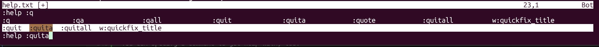
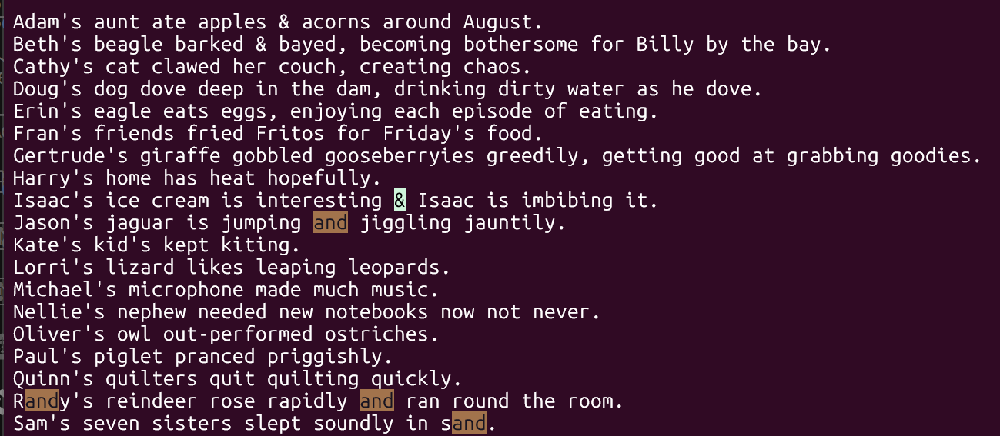
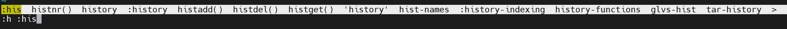

我来为你创建一份不依赖插件的纯vim操作手册，这样你可以在任何vim环境中使用。


[4 tools called]

我已经为你创建了完整的vim原生操作手册，不依赖任何插件。这些文档包括：

## 📚 创建的文档

1. **`vim-native-guide.md`** - 完整的vim原生操作手册
2. **`vim-quick-reference.md`** - 快速参考手册
3. **`vim-workflow-examples.md`** - 实际工作流示例

## 🎯 针对你的3个文件项目

### 立即开始使用
```bash
cd /mnt/e/udemy/docker-kubernetes-the-practical-guide/first-demo-starting-setup/first-demo-starting-setup
vim .
```

### 在vim中的操作
```
:Ex                    # 打开文件浏览器
# 选择 app.mjs 按 Enter
:tabe helpers.mjs      # 新标签页打开 helpers.mjs
:tabe package.json     # 新标签页打开 package.json
gt                     # 切换标签页
```

## 🚀 最常用的命令

| 操作 | 命令 | 说明 |
|------|------|------|
| 文件浏览器 | `:Ex` | 浏览文件 |
| 新标签页 | `:tabe filename` | 新标签页打开文件 |
| 切换标签页 | `gt` / `gT` | 下一个/上一个标签页 |
| 切换文件 | `:b filename` | 切换到指定文件 |
| 查看文件 | `:ls` | 所有打开的文件 |
| 保存 | `:w` | 保存当前文件 |
| 保存所有 | `:wa` | 保存所有文件 |
| 退出 | `:q` | 退出 |

## 💡 关键优势

1. **无需插件** - 使用vim原生功能
2. **通用性强** - 在任何vim环境中都能使用
3. **学习成本低** - 只需要记住几个核心命令
4. **高效编辑** - 像VSCode一样处理多文件

现在你可以使用这些原生vim命令来高效地编辑你的3个文件项目了！记住最常用的几个命令：`:Ex`、`:tabe`、`gt/gT`、`:b`、`:w`、`:q`。

## how do I set the keymaping for ctrl+w in vsp or sp to change window, or is there a way to change the keymapping for edge browser cause ctrl + w is close the tab

I understand your issue! You want to use `Ctrl+w` for Vim window navigation (like `:vsp` and `:sp`), but `Ctrl+w` closes tabs in Edge browser. Let me help you with both solutions:


[1 tool called]

## Solution 1: Configure Vim Window Navigation

### Add to your `~/.vimrc`:

```vim
" Window navigation mappings
" Use Ctrl+w for window operations
nnoremap <C-w>h <C-w>h    " Move to left window
nnoremap <C-w>j <C-w>j    " Move to window below
nnoremap <C-w>k <C-w>k    " Move to window above
nnoremap <C-w>l <C-w>l    " Move to right window

" Window splitting
nnoremap <C-w>v <C-w>v    " Vertical split
nnoremap <C-w>s <C-w>s    " Horizontal split
nnoremap <C-w>n <C-w>n    " New window

" Window resizing
nnoremap <C-w>+ <C-w>+    " Increase window height
nnoremap <C-w>- <C-w>-    " Decrease window height
nnoremap <C-w>> <C-w>>    " Increase window width
nnoremap <C-w>< <C-w><    " Decrease window width

" Window closing
nnoremap <C-w>c <C-w>c    " Close current window
nnoremap <C-w>o <C-w>o    " Close other windows

" Alternative: Use Ctrl+Shift+w for window operations
" nnoremap <C-S-w>h <C-w>h
" nnoremap <C-S-w>j <C-w>j
" nnoremap <C-S-w>k <C-w>k
" nnoremap <C-S-w>l <C-w>l
" nnoremap <C-S-w>v <C-w>v
" nnoremap <C-S-w>s <C-w>s
```

## Solution 2: Change Edge Browser Keymapping

### Option A: Use Edge Extensions

1. **Install a keymapping extension**:
   - Go to Edge Extensions Store
   - Search for "Vimium" or "Vimium C" - provides Vim-like navigation
   - Or search for "Keyboard Shortcuts" extensions

2. **Vimium C** (Recommended):
   - Provides Vim-like navigation
   - `Ctrl+w` becomes `w` for closing tabs
   - `Ctrl+w` becomes `W` for closing all tabs to the right

### Option B: Edge Built-in Settings

1. **Open Edge Settings**:
   - Go to `edge://settings/`
   - Search for "keyboard shortcuts"

2. **Customize Shortcuts**:
   - Look for "Close tab" shortcut
   - Change from `Ctrl+w` to something else like:
     - `Ctrl+Shift+w`
     - `Ctrl+q`
     - `Alt+w`

### Option C: Use Edge Flags (Advanced)

1. **Open Edge with flags**:
   ```bash
   # Windows
   msedge.exe --disable-features=KeyboardShortcutCuts
   
   # Or add to Edge shortcut target:
   "C:\Program Files (x86)\Microsoft\Edge\Application\msedge.exe" --disable-features=KeyboardShortcutCuts
   ```

## Solution 3: Alternative Vim Mappings

If you want to avoid `Ctrl+w` conflicts entirely:

```vim
" Use Ctrl+Shift+w for window operations
nnoremap <C-S-w>h <C-w>h
nnoremap <C-S-w>j <C-w>j
nnoremap <C-S-w>k <C-w>k
nnoremap <C-S-w>l <C-w>l
nnoremap <C-S-w>v <C-w>v
nnoremap <C-S-w>s <C-w>s
nnoremap <C-S-w>c <C-w>c
nnoremap <C-S-w>o <C-w>o

" Or use Alt+w
nnoremap <A-w>h <C-w>h
nnoremap <A-w>j <C-w>j
nnoremap <A-w>k <C-w>k
nnoremap <A-w>l <C-w>l
nnoremap <A-w>v <C-w>v
nnoremap <A-w>s <C-w>s
```

## Solution 4: Complete Vim Configuration

Here's a complete `~/.vimrc` setup:

```vim
" Basic settings
set number
set relativenumber
set tabstop=4
set shiftwidth=4
set expandtab
set autoindent
set smartindent

" Your existing mapping
inoremap <C-j> <Esc>

" Window navigation (Ctrl+w)
nnoremap <C-w>h <C-w>h
nnoremap <C-w>j <C-w>j
nnoremap <C-w>k <C-w>k
nnoremap <C-w>l <C-w>l
nnoremap <C-w>v <C-w>v
nnoremap <C-w>s <C-w>s
nnoremap <C-w>c <C-w>c
nnoremap <C-w>o <C-w>o

" Window resizing
nnoremap <C-w>+ <C-w>+
nnoremap <C-w>- <C-w>-
nnoremap <C-w>> <C-w>>
nnoremap <C-w>< <C-w><

" Quick window switching
nnoremap <C-w><C-w> <C-w>w
nnoremap <C-w><C-p> <C-w>p
```

## Recommendation

I recommend **Solution 1 + Option B**:
1. Keep `Ctrl+w` for Vim window navigation
2. Change Edge's "Close tab" shortcut to `Ctrl+Shift+w` or `Alt+w`

This way you get the best of both worlds without conflicts!


[1 tool called]


## nnoremap vs inoremap
在 Vim 或 Neovim 中，`nnoremap` 和 `inoremap` 都是用于定义键盘映射（Key Mapping）的命令，但它们的作用范围和行为有所不同。以下是两者的详细对比：

---

### **1. `nnoremap`**
- **作用模式**：仅在 **普通模式（Normal Mode）** 下生效。
- **递归行为**：`nnoremap` 是 **非递归映射**，即映射后的按键不会再次触发其他映射。
- **语法**：
  ```vim
  nnoremap <新按键> <执行的操作>
  ```
- **示例**：
  ```vim
  nnoremap <Leader>w :w<CR>
  ```
  - 解释：在普通模式下按下 `<Leader>w` 时，执行保存文件的操作（`:w<CR>`），且不会递归触发其他映射。

- **用途**：
  - 定义普通模式下的快捷键，避免与其他映射冲突。

---

### **2. `inoremap`**
- **作用模式**：仅在 **插入模式（Insert Mode）** 下生效。
- **递归行为**：`inoremap` 是 **非递归映射**，即映射后的按键不会再次触发其他映射。
- **语法**：
  ```vim
  inoremap <新按键> <执行的操作>
  ```
- **示例**：
  ```vim
  inoremap jk <Esc>
  ```
  - 解释：在插入模式下按下 `jk` 时，退出插入模式（等效于按下 `<Esc>`），且不会递归触发其他映射。

- **用途**：
  - 定义插入模式下的快捷键，提升编辑效率。

---

### **关键区别**
| 命令       | 作用模式       | 递归行为   | 典型用途                     |
|------------|----------------|------------|------------------------------|
| `nnoremap` | 普通模式       | 非递归     | 定义普通模式下的快捷键       |
| `inoremap` | 插入模式       | 非递归     | 定义插入模式下的快捷键       |

---

### **递归与非递归映射**
- **递归映射**（如 `nmap` 或 `imap`）：
  - 映射后的按键可能会再次触发其他映射，容易导致意外行为。
  - 示例：
    ```vim
    nmap x dd
    nmap dx x
    ```
    - 按下 `dx` 时，会先触发 `dx` 映射为 `x`，然后 `x` 又映射为 `dd`，最终删除两行。

- **非递归映射**（如 `nnoremap` 或 `inoremap`）：
  - 映射后的按键不会触发其他映射，行为更可控。
  - 推荐始终使用非递归映射，除非有特殊需求。

---

### **总结**
- **`nnoremap`**：用于普通模式，定义非递归快捷键。
- **`inoremap`**：用于插入模式，定义非递归快捷键。
- **最佳实践**：优先使用非递归映射（`nnoremap` 和 `inoremap`），避免递归映射带来的副作用。


##  vim 中如何快速移动光标，除了hjkl  
在 Vim 中，除了使用 `h`（左）、`j`（下）、`k`（上）、`l`（右）移动光标外，还有许多更高效的移动方式。以下是一些常用的快速移动光标的技巧：

---

### **1. 单词级移动**
- **`w`**：移动到下一个单词的开头。
- **`b`**：移动到上一个单词的开头。
- **`e`**：移动到当前单词的末尾。
- **`ge`**：移动到上一个单词的末尾。

---

### **2. 行内快速移动**
- **`0`**（数字零）：移动到行首。
- **`^`**：移动到行首第一个非空白字符。
- **`$`**：移动到行尾。
- **`f{char}`**：移动到当前行下一个 `{char}` 字符（例如 `fa` 移动到下一个 `a`）。
- **`F{char}`**：反向移动到上一个 `{char}` 字符。
- **`t{char}`**：移动到 `{char}` 的前一个字符。
- **`T{char}`**：反向移动到 `{char}` 的后一个字符。

---

### **3. 跨行移动**
- **`gg`**：移动到文件第一行。
- **`G`**：移动到文件最后一行。
- **`:{number}`**：跳转到指定行号（例如 `:10` 跳转到第 10 行）。
- **`H`**：移动到屏幕顶部（High）。
- **`M`**：移动到屏幕中间（Middle）。
- **`L`**：移动到屏幕底部（Low）。

---

### **4. 段落和区块移动**
- **`{`**：移动到上一个空行（段落开头）。
- **`}`**：移动到下一个空行（段落结尾）。
- **`%`**：在匹配的括号之间跳转（例如 `()`、`[]`、`{}`）。

---

### **5. 搜索移动**
- **`/{pattern}`**：向下搜索 `{pattern}`，按 `n` 跳转到下一个匹配项，`N` 跳转到上一个。
- **`?{pattern}`**：向上搜索 `{pattern}`。
- **`*`**：搜索当前光标下的单词（向下）。
- **`#`**：搜索当前光标下的单词（向上）。

---

### **6. 标记跳转**
- **`m{a-z}`**：设置标记（例如 `ma` 将当前位置标记为 `a`）。
- **`` `{a-z}``**：跳转到标记位置（例如 `` `a`` 跳转到标记 `a`）。
- **`` `.``**：跳转到最后修改的位置。
- **`` `"``**：跳转到最后离开文件时的位置。

---

### **7. 其他高效移动**
- **`Ctrl + d`**：向下滚动半屏。
- **`Ctrl + u`**：向上滚动半屏。
- **`Ctrl + f`**：向下滚动一屏。
- **`Ctrl + b`**：向上滚动一屏。
- **`zz`**：将当前行居中显示。

---

### **8. 结合数字**
- 几乎所有移动命令都可以结合数字使用，例如：
  - `5j`：向下移动 5 行。
  - `3w`：向后移动 3 个单词。
  - `2}`：向下移动 2 个段落。

---

### **总结**
Vim 的光标移动方式非常丰富，熟练掌握这些技巧可以大幅提升编辑效率。建议从简单的单词级移动（`w`、`b`）和行内移动（`0`、`$`）开始练习，逐步掌握更高级的跳转方式。


## 如何快速复制28到32行的内容
在 Vim 中快速复制 28 到 32 行的内容，可以使用以下方法：

---

### **方法 1：使用行号范围**
1. **进入命令模式**：按 `Esc` 确保处于普通模式。
2. **输入复制命令**：
   ```vim
   :28,32y
   ```
   - `28,32` 表示从第 28 行到第 32 行。
   - `y` 是复制（yank）命令。
3. **粘贴内容**：
   - 移动光标到目标位置，按 `p`（粘贴到光标后）或 `P`（粘贴到光标前）。

---

### **方法 2：可视化模式**
1. **进入可视化模式**：
   - 按 `Esc` 确保处于普通模式。
   - 输入 `:28` 跳转到第 28 行。
   - 按 `V` 进入行可视化模式。
2. **选择行范围**：
   - 按 `j` 或 `k` 移动光标到第 32 行（或输入 `:32` 直接跳转）。
3. **复制内容**：
   - 按 `y` 复制选中的行。
4. **粘贴内容**：
   - 移动光标到目标位置，按 `p` 或 `P` 粘贴。

---

### **方法 3：结合数字**
- 在普通模式下，输入：
  ```vim
  :28G  # 跳转到第 28 行
  5yy   # 复制从当前行开始的 5 行（28-32 行）
  ```
- 然后按 `p` 或 `P` 粘贴。

---

### **验证复制内容**
- 粘贴后可以通过 `:reg` 查看寄存器中的内容，确保复制成功。

---

### **总结**
- **推荐方法**：直接使用 `:28,32y` 最快捷。
- **灵活选择**：根据场景选择可视化模式或数字结合命令。


## 如何选择reg中的某项
在 Vim 中，可以通过 **寄存器（Register）** 来选择和粘贴内容。以下是操作步骤：

---

### **1. 查看寄存器内容**
在普通模式下输入：
```vim
:reg
```
- 这会列出所有寄存器的内容（如 `"a`、`"b`、`"+` 等）。

---

### **2. 选择特定寄存器**
- **小写字母寄存器**（`a-z`）：覆盖内容。
- **大写字母寄存器**（`A-Z`）：追加内容。
- **其他常用寄存器**：
  - `"+`：系统剪贴板（Windows 的 `Ctrl+C` 内容）。
  - `"*`：X11 剪贴板（Linux 中常用）。
  - `""`：默认寄存器（最近一次复制或删除的内容）。

---

### **3. 粘贴寄存器内容**
在普通模式下：
- **`"{register}p`**：粘贴指定寄存器的内容到光标后。
  - 例如：`"ap` 粘贴寄存器 `a` 的内容。
- **`"{register}P`**：粘贴到光标前。

---

### **4. 示例**
1. **复制内容到寄存器 `a`**：
   - 在普通模式下，选中文本后按 `"ay`（复制到寄存器 `a`）。
2. **粘贴寄存器 `a` 的内容**：
   - 移动光标到目标位置，按 `"ap`。

---

### **5. 特殊场景**
- **从系统剪贴板粘贴**：
  - 按 `"+p`（Windows/Linux 通用）。
- **追加内容到寄存器**：
  - 选中文本后按 `"Ay`，会将内容追加到寄存器 `a`。

---

### **总结**
- **查看寄存器**：`:reg`
- **选择寄存器**：`"{register}`（如 `"a`）。
- **粘贴内容**：`p`（光标后）或 `P`（光标前）。

通过灵活使用寄存器，可以高效管理多段文本的复制粘贴！


### move cursor in a file
:$ 移动到最后一行，在不知道具体行数的情况下
w 移动到下一个单词的开头
b 移动到上一个单词的开头
W 移动到下一个单词的结尾,忽略空格等whitespace
B 移动到上一个单词的结尾

32G|32gg|:32 移动到第32行
z+enter: 把当前的行在整个画面中重置到画面前面，方便阅读
0 移动到行首
^ 移动到本行第一个字母的位置
$ 移动到行尾
ctrl+g 显示当前行数和总行数
```sh
"nav.txt" 74 lines --63%--                                                                    47,1          87%
```
g+ctrl+g 显示更多当前位置信息
```sh
Col 1 of 30; Line 47 of 74; Word 351 of 613; Byte 1868 of 3352                                47,1          87%
```
:set ruler 显示当前位置信息

:set noruler 不显示当前位置信息
:set ruler!   切换当前位置信息的显示和隐藏


### deleting text and thinking in vim
Count operation motion
5       d         w
x 删除当前位置的字符(dl的快捷键)
X 删除当前位置前一个字符(dh的快捷键)
dw 删除当前位置到下一个单词的开头
d$ 删除当前位置到行尾
D 删除当前位置到行尾(d$的快捷键)
d0 删除当前位置到行首
d^ 删除当前位置到本行第一个字母的位置
dd 删除当前行
3dd 删除从当前行往下数3行
dG 删除当前行到最后一行
dgg 删除当前行到第一行
d1G 删除当前行到第一行
. 重复前面的动作
[count]operation[count]{motion}
3w = Repeat word motion 3 times.
d3w = Delete the 3w motion.
2d3w = Delete the 3w motion 2 times.

        "dl"    delete character (alias: "x")           dl
        "diw"   delete inner word                       diw
        "daw"   delete a word                           daw
        "diW"   delete inner WORD (see WORD)            diW
        "daW"   delete a WORD (see WORD)                daW
        "dgn"   delete the next search pattern match    dgn
        "dd"    delete one line                         dd
        "dis"   delete inner sentence                   dis
        "das"   delete a sentence                       das
        "dib"   delete inner '(' ')' block              dib
        "dab"   delete a '(' ')' block                  dab
        "dip"   delete inner paragraph                  dip
        "dap"   delete a paragraph                      dap
        "diB"   delete inner '{' '}' block              diB
        "daB"   delete a '{' '}' block                  daB


### vim help
:help 获取帮助
:help [command] 获取指定命令的帮助, 如:help x 或:help count,:help :q, :help :help
:help [motion] 获取指定移动的帮助, 如:help w
:help [option] 获取指定选项的帮助， 如:help w
:help [text-object] 获取指定文本对象的帮助, 如:help linewise

:help [insert-mode] 获取插入模式的帮助, 如:help i, 
:help [visual-mode] 获取可视化模式的帮助
ctrl+o 回到上次的帮助页面
ctrl+i 回到下次的帮助页面
ctlr+] 跳转到光标所在关键字的帮助页面
ctrl+w, ctrl+w, 或者ctrl+w, j|k 可以切换帮助文档和你目前正在编辑的文档，这样可以便操作边查帮助
ctrl+d, 如果你记不清你要查找的命令是啥，你可以输入那个命令的一部分，然后按ctrl+d, 或者按tab键
:set wildmenu 在你的命令上一行显示状态栏并高亮显示你选择的关键词


Use :help to get help.
to exit out of help, type
:q<ENTER>
You can specify a command to get help with, too.
:help <COMMAND>
For example, if you wanted to know what "dd" does, type:
:help dd<ENTER>
You can also get help on a given subject:
:help {subject}
Example:
:help count
You can even get help with :help.
:help :help<ENTER>
The short version of the :help command is :h
To switch between the help window and the editing window, use CTRL-W CTRL-W


### cut copy and paste
y 复制
p 粘贴在当前行的后面
P 粘贴在当前行的前面
ddp 剪切当前行并粘贴在当前行的后面
ddP 剪切当前行并粘贴在当前行的前面
dwp 剪切当前单词并粘贴在当前行的后面
dwP 剪切当前单词并粘贴在当前行的前面
d$p 剪切当前位置到行尾并粘贴在当前行的后面
d$P 剪切当前位置到行尾并粘贴在当前行的前面
d0p 剪切当前位置到行首并粘贴在当前行的后面
d0P 剪切当前位置到行首并粘贴在当前行的前面
dap 剪切当前段落并粘贴在当前行的后面
dap 剪切当前段落并粘贴在当前行的前面
ywp 复制当前单词并粘贴在当前鼠标位置的后面
y2wp 复制当前鼠标后的两个单词并粘贴在他们的后面
2ywp 复制当前鼠标后的两个单词并粘贴在他们的后面
yyp 复制当前行并粘贴在当前行的后面
yyP 复制当前行并粘贴在当前行的前面
y$p 复制当前位置到行尾并粘贴在当前行的后面
u 撤销
U 撤销对当前行的所有修改
ctrl+r 重做


### registers寄存器

"" unamed register默认寄存器（未命名寄存器）寄存 d(delete) c(change) s(substitude) x(delete) y(yank)操作的文本
"0 numbered register(标号寄存器) 寄存上次复制y(yank)操作后的文本
"1 系统剪贴板(标号寄存器) 寄存上次删除(d)或更改(c)操作后的文本
"2 标号寄存器
"3 标号寄存器
...
"9
"ayy 把当前内容存进a寄存器
"Ayy 把当前内容追加到a寄存器
"ap 把a寄存器的内容粘贴到当前位置
:reg a 查看a寄存器的内容
:echo @a 如果a寄存器的内容一行显示不下，通过这种方法查看a寄存器的内容
:reg a1 查看a寄存器和1号寄存器的内容
```sh
:reg a1
Type Name Content
  l  "1   to the beginning. Move this^J
  l  "a    the works of Eco, a predominant concept is the distinction between opening^JThere are system adminis
Press ENTER or type command to continue
```
:reg 查看所有寄存器的内容

标号寄存器的内容会随着d或c操作而更改，从1号寄存器开始，每次d或c操作都会把前面的寄存器往后面移动,之前1号寄存器现在变成2号，2号变成3号，直到9号寄存器。

:reg
Type Name Content
  l  ""    this entire line.^J
  l  "0   Can you double dupe this, again?^J
  l  "1    this entire line.^J
  l  "2   Can you double dupe this, again?^J
  l  "3   Can you double dupe this?^J
  l  "4   ^J
  l  "5   Can you dupe this?^J
  l  "6   ^J
  l  "7   to the beginning. Move this^J
  l  "8   badcfe^J
  l  "9   fi^J
  c  "-   Duplicate
  c  ".   q<80>kb:<80>kb
  c  ":   q
  c  "%   cutcopypaste.txt
  c  "#   buf-bed.txt
  c  "/   PS

  在 Vim 编辑器中，`:reg` 命令用于显示当前寄存器（registers）中的内容。寄存器是 Vim 中用于临时存储文本的机制，可以用于复制、粘贴、删除等操作。以下是您提供的 `:reg` 输出中 `Type` 和 `Name` 字段的具体含义：

---

### **Type (`l` 和 `c`)**
- **`l` (Linewise Register)**  
  表示寄存器中的内容是按行存储的（即包含换行符 `^J`）。  
  例如：`"0` 中的内容 `Can you double dupe this, again?^J` 是一个完整的行。

- **`c` (Characterwise Register)**  
  表示寄存器中的内容是按字符存储的（不包含换行符）。  
  例如：`"-` 中的内容 `Duplicate` 是一个字符片段。

---

### **Name (寄存器名称)**
寄存器的名称通常由一个字符表示，分为以下几类：

#### **1. 数字寄存器 (`"0` - `"9`)**
- **`"0`**：最近一次复制（`yank`）的内容。
- **`"1` - `"9`**：最近删除（`delete`）或修改（`change`）的内容，按时间顺序存储。  
  - `"1` 是最近一次删除的内容，`"2` 是上一次删除的内容，以此类推。

#### **2. 命名寄存器 (`"a` - `"z`)**
- 用户可以通过 `"a` - `"z` 手动存储内容。  
  例如：`"ayy` 会将当前行复制到寄存器 `a` 中。

#### **3. 特殊寄存器**
- **`"-`**：存储最近一次删除的小于一行（字符级）的内容。
- **`".`**：存储最近一次插入的文本。
- **`":`**：存储最近一次执行的命令（如 `:w`）。
- **`"%`**：存储当前文件名。
- **`"#`**：存储上一个文件名（alternate file）。
- **`"/`**：存储最近一次搜索的关键字。

---

### **示例解释**
以您的输出为例：
- **`"0`**：内容是 `Can you double dupe this, again?^J`，表示最近一次复制的内容。
- **`"1`**：内容是 `this entire line.^J`，表示最近一次删除的完整行。
- **`"-`**：内容是 `Duplicate`，表示最近一次删除的字符片段。
- **`":"`**：内容是 `q`，表示最近执行的命令是 `:q`（退出 Vim）。

---

### **总结**
- **`Type`** 表示内容的存储方式（按行或按字符）。
- **`Name`** 表示寄存器的用途（如复制、删除、文件名等）。
- 寄存器的内容可以通过 `"<name>p` 粘贴到编辑器中。例如：`"0p` 会粘贴最近复制的内容。

如果需要进一步操作或解释，请告诉我！

### 黑洞寄存器是什么
在 Vim 编辑器中，**黑洞寄存器**（Black Hole Register）是一个特殊的寄存器，用于“丢弃”文本内容，而不会将其存储到任何其他寄存器中。它的名称是 `"_`（下划线）。

---

### **黑洞寄存器的特点**
1. **不保存内容**  
   任何被删除或修改的文本，如果指定了黑洞寄存器（例如 `"_d`），这些内容将不会被保存到任何寄存器中，也无法通过粘贴操作恢复。

2. **不影响其他寄存器**  
   默认情况下，Vim 会将删除或修改的文本存储到 `"1`、`"2` 等数字寄存器中。使用黑洞寄存器可以避免这些寄存器被覆盖。

3. **常用于清理操作**  
   当你希望删除某些文本且不需要保留它们时，可以使用黑洞寄存器来确保这些内容不会干扰其他寄存器的内容。

---

### **使用示例**
1. **删除当前行并丢弃内容**  
   ```vim
   "_dd
   ```
   - 这会将当前行删除，但不会将内容保存到任何寄存器中。

2. **删除选中文本并丢弃内容**  
   ```vim
   v（进入可视模式，选中文本）
   "_d
   ```
   - 选中的文本会被删除，且不会存储到寄存器中。

3. **避免覆盖默认寄存器**  
   如果你希望删除某些内容，但不想影响 `""`（无名寄存器）或 `"1` - `"9` 的内容，可以使用黑洞寄存器：
   ```vim
   "_diw  " 删除当前单词并丢弃
   ```

---

### **与其他寄存器的对比**
| 寄存器 | 名称       | 用途                               |
|--------|------------|-----------------------------------|
| `"_`   | 黑洞寄存器 | 丢弃内容，不保存到任何寄存器       |
| `""`   | 无名寄存器 | 默认存储最近一次复制或删除的内容   |
| `"1`   | 数字寄存器 | 存储最近一次删除或修改的内容       |

---

### **适用场景**
- 清理不需要的文本，避免占用寄存器空间。
- 在执行批量删除操作时，防止覆盖重要的寄存器内容。

如果需要进一步操作或解释，请告诉我！

在 Vim 编辑器中，**特殊寄存器**中确实有一些寄存器专门用于存储字符级（characterwise）的内容，而不是整行（linewise）的内容。以下是这些寄存器的具体意义和用途：

---

### **存储字符级内容的特殊寄存器**
1. **`"-`（小删除寄存器）**  
   - **用途**：存储最近一次删除的字符级内容（即删除的内容不足一行，例如 `dw`、`diw` 等操作）。  
   - **特点**：  
     - 如果删除的内容包含换行符（例如 `dd` 删除整行），则不会存储到 `"-` 中。  
     - 适用于小范围删除操作。  
   - **示例**：  
     ```vim
     "删除一个单词并查看寄存器
     diw
     :reg "-
     ```

2. **`.`（插入寄存器）**  
   - **用途**：存储最近一次插入模式（Insert Mode）下输入的文本（字符级内容）。  
   - **特点**：  
     - 仅记录插入的文本，不包括命令或操作。  
     - 适用于快速重复插入内容。  
   - **示例**：  
     ```vim
     "插入 'Hello' 后查看寄存器
     iHello<Esc>
     :reg .
     ```

3. **`/`（搜索寄存器）**  
   - **用途**：存储最近一次搜索的关键字（字符级内容）。  
   - **特点**：  
     - 适用于快速重复搜索或修改搜索内容。  
   - **示例**：  
     ```vim
     "搜索 'example' 后查看寄存器
     /example<Enter>
     :reg /
     ```

4. **`_`（黑洞寄存器）**  
   - **用途**：显式丢弃字符级内容（不存储到任何寄存器）。  
   - **特点**：  
     - 常用于清理操作，避免污染其他寄存器。  
   - **示例**：  
     ```vim
     "删除一个单词并丢弃内容
     "_diw
     ```

---

### **与行级寄存器的区别**
| 寄存器类型 | 存储内容范围       | 典型操作示例       |
|------------|--------------------|--------------------|
| 字符级     | 不足一行的文本     | `dw`, `diw`, `i`  |
| 行级       | 整行（含换行符）   | `dd`, `yy`, `:d`  |

---

### **为什么需要字符级寄存器？**
1. **精确控制**：  
   字符级寄存器允许用户精确操作小范围文本，而不会影响整行内容。
2. **避免污染**：  
   例如，使用 `"-` 可以避免小删除操作覆盖 `""`（无名寄存器）或 `"1`（数字寄存器）中的内容。
3. **快速复用**：  
   插入寄存器 `.` 和搜索寄存器 `/` 可以快速复用最近输入的文本或搜索关键字。

---

### **总结**
- **字符级寄存器**（如 `"-`、`.`、`/`）专注于存储小范围文本或操作记录，适合精细化的编辑需求。  
- **行级寄存器**（如 `""`、`"1`）更适合处理整行操作。  
- 通过合理使用这些寄存器，可以显著提升 Vim 的编辑效率。

如果需要进一步操作或示例，请告诉我！


## :reg a 寄存器a的内容太长无法显示完全，该怎么处理
在 Vim 中，如果寄存器 `"a` 的内容过长导致无法在 `:reg a` 命令中完全显示，可以通过以下方法查看或处理这些内容：

---

### **方法 1：分页查看寄存器内容**
使用 `:echo` 命令直接输出寄存器的内容，Vim 会自动分页显示：
```vim
:echo @a
```
- 按 `Enter` 逐行查看。
- 按 `q` 退出分页模式。

---

### **方法 2：将寄存器内容写入文件**
将寄存器 `"a` 的内容保存到一个临时文件中，然后用其他工具（如 `less` 或文本编辑器）查看：
```vim
:put a > /tmp/register_a.txt
```
- 在 Windows 系统中，路径可以改为 `C:\Temp\register_a.txt`。
- 使用外部工具打开文件查看完整内容。

---

### **方法 3：粘贴到缓冲区**
将寄存器 `"a` 的内容粘贴到当前缓冲区中，然后直接查看或编辑：
```vim
"ap
```
- 如果内容过长，可以按 `Ctrl + F` 或 `Ctrl + B` 翻页查看。

---

### **方法 4：限制输出行数**
通过 `:reg` 命令的 `+` 参数限制显示的行数（Vim 8.2+ 支持）：
```vim
:reg a +10  " 只显示前 10 行
```

---

### **方法 5：使用脚本或宏处理**
如果需要对寄存器内容进行复杂操作，可以编写 Vim 脚本或宏：
```vim
" 示例：将寄存器内容分割成多行
let lines = split(@a, '\n')
for line in lines
    echo line
endfor
```

---

### **注意事项**
1. **内容截断**：  
   Vim 的寄存器有大小限制（默认约 10KB），如果内容超过限制会被截断。
2. **避免覆盖**：  
   操作前可以先备份寄存器内容到其他寄存器（如 `:let @b = @a`）。

如果需要进一步帮助，请告诉我！


## Inserting, Changing, Replacing and Joining
I 在行首插入字符
A 在行尾插入字符
o 在当前行下插入新行
O 在当前行上插入新行
r 替换当前字符并回到正常模式
R 替换当前字符（进入替换模式）
c+motion方向(l,w,$) 删除相应字符进入插入模式（进入替换模式），单独输入c没有任何效果，需要结合方向
c$(C) 删除当前字符到行尾并进入插入模式
D 删除当前字符到行尾并进入正常模式
d+motion 删除相应字符并进入正常模式
d$(D) 删除当前字符到行尾并进入正常模式
x 删除当前字符并进入正常模式
C 删除从当前字符到行尾当前行并进入插入模式
S(cc) 不管当前字符在行的哪个位置，删除当前行并进入插入模式
s(cl) 替换当前字符（进入替换模式）与c的区别就是s只能替换当前字符，不能和motion结合
J 合并当前行和下一行,保留空格
```
3.
4159
变成
3.  4159
```
gJ 合并当前行和下一行，不保留空格
```
3.
4159
变成
3.4159
```
~ 切换当前字符大小写
g~w 切换当前单词大小写，比如原来是DOd->doD
guw 把所有的字符变成小写，比如原来是DOd->dod
gUw 把所有字符变成大写，比如原来是DOd->DOD
g~$ 切换当前字符到行尾单词大小写
g~~ 切换当前字符到行尾单词大小写,既大写变小写，小写变大写
gu+enter(guu) 切换当前行大写，不管之前是大写还是小写，都变成小写
g~W 切换当前单词大小写（包括标点符号）
gU+enter(gUU) 切换当前行大写，不管之前是大写还是小写，都变成大写
gUw 切换当前单词大写
gUW 切换当前单词大写（包括标点符号）
80i* 在当前行插入 80 个星号
5o# 在当前行下插入 5 行井号
4o10.11.12 在当前行下插入 4 行 10.11.12


### Search, find and replace
#### linewise search
`f{char}` 向前搜索字符
`F{char}` 向后搜索字符
`t{char}` 向前搜索字符，并停在该字符的前一个字符
`T{char}` 向后搜索字符，并停在该字符的前一个字符
`;` 重复上一次搜索
`,` 反向重复上一次搜索
`df{char}` 删除当前字符到下一个char字符的位置，包含char字符
`dt{char}` 删除当前字符到下一个char字符前面的位置，不包含char字符

```sh
Delete THIS<<--- word.
#dtw 会删除THIS<<--- (当前字符到w字符前面的内容)
#dW 可以做到同样的效果，W表示一个单词，包含w字符
```
#### paragraphwise search
`:set is?` 查看当前的搜索模式, is(incsearch) 表示是否开启搜索模式
`/{pattern}` 向前搜索模式（匹配搜索关键词）
`?{pattern}` 向后搜索模式（匹配搜索关键词）
`n` 重复上一次搜索
`N` 反向重复上一次搜索

use case: 搜索and单词，并逐个替换成&字符
>搜索一个关键词，替换成其他单词，然后按n,再按. 可以逐个替换

`*` 向前搜索光标所在单词（匹配整个单词）注意/是匹配关键词，*是匹配整个单词
`#` 向后搜索光标所在单词（匹配整个单词）注意?是匹配关键词，#是匹配整个单词

use case: 从当前位置，删除所有位置到你搜索到的第一个匹配关键词的位置
>定位到合适位置，按d,然后按/关键词，可以删除当前位置到你搜索到的第一个匹配关键词的位置
:s/old/new 替换当前行第一个匹配的old字符串为new字符串
:s/old/new/g 替换当前行所有匹配的old字符串为new字符串
:1s/old/new/g 替换第一行所有匹配的old字符串为new字符串
:1,5s/old/new/g 替换第一行到第五行所有匹配的old字符串为new字符串
:1,$s/old/new/g 替换第一行到最后一行所有匹配的old字符串为new字符串
:1,.s/old/new/g 替换第一行到当前行所有匹配的old字符串为new字符串
:%s/old/new/g 全局替换
:%s/old/new/gc 全局替换，并询问是否替换

```ini

# Global configuration

DOMAIN=example.net                      # The example.net domain.
MAIL_SERVER=mail.example.net
MAIL_PATH=/var/spool/mail

# Local configuration

LOCAL_DOMAIN=internal.example.net       # The internal.example.net domain.
LOCAL_MAIL_SERVER=mail.internal.example.net
MAIL_PATH=/var/spool/mail
```
:/Global/,/Local/s/net/org/g 全局替换，从Global行开始，到Local行结束，将net替换成org
:/Local/,$s/net/org/g 全局替换，从Local行开始，到最后一行结束，将net替换成org
/字符同时也是linux,unix, mac中的文件夹字符，所以需要escape才能在search中使用，我们可以用其他字符替代，比如#（pound）
:%s#old#new#g 全局替换，将old替换成new

### vim 配置
:set nu 显示行号
:set nonu 不显示行号
:set hlsearch 高亮显示搜索结果
:set nohlsearch 不高亮显示搜索结果
:set incsearch 增量搜索
:set noincsearch 不增量搜索
:set ignorecase 忽略大小写
:set noignorecase 不忽略大小写
:set smartcase 智能大小写
:set nosmartcase 不智能大小写
:set hls 高亮显示搜索结果
:set nohls 不高亮显示搜索结果
:set hlsearch 高亮显示搜索结果
:set nohlsearch 不高亮显示搜索结果
:set incsearch 增量搜索
:set noincsearch 不增量搜索


:%s/{pattern}/{string}/g 全局替换
:%s/{pattern}/{string}/gc 全局替换，并询问是否替换
:%s/{pattern}/{string}/gI 全局替换，忽略大小写
:%s/{pattern}/{string}/gcI 全局替换，忽略大小写，并询问是否替换
:%s/{pattern}/{string}/gcIe 全局替换，忽略大小写，并询问是否替换，

####  incsearch 和 hlsearch的作用
在 Vim 中，`incsearch` 和 `hlsearch` 是两个与搜索功能相关的选项，它们的作用如下：

---

##### **1. `incsearch`（增量搜索）**
- **作用**：  
  在输入搜索模式时，实时高亮显示匹配的文本。  
  例如，输入 `/foo` 时，Vim 会随着你输入字符逐步高亮匹配的内容。

- **特点**：  
  - 提供即时反馈，帮助快速定位目标。  
  - 适合快速确认搜索内容是否正确。  

- **启用/禁用**：  
  ```vim
  :set incsearch   " 启用增量搜索
  :set noincsearch  " 禁用增量搜索
  ```

---

##### **2. `hlsearch`（高亮搜索结果）**
- **作用**：  
  高亮显示所有匹配搜索模式的文本。  
  例如，输入 `/foo` 后，所有匹配 `foo` 的文本都会被高亮。

- **特点**：  
  - 方便查看文件中所有匹配项的位置。  
  - 高亮会持续存在，直到执行新的搜索或手动清除。  

- **启用/禁用**：  
  ```vim
  :set hlsearch   " 启用高亮
  :set nohlsearch " 禁用高亮
  ```

- **清除高亮**：  
  ```vim
  :nohlsearch  " 临时清除高亮（快捷键：:noh）
  ```

---

##### **两者结合使用**
- **典型场景**：  
  - 输入 `/foo` 时，`incsearch` 会实时高亮第一个匹配项。  
  - 按下 `Enter` 确认搜索后，`hlsearch` 会高亮所有匹配项。  

- **配置建议**：  
  通常在 Vim 配置文件中（如 `.vimrc`）默认启用：  
  ```vim
  set incsearch
  set hlsearch
  ```

---

##### **区别总结**
| 选项         | 作用                           | 适用场景                     |
|--------------|-------------------------------|----------------------------|
| `incsearch`  | 实时高亮正在输入的搜索内容       | 快速定位目标                 |
| `hlsearch`   | 高亮所有匹配的搜索结果           | 全局查看匹配项               |

如果需要进一步操作或示例，请告诉我！


### Text Objects and Macro
当你在一个单词的中间，你用dw的时候你只能删除当前位置到单词的结尾的部分，那么如何删除整个单词呢，需要用到Text Object
#### word
dw 删除当前位置到单词的结尾的部分，不包含单词的前部
daw (delete a word) 删除当前单词，包含whitespace(空格等)
diw (delete inner word) 删除当前单词，不包含whitespace(空格等)
ciw (change inner word) 替换当前单词，不包含whitespace(空格等)
caw 替换当前单词，包含whitespace(空格等)
yaw 复制当前单词，包含whitespace(空格等)
yiw 复制当前单词，不包含whitespace(空格等)
#### sentence
das (delete a sentence) 删除当前句子，包含whitespace(空格等)
dis (delete inner sentence) 删除当前句子，不包含whitespace(空格等)
cis 替换当前句子，不包含whitespace(空格等)
cas 替换当前句子，包含whitespace(空格等)
yas 复制当前句子，包含whitespace(空格等)
yis 复制当前句子，不包含whitespace(空格等)


#### paragraph

dap (delete a paragraph) 删除当前段落，包含whitespace(空格等)
dip (delete inner paragraph) 删除当前段落，不包含whitespace(空格等)
cip (change inner paragraph) 替换当前段落，不包含whitespace(空格等)
cap (change a paragraph) 替换当前段落，包含whitespace(空格等)
yap (yank a paragraph) 复制当前段落，包含whitespace(空格等)
yip (yank inner paragraph) 复制当前段落，不包含whitespace(空格等)


#### code block

ci[ 替换当前[]中的内容，不包含[]
ci" 替换当前""中的内容，不包含""
ci' 替换当前''中的内容，不包含''
ci` 替换当前``中的内容，不包含``
ci{ 替换当前{}中的内容，不包含{}
ci} 替换当前}}中的内容，不包含}}
ci< 替换当前<>中的内容，不包含<>
ci> 替换当前>>中的内容，不包含>>  
ca[ 替换当前[]中的内容，包含[]
ca" 替换当前""中的内容，包含""
ca' 替换当前''中的内容，包含''
ca` 替换当前``中的内容，包含``
ca{ 替换当前{}中的内容，包含{}
ca} 替换当前}}中的内容，包含}}
ca< 替换当前<>中的内容，包含<>
ca> 替换当前>>中的内容，包含>>
yi[ 复制当前[]中的内容，不包含[]
yi" 复制当前""中的内容，不包含""
yi' 复制当前''中的内容，不包含''
yi` 复制当前``中的内容，不包含``
yi{ 复制当前{}中的内容，不包含{}
yi} 复制当前}}中的内容，不包含}}
yi< 复制当前<>中的内容，不包含<>
yi> 复制当前>>中的内容，不包含>>
ya[ 复制当前[]中的内容，包含[]
ya" 复制当前""中的内容，包含""
ya' 复制当前''中的内容，包含''
da[ 删除当前[]中的内容，包含[]
da" 删除当前""中的内容，包含""
da' 删除当前''中的内容，包含''
da` 删除当前``中的内容，包含``
da{ 删除当前{}中的内容，包含{}
da} 删除当前}}中的内容，包含}}
da< 删除当前<>中的内容，包含<>
da> 删除当前>>中的内容，包含>>  

cit 替换当前tag中的内容，不包含tag
```html

<p>This is <strong>so, so, very</strong> cool!</p>
<i_made_this_up>There is text here.</i_made_this_up>
```
把光标放到<p>的位置，输入cit，<p></p>所有内容会被删除，并进入插入模式


### Macro 宏
q{register} 开始录制宏，{register}可以是a-z任意字母，q退出宏录制
qa开始录制宏，q退出宏录制

To record a macro, use the q command followed by a regsiter. To stop, type q.
There are no special macro registers. There is only one a register, for example.
To replay the macro use @ followed by the register.
To repeat the most recently executed marco, use @@.

Position the cursor at the beginning of the line with 0.
Perform your edits and/or commands.
Move the cursor to the next line with j.
Stop the recording with q.

#### 用例: 给一段文本的开头添加一个Tips: ，然后重复5次
做法： 
1. 输入qb
2. 按0，把光标放到要添加Tips: 的行的开头
3. 输入i
4. 输入Tips: 
5. 输入Esc
6. 输入j
7. 输入q退出录制
8. @b或者@@重复5次，或者5@b

>
Think big.
Feed and strengthen your mind.
Better to have written a lousy ballet than to have composed no ballet at all.
If you don’t prioritize your life, someone else will.
Without great solitude no serious work is possible.

变成
Tips: Think big.
Tips: Feed and strengthen your mind.
Tips: Better to have written a lousy ballet than to have composed no ballet at all.
Tips: If you don’t prioritize your life, someone else will.
Tips: Without great solitude no serious work is possible.


#### 用例： 把下面这段文本的FIRST NAME: 和LAST NAME: 删除
做法：
1. 输入qc
2. 输入0，把光标放到要删除的行的开头
3. 输入d2W, 删除FIRST NAME: 
4. 输入w，按.重复删除LAST NAME: 
5. 输入j，跳到下一行
5. 输入q退出录制
6. @c或者@@重复5次，或者5@c
>
FIRST NAME: Joseph LAST NAME: Andrews
FIRST NAME: Scott LAST NAME: Young
FIRST NAME: Jessica LAST NAME: Smith
FIRST NAME: Shirley LAST NAME: Landers
FIRST NAME: Pamela LAST NAME: Lewis

变成
Joseph Andrews
Scott Young
Jessica Smith
Shirley Landers
Pamela Lewis


BEFORE: "Montgomery", "(Alabama)" => "usa"
AFTER:  'Montgomery', 'Alabama', 'USA'

"Montgomery", "(Alabama)" => "usa"
"Juneau", "(Alaska)" => "usa"
"Phoenix", "(Arizona)" => "usa"
"Little", "(Arkansas)" => "usa"
"Sacramento", "(California)" => "usa"
"Denver", "(Colorado)" => "usa"
"Hartford", "(Connecticut)" => "usa"
"Dover", "(Delaware)" => "usa"
"Tallahassee", "(Florida)" => "usa"
"Atlanta", "(Georgia)" => "usa"

amazon.com has address:
54.239.17.7

google.com has address:
216.58.192.78

wikipedia.org has address:
208.80.154.224


Remember, macros just replay what's stored in a register.


### Option list

`:help option-list | :h option-list` 查看所有的option list

:options 也可查看所有的options

```ini
:options        :opt[ions]                open a new window to view and set
                                          options, grouped by functionality,
                                          a one line explanation and links to
                                          the help

Short explanation of each option:               option-list
'aleph'           'al'      ASCII code of the letter Aleph (Hebrew)
'allowrevins'     'ari'     allow CTRL-_ in Insert and Command-line mode
'altkeymap'       'akm'     obsolete option for Farsi
'ambiwidth'       'ambw'    what to do with Unicode chars of ambiguous width
'antialias'       'anti'    Mac OS X: use smooth, antialiased fonts
'arabic'          'arab'    for Arabic as a default second language
'arabicshape'     'arshape' do shaping for Arabic characters
'autochdir'       'acd'     change directory to the file in the current window
'autoindent'      'ai'      take indent for new line from previous line
'autoread'        'ar'      autom. read file when changed outside of Vim
'autoshelldir'    'asd'     change directory to the shell's current directory
'autowrite'       'aw'      automatically write file if changed
'autowriteall'    'awa'     as 'autowrite', but works with more commands
'background'      'bg'      "dark" or "light", used for highlight colors
'backspace'       'bs'      how backspace works at start of line
'backup'          'bk'      keep backup file after overwriting a file
'backupcopy'      'bkc'     make backup as a copy, don't rename the file
...
'hidden'          'hid'     don't unload buffer when it is abandoned
'highlight'       'hl'      sets highlighting mode for various occasions
'history'         'hi'      number of command-lines that are remembered
'hkmap'           'hk'      Hebrew keyboard mapping
'hkmapp'          'hkp'     phonetic Hebrew keyboard mapping
'hlsearch'        'hls'     highlight matches with last search pattern
'icon'                      let Vim set the text of the window icon
'iconstring'                string to use for the Vim icon text
'ignorecase'      'ic'      ignore case in search patterns

```

### set .vimrc options

" 注释

set nocompatible          " 关闭兼容模式，启用 Vim 特性
set history=1000          " 设置历史记录为 1000 条
set wildmenu              " 启用模糊匹配, 按tab的时候会在状态栏的上方显示匹配列表，如果没设置wildmenu, 则只在状态栏显示匹配单词


set ruler                 " 显示光标位置
set rulerformat=%<%l:%c%=%p%% " 自定义光标位置显示格式为 行:列 百分比
set scrolloff=5           " 设置滚动时，光标距离屏幕顶部和底部的距离为 5 行
set backupcopy=yes        " 备份文件时，使用复制而不是重命名
set backupdir=~/vim-backup " 备份文件的目录为 ~/vim-backup
set backup                " 启用备份文件
set bex=.bak              " 备份文件的扩展名为 .bak
set lbr                   " 启用换行符显示,单词不会在中间被截断
set ai                    " 自动缩进
set autoindent            " 自动缩进
set si                    " 智能缩进
set smartindent           " 智能缩进
set bg=dark               " 设置背景为深色
set bg=light              " 设置背景为浅色
color slate               " 设置颜色主题为 slate
>可以搜索vim color scheme 查看更多颜色主题，可以在家目录下创建一个文件夹专门放置color scheme，然后在.vimrc中设置，比如/home/soveran/.vim/colors/
set guioptions=Tb         " 设置 GUI 选项为顶部工具栏
set backspace=indent,eol,start " 退格键删除缩进
set undofile              " 启用撤销文件
set undodir=~/vim-undo    " 撤销文件的目录为 ~/vim-undo
set undolevels=1000       " 设置撤销级别为 1000 级
set undoreload=1000       " 设置撤销文件的加载级别为 1000 级
set wildmode=longest,list " 启用模糊匹配，匹配最长的单词，并显示匹配列表
set showcmd               " 显示正在输入的命令
set showmode              " 显示当前模式
set showmatch             " 显示匹配括号
set hlsearch              " 高亮显示搜索结果
set incsearch             " 实时搜索
set ignorecase            " 忽略大小写
set smartcase             " 智能大小写
set smartindent           " 智能缩进
set tabstop=4             " 设置 tab 键的宽度为 4 个空格
set expandtab             " 将 tab 转换为空格
set shiftwidth=4          " 设置缩进宽度为 4 个空格
set softtabstop=4         " 设置软 tab 宽度为 4 个空格
set autoindent            " 自动缩进
set smarttab              " 智能 tab

#### mapping
map KEY KEYSTROKES
map <F2> iSoveran Zhong<CR>123 main street<CR>Anytown Shanghai<Esc> 按下F2键，输入Soveran Zhong 123 main street Anytown Shanghai
map <F3> i<ul><CR><Space><Space><li></li><CR><Esc>0i</ul><Esc>kcit 
按F3后，
插入
<ul>
  <li></li>
</ul>内容后，往上移动一行，进入改变模式，it(inner tag)，光标会在<li></li>之间，然后就可以输入内容
map <F4> <Esc>o<li></li><Esc>cit 
按F4后，
插入
<li></li>内容后，光标会在<li></li>之间，然后就可以输入新的内容

leader key，默认的leader key是\，可以通过let mapleader="," (set leader=)来设置其他键作为leader key，比如set leader=, 
map <leader>w :w!<CR> 通过按\w来保存文件

map <leader>q :q!<CR> 通过按\q来退出vim
>想知道更多的mapping的信息，可以输入:h map来查询
:mkvimrc 生成.vimrc文件
vmap 只在visual mode 下生效
nmap 只在normal mode 下生效
imap 只在insert mode 下生效


vim: set ft=vim : 设置文件类型为vim， ft(file type)
>:h modeline 查看更多关于modeline的信息


### buffer缓冲区
:sp(split) 分割窗口 ctrl+w+s 也可以达到同样效果
:sp buffer.txt 分割窗口，并打开buffer.txt文件
:vsp(vertical split) 垂直分割窗口,ctrl+w+v 也可以达到同样效果
:q 退出当前的buffer，ctrl+w+q 也可以达到同样效果
:qa 退出所有的buffer
:q! 强制退出当前的buffer
:qa! 强制退出所有的buffer
:on(only) 只显示当前的buffer,ctrl+w+o 也可以达到同样效果,只保留当前窗口，关闭其他
ctrl+w,ctrl+w 切换窗口，轮流依次循环切换
ctrl+w,h,j,k,l 切换窗口，方向键切换
为了更快的在窗口移动，我们可以创建mapping
>
map <C-h> <C-w>h
map <C-j> <C-w>j
map <C-k> <C-w>k
map <C-l> <C-w>l
这样只要按ctrl+h就可以切换到左边的窗口，按ctrl+j就可以切换到下面的窗口，按ctrl+k就可以切换到上面的窗口，按ctrl+l就可以切换到右边的窗口
或者
map <leader>h <C-w>h
map <leader>j <C-w>j
map <leader>k <C-w>k
map <leader>l <C-w>l
这样只要按/h就可以切换到左边的窗口，按/j就可以切换到下面的窗口，按/k就可以切换到上面的窗口，按/l就可以切换到右边的窗口
ctrl+w,+ 最大化当前窗口
ctrl+w,- 最小化当前窗口
ctrl+w,= 均衡化所有窗口
ctrl+w,| 垂直分割窗口
ctrl+w,_ 最大化当前窗口，其他窗口最小化
ctrl+w,>  向右增大当前窗口宽度
ctrl+w,<  向左减小当前窗口宽度
ctrl+w,r 轮转所有窗口
ctrl+w,R 反向轮转所有窗口
ctrl+w,H 最大化当前窗口，其他窗口最小化，并将当前窗口移动到左边
ctrl+w,L 最大化当前窗口，其他窗口最小化，并将当前窗口移动到右边
ctrl+w,J 最大化当前窗口，其他窗口最小化，并将当前窗口移动到下边
ctrl+w,K 最大化当前窗口，其他窗口最小化，并将当前窗口移动到上边


:ls
  3      ".vimrc"                       line 1
  4 #    ".bash_history"                line 1
  5 %a   ".bashrc"                      line 1

在 Vim 中，`:ls` 命令用于列出当前打开的缓冲区（buffers），而输出中的符号（如 `#`、`%`、`a` 等）是缓冲区的状态标识。以下是这些符号的具体含义：

---

### **缓冲区状态符号**
1. **`%`**  
   - **含义**：表示当前窗口正在显示的缓冲区。  
   - **示例**：  
     `%a   ".bashrc"` 表示当前窗口正在编辑 `.bashrc` 文件。

2. **`#`**  
   - **含义**：表示“备用缓冲区”（alternate buffer），即最近一次编辑的缓冲区（可以通过 `Ctrl + ^` 快速切换回来）。  
   - **示例**：  
     `#    ".bash_history"` 表示 `.bash_history` 是备用缓冲区。

3. **`a`**  
   - **含义**：表示缓冲区是“活动的”（active），即缓冲区已加载且可编辑。  
   - **示例**：  
     `%a   ".bashrc"` 表示 `.bashrc` 是当前活动的缓冲区。

4. **` `（空格）**  
   - **含义**：表示缓冲区是“非活动的”（inactive），即缓冲区已加载但未显示在任何窗口中。  
   - **示例**：  
     `3      ".vimrc"` 表示 `.vimrc` 是非活动的缓冲区。

5. **`+`**  
   - **含义**：表示缓冲区有未保存的修改。  
   - **示例**：  
     `5 %a+  ".bashrc"` 表示 `.bashrc` 是当前窗口的缓冲区且有未保存的修改。

---

### **其他常见符号**
- **`h`**：表示缓冲区是“隐藏的”（hidden），即缓冲区已加载但未显示在任何窗口中（通过 `:hide` 命令隐藏）。  
- **`=`**：表示缓冲区是“只读的”（read-only）。  
- **`-`**：表示缓冲区不可修改（例如通过 `:view` 命令打开的缓冲区）。

---

### **总结**
| 符号 | 含义                     | 示例说明                     |
|------|--------------------------|----------------------------|
| `%`  | 当前窗口显示的缓冲区       | `%a   ".bashrc"`           |
| `#`  | 备用缓冲区                | `#    ".bash_history"`     |
| `a`  | 活动的缓冲区              | `%a   ".bashrc"`           |
| ` `  | 非活动的缓冲区            | `3      ".vimrc"`          |
| `+`  | 缓冲区有未保存的修改       | `5 %a+  ".bashrc"`         |

---

### **操作示例**
1. **切换到备用缓冲区**：  
   ```vim
   :b#  " 或按 Ctrl + ^
   ```

2. **切换到指定缓冲区**：  
   ```vim
   :b3  " 切换到编号为 3 的缓冲区（.vimrc）
   ```

3. **关闭缓冲区**：  
   ```vim
   :bd  " 关闭当前缓冲区
   ```

如果需要进一步操作或解释，请告诉我！


:bufdo 对所有buffer执行命令，就算没有显示在窗口中，也会执行
:bufdo %s/foo/bar/gc 对所有buffer执行%s/foo/bar/gc命令
:windo 对所有窗口执行命令，只对显示在窗口中的buffer执行
:windo %s/foo/bar/gc 对所有窗口执行%s/foo/bar/gc命令
:tabdo 对所有tab执行命令
:tabdo %s/foo/bar/gc 对所有tab执行%s/foo/bar/gc命令
:tabnew 新建一个tab
:tabnew buffer.txt 新建一个tab，并打开buffer.txt文件
:tabclose 关闭当前的tab
:tabclose 1 关闭第一个tab
:tabclose 2 关闭第二个tab

查询ctrl+w,w的帮助
>:h ^ww，或者:h ctrl-w
vim 的buffer 是vim 的窗口，可以通过:ls 查看所有的buffer
:b 1 切换到第一个buffer
:b 2 切换到第二个buffer
:bn 切换到下一个buffer
:bp 切换到上一个buffer
:bd 删除当前的buffer
:bnext 切换到下一个buffer
:bprevious 切换到上一个buffer
:bdelete 删除当前的buffer
:badd 添加一个buffer
:badd 1 添加一个buffer
:ball 添加所有的buffer
:e *.txt 打开所有的txt文件
:e! 强制打开文件
:Ex 打开文件
:e# 打开上次编辑的文件


### VIM plugin manager
:set packpath 查看所有的plugin manager
:packadd 安装一个plugin，如:packadd vim-fugitive
:packadd plugin-name 安装一个plugin
:packadd! 安装所有的plugin

常用的plugin
nerdtree 文件浏览器
ctrlp 文件搜索

vim-airline 状态栏
vim-airline-themes 状态栏主题
vim-fugitive 版本控制
vim-gitgutter 版本控制

如何安装plugin
cd ~/.vim
mkdir pack
cd pack
mkdir plugins
cd plugins
mkdir start
cd start
git clone https://github.com/vim-airline/vim-airline.git
git clone https://github.com/preservim/nerdtree.git
git cleon https://github.com/ctrlpvim/ctrlpvim.git

to use NERDtree, 输入:NERDTree或者直接打开某个文件夹:NERDTree /var， to get help， 输入?
o 或者enter打开文件
O 大写的o，打开该文件夹的所有子文件夹
X 关闭当前文件夹
q 关闭NERDTree
go 打开文件，并切换到当前文件
t 打开文件，并切换到新tab
T 打开文件，并切换到新tab，并关闭当前tab
/ 搜索文件
? 搜索文件
i 进入插入模式
I 进入插入模式，并切换到根目录
P 打印当前文件的路径
p 打印当前文件的父目录
K 打印当前文件的根目录
m 创建一个mark
M 列出所有的mark
x 删除当前文件
X 删除当前文件的父目录
C 删除当前文件的子目录
cd 切换到当前文件的父目录
cd 切换到当前文件的子目录
u 切换到当前文件的父目录
U 切换到当前文件的根目录
q 关闭NERDTree
ctrl+w,w 切换到下一个NERDTree
ctrl+w,q 关闭当前NERDTree

how to use ctrlp
ctrl + p 打开ctrlp
打开ctrlp后，输入要搜索的文件名，按方向键up选择并enter
打开另一个文件按ctrl+x，可以在水平方向打开2个窗口，按ctrl+v，可以在垂直方向打开2个窗口
:q 退出ctrlp

有些plugin你不怎么用，你可以把他安装在~/.vim/plugins/opt文件夹中，这样可以节省空间
比如tabular 插件git clone https//github.com/godlygeek/tabular.git
你需要输入:packadd tabular 或者(:pa tabular)， 然后:Tab打开这个plugin，你还需要一些表格数据，比如
|dog|cat|goose|
|bunny|owl|turkey|
|goat|horse|frog|

然后你可以按:Tab /| 格式化这些表格数据

| dog   | cat   | goose  |
| bunny | owl   | turkey |
| goat  | horse | frog   |
还可以左对齐右对齐多少空格等，具体查看帮助文档，如:Tab /|/r3


安装easymotion plugin，git clone https://github.com/easymotion/vim-easymotion.git

安装后，按//j， 会在首列出现jump targer，按//k导航到某一行，//w导航到具体的某个单词，具体查看文档
//s 导航到某一个字符

创建另外一个plugin folder, ~/.vim/pack/git-stuff/start
,git clone  https://github.com/tpope/vim-fugitive.git
:Git blame 查看某个文件的blame
:Git log 查看某个文件的log
:Git status 查看某个文件的状态

要删除一个plugin，只要删除他所在的文件夹就可以，要搜索更多的plugin，去vimawesome.com搜索


## vim ctrl +v 被占用，如何设置mapping实现vertical visual mode

在 Vim 中，如果 `Ctrl + V` 被占用（例如被系统或终端占用），你可以通过自定义映射（mapping）来实现垂直选择模式（Vertical Visual Mode）。以下是具体步骤：

---

### **1. 确认 `Ctrl + V` 是否被占用**
- 在终端中，`Ctrl + V` 通常用于粘贴操作（例如在 Windows 终端或某些 Linux 终端中）。
- 在 Vim 中，`Ctrl + V` 默认是垂直选择模式的快捷键。

---

### **2. 自定义映射实现垂直选择**
你可以将其他组合键映射为垂直选择模式。例如，使用 `Ctrl + Q`（因为 `Ctrl + Q` 在大多数终端中未被占用）：

#### **临时映射（当前会话有效）**
在 Vim 的命令模式下输入：
```vim
:nnoremap <C-Q> <C-V>
```
- 这样按下 `Ctrl + Q` 就会进入垂直选择模式。

#### **永久映射（添加到配置文件）**
1. 打开 Vim 的配置文件（如 `~/.vimrc` 或 `_vimrc`）：
   ```bash
   vim ~/.vimrc
   ```
2. 添加以下内容：
   ```vim
   " 将 Ctrl+Q 映射为垂直选择模式
   nnoremap <C-Q> <C-V>
   ```
3. 保存并退出：
   ```vim
   :wq
   ```

---

### **3. 检查终端设置**
如果 `Ctrl + Q` 仍然无效，可能是终端拦截了该组合键。可以尝试以下方法：
- **禁用终端的 `Ctrl + Q` 功能**：在终端设置中取消 `Ctrl + Q` 的绑定。
- **使用其他组合键**：例如 `Ctrl + B` 或 `Ctrl + X`：
  ```vim
  nnoremap <C-B> <C-V>
  ```

---

### **4. 验证映射是否生效**
1. 重新启动 Vim。
2. 按下你设置的组合键（如 `Ctrl + Q`），检查是否能进入垂直选择模式。

---

### **5. 其他替代方案**
如果所有 `Ctrl` 组合键都被占用，可以使用非 `Ctrl` 组合键：
```vim
" 使用 Leader 键（默认为 \）加 v 进入垂直选择模式
nnoremap <Leader>v <C-V>
```
- 按下 `\v` 即可进入垂直选择模式。

---

### **总结**
| 操作               | 命令或配置                     | 说明                          |
|--------------------|-------------------------------|-----------------------------|
| 临时映射           | `:nnoremap <C-Q> <C-V>`       | 当前会话有效                 |
| 永久映射           | 添加到 `~/.vimrc`             | 重启后生效                   |
| 检查终端拦截       | 调整终端设置                  | 确保组合键未被占用           |
| 使用 Leader 键     | `nnoremap <Leader>v <C-V>`    | 替代方案（如 `\v`）          |

如果需要进一步帮助，请告诉我！

## 如何退出visual mode
在 Vim 中，退出 **Visual Mode**（包括普通 Visual Mode、行选择模式 `V` 和块选择模式 `Ctrl + V`）有以下几种方式：

---

### **1. 通用方法**
- **按下 `Esc` 键**：  
  这是最直接的方式，按下 `Esc` 键即可退出 Visual Mode，回到 Normal Mode。

- **按下 `Ctrl + C`**：  
  在某些终端或配置中，`Ctrl + C` 也可以退出 Visual Mode（但注意它可能会中断某些操作）。

---

### **2. 其他方式**
- **执行命令**：  
  在 Visual Mode 下输入 `:` 进入命令模式，然后直接按 `Enter` 退出（不执行任何命令）。

- **使用鼠标**：  
  如果启用了鼠标支持（`:set mouse=a`），点击屏幕其他位置可能会退出 Visual Mode。

---

### **3. 验证是否退出**
退出后，Vim 底部状态栏的 `-- VISUAL --`、`-- VISUAL LINE --` 或 `-- VISUAL BLOCK --` 提示会消失，表示已回到 Normal Mode。

---

### **总结**
| 操作               | 说明                          |
|--------------------|-----------------------------|
| `Esc`              | 最通用的退出方式              |
| `Ctrl + C`         | 替代方式（可能中断操作）      |
| `:` + `Enter`      | 通过命令模式退出              |
| 鼠标点击           | 需启用鼠标支持                |

如果需要进一步帮助，请告诉我！