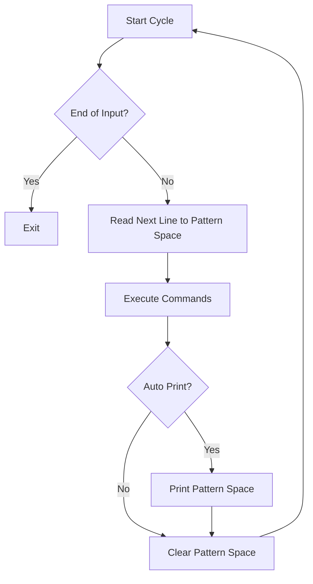
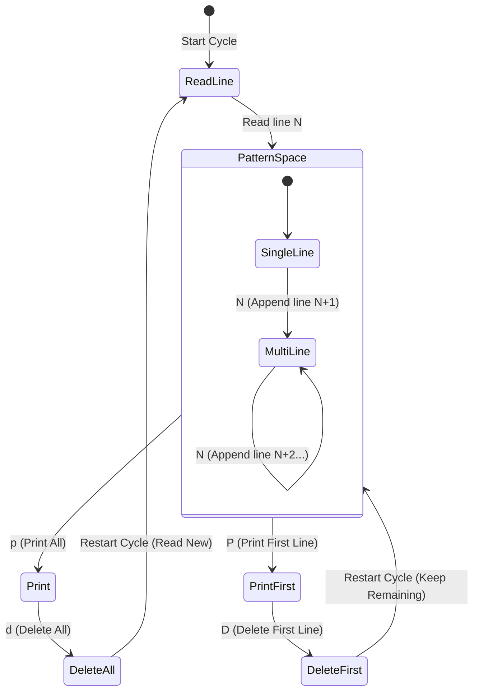

# Linux sed命令完全指南：流式文本编辑的艺术

## 1. 情境 (Situation)
作为 SRE 或运维工程师，文本处理是我们日常工作中不可或缺的一部分。我们经常需要处理日志文件、配置文件，或者从命令输出中提取关键信息。

## 2. 冲突 (Conflict)
手动编辑文件（如使用 `vim`）在处理单个文件时很有效，但在面对自动化任务、大批量文件修改或管道流处理时显得力不从心。简单的工具如 `grep` 只能查找不能修改，而编写 Python 脚本对于简单的文本替换又显得过于厚重。

## 3. 问题 (Question)
有没有一种工具，既能像管道一样高效处理数据流，又能像编辑器一样灵活修改文本，并且无需交互即可完成复杂的编辑任务？

## 4. 答案 (Answer)
**`sed` (Stream EDitor)** 正是为此而生。它是一个非交互式的流式文本编辑器，能够高效地对文本进行过滤、替换、删除和转换。本文将带你深入理解 `sed` 的工作原理，通过可视化的方式掌握其核心概念，并提供生产环境的实战案例。

## 1. 命令概述

`sed`（Stream EDitor）是一种流式文本编辑器，它通过在内存中创建一个模式空间（pattern space），逐行读取文件内容并进行处理。这种设计使得`sed`能够高效地处理大型文件，而不会占用过多内存。

### 1.1 工作原理

`sed` 的工作流程是一个循环的过程，可以用下图表示：



1. `sed`在内存中创建一个模式空间（pattern space）
2. 逐行读取输入文件（或标准输入）的内容到模式空间
3. 对模式空间中的内容执行用户指定的命令
4. 默认将处理后的内容输出到标准输出
5. 清空模式空间，准备读取下一行

### 1.2 基本语法

```bash
sed [参数] '<匹配条件> [动作]' [文件名]
```

**重要说明：**
- 匹配条件和动作需要用单引号包裹
- 多个动作可以在同一个单引号内，用分号分隔，如 `'2p;4p'`
- 当不指定文件名时，`sed`会从标准输入读取内容

### 1.3 准备测试数据

在开始学习`sed`命令之前，让我们创建一些测试数据文件，以便后续示例使用：

```bash
# 创建基本的测试文件
cat > sed_test.txt << 'EOF'
ihao sed1 sed2 sed3
ihao sed4 sed5 sed6
ihao sed7 sed8 sed9
EOF

# 创建配置文件测试数据
cat > config_test.conf << 'EOF'
# 这是一个配置文件示例
# 下面是主要配置项

# 数据库配置
db_host = localhost
db_port = 3306
db_user = admin
db_password = secret123

# 服务器配置
server_port = 8000
server_timeout = 300

# 日志配置
log_level = info
log_file = /var/log/app.log
EOF

# 创建简单的nginx配置示例
cat > nginx_sample.conf << 'EOF'
#user  nobody;
worker_processes  1;

events {
    worker_connections  1024;
}

http {
    sendfile        on;
    keepalive_timeout  65;

    server {
        listen       8000;
        server_name  localhost;

        location / {
            root   html;
            index  index.html index.htm;
        }
    }
}
EOF

# 创建一个操作脚本文件
cat > sed_commands.txt << 'EOF'
1p
3p
EOF
```

## 2. 常用参数详解

`sed`命令支持多种参数，这些参数可以控制`sed`的行为方式：

| 参数 | 描述 |
|------|------|
| `-n`, `--quiet`, `--silent` | 取消自动打印模式空间内容，只显示经过特殊处理（如`p`命令）的行 |
| `-e 脚本`, `--expression=脚本` | 添加脚本到程序的运行列表，允许在同一命令行中指定多个编辑命令 |
| `-f 脚本文件`, `--file=脚本文件` | 从指定文件读取编辑命令 |
| `-r`, `-E`, `--regexp-extended` | 支持使用扩展正则表达式 |
| `-i[扩展名]`, `--in-place[=扩展名]` | 直接修改文件内容，并可选择创建备份（如`-i.bak`） |
| `--debug` | 对程序运行进行标注，显示详细的处理过程 |
| `--follow-symlinks` | 直接修改文件时跟随软链接 |
| `-c`, `--copy` | 在`-i`模式中使用复制而不是重命名来处理文件 |
| `-b`, `--binary` | 二进制模式，不特殊处理CR+LF（主要用于Windows/Cygwin兼容性） |
| `-l N`, `--line-length=N` | 指定`l`命令的换行期望长度 |
| `--posix` | 关闭所有GNU扩展，确保符合POSIX标准 |
| `-s`, `--separate` | 将输入文件视为各个独立的文件而不是单个长的连续输入流 |
| `--sandbox` | 在沙盒模式中进行操作（禁用e/r/w命令） |
| `-u`, `--unbuffered` | 从输入文件读取最少的数据，更频繁地刷新输出 |
| `-z`, `--null-data` | 使用NUL字符分隔各行 |

**注意事项：**
- 在macOS的bash中使用`-i`参数时，必须在后面单独加上一个空字符串：`-i ''`
- 参数组合使用时，`-i`和`-r`可以组合为`-ri`，但不可以写作`-ir`
- `ni`是一个危险的选项组合，可能会清空文件内容
- 对于可移植性，建议使用`-E`而不是`-r`来启用扩展正则表达式（POSIX标准）

## 3. 匹配条件

`sed`支持多种匹配条件，用于指定要操作的行：

### 3.1 基于行号的匹配

- `空`：表示所有行
- `n`：表示第n行
- `$`：表示最后一行
- `n,m`：表示第n到m行
- `n,+m`：表示第n行到第n+m行
- `first~step`：步进语法，表示从第first行开始，每隔step-1行匹配一次
  - `1~2`：表示奇数行（从第1行开始，每隔1行匹配一次）
  - `2~2`：表示偶数行（从第2行开始，每隔1行匹配一次）

### 3.2 基于内容的匹配

- `'/关键字/'`：匹配包含关键字的行
- `'/关键字1/,/关键字2/'`：匹配从包含关键字1的行到包含关键字2的行
- `'n,/关键字/'`：匹配从第n行到包含关键字的行
- `'/关键字/,n'`：匹配从包含关键字的行到第n行
- `'/关键字/,+m'`：匹配从包含关键字的行到其后m行

**注意：**
- 分隔符号`/`可以替换为`@`、`#`、`!`等符号，当关键字中包含分隔符号时特别有用
- 可以使用`!`符号对匹配条件取反，如`'2!p'`表示打印除第2行外的所有行

## 4. 常用动作

`sed`支持多种动作，可以对匹配到的行执行不同的操作：

| 动作 | 描述 |
|------|------|
| `p` | 打印模式空间中的内容 |
| `P` | 打印当前模式空间中直到第一个嵌入换行符的部分 |
| `d` | 删除模式空间中的内容，开始下一个周期 |
| `D` | 如果模式空间不包含换行符，则开始新周期；否则删除模式空间中直到第一个换行符的文本，重启周期不读取新行 |
| `s/原内容/替换内容/` | 替换模式空间中的内容 |
| `a\text` | 在匹配行后追加文本 |
| `i\text` | 在匹配行前插入文本 |
| `c\text` | 替换整个匹配行为新文本 |
| `r file` | 读取指定文件的内容到匹配行后 |
| `R file` | 从文件中读取一行并追加（GNU扩展） |
| `w file` | 将模式空间中的内容写入指定文件 |
| `W file` | 将模式空间的第一行写入指定文件（GNU扩展） |
| `x` | 交换模式空间和保持空间的内容 |
| `=` | 打印当前行的行号 |
| `l` | 以"视觉上明确"的形式列出当前行 |
| `l width` | 以"视觉上明确"的形式列出当前行，在指定宽度处换行（GNU扩展） |
| `n` | 读取下一行到模式空间 |
| `N` | 读取下一行并追加到模式空间 |
| `h` | 将模式空间复制到保持空间 |
| `H` | 将模式空间追加到保持空间 |
| `g` | 将保持空间复制到模式空间 |
| `G` | 将保持空间追加到模式空间 |
| `y/字符集1/字符集2/` | 字符转换，将字符集1中的每个字符替换为字符集2中对应的字符 |
| `b [label]` | 跳转到标签；如果省略标签，跳到脚本末尾 |
| `t [label]` | 如果自上次读取输入行和上次t或T命令以来s///命令成功替换，则跳转到标签 |
| `T [label]` | 如果自上次读取输入行和上次t或T命令以来s///命令未成功替换，则跳转到标签（GNU扩展） |
| `q [exit-code]` | 立即退出sed脚本，不再处理更多输入，但如果自动打印未禁用则打印当前模式空间 |
| `Q [exit-code]` | 立即退出sed脚本，不再处理更多输入（GNU扩展） |

## 5. 打印操作

打印是`sed`最基本的操作之一，可以用来查看文件的特定部分。

### 5.1 基本打印

```bash
# 打印第2行（默认也会输出所有行）
sed '2p' sed_test.txt

# 只打印第2行（使用-n参数抑制默认输出）
sed -n '2p' sed_test.txt

# 打印第1行和第3行
sed -n '1p;3p' sed_test.txt

# 打印包含sed4的行
sed -n '/sed4/p' sed_test.txt
```

### 5.2 条件打印

```bash
# 打印奇数行（从第1行开始，每隔1行打印一次）
sed -n '1~2p' sed_test.txt

# 打印偶数行（从第0行开始，每隔1行打印一次）
sed -n '0~2p' sed_test.txt

# 实际应用示例
# 以下是用户在系统中执行的实际示例，展示了步进语法的效果：
# 从第1行开始，每隔1行打印一次（奇数行）

$ sed -n '1~2p' sed.txt 
 nihao sed1 sed2 sed3 
 nihao sed7 sed8 sed9 


# 步进语法说明：'1~2'表示从第1行开始，每隔1行（步长为2）打印一次
# 语法格式：start~step，其中start是起始行号，step是步长值
# 当使用p命令时，会打印所有匹配的行（在这个例子中是奇数行）

# 引号使用规则说明
# 在sed命令中，引号的使用有以下特点：
# 1. 单引号('')：最常用，shell不会解析单引号内的变量、反斜杠等特殊字符
# 2. 双引号("")：shell会解析双引号内的变量和反斜杠转义字符
# 3. 无引号：在某些简单的sed命令中（不包含shell特殊字符），也可以不使用引号

# 实际验证示例：以下命令都能正常工作

$ sed -n "0~2p" sed.txt 
 nihao sed4 sed5 sed6 
$ sed -n 0~2p sed.txt 
 nihao sed4 sed5 sed6 
$ sed -n '0~2p' sed.txt 
 nihao sed4 sed5 sed6 


# 引号使用建议：
# - 对于简单的模式，三种引号方式都可以使用
# - 当模式中包含shell特殊字符（如$、`、\、*）时，建议使用单引号
# - 当需要在sed命令中使用shell变量时，必须使用双引号
# - 无引号方式虽然简洁，但不推荐在复杂脚本中使用，因为容易与shell特殊字符冲突

# 打印除第2行外的所有行
sed -n '2!p' sed_test.txt

# 实际应用示例：取反操作
# 以下是用户在系统中执行的实际示例，展示了取反操作的效果：

$ sed -n '2!p' sed.txt 
nihao sed1 sed2 sed3 
nihao sed7 sed8 sed9 


# 对比：打印第2行的效果

$ sed -n '2p' sed.txt 
nihao sed4 sed5 sed6 


# 说明：
# 1. 感叹号(!)用于对匹配条件取反
# 2. '2!p'表示打印除了第2行以外的所有行
# 3. 对比'2p'命令（只打印第2行），可以看到'2!p'命令的互补效果
# 打印从第1行到包含sed4的行
sed -n '1,/sed4/p' sed_test.txt
```

### 5.3 多点打印

```bash
# 使用-e参数指定多个打印命令
sed -n -e '1p' -e '3p' sed_test.txt

# 从文件中读取打印命令
sed -n -f sed_commands.txt sed_test.txt

# 实际应用示例：创建sed脚本文件并执行
# 以下是用户在系统中执行的实际示例，展示了如何创建和使用sed脚本文件：

$ echo -e '1p\n3p' >sed-script.txt 
$ cat sed-script.txt 
1p 
3p 
$ sed -n -f sed-script.txt sed.txt 
nihao sed1 sed2 sed3 
nihao sed7 sed8 sed9 


# 说明：
# 1. 使用echo -e '1p\n3p' >sed-script.txt 创建包含两个打印命令的脚本文件
# 2. 第一个命令1p表示打印第1行，第二个命令3p表示打印第3行
# 3. 使用sed -n -f sed-script.txt sed.txt 执行脚本文件中的命令
# 4. -n选项确保只输出脚本中明确指定要打印的行（第1行和第3行）
```

### 5.4 打印行号

```bash
# 打印匹配行的行号
sed -n '/sed4/=' sed_test.txt


# 实际应用示例：显示匹配行号
# 以下是用户在系统中执行的实际示例，展示了如何显示匹配特定模式的行号：

$ sed -n '/sed4/=' sed.txt 
2


# 说明：
# 1. 等号(=)命令用于打印当前行的行号
# 2. '/sed4/='表示打印所有包含'sed4'字符串的行的行号
# 3. 在这个示例中，'sed4'出现在第2行，因此命令输出数字2
# 4. -n选项确保只输出行号，而不输出匹配的行内容

### 5.4.1 同时打印匹配行内容和行号

如果需要同时打印匹配行的内容和行号，可以使用-e参数组合多个命令：

```bash
# 同时打印匹配行的行号和内容
sed -n -e '/sed4/=' -e '/sed4/p' sed_test.txt

# 实际应用示例：同时显示匹配行号和内容
# 以下是用户在系统中执行的实际示例，展示了如何同时查看匹配行的行号和内容：

$ sed -n '/sed4/=' sed_test.txt 
2
$ sed '/sed4/=' sed_test.txt 
ihao sed1 sed2 sed3 
2
ihao sed4 sed5 sed6 
ihao sed7 sed8 sed9 

# 使用-e参数同时打印行号和内容的正确方式
$ sed -n -e '/sed4/=' -e '/sed4/p' sed_test.txt 
2
ihao sed4 sed5 sed6 


# 说明：
# 1. 使用两个-e参数分别指定打印行号和打印内容的命令
# 2. 第一个-e '/sed4/='命令打印匹配行的行号
# 3. 第二个-e '/sed4/p'命令打印匹配行的内容
# 4. -n选项确保只输出我们明确指定的内容
# 5. 注意：不能在单个命令中同时使用=和p，如'/sed4/p='会导致语法错误
```
### 5.5 打印部分内容（P命令）

```bash
# 使用N读取下一行并P只打印第一行
cat > multi_line.txt << 'EOF'
line1
line2
line3
line4
EOF
sed -n 'N;P' multi_line.txt  # 输出line1和line3

# 要点：

# -n：禁止默认打印模式空间，只有显式的打印命令才输出。
# N：将下一行追加到当前模式空间（用换行符分隔），并同时“消费”这行输入。
# P：打印模式空间中直到第一个换行符之前的那部分（即第一行），不打印第二行。
# 逐步过程（对你的文件 line1..line4）：

# 1. 首次读入 -> 模式空间 = "line1"
# 执行 N -> 模式空间 = "line1\nline2"（line2 被消费）
# 执行 P -> 输出 "line1"（只到第一个换行前）
# 本次周期结束。
# 
# 2. 下一周期，sed 读入下一未被消费的行 -> 模式空间 = "line3"
# 执行 N -> 模式空间 = "line3\nline4"（line4 被消费）
# 执行 P -> 输出 "line3"
# 本次周期结束。

# 3. 已无更多行，sed 结束。
# 最终输出：
line1
line3
#补充：

#若文件行数为奇数，最后一次执行 N 时无法追加下一行，模式空间仍为最后一行，P 会打印整个最后一行（等同于 p 在该情形下的效果）。
#P 与 p 的区别：p 打印整个模式空间，P 只打印到第一个换行符


```

下面逐条说明每个命令的执行流程与原因（简短、按周期说明）：

sed -n 'n;P' multi_line.txt
````bash
# 命令
sed -n 'n;P' multi_line.txt
````
- 初始读入：模式空间 = "line1"
- 执行 n：读取下一行，模式空间 → "line2"
- 执行 P：打印模式空间直到第一个换行（此处即整行 "line2"）
- 本周期结束，继续下一周期（下一未消费行为 line3）
- 周期2：读入 "line3" → n 读取下一行模式空间 → "line4" → P 打印 "line4"
- 结果输出：  
  line2  
  line4

说明：n 使 sed 读取下一行并继续执行后续命令；P 只打印到第一个换行（当模式空间只有一行时等价于打印整行）。

sed -n 'n;p' multi_line.txt
````bash
# 命令
sed -n 'n;p' multi_line.txt
````
- 行为与上面类似，区别仅在打印命令：
- 周期1：读 "line1" → n 使模式空间变为 "line2" → p 打印整个模式空间 "line2"
- 周期2：读 "line3" → n 使模式空间变为 "line4" → p 打印 "line4"
- 结果输出：  
  line2  
  line4

说明：p 打印整个模式空间（当只有一行时与 P 相同）；因此两者在这种单行模式空间情形输出相同。

sed -n 'N;p' multi_line.txt
````bash
# 命令
sed -n 'N;p' multi_line.txt
````
- 周期1：初始读入模式空间 = "line1"
- 执行 N：将下一行追加到模式空间，模式空间 → "line1\nline2"
- 执行 p：打印整个模式空间（即先打印 line1，然后换行再打印 line2）
- 本周期结束（两行已被消费），下一周期读入剩下的未消费行（line3）
- 周期2：模式空间 = "line3" → N 追加下一行 → 模式空间 = "line3\nline4" → p 打印这两行
- 结果输出（顺序为文件本来的顺序）：  
  line1  
  line2  
  line3  
  line4

说明：N 把两行合并到模式空间，p 打印合并后的全部内容；因此输出相当于按原顺序打印所有行（以两行为一组打印）。

补充要点（快速记忆）：
- n：读取下一行到模式空间（用于跳到下一行进行后续操作——常用于选择偶数行）。
- N：将下一行追加到当前模式空间（用于跨行匹配/操作）。
- p：打印整个模式空间；P：打印模式空间直到第一个换行符（多行模式空间时能只输出首行）。

```sh
$ cat multi_line.txt
line1
line2
line3
line4
line5
$ sed -n 'N;P' multi_line.txt
line1
line3

$ sed -n 'n;p' multi_line.txt
line2
line4
$ sed -n 'n;P' multi_line.txt
line2
line4
```

两个问题，奇数行的时候，为啥N;P没有答应第5行line5， n的时候是把读入的line2覆盖了初始读入的line1吗


简短回答与要点：

- 为什么 N;P 在奇数行时没打印最后一行？  
  N 命令尝试把“下一行”追加到当前模式空间。如果当前是文件最后一行且没有下一行，N 会在到达 EOF 时结束该周期并终止处理（不会再执行 N 之后的后续命令），因此之后的 P 没有机会运行，所以最后那行不会被打印。

- n 是否把 line2 覆盖了初始读入的 line1？  
  是的。n 会读取下一行并用它替换当前模式空间（即覆盖原来的内容），并立即开始下一个处理周期（跳过当前周期剩余的命令）。因此在 sed -n 'n;P' 中：初始是 line1，执行 n 后模式空间变为 line2，随后执行 P 打印的就是 line2。

- 例子与替代做法（打印奇数行并包含最后单独的一行）：
  - 更直观且推荐：按当前行打印然后跳过下一行
  ```bash
  sed -n 'p;n' multi_line.txt   # 打印奇数行，遇到最后单独行也会打印
  ```
  - 或直接步进语法（GNU sed）
  ```bash
  sed -n '1~2p' multi_line.txt  # 从第1行开始每2行打印一次（奇数行）
  ```
  - 等价的 awk：
  ```bash
  awk 'NR%2==1' multi_line.txt
  ```

补充记忆点：
- n = read next line, replace pattern space, start next cycle（跳过当前脚本剩余命令）。  
- N = append next line to pattern space；若无下一行（EOF），N 会导致当前周期中后续命令通常不会执行（因此常见 N;P 在单剩一行时不输出该行）。

```sh

$ sed -n 'p;n' multi_line.txt
line1
line3
line5
请解析详细的执行过程,n为啥会跳过读入的line2,line4
```

简要且逐步解析（对文件包含 line1..line5，命令：sed -n 'p;n' multi_line.txt）：

规则回顾：
- -n：禁止自动打印，只有显式的 p/P 才输出。
- p：打印当前模式空间的全部内容。
- n：读取下一行并“消费”它（移动输入指针）；在这里会使处理跳过该被读入但不被处理的行，从而实现跳过效果。

逐步周期（每行带编号）：

1. 开始 — sed 读入第1行到模式空间  
   模式空间 = "line1"  
   执行 p → 输出 line1  
   执行 n → 读取并消费下一行（line2），但不打印它；此时输入指针已移到 line3（下一周期将从 line3 开始）

2. 新周期 — sed 读入当前未被处理的行（line3）到模式空间  
   模式空间 = "line3"  
   执行 p → 输出 line3  
   执行 n → 读取并消费下一行（line4），不打印；输入指针移到 line5

3. 新周期 — sed 读入 line5 到模式空间  
   模式空间 = "line5"  
   执行 p → 输出 line5  
   执行 n → 尝试读取下一行但到达 EOF，sed 结束

最终输出（按顺序）：
line1
line3
line5

要点总结：
- p 打印当前行；紧跟的 n 把“下一行”读走并跳过它，导致每次循环实际处理并打印的是奇数行。  
- 若想打印偶数行，可用 sed -n 'n;p' 或 sed -n '2~2p'。

简短结论：n 会“消费并替换”模式空间为下一行，因此把输入指针向前推进一行——这导致某些行被覆盖/跳过。下面用逐步周期说明，结合你文件（line1..line5）。

sed -n 'n;P' 的逐步过程（输出 line2, line4）：
````bash
# 初始：sed 读入 line1 -> 模式空间 = "line1"
# 执行 n：读取下一行并替换模式空间 -> 模式空间 = "line2"
# 接着执行 P：打印模式空间直到第一个换行（即打印 "line2"）
# 本次结束，sed 读入下一未消费行（line3）开始新周期

# 周期2：模式空间 = "line3"
# n -> 模式空间 = "line4"
# P -> 打印 "line4"
# 末尾读入 line5 开新周期

# 周期3：模式空间 = "line5"
# n 尝试读取下一行但到 EOF，命令结束（P 没机会执行），因此 line5 不被打印
````

要点说明：
- n 是“读取下一行并用它替换当前模式空间”（同时推进输入指针）。在脚本中 n 之后剩下的命令会对新的模式空间（被替换后的那行）继续执行，所以原来的那行被“跳过/覆盖”。
- 因此在 'n;P' 里，每个周期你实际是在打印被 n 读入的那一行（即文件的偶数行），原先的奇数行被覆盖掉没打印。
- 到达文件末尾时，n 在没有下一行时会结束当前处理流程，因此最后单独的一行可能不会被后续命令打印（这就是为什么 line5 没输出）。

对比 N（大写）：
````bash
# N 是把下一行追加到当前模式空间（模式空间 = "line1\nline2"），不是替换。
# 在 'N;P' 中 P 打印到第一个换行前的内容（打印 line1），因为两行被合并了所以不会丢失 line1。
````

快速记忆：
- n：替换模式空间为下一行（会“跳过”被替换掉的行）。
- N：追加下一行到模式空间（保留原来那行）。
- p：打印整个模式空间；P：只打印到第一个换行。

若目标是“打印奇数行且包含最后独立的一行”，用：
````bash
sed -n 'p;n' multi_line.txt   # 输出 line1, line3, line5
````

### 5.6 可视化打印（l命令）

```bash
# 创建包含特殊字符的测试文件
cat > special_chars.txt << 'EOF'
line with tab	and space
line with newline

EOF

# 使用l命令以可视化方式显示特殊字符
sed -n 'l' special_chars.txt

# 指定行宽进行换行显示
sed -n 'l 20' special_chars.txt

### 5.3 多点打印

`
# 使用-e参数指定多个打印命令
sed -n -e '1p' -e '3p' sed_test.txt

# 从文件中读取打印命令
sed -n -f sed_commands.txt sed_test.txt
```

### 5.4 打印行号

```bash
# 打印匹配行的行号
sed -n '/sed4/=' sed_test.txt
```

## 6. 文本替换

替换是`sed`最常用的功能之一，可以用来修改文件中的文本内容。

### 6.1 基本替换

```bash
# 替换每行的第一个sed为SED
sed 's/sed/SED/' sed_test.txt

# 替换每行的所有sed为SED（使用g标志）
sed 's/sed/SED/g' sed_test.txt


# 实际应用示例：s替换命令中p标志的作用
# 以下是用户在系统中执行的实际示例，展示了s替换命令中p标志的效果：

$ sed -i 's#sed#SED#p' sed.txt 

# 查看修改后的文件内容：
$ cat sed.txt 
nihao SED1 sed2 sed3 
nihao SED1 sed2 sed3 
nihao SED4 sed5 sed6 
nihao SED4 sed5 sed6 
nihao SED7 sed8 sed9 
nihao SED7 sed8 sed9 


# 说明：
# 1. 's#sed#SED#p'命令中，p标志表示在替换后打印修改的行
# 2. 当同时使用-i（原地修改）和p标志时，会导致修改后的行会被重复写入文件
# 3. 注意：默认情况下，sed替换命令只替换每行中第一个匹配的字符串
# 4. 若要替换每行中的所有匹配，需要使用g标志（如's#sed#SED#gp'）
```

### 6.2 限定替换

```bash
# 只替换第2行的第一个SED为sed
sed '2s/SED/sed/' sed_test.txt

# 替换每行的第二个SED为sed
sed 's/SED/sed/2' sed_test.txt

# 替换第3行的第二个SED为sed
sed '3s/SED/sed/2' sed_test.txt
```

### 6.3 字符转换

```bash
# 将所有大写SED转换为小写sed
sed 'y/SED/sed/' sed_test.txt


# 实际应用示例：y命令与-n选项和p标志的使用注意事项
# 以下是用户在系统中执行的实际示例，展示了y命令的特殊行为：


# 尝试使用-n选项并添加p标志（会报错）
$ sed -n 'y#sed#SED#p' sed2.txt 
sed：-e 表达式 #1，字符 11：命令后含有多余的字符 

# 只使用-n选项（不会显示任何输出）
$ sed -n 'y#sed#SED#' sed2.txt 


# 说明：
# 1. y命令是字符转换命令，与s替换命令不同，y命令不支持p标志
# 2. 当使用-n选项抑制默认输出时，y命令转换后的结果不会显示
# 3. y命令不支持在命令后添加其他标志，这与s替换命令的行为不同
# 4. 若要查看y命令的转换结果，不应使用-n选项

# 实际应用示例：y命令默认不修改源文件的验证
# 以下是用户在系统中执行的实际示例，验证y命令的工作方式：


# 查看文件原始内容
$ cat sed2.txt 
nihao SED1 sed2 sed3 
nihao SED4 sed5 sed6 
nihao SED7 sed8 sed9 

# 使用y命令进行字符转换（会输出转换结果但不修改原文件）
$ sed  'y#sed#SED#' sed2.txt 
nihao SED1 SED2 SED3 
nihao SED4 SED5 SED6 
nihao SED7 SED8 SED9 

# 再次查看原文件内容（确认未被修改）
$ cat sed2.txt 
nihao SED1 sed2 sed3 
nihao SED4 sed5 sed6 
nihao SED7 sed8 sed9 


# 说明：
# 1. y命令默认只输出转换后的结果，不会修改原始文件
# 2. 要让y命令修改源文件，同样需要使用-i选项
# 3. y命令会同时替换所有匹配的字符，不同于s命令默认只替换第一个匹配

### 6.4 使用&符号

```bash
# 在匹配内容后添加额外内容（&代表原内容）
echo "root:x:0:0:root:/root:/bin/bash" | sed 's/root/&user/'

# 为所有root添加user后缀
echo "root:x:0:0:root:/root:/bin/bash" | sed 's/root/&user/g'
```

### 6.5 正则表达式替换

```bash
# 提取IP地址（使用捕获组）
ifconfig eth0 | sed -n '2p' | sed -r 's/.*inet (.*) net.*/\1/'

# 提取文件路径和文件名
echo "/etc/sysconfig/network" | sed -r 's#(.*\/)([^/]+/?$)#\1#'
echo "/etc/sysconfig/network" | sed -r 's#(.*\/)([^/]+/?$)#\2#'
```

## 7. 增删改操作

### 7.1 添加内容

#### 7.1.1 追加内容（a命令）

```bash
# 在第2行后追加内容
sed '2a\zengjia-2' sed_test.txt

# 在第1-3行后都追加内容
sed '1,3a\tongshi-2' sed_test.txt

# 在包含listen的行后追加内容
sed '/listen/a\tlisten\t\t80;' nginx_sample.conf
```

#### 7.1.2 插入内容（i命令）

```bash
# 在第1行前插入内容
sed '1i\insert-1' sed_test.txt

# 在第1-3行前都插入内容
sed '1,3i\insert-2' sed_test.txt

# 在包含listen的行前插入多行内容（使用\n换行）
sed '/listen/i\tlisten\t\t80;\n\tlisten\t\t8080;' nginx_sample.conf
```

### 7.2 删除内容（d命令）

```bash
# 删除第4行
sed '4d' sed_test.txt

# 删除第1-6行
sed '1,6d' sed_test.txt

# 删除所有空行
sed '/^$/d' config_test.conf

# 删除所有注释行（以#开头的行）
sed '/^#/d' config_test.conf

# 删除注释行和空行
sed '/^#/d;/^$/d' config_test.conf
```

### 7.3 替换整行（c命令）

```bash
# 替换第3行
sed '3c\tihuan-1' sed_test.txt

# 替换第1-3行为一行内容
sed '1,3c\tihuan-3' sed_test.txt

# 替换包含server_name的行
sed '/server_name/c\tserver_name example.com;' nginx_sample.conf
```

### 7.4 加载和保存内容

#### 7.4.1 加载文件内容（r命令）

```bash
# 在第2行后加载sed_test.txt的内容
sed '2r sed_test.txt' sed_test.txt

# 在第2-4行后加载sed_commands.txt的内容
sed '2,4r sed_commands.txt' sed_test.txt
```

#### 7.4.2 保存内容到文件（w命令和W命令）

```bash
# 将第2行保存到sed_output.txt
sed -n '2w sed_output.txt' sed_test.txt

# 将第1-4行保存到sed_output.txt
sed -n '1,4w sed_output.txt' sed_test.txt

# 使用N和W命令只保存模式空间的第一行
cat > multi_line_save.txt << 'EOF'
first line with multiple
second line with multiple
third line with multiple
EOF
sed -n 'N;W first_lines.txt' multi_line_save.txt
cat first_lines.txt  # 只包含first line with multiple和third line with multiple
```

## 7.5 快速退出（Q命令）

```bash
# 处理到第3行后立即退出，不打印当前模式空间
cat > sample.txt << 'EOF'
line 1
line 2
line 3
line 4
line 5
EOF
sed '3Q' sample.txt  # 只输出line 1和line 2

# 与q命令对比：q命令会打印当前模式空间
sed '3q' sample.txt  # 输出line 1、line 2和line 3
```

### 7.6 处理多行（N、D和P命令）

在使用基本的`sed`编辑器命令时，您可能已经注意到一个限制：所有`sed`编辑器命令都只能对单行数据执行操作。当`sed`编辑器读取数据流时，它会根据换行符的存在将数据分割成行。`sed`编辑器逐行处理数据，对数据行执行定义的脚本命令，然后移动到下一行并重复处理过程。

有时，您需要对跨越多行的数据执行操作。特别是当您尝试查找或替换一个短语时，这一点尤为重要。例如，如果您在数据中查找短语"Linux System Administrators Group"，这个短语的单词很可能会被分割到两行中。如果您使用普通的`sed`编辑器命令处理文本，将无法检测到被分割的短语。

幸运的是，`sed`编辑器的设计者考虑到了这种情况并设计了解决方案。`sed`编辑器包含三个特殊命令，您可以使用它们来处理多行文本：

- `N`：将数据流中的下一行添加到当前模式空间，创建一个多行组进行处理
- `D`：删除多行组中的单行（删除模式空间中直到第一个换行符的部分）
- `P`：打印多行组中的单行（打印模式空间中直到第一个换行符的部分）

下图展示了多行处理命令的状态流转：



#### 7.6.1 单行next命令（n）

在研究多行next命令（N）之前，您首先需要了解单行版本的next命令如何工作。了解了这个命令的作用后，就更容易理解多行版本的next命令是如何操作的。

单行next命令（n）告诉`sed`编辑器移动到数据流中的下一行文本，而不返回到命令的开头。请记住，通常`sed`编辑器会在一行上处理所有定义的命令，然后再移动到数据流中的下一行文本。单行next命令（n）改变了这种流程。

这听起来可能有些复杂，但实际应用起来并不难。以下是一个示例，我们有一个包含五行的文件，其中两行是空行。我们的目标是删除标题行后的第一个空行，但保留第二个空行。如果我们编写一个`sed`脚本来删除空行，两个空行都会被删除，这不是我们想要的结果：

```bash
# 创建测试文件
cat > data1.txt << 'EOF'
Header Line

Data Line #1

End of Data Lines
EOF

# 尝试使用简单的删除空行命令（会删除所有空行）
sed '/^$/d' data1.txt
```

输出结果：
```
Header Line
Data Line #1
End of Data Lines
```

由于我们要删除的行是空的，所以没有文本可以用来唯一标识这一行。解决方案是使用单行next命令（n）。在下面的示例中，脚本查找包含单词"Header"的唯一行。找到该行后，n命令将`sed`编辑器移动到下一行文本，即空行。

```bash
# 使用n命令定位并删除特定的空行
sed '/Header/{n ; d}' data1.txt
```

输出结果：
```
Header Line
Data Line #1

End of Data Lines
```

此时，`sed`编辑器继续处理命令列表，使用d命令删除空行。当`sed`编辑器到达命令脚本的末尾时，它会从数据流中读取下一行文本，并从命令脚本的顶部开始处理命令。`sed`编辑器没有找到另一行包含单词"Header"的行；因此，没有更多的行被删除。

#### 7.6.2 多行next命令（N）

多行next命令（N）会将数据流中的下一行添加到当前模式空间中，而不是像单行next命令那样替换模式空间的内容。这样可以在同一模式空间中处理多行文本。

现在我们已经了解了单行next命令（n），可以来看一下多行版本。单行next命令将数据流中的下一行文本移动到`sed`编辑器的处理空间（称为*模式空间*）中。多行版本的next命令（使用大写的`N`）将下一行文本添加到模式空间中已有的文本后面。

这会产生将数据流中的两行文本合并到同一个模式空间中的效果。文本行之间仍然由换行符分隔，但`sed`编辑器现在可以将这两行文本视为*一行*。

下面是多行（`N`）命令如何操作的演示：

```bash
# 多行N命令示例
cat > data2.txt << 'EOF'
Header Line
First Data Line
Second Data Line
End of Data Lines
EOF

# 将包含First的行和下一行合并为一行
sed '/First/{ N ; s/\n/ / }' data2.txt
```

输出结果：
```
Header Line
First Data Line Second Data Line
End of Data Lines
```

`sed`编辑器脚本搜索包含单词`First`的文本行。找到该行后，它使用`N`命令将下一行与该行合并到模式空间中。然后使用替换（`s`）命令将换行符（`\n`）替换为空格。结果是文本文件中的两行在`sed`编辑器输出中显示为一行。

这在搜索可能跨两行的数据文件中的文本短语时非常实用。以下是一个示例：

```bash
# 演示跨行文本替换问题
cat > data3.txt << 'EOF'
On Tuesday, the Linux System
Admin group meeting will be held.
All System Admins should attend.
Thank you for your cooperation.
EOF

# 尝试简单的替换命令（只替换单行中的短语）
sed 's/System Admin/DevOps Engineer/' data3.txt
```

输出结果：
```
On Tuesday, the Linux System
Admin group meeting will be held.
All DevOps Engineers should attend.
Thank you for your cooperation.
```

替换（`s`）命令在文本文件中查找特定的双词短语`System Admin`。在短语出现的单行中，一切正常；替换命令可以替换文本。但是在短语跨两行的情况下，替换命令无法识别匹配的模式。

`N`命令有助于解决这个问题：

```bash
# 使用N命令处理跨行文本
cat > data3.txt << 'EOF'
On Tuesday, the Linux System
Admin group meeting will be held.
All System Admins should attend.
Thank you for your cooperation.
EOF

# 结合N命令和替换命令处理跨行文本
sed 'N ; s/System.Admin/DevOps Engineer/' data3.txt
```

输出结果：
```
On Tuesday, the Linux DevOps Engineer group meeting will be held.
All DevOps Engineers should attend.
Thank you for your cooperation.
```

通过使用多行（`N`）命令将下一行与找到第一个单词的行合并，您可以检测短语中何时发生行拆分。

注意，替换（`s`）命令在单词`System`和单词`Admin`之间使用了通配符模式（.），以匹配空格和换行情况。但是，当它匹配换行符时，它会从字符串中删除它，导致两行合并为一行。这可能不完全是您想要的结果。

要解决此问题，您可以在`sed`编辑器脚本中使用两个替换命令，一个用于匹配多行出现，一个用于匹配单行出现：

```bash
# 使用两个替换命令处理不同情况
cat > data3.txt << 'EOF'
On Tuesday, the Linux System
Admin group meeting will be held.
All System Admins should attend.
Thank you for your cooperation.
EOF

sed 'N
s/System\nAdmin/DevOps\nEngineer/
s/System Admin/DevOps Engineer/' data3.txt
```

输出结果：
```
On Tuesday, the Linux DevOps
Engineer group meeting will be held.
All DevOps Engineers should attend.
Thank you for your cooperation.
```

第一个替换命令专门查找两个搜索词之间的换行符，并在替换字符串中包含它。这样，您可以在新文本中的相同位置添加换行符。

然而，这个脚本仍然有一个微妙的问题。脚本在执行`sed`编辑器命令之前总是将下一行文本读入模式空间。当它到达文本的最后一行时，没有下一行文本可以读取，因此`N`命令导致`sed`编辑器停止。如果匹配的文本位于数据流的最后一行，则命令不会捕获匹配的数据：

```bash
# 处理最后一行的情况
cat > data4.txt << 'EOF'
On Tuesday, the Linux System
Admin group meeting will be held.
All System Admins should attend.
EOF

sed 'N
s/System\nAdmin/DevOps\nEngineer/
s/System Admin/DevOps Engineer/' data4.txt
```

输出结果：
```
On Tuesday, the Linux DevOps
Engineer group meeting will be held.
All System Admins should attend.
```

由于`System Admin`文本出现在数据流的最后一行，多行（`N`）命令会错过它，因为没有另一行可以读入模式空间进行合并。

我们可以通过在多行命令之前移动单行编辑命令来轻松解决此问题，并且只在`N`之后出现多行的编辑命令，如下所示：

```bash
# 修复处理最后一行的问题
cat > data4.txt << 'EOF'
On Tuesday, the Linux System
Admin group meeting will be held.
All System Admins should attend.
EOF

sed 's/System Admin/DevOps Engineer/
N
s/System\nAdmin/DevOps\nEngineer/' data4.txt
```

输出结果：
```
On Tuesday, the Linux DevOps
Engineer group meeting will be held.
All DevOps Engineers should attend.
```

现在，在单行中查找短语的替换（`s`）命令在数据流的最后一行上工作得很好，而在多行（`N`）命令之后的替换命令则覆盖了数据流中间的情况。

以下是一个实际应用示例，使用N命令合并行并进行处理：

```bash
# 使用N命令合并行并进行处理
cat > paragraph.txt << 'EOF'
This is line 1.
This is line 2.
This is line 3 with ERROR.
This is line 4.
This is line 5 with WARNING.
EOF

# 删除包含ERROR的行及其下一行
sed '/ERROR/{N;d;}' paragraph.txt
```

输出结果：
```
This is line 1.
This is line 2.
This is line 5 with WARNING.
```

当`sed`找到包含"ERROR"的行时，它会使用N命令将下一行添加到模式空间中，然后使用d命令删除整个模式空间的内容。

#### 7.6.3 多行删除命令（D）

多行删除命令（D）只删除模式空间中直到第一个换行符的部分，然后重新开始处理当前模式空间的剩余内容，而不读取新的行。

在使用`sed`编辑器时，我们已经接触过单行删除命令（`d`）。`sed`编辑器使用它来删除模式空间中的当前行。但是，当您与`N`命令一起工作时，使用单行删除命令必须小心：

```bash
# 创建示例文件
cat > data4.txt << 'EOF'
On Tuesday, the Linux System
Admin group meeting will be held.
All System Admins should attend.
EOF

# 使用d命令删除匹配的多行
cat data4.txt
sed 'N ; /System\nAdmin/d' data4.txt
```

输出结果：
```
On Tuesday, the Linux System
Admin group meeting will be held.
All System Admins should attend.
All System Admins should attend.
```

删除（`d`）命令在不同的行中查找单词`System`和`Admin`，并删除了模式空间中的两行。这可能是您想要的结果，也可能不是。

`sed`编辑器提供了多行删除（`D`）命令，它只删除模式空间中的第一行。它会移除包括换行符在内的所有字符：

```bash
# 使用D命令只删除第一行
cat data4.txt
sed 'N ; /System\nAdmin/D' data4.txt
```

输出结果：
```
On Tuesday, the Linux System
Admin group meeting will be held.
All System Admins should attend.
Admin group meeting will be held.
All System Admins should attend.
```

通过`N`命令添加到模式空间的第二行文本保持不变。如果您需要删除在您找到数据字符串的行之前出现的一行文本，这会很有用。

以下是删除数据流中第一行之前的空行的示例：

```bash
# 创建包含空行的数据文件
cat > data5.txt << 'EOF'

Header Line
First Data Line

End of Data Lines
EOF

# 查看原始文件
cat -A data5.txt

# 删除Header行之前的空行
sed '/^$/{N ; /Header/D}' data5.txt
```

输出结果：
```
$Header Line$
First Data Line$$
End of Data Lines$
Header Line
First Data Line

End of Data Lines
```

这个`sed`编辑器脚本查找空行，然后使用`N`命令将下一行文本添加到模式空间中。如果新模式空间的内容包含单词`Header`，则`D`命令会删除模式空间中的第一行。如果不结合使用`N`和`D`命令，就不可能只删除第一个空行而不删除所有其他空行。

```bash
# 使用D命令处理多行
cat > multi_delete.txt << 'EOF'
Line 1 is first
Line 2 is second
Line 3 is third
Line 4 is fourth
EOF

# 使用N和D实现特定的删除逻辑
sed -n 'N; D; P' multi_delete.txt
```

在这个例子中，N命令读取下一行并添加到模式空间，D命令删除第一行，然后处理继续进行。由于D命令不读取新行，处理会从当前模式空间的剩余部分开始。

#### 7.6.4 多行打印命令（P）

多行打印命令（P）只打印模式空间中直到第一个换行符的部分，然后继续处理模式空间的剩余内容。

到目前为止，您可能已经理解了单行命令和多行命令之间的区别。多行打印命令（`P`）也遵循同样的规则。它只打印多行模式空间中的第一行。这包括模式空间中直到换行符的所有字符。当您使用`-n`选项抑制脚本输出时，它的使用方式与单行`p`命令类似，可以用来显示文本。

```bash
# 创建示例文件
cat > data3.txt << 'EOF'
On Tuesday, the Linux System
Admin group meeting will be held.
All System Admins should attend.
Thank you for your cooperation.
EOF

# 使用P命令只打印匹配的第一行
sed -n 'N ; /System\nAdmin/P' data3.txt
```

输出结果：
```
On Tuesday, the Linux System
```

当发生多行匹配时，`P`命令只打印模式空间中的第一行。多行`P`命令的强大之处在于当您将其与`N`和`D`多行命令结合使用时。

`D`命令有一个独特的特性：在删除模式空间中的第一行后，它会强制`sed`编辑器返回到脚本的开头，并对当前模式空间重复执行命令（它不会从数据流中读取新的文本行）。通过在命令脚本中包含`N`命令，您可以有效地逐步处理模式空间，将多行文本匹配在一起。

接下来，通过使用`P`命令，您可以打印第一行，然后使用`D`命令删除第一行并循环回到脚本的开头。当您回到脚本开头时，`N`命令读取下一行文本并重新开始整个过程。这个循环会一直持续到您到达数据流的末尾，如下面这个修复数据损坏的示例所示：

```bash
# 创建包含损坏数据的文件
cat > corruptData.txt << 'EOF'
Header Line#
@
Data Line #1
Data Line #2#
@
End of Data Lines#
@
EOF

# 查看原始的损坏数据
cat corruptData.txt

# 使用N、s、P和D命令修复数据
sed -n '
N
s/#\n@//
P
D
' corruptData.txt
```

输出结果：
```
Header Line#
@
Data Line #1
Data Line #2#
@
End of Data Lines#
@
Header Line
Data Line #1
Data Line #2
End of Data Lines
```

数据文件被损坏了，在某些行的末尾有`#`符号，下一行有`@`符号。为了解决这个问题，使用`sed`时，首先将`Header Line#`行加载到模式空间中，然后多行next（`N`）命令加载第二行（`@`），将其追加到空间中的第一行后面。替换（`s`）命令通过将其替换为空来移除有问题的数据（`#\n@`）。接下来，`P`命令只打印模式空间中现已清理的第一行。删除（`D`）命令从空间中移除这第一行，然后返回到脚本的开头，此时下一个`N`命令将读取第三行（`Data Line #1`）文本到模式空间中，编辑循环继续进行。

```bash
# 使用P命令只打印模式空间的第一部分
cat > multi_print.txt << 'EOF'
First line
Second line
Third line
Fourth line
EOF

# 只打印奇数行
sed -n 'N; P' multi_print.txt
```

输出结果：
```
First line
Third line
```

在这个例子中，N命令将两行读取到模式空间，然后P命令只打印第一行，这样就实现了只打印奇数行的效果。

#### 7.6.5 实用示例：处理空行

以下示例演示了如何使用多行命令处理连续的空行：

```bash
# 使用D命令实现删除空行后的合并处理
cat > empty_lines.txt << 'EOF'
Line 1


Line 2

Line 3


Line 4
EOF

# 将连续的多个空行压缩为单个空行
sed '/^$/{N;/\n$/D}' empty_lines.txt
```

输出结果：
```
Line 1

Line 2

Line 3

Line 4
```

这个命令的工作原理是：当找到空行时，使用N命令读取下一行。如果下一行也是空行（模式空间中包含两个换行符），则使用D命令删除第一行，然后继续处理。这样就可以将多个连续的空行压缩为单个空行。


## 8. 模式空间和保持空间操作

`sed`使用两个重要的缓冲区来处理文本：模式空间（pattern space）和保持空间（hold space）。这些缓冲区允许我们执行更复杂的文本处理操作。

### 8.1 缓冲区概念与基本原理

| 命令 | 描述 |
| :--- | :--- |
| `h` | 将模式空间复制到保持空间 |
| `H` | 将模式空间追加到保持空间 |
| `g` | 将保持空间复制到模式空间 |
| `G` | 将保持空间追加到模式空间 |
| `x` | 交换模式空间和保持空间的内容 |

这些命令允许您将文本从模式空间复制到保持空间，这样可以释放模式空间以加载另一个字符串进行处理。

通常，在使用`h`或`H`命令将字符串移动到保持空间后，最终您会希望使用`g`、`G`或`x`命令将存储的字符串移回模式空间（否则，您一开始就不会关心保存它们）。

使用两个缓冲区区域时，有时很难确定哪一行文本在哪个缓冲区区域中。下面是一个简短的示例，演示如何使用`h`和`g`命令在`sed`编辑器缓冲区空间之间来回移动数据：

```bash
# 创建测试文件
cat > data2.txt << 'EOF'
Header Line
First Data Line
Second Data Line
End of Data Lines
EOF

# 使用h和g命令操作缓冲区
cat data2.txt

sed -n '/First/ {
  h ; p ;
  n ; p ;
  g ; p }
' data2.txt
```

让我们逐步分析上面的代码示例：

1. `sed`脚本在地址中使用正则表达式来过滤包含单词`First`的行。
2. 当包含单词`First`的行出现时，`{}`中的初始命令`h`命令将模式空间中的行复制到保持空间。此时，模式空间和保持空间具有相同的数据。
3. 然后`p`命令打印模式空间的内容（`First Data Line`），这仍然是被复制到保持空间的行。
4. `n`命令检索数据流中的下一行（`Second Data Line`）并将其放入模式空间。现在模式空间的数据与保持空间的数据不同。
5. `p`命令打印模式空间的内容（`Second Data Line`）。
6. `g`命令将保持空间的内容（`First Data Line`）放回模式空间，替换当前文本。模式空间和保持空间现在再次具有相同的数据。
7. `p`命令打印模式空间的当前内容（`First Data Line`）。

通过使用保持空间来重新排列文本行，我们可以强制`First Data Line`在输出中出现在`Second Data Line`之后。如果我们去掉第一个`p`命令，我们可以以相反的顺序输出这两行：

```bash
sed -n '/First/ {
  h ;
  n ; p
  g ; p }
' data2.txt
```

这是一个有用技术的开始。您可以使用这种技术创建一个`sed`脚本来反转整个文本数据文件！

### 8.2 详细命令案例与可视化操作

#### 8.2.1 h命令 - 覆盖式复制模式空间到保持空间

```bash
# 创建测试文件
cat > buffer_demo.txt << 'EOF'
header: important info
content: line 1
content: line 2
footer: end of file
EOF

# 使用h命令保存特定行到保持空间
sed -n '1h;3{g;p}' buffer_demo.txt
```

**操作过程可视化**：
```
初始状态:
模式空间: 空
保持空间: 空

处理第1行 ("header: important info"):
1. 读取到模式空间: 模式空间 = "header: important info"
2. 执行h命令: 保持空间 = "header: important info" (完全覆盖保持空间)
3. 无输出(因为-n选项)

处理第2行 ("content: line 1"):
1. 读取到模式空间: 模式空间 = "content: line 1"
2. 无操作
3. 无输出

处理第3行 ("content: line 2"):
1. 读取到模式空间: 模式空间 = "content: line 2"
2. 执行g命令: 模式空间 = "header: important info" (从保持空间复制)
3. 执行p命令: 输出 "header: important info"

最终输出: header: important info
```

**生产环境应用场景**：在配置文件处理中，保存重要的配置头信息，然后在特定位置重新使用。

#### 8.2.2 H命令 - 追加式添加模式空间到保持空间

```bash
# 使用H命令收集多行到保持空间
cat > log_entries.txt << 'EOF'
2024-03-01 ERROR: Database connection failed
2024-03-01 INFO: System started
2024-03-01 ERROR: Service unavailable
2024-03-02 INFO: Maintenance completed
EOF

# 收集所有错误日志并在最后显示
sed -n '/ERROR/{H};$g;p' log_entries.txt
```

**操作过程可视化**：
```
初始状态:
模式空间: 空
保持空间: 空

处理第1行 (ERROR行):
1. 读取到模式空间: 模式空间 = "2024-03-01 ERROR: Database connection failed"
2. 执行H命令: 保持空间 = "\n2024-03-01 ERROR: Database connection failed" (追加，前导换行)
3. 无输出

处理第2行 (INFO行):
1. 读取到模式空间: 模式空间 = "2024-03-01 INFO: System started"
2. 无操作
3. 无输出

处理第3行 (ERROR行):
1. 读取到模式空间: 模式空间 = "2024-03-01 ERROR: Service unavailable"
2. 执行H命令: 保持空间 = "\n2024-03-01 ERROR: Database connection failed\n2024-03-01 ERROR: Service unavailable"
3. 无输出

处理第4行 (最后一行):
1. 读取到模式空间: 模式空间 = "2024-03-02 INFO: Maintenance completed"
2. 执行g命令: 模式空间 = 保持空间内容
3. 执行p命令: 输出所有收集的错误日志
```

**生产环境应用场景**：日志分析中收集特定类型的消息（如错误、警告），然后集中处理或显示。

#### 8.2.3 g命令 - 覆盖式复制保持空间到模式空间

```bash
# 使用g命令替换内容
cat > config_settings.txt << 'EOF'
# Default configuration
server_ip=192.168.1.1
server_port=8080
# Production configuration
EOF

# 保存生产配置标记，然后替换默认配置
sed -n '/# Production/{h;d};1,3{g;p}' config_settings.txt
```

**操作过程可视化**：
```
初始状态:
模式空间: 空
保持空间: 空

处理第1-3行:
1. 不执行任何操作，直到找到目标行

处理第4行 ("# Production configuration"):
1. 读取到模式空间: 模式空间 = "# Production configuration"
2. 执行h命令: 保持空间 = "# Production configuration"
3. 执行d命令: 清空模式空间，跳过输出，处理下一行

处理第1-3行 (通过1,3{g;p}范围匹配):
1. 对于每一行，执行g命令将保持空间内容复制到模式空间
2. 执行p命令输出模式空间内容

最终输出:
# Production configuration
# Production configuration
# Production configuration
```

**生产环境应用场景**：配置文件批量替换，用新的配置值替换多个旧配置项。

#### 8.2.4 G命令 - 追加式添加保持空间到模式空间

```bash
# 使用G命令合并行内容
cat > user_data.txt << 'EOF'
User: admin
Role: Administrator
User: guest
Role: Visitor
EOF

# 将用户和角色信息合并为一行
sed -n 'N;G;p' user_data.txt
```

**操作过程可视化**：
```
初始状态:
模式空间: 空
保持空间: 空

处理第1行 ("User: admin"):
1. 读取到模式空间: 模式空间 = "User: admin"
2. 执行N命令: 读取下一行追加到模式空间，模式空间 = "User: admin\nRole: Administrator"
3. 执行G命令: 追加保持空间(空)到模式空间，无变化
4. 执行p命令: 输出两行内容

处理第3行 ("User: guest"):
1. 读取到模式空间: 模式空间 = "User: guest"
2. 执行N命令: 读取下一行追加到模式空间，模式空间 = "User: guest\nRole: Visitor"
3. 执行G命令: 追加保持空间(空)到模式空间，无变化
4. 执行p命令: 输出两行内容
```

**生产环境应用场景**：数据格式化，例如将多行数据合并为单行记录，便于后续处理。

#### 8.2.5 x命令 - 交换模式空间和保持空间内容

```bash
# 使用x命令交换缓冲区内容
cat > swap_example.txt << 'EOF'
Start: Process begins
Middle: Processing data
End: Process completed
EOF

# 使用x命令重新排列行顺序
sed -n '1{h;d};$x;p' swap_example.txt
```

**操作过程可视化**：
```
初始状态:
模式空间: 空
保持空间: 空

处理第1行 ("Start: Process begins"):
1. 读取到模式空间: 模式空间 = "Start: Process begins"
2. 执行h命令: 保持空间 = "Start: Process begins"
3. 执行d命令: 清空模式空间，跳过输出，处理下一行

处理第2行 ("Middle: Processing data"):
1. 读取到模式空间: 模式空间 = "Middle: Processing data"
2. 无操作
3. 无输出(因为-n选项)

处理第3行 ("End: Process completed"):
1. 读取到模式空间: 模式空间 = "End: Process completed"
2. 执行x命令: 模式空间 = "Start: Process begins", 保持空间 = "End: Process completed"
3. 执行p命令: 输出 "Start: Process begins"
```

**生产环境应用场景**：日志或报告重排序，例如将开头信息移到末尾，或将结尾信息移到开头。

#### 8.2.6 p命令 - 打印整个模式空间

```bash
# 使用p命令打印匹配行
cat > print_demo.txt << 'EOF'
Line 1: Regular line
Line 2: Important data
Line 3: Regular line
Line 4: Important data
EOF

# 打印所有重要数据行
sed -n '/Important/p' print_demo.txt
```

**操作过程可视化**：
```
初始状态:
模式空间: 空
保持空间: 空

处理第1行 ("Line 1: Regular line"):
1. 读取到模式空间: 模式空间 = "Line 1: Regular line"
2. 不匹配"Important"
3. 无输出(因为-n选项)

处理第2行 ("Line 2: Important data"):
1. 读取到模式空间: 模式空间 = "Line 2: Important data"
2. 匹配"Important"
3. 执行p命令: 输出 "Line 2: Important data"

处理第3行:
1. 不匹配，无输出

处理第4行 ("Line 4: Important data"):
1. 读取到模式空间: 模式空间 = "Line 4: Important data"
2. 匹配"Important"
3. 执行p命令: 输出 "Line 4: Important data"
```

**生产环境应用场景**：日志过滤，只查看包含特定关键词（如ERROR、WARNING）的日志行。

#### 8.2.7 P命令 - 打印模式空间直到第一个换行符

```bash
# 使用P命令打印多行模式空间的第一部分
cat > multi_line.txt << 'EOF'
Header
  - Subitem 1
  - Subitem 2
Content
  - Detail 1
  - Detail 2
EOF

# 只打印每行的第一行内容
sed -n 'N;P' multi_line.txt
```

**操作过程可视化**：
```
初始状态:
模式空间: 空
保持空间: 空

处理第1行 ("Header"):
1. 读取到模式空间: 模式空间 = "Header"
2. 执行N命令: 读取下一行追加，模式空间 = "Header\n  - Subitem 1"
3. 执行P命令: 只打印直到第一个换行符的内容: "Header"

处理第3行 ("  - Subitem 2"):
1. 读取到模式空间: 模式空间 = "  - Subitem 2"
2. 执行N命令: 读取下一行追加，模式空间 = "  - Subitem 2\nContent"
3. 执行P命令: 只打印第一部分: "  - Subitem 2"

处理第5行 ("  - Detail 1"):
1. 读取到模式空间: 模式空间 = "  - Detail 1"
2. 执行N命令: 读取下一行追加，模式空间 = "  - Detail 1\n  - Detail 2"
3. 执行P命令: 只打印第一部分: "  - Detail 1"
```

**生产环境应用场景**：处理层次化数据，例如只提取配置文件中的主配置项，忽略子配置项。

#### 8.2.8 d命令 - 删除整个模式空间并开始新周期

```bash
# 使用d命令删除不需要的行
cat > cleanup_demo.txt << 'EOF'
# This is a comment
actual data 1
# Another comment
actual data 2
EOF

# 删除所有注释行，只保留实际数据
sed '/^#/d' cleanup_demo.txt
```

**操作过程可视化**：
```
初始状态:
模式空间: 空
保持空间: 空

处理第1行 ("# This is a comment"):
1. 读取到模式空间: 模式空间 = "# This is a comment"
2. 匹配"^#"
3. 执行d命令: 清空模式空间，**跳过输出**，立即开始处理下一行

处理第2行 ("actual data 1"):
1. 读取到模式空间: 模式空间 = "actual data 1"
2. 不匹配删除条件
3. 默认输出: "actual data 1"

处理第3行 ("# Another comment"):
1. 读取到模式空间: 模式空间 = "# Another comment"
2. 匹配"^#"
3. 执行d命令: 清空模式空间，跳过输出，处理下一行

处理第4行 ("actual data 2"):
1. 读取到模式空间: 模式空间 = "actual data 2"
2. 不匹配删除条件
3. 默认输出: "actual data 2"
```

**生产环境应用场景**：清理配置文件或日志文件，删除注释行、空行或不需要的信息。

#### 8.2.9 D命令 - 删除模式空间直到第一个换行符，不读取新行

```bash
# 使用D命令处理多行
cat > paragraph.txt << 'EOF'
This is a
multiline paragraph
that needs processing
with special handling
for line breaks
EOF

# 删除每段的第一行，但继续处理剩余部分
sed -n 'N;D;P' paragraph.txt
```

**操作过程可视化**：
```
初始状态:
模式空间: 空
保持空间: 空

处理第1行 ("This is a"):
1. 读取到模式空间: 模式空间 = "This is a"
2. 执行N命令: 读取下一行追加，模式空间 = "This is a\nmultiline paragraph"
3. 执行D命令: 删除直到第一个换行符，模式空间 = "multiline paragraph"
4. **不读取新行**，重新开始处理当前模式空间

处理当前模式空间 ("multiline paragraph"):
1. 现在模式空间 = "multiline paragraph"
2. 执行N命令: 读取下一行追加，模式空间 = "multiline paragraph\nthat needs processing"
3. 执行D命令: 删除直到第一个换行符，模式空间 = "that needs processing"
4. 重新开始处理当前模式空间

(这个过程会一直持续，最终可能没有输出，因为D命令会不断删除并重新处理)
```

**生产环境应用场景**：文本处理中删除特定前缀行，但保留后续内容，例如在处理邮件或文档时删除标题行。

#### 8.2.10 取反命令（!）- 对命令效果取反

取反命令（感叹号`!`）是`sed`编辑器中的一个强大功能，它允许我们对命令的应用条件进行取反。这意味着在正常情况下命令会被激活的场景中，使用取反命令后它不会被激活，反之亦然。

**基本语法**：
```bash
[address]!command
```

**基本示例**：
```bash
# 创建测试文件
cat > data2.txt << 'EOF'
Header Line
First Data Line
Second Data Line
End of Data Lines
EOF

# 正常p命令只打印包含Header的行
sed -n '/Header/p' data2.txt

# 使用取反命令打印除了包含Header的行以外的所有行
sed -n '/Header/!p' data2.txt
```

上面的例子中，`/Header/!p`命令会打印除了包含单词`Header`的行以外的所有行。这与普通的`/Header/p`命令效果相反，后者只打印包含`Header`的行。

**与特殊地址结合使用**：

取反命令特别有用的一个场景是与特殊地址（如`$`表示最后一行）结合使用，以解决特定问题。例如，在使用`N`命令处理多行文本时，处理最后一行会出现问题，因为没有下一行可以读取。

```bash
# 创建测试文件
echo -e "On Tuesday, the Linux System\nAdmin group meeting will be held.\nAll System Admins should attend." > data4.txt

# 查看原始文件
cat data4.txt

# 不使用取反命令的问题 - 最后一行的System Admin没有被替换
sed 'N;
s/System\nAdmin/DevOps\nEngineer/
s/System Admin/DevOps Engineer/
' data4.txt

# 使用取反命令解决问题 - 对最后一行不执行N命令
sed '$!N;
s/System\nAdmin/DevOps\nEngineer/
s/System Admin/DevOps Engineer/
' data4.txt
```

在这个例子中，`$!N`表示对除了最后一行之外的所有行执行`N`命令。这样就避免了在最后一行尝试读取不存在的下一行而导致的问题。

**高级应用 - 使用取反命令和保持空间反转文件行序**：

取反命令与保持空间结合使用，可以实现一些强大的文本处理功能，例如反转整个文件的行顺序。

实现文件行反转的思路：
1. 将文本行放入模式空间
2. 将模式空间中的行复制到保持空间
3. 读取下一行文本到模式空间
4. 将保持空间追加到模式空间
5. 将模式空间中的所有内容复制回保持空间
6. 重复步骤3-5，直到所有行都处理完毕
7. 到达最后一行时，打印结果

```bash
# 创建测试文件
cat > data2.txt << 'EOF'
Header Line
First Data Line
Second Data Line
End of Data Lines
EOF

# 使用sed反转文件行序
sed -n '{1!G ; h ; $p }' data2.txt
```

让我们分析一下这个命令的工作原理：
1. `-n`选项禁止默认输出
2. `{1!G}` - 对于除第一行外的所有行，将保持空间追加到模式空间
3. `h` - 将模式空间复制到保持空间
4. `$p` - 只在最后一行时打印模式空间内容

这个技巧利用了保持空间来累积和反转文本行。当处理第一行时，我们直接将其复制到保持空间。对于后续的每一行，我们先将保持空间（包含之前所有行的反转顺序）追加到当前行，然后将结果复制回保持空间。当到达最后一行时，保持空间中已经包含了完整的反转文本，我们将其打印出来。

**注意**：Linux系统中还有一个专门的命令`tac`可以直接实现文件行反转，它的功能与`cat`命令相反。

**生产环境应用场景**：
- 处理配置文件时排除特定部分
- 日志分析中过滤掉已知的正常消息，只查看异常
- 在复杂的文本处理管道中构建条件逻辑
- 实现高级文本转换，如行排序、内容反转等

### 8.3 实际应用案例 - 日志分析与处理

```bash
# 创建示例日志文件
cat > application.log << 'EOF'
2024-03-01 10:15:30 INFO Application started
2024-03-01 10:16:45 ERROR Database connection failed: Connection refused
2024-03-01 10:16:46 DEBUG Stack trace:
  at com.example.DB.connect(DB.java:45)
  at com.example.App.initialize(App.java:23)
2024-03-01 10:17:00 INFO Retry connection...
2024-03-01 10:17:01 ERROR Service unavailable: Port 8080 in use
2024-03-01 10:17:02 DEBUG Stack trace:
  at com.example.Server.start(Server.java:78)
  at com.example.App.initialize(App.java:35)
EOF

# 高级日志分析：提取所有错误及其堆栈跟踪
sed -n '/ERROR/{h;N;/^[0-9]/!{:loop;H;N;/^[0-9]/!b loop;};g;p}' application.log
```

**操作说明**：
1. 当找到ERROR行时，保存到保持空间
2. 读取下一行，如果不是以数字开头（不是新的日志条目），则进入循环
3. 在循环中持续将后续行追加到保持空间
4. 当遇到新的日志条目（以数字开头）时，退出循环，将保持空间内容复制到模式空间并打印

**生产环境应用场景**：系统监控中提取完整的错误信息及其上下文，用于故障诊断和问题分析。

## 9. 跳转和条件执行命令

### 9.1 t命令（替换成功后跳转）

与分支命令类似，测试（`t`）命令也用于修改`sed`编辑器脚本的流程。不同之处在于，测试（`t`）命令不是基于地址跳转到标签，而是基于前面替换命令的结果来跳转。

如果替换命令成功匹配并替换了模式，测试命令会跳转到指定的标签。如果替换命令没有匹配指定的模式，测试命令就不会跳转。

测试（`t`）命令使用与分支命令相同的格式：

```bash
[address]t [label]
```

与分支命令一样，如果不指定标签，`sed`会跳转到脚本命令的末尾，但只有在测试成功时才会这样做。

测试（`t`）命令提供了一种简单的方法来对数据流中的文本执行基本的`if-then`语句。例如，如果在另一个替换完成后不需要进行替换，可以使用没有指定标签的测试命令：

```bash
# 创建测试文件
cat > data2.txt << 'EOF'
Header Line
First Data Line
Second Data Line
End of Data Lines
EOF

# 使用t命令跳过后续替换
sed '{s/First/Matched/ ; t
s/Line/Replacement/}' data2.txt
```

第一个替换命令查找模式文本`First`。如果它匹配行中的模式，它会替换文本，测试（`t`）命令会跳过第二个替换命令。如果第一个替换命令不匹配文本模式，则处理第二个替换命令。

#### 循环应用

使用测试命令，我们可以优化之前使用分支命令尝试的循环：

```bash
# 使用t命令创建更可靠的循环
echo "This, is, a, test, to, remove, commas." | 
sed -n '{
:start
s/,//1p
t start
}'
```

当没有更多的逗号可以替换时，测试命令不会跳转，处理结束。这种方式避免了无限循环问题，因为它只在替换成功时才继续循环。

#### 实际应用示例

```bash
# 创建测试文件
cat > jump_test.txt << 'EOF'
Item: apple, Price: $1.50
Item: banana, Price: $0.75
Item: orange, Price: $1.25
EOF

# 使用t命令在替换成功后跳转，实现多次替换
sed -r ':loop; s/\$([0-9]+\.[0-9][0-9])/USD \1/; t loop' jump_test.txt
```

**操作说明**：
1. 创建一个名为`loop`的标签作为循环起点
2. 尝试将美元符号和数字格式替换为USD格式
3. 如果替换成功，跳转回`loop`标签继续尝试替换
4. 当没有更多可替换的内容时，循环终止

**生产环境应用场景**：处理配置文件中的多种格式转换，确保所有符合模式的内容都被正确替换。

### 9.2 T命令（替换失败后跳转，GNU扩展）

```bash
# 尝试替换，如果没有找到匹配项则添加默认值
cat > config_items.txt << 'EOF'
port=8080
host=localhost
# timeout未设置
EOF

sed -r '/timeout/!{T add_default
};b
:add_default
a\timeout=300' config_items.txt
```

### 9.3 b命令（无条件跳转）

正常情况下，`sed`编辑器从脚本顶部开始向下处理命令（`D`命令除外，它会强制`sed`编辑器返回到脚本顶部而不读取新的文本行）。`sed`编辑器提供了一种更改命令脚本流程的方法，产生类似于结构化编程环境的结果。

#### 分支跳转

在前面的章节中，您看到了感叹号命令如何用于否定命令对文本行的影响。`sed`编辑器提供了一种方法，可以基于地址、地址模式或地址范围来否定整个命令部分。这允许您仅在数据流中的特定子集上执行一组命令。

分支（`b`）命令的格式如下：

```bash
[address]b [label]
```

*`address`*参数确定触发分支（`b`）命令的行。*`label`*参数定义脚本中要跳转到的位置。如果不存在*`label`*参数，分支（`b`）命令会跳过触发分支的行，继续处理其他文本行。

下面是一个使用*`address`*参数但没有*`label`*的分支命令示例：

```bash
# 创建测试文件
cat > data2.txt << 'EOF'
Header Line
First Data Line
Second Data Line
End of Data Lines
EOF

# 使用b命令跳过特定行的替换操作
sed '{2,3b ;
s/Line/Replacement/}' data2.txt
```

分支（`b`）命令跳过了数据流中第二行和第三行的替换命令。

除了直接跳到脚本末尾，您还可以定义一个*`label`*来提供分支命令跳转的位置。标签以冒号开头，最多可以有7个字符：

```bash
:label2
```

要指定*`label`*，只需在`b`命令后添加它。使用标签允许您为匹配分支*`address`*的数据提供替代命令，同时仍然使用脚本中的原始命令处理其他文本行：

```bash
# 使用带标签的b命令进行条件处理
sed '{/First/b jump1 ;
s/Line/Replacement/
:jump1
s/Line/Jump Replacement/}' data2.txt
```

分支（`b`）命令指定如果行中出现匹配文本`First`，程序应该跳转到标记为`jump1`的脚本行。如果分支命令的*`address`*不匹配，`sed`编辑器将继续处理脚本中的命令，包括分支标签`jump1`之后的命令。（因此，不匹配分支*`address`*的行都会处理两个替换命令。）

如果行匹配分支*`address`*，`sed`编辑器会分支到标记行`jump1`。因此，对于匹配分支*`address`*的行，只会执行最后一个替换命令。

#### 循环应用

您还可以分支到出现在脚本前面的标签，从而创建循环效果：

```bash
# 使用b命令创建循环（无限循环示例）
echo "This, is, a, test, to, remove, commas." | 
sed -n '{:start
s/,//1p
b start}'
```

每次脚本迭代都会从文本字符串中删除第一个逗号并打印该字符串。这个脚本有一个问题——它永远不会结束。这种情况会创建一个无限循环，一直搜索逗号，直到您通过按Ctrl+C键组合手动停止它。

为了防止这个问题，可以为分支（`b`）命令指定一个地址模式。如果模式不存在，分支就会停止：

```bash
# 使用条件b命令创建可控循环
echo "This, is, a, test, to, remove, commas." | 
sed -n '{:start
s/,//1p
/,/b start}'
```

现在，分支命令只有在行中存在逗号时才会分支。在最后一个逗号被删除后，分支（`b`）命令不会执行，允许脚本正常完成。

**操作说明**：
1. 创建一个名为`start`的标签作为循环起点
2. 替换并打印第一个逗号的删除结果
3. 检查是否还有逗号，如果有则跳转回`start`标签继续循环
4. 当所有逗号都被删除后，循环终止

**生产环境应用场景**：数据清洗和格式化中需要重复处理相同模式的情况，如移除非标准分隔符、清理数据格式等。

## 10. 高级匹配技巧

### 10.1 内容范围匹配

```bash
# 匹配包含sendfile的行
sed -n '/sendfile/p' nginx_sample.conf

# 匹配从包含sendfile的行到包含server的行
sed -n '/sendfile/,/server/p' nginx_sample.conf

# 匹配从包含sendfile的行到第6行
sed -n '/sendfile/,6p' nginx_sample.conf

# 匹配从包含sendfile的行及其后3行
sed -n '/sendfile/,+3p' nginx_sample.conf
```

#### 10.1.1 实际应用示例：nginx配置文件范围匹配

下面是一个实际的nginx配置文件范围匹配示例，展示了sed范围匹配的工作方式：

```bash
# 查看nginx配置文件内容（带行号）
$ cat -n nginx_sample.conf 
      1  #user  nobody; 
      2  worker_processes  1; 
      3 
      4  events { 
      5      worker_connections  1024; 
      6  } 
      7 
      8  http { 
      9      sendfile        on; 
     10      keepalive_timeout  65; 
     11 
     12      server { 
     13          listen       8000; 
     14          server_name  localhost; 
     15 
     16          location / { 
     17              root   html; 
     18              index  index.html index.htm; 
     19          } 
     20      } 
     21  }

# 示例1：从包含sendfile的行到第6行（注意这里第6行在sendfile行之前）
$ sed -n '/send/,6p' nginx_sample.conf 
    sendfile        on;

# 示例2：从包含sendfile的行到第12行（第12行在sendfile行之后）
$ sed -n '/send/,12p' nginx_sample.conf 
    sendfile        on;
    keepalive_timeout  65;

    server { 

# 示例3：从第1行到包含sendfile的行
$ sed -n '1,/send/p' nginx_sample.conf 
#user  nobody; 
worker_processes  1; 

events { 
    worker_connections  1024; 
}

http { 
    sendfile        on; 

# 示例4：从包含sendfile的行及其后3行（不带行号）
$ sed -n '/send/,+3p' nginx_sample.conf 
    sendfile        on; 
    keepalive_timeout  65; 

    server { 
```

#### 10.1.1.1 同时显示行号和内容的方法

如果您想在使用范围匹配时同时在每行左边显示行号，可以使用以下几种方法：

**方法1：使用管道和多个sed命令组合**
```bash
# 方法1：显示包含sendfile的行及其后3行，并同时显示行号
$ sed -n '/send/,+3=' nginx_sample.conf > line_numbers.txt && 
sed -n '/send/,+3p' nginx_sample.conf > content.txt && 
paste -d' ' line_numbers.txt content.txt
9     sendfile        on;
10    keepalive_timeout  65;
11    
12    server { 
```


**方法2：使用awk替代sed（更简单直观）**
```bash
# 方法3：使用awk实现范围匹配并显示行号
$ awk '/send/,+3 {print NR, $0}' nginx_sample.conf
9     sendfile        on; 
10    keepalive_timeout  65; 
11    
12    server { 
```

**说明**：
- 方法1利用了sed的等号(=)命令获取行号，然后通过paste命令将行号和内容合并
- 方法2使用awk更直接地实现，因为awk原生支持行号变量NR和范围匹配语法
- 对于范围匹配，awk的实现更加直观且语法简洁，推荐在需要同时显示行号和内容时使用
- 注意：如您尝试的`sed -n '/send/,+3p='`和其他类似组合命令会失败，因为sed不允许在单个表达式中同时使用p和=命令

**推荐方案**：在需要显示行号的范围匹配场景中，使用awk是最简单有效的方法。

**重要说明：关于sed范围匹配的方向性**

从上面的示例可以观察到一个重要特性：**sed的范围匹配是按照文件读取顺序（从上到下）进行的，它不能从关键字往前（向上）匹配**。具体解释如下：

1. 当使用`/pattern/,line_number`格式时，如果行号小于模式匹配的行号，sed只会返回模式匹配的行本身，而不会返回之前的行（如示例1）

2. 只有当行号大于等于模式匹配的行号时，sed才会返回从模式匹配行到指定行号的完整范围（如示例2）

3. 相反，使用`line_number,/pattern/`格式时，sed可以正常返回从指定行号到模式匹配行的范围（如示例3）

这是因为sed是一种流式处理工具，它按顺序逐行读取文件内容。当遇到第一个匹配的起始条件时，它开始记录/处理行，直到遇到结束条件。如果起始条件在文件中的位置晚于结束条件，那么结束条件实际上在起始条件之前就已经被读取过了，因此sed无法回溯处理之前的行。

如果需要从关键字往前匹配，可以考虑使用其他工具如`grep`配合`head`或`tail`，或者使用`awk`来实现这种复杂的范围匹配需求。

### 10.1.2 特殊地址匹配形式

```bash
# 0,addr2 形式：从开始到匹配addr2的行，与1,addr2不同的是如果addr2匹配第一行
# 则0,addr2已结束，而1,addr2仍在范围内
cat > address_test.txt << 'EOF'
first line - match here
second line
third line
EOF

# 使用0,/match/ 只匹配第一行
sed -n '0,/match/p' address_test.txt

# 使用1,/match/ 同样只匹配第一行（因为第一行匹配了）
sed -n '1,/match/p' address_test.txt

# 但当第一行就匹配时，两者行为不同
cat > first_match.txt << 'EOF'
match here - first line
second line
match again
EOF

# addr1,~N 形式：匹配addr1及其后的行，直到行号是N的倍数
# 例如匹配第一行直到下一个5的倍数行
seq 1 10 | sed -n '1,~5p'  # 匹配1-5行

# first~step 形式：从first行开始，每隔step行匹配一次（之前已介绍）
seq 1 10 | sed -n '2~3p'  # 匹配2,5,8行
```
### 10.2 取反匹配

使用取反匹配可以选择不满足特定条件的行进行处理。

```bash
# 打印除空行外的所有行
sed '/^$/!p' file.txt

# 删除除注释行外的所有行
sed '/^\s*#/!d' file.txt
```

### 10.3 使用&符号引用匹配内容

在使用`sed`命令中的模式匹配替换文本时，当使用通配符时，很难确切知道哪些文本会匹配该模式。

例如，假设您想在一行中匹配的单词周围加上双引号。如果您只是在模式中寻找一个特定的单词进行匹配，这很简单：

```bash
# 为特定单词添加引号
echo "The cat sleeps in his hat." | 
sed 's/cat/"cat"/'
```

但是如果您在模式中使用通配符（.）来匹配多个单词，会发生什么呢？

```bash
# 使用通配符匹配，但替换结果不理想
echo "The cat sleeps in his hat." | 
sed 's/.at/".at"/g'
```

替换字符串使用了点通配符来匹配任何后跟“at”的字母。但遗憾的是，替换字符串并不匹配通配符所代表的实际单词值。

#### 使用&符号引用匹配内容

`sed`编辑器为您提供了解决方案。在替换命令中，&符号（`&`）用于表示匹配的模式。无论定义的模式匹配什么文本，您都可以使用&符号在替换模式中引用它。这使您可以操作与定义的模式匹配的任何单词：

```bash
# 使用&符号正确引用匹配内容
echo "The cat sleeps in his hat." | 
sed 's/.at/"&"/g'
```

当模式匹配单词`cat`时，替换后的单词中会出现`"cat"`。当它匹配单词`hat`时，替换后的单词中会出现`"hat"`。

#### 实际应用示例

```bash
# 创建测试文件
cat > data_quotes.txt << 'EOF'
User: alice
User: bob
User: charlie
EOF
```

### 10.4 子字符串捕获和引用

在前面的章节中，我们学习了如何使用&符号引用整个匹配的文本。然而，在某些情况下，您可能只想引用匹配文本的一部分。`sed`编辑器允许您使用圆括号定义子字符串组件，然后通过特殊字符在替换模式中引用这些组件。

#### 基本语法

`sed`编辑器使用转义的圆括号 `\(\)` 在替换模式中定义子字符串组件。然后，您可以通过反斜杠加数字的形式在替换模式中引用这些组件，其中数字表示子字符串组件的位置。第一个组件使用`\1`引用，第二个组件使用`\2`引用，依此类推。

**注意**：
当您在替换命令中使用圆括号时，必须使用转义字符来标识它们作为分组字符，而不是普通的括号。这与转义其他特殊字符的方式相反。

#### 基本示例

```bash
# 使用子字符串捕获和引用
$ echo "The Guide to Programming" |
> sed '
> s/\(Guide to\) Programming/\1 DevOps/'
The Guide to DevOps
```

这个替换命令在`Guide To`周围使用了一组圆括号，将其标识为子字符串组件。然后在替换模式中使用`\1`来引用第一个标识的组件。

#### 使用通配符的高级示例

当处理使用通配符的模式时，子字符串组件功能特别有用：

```bash
# 使用通配符和子字符串捕获
$ echo "That furry cat is pretty." |
> sed 's/furry \(.at\)/\1/'
That cat is pretty.

$ echo "That furry hat is pretty." |
> sed 's/furry \(.at\)/\1/'
That hat is pretty.
```

在这种情况下，您不能使用&符号，因为它会替换整个匹配模式。子字符串组件提供了解决方案，允许您选择模式的特定部分作为替换模式。

#### 在多个子字符串组件之间插入文本

这个功能在您需要在两个或多个子字符串组件之间插入文本时特别有帮助。以下是一个使用子字符串组件在长数字中插入逗号的脚本：

```bash
# 在长数字中插入逗号
$ echo "1234567" | sed '{
> :start
> s/\(.*[0-9]\)\([0-9]\{3\}\)/\1,\2/
> t start}'
1,234,567
```

这个脚本将匹配模式分为两个组件：

```
.*[0-9]
[0-9]{3}
```

这个模式查找两个子字符串。第一个子字符串是以数字结尾的任意数量的字符。第二个子字符串是三个数字的序列。如果在文本中找到此模式，替换文本会在两个组件之间插入一个逗号，每个组件都通过其组件位置进行标识。该脚本使用测试（`t`）命令迭代处理数字，直到所有逗号都放在正确的位置。

**生产环境应用场景**：
- 电话号码格式化（添加括号、连字符等）
- 日期格式转换（从YYYY-MM-DD到DD/MM/YYYY等）
- 日志文件解析和重构
- 数据清洗和标准化，特别是处理结构化但格式不一致的数据

```sh
# 为用户名添加HTML标签
sed 's/User: \([a-z]\+\)/<user>\1<\/user>/' data_quotes.txt

# 使用&符号简化操作
sed 's/User: [a-z]\+/<user>&<\/user>/' data_quotes.txt
```

**操作说明**：
1. 第一种方法使用捕获组和反向引用（\1）来引用匹配的用户名
2. 第二种方法使用&符号直接引用整个匹配的模式，简化了命令

**生产环境应用场景**：批量处理日志文件中的敏感信息，为特定格式的数据添加标记或格式化，避免手动编写复杂的正则表达式。

### 10.5 正则表达式高级用法

```bash
# 使用捕获组提取MAC地址
ifconfig eth0 | sed -nr 's/.*(\w{2}:\w{2}:\w{2}:\w{2}:\w{2}:\w{2}).*/\1/p'

# 提取配置文件中的键值对
sed -rn 's/^\s*([^#\s=]+)\s*=\s*(.*)/\1 => \2/p' config_test.conf

# 从ifconfig输出提取IP地址（基于行号和正则捕获）
ifconfig ens160 | sed -nr '2s#[^0-9]+([.0-9]+).*#\1#p'
```

**详细解析：提取IP地址的正则匹配过程**

以用户的实际执行结果为例，假设ifconfig ens160的第二行输出为：
```
         inet 10.0.0.12  netmask 255.255.255.0  broadcast 10.0.0.255
```

我们使用的命令`sed -nr '2s#[^0-9]+([.0-9]+).*#\1#p'`分解如下：

1. **命令选项解析**：
   - `-n`：安静模式，只输出被明确要求打印的行
   - `-r`：启用扩展正则表达式，无需转义括号等特殊字符
   - `'2'`：指定只处理第2行

2. **替换命令`s#[^0-9]+([.0-9]+).*#\1#p`的详细匹配过程**：
   
   - `#`：用作正则表达式的分隔符（替代默认的`/`），避免与模式中的特殊字符冲突
   
   - **匹配部分`[^0-9]+([.0-9]+).*`**：
     - `[^0-9]+`：匹配一个或多个非数字字符（这里匹配`         inet `）
     - `([.0-9]+)`：捕获组，匹配一个或多个数字或点号（这里捕获`10.0.0.12`）
     - `.*`：匹配剩余的所有字符（这里匹配`  netmask 255.255.255.0  broadcast 10.0.0.255`）
   
   - **替换部分`\1`**：
     - 引用第一个捕获组的内容，即捕获到的IP地址`10.0.0.12`
   
   - `p`：打印替换后的行

3. **匹配过程可视化**：
   ```
   原始文本: "         inet 10.0.0.12  netmask 255.255.255.0  broadcast 10.0.0.255"
   匹配:     "         inet "   "10.0.0.12"  "  netmask 255.255.255.0  broadcast 10.0.0.255"
              |          |                  |
              |          |                  |
              +----------+------------------+
              [^0-9]+   ([.0-9]+)        .*
   
   替换后:   "10.0.0.12"  (只保留捕获组\1的内容)
   ```

**技术要点**：
- 使用`[^0-9]+`跳过IP地址前的所有非数字字符
- 使用捕获组`([.0-9]+)`精确提取IP地址格式的内容
- 使用`.*`匹配并丢弃IP地址后的所有内容
- 使用`#`作为分隔符避免与IP地址中的`.`冲突
- 通过行号`2`直接定位到包含IP地址的行

这种方法高效简洁，特别适合从网络配置命令输出中提取特定的IP地址信息。

#### 提取MAC地址的正则表达式

从ifconfig输出中提取MAC地址的命令如下：

```bash
# 从ifconfig输出提取MAC地址
ifconfig ens160 | sed -nr '4s#[^0-9]+([0-z:]+).*#\1#p'
```

**详细解析：提取MAC地址的正则匹配过程**

以用户的实际执行结果为例，假设ifconfig ens160的第4行输出为：
```
         ether 00:0c:29:c0:f1:95  txqueuelen 1000  (Ethernet)
```

我们使用的命令`sed -nr '4s#[^0-9]+([0-z:]+).*#\1#p'`分解如下：

1. **命令选项解析**：
   - `-n`：安静模式，只输出被明确要求打印的行
   - `-r`：启用扩展正则表达式，无需转义括号等特殊字符
   - `'4'`：指定只处理第4行

2. **替换命令`s#[^0-9]+([0-z:]+).*#\1#p`的详细匹配过程**：
   
   - `#`：用作正则表达式的分隔符（替代默认的`/`），避免与模式中的特殊字符冲突
   
   - **匹配部分`[^0-9]+([0-z:]+).*`**：
     - `[^0-9]+`：匹配一个或多个非数字字符（这里匹配`         ether `）
     - `([0-z:]+)`：捕获组，匹配一个或多个数字、小写字母或冒号（这里捕获`00:0c:29:c0:f1:95`）
     - `.*`：匹配剩余的所有字符（这里匹配`  txqueuelen 1000  (Ethernet)`）
   
   - **替换部分`\1`**：
     - 引用第一个捕获组的内容，即捕获到的MAC地址`00:0c:29:c0:f1:95`
   
   - `p`：打印替换后的行

3. **匹配过程可视化**：
   ```
   原始文本: "         ether 00:0c:29:c0:f1:95  txqueuelen 1000  (Ethernet)"
   匹配:     "         ether "   "00:0c:29:c0:f1:95"  "  txqueuelen 1000  (Ethernet)"
              |          |                      |
              |          |                      |
              +----------+----------------------+
              [^0-9]+   ([0-z:]+)             .*
   
   替换后:   "00:0c:29:c0:f1:95"  (只保留捕获组\1的内容)
   ```

**技术要点**：
- 使用`[^0-9]+`跳过MAC地址前的所有非数字字符
- 使用捕获组`([0-z:]+)`精确提取MAC地址格式的内容（数字、小写字母和冒号）
- 使用`.*`匹配并丢弃MAC地址后的所有内容
- 通过行号`4`直接定位到包含MAC地址的行

这种方法利用了MAC地址的格式特点，通过字符类`[0-z]`覆盖了所有可能出现在MAC地址中的十六进制字符（0-9, a-f），并包含了分隔符冒号。

### 10.5.1 正则表达式支持说明

GNU sed支持标准的正则表达式，并提供了一些扩展：

```bash
# 使用\n在正则表达式中匹配换行符
cat > multi_line_regex.txt << 'EOF'
start
middle
end
EOF

sed -n '/start\nmiddle/p' multi_line_regex.txt

# 使用\a, \t等转义序列
cat > escape_seq.txt << 'EOF'
line with tab	character
line with newline
EOF

sed -n '/\t/p' escape_seq.txt  # 匹配包含tab的行

# 使用\cregexpc形式定义正则表达式分隔符
# 当正则表达式中包含斜杠时特别有用
sed -n '\#/etc/p' /etc/passwd  # 使用#作为分隔符

sed -n '\|/bin/bash|p' /etc/passwd  # 使用|作为分隔符

# 分隔符使用规则说明
# 在sed命令中，不同场景下分隔符的使用规则有所不同：
# 1. 默认分隔符的使用场景：在sed -n '/pattern/p'这种格式中，斜杠/是正则表达式的默认分隔符，用于包围要匹配的模式
# 2. #分隔符的特殊情况：虽然sed允许在替换命令(s/old/new/)中使用其他字符作为分隔符，但在-n选项结合p命令的场景下，
#    #不能直接替代/作为正则表达式的分隔符，除非使用\#regexp#p的转义形式
# 3. 正确的替换分隔符方法：在替换命令中使用#作为分隔符，应该这样写：sed 's#pattern#replacement#'，但这种替换只适用于s命令
# 4. 转义问题：在使用#^\/dev\/sd#p时，sed无法正确识别#作为分隔符，因为这种语法结构下sed期望使用/作为模式分隔符


$ df -h | sed -n '#^\/dev\/sd#p'
$ df -h | sed -n '/^\/dev\/sd/p'
/dev/sda1            960M  481M  480M   51% /boot


# 经验验证：在替换命令中使用#作为分隔符（注意需要p标志才会打印结果）
df -h | sed -n 's#/dev#/dav#p'  # 成功将/dev替换为/dav并打印结果
```


## 11. 多点操作和文件处理

### 11.1 多点编辑

```bash
# 使用分号分隔多个操作
sed -r '/listen/s/8000/80/;/server_name/c\tserver_name localhost:80;' nginx_sample.conf

# 使用-e参数指定多个编辑命令
sed -r -e 's/listen.*;/listen\t80;/' -e '/server_name/c\tserver_name localhost:80;' nginx_sample.conf
```

### 11.2 文件备份和编辑

```bash
# 编辑文件并创建备份
sed -i.bak '/^#/d;/^$/d' config_test.conf

# 查看备份文件
cat config_test.conf.bak
```

### 11.3 环境变量的使用

```bash
# 设置环境变量
port=8080

# 在sed中使用环境变量（注意使用双引号）
sed -r -e "s/listen.*;/listen\t$port;/" -e "/server_name/c\tserver_name $(hostname):$port;/" nginx_sample.conf
```

### 11.4 在shell脚本中使用sed命令

既然您已经了解了`sed`编辑器的各个部分，现在是时候将它们组合起来并在shell脚本中使用了。本节将演示在Bash shell脚本中使用`sed`编辑器时应该了解的一些功能。

#### 使用包装器（wrappers）

您可能已经注意到，实现`sed`编辑器脚本可能会很繁琐，尤其是当脚本很长时。您不必每次使用时都重新输入整个脚本，而是可以将`sed`编辑器命令放在shell脚本包装器中。包装器充当`sed`编辑器脚本和命令行之间的中间人。

在shell脚本中，您可以将普通的shell变量和参数与`sed`编辑器脚本一起使用。以下是使用命令行参数变量作为`sed`脚本输入的示例：

```bash
#!/bin/bash
# Shell wrapper for sed editor script
# to reverse test file lines.
#
sed -n '{1!G; h; $p}' $1
#
exit
```

这个名为`reverse.sh`的shell脚本使用`sed`编辑器脚本来反转数据流中的文本行。它使用`$1`shell参数来检索命令行中的第一个参数，该参数应该是要反转的文件名：

```bash
# 假设我们有一个名为data2.txt的文件，内容如下：
# Header Line
# First Data Line
# Second Data Line
# End of Data Lines

# 执行脚本
./reverse.sh data2.txt
# 输出：
# End of Data Lines
# Second Data Line
# First Data Line
# Header Line
```

现在，您可以轻松地在任何文件上使用`sed`编辑器脚本，而不必不断地重新输入整个`sed`命令行。

#### 重定向sed输出

默认情况下，`sed`编辑器将脚本的结果输出到`STDOUT`。您可以在shell脚本中使用所有标准方法来重定向`sed`编辑器的输出。

您可以使用美元符号/括号`$()`将`sed`编辑器命令的输出重定向到变量，以便在脚本的后续部分使用。以下是使用`sed`脚本来为数值计算结果添加逗号的示例：

```bash
#!/bin/bash
# Shell wrapper for sed editor script
# to calculate a factorial, and
# format the result with commas.
#
factorial=1
counter=1
number=$1
#
while [ $counter -le $number ]
do
    factorial=$[ $factorial * $counter ]
    counter=$[ $counter + 1 ]
done
#
result=$(echo $factorial |
sed '{
:start
s/\(.*[0-9]\)\([0-9]\{3\}\)/\1,\2/
t start
}')
#
echo "The result is $result"
#
exit
```

在使用正常的阶乘计算脚本后，该脚本的结果被用作`sed`编辑器脚本的输入，该脚本添加逗号。然后，这个值在`echo`语句中使用以产生结果。将这个冗长的`sed`脚本放在Bash shell脚本中是多么方便，这样您就可以使用它而不必再次输入所有`sed`命令！
```

## 13. 实用案例

### 13.1 配置文件处理

```bash
# 提取配置文件中所有非注释、非空行的配置项
sed -rn '/^\s*([^#\s=]+)\s*=\s*(.*)/p' config_test.conf

# 备份并清理配置文件（移除注释和空行）
sed -i.bak '/^#/d;/^$/d' config_test.conf

# 将非注释行添加注释符号
sed -rn '/^#/!s@^@#@p' config_test.conf
```

### 13.2 系统信息提取

```bash
# 提取网卡IP地址
iptables -L | grep -A 2 "Chain INPUT" | sed -n '2p' | sed -r 's/.*([0-9]{1,3}\.[0-9]{1,3}\.[0-9]{1,3}\.[0-9]{1,3}).*/\1/'

# 提取磁盘使用情况
df -h | sed -n '2p' | awk '{print $5}' | sed 's/%//'
```

### 13.3 日志处理

```bash
# 提取日志中的错误信息
sed -n '/ERROR/p' /var/log/syslog

# 过滤指定时间范围的日志
sed -n '/2024-02-01 10:00:00/,/2024-02-01 11:00:00/p' /var/log/application.log

# 清理日志文件中的颜色代码
sed 's/\x1b\[[0-9;]*[mK]//g' colored_log.txt > clean_log.txt
```

### 13.4 代码处理

```bash
# 移除代码中的注释
sed '/\/\//d' source_code.js

# 替换代码中的变量名
sed 's/oldVarName/newVarName/g' source_code.js

# 格式化JSON文件（简单示例）
sed 's/{/&\n/g;s/,/&\n/g;s/}/\n&/g' compact.json > formatted.json
```

### 13.5 文件格式化

#### 双行间距

创建一个简单的`sed`脚本来在文本文件的行之间插入空行：

```bash
# 在每行后插入空行
sed 'G' data2.txt
```

示例输出：
```
Header Line

First Data Line

Second Data Line

End of Data Lines
```

这个技巧的关键在于保持空间的默认值。`G`命令只是将保持空间的内容追加到当前模式空间内容之后。当启动`sed`编辑器时，保持空间包含一个空行。通过将其追加到现有行之后，可以在现有行之后创建一个空行。

你可能注意到，这个脚本还会在数据流的最后一行添加一个空行，在文件末尾产生一个空行。如果要移除它，可以使用否定符号和最后一行符号来确保脚本不会在数据流的最后一行添加空行：

```bash
# 在除最后一行外的所有行后插入空行
sed '$!G' data2.txt
```

这样看起来更好了。只要该行不是最后一行，`G`命令就会追加保持空间的内容。当`sed`编辑器到达最后一行时，它会跳过`G`命令。

#### 处理已有空行的文件

进一步扩展双行间距功能，如果你想在可能已经有一些空行的文本文件中实现所有行的双行间距，该怎么办？如果使用前面的脚本，在原有空行的区域会产生过多的空行，因为每个现有的空行都会被加倍：

假设我们有一个带有一些空行的文件：
```
Line one.
Line two.

Line three.
Line four.
```

使用前面的脚本会得到：
```
Line one.

Line two.


Line three.

Line four.
```

现在我们在原始空行的位置有三个空行。解决这个问题的方法是首先从数据流中删除任何空行，然后使用`G`命令在所有行之后插入新的空行。要删除现有的空行，我们只需要使用带有匹配空行模式的`d`命令：

```bash
/^$/d
```

这个模式使用行首标记（脱字符）和行尾标记（美元符号）。将此模式添加到脚本中可以产生所需的结果：

```bash
# 先删除所有空行，然后在除最后一行外的所有行后插入空行
sed '/^$/d; $!G' data6.txt
```

输出结果：
```
Line one.

Line two.

Line three.

Line four.
```

完美！正如预期的那样工作。

#### 13.5.3 行号标注

您可以使用等号（`=`）命令来显示数据流中行的行号：

```bash
# 显示每行的行号
sed '=' data2.txt
```

示例输出：
```
1
Header Line
2
First Data Line
3
Second Data Line
4
End of Data Lines
```

这种显示方式可能有点难以阅读，因为行号位于实际行的上方。更好的解决方案是将行号放在与文本相同的行上。

利用前面学到的`N`命令组合行的技巧，我们可以实现这一点。不过，关键是不能在同一个脚本中组合这两个命令。

我们可以将等号命令的输出通过管道传递给另一个使用`N`命令的`sed`编辑器脚本，该脚本会组合这两行。同时，我们需要使用替换命令（`s`）将换行符替换为空格或制表符。最终解决方案如下：

```bash
# 将行号和内容显示在同一行
sed '=' data2.txt | sed 'N; s/\n/ /'
```

输出结果：
```
1 Header Line
2 First Data Line
3 Second Data Line
4 End of Data Lines
```

这样看起来好多了。当您在处理需要查看错误消息中使用的行号的程序时，这是一个非常有用的小工具。

Bash shell也有一些命令可以添加行号，但它们会添加一些额外的（可能不需要的）空格：

```bash
# 使用nl命令添加行号
nl data2.txt
```

输出：
```
     1  Header Line
     2  First Data Line
     3  Second Data Line
     4  End of Data Lines
```

```bash
# 使用cat -n命令添加行号
cat -n data2.txt
```

输出：
```
     1  Header Line
     2  First Data Line
     3  Second Data Line
     4  End of Data Lines
```

```bash
# 使用sed移除多余的空格
nl data2.txt | sed 's/     //; s/\t/ /'
```

输出：
```
1 Header Line
2 First Data Line
3 Second Data Line
4 End of Data Lines
```

`sed`编辑器脚本可以处理输出而不添加任何额外的空格。但如果您想使用这些工具，`sed`也可以帮助您移除任何不需要的空格！

#### 13.5.4 打印最后几行

到目前为止，我们已经介绍了如何使用`p`命令打印数据流中的所有行或仅打印匹配特定模式的行。如果您只需要处理长列表（如日志文件）的最后几行，该怎么办？

美元符号（`$`）表示数据流的最后一行，因此很容易只显示最后一行：

```bash
# 只显示最后一行
sed -n '$p' data2.txt
```

输出：
```
End of Data Lines
```

现在，如何使用美元符号显示数据流末尾的一组固定数量的行呢？答案是创建一个*滚动窗口*。

滚动窗口是一种常见的方法，通过使用`N`命令组合文本行来检查模式空间中的文本块。`N`命令将下一行文本追加到模式空间中已有的文本。在模式空间中获得10行文本块后，您可以使用美元符号检查是否已到达数据流的末尾。如果尚未到达末尾，请继续向模式空间添加更多行，同时删除原始行（记住`D`命令，它会删除模式空间中的第一行）。

通过循环`N`和`D`命令，您可以向模式空间中的行块添加新行，同时删除旧行。分支（`b`）命令非常适合这种循环。要结束循环，只需识别最后一行并使用`q`命令退出。

最终的`sed`编辑器脚本如下：

假设有一个包含多行数据的文件：
```
Line1
Line2
Line3
Line4
Line5
Line6
Line7
Line8
Line9
Line10
Line11
Line12
Line13
Line14
Line15
```

使用以下命令显示最后10行：

```bash
# 显示文件的最后10行
sed '{
:start
$q; N; 11,$D
b start
}' data7.txt
```

输出：
```
Line6
Line7
Line8
Line9
Line10
Line11
Line12
Line13
Line14
Line15
```

该脚本首先检查该行是否是数据流中的最后一行。如果是，退出命令（`q`）会停止循环。`N`命令将下一行追加到模式空间中的当前行。如果当前行在第10行之后，`11,$D`命令会删除模式空间中的第一行。这会在模式空间中创建滑动窗口效果。因此，`sed`程序脚本只显示`data7.txt`文件的最后10行。

#### 13.5.5 删除行

`sed`编辑器的另一个有用功能是删除数据流中不需要的空行。移除数据流中的所有空行很容易，但有选择地移除空行需要一点技巧。本节将向您展示三个快速的`sed`编辑器脚本，帮助您从数据中移除不需要的空行。

##### 删除连续的空行

当数据文件中出现多余的空行时，这可能会很麻烦。通常，数据文件中包含空行，但有时数据行缺失会导致产生太多空行（如前面的双行间距示例中所示）。

移除连续空行的最简单方法是使用范围地址检查数据流。我们之前介绍过如何在地址中使用范围，包括如何在地址范围中包含模式。`sed`编辑器会对所有匹配指定地址范围内的行执行命令。

删除连续空行的关键是创建一个包含非空行和空行的地址范围。如果`sed`编辑器遇到这个范围，它不应该删除该行。但是，对于不匹配该范围的行（连续两个或多个空行），它应该删除这些行。

以下是执行此操作的脚本：

```bash
# 删除连续的空行，只保留一个空行
sed '/./,/^$/!d' data8.txt
```

该范围是`/./`到`/^$/`。范围中的起始地址匹配任何包含至少一个字符的行。范围中的结束地址匹配空行。此范围内的行不会被删除。

让我们看看这个脚本的实际效果：

假设有一个包含多个连续空行的文件：
```
Line one.


Line two.

Line three.


Line four.
```

运行脚本后的输出：
```
Line one.

Line two.

Line three.

Line four.
```

无论文件中数据行之间出现多少个空行，输出都会在各行之间只放置一个空行。

##### 删除所有空行

有时，您可能需要从文件中删除所有空行，而不仅仅是连续的空行或特定位置的空行。`sed`编辑器提供了多种方法来实现这一点：

###### 方法1：使用d命令删除空行

最简单直接的方法是使用`d`命令删除所有匹配空行模式的行：

```bash
# 删除所有空行
sed '/^$/d' data.txt
```

这个命令会匹配所有以行首(`^`)开始并以行尾(`$`)结束的行（即空行），然后使用`d`命令删除它们。

###### 方法2：使用!p命令打印非空行

您也可以使用`!p`命令的反向逻辑来只打印非空行：

```bash
# 只打印非空行（等效于删除所有空行）
sed -n '/^$/!p' data.txt
```

这里的`-n`选项告诉`sed`不要默认打印每一行，然后`/^$/!p`命令告诉它："如果行不是空行，则打印它"。

###### 方法3：删除所有空行（包括只包含空格或制表符的行）

如果您需要删除所有空白行，包括那些只包含空格、制表符或其他空白字符的行，第一种方法需要修改。以下是一种更全面的方法：

```bash
# 删除所有空白行（包括包含空格或制表符的行）
sed '/^[[:space:]]*$/d' data.txt
```

这个命令使用`[[:space:]]*`正则表达式匹配任何只包含空白字符的行（包括纯空行），然后使用`d`命令删除它们。与简单的`/^$/d`相比，这个方法更加彻底，可以清理文件中的所有空白行。

####### 实际应用场景

这种方法在以下情况特别有用：

1. 处理配置文件时，删除多余的空白行以提高可读性
2. 清理从网页或文档复制的文本，去除格式保留的空白
3. 准备数据进行处理或导入数据库前的清理工作
4. 日志文件分析，删除没有实际内容的空白行

相比第一种方法（仅删除纯空行），这种方法更加全面，能够处理包含不可见空白字符的行。

####### 纯空行与包含不可见空白字符的行的区别

理解这两种类型的空白行之间的区别对于正确处理文件非常重要：

1. **纯空行**：
   - 不包含任何字符，包括空格和制表符
   - 在文本编辑器中看起来完全是空的
   - 可以用正则表达式`/^$/`匹配

2. **包含不可见空白字符的行**：
   - 看起来是空的，但实际上包含不可见的空白字符
   - 常见的不可见空白字符包括：
     - 空格（space）
     - 制表符（tab）
     - 垂直制表符（vertical tab）
     - 换行符（newline）
     - 回车符（carriage return）
   - 这些行在文本编辑器中看起来是空的，但会导致文件处理问题
   - 可以用正则表达式`/^[[:space:]]*$/`匹配

让我们通过一个实际示例来理解这两者的区别：

假设有一个名为`mixed_blank.txt`的文件，其中包含纯空行和包含空白字符的行：

```
# 查看文件的十六进制内容
hexdump -C mixed_blank.txt
```

输出可能如下：
```
00000000  6c 69 6e 65 20 6f 6e 65  0a 0a 20 0a 09 0a 6c 69  |line one... . .li|
00000010  6e 65 20 74 77 6f 0a                              |ne two.|```

在这个示例中：
- 第2行是纯空行（十六进制`0a`）
- 第3行包含一个空格字符（十六进制`20`）
- 第4行包含一个制表符（十六进制`09`）

使用不同的sed命令处理此文件：

```bash
# 仅删除纯空行
sed '/^$/d' mixed_blank.txt
```

输出：
```
line one
 
line two
```

注意：包含空格的行（看起来是空的）仍然保留在输出中。

```bash
# 删除所有空白行（包括包含空白字符的行）
sed '/^[[:space:]]*$/d' mixed_blank.txt
```

输出：
```
line one
line two
```

验证过程：

```sh

$ cat mixed_blank.txt
line one


line two


line three
$ sed '/^$/d' mixed_blank.txt
line one


line two


line three
$ sed '/^[[:space:]]*$/d' mixed_blank.txt
line one
line two
line three
  0 ✓ 09:17:38 soveran@rocky9.6-12,10.0.0.12:~ $

```

注意：所有看起来是空的行，无论是否包含空白字符，都被删除了。

在实际工作中，特别是处理从不同来源获取的文本文件时，经常会遇到包含不可见空白字符的行。这些行在视觉上与纯空行没有区别，但会在后续的文件处理中引起问题，如解析错误、格式问题或不必要的空条目。

###### 方法4：使用正则表达式匹配非空行

另一种方法是直接匹配非空行并打印它们：

```bash
# 只打印包含至少一个字符的行（等效于删除所有空行）
sed -n '/./p' data.txt
```

这里的`/./`正则表达式匹配任何包含至少一个字符的行，`-n`和`p`选项结合使用只打印匹配的行。

###### 方法5：使用正则表达式分组功能同时移除空行和注释行

在处理配置文件时，您可能需要同时移除空行和注释行（以#开头的行）。这可以通过正则表达式的分组功能实现：

```bash
# 同时移除空行和注释行（以#开头的行）
sed -r '/^(#[^!]|$)/d' nginx_sample.conf
```

或者使用`!p`命令实现类似效果：

```bash
# 只打印既不是注释行也不是空行的内容
sed -rn '/^(#[^!]|$)/!p' nginx_sample.conf
```

这里的`-r`选项启用扩展正则表达式，`/(#[^!]|$)/`匹配两种模式：
- `#[^!]`：匹配以#开头但不是#!的行（保留shebang行）
- `$`：匹配空行

实际案例演示：

```bash
# 原始nginx配置文件内容
cat -n nginx_sample.conf
#user  nobody;
worker_processes  1;

events {
    worker_connections  1024;
}

http {
    sendfile        on;
    keepalive_timeout  65;

    server {
        listen       8000;
        server_name  localhost;

        location / {
            root   html;
            index  index.html index.htm;
        }
    }
}

# 移除空行
cat -n nginx_sample.conf | sed '/^$/d'

# 同时移除空行和注释行
cat -n nginx_sample.conf | sed -r '/^(#[^!]|$)/d'
```

输出结果：

```
# 仅删除空行的结果
#user  nobody;
worker_processes  1;
events {
    worker_connections  1024;
}
http {
    sendfile        on;
    keepalive_timeout  65;
    server {
        listen       8000;
        server_name  localhost;
        location / {
            root   html;
            index  index.html index.htm;
        }
    }
}

# 同时删除空行和注释行的结果
worker_processes  1;
events {
    worker_connections  1024;
}
http {
    sendfile        on;
    keepalive_timeout  65;
    server {
        listen       8000;
        server_name  localhost;
        location / {
            root   html;
            index  index.html index.htm;
        }
    }
}
```

这个方法特别适用于处理配置文件、脚本文件等，帮助您快速提取实际执行的代码内容，去除注释和空行，使内容更加紧凑。

####### 常见问题解析：为什么有些正则表达式不能正确删除空行？

在使用sed命令删除注释行和空行时，正则表达式的语法非常重要。以下是一个常见问题的解析：

**问题场景**：
```bash
# 命令1：使用这个命令删除注释行和空行，但空行没有被删除
sed -r '/^[#$]/d' nginx_sample.conf

# 命令2：使用这个命令成功删除了注释行和空行
sed -r '/^(#|$)/d' nginx_sample.conf
```

**原因解释**：

1. **命令1的问题**：`/^[#$]/d`
   - 这里使用了**字符类** `[#$]`，它匹配的是行首（`^`）后面紧跟着的单个字符，这个字符可以是 `#` 或 `$`
   - 注意：在字符类 `[]` 内部，`$` 失去了它作为行尾锚点的特殊含义，而只是作为普通字符 `$` 来匹配
   - 因此，这个正则表达式实际上匹配的是以 `#` 或 `$` 开头的行，而不是以 `#` 开头的行或空行

2. **命令2的正确用法**：`/^(#|$)/d`
   - 这里使用了**分组** `(#|$)` 和**选择操作符** `|`
   - 这个正则表达式匹配两种情况：
     - `^#`：以 `#` 开头的行（注释行）
     - `^$`：空行（行首紧跟着行尾，中间没有任何字符）
   - 因此，这个命令能正确删除注释行和空行

**正则表达式中的特殊字符行为**：
- 在字符类 `[]` 内部，大多数特殊字符（如 `$`, `^`, `.`, `*` 等）会失去它们的特殊含义，变成普通字符
- 要表示"或"的关系，应该使用分组 `()` 和选择操作符 `|`，而不是字符类 `[]`

**实际效果对比**：
```bash
# 命令1输出（空行未被删除）
 worker_processes  1;
 
 events {
     worker_connections  1024;
 }
 
 http {
     sendfile        on;
     keepalive_timeout  65;
 
     server {
         listen       8000;
         server_name  localhost;
 
         location / {
             root   html;
             index  index.html index.htm;
         }
     }
 }

# 命令2输出（空行已被删除）
 worker_processes  1;
 events {
     worker_connections  1024;
 }
 http {
     sendfile        on;
     keepalive_timeout  65;
     server {
         listen       8000;
         server_name  localhost;
         location / {
             root   html;
             index  index.html index.htm;
         }
     }
 }
```

**总结**：在sed正则表达式中，要正确表示"或"的关系并匹配空行，应该使用分组 `()` 和选择操作符 `|`，而不是字符类 `[]`。字符类内部的特殊字符会失去其特殊含义，这是导致第一个命令无法删除空行的根本原因。

####### 延伸解析：`+`和`*`量词在匹配空白行时的区别

正则表达式中的量词对匹配结果有重要影响。以下是一个关于量词使用的常见问题：

**问题场景**：
```bash
# 命令1：使用+量词，空行没有被删除
sed -r '/^(#|[[:space:]]+$)/d' nginx_sample.conf

# 命令2：使用*量词，成功删除了空行
sed -r '/^(#|[[:space:]]*$)/d' nginx_sample.conf
```

**原因解释**：

1. **命令1的问题**：`/^(#|[[:space:]]+$)/d`
   - 这里使用了`+`量词，它要求**至少匹配一个**指定的字符
   - `[[:space:]]+`表示匹配一个或多个空白字符
   - 因此，这个正则表达式中的第二个分支`[[:space:]]+$`只能匹配**至少包含一个空白字符**的行（如包含空格、制表符等的行），但**无法匹配纯空行**（没有任何字符的行）

2. **命令2的正确用法**：`/^(#|[[:space:]]*$)/d`
   - 这里使用了`*`量词，它允许**匹配零个或多个**指定的字符
   - `[[:space:]]*`表示匹配零个或多个空白字符
   - 因此，这个正则表达式中的第二个分支`[[:space:]]*$`可以匹配：
     - 纯空行（零个空白字符，直接到行尾）
     - 包含任意数量空白字符的行（一个或多个空格、制表符等）
   - 这就确保了所有空白行（包括纯空行和只包含空白字符的行）都能被删除

**量词的关键区别**：
- `+`：匹配前面的元素**一次或多次**（至少一次）
- `*`：匹配前面的元素**零次或多次**（可以没有）

**实际效果对比**：
```bash
# 命令1输出（纯空行未被删除）
 worker_processes  1;
 
 events {
     worker_connections  1024;
 }
 
 http {
     sendfile        on;
     keepalive_timeout  65;
 
     server {
         listen       8000;
         server_name  localhost;
 
         location / {
             root   html;
             index  index.html index.htm;
         }
     }
 }

# 命令2输出（所有空白行都被删除）
 worker_processes  1;
 events {
     worker_connections  1024;
 }
 http {
     sendfile        on;
     keepalive_timeout  65;
     server {
         listen       8000;
         server_name  localhost;
         location / {
             root   html;
             index  index.html index.htm;
         }
     }
 }
```

**最佳实践**：
- 当需要匹配包括空行在内的所有空白行时，应该使用`*`量词（如`[[:space:]]*$`）
- 当只需要匹配至少包含一个空白字符的行时，应该使用`+`量词（如`[[:space:]]+$`）
- 在处理配置文件时，通常使用`*`量词来确保彻底清理所有空白行，包括那些看起来是空的但实际上包含不可见空白字符的行

### 13.5.6 使用&符号实现内容扩充式更改

在sed替换命令中，`&`符号是一个特殊的引用符号，它代表**整个匹配的模式**。这个功能在需要保留原始匹配内容并在其基础上进行扩充修改时非常有用。

**基本语法**：
```bash
sed 's/pattern/&suffix/' file  # 在匹配内容后添加后缀
sed 's/pattern/prefix&/' file  # 在匹配内容前添加前缀
sed 's/pattern/prefix&suffix/' file  # 在匹配内容前后都添加内容
```

**实际应用示例**：

```bash
# 示例1：查看原始/etc/passwd文件的第一行
head -n1 /etc/passwd
# 输出：root:x:0:0:root:/root:/bin/bash

# 示例2：只替换第一个匹配的"root"，在其后添加"user"
head -n1 /etc/passwd | sed 's/root/&user/'
# 输出：rootuser:x:0:0:root:/root:/bin/bash

# 示例3：使用全局替换(g)，在所有匹配的"root"后都添加"user"
head -n1 /etc/passwd | sed 's/root/&user/g'
# 输出：rootuser:x:0:0:rootuser:/rootuser:/bin/bash
```

**详细解释**：

1. **第一个命令** (`sed 's/root/&user/'`)：
   - 只匹配并替换第一个出现的"root"
   - `&`引用了匹配的"root"，然后添加了"user"，结果变成"rootuser"
   - 注意其他位置的"root"保持不变

2. **第二个命令** (`sed 's/root/&user/g'`)：
   - 使用了`g`标志（全局替换），匹配并替换所有出现的"root"
   - 每行中的每一个"root"都被替换为"rootuser"
   - 这导致用户名、注释字段和主目录都被修改

**高级应用场景**：

1. **为匹配的内容添加HTML标签**：
```bash
echo "Important text" | sed 's/Important/<strong>&<\/strong>/'
# 输出：<strong>Important</strong> text
```

2. **为配置项添加前缀或后缀**：
```bash
echo "timeout=30" | sed 's/timeout=/&DEFAULT_/'
# 输出：timeout=DEFAULT_30
```

3. **格式化输出数据**：
```bash
echo "123456789" | sed 's/.\{3\}/&,/g;s/,$//'
# 输出：123,456,789  (每3位添加逗号，移除末尾逗号)
```

**注意事项**：
- `&`符号在替换部分才有特殊含义，在匹配模式部分只是普通字符
- 当需要在替换内容中使用字面值&符号时，需要使用反斜杠转义：`\&`
- 与捕获组(`\1`, `\2`等)结合使用时，可以实现更复杂的内容重组

**生产环境应用价值**：
- 批量处理配置文件中的变量名或关键字，无需重写整个内容
- 为日志中的特定字符串添加标记或格式化，便于后续分析
- 在不改变原始数据语义的情况下，快速扩充或修饰文本内容

通过巧妙使用`&`符号，可以在sed中实现高效的内容扩充式更改，避免重复输入原始内容，提高文本处理效率。

### 13.5.7 将未注释行转换为注释行

在系统管理中，经常需要临时禁用配置文件中的某些设置，但又不想删除这些内容。sed可以通过一个简洁的命令将所有未注释的行转换为注释行，这在测试配置或备份原始设置时非常有用。

**命令示例**：
```bash
sed -rn '/^#/!s/^/#/p' /etc/fstab
```

**执行结果**：
```bash
 # 
 #/dev/mapper/rl-root     /                       xfs     defaults        0 0 
 #UUID=4e0fed15-9f25-41c0-8a61-fd528964dd3f /boot                   xfs     defaults        0 0 
 #/dev/mapper/rl-home     /home                   xfs     defaults        0 0 
 #/dev/mapper/rl-swap     none                    swap    defaults        0 0 
```

**详细解析**：

1. **命令参数说明**：
   - `-r`: 使用扩展正则表达式，简化表达式语法
   - `-n`: 静默模式，只输出经过处理的行（配合`p`命令使用）

2. **表达式结构**：`/^#/!s/^/#/p`
   - `/^#/`: 匹配以`#`开头的行（已注释的行）
   - `!`: 反向匹配，表示对**不**匹配前面模式的行执行后续命令
   - `s/^/#/`: 替换命令，在行首`^`添加`#`号
   - `p`: 打印经过替换后的行

3. **工作流程**：
   - 对文件中的每一行进行检查
   - 如果行已经以`#`开头（注释行），则跳过不处理
   - 如果行不是以`#`开头（未注释行），则在行首添加`#`符号并打印

**核心技术点**：

1. **反向匹配** (`!`) 的巧妙运用：
   - 这种模式特别适合"排除已处理项，处理剩余项"的场景
   - 避免了复杂的正则表达式来匹配非注释行

2. **静默模式与打印命令的配合**：
   - `-n`参数阻止默认打印所有行
   - 只打印经过替换的行，避免了重复输出

3. **行首锚点** (`^`) 的使用：
   - 准确匹配行的开始位置
   - 确保只在行首添加`#`符号

**实际应用场景**：

1. **临时禁用配置项**：
   - 在修改重要配置文件前，快速备份当前配置状态
   - 创建一个所有设置都被注释的副本，用于后续选择性启用

2. **批量注释脚本**：
   ```bash
   # 创建配置文件的注释版本
   sed -rn '/^#/!s/^/#/p' /etc/nginx/nginx.conf > nginx.conf.disabled
   ```

3. **配置对比**：
   ```bash
   # 同时查看原始配置和注释后的配置
   diff /etc/fstab <(sed -rn '/^#/!s/^/#/p' /etc/fstab)
   ```

**注意事项**：
- 该命令默认只输出处理结果，不会直接修改原文件
- 如果需要直接修改文件，使用`-i`参数：`sed -ri '/^#/!s/^/#/' /etc/fstab`
- 在修改系统关键文件前，务必先备份：`cp /etc/fstab /etc/fstab.bak`
- 对于已经有部分行被注释的文件，该命令不会重复注释

通过这种简洁的sed命令，可以高效地实现配置文件的批量注释操作，是系统管理和配置维护中的实用技巧。

### 13.5.8 a命令与-n参数的正确配合：追加文本后打印

在sed中，`a`命令用于在匹配行之后追加文本。当与`-n`参数（静默模式）结合使用时，经常会遇到打印问题。下面通过实例详细解释这个问题及其解决方案。

**问题现象**：
```bash
# 示例1：正常追加并显示所有行
$ sed '/listen/a\tlisten\t\t80;' nginx_sample.conf
# 输出：所有原始行 + 追加的行

# 示例2：使用-n参数，只显示追加的行
$ sed -n '/listen/a\tlisten\t\t80;' nginx_sample.conf
# 输出：只显示追加的行

# 示例3：尝试使用\p打印，但p被当作文本
$ sed -n '/listen/a\tlisten\t\t80\p;' nginx_sample.conf
# 输出：listen          80p;

# 示例4：尝试使用/p打印，同样被当作文本
$ sed -n '/listen/a\tlisten\t\t80/p;' nginx_sample.conf
# 输出：listen          80/p;
```

**问题原因分析**：

1. **a命令的工作机制**：
   - `a`命令用于追加文本，格式为`/pattern/a\追加内容`
   - 追加的内容直接被解释为文本，包括其中的特殊字符
   - 在`a`命令后添加`p`或`\p`，这些字符会被当作追加文本的一部分，而不是sed命令

2. **-n参数的影响**：
   - `-n`参数启用静默模式，默认不打印任何行
   - 但`a`命令是一个例外 - 即使在静默模式下，它仍然会输出追加的内容
   - 然而，原始的匹配行不会被打印

**正确的解决方案**：

要在静默模式下，同时打印匹配行和追加的内容，需要使用分号分隔多个命令：

```bash
# 正确方式：使用分号分隔多个命令
$ sed -n '/listen/{p; a\tlisten\t\t80;}' nginx_sample.conf

# 或者使用花括号和换行
$ sed -n '/listen/{p
a\tlisten\t\t80
}' nginx_sample.conf
```

**详细说明**：

1. **命令块结构**：
   - `/listen/{...}`: 将多个命令组合成一个块，只对匹配"listen"的行执行
   - `p`: 打印匹配的原始行
   - `a\tlisten\t\t80`: 在匹配行后追加新行

2. **执行流程**：
   - 找到包含"listen"的行
   - 首先执行`p`命令，打印这一行
   - 然后执行`a`命令，追加新内容
   - 由于`-n`参数，其他不匹配的行不会被打印

**实用示例**：

```bash
# 示例1：在nginx配置中，为所有server块追加新的监听端口
$ sed -n '/server_name/p; /listen/a\tlisten\t\t443 ssl;' nginx.conf

# 示例2：为配置文件添加注释和新配置
$ sed -n '/timeout/p; /timeout/a\t# Added for security\n\ttimeout_keepalive 65;' config.conf

# 示例3：同时修改和追加内容
$ sed -n '/proxy_pass/{s/proxy_pass/proxy_pass_new/; p; a\tproxy_set_header X-Forwarded-For $proxy_add_x_forwarded_for;}' nginx.conf
```

**常见误区**：

1. **误以为a命令后的p会被当作打印命令**：实际上它只是文本的一部分
2. **忘记使用命令块**：当需要对同一行执行多个操作时，必须使用`{}`组合命令
3. **命令顺序错误**：命令的顺序会影响执行结果，确保按预期顺序放置命令

**最佳实践**：

- 在处理配置文件时，始终先备份原始文件
- 使用`-n`参数配合`p`命令可以精确控制输出内容
- 对于复杂的多步操作，使用命令块并确保正确的命令顺序
- 对于需要同时修改和追加内容的场景，使用分号分隔命令以提高可读性

通过正确理解和使用sed的`a`命令与`-n`参数的配合，可以实现对文本的精确修改和控制输出，这在自动化配置管理和脚本编写中非常有用。

### 13.5.9 sed命令中的环境变量处理

在编写自动化脚本时，经常需要在sed命令中引用环境变量。由于shell中单引号和双引号的不同行为，处理环境变量需要特别注意。下面详细介绍几种在sed命令中正确使用环境变量的方法。

**基本概念回顾**：
- **单引号** (`'`)：在shell中，单引号内的所有内容（包括变量、特殊字符）都会被当作字面值，不会被展开
- **双引号** (`"`)：在shell中，双引号内的变量会被展开，特殊字符如`$`、`\`、`\``等仍具有特殊含义

**方法一：使用双引号括起整个sed表达式**

```bash
# 定义环境变量
port=8080

# 使用双引号，环境变量会被正确展开
sed -e "s/listen.*;/listen 	$port;/" -e "/server_name/c\tserver_name '$(hostname):$port';" nginx_sample.conf
```

**方法二：使用单引号，但在环境变量处打破引号**

```bash
# 单引号与环境变量混合使用
sed -e 's/listen.*;/listen 	'$port';/' -e '/server_name/c\tserver_name '$(hostname):$port';' nginx_sample.conf
```

**执行结果示例**：
```bash
#user  nobody;
worker_processes  1;

events {
    worker_connections  1024;
}

http {
    sendfile        on;
    keepalive_timeout  65;

    server {
        listen  8080;
        server_name rocky9.6-12:8080;

        location / {
            root   html;
            index  index.html index.htm;
        }
    }
}
```

**详细解释**：

1. **双引号方法** (`"s/listen.*;/listen 	$port;/"`):
   - 优点：语法清晰，环境变量自然融入表达式
   - 注意点：需要对特殊字符（如`\t`中的反斜杠）进行转义，变成`\\t`
   - 适合：表达式中包含多个环境变量，且需要保持良好可读性

2. **单引号打破方法** (`'s/listen.*;/listen 	'$port';'`):
   - 优点：不需要对sed表达式中的特殊字符进行额外转义
   - 工作原理：先结束单引号，插入环境变量，然后重新开始单引号
   - 适合：表达式中特殊字符较多，避免转义复杂性

**常见问题与解决方案**：

1. **问题**：环境变量包含特殊字符导致sed错误
   **解决方案**：使用printf或其他方法对环境变量进行预处理
   ```bash
   # 对包含特殊字符的变量进行预处理
   safe_port=$(printf '%s' "$port" | sed 's/[\/&]/\\&/g')
   sed "s/listen.*;/listen 	$safe_port;/" nginx_sample.conf
   ```

2. **问题**：需要在sed中同时使用单引号和环境变量
   **解决方案**：使用转义或引号嵌套
   ```bash
   # 在sed中使用单引号和环境变量
   sed -e "/server_name/c\tserver_name '$HOSTNAME:$port';" nginx_sample.conf
   ```

3. **问题**：命令替换`$(command)`与环境变量一起使用
   **解决方案**：使用命令替换时保持适当的引号处理
   ```bash
   # 命令替换与环境变量结合
   sed -e "/server_name/c\tserver_name '$(hostname):$port';" nginx_sample.conf
   ```

**最佳实践**：

1. **选择合适的引号策略**：
   - 简单表达式优先使用双引号，语法更直观
   - 复杂表达式（含多个特殊字符）优先使用单引号打破方法

2. **使用-e选项分隔多个命令**：
   - 当需要执行多个sed操作时，使用`-e`选项分隔，提高可读性
   - 每个表达式可以根据需要选择不同的引号策略

3. **使用变量存储复杂表达式**：
   ```bash
   # 将复杂表达式存储在变量中
   sed_expr1="s/listen.*;/listen 	$port;/"
   sed_expr2="/server_name/c\tserver_name '$(hostname):$port';"
   sed -e "$sed_expr1" -e "$sed_expr2" nginx_sample.conf
   ```

4. **处理多命令时的注意事项**：
   - 当多个`-e`表达式中都需要使用环境变量时，保持一致的引号策略
   - 注意命令执行顺序，后续命令会处理前面命令的输出结果

####### 注意事项

1. 在使用`sed`命令时，空行必须使用正则表达式模式`/^$/`来匹配，而不能直接使用`^$p`，因为`^`不是`sed`的有效命令。

2. 对于大型文件，使用`d`命令通常比使用`!p`命令更高效，因为前者直接删除不需要的行，而后者需要评估每一行是否为非空行。

3. 不同的方法在处理制表符和空格时可能会有不同的行为。如果您想删除只包含空格或制表符的行，可以使用更复杂的正则表达式：`sed '/^[[:space:]]*$/d' data.txt`。

让我们看一个实际的例子，假设有一个名为`nginx_sample.conf`的文件：

```
#user  nobody;
worker_processes  1;

events {
    worker_connections  1024;
}

http {
    sendfile        on;
    keepalive_timeout  65;
    
    server {
        listen       8000;
        server_name  localhost;
        
        location / {
            root   html;
            index  index.html index.htm;
        }
    }
}
```

使用上述方法删除所有空行后的结果：

```bash
# 使用d命令
sed '/^$/d' nginx_sample.conf
```

输出：
```
#user  nobody;
worker_processes  1;
events {
    worker_connections  1024;
}
http {
    sendfile        on;
    keepalive_timeout  65;
    server {
        listen       8000;
        server_name  localhost;
        location / {
            root   html;
            index  index.html index.htm;
        }
    }
}
```

同样的效果也可以通过其他方法实现，如：

```bash
# 使用!p命令
sed -n '/^$/!p' nginx_sample.conf

# 使用非空行匹配
sed -n '/./p' nginx_sample.conf
```

所有这些方法都会产生相同的结果，即删除文件中的所有空行。

##### 删除开头的空行

数据文件在开头包含多个空行也很麻烦。当您尝试将文本文件中的数据导入数据库时，这些空行通常会创建空条目，从而影响使用数据进行的任何计算。

从数据流顶部删除空行不是一项困难的任务。以下是实现该功能的脚本：

```bash
# 删除文件开头的所有空行
sed '/./,$!d' data9.txt
```

该脚本使用地址范围来确定要删除的行。范围从包含字符的行开始，一直持续到数据流的末尾。此范围内的任何行都不会从输出中删除。这意味着在第一个包含字符的行之前的所有行都会被删除。

让我们看看这个简单脚本的实际效果：

假设有一个在数据行之前包含两个空行的文件：
```


Line one.

Line two.
```

运行脚本后的输出：
```
Line one.

Line two.
```

该脚本成功删除了开头的两个空行，同时保留了数据内部的空行。

##### 删除结尾的空行

不幸的是，删除结尾的空行并不像删除开头的空行那么简单。就像打印数据流的结尾一样，删除数据流末尾的空行需要一点技巧和循环。

让我们先看看脚本：

```bash
# 删除文件结尾的所有空行
sed '{
:start
/^\n*$/{$d; N; b start}
}' data10.txt
```

一开始这可能看起来有点奇怪。请注意，在普通的脚本大括号内还有一组大括号。这允许您在整体命令脚本中将命令组合在一起。这组命令适用于指定的地址模式。地址模式匹配任何只包含换行符的行。当找到这样的行时，如果它是最后一行，则`d`命令会删除它。如果不是最后一行，则`N`命令会将下一行追加到它后面，分支（`b`）命令会循环到开始处重新开始。

让我们看看这个脚本的实际效果：

假设有一个在数据行之后包含三个空行的文件：
```
Line one.
Line two.


```

运行脚本后的输出：
```
Line one.
Line two.
```

该脚本成功删除了文本文件末尾的空行。

#### 13.5.6 删除HTML标签

如今，从网站下载文本以保存或用作应用程序中的数据是很常见的操作。然而，有时当您从网站下载文本时，也会获取到用于格式化数据的HTML标签。如果您只想查看数据内容，这可能会成为一个问题。

标准的HTML网页包含几种不同类型的HTML标签，用于标识正确显示页面信息所需的格式特征。下面是HTML文件的示例：

```
$ cat data11.txt
<html>
<head>
<title>This is the page title</title>
</head>
<body>
<p>
This is the first line in the Web page.
This should provide some useful
information to use in our sed script.
</body>
</html>
$
```

HTML标签由小于号和大于号标识。大多数HTML标签成对出现。一个标签开始格式化过程（例如，`<b>`用于粗体），另一个标签停止格式化过程（例如，`</b>`用于关闭粗体）。

然而，如果不小心，删除HTML标签会产生问题。乍一看，您可能认为删除HTML标签的方法是查找以小于号（<）开始、以大于号（>）结束并且中间有数据的文本字符串：

```
s/<.*>//g
```

不幸的是，这个命令有一些意外的后果：

```
$ sed 's/<.*>//g' data11.txt


This is the  line in the Web page.
This should provide some 
information to use in our sed script.


$
```

注意，标题文本以及加粗和斜体的文本都丢失了。`sed`编辑器实际上将脚本解释为匹配小于号和大于号之间的任何文本，包括其他小于号和大于号！每当文本被HTML标签包围时（如`<b>first</b>`），`sed`脚本就会删除整个文本。

解决这个问题的方法是让`sed`编辑器忽略原始标签之间嵌入的大于号。为此，您可以创建一个排除大于号的字符类。这样，脚本就变成了：

```
s/<[^>]*>//g
```

现在这个脚本可以正常工作，显示您需要从网页HTML代码中看到的数据：

```
$ sed 's/<[^>]*>//g' data11.txt


This is the page title


This is the first line in the Web page.
This should provide some useful
information to use in our sed script.


$
```

这样好多了。为了进一步清理，我们可以添加一个删除命令来去除那些烦人的空行：

```
$ sed 's/<[^>]*>//g ; /^$/d' data11.txt
This is the page title
This is the first line in the Web page.
This should provide some useful
information to use in our sed script.
$
```

现在更加紧凑了，只剩下您需要看到的数据。

#### 13.5.7 查找重复代码行

在本章的实际示例中，我们将使用`sed`来扫描Bash shell脚本。扫描的目的是找到可能更适合放在函数中的命令。

在《Linux命令行和Shell脚本圣经》第17章"创建函数"中，我们介绍了如何设置可以在脚本中多次调用的函数。将任何重复的代码块放在函数中被认为是良好的编程实践。这样，如果需要修改代码块中的命令，您只需要在一个地方进行更改。这种方法不仅节省时间，还能减少可能出现的错误，比如当您更改一个代码块但忘记更改散布在脚本中的其他相同代码块时。

为了简化问题，我们将只查找文件中重复的三行代码。考虑以下文本文件：

```
$ cat ScriptData.txt
Line 1
Line 2
Line 3
Line 4
Line 5
Line 6
Line 3
Line 4
Line 5
Line 7
Line 8
Line 3
Line 4
Line 5
Line 9
Line 10
Line 11
Line 12
$
```

仔细观察，您会注意到`Line 3`、`Line 4`和`Line 5`在整个文件中重复了三次。为了找到这些重复的行，我们将把每一行与接下来的两行合并在一起：

1. 使用多行`N`命令读取下一行，但仅在处理文本文件的第一行时执行。
2. 使用多行`N`命令再次读取下一行（这是对文本文件第一行的第二次读取）。现在我们在模式空间中有三行。
3. 将模式空间打印到`STDOUT`。
4. 使用`D`命令删除模式空间中的第一行，该命令会删除模式空间中直到第一个换行符（包括换行符）的文本，然后从头开始处理`sed`脚本命令。

以下命令展示了这个过程：

```bash
$ sed -n '{
> 1N
> N
> p
> D}
> ' ScriptData.txt
Line 1
Line 2
Line 3
Line 2
Line 3
Line 4
Line 3
Line 4
Line 5
Line 4
Line 5
Line 6
Line 5
Line 6
Line 3
Line 6
Line 3
Line 4
Line 3
Line 4
Line 5
Line 4
Line 5
[...]
Line 9
Line 10
Line 9
Line 10
Line 11
Line 10
Line 11
Line 12
$
```

这种方法的问题是，对于人类来说很难区分哪些行被合并在一起。因为这些行仍然包含换行符（`\n`），所以输出几乎无法解释。

为了解决这个问题，我们将使用替换（`s`）命令将每行末尾的换行符替换为响铃字符（`\a`）：

```bash
$ sed -n '{
> 1N
> N
> s/\n/\a/g
> p
> s/\a/\n/
> D}
> ' ScriptData.txt
Line 1Line 2Line 3
Line 2Line 3Line 4
Line 3Line 4Line 5
Line 4Line 5Line 6
Line 5Line 6Line 3
Line 6Line 3Line 4
Line 3Line 4Line 5
Line 4Line 5Line 7
Line 5Line 7Line 8
Line 7Line 8Line 3
Line 8Line 3Line 4
Line 3Line 4Line 5
Line 4Line 5Line 9
Line 5Line 9Line 10
Line 9Line 10Line 11
Line 10Line 11Line 12
$
```

现在，我们取得了进展！请注意，尽管我们在`sed`脚本的第三行用响铃字符（全局）替换了换行符，但在打印模式空间后，我们必须将第一个响铃字符改回换行符。这是因为删除（`D`）命令需要第一个文本行后面的换行符，这样它就不会删除整个模式空间。

虽然我们可能会忍不住继续前进，比较这些行并找到重复项，但还有一个需要考虑的因素。Shell脚本行通常在每行中包含空格或制表符，如这个测试文本文件所示：

```
$ cat ScriptDataB.txt
Line 1
Line 2
Line 3
Line 4
 Line 5
Line 6
      Line 3
      Line 4
   Line 5
Line 7
Line 8
         Line 3
         Line 4
         Line 5
Line 9
Line 10
Line 11
Line 12
$
```

这些空格和制表符会干扰匹配过程。但处理这种情况相当简单。我们只需通过全局（`g`）替换（`s`）命令消除空格和制表符：

```bash
$ sed -n '{
> 1N
> N
> s/ //g
> s/\t//g
> s/\n/\a/g
> p
> s/\a/\n/
> D}
> ' ScriptDataB.txt
Line1Line2Line3
Line2Line3Line4
Line3Line4Line5
Line4Line5Line6
Line5Line6Line3
Line6Line3Line4
Line3Line4Line5
Line4Line5Line7
Line5Line7Line8
Line7Line8Line3
Line8Line3Line4
Line3Line4Line5
Line4Line5Line9
Line5Line9Line10
Line9Line10Line11
Line10Line11Line12
$
```

现在，我们将使用另外两个Bash shell命令来帮助我们排序文件（`sort`）并找到重复项（`uniq -d`）：

```bash
$ sed -n '{
> 1N;
> N;
> s/ //g;
> s/\t//g;
> s/\n/\a/g;
> p
> s/\a/\n/;
> D}
> ' ScriptDataB.txt |
> sort | uniq -d |
> sed 's/\a/\n/g'
Line3
Line4
Line5
$
```

完美！这些命令扫描了文件并找到了三行重复的代码。现在我们可以美化它，并将其存储在shell包装器中。以下是一种方法：

```bash
$ cat NeededFunctionCheck.sh
#!/bin/bash
# 检查脚本中是否有3行重复的代码。
# 建议这些行可能需要被函数替代。
#
tempfile=$2
#
#
sed -n '{
1N; N;
s/ //g; s/\t//g;
s/\n/\a/g; p;
s/\a/\n/; D}' $1>> $tempfile
#
sort $tempfile | uniq -d | sed 's/\a/\n/g'
#
rm -i $tempfile
#
exit
$
```

请注意，这个脚本接受两个参数——第一个（`$1`）用于指定要扫描的文件，第二个（`$2`）用于指定一个临时文件来存储合并的文件行。我们将`STDOUT`重定向到文件而不是直接传递给`sort`命令的原因是，它让您能够保留临时文件，以查看您的`sed`合并过程（以及您对其进行的任何调整）是否正常工作。

在您开始修改这个脚本以尝试变体之前，让我们用它扫描我们的测试文本文件：

```bash
$ ./NeededFunctionCheck.sh ScriptDataB.txt TempFile.txt
Line3
Line4
Line5
rm: remove regular file 'TempFile.txt'? Y
$

让我们尝试扫描一个真实的脚本，看看它的效果如何：

```bash
$ ./NeededFunctionCheck.sh CheckMe.sh TempFile.txt
echo"Usage:./CheckMe.shparameter1parameter2"
echo"Exitingscript..."
exit
rm: remove regular file 'TempFile.txt'? Y
$
```

这有点难以阅读，因为我们消除了脚本行中的所有空格。（您可以对脚本进行的一项改进是只删除字符之间的多个空格。）但是，它为我们指明了正确的方向。我们知道这三行在脚本中是重复的。需要审查脚本，考虑用函数替换重复的命令。

您可以对这个脚本进行许多潜在的改进。一旦您进行了修改并正常工作，可以移除临时文件以提高速度。您还可以添加行号，显示代码在脚本中的位置。您甚至可以将信息制作成精美的报告……但我们建议您在阅读下一章"高级`gawk`"之前不要尝试这种脚本改进。


## 13.6 总结

`sed`编辑器提供了一些高级功能，允许您处理跨越多行的文本模式。本章向您展示了如何使用多行下一个（`N`）命令来检索数据流中的下一行并将其放在模式空间中。一旦它在模式空间中，您就可以执行复杂的替换（`s`）命令来替换跨越多行文本的短语。

多行删除（`D`）命令允许您在模式空间包含两行或更多行时删除第一行。这是遍历数据流中多行的便捷方式。类似地，多行打印（`P`）命令允许您在模式空间包含两行或更多行文本时仅打印第一行。多行命令的组合允许您遍历数据流并创建多行替换系统。

接下来，我们介绍了保持空间。保持空间允许您在处理更多文本行时将一行文本放在一边。您可以随时回忆保持空间的内容，并替换模式空间中的文本或将保持空间的内容附加到模式空间中的文本。使用保持空间允许您对数据流进行排序，反转文本行在数据中出现的顺序。

然后我们回顾了各种`sed`编辑器流程控制命令。分支（`b`）命令提供了一种方法，让您在脚本中改变`sed`编辑器命令的正常流程，创建循环或在某些条件下跳过命令。测试（`t`）命令为您的`sed`编辑器命令脚本提供了一种`if-then`类型的语句。只有当先前的替换（`s`）命令成功替换了行中的文本时，测试（`t`）命令才会分支。

本章继续讨论如何在shell脚本中使用`sed`脚本。大型`sed`脚本的常用技术是将脚本放在shell包装器中。您可以在`sed`脚本中使用命令行参数变量来传递shell命令行值。这创造了一种直接从命令行或甚至从其他shell脚本中利用`sed`编辑器脚本的简单方法。

我们以创建常见`sed`实用程序的概述结束本章，这些实用程序允许您对文本文件进行大量处理。一些功能包括以更易于阅读的格式为文件中的行编号，打印文本文件的最后几行，以及删除HTML标签。

下一章将更深入地探讨`gawk`世界。`gawk`程序支持许多高级编程语言的功能。您可以仅通过使用`gawk`创建一些相当复杂的数据处理和报告程序。该章描述了各种编程功能，并演示了如何使用它们从简单数据生成自己的精美报告。

## 14. 常见陷阱与解决方案

### 14.1 引号和转义

**问题**：在使用`sed`时，经常会遇到引号嵌套和特殊字符转义的问题。

**解决方案**：
- 当需要在`sed`命令中使用变量时，使用双引号而不是单引号
- 对于复杂的模式，使用不同的分隔符（如`#`、`@`等）来避免与模式中的斜杠冲突
- 正确转义特殊字符，如`\`、`*`、`.`、`[`、`]`等

```bash
# 正确使用双引号包含变量
sed -r "s/port = [0-9]+/port = $new_port/" config.conf

# 使用#作为分隔符，避免与URL中的/冲突
sed 's#http://#https://#g' urls.txt
```

### 14.2 修改文件的安全问题

**问题**：使用`-i`参数直接修改文件可能导致意外的数据丢失。

**解决方案**：
- 始终先备份文件再编辑：`sed -i.bak 's/old/new/g' file.txt`
- 对于重要文件，先使用不修改原文件的方式查看效果：`sed 's/old/new/g' file.txt > preview.txt`

```sh
# 实际应用示例：使用-i.bak创建备份文件
# 以下是用户在系统中执行的实际示例，展示了如何使用-i.bak参数安全地修改文件：

# 创建测试文件并查看内容
$ cat sed2.txt 
nihao sed1 sed2 sed3 
nihao sed4 sed5 sed6 
nihao sed7 sed8 sed9 

# 使用-i.bak参数进行安全替换（创建备份文件）
$ sed -i.bak 's#sed#SED#' sed2.txt 

# 查看修改后的文件内容
$ cat sed2.txt 
nihao SED1 sed2 sed3 
nihao SED4 sed5 sed6 
nihao SED7 sed8 sed9 

# 查看自动创建的备份文件内容
$ cat sed2.txt.bak 
nihao sed1 sed2 sed3 
nihao sed4 sed5 sed6 
nihao sed7 sed8 sed9 


# 说明：
# 1. '-i.bak'参数表示在原地修改文件的同时，创建一个扩展名为.bak的备份文件
# 2. 备份文件保留了文件的原始内容，可以在修改出错时恢复
# 3. 这是一个非常安全的做法，特别是在修改重要配置文件时
# 4. 注意：默认情况下，sed替换命令只替换每行中第一个匹配的字符串
```
### 14.3 性能优化

**问题**：处理大型文件时，`sed`可能会变慢。

**解决方案**：
- 尽可能使用更精确的匹配条件，减少不必要的处理
- 对于非常大的文件，可以先用其他工具（如`head`、`tail`）缩小范围
- 避免在循环中多次调用`sed`，尽量一次处理完成

### 14.4 sed正则表达式路径处理示例解析

下面我们来详细解析几个关于路径处理的sed正则表达式命令示例：

```bash
$ echo 'etc/sysconfig/network' | sed -r 's#(.*\/)([^/]+\/$)#\2#'
etc/sysconfig/network
$ echo 'etc/sysconfig/network' | sed -r 's#(.*\/)network#\1#'
 #匹配network结尾，括号小组1匹配成功etc/sysconfig
etc/sysconfig/
#由于不匹配，替换不会发生，输出原始字符串
$ echo 'etc/sysconfig/network' | sed -r 's#(.*\/)networks#\1#'
etc/sysconfig/network
  0 ✓ 20:16:59 soveran@rocky9.6-12,10.0.0.12:~ $

```

**解析**：
- 正则表达式 `(.*\/)([^/]+\/$)` 尝试匹配：
  - `(.*\/)`：第一个捕获组，匹配任意字符后跟一个斜杠
  - `([^/]+\/$)`：第二个捕获组，匹配一个或多个非斜杠字符，后跟斜杠并在行尾
- 但输入字符串 `etc/sysconfig/network` 不以斜杠结尾，所以整个模式不匹配
- **由于不匹配，替换不会发生，输出原始字符串**

```bash
$ echo 'etc/sysconfig/network' | sed -r 's#(.*\/)([^/]+\/?$)#\2#'
network
```

**解析**：
- 正则表达式 `(.*\/)([^/]+\/?$)` 匹配：
  - `(.*\/)`：第一个捕获组，匹配 `etc/sysconfig/`
  - `([^/]+\/?$)`：第二个捕获组，匹配 `network`（非斜杠字符，后面可有0或1个斜杠，在行尾）
- 替换为第二个捕获组 `\2`，即 `network`

```bash
$ echo 'etc/sysconfig/network' | sed -r 's#(.*\/)([^/]+\/?$)#\1#'
etc/sysconfig/
```

**解析**：
- 正则表达式与上一个相同，但替换为第一个捕获组 `\1`
- 第一个捕获组是 `etc/sysconfig/`，所以输出该内容

```bash
$ echo 'etc/sysconfig/network' | sed -r 's#(.*\/)#\1#'
etc/sysconfig/network
```

**解析**：
- 正则表达式 `(.*\/)` 只匹配 `etc/sysconfig/`
- 替换为捕获组 `\1`，即 `etc/sysconfig/`
- 但由于只匹配了部分字符串，而替换模式完全是这部分的副本，所以输出与原始字符串相同

**关键正则表达式元素说明**：
- `#`：用作分隔符，避免与路径中的 `/` 冲突
- `-r`：启用扩展正则表达式，不需要对 `()`、`{}`、`?` 等特殊字符转义
- `.*`：贪婪匹配任意字符（0个或多个）
- `\/`：转义的斜杠字符
- `[^/]+`：一个或多个非斜杠字符
- `\/?`：可选的斜杠字符（0个或1个）
- `$`：行尾锚点
- `()`：捕获组，用于提取匹配的部分
- `\1`、`\2`：引用第一个、第二个捕获组的内容

这些示例展示了如何使用sed正则表达式来处理和操作路径字符串，特别是如何分离路径的目录部分和文件名部分。

### 14.5 sed a命令分隔符使用说明

关于sed的a命令（追加文本），分隔符的使用有以下几种情况：

```bash
# 示例1：使用反斜杠作为分隔符
$ sed '2a\zengjia-2\' sed.txt 
nihao SED1 sed2 sed3 
nihao SED4 sed5 sed6 
zengjia-2 
/zengjia/ 
nihao SED7 sed8 sed9 

# 示例2：不使用反斜杠，直接跟文本内容
$ sed '2a#zengjia-3#' sed.txt 
nihao SED1 sed2 sed3 
nihao SED4 sed5 sed6 
#zengjia-3# 
/zengjia/ 
nihao SED7 sed8 sed9

# 示例3：使用单引号，直接在a命令后跟内容（简洁写法）
$ sed '2azengjia-4' sed.txt
nihao SED1 sed2 sed3
nihao SED4 sed5 sed6
zengjia-4
/zengjia/
nihao SED7 sed8 sed9

# 示例4：不使用单引号的情况（单行内容有效）
$ sed 2azengjia-5 sed.txt
nihao SED1 sed2 sed3
nihao SED4 sed5 sed6
zengjia-5
/zengjia/
nihao SED7 sed8 sed9

# 示例5：不使用单引号时无法正确解析换行符
$ sed 2azengjia-6\nzengjia-7 sed.txt
nihao SED1 sed2 sed3
nihao SED4 sed5 sed6
zengjia-6nzengjia-7
/zengjia/
nihao SED7 sed8 sed9

# 示例6：使用单引号正确处理多行追加
$ sed '2azengjia-6\nzengjia-7' sed.txt
nihao SED1 sed2 sed3
nihao SED4 sed5 sed6
zengjia-6
zengjia-7
/zengjia/
nihao SED7 sed8 sed9

# 示例7：在多行范围内追加内容（第1-3行后都追加）
$ sed '1,3atongshizengjia-8' sed.txt
nihao SED1 sed2 sed3
tongshizengjia-8
nihao SED4 sed5 sed6
tongshizengjia-8
/zengjia/
tongshizengjia-8
nihao SED7 sed8 sed9

# 示例8：在多行范围内追加多行内容
$ sed '1,3atongshizengjia-8\ntongshizengjia-9' sed.txt
nihao SED1 sed2 sed3
tongshizengjia-8
tongshizengjia-9
nihao SED4 sed5 sed6
tongshizengjia-8
tongshizengjia-9
/zengjia/
tongshizengjia-8
tongshizengjia-9
nihao SED7 sed8 sed9
```

**详细说明**：

1. **反斜杠作为分隔符**：
   - 当使用单引号包裹sed命令时，可以使用反斜杠`\`作为a和i,d,c命令的分隔符
   - 语法格式：`sed '行号a\追加内容' 文件`
   - 这种方式在处理包含特殊字符的内容时更安全

2. **直接跟内容（无反斜杠）**：
   - sed也支持在a命令后直接跟追加内容，不需要反斜杠
   - 语法格式：`sed '行号a追加内容' 文件`
   - 这种方式更简洁，是更现代的写法

3. **多行追加**：
   - 如果需要追加多行内容，每行前都需要使用反斜杠
   - 示例：`sed '2a\第一行\n第二行' 文件`

4. **注意事项**：
   - 在不同的shell环境中，反斜杠的处理可能略有差异
   - 使用双引号时，反斜杠需要双重转义（`\\`）
   - 如果追加的内容以空格开头，建议使用反斜杠方式以确保空格被正确保留

**总结**：a命令不是只能用反斜杠做分隔符，现代版本的sed都支持直接在a命令后跟内容的简洁写法。使用哪种方式取决于你的具体需求和个人偏好。

### 14.6 sed i命令（插入文本）详解

sed的i命令用于在指定行之前插入文本内容。以下是i命令的详细示例：

```bash
# 示例1：在第2行前插入单行内容
$ sed '2iinsert1' sed.txt
nihao SED1 sed2 sed3
insert1
nihao SED4 sed5 sed6
/zengjia/
nihao SED7 sed8 sed9

# 示例2：在多行范围内插入单行内容（第1-3行前都插入）
$ sed '1,3iinsert2' sed.txt
insert2
nihao SED1 sed2 sed3
insert2
nihao SED4 sed5 sed6
insert2
/zengjia/
nihao SED7 sed8 sed9

# 示例3：在多行范围内插入多行内容（注意这里有个错误：应该是1,3i而不是1,3insert）
$ sed '1,3insert3\ninsert4' sed.txt
nsert3
insert4
nihao SED1 sed2 sed3
nsert3
insert4
nihao SED4 sed5 sed6
nsert3
insert4
/zengjia/
nihao SED7 sed8 sed9
```

**i命令使用说明**：
1. 语法格式：`sed '行号i插入内容' 文件`
2. 与a命令类似，可以使用反斜杠分隔符或直接跟内容
3. 可以指定单行或行范围进行插入
4. 插入的内容会出现在指定行的前面

### 14.7 sed d命令（删除行）详解

sed的d命令用于删除指定的行。以下是d命令的详细示例：

```bash
# 查看原始文件内容
$ cat sed.txt
nihao SED1 sed2 sed3
nihao SED4 sed5 sed6
/zengjia/
nihao SED7 sed8 sed9

# 示例1：删除第3行
$ sed '3d' sed.txt
nihao SED1 sed2 sed3
nihao SED4 sed5 sed6
nihao SED7 sed8 sed9

# 示例2：使用静默模式（-n）删除第3行（不会输出任何内容）
$ sed -n '3d' sed.txt

# 示例3：静默模式下删除第3行并打印其他行
$ sed -n '3d;p' sed.txt
nihao SED1 sed2 sed3
nihao SED4 sed5 sed6
nihao SED7 sed8 sed9

# 示例4：正常模式下删除第3行并打印其他行（注意会打印两遍）
$ sed '3d;p' sed.txt
nihao SED1 sed2 sed3
nihao SED1 sed2 sed3
nihao SED4 sed5 sed6
nihao SED4 sed5 sed6
nihao SED7 sed8 sed9
nihao SED7 sed8 sed9
```

**d命令使用说明**：
1. 语法格式：`sed '行号d' 文件`
2. 可以指定单行或行范围进行删除
3. 在正常模式下，sed默认会打印所有处理过的行，除非使用静默模式（-n）
4. 当与p命令结合使用时要注意，可能会导致内容重复输出

### 14.8 sed c命令（替换行）详解

sed的c命令用于替换指定的行内容。以下是c命令的详细示例：

```bash
# 示例1：替换第3行内容
$ sed '3cchang1' sed.txt
nihao SED1 sed2 sed3
nihao SED4 sed5 sed6
chang1
nihao SED7 sed8 sed9

# 示例2：替换多行内容（将第1-3行替换为一行内容）
$ sed '1,3cchange2' sed.txt
change2
nihao SED7 sed8 sed9

# 示例3：使用反斜杠分隔符替换多行内容
$ sed '1,3c\change3' sed.txt
change3
nihao SED7 sed8 sed9
```

**c命令使用说明**：
1. 语法格式：`sed '行号c替换内容' 文件`
2. 可以指定单行或行范围进行替换
3. 当替换多行范围时，所有指定的行会被替换为同一内容
4. 与a和i命令类似，也可以使用反斜杠作为分隔符

### 14.9 sed r命令（读取文件内容）详解

sed的r命令用于读取另一个文件的内容并插入到指定行之后。以下是r命令的详细示例：

```bash
# 查看源文件内容
$ cat sed_test.txt 
 ihao sed1 sed2 sed3 
 ihao sed4 sed5 sed6 
 ihao sed7 sed8 sed9 

# 查看要插入的文件内容
$ cat sed3.txt 
 a 
 b 
 c 
 d 
 e 
 f 
 g 
 h 

# 示例1：在第3行后插入sed3.txt的内容
$ sed '3r sed3.txt' sed.txt 
 nihao SED1 sed2 sed3 
 nihao SED4 sed5 sed6 
 /zengjia/ 
 a 
 b 
 c 
 d 
 e 
 f 
 g 
 h 
 nihao SED7 sed8 sed9 

# 示例2：在多行范围（第2-4行）后都插入sed3.txt的内容
$ sed '2,4r sed3.txt' sed.txt 
 nihao SED1 sed2 sed3 
 nihao SED4 sed5 sed6 
 a 
 b 
 c 
 d 
 e 
 f 
 g 
 h 
 /zengjia/ 
 a 
 b 
 c 
 d 
 e 
 f 
 g 
 h 
 nihao SED7 sed8 sed9 
 a 
 b 
 c 
 d 
 e 
 f 
 g 
 h 
```

**r命令使用说明**：
1. 语法格式：`sed '行号r 文件名' 源文件`
2. 可以指定单行或行范围进行内容插入
3. r命令会在每个匹配的行之后插入指定文件的全部内容
4. 这个命令在需要将一个文件的内容插入到另一个文件的特定位置时非常有用
5. 注意：r命令后的文件名不能用引号括起来，否则会被视为普通文本而不是文件路径

### 14.10 sed w命令（写入文件内容）详解

sed的w命令用于将指定行的内容写入到另一个文件。以下是w命令的详细示例和说明：

```bash
# 示例1：使用-i.bak参数将第2行写入sed3.txt（同时备份源文件）
$ sed -i.bak '2w sed3.txt' sed.txt 

# 查看源文件内容
$ cat sed.txt 
nihao SED1 sed2 sed3 
nihao SED4 sed5 sed6 
/zengjia/ 
nihao SED7 sed8 sed9 

# 查看写入的文件内容
$ cat sed3.txt 
nihao SED4 sed5 sed6 

# 示例2：不使用-i参数直接将第2行写入sed3.txt
$ sed '2w sed3.txt' sed.txt 
nihao SED1 sed2 sed3 
nihao SED4 sed5 sed6 
/zengjia/ 
nihao SED7 sed8 sed9 

# 再次查看写入的文件内容
$ cat sed3.txt 
nihao SED4 sed5 sed6 

# 确认目标文件没有备份
$ cat sed3.txt.bak 
cat: sed3.txt.bak: 没有那个文件或目录 

# 确认源文件有备份（-i.bak参数作用于源文件）
$ cat sed.txt.bak 
ihao SED1 sed2 sed3 
nihao SED4 sed5 sed6 
/zengjia/ 
nihao SED7 sed8 sed9 

# 示例3：写入行范围（将第1-3行写入sed3.txt）
# 首先准备sed3.txt内容
$ cat sed3.txt 
a 
b 
c 
d 
e 
f 
g 
h 

# 查看源文件内容
$ cat sed.txt 
nihao SED1 sed2 sed3 
nihao SED4 sed5 sed6 
/zengjia/ 
nihao SED7 sed8 sed9 

# 执行行范围写入命令
$ sed '1,3w sed3.txt' sed.txt 
nihao SED1 sed2 sed3 
nihao SED4 sed5 sed6 
/zengjia/ 
nihao SED7 sed8 sed9 

# 确认写入的内容（1-3行被写入sed3.txt）
$ cat sed3.txt 
nihao SED1 sed2 sed3 
nihao SED4 sed5 sed6 
/zengjia/ 

# 源文件内容没有变化
$ cat sed.txt 
nihao SED1 sed2 sed3 
nihao SED4 sed5 sed6 
/zengjia/ 
nihao SED7 sed8 sed9 

# 准备测试w命令的覆盖行为
$ vim sed3.txt  # 修改sed3.txt内容为多行文本
$ cat sed3.txt 
a 
b 
c 
d 
e 
f 
g 
h 

# 执行w命令，验证会覆盖目标文件
$ sed '2w sed3.txt' sed.txt 
nihao SED1 sed2 sed3 
nihao SED4 sed5 sed6 
/zengjia/ 
nihao SED7 sed8 sed9 

# 确认w命令确实覆盖了目标文件内容
$ cat sed3.txt 
nihao SED4 sed5 sed6 
```

**w命令使用说明**：
1. 语法格式：`sed '行号w 目标文件名' 源文件`
2. w命令会将匹配的行写入指定的目标文件，并且**会直接覆盖**目标文件的内容，不需要额外的写入权限确认
3. 即使使用`-i.bak`参数，备份的也是**源文件**，而不是目标文件
4. w命令可以指定单行或行范围进行写入操作
5. w命令后的目标文件名不能用引号括起来，否则会被视为普通文本而不是文件路径
6. 当w命令与-i参数一起使用时，-i参数只影响源文件的处理方式（是否直接修改源文件），不会对目标文件产生任何备份效果
7. 这是w命令的重要特性：**w命令本身就具有写入/覆盖文件的能力**，无需依赖-i参数来实现文件写入操作

## 15. 总结

`sed`命令是Linux系统中功能强大的文本处理工具，它通过流式处理的方式，能够高效地对文本文件进行各种操作。掌握`sed`命令的关键在于：

1. 理解其工作原理（模式空间和逐行处理）
2. 熟练掌握各种匹配条件和动作
3. 灵活运用正则表达式
4. 掌握与其他命令的组合使用

通过本文介绍的各种技巧和最佳实践，您应该能够在日常工作中充分利用`sed`命令，提高文本处理和系统管理的效率。无论是配置文件修改、日志分析还是代码处理，`sed`都能成为您得力的助手。

## 16. 参考链接

- [GNU sed 官方文档](https://www.gnu.org/software/sed/manual/)
- [Linux man 手册 sed(1)](https://man7.org/linux/man-pages/man1/sed.1.html)
- [正则表达式教程](https://www.regular-expressions.info/)

> 您可以参考我们的[Linux文本处理工具精通指南](https://soveranzhong.github.io/2024/01/20/linux-text-processing-tools.html)获取更多Linux文本处理工具的详细介绍。