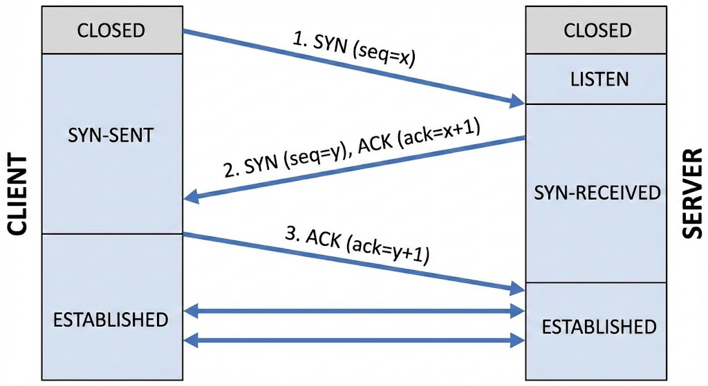
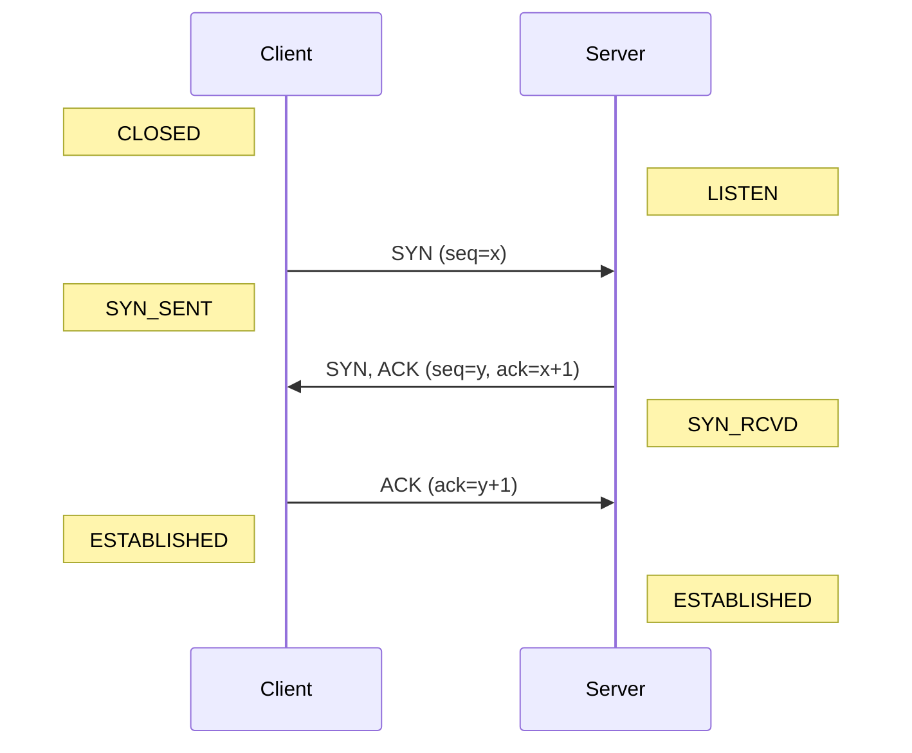
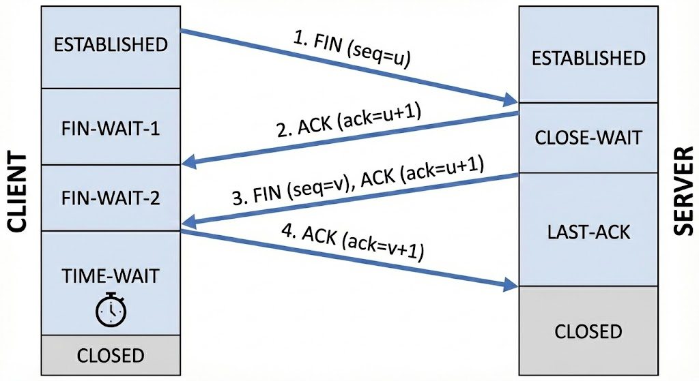
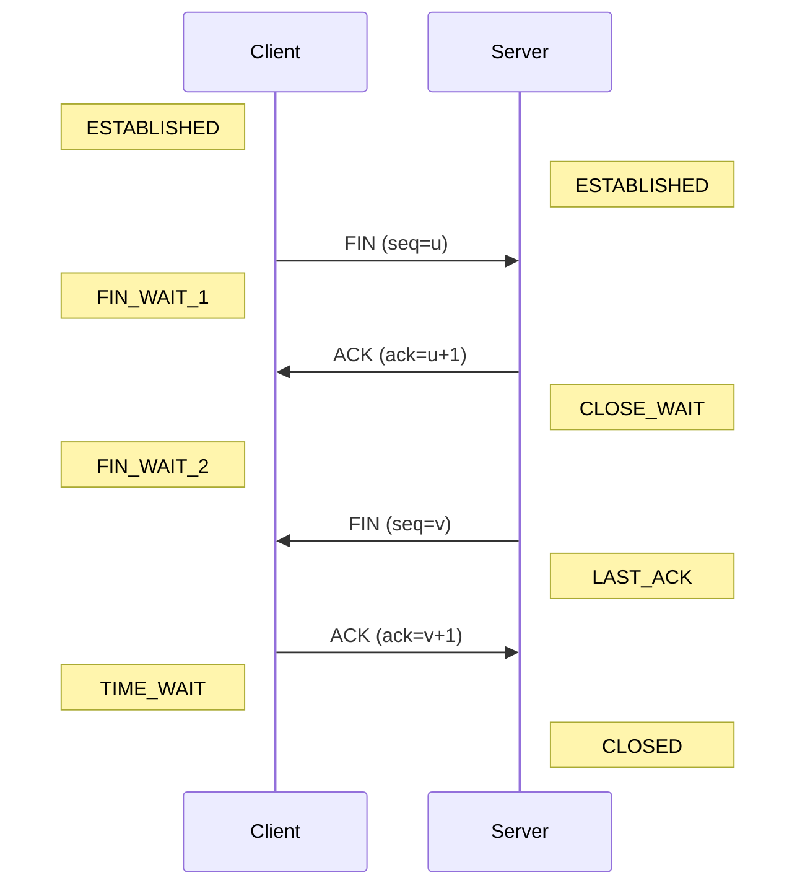

作为一名 SRE，网络是我们最常打交道但也最容易"背锅"的基础设施。当服务不可用时，"网络抖动"往往成为最万能的借口。但作为专业的可靠性工程师，我们需要深入理解网络协议的底层机制，才能在复杂的分布式系统中快速定位并解决问题。

本文将从 SRE 的视角出发，重新审视网络协议与通信的核心知识。

## 1. 情境 (Situation)

在微服务架构和云原生时代，网络通信不再是简单的客户端到服务器的连接。
- **服务网格 (Service Mesh)**：引入了 Sidecar 代理，增加了网络跳数。
- **容器网络 (CNI)**：Overlay 网络让数据包的封装解封装变得更加复杂。
- **全球负载均衡**：DNS 解析和 Anycast 技术让流量调度变得不可见。

网络已经成为现代分布式系统的"循环系统"，其健康状况直接决定了业务的可用性。

## 2. 冲突 (Conflict)

然而，我们往往陷入了**"网络是可靠的"**这一误区（分布式计算的第一谬误）。
在实际生产环境中：
- **TCP 连接不释放**：导致文件句柄耗尽 (Too many open files)。
- **DNS 解析延迟**：导致服务间调用出现偶发性超时。
- **拥塞控制算法不匹配**：导致高带宽环境下吞吐量上不去。

当这些问题发生时，如果我们只懂 `ping` 和 `telnet`，面对复杂的抓包数据和内核参数将束手无策。

## 3. 问题 (Question)

如何构建一套完整的网络知识体系，并掌握核心的排查工具，从而在遇到"网络问题"时能够给出确凿的证据，而不是模糊的猜测？

## 4. 答案 (Answer)

我们需要从**模型原理**、**核心协议**、**关键状态**和**排查工具**四个维度来掌握网络通信。

### 4.1 模型原理：OSI vs TCP/IP

虽然教科书上常讲 OSI 七层模型，但在 Linux 内核和实际排查中，**TCP/IP 四层模型**更为实用。

| OSI 七层模型 | TCP/IP 四层模型 | 对应协议/工具 | 关注点 (SRE) |
| :--- | :--- | :--- | :--- |
| 应用层 (Application) | **应用层** | HTTP, DNS, SSH | 状态码, 延迟, 业务逻辑 |
| 表示层 (Presentation) | ^ | SSL/TLS, JSON | 证书过期, 序列化错误 |
| 会话层 (Session) | ^ | RPC Session | 连接池管理 |
| 传输层 (Transport) | **传输层** | TCP, UDP | 端口, 滑动窗口, 拥塞控制 |
| 网络层 (Network) | **网络层** | IP, ICMP, BGP | 路由表, MTU, 防火墙 |
| 数据链路层 (Data Link) | **网络接口层** | ARP, MAC, VLAN | 丢包, CRC 错误 |
| 物理层 (Physical) | ^ | 光纤, 网线 | 物理链路中断 |

### 4.2 传输层核心：TCP 的生与死

TCP 是互联网的基石，理解其状态机是排查连接问题的关键。

#### 三次握手 (The Handshake)





**SRE 关注点**：
- **SYN Flood 攻击**：如果 Server 收到大量 SYN 但没收到 ACK，`SYN_RCVD` 队列会满。
  - *优化*：开启 `net.ipv4.tcp_syncookies`。
- **连接超时**：如果 Client 发出 SYN 后无响应，可能是防火墙丢包或 Server 没监听。

#### 四次挥手 (The Wave)





**SRE 关注点（高频故障点）**：
- **CLOSE_WAIT**：**服务端**（被动关闭方）卡在这里，通常是**代码 Bug**。
  - *原因*：程序收到了 FIN，但没有调用 `close()` 关闭 socket。
  - *后果*：占用文件句柄，最终导致服务崩溃。
- **TIME_WAIT**：**客户端**（主动关闭方）卡在这里，是**正常现象**，但过多会有害。
  - *作用*：确保迷路的包在网络中消失；确保 Server 收到最后的 ACK。
  - *危害*：短连接高并发场景下，耗尽源端口。
  - *优化*：开启 `net.ipv4.tcp_tw_reuse` (注意：`tcp_tw_recycle` 在新内核已废弃)。

### 4.3 应用层核心：DNS 与 HTTP

#### DNS：网络世界的导航仪

DNS 解析流程通常是：`本地 hosts` -> `本地 DNS 缓存` -> `递归 DNS 服务器` -> `根/顶级/权威 DNS 服务器`。

**常见问题**：
- **解析慢**：递归 DNS 响应慢，或者 UDP 包被限速/丢弃。
- **解析错**：DNS 劫持或缓存污染。
- **ndots 陷阱**：在 Kubernetes 中，默认 `ndots:5` 会导致大量无效的 DNS 查询（如 `google.com.default.svc.cluster.local`），增加延迟。

#### HTTP：从 1.1 到 3.0

- **HTTP/1.1**：文本协议，Keep-Alive 复用连接，但有队头阻塞 (Head-of-Line Blocking)。
- **HTTP/2**：二进制分帧，多路复用 (Multiplexing)，头部压缩 (HPACK)。解决了应用层队头阻塞，但 TCP 层队头阻塞依然存在。
- **HTTP/3 (QUIC)**：基于 UDP，彻底解决了 TCP 的队头阻塞，连接迁移更平滑。

### 4.4 排查工具箱 (Troubleshooting Toolkit)

工欲善其事，必先利其器。

#### 1. 查看连接状态：`ss` (Socket Statistics)

比 `netstat` 更快更强。

```bash
# 查看所有 TCP 连接并显示进程名
ss -ntlp

# 统计各种状态的连接数（排查 TIME_WAIT/CLOSE_WAIT 神器）
ss -ant | awk '{print $1}' | sort | uniq -c | sort -rn
# 输出示例：
# 800 ESTABLISHED
# 50 TIME_WAIT
# 10 LISTEN
```

#### 2. 抓包分析：`tcpdump`

```bash
# 抓取 eth0 网卡，端口 80，排除 SSH，保存到文件
tcpdump -i eth0 port 80 and not port 22 -w capture.pcap

# 抓取特定 IP 的包，显示详细信息
tcpdump -i any host 192.168.1.100 -nn -vv
```

#### 3. DNS 诊断：`dig`

```bash
# 查询 A 记录，显示查询时间
dig www.google.com

# 指定 DNS 服务器查询
dig @8.8.8.8 www.google.com

# 追踪解析过程
dig +trace www.google.com
```

#### 4. 综合连通性：`curl`

```bash
# 查看详细的连接耗时（DNS、TCP、SSL、TTFB）
curl -w "\nDNS: %{time_namelookup}s\nTCP: %{time_connect}s\nSSL: %{time_appconnect}s\nTTFB: %{time_starttransfer}s\nTotal: %{time_total}s\n" -so /dev/null https://www.baidu.com
```

#### 5. 物理链路诊断：`mii-tool` 与 `ethtool`

当怀疑是物理层问题（如网线松动、协商速率不匹配）时，我们需要查看网卡的底层状态。

##### 5.1 传统工具：`mii-tool`

在较老的系统或特定的物理网卡上，`mii-tool` 非常直观。

```bash
root@ubuntu24:~# mii-tool -v ens33
ens33: negotiated 1000baseT-FD flow-control, link ok
# 协商结果：1000Mbps 全双工 (FD)，启用了流量控制。
# link ok：物理连接正常。

  product info: Yukon 88E1011 rev 3
  # 网卡型号信息

  basic mode:   autonegotiation enabled
  # 开启了自动协商，网卡会尝试与对端交换信息以选择最佳模式。

  basic status: autonegotiation complete, link ok
  # 自动协商成功完成。

  capabilities: 1000baseT-FD 100baseTx-FD 100baseTx-HD 10baseT-FD 10baseT-HD
  # 本端网卡支持的能力：1000/100/10 Mbps 的全双工/半双工。

  advertising:  1000baseT-FD 100baseTx-FD 100baseTx-HD 10baseT-FD 10baseT-HD
  # 本端宣告的能力。

  link partner: 1000baseT-HD 1000baseT-FD 100baseTx-FD 100baseTx-HD 10baseT-FD 10baseT-HD
  # 对端设备（交换机）支持的能力。
```

**局限性**：
在现代 Linux 发行版（如 Rocky Linux 9）或虚拟化环境（如 VMware/KVM）中，`mii-tool` 可能会失效，因为它依赖的旧接口可能不被支持。

```bash
[root@rocky9 ~]# mii-tool ens160
SIOCGMIIPHY on 'ens160' failed: Operation not supported
# 原因：网卡驱动不支持 MII 寄存器访问（常见于 vmxnet3 等虚拟网卡）。
```

##### 5.2 现代标准：`ethtool`

`ethtool` 是目前 Linux 下配置和查询网卡参数的标准工具，功能比 `mii-tool` 更强大。

**查看网卡物理状态**：

```bash
[root@rocky9 ~]# ethtool ens160
Settings for ens160:
    Supported ports: [ TP ]
    # 介质类型：双绞线 (Twisted Pair)

    Supported link modes:   1000baseT/Full
                            10000baseT/Full
    # 支持的模式：千兆和万兆全双工

    Supports auto-negotiation: No
    # 不支持自动协商（虚拟网卡常见）

    Speed: 10000Mb/s
    # 当前速率：万兆

    Duplex: Full
    # 双工模式：全双工

    Link detected: yes
    # 物理链路正常
```

**查看驱动与固件信息**：

通过 `ethtool -i` 可以区分物理网卡和虚拟网卡，这对于排查性能问题（如是否需要开启 TSO/GSO Offload）很重要。

```bash
# Ubuntu (VMware e1000 模拟网卡)
root@ubuntu24:~# ethtool -i ens33
driver: e1000
version: 6.8.0-45-generic
bus-info: 0000:02:01.0

# Rocky Linux (VMware vmxnet3 半虚拟化网卡)
[root@rocky9 ~]# ethtool -i ens160
driver: vmxnet3
# vmxnet3 是 VMware 的高性能半虚拟化驱动
version: 1.7.0.0-k-NAPI
bus-info: 0000:03:00.0
```

**SRE 关注点**：
- **Link Status**: `Link detected: no` 意味着网线没插好或交换机端口关闭。
- **Duplex/Speed**: 确认协商速率是否符合预期（比如千兆变百兆），以及是否全双工。

## 5. 总结

网络协议看似枯燥，实则是分布式系统的血管。作为 SRE，我们不需要成为网络专家，但必须掌握：
1.  **分层排查思维**：是 DNS 问题？TCP 连接问题？还是应用层 HTTP 报错？
2.  **状态机理解**：看到 `CLOSE_WAIT` 知道找开发修 Bug，看到 `TIME_WAIT` 知道调内核参数。
3.  **工具熟练度**：能够迅速用 `ss` 看状态，用 `tcpdump` 抓现场。

只有这样，我们才能在故障发生时，从容不迫地定位根因，保障系统的稳定性。
