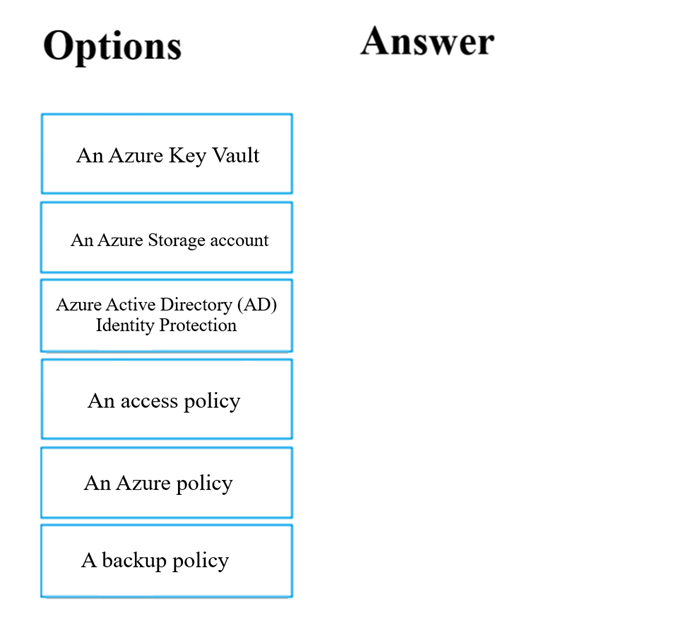
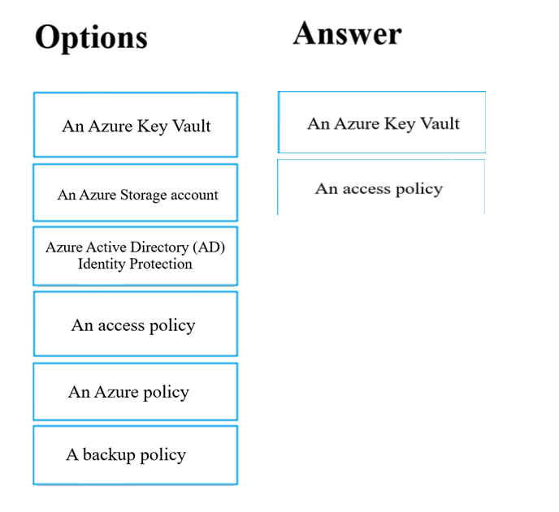
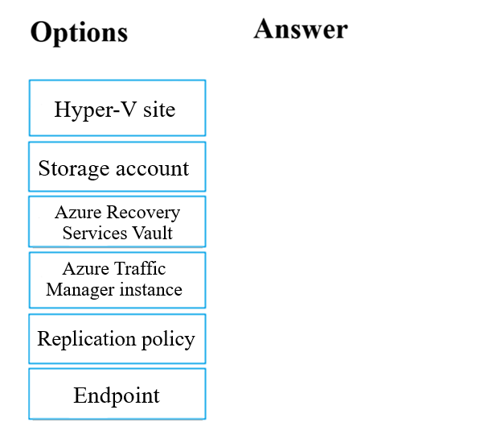
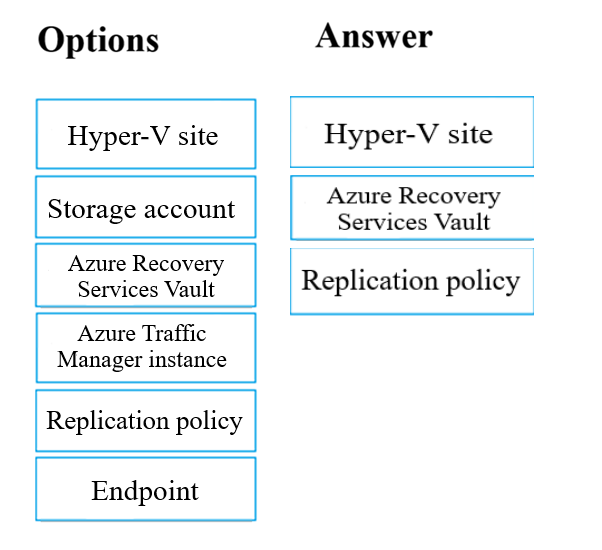

# AZ104 微软云认证备考题库

## SCQA结构

### 情境(Situation)
在当前云计算快速发展的时代，Azure作为全球领先的云平台之一，其管理员认证(AZ104)已成为DevOps、SRE和云工程师必备的专业资质。持有AZ104认证不仅能证明个人的Azure技术能力，还能提升职业竞争力和薪资水平。

### 冲突(Conflict)
然而，AZ104考试涵盖内容广泛，包括Azure资源管理、安全、网络、存储等多个领域，考生往往面临知识点分散、难以系统复习的挑战。传统的学习方式效率低下，缺乏针对性的练习和反馈。

### 问题(Question)
如何高效备考AZ104认证考试？如何系统掌握考试知识点并通过大量练习巩固记忆？

### 答案(Answer)
本博客提供一份结构化的AZ104备考题库，包含精选题目、详细解析和正确答案，帮助考生系统复习、针对性练习，提高备考效率和考试通过率。

## 题库结构

本题库按照AZ104考试的主要知识点进行分类，便于考生根据学习进度选择相应部分进行练习。每个题目包含题目描述、选项、正确答案和详细解析。

## 题目模板

### 题目分类
- **资源管理**
- **安全与合规**
- **网络**
- **存储**
- **计算**
- **监控与故障排除**

### 题目格式示例

#### 题目1：

Your company has serval departments. Each department has a number of virtual machines (VMs).
The company has an Azure subscription that contains a resource group named RG1.
All VMs are located in RG1.
You want to associate each VM with its respective department.
What should you do?

**选项**：
A. Create Azure Management Groups for each department.
B. Create a resource group for each department.
C. Assign tags to the virtual machines. Most Voted
D. Modify the settings of the virtual machines

**正确答案**：C

---

#### 题目2：

**题目描述**：Note: The question is included in a number of questions that depicts the identical set-up. However, every question has a
distinctive result. Establish if the solution satisfies the requirements.
Your company has an Azure Active Directory (Azure AD) subscription.
You want to implement an Azure AD conditional access policy.
The policy must be configured to require members of the Global Administrators group to use Multi-Factor Authentication and
an Azure AD-joined device when they connect to Azure AD from untrusted locations.
Solution: You access the multi-factor authentication page to alter the user settings.
Does the solution meet the goal?

**选项**：
A. Yes
B. No

**正确答案**：B

---

#### 题目3：

**题目描述**：Note: The question is included in a number of questions that depicts the identical set-up. However, every question has a
distinctive result. Establish if the solution satisfies the requirements.
Your company has an Azure Active Directory (Azure AD) subscription.
You want to implement an Azure AD conditional access policy.
The policy must be configured to require members of the Global Administrators group to use Multi-Factor Authentication and
an Azure AD-joined device when they connect to Azure AD from untrusted locations.
Solution: You access the Azure portal to alter the session control of the Azure AD conditional access policy.
Does the solution meet the goal?

**选项**：
A. Yes
B. No

**正确答案**：B

---

#### 题目4：

**题目描述**：Note: The question is included in a number of questions that depicts the identical set-up. However, every question has a
distinctive result. Establish if the solution satisfies the requirements.
Your company has an Azure Active Directory (Azure AD) subscription.
You want to implement an Azure AD conditional access policy.
The policy must be configured to require members of the Global Administrators group to use Multi-Factor Authentication and
an Azure AD-joined device when they connect to Azure AD from untrusted locations.
Solution: You access the Azure portal to alter the grant control of the Azure AD conditional access policy.
Does the solution meet the goal?

**选项**：
A. Yes
B. No

**正确答案**：A

---

#### 题目5：

**题目描述**：You are planning to deploy an Ubuntu Server virtual machine to your company's Azure subscription.
You are required to implement a custom deployment that includes adding a particular trusted root certification authority (CA).
Which of the following should you use to create the virtual machine?

**选项**：
A. The New-AzureRmVm cmdlet.
B. The New-AzVM cmdlet.
C. The Create-AzVM cmdlet.
D. The az vm create command.

**正确答案**：D

---

#### 题目6：

**题目描述**：Note: The question is included in a number of questions that depicts the identical set-up. However, every question has a
distinctive result. Establish if the solution satisfies the requirements.
Your company makes use of Multi-Factor Authentication for when users are not in the office. The Per Authentication option has
been configured as the usage model.
After the acquisition of a smaller business and the addition of the new staff to Azure Active Directory (Azure AD) obtains a
different company and adding the new employees to Azure Active Directory (Azure AD), you are informed that these employees
should also make use of Multi-Factor Authentication.
To achieve this, the Per Enabled User setting must be set for the usage model.
Solution: You reconfigure the existing usage model via the Azure portal.
Does the solution meet the goal?

**选项**：
A. Yes
B. No

**正确答案**：B

---

#### 题目7：

**题目描述**：Note: The question is included in a number of questions that depicts the identical set-up. However, every question has a
distinctive result. Establish if the solution satisfies the requirements.
Your company's Azure solution makes use of Multi-Factor Authentication for when users are not in the office. The Per
Authentication option has been configured as the usage model.
After the acquisition of a smaller business and the addition of the new staff to Azure Active Directory (Azure AD) obtains a
different company and adding the new employees to Azure Active Directory (Azure AD), you are informed that these employees
should also make use of Multi-Factor Authentication.
To achieve this, the Per Enabled User setting must be set for the usage model.
Solution: You reconfigure the existing usage model via the Azure CLI.
Does the solution meet the goal?

**选项**：
A. Yes
B. No

**正确答案**：B

---

#### 题目8：

**题目描述**：Note: The question is included in a number of questions that depicts the identical set-up. However, every question has a
distinctive result. Establish if the solution satisfies the requirements.
Your company's Azure solution makes use of Multi-Factor Authentication for when users are not in the office. The Per
Authentication option has been configured as the usage model.
After the acquisition of a smaller business and the addition of the new staff to Azure Active Directory (Azure AD) obtains a
different company and adding the new employees to Azure Active Directory (Azure AD), you are informed that these employees
should also make use of Multi-Factor Authentication.
To achieve this, the Per Enabled User setting must be set for the usage model.
Solution: You create a new Multi-Factor Authentication provider with a backup from the existing Multi-Factor Authentication
provider data.
Does the solution meet the goal?

**选项**：
A. Yes
B. No

**正确答案**：B

---

#### 题目9：

**题目描述**：Note: The question is included in a number of questions that depicts the identical set-up. However, every question has a
distinctive result. Establish if the solution satisfies the requirements.
Your company has an Azure Active Directory (Azure AD) tenant named weyland.com that is configured for hybrid coexistence
with the on-premises Active
Directory domain.
You have a server named DirSync1 that is configured as a DirSync server.
You create a new user account in the on-premise Active Directory. You now need to replicate the user information to Azure AD
immediately.
Solution: You run the Start-ADSyncSyncCycle -PolicyType Initial PowerShell cmdlet.
Does the solution meet the goal?

**选项**：
A. Yes
B. No

**正确答案**：B

---

#### 题目10：

**题目描述**：Note: The question is included in a number of questions that depicts the identical set-up. However, every question has a
distinctive result. Establish if the solution satisfies the requirements.
Your company has an Azure Active Directory (Azure AD) tenant named weyland.com that is configured for hybrid coexistence
with the on-premises Active
Directory domain.
You have a server named DirSync1 that is configured as a DirSync server.
You create a new user account in the on-premise Active Directory. You now need to replicate the user information to Azure AD
immediately.
Solution: You use Active Directory Sites and Services to force replication of the Global Catalog on a domain controller.
Does the solution meet the goal?

**选项**：
A. Yes
B. No

**正确答案**：B

---

#### 题目11：

**题目描述**：Note: The question is included in a number of questions that depicts the identical set-up. However, every question has a
distinctive result. Establish if the solution satisfies the requirements.
Your company has an Azure Active Directory (Azure AD) tenant named weyland.com that is configured for hybrid coexistence
with the on-premises Active
Directory domain.
You have a server named DirSync1 that is configured as a DirSync server.
You create a new user account in the on-premise Active Directory. You now need to replicate the user information to Azure AD
immediately.
Solution: You restart the NetLogon service on a domain controller.
Does the solution meet the goal?

**选项**：
A. Yes
B. No

**正确答案**：B

---

#### 题目12：

**题目描述**：Your company has a Microsoft Azure subscription.
The company has datacenters in Los Angeles and New York.
You are configuring the two datacenters as geo-clustered sites for site resiliency.
You need to recommend an Azure storage redundancy option.
You have the following data storage requirements:
? Data must be stored on multiple nodes.
? Data must be stored on nodes in separate geographic locations.
? Data can be read from the secondary location as well as from the primary location.
Which of the following Azure stored redundancy options should you recommend?

**选项**：
A. Geo-redundant storage
B. Read-only geo-redundant storage Most Voted
C. Zone-redundant storage
D. Locally redundant storage

**正确答案**：B

---

#### 题目13：

**题目描述**：Note: The question is included in a number of questions that depicts the identical set-up. However, every question has a
distinctive result. Establish if the solution satisfies the requirements.
Your company has an azure subscription that includes a storage account, a resource group, a blob container and a file share.
A colleague named Jon Ross makes use of a solitary Azure Resource Manager (ARM) template to deploy a virtual machine and
an additional Azure Storage account.
You want to review the ARM template that was used by Jon Ross.
Solution: You access the Virtual Machine blade.
Does the solution meet the goal?

**选项**：
A. Yes
B. No

**正确答案**：B

---

#### 题目14：

**题目描述**：Note: The question is included in a number of questions that depicts the identical set-up. However, every question has a
distinctive result. Establish if the solution satisfies the requirements.
Your company has an azure subscription that includes a storage account, a resource group, a blob container and a file share.
A colleague named Jon Ross makes use of a solitary Azure Resource Manager (ARM) template to deploy a virtual machine and
an additional Azure Storage account.
You want to review the ARM template that was used by Jon Ross.
Solution: You access the Resource Group blade.
Does the solution meet the goal?

**选项**：
A. Yes
B. No

**正确答案**：A

---

#### 题目15：

**题目描述**：Note: The question is included in a number of questions that depicts the identical set-up. However, every question has a
distinctive result. Establish if the solution satisfies the requirements.
Your company has an azure subscription that includes a storage account, a resource group, a blob container and a file share.
A colleague named Jon Ross makes use of a solitary Azure Resource Manager (ARM) template to deploy a virtual machine and
an additional Azure Storage account.
You want to review the ARM template that was used by Jon Ross.
Solution: You access the Container blade.
Does the solution meet the goal?

**选项**：
A. Yes
B. No

**正确答案**：B

---

#### 题目16：

**题目描述**：Your company has three virtual machines (VMs) that are included in an availability set.
You try to resize one of the VMs, which returns an allocation failure message.
It is imperative that the VM is resized.
Which of the following actions should you take?

**选项**：
A. You should only stop one of the VMs.
B. You should stop two of the VMs.
C. You should stop all three VMs. Most Voted
D. You should remove the necessary VM from the availability set

**正确答案**：C

---

#### 题目17：

**题目描述**：You have an Azure virtual machine (VM) that has a single data disk. You have been tasked with attaching this data disk to
another Azure VM.
You need to make sure that your strategy allows for the virtual machines to be offline for the least amount of time possible.
Which of the following is the action you should take FIRST?

**选项**：
A. Stop the VM that includes the data disk.
B. Stop the VM that the data disk must be attached to.
C. Detach the data disk. Most Voted
D. Delete the VM that includes the data disk

**正确答案**：C

---

#### 题目18：

**题目描述**：Your company has an Azure subscription.
You need to deploy a number of Azure virtual machines (VMs) using Azure Resource Manager (ARM) templates. You have been
informed that the VMs will be included in a single availability set.
You are required to make sure that the ARM template you configure allows for as many VMs as possible to remain accessible
in the event of fabric failure or maintenance.
Which of the following is the value that you should configure for the platformFaultDomainCount property?

**选项**：
A. 10
B. 30
C. Min Value
D. Max Value

**正确答案**：D

---

#### 题目19：

**题目描述**：Your company has an Azure subscription.
You need to deploy a number of Azure virtual machines (VMs) using Azure Resource Manager (ARM) templates. You have been
informed that the VMs will be included in a single availability set.
You are required to make sure that the ARM template you configure allows for as many VMs as possible to remain accessible
in the event of fabric failure or maintenance.
Which of the following is the value that you should configure for the platformUpdateDomainCount property?

**选项**：
A. 10
B. 20 Most Voted
C. 30
D. 40

**正确答案**：B

---

#### 题目20：

**题目描述**：DRAG DROP -
You have downloaded an Azure Resource Manager (ARM) template to deploy numerous virtual machines (VMs). The ARM
template is based on a current VM, but must be adapted to reference an administrative password.
You need to make sure that the password cannot be stored in plain text.
You are preparing to create the necessary components to achieve your goal.
Which of the following should you create to achieve your goal? Answer by dragging the correct option from the list to the
answer area.
Select and Place

**选项**：

**正确答案**：Key vault + access policy

---

#### 题目21：

**题目描述**：Your company has an Azure Active Directory (Azure AD) tenant that is configured for hybrid coexistence with the on-premises
Active Directory domain.
The on-premise virtual environment consists of virtual machines (VMs) running on Windows Server 2012 R2 Hyper-V host
servers.
You have created some PowerShell scripts to automate the configuration of newly created VMs. You plan to create several new
VMs.
You need a solution that ensures the scripts are run on the new VMs.
Which of the following is the best solution?

**选项**：
A. Configure a SetupComplete.cmd batch file in the %windir%\setup\scripts directory. Most Voted
B. Configure a Group Policy Object (GPO) to run the scripts as logon scripts.
C. Configure a Group Policy Object (GPO) to run the scripts as startup scripts.
D. Place the scripts in a new virtual hard disk (VHD)

**正确答案**：A

---

#### 题目22：

**题目描述**：Your company has an Azure Active Directory (Azure AD) tenant that is configured for hybrid coexistence with the on-premises
Active Directory domain.
You plan to deploy several new virtual machines (VMs) in Azure. The VMs will have the same operating system and custom
software requirements.
You configure a reference VM in the on-premise virtual environment. You then generalize the VM to create an image.
You need to upload the image to Azure to ensure that it is available for selection when you create the new Azure VMs.
Which PowerShell cmdlets should you use?

**选项**：
A. Add-AzVM
B. Add-AzVhd Most Voted
C. Add-AzImage
D. Add-AzImageDataDisk

**正确答案**：B

---

#### 题目23：

**题目描述**：DRAG DROP -
Your company has an Azure subscription that includes a number of Azure virtual machines (VMs), which are all part of the
same virtual network.
Your company also has an on-premises Hyper-V server that hosts a VM, named VM1, which must be replicated to Azure.
Which of the following objects that must be created to achieve this goal? Answer by dragging the correct option from the list to
the answer area.
Select and Place:

**选项**：

**正确答案**：For physical servers
- Storage Account
- Azure Recovery Services Vault
- Replication policy
For Hyper-v server
- Hyper-V site
- Azure Recovery Services Vault
- Replication policy

---

#### 题目24：

**题目描述**：Note: The question is included in a number of questions that depicts the identical set-up. However, every question has a
distinctive result. Establish if the solution satisfies the requirements.
Your company's Azure subscription includes two Azure networks named VirtualNetworkA and VirtualNetworkB.
VirtualNetworkA includes a VPN gateway that is configured to make use of static routing. Also, a site-to-site VPN connection
exists between your company's on- premises network and VirtualNetworkA.
You have configured a point-to-site VPN connection to VirtualNetworkA from a workstation running Windows 10. After
configuring virtual network peering between
VirtualNetworkA and VirtualNetworkB, you confirm that you are able to access VirtualNetworkB from the company's on-
premises network. However, you find that you cannot establish a connection to VirtualNetworkB from the Windows 10
workstation.
You have to make sure that a connection to VirtualNetworkB can be established from the Windows 10 workstation.
Solution: You choose the Allow gateway transit setting on VirtualNetworkA.
Does the solution meet the goal?

**选项**：
A. Yes
B. No

**正确答案**：B

---

#### 题目25：

**题目描述**：Note: The question is included in a number of questions that depicts the identical set-up. However, every question has a
distinctive result. Establish if the solution satisfies the requirements.
Your company's Azure subscription includes two Azure networks named VirtualNetworkA and VirtualNetworkB.
VirtualNetworkA includes a VPN gateway that is configured to make use of static routing. Also, a site-to-site VPN connection
exists between your company's on- premises network and VirtualNetworkA.
You have configured a point-to-site VPN connection to VirtualNetworkA from a workstation running Windows 10. After
configuring virtual network peering between
VirtualNetworkA and VirtualNetworkB, you confirm that you are able to access VirtualNetworkB from the company's on-
premises network. However, you find that you cannot establish a connection to VirtualNetworkB from the Windows 10
workstation.
You have to make sure that a connection to VirtualNetworkB can be established from the Windows 10 workstation.
Solution: You choose the Allow gateway transit setting on VirtualNetworkB.
Does the solution meet the goal?

**选项**：
A. Yes
B. No

**正确答案**：B

---

#### 题目26：

**题目描述**：Note: The question is included in a number of questions that depicts the identical set-up. However, every question has a
distinctive result. Establish if the solution satisfies the requirements.
Your company's Azure subscription includes two Azure networks named VirtualNetworkA and VirtualNetworkB.
VirtualNetworkA includes a VPN gateway that is configured to make use of static routing. Also, a site-to-site VPN connection
exists between your company's on- premises network and VirtualNetworkA.
You have configured a point-to-site VPN connection to VirtualNetworkA from a workstation running Windows 10. After
configuring virtual network peering between
VirtualNetworkA and VirtualNetworkB, you confirm that you are able to access VirtualNetworkB from the company's on-
premises network. However, you find that you cannot establish a connection to VirtualNetworkB from the Windows 10
workstation.
You have to make sure that a connection to VirtualNetworkB can be established from the Windows 10 workstation.
Solution: You download and re-install the VPN client configuration package on the Windows 10 workstation.
Does the solution meet the goal?

**选项**：
A. Yes
B. No

**正确答案**：A

---

#### 题目27：

**题目描述**：Your company has virtual machines (VMs) hosted in Microsoft Azure. The VMs are located in a single Azure virtual network
named VNet1.
The company has users that work remotely. The remote workers require access to the VMs on VNet1.
You need to provide access for the remote workers.
What should you do?

**选项**：
A. Configure a Site-to-Site (S2S) VPN.
B. Configure a VNet-toVNet VPN.
C. Configure a Point-to-Site (P2S) VPN. Most Voted
D. Configure DirectAccess on a Windows Server 2012 server VM.
E. Configure a Multi-Site VPN

**正确答案**：C

---

#### 题目28：

**题目描述**：Note: The question is included in a number of questions that depicts the identical set-up. However, every question has a
distinctive result. Establish if the solution satisfies the requirements.
Your company has a Microsoft SQL Server Always On availability group configured on their Azure virtual machines (VMs).
You need to configure an Azure internal load balancer as a listener for the availability group.
Solution: You create an HTTP health probe on port 1433.
Does the solution meet the goal?

**选项**：
A. Yes
B. No

**正确答案**：B

---

#### 

## 备考建议

1. **系统学习**：按照题库分类，逐一学习每个知识点
2. **反复练习**：多做题目，加深对知识点的理解和记忆
3. **错题分析**：重点关注错误题目，理解错误原因
4. **实践操作**：结合Azure Portal或Azure CLI进行实际操作练习
5. **模拟考试**：使用官方或第三方模拟考试工具进行模拟测试

## 资源推荐

- [官方AZ104考试指南](https://learn.microsoft.com/en-us/certifications/exams/az-104)
- [Azure学习路径](https://learn.microsoft.com/en-us/training/paths/az-104-administrator/)
- [Microsoft Learn](https://learn.microsoft.com/en-us/azure/)

## 结语

本题库将持续更新和完善，欢迎大家在评论区提出建议和补充。祝各位考生备考顺利，成功通过AZ104认证考试！

---

**题目添加区域**：

在这里添加您的AZ104考试题目，按照上面的题目格式示例进行组织。

---

**题目添加区域结束**

---

## 更新记录

- 2025-12-01：初始创建题库模板
- [日期]：[更新内容]