# AZ104 微软云认证备考题库

## SCQA结构

### 情境(Situation)
在当前云计算快速发展的时代，Azure作为全球领先的云平台之一，其管理员认证(AZ104)已成为DevOps、SRE和云工程师必备的专业资质。持有AZ104认证不仅能证明个人的Azure技术能力，还能提升职业竞争力和薪资水平。

### 冲突(Conflict)
然而，AZ104考试涵盖内容广泛，包括Azure资源管理、安全、网络、存储等多个领域，考生往往面临知识点分散、难以系统复习的挑战。传统的学习方式效率低下，缺乏针对性的练习和反馈。

### 问题(Question)
如何高效备考AZ104认证考试？如何系统掌握考试知识点并通过大量练习巩固记忆？

### 答案(Answer)
本博客提供一份结构化的AZ104备考题库，包含精选题目、详细解析和正确答案，帮助考生系统复习、针对性练习，提高备考效率和考试通过率。

## 题库结构

本题库按照AZ104考试的主要知识点进行分类，便于考生根据学习进度选择相应部分进行练习。每个题目包含题目描述、选项、正确答案和详细解析。

## 题目模板

### 题目分类
- **资源管理**
- **安全与合规**
- **网络**
- **存储**
- **计算**
- **监控与故障排除**

### 题目格式示例

1. You want to associate each VM with its respective department  -- **Assign tags to the virtual machines.**

2. You access the multi-factor authentication page to alter the user settings -- **No**

3. You access the Azure portal to alter the session control of the Azure AD conditional access policy. -- **No**

4. You access the Azure portal to alter the grant control of the Azure AD conditional access policy. -- **Yes**

5. You are required to implement a custom deployment that includes adding a particular trusted root certification authority (CA).
    Which of the following should you use to create the virtual machine?  -- **The az vm create command.**

6. You reconfigure the existing usage model via the Azure portal -- **No**

7. You reconfigure the existing usage model via the Azure CLI -- **No**

8. You create a new Multi-Factor Authentication provider with a backup from the existing Multi-Factor Authentication provider data  -- **No**

9. You run the Start-ADSyncSyncCycle -PolicyType Initial PowerShell cmdlet. -- **No**

10. You use Active Directory Sites and Services to force replication of the Global Catalog on a domain controller. -- **No**

11. You restart the NetLogon service on a domain controller. -- **No**

12. Which of the following Azure stored redundancy options should you recommend -- **Read-only geo-redundant storage**

13. You want to review the ARM template that was used by Jon Ross. You access the Virtual Machine blade -- **No**

14. You want to review the ARM template that was used by Jon Ross. You access the Resource Group blade - **Yes**

15. You want to review the ARM template that was used by Jon Ross. You access the Container blade.  -- **No**

16. You try to resize one of the VMs, which returns an allocation failure message.It is imperative that the VM is resized -- **You should stop all three VMs.**

17. You need to make sure that your strategy allows for the virtual machines to be offline for the least amount of time possible.
    Which of the following is the action you should take FIRST?  -- **Detach the data disk.**

18. You are required to make sure that the ARM template you configure allows for as many VMs as possible to remain accessible
    in the event of fabric failure or maintenance.
    Which of the following is the value that you should configure for the platformFaultDomainCount property? -- **Max Value**

19. You are required to make sure that the ARM template you configure allows for as many VMs as possible to remain accessible
    in the event of fabric failure or maintenance.
    Which of the following is the value that you should configure for the platformUpdateDomainCount property?  -- **20**

20. You need to make sure that the password cannot be stored in plain text.
    You are preparing to create the necessary components to achieve your goal.
    Which of the following should you create to achieve your goal?  -- **An Azure Key Vault, An Access key**

21. You have created some PowerShell scripts to automate the configuration of newly created VMs. You plan to create several new
    VMs.
    You need a solution that ensures the scripts are run on the new VMs -- **Configure a SetupComplete.cmd batch file in the %windir%\setup\scripts directory.**

22. You configure a reference VM in the on-premise virtual environment. You then generalize the VM to create an image.
    You need to upload the image to Azure to ensure that it is available for selection when you create the new Azure VMs.
    Which PowerShell cmdlets should you use?  -- **Add-AzVhd**

23. Your company has an Azure subscription that includes a number of Azure virtual machines (VMs), which are all part of the
    same virtual network.
    Your company also has an on-premises Hyper-V server that hosts a VM, named VM1, which must be replicated to Azure -- **Hyper-V site, Azure Recovery Services Vault, Replication policy**

24. You choose the Allow gateway transit setting on VirtualNetworkA. -- **No**

25. You choose the Allow gateway transit setting on VirtualNetworkB. -- **No**

26. You download and re-install the VPN client configuration package on the Windows 10 workstation. -- **Yes**

27. The company has users that work remotely. The remote workers require access to the VMs on VNet1.
    You need to provide access for the remote workers.  -- **Configure a Point-to-Site (P2S) VPN.**

28. You create an HTTP health probe on port 1433. -- **No**

29. You set Session persistence to Client IP  -- **No**

30. You enable Floating IP.  -- **Yes**

31. You need to configure the two VMs with static internal IP addresses. --   **Modify the VM properties in the Azure Management Portal**

32. Which of the following is the least amount of network interfaces needed for this configuration? -- **5**

33. Which of the following is the least amount of security groups needed for this configuration? -- **1**

34. When the VM becomes infected with data encrypting ransomware, you decide to recover the VM's files. -- **You can recover the files to any VM within the company's subscription.**

35. When the VM becomes infected with data encrypting ransomware, you are required to restore the VM. -- **You should restore the VM to a new Azure VM**

36. You need to find the cause of the performance issues pertaining to metrics on the Azure infrastructure. -- **Azure Monitor**

37. You want to use Azure Backup to schedule a backup of your company's virtual machines (VMs) to the Recovery Services vault.
    Which of the following VMs can you back up?  -- **ABCDE**

    ```
    A. VMs that run Windows 10. 
    B. VMs that run Windows Server 2012 or higher. 
    C. VMs that have NOT been shut down.
    D. VMs that run Debian 8.2+.
    E. VMs that have been shut down.
    ```

38. You create a PowerShell script that runs the New-AzureADUser cmdlet for each user -- **No**

39. From Azure AD in the Azure portal, you use the Bulk create user operation. -- **No**

40. You create a PowerShell script that runs the New-AzureADMSInvitation cmdlet for each external user.  -- **Yes**

41. You need to ensure that an administrator named Admin1 can manage LB1 and LB2. The solution must follow the principle of
    least privilege.
    Which role should you assign to Admin1 for each task? -- **Box 1. Network Contributor on RG1 , Box 2. Network Contributor on RG1**

42. An administrator reports that she is unable to grant access to AKS1 to the users in contoso.com.
    You need to ensure that access to AKS1 can be granted to the contoso.com users. -- **From contoso.com, create an OAuth 2.0 authorization endpoint.**

43.  You need to create groups for the users. The solution must ensure that the groups are deleted automatically after 180 days. -- **a Microsoft 365 group that uses the Assigned membership type, a Microsoft 365 group that uses the Dynamic User membership type**

44. User3 can perform an access review of User1 = No
    User3 can perform an access review of UserA = No
    User3 can perform an access review of UserB = No

45. 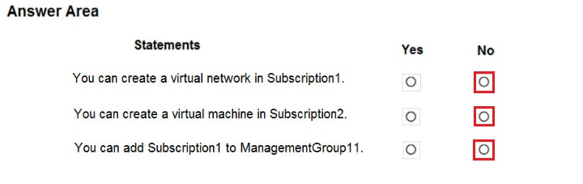

46. What is the effect of the policy? -- **You can create Azure SQL servers in ContosoRG1 only**

47. VNET1 will only have Department: D1 tag & VNET 2 will only have Label : Value1 tag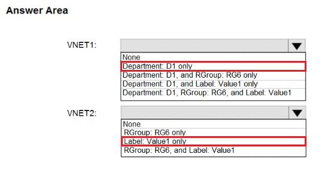

48. You need to identify which resources can be moved to AZPT2 -- **VM1, storage1, VNET1, VM1Managed, and RVAULT1**

49. You need to ensure that Admin1 can deploy the Marketplace resource successfully -- **From Azure PowerShell, run the Set-AzMarketplaceTerms cmdlet**

50. You need to assign the User administrator administrative role to AdminUser1  -- **From the Directory role blade, modify the directory role**

51. You need to ensure that 10 users can use all the Azure AD Premium features -- **From the Licenses blade of Azure AD, assign a license**

52. You need to ensure that an alert is set in Service Manager when the amount of available memory on VM1 is below 10 percent -- **Deploy the IT Service Management Connector (ITSM)**

53. You need to add a user named admin1@contoso.com as an administrator on all the computers that will be joined to the Azure AD domain -- **Device settings from the Devices blade**

54. User1 can add Device2 to Group1: No
    User2 can add Device1 to Group1: Yes
    User2 can add Device2 to Group2: No

55. When the project is complete, you attempt to delete RG26 from the Azure portal. The deletion fails.
    You need to delete RG26.  -- **Stop the backup of SQLDB01**

56. You have an Azure subscription named Subscription1 that contains a virtual network named VNet1. VNet1 is in a resource
    group named RG1.
    Subscription1 has a user named User1. User1 has the following roles:
    ? Reader
    ? Security Admin
    ? Security Reader

    You need to ensure that User1 can assign the Reader role for VNet1 to other users.  -- **Assign User1 the User Access Administrator role for VNet1.**

57. You need to ensure that Azure can verify the domain name, Which type of DNS record should you create?  -- **MX**

58. On Subscription1, you assign the DevTest Labs User role to the Developers group  -- **No**

59. On Subscription1, you assign the Logic App Operator role to the Developers group -- **No**

60. On Dev, you assign the Contributor role to the Developers group.  -- **YES**

61. You need to send a report to the finance department. The report must detail the costs for each department.
    Which three actions should you perform in sequence? 

    ```
    Box 1: Assign a tag to each resource
    Box 2: From the Cost analysis blade, filter the view by tag
    Box 3: Download the usage report
    ```

62. You have an Azure subscription named Subscription1 that contains an Azure Log Analytics workspace named Workspace1， You need to view the error events from a table named Event  -- **search in (Event) "error"**

63. 

64. RG1 has a web app named WebApp1. WebApp1 is located in West Europe.
    You move WebApp1 to RG2.
    What is the effect of the move?  -- **The App Service plan for WebApp1 remains in West Europe. Policy2 applies to WebApp1**
65. 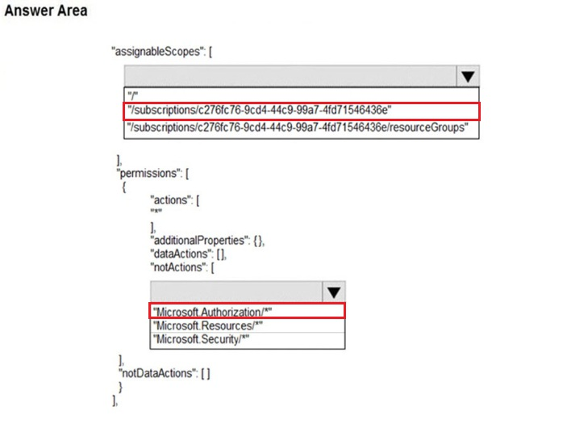

66. You need to ensure that the connections to App1 are spread across all the virtual machines -- **an internal load balancer，an Azure Application Gateway**
67. You need to quickly identify underutilized virtual machines that can have their service tier changed to a less expensive
    offering.
    Which blade should you use?  -- **Advisor**
68. The Answer is correct .
    - Select Users & Groups : Where you have to choose all users.
    - Select Cloud apps or actions: to specify the Azure portal
    - Grant: to grant the MFA


69. You need to ensure that Admin1 can invite the external partner to sign in to the Azure AD tenant -- **From the Users settings blade, modify the External collaboration settings**
70. You need to ensure that User1 can assign a policy to the tenant root management group -- **Assign the Global administrator role to User1, and then instruct User1 to configure access management for Azure resources**
71. User 1: Group 1 only
    User 2: Group 1 & 2
72. **Box 1:User1 and User3 only**
    You must use Windows Server Active Directory to update the identity, contact info, or job info for users whose source of authority is Windows Server Active Directory.
    **Box 2: User1, User2, and User3**
    Usage location is an Azure property that can only be modified from Azure AD (for all users including Windows Server AD users synced via Azure AD Connect)
73. You assign the Network Contributor role at the subscription level to Admin1  -- **Yes**
74. You assign the Owner role at the subscription level to Admin1  -- **Yes**
75. You assign the Reader role at the subscription level to Admin1  -- **No**
76. Which role-based access control (RBAC) role should you assign to User1 -- **Contributor**
77. 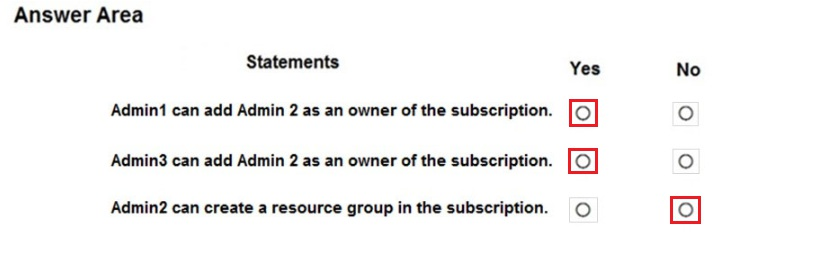

78. You need to ensure that a service running on VM1 can manage the resources in RG1 by using the identity of VM1.
    What should you do first? -- **From the Azure portal, modify the Managed Identity settings of VM1**
79. You need to delete TestRG -- **Remove the resource lock from VNET1 and delete all data in Vault1**
80. You need to delegate a subdomain named research.adatum.com to a different DNS server in Azure --  **Create an NS record named research in the adatum.com zone**
81. Add the custom domain name to your directory，Add a DNS entry for the domain name at the domain name registrar，Verify the custom domain name in Azure AD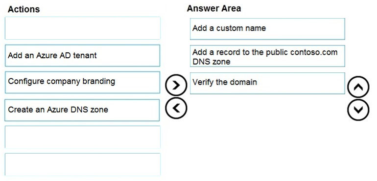


82. You need to ensure that records created in the contoso.com zone are resolvable from the internet -- **Modify the NS records in the DNS domain registrar**
83. 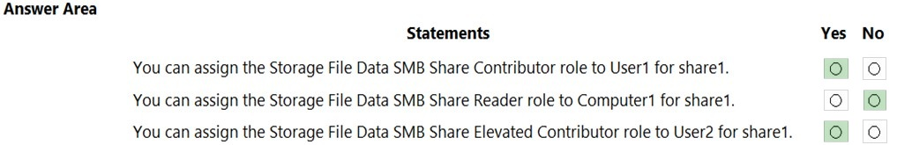


84. 

Box 1: User1 and User3 only.
User1: The Owner Role lets you manage everything, including access to resources.
User3: The Network Contributor role lets you manage networks, including creating subnets.
Box 2: User1 only.
The Security Admin role: In Security Center only: Can view security policies, view security states, edit security policies, view
alerts and recommendations, dismiss alerts and recommendations


85. 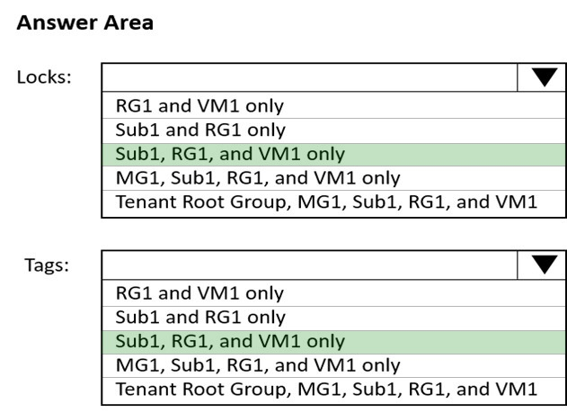

Box 1: Sub1, RG1, and VM1 only -
You can lock a subscription, resource group, or resource to prevent other users in your organization from accidentally
deleting or modifying critical resources.
Box 2: Sub1, RG1, and VM1 only -
You apply tags to your Azure resources, resource groups, and subscriptions


86. You need to create and upload a file for the bulk delete  -- **The user principal name of each user only**
87. 

Box 1: No -
The Azure Policy will add Tag4 to RG1.
Box 2: No -
Tags applied to the resource group or subscription aren't inherited by the resources although you can enable inheritance
with Azure Policy. Storage1 has Tag3:
Value1 and the Azure Policy will add Tag4.
Box 3: No -
Tags applied to the resource group or subscription aren't inherited by the resources so VNET1 does not have Tag2.
VNET1 has Tag3:value2. VNET1 is excluded from the Azure Policy so Tag4 will not be added to VNET1


88. You assign the Traffic Manager Contributor role at the subscription level to Admin1 -- **No**
89. You need to grant user management permissions to a local administrator in each office  -- **administrative units**
90. you assign the Logic App Contributor role to the Developers group  -- **YES**
91. 


1) User1 can "assign access to other users for" LB1.
2) User1 can "delete a virtual machine from" the resource group


92.  You have an Azure subscription named Subscription1 that contains a virtual network named VNet1. VNet1 is in a resource
    group named RG1.
    Subscription1 has a user named User1. User1 has the following roles:
    ? Reader
    ? Security Admin
    ? Security Reader
    You need to ensure that User1 can assign the Reader role for VNet1 to other users.
    What should you do?

    -- **Assign User1 the Owner role for VNet1**  or **Assign User1 the User Access Administrator role for VNet1** or **Assign User1 the Access Administrator role for VNet1**

93. 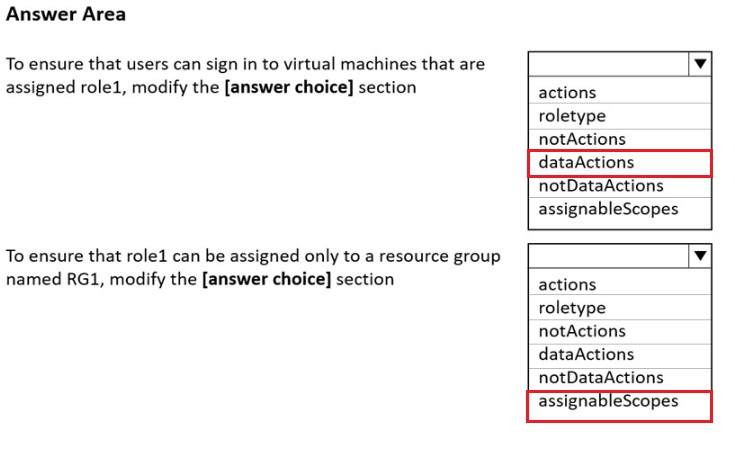

correct answer is **dataActions** and **assignableScopes**

94. You need to grant Group1 the Storage File Data SMB Share Elevated Contributor role for share1  -- **Enable Active Directory Domain Service (AD DS) authentication for storage1**
95. You need to ensure that Group1 can manage role assignments for the existing subscriptions and the planned subscriptions  -- **Assign Group1 the User Access Administrator role for the root management group**
96. 

97.  You need to create new user accounts in external.contoso.onmicrosoft.com  ，You instruct User2 to create the user accounts   -- **No**
98. You need to create new user accounts in external.contoso.onmicrosoft.com.
    Solution: You instruct User4 to create the user accounts   -- **No**
99. You need to create new user accounts in external.contoso.onmicrosoft.com.
    Solution: You instruct User3 to create the user accounts.  -- **No**
100. You need to ensure that you can apply the custom role to any resource group in Sub1 and Sub2. The solution must minimize
     administrative effort  -- **Select the custom role and add Sub1 and Sub2 to the assignable scopes. Remove RG1 from the assignable scopes.**
101. 


**Upload blob data to storageacct1234， View blob data in storageacct1234**


102.  You need to ensure that the developers of App1 can use their Azure AD credentials to deploy content to App1  -- **Assign the Website Contributor role to the developers**
103. From Azure AD in the Azure portal, you use the Bulk invite users operation  -- **No**
104. 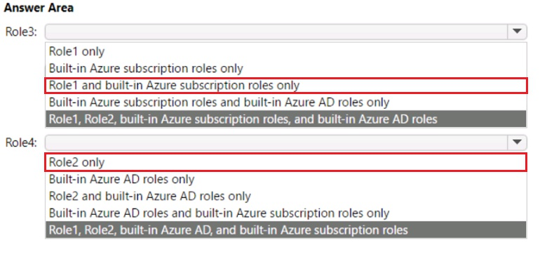

Role3: Role1 and built-in Azure subscription roles only
Role4: Role2 only


105. 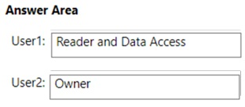


Answer is correct.
"Reader and Data Access":
"Lets you view everything but will not let you delete or create a storage account or contained resource. It will also allow
read/write access to all data contained in a storage account via access to storage account keys


106. You need to ensure that the virtual machines can access Vault1  -- **a service tag**

107. Which users are assigned the Azure Active Directory Premium Plan 2 license -- **User1 and User4 only**
108. 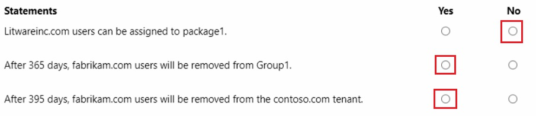


N - Because not Connected
Y - Because when it expires it is removed from the group. Proof to follow
Y - Because..math


109. 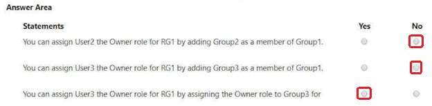


110. You need to ensure that all the traffic from VM1 to storage1 travels across the Microsoft backbone network.  -- **private endpoints** or **service endpoints**

111. 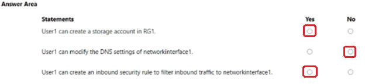

Correct Answers. YES, No, Yes
(YES)User1 can create a storage account in RG1, since User1 has Storage Account Contribute Role inherited from Resource
Group.
(NO) User1 can modify the DNS settings of networkinterface1, since it requires Network Contribute role referring to the following
link.
https://learn.microsoft.com/en-us/azure/virtual-network/virtual-network-network-interface?tabs=network-interface-
portal#permissions
(YES) User1 can create an inbound security rule to filter inbound traffic to networkinterface1, since User1 has Contributor role for
NSG1


112. 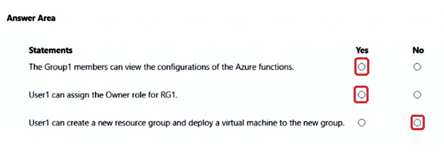


113. You need to assign User1 the Storage File Data SMB Share Contributor role for share1 -- **Configure Access control (IAM) for share1**
114. 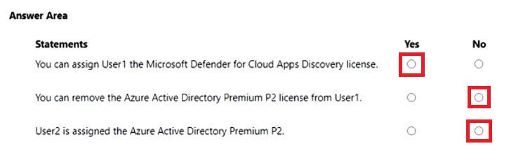


115. 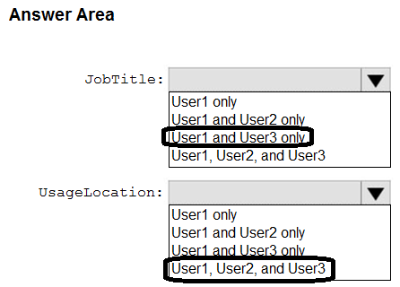
116. You create a PowerShell script that runs the New-MgUser cmdlet for each external user  -- **No**
117. You create a PowerShell script that runs the New-MgInvitation cmdlet for each external user -- **Yes**
118. 

119. 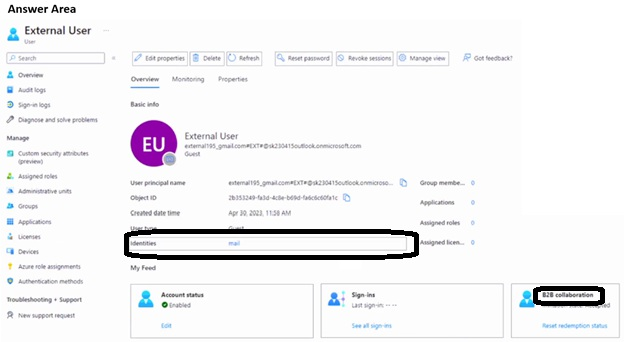
120. You need to assign Workspace1 a role to allow read, write, and delete operations for the data stored in the containers of
     storage1. -- **Storage Blob Data Contributor**
121. You purchase Azure Active Directory Premium P2 licenses.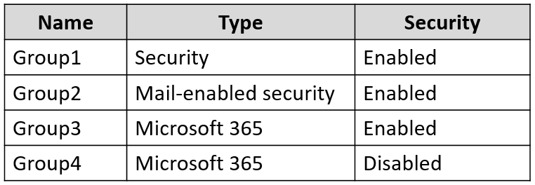
     To which groups can you assign a license?  -- **Group1 and Group3 only**
122. 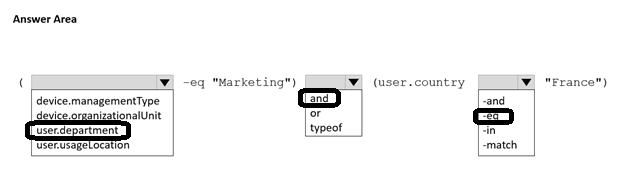


123. 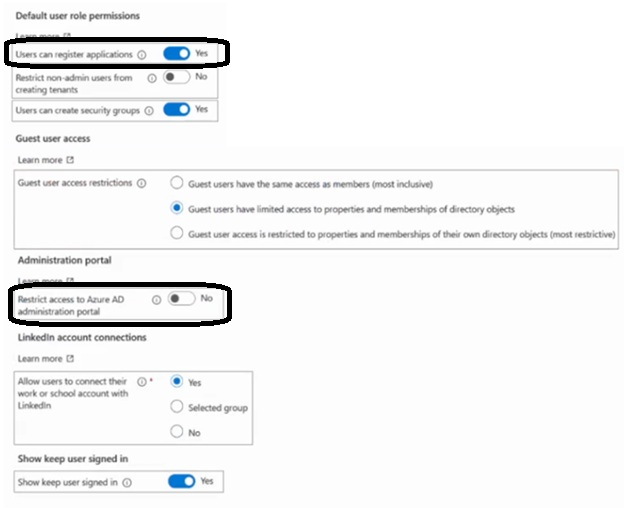

124. 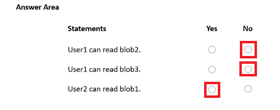


1- User 1 can read Blob2 - No, because he is reading, then the condition a. applies, and he is not reading cont1
2- User 1 can read Blob3 - No, because he is reading, then the condition a. applies, and he is not reading cont1
3- User 2 can read blob 1 - Yes. He is not writing, so the condition b. does not apply. He has permissions granted by the role on
the scope he is reading - Storage Blob Data Owner on storage1, which contains blob

125. You create a PowerShell script that runs the New-MgUser cmdlet for each user  -- **No**
126. 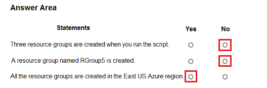


127. To what can you add Admin1 as a co-administrator  -- **Sub1**

128. 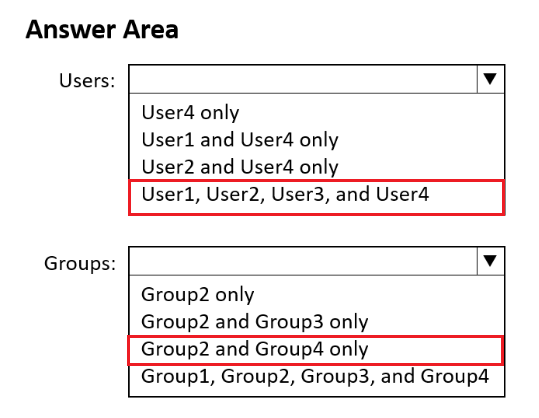

129. 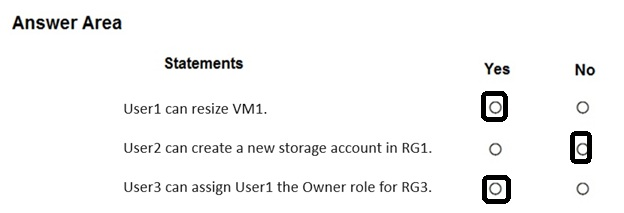


130. You need to ensure that imported user objects are added automatically as the members of a specific group based on each
     user's department. The solution must minimize administrative effort -- **Create groups that use the Dynamic User membership type， Create a CSV file that contains user information and the appropriate attributes**
131. You need to ensure that the access keys for storage1 rotate automatically -- **an Azure key vault**
132. You need to enable self-service password reset (SSPR)  -- **Group1 and Group2 only**
133. 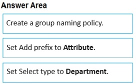

134. 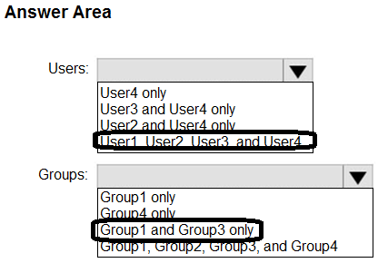
135. 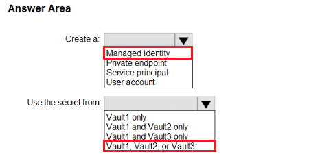
136. You need to ensure that invitations can be sent only to fabrikam.com users  -- **From External collaboration settings, configure the Collaboration restrictions settings**
137. You need to assign a role to a user named User1 to ensure that the user can access the blob data in storage1. The role
     assignment must support conditions -- **Storage Blob Data Contributor，Storage Blob Data Owner**
138. 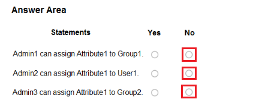
139. You purchase a Microsoft Fabric license，To which identities can you assign the license? -**-User1 only**
140. You need to ensure that users receive a warning message when they generate a SAS that exceeds a seven-day time period.
     What should you do for storage? -- **Set Allow recommended upper limit for shared access signature (SAS) expiry interval to Enabled**
141. You plan to use the Azure Import/Export service to export data from Subscription1 --**storage4**
142. 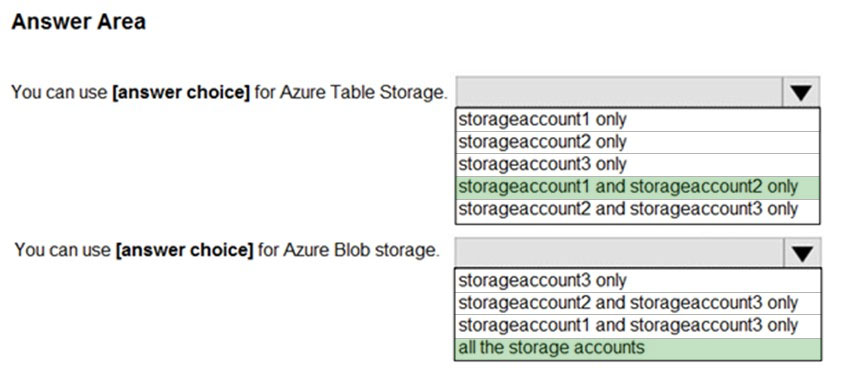
143. You plan to export data by using Azure import/export job named Export1 --**container1**
144. 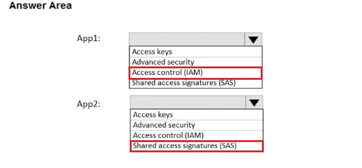
145. 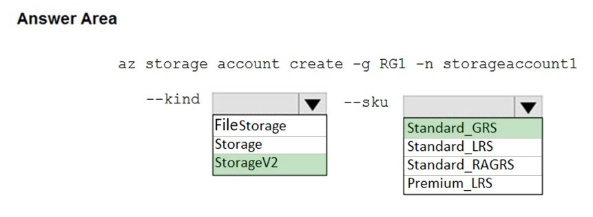
146. You need to synchronize the files in the file share named data to an on-premises server named Server1 --**Register Server1 ，Install the Azure File Sync agent on Server1，Create a sync group**
147. 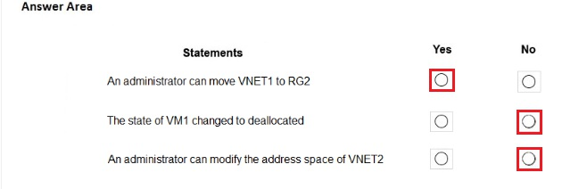
148. 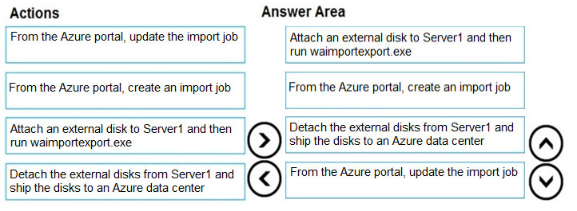
149. 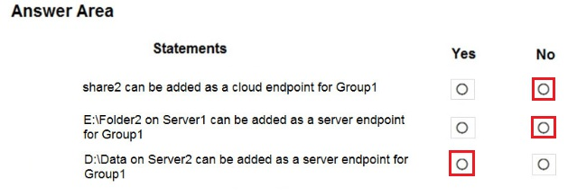
150. 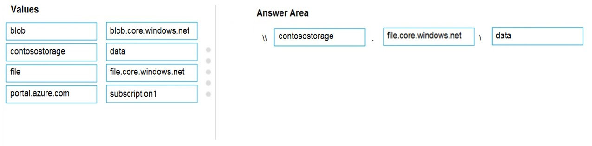
151. 
152. 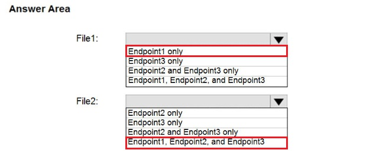
153. 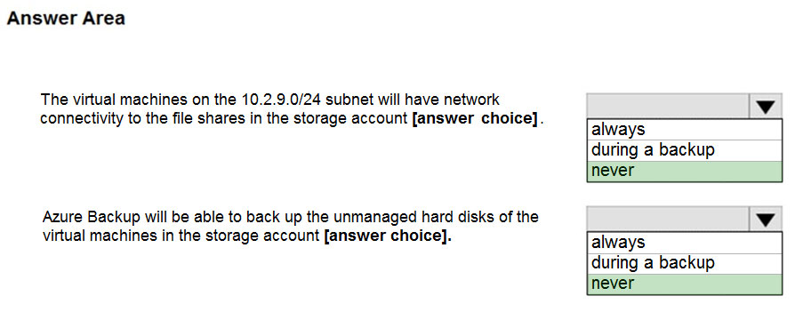
154. 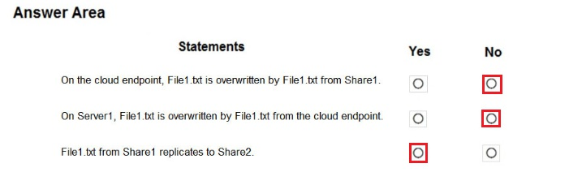
155. You need to identify which storage account can be converted to zone-redundant storage (ZRS) replication by requesting a live
     migration from Azure support  --- **storage2**
156. You plan to use the disk files to provision an Azure virtual machine named VM1 -- **From the Networking blade of account1, select Selected networks.，From the Networking blade of account1, add the 131.107.1.0/24 IP address range.**
157. 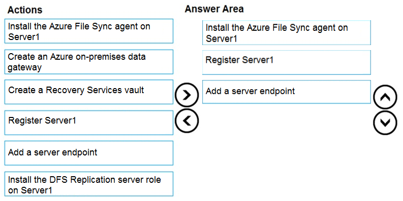
158. 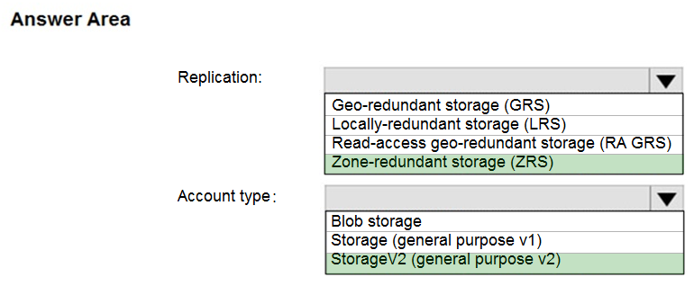
159. Which two files should you create before you prepare the drives for the import job -- **a dataset CSV file，a driveset CSV file**
160. You need to delete the Recovery Services vault -- **From the Recovery Service vault, stop the backup of each backup item.**
161. 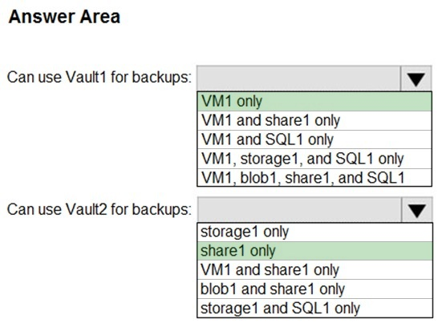
162. You have an Azure subscription named Subscription1.
     You have 5 TB of data that you need to transfer to Subscription1.
     You plan to use an Azure Import/Export job.
     What can you use as the destination of the imported data?  -- **Azure File Storage，Azure Blob storage*
163. 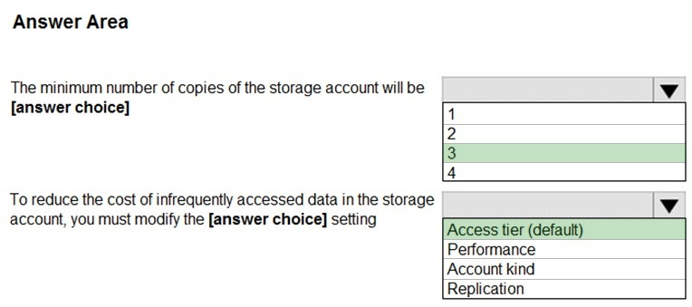
164. You plan to use AzCopy to copy data to storage1 -- **blob and file only** 
165. 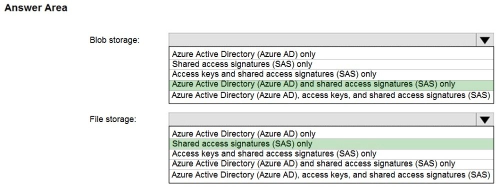
166. You need to configure a storage service for Container1 --  **Azure Files**
167. What should you include in the Availability Set --  **two update domains**
168. 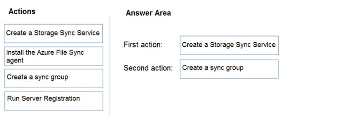
169. 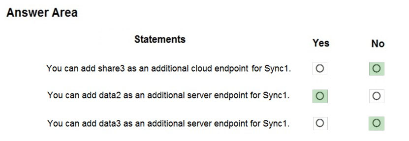
170. 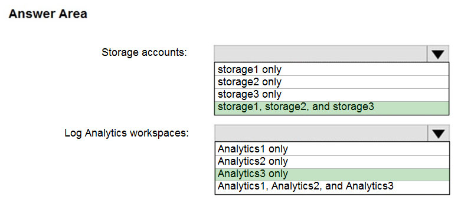
171. 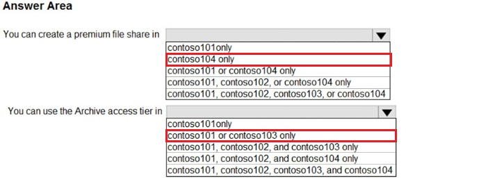
172. 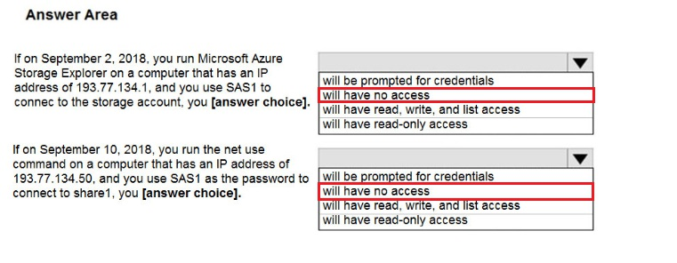
173. You need to back up VM2 to RSV2  -- **From the RSV1 blade, click Backup items and stop the VM2 backup**
174. You need to ensure that the data in the storage account is protected if a zone fails  -- **Upgrade the account to general-purpose v2**
175. You plan to manage the data stored in the accounts by using lifecycle management rules. -- **storage1, storage2, and storage3 only**
176. Which outbound port should you open between the home computers and the data file share --**445**
177. 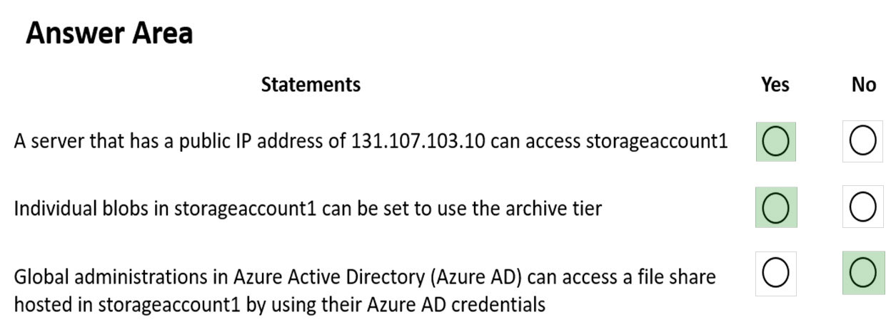
178. From which devices can you use AzCopy to copy data to storage1 -- **Device1, Device2 and Device3**
179. You need to prevent new content added to container1 from being modified for one year -- **an access policy**
180. 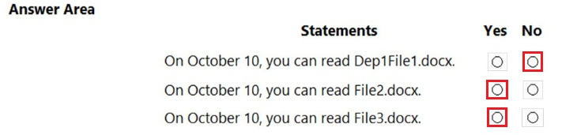
181. You need to ensure that the members of a group named Group1 can upload files by using the Azure portal. The solution must use the principle of least privilege -- **Storage Blob Data Contributor，Reader**
182. 
183. You need to copy the contents of D:\Folder1 to the public container in an Azure Storage account named contosodata -- **azcopy copy D:\folder1 https://contosodata.blob.core.windows.net/public --recursive**
184. You need to ensure that you can set Account kind for storage1 to BlockBlobStorage -- **Performance**
185. 
186. For one of the containers, you need to use a different key to encrypt data at rest -- **Create an encryption scope**
187. 
188. 
189. 
190. 
191. Which tasks can you perform by using Azure Storage Explorer -- **Task2, Task3, and Task4 only**
192. 
193. You need to use customer-managed key encryption for container1 --**an RSA key type with a key size of 2048, 3072, or 4096 only**
194. 
195. 
196. What is the state of File1 on June 7 -- **deleted**
197. 
198. 
199. You need to ensure that share1 can support SMB Multichannel，The solution must minimize costs. -- **Premium performance with locally-redundant storage (LRS)**
200. You plan to use conditions when assigning role-based access control (RBAC) roles to storage1 -- **containers and queues only**
201. 
202. You assign the Storage Account Encryption Scope Contributor Role to User1  -- **No**
203. 
204. 
205. You need to ensure that the users can view only specific blobs based on blob index tags -- **a role assignment condition**
206. Which storage types can you encrypt by using Scope -- **containers only**
207. 
208. 
209. You need to prepare Vault1 for Azure Disk Encryption -- **Create a new key.， Select Azure Disk Encryption for volume encryption**
210. Store and use the encryption key in KV1. -- **Azure Disk Encryption**
211. 
212. Apply access permissions to all the content in the container  -- **a shared access signature (SAS)**
213. Automatically replicate data to a secondary Azure region -- **the Cool access tire，geo-redundant storage (GRS)，hierarchical namespace**
214. 
215. Which storage account can be converted to zone-redundant storage (ZRS) replication  

-- **Storage2**

216. On which devices can you install Azure Storage Explorer

     **Device1, Device2, and Device3 only**

217. You assign the Storage Account Key Operator Service Role to User1 -- **Yes**

218. 

219. 

220. 

221. 

222. 

223. 

224. You assign the Reader and Data Access role to User1  -- **No**

225. What should you do first for ContReg1 --  **Upgrade the SKU**

226. 

227. You need to configure encryption for the virtual machines. -- **VM2 and VM3**

228. You need to implement the planned changes for the storage account content -- **cont1, share1, and share2 only**

229. From Azure CLI, you run az aks -- **No**

230. From Azure CLI, you run the kubectl client -- **Yes**

231. From Azure CLI, you run azcopy -- **No**

232.  You create an Azure storage account and configure shared access signatures (SASs) -- **No**

233. 

234. What should you create to store the password --**an Azure Key Vault and an access policy**

235. 

236. 

237. You plan to automate the deployment of a virtual machine scale set that uses the Windows Server 2016 Datacenter image. --  **Upload a configuration script，Modify the extensionProfile section of the Azure Resource Manager template**

238. 

239. 

240. You need to deploy the virtual machine to the West US location by using Template1 -- **Modify the location in the resources section to westus**

241. You need to create a staging slot for Plan1 -- **From Plan1, scale up the App Service plan**

242. You need to ensure that App1 always runs on at least eight virtual machines during planned Azure maintenance. -- **one virtual machine scale set that has 10 virtual machines instances**

243. You create an event subscription on VM1. You create an alert in Azure Monitor and specify VM1 as the source
     Does this meet the goal --**No**

244. From the Overview blade, you move the virtual machine to a different subscription -- **No**

245. From the Redeploy blade, you click Redeploy -- **Yes**

246. From the Update management blade, you click Enable -- **No**

247. You need to add a custom domain named www.contoso.com to webapp1 -- **Create a DNS record**

248. You move VM1 to RG2, and then you add a new network interface to VM1 --**No**

249. You delete VM1. You recreate VM1, and then you create a new network interface for VM1 and connect it to VNET2.
     Does this meet the goal?  -- **Yes**

250. You turn off VM1, and then you add a new network interface to VM1 -- **No**

251. 

252. 

253. You need to provide internet users with access to the applications that run in Cluster1.
     Which IP address should you include in the DNS record for Cluster1?

 --  **131.107.2.1**

254. You need to identify what to deploy before you deploy Template1 -- **one App Service plan**

255. 

256. Which change will cause downtime for VM1 -- **Change the size to D8s v3** 

257. You need to ensure that the App1 update is tested before the update is made available to users -- **Swap the slots， Deploy the App1 update to webapp1-test, and then test the update**

258. You need to record all the successful and failed connection attempts to VM1 -- **Create an Azure Storage account，Register the Microsoft.Insights resource provider.Enable Azure Network Watcher flow logs.** 

259. You need to deploy an Azure virtual machine scale set that contains five instances as quickly as possible -- **Deploy one virtual machine scale set that is set to ScaleSetVM orchestration mode**

260. 

     What is the minimum number of App Service plans you should create for the web apps?  -- **2**

261. 

262.  From the Subscriptions blade, you select the subscription, and then click Programmatic deployment -- **No**

263. You create a new network interface, and then you add the network interface to VM1 -- **No**

264. Which users are members of the local Administrators group?

-- **User1 and User2 only**

265. 

266. 

267. 

268. You plan to use Vault1 for the backup of as many virtual machines as possible  -- **VM1, VM3, VMA, and VMC only**

269. You need to configure cluster autoscaler for AKS1 --  **the az aks command，the Azure portal**

270. You create a container image named App1 on your administrative workstation -- **Run the docker push command.**

271. Which proximity placement groups should you use? --**Proximity2 only**

272. From the Subscriptions blade, you select the subscription, and then click Resource providers.  -- **No**

273. From the RG1 blade, you click Automation script. -- **No**

274. From the RG1 blade, you click Deployments.  -- **yes**

275. You need to monitor the metrics and the logs of VM1 -- **Linux Diagnostic Extension (LAD) 3.0**

276. 

277. You need to ensure that at least two virtual machines are available if a single Azure datacenter becomes unavailable -- **each virtual machine in a separate Availability Zone**

278. You plan to deploy a virtual machine named VM2 from Template1. -- **resource group**

279. What task should you include in the runbook? --  **Modify the VM size property of VM1**

280. You need to ensure that NGINX is available on all the virtual machines after they are deployed --  **A Desired State Configuration (DSC) extension， Azure Custom Script Extension**

281. 

282. Which changes will be lost after you redeploy VM1 -- **the new files on drive D**

283. You need to ensure that you can use the disks attached to VM1 as a template for Azure virtual machines.
     What should you modify on VM1?  -- **the hard drive**

284. 

285. From which blade can you view the template that was used for the deployment  -- **RG1**

286. You swap webapp1-test for webapp1-prod and discover that App1 is experiencing performance issues.
     You need to revert to the previous version of App1 as quickly as possible. --**Swap the slots**

287. 

288. What is a possible cause of the Warning status  -- **VM1 does not have the latest version of the Azure VM Agent (WaAppAgent.exe) installed**

289. From the Overview blade, you move the virtual machine to a different resource group. -- **No**

290. 

291. You create an Azure Log Analytics workspace and configure the Agent configuration settings. You install the
     Microsoft Monitoring Agent on VM1. You create an alert in Azure Monitor and specify the Log Analytics workspace as the
     source.  --**Yes**

292. 

293. You need to identify in which of the currently used locations you can deploy ASP5. -- **West US, Central US, or East US**

294. 

295.  From Azure Cloud Shell, you run az aks.  -- **No**

296. You create an Azure Log Analytics workspace and configure the Agent configuration settings. You install the
     Microsoft Monitoring Agent on VM1. You create an alert in Azure Monitor and specify the Log Analytics workspace as the
     source.-- **No**

297. 

298. 

299. You create an Azure Log Analytics workspace and configure the **Agent configuration settings**. You install the
     Microsoft Monitoring Agent on VM1. You create an alert in Azure Monitor and specify the Log Analytics workspace as the
     source.   

     -- **Yes**

     You create an Azure Log Analytics workspace and configure the **data settings.** You add the Microsoft Monitoring
     **Agent VM extension** to VM1. You create an alert in Azure Monitor and specify the Log Analytics workspace as the source. 

      -- **No**

     You create an Azure Log Analytics workspace and configure the **data settings**. You install the Microsoft Monitoring
     **Agent** on VM1. You create an alert in Azure Monitor and specify the Log Analytics workspace as the source.  

     --**Yes**

300. You plan to restore the backup to a different virtual machine. -- **From VM2, install the Microsoft Azure Recovery Services Agent**

301. 

302. You create NIC2 in RG1 and West US. -- **Yes**

303. You create NIC2 in RG2 and Central US. -- **No**

304. You create NIC2 in RG2 and West US. -- **Yes**

305. You develop the following Azure Resource Manager (ARM) template to create a resource group and deploy an Azure Storage
     account to the resource group  -- **New-AzDeployment**

306. 

307. 

308. You need to scale up VM1 to a new virtual machine size, but the intended size is unavailable. --**Deallocate VM1**

309. 

310. 

311. 

312. You set Admin user to Enable for Registry1. -- **No**

313. You create a private endpoint connection for Registry1-- **No**

314. You need to ensure that Plan1 will scale automatically when the CPU usage of the web app exceeds 80 percent  -- **Rules Based in the Scale out method settings**

315. Which certificate can you use from Vault1 -- **Cert1 or Cert2 only**

316. From the resource group blade, move VM1 to another subscription  --**No**

317. From the VM1 Redeploy + reapply blade, you select Redeploy --**yes**

318. From the VM1 Updates blade, select One-time update.--**No**

319. You need to meet the technical requirements for the KEK --**Set-AzVMDiskEncryptionExtension and Key1.**

320. 

321. You need to connect the datacenters to the subscription. The solution must minimize network latency between the
     datacenters. -- **three virtual hubs and one virtual WAN**

322. 

323. What should you create on LB1 before you can create the new inbound NAT rules -- **a frontend IP address**

324. 

325. 

326. To which virtual networks can you establish a peering connection from VNet1  

     --**VNet3 and VNet4 only**

327.You need to implement an Azure load balancer for the NVAs. The solution must meet the following requirements:
? The NVAs must run in an active-active configuration that uses automatic failover.
? The load balancer must load balance traffic to two services on the Production subnet. The services have different IP
addresses.
Which three actions should you perform ---**Deploy a standard load balancer，Add two load balancing rules that have HA Ports and Floating IP enabled，Add a frontend IP configuration, two backend pools, and a health probe**

328.You need to ensure that you can connect Client1 to VNet2.  --**Download and re-install the VPN client configuration package on Client1**

329. 
330. To which subnets can you apply NSG1?

--  **the subnets on VNet3 only**

331. 

332. 

333. You need to ensure that webapp1 can access the data hosted on VM1  -- **Connect webapp1 to VNET1**

334. You need to enable Desired State Configuration for VM1 -- **Start VM1**

335. You need to ensure that visitors are serviced by the same web server for each request -- **Session persistence to Client IP and protocol ** or **Session persistence to Client IP**

336. You add an inbound security rule to NSG-Subnet1 that allows connections from the Any source to the *destination for
     port range 3389 and uses the TCP protocol. You remove NSG-VM1 from the network interface of VM1.  

     **--yes**
     You add an inbound security rule to NSG-Subnet1 that allows connections from the internet source to the
     VirtualNetwork destination for port range 3389 and uses the UDP protocol. 

     **-- no**

337. You add an inbound security rule to NSG-Subnet1 and NSG-VM1 that allows connections from the internet source to
     the VirtualNetwork destination for port range 3389 and uses the TCP protocol. **--yes**

338. 

339. What is the minimum number of NSGs you should create?  -- **1**

340. in RG1, you need to create a new virtual machine named VM2, and then connect VM2 to VNET1  --**Remove Microsoft.Compute/virtualMachines from the policy**

341. You need to move the adatum.com zone to an Azure DNS zone in Subscription1  -- **Azure CLI**

342. You need to direct all the Remote Desktop Protocol (RDP) connections to VM3 only  -- **an inbound NAT rule**

343. 

344. 

345. 

346. You need to prevent users of VM1 and VM2 from accessing websites on the Internet over TCP port 80 --**Associate the NSG to Subnet1**

347. You need to connect VNet1 to VNet2  -- **Provision virtual network gateways**

348. You need to ensure that VM1 can be created in an Availability Zone.  -- **Use managed disks，Availability options**

349. 

350. 

351. You modify the Azure Active Directory (Azure AD) authentication policies  -- **No**

352. You join Computer2 to Azure Active Directory (Azure AD)  -- **No**

353. You create a resource lock, and then you assign the lock to the subscription  -- **No**

354. You need to ensure that all the virtual machines can resolve DNS names by using the DNS service on VM1  -- **Configure peering between VNET1, VNET2, and VNET3**

355. 

356. You need to prevent RDP access to the virtual machines from the Internet, unless the RDP connection is established from the
     on-premises network  -- **Create a deny rule in a network security group (NSG) that is linked to Subnet1** 

357. Subnet1 is associated to VNet1. NIC1 attaches VM1 to Subnet1.  -- **Associate NIC1 to ASG1** 

358. You need to connect VNet1 to the on-premises network by using a site-to-site VPN  -- **Create a connection， Create a local site VPN gateway，Create a VPN gateway that uses the VpnGw1 SKU**

359. 

360. 

361. 

362. You need to create a network interface named NIC1  -- **East US only**

363. You need to ensure that VM1 can resolve host names in adatum.com  --**Configure the name servers for adatum.com at the domain registrar**

364. 

365. 

366. 

367. You create a Basic SKU public IP address, associate the address to the network interface of VM1   --**No**

368. You create a Standard SKU public IP address, associate the address to the network interface of VM1, and then stop
     VM2.--**No**

369. You create two Standard SKU public IP addresses and associate a Standard SKU public IP address to the network
     interface of each virtual machine --**yes**

370. You export the client certificate from Computer1 and install the certificate on Computer2  --**yes**

371. You need to ensure that users can connect to the website from the Internet. --**For Rule5, change the Action to Allow and change the priority to 401** 

372. From the Resource providers blade, you unregister the Microsoft.ClassicNetwork provider. --**No**

373. 

374. You create an inbound security rule that denies all traffic from the 131.107.100.50 source and has a cost of 64999. --**No**

375. You delete the BlockAllOther443 inbound security rule --**No**

376. You modify the priority of the Allow_131.107.100.50 inbound security rule.  --**No**

377. You assign a built-in policy definition to the subscription.  --**No**

378. For the AKS cluster, you need to choose a network type that will support App1  -- **Azure Container Networking Interface (CNI)**

379. You disassociate the public IP address from the network interface of VM2. -- **Yes**

380. You configure a custom policy definition, and then you assign the policy to the subscription.-- **Yes**

381. You need to view the average round-trip time (RTT) of the packets from VM1 to VM2 --**Connection monitor**

382. 

383. 

384. You perform a reverse DNS lookup for 10.0.0.4 from VM2.
     Which FQDN will be returned?  -- **vm1.internal.cloudapp.net**

385. You create an inbound security rule that allows any traffic from the AzureLoadBalancer source and has a cost of 150.  **--No**

386. You need to ensure that you can configure a point-to-site connection from an on-premises computer to VNet1.  -- **Create a route-based virtual network gateway，Delete GW1**

387. 

388. 

389. 

390. From Azure Network Watcher, you create a packet capture.  --**Yes**

391. From Azure Network Watcher, you create a connection monitor. **--No**

392.  From Performance Monitor, you create a Data Collector Set (DCS). **--No**

393. 

394.  From Azure Monitor, you create a metric on Network In and Network Out  **--No**

395. You create an inbound security rule that denies all traffic from the 131.107.100.50 source and has a priority of 64999.   **--No**

396. 

397. 

398. You plan to peer VNet1 to another virtual network named VNet2. VNet2 has an address space of 10.2.0.0/16.  --**Modify the address space of VNet1**

399. Which DNS names can you use to ping VM2?  -- **comp2.contoso.com only**

400. 

401. On Computer2, you set the Startup type for the IPSec Policy Agent service to Automatic.  -**-No**

402. Which public IP addresses can you use

-**- IP3 only**

403. You need to restrict network traffic between the pods  -- **the Calico network policy**
404. 
405. 
406. You plan to create a load balancing rule that will load balance HTTPS traffic between VM1 and VM2  --**a backend pool，a health probe**
407. Which type of public IP address SKU and assignment should you use for the gateway  -- **a standard SKU and a static IP address assignment**
408. 
409. 
410. Which SKU should you deploy  -- **ErGw3AZ**
411. 
412. 
413. You need to ensure that webapp1 can connect to Share1.  --**an Azure Virtual Network Gateway**
414. Which two resources can you associate to IP1? Each correct answer presents a complete solution.  --  **LB1，NIC1**
415. You need to allow access to storage1 from selected networks and your home office. The solution must minimize administrative effort.  --**Modify the Public network access settings.**
416. Which tunneling protocol should you use  -- **IKEv2**
417. You perform a test failover of VM1 and specify VNET2 as the target virtual network.  --**DemoSubnet1**
418. 
419. You need to configure NSG1 to allow inbound access to the virtual machines via Bastion1.  -- **443**
420. 
421. You need to deploy an Azure firewall named AF1 to RG1 in the West US Azure region.  -- **VNET1 only**
422. You need to monitor connectivity between the virtual machines and the on-premises network by using Connection Monitor.

What is the minimum number of connection monitors you should deploy?

-- **2**

423. 

424. You need to ensure that inbound user traffic uses the Microsoft point-of-presence (POP) closest to the user's location.  -- **Routing preference**

425. You need to prevent VM1 from accessing VM2 on port 3389  -- **Create a network security group (NSG) that has an outbound security rule to deny destination port 3389 and apply the NSG to the network interface of VM1**

426. You need to manage outbound traffic from VNET1 by using Firewall1 --**Create a route table**

427. You plan to deploy an Azure Bastion host named Bastion1 to VNet1 -- **VM1 only** 

428. You need to ensure that Bastion1 can support 100 concurrent SSH users.  --**Upgrade Bastion1 to the Standard SKU**

429. 

430. You plan to deploy an Azure Bastion Basic SKU host named Bastion1  

     -- **IP1 only**

431. You need to move VM1 to Sub2.  -- **VM1, Disk1, NetInt1, and VNet1**

432. You need to add a route to RT1 that specifies the next hop IP address  --**Virtual appliance**

433. You have the virtual networks shown in the following table,Which virtual networks can you peer with VNet1  

     -- **VNet2, VNet3, VNet4, and VNet5**

434. You need to enable multi-user authorization (MAU) for Vault1  -- **a resource guard** 

435. You create an inbound security rule that allows any traffic from the AzureLoadBalancer source and has a **priority** of 150  
     -- **Yes**
     You create an inbound security rule that allows any traffic from the AzureLoadBalancer source and has a **cost** of 150.
     -- **No**

436. You create a route table named RT1 in the East US Azure region  -- **Subnet1 only**

437. 

438. You need to configure secure RDP connections to the virtual machines by using Azure Bastion  

     What is the minimum number of Bastion hosts required?  -- **1**

439. 

440. 

441. What is the maximum number of virtual machines that can connect to Subnet1 -- **123**

442. What should you configure for container1  -- **the public networking type** 

443. 

444. 

445. You need to ensure that cont1 can be configured to use private networking  -- **Networking type**

446. To which virtual machines can you connect through Bastion1 -- **VM1 and VM2 only**

447. Which virtual networks can you peer with VNet1

     

     --**VNet3 and VNet4 only**


448. You create a Recovery Services vault  -- **Configure a virtual network.**
449. 
450. You need to ensure that all the traffic between VNet1 and VNet2 traverses the Microsoft backbone network.  --**peering** 
451. You need to configure access for users on the on-premises network to connect to a virtual machine on VNet2. The solution
     must minimize costs.  --**service chaining and user-defined routes (UDRs)**
452. You need to ensure that the traffic from VNet1 to VNet2 is inspected by using NetVA1  --**a route table that has custom routes**
453. You plan to schedule backups to occur every night at 23:00

--**VM1, VM2, VM3 and VM4**

454. What should you create for Azure Monitor --**an action group**

455. You need to protect VM3 and VM4 by using Recovery Services  --**Create a new Recovery Services vault**

456. 

457. You need to identity who will receive an email notification when Alert1 is triggered  --**User1 and User2 only**

458. 

459. 

460. You need to ensure that all the changes to VM1 are restored  --**Copy Budget.xls to Data**

461. 

462. You need to ensure that User1 can join the device to Azure AD  --**From the Device settings blade, modify the Maximum number of devices per user setting**

463. 

464. 

465. You instruct User1 to create the user accounts.  -- **Yes**

466. You need to monitor the latency between your on-premises network and the virtual machines -- **Network Performance Monitor**

467. 

468. 

469. 

470. Which target resource should you monitor in the alert rule  -- **Azure Log Analytics workspace** 

471. You need to identify unattached disks that can be deleted  --**From Azure Cost Management, view Advisor Recommendations**

472. You need to provide the developers of webapp1 with real-time access to the connection errors. The solution must provide all
     the connection error details  -- **From webapp1, enable Web server logging**

473. You need to monitor the availability of App1 by using a multi-step web test -- **Azure Application Insights**

474. 

475. You need to recover VM1 to a point eight days ago. The solution must minimize downtime.  --**Restore VM1 by using the Create new restore configuration option**

476. 

477. 

478. 

479. 

480. 

481. You need to centrally monitor user activity across all the subscriptions  -- **a Log Analytics workspace**

482. 

483. To what should you set Destination in the rule  --**Service Tag**

484. You need to collect performance traces for App1 --**Azure Application Insights Profiler**

485. You need to back up App1. The solution must minimize costs.  --**storage2** 

486. 

487. You need to use Traffic Analytics in Azure Network Watcher to monitor virtual machine traffic.  --**a Log Analytics workspace,a storage account** 

488. 

     What is the minimum number of service endpoints you should add to VNET1  --**2**

489. You need to configure an Azure web app named contoso.azurewebsites.net to host www.contoso.com. -- **Create a *TXT record named asuid* that contains the domain verification ID.**

490. You need to configure an Azure Monitor Network Insights alert that will be triggered when suspicious network traffic is
     detected.  -- **Configure NSG flow logs.**

491. 

492. You need to ensure that when blob data is added to storage1, a secondary copy is created in the East US region. The solution
     must minimize administrative effort.  -- **object replication**

493. You need to collect performance data and events from the virtual machines. The solution must meet the following
     requirements:
     • Logs must be sent to Workspace1 and Workspace 2.
     • All Windows events must be captured.
     • All security events must be captured.
     What should you install and configure on each virtual machine?

-- **the Azure Monitor agent**


494. You need to create an alert rule that will run App1 if VM1 stops  --**an action group**
495. You need to create a dashboard to display detailed metrics and a visual representation of the network topology -- **Azure Monitor Network Insights**
496. A user reports that he cannot use port 33000 to connect from a virtual machine in one region to a virtual machine in another
     region. Which two options can you use to diagnose the issue?   --**IP flow verify,Connection troubleshoot**
497. You need to receive an email alert when a resource lock is removed from any resource in the subscription.   -**-a resource, a condition, and an action group**
498. 
499. 
500. 
501. You need to ensure that all the virtual machines only communicate with Azure Monitor through VNet1  --**an Azure Monitor Private Link Scope (AMPLS)**
502. 
503. You need to monitor input events for Job1 to identify the number of events that were NOT processed --**Backlogged Input Events**
504. You plan to use Azure Monitor to monitor the performance of DB1. You must be able to run queries to analyze log data  -- **Send to a Log Analytics workspace**
505. You plan to use the Azure Monitor Agent to collect events from Windows System event logs.
     You only need to collect system events that have an ID of 1001.
     Which type of query should you use for the data source in Rule1?

**-- XPath**


506. You need to use Connection Monitor to identify network latency between VM1 and DC1.
     What should you install on DC1?  -- **an Azure Monitor agent extension** 
507. You need to monitor VM1 traffic by using Traffic Analytics.  --**NSG flow logs for NSG1**
508. You need to collect the IIS logs from each virtual machine and store them in a Log Analytics workspace.  --**Diagnostic settings**
509. 
510. 

511. 

512. 

513. You need to meet the user requirement for Admin1  -- **From the Subscriptions blade, select the subscription, and then modify the Properties**

514. 

515. 

516. 

517. You need to ensure that you can grant Group4 Azure RBAC read only permissions to all the Azure file shares.
     What should you do?  --**On storage2, enable identity-based access for the file shares.**

518. You need to implement a backup solution for App1 after the application is moved.
     What should you create first?  --**a Recovery Services vault**

519. You need to move the blueprint files to Azure  --Use Azure Storage Explorer to copy the files.

520. 

521. 

522. 

523. 

524. You need to identify which storage account to use for the flow logging of IP traffic from VM5. The solution must meet the
     retention requirements.
     Which storage account should you identify?   --**storage2**

525. You discover that VM3 does NOT meet the technical requirements.
     You need to verify whether the issue relates to the NSGs.
     What should you use?  --**IP flow verify in Azure Network Watcher**

526. You need to ensure that VM1 can communicate with VM4. The solution must minimize the administrative effort.
     What should you do?  --**Establish peering between VNET1 and VNET3.** 

527. 

528. 

529. You are planning the move of App1 to Azure.
     You create a network security group (NSG).
     You need to recommend a solution to provide users with access to App1.
     What should you recommend?  --**Create an incoming security rule for port 443 from the Internet. Associate the NSG to the subnet that contains the web servers.**

530. 

531. You need to add VM1 and VM2 to the backend pool of LB1  --**Redeploy VM1 and VM2 to the same availability set.**

532. You need to ensure that VM1 can communicate with VM4. The solution must minimize administrative effort  --**Establish peering between VNET1 and VNET3.** 

533. 

534. You need to recommend a solution to automate the configuration for the finance department users. The solution must meet
     the technical requirements.
     What should you include in the recommendation?   --**dynamic groups and conditional access policies** 

     

## 备考建议

1. **系统学习**：按照题库分类，逐一学习每个知识点
2. **反复练习**：多做题目，加深对知识点的理解和记忆
3. **错题分析**：重点关注错误题目，理解错误原因
4. **实践操作**：结合Azure Portal或Azure CLI进行实际操作练习
5. **模拟考试**：使用官方或第三方模拟考试工具进行模拟测试

## 资源推荐

- [官方AZ104考试指南](https://learn.microsoft.com/en-us/certifications/exams/az-104)
- [Azure学习路径](https://learn.microsoft.com/en-us/training/paths/az-104-administrator/)
- [Microsoft Learn](https://learn.microsoft.com/en-us/azure/)

## 结语

本题库将持续更新和完善，欢迎大家在评论区提出建议和补充。祝各位考生备考顺利，成功通过AZ104认证考试！

---

**题目添加区域**：

在这里添加您的AZ104考试题目，按照上面的题目格式示例进行组织。

---

**题目添加区域结束**

---

## 更新记录

- 2025-12-01：初始创建题库模板
- [日期]：[更新内容]