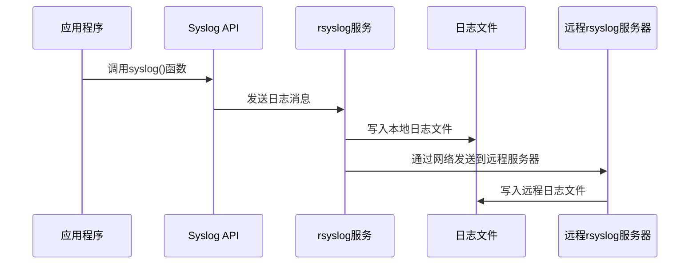

# Linux系统管理核心技能总结

## 一、sudo配置文件格式与示例

### 1.1 sudo配置文件概述

sudo（Super User Do）允许普通用户以超级用户或其他用户身份执行命令，是Linux系统中权限管理的重要工具。其配置文件主要是`/etc/sudoers`，为了安全起见，建议使用`visudo`命令编辑，该命令会进行语法检查，避免配置错误导致权限问题。

### 1.2 sudoers文件格式

```bash
# 基本语法格式
user    host=(runas)    commands

# 示例
root    ALL=(ALL:ALL)   ALL
```

- **user**：指定哪个用户可以使用sudo
- **host**：指定在哪些主机上可以使用sudo
- **(runas)**：指定可以以哪个用户身份执行命令，格式为`(user:group)`
- **commands**：指定可以执行的命令

### 1.3 配置示例

#### 1.3.1 允许特定用户执行所有命令

```bash
# 允许alice用户在所有主机上以任何用户身份执行所有命令
alice    ALL=(ALL)    ALL
```

#### 1.3.2 允许特定组执行特定命令

```bash
# 允许wheel组用户执行所有命令
%wheel    ALL=(ALL)    ALL

# 允许admin组用户执行关机和重启命令
%admin    ALL=/sbin/shutdown, /sbin/reboot
```

#### 1.3.3 免密码执行命令

```bash
# 允许bob用户免密码执行所有命令
bob    ALL=(ALL)    NOPASSWD: ALL

# 允许dev组用户免密码执行特定命令
%dev    ALL=NOPASSWD: /usr/bin/git, /usr/bin/docker
```

#### 1.3.4 限制命令参数

```bash
# 允许backup用户仅使用特定参数执行tar命令
backup    ALL=/bin/tar -czf /backup/*.tar.gz /home
```

## 二、时间同步服务器搭建

### 2.1 时间同步的重要性

在分布式系统中，时间同步至关重要，它确保了日志记录、事件顺序、认证机制等的准确性。NTP（Network Time Protocol）是实现网络时间同步的标准协议。

### 2.2 NTP服务器搭建

#### 2.2.1 安装NTP服务

```bash
# CentOS/RHEL
yum install -y ntp ntpdate

# Ubuntu/Debian
apt update && apt install -y ntp
```

#### 2.2.2 配置NTP服务器

编辑`/etc/ntp.conf`文件：

```bash
# 使用国内可靠的NTP服务器
server cn.ntp.org.cn iburst
server ntp.aliyun.com iburst
server ntp.tencent.com iburst

# 允许本地网络客户端访问
restrict 192.168.1.0 mask 255.255.255.0 nomodify notrap

# 禁止其他网络访问
restrict default kod nomodify notrap nopeer noquery
restrict -6 default kod nomodify notrap nopeer noquery
```

#### 2.2.3 启动并启用NTP服务

```bash
# CentOS 7/RHEL 7
systemctl start ntpd
systemctl enable ntpd

# CentOS 8/RHEL 8 或 Ubuntu
systemctl start ntp
systemctl enable ntp
```

#### 2.2.4 客户端配置

客户端安装ntpdate后，执行以下命令同步时间：

```bash
# 手动同步一次
ntpdate 192.168.1.100

# 配置定时同步（crontab）
*/5 * * * * /usr/sbin/ntpdate 192.168.1.100 > /dev/null 2>&1
```

#### 2.2.5 验证NTP服务

```bash
# 查看NTP服务器状态
ntpq -p

# 查看系统时间
date
```

## 三、常见日志服务管理

### 3.1 常见日志服务

| 日志服务 | 描述 | 适用场景 |
|---------|------|----------|
| rsyslog | 系统默认日志服务，支持UDP/TCP传输 | 中小规模系统日志集中管理 |
| syslog-ng | 功能强大的日志收集器，支持复杂过滤和格式转换 | 大规模分布式系统 |
| ELK Stack | Elasticsearch + Logstash + Kibana，提供日志存储、搜索和可视化 | 大规模日志分析和监控 |
| Graylog | 基于Elasticsearch和MongoDB的日志管理平台 | 企业级日志管理 |
| Fluentd | 轻量级日志收集器，支持多种数据源和输出 | 容器化环境日志管理 |

### 3.2 日志分类与优先级

#### 3.2.1 日志分类

日志分类通常基于产生日志的程序或服务，常见分类包括：

- **auth/authpriv**：认证相关日志
- **cron**：定时任务日志
- **daemon**：守护进程日志
- **kern**：内核日志
- **lpr**：打印服务日志
- **mail**：邮件服务日志
- **news**：新闻组服务日志
- **syslog**：syslog服务自身日志
- **user**：用户级日志
- **uucp**：Unix-to-Unix Copy服务日志
- **local0-local7**：本地自定义日志

#### 3.2.2 日志优先级

日志优先级从高到低排列：

| 优先级 | 数值 | 描述 |
|-------|------|------|
| emerg | 0 | 系统不可用 |
| alert | 1 | 需要立即处理的情况 |
| crit | 2 | 严重情况 |
| err | 3 | 错误情况 |
| warning | 4 | 警告情况 |
| notice | 5 | 正常但重要的情况 |
| info | 6 | 一般信息 |
| debug | 7 | 调试信息 |

### 3.3 应用日志流向rsyslog的流程



## 四、rsyslog集中日志管理

### 4.1 需求分析

将3个主机（主机名为IP地址）的SSH日志通过rsyslog服务集中写入到中央服务器的`/var/log/all-ssh.log`文件中。

### 4.2 中央服务器配置

#### 4.2.1 编辑rsyslog配置文件

```bash
# 编辑/etc/rsyslog.conf文件
vi /etc/rsyslog.conf
```

添加以下配置：

```bash
# 启用UDP接收模块
module(load="imudp")
input(type="imudp" port="514")

# 启用TCP接收模块
module(load="imtcp")
input(type="imtcp" port="514")

# 配置SSH日志收集
:programname, isequal, "sshd" /var/log/all-ssh.log
# 停止处理匹配的日志，避免重复记录
& stop
```

#### 4.2.2 重启rsyslog服务

```bash
systemctl restart rsyslog
```

### 4.3 客户端配置

在3个客户端主机上执行以下配置：

#### 4.3.1 编辑rsyslog配置文件

```bash
vi /etc/rsyslog.conf
```

添加以下配置（假设中央服务器IP为192.168.1.100）：

```bash
# 将SSH日志发送到中央服务器
:programname, isequal, "sshd" @192.168.1.100:514
# 或使用TCP协议
# :programname, isequal, "sshd" @@192.168.1.100:514
```

#### 4.3.2 重启rsyslog服务

```bash
systemctl restart rsyslog
```

### 4.4 验证配置

在中央服务器上查看日志文件：

```bash
tail -f /var/log/all-ssh.log
```

## 五、/var/log目录下常用日志文件

| 日志文件 | 描述 |
|---------|------|
| /var/log/messages | 系统主要日志文件，包含大部分系统日志 |
| /var/log/auth.log 或 /var/log/secure | 认证相关日志，包括SSH登录、sudo使用等 |
| /var/log/kern.log | 内核日志 |
| /var/log/cron.log | 定时任务日志 |
| /var/log/maillog 或 /var/log/mail.log | 邮件服务日志 |
| /var/log/boot.log | 系统启动日志 |
| /var/log/dmesg | 内核启动信息，可通过dmesg命令查看 |
| /var/log/lastlog | 用户最后登录信息，可通过lastlog命令查看 |
| /var/log/wtmp | 登录历史记录，可通过last命令查看 |
| /var/log/btmp | 失败登录尝试记录，可通过lastb命令查看 |
| /var/log/httpd/ 或 /var/log/apache2/ | Apache web服务器日志 |
| /var/log/mysql/ 或 /var/log/mariadb/ | MySQL/MariaDB数据库日志 |

## 六、文件同步方案：inotify+rsync vs sersync

### 6.1 inotify+rsync

#### 6.1.1 原理

inotify是Linux内核提供的文件系统监控机制，可以监控文件或目录的变化（如创建、修改、删除等）。rsync是一款强大的文件同步工具，支持增量同步。将两者结合，可以实现实时文件同步。

#### 6.1.2 配置步骤

1. 安装所需软件

```bash
# CentOS/RHEL
yum install -y inotify-tools rsync

# Ubuntu/Debian
apt update && apt install -y inotify-tools rsync
```

2. 创建同步脚本

```bash
#!/bin/bash

# 源目录
SRC_DIR="/path/to/source"
# 目标服务器和目录
DEST_SERVER="user@192.168.1.200"
DEST_DIR="/path/to/destination"

# 监控的事件
EVENTS="create,modify,delete,move"

# 执行inotifywait监控
inotifywait -mrq --timefmt '%d/%m/%y %H:%M' --format '%T %w %f %e' -e $EVENTS $SRC_DIR | while read DATE TIME DIR FILE EVENT; do
    # 构建完整路径
    FILEPATH="$DIR$FILE"
    # 执行rsync同步
    rsync -avz --delete $SRC_DIR $DEST_SERVER:$DEST_DIR
    echo "$DATE $TIME: 同步 $FILEPATH 成功" >> /var/log/rsync.log
done
```

3. 赋予脚本执行权限并后台运行

```bash
chmod +x sync.sh
nohup ./sync.sh > /dev/null 2>&1 &
```

### 6.2 sersync

#### 6.2.1 原理

sersync是基于inotify和rsync开发的工具，专门用于文件实时同步。它解决了inotify+rsync在大量小文件同步时的性能问题，通过合并事件和批量同步来提高效率。

#### 6.2.2 配置步骤

1. 下载并安装sersync

```bash
# 下载sersync
wget https://github.com/wsgzao/sersync/archive/master.zip
unzip master.zip
mv sersync-master /usr/local/sersync
```

2. 配置sersync

编辑`/usr/local/sersync/confxml.xml`文件：

```xml
<?xml version="1.0" encoding="ISO-8859-1"?>
<sersync>
    <localpath watch="/path/to/source">
        <remote ip="192.168.1.200" name="/path/to/destination"/>
    </localpath>
    <rsync>
        <commonParams params="-artuz"/>
        <auth start="false" users="user" passwordfile="/etc/rsync.pass"/>
        <userDefinedPort start="false" port="873"/>
        <timeout start="false" time="100"/>
        <ssh start="false"/>
    </rsync>
    <failLog path="/tmp/rsync_fail_log.sh" timeToExecute="60"/>
    <inotify>
        <delete start="true"/>
        <createFolder start="true"/>
        <createFile start="false"/>
        <closeWrite start="true"/>
        <moveFrom start="true"/>
        <moveTo start="true"/>
        <attrib start="false"/>
        <modify start="false"/>
    </inotify>
</sersync>
```

3. 启动sersync

```bash
/usr/local/sersync/sersync2 -d -r -o /usr/local/sersync/confxml.xml
```

### 6.3 两种方案优缺点比较

| 特性 | inotify+rsync | sersync |
|------|---------------|---------|
| **性能** | 大量小文件时性能较差，每个事件触发一次rsync | 合并事件，批量同步，性能更好 |
| **配置复杂度** | 配置简单，容易理解 | 配置相对复杂，需要编辑XML文件 |
| **功能丰富度** | 功能简单，仅实现基本同步 | 支持过滤、远程执行脚本、失败重试等高级功能 |
| **资源占用** | 资源占用较低 | 资源占用略高 |
| **适用场景** | 小规模文件同步，对性能要求不高的场景 | 大规模文件同步，尤其是大量小文件的场景 |
| **易用性** | 易于部署和维护 | 部署和维护相对复杂 |
| **社区支持** | 社区活跃，文档丰富 | 社区相对较小，文档较少 |

## 总结

本文总结了Linux系统管理中的核心技能，包括sudo配置、时间同步服务器搭建、日志服务管理、rsyslog集中日志、/var/log目录解析以及文件同步方案。这些技能对于SRE和DevOps工程师来说至关重要，掌握它们可以帮助我们更好地管理和维护Linux系统，确保系统的安全性、可靠性和性能。

在实际工作中，我们需要根据具体场景选择合适的工具和方案，例如：

- 对于小规模系统的日志管理，可以使用rsyslog；对于大规模系统，可以考虑ELK Stack或Graylog
- 对于文件同步，小规模场景可以使用inotify+rsync，大规模场景推荐使用sersync
- 时间同步对于分布式系统至关重要，建议搭建本地NTP服务器以提高同步精度和可靠性

通过不断学习和实践这些技能，我们可以成为更优秀的Linux系统管理员，为企业的IT基础设施提供可靠的支持。