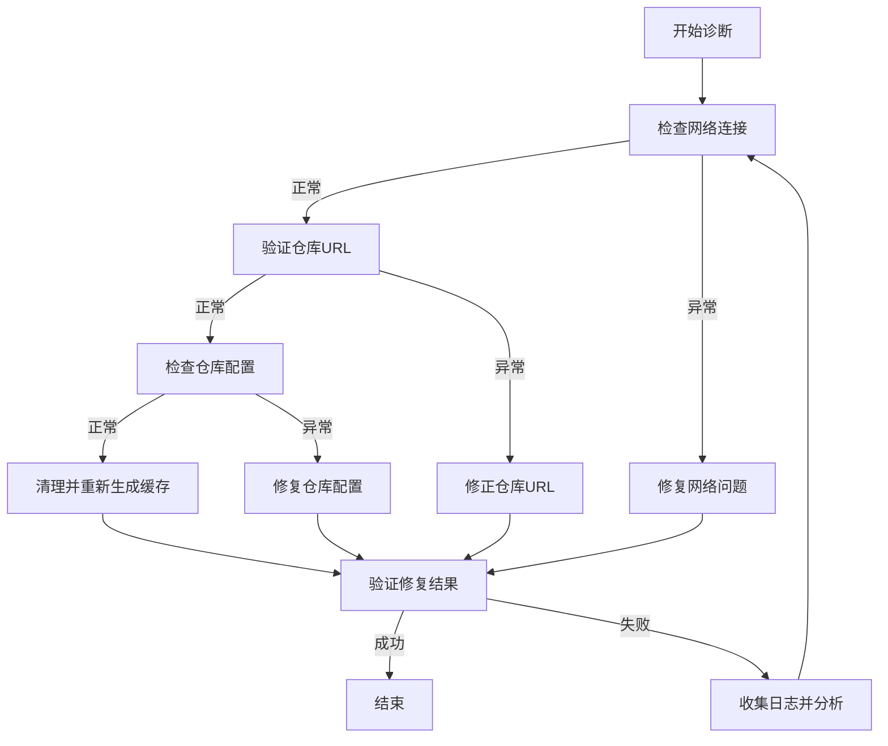

# YUM/DNF仓库问题分析与解决方案 - SRE视角

## SCQA结构

### 情境(Situation)
在Linux系统管理和SRE日常工作中，YUM(DNF)作为RHEL/CentOS/Rocky Linux等系统的包管理工具，其仓库配置和可用性直接影响系统的软件安装、更新和维护。当仓库出现问题时，会导致`yum makecache`、`yum install`等命令失败，影响业务系统的正常运行和维护工作。

### 冲突(Conflict)
用户报告在Rocky Linux 9.6系统上执行`yum makecache`时遇到404错误：
```bash
errors during downloading metadata for repository 'aliyun-baseos':
  - Status code: 404 for https://mirrors.aliyun.com/rockylinux/9.6/BaseOS/x86_64/os/repodata/repomd.xml (IP: 101.89.125.243)
错误：为仓库 'aliyun-baseos' 下载元数据失败 : Cannot download repomd.xml: Cannot download repodata/repomd.xml: All mirrors were tried
```

这种问题可能由多种原因引起，包括网络问题、仓库URL错误、版本不匹配、仓库配置错误等。作为SRE，需要快速定位问题并提供解决方案。

### 问题(Question)
1. 如何解决特定的404仓库错误？
2. YUM/DNF仓库常见问题有哪些？
3. 如何从SRE角度系统化地分析和解决仓库问题？
4. 有哪些最佳实践可以预防仓库问题？

### 答案(Answer)
本文将从SRE角度分析YUM/DNF仓库问题，提供系统化的诊断步骤和解决方案，并总结常见问题及预防措施，帮助SRE快速定位和解决包管理相关问题。

## 问题分析与解决方案

### 案例分析：Rocky Linux 9.6仓库404错误

#### 错误信息分析
从错误信息可以看出：
- 错误发生在下载仓库元数据时
- 具体URL：`https://mirrors.aliyun.com/rockylinux/9.6/BaseOS/x86_64/os/repodata/repomd.xml`
- 返回状态码：404 Not Found

#### 可能的原因
1. **仓库URL错误**：URL路径不正确或版本号错误
2. **版本不匹配**：Rocky Linux 9.6版本可能还未在阿里云镜像同步
3. **网络问题**：无法连接到仓库服务器
4. **仓库配置错误**：repo文件中的baseurl或mirrorlist配置错误

#### 解决方案

1. **验证仓库URL**
   ```bash
   # 使用curl验证URL是否可访问
   curl -I https://mirrors.aliyun.com/rockylinux/9/BaseOS/x86_64/os/repodata/repomd.xml
   
   # 检查是否存在9.6目录
   curl -I https://mirrors.aliyun.com/rockylinux/9.6/
   ```

2. **修正仓库配置**
   ```bash
   # 备份当前repo文件
   cp /etc/yum.repos.d/aliyun-baseos.repo /etc/yum.repos.d/aliyun-baseos.repo.bak
   
   # 编辑repo文件，将9.6改为9或使用$releasever变量
   sed -i 's/9.6/9/g' /etc/yum.repos.d/aliyun-baseos.repo
   # 或
   sed -i 's/9.6/\$releasever/g' /etc/yum.repos.d/aliyun-baseos.repo
   ```

3. **清理缓存并重新生成**
   ```bash
   yum clean all
   yum makecache
   ```

4. **验证修复结果**
   ```bash
   yum repolist enabled
   yum install -y vim --assumeno
   ```

## 常见YUM/DNF仓库问题及解决方案

### 1. 网络连接问题

**症状**：
- 无法连接到仓库服务器
- 超时错误
- DNS解析失败

**解决方案**：
```bash
# 检查网络连接
ping mirrors.aliyun.com

# 检查DNS解析
nslookup mirrors.aliyun.com

# 检查代理设置
env | grep -i proxy

# 临时禁用代理
export -n http_proxy https_proxy HTTP_PROXY HTTPS_PROXY
```

### 2. 仓库配置错误

**症状**：
- 仓库未启用
- baseurl或mirrorlist配置错误
- gpgcheck验证失败

**解决方案**：
```bash
# 查看已启用的仓库
yum repolist enabled

# 检查仓库配置文件
cat /etc/yum.repos.d/*.repo | grep -E 'name|baseurl|enabled|gpgcheck'

# 启用仓库
sed -i 's/enabled=0/enabled=1/g' /etc/yum.repos.d/xxx.repo

# 导入GPG密钥
yum-config-manager --add-repo https://mirrors.aliyun.com/rockylinux/9/BaseOS/x86_64/os/
rpm --import https://mirrors.aliyun.com/rockylinux/RPM-GPG-KEY-rockylinuxofficial
```

### 3. 版本不匹配问题

**症状**：
- 404错误
- 仓库版本与系统版本不一致

**解决方案**：
```bash
# 查看系统版本
cat /etc/os-release

# 查看系统版本号
rpm -q centos-release || rpm -q rocky-release

# 修正仓库URL中的版本号
sed -i 's/$releasever/'$(rpm -E %{rhel})'/g' /etc/yum.repos.d/*.repo
```

### 4. 元数据损坏问题

**症状**：
- 元数据校验失败
- 无法解析仓库元数据

**解决方案**：
```bash
# 清理所有缓存
yum clean all

# 删除缓存目录
rm -rf /var/cache/dnf/*

# 重新生成缓存
yum makecache
```

### 5. 仓库冲突问题

**症状**：
- 包依赖冲突
- 多个仓库提供相同包但版本不同

**解决方案**：
```bash
# 查看包来源
yum provides package-name

# 禁用特定仓库
yum --disablerepo=repo-name install package-name

# 设置仓库优先级
# 安装priority插件
yum install -y yum-plugin-priorities
# 在repo文件中添加priority=1（数值越小优先级越高）
```

## SRE视角：系统化诊断与解决流程

### 诊断流程



### 解决步骤

1. **快速检查**：
   ```bash
   # 检查网络
   ping -c 3 mirrors.aliyun.com
   
   # 检查仓库状态
   yum repolist -v
   ```

2. **深入诊断**：
   ```bash
   # 详细日志
   yum makecache -v
   
   # 检查特定仓库
   yum repoinfo aliyun-baseos
   ```

3. **修复验证**：
   ```bash
   # 测试安装
   yum install -y vim --assumeno
   
   # 检查更新
   yum check-update
   ```

4. **监控与预防**：
   - 定期检查仓库可用性
   - 配置监控告警
   - 维护标准仓库配置模板

## 最佳实践

### 1. 仓库配置管理

- **使用变量**：在repo文件中使用`$releasever`、`$basearch`等变量，避免版本硬编码
- **备份配置**：修改repo文件前先备份
- **标准化配置**：使用配置管理工具(Ansible/Puppet)管理仓库配置

### 2. 多仓库策略

- **主仓库**：官方或可靠的镜像源
- **补充仓库**：EPEL等经过验证的第三方仓库
- **私有仓库**：内部定制包仓库
- **仓库优先级**：使用priority插件设置优先级

### 3. 监控与告警

- **监控仓库可用性**：定期检查仓库元数据
- **监控包安装成功率**：跟踪yum/dnf命令执行结果
- **设置告警**：当仓库不可用或包安装失败时触发告警

### 4. 灾备与恢复

- **配置本地缓存**：使用yum cache或本地仓库
- **离线仓库**：在网络隔离环境中使用离线仓库
- **仓库镜像**：搭建本地仓库镜像

## 常见仓库问题速查表

| 问题类型 | 症状 | 解决方案 |
|---------|------|----------|
| 404错误 | 无法找到仓库文件 | 检查URL、版本号、网络连接 |
| 元数据下载失败 | 无法解析仓库元数据 | 清理缓存、检查网络、验证URL |
| 包依赖冲突 | 安装包时依赖不满足 | 检查仓库优先级、使用--skip-broken |
| GPG验证失败 | 包签名验证失败 | 导入正确的GPG密钥、检查仓库来源 |
| 仓库不可用 | 所有镜像都尝试失败 | 检查网络、更换仓库源、使用备用仓库 |
| 版本不匹配 | 仓库版本与系统版本不一致 | 使用$releasever变量、更新repo文件 |

## 结论

YUM/DNF仓库问题是Linux系统管理和SRE工作中的常见问题。作为SRE，需要具备系统化的诊断和解决能力，快速定位问题并提供解决方案。通过遵循最佳实践，如使用变量配置、多仓库策略、监控告警和灾备恢复，可以有效预防和减少仓库问题的发生。

在处理仓库问题时，SRE应遵循以下原则：
1. **快速定位**：通过系统化的诊断流程快速定位问题
2. **最小化影响**：避免修改生产环境中的关键配置
3. **预防为主**：实施监控和最佳实践预防问题
4. **持续改进**：总结经验教训，优化流程和配置

通过本文的分析和解决方案，SRE可以提高处理YUM/DNF仓库问题的效率，确保系统包管理的稳定性和可靠性。

## 更新记录

- 2025-12-01：初始创建
- [日期]：[更新内容]