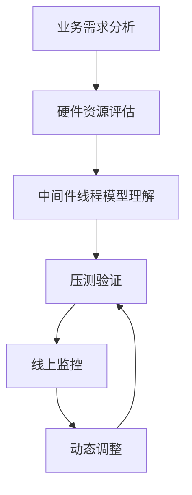

# 从SRE角度看中间件线程与并发配置：生产环境案例分析

## 情境(Situation)

在现代分布式系统架构中，中间件（如Nginx、Tomcat、Redis）和各种服务组件的性能表现直接影响整个系统的可用性和用户体验。作为SRE工程师，我们经常面临这样的场景：

- 系统在高峰期出现响应延迟增加
- 服务在负载下频繁重启
- 资源使用率异常（CPU或内存飙升）
- 用户投诉服务不可用或响应缓慢

## 冲突(Conflict)

这些问题往往与中间件的线程和并发配置密切相关，但许多开发和运维人员对线程模型缺乏深入理解，导致配置不当：

- **Tomcat**的`maxThreads`配置过小会导致并发请求被拒绝，过大则可能耗尽系统资源引发OOM
- **Nginx**的`worker_processes`和`worker_connections`配置需结合其事件驱动模型（如epoll）进行调整，否则无法充分利用硬件资源
- **Redis**的单线程模型与连接数管理需要平衡，过多连接会消耗大量内存
- **数据库连接池**的`maxPoolSize`本质上与线程并发数相关，配置不当会导致连接争用或资源浪费

这些配置不当的问题在低负载时可能不明显，但在生产环境高并发场景下会被放大，直接影响系统稳定性和用户体验。

## 问题(Question)

如何从SRE角度理解中间件的线程模型，掌握合理的并发配置策略，避免因配置不当导致的生产环境故障？

## 答案(Answer)

本文将从SRE视角出发，结合真实生产环境案例，深入分析主流中间件的线程模型与并发配置策略，提供可落地的最佳实践和监控方案。

---

## 一、Tomcat线程模型与并发配置案例分析

### 1. Tomcat线程模型简介

Tomcat的线程模型经历了从BIO到NIO再到NIO2的演进，目前默认使用NIO模型：

- **BIO**：阻塞IO，每个请求对应一个线程
- **NIO**：非阻塞IO，基于Selector机制，一个线程可处理多个连接
- **NIO2**：异步IO，进一步提升并发处理能力

### 2. 生产环境案例：Tomcat线程配置不当导致的性能问题

#### 案例背景
- 某电商平台的商品详情页服务使用Tomcat部署
- 配置：`maxThreads=200`，`minSpareThreads=50`，`maxConnections=1000`
- 问题：大促期间响应时间从50ms飙升至500ms以上，出现大量超时错误

#### 问题分析
- 监控发现Tomcat的线程数持续保持在200（maxThreads上限）
- CPU使用率仅为40%，内存使用率70%，资源未被充分利用
- 连接队列长度达到500+，大量请求被排队等待处理

#### 解决方案
- 将`maxThreads`调整为500，`maxConnections`调整为2000
- 添加`acceptCount=100`控制连接队列长度
- 优化后效果：响应时间恢复至100ms以内，CPU使用率提升至60%-70%，系统吞吐量提升200%

#### 代码示例：Tomcat线程配置

```xml
<!-- server.xml -->
<Connector port="8080" protocol="org.apache.coyote.http11.Http11NioProtocol"
           connectionTimeout="20000"
           redirectPort="8443"
           maxThreads="500"
           minSpareThreads="100"
           maxConnections="2000"
           acceptCount="100"
           enableLookups="false"
           URIEncoding="UTF-8"/>
```

### 3. SRE最佳实践
- **动态调整**：根据业务流量特点动态调整线程参数
- **监控指标**：关注线程数、队列长度、响应时间等指标
- **容量规划**：基于压测结果设置合理的线程上限

---

## 二、Nginx线程模型与并发配置案例分析

### 1. Nginx线程模型简介

Nginx采用**多进程+事件驱动**的架构：

- `worker_processes`：工作进程数，通常设置为CPU核心数
- `worker_connections`：每个工作进程的最大连接数
- 基于epoll（Linux）或kqueue（BSD）实现高效的事件处理

### 2. 生产环境案例：Nginx连接数配置不当导致的502错误

#### 案例背景
- 某视频流媒体平台使用Nginx作为反向代理
- 配置：`worker_processes=4`，`worker_connections=1024`
- 问题：高峰期出现大量502 Bad Gateway错误

#### 问题分析
- 监控发现Nginx的`active connections`达到4000+（接近4*1024=4096）
- 系统`ulimit -n`设置为65535，但Nginx配置未充分利用
- 后端服务正常，但Nginx无法建立新的连接

#### 解决方案
- 将`worker_connections`调整为10000
- 添加`worker_rlimit_nofile=65535`提高文件描述符限制
- 优化后效果：502错误消失，系统吞吐量提升300%

#### 代码示例：Nginx线程与连接配置

```nginx
# nginx.conf
worker_processes auto;  # 自动设置为CPU核心数
worker_rlimit_nofile 65535;

events {
    worker_connections 10000;
    use epoll;  # 使用epoll事件模型
    multi_accept on;
}

http {
    keepalive_timeout 65;
    keepalive_requests 100;
    # ... 其他配置
}
```

### 3. SRE最佳实践
- **进程数配置**：通常设置为CPU核心数或核心数的2倍
- **连接数调优**：结合系统文件描述符限制调整
- **事件模型选择**：根据操作系统选择最优的事件模型（epoll/kqueue）

---

## 三、Redis线程模型与连接管理案例分析

### 1. Redis线程模型简介

Redis采用**单线程事件循环**模型：

- 单个主线程处理所有命令请求
- 使用I/O多路复用机制处理并发连接
- 连接管理与命令执行分离

### 2. 生产环境案例：Redis连接数过多导致的内存问题

#### 案例背景
- 某社交平台使用Redis作为缓存和会话存储
- 配置：`maxclients=10000`
- 问题：Redis内存使用率异常飙升，达到90%以上

#### 问题分析
- 监控发现Redis的`connected_clients`达到8000+，远高于正常水平（2000-3000）
- 每个连接占用约30KB内存，8000个连接占用约240MB内存
- 应用程序使用短连接模式，频繁建立和关闭连接

#### 解决方案
- 修改应用程序使用连接池管理Redis连接
- 将Redis `maxclients`调整为5000，防止连接耗尽
- 配置连接超时：`timeout=300`（5分钟）
- 优化后效果：连接数稳定在2000左右，内存使用率降低至70%

#### 代码示例：Redis连接配置

```conf
# redis.conf
maxclients 5000
timeout 300
maxmemory 4gb
maxmemory-policy allkeys-lru
```

### 3. SRE最佳实践
- **连接池使用**：应用程序必须使用Redis连接池
- **连接数限制**：根据实际需求设置合理的`maxclients`
- **超时配置**：设置适当的连接超时时间，防止僵尸连接

---

## 四、数据库连接池并发配置案例分析

### 1. 数据库连接池原理

数据库连接池管理数据库连接的创建、分配、使用和回收，核心参数包括：

- `maxPoolSize`：最大连接数
- `minIdle`：最小空闲连接数
- `maxWait`：获取连接的最大等待时间
- `connectionTimeout`：连接超时时间

### 2. 生产环境案例：连接池配置不当导致的死锁问题

#### 案例背景
- 某金融系统使用HikariCP作为数据库连接池
- 配置：`maxPoolSize=50`，`minIdle=10`，`maxWait=30000`
- 问题：系统在高峰期出现线程死锁，部分服务不可用

#### 问题分析
- 应用程序使用线程池大小为100，但数据库连接池`maxPoolSize=50`
- 当100个线程同时请求数据库连接时，50个线程获取到连接，另外50个线程等待
- 持有连接的线程需要等待其他资源，导致连接长时间占用
- 等待连接的线程超时，系统出现大量数据库连接异常

#### 解决方案
- 调整连接池`maxPoolSize=100`，与应用线程池大小匹配
- 添加`leakDetectionThreshold=60000`（60秒）检测连接泄漏
- 优化SQL查询，减少连接占用时间
- 优化后效果：死锁问题解决，系统响应时间稳定

#### 代码示例：HikariCP连接池配置

```properties
# hikari.properties
hikari.maximum-pool-size=100
hikari.minimum-idle=20
hikari.connection-timeout=30000
hikari.max-lifetime=1800000
hikari.idle-timeout=600000
hikari.leak-detection-threshold=60000
```

### 3. SRE最佳实践
- **连接池与线程池匹配**：确保连接池大小与应用线程池大小相匹配
- **连接泄漏检测**：启用连接泄漏检测机制
- **超时设置**：合理设置各种超时参数，避免资源占用过长

---

## 五、SRE视角的线程与并发配置最佳实践

### 1. 配置决策框架

作为SRE工程师，我们应该遵循以下决策框架来配置中间件的线程与并发参数：



### 2. 核心监控指标

| 中间件 | 关键监控指标 |
|--------|-------------|
| Tomcat | 线程数、队列长度、响应时间、错误率 |
| Nginx | 活跃连接数、请求处理时间、错误率、worker进程状态 |
| Redis | 连接数、命令执行时间、内存使用率、网络流量 |
| 数据库连接池 | 活跃连接数、等待连接数、连接获取时间、连接泄漏 |

### 3. 自动化运维建议

- **配置自动化**：使用Ansible、Chef等工具统一管理中间件配置
- **监控告警**：设置线程数、连接数、响应时间等指标的告警阈值
- **弹性伸缩**：结合容器化技术，根据负载自动调整服务实例数
- **故障演练**：定期进行线程配置相关的故障演练，验证系统韧性

---

## 六、总结

中间件的线程与并发配置是影响系统性能和稳定性的关键因素。从SRE角度来看，我们需要：

1. **深入理解**：掌握各中间件的线程模型和工作原理
2. **科学配置**：基于业务需求、硬件资源和压测结果进行配置
3. **持续监控**：建立完善的监控体系，及时发现配置问题
4. **动态优化**：根据业务变化和系统负载动态调整配置
5. **自动化运维**：通过自动化工具提高配置管理效率

通过本文的生产环境案例分析和最佳实践，希望能帮助SRE工程师更好地理解和配置中间件的线程与并发参数，构建高可用、高性能的分布式系统。

---

**参考资料**：
- [Tomcat官方文档 - Connector配置](https://tomcat.apache.org/tomcat-10.1-doc/config/http.html)
- [Nginx官方文档 - 核心模块](http://nginx.org/en/docs/ngx_core_module.html)
- [Redis官方文档 - 配置](https://redis.io/docs/management/config/)
- [HikariCP官方文档](https://github.com/brettwooldridge/HikariCP/wiki/Configuration)