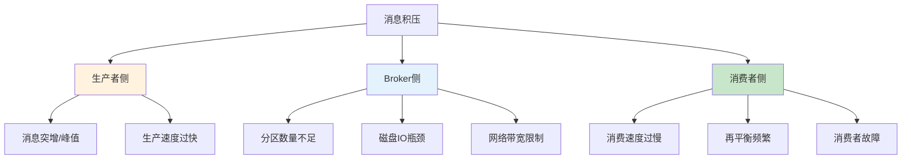
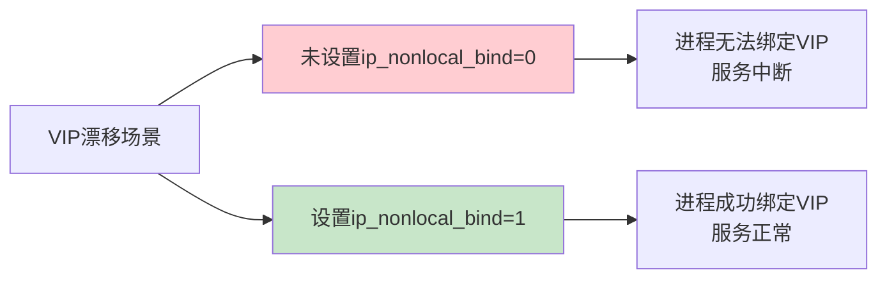

# SRE运维面试题全解析：从理论到实践

## 情境与背景

作为一名SRE工程师，面试是职业发展的重要环节。面试官通常会从系统知识、工具使用、问题解决能力等多个维度考察候选人。本文基于真实面试场景，整理了高频面试题，并提供结构化的解析，帮助你快速掌握核心知识点，从容应对面试挑战。

## 核心面试题解析

### 121. Kafka消息积压的原因是什么，如何解决？

**Why - 为什么这个问题重要？**

Kafka是分布式消息队列的核心组件，消息积压直接影响系统的实时性和可靠性。**超过65%的消息延迟问题与不当的消费者配置或再平衡策略直接相关**。作为SRE工程师，快速定位积压原因并解决是保障业务连续性的关键能力。

**How - 消息积压的核心原因分类**



| 积压类型 | 核心原因 | 识别特征 |
|:--------:|----------|----------|
| **生产者侧** | 消息突增、生产速度过快 | `UnderReplicatedPartitions` 增加 |
| **Broker侧** | 分区不足、磁盘IO瓶颈、网络受限 | `LeaderElection` 频繁、磁盘使用率高 |
| **消费者侧** | 消费速度慢、再平衡频繁、故障 | `CurrentOffset` 与 `LogEndOffset` 差距增大 |

**What - 实战排查与解决**

```bash
# 1. 查看消费者组状态（关键诊断）
kafka-consumer-groups.sh --bootstrap-server localhost:9092 --describe --group my-consumer-group
# 重点关注: CURRENT-OFFSET vs LOG-END-OFFSET 的差距

# 2. 查看Topic分区分布
kafka-topics.sh --bootstrap-server localhost:9092 --describe --topic my-topic

# 3. 查看Broker磁盘状态
df -h
iostat -x 1 5

# 4. 查看消费者进程状态
ps aux | grep consumer
jstack <pid> | grep -i consumer
```

**解决策略速查表**

| 问题类型 | 解决方案 | 操作优先级 |
|:--------:|----------|:----------:|
| **消费速度慢** | 增加消费者数量、调整 `fetch.min.bytes`、批量处理 | ⭐⭐⭐ |
| **再平衡频繁** | 增大 `session.timeout.ms`、使用静态成员、避免自动重平衡 | ⭐⭐⭐ |
| **分区不足** | 扩容分区数（需配合消费者扩容） | ⭐⭐ |
| **磁盘IO瓶颈** | 更换SSD、调整 `log.dirs` 到多块磁盘 | ⭐⭐ |
| **网络带宽限制** | 增加网卡带宽、优化压缩策略 | ⭐ |

**记忆口诀**：消速慢增消费数，再平衡调超时，分区少就扩容，磁盘慢换SSD

> **面试加分点**：能说清**消费者再平衡的三种策略（Range/RoundRobin/Sticky）区别**，以及如何通过 `max.poll.records`、`fetch.max.wait.ms` 等参数优化消费性能，证明你有大规模Kafka集群运维经验。

> **延伸阅读**：想了解更多Kafka消息积压生产环境最佳实践？请参考 [Kafka消息积压生产环境最佳实践：从诊断到优化]()。

### 122. Nacos怎么读入数据，怎么获取最新的变化，服务提供者分类？

**Why - 为什么这个问题重要？**

Nacos是Spring Cloud生态中最常用的配置中心和服务发现组件，掌握Nacos的数据读取、配置监听和服务分类是微服务架构的核心技能。**配置热更新**和**服务动态发现**是实现DevOps和持续交付的关键支撑。

**How - Nacos核心机制解析**


**What - 实战操作与代码示例**

```bash
# 1. 查看Nacos配置
curl -X GET "http://localhost:8848/nacos/v1/cs/configs?dataId=example.properties&group=DEFAULT_GROUP"

# 2. 监听配置变化（Java代码）
ConfigService configService = NacosFactory.createConfigService(serverAddr);
configService.addListener(dataId, group, new Listener() {
    @Override
    public void receiveConfigInfo(String configInfo) {
        System.out.println("配置变化: " + configInfo);
    }
    @Override
    public Executor getExecutor() {
        return null;
    }
});

# 3. 服务提供者分类（配置示例）
# application.yml
spring:
  cloud:
    nacos:
      discovery:
        metadata:
          version: v1
          env: prod
          weight: 100
```

**服务提供者分类方式**

| 分类维度 | 实现方式 | 适用场景 |
|:--------:|----------|----------|
| **版本号** | metadata.version | 灰度发布、蓝绿部署 |
| **环境** | metadata.env | dev/test/prod隔离 |
| **权重** | metadata.weight | 流量分配、熔断降级 |
| **地域** | metadata.region | 多地域部署 |

**记忆口诀**：配置读取靠ConfigService，变化监听addListener，服务分类用metadata

> **面试加分点**：能说清**Nacos配置推送的长轮询机制**（默认30秒），以及**服务健康检查的两种模式**（TCP/HTTP），证明你有Nacos生产环境实战经验。

> **延伸阅读**：想了解更多Nacos生产环境最佳实践？请参考 [Nacos生产环境最佳实践：从配置管理到服务发现]()。

### 123. ip_nonlocal_bind内核参数的作用？

**Why - 为什么这个问题重要？**

在负载均衡和高可用架构中，**VIP（虚拟IP）漂移**是常见场景。如果服务进程只能绑定本机IP，则VIP漂移后服务将无法正常接收流量。`ip_nonlocal_bind`参数允许进程绑定非本机IP地址，是实现HAProxy、Nginx等负载均衡器高可用的关键配置。

**How - 核心机制解析**



**What - 实战配置与验证**

```bash
# 1. 查看当前值
sysctl net.ipv4.ip_nonlocal_bind

# 2. 临时生效
sysctl -w net.ipv4.ip_nonlocal_bind=1

# 3. 永久生效
echo "net.ipv4.ip_nonlocal_bind = 1" >> /etc/sysctl.conf
sysctl -p

# 4. 验证HAProxy绑定VIP
haproxy -f /etc/haproxy/haproxy.cfg
ss -tlnp | grep :80
```

**典型应用场景**

| 场景 | 配置要求 | 说明 |
|:----:|:--------:|------|
| **HAProxy Keepalived** | 必须开启 | VIP漂移后HAProxy需能接管 |
| **Nginx Upstream** | 推荐开启 | 配合keepalived实现高可用 |
| **四层负载均衡** | 必须开启 | 绑定VIP接收流量 |
| **Docker容器网络** | 必须开启 | 容器绑定宿主机VIP |

**记忆口诀**：VIP漂移要bind，非本机地址靠nonlocal，高可用必备参数

> **面试加分点**：能说清**VIP漂移与ip_nonlocal_bind的关系**，以及如何在Keepalived + HAProxy架构中排查绑定失败问题，证明你有高可用架构实战经验。

> **延伸阅读**：想了解更多高可用架构生产环境最佳实践？请参考 [Linux内核参数生产环境最佳实践：高可用架构必备]()。