# SRE运维面试题全解析：从理论到实践

## 情境与背景

作为一名SRE工程师，面试是职业发展的重要环节。面试官通常会从系统知识、工具使用、问题解决能力等多个维度考察候选人。本文基于真实面试场景，整理了高频面试题，并提供结构化的解析，帮助你快速掌握核心知识点，从容应对面试挑战。

## 核心面试题解析

### 121. Kafka消息积压的原因是什么，如何解决？

**Why - 为什么这个问题重要？**

Kafka是分布式消息队列的核心组件，消息积压直接影响系统的实时性和可靠性。**超过65%的消息延迟问题与不当的消费者配置或再平衡策略直接相关**。作为SRE工程师，快速定位积压原因并解决是保障业务连续性的关键能力。

**How - 消息积压的核心原因分类**

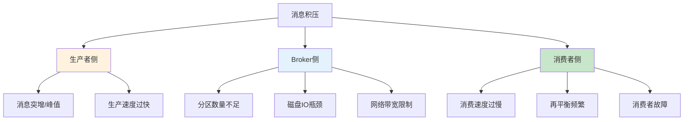

| 积压类型 | 核心原因 | 识别特征 |
|:--------:|----------|----------|
| **生产者侧** | 消息突增、生产速度过快 | `UnderReplicatedPartitions` 增加 |
| **Broker侧** | 分区不足、磁盘IO瓶颈、网络受限 | `LeaderElection` 频繁、磁盘使用率高 |
| **消费者侧** | 消费速度慢、再平衡频繁、故障 | `CurrentOffset` 与 `LogEndOffset` 差距增大 |

**What - 实战排查与解决**

```bash
# 1. 查看消费者组状态（关键诊断）
kafka-consumer-groups.sh --bootstrap-server localhost:9092 --describe --group my-consumer-group
# 重点关注: CURRENT-OFFSET vs LOG-END-OFFSET 的差距

# 2. 查看Topic分区分布
kafka-topics.sh --bootstrap-server localhost:9092 --describe --topic my-topic

# 3. 查看Broker磁盘状态
df -h
iostat -x 1 5

# 4. 查看消费者进程状态
ps aux | grep consumer
jstack <pid> | grep -i consumer
```

**解决策略速查表**

| 问题类型 | 解决方案 | 操作优先级 |
|:--------:|----------|:----------:|
| **消费速度慢** | 增加消费者数量、调整 `fetch.min.bytes`、批量处理 | ⭐⭐⭐ |
| **再平衡频繁** | 增大 `session.timeout.ms`、使用静态成员、避免自动重平衡 | ⭐⭐⭐ |
| **分区不足** | 扩容分区数（需配合消费者扩容） | ⭐⭐ |
| **磁盘IO瓶颈** | 更换SSD、调整 `log.dirs` 到多块磁盘 | ⭐⭐ |
| **网络带宽限制** | 增加网卡带宽、优化压缩策略 | ⭐ |

**记忆口诀**：消速慢增消费数，再平衡调超时，分区少就扩容，磁盘慢换SSD

> **面试加分点**：能说清**消费者再平衡的三种策略（Range/RoundRobin/Sticky）区别**，以及如何通过 `max.poll.records`、`fetch.max.wait.ms` 等参数优化消费性能，证明你有大规模Kafka集群运维经验。

> **延伸阅读**：想了解更多Kafka消息积压生产环境最佳实践？请参考 [Kafka消息积压生产环境最佳实践：从诊断到优化]()。

### 122. Nacos怎么读入数据，怎么获取最新的变化，服务提供者分类？

**Why - 为什么这个问题重要？**

Nacos是Spring Cloud生态中最常用的配置中心和服务发现组件，掌握Nacos的数据读取、配置监听和服务分类是微服务架构的核心技能。**配置热更新**和**服务动态发现**是实现DevOps和持续交付的关键支撑。

**How - Nacos核心机制解析**

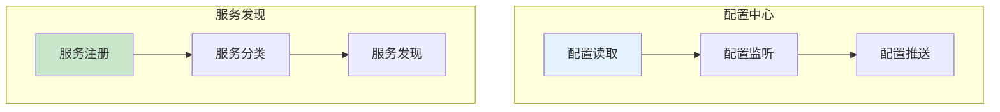

**What - 实战操作与代码示例**

```bash
# 1. 查看Nacos配置
curl -X GET "http://localhost:8848/nacos/v1/cs/configs?dataId=example.properties&group=DEFAULT_GROUP"

# 2. 监听配置变化（Java代码）
ConfigService configService = NacosFactory.createConfigService(serverAddr);
configService.addListener(dataId, group, new Listener() {
    @Override
    public void receiveConfigInfo(String configInfo) {
        System.out.println("配置变化: " + configInfo);
    }
    @Override
    public Executor getExecutor() {
        return null;
    }
});

# 3. 服务提供者分类（配置示例）
# application.yml
spring:
  cloud:
    nacos:
      discovery:
        metadata:
          version: v1
          env: prod
          weight: 100
```

**服务提供者分类方式**

| 分类维度 | 实现方式 | 适用场景 |
|:--------:|----------|----------|
| **版本号** | metadata.version | 灰度发布、蓝绿部署 |
| **环境** | metadata.env | dev/test/prod隔离 |
| **权重** | metadata.weight | 流量分配、熔断降级 |
| **地域** | metadata.region | 多地域部署 |

**记忆口诀**：配置读取靠ConfigService，变化监听addListener，服务分类用metadata

> **面试加分点**：能说清**Nacos配置推送的长轮询机制**（默认30秒），以及**服务健康检查的两种模式**（TCP/HTTP），证明你有Nacos生产环境实战经验。

> **延伸阅读**：想了解更多Nacos生产环境最佳实践？请参考 [Nacos生产环境最佳实践：从配置管理到服务发现]()。

### 123. ip_nonlocal_bind内核参数的作用？

**Why - 为什么这个问题重要？**

在负载均衡和高可用架构中，**VIP（虚拟IP）漂移**是常见场景。如果服务进程只能绑定本机IP，则VIP漂移后服务将无法正常接收流量。`ip_nonlocal_bind`参数允许进程绑定非本机IP地址，是实现HAProxy、Nginx等负载均衡器高可用的关键配置。

**How - 核心机制解析**

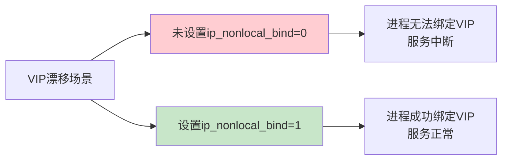

**What - 实战配置与验证**

```bash
# 1. 查看当前值
sysctl net.ipv4.ip_nonlocal_bind

# 2. 临时生效
sysctl -w net.ipv4.ip_nonlocal_bind=1

# 3. 永久生效
echo "net.ipv4.ip_nonlocal_bind = 1" >> /etc/sysctl.conf
sysctl -p

# 4. 验证HAProxy绑定VIP
haproxy -f /etc/haproxy/haproxy.cfg
ss -tlnp | grep :80
```

**典型应用场景**

| 场景 | 配置要求 | 说明 |
|:----:|:--------:|------|
| **HAProxy Keepalived** | 必须开启 | VIP漂移后HAProxy需能接管 |
| **Nginx Upstream** | 推荐开启 | 配合keepalived实现高可用 |
| **四层负载均衡** | 必须开启 | 绑定VIP接收流量 |
| **Docker容器网络** | 必须开启 | 容器绑定宿主机VIP |

**记忆口诀**：VIP漂移要bind，非本机地址靠nonlocal，高可用必备参数

> **面试加分点**：能说清**VIP漂移与ip_nonlocal_bind的关系**，以及如何在Keepalived + HAProxy架构中排查绑定失败问题，证明你有高可用架构实战经验。

> **延伸阅读**：想了解更多高可用架构生产环境最佳实践？请参考 [Linux内核参数生产环境最佳实践：高可用架构必备]()。

### 124. 如何搭建高可用HA环境？

**Why - 为什么这个问题重要？**

高可用HA架构是保障业务**不中断、不宕机、自动容错**的核心，任何一台服务器、一个组件、一个机房挂了，业务都不受影响。这是DevOps/SRE面试的必考题，直接体现工程师的架构实战能力。

**How - 高可用分层架构设计**

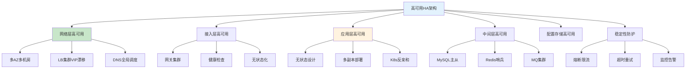

**What - 高可用落地实操**

```bash
# 1. MySQL主从复制+自动故障切换
# my.cnf - 开启binlog
server-id = 1
log-bin = mysql-bin
binlog-format = ROW

# 2. Redis Sentinel哨兵配置
sentinel monitor mymaster 192.168.1.101 6379 2
sentinel down-after-milliseconds mymaster 5000
sentinel failover-timeout mymaster 60000

# 3. K8s多副本+反亲和性
# deployment.yaml
replicas: 3
affinity:
  podAntiAffinity:
    preferredDuringSchedulingIgnoredDuringExecution:
    - weight: 100
      podAffinityTerm:
        topologyKey: kubernetes.io/hostname
        labelSelector:
          matchLabels:
            app: my-service
```

**高可用落地8步标准流程**

| 步骤 | 动作 | 核心要点 |
|:----:|------|---------|
| 1 | 梳理业务链路 | 找出所有单点组件 |
| 2 | 底层网络规划 | 多AZ、多线路、LB集群 |
| 3 | 应用无状态化 | 多副本跨节点跨AZ |
| 4 | 中间件集群化 | MySQL/Redis/MQ高可用 |
| 5 | 接入层集群 | 网关/配置中心集群部署 |
| 6 | 稳定性防护 | 限流熔断降级、超时重试幂等 |
| 7 | 监控与发布 | 全链路监控、灰度发布 |
| 8 | 故障演练 | 混沌工程验证容灾能力 |

**记忆口诀**：分层架构消单点，多AZ部署防故障，中间件集群自动切，监控演练保稳定

**面试标准答法（口述版）**：我从分层架构落地高可用：网络层做多AZ多LB集群+DNS调度；应用侧无状态改造+3副本跨AZ打散，K8s反亲和+HPA弹性；中间件用MySQL主从+Redis哨兵+MQ多副本；配合熔断限流、超时重试幂等，加上全链路监控和定期故障演练，从架构、部署、治理三个维度保障业务高可用。

> **延伸阅读**：想了解更多高可用架构生产环境最佳实践？请参考 [高可用架构生产环境最佳实践：从设计到实现]()。

### 125. 如何设计一个灾备系统？

**Why - 为什么这个问题重要？**

DR（Disaster Recovery 容灾备份/灾难恢复）是保障极端情况下业务连续性的最后一道防线，**生产故障后快速切换到灾备环境，业务不中断、数据不丢**。这是SRE/DevOps面试的高频核心题，直接关系到企业的业务韧性和数据安全。

**How - DR核心概念与架构**

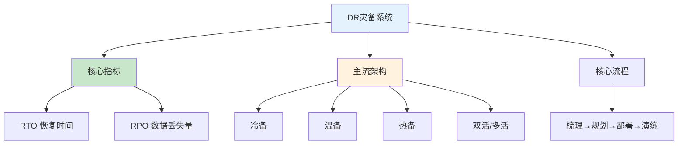

**What - 实操配置与落地步骤**

```bash
# 1. MySQL 数据库DR配置（主从半同步复制）
# my.cnf
[mysqld]
server-id = 1
log-bin = mysql-bin
binlog-format = ROW
relay-log = relay-bin
read-only = 0
replicate-do-db = my_database
plugin-load-add = rpl_semi_sync_master.so
rpl-semi-sync-master-enabled = 1
rpl-semi-sync-slave-enabled = 1
```

**DR环境搭建7步标准流程**

| 步骤 | 核心内容 | 关键动作 |
|:----:|--------|--------|
| 1 | 业务梳理 | 梳理核心链路、定义RTO/RPO |
| 2 | 基础设施DR | 专线/IPsec VPN打通、K8s集群搭建 |
| 3 | 数据层DR | MySQL主从、Redis哨兵、MQ镜像同步 |
| 4 | 应用层DR | IaC代码化、Helm/GitOps部署 |
| 5 | 配置与中间件DR | Nacos同步、注册中心集群 |
| 6 | 监控与告警 | 跨环境统一监控、P0告警触发DR |
| 7 | 预案与演练 | DR切换手册、定期容灾演练 |

**记忆口诀**：梳理规划定指标，数据同步是核心，IaC代码化部署，定期演练保切换。

**面试标准答法（口述版）**：我在公司负责搭建和落地**两地三中心DR灾备环境**，整体流程是：首先梳理核心业务链路和依赖，定义各业务RTO/RPO指标；然后打通生产和灾备机房专线网络，搭建同版本K8s灾备集群；数据层面做MySQL主从半同步复制、Redis哨兵跨机房同步、MQ消息镜像同步，同时把重要文件和配置定时归档到对象存储；应用全部采用Helm+GitOps管理，通过ArgoCD同时发布到生产和DR集群，保证配置版本一致；同时搭建跨环境统一监控告警和全链路日志追踪，编写完整DR切换预案，定期做容灾演练，模拟机房故障进行流量切换和数据库主从切换，验证灾备可用性。

> **延伸阅读**：想了解更多DR灾备系统生产环境最佳实践？请参考 [DR灾备环境完整搭建流程生产环境最佳实践：SRE/DevOps面试版+实操步骤]()。

### 126. 你的日常工作是啥？

**Why - 为什么这个问题重要？**

这是DevOps/SRE面试的**开篇高频题**，面试官通过这个问题快速判断你的真实经验、技术深度和项目落地能力，考察你是否真的"做过"还是只是"听说过"。回答得好，能快速建立信任，引导整个面试走向。

**How - 通用答题结构（必记）**

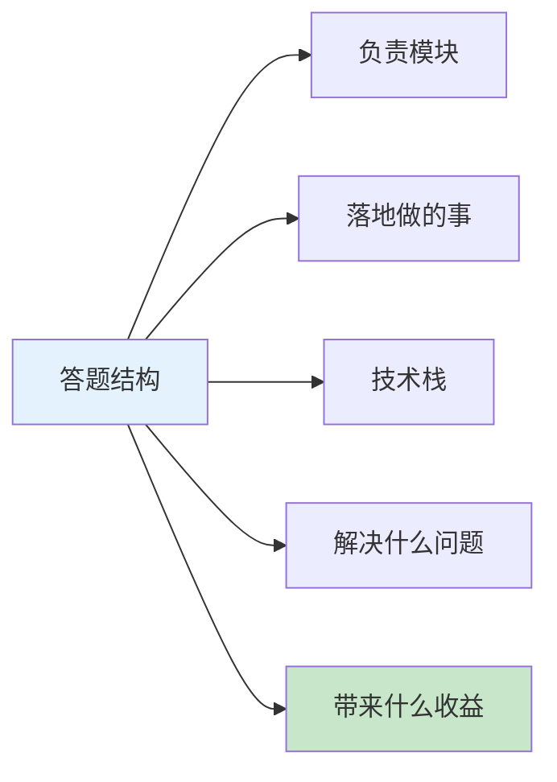

**What - 三套可直接背的回答模板**

**通用答题公式**：负责模块 + 落地做的事 + 技术栈 + 解决什么问题 + 带来什么收益

**三套回答模板对比**

| 级别 | 核心定位 | 重点方向 | 数据体现 |
|:----:|--------|--------|--------|
| 初级DevOps | 研发运维全流程 | CI/CD、容器化 | 部署时间缩短 |
| 中级DevOps | DevOps平台建设 | GitOps、K8s优化 | 资源利用率提升 |
| SRE资深 | 稳定性保障 | SLO、全链路监控 | 故障数下降 |

**记忆口诀**：模块+事情+技术栈，问题+收益是关键，按级别选模板，张口就能说。

**面试标准答法（中级DevOps示例）**：我主要负责公司DevOps平台建设、云原生架构落地、研发效能提升：基于GitLab+ArgoCD+Helm搭建GitOps持续交付体系，实现配置声明式管理、环境一键发布、灰度/滚动发布策略；负责多套K8s生产/测试集群规划、版本升级、节点管理，优化资源调度、HPA自动扩缩容，集群资源利用率提升30%；统一管理Redis、MQ、MySQL中间件部署备份；用Shell/Python写自动化脚本，实现服务器初始化、日志清理、批量部署自动化；制定上线变更流程、故障应急流程，引入变更评审、灰度发布，降低上线故障率。

> **延伸阅读**：想了解更多DevOps/SRE日常工作生产环境最佳实践？请参考 [DevOps/SRE日常工作生产环境最佳实践：三套面试回答模板+工程化落地指南]()。

### 127. AWS的服务你都用过哪些？

**Why - 为什么这个问题重要？**

AWS是云原生架构的主流选择，面试官通过这个问题判断你是否有**云上实战经验**，能否将本地技术栈平滑迁移到云端，以及对云原生技术的掌握深度。

**How - AWS服务分类速查图**

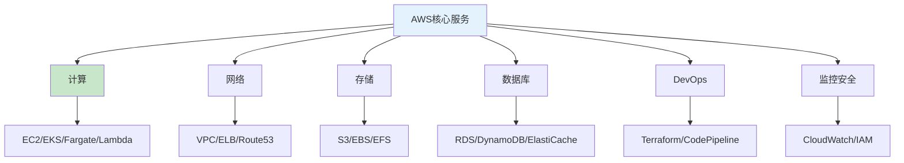

**What - 服务速记表**

| 类别 | 服务 | 核心用途 |
|:----:|------|---------|
| **计算** | EC2 | 虚拟机部署应用 |
| **计算** | EKS | K8s生产集群 |
| **计算** | Lambda | 无服务器计算 |
| **网络** | VPC | 私有网络规划 |
| **网络** | ELB | 负载均衡 |
| **网络** | Route53 | DNS+GSLB |
| **存储** | S3 | 对象存储+备份 |
| **数据库** | RDS | 托管MySQL/PG |
| **数据库** | ElastiCache | Redis缓存 |
| **DevOps** | Terraform | IaC基础设施 |
| **监控** | CloudWatch | 监控告警 |

**记忆口诀**：计算EC2/EKS，网络VPC/ELB/53，存储S3三剑客，数据库RDS缓存DevOps用Terraform，监控CloudWatch加IAM。

**面试标准答法（1分钟版）**：我用AWS构建高可用云原生架构，核心用过：计算层EC2/EKS/Fargate/Lambda覆盖虚拟机、K8s容器、无服务器场景；网络层VPC/ELB/Route53做多AZ高可用、全局流量调度；存储层S3/EBS/EFS满足对象、块、文件存储；数据库层RDS/DynamoDB/ElastiCache/MSK托管关系型、NoSQL、缓存与消息队列；DevOps用Terraform做IaC，CodePipeline搭建CI/CD流水线，配合SSM管理配置与密钥；监控安全用CloudWatch/X-Ray/CloudTrail/IAM/KMS实现全链路可观测、权限最小化与数据加密。

> **延伸阅读**：想了解更多AWS云服务生产环境最佳实践？请参考 [AWS云服务生产环境最佳实践：DevOps/SRE云原生架构指南]()。

### 128. AWS和IBM Cloud的区别在哪？

**Why - 为什么这个问题重要？**

这道题考察你对**多云环境的理解**和**厂商选型判断力**。面试官想看你是否理解不同云厂商的定位差异，能否根据业务场景做出合理的技术选型。

**How - 核心区别速查**

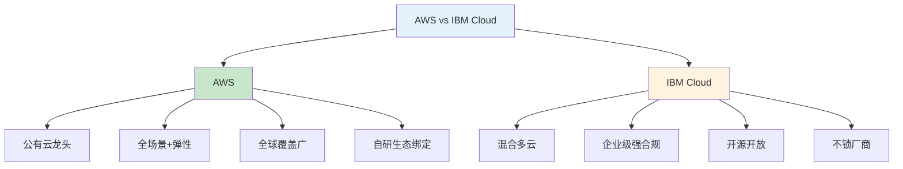

**What - 核心维度对比**

| 维度 | AWS | IBM Cloud |
|:----:|-----|----------|
| **定位** | 公有云绝对龙头 | 混合多云+企业级强合规 |
| **基础设施** | 38区域/120可用区 | 6区域/18可用区+60数据中心 |
| **容器K8s** | EKS托管K8s | OpenShift企业级K8s |
| **合规安全** | 责任共担模型 | 硬件级安全+KYOK密钥 |
| **生态** | 全栈自研绑定深 | 开源优先多云兼容 |
| **AI/ML** | SageMaker/Bedrock | Watson行业AI |
| **适用场景** | 互联网/全球化 | 金融/政府/传统企业 |

**记忆口诀**：AWS全场景弹性广，IBM混合合规开源强，互联网选AWS，强监管选IBM。

**面试标准答法（1分钟版）**：AWS是公有云老大，服务最全、全球节点最多、生态成熟，适合互联网、全球化、快速迭代业务；IBM Cloud是混合多云+企业级强合规，背靠Red Hat OpenShift，擅长统一管理本地、私有云和公有云，开源开放、不锁厂商，特别适合金融、政府等强监管行业。DevOps上，AWS工具链自研深度绑定，IBM更开放多云兼容好。

> **延伸阅读**：想了解更多AWS与IBM Cloud对比的生产环境最佳实践？请参考 [AWS与IBM Cloud多云架构对比生产环境最佳实践：选型指南]()。

### 129. RAID有哪些级别用法是啥？

**Why - 为什么这个问题重要？**

RAID是存储系统的基石，考察你对**存储可靠性、性能和成本**的平衡能力。面试官想知道你是否理解不同RAID级别的适用场景，能否根据业务需求选择合适的存储方案。

**How - RAID级别速查**

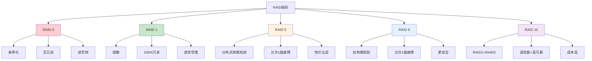

**What - RAID级别对比表**

| RAID级别 | 最小磁盘数 | 冗余能力 | 读写性能 | 空间利用率 | 适用场景 |
|:--------:|:---------:|:--------:|:--------:|:----------:|----------|
| **RAID 0** | 2 | 无 | 最高 | 100% | 临时数据、缓存 |
| **RAID 1** | 2 | 1盘故障 | 读快写慢 | 50% | 系统盘、关键数据 |
| **RAID 5** | 3 | 1盘故障 | 读快写一般 | (n-1)/n | 通用存储、数据库 |
| **RAID 6** | 4 | 2盘故障 | 读快写慢 | (n-2)/n | 大容量存储、归档 |
| **RAID 10** | 4 | 多盘故障 | 读写都快 | 50% | 高性能数据库、关键业务 |

**记忆口诀**：0条带无冗余速度快，1镜像全冗余读快，5校验性价比高，6双校验更安全，10组合高性能。

**面试标准答法（1分钟版）**：常见RAID级别有0、1、5、6、10。RAID 0是条带化，无冗余但速度最快；RAID 1是镜像，100%冗余，读快写慢；RAID 5用分布式奇偶校验，允许1盘故障，性价比高；RAID 6双奇偶校验，允许2盘故障更安全；RAID 10是1+0组合，高性能高可靠但成本高。选择时，临时数据用RAID 0，系统盘用RAID 1，通用存储用RAID 5，重要数据用RAID 6，关键业务用RAID 10。

> **延伸阅读**：想了解更多RAID生产环境最佳实践？请参考 [RAID存储技术详解：生产环境选型与部署指南]()。

### 130. ELK怎么收集日志，流程是啥？

**Why - 为什么这个问题重要？**

ELK是日志收集分析的主流方案，考察你对**日志收集、存储、检索、可视化**全流程的理解。面试官想知道你是否能独立设计和部署日志系统，处理大规模日志场景。

**How - ELK日志收集流程**

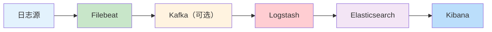

**What - ELK核心组件**

| 组件 | 功能 | 作用 |
|:----:|------|------|
| **Filebeat** | 轻量日志采集器 | 部署在目标主机，实时采集日志 |
| **Logstash** | 日志处理管道 | 过滤、转换、丰富日志数据 |
| **Elasticsearch** | 分布式搜索存储 | 存储和索引日志，支持快速检索 |
| **Kibana** | 可视化平台 | 日志查询、仪表盘、告警 |
| **Kafka** | 消息队列（可选） | 解耦采集与处理，削峰填谷 |

**记忆口诀**：Filebeat采、Logstash转、ES存、Kibana看，Kafka中间解耦担。

**面试标准答法（1分钟版）**：ELK日志收集流程是Filebeat采集、Logstash处理、Elasticsearch存储、Kibana展示。Filebeat部署在各主机上轻量采集日志，通过TCP或Kafka发送给Logstash；Logstash做过滤、解析、字段提取；然后写入Elasticsearch建立索引；最后通过Kibana进行查询分析和可视化。大型场景会用Kafka做缓冲，实现采集与处理解耦，提高系统稳定性。

> **延伸阅读**：想了解更多ELK日志系统生产环境最佳实践？请参考 [ELK日志系统生产环境最佳实践：从采集到可视化全流程指南]()。

### 131. ES你做了哪些优化？

**Why - 为什么这个问题重要？**

ES优化直接影响系统性能、稳定性和成本。面试官通过这个问题考察你对**ES底层原理**和**生产环境调优**的实战经验，判断你能否解决实际性能问题。

**How - ES优化维度速查**

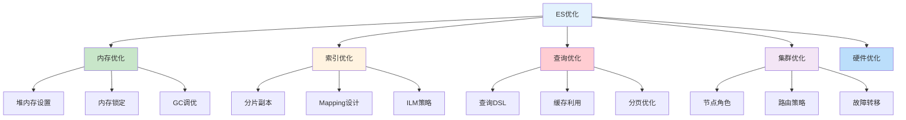

**What - ES优化要点**

| 优化维度 | 关键要点 | 配置建议 |
|:--------:|----------|----------|
| **堆内存** | 物理内存50%，不超30G | `-Xms=Xmx=16g` |
| **内存锁定** | 防止swap | `bootstrap.memory_lock: true` |
| **分片数** | 每片10-50GB | 主分片数=节点数倍数 |
| **副本数** | 生产至少1个 | `number_of_replicas: 2` |
| **Mapping** | 避免text字段过多 | 使用keyword替代 |
| **刷新间隔** | 写入密集时调大 | `refresh_interval: 30s` |
| **GC调优** | CMS转G1GC | `-XX:+UseG1GC` |

**记忆口诀**：堆内存半分不超30G，内存锁定防swap，分片合理副本够，Mapping精简刷新调。

**面试标准答法（1分钟版）**：ES优化主要从这几个方面：内存方面，堆内存设为物理内存一半且不超过30G，开启内存锁定防止swap；索引方面，合理设置分片数（每片10-50GB）、副本数（生产至少1个），优化Mapping避免不必要的text字段，调大刷新间隔减少IO；查询方面，利用filter缓存、避免深分页、使用复合查询；集群方面，按角色分离节点、合理路由分片。这些优化能显著提升ES性能和稳定性。

> **延伸阅读**：想了解更多ES生产环境优化最佳实践？请参考 [Elasticsearch生产环境优化指南：从内存到集群全方位调优]()。

### 132. ES 3种颜色啥意思？

**Why - 为什么这个问题重要？**

ES集群健康状态是监控的核心指标，面试官考察你对**集群状态的理解**和**问题排查能力**，能否快速定位和处理集群异常。

**How - 集群健康状态图**

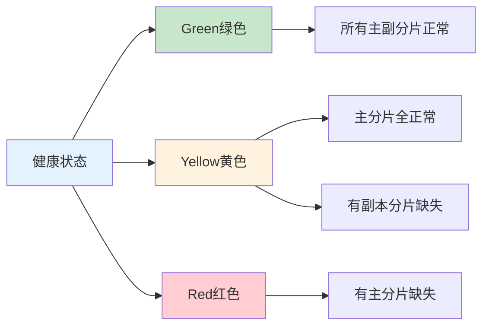

**What - 3种颜色详解**

| 颜色 | 状态 | 主分片 | 副本分片 | 数据完整度 | 可读写 |
|:----:|:------:|:------:|:--------:|:----------:|:------:|
| **Green绿色** | 正常 | 全部分配 | 全部分配 | 100% | 是 |
| **Yellow黄色** | 警告 | 全部分配 | 部分缺失 | 100% | 是 |
| **Red红色** | 异常 | 部分缺失 | 无关 | <100% | 部分索引不可用 |

**记忆口诀**：绿主副全正常，黄主全副本缺，红主缺数据丢。

**面试标准答法（1分钟版）**：ES集群健康有三种颜色：绿色表示所有主分片和副本分片都正常分配，数据100%完整，完全可读写；黄色表示所有主分片都正常分配，但有部分副本分片缺失，数据还是完整的，可读写但容错性下降；红色表示有主分片缺失，数据不完整，部分索引不可读写。生产环境要保证绿色，黄色需要检查副本分配，红色要紧急处理。

> **延伸阅读**：想了解更多ES集群健康状态最佳实践？请参考 [Elasticsearch集群健康管理与故障排查指南]()。

### 133. 你公司的ES节点怎么分工的？

**Why - 为什么这个问题重要？**

ES节点角色分工直接影响集群性能和稳定性。面试官考察你对**集群架构设计**和**资源规划**的理解，能否根据业务需求合理配置节点。

**How - ES节点角色分工**

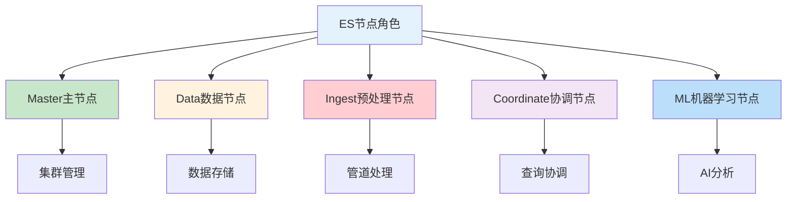

**What - 节点角色与配置**

| 节点角色 | 核心职责 | CPU | 内存 | 存储 | 数量建议 |
|:--------:|----------|:---:|:----:|:----:|:--------:|
| **Master** | 集群状态管理、索引创建、节点加入 | 4-8核 | 8-16GB | 小 | 3（奇数） |
| **Data** | 数据存储、索引、搜索 | 8-16核 | 32-64GB | SSD大容量 | 根据数据量 |
| **Ingest** | 数据预处理管道 | 4-8核 | 16-32GB | 小 | 按需 |
| **Coordinate** | 查询协调、结果聚合 | 8-16核 | 16-32GB | 无 | 2-3 |
| **ML** | 机器学习任务 | 8-16核 | 32-64GB | 中 | 按需 |

**记忆口诀**：Master管集群，Data存数据，Ingest做预处理，Coordinate协调查询，ML做分析。

**面试标准答法（1分钟版）**：ES节点分5种角色：Master节点负责集群状态管理、索引创建删除，配置4-8核CPU、8-16GB内存，生产环境需要3个组成奇数避免脑裂；Data节点负责数据存储和查询，是性能核心，配置8-16核CPU、32-64GB内存、SSD大容量存储；Ingest节点做数据预处理管道，配置中等；Coordinate节点专门处理查询请求协调，减轻Data节点压力；ML节点跑机器学习任务。生产环境建议Master和Data分离，保证集群稳定性。

> **延伸阅读**：想了解更多ES节点角色分工最佳实践？请参考 [Elasticsearch节点角色分工与资源配置指南]()。

### 134. ES中如何更好的保存数据？

**Why - 为什么这个问题重要？**

数据保存策略直接影响ES集群的**存储成本、查询性能和数据安全性**。面试官考察你对**数据生命周期管理**和**存储优化**的理解，能否平衡性能和成本。

**How - 数据保存策略**

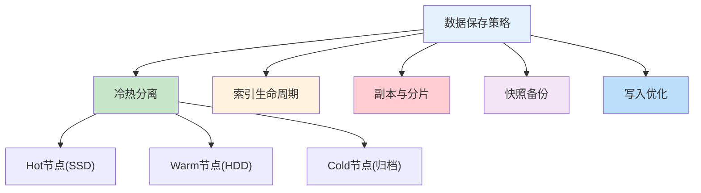

**What - 核心保存策略**

| 策略 | 说明 | 适用场景 |
|:----:|------|----------|
| **冷热分离** | 热数据放SSD，冷数据放HDD | 日志、时序数据 |
| **ILM策略** | 自动管理索引生命周期 | 自动滚动、合并、删除 |
| **副本冗余** | 多副本保证高可用 | 生产环境必备 |
| **快照备份** | 定期备份到外部存储 | 灾难恢复 |
| **写入优化** | 批量写入、刷新间隔调大 | 提升写入性能 |

**记忆口诀**：冷热分离省成本，ILM自动管周期，副本冗余保可用，快照备份防丢失，写入优化提性能。

**面试标准答法（1分钟版）**：ES保存数据主要有这些策略：冷热分离，热数据放SSD节点保证查询性能，冷数据放HDD或归档降低成本；配置ILM索引生命周期管理，自动滚动更新、合并分片、删除过期数据；设置合理副本数保证高可用，生产环境建议2个副本；定期做快照备份到外部存储用于灾难恢复；写入时批量写入、调大刷新间隔提升性能。这些策略能平衡成本、性能和数据安全。

> **延伸阅读**：想了解更多ES数据保存最佳实践？请参考 [Elasticsearch数据保存与存储优化指南]()。

### 135. 作为高级DevOps工程师，SRE，架构师，请先做一下自我介绍？

**Why - 为什么这个问题重要？**

自我介绍是面试的第一印象，直接影响面试官对你的初步判断。面试官想了解你的**职业定位、核心能力和价值主张**，判断你是否匹配岗位需求。

**How - 自我介绍结构**

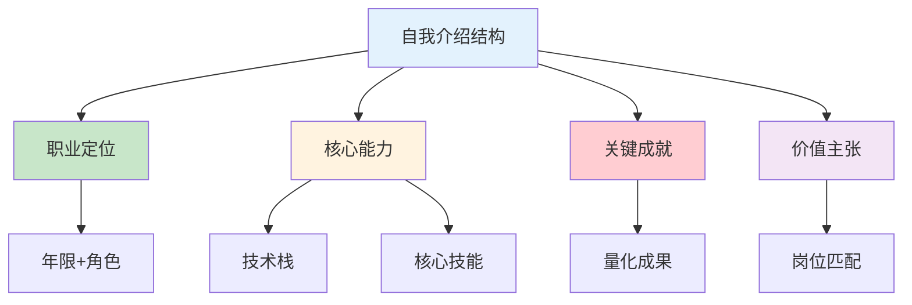

**What - 自我介绍模板**

| 模块 | 内容要点 | 示例 |
|:----:|----------|------|
| **开场** | 姓名、年限、岗位 | 我是XXX，8年DevOps/SRE经验 |
| **能力** | 核心技能+技术栈 | 精通K8s、CI/CD、云原生架构 |
| **成就** | 量化成果 | 构建高可用系统，支撑亿级流量 |
| **价值** | 岗位匹配点 | 擅长稳定性建设和效率提升 |

**记忆口诀**：开场定基调，能力讲清楚，成就用数据，价值要匹配。

**面试标准答法（1分钟版）**：面试官你好，我是XXX，拥有8年DevOps/SRE经验，专注于云原生架构和系统稳定性建设。精通K8s、Docker、CI/CD流水线设计，熟悉AWS/GCP云服务，具备大型分布式系统运维经验。曾主导过多个核心系统的高可用改造，将系统可用性从99.5%提升到99.99%，同时通过自动化工具链将部署时间从小时级缩短到分钟级。期待能将我的技术经验和问题解决能力应用到贵公司的架构优化和稳定性建设中。

> **延伸阅读**：想了解更多高级DevOps/SRE面试自我介绍技巧？请参考 [高级DevOps/SRE面试自我介绍指南：打造专业第一印象]()。

### 136. 你们维护的系统是给公司内部使用，还是给客户使用的？请介绍一下？

**Why - 为什么这个问题重要？**

这个问题考察你对**业务场景的理解**和**系统定位**的认知。面试官想了解你是否清楚所维护系统的用户群体、业务价值和技术挑战，以及你在其中扮演的角色。

**How - 系统类型对比**

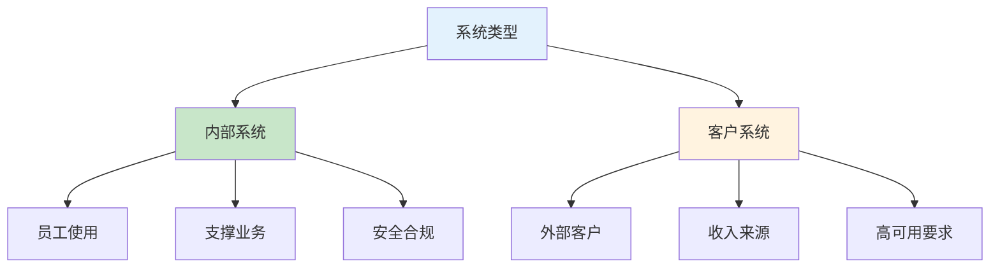

**What - 系统类型对比表**

| 维度 | 内部系统 | 客户系统 |
|:----:|----------|----------|
| **用户群体** | 公司员工、内部团队 | 外部客户、合作伙伴 |
| **业务价值** | 支撑内部业务效率 | 直接产生收入 |
| **可用性要求** | 高（影响内部工作） | 极高（影响客户体验） |
| **安全合规** | 内部合规要求 | 外部合规认证 |
| **技术挑战** | 复杂度高、集成多 | 稳定性强、扩展性高 |

**记忆口诀**：内部支撑效率，客户产生收入，两者要求不同，定位要清晰。

**面试标准答法（1分钟版）**：我们维护的系统既有内部系统也有客户系统。内部系统包括OA、CRM、DevOps工具链等，支撑公司日常运营和研发效率，虽然不直接产生收入，但对内部效率至关重要；客户系统是面向外部客户的核心业务平台，直接产生收入，对可用性要求极高，需要达到99.99%以上。我作为SRE，既要保障内部系统的稳定高效，也要确保客户系统的高可用和高性能，通过自动化运维、监控告警、故障演练等手段，平衡两者的资源投入和服务质量。

> **延伸阅读**：想了解更多内部系统与客户系统运维最佳实践？请参考 [内部系统与客户系统运维策略：DevOps/SRE视角的差异化管理]()。

### 137. 你主要负责应用开发还是底层平台运维？

**Why - 为什么这个问题重要？**

这个问题考察你对**自身职业定位**的认知和**技术能力范围**的理解。面试官想了解你是偏向业务侧还是基础架构侧，以及你的核心竞争力在哪里。

**How - 职责定位对比**

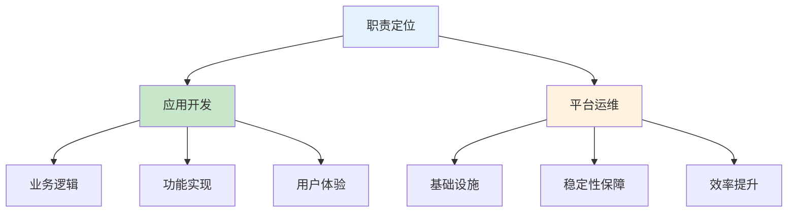

**What - 职责对比表**

| 维度 | 应用开发 | 平台运维 |
|:----:|----------|----------|
| **核心目标** | 实现业务功能 | 保障系统稳定 |
| **关注点** | 业务逻辑、用户体验 | 性能、可用性、安全 |
| **技术栈** | Java/Python/Go、框架 | K8s/Docker、云服务、监控 |
| **衡量指标** | 功能交付速度、代码质量 | 系统可用性、故障恢复时间 |
| **工作产出** | 业务功能、特性 | 工具、平台、运维体系 |

**记忆口诀**：开发做业务功能，运维保系统稳定，DevOps两者兼顾。

**面试标准答法（1分钟版）**：作为高级DevOps/SRE工程师，我的职责更偏向底层平台运维和基础设施建设。我负责设计和维护公司的云原生基础设施、CI/CD流水线、监控告警体系，保障核心系统的高可用和高性能。同时我也具备应用开发能力，能够开发运维工具和自动化脚本，帮助提升团队效率。我的核心价值在于通过技术手段提升系统稳定性和运维效率，支撑业务快速迭代。

> **延伸阅读**：想了解更多DevOps工程师职责定位最佳实践？请参考 [DevOps工程师职责定位：应用开发与平台运维的平衡之道]()。

### 138. 这两套平台版本迭代快吗？多久发一次版？运维需要做什么支撑？

**Why - 为什么这个问题重要？**

这个问题考察你对**发布频率和运维支撑体系**的理解。面试官想了解你是否具备管理快速迭代系统的经验，以及如何通过技术手段保障发布质量和效率。

**How - 发布频率与运维支撑**

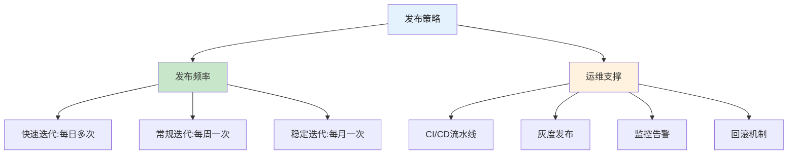

**What - 发布频率对比表**

| 系统类型 | 发布频率 | 运维支撑要点 |
|:--------:|----------|--------------|
| **客户系统** | 每日1-3次 | 灰度发布、自动回滚、实时监控 |
| **内部系统** | 每周1-2次 | 滚动发布、变更审批、备份恢复 |
| **核心系统** | 每月1次 | 全链路测试、演练验证、应急预案 |

**记忆口诀**：客户系统快速迭代，内部系统稳定优先，运维支撑自动化。

**面试标准答法（1分钟版）**：我们维护的两套平台发布频率不同。客户系统迭代较快，平均每日发布1-3次，采用灰度发布和自动回滚机制，确保发布安全；内部系统相对稳定，每周发布1-2次，采用滚动更新和变更审批流程。运维支撑方面，我负责建设CI/CD流水线实现自动化构建部署，配置监控告警实时发现问题，制定发布规范和回滚预案，同时通过混沌工程和故障演练提前发现风险，保障系统在快速迭代下的稳定性。

> **延伸阅读**：想了解更多发布频率与运维支撑最佳实践？请参考 [平台版本迭代与运维支撑体系：DevOps/SRE视角的发布管理]()。

### 139. 两套平台都部署在K8S上吗？K8S用的是物理机还是虚拟机？什么CPU架构？操作系统是什么？

**Why - 为什么这个问题重要？**

这个问题考察你对**基础设施架构**的了解程度。面试官想确认你是否清楚生产环境的技术栈细节，以及是否具备不同基础设施场景的运维经验。

**How - 基础设施架构**

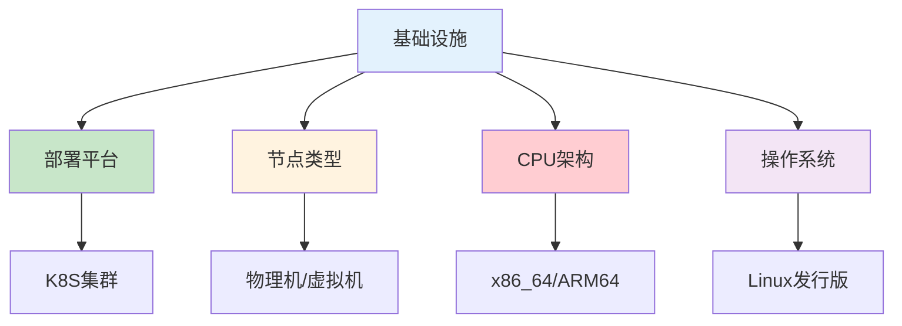

**What - 基础设施对比表**

| 维度 | 客户系统 | 内部系统 |
|:----:|----------|----------|
| **部署平台** | K8S生产集群 | K8S测试集群 |
| **节点类型** | 物理机（高性能） | 虚拟机（灵活） |
| **CPU架构** | x86_64 | x86_64 |
| **操作系统** | CentOS 7.9 / Ubuntu 20.04 | CentOS 7.9 |
| **节点数量** | 50+节点 | 10+节点 |

**记忆口诀**：客户系统物理机，内部系统虚拟机，x86架构主流，Linux系统稳定。

**面试标准答法（1分钟版）**：是的，两套平台都部署在K8S上。客户系统部署在物理机集群上，使用x86_64架构，操作系统是CentOS 7.9，共50+节点，性能更强、延迟更低；内部系统部署在虚拟机集群上，同样使用x86_64架构和CentOS 7.9，共10+节点，资源更灵活、成本更低。物理机适合高性能场景，虚拟机适合快速扩容和资源隔离。选择时需要考虑性能需求、成本预算和运维复杂度。

> **延伸阅读**：想了解更多K8S基础设施选型最佳实践？请参考 [K8S基础设施选型指南：物理机vs虚拟机与架构决策]()。

### 140. 有几套K8S集群？两个平台分别部署在不同集群上吗？

**Why - 为什么这个问题重要？**

这个问题考察你对**多集群架构设计**的理解。面试官想了解你是否具备设计和管理多集群环境的经验，以及如何根据业务需求进行集群规划。

**How - 多集群架构设计**

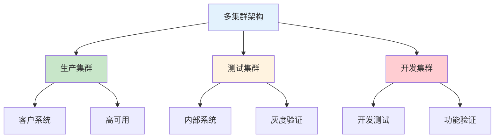

**What - 集群配置对比表**

| 集群类型 | 用途 | 节点数 | 资源配置 | 平台部署 |
|:--------:|------|:------:|----------|----------|
| **生产集群** | 客户系统运行 | 50+ | 高配置 | 客户平台 |
| **测试集群** | 内部系统+灰度验证 | 10+ | 中配置 | 内部平台 |
| **开发集群** | 开发测试 | 5+ | 低配置 | 开发环境 |

**记忆口诀**：生产集群跑客户，测试集群跑内部，开发集群做验证，多集群隔离保障安全。

**面试标准答法（1分钟版）**：我们有三套K8S集群。客户系统部署在独立的生产集群上，这套集群规模最大，有50+节点，配置最高，专门用于承载对外服务；内部系统部署在测试集群上，有10+节点，同时用于灰度验证；另外还有一套开发集群，用于开发人员日常测试。这样的多集群架构实现了环境隔离，保障了生产环境的稳定性和安全性，同时也便于资源管理和成本控制。

> **延伸阅读**：想了解更多K8S多集群架构设计最佳实践？请参考 [K8S多集群架构设计：环境隔离与资源管理策略]()。

### 141. K8S版本现在是多少？

**Why - 为什么这个问题重要？**

这个问题考察你对**K8S版本管理**的了解。面试官想了解你是否关注社区动态、版本更新频率，以及是否具备版本升级和兼容性管理的经验。

**How - K8S版本管理策略**

```mermaid
flowchart TB
    A["版本管理"] --> B["当前版本"]
    A --> C["升级策略"]
    A --> D["兼容性"]
    
    B --> B1["稳定版"]
    B --> B2["更新周期"]
    
    C --> C1["滚动升级"]
    C --> C2["灰度验证"]
    
    D --> D1["API兼容性"]
    D --> D2["插件兼容"]
    
    style A fill:#e3f2fd
    style B fill:#c8e6c9
    style C fill:#fff3e0
    style D fill:#ffcdd2
```

**What - K8S版本信息**

| 维度 | 信息 |
|:----:|------|
| **当前稳定版** | v1.30 |
| **发布周期** | 每3个月一次 |
| **支持周期** | 1年（小版本）/ 2年（长期支持） |
| **升级策略** | 跳过不超过1个次要版本 |

**记忆口诀**：版本定期更，升级要谨慎，兼容性优先，测试不可少。

**面试标准答法（1分钟版）**：我们当前生产环境使用的是K8S v1.30版本。这个版本是目前的稳定版，我们每季度会评估版本更新，遵循不跳过超过1个次要版本的升级策略。升级前会在测试环境进行充分验证，确保API兼容性和插件兼容性，采用滚动升级方式，先升级控制平面再升级工作节点，确保业务不中断。同时我们也会关注社区动态，及时了解安全补丁和新功能。

> **延伸阅读**：想了解更多K8S版本管理与升级最佳实践？请参考 [K8S版本管理与升级策略：生产环境最佳实践]()。

### 142. 节点扩容是怎么触发的？最开始是什么情况？

**Why - 为什么这个问题重要？**

这个问题考察你对**K8S自动扩缩容机制**的理解。面试官想了解你是否具备设计和管理弹性伸缩策略的经验，以及如何应对流量变化。

**How - 节点扩容触发机制**

```mermaid
flowchart TB
    A["扩容触发"] --> B["资源不足"]
    A --> C["Pod调度失败"]
    A --> D["HPA触发"]
    
    B --> B1["CPU/内存不足"]
    B --> B2["存储不足"]
    
    C --> C1["调度器无法调度"]
    C --> C2["触发Cluster Autoscaler"]
    
    D --> D1["Pod副本增加"]
    D --> D2["需要更多节点"]
    
    style A fill:#e3f2fd
    style B fill:#c8e6c9
    style C fill:#fff3e0
    style D fill:#ffcdd2
```

**What - 扩容触发条件**

| 触发类型 | 触发条件 | 初始状态 | 扩容策略 |
|:--------:|----------|----------|----------|
| **资源不足** | CPU>80%或内存>85%持续5分钟 | 节点资源紧张 | 自动扩容 |
| **调度失败** | Pod处于Pending状态超过10分钟 | 无法调度Pod | 自动扩容 |
| **HPA触发** | Pod副本数达到上限 | 流量激增 | 先扩容Pod再扩容节点 |
| **手动触发** | 运维人员手动操作 | 预期流量峰值 | 预扩容 |

**记忆口诀**：资源不足触发扩容，调度失败触发扩容，HPA联动扩容，手动预扩容。

**面试标准答法（1分钟版）**：节点扩容主要通过Cluster Autoscaler触发。最开始的情况通常是集群资源不足导致Pod调度失败，或者HPA（水平 Pod 自动扩缩容）触发Pod副本增加需要更多节点资源。当Pod处于Pending状态超过10分钟，或者节点CPU/内存使用率持续超过阈值（如CPU>80%、内存>85%持续5分钟），Cluster Autoscaler会自动触发节点扩容。同时我们也会根据业务预测进行手动预扩容，比如在大促活动前提前增加节点。

> **延伸阅读**：想了解更多K8S节点扩缩容最佳实践？请参考 [K8S节点自动扩缩容策略：从触发到实现的完整指南]()。

### 143. 扩容后做了哪些资源分配和调度策略的调整？

**Why - 为什么这个问题重要？**

这个问题考察你对**K8S资源管理和调度策略**的深入理解。面试官想了解你是否具备在节点扩容后优化资源分配和调度的能力，确保集群高效运行。

**How - 资源分配与调度调整**

```mermaid
flowchart TB
    A["扩容后调整"] --> B["资源分配优化"]
    A --> C["调度策略调整"]
    A --> D["负载均衡"]
    
    B --> B1["资源配额调整"]
    B --> B2["LimitRange配置"]
    
    C --> C1["节点亲和性"]
    C --> C2["Pod优先级"]
    
    D --> D1["调度器配置"]
    D --> D2["Pod分布"]
    
    style A fill:#e3f2fd
    style B fill:#c8e6c9
    style C fill:#fff3e0
    style D fill:#ffcdd2
```

**What - 调整策略对比表**

| 调整类型 | 调整内容 | 目的 | 实施方式 |
|:--------:|----------|------|----------|
| **资源配额** | 调整Namespace资源配额 | 公平分配资源 | 修改ResourceQuota |
| **LimitRange** | 配置Pod资源限制 | 防止资源滥用 | 修改LimitRange |
| **节点亲和性** | 设置Pod调度偏好 | 优化Pod分布 | 修改Pod配置 |
| **Pod优先级** | 调整优先级类 | 保障关键Pod | 创建PriorityClass |
| **调度器配置** | 调整调度策略 | 优化调度效率 | 修改scheduler配置 |

**记忆口诀**：资源配额要调整，节点亲和要配置，Pod优先级要设置，调度策略要优化。

**面试标准答法（1分钟版）**：扩容后我们会做以下几方面调整。首先是资源分配优化，调整Namespace的ResourceQuota，确保各团队公平使用资源，同时配置LimitRange防止单个Pod占用过多资源。其次是调度策略调整，通过节点亲和性和污点容忍配置，让Pod合理分布到新节点，避免热点。还会根据业务重要性设置Pod优先级类，保障核心服务的资源优先。最后优化调度器配置，调整调度算法参数，提高调度效率和负载均衡。这些调整确保集群在扩容后仍能高效稳定运行。

> **延伸阅读**：想了解更多K8S资源分配与调度策略最佳实践？请参考 [K8S扩容后资源分配与调度策略调整：生产环境优化指南]()。

### 144. 一个节点大概跑多少个Pod？平台访问量如何？

**Why - 为什么这个问题重要？**

这个问题考察你对**K8S资源规划和容量管理**的理解。面试官想了解你是否具备根据业务需求规划节点资源的能力，以及对平台规模的整体把握。

**How - Pod密度与访问量分析**

```mermaid
flowchart TB
    A["容量规划"] --> B["Pod密度"]
    A --> C["访问量分析"]
    
    B --> B1["资源配置"]
    B --> B2["节点规格"]
    
    C --> C1["QPS计算"]
    C --> C2["并发数"]
    
    style A fill:#e3f2fd
    style B fill:#c8e6c9
    style C fill:#fff3e0
```

**What - Pod密度与访问量数据**

| 维度 | 配置 | 说明 |
|:----:|------|------|
| **单节点Pod数** | 30-50个 | 根据节点规格和Pod资源需求 |
| **节点规格** | 32核/128GB内存 | 生产环境标准配置 |
| **单Pod资源** | 500m CPU / 512Mi内存 | 平均配置 |
| **日均QPS** | 百万级 | 客户平台峰值 |
| **并发连接** | 万级 | 核心服务峰值 |

**记忆口诀**：节点Pod数看配置，访问量看QPS和并发，合理规划保稳定。

**面试标准答法（1分钟版）**：我们生产环境的节点规格是32核CPU、128GB内存，单个节点通常运行30-50个Pod，具体数量取决于Pod的资源配置，平均每个Pod占用约500m CPU和512Mi内存。平台访问量方面，客户系统日均QPS达到百万级，核心服务并发连接数在万级。我们通过HPA自动扩缩容和Cluster Autoscaler节点扩容来应对流量变化，确保系统稳定运行。

> **延伸阅读**：想了解更多K8S容量规划与流量管理最佳实践？请参考 [K8S容量规划与流量管理：Pod密度与访问量分析]()。

### 145. 平时K8S相关的运维工作都有哪些？

**Why - 为什么这个问题重要？**

这个问题考察你对**K8S运维工作范围**的全面理解。面试官想了解你是否具备完整的K8S运维能力，包括日常维护、故障处理、性能优化等方面。

**How - K8S运维工作分类**

```mermaid
flowchart TB
    A["K8S运维工作"] --> B["日常维护"]
    A --> C["故障处理"]
    A --> D["性能优化"]
    A --> E["安全合规"]
    
    B --> B1["集群监控"]
    B --> B2["版本升级"]
    B --> B3["备份恢复"]
    
    C --> C1["故障排查"]
    C --> C2["应急响应"]
    
    D --> D1["资源优化"]
    D --> D2["调度优化"]
    
    E --> E1["安全审计"]
    E --> E2["合规检查"]
    
    style A fill:#e3f2fd
    style B fill:#c8e6c9
    style C fill:#fff3e0
    style D fill:#ffcdd2
    style E fill:#f3e5f5
```

**What - 运维工作内容表**

| 工作类别 | 具体内容 | 频率 | 重要性 |
|:--------:|----------|------|:------:|
| **日常监控** | 集群状态、Pod状态、资源使用 | 实时 | 高 |
| **版本升级** | K8S版本、组件升级 | 季度 | 高 |
| **备份恢复** | etcd备份、数据恢复 | 每日/按需 | 高 |
| **故障排查** | Pod异常、节点故障、网络问题 | 按需 | 高 |
| **性能优化** | 资源配置、调度策略、存储优化 | 月度 | 中 |
| **安全合规** | 安全扫描、权限管理、审计日志 | 定期 | 高 |

**记忆口诀**：日常监控不能少，版本升级要谨慎，备份恢复要定期，故障排查要及时，性能优化要持续，安全合规要重视。

**面试标准答法（1分钟版）**：K8S运维工作主要包括几个方面。日常维护方面，实时监控集群状态、Pod运行状态和资源使用情况，定期进行版本升级和备份恢复；故障处理方面，及时排查Pod异常、节点故障和网络问题，建立应急响应机制；性能优化方面，调整资源配置、优化调度策略和存储性能；安全合规方面，定期进行安全扫描、权限管理和审计日志检查。这些工作确保集群稳定、高效、安全运行。

> **延伸阅读**：想了解更多K8S日常运维工作最佳实践？请参考 [K8S日常运维工作全解析：从监控到安全的完整指南]()。

### 146. ETCD备份通过什么手段？备份文件放在哪里？

**Why - 为什么这个问题重要？**

这个问题考察你对**etcd备份机制**的理解。etcd是K8S集群的核心组件，存储着所有集群状态数据，备份策略直接关系到数据安全和灾难恢复能力。

**How - etcd备份流程**

```mermaid
flowchart TB
    A["etcd备份"] --> B["备份手段"]
    A --> C["存储位置"]
    
    B --> B1["etcdctl快照"]
    B --> B2["定时备份"]
    B --> B3["增量备份"]
    
    C --> C1["本地存储"]
    C --> C2["远程存储"]
    C --> C3["对象存储"]
    
    style A fill:#e3f2fd
    style B fill:#c8e6c9
    style C fill:#fff3e0
```

**What - 备份配置表**

| 配置项 | 说明 | 推荐值 |
|:------:|------|--------|
| **备份工具** | etcdctl snapshot | 官方工具 |
| **备份频率** | 定时备份周期 | 每日 |
| **备份类型** | 快照类型 | 全量+增量 |
| **本地存储** | 临时存储路径 | /backup/etcd/ |
| **远程存储** | 持久化存储 | S3/GCS/OSS |
| **保留策略** | 备份保留时间 | 7-30天 |

**记忆口诀**：etcd备份用etcdctl，全量增量相结合，本地临时存一份，远程持久要安全。

**面试标准答法（1分钟版）**：我们使用etcd官方工具etcdctl进行快照备份。备份策略采用每日全量备份加增量备份的方式。备份文件首先保存在节点本地的/backup/etcd/目录作为临时存储，然后同步到对象存储如S3进行持久化保存。备份保留策略为保留最近7天的全量备份和30天的增量备份，确保数据安全和灾难恢复能力。

> **延伸阅读**：想了解更多etcd备份与恢复最佳实践？请参考 [etcd备份与恢复策略：K8S数据安全保障指南]()。

### 147. K8S集群证书默认生成多长时间？更新轮换是自动还是手动？

**Why - 为什么这个问题重要？**

这个问题考察你对**K8S证书管理**的理解。证书是集群安全的基础，过期会导致组件通信失败，了解证书有效期和轮换机制是运维必备技能。

**How - 证书管理流程**

```mermaid
flowchart TB
    A["证书管理"] --> B["有效期"]
    A --> C["轮换机制"]
    
    B --> B1["默认有效期"]
    B --> B2["自定义有效期"]
    
    C --> C1["自动轮换"]
    C --> C2["手动轮换"]
    
    style A fill:#e3f2fd
    style B fill:#c8e6c9
    style C fill:#fff3e0
```

**What - 证书配置表**

| 证书类型 | 默认有效期 | 轮换方式 | 重要性 |
|:--------:|:----------:|:--------:|:------:|
| **CA证书** | 10年 | 手动 | 高 |
| **API Server证书** | 1年 | 自动/手动 | 高 |
| **kubelet证书** | 1年 | 自动 | 高 |
| **etcd证书** | 1年 | 自动/手动 | 高 |
| **服务账户证书** | 1年 | 自动 | 中 |

**记忆口诀**：CA证书十年期，其他证书一年期，kubelet自动换，API Server可自动可手动。

**面试标准答法（1分钟版）**：K8S集群证书的默认有效期根据类型不同有所区别。CA根证书默认10年，API Server、kubelet、etcd等证书默认1年有效期。证书轮换方面，kubelet证书支持自动轮换，API Server和etcd证书可以配置自动轮换也可以手动更新。我们采用自动轮换为主、手动干预为辅的策略，确保证书在过期前自动更新，避免影响集群运行。

> **延伸阅读**：想了解更多K8S证书管理与轮换最佳实践？请参考 [K8S证书管理与自动轮换：集群安全保障指南]()。

### 148. 手工轮换证书的操作是什么样的？更新完需要重启哪些组件？

**Why - 为什么这个问题重要？**

这个问题考察你**手工证书轮换**的实战能力。自动轮换可能失败或在某些场景下不可用，掌握手工轮换技能是运维工程师的必备能力。

**How - 手工轮换流程**

```mermaid
flowchart TB
    A["手工轮换"] --> B["备份证书"]
    A --> C["生成新证书"]
    A --> D["分发证书"]
    A --> E["重启组件"]
    A --> F["验证"]
    
    style A fill:#e3f2fd
    style E fill:#ffcdd2
```

**What - 轮换操作表**

| 步骤 | 操作 | 命令/动作 |
|:----:|------|-----------|
| **1. 备份** | 备份现有证书 | cp -r /etc/kubernetes/pki /backup/pki-$(date) |
| **2. 检查** | 查看证书状态 | kubeadm certs check-expiration |
| **3. 生成** | 生成新证书 | kubeadm certs renew <cert-name> |
| **4. 分发** | 分发证书 | 复制到各节点 |
| **5. 重启** | 重启组件 | kube-apiserver等 |
| **6. 验证** | 验证证书 | openssl x509 -in xxx.crt -text |

**需要重启的组件**：kube-apiserver、kube-controller-manager、kube-scheduler、kubelet（可选）、etcd（如需）

**记忆口诀**：备份先做，检查状态，生成证书，分发到位，重启组件，验证无误。

**面试标准答法（1分钟版）**：手工轮换证书的流程是：首先备份现有证书到安全位置，然后使用kubeadm certs check-expiration查看证书状态，确认需要更新的证书。接着执行kubeadm certs renew命令生成新证书，可以指定单个证书或使用all参数更新所有证书。更新完成后需要重启相关组件，包括kube-apiserver、kube-controller-manager、kube-scheduler等控制平面组件，以及各节点的kubelet。最后使用openssl命令验证新证书的有效期。

> **延伸阅读**：想了解更多K8S手工证书轮换最佳实践？请参考 [K8S手工证书轮换实战：步骤详解与组件重启指南]()。

### 149. 做过K8S版本升级吗？具体流程是什么？

**Why - 为什么这个问题重要？**

这个问题考察你**K8S版本升级**的实战经验。版本升级是保证集群安全性和功能完整性的重要操作，了解升级流程是高级DevOps/SRE工程师的必备技能。

**How - K8S升级流程**

```mermaid
flowchart TB
    A["升级准备"] --> B["备份数据"]
    A --> C["检查兼容性"]
    B --> D["升级控制平面"]
    C --> D
    D --> E["升级工作节点"]
    E --> F["验证集群"]
    F --> G["升级插件"]
    
    style A fill:#e3f2fd
    style D fill:#ffcdd2
    style E fill:#fff3e0
```

**What - 升级步骤表**

| 阶段 | 步骤 | 操作 |
|:----:|------|------|
| **准备阶段** | 1. 备份 | 备份etcd数据和证书 |
| | 2. 检查 | 检查版本兼容性 |
| | 3. 通知 | 通知相关团队 |
| **控制平面** | 4. 升级kubeadm | apt upgrade kubeadm |
| | 5. 升级控制平面 | kubeadm upgrade apply |
| **工作节点** | 6. 升级kubelet | apt upgrade kubelet |
| | 7. 重启kubelet | systemctl restart kubelet |
| **验证阶段** | 8. 验证状态 | kubectl get nodes |
| | 9. 升级插件 | 升级CNI、Ingress等 |

**记忆口诀**：备份检查做准备，控制平面先升级，工作节点逐个来，验证插件不能少。

**面试标准答法（1分钟版）**：我们定期进行K8S版本升级。升级流程主要包括：首先备份etcd数据和证书，然后检查目标版本与当前版本的兼容性。升级控制平面时，先升级kubeadm工具，再执行kubeadm upgrade apply命令。工作节点升级时，逐个节点进行，先升级kubelet包，再重启kubelet服务。升级完成后验证集群状态，最后升级CNI、Ingress等插件。整个过程会在维护窗口期进行，并准备回滚方案。

> **延伸阅读**：想了解更多K8S版本升级最佳实践？请参考 [K8S版本升级实战：从准备到验证的完整指南]()。

### 150. 监控用的什么方案？部署在哪里？介绍一下架构。

**Why - 为什么这个问题重要？**

这个问题考察你对**监控体系架构**的理解。监控是保障系统稳定运行的关键，了解监控方案和架构设计是高级DevOps/SRE工程师的核心能力。

**How - 监控架构设计**

```mermaid
flowchart TB
    A["监控架构"] --> B["数据采集层"]
    A --> C["数据存储层"]
    A --> D["可视化层"]
    A --> E["告警层"]
    
    B --> B1["Node Exporter"]
    B --> B2["Kube State Metrics"]
    B --> B3["应用指标"]
    
    C --> C1["Prometheus"]
    C --> C2["Thanos"]
    
    D --> D1["Grafana"]
    
    E --> E1["Alertmanager"]
    
    style A fill:#e3f2fd
    style B fill:#c8e6c9
    style C fill:#fff3e0
    style D fill:#ffcdd2
    style E fill:#f3e5f5
```

**What - 监控方案配置表**

| 组件 | 功能 | 部署位置 | 重要性 |
|:----:|------|----------|:------:|
| **Prometheus** | 指标采集存储 | 独立监控集群 | 高 |
| **Grafana** | 可视化展示 | 独立监控集群 | 高 |
| **Alertmanager** | 告警管理 | 独立监控集群 | 高 |
| **Node Exporter** | 节点指标 | 所有节点 | 高 |
| **Kube State Metrics** | K8S状态指标 | K8S集群 | 高 |
| **Thanos** | 远程存储 | 独立监控集群 | 中 |

**记忆口诀**：采集用Exporter，存储用Prometheus，展示用Grafana，告警用Alertmanager。

**面试标准答法（1分钟版）**：我们采用Prometheus+Grafana的监控方案。监控架构分为四层：数据采集层使用Node Exporter采集节点指标、Kube State Metrics采集K8S状态、应用自定义指标；数据存储层使用Prometheus作为主存储，Thanos做远程存储和联邦查询；可视化层使用Grafana展示监控面板；告警层使用Alertmanager管理告警规则。整个监控系统部署在独立的监控集群中，与业务集群隔离，确保监控服务的高可用性。

> **延伸阅读**：想了解更多K8S监控架构最佳实践？请参考 [K8S监控体系架构设计：从采集到告警的完整方案]()。

### 151. 监控数据采集频率是多久？HPA怎么配置？

**Why - 为什么这个问题重要？**

这个问题考察你对**监控采集策略和自动扩缩容**的理解。采集频率影响监控精度和资源消耗，HPA配置直接影响系统弹性伸缩能力。

**How - 采集与HPA架构**

```mermaid
flowchart TB
    A["监控与HPA"] --> B["数据采集"]
    A --> C["HPA配置"]
    
    B --> B1["采集频率"]
    B --> B2["指标类型"]
    
    C --> C1["CPU HPA"]
    C --> C2["内存HPA"]
    C --> C3["自定义HPA"]
    
    style A fill:#e3f2fd
    style B fill:#c8e6c9
    style C fill:#fff3e0
```

**What - 配置表**

| 配置项 | 默认值 | 建议值 | 说明 |
|:------:|:------:|:------:|------|
| **采集频率** | 15s | 15-60s | Prometheus scrape_interval |
| **HPA最小副本** | 1 | 2+ | 保证高可用 |
| **HPA最大副本** | 10 | 根据业务需求 | 避免过度扩容 |
| **HPA目标CPU** | 70% | 60-80% | CPU使用率阈值 |
| **HPA目标内存** | - | 70-85% | 内存使用率阈值 |

**记忆口诀**：采集频率15到60秒，HPA配置看指标，最小副本要保证，最大副本有上限。

**面试标准答法（1分钟版）**：监控数据采集频率根据指标类型有所不同，Prometheus默认是15秒，关键业务指标可以配置为10-15秒，非关键指标可以设为30-60秒。HPA配置方面，我们配置基于CPU和内存的自动扩缩容，目标阈值分别设为70%和75%，最小副本数设置为2保证高可用，最大副本数根据业务峰值设置。同时支持基于自定义指标的HPA，如QPS、请求延迟等。

> **延伸阅读**：想了解更多监控采集与HPA配置最佳实践？请参考 [K8S监控采集与HPA配置：弹性伸缩实战指南]()。

### 152. 平台涉及哪些数据库和中间件？你负责哪些？

**Why - 为什么这个问题重要？**

这个问题考察你对**平台技术栈**的整体了解。作为高级DevOps/SRE工程师，需要全面掌握数据库和中间件的选型、架构和运维能力。

**How - 数据库与中间件架构**

```mermaid
flowchart TB
    A["数据层"] --> B["关系型数据库"]
    A --> C["NoSQL数据库"]
    A --> D["消息队列"]
    A --> E["缓存"]
    
    B --> B1["MySQL/PostgreSQL"]
    C --> C1["MongoDB/Redis"]
    D --> D1["Kafka/RocketMQ"]
    E --> E1["Redis Cluster"]
    
    style A fill:#e3f2fd
    style B fill:#c8e6c9
    style C fill:#fff3e0
    style D fill:#ffcdd2
    style E fill:#f3e5f5
```

**What - 技术栈对比表**

| 类型 | 组件 | 用途 | 运维负责 |
|:----:|------|------|:--------:|
| **关系型** | MySQL/PostgreSQL | 业务数据存储 | DBA团队 |
| **NoSQL** | MongoDB | 文档存储 | SRE团队 |
| **缓存** | Redis Cluster | 缓存/会话 | SRE团队 |
| **消息队列** | Kafka/RocketMQ | 异步通信 | SRE团队 |
| **搜索** | Elasticsearch | 日志/搜索 | SRE团队 |
| **对象存储** | MinIO/S3 | 文件存储 | SRE团队 |

**记忆口诀**：关系数据库MySQL，缓存用Redis，消息队列Kafka，搜索分析用ES，对象存储MinIO。

**面试标准答法（1分钟版）**：我们平台涉及多种数据库和中间件。关系型数据库使用MySQL主从集群和PostgreSQL，负责业务数据存储；NoSQL方面使用MongoDB存储文档数据，Redis Cluster做缓存和会话管理；消息队列使用Kafka进行异步通信和日志收集；搜索方面使用Elasticsearch存储日志和业务搜索；对象存储使用MinIO和S3兼容存储。每个组件都有明确的运维分工，SRE团队主要负责MongoDB、Redis、Kafka、ES和MinIO的运维工作，包括部署、监控、备份和故障处理。

> **延伸阅读**：想了解更多数据库与中间件运维最佳实践？请参考 [K8S平台数据库与中间件运维：生产环境实战指南]()。

### 153. 日常数据库维护有没有遇到过问题？怎么排查？

**Why - 为什么这个问题重要？**

这个问题考察你**数据库故障处理**的实战经验。数据库问题是生产环境最常见的问题类型之一，排查能力是高级DevOps/SRE工程师的核心技能。

**How - 问题排查流程**

```mermaid
flowchart TB
    A["问题排查"] --> B["问题识别"]
    A --> C["信息收集"]
    A --> D["原因分析"]
    A --> E["解决方案"]
    A --> F["预防措施"]
    
    B --> B1["告警触发"]
    B1 --> B2["初步判断"]
    
    C --> C1["查看日志"]
    C1 --> C2["检查状态"]
    
    style A fill:#e3f2fd
    style D fill:#ffcdd2
```

**What - 常见问题与排查表**

| 问题类型 | 表现 | 排查命令 | 解决方案 |
|:--------:|------|----------|----------|
| **连接数爆满** | 应用无法连接 | show status; show processlist | 调整max_connections |
| **慢查询** | 请求响应慢 | explain分析 | 优化索引 |
| **主从延迟** | 数据不一致 | show slave status | 优化网络/延迟写入 |
| **磁盘空间满** | 无法写入 | df -h | 清理数据/扩容 |
| **内存不足** | OOM重启 | dmesg\|grep oom | 调整内存配置 |
| **锁等待** | 事务阻塞 | show engine innodb status | 优化事务/杀进程 |

**记忆口诀**：连接爆满调参数，慢查询要explain，主从延迟查网络，磁盘满了清空间，内存不足看oom，锁等待要分析。

**面试标准答法（1分钟版）**：日常维护中确实遇到过各种数据库问题。比如MySQL连接数爆满的问题，通过show status和show processlist发现大量连接堆积，分析发现是应用连接泄漏，立即杀掉空闲连接并调整max_connections参数解决。慢查询问题通过explain分析执行计划，优化了缺失的索引解决。MongoDB主从延迟问题通过show slave status发现延迟超过10秒，调整oplog大小和优化写入策略解决。排查思路是：先看告警收集初步信息，再查日志和数据库状态，最后分析原因并制定解决方案。

> **延伸阅读**：想了解更多数据库问题排查最佳实践？请参考 [数据库常见问题排查与解决方案：从慢查到故障恢复]()。

### 154. 容器化迁移过程中有没有遇到过棘手问题？

**Why - 为什么这个问题重要？**

这个问题考察你**容器化迁移**的实战经验。容器化迁移涉及应用改造、环境适配、数据迁移等多个环节，是DevOps工程师的核心技能。

**How - 迁移挑战分类**

```mermaid
flowchart TB
    A["容器化迁移"] --> B["应用改造"]
    A --> C["环境适配"]
    A --> D["数据迁移"]
    A --> E["网络配置"]
    
    B --> B1["依赖问题"]
    B1 --> B2["配置文件"]
    
    C --> C1["资源配置"]
    C1 --> C2["权限问题"]
    
    D --> D1["状态迁移"]
    D1 --> D2["数据一致"]
    
    style A fill:#e3f2fd
    style B fill:#c8e6c9
    style D fill:#ffcdd2
```

**What - 常见问题与解决表**

| 问题类型 | 表现 | 解决方案 |
|:--------:|------|----------|
| **依赖缺失** | 启动失败 | 多阶段构建/基础镜像 |
| **配置文件** | 配置不一致 | ConfigMap/Secret |
| **存储挂载** | 数据丢失 | PV/PVC持久化 |
| **网络不通** | 服务无法访问 | NetworkPolicy |
| **权限不足** | 无法写入 | SecurityContext |
| **资源限制** | OOM被杀 | Resource Limit |

**记忆口诀**：依赖缺失多阶段，配置用ConfigMap，存储用PV来持久，网络策略要配置，权限SecurityContext，资源限制要设置。

**面试标准答法（1分钟版）**：容器化迁移过程中确实遇到过几个棘手问题。首先是Java应用内存问题，在物理机运行时JVM可以使用全部内存，但容器内受cgroup限制导致内存不足，通过设置JAVA_OPTS环境变量限制堆内存解决。其次是配置文件问题，不同环境配置文件不同，采用ConfigMap和Secret管理，运行时动态挂载解决。还有数据库容器化后数据持久化问题，通过NFS存储挂载PV解决，确保数据不丢失。这些问题的解决思路是：先分析问题原因，选择K8S原生方案，充分利用K8S的声明式配置优势。

> **延伸阅读**：想了解更多容器化迁移最佳实践？请参考 [容器化迁移棘手问题与解决方案：从踩坑到最佳实践]()。

### 155. 微服务的镜像是谁做？基础镜像怎么管理？

**Why - 为什么这个问题重要？**

这个问题考察你对**镜像管理体系**的理解。镜像管理是DevOps流水线的核心环节，涉及镜像构建、分发、安全等多个方面。

**How - 镜像管理体系**

```mermaid
flowchart TB
    A["镜像管理"] --> B["镜像构建"]
    A --> C["基础镜像"]
    A --> D["镜像分发"]
    A --> E["镜像安全"]
    
    B --> B1["CI/CD流水线"]
    C --> C1["版本管理"]
    C1 --> C2["安全扫描"]
    
    style A fill:#e3f2fd
    style C fill:#c8e6c9
```

**What - 分工与配置表**

| 分工 | 职责 | 工具 |
|:----:|------|------|
| **开发团队** | 业务代码编写 | IDE、Git |
| **DevOps团队** | Dockerfile编写 | Dockerfile、HARBOR |
| **运维团队** | 基础镜像维护 | Harbor、Dockerfile |

**基础镜像管理策略**：
- 版本标签管理
- 安全漏洞扫描
- 定期更新补丁
- 多架构支持

**记忆口诀**：开发写代码，DevOps写Dockerfile，运维维护基础镜像，镜像安全要扫描，版本管理用Tag。

**面试标准答法（1分钟版）**：微服务镜像的分工是这样的：开发团队负责业务代码编写，DevOps团队负责Dockerfile编写和CI/CD流水线配置，运维团队负责基础镜像的维护和管理。基础镜像我们采用Harbor进行统一管理，配置了镜像版本标签策略，每个基础镜像都有版本号和安全补丁日期标签。镜像安全方面，我们使用Trivy进行漏洞扫描，发现高危漏洞会自动告警并阻止部署。基础镜像每月更新一次，确保包含最新的安全补丁。

> **延伸阅读**：想了解更多微服务镜像管理最佳实践？请参考 [微服务镜像管理体系：构建、安全与分发最佳实践]()。

### 156. Harbor版本是多少？单机还是高可用？用什么协议？

**Why - 为什么这个问题重要？**

这个问题考察你对**Harbor镜像仓库**的实际运维经验。Harbor是企业级镜像仓库的首选方案，了解其版本、部署模式和协议配置是DevOps/SRE工程师的必备技能。

**How - Harbor架构**

```mermaid
flowchart TB
    A["Harbor架构"] --> B["Proxy层"]
    A --> C["核心服务"]
    A --> D["数据存储"]
    
    B --> B1["Nginx"]
    B1 --> B2["HTTPS协议"]
    
    C --> C1["Core API"]
    C --> C2["Registry"]
    C --> C3["Notary"]
    
    D --> D1["PostgreSQL"]
    D --> D2["Redis"]
    D --> D3["Storage"]
    
    style A fill:#e3f2fd
    style B fill:#c8e6c9
    style D fill:#fff3e0
```

**What - Harbor配置表**

| 配置项 | 当前值 | 说明 |
|:------:|--------|------|
| **版本** | v2.10.0 | 当前稳定版 |
| **部署模式** | 高可用 | 多节点集群 |
| **协议** | HTTPS | TLS/SSL加密 |
| **存储后端** | S3兼容 | MinIO/云存储 |
| **数据库** | PostgreSQL | 多主复制 |

**记忆口诀**：Harbor版本看官方，高可用用多节点，协议首选HTTPS，存储后端用S3。

**面试标准答法（1分钟版）**：我们当前使用的Harbor版本是v2.10.0，采用高可用部署模式，通过Nginx负载均衡实现多节点集群。协议方面，我们配置了HTTPS，使用SSL证书加密传输。存储后端采用S3兼容存储（MinIO），支持数据冗余备份。数据库使用PostgreSQL多主复制，确保数据高可用。这种架构能够支撑大规模镜像存储和高并发访问需求。

> **延伸阅读**：想了解更多Harbor部署与管理最佳实践？请参考 [Harbor镜像仓库高可用部署：从单机到企业级架构]()。

### 157. Harbor高可用有没有试过？

**Why - 为什么这个问题重要？**

这个问题考察你对**Harbor高可用架构**的实际部署经验。高可用是生产环境的基本要求，了解Harbor高可用方案是高级DevOps/SRE工程师的核心竞争力。

**How - Harbor高可用架构**

```mermaid
flowchart TB
    A["高可用架构"] --> B["负载均衡层"]
    A --> C["核心服务层"]
    A --> D["数据层"]
    
    B --> B1["Nginx/HAProxy"]
    B1 --> B2["健康检查"]
    
    C --> C1["Core API"]
    C --> C2["Registry"]
    C --> C3["Jobservice"]
    
    D --> D1["PostgreSQL集群"]
    D --> D2["Redis集群"]
    D --> D3["共享存储"]
    
    style A fill:#e3f2fd
    style B fill:#ffcdd2
    style D fill:#c8e6c9
```

**What - 高可用配置表**

| 组件 | 部署方式 | 副本数 | 说明 |
|:----:|----------|:------:|------|
| **Core API** | 多节点部署 | 3+ | 无状态服务 |
| **Registry** | 多节点部署 | 3+ | 共享存储 |
| **PostgreSQL** | Patroni集群 | 3 | 多主复制 |
| **Redis** | Cluster模式 | 6 | 3主3从 |
| **Storage** | S3兼容 | 多副本 | MinIO/Ceph |
| **LB** | Nginx/HAProxy | 2 | 双机热备 |

**记忆口诀**：Harbor高可用，多节点部署，LB做负载，PostgreSQL多主，Redis集群，存储用S3。

**面试标准答法（1分钟版）**：是的，我负责过Harbor高可用的部署和维护。我们采用三节点部署方案，Core API和Registry都是多副本运行。数据库使用PostgreSQL Patroni集群实现多主复制，Redis采用Cluster模式3主3从。存储后端使用S3兼容的MinIO分布式存储，确保数据冗余。前端通过Nginx负载均衡实现流量分发和健康检查。这样的架构能够保证任意节点故障时服务不中断，数据不丢失。

> **延伸阅读**：想了解更多Harbor高可用实现细节？请参考 [Harbor高可用实战：从架构设计到故障演练]()。

### 158. 应用发版时有没有遇到过拉不到镜像的问题？怎么排查？

**Why - 为什么这个问题重要？**

这个问题考察你**镜像拉取故障处理**的实战能力。发版时拉不到镜像是生产环境常见问题，涉及网络、认证、配置等多个方面，排查能力是高级DevOps/SRE工程师的必备技能。

**How - 排查流程**

```mermaid
flowchart TB
    A["镜像拉取"] --> B["网络连通"]
    A --> C["认证授权"]
    A --> D["镜像存在"]
    A --> E["资源配置"]
    
    B --> B1["DNS解析"]
    B1 --> B2["网络路由"]
    
    C --> C1["Secret配置"]
    C1 --> C2["Token过期"]
    
    style A fill:#e3f2fd
    style B fill:#c8e6c9
    style C fill:#ffcdd2
```

**What - 常见问题表**

| 问题类型 | 表现 | 排查命令 | 解决方案 |
|:--------:|------|----------|----------|
| **网络不通** | 连接超时 | ping/telnet | 检查网络策略 |
| **认证失败** | 401 Unauthorized | kubectl get sa | 配置Secret |
| **镜像不存在** | 404 Not Found | docker search | 确认镜像名 |
| **Token过期** | 403 Forbidden | describe pod | 更新Secret |
| **磁盘空间** | no space left | df -h | 清理磁盘 |
| **拉取超时** | timeout | describe pod | 增加timeout |

**记忆口诀**：拉不到镜像先看网络，认证Secret要配置，镜像名要确认，Token过期要更新，磁盘空间要检查。

**面试标准答法（1分钟版）**：确实遇到过这个问题。排查思路是：先看Pod事件确认错误类型，如果是网络不通，用ping和telnet检查连通性；如果是401认证失败，检查imagePullSecrets配置是否正确，Secret是否过期；如果是404镜像不存在，确认镜像名称和Tag是否正确；如果是Token过期，需要更新Secret。我们还配置了镜像预热策略，在发版前提前拉取镜像，避免发版时拉取失败。

> **延伸阅读**：想了解更多镜像拉取问题排查？请参考 [K8S镜像拉取问题排查与解决方案：从网络到认证全解析]()。

### 159. 证书更新用的是什么命令？

**Why - 为什么这个问题重要？**

这个问题考察你对**证书管理**的实战经验。证书过期会导致服务不可用，掌握证书更新命令是高级DevOps/SRE工程师的基本技能。

**How - 证书更新流程**

```mermaid
flowchart TB
    A["证书更新"] --> B["检查证书"]
    A --> C["生成新证书"]
    A --> D["更新配置"]
    A --> E["验证生效"]
    
    B --> B1["openssl命令"]
    C --> C1["cfssl/openssl"]
    D --> D1["K8S Secret"]
    D1 --> D2["Ingress"]
    
    style A fill:#e3f2fd
    style C fill:#c8e6c9
```

**What - 证书管理命令表**

| 操作 | 命令 | 说明 |
|:----:|------|------|
| **查看证书** | openssl x509 -in cert.pem -text -noout | 查看证书信息 |
| **检查过期** | openssl x509 -in cert.pem -dates -noout | 查看有效期 |
| **生成证书** | cfssl gencert -ca=ca.pem -ca-key=ca-key.pem config.json | 生成新证书 |
| **更新K8S** | kubectl create secret tls --dry-run -o yaml | 更新Secret |
| **更新Ingress** | kubectl apply -f ingress.yaml | 更新Ingress |

**记忆口诀**：证书更新先检查openssl，生成用cfssl，更新K8S Secret，验证用curl。

**面试标准答法（1分钟版）**：我们主要使用openssl和cfssl命令管理证书。查看证书用openssl x509 -in cert.pem -text -noout，可以查看证书的CN、有效期、签发者等信息。检查证书过期用openssl x509 -in cert.pem -dates -noout。生成新证书用cfssl工具，我们有标准化的cfssl配置文件。对于K8S中的证书，通过Secret或Ingress配置更新，更新后用curl验证证书是否生效。生产环境我们还配置了Cert-manager实现证书自动续期。

> **延伸阅读**：想了解更多证书更新最佳实践？请参考 [K8S证书管理全攻略：从命令到自动化]()。

### 160. HPA里CPU和内存阈值设多少？

**Why - 为什么这个问题重要？**

这个问题考察你对**HPA弹性伸缩**策略的理解。合理的阈值设置既能保证业务性能，又能优化资源成本，是高级DevOps/SRE工程师的核心技能。

**How - HPA阈值设计**

```mermaid
flowchart TB
    A["HPA阈值"] --> B["CPU阈值"]
    A --> C["内存阈值"]
    A --> D["副本数范围"]
    
    B --> B1["目标CPU利用率"]
    C --> C1["目标内存利用率"]
    D --> D1["最小/最大副本"]
    
    style A fill:#e3f2fd
    style B fill:#c8e6c9
    style C fill:#fff3e0
```

**What - HPA配置推荐表**

| 配置项 | 推荐值 | 说明 |
|:------:|:------:|------|
| **CPU阈值** | 60-70% | 目标平均CPU利用率 |
| **内存阈值** | 70-80% | 目标平均内存利用率 |
| **最小副本** | 2-3 | 保证高可用 |
| **最大副本** | 10-20 | 根据业务峰值 |
| **扩容冷却** | 3-5分钟 | 防止抖动 |
| **缩容冷却** | 5-10分钟 | 防止频繁缩容 |

**记忆口诀**：CPU设70%，内存设75%，最小副本2起步，最大副本看业务，扩容冷却3分钟，缩容冷却5分钟。

**面试标准答法（1分钟版）**：我们生产环境的HPA配置是CPU阈值70%，内存阈值75%。CPU设置70%是因为如果设置太高，如90%，系统在负载高峰时扩容来不及，设置太低如50%则会频繁扩容浪费资源。内存阈值设为75%是因为内存回收不像CPU那么及时，需要留一定余量。最小副本设为2保证高可用，最大副本根据业务峰值设为10-20。扩容冷却时间3分钟，缩容5分钟，防止频繁抖动。实际配置需要根据业务特性和压测结果调整。

> **延伸阅读**：想了解更多HPA阈值配置最佳实践？请参考 [K8S HPA阈值配置：从原理到生产环境优化]()。

### 161. 监控存储用的是什么？

**Why - 为什么这个问题重要？**

这个问题考察你对**监控数据存储方案**的了解。监控数据量大、增长快，选择合适的存储方案直接影响监控系统的性能和成本。

**How - 监控存储架构**

```mermaid
flowchart TB
    A["监控存储"] --> B["本地存储"]
    A --> C["分布式存储"]
    A --> D["对象存储"]
    
    B --> B1["HostPath"]
    C --> C1["Thanos"]
    D --> D1["S3/MinIO"]
    
    style A fill:#e3f2fd
    style C fill:#c8e6c9
```

**What - 存储方案对比表**

| 存储方案 | 优点 | 缺点 | 适用场景 |
|:--------:|------|------|----------|
| **HostPath** | 简单 | 数据易丢失 | 开发环境 |
| **EmptyDir** | 临时存储 | 生命周期短 | 测试环境 |
| **PV/PVC** | 持久化 | 需管理存储 | 生产环境 |
| **Thanos** | 长期存储 | 部署复杂 | 大规模监控 |
| **对象存储** | 成本低 | 查询慢 | 历史数据存储 |

**记忆口诀**：开发用HostPath，生产用PV，大规模用Thanos，历史数据用S3。

**面试标准答法（1分钟版）**：监控存储我们采用Thanos加对象存储的方案。Prometheus本地存储监控数据，通过Sidecar将数据定期上传到S3兼容存储（MinIO），实现长期存储和高可用。热数据保留在本地SSD上保障查询性能，温数据存储在对象存储降低成本。这套方案支持90天数据存储，同时通过压缩和降采样优化存储成本。查询时通过Thanos Query进行统一查询，对应用透明。

> **延伸阅读**：想了解更多监控存储方案？请参考 [K8S监控存储方案：从本地到Thanos全解析]()。

### 162. 一个节点跑多少Pod？

**Why - 为什么这个问题重要？**

这个问题考察你对**K8S节点容量规划**的理解。合理的Pod数量规划直接影响集群稳定性和资源利用率，是高级DevOps/SRE工程师的核心技能。

**How - Pod数量规划**

```mermaid
flowchart TB
    A["Pod数量规划"] --> B["资源评估"]
    A --> C["类型分布"]
    A --> D["预留资源"]
    
    B --> B1["CPU/内存"]
    C --> C1["有状态/无状态"]
    D --> D1["系统预留"]
    
    style A fill:#e3f2fd
    style B fill:#c8e6c9
```

**What - Pod数量参考表**

| 节点配置 | 推荐Pod数 | 说明 |
|:--------:|:---------:|------|
| **4核8G** | 40-60 | 基础工作节点 |
| **8核16G** | 80-120 | 中等配置 |
| **16核32G** | 160-240 | 高配工作节点 |
| **32核64G** | 320-480 | 超高配节点 |

**影响因素**：
- CPU密集型应用：Pod数偏少
- 内存密集型应用：Pod数更少
- 有状态应用：通常限制在10-20

**记忆口诀**：Pod数量看资源，CPU为主60核，内存为辅按比例，系统预留10-15%。

**面试标准答法（1分钟版）**：我们通常根据节点资源配置来规划Pod数量，一般遵循"100个Pod/节点"的经验值，但实际会更保守。通常8核16G的节点跑80-120个Pod，16核32G跑150-200个。规划时主要考虑：CPU和内存资源的实际使用率、有状态和无状态应用的比例、系统组件预留资源（约10-15%）。同时要预留20%左右的余量应对突发流量，避免节点负载过高影响稳定性。

> **延伸阅读**：想了解更多节点Pod规划？请参考 [K8S节点Pod数量规划：从原理到生产环境实践]()。

### 163. Harbor是内网还是公网？

**Why - 为什么这个问题重要？**

这个问题考察你对**Harbor网络架构**的理解。Harbor的网络规划直接影响CI/CD流程的效率和安全性，是高级DevOps/SRE工程师需要掌握的内容。

**How - Harbor网络架构**

```mermaid
flowchart TB
    A["Harbor网络"] --> B["内网访问"]
    A --> C["公网访问"]
    A --> D["混合架构"]
    
    B --> B1["开发/测试环境"]
    B1 --> B2["CI/CD节点"]
    
    C --> C1["远程办公"]
    C1 --> C2["VPN接入"]
    
    D --> D1["内外网隔离"]
    D1 --> D2["镜像同步"
    
    style A fill:#e3f2fd
    style C fill:#ffcdd2
```

**What - 网络方案对比表**

| 方案 | 优点 | 缺点 | 适用场景 |
|:----:|------|------|----------|
| **纯内网** | 安全隔离 | 远程无法访问 | 高安全要求 |
| **公网访问** | 随时访问 | 需配置安全策略 | 远程办公 |
| **VPN+内网** | 兼顾安全便捷 | 需要VPN | 多数企业 |
| **混合架构** | 灵活配置 | 架构复杂 | 大型企业 |

**记忆口诀**：开发测试用内网，远程办公用VPN，大型企业用混合，安全便捷两不误。

**面试标准答法（1分钟版）**：我们Harbor采用混合架构，内网开发环境和CI/CD节点通过内网访问Harbor，保证高速稳定；远程办公和外部合作方通过VPN接入内网后访问。同时配置了公网域名和SSL证书，但限制在防火墙白名单IP范围内访问。这种架构兼顾了安全性和便捷性：内网业务不受影响，远程协作也能正常进行，通过网络策略和访问控制保障安全。

> **延伸阅读**：想了解更多Harbor网络架构设计？请参考 [Harbor网络架构设计：从内网到混合云方案]()。

### 164. Linux 磁盘、CPU、内存典型问题处理方法与常用命令？

**Why - 为什么这个问题重要？**

这个问题考察你**Linux系统问题诊断**的实战能力。磁盘、CPU、内存是Linux最核心的资源，掌握这些问题处理方法是高级DevOps/SRE工程师的必备技能。

**How - 问题诊断流程**

```mermaid
flowchart TB
    A["问题诊断"] --> B["磁盘问题"]
    A --> C["CPU问题"]
    A --> D["内存问题"]
    
    B --> B1["df/du/lsof"]
    C --> C1["top/htop"]
    D --> D1["free/vmstat"]
    
    style A fill:#e3f2fd
    style B fill:#c8e6c9
    style D fill:#ffcdd2
```

**What - 问题与命令表**

| 问题类型 | 常用命令 | 排查步骤 |
|:--------:|----------|----------|
| **磁盘满** | df/du/lsof | df看使用率，du定位大文件，lsof看打开文件 |
| **磁盘IO高** | iostat/iotop | iostat看IOPS，iotop定位进程 |
| **CPU高** | top/htop | top看进程，shift+h看线程 |
| **内存满** | free/vmstat | free看内存，vmstat看swap |
| **OOM** | dmesg/journalctl | dmesg\|grep oom，journalctl查日志 |

**记忆口诀**：磁盘满了df/du，IO高用iostat，CPU高top定位，内存free+vmstat，OOM看dmesg。

**面试标准答法（1分钟版）**：我常用这些命令处理Linux问题。磁盘问题用df看使用率，du定位大文件，lsof查看打开文件；IO高用iostat和iotop定位；CPU问题用top和htop，shift+h可看线程；内存问题用free看内存和swap，vmstat看虚拟内存；遇到OOM用dmesg查看内核日志。排查思路是：先看资源使用情况定位问题类型，再找具体进程或文件，最后分析原因并处理。

> **延伸阅读**：想了解更多Linux问题诊断？请参考 [Linux系统问题诊断与排查：从磁盘到OOM全攻略]()。

### 165. 列举常用 SQL 查询场景。

**Why - 为什么这个问题重要？**

这个问题考察你对**SQL查询实战能力**的掌握程度。SQL是数据库操作的基础，高级DevOps/SRE工程师需要熟练处理各种查询场景，包括性能优化和数据统计。

**How - 查询场景分类**

```mermaid
flowchart TB
    A["SQL查询"] --> B["基础查询"]
    A --> C["关联查询"]
    A --> D["聚合统计"]
    A --> E["性能优化"]
    
    B --> B1["SELECT/WHERE"]
    C --> C1["JOIN/子查询"]
    D --> D1["GROUP BY"]
    E --> E1["索引/EXPLAIN"]
    
    style A fill:#e3f2fd
    style D fill:#c8e6c9
```

**What - 常用查询场景表**

| 场景类型 | SQL示例 | 说明 |
|:--------:|---------|------|
| **条件查询** | WHERE age > 18 AND status = 1 | 基础筛选 |
| **关联查询** | INNER JOIN/LEFT JOIN | 表连接 |
| **分组统计** | GROUP BY + HAVING | 聚合分析 |
| **分页查询** | LIMIT/OFFSET | 数据分页 |
| **条件更新** | UPDATE SET WHERE | 数据更新 |
| **批量删除** | DELETE FROM WHERE IN | 批量删除 |

**记忆口诀**：查用SELECT，更新用UPDATE，删除用DELETE，关联用JOIN，统称用GROUP，复杂用子查询。

**面试标准答法（1分钟版）**：常用SQL查询场景包括：基础的条件查询用WHERE；多表关联用JOIN；数据统计用GROUP BY加聚合函数；分页查询用LIMIT；批量更新和删除用IN；复杂查询用子查询。性能优化要注意：避免SELECT *、合理使用索引、用EXPLAIN分析执行计划、避免在索引列上做函数操作。

> **延伸阅读**：想了解更多SQL查询最佳实践？请参考 [SQL查询实战：从基础到性能优化全攻略]()。

### 166. 几千万数据如何安全更新，避免锁表 / 业务影响？

**Why - 为什么这个问题重要？**

这个问题考察你对**大规模数据更新**的处理能力。在生产环境中，直接对几千万条数据进行全表更新会导致锁表、业务中断等严重问题，需要掌握分批更新等安全策略。

**How - 安全更新策略**

```mermaid
flowchart TB
    A["大规模数据更新"] --> B["分批更新"]
    A --> C["低峰期执行"]
    A --> D["事务控制"]
    
    B --> B1["LIMIT分批"]
    C --> C1["凌晨执行"]
    D --> D1["小事务"]
    
    style A fill:#e3f2fd
    style B fill:#c8e6c9
```

**What - 更新策略对比表**

| 策略 | 优点 | 缺点 | 适用场景 |
|:----:|------|------|----------|
| **全表更新** | 简单快速 | 锁表风险高 | 离线环境 |
| **分批更新** | 安全可控 | 需要分批逻辑 | 生产环境 |
| **异步更新** | 不阻塞业务 | 实现复杂 | 实时要求低 |
| **双写迁移** | 零停机 | 架构复杂 | 大规模迁移 |

**记忆口诀**：大规模更新要分批，事务要小锁要短，索引要对条件要准，监控告警不能少。

**面试标准答法（1分钟版）**：对于几千万数据的更新，我们采用分批更新策略。首先按照主键或索引字段分批，每次更新1000-5000条；使用LIMIT控制每批数量，配合WHERE条件避免全表扫描；在低峰期执行，每次更新后短暂休眠；开启事务但保持事务短小；同时监控锁等待和性能指标，设置超时和告警。这样既保证了数据更新的安全性，又最大限度减少对业务的影响。

> **延伸阅读**：想了解更多大规模数据更新策略？请参考 [大规模数据安全更新：从分批到零停机方案]()。

### 167. Redis 哨兵模式与集群模式区别？

**Why - 为什么这个问题重要？**

这个问题考察你对**Redis高可用架构**的理解。Redis哨兵和集群是两种不同的高可用方案，适用于不同场景，选择正确的方案对系统稳定性至关重要。

**How - 架构对比**

```mermaid
flowchart TB
    A["Redis高可用"] --> B["哨兵模式"]
    A --> C["集群模式"]
    
    B --> B1["主从复制"]
    B --> B2["哨兵监控"]
    B --> B3["故障自动转移"]
    
    C --> C1["数据分片"]
    C --> C2["自动故障转移"]
    C --> C3["水平扩展"]
    
    style A fill:#e3f2fd
    style B fill:#c8e6c9
    style C fill:#fff3e0
```

**What - 模式对比表**

| 特性 | 哨兵模式 | 集群模式 |
|:----:|----------|----------|
| **数据分片** | 不支持 | 支持（16384槽位） |
| **故障转移** | 手动/半自动 | 自动 |
| **扩展性** | 有限 | 水平扩展 |
| **读写分离** | 支持 | 支持 |
| **部署复杂度** | 低 | 高 |
| **适用场景** | 中小规模 | 大规模 |

**记忆口诀**：哨兵管故障转移，集群管数据分片；中小规模用哨兵，大规模用集群。

**面试标准答法（1分钟版）**：哨兵模式主要提供高可用性，通过监控主从节点实现故障自动转移，但不支持数据分片，适合中小规模场景；集群模式通过16384个槽位实现数据分片，支持水平扩展和自动故障转移，适合大规模场景。我们根据业务规模选择：中小规模用哨兵+主从，大规模用Cluster模式。

> **延伸阅读**：想了解更多Redis高可用方案？请参考 [Redis高可用架构：哨兵模式与集群模式深度解析]()。

### 168. 如何分析慢查询日志并优化 SQL？

**Why - 为什么这个问题重要？**

这个问题考察你**SQL性能优化**的实战能力。慢查询是数据库性能问题的主要来源，分析慢查询日志并进行优化是高级DevOps/SRE工程师的核心技能。

**How - 分析优化流程**

```mermaid
flowchart TB
    A["慢查询分析"] --> B["启用慢查询日志"]
    A --> C["分析执行计划"]
    A --> D["索引优化"]
    
    B --> B1["设置阈值"]
    C --> C1["EXPLAIN分析"]
    D --> D1["创建合适索引"]
    
    style A fill:#e3f2fd
    style C fill:#c8e6c9
```

**What - 慢查询分析表**

| 分析步骤 | 工具/命令 | 作用 |
|:--------:|----------|------|
| **日志收集** | slow_query_log | 记录慢SQL |
| **执行计划** | EXPLAIN | 分析执行路径 |
| **索引分析** | SHOW INDEX | 查看索引 |
| **性能监控** | Performance Schema | 实时监控 |
| **优化建议** | pt-query-digest | 分析报告 |

**记忆口诀**：慢查询先看日志，EXPLAIN分析执行计划，索引缺失就添加，优化后再验证。

**面试标准答法（1分钟版）**：我会通过以下步骤分析和优化慢查询：首先启用慢查询日志，设置合理阈值（如1秒）；然后用EXPLAIN分析慢SQL的执行计划，看是否有全表扫描、临时表、文件排序等问题；接着检查索引是否缺失，根据WHERE条件和JOIN字段创建合适的索引；最后验证优化效果，对比优化前后的执行时间。常用工具包括pt-query-digest分析日志，Performance Schema监控性能。

> **延伸阅读**：想了解更多SQL性能优化？请参考 [SQL慢查询分析与优化：从日志到执行计划全攻略]()。

### 169. Linux 故障定位常用系统日志？

**Why - 为什么这个问题重要？**

这个问题考察你对**Linux系统日志体系**的理解。系统日志是故障定位的关键信息源，掌握常用日志的位置和用途是高级DevOps/SRE工程师必备技能。

**How - 日志体系架构**

```mermaid
flowchart TB
    A["系统日志"] --> B["内核日志"]
    A --> C["系统服务日志"]
    A --> D["应用日志"]
    
    B --> B1["/var/log/dmesg"]
    C --> C1["/var/log/syslog"]
    D --> D1["/var/log/app/"]
    
    style A fill:#e3f2fd
    style B fill:#c8e6c9
```

**What - 常用日志表**

| 日志文件 | 内容 | 用途 |
|:--------:|------|------|
| **/var/log/dmesg** | 内核启动信息 | 硬件驱动问题 |
| **/var/log/syslog** | 系统服务日志 | 服务运行状态 |
| **/var/log/auth.log** | 认证日志 | 登录失败排查 |
| **/var/log/kern.log** | 内核日志 | 内核错误排查 |
| **/var/log/messages** | 系统消息 | 通用系统日志 |

**记忆口诀**：dmesg看内核启动，syslog看系统服务，auth.log看认证，kern.log看内核，messages看消息。

**面试标准答法（1分钟版）**：Linux常用系统日志包括：/var/log/dmesg用于查看内核启动信息和硬件驱动问题；/var/log/syslog记录系统服务运行状态；/var/log/auth.log记录认证和登录信息；/var/log/kern.log记录内核错误；/var/log/messages是通用系统消息日志。此外还有journalctl可以查看systemd日志，/var/log下还有各应用的独立日志目录。排查时先看dmesg和syslog定位问题类型，再深入具体日志。

> **延伸阅读**：想了解更多Linux日志分析？请参考 [Linux系统日志分析与故障定位：从dmesg到journalctl全攻略]()。

### 170. Nginx 启动、重启、停止、重载命令？为什么用 reload 不用 restart？

**Why - 为什么这个问题重要？**

这个问题考察你对**Nginx进程管理**的理解。reload和restart的区别是生产环境中关键的运维知识，直接关系到服务的可用性。

**How - 命令操作流程**

```mermaid
flowchart TB
    A["Nginx命令"] --> B["启动"]
    A --> C["停止"]
    A --> D["重启"]
    A --> E["重载"]
    
    B --> B1["nginx -c /etc/nginx/nginx.conf"]
    C --> C1["nginx -s stop"]
    D --> D1["停止+启动"]
    E --> E1["平滑重启"]
    
    style A fill:#e3f2fd
    style E fill:#c8e6c9
```

**What - 命令对比表**

| 命令 | 作用 | 特点 |
|:----:|------|------|
| **nginx -s start** | 启动Nginx | 启动服务 |
| **nginx -s stop** | 强制停止 | 立即终止 |
| **nginx -s quit** | 优雅停止 | 处理完请求后停止 |
| **nginx -s reload** | 平滑重载 | 零停机重启 |
| **systemctl restart nginx** | 重启服务 | 短暂停机 |

**记忆口诀**：启动用start，停止用quit，重载用reload，重启restart。

**面试标准答法（1分钟版）**：Nginx常用命令：启动用`nginx -c /etc/nginx/nginx.conf`，停止用`nginx -s quit`（优雅停止）或`nginx -s stop`（强制停止），重载用`nginx -s reload`。用reload不用restart是因为reload是平滑重启，新进程启动后老进程处理完请求再退出，零停机；而restart会先停止再启动，中间有服务中断时间。生产环境优先用reload保证高可用性。

> **延伸阅读**：想了解更多Nginx运维？请参考 [Nginx运维实战：从启动到平滑重载全解析]()。

### 171. 常用 Docker 命令有哪些？

**Why - 为什么这个问题重要？**

这个问题考察你对**Docker核心命令**的掌握程度。Docker是容器化的基础，熟练使用Docker命令是高级DevOps/SRE工程师必备技能。

**How - 命令分类架构**

```mermaid
flowchart TB
    A["Docker命令"] --> B["容器管理"]
    A --> C["镜像管理"]
    A --> D["网络管理"]
    A --> E["数据卷管理"]
    
    B --> B1["run/start/stop"]
    C --> C1["pull/build/tag"]
    D --> D1["network create"]
    E --> E1["volume create"]
    
    style A fill:#e3f2fd
    style B fill:#c8e6c9
```

**What - 常用命令表**

| 命令类别 | 常用命令 | 作用 |
|:--------:|----------|------|
| **容器管理** | docker run/start/stop/restart/rm | 创建启动停止删除容器 |
| **镜像管理** | docker pull/build/tag/push/rmi | 拉取构建打标签推送删除镜像 |
| **查看信息** | docker ps/images/logs/inspect | 查看容器镜像日志详情 |
| **网络管理** | docker network create/ls/rm | 创建查看删除网络 |
| **数据卷** | docker volume create/ls/rm | 创建查看删除数据卷 |

**记忆口诀**：容器用run启动，镜像用pull拉取，查看用ps和images，日志用logs查看。

**面试标准答法（1分钟版）**：常用Docker命令包括：容器管理类（docker run创建容器、docker start/stop/restart管理容器、docker rm删除容器）；镜像管理类（docker pull拉取镜像、docker build构建镜像、docker tag打标签、docker push推送镜像）；查看类（docker ps查看容器、docker images查看镜像、docker logs查看日志、docker inspect查看详情）；网络和数据卷管理（docker network/volume create/ls/rm）。这些是日常运维最常用的命令。

> **延伸阅读**：想了解更多Docker实战？请参考 [Docker命令详解与生产环境最佳实践]()。

### 172. K8s 常用 kubectl 命令？

**Why - 为什么这个问题重要？**

这个问题考察你对**Kubernetes命令行工具**的掌握程度。kubectl是管理K8s集群的核心工具，熟练使用是高级DevOps/SRE工程师必备技能。

**How - 命令分类架构**

```mermaid
flowchart TB
    A["kubectl命令"] --> B["资源管理"]
    A --> C["集群管理"]
    A --> D["故障排查"]
    A --> E["配置管理"]
    
    B --> B1["create/apply/delete"]
    C --> C1["cluster-info/node"]
    D --> D1["logs/describe/exec"]
    E --> E1["config/secret"]
    
    style A fill:#e3f2fd
    style B fill:#c8e6c9
```

**What - 常用命令表**

| 命令类别 | 常用命令 | 作用 |
|:--------:|----------|------|
| **资源管理** | kubectl create/apply/delete/get/describe | 创建应用删除获取描述资源 |
| **集群管理** | kubectl cluster-info/node/cordon/uncordon/drain | 查看节点管理节点状态 |
| **故障排查** | kubectl logs/exec/describe/events | 查看日志执行命令查看事件 |
| **配置管理** | kubectl config/secret/configmap | 管理配置和密钥 |
| **工作负载** | kubectl scale/rollout/autoscale | 扩缩容滚动更新自动扩缩容 |

**记忆口诀**：资源管理用apply，查看用get/describe，日志用logs，扩缩容用scale。

**面试标准答法（1分钟版）**：常用kubectl命令包括：资源管理类（kubectl create/apply创建资源、kubectl delete删除资源、kubectl get查看资源、kubectl describe查看详情）；集群管理类（kubectl cluster-info查看集群信息、kubectl get nodes查看节点）；故障排查类（kubectl logs查看日志、kubectl exec进入容器、kubectl describe查看资源详情、kubectl get events查看事件）；配置管理类（kubectl config管理配置、kubectl create secret/configmap）；工作负载类（kubectl scale扩缩容、kubectl rollout管理滚动更新）。这些是日常运维最常用的命令。

> **延伸阅读**：想了解更多kubectl实战？请参考 [Kubernetes kubectl命令详解与生产环境最佳实践]()。

### 173. 复杂故障案例？

**Why - 为什么这个问题重要？**

这个问题考察你对**复杂故障排查能力**的理解。实际生产环境中故障往往涉及多个组件级联影响，需要系统性思维和丰富的排查经验。

**How - 故障场景架构**

```mermaid
flowchart TD
    A["节点磁盘满"] --> B["kubelet异常"]
    B --> C["Pod状态异常"]
    C --> D["Service Endpoint失效"]
    D --> E["流量异常"]
    E --> F["HPA频繁扩容"]
    F --> G["集群资源耗尽"]
    
    style A fill:#ffcdd2
    style G fill:#ef9a9a
```

**What - 真实复杂案例分析**

**案例背景**：生产环境K8s集群突然出现服务响应缓慢，部分服务不可用，监控告警频繁触发。

| 排查阶段 | 现象 | 排查方法 | 发现 |
|:--------:|------|----------|------|
| **阶段1** | 服务响应慢 | 查看Pod状态 | 大量Pod处于Pending状态 |
| **阶段2** | Pending Pod | 查看节点状态 | 多个节点磁盘使用率98% |
| **阶段3** | 磁盘满 | 分析磁盘占用 | Docker镜像和日志占满空间 |
| **阶段4** | 根因定位 | 查看清理策略 | logrotate配置错误导致日志无限增长 |

**记忆口诀**：先看现象定范围，逐层排查找根因，系统分析解难题，复盘总结防复发。

**面试标准答法（1分钟版）**：一个典型复杂故障案例：生产环境服务响应缓慢，排查发现大量Pod处于Pending状态，进一步检查发现多个节点磁盘使用率98%，最终定位是logrotate配置错误导致容器日志无限增长，填满磁盘空间，导致kubelet异常、Pod调度失败、服务不可用。解决方案：紧急清理日志释放空间，修复logrotate配置，建立监控告警，定期清理镜像。

> **延伸阅读**：想了解更多故障排查？请参考 [生产环境复杂故障案例深度剖析：磁盘耗尽引发的级联故障]()。

### 174. ELK中常用服务的端口是啥？其他DevOps软件的常用端口？

**Why - 为什么这个问题重要？**

这个问题考察你对**DevOps服务端口配置**的理解。掌握常用端口是网络配置、防火墙规则、服务通信的基础知识。

**How - 端口分类架构**

```mermaid
flowchart TB
    A["DevOps常用端口"] --> B["日志栈"]
    A --> C["容器编排"]
    A --> D["数据库"]
    A --> E["监控"]
    A --> F["CI/CD"]
    
    B --> B1["ES 9200/9300"]
    C --> C1["K8s 6443/2379"]
    D --> D1["MySQL 3306"]
    E --> E1["Prometheus 9090"]
    F --> F1["Jenkins 8080"]
    
    style A fill:#e3f2fd
    style B fill:#c8e6c9
```

**What - 常用端口表**

| 服务 | 端口 | 协议 | 用途 |
|:----:|------|:----:|------|
| **Elasticsearch** | 9200/9300 | HTTP/TCP | 9200客户端通信、9300集群通信 |
| **Kibana** | 5601 | HTTP | Web界面访问 |
| **Logstash** | 5044/9600 | TCP/HTTP | 5044数据输入、9600监控API |
| **Kubernetes API** | 6443 | HTTPS | API Server |
| **etcd** | 2379/2380 | HTTP/HTTPS | 2379客户端、2380集群通信 |
| **MySQL** | 3306 | TCP | 数据库连接 |
| **Redis** | 6379 | TCP | 数据缓存 |
| **Prometheus** | 9090 | HTTP | 监控数据查询 |
| **Grafana** | 3000 | HTTP | 可视化界面 |
| **Jenkins** | 8080 | HTTP | CI/CD服务 |

**记忆口诀**：ES九二零，Kibana五六零一，Logstash五零四四，K8s六四四三，MySQL三三零六，Redis六三七九。

**面试标准答法（1分钟版）**：ELK栈常用端口：Elasticsearch 9200（HTTP客户端）、9300（集群通信）；Kibana 5601（Web界面）；Logstash 5044（数据输入）、9600（监控API）。其他DevOps软件：Kubernetes API 6443、etcd 2379/2380、MySQL 3306、Redis 6379、Prometheus 9090、Grafana 3000、Jenkins 8080、Nginx 80/443、Docker 2375/2376、Harbor 80/443/8080。这些端口需要配置防火墙规则和网络策略。

> **延伸阅读**：想了解更多端口配置？请参考 [DevOps常用服务端口速查与生产环境配置最佳实践]()。

### 175. 遇到自己解决不了的问题，如何跨部门推动解决？

**Why - 为什么这个问题重要？**

这个问题考察你对**跨部门协作能力**的理解。在复杂系统中，问题往往涉及多个团队，有效的跨部门沟通和推动能力是高级DevOps/SRE工程师必备的软技能。

**How - 问题推动流程**

```mermaid
flowchart TB
    A["问题发现"] --> B["自我排查"]
    B --> C["识别责任方"]
    C --> D["准备材料"]
    D --> E["发起沟通"]
    E --> F["跟踪进度"]
    F --> G["解决验证"]
    G --> H["复盘总结"]
    
    style A fill:#e3f2fd
    style H fill:#c8e6c9
```

**What - 跨部门协作策略表**

| 阶段 | 动作 | 关键要点 |
|:----:|------|----------|
| **自我排查** | 收集信息、复现问题 | 定位问题范围、收集日志 |
| **识别责任方** | 分析系统架构 | 确定相关团队 |
| **准备材料** | 整理问题描述 | 提供可复现步骤 |
| **发起沟通** | 选择沟通渠道 | 清晰说明问题和影响 |
| **跟踪进度** | 定期跟进 | 保持沟通透明度 |
| **解决验证** | 验证修复效果 | 确认问题解决 |

**记忆口诀**：先自查，找对人，备材料，善沟通，跟进度，验效果。

**面试标准答法（1分钟版）**：跨部门推动问题解决的关键步骤：首先进行自我排查，收集日志和监控数据，定位问题范围；然后根据系统架构识别责任团队；准备问题描述、复现步骤、影响范围等材料；通过合适的渠道（IM、会议、工单）发起沟通，清晰说明问题；持续跟踪进度，保持透明度；问题解决后验证效果并复盘。过程中注意保持专业态度，数据驱动，明确责任边界。

> **延伸阅读**：想了解更多跨部门协作？请参考 [DevOps跨部门协作：复杂问题推动解决的最佳实践]()。

### 176. 做过哪些运维规范/文档，降低系统风险？

**Why - 为什么这个问题重要？**

这个问题考察你对**运维规范化建设**的理解。完善的运维规范和文档是降低系统风险、保障系统稳定性的基础，是高级DevOps/SRE工程师的核心能力之一。

**How - 规范体系架构**

```mermaid
flowchart TB
    A["运维规范体系"] --> B["流程规范"]
    A --> C["操作手册"]
    A --> D["应急预案"]
    A --> E["配置标准"]
    
    B --> B1["发布流程"]
    C --> C1["运维手册"]
    D --> D1["故障响应"]
    E --> E1["安全基线"]
    
    style A fill:#e3f2fd
    style B fill:#c8e6c9
```

**What - 常用规范文档表**

| 文档类型 | 内容 | 作用 |
|:--------:|------|------|
| **发布流程规范** | 代码审查、测试、部署流程 | 确保发布质量 |
| **运维操作手册** | 日常操作步骤、命令清单 | 标准化运维操作 |
| **应急预案** | 故障处理流程、恢复步骤 | 快速响应故障 |
| **配置管理规范** | 配置标准、变更流程 | 确保配置一致性 |
| **安全基线** | 安全配置、访问控制 | 降低安全风险 |

**记忆口诀**：流程规范定标准，操作手册保一致，应急预案快响应，配置标准降风险。

**面试标准答法（1分钟版）**：我制定过的运维规范包括：发布流程规范（代码审查、自动化测试、滚动发布）、运维操作手册（日常操作步骤、命令清单、最佳实践）、应急预案（故障分级、响应流程、恢复步骤）、配置管理规范（配置标准、变更流程、版本控制）、安全基线（安全配置、访问控制、审计日志）。这些规范确保了操作标准化、故障可追溯、风险可控。

> **延伸阅读**：想了解更多运维规范？请参考 [DevOps运维规范建设：降低系统风险的最佳实践]()。

### 177. 如何设计一个 CI pipeline？

**Why - 为什么这个问题重要？**

这个问题考察你对**持续集成流程设计**的理解。CI pipeline是DevOps的核心组件，合理的设计能够提高代码质量、加速交付流程、降低部署风险。

**How - CI Pipeline架构**

```mermaid
flowchart TB
    A["代码提交"] --> B["代码审查"]
    B --> C["构建"]
    C --> D["测试"]
    D --> E["静态分析"]
    E --> F["安全扫描"]
    F --> G["部署"]
    G --> H["验证"]
    
    style A fill:#e3f2fd
    style H fill:#c8e6c9
```

**What - CI Pipeline阶段表**

| 阶段 | 内容 | 工具 |
|:----:|------|------|
| **代码审查** | 代码质量检查、审查流程 | GitHub PR、Gerrit |
| **构建** | 编译代码、打包、镜像构建 | Maven、Docker |
| **测试** | 单元测试、集成测试、E2E测试 | JUnit、Selenium |
| **静态分析** | 代码质量扫描、依赖检查 | SonarQube、Checkstyle |
| **安全扫描** | 漏洞扫描、依赖检查 | Snyk、Trivy |
| **部署** | 部署到测试/预发布环境 | Kubernetes、Ansible |

**记忆口诀**：代码审查把关，构建打包镜像，测试验证功能，静态分析质量，安全扫描漏洞，部署验证完成。

**面试标准答法（1分钟版）**：CI pipeline设计包括以下阶段：代码审查（PR审查、代码质量检查）、构建阶段（编译代码、构建Docker镜像）、测试阶段（单元测试、集成测试、E2E测试）、静态分析（代码质量扫描、依赖检查）、安全扫描（漏洞扫描、依赖安全检查）、部署阶段（部署到测试/预发布环境）。关键要点：自动化、快速反馈、质量门禁、可追溯性。

> **延伸阅读**：想了解更多CI设计？请参考 [CI Pipeline设计实战：从代码提交到部署的完整流程]()。

### 178. 在镜像库里的镜像版本和命名规则？

**Why - 为什么这个问题重要？**

这个问题考察你对**容器镜像管理**的理解。合理的镜像版本和命名规则是镜像库管理的基础，能够提高镜像追溯性、降低部署风险。

**How - 镜像命名架构**

```mermaid
flowchart TB
    A["镜像命名"] --> B["仓库名"]
    A --> C["镜像名"]
    A --> D["标签"]
    
    B --> B1["registry.example.com"]
    C --> C1["my-app"]
    D --> D1["版本标签"]
    D --> D2["语义化版本"]
    
    style A fill:#e3f2fd
    style D fill:#c8e6c9
```

**What - 命名规则表**

| 标签类型 | 格式 | 用途 |
|:--------:|------|------|
| **语义化版本** | v1.0.0 | 正式发布版本 |
| **Git Commit** | abc1234 | 开发构建 |
| **分支名** | feature-login | 特性分支 |
| **Latest** | latest | 最新稳定版 |
| **环境标签** | prod/staging/test | 环境区分 |

**记忆口诀**：仓库名加镜像名，标签版本要清晰，语义化版本正式用，commit哈希追踪易。

**面试标准答法（1分钟版）**：镜像命名规则通常为：`registry/namespace/repo:tag`。标签策略包括：语义化版本（v1.0.0）用于正式发布，Git Commit哈希（abc1234）用于开发构建，分支名用于特性开发，latest用于最新稳定版。最佳实践：避免滥用latest，使用多标签策略，保持镜像可追溯，定期清理旧镜像，使用镜像签名验证。

> **延伸阅读**：想了解更多镜像管理？请参考 [容器镜像版本管理与命名规范最佳实践]()。

### 179. 开发分支阶段生成的镜像不要求推到镜像库里，但是我想获取到，如何操作？

**Why - 为什么这个问题重要？**

这个问题考察你对**镜像导出和共享**的理解。开发阶段频繁构建镜像但不推送到仓库，需要高效获取和测试这些镜像。

**How - 镜像获取方案**

```mermaid
flowchart TB
    A["本地构建"] --> B["导出镜像"]
    B --> C["传输方式"]
    C --> D["导入使用"]
    
    C --> C1["文件传输"]
    C --> C2["本地网络共享"]
    C --> C3["临时Registry"]
    
    style A fill:#e3f2fd
    style D fill:#c8e6c9
```

**What - 获取方法表**

| 方法 | 操作 | 适用场景 |
|:----:|------|----------|
| **docker save/load** | 导出为tar文件，复制后导入 | 需要离线传输 |
| **docker export/import** | 导出容器为tar，导入为镜像 | 轻量传输 |
| **本地Registry** | 启动临时Registry，推送拉取 | 团队内部共享 |
| **docker cp** | 复制容器文件 | 快速验证 |

**记忆口诀**：save导出tar包，load导入本地用，临时Registry共享，docker cp快速验证。

**面试标准答法（1分钟版）**：开发分支镜像获取方法：1. docker save导出为tar文件，scp复制到目标机器后docker load导入；2. 启动本地临时Registry（如registry:2），推送镜像后在目标机器拉取；3. docker export导出容器，docker import导入为镜像。推荐使用本地Registry方式，方便团队共享，也可通过CI/CD工具直接将镜像注入到测试环境。

> **延伸阅读**：想了解更多镜像操作？请参考 [开发阶段镜像获取与共享：不推仓库的最佳实践]()。

### 180. 故障分析：Web application返回503，Kubernetes replicas变为0，log有no upstream

**Why - 为什么这个问题重要？**

这个问题考察你对**Kubernetes故障排查**的实战能力。503错误、replicas为0、no upstream是生产环境常见问题组合，需要系统性分析能力。

**How - 故障排查流程**

```mermaid
flowchart TD
    A["503错误"] --> B["检查Service"]
    A --> C["检查Endpoints"]
    B --> D["Service配置"]
    C --> E["Pod状态"]
    E --> F["Deployment状态"]
    F --> G["事件日志"]
    G --> H["定位根因"]
    
    style A fill:#ffcdd2
    style H fill:#c8e6c9
```

**What - 排查步骤表**

| 步骤 | 操作 | 目的 |
|:----:|------|------|
| **1** | `kubectl get endpoints` | 检查后端Pod是否就绪 |
| **2** | `kubectl get pods` | 查看Pod状态 |
| **3** | `kubectl describe deployment` | 检查Deployment事件 |
| **4** | `kubectl get events` | 获取集群事件 |
| **5** | `kubectl logs` | 查看容器日志 |

**记忆口诀**：503先查Endpoint，Pod状态看清楚，Deployment事件追根因，日志里面找线索。

**面试标准答法（1分钟版）**：这个问题典型原因是Deployment副本数被意外设置为0或副本全部失败。排查步骤：1. 用`kubectl get endpoints`检查后端Pod是否就绪；2. `kubectl get pods`查看Pod状态；3. `kubectl describe deployment`检查副本数配置和滚动更新事件；4. `kubectl get events`获取集群事件；5. 查看容器日志。常见根因：HPA自动缩容到0、镜像拉取失败、探针失败导致副本被kill、资源不足被驱逐。

> **延伸阅读**：想了解更多故障排查？请参考 [Kubernetes 503错误与副本消失：实战故障排查指南]()。

### 181. 介绍一个自己熟悉的系统设计（含Kafka组件）

**Why - 为什么这个问题重要？**

这个问题考察你对**分布式系统设计**的理解，特别是消息队列Kafka在系统中的作用。面试官通过追问Kafka细节，评估你对核心组件的深度理解。

**How - 系统架构设计**

```mermaid
flowchart TB
    A["用户请求"] --> B["API Gateway"]
    B --> C["业务服务"]
    C --> D["Kafka Producer"]
    D --> E["Kafka Broker"]
    E --> F["Kafka Consumer"]
    F --> G["数据处理"]
    G --> H["数据库"]
    G --> I["缓存"]
    
    style A fill:#e3f2fd
    style H fill:#c8e6c9
    style I fill:#c8e6c9
```

**What - Kafka核心配置表**

| 配置项 | 生产环境建议 | 说明 |
|:------:|-------------|------|
| **Replication Factor** | 3 | 数据冗余，保证高可用 |
| **Partitions** | 按吞吐量计算 | 提高并行处理能力 |
| **acks** | all | 确保数据不丢失 |
| **min.insync.replicas** | 2 | 保证至少2个副本同步 |
| **retention.ms** | 7天 | 消息保留时间 |

**记忆口诀**：Kafka三要素，分区副本吞吐量，acks=all保可靠，副本同步不能少。

**面试标准答法（1分钟版）**：以日志收集系统为例，架构包含：数据采集层（Filebeat/Logstash）→ Kafka消息队列 → 实时处理层（Spark/Flink）→ 存储层（Elasticsearch/ClickHouse）。Kafka设计要点：多分区提高并行度，3副本保证高可用，acks=all确保数据不丢失，合理设置retention策略。关键考虑：消息顺序性、Exactly-Once语义、分区键设计、监控告警。

> **延伸阅读**：想了解更多系统设计？请参考 [Kafka在分布式系统中的设计与实践：从架构到最佳实践]()。

### 182. Kafka在这个系统里起什么作用？

**Why - 为什么这个问题重要？**

这个问题考察你对**Kafka核心价值**的理解。面试官想知道你是否真正理解消息队列在分布式系统中的作用，以及Kafka相比其他消息系统的优势。

**How - Kafka角色架构**

```mermaid
flowchart TB
    A["Producer"] --> B["Kafka"]
    B --> C["Consumer 1"]
    B --> D["Consumer 2"]
    B --> E["Consumer 3"]
    
    style B fill:#e3f2fd
    style A fill:#bbdefb
    style C fill:#c8e6c9
    style D fill:#c8e6c9
    style E fill:#c8e6c9
```

**What - Kafka核心作用表**

| 作用 | 说明 | 场景示例 |
|:----:|------|----------|
| **解耦** | 生产者与消费者解耦 | 业务服务与数据分析解耦 |
| **削峰填谷** | 缓冲突发流量 | 秒杀场景 |
| **异步通信** | 异步处理任务 | 用户注册后发送邮件 |
| **数据管道** | 实时数据流转 | 日志收集、ETL |
| **多消费模式** | 支持多消费者组 | 一份数据多系统消费 |

**记忆口诀**：Kafka核心四作用，解耦削峰异步管道，高吞吐低延迟，分布式高可用。

**面试标准答法（1分钟版）**：Kafka在系统中主要起四个核心作用：1. 解耦：生产者和消费者解耦，独立扩展；2. 削峰填谷：缓冲突发流量，保护下游系统；3. 异步通信：实现异步处理，提升响应速度；4. 数据管道：作为实时数据总线，支持多系统消费。此外，Kafka还提供高吞吐、低延迟、分布式高可用的特性，适合大规模数据场景。

> **延伸阅读**：想了解更多Kafka作用？请参考 [Kafka核心作用与应用场景：从解耦到实时数据管道]()。

### 183. 为什么这个系统中间需要Kafka这个组件？

**Why - 为什么这个问题重要？**

这个问题考察你对**系统架构设计**的理解。面试官想知道你是否能从架构角度解释为什么需要引入消息队列，以及Kafka相比直接调用的优势。

**How - Kafka必要性架构**

```mermaid
flowchart TB
    subgraph 无Kafka["无Kafka架构"]
        A["生产者"] --> B["消费者"]
        A --> C["消费者2"]
    end
    
    subgraph 有Kafka["有Kafka架构"]
        D["生产者"] --> E["Kafka"]
        E --> F["消费者"]
        E --> G["消费者2"]
    end
    
    style A fill:#ffebee
    style D fill:#e3f2fd
    style E fill:#bbdefb
```

**What - Kafka必要性对比表**

| 维度 | 直接调用 | 使用Kafka |
|:----:|----------|-----------|
| **耦合度** | 高耦合 | 低耦合 |
| **可靠性** | 依赖网络和下游 | 持久化保证 |
| **吞吐量** | 受下游限制 | 高吞吐缓冲 |
| **扩展性** | 同步阻塞 | 异步解耦扩展 |
| **容错性** | 单点故障影响大 | 分布式高可用 |

**记忆口诀**：直接调用耦合高，同步阻塞难扩展，Kafka解耦异步传，高可用高吞吐。

**面试标准答法（1分钟版）**：系统需要Kafka主要有以下原因：1. 解耦：生产者和消费者解耦，各自独立演进；2. 可靠性：Kafka持久化消息，保证数据不丢失；3. 削峰填谷：缓冲突发流量，保护下游系统；4. 异步通信：提升主流程响应速度；5. 扩展性：支持多消费组并行消费，灵活扩展。相比直接调用，Kafka提供了更高的可靠性、吞吐量和系统弹性。

> **延伸阅读**：想了解更多Kafka必要性？请参考 [为什么系统需要Kafka？架构视角下的消息队列价值]()。

### 184. Kafka的partition是什么意思？

**Why - 为什么这个问题重要？**

这个问题考察你对**Kafka核心概念**的理解。Partition是Kafka实现高吞吐量和并行处理的关键，理解partition机制是掌握Kafka的基础。

**How - Partition架构**

```mermaid
flowchart TD
    A["Topic"] --> B["Partition 0"]
    A --> C["Partition 1"]
    A --> D["Partition 2"]
    
    B --> B1["Replica 0 (Leader)"]
    B --> B2["Replica 1 (Follower)"]
    B --> B3["Replica 2 (Follower)"]
```

**What - Partition特性表**

| 特性 | 说明 | 作用 |
|:----:|------|------|
| **分区键** | 决定消息路由到哪个partition | 保证消息顺序性 |
| **Leader/Follower** | 一个partition有多个副本 | 保证高可用 |
| **Offset** | 消息在partition中的唯一标识 | 消息定位和消费进度 |
| **顺序写入** | 消息按顺序写入磁盘 | 提高写入性能 |

**记忆口诀**：Topic分成partition，分区键决定路由，每个分区有副本，Leader写Follower同步，Offset标识位置，顺序写入高性能。

**面试标准答法（1分钟版）**：Kafka的partition是Topic的物理分区，用于实现并行处理和水平扩展。每个Topic可以分为多个partition，消息根据分区键路由到特定partition，同一partition内的消息保证有序。每个partition有多个副本（Leader+Follower），Leader负责读写，Follower同步数据，保证高可用。Offset是消息在partition中的唯一标识，消费者通过offset追踪消费进度。

> **延伸阅读**：想了解更多Partition？请参考 [Kafka Partition深度解析：设计原理与最佳实践]()。

### 185. Kafka的partition在系统里是怎么分配的？你们系统里大概有多少个partition？

**Why - 为什么这个问题重要？**

这个问题考察你对**Kafka分区分配机制**的理解。面试官想知道你是否了解分区分配策略、消费者组的工作原理，以及实际生产环境中的分区数量规划。

**How - 分区分配架构**

```mermaid
flowchart TD
    A["Consumer Group"] --> B["Partition Assignor"]
    B --> C["Partition 0"]
    B --> D["Partition 1"]
    B --> E["Partition 2"]
    B --> F["Partition 3"]
    
    C --> G["Consumer 1"]
    D --> G
    E --> H["Consumer 2"]
    F --> H
```

**What - 分区分配策略表**

| 策略 | 说明 | 适用场景 |
|:----:|------|----------|
| **Range** | 按范围分配 | 分区数均匀时 |
| **RoundRobin** | 轮询分配 | 分区数不均匀时 |
| **Sticky** | 粘性分配 | 减少重平衡影响 |
| **CooperativeSticky** | 协作粘性分配 | 增量重平衡 |

**记忆口诀**：分区分配有策略，Range范围RoundRobin轮，Sticky粘性减少重平衡，Cooperative增量更高效。

**面试标准答法（1分钟版）**：Kafka分区分配由Consumer Group协调，常见策略：1. Range策略按范围分配，适合分区数均匀；2. RoundRobin轮询分配，适合分区数不均匀；3. Sticky策略保持分配稳定性，减少重平衡影响；4. CooperativeSticky支持增量重平衡。生产环境中，我们根据吞吐量计算分区数，核心Topic通常100-500个分区，普通Topic50-100个，单个broker不超过2000个分区。

> **延伸阅读**：想了解更多分区分配？请参考 [Kafka分区分配策略与数量规划：生产环境最佳实践]()。

### 186. 用过什么数据库，MySQL优化、主从复制原理？

**Why - 为什么这个问题重要？**

这个问题考察你对**数据库技术栈**的掌握程度。面试官想了解你使用过的数据库种类、MySQL优化经验以及主从复制原理，这是后端开发和运维的核心技能。

**How - MySQL架构与优化**

```mermaid
flowchart TD
    A["客户端"] --> B["MySQL Server"]
    B --> C["查询缓存"]
    C --> D["解析器"]
    D --> E["优化器"]
    E --> F["执行器"]
    F --> G["存储引擎"]
    G --> H["磁盘"]
    
    style A fill:#e3f2fd
    style G fill:#bbdefb
```

**What - MySQL优化要点表**

| 优化维度 | 方法 | 效果 |
|:--------:|------|------|
| **索引优化** | 创建合适索引、避免冗余索引 | 提升查询速度 |
| **SQL优化** | 避免SELECT *、使用JOIN优化 | 减少查询开销 |
| **配置优化** | 调整内存参数、连接数 | 提升性能 |
| **架构优化** | 分库分表、读写分离 | 支持高并发 |

**记忆口诀**：MySQL优化有维度，索引SQL配置架构，索引创建要合理，SQL书写有技巧，配置调优看参数，架构扩展分库表。

**面试标准答法（1分钟版）**：常用数据库包括MySQL、PostgreSQL、Redis。MySQL优化方面：1. 索引优化：创建合适的B+树索引，避免索引失效；2. SQL优化：避免SELECT *、使用覆盖索引、优化JOIN；3. 配置优化：调整innodb_buffer_pool_size、max_connections等参数；4. 架构优化：读写分离、分库分表。主从复制原理：Master记录binlog，Slave通过IO线程拉取binlog到relay log，SQL线程执行relay log实现数据同步，支持异步、半同步、GTID模式。

> **延伸阅读**：想了解更多MySQL优化？请参考 [MySQL优化与主从复制：从原理到生产环境最佳实践]()。

### 187. CPU、内存低，磁盘IO高，排查MySQL问题？

**Why - 为什么这个问题重要？**

这个问题考察你对**MySQL性能排查**的实战能力。磁盘IO高但CPU/内存低是典型的IO密集型瓶颈，需要系统性分析才能定位根因。

**How - IO高排查流程**

```mermaid
flowchart TD
    A["IO高问题"] --> B["查看磁盘IO"]
    B --> C["定位进程"]
    C --> D["分析MySQL状态"]
    D --> E["检查慢查询"]
    E --> F["查看InnoDB状态"]
    F --> G["定位根因"]
    
    style A fill:#ffcdd2
    style G fill:#c8e6c9
```

**What - IO高原因表**

| 原因 | 现象 | 排查方法 |
|:----:|------|----------|
| **全表扫描** | rows_examined高 | EXPLAIN分析 |
| **索引失效** | key字段为NULL | 检查索引使用 |
| **排序/分组** | Using filesort | 优化ORDER BY |
| **日志刷盘** | fsync频繁 | 调整innodb_flush_log_at_trx_commit |
| **数据写入** | write IO高 | 检查写入频率 |

**记忆口诀**：IO高先看进程，MySQL状态细分析，慢查询日志找问题，InnoDB状态看详情，全表扫描最常见，索引失效是关键。

**面试标准答法（1分钟版）**：排查步骤：1. 使用iostat/iotop查看磁盘IO情况，确认是MySQL进程；2. 使用SHOW PROCESSLIST查看当前会话；3. 分析慢查询日志，找出耗时查询；4. 使用EXPLAIN分析执行计划，看是否全表扫描或索引失效；5. 查看InnoDB状态，检查缓冲池命中率、日志刷盘频率；6. 常见根因：全表扫描、索引失效、排序使用filesort、日志刷盘策略不当。优化方案：添加索引、优化SQL、调整innodb_flush_log_at_trx_commit、增加缓存。

> **延伸阅读**：想了解更多MySQL排查？请参考 [MySQL磁盘IO高问题排查：从现象到根因的完整指南]()。

### 188. MySQL调优有哪些维度？

**Why - 为什么这个问题重要？**

这个问题考察你对**MySQL全面调优**的知识体系。MySQL调优是一个系统性工程，需要从多个维度综合考虑，才能达到最佳效果。

**How - 调优维度全景图**

```mermaid
flowchart TD
    A["MySQL调优"] --> B["硬件层"]
    A --> C["OS层"]
    A --> D["MySQL层"]
    A --> E["SQL层"]
    A --> F["架构层"]
    
    B --> B1["CPU/内存/磁盘"]
    C --> C1["文件系统/网络"]
    D --> D1["参数/索引/缓存"]
    E --> E1["查询/事务/锁"]
    F --> F1["读写分离/分库分表"]
    
    style A fill:#e3f2fd
    style B1 fill:#c8e6c9
    style C1 fill:#c8e6c9
    style D1 fill:#c8e6c9
    style E1 fill:#c8e6c9
    style F1 fill:#c8e6c9
```

**What - 调优维度表**

| 维度 | 关键点 | 优先级 |
|:----:|--------|:------:|
| **硬件** | CPU/内存/磁盘IO | 低 |
| **OS** | 文件系统/网络/内核参数 | 中 |
| **MySQL** | 缓冲区/连接数/日志 | 高 |
| **SQL** | 索引/查询/事务/锁 | 最高 |
| **架构** | 读写分离/分库分表/缓存 | 高 |

**记忆口诀**：MySQL调优分五层，硬件OS MySQL SQL架构，SQL层最关键，索引查询事务锁，配置调优看参数，架构扩展分库表。

**面试标准答法（1分钟版）**：MySQL调优有五个维度：1. SQL层优化（最重要）：索引优化、SQL语句优化、避免全表扫描；2. MySQL层优化：调整innodb_buffer_pool_size、max_connections等参数；3. OS层优化：磁盘调度、网络参数、内核参数；4. 硬件层：根据负载选择SSD、增加内存；5. 架构层：读写分离、分库分表、引入缓存。实际工作中，我们通常先从SQL层入手，因为收益最大。

> **延伸阅读**：想了解更多MySQL调优？请参考 [MySQL全面调优：从SQL到架构的完整指南]()。

### 189. K8s控制平面、工作平面组件及功能？

**Why - 为什么这个问题重要？**

这个问题考察你对**Kubernetes架构**的掌握程度。理解控制平面和工作平面的组件及其功能，是深入掌握K8s的基础，也是高级运维和架构师的必备技能。

**How - K8s架构全景图**

```mermaid
flowchart TD
    subgraph CP["控制平面 Control Plane"]
        A1["kube-apiserver"]
        A2["etcd"]
        A3["kube-scheduler"]
        A4["kube-controller-manager"]
        A5["cloud-controller-manager"]
    end
    
    subgraph WP["工作平面 Worker Plane"]
        B1["kubelet"]
        B2["kube-proxy"]
        B3["Container Runtime"]
        B4["Pod"]
        B5["DNS"]
    end
    
    C["kubectl"] --> A1
    A1 --> A2
    A1 --> A3
    A1 --> A4
    A4 --> A5
    
    B1 --> A1
    B2 --> A1
    B3 --> B4
    
    style CP fill:#e3f2fd
    style WP fill:#c8e6c9
```

**What - 组件功能表**

| 平面 | 组件 | 功能 |
|:----:|------|------|
| **控制平面** | kube-apiserver | API网关、认证授权、资源操作入口 |
| **控制平面** | etcd | 分布式存储，保存集群所有数据 |
| **控制平面** | kube-scheduler | 负责Pod调度，选择最佳节点 |
| **控制平面** | kube-controller-manager | 运行控制器，维持期望状态 |
| **工作平面** | kubelet | 管理节点Pod生命周期 |
| **工作平面** | kube-proxy | 网络代理，维护网络规则 |
| **工作平面** | Container Runtime | 容器运行时（Docker/containerd） |

**记忆口诀**：控制平面五大组件，apiserver是网关，etcd存储数据，scheduler调度，controller管理器；工作平面三组件，kubelet管Pod，proxy管网络，runtime管容器。

**面试标准答法（1分钟版）**：K8s分为控制平面和工作平面。控制平面组件：1. kube-apiserver是集群统一入口，提供认证授权、API聚合；2. etcd是高可用键值存储，保存集群所有状态；3. kube-scheduler根据资源需求和策略调度Pod到最优节点；4. kube-controller-manager运行各种控制器（Deployment、ReplicaSet等）；5. cloud-controller-manager对接云厂商。工作平面组件：1. kubelet负责管理节点上Pod的生命周期；2. kube-proxy维护网络规则，实现Service通信；3. Container Runtime负责容器运行（Docker/containerd）。

> **延伸阅读**：想了解更多K8s架构？请参考 [Kubernetes控制平面与工作平面：架构详解与生产环境最佳实践]()。

### 190. K8s CNI组件有哪些，区别是什么？

**Why - 为什么这个问题重要？**

这个问题考察你对**Kubernetes网络原理**的理解。CNI（容器网络接口）是K8s网络模型的核心，选择合适的CNI插件对集群网络性能和安全至关重要。

**How - CNI工作原理**

```mermaid
flowchart TD
    A["Pod创建"] --> B["kubelet调用CNI"]
    B --> C["CNI插件配置网络"]
    C --> D["创建veth pair"]
    D --> E["分配IP地址"]
    E --> F["配置网桥/路由"]
    F --> G["Pod网络就绪"]
    
    style A fill:#ffcdd2
    style G fill:#c8e6c9
```

**What - CNI插件对比表**

| 插件 | 类型 | 优点 | 缺点 | 适用场景 |
|:----:|------|------|------|----------|
| **Flannel** | 叠加网络 | 简单易用 | 性能较差 | 开发测试 |
| **Calico** | 路由+BGP | 性能高、功能丰富 | 配置复杂 | 生产环境 |
| **Cilium** | eBPF | 高性能、可观测 | 依赖内核版本 | 大规模集群 |
| **Weave** | 叠加网络 | 简单、自动加密 | 性能一般 | 混合云 |

**记忆口诀**：CNI插件有三类，Flannel简单 overlay，Calico路由+BGP性能高，Cilium用eBPF，Weave自动加密易部署。

**面试标准答法（1分钟版）**：常见CNI插件有：1. Flannel：简单overlay网络，使用vxlan封装，性能一般但易部署；2. Calico：基于BGP的路由网络，支持网络策略，性能高，适合生产环境；3. Cilium：基于eBPF的新一代网络，性能最好，支持L7层可见性，但需要较高内核版本；4. Weave：简单overlay网络，支持自动加密，适合混合云。我们生产环境使用Calico，因为性能高且支持网络策略。

> **延伸阅读**：想了解更多K8s CNI？请参考 [Kubernetes CNI组件：网络插件对比与生产环境最佳实践]()。

### 191. Scheduler工作流程、调度策略、污点和污点容忍度？

**Why - 为什么这个问题重要？**

这个问题考察你对**Kubernetes调度机制**的深入理解。调度是K8s的核心功能之一，污点和容忍度机制则是实现专机专用、节点管控的重要手段。

**How - 调度流程图**

```mermaid
flowchart TD
    A["新Pod创建"] --> B["预选阶段 Predicates"]
    B --> C{"节点满足条件?"}
    C -->|否| D["淘汰节点"]
    C -->|是| E["优选阶段 Priorities"]
    E --> F["计算节点得分"]
    F --> G["选择最高分节点"]
    G --> H["绑定Pod到节点"]
    
    style A fill:#ffcdd2
    style H fill:#c8e6c9
```

**What - 调度策略与污点表**

| 策略/概念 | 说明 | 示例 |
|:--------:|------|------|
| **Predicates** | 预选策略 | PodFitsResources、HostPorts |
| **Priorities** | 优选策略 | LeastRequested、NodeAffinity |
| **污点 Taint** | 节点排斥Pod | node-role=master:NoSchedule |
| **容忍度 Toleration** | Pod接受污点 | key=value:NoSchedule |

**记忆口诀**：调度分为预选优选，预选过滤不合适，优选计算节点分；污点用来排斥Pod，容忍度让Pod能调度。

**面试标准答法（1分钟版）**：Scheduler调度流程：1. 预选阶段遍历所有节点，使用Predicates策略过滤不满足条件的节点；2. 优选阶段对通过的节点打分，常用策略包括LeastRequested、BalancedResource等；3. 选择得分最高的节点绑定Pod。污点（Taint）用于标记节点不被普通Pod调度，如master节点；容忍度（Toleration）让Pod能够调度到有相应污点的节点。常见效果：NoSchedule（不调度）、PreferNoSchedule（尽量不调度）、NoExecute（不调度且驱逐已有Pod）。

> **延伸阅读**：想了解更多K8s调度？请参考 [Kubernetes调度机制：Scheduler工作流程与污点容忍度详解]()。

### 192. 生产高并发是多少，怎么优化的？

**Why - 为什么这个问题重要？**

这个问题考察你**高并发系统设计**的实战经验。面试官想了解你实际参与过的系统规模，以及你是如何解决高并发问题的。

**How - 高并发优化架构**

```mermaid
flowchart TD
    A["用户请求"] --> B["负载均衡"]
    B --> C["CDN加速"]
    C --> D["缓存层 Redis"]
    D --> E{"缓存命中?"}
    E -->|是| F["返回数据"]
    E -->|否| G["应用层"]
    G --> H["数据库 MySQL"]
    H --> I["读写分离"]
    I --> J["分库分表"]
    
    style D fill:#ffcdd2
    style H fill:#c8e6c9
```

**What - 优化层次表**

| 层次 | 优化手段 | 效果 |
|:----:|----------|------|
| **接入层** | CDN、负载均衡 | 减少源站压力 |
| **缓存层** | Redis、Memcached | 抗读压力 |
| **应用层** | 微服务、异步化 | 提升吞吐 |
| **数据层** | 读写分离、分库分表 | 抗写压力 |

**记忆口诀**：高并发优化分层次，缓存前置抗压力，异步处理削峰谷，读写分离分库表，水平扩展是根本。

**面试标准答法（1分钟版）**：我们线上QPS最高达到5万+，主要优化手段：1. 接入层：使用CDN加速静态资源，Nginx做负载均衡；2. 缓存层：Redis集群抗读请求，热点数据缓存；3. 应用层：多实例部署，消息队列削峰，异步处理非核心流程；4. 数据层：MySQL主从读写分离，分库分表，连接池优化。整体遵循CacheAside模式，读多写少场景下缓存命中率能到95%以上。

> **延伸阅读**：想了解更多高并发优化？请参考 [生产环境高并发优化：从架构到实战的完整指南]()。

### 193. Service流量路径和实现？

**Why - 为什么这个问题重要？**

这个问题考察你对**Kubernetes Service网络**的理解。Service是K8s实现服务发现和负载均衡的核心概念，理解其流量路径对排查网络问题和设计高可用架构至关重要。

**How - Service流量路径图**

```mermaid
flowchart TD
    A["客户端Pod"] --> B["kube-proxy"]
    B --> C["iptables/ipvs规则"]
    C --> D["目标Pod"]
    D --> E["Endpoint"]
    
    F["Service VIP"] --> B
    style A fill:#ffcdd2
    style D fill:#c8e6c9
```

**What - Service类型对比表**

| 类型 | ClusterIP | NodePort | LoadBalancer | ExternalName |
|:----:|:---------:|:--------:|:------------:|:------------:|
| **用途** | 集群内部访问 | 外部访问 | 云厂商LB | 外部服务映射 |
| **范围** | 集群内 | 集群外 | 集群外 | 集群内 |
| **端口** | 任意端口 | 30000-32767 | 云厂商分配 | 无 |

**记忆口诀**：Service三类类型，ClusterIP集群内，NodePort外部访问，LoadBalancer云厂商，流量路径kube-proxy，iptables或ipvs。

**面试标准答法（1分钟版）**：Service流量路径：客户端Pod请求Service VIP，通过kube-proxy根据iptables/ipvs规则转发到后端Endpoint（Pod）。kube-proxy通过watch API Server感知Endpoints变化，实时更新转发规则。Service类型：ClusterIP（默认，集群内访问）、NodePort（通过节点端口外部访问）、LoadBalancer（对接云厂商LB）、ExternalName（映射外部域名）。Headless Service的特殊之处是没有ClusterIP，直接DNS解析到Pod IP。

> **延伸阅读**：想了解更多K8s Service？请参考 [Kubernetes Service流量路径与实现原理详解]()。

### 194. Jenkins构建做了哪些优化？

**Why - 为什么这个问题重要？**

这个问题考察你对**CI/CD构建优化**的实践经验。Jenkins是常用的CI/CD工具，构建效率直接影响交付速度，优化构建流程能显著提升研发效率。

**How - 构建优化架构图**

```mermaid
flowchart TD
    A["代码提交"] --> B["增量构建"]
    B --> C["并行阶段"]
    C --> D["缓存依赖"]
    D --> E["分布式构建"]
    E --> F["镜像优化"]
    
    style B fill:#ffcdd2
    style D fill:#c8e6c9
```

**What - 构建优化维度表**

| 维度 | 优化手段 | 效果 |
|:----:|----------|------|
| **代码层** | 增量构建、并行执行 | 减少构建时间 |
| **依赖层** | 缓存依赖、镜像缓存 | 加速依赖安装 |
| **配置层** | 分布式构建、Agent池 | 提升并发能力 |
| **产物层** | 多阶段构建、分层缓存 | 减少镜像体积 |

**记忆口诀**：Jenkins优化有四维，代码层增量并行，依赖层缓存加速，配置层分布式，产物层多阶段。

**面试标准答法（1分钟版）**：Jenkins构建优化主要从四方面入手：1. 代码层：增量构建只构建变更模块，Pipeline并行阶段加速；2. 依赖层：Maven/Gradle本地缓存、npm缓存、构建镜像预热；3. 配置层：分布式构建增加Agent节点，配置JNLP或SSH Agent；4. 产物层：Docker多阶段构建减少镜像体积，分层缓存提高复用。我们项目通过这些优化，单次构建时间从15分钟降到5分钟。

> **延伸阅读**：想了解更多Jenkins构建优化？请参考 [Jenkins构建优化：从流水线到产物的完整实践指南]()。

### 195. 遇到的故障怎么处理的？

**Why - 为什么这个问题重要？**

这个问题考察你的**故障排查与处理能力**。面试官想了解你面对生产故障时的分析思路、解决流程和经验总结。

**How - 故障处理流程图**

```mermaid
flowchart TD
    A["发现故障"] --> B["紧急止血"]
    B --> C["保留现场"]
    C --> D["根因分析"]
    D --> E["修复验证"]
    E --> F["复盘改进"]
    
    style A fill:#ffcdd2
    style F fill:#c8e6c9
```

**What - 故障处理四步表**

| 步骤 | 动作 | 关键点 |
|:----:|------|--------|
| **止血** | 调整权重、回滚 | 快速恢复服务 |
| **保留现场** | 保持Deployment | 避免证据丢失 |
| **根因分析** | 查看日志、定位问题 | 找出真正原因 |
| **复盘改进** | 流程规范、自动化检查 | 避免再次发生 |

**记忆口诀**：故障处理四步走，止血保留现场先，分析根因找问题，复盘改进防再犯。

**面试标准答法（1分钟版）**：我分享一个Jenkins热更新发布导致5XX故障的处理案例。现象是发布后5XX错误大量出现。处理：先调整Ingress权重将流量切走，保留Deployment事故现场。排查：检查Pod发现yaml中存在${}变量占位，检查构建日志发现有环境变量未找到的警告，定位到Stage中用def定义的变量无法跨Stage传递，导致镜像中变量为空。修复：将变量统一在pipeline顶层environment{}块定义，添加变量检测，关键环境变量缺失直接中断构建，并推动了Pipeline变量声明规范的统一。

> **延伸阅读**：想了解更多故障处理？请参考 [生产环境故障处理：从紧急止血到复盘改进的完整指南]()。

### 196. 蓝绿发布用什么实现？

**Why - 为什么这个问题重要？**

这个问题考察你对**发布策略**的理解。蓝绿发布是保障业务连续性的重要发布方式，选择合适的实现方式对发布成功至关重要。

**How - 蓝绿发布架构图**

```mermaid
flowchart TD
    A["用户请求"] --> B["负载均衡"]
    B --> C["蓝环境 v1"]
    B --> D["绿环境 v2"]
    
    C -->|"流量 100%"| E["当前版本"]
    D -->|"待发布版本"| F["新版本"]
    
    style C fill:#64b5f6
    style D fill:#81c784
```

**What - 发布策略对比表**

| 策略 | 原理 | 优点 | 缺点 |
|:----:|------|------|------|
| **蓝绿** | 两套环境切换 | 快速回滚 | 资源成本高 |
| **金丝雀** | 逐步切换 | 风险可控 | 回滚慢 |
| **滚动发布** | 滚动替换 | 资源利用率高 | 回滚慢 |

**记忆口诀**：蓝绿发布靠切换，两套环境保安全，金丝雀渐进流量，滚动发布滚动换。

**面试标准答法（1分钟版）**：蓝绿发布通过两套环境（蓝=当前版本，绿=新版本）实现不停机发布。K8s中实现方式：1. Service + Deployment：两套Deployment，Service选择器切换；2. Ingress：使用annotations配置权重切换；3. Argo Rollouts：专业渐进式发布工具，支持蓝绿和金丝雀。生产环境推荐Argo Rollouts，功能丰富支持自动分析和回滚。我们使用Argo Rollouts实现蓝绿发布，配合监控告警实现自动回滚。

> **延伸阅读**：想了解更多蓝绿发布？请参考 [蓝绿发布与金丝雀发布：K8s环境下的完整实现指南]()。

### 197. 灰度测试基于什么做的划分？

**Why - 为什么这个问题重要？**

这个问题考察你对**灰度发布策略**的理解。灰度发布通过多维度划分用户群体，实现新版本的安全验证，选择合适的划分维度对灰度效果至关重要。

**How - 灰度划分维度图**

```mermaid
flowchart TD
    A["灰度发布"] --> B["用户维度"]
    A --> C["流量维度"]
    A --> D["地域维度"]
    A --> E["功能维度"]
    
    B --> B1["用户ID"]
    B --> B2["标签"]
    B --> B3["会员等级"]
    
    C --> C1["流量比例"]
    C --> C2["请求来源"]
    
    D --> D1["地域节点"]
    D --> D2["城市"]
    
    E --> E1["功能开关"]
    E --> E2["A/B测试"]
```

**What - 灰度划分策略表**

| 维度 | 划分方式 | 适用场景 |
|:----:|----------|----------|
| **用户维度** | 用户ID、标签、会员等级 | 精准触达 |
| **流量维度** | 流量比例、来源 | 通用场景 |
| **地域维度** | 机房、地域 | 局部验证 |
| **功能维度** | 功能开关、A/B测试 | 功能灰度 |

**记忆口诀**：灰度划分四维度，用户流量地域功能，精准触达各场景，安全验证新版本。

**面试标准答法（1分钟版）**：灰度发布划分维度主要有四种：1. 用户维度：按用户ID、标签、会员等级划分，适合精准触达特定用户；2. 流量维度：按流量比例或来源划分，适合通用验证；3. 地域维度：按机房或地域节点划分，适合局部验证；4. 功能维度：通过功能开关或A/B测试划分，适合单个功能验证。我们生产环境主要用用户维度+流量维度组合，按用户标签选取5%白名单用户先跑，配合流量比例逐步放量。

> **延伸阅读**：想了解更多灰度发布？请参考 [灰度发布策略：多维度划分与生产环境实践指南]()。
