# SRE运维面试题全解析：从理论到实践

## 情境与背景

作为一名SRE工程师，面试是职业发展的重要环节。面试官通常会从系统知识、工具使用、问题解决能力等多个维度考察候选人。本文基于真实面试场景，整理了高频面试题，并提供结构化的解析，帮助你快速掌握核心知识点，从容应对面试挑战。

## 核心面试题解析

### 121. Kafka消息积压的原因是什么，如何解决？

**Why - 为什么这个问题重要？**

Kafka是分布式消息队列的核心组件，消息积压直接影响系统的实时性和可靠性。**超过65%的消息延迟问题与不当的消费者配置或再平衡策略直接相关**。作为SRE工程师，快速定位积压原因并解决是保障业务连续性的关键能力。

**How - 消息积压的核心原因分类**

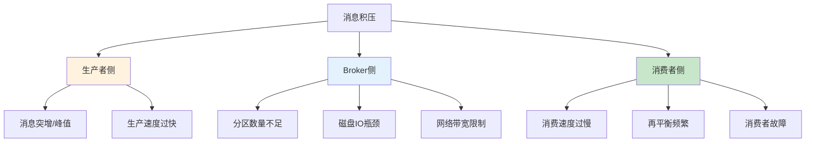

| 积压类型 | 核心原因 | 识别特征 |
|:--------:|----------|----------|
| **生产者侧** | 消息突增、生产速度过快 | `UnderReplicatedPartitions` 增加 |
| **Broker侧** | 分区不足、磁盘IO瓶颈、网络受限 | `LeaderElection` 频繁、磁盘使用率高 |
| **消费者侧** | 消费速度慢、再平衡频繁、故障 | `CurrentOffset` 与 `LogEndOffset` 差距增大 |

**What - 实战排查与解决**

```bash
# 1. 查看消费者组状态（关键诊断）
kafka-consumer-groups.sh --bootstrap-server localhost:9092 --describe --group my-consumer-group
# 重点关注: CURRENT-OFFSET vs LOG-END-OFFSET 的差距

# 2. 查看Topic分区分布
kafka-topics.sh --bootstrap-server localhost:9092 --describe --topic my-topic

# 3. 查看Broker磁盘状态
df -h
iostat -x 1 5

# 4. 查看消费者进程状态
ps aux | grep consumer
jstack <pid> | grep -i consumer
```

**解决策略速查表**

| 问题类型 | 解决方案 | 操作优先级 |
|:--------:|----------|:----------:|
| **消费速度慢** | 增加消费者数量、调整 `fetch.min.bytes`、批量处理 | ⭐⭐⭐ |
| **再平衡频繁** | 增大 `session.timeout.ms`、使用静态成员、避免自动重平衡 | ⭐⭐⭐ |
| **分区不足** | 扩容分区数（需配合消费者扩容） | ⭐⭐ |
| **磁盘IO瓶颈** | 更换SSD、调整 `log.dirs` 到多块磁盘 | ⭐⭐ |
| **网络带宽限制** | 增加网卡带宽、优化压缩策略 | ⭐ |

**记忆口诀**：消速慢增消费数，再平衡调超时，分区少就扩容，磁盘慢换SSD

> **面试加分点**：能说清**消费者再平衡的三种策略（Range/RoundRobin/Sticky）区别**，以及如何通过 `max.poll.records`、`fetch.max.wait.ms` 等参数优化消费性能，证明你有大规模Kafka集群运维经验。

> **延伸阅读**：想了解更多Kafka消息积压生产环境最佳实践？请参考 [Kafka消息积压生产环境最佳实践：从诊断到优化]()。

### 122. Nacos怎么读入数据，怎么获取最新的变化，服务提供者分类？

**Why - 为什么这个问题重要？**

Nacos是Spring Cloud生态中最常用的配置中心和服务发现组件，掌握Nacos的数据读取、配置监听和服务分类是微服务架构的核心技能。**配置热更新**和**服务动态发现**是实现DevOps和持续交付的关键支撑。

**How - Nacos核心机制解析**


**What - 实战操作与代码示例**

```bash
# 1. 查看Nacos配置
curl -X GET "http://localhost:8848/nacos/v1/cs/configs?dataId=example.properties&group=DEFAULT_GROUP"

# 2. 监听配置变化（Java代码）
ConfigService configService = NacosFactory.createConfigService(serverAddr);
configService.addListener(dataId, group, new Listener() {
    @Override
    public void receiveConfigInfo(String configInfo) {
        System.out.println("配置变化: " + configInfo);
    }
    @Override
    public Executor getExecutor() {
        return null;
    }
});

# 3. 服务提供者分类（配置示例）
# application.yml
spring:
  cloud:
    nacos:
      discovery:
        metadata:
          version: v1
          env: prod
          weight: 100
```

**服务提供者分类方式**

| 分类维度 | 实现方式 | 适用场景 |
|:--------:|----------|----------|
| **版本号** | metadata.version | 灰度发布、蓝绿部署 |
| **环境** | metadata.env | dev/test/prod隔离 |
| **权重** | metadata.weight | 流量分配、熔断降级 |
| **地域** | metadata.region | 多地域部署 |

**记忆口诀**：配置读取靠ConfigService，变化监听addListener，服务分类用metadata

> **面试加分点**：能说清**Nacos配置推送的长轮询机制**（默认30秒），以及**服务健康检查的两种模式**（TCP/HTTP），证明你有Nacos生产环境实战经验。

> **延伸阅读**：想了解更多Nacos生产环境最佳实践？请参考 [Nacos生产环境最佳实践：从配置管理到服务发现]()。

### 123. ip_nonlocal_bind内核参数的作用？

**Why - 为什么这个问题重要？**

在负载均衡和高可用架构中，**VIP（虚拟IP）漂移**是常见场景。如果服务进程只能绑定本机IP，则VIP漂移后服务将无法正常接收流量。`ip_nonlocal_bind`参数允许进程绑定非本机IP地址，是实现HAProxy、Nginx等负载均衡器高可用的关键配置。

**How - 核心机制解析**

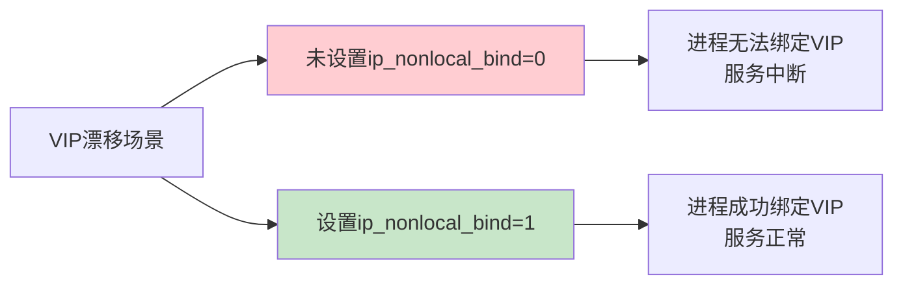

**What - 实战配置与验证**

```bash
# 1. 查看当前值
sysctl net.ipv4.ip_nonlocal_bind

# 2. 临时生效
sysctl -w net.ipv4.ip_nonlocal_bind=1

# 3. 永久生效
echo "net.ipv4.ip_nonlocal_bind = 1" >> /etc/sysctl.conf
sysctl -p

# 4. 验证HAProxy绑定VIP
haproxy -f /etc/haproxy/haproxy.cfg
ss -tlnp | grep :80
```

**典型应用场景**

| 场景 | 配置要求 | 说明 |
|:----:|:--------:|------|
| **HAProxy Keepalived** | 必须开启 | VIP漂移后HAProxy需能接管 |
| **Nginx Upstream** | 推荐开启 | 配合keepalived实现高可用 |
| **四层负载均衡** | 必须开启 | 绑定VIP接收流量 |
| **Docker容器网络** | 必须开启 | 容器绑定宿主机VIP |

**记忆口诀**：VIP漂移要bind，非本机地址靠nonlocal，高可用必备参数

> **面试加分点**：能说清**VIP漂移与ip_nonlocal_bind的关系**，以及如何在Keepalived + HAProxy架构中排查绑定失败问题，证明你有高可用架构实战经验。

> **延伸阅读**：想了解更多高可用架构生产环境最佳实践？请参考 [Linux内核参数生产环境最佳实践：高可用架构必备]()。

### 124. 如何搭建高可用HA环境？

**Why - 为什么这个问题重要？**

高可用HA架构是保障业务**不中断、不宕机、自动容错**的核心，任何一台服务器、一个组件、一个机房挂了，业务都不受影响。这是DevOps/SRE面试的必考题，直接体现工程师的架构实战能力。

**How - 高可用分层架构设计**

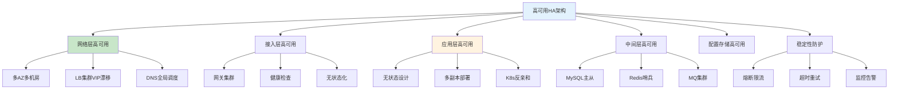

**What - 高可用落地实操**

```bash
# 1. MySQL主从复制+自动故障切换
# my.cnf - 开启binlog
server-id = 1
log-bin = mysql-bin
binlog-format = ROW

# 2. Redis Sentinel哨兵配置
sentinel monitor mymaster 192.168.1.101 6379 2
sentinel down-after-milliseconds mymaster 5000
sentinel failover-timeout mymaster 60000

# 3. K8s多副本+反亲和性
# deployment.yaml
replicas: 3
affinity:
  podAntiAffinity:
    preferredDuringSchedulingIgnoredDuringExecution:
    - weight: 100
      podAffinityTerm:
        topologyKey: kubernetes.io/hostname
        labelSelector:
          matchLabels:
            app: my-service
```

**高可用落地8步标准流程**

| 步骤 | 动作 | 核心要点 |
|:----:|------|---------|
| 1 | 梳理业务链路 | 找出所有单点组件 |
| 2 | 底层网络规划 | 多AZ、多线路、LB集群 |
| 3 | 应用无状态化 | 多副本跨节点跨AZ |
| 4 | 中间件集群化 | MySQL/Redis/MQ高可用 |
| 5 | 接入层集群 | 网关/配置中心集群部署 |
| 6 | 稳定性防护 | 限流熔断降级、超时重试幂等 |
| 7 | 监控与发布 | 全链路监控、灰度发布 |
| 8 | 故障演练 | 混沌工程验证容灾能力 |

**记忆口诀**：分层架构消单点，多AZ部署防故障，中间件集群自动切，监控演练保稳定

**面试标准答法（口述版）**：我从分层架构落地高可用：网络层做多AZ多LB集群+DNS调度；应用侧无状态改造+3副本跨AZ打散，K8s反亲和+HPA弹性；中间件用MySQL主从+Redis哨兵+MQ多副本；配合熔断限流、超时重试幂等，加上全链路监控和定期故障演练，从架构、部署、治理三个维度保障业务高可用。

> **延伸阅读**：想了解更多高可用架构生产环境最佳实践？请参考 [高可用架构生产环境最佳实践：从设计到实现]()。

### 125. 如何设计一个灾备系统？

**Why - 为什么这个问题重要？**

DR（Disaster Recovery 容灾备份/灾难恢复）是保障极端情况下业务连续性的最后一道防线，**生产故障后快速切换到灾备环境，业务不中断、数据不丢**。这是SRE/DevOps面试的高频核心题，直接关系到企业的业务韧性和数据安全。

**How - DR核心概念与架构**

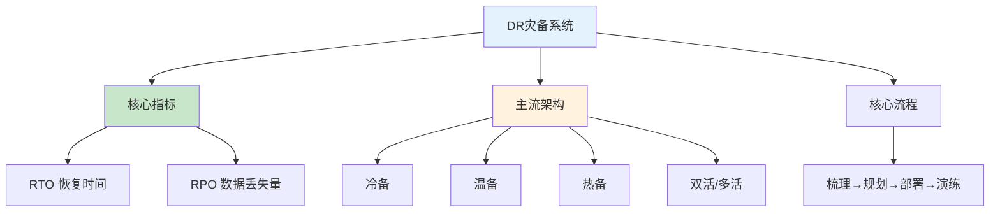

**What - 实操配置与落地步骤**

```bash
# 1. MySQL 数据库DR配置（主从半同步复制）
# my.cnf
[mysqld]
server-id = 1
log-bin = mysql-bin
binlog-format = ROW
relay-log = relay-bin
read-only = 0
replicate-do-db = my_database
plugin-load-add = rpl_semi_sync_master.so
rpl-semi-sync-master-enabled = 1
rpl-semi-sync-slave-enabled = 1
```

**DR环境搭建7步标准流程**

| 步骤 | 核心内容 | 关键动作 |
|:----:|--------|--------|
| 1 | 业务梳理 | 梳理核心链路、定义RTO/RPO |
| 2 | 基础设施DR | 专线/IPsec VPN打通、K8s集群搭建 |
| 3 | 数据层DR | MySQL主从、Redis哨兵、MQ镜像同步 |
| 4 | 应用层DR | IaC代码化、Helm/GitOps部署 |
| 5 | 配置与中间件DR | Nacos同步、注册中心集群 |
| 6 | 监控与告警 | 跨环境统一监控、P0告警触发DR |
| 7 | 预案与演练 | DR切换手册、定期容灾演练 |

**记忆口诀**：梳理规划定指标，数据同步是核心，IaC代码化部署，定期演练保切换。

**面试标准答法（口述版）**：我在公司负责搭建和落地**两地三中心DR灾备环境**，整体流程是：首先梳理核心业务链路和依赖，定义各业务RTO/RPO指标；然后打通生产和灾备机房专线网络，搭建同版本K8s灾备集群；数据层面做MySQL主从半同步复制、Redis哨兵跨机房同步、MQ消息镜像同步，同时把重要文件和配置定时归档到对象存储；应用全部采用Helm+GitOps管理，通过ArgoCD同时发布到生产和DR集群，保证配置版本一致；同时搭建跨环境统一监控告警和全链路日志追踪，编写完整DR切换预案，定期做容灾演练，模拟机房故障进行流量切换和数据库主从切换，验证灾备可用性。

> **延伸阅读**：想了解更多DR灾备系统生产环境最佳实践？请参考 [DR灾备环境完整搭建流程生产环境最佳实践：SRE/DevOps面试版+实操步骤]()。

### 126. 你的日常工作是啥？

**Why - 为什么这个问题重要？**

这是DevOps/SRE面试的**开篇高频题**，面试官通过这个问题快速判断你的真实经验、技术深度和项目落地能力，考察你是否真的"做过"还是只是"听说过"。回答得好，能快速建立信任，引导整个面试走向。

**How - 通用答题结构（必记）**

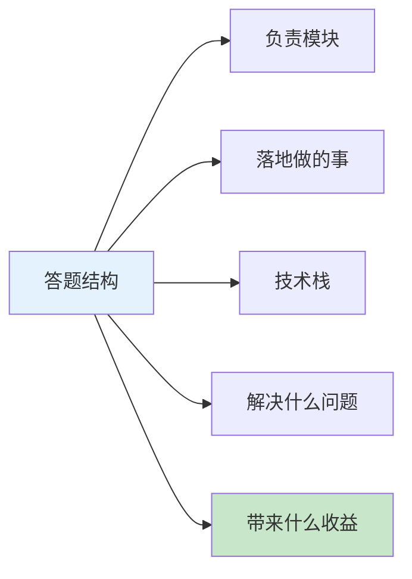

**What - 三套可直接背的回答模板**

**通用答题公式**：负责模块 + 落地做的事 + 技术栈 + 解决什么问题 + 带来什么收益

**三套回答模板对比**

| 级别 | 核心定位 | 重点方向 | 数据体现 |
|:----:|--------|--------|--------|
| 初级DevOps | 研发运维全流程 | CI/CD、容器化 | 部署时间缩短 |
| 中级DevOps | DevOps平台建设 | GitOps、K8s优化 | 资源利用率提升 |
| SRE资深 | 稳定性保障 | SLO、全链路监控 | 故障数下降 |

**记忆口诀**：模块+事情+技术栈，问题+收益是关键，按级别选模板，张口就能说。

**面试标准答法（中级DevOps示例）**：我主要负责公司DevOps平台建设、云原生架构落地、研发效能提升：基于GitLab+ArgoCD+Helm搭建GitOps持续交付体系，实现配置声明式管理、环境一键发布、灰度/滚动发布策略；负责多套K8s生产/测试集群规划、版本升级、节点管理，优化资源调度、HPA自动扩缩容，集群资源利用率提升30%；统一管理Redis、MQ、MySQL中间件部署备份；用Shell/Python写自动化脚本，实现服务器初始化、日志清理、批量部署自动化；制定上线变更流程、故障应急流程，引入变更评审、灰度发布，降低上线故障率。

> **延伸阅读**：想了解更多DevOps/SRE日常工作生产环境最佳实践？请参考 [DevOps/SRE日常工作生产环境最佳实践：三套面试回答模板+工程化落地指南]()。

### 127. AWS的服务你都用过哪些？

**Why - 为什么这个问题重要？**

AWS是云原生架构的主流选择，面试官通过这个问题判断你是否有**云上实战经验**，能否将本地技术栈平滑迁移到云端，以及对云原生技术的掌握深度。

**How - AWS服务分类速查图**

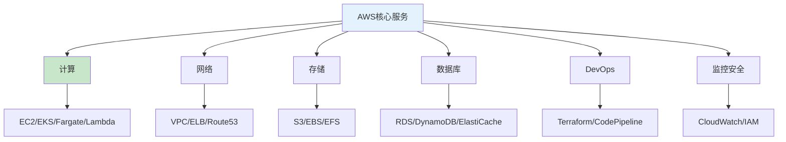

**What - 服务速记表**

| 类别 | 服务 | 核心用途 |
|:----:|------|---------|
| **计算** | EC2 | 虚拟机部署应用 |
| **计算** | EKS | K8s生产集群 |
| **计算** | Lambda | 无服务器计算 |
| **网络** | VPC | 私有网络规划 |
| **网络** | ELB | 负载均衡 |
| **网络** | Route53 | DNS+GSLB |
| **存储** | S3 | 对象存储+备份 |
| **数据库** | RDS | 托管MySQL/PG |
| **数据库** | ElastiCache | Redis缓存 |
| **DevOps** | Terraform | IaC基础设施 |
| **监控** | CloudWatch | 监控告警 |

**记忆口诀**：计算EC2/EKS，网络VPC/ELB/53，存储S3三剑客，数据库RDS缓存DevOps用Terraform，监控CloudWatch加IAM。

**面试标准答法（1分钟版）**：我用AWS构建高可用云原生架构，核心用过：计算层EC2/EKS/Fargate/Lambda覆盖虚拟机、K8s容器、无服务器场景；网络层VPC/ELB/Route53做多AZ高可用、全局流量调度；存储层S3/EBS/EFS满足对象、块、文件存储；数据库层RDS/DynamoDB/ElastiCache/MSK托管关系型、NoSQL、缓存与消息队列；DevOps用Terraform做IaC，CodePipeline搭建CI/CD流水线，配合SSM管理配置与密钥；监控安全用CloudWatch/X-Ray/CloudTrail/IAM/KMS实现全链路可观测、权限最小化与数据加密。

> **延伸阅读**：想了解更多AWS云服务生产环境最佳实践？请参考 [AWS云服务生产环境最佳实践：DevOps/SRE云原生架构指南]()。

### 128. AWS和IBM Cloud的区别在哪？

**Why - 为什么这个问题重要？**

这道题考察你对**多云环境的理解**和**厂商选型判断力**。面试官想看你是否理解不同云厂商的定位差异，能否根据业务场景做出合理的技术选型。

**How - 核心区别速查**

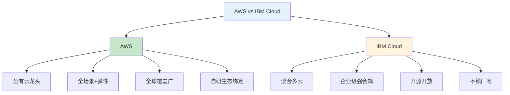

**What - 核心维度对比**

| 维度 | AWS | IBM Cloud |
|:----:|-----|----------|
| **定位** | 公有云绝对龙头 | 混合多云+企业级强合规 |
| **基础设施** | 38区域/120可用区 | 6区域/18可用区+60数据中心 |
| **容器K8s** | EKS托管K8s | OpenShift企业级K8s |
| **合规安全** | 责任共担模型 | 硬件级安全+KYOK密钥 |
| **生态** | 全栈自研绑定深 | 开源优先多云兼容 |
| **AI/ML** | SageMaker/Bedrock | Watson行业AI |
| **适用场景** | 互联网/全球化 | 金融/政府/传统企业 |

**记忆口诀**：AWS全场景弹性广，IBM混合合规开源强，互联网选AWS，强监管选IBM。

**面试标准答法（1分钟版）**：AWS是公有云老大，服务最全、全球节点最多、生态成熟，适合互联网、全球化、快速迭代业务；IBM Cloud是混合多云+企业级强合规，背靠Red Hat OpenShift，擅长统一管理本地、私有云和公有云，开源开放、不锁厂商，特别适合金融、政府等强监管行业。DevOps上，AWS工具链自研深度绑定，IBM更开放多云兼容好。

> **延伸阅读**：想了解更多AWS与IBM Cloud对比的生产环境最佳实践？请参考 [AWS与IBM Cloud多云架构对比生产环境最佳实践：选型指南]()。

### 129. RAID有哪些级别用法是啥？

**Why - 为什么这个问题重要？**

RAID是存储系统的基石，考察你对**存储可靠性、性能和成本**的平衡能力。面试官想知道你是否理解不同RAID级别的适用场景，能否根据业务需求选择合适的存储方案。

**How - RAID级别速查**

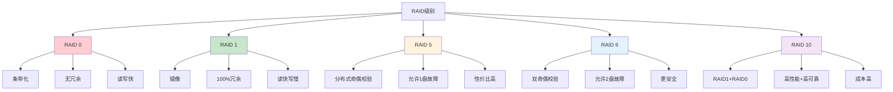

**What - RAID级别对比表**

| RAID级别 | 最小磁盘数 | 冗余能力 | 读写性能 | 空间利用率 | 适用场景 |
|:--------:|:---------:|:--------:|:--------:|:----------:|----------|
| **RAID 0** | 2 | 无 | 最高 | 100% | 临时数据、缓存 |
| **RAID 1** | 2 | 1盘故障 | 读快写慢 | 50% | 系统盘、关键数据 |
| **RAID 5** | 3 | 1盘故障 | 读快写一般 | (n-1)/n | 通用存储、数据库 |
| **RAID 6** | 4 | 2盘故障 | 读快写慢 | (n-2)/n | 大容量存储、归档 |
| **RAID 10** | 4 | 多盘故障 | 读写都快 | 50% | 高性能数据库、关键业务 |

**记忆口诀**：0条带无冗余速度快，1镜像全冗余读快，5校验性价比高，6双校验更安全，10组合高性能。

**面试标准答法（1分钟版）**：常见RAID级别有0、1、5、6、10。RAID 0是条带化，无冗余但速度最快；RAID 1是镜像，100%冗余，读快写慢；RAID 5用分布式奇偶校验，允许1盘故障，性价比高；RAID 6双奇偶校验，允许2盘故障更安全；RAID 10是1+0组合，高性能高可靠但成本高。选择时，临时数据用RAID 0，系统盘用RAID 1，通用存储用RAID 5，重要数据用RAID 6，关键业务用RAID 10。

> **延伸阅读**：想了解更多RAID生产环境最佳实践？请参考 [RAID存储技术详解：生产环境选型与部署指南]()。

### 130. ELK怎么收集日志，流程是啥？

**Why - 为什么这个问题重要？**

ELK是日志收集分析的主流方案，考察你对**日志收集、存储、检索、可视化**全流程的理解。面试官想知道你是否能独立设计和部署日志系统，处理大规模日志场景。

**How - ELK日志收集流程**


**What - ELK核心组件**

| 组件 | 功能 | 作用 |
|:----:|------|------|
| **Filebeat** | 轻量日志采集器 | 部署在目标主机，实时采集日志 |
| **Logstash** | 日志处理管道 | 过滤、转换、丰富日志数据 |
| **Elasticsearch** | 分布式搜索存储 | 存储和索引日志，支持快速检索 |
| **Kibana** | 可视化平台 | 日志查询、仪表盘、告警 |
| **Kafka** | 消息队列（可选） | 解耦采集与处理，削峰填谷 |

**记忆口诀**：Filebeat采、Logstash转、ES存、Kibana看，Kafka中间解耦担。

**面试标准答法（1分钟版）**：ELK日志收集流程是Filebeat采集、Logstash处理、Elasticsearch存储、Kibana展示。Filebeat部署在各主机上轻量采集日志，通过TCP或Kafka发送给Logstash；Logstash做过滤、解析、字段提取；然后写入Elasticsearch建立索引；最后通过Kibana进行查询分析和可视化。大型场景会用Kafka做缓冲，实现采集与处理解耦，提高系统稳定性。

> **延伸阅读**：想了解更多ELK日志系统生产环境最佳实践？请参考 [ELK日志系统生产环境最佳实践：从采集到可视化全流程指南]()。

### 131. ES你做了哪些优化？

**Why - 为什么这个问题重要？**

ES优化直接影响系统性能、稳定性和成本。面试官通过这个问题考察你对**ES底层原理**和**生产环境调优**的实战经验，判断你能否解决实际性能问题。

**How - ES优化维度速查**

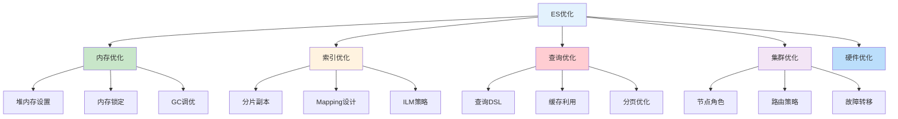

**What - ES优化要点**

| 优化维度 | 关键要点 | 配置建议 |
|:--------:|----------|----------|
| **堆内存** | 物理内存50%，不超30G | `-Xms=Xmx=16g` |
| **内存锁定** | 防止swap | `bootstrap.memory_lock: true` |
| **分片数** | 每片10-50GB | 主分片数=节点数倍数 |
| **副本数** | 生产至少1个 | `number_of_replicas: 2` |
| **Mapping** | 避免text字段过多 | 使用keyword替代 |
| **刷新间隔** | 写入密集时调大 | `refresh_interval: 30s` |
| **GC调优** | CMS转G1GC | `-XX:+UseG1GC` |

**记忆口诀**：堆内存半分不超30G，内存锁定防swap，分片合理副本够，Mapping精简刷新调。

**面试标准答法（1分钟版）**：ES优化主要从这几个方面：内存方面，堆内存设为物理内存一半且不超过30G，开启内存锁定防止swap；索引方面，合理设置分片数（每片10-50GB）、副本数（生产至少1个），优化Mapping避免不必要的text字段，调大刷新间隔减少IO；查询方面，利用filter缓存、避免深分页、使用复合查询；集群方面，按角色分离节点、合理路由分片。这些优化能显著提升ES性能和稳定性。

> **延伸阅读**：想了解更多ES生产环境优化最佳实践？请参考 [Elasticsearch生产环境优化指南：从内存到集群全方位调优]()。

### 132. ES 3种颜色啥意思？

**Why - 为什么这个问题重要？**

ES集群健康状态是监控的核心指标，面试官考察你对**集群状态的理解**和**问题排查能力**，能否快速定位和处理集群异常。

**How - 集群健康状态图**

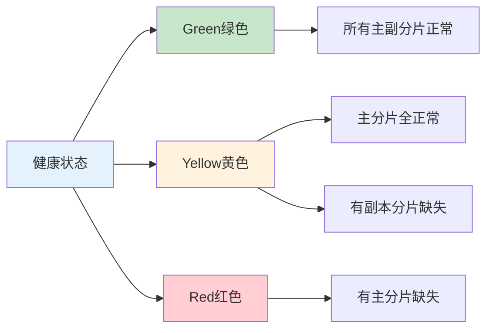

**What - 3种颜色详解**

| 颜色 | 状态 | 主分片 | 副本分片 | 数据完整度 | 可读写 |
|:----:|:------:|:------:|:--------:|:----------:|:------:|
| **Green绿色** | 正常 | 全部分配 | 全部分配 | 100% | 是 |
| **Yellow黄色** | 警告 | 全部分配 | 部分缺失 | 100% | 是 |
| **Red红色** | 异常 | 部分缺失 | 无关 | <100% | 部分索引不可用 |

**记忆口诀**：绿主副全正常，黄主全副本缺，红主缺数据丢。

**面试标准答法（1分钟版）**：ES集群健康有三种颜色：绿色表示所有主分片和副本分片都正常分配，数据100%完整，完全可读写；黄色表示所有主分片都正常分配，但有部分副本分片缺失，数据还是完整的，可读写但容错性下降；红色表示有主分片缺失，数据不完整，部分索引不可读写。生产环境要保证绿色，黄色需要检查副本分配，红色要紧急处理。

> **延伸阅读**：想了解更多ES集群健康状态最佳实践？请参考 [Elasticsearch集群健康管理与故障排查指南]()。

### 133. 你公司的ES节点怎么分工的？

**Why - 为什么这个问题重要？**

ES节点角色分工直接影响集群性能和稳定性。面试官考察你对**集群架构设计**和**资源规划**的理解，能否根据业务需求合理配置节点。

**How - ES节点角色分工**

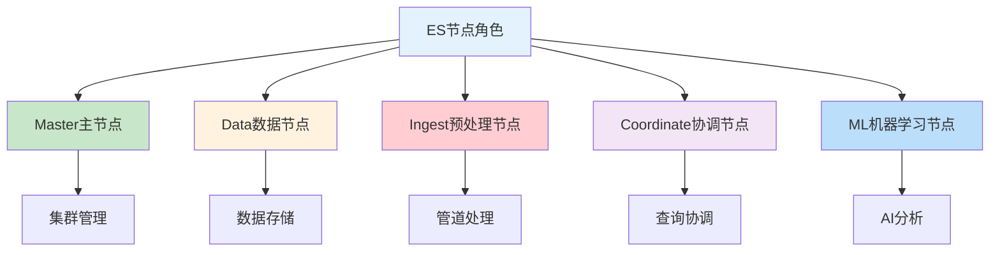

**What - 节点角色与配置**

| 节点角色 | 核心职责 | CPU | 内存 | 存储 | 数量建议 |
|:--------:|----------|:---:|:----:|:----:|:--------:|
| **Master** | 集群状态管理、索引创建、节点加入 | 4-8核 | 8-16GB | 小 | 3（奇数） |
| **Data** | 数据存储、索引、搜索 | 8-16核 | 32-64GB | SSD大容量 | 根据数据量 |
| **Ingest** | 数据预处理管道 | 4-8核 | 16-32GB | 小 | 按需 |
| **Coordinate** | 查询协调、结果聚合 | 8-16核 | 16-32GB | 无 | 2-3 |
| **ML** | 机器学习任务 | 8-16核 | 32-64GB | 中 | 按需 |

**记忆口诀**：Master管集群，Data存数据，Ingest做预处理，Coordinate协调查询，ML做分析。

**面试标准答法（1分钟版）**：ES节点分5种角色：Master节点负责集群状态管理、索引创建删除，配置4-8核CPU、8-16GB内存，生产环境需要3个组成奇数避免脑裂；Data节点负责数据存储和查询，是性能核心，配置8-16核CPU、32-64GB内存、SSD大容量存储；Ingest节点做数据预处理管道，配置中等；Coordinate节点专门处理查询请求协调，减轻Data节点压力；ML节点跑机器学习任务。生产环境建议Master和Data分离，保证集群稳定性。

> **延伸阅读**：想了解更多ES节点角色分工最佳实践？请参考 [Elasticsearch节点角色分工与资源配置指南]()。