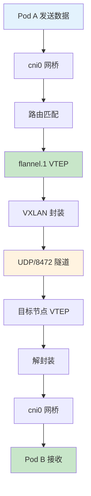
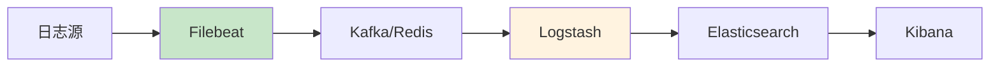
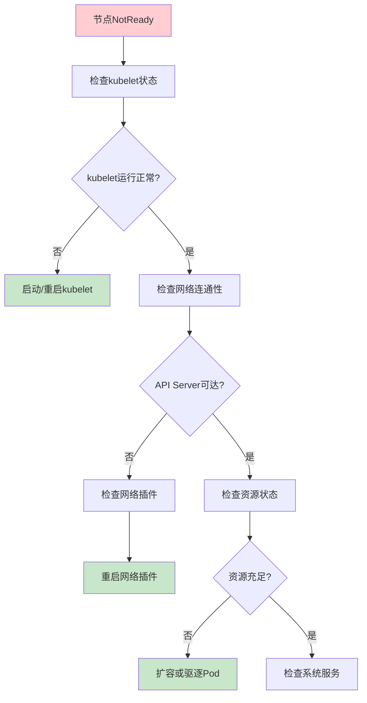
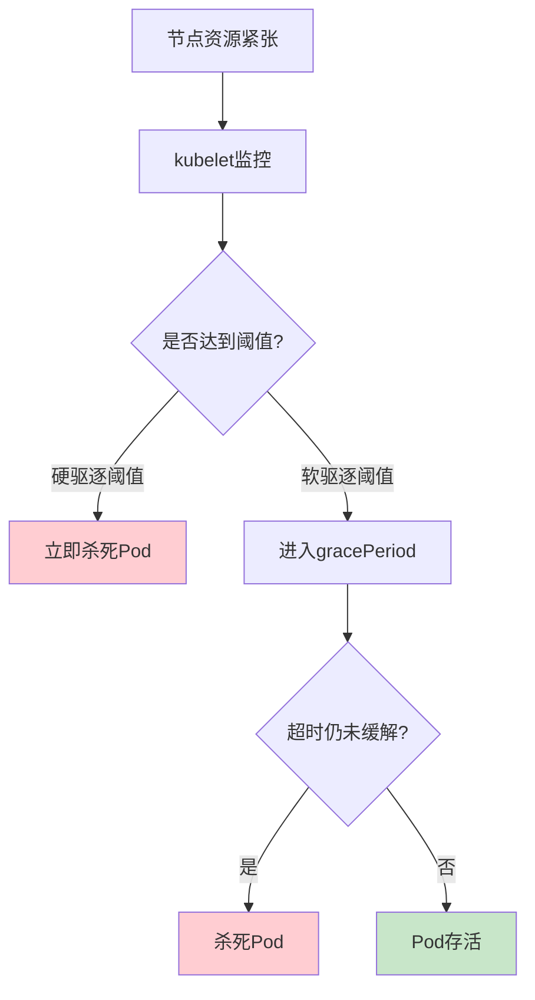
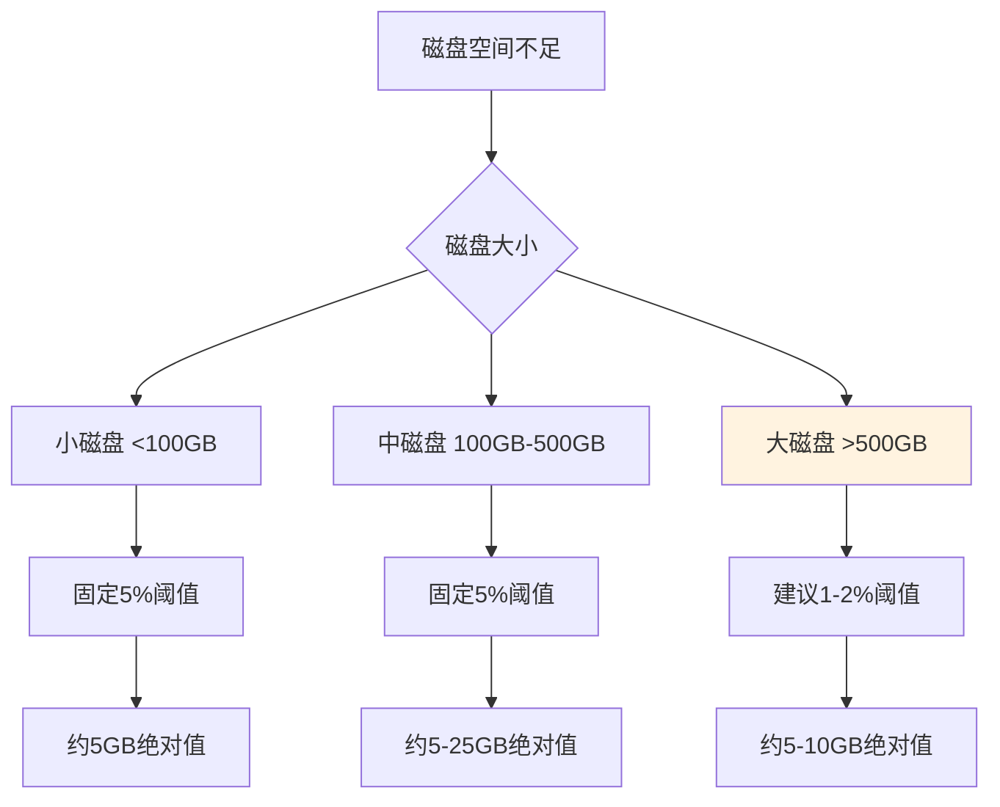
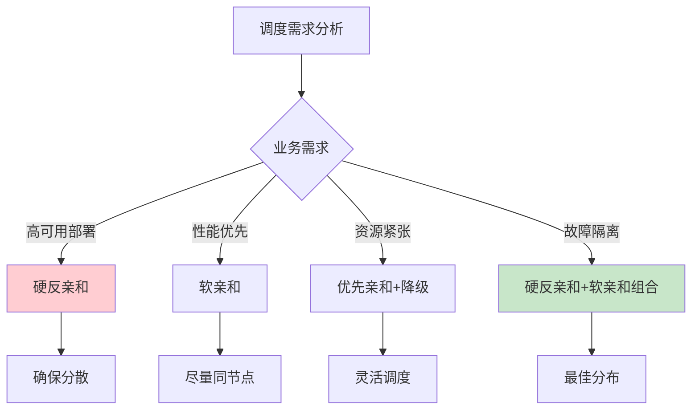
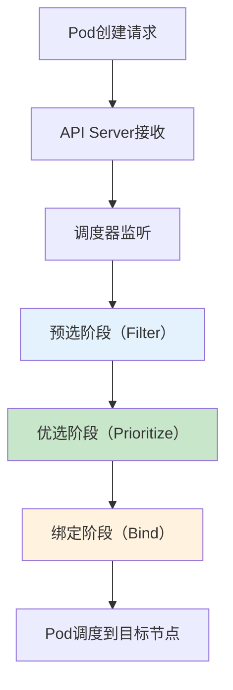
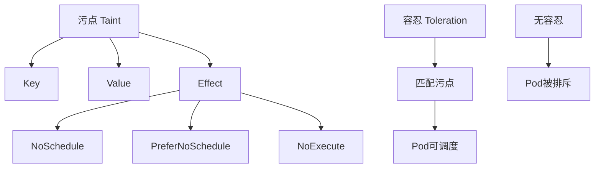
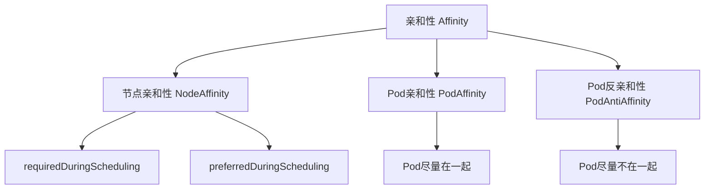
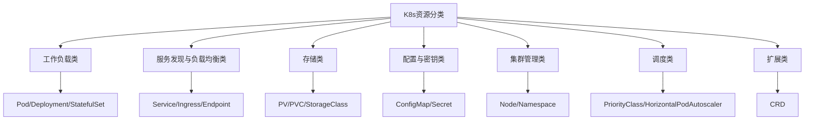

# SRE运维面试题全解析：从理论到实践（第三部分）

## 情境与背景

作为一名SRE工程师，面试是职业发展的重要环节。面试官通常会从系统知识、工具使用、问题解决能力等多个维度考察候选人。本文基于真实面试场景，整理了高频面试题，并提供结构化的解析，帮助你快速掌握核心知识点，从容应对面试挑战。

## 核心面试题解析

### 216. k8s网络flannel的通信过程是啥？vxlan的通信过程？

**Why - 为什么这个问题重要？**

Flannel是Kubernetes最常用的CNI插件之一，负责为Pod提供跨节点的网络通信能力。理解Flannel的通信过程和VXLAN技术原理，是设计和维护K8s网络架构的基础，也是高级DevOps/SRE工程师必备的核心知识。**VXLAN是目前生产环境最常用的Flannel后端，其通过UDP封装实现三层网络上的二层扩展。**

**How - Flannel与VXLAN通信流程**



**What - 通信过程详解**

| 阶段 | 源节点操作 | 目标节点操作 |
|:----:|-----------|-------------|
| **1. 子网分配** | flanneld向Etcd申请PodCIDR，假设为10.244.0.0/24 | 目标节点获得10.244.1.0/24 |
| **2. Pod发送** | Pod A(10.244.0.10)发送数据到Pod B(10.244.1.20) | - |
| **3. 网桥接收** | 数据包通过veth Pair进入cni0网桥 | - |
| **4. 路由匹配** | 内核路由表匹配到flannel.1接口 | - |
| **5. VTEP封装** | 源VTEP(flannel.1)封装原始帧为VXLAN数据包 | - |
| **6. 隧道传输** | 通过UDP 8472端口发送到目标VTEP IP | - |
| **7. VTEP接收** | - | 目标VTEP接收VXLAN数据包 |
| **8. 解封装** | - | 移除VXLAN头部，还原原始帧 |
| **9. 网桥转发** | - | 数据包通过cni0转发到Pod B |
| **10. Pod接收** | - | Pod B接收完整数据包 |

**VXLAN封装结构**

| 层次 | 封装内容 | 说明 |
|:----:|---------|------|
| **原始数据** | L2 Frame (Ethernet + IP + TCP) | 原始Pod数据包 |
| **VXLAN头** | VNI(24bit) + Flags + VNITag | 虚拟网络标识 |
| **UDP头** | 源端口随机 + 目的端口8472 | VXLAN封装协议 |
| **IP头** | 源VTEP IP + 目标VTEP IP | 隧道端点IP |
| **物理网络** | Ethernet Frame | 底层物理网络封装 |

**记忆口诀**：Pod发包走cni0，路由匹配flannel.1，VTEP封装VXLAN，UDP8472穿隧道，目标解封装，cni0送到Pod。

**面试标准答法（1分钟版）**：Flannel的通信过程：Pod发送数据包时，通过veth Pair到cni0网桥，内核根据路由表将数据包交给flannel.1接口（VTEP设备）；VTEP根据目标IP查找ARP表获取目标VTEP MAC地址，然后将原始L2帧封装为VXLAN数据包；VXLAN通过UDP 8472端口在物理网络上建立隧道传输；目标节点VTEP收到后解封装，将原始帧交给cni0网桥，网桥通过veth Pair转发到目标Pod。VXLAN本质上是在三层网络上构建二层overlay网络，通过24bit VNI实现1600万虚拟网络隔离。

> **延伸阅读**：想了解更多Flannel与VXLAN生产环境最佳实践？请参考 [K8S网络Flannel与VXLAN详解：从原理到生产环境实践]()。

### 217. logstash和filebeat之间有啥区别？

**Why - 为什么这个问题重要？**

在ELK日志系统中，Filebeat和Logstash是最常用的两个组件。理解它们的定位、功能差异和使用场景，是构建高效日志收集架构的基础。**Filebeat负责轻量级采集，Logstash负责复杂处理，两者是互补关系而非替代关系。**

**How - 组件定位与架构**



**What - 核心区别对比**

| 维度 | Filebeat | Logstash |
|:----:|----------|----------|
| **定位** | 轻量级日志采集器 | 重量级日志处理管道 |
| **资源消耗** | 低（Go语言，单进程~40MB） | 高（JVM，1GB+内存） |
| **功能** | 采集、初步过滤、多行合并 | 采集、解析、转换、丰富、输出 |
| **性能** | 高（单实例可处理MB/s日志） | 中等（需要更多资源） |
| **插件生态** | Input/Module有限 | Input/Filter/Output丰富 |
| **部署位置** | 靠近日志源（每台主机） | 集中部署（独立服务器） |
| **配置复杂度** | 简单 | 复杂 |
| **可靠性** | At-least-once | At-least-once |
| **适用场景** | 大规模日志采集 | 复杂日志处理 |

**Filebeat优势场景**

| 场景 | 推荐原因 |
|------|----------|
| **大规模采集** | 轻量低资源占用，每台主机部署 |
| **简单日志转发** | 仅需基本过滤和多行合并 |
| **K8s环境** | 有官方K8s Module自动发现Pod日志 |
| **资源敏感环境** | 嵌入式应用日志收集 |

**Logstash优势场景**

| 场景 | 推荐原因 |
|------|----------|
| **复杂解析** | JSON/XML/CSV等多格式解析 |
| **数据富化** | 结合GeoIP、数据库丰富日志 |
| **多输出** | 同时写入ES、HDFS、Kafka等 |
| **高级转换** | 正则替换、条件分支、聚合统计 |

**记忆口诀**：采集用Filebeat，处理用Logstash，量大轻量选Filebeat，复杂解析用Logstash。

**面试标准答法（1分钟版）**：Filebeat和Logstash是ELK栈的两个核心组件，定位不同：Filebeat是轻量级日志采集器，用Go编写，资源消耗低（单进程约40MB），负责从日志源采集数据、做初步过滤和多行合并，适合大规模部署在每台主机上；Logstash是重量级日志处理管道，用JVM运行，功能强大，支持丰富的Input/Filter/Output插件，能做复杂的数据解析、转换和富化，适合集中部署做复杂处理。生产环境的最佳实践是：Filebeat部署在日志源采集日志，通过Kafka解耦后，Logstash做集中处理和解析，最后写入Elasticsearch。

> **延伸阅读**：想了解更多Filebeat与Logstash生产环境最佳实践？请参考 [Filebeat与Logstash对比分析：ELK日志收集架构最佳实践]()。

### 218. 有一个节点notready，原因是啥？

**Why - 为什么这个问题重要？**

K8s节点NotReady是生产环境最常见的故障之一，直接影响Pod调度和业务可用性。**节点NotReady意味着kubelet无法向API Server报告节点状态，导致该节点上的Pod无法被调度或面临被驱逐的风险。**快速定位NotReady原因是SRE的核心技能。

**How - 排查思路与流程**



**What - 常见原因与解决方案**

| 原因分类 | 具体原因 | 排查命令 | 解决方案 |
|---------|---------|----------|----------|
| **kubelet停止** | kubelet进程异常退出 | `systemctl status kubelet` | 重启kubelet |
| **网络不通** | 节点到API Server网络中断 | `ping <api-server-ip>` | 检查网络/防火墙 |
| **网络插件异常** | Flannel/Calico等CNI故障 | `systemctl status flanneld` | 重启网络插件 |
| **资源不足** | 内存/磁盘/文件描述符耗尽 | `df -h` / `free -m` | 扩容或驱逐Pod |
| **证书过期** | kubelet证书过期 | `openssl x509 -in /var/lib/kubelet/pki/cert.crt -dates` | 更新证书 |
| **swap启用** | K8s要求关闭swap | `swapon -s` | 关闭swap |
| **内核问题** | 内核参数异常 | `dmesg | tail` | 重启节点 |
| **时间不同步** | NTP时间偏差过大 | `timedatectl status` | 同步NTP |

**排查步骤详解**

| 步骤 | 操作 | 命令 |
|:----:|------|------|
| **1. 查看节点状态** | 确认NotReady状态 | `kubectl get nodes` |
| **2. 查看节点详情** | 查看NotReady原因 | `kubectl describe node <node-name>` |
| **3. 检查kubelet日志** | 定位具体错误 | `journalctl -u kubelet -n 100` |
| **4. 检查网络插件** | 确认CNI状态 | `kubectl get pods -n kube-system` |
| **5. 检查资源使用** | 磁盘/内存/文件描述符 | `df -h && free -m && lsof | wc -l` |

**记忆口诀**：节点NotReady先查kubelet，网络插件要确认，资源不足看磁盘，内核问题查dmesg，证书时间也要问。

**面试标准答法（1分钟版）**：节点NotReady的排查思路：先kubectl describe node看Events信息，同时检查kubelet进程状态和日志；常见原因包括：kubelet停止（systemctl restart kubelet）、网络插件异常（重启flanneld或calico-node）、节点资源耗尽（磁盘满或内存不足）、证书过期、swap未关闭等。生产环境应配置监控告警，在节点NotReady时及时发现，同时准备节点自动恢复脚本。

> **延伸阅读**：想了解更多K8s节点NotReady故障排查？请参考 [K8s节点NotReady故障排查与恢复：生产环境最佳实践]()。

### 219. k8s中资源不足了，硬驱逐的资源条件是什么？

**Why - 为什么这个问题重要？**

K8s Pod驱逐是保障节点稳定性的最后一道防线，理解硬驱逐（Hard Eviction）和软驱逐（Soft Eviction）的阈值条件，是生产环境避免意外Pod丢失的关键。**硬驱逐阈值触发后会立即杀死Pod，不给宽限期；软驱逐有gracePeriod可以优雅处理。**

**How - 驱逐机制架构**



**What - 驱逐阈值详解**

| 驱逐信号 | 软驱逐默认值 | 硬驱逐默认值 | 说明 |
|---------|-------------|-------------|------|
| **memory.available** | 500Mi | 256Mi | 节点可用内存 |
| **nodefs.available** | 10% | 5% | nodefs文件系统可用空间 |
| **nodefs.inodesfree** | 5% | 4% | inode可用数量 |
| **imagefs.available** | 15% | 10% | imagefs文件系统可用空间 |
| **imagefs.inodesfree** | 5% | 4% | imagefs inode可用数量 |
| **pid.available** | 4% | 4% | 可用进程ID数量 |

**imagefs与nodefs区分**

| 文件系统 | 触发条件 | kubelet标志 | 用途 |
|---------|---------|-------------|------|
| **nodefs** | `nodefs.available` | `--root-dir` | kubelet工作目录、Pod日志等 |
| **imagefs** | `imagefs.available` | `--storage-driver-root` | 容器镜像存储 |

**生产环境推荐配置**

| 配置项 | 推荐值 | 说明 |
|:------:|:------:|------|
| **硬驱逐内存阈值** | 100Mi-200Mi | 预留足够缓冲 |
| **硬驱逐磁盘阈值** | 5% | 避免磁盘耗尽 |
| **软驱逐内存阈值** | 500Mi-1Gi | 给Pod迁移时间 |
| **gracePeriod** | 30-60秒 | 优雅终止时间 |

**记忆口诀**：硬驱逐立即杀，软驱逐有宽限，memory.available256Mi，nodefs5%inode4%，imagefs10%inode5%。

**面试标准答法（1分钟版）**：K8s硬驱逐的资源条件由kubelet的--eviction-hard参数控制，常见信号包括memory.available（硬驱逐256Mi，软驱逐500Mi）、nodefs.available（硬驱逐5%，软驱逐10%）、imagefs.available（硬驱逐10%，软驱逐15%）以及inode相关信号。硬驱逐触发后立即杀死Pod，软驱逐有gracePeriod（如30秒）作为宽限期。生产环境推荐配置合理的硬驱逐阈值预留缓冲，同时开启软驱逐让Pod有优雅迁移的时间。

> **延伸阅读**：想了解更多K8s Pod驱逐机制？请参考 [K8s Pod硬驱逐与软驱逐详解：资源阈值配置与生产环境最佳实践]()。

### 220. 驱逐阈值应该如何根据磁盘大小动态调整？

**Why - 为什么这个问题重要？**

K8s默认的驱逐阈值是固定百分比，但固定百分比对不同规格节点并不公平。**10TB磁盘剩10%是1TB，100TB磁盘剩10%是10TB——阈值应该基于绝对值和相对值的平衡。**理解如何根据磁盘大小动态调整阈值，是生产环境精细化资源管理的关键。

**How - 阈值计算方式对比**



**What - 动态阈值策略**

| 磁盘规格 | 默认5%阈值 | 推荐阈值 | 推荐绝对值 | 说明 |
|:--------:|:----------:|:--------:|:----------:|------|
| **<100GB** | 5GB | 5% | 5GB | 小磁盘用固定百分比即可 |
| **100-500GB** | 5-25GB | 3-5% | 5-10GB | 中等磁盘考虑绝对值兜底 |
| **500GB-1TB** | 25-50GB | 2-3% | 10-20GB | 大磁盘降低百分比 |
| **>1TB** | >50GB | 1-2% | 10-20GB | 超大磁盘用绝对值控制 |

**绝对值+百分比混合配置**

```yaml
# kubelet配置 - 混合策略
evictionHard:
  memory.available: "200Mi"
  nodefs.available: "1Gi,5%"      # 绝对值和百分比同时满足才触发
  imagefs.available: "2Gi,10%"

evictionMinimumReclaim:
  nodefs.available: "500Mi"
  imagefs.available: "1Gi"
```

**生产环境推荐配置**

| 节点规格 | 磁盘类型 | 推荐nodefs阈值 | 说明 |
|:--------:|---------|---------------|------|
| **高密度小节点** | 100GB SSD | 5% + 5Gi | 预留足够空间 |
| **标准节点** | 500GB SSD | 3% + 10Gi | 平衡值 |
| **存储优化节点** | 2TB HDD | 1% + 20Gi | 超大磁盘用绝对值 |
| **日志节点** | 4TB | 1% + 30Gi | 日志写入量大 |

**记忆口诀**：阈值不能一刀切，小盘5%大盘1%，绝对值来兜底，百分比加Gi配合用。

**面试标准答法（1分钟版）**：固定5%阈值对不同磁盘大小不友好：100GB磁盘剩5%是5GB，2TB磁盘剩5%是100GB。大磁盘应该降低百分比或提高绝对值保障。K8s支持混合写法如`nodefs.available: "1Gi,5%"`表示绝对值和百分比同时满足才触发。生产环境推荐根据节点规格差异化配置：高密度小节点用标准5%，存储优化大节点用1-2%加绝对值兜底，同时配置evictionMinimumReclaim保证驱逐后能回收足够空间。

> **延伸阅读**：想了解更多K8s驱逐阈值动态配置？请参考 [K8s驱逐阈值动态调整策略：基于磁盘大小的精细化资源管理]()。

### 221. k8s可以把pod的软亲和改成硬亲和更安全吗？

**Why - 为什么这个问题重要？**

Pod亲和性（Affinity）与反亲和性（Anti-Affinity）是K8s高级调度能力的核心特性。**软亲和（preferred）追求调度灵活性，硬亲和（required）追求调度约束性，两者并无绝对优劣，关键在于业务场景。**理解何时用软、何时用硬，是生产环境高可用架构设计的关键。

**How - 亲和性调度决策流程**



**What - 软硬亲和对比与应用场景**

| 特性 | 软亲和（Preferred） | 硬亲和（Required） |
|:----:|-------------------|-------------------|
| **调度行为** | 尽量满足，不强求 | 必须满足，否则调度失败 |
| **TopologyKey** | 任意 | 通常是zone或node |
| **权重（weight）** | 1-100 | 无 |
| **Pod调度** | 可能分散 | 必须符合约束 |
| **资源利用率** | 高 | 可能较低 |
| **适用场景** | 性能敏感型应用 | 高可用敏感型应用 |

**亲和性组合场景**

| 场景 | 配置策略 | 说明 |
|------|---------|------|
| **Web前端多副本** | 硬反亲和+软亲和 | 硬反亲和确保不同节点，软亲和让同AZ优先 |
| **数据库主从** | 硬反亲和 | 主从必须分离，保障高可用 |
| **缓存服务** | 软亲和 | 优先同节点，减少网络延迟 |
| **无状态微服务** | 软亲和+反亲和 | 分散但不完全隔离 |
| **ETCD集群** | 硬反亲和+AZ分散 | 必须不同节点+不同可用区 |

**面试标准答法（1分钟版）**：软亲和和硬亲和没有绝对的优劣之分。硬亲和（required）必须满足约束条件，否则Pod调度失败，适合高可用场景如数据库主从分离；软亲和（preferred）是尽量满足，允许调度器在无法满足时灵活处理，适合性能敏感场景如同AZ通信优化。生产环境最佳实践是组合使用：硬反亲和保证Pod分散到不同节点，软亲和优化同可用区或同AZ部署。同时注意硬亲和可能导致调度失败，需要配合集群容量规划和监控告警。

> **延伸阅读**：想了解更多K8s Pod亲和性调度？请参考 [K8s Pod亲和性与反亲和性详解：高可用架构设计最佳实践]()。

### 222. k8s中的节点调度策略有哪些？

**Why - 为什么这个问题重要？**

Pod调度是Kubernetes核心能力之一，理解调度策略的分层设计是构建高效、高可用集群的基础。**K8s调度分预选、优选、抢占三阶段，同时提供丰富的自定义调度机制。**掌握这些策略是高级DevOps/SRE工程师的核心技能。

**How - 调度器工作流程**



**What - 主要调度策略**

| 策略分类 | 具体策略 | 说明 |
|:-------:|---------|------|
| **预选阶段** | NodeName | 直接指定节点名，跳过调度器 |
| | NodeSelector | 根据标签选择节点 |
| | NodeAffinity | 节点亲和性（required/preferred） |
| | PodAffinity/AntiAffinity | Pod间亲和性/反亲和性 |
| | Taints & Tolerations | 污点与容忍 |
| **优选阶段** | LeastRequestedPriority | 节点使用率最低优先 |
| | MostRequestedPriority | 节点使用率最高优先 |
| | BalancedResourceAllocation | 资源均衡分配 |
| | SelectorSpreadPriority | Pod均匀分布到不同节点 |
| **高级调度** | Priority & Preemption | 高优先级Pod可抢占低优先级Pod |
| | 自定义调度器 | 扩展调度器功能 |

**生产环境最佳实践**

| 应用场景 | 推荐策略 | 说明 |
|:--------:|---------|------|
| **静态Pod** | NodeName | 直接绑定到特定节点 |
| **有状态服务** | NodeAffinity+Taints | 标签筛选+污点隔离 |
| **Web前端多副本** | PodAntiAffinity+SelectorSpread | 分散部署，高可用 |
| **数据库主从** | PodAntiAffinity | 必须分离到不同节点 |
| **高优先级业务** | PriorityClass | 配置抢占能力 |

**记忆口诀**：预选过滤不能错，优选打分来排序，NodeName直接指定，NodeSelector选标签，亲和反亲和灵活用，污点容忍需配合。

**面试标准答法（1分钟版）**：K8s节点调度分三个阶段：预选阶段（Filter）根据约束条件筛选可用节点；优选阶段（Prioritize）对候选节点打分；绑定阶段（Bind）选择得分最高的节点。主要调度策略包括：NodeName直接指定、NodeSelector标签筛选、NodeAffinity/PodAffinity节点/Pod亲和、Taints/Tolerations污点与容忍、优先级与抢占机制。生产环境需根据业务场景组合使用，例如有状态服务用NodeAffinity+Taints隔离，Web前端用PodAntiAffinity实现高可用。

> **延伸阅读**：想了解更多K8s调度策略？请参考 [K8s节点调度策略详解：从原理到生产环境最佳实践]()。

### 223. k8s中的污点和容忍分别是啥？

**Why - 为什么这个问题重要？**

污点（Taint）和容忍（Toleration）是K8s中用于控制Pod调度和节点隔离的核心机制。**污点让节点具有排斥能力，容忍让Pod具有匹配能力，两者配合能精细控制Pod在集群中的分布。**理解这两个概念，是高级DevOps/SRE工程师实现节点资源隔离、专用节点分配的必备技能。

**How - 污点与容忍工作原理**



**What - 污点与容忍详解**

| 特性 | 污点 Taint | 容忍 Toleration |
|:----:|-----------|---------------|
| **作用对象** | 节点（Node） | Pod |
| **功能** | 排斥特定Pod | 接受特定污点节点 |
| **配置位置** | NodeSpec.Taints | PodSpec.Tolerations |
| **三个Effect** | NoSchedule/PreferNoSchedule/NoExecute | 匹配污点Effect |

**污点Effect详解**

| Effect | 说明 | 适用场景 |
|:------:|------|---------|
| **NoSchedule** | 新Pod无法调度（已有Pod不受影响） | 节点资源隔离、专用节点 |
| **PreferNoSchedule** | 尽量不调度（但不强制） | 软隔离场景 |
| **NoExecute** | 新Pod不调度+现有Pod驱逐 | 故障节点、维护节点 |

**容忍配置详解**

| 配置项 | 说明 |
|:------:|------|
| **key/value** | 匹配污点的key/value |
| **operator** | Equal（默认值相等）或Exists（只要key存在） |
| **effect** | 匹配污点的effect，不指定则匹配所有 |
| **tolerationSeconds** | NoExecute场景下Pod在节点上的存活时间 |

**生产环境最佳实践**

| 场景 | 推荐配置 | 说明 |
|:----:|---------|------|
| **专用GPU节点** | 污点dedicated=gpu:NoSchedule + 容忍 | GPU作业专用节点 |
| **数据库节点** | 污点dedicated=database:NoSchedule + 容忍 | 数据库专用节点 |
| **Ingress节点** | 污点dedicated=ingress:NoSchedule + 容忍 | 流量入口节点 |
| **维护中的节点** | 污点node-role.kubernetes.io/worker=:NoExecute | 驱逐Pod准备维护 |
| **预留控制节点** | 污点node-role.kubernetes.io/control-plane=:NoSchedule | 控制节点隔离 |

**记忆口诀**：污点打在节点上，Pod加容忍才能上，NoSchedule不能调度，PreferNoSchedule尽量不调，NoExecute还驱逐跑。

**面试标准答法（1分钟版）**：K8s的污点（Taint）是给节点添加排斥标签，让特定Pod无法调度到该节点；容忍（Toleration）是给Pod添加配置，让Pod能接受有污点的节点。污点有三个Effect：NoSchedule（不调度新Pod）、PreferNoSchedule（尽量不调度）、NoExecute（不调度新Pod+驱逐现有Pod）。生产环境常用污点实现节点资源隔离（如GPU/DB专用节点）和故障节点维护。

> **延伸阅读**：想了解更多K8s污点与容忍？请参考 [K8s污点与容忍详解：节点隔离与专用节点最佳实践]()。

### 224. k8s中啥叫亲和性？

**Why - 为什么这个问题重要？**

亲和性（Affinity）是Kubernetes高级调度能力的核心特性，包括节点亲和性（NodeAffinity）和Pod间亲和性（PodAffinity/PodAntiAffinity）。**亲和性能让Pod有偏好地调度到某些节点或与某些Pod相近的位置，极大增强了集群的可用性和性能。**掌握亲和性机制，是高级DevOps/SRE工程师的必备技能。

**How - 亲和性工作原理**



**What - 亲和性详解**

| 类型 | 作用对象 | 功能 | 适用场景 |
|:----:|---------|------|---------|
| **NodeAffinity** | Pod→Node | 根据节点标签筛选 | 特定节点资源调度 |
| **PodAffinity** | Pod→Pod | 让Pod尽量在一起 | 提升性能，减少延迟 |
| **PodAntiAffinity** | Pod→Pod | 让Pod尽量不在一起 | 提升可用性，分散风险 |

**亲和性强度对比**

| 强度 | 关键字 | 调度行为 | 风险 |
|:----:|------|---------|------|
| **硬亲和** | requiredDuringSchedulingIgnoredDuringExecution | 必须满足，否则Pending | 调度失败风险 |
| **软亲和** | preferredDuringSchedulingIgnoredDuringExecution | 尽量满足，不强制 | 更灵活但保证弱 |

**拓扑域TopologyKey**

| TopologyKey | 说明 | 隔离级别 |
|:----------:|------|---------|
| kubernetes.io/hostname | 节点主机名 | 节点级 |
| topology.kubernetes.io/zone | 可用区 | AZ级 |
| topology.kubernetes.io/region | 地域 | 区域级 |

**生产环境最佳实践**

| 场景 | 推荐配置 | 说明 |
|:----:|---------|------|
| **Web+Cache** | PodAffinity（同AZ优先） | 减少网络延迟 |
| **Web多副本** | PodAntiAffinity（不同节点） | 提升可用性 |
| **DB主从** | PodAntiAffinity（不同AZ） | 灾备隔离 |
| **GPU作业** | NodeAffinity（required） | 必须调度到GPU节点 |
| **测试应用** | NodeAffinity（preferred） | 优先但不强制 |

**记忆口诀**：亲和性分三种，节点亲和NodeAffinity，Pod亲和AntiAffinity，硬的必须要满足，软的尽量来配合，拓扑域选好键，调度效果最理想。

**面试标准答法（1分钟版）**：K8s的亲和性（Affinity）包括三类：节点亲和性（NodeAffinity，让Pod调度到特定标签的节点）、Pod亲和性（PodAffinity，让Pod尽量在一起）、Pod反亲和性（PodAntiAffinity，让Pod尽量不在一起）。亲和性强度分硬亲和（required，必须满足否则Pending）和软亲和（preferred，尽量满足）。生产环境常用Pod反亲和性分散多副本提升可用性，用Pod亲和性优化Web与Cache同AZ部署。

> **延伸阅读**：想了解更多K8s亲和性？请参考 [K8s亲和性详解：NodeAffinity/PodAffinity/PodAntiAffinity生产最佳实践]()。

### 225. k8s你熟悉哪些资源，分类回答？

**Why - 为什么这个问题重要？**

Kubernetes以资源（Resources）为中心的设计理念贯穿整个系统，理解K8s资源体系是运维和开发K8s集群的基础。**掌握资源分类和各类资源的作用，是高级DevOps/SRE工程师的核心知识。**

**How - K8s资源分类体系**



**What - K8s资源详解**

| 分类 | 核心资源 | 主要作用 |
|:----:|---------|---------|
| **工作负载类** | Pod/Deployment/StatefulSet/DaemonSet/Job/CronJob | 管理应用生命周期、部署策略 |
| **服务发现与负载均衡类** | Service/Ingress/Endpoint/EndpointSlice | 服务访问、流量路由 |
| **存储类** | PersistentVolume/PersistentVolumeClaim/StorageClass/VolumeSnapshot | 数据持久化、存储管理 |
| **配置与密钥类** | ConfigMap/Secret | 应用配置、敏感信息管理 |
| **集群管理类** | Node/Namespace/Role/RoleBinding/ClusterRole/ClusterRoleBinding | 节点、命名空间、权限管理 |
| **调度与自动扩缩容类** | PriorityClass/HorizontalPodAutoscaler/VerticalPodAutoscaler | Pod调度优先级、自动扩缩容 |
| **扩展类** | CustomResourceDefinition/CustomResource | 自定义扩展资源 |

**生产环境最佳实践**

| 场景 | 推荐资源组合 | 说明 |
|:----:|------------|------|
| **无状态Web应用** | Deployment + Service + ConfigMap + HPA | 自动扩缩容、配置分离 |
| **有状态数据库** | StatefulSet + Service + PVC + ConfigMap | 稳定网络标识、持久存储 |
| **日志采集Agent** | DaemonSet + ConfigMap | 每个节点部署一个 |
| **定时任务** | CronJob + ConfigMap | 定时执行 |
| **敏感配置管理** | Secret + RBAC | 权限控制、安全存储 |

**记忆口诀**：资源分类要记牢，工作负载最重要，服务发现和存储，配置密钥不能少，集群管理和调度，扩展能力无限好。

**面试标准答法（1分钟版）**：K8s资源可以分为7类：工作负载类（Pod/Deployment/StatefulSet/DaemonSet/Job/CronJob）、服务发现与负载均衡类（Service/Ingress）、存储类（PV/PVC/StorageClass）、配置与密钥类（ConfigMap/Secret）、集群管理类（Node/Namespace/RBAC）、调度与自动扩缩容类（PriorityClass/HPA/VPA）、扩展类（CRD/CR）。生产环境无状态Web应用用Deployment+HPA，有状态数据库用StatefulSet+PVC，定时任务用CronJob。

> **延伸阅读**：想了解更多K8s资源分类？请参考 [K8s资源体系详解：从工作负载到自定义资源生产最佳实践]()。

