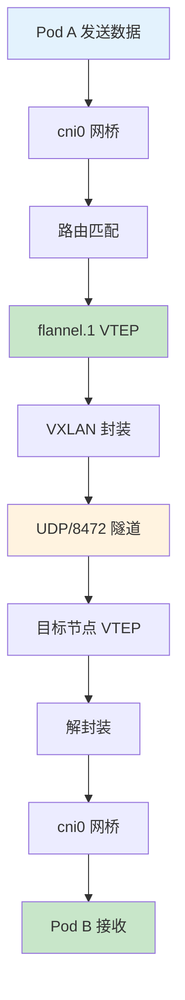
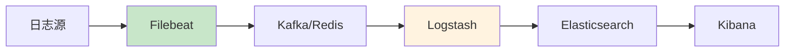

# SRE运维面试题全解析：从理论到实践（第三部分）

## 情境与背景

作为一名SRE工程师，面试是职业发展的重要环节。面试官通常会从系统知识、工具使用、问题解决能力等多个维度考察候选人。本文基于真实面试场景，整理了高频面试题，并提供结构化的解析，帮助你快速掌握核心知识点，从容应对面试挑战。

## 核心面试题解析

### 216. k8s网络flannel的通信过程是啥？vxlan的通信过程？

**Why - 为什么这个问题重要？**

Flannel是Kubernetes最常用的CNI插件之一，负责为Pod提供跨节点的网络通信能力。理解Flannel的通信过程和VXLAN技术原理，是设计和维护K8s网络架构的基础，也是高级DevOps/SRE工程师必备的核心知识。**VXLAN是目前生产环境最常用的Flannel后端，其通过UDP封装实现三层网络上的二层扩展。**

**How - Flannel与VXLAN通信流程**

**What - 通信过程详解**

| 阶段 | 源节点操作 | 目标节点操作 |
|:----:|-----------|-------------|
| **1. 子网分配** | flanneld向Etcd申请PodCIDR，假设为10.244.0.0/24 | 目标节点获得10.244.1.0/24 |
| **2. Pod发送** | Pod A(10.244.0.10)发送数据到Pod B(10.244.1.20) | - |
| **3. 网桥接收** | 数据包通过veth Pair进入cni0网桥 | - |
| **4. 路由匹配** | 内核路由表匹配到flannel.1接口 | - |
| **5. VTEP封装** | 源VTEP(flannel.1)封装原始帧为VXLAN数据包 | - |
| **6. 隧道传输** | 通过UDP 8472端口发送到目标VTEP IP | - |
| **7. VTEP接收** | - | 目标VTEP接收VXLAN数据包 |
| **8. 解封装** | - | 移除VXLAN头部，还原原始帧 |
| **9. 网桥转发** | - | 数据包通过cni0转发到Pod B |
| **10. Pod接收** | - | Pod B接收完整数据包 |

**VXLAN封装结构**

| 层次 | 封装内容 | 说明 |
|:----:|---------|------|
| **原始数据** | L2 Frame (Ethernet + IP + TCP) | 原始Pod数据包 |
| **VXLAN头** | VNI(24bit) + Flags + VNITag | 虚拟网络标识 |
| **UDP头** | 源端口随机 + 目的端口8472 | VXLAN封装协议 |
| **IP头** | 源VTEP IP + 目标VTEP IP | 隧道端点IP |
| **物理网络** | Ethernet Frame | 底层物理网络封装 |

**记忆口诀**：Pod发包走cni0，路由匹配flannel.1，VTEP封装VXLAN，UDP8472穿隧道，目标解封装，cni0送到Pod。

**面试标准答法（1分钟版）**：Flannel的通信过程：Pod发送数据包时，通过veth Pair到cni0网桥，内核根据路由表将数据包交给flannel.1接口（VTEP设备）；VTEP根据目标IP查找ARP表获取目标VTEP MAC地址，然后将原始L2帧封装为VXLAN数据包；VXLAN通过UDP 8472端口在物理网络上建立隧道传输；目标节点VTEP收到后解封装，将原始帧交给cni0网桥，网桥通过veth Pair转发到目标Pod。VXLAN本质上是在三层网络上构建二层overlay网络，通过24bit VNI实现1600万虚拟网络隔离。

> **延伸阅读**：想了解更多Flannel与VXLAN生产环境最佳实践？请参考 [K8S网络Flannel与VXLAN详解：从原理到生产环境实践]()。

### 217. logstash和filebeat之间有啥区别？

**Why - 为什么这个问题重要？**

在ELK日志系统中，Filebeat和Logstash是最常用的两个组件。理解它们的定位、功能差异和使用场景，是构建高效日志收集架构的基础。**Filebeat负责轻量级采集，Logstash负责复杂处理，两者是互补关系而非替代关系。**

**How - 组件定位与架构**

**What - 核心区别对比**

| 维度 | Filebeat | Logstash |
|:----:|----------|----------|
| **定位** | 轻量级日志采集器 | 重量级日志处理管道 |
| **资源消耗** | 低（Go语言，单进程~40MB） | 高（JVM，1GB+内存） |
| **功能** | 采集、初步过滤、多行合并 | 采集、解析、转换、丰富、输出 |
| **性能** | 高（单实例可处理MB/s日志） | 中等（需要更多资源） |
| **插件生态** | Input/Module有限 | Input/Filter/Output丰富 |
| **部署位置** | 靠近日志源（每台主机） | 集中部署（独立服务器） |
| **配置复杂度** | 简单 | 复杂 |
| **可靠性** | At-least-once | At-least-once |
| **适用场景** | 大规模日志采集 | 复杂日志处理 |

**Filebeat优势场景**

| 场景 | 推荐原因 |
|------|----------|
| **大规模采集** | 轻量低资源占用，每台主机部署 |
| **简单日志转发** | 仅需基本过滤和多行合并 |
| **K8s环境** | 有官方K8s Module自动发现Pod日志 |
| **资源敏感环境** | 嵌入式应用日志收集 |

**Logstash优势场景**

| 场景 | 推荐原因 |
|------|----------|
| **复杂解析** | JSON/XML/CSV等多格式解析 |
| **数据富化** | 结合GeoIP、数据库丰富日志 |
| **多输出** | 同时写入ES、HDFS、Kafka等 |
| **高级转换** | 正则替换、条件分支、聚合统计 |

**记忆口诀**：采集用Filebeat，处理用Logstash，量大轻量选Filebeat，复杂解析用Logstash。

**面试标准答法（1分钟版）**：Filebeat和Logstash是ELK栈的两个核心组件，定位不同：Filebeat是轻量级日志采集器，用Go编写，资源消耗低（单进程约40MB），负责从日志源采集数据、做初步过滤和多行合并，适合大规模部署在每台主机上；Logstash是重量级日志处理管道，用JVM运行，功能强大，支持丰富的Input/Filter/Output插件，能做复杂的数据解析、转换和富化，适合集中部署做复杂处理。生产环境的最佳实践是：Filebeat部署在日志源采集日志，通过Kafka解耦后，Logstash做集中处理和解析，最后写入Elasticsearch。

> **延伸阅读**：想了解更多Filebeat与Logstash生产环境最佳实践？请参考 [Filebeat与Logstash对比分析：ELK日志收集架构最佳实践]()。

