# SRE运维面试题全解析：从理论到实践

## 情境与背景

作为一名SRE工程师，面试是职业发展的重要环节。面试官通常会从系统知识、工具使用、问题解决能力等多个维度考察候选人。本文基于真实面试场景，整理了高频面试题，并提供结构化的解析，帮助你快速掌握核心知识点，从容应对面试挑战。

## 核心面试题解析

### 1. 如何判断一个进程是否为多线程？

**Why - 为什么这个问题重要？**

多线程进程在系统资源管理和性能优化中具有重要意义。作为SRE工程师，排查问题时第一步往往是确认目标进程是否为多线程——这直接影响你如何分析内存占用、CPU使用率以及性能瓶颈。

**How - 如何系统地判断？**

| 方法 | 命令 | 识别特征 | 适用场景 |
|:----:|------|----------|----------|
| 进程树 | `pstree -p <pid>` | `{ }`包裹的子节点 = 线程 | 快速目视检查 |
| 进程状态 | `ps aux` 或 `ps -eLf` | 状态标志含 `l`(小写L) | 程序化检查 |
| Proc文件系统 | `cat /proc/<pid>/status` | `Threads: N` | 获取精确线程数 |

**What - 实际操作演示**：

```bash
# 方法1：pstree - 线程一目了然，花括号标记线程
pstree -p | grep zabbix
# 输出：
# ├─zabbix_agent2(5352)─┬─{zabbix_agent2}(5361)
#                      ├─{zabbix_agent2}(5362)
#                      ├─{zabbix_agent2}(5363)
#                      └─{zabbix_agent2}(5364)

# 方法2：ps - 查看状态标志中的"l"
ps aux | grep zabbix
# zabbix  5352  0.0  0.5 1695696 21944 ?       Ssl  13:42   0:00 /usr/sbin/zabbix_agent2
#                                               ↑
#                                          "l" = multi-thread (多线程)

# 方法3：/proc - 获取精确线程数量
cat /proc/5352/status | grep Thread
# Threads:        7
```

**记忆口诀**：`pstree` 看花括号，`ps` 看小写l，`/proc` 直接数线程

> **面试加分点**：Linux中线程本质是轻量级进程(LWP)，与进程共享同一地址空间，了解这一点能让你在追问时更有底气。

> **延伸阅读**：想了解更多生产环境实践？请参考 [生产环境多线程进程监控与排查最佳实践]()。

### 2. 你写过哪些类型的Shell脚本？

**Why - 为什么这个问题重要？**

Shell脚本是SRE工程师实现自动化运维的核心工具。面试官通过这道题考察你的**技术广度**和**实战经验深度**。

**How - 如何系统地回答？**

以下是我整理的六类核心脚本，按**运维场景频率**排序：

| 类别 | 典型场景 | 技能要点 |
|:----:|----------|----------|
| **监控采集** | Zabbix Agent自定义Key、Prometheus Exporter | 指标提取、格式输出 |
| **部署发布** | K8s Nginx MySQL 一键部署 |  idempotence、回滚机制 |
| **备份容灾** | 数据库定时备份、配置文件版本化 | 压缩加密、校验恢复 |
| **安全加固** | 基线检查、漏洞扫描、CIS规范 | 权限最小化、审计日志 |
| **性能调优** | 内核参数优化、连接数调优 | 阈值把控、效果验证 |
| **业务自动化** | 日志分析、故障自愈、容量预测 | 正则解析、API调用 |

**What - 回答框架（FAB结构）**

```bash
# 示范回答结构：
"我主要写过三类Shell脚本：
# 1. 监控类（如Zabbix自定义监控脚本）
#    - 负责采集XX指标，输出特定格式
# 2. 部署类（如一键部署LNMP环境）
#    - 实现无人值守安装，支持版本回滚
# 3. 巡检类（如日更服务器健康检查）
#    - 自动巡检并发送邮件报告
"
```

**记忆口诀**：监部安防性业，六个场景全覆盖

> **面试加分点**：能说出一个**最有成就感的脚本**，详细讲清背景、挑战和解决方案，远比罗列清单更有说服力。

> **延伸阅读**：想了解更多Shell脚本生产环境最佳实践？请参考 [SRE工程师Shell脚本生产环境最佳实践]()。

### 3. Zabbix架构详解

**Why - 为什么Zabbix是面试常客？**

Zabbix是企业级监控的主流选择，面试官考察的是你是否理解**监控系统的核心设计思想**——数据如何采集、传输、存储、展示。

**How - Zabbix核心架构**

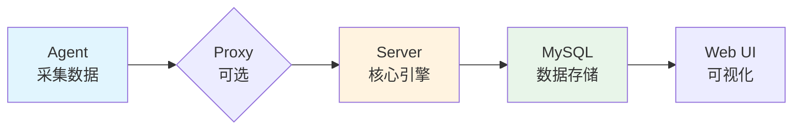

| 组件 | 职责 | 部署位置 | 关键指标 |
|:----:|------|----------|----------|
| **Agent** | 主动采集本地数据 | 被监控主机 | 可靠性、权限 |
| **Proxy** | 数据中转，减轻Server压力 | 分布式节点 | 缓存能力 |
| **Server** | 数据接收、处理、告警 | 中心节点 | 处理能力、队列 |
| **Database** | 元数据+监控数据存储 | 独立部署 | IOPS、容量 |
| **Web UI** | 配置管理、可视化展示 | 与Server同部署 | 响应速度 |

**What - 数据流详解**

```
被动模式：Server ← Agent（Agent监听，Server发起连接）
主动模式：Server → Agent（Agent主动上报，更适合大规模场景）

完整链路：
Agent → (Proxy) → Server → Database → Web UI
         ↑可选          ↑核心      ↑展示
```

**记忆口诀**：采转存展，四步走；主动被动要分清

> **面试加分点**：能说明Zabbix **主动模式与被动模式的区别**，以及何时选择Proxy而非直接连Server，证明你有大规模生产环境的实战经验。

> **延伸阅读**：想了解更多Zabbix生产环境最佳实践？请参考 [Zabbix生产环境最佳实践：从架构设计到运维优化]()。

### 4. iptables表与链

**Why - 为什么必须掌握iptables？**

Linux防火墙是网络安全的基石。iptables通过**表→链→规则**三层机制控制数据包去留，是SRE工程师排查网络问题、配置安全策略的必备技能。

**How - 五表五链工作机制**

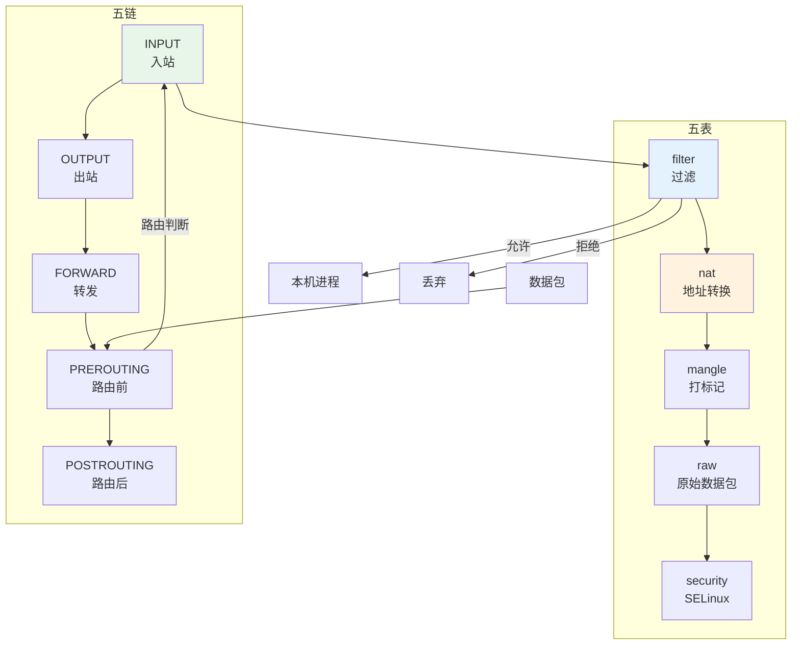

| 表 | 用途 | 包含链 |
|:--:|------|--------|
| **filter** | 默认表，包过滤 | INPUT, OUTPUT, FORWARD |
| **nat** | 网络地址转换 | PREROUTING, OUTPUT, POSTROUTING |
| **mangle** | 修改数据包标记/QoS | 所有五链 |
| **raw** | 原始追踪，绕过连接跟踪 | PREROUTING, OUTPUT |
| **security** | SELinux强制访问控制 | INPUT, OUTPUT, FORWARD |

**What - 匹配顺序（重点！）**

```
数据包进入 → PREROUTING(路由前) → 路由判断 → FORWARD/INPUT → POSTROUTING(路由后)
                                                    ↓
                                              OUTPUT(出站)
```

**处理优先级**：raw → mangle → nat → filter → security

**记忆口诀**：过转标原安，五表要记全；路由前后nat，分流FORWARD

> **面试加分点**：能说清**iptables与nftables的区别**，以及为什么生产环境逐渐迁移到nftables，证明你有技术演进意识。

> **延伸阅读**：想了解更多Linux防火墙生产环境最佳实践？请参考 [Linux防火墙生产环境最佳实践：从iptables到nftables]()。

### 5. 四层与七层代理的区别

**Why - 为什么需要代理？**

代理是现代网络架构的"交通枢纽"，负责请求分发、安全过滤、性能优化。理解四层vs七层代理，是设计高可用架构的**分水岭**。

**How - 工作层级对比**

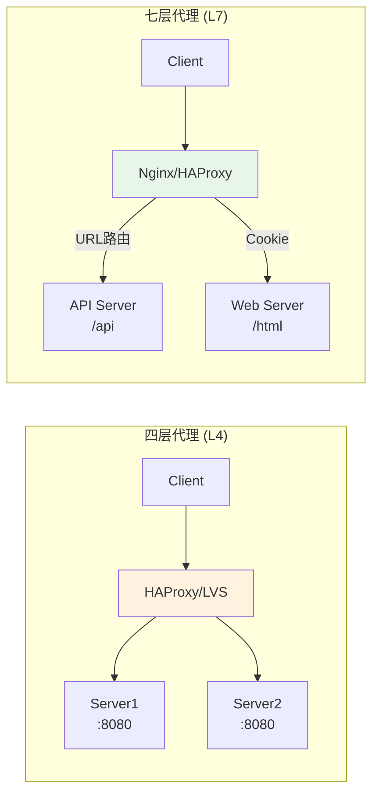

| 维度 | 四层代理 (L4) | 七层代理 (L7) |
|:----:|:-------------:|:-------------:|
| **OSI层级** | 传输层 (TCP/UDP) | 应用层 (HTTP/HTTPS) |
| **识别依据** | IP + 端口 | URL、Header、Cookie |
| **性能** | ⚡ 高（仅解析头部） | 🐢 较低（完整协议解析） |
| **功能** | 负载均衡、端口转发 | 路由、SSL卸载、缓存、WAF |
| **延迟** | < 1ms | 1-5ms |
| **代表产品** | LVS、HAProxy(L4模式) | Nginx、HAProxy(L7模式) |

**What - 选型决策树**

```
需要什么？
    │
    ├── 简单负载均衡 + 超高并发 → 四层代理 (LVS/HAProxy)
    │
    └── 智能路由 + 安全防护 + 缓存 → 七层代理 (Nginx/Traefik)
            │
            └── 需要WAF/SSL卸载 → 七层 + Lua/OpenResty
```

**记忆口诀**：四层看端口快，七层看内容智能选

> **面试加分点**：能说出**四层代理（如LVS）的DR模式、TUN模式区别**，以及如何解决Session保持问题，证明你有生产级负载均衡经验。

> **延伸阅读**：想了解更多代理服务器生产环境最佳实践？请参考 [代理服务器生产环境最佳实践：从四层到七层的架构设计]()。

### 6. 存储类型详解

**Why - 为什么存储选型至关重要？**

存储是系统架构的性能瓶颈。选错存储类型，轻则拖慢业务，重则导致数据丢失。作为SRE，必须理解三种存储架构的**性能特点**和**适用场景**。

**How - DAS/NAS/SAN 三种架构对比**

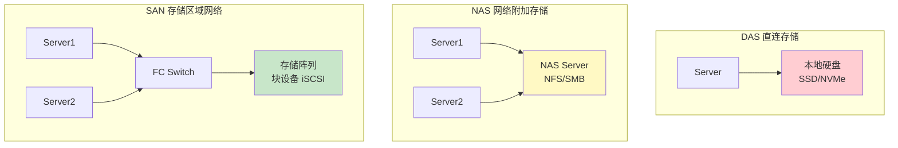

| 类型 | 协议 | 性能 | 延迟 | 共享性 | 典型场景 |
|:----:|------|:----:|:----:|:------:|----------|
| **DAS** | 直连 | ⚡⚡⚡ | < 1ms | ❌ 独占 | 数据库、高性能计算 |
| **NAS** | NFS/SMB | ⚡⚡ | 5-20ms | ✅ 多机共享 | 文件共享、备份 |
| **SAN** | iSCSI/FC | ⚡⚡⚡ | 1-5ms | ✅ 块级共享 | 虚拟化、企业级数据库 |

**What - 选型决策**

```
性能优先 + 单机使用 → DAS (本地SSD/NVMe)
文件共享 + 跨平台 → NAS (NFS/SMB over Ethernet)
企业级 + 虚拟化 + 高可用 → SAN (iSCSI/FC)
```

**记忆口诀**：数据库用DAS快，文件共享选NAS，企业虚拟化靠SAN

> **面试加分点**：能说清**DAS/NAS/SAN的IO模型区别**（块vs文件vs对象），以及何时选择对象存储（如MinIO）替代传统存储，证明你有现代存储架构思维。

> **延伸阅读**：想了解更多存储系统生产环境最佳实践？请参考 [存储系统生产环境最佳实践：从DAS到对象存储的架构设计]()。

### 7. 网络设备基础

**Why - 为什么SRE必须懂网络设备？**

网络是现代互联网的"血管"，SRE日常排查的故障中，**60%以上与网络相关**。路由器和交换机是网络的基础设备，理解它们才能快速定位问题。

**How - 路由器 vs 交换机 核心对比**

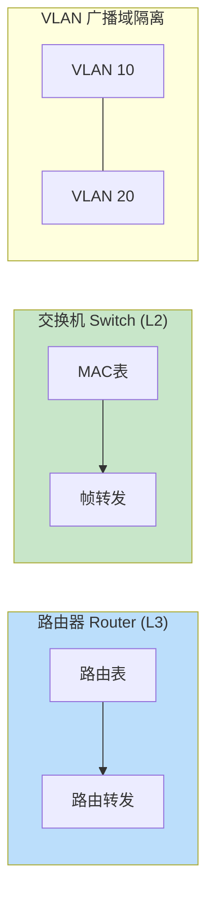

| 维度 | 路由器 (Router) | 交换机 (Switch) |
|:----:|-----------------|-----------------|
| **工作层级** | OSI L3 网络层 | OSI L2 数据链路层 |
| **转发依据** | IP地址（路由表） | MAC地址（MAC表） |
| **核心功能** | 跨网段通信、路由选择 | 局域网内帧交换、VLAN隔离 |
| **广播域** | 每个接口独立广播域 | 默认全端口共享（VLAN可隔离） |
| **典型设备** | Cisco/Juniper/华为路由器 | Cisco/H3C/华为二层/三层交换机 |

**What - 路由表与MAC表工作机制**

```
路由表工作流程（路由器）：
数据包进入 → 查路由表匹配目的IP → 找到下一跳 → 转发

MAC表工作流程（交换机）：
帧进入 → 查MAC表找目标MAC → 找到端口 → 转发
             ↓未找到
          泛洪（Flooding）到所有端口（除入口）

VLAN作用：
- 逻辑划分广播域，减少广播风暴
- 安全隔离，不同VLAN间需路由互通
- 常用命令：switchport mode access/trunk
```

**记忆口诀**：路由选路靠IP，交换转发靠MAC；VLAN隔离广播域，三层路由来互通

> **面试加分点**：能说清**VLAN Trunk模式与Access模式的区别**，以及为什么需要802.1Q标签，证明你有企业网络实战经验。

> **延伸阅读**：想了解更多网络设备生产环境最佳实践？请参考 [网络设备生产环境最佳实践：从路由器到交换机的架构设计]()。

### 8. 源代码构建工具

**Why - 为什么SRE要懂构建工具？**

SRE核心职责之一是**应用交付**。构建工具是CI/CD流水线的上游环节，不懂构建等于不懂发布。

**How - 主流语言构建工具对比**

| 语言 | 构建工具 | 典型命令 | 产物 |
|:----:|----------|----------|------|
| **Java** | Maven/Gradle | `mvn clean package -Dmaven.test.skip=true` | .jar/.war |
| **Go** | go build | `go build -o app main.go` | 二进制文件 |
| **Python** | pip/pyinstaller | `python3 -m py_compile app.py` | .pyc/独立可执行文件 |
| **C/C++** | Make/CMake | `./configure && make && make install` | 可执行文件/库 |
| **容器化** | Docker | `docker build -t image:tag .` | OCI镜像 |

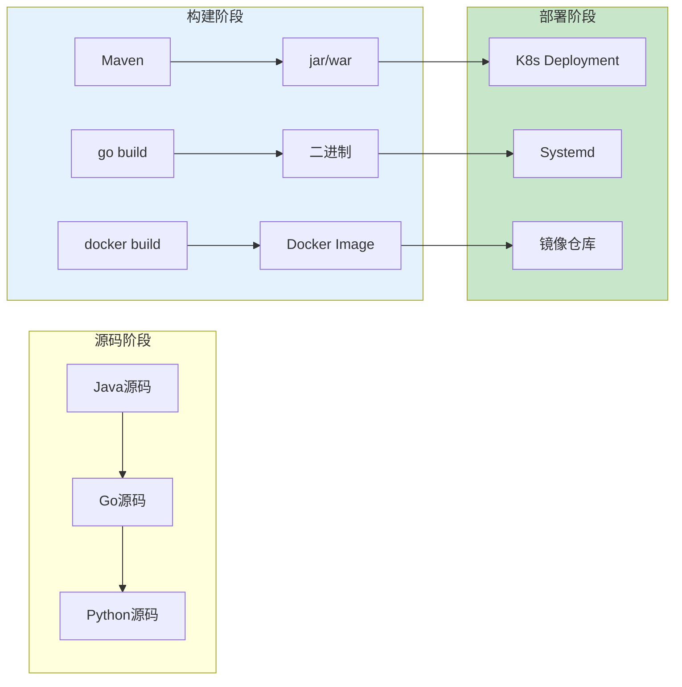

**What - 实际应用场景**

```bash
# Java构建 - 跳过测试加速
mvn clean package -Dmaven.test.skip=true -DskipTests

# Go构建 - 静态编译，单文件部署
CGO_ENABLED=0 GOOS=linux go build -a -installsuffix cgo -o app main.go

# Python - 虚拟环境隔离
python3 -m venv venv && source venv/bin/activate && pip install -r requirements.txt

# Docker - 多阶段构建减小镜像体积
docker build -t myapp:latest --target builder .
docker build -t myapp:latest .
```

**记忆口诀**：Java用Maven，Go直接build，Python建虚拟环境，Docker多阶段构建

> **面试加分点**：能说清**Docker多阶段构建的原理**，以及如何通过构建优化（如BuildKit）提升构建速度，证明你有工程化实战经验。

> **延伸阅读**：想了解更多构建工具生产环境最佳实践？请参考 [构建工具生产环境最佳实践：从Maven到Docker的工程化实践]()。

### 9. SRE工程师岗位职责

**Why - SRE到底是什么？**

Google定义的SRE = **Software Reliability Engineering**。它是用软件工程思维解决运维问题，让**可靠性成为产品特性**而非运维负担。

**How - SRE核心能力矩阵**

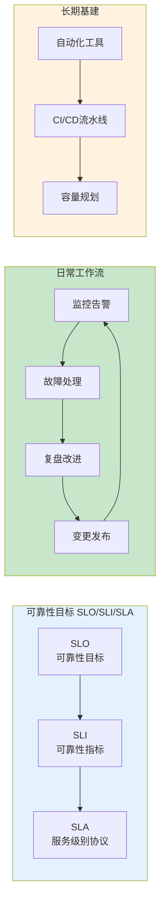

| 职责领域 | 核心任务 | 关键指标 | 占比 |
|:--------:|----------|:--------:|:----:|
| **可用性保障** | 监控告警、故障响应、SLO维护 | 服务可用率 ≥ 99.95% | 40% |
| **变更管理** | 发布部署、回滚、变更评审 | MTTR / MTBF | 25% |
| **容量规划** | 性能压测、扩缩容、成本优化 | 资源利用率 / 单位成本 | 15% |
| **效率提升** | 自动化、工具平台、CI/CD | 部署频率 / 发布周期 | 15% |
| **技术演进** | 架构优化、技术债务、团队赋能 | 技术健康度 | 5% |

**What - 与传统运维的关键区别**

| 维度 | 传统运维 | SRE |
|:----:|----------|-----|
| **目标** | 维护系统运行 | 持续提升可靠性 |
| **方法** | 人工操作、被动响应 | 自动化、主动预防 |
| **指标** | 可用即可 | SLO量化、可衡量 |
| **文化** | 救火模式 | 接受失败、持续复盘 |

**记忆口诀**：监变容效技，五字记职责；SLO是核心，自动化是手段

> **面试加分点**：能说出**SLO/SLI/SLA的三者关系**，以及如何根据业务制定合理的SLO阈值，证明你有真正的SRE实践经验。

> **延伸阅读**：想了解更多SRE工程师生产环境最佳实践？请参考 [SRE工程师生产环境最佳实践：从SLO制定到自动化运维的完整指南]()。

### 10. MySQL日志与主从复制

**Why - 为什么MySQL日志是面试重点？**

MySQL日志是**数据可靠性**和**主从复制**的基石。binlog用于数据恢复和复制，redolog用于事务持久化，不懂日志等于不懂MySQL。

**How - 五种日志分类与作用**

| 日志类型 | 作用 | 关键参数 |
|----------|------|----------|
| **binlog** | 记录所有DDL/DML，用于复制和恢复 | `log_bin`, `sync_binlog` |
| **redolog** | 物理日志，保障事务持久性（InnoDB） | `innodb_log_file_size` |
| **undolog** | 回滚日志，支持MVCC和回滚 | 自动管理 |
| **slowlog** | 记录慢查询，用于SQL优化 | `long_query_time`, `log_queries_not_using_indexes` |
| **errorlog** | 记录启动/运行/异常信息 | `log_error` |

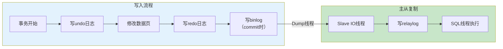

**What - 主从复制配置实战**

```bash
# Master配置 (my.cnf)
[mysqld]
server-id = 1
log-bin = mysql-bin
sync-binlog = 1
binlog-format = ROW

# 创建复制用户
CREATE USER 'repl'@'%' IDENTIFIED BY 'password';
GRANT REPLICATION SLAVE ON *.* TO 'repl'@'%';

# 备份数据
mysqldump --single-transaction --master-data=2 -A > backup.sql

# Slave配置 (my.cnf)
[mysqld]
server-id = 2
read_only = ON
relay_log = relay-bin
relay_log_purge = ON

# 恢复备份并启动复制
mysql < backup.sql
CHANGE MASTER TO
    MASTER_HOST='master_ip',
    MASTER_USER='repl',
    MASTER_PASSWORD='password',
    MASTER_LOG_FILE='mysql-bin.000001',
    MASTER_LOG_POS=xxx;
START SLAVE;
SHOW SLAVE STATUS\G
```

**复制原理速记**：Dump线程读binlog，IO线程接收，SQL线程回放

**记忆口诀**：binlog复制恢复，redolog事务安全，slowlog帮优化

> **面试加分点**：能说清**binlog三种格式（Statement/Row/Mixed）的区别**，以及何时选择哪种格式，证明你有生产环境MySQL调优经验。

> **延伸阅读**：想了解更多MySQL生产环境最佳实践？请参考 [MySQL生产环境最佳实践：从日志管理到主从复制的完整指南]()。

### 11. Linux常用命令分类

**Why - 为什么Linux是SRE的主战场？**

Linux是服务器OS的霸主（90%+市场份额）。SRE的日常工作：**故障排查用命令、性能分析用命令、自动化还是用命令**。不会Linux命令 = 不会运维。

**How - 七大场景命令速查表**

| 场景 | 核心命令 | 典型用法 |
|:----:|----------|----------|
| **系统概览** | `top`/`htop`/`free`/`df`/`uname` | `top -bn1 \| head -20` 快速看资源 |
| **进程管理** | `ps`/`pidof`/`kill`/`pkill`/`pgrep` | `ps -ef \| grep java` 查进程PID |
| **文件操作** | `ls`/`cp`/`mv`/`rm`/`find`/`stat` | `find / -name "*.log" -mtime +7` 找日志 |
| **权限管理** | `chmod`/`chown`/`chgrp`/`umask` | `chmod 755 script.sh` 赋权 |
| **磁盘管理** | `fdisk`/`parted`/`mkfs`/`mount`/`df` | `df -hT` 看磁盘使用率 |
| **网络诊断** | `ss`/`netstat`/`ip`/`ping`/`curl`/`tcpdump` | `ss -tunlp \| grep LISTEN` 查端口 |
| **文本处理** | `grep`/`sed`/`awk`/`cat`/`tail`/`sort`/`uniq` | `awk '/ERROR/ {print $1,$NF}' log` 提取字段 |

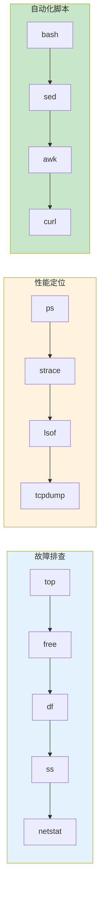

**What - 高频命令组合示例**

```bash
# 快速系统概览（3秒定位问题）
top -bn1                    # CPU/内存占用
df -h                       # 磁盘使用率
free -h                     # 内存详情
ss -tunlp                   # 监听端口

# 排查进程资源占用
ps -eo pid,ppid,%cpu,%mem,cmd --sort=-%cpu | head -10
lsof -p <PID>              # 查看进程打开的文件

# 日志分析（查ERROR）
grep -E "ERROR|WARN" app.log | tail -100
awk '{print $1,$4,$NF}' access.log | sort | uniq -c | sort -rn | head

# 网络排查
tcpdump -i eth0 port 80    # 抓包
curl -v http://localhost    # 测试连通性
```

**记忆口诀**：系统看top/free，进程用ps/kill，文件找find/chmod，网络靠ss/netstat，文本处理awk/sed/grep

> **面试加分点**：能说清**load average的三个数字含义**，以及CPU使用率100%但load很低/很高的常见原因，证明你有实战问题定位经验。

> **延伸阅读**：想了解更多Linux命令生产环境最佳实践？请参考 [Linux命令生产环境最佳实践：故障排查与自动化运维实战]()。

### 12. HTTP协议与响应码

**Why - 为什么HTTP是Web问题的钥匙？**

HTTP是互联网的"通用语言"。SRE排查Web故障时，**响应码是诊断的第一步**——4xx是客户端问题，5xx是服务端问题，看到重定向就要考虑是不是循环。读懂HTTP，就等于半个全栈工程师。

**How - HTTP版本演进与协议结构**

| 版本 | 核心改进 | 现状 |
|:----:|----------|------|
| **HTTP/1.0** | 短连接，每次请求独立TCP | 已废弃 |
| **HTTP/1.1** | 持久连接(Keep-Alive)、管道化 | 主流（占比50%+） |
| **HTTP/2** | 多路复用、头部压缩、Server Push | 逐步普及 |
| **HTTP/3** | QUIC协议（UDP）、0-RTT | 新兴 |

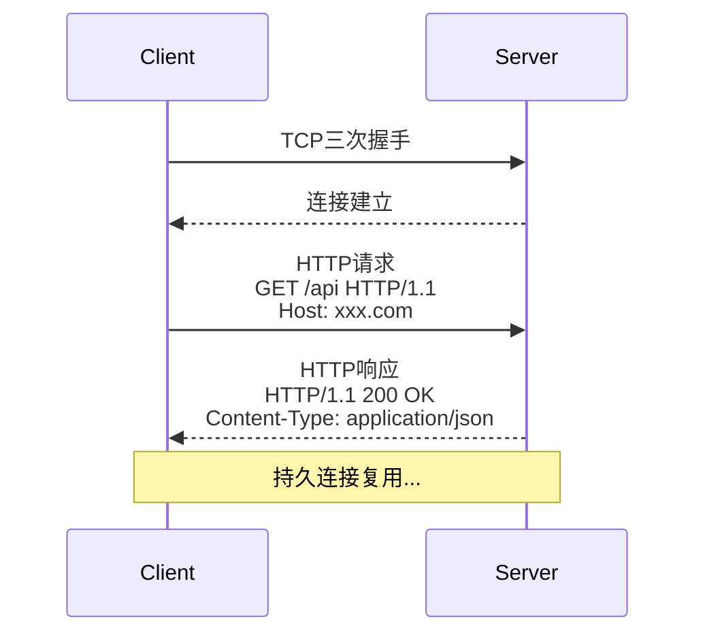

**What - 响应码五类详解**

| 类别 | 含义 | 常见码 | 排查要点 |
|:----:|------|--------|----------|
| **1xx** | 信息 | 100 Continue | 客户端继续发送 |
| **2xx** | 成功 | **200 OK**, 201 Created, 204 No Content | 正常 |
| **3xx** | 重定向 | **301/302**, 304 Not Modified, **307/308** | 注意SEO影响 |
| **4xx** | 客户端错 | **400 Bad Request**, **401/403**, **404**, 429 Too Many Requests | 检查请求 |
| **5xx** | 服务端错 | **500 Internal Error**, **502 Bad Gateway**, **503 Service Unavailable**, **504 Timeout** | 查看日志 |

```
常见故障排查：
401 Unauthorized → 认证Token过期/缺失
403 Forbidden    → 权限不足/ACL拦截
404 Not Found    → 路径错误/服务未部署
502 Bad Gateway  → upstream服务挂了
503 Service Unavailable → 过载/维护
504 Timeout      → upstream响应慢/超时
```

**记忆口诀**：1信息2成功3重定向，4客户端5服务端；502 gateway 504 timeout，43x注意权限路径

> **面试加分点**：能说清**301 vs 302 vs 307 vs 308的区别**，以及HTTP缓存控制(Cache-Control/ETag/Last-Modified)的工作原理，证明你有深度Web开发经验。

### 13. 监控系统组成

**Why - 为什么监控系统是SRE的生命线？**

Google SRE最佳实践：**监控与告警是SRE团队的眼睛**。没有监控，你就是在"盲飞"。监控系统的成熟度直接决定了MTTR（平均故障恢复时间）和SLO达成率。

**How - 监控系统四层架构**

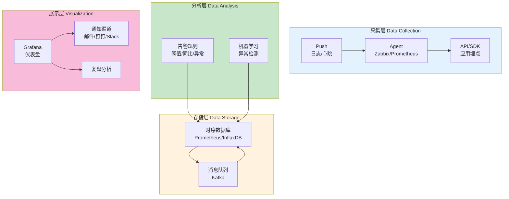

| 组件层 | 核心职责 | 常见工具 |
|--------|----------|----------|
| **采集层** | 指标采集、日志收集、链路追踪 | Zabbix Agent, Prometheus node_exporter, Telegraf, Filebeat |
| **存储层** | 时序数据存储、消息队列 | Prometheus, InfluxDB, Kafka, Elasticsearch |
| **分析层** | 告警规则、异常检测、根因分析 | Alertmanager, PagerDuty, ElastAlert |
| **展示层** | 可视化仪表盘、通知告警、复盘报告 | Grafana, Kibana, PagerDuty, Slack |

**What - 告警配置黄金法则**

```
告警配置原则：
✅ 要告的：核心业务SLO、严重故障、性能拐点
❌ 不告的：资源闲置、偶发抖动、非核心指标

告警分级：
  P1 Critical - 立即处理（电话+短信）
  P2 Warning   - 尽快处理（邮件+钉钉）
  P3 Info      - 观察记录（仅记录）

常见告警风暴解决方案：
  - 聚合抑制（同一故障只告一次）
  - 升级机制（响应超时自动升级）
  - 静默规则（维护窗口）
```

**记忆口诀**：采储分析展，四层缺一不可；告警分级P123，抑制聚合加升级

> **面试加分点**：能说清**Prometheus的Pull vs Push采集模式区别**，以及如何设计合理的告警收敛策略，证明你有大规模监控体系设计经验。

### 14. 脚本开发经验

**Why - 为什么脚本能力是SRE核心竞争力？**

Google SRE名言：**"If it's not automated, it's not scalable"**。脚本能力直接决定你能把多少重复劳动变成自动化，直接影响你的工作效率和职业价值。

**How - Shell vs Python 使用场景对比**

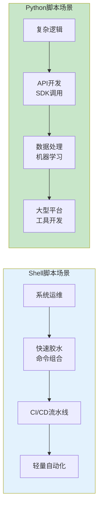

| 维度 | Shell | Python |
|:----:|-------|--------|
| **优势** | 系统命令集成、启动快、一行搞定 | 生态丰富、可读性强、可维护 |
| **劣势** | 复杂逻辑弱、跨平台差 | 启动慢、需要环境 |
| **擅长** | 文本处理、管道组合、定时任务 | API调用、数据处理、Web服务 |
| **代表场景** | 日志切割、备份脚本、监控采集 | CMDB同步、自动化平台、告警收敛 |

**What - 实战场景与代码模板**

```bash
#!/bin/bash
# Shell实战：Nginx日志分析脚本
#!/bin/bash
LOG_FILE="/var/log/nginx/access.log"
ERROR_LOG="/var/log/nginx/error.log"

# 统计IP访问量TOP10
awk '{print $1}' $LOG_FILE | sort | uniq -c | sort -rn | head -10

# 统计HTTP状态码分布
awk '{print $9}' $LOG_FILE | sort | uniq -c | sort -rn
```

```python
#!/usr/bin/env python3
# Python实战：企业微信告警通知
import requests
import json
import sys

def send_wechat(alarm_title, alarm_content):
    webhook_url = "https://qyapi.weixin.qq.com/cgi-bin/webhook/send?key=YOUR_KEY"
    payload = {
        "msgtype": "markdown",
        "markdown": {
            "content": f"### {alarm_title}\n>{alarm_content}\n>来源：SRE监控系统"
        }
    }
    resp = requests.post(webhook_url, json=payload)
    return resp.json()

if __name__ == "__main__":
    send_wechat(sys.argv[1], sys.argv[2])
```

**记忆口诀**：Shell胶水快如风，Python逻辑强如龙；系统自动化用Shell，业务智能化用Python

> **面试加分点**：能说出一个**从0到1开发的自动化平台**，包括技术选型、架构设计、遇到的挑战和解决方案，证明你有系统性工程能力。

### 15. Zabbix监控配置

**Why - 为什么Zabbix是企业监控的首选？**

Zabbix是企业级监控的"瑞士军刀"：**开源免费、功能全面、支持大规模集群**。在大规模环境下，Zabbix能同时监控数万台主机，是SRE的标配技能。

**How - Zabbix监控配置流程**

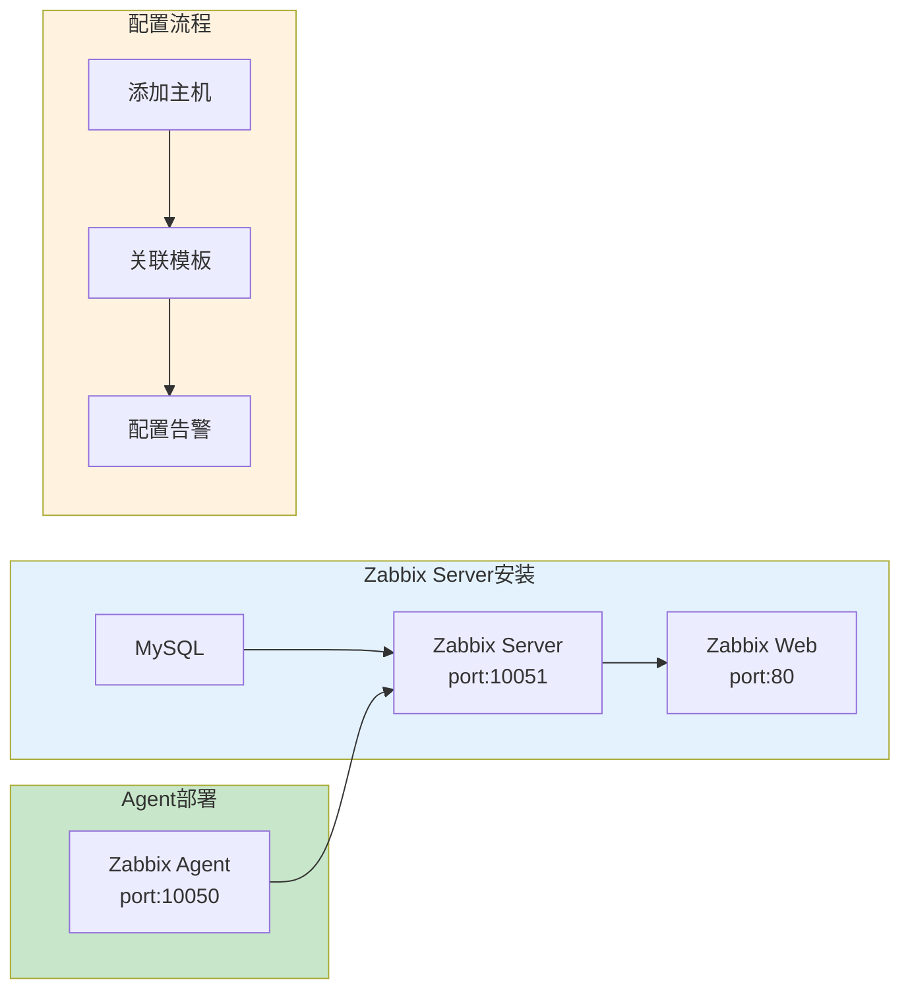

**标准主机监控（5步曲）**：

```bash
# 1. 安装Zabbix Server (Docker方式)
docker run -d --name zabbix-server \
  -e DB_SERVER_HOST="mysql" \
  -p 10051:10051 \
  zabbix/zabbix-server:latest

# 2. 被监控主机安装Agent
rpm -ivh zabbix-agent2-6.0.0.el8.x86_64.rpm

# 3. 配置Agent连接Server (/etc/zabbix/zabbix_agent2.conf)
Server=192.168.1.100
ServerActive=192.168.1.100
Hostname=web-server-01

# 4. Web界面添加主机
# Configuration → Hosts → Create Host → 填入主机名/IP → Link模板(Linux by Zabbix Agent)

# 5. 验证监控数据
# Monitoring → Latest data → 选择主机 → 查看指标
```

**自定义监控（3步曲）**：

```bash
# 1. 编写自定义监控脚本 (UserParameter)
# /etc/zabbix/zabbix_agent2.d/userparameter_app.conf
UserParameter=app.active.users,/opt/scripts/get_active_users.sh

# 2. Web界面创建模板
# Configuration → Templates → Create Template → 添加监控项

# 3. 关联模板并配置告警
# Configuration → Hosts → 选择主机 → Link自定义模板
# Administration → Media types → 配置邮件/钉钉告警
```

**记忆口诀**：装Server、装Agent、配连接、添主机、联模板，五步监控不用慌

> **面试加分点**：能说清**Zabbix主动模式与被动模式的区别**，以及如何通过Zabbix Proxy实现分布式监控，证明你有大规模集群管理经验。

### 16. 常用应用程序端口列表

**Why - 为什么端口知识是SRE的基本功？**

端口是网络服务的"门牌号"。**防火墙按端口放行，负载均衡按端口路由，排查网络问题首先查端口**。记不住常用端口，等于不认路。

**How - 端口分类速查表**

| 分类 | 端口 | 服务 | 记忆技巧 |
|:----:|:----:|------|----------|
| **SSH远程** | 22 | SSH | 两只鹅(2鹅) |
| **Web服务** | 80, 443 | HTTP/HTTPS | Web默认 |
| **数据库** | 3306 | MySQL | 3+3=6 找MySQL |
| | 5432 | PostgreSQL | 5去4(5-4=1)2(谐音SQL) |
| | 27017 | MongoDB | 27倒过来72(QQ)，017=017 |
| | 6379 | Redis | 6-3=3，7-9=-2(负负得正) |
| **缓存/消息** | 6379 | Redis | 同上 |
| | 5672 | RabbitMQ | 5+6=7+2 |
| | 9092 | Kafka | 9+0=9，9-2=7 |
| **监控** | 10050/10051 | Zabbix Agent/Server | 10050-10051 |
| | 9100 | Prometheus Node | 9100 |
| **容器/K8s** | 2379 | etcd client | 2379 |
| | 2380 | etcd peer | 2380 |
| | 6443 | K8s API | 6+4=10(2+8)43 |
| **日志/存储** | 9200 | Elasticsearch | 9200 |
| | 5601 | Kibana | 5601 |
| | 9000 | Grafana | 9000 |

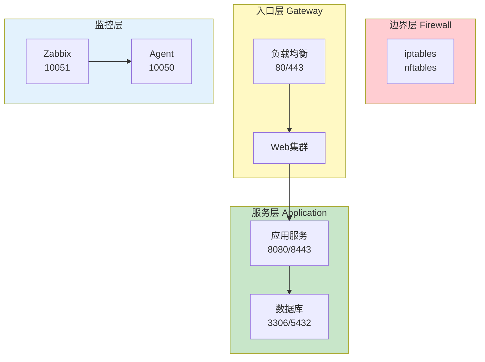

**What - 快速定位端口命令**

```bash
# 查看端口占用
ss -tunlp | grep LISTEN
netstat -tunlp | grep LISTEN

# 查看特定服务端口
ss -tunlp | grep nginx
systemctl status nginx

# 常见服务端口速查
grep -E "^(Port|Listen)" /etc/ssh/sshd_config    # SSH
grep port /etc/my.cnf                            # MySQL
grep 6379 /etc/redis/redis.conf                  # Redis
```

**记忆口诀**：Web 80/443，SSH 22，MySQL 3306，Redis 6379，MongoDB 27107，监控端口记Zabbix

> **面试加分点**：能说清**端口分类（系统端口/注册端口/动态端口）**，以及为什么SSH/FTP/HTTP等用熟知端口(0-1023)，证明你有网络协议深层理解。

### 17. Nginx配置文件和日志文件在哪里？怎么找？

**Why - 为什么排查Nginx首先找配置？**

实际工作中，**Nginx往往是前任或第三方部署的**，你不知道它的安装方式、配置文件在哪、日志路径是什么。快速定位这些信息，是SRE排查Web问题的**第一步**。

**How - 五步定位法**

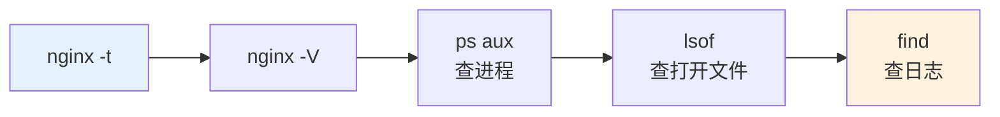

| 方法 | 命令 | 找到什么 | 优先级 |
|:----:|------|----------|:------:|
| **语法测试** | `nginx -t` | 配置文件路径 | ⭐⭐⭐ |
| **编译参数** | `nginx -V` | 安装目录、conf-path | ⭐⭐⭐ |
| **进程查看** | `ps aux \| grep nginx` | master进程、-c参数 | ⭐⭐ |
| **文件描述符** | `lsof -p <PID>` | 打开的日志文件 | ⭐⭐ |
| **文件搜索** | `find / -name nginx.conf` | 配置文件位置 | ⭐ |

**What - 实战命令详解**

```bash
# 方法1：nginx -t（最直接）
nginx -t
# 输出：nginx: the configuration file /etc/nginx/nginx.conf syntax is ok
# 直接告诉你配置文件在哪

# 方法2：nginx -V（查安装信息）
nginx -V
# configure arguments: --prefix=/etc/nginx --conf-path=/etc/nginx/nginx.conf
# 找到 prefix 和 conf-path

# 方法3：ps aux（找进程+c参数）
ps aux | grep nginx
# root 1234 0.0 0.1 ... nginx: master process /usr/sbin/nginx -c /etc/nginx/nginx.conf
# -c 参数后面的就是配置文件路径

# 方法4：lsof（查打开的文件）
lsof -p $(pgrep -f "nginx: master") | grep -E "log|conf"

# 方法5：find（兜底方案）
find / -name nginx.conf -type f 2>/dev/null

# 日志文件查找
grep -E "access_log|error_log" /etc/nginx/nginx.conf
lsof -p $(pgrep nginx) | grep -i log
```

**常见Nginx路径对照表**

| 安装方式 | 配置文件 | 日志文件 |
|----------|----------|----------|
| **YUM/RPM** | `/etc/nginx/nginx.conf` | `/var/log/nginx/access.log` |
| **APT/Debian** | `/etc/nginx/nginx.conf` | `/var/log/nginx/access.log` |
| **编译安装** | `/usr/local/nginx/conf/nginx.conf` | `/usr/local/nginx/logs/access.log` |
| **Docker** | `/etc/nginx/nginx.conf` | `/var/log/nginx/access.log` |

**记忆口诀**：配置找nginx -t，日志查lsof，进程看ps，兜底用find

> **面试加分点**：能说清**nginx信号控制机制**（nginx -s reload/stop/reopen），以及如何实现**零宕机配置更新**，证明你有生产级Nginx管理经验。

### 18. 如何查询当前Linux主机上各种TCP连接状态的个数？TCP连接状态有多少种？

**Why - 为什么TCP状态查询是SRE的必修课？**

TCP状态是网络健康的"体温计"。**大量TIME_WAIT可能导致端口耗尽，CLOSE_WAIT往往暗示应用内存泄漏**，ESTABLISHED突增可能是DDoS攻击。不会查TCP状态，就像医生不会量体温。

**How - 高效查询方法对比**

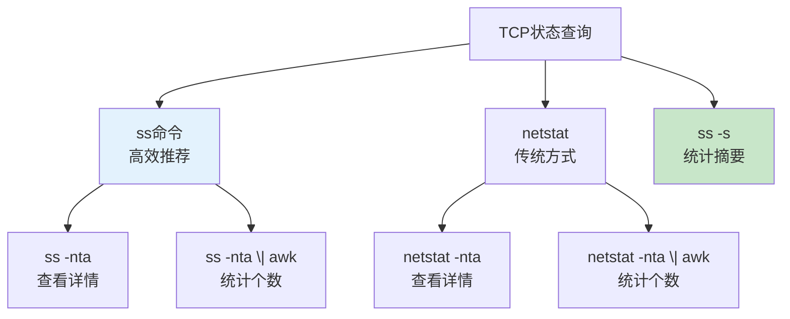

| 方法 | 命令 | 适用场景 | 效率 |
|:----:|------|----------|:------:|
| **ss统计** | `ss -s` | 快速总览 | ⭐⭐⭐ |
| **ss详情** | `ss -nta` | 详细查看 | ⭐⭐⭐ |
| **ss统计** | `ss -nta \| awk '...'` | 按状态统计 | ⭐⭐⭐ |
| **netstat** | `netstat -nta` | 传统查看 | ⭐ |
| **netstat统计** | `netstat -nta \| awk '...'` | 传统统计 | ⭐ |

**TCP状态完整状态图**

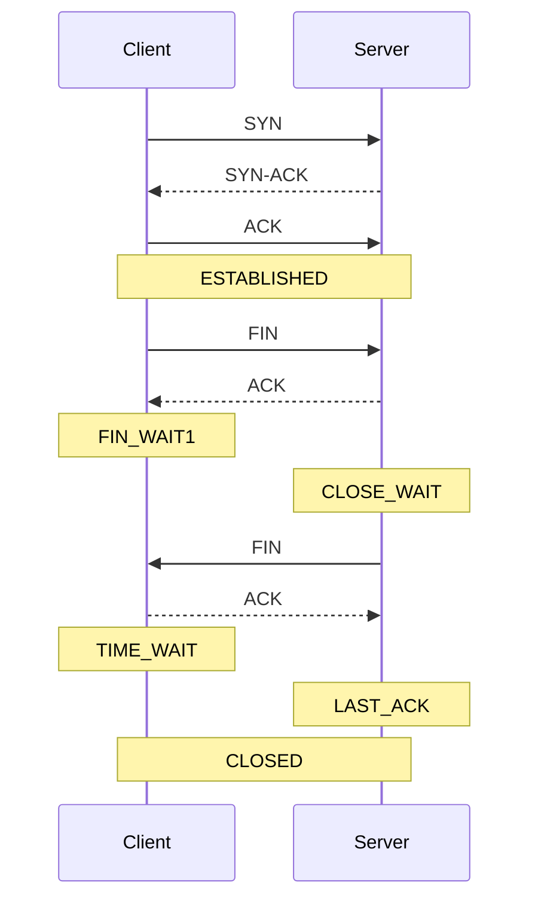

**What - 实战命令与分析**

```bash
# 1. 快速统计总览
ss -s
# 输出：TCP: inet 123 established, 456 timewait, ...

# 2. 统计各种状态的数量（推荐）
ss -nta | awk '{print $1}' | sort | uniq -c | sort -nr
# 或传统方式（慢）
netstat -nta | awk '{print $6}' | sort | uniq -c | sort -nr

# 3. 查看特定状态的连接
ss -nta | grep TIME_WAIT
ss -nta | grep CLOSE_WAIT

# 4. 查看特定端口的连接
ss -nta | grep :80
ss -nta | grep :443
```

**TCP状态详解（11种）**

| 状态 | 含义 | 常见原因 |
|:----:|------|----------|
| **LISTEN** | 监听状态 | 服务器正常 |
| **SYN_SENT** | 发送SYN后等待 | 连接超时 |
| **SYN_RECV** | 收到SYN后等待 | SYN攻击 |
| **ESTABLISHED** | 连接已建立 | 正常业务 |
| **FIN_WAIT1** | 主动关闭等待ACK | 网络延迟 |
| **FIN_WAIT2** | 等待对方FIN | 应用未关闭 |
| **TIME_WAIT** | 等待2MSL | 主动关闭方 |
| **CLOSE_WAIT** | 被动关闭等待应用 | 应用内存泄漏 |
| **LAST_ACK** | 被动关闭等待ACK | 网络延迟 |
| **CLOSING** | 双方同时关闭 | 并发关闭 |
| **CLOSED** | 连接完全关闭 | 正常结束 |

**常见问题分析**：
- **TIME_WAIT过多**：可能端口耗尽，需要调整 `net.ipv4.tcp_tw_reuse` 等参数
- **CLOSE_WAIT过多**：应用程序未正确关闭连接，检查代码
- **SYN_RECV过多**：可能遭受SYN攻击，开启SYN cookies

**记忆口诀**：LISTEN听，SYN发，ESTABLISHED通；FIN_WAIT关，TIME_WAIT等，CLOSE_WAIT代码病

> **面试加分点**：能说清**TIME_WAIT的2MSL原理**，以及如何通过调整 `net.ipv4.tcp_max_tw_buckets`、`net.ipv4.tcp_tw_reuse` 等内核参数优化高并发场景，证明你有系统调优经验。

### 19. 你们公司如何报警的？

**Why - 为什么告警机制是SRE的生命线？**

告警是系统的"神经末梢"。**一个好的告警系统能在故障扩散前发现问题**，一个差的告警系统会产生"告警疲劳"导致重要问题被忽略。SRE的核心目标之一就是构建"可预测的可靠性"，而告警是实现这一目标的关键工具。

**How - 告警体系设计与实现**

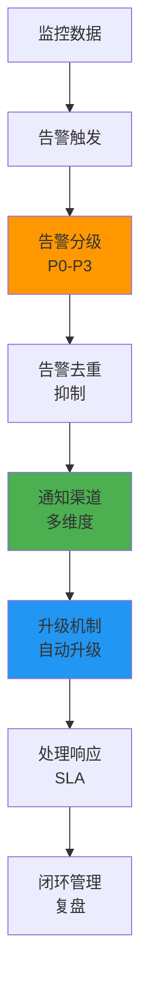

**告警分级与响应策略**

| 级别 | 定义 | 响应时间 | 通知方式 | 升级机制 |
|:----:|------|----------|:----------:|:----------:|
| **P0** | 系统完全不可用 | 立即响应 | 电话+微信+钉钉 | 5分钟未响应升级 |
| **P1** | 关键功能异常 | 10分钟内 | 微信+钉钉 | 15分钟未响应升级 |
| **P2** | 非核心功能异常 | 30分钟内 | 邮件+钉钉 | 1小时未响应升级 |
| **P3** | 信息性提醒 | 24小时内 | 邮件 | 无升级 |

**What - 实战配置与运营**

**Prometheus + Alertmanager 配置示例**：

```yaml
# alertmanager.yml
route:
  group_by: ['alertname']
  group_wait: 30s
  group_interval: 5m
  repeat_interval: 4h
  receiver: 'team-sre'
  routes:
  - match:
      severity: critical
    receiver: 'team-sre-p0'
    group_wait: 10s

receivers:
- name: 'team-sre'
  email_configs:
  - to: 'sre@example.com'
  wechat_configs:
  - corp_id: 'xxx'
    api_url: 'https://qyapi.weixin.qq.com/cgi-bin/'
    to_party: '1'

- name: 'team-sre-p0'
  email_configs:
  - to: 'sre@example.com'
  wechat_configs:
  - corp_id: 'xxx'
    api_url: 'https://qyapi.weixin.qq.com/cgi-bin/'
    to_party: '1'
  pagerduty_configs:
  - service_key: 'xxx'
```

**告警运营最佳实践**：

1. **告警去重**：同一问题5分钟内只触发一次告警
2. **告警抑制**：当主服务宕机时，抑制依赖服务的告警
3. **告警静默**：维护窗口内暂停相关告警
4. **告警聚合**：相似告警合并为一条，减少噪声
5. **定期回顾**：每周分析告警数据，优化规则

**告警工具对比**：

| 工具 | 类型 | 优势 | 适用场景 |
|:----:|------|------|----------|
| **Prometheus+Alertmanager** | 开源 | 灵活强大，生态丰富 | 容器化环境 |
| **Zabbix** | 开源 | 成熟稳定，功能全面 | 传统服务器 |
| **Grafana Alerting** | 开源 | 可视化与告警一体化 | 已有Grafana |
| **PagerDuty** | 商业 | 专业升级机制 | 企业级需求 |
| **夜莺** | 国产 | 轻量化，适合国内 | 中小团队 |

**记忆口诀**：分级定响应，去重防风暴，通知多渠道，升级保及时，复盘促优化

> **面试加分点**：能讲清**告警风暴的成因与解决方案**（如去重、抑制、聚合），以及如何通过**告警SLA**（服务水平协议）量化团队响应能力，证明你有告警体系设计经验。

### 20. top命令中如何显示单独的CPU数据？

**Why - 为什么需要查看单独的CPU数据？**

多核系统中，**CPU负载往往不均衡**。只看平均CPU使用率会掩盖"单核心跑满，其他核心空闲"的问题。查看单独CPU数据能帮你快速定位**哪个核心是性能瓶颈**，是分析服务性能、排查死锁的关键手段。

**How - 查看单CPU数据的方法**

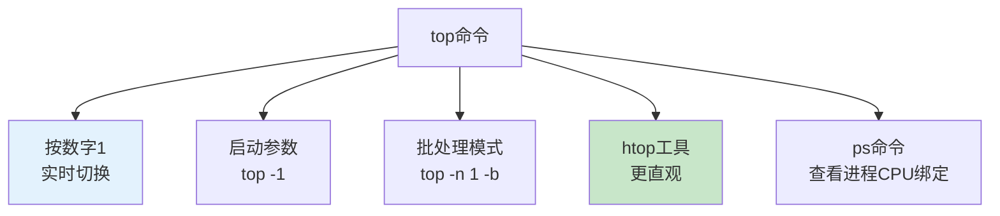

**单CPU数据查看方法对比**

| 方法 | 命令 | 特点 | 适用场景 |
|:----:|------|------|----------|
| **实时切换** | `top` → 按 `1` | 实时交互 | 动态监控 |
| **启动参数** | `top -1` | 直接显示 | 快速查看 |
| **批处理** | `top -n 1 -b  head -20` | 非交互式 | 脚本采集 |
| **htop** | `htop` | 彩色直观 | 日常监控 |
| **进程绑定** | `ps -eo pid,ppid,cmd,psr` | 查看进程CPU | 定位进程 |

**What - 实战命令与分析**

**基本操作**：

```bash
# 1. 启动top并实时切换到多CPU视图
top
# 在界面中按数字1键，即可显示每个CPU核心的详细数据

# 2. 启动时直接显示多CPU视图
top -1

# 3. 批处理模式查看（适合脚本）
top -n 1 -b | head -20
# 输出会包含每个CPU核心的使用率

# 4. 使用htop查看（更直观）
htop
# 默认显示CPU核心列表，颜色区分负载
```

**top命令CPU显示解析**：

```
%Cpu0  :  2.0 us,  1.0 sy,  0.0 ni, 96.0 id,  1.0 wa,  0.0 hi,  0.0 si,  0.0 st
%Cpu1  :  3.0 us,  2.0 sy,  0.0 ni, 94.0 id,  1.0 wa,  0.0 hi,  0.0 si,  0.0 st
```

| 字段 | 含义 | 关注重点 |
|:----:|------|----------|
| **us** | 用户态CPU使用率 | 应用程序消耗 |
| **sy** | 系统态CPU使用率 | 内核消耗 |
| **ni** |  nice调整的CPU使用率 | 低优先级进程 |
| **id** | 空闲CPU百分比 | 系统空闲程度 |
| **wa** | I/O等待CPU使用率 | 磁盘/网络瓶颈 |
| **hi** | 硬中断CPU使用率 | 硬件中断 |
| **si** | 软中断CPU使用率 | 软件中断 |
| **st** | 被虚拟机窃取的CPU | 虚拟化环境 |

**进程CPU绑定查看**：

```bash
# 查看进程运行在哪个CPU核心
ps -eo pid,ppid,cmd,psr | grep -v PID | sort -k4n

# 查看特定进程的CPU绑定
ps -o pid,psr -p <进程ID>

# 强制进程绑定到特定CPU（示例）
taskset -c 0,1 <命令>
```

**top命令常用快捷键**：

| 快捷键 | 功能 |
|:------:|------|
| `1` | 显示/隐藏单个CPU数据 |
| `t` | 切换CPU显示格式 |
| `P` | 按CPU使用率排序进程 |
| `M` | 按内存使用率排序进程 |
| `c` | 显示完整命令路径 |
| `k` | 终止某个进程 |
| `r` | 重新设置进程优先级 |
| `q` | 退出top |

**多核CPU性能分析工具**：

```bash
# 查看CPU核心数
nproc
cat /proc/cpuinfo | grep "processor" | wc -l
lscpu

# 查看CPU频率
cat /proc/cpuinfo | grep MHz
mpstat -P ALL 1  # 实时查看每个核心

# 系统整体负载
uptime
vmstat 1 5  # 查看CPU和内存详细信息
```

**记忆口诀**：top按1看核心，htop更直观，批处理用-b，进程绑定看psr

> **面试加分点**：能解释**CPU使用率中的wa指标**（I/O等待）与系统瓶颈的关系，以及如何通过**taskset**命令进行CPU亲和性调度，证明你有系统性能调优经验。     

    ```sh
     # 查看每个核心的详细使用
     mpstat -P ALL 1

**注意事项**：
- 在虚拟化环境中，CPU使用率可能受宿主机和其他虚拟机影响
- 高iowait值通常表示磁盘I/O存在瓶颈
- 高nice值可能表示有进程被错误地设置了高优先级
- 多核负载不均衡时，需要检查应用程序的线程亲和性设置
- 长时间高CPU使用率可能导致系统过热降频

### 21. 如何做Zabbix的优化？

**Why - 为什么Zabbix需要优化？**

Zabbix在大规模部署时，**监控项数量达到万级以上**就会出现性能瓶颈。CPU飙升、磁盘I/O过高、数据库慢查询都会导致监控延迟，甚至监控系统自身崩溃。优化Zabbix不是可选操作，而是**保障监控系统可靠性的必需步骤**。

**How - Zabbix优化体系**

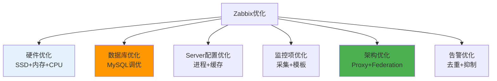

**Zabbix性能瓶颈与解决方案**

| 瓶颈 | 症状 | 解决方案 | 优先级 |
|:----:|------|----------|:------:|
| **CPU** | Poller进程高 | 增加StartPollers，优化SQL | ⭐⭐⭐ |
| **内存** | 缓存不足 | 调整CacheSize，HistoryCacheSize | ⭐⭐ |
| **磁盘I/O** | 写入延迟 | 使用SSD，优化innodb配置 | ⭐⭐⭐ |
| **数据库** | 慢查询 | 分区表，索引优化，清理历史 | ⭐⭐⭐ |
| **网络** | 传输延迟 | 部署Zabbix Proxy，使用主动模式 | ⭐⭐ |

**What - 实战优化配置**

**1. 数据库优化（MySQL）**：

```bash
# my.cnf 关键配置
[mysqld]
innodb_buffer_pool_size = 4G  # 建议总内存的50%
innodb_log_file_size = 1G
innodb_flush_log_at_trx_commit = 2
innodb_file_per_table = 1
max_connections = 1000
query_cache_type = 0
```

**2. Zabbix Server配置**：

```bash
# zabbix_server.conf
StartPollers=64        # 每100台服务器建议8-16个
StartTrappers=16       # 处理主动模式数据
StartPollersUnreachable=16
StartDiscoverers=1
CacheSize=512M         # 缓存大小
HistoryCacheSize=256M  # 历史数据缓存
TrendCacheSize=128M    # 趋势数据缓存
HousekeepingFrequency=1
MaxHousekeeperDelete=5000
```

**3. 监控项优化**：

```bash
# 1. 合并相似监控项（如多个磁盘的使用率）
# 2. 调整采集间隔：重要指标30秒，普通指标5分钟
# 3. 使用主动式监控（Agent主动推送）
zabbix_agent2.conf:
ServerActive=zabbix-server:10051
HostnameItem=system.hostname
```

**4. 架构优化**：

- **部署Zabbix Proxy**：每1000-2000台服务器部署一个Proxy
- **使用Zabbix Federation**：多数据中心场景下实现统一管理
- **分离前端和后端**：前端单独部署，减轻Server压力

**5. 数据保留策略**：

| 数据类型 | 保留时间 | 建议配置 |
|:--------:|----------|----------|
| **历史数据** | 7-30天 | 空间充足可保留更长 |
| **趋势数据** | 1-2年 | 用于长期分析 |
| **事件数据** | 30-90天 | 用于故障复盘 |

**Zabbix自身监控**：

- **Process CPU使用率**：确保Server进程负载正常
- **Queue of waiting processes**：监控队列长度，超过100需要优化
- **Database query times**：查询时间超过1秒需要优化
- **Value cache size**：缓存命中率低于90%需要调整

**记忆口诀**：硬件SSD内存足，数据库分区索引优，Server进程缓存调，Proxy架构主动推，监控项清理间隔准

> **面试加分点**：能说清**Zabbix Proxy的工作原理**（数据缓存和转发），以及如何通过**分区表**和**主动模式**解决大规模部署的性能问题，证明你有Zabbix大规模运维经验。

### 22. 如何做Zabbix的自动化运维？

**Why - 为什么Zabbix需要自动化运维？**

手动管理Zabbix面临三大痛点：**配置漂移、人为错误、扩展性差**。当服务器数量达到数百台时，手动添加主机、配置监控项会消耗大量时间，且容易出错。自动化运维能将监控管理从"手动操作"升级为"代码化管理"，**提高效率的同时保证一致性**。

**How - Zabbix自动化运维体系**

```mermaid
flowchart TD
    A["Zabbix自动化"] --> B["自动注册<br>Agent自发现"]
    A --> C["Ansible部署<br>批量管理"]
    A --> D["API调用<br>程序化操作"]
    A --> E["LLD发现<br>动态监控"]
    A --> F["配置管理<br>Git+CI/CD"]
    A --> G["自动备份<br>灾难恢复"]

    style B fill:#e3f2fd
    style D fill:#ff9800
    style F fill:#4caf50
```

**Zabbix自动化工具链**

| 工具 | 用途 | 核心功能 | 适用场景 |
|:----:|------|----------|:----------|
| **Ansible** | 批量部署 | Agent安装配置 | 新环境初始化 |
| **Zabbix API** | 程序化操作 | 主机/模板管理 | 动态扩缩容 |
| **LLD** | 自动发现 | 端口/文件系统发现 | 动态监控项 |
| **Git** | 配置管理 | 版本控制 | 变更管理 |
| **Jenkins** | CI/CD | 配置部署 | 持续集成 |

**What - 实战自动化方案**

**1. 自动注册配置**：

```bash
# zabbix_agent2.conf 关键配置
ServerActive=zabbix-server:10051  # 主动模式
HostnameItem=system.hostname      # 使用主机名
HostMetadataItem=system.uname      # 元数据用于自动分类
```

**Zabbix Server自动注册规则**：
- 基于HostMetadata匹配模板
- 自动添加到对应主机组
- 配置默认监控项和触发器

**2. Ansible批量部署**：

```yaml
# zabbix-agent部署playbook
- name: 部署Zabbix Agent
  hosts: all
  tasks:
    - name: 安装Zabbix Agent
      package:
        name: zabbix-agent2
        state: present
    
    - name: 配置Zabbix Agent
      template:
        src: zabbix_agent2.conf.j2
        dest: /etc/zabbix/zabbix_agent2.conf
      notify: restart zabbix agent
    
    - name: 启动Zabbix Agent
      service:
        name: zabbix-agent2
        state: started
        enabled: yes
  
  handlers:
    - name: restart zabbix agent
      service:
        name: zabbix-agent2
        state: restarted
```

**3. Zabbix API自动化**：

```python
import requests
import json

def zabbix_api_call(method, params):
    url = "http://zabbix-server/api_jsonrpc.php"
    headers = {"Content-Type": "application/json-rpc"}
    payload = {
        "jsonrpc": "2.0",
        "method": method,
        "params": params,
        "id": 1,
        "auth": auth_token
    }
    response = requests.post(url, data=json.dumps(payload), headers=headers)
    return response.json()

# 登录获取token
login_response = zabbix_api_call("user.login", {
    "user": "Admin",
    "password": "zabbix"
})
auth_token = login_response["result"]

# 批量创建主机
hosts = [
    {"name": "web-01", "ip": "192.168.1.101"},
    {"name": "web-02", "ip": "192.168.1.102"}
]

for host in hosts:
    create_host = zabbix_api_call("host.create", {
        "host": host["name"],
        "interfaces": [{
            "type": 1,
            "main": 1,
            "useip": 1,
            "ip": host["ip"],
            "port": "10050"
        }],
        "groups": [{"groupid": "2"}],  # 服务器组
        "templates": [{"templateid": "10001"}]  # 基础模板
    })
```

**4. 低级别发现（LLD）**：

- **文件系统发现**：自动监控新挂载的磁盘
- **网络接口发现**：自动监控新添加的网卡
- **端口发现**：自动监控新开放的端口
- **进程发现**：自动监控关键进程

**5. 配置管理与CI/CD**：

- **Git管理**：将Zabbix模板、配置文件纳入版本控制
- **CI/CD流水线**：代码提交后自动部署配置变更
- **配置验证**：部署前测试配置有效性

**自动化运维最佳实践**：

1. **监控即代码**：将监控配置视为代码，纳入版本控制
2. **标准化模板**：建立统一的监控模板库
3. **自动备份**：定期备份Zabbix数据库和配置
4. **变更审计**：记录所有配置变更，支持回滚
5. **测试环境**：在测试环境验证自动化脚本

**记忆口诀**：自动注册省手动，Ansible批量部署，API编程自动化，LLD动态发现，Git版本控制，CI/CD流水线

> **面试加分点**：能讲清**Zabbix API的认证机制**（JSON-RPC认证令牌），以及如何通过**LLD+模板**实现动态监控，证明你有Zabbix自动化实战经验。

### 23. 网桥，网关，路由器，集线器，交换器等网络设备有啥区别？

**Why - 为什么需要了解网络设备的区别？**

网络设备是网络架构的"积木"，不同设备在**OSI层次、转发机制、带宽利用**等方面有本质区别。选错设备会导致网络性能瓶颈、安全风险或架构缺陷。SRE工程师必须掌握这些设备的特点，才能设计出**高效、可靠的网络架构**。

**How - 网络设备工作原理对比**

```mermaid
flowchart TD
    A["网络设备"] --> B["物理层<br>集线器"]
    A --> C["数据链路层<br>交换机/网桥"]
    A --> D["网络层<br>路由器"]
    A --> E["应用层<br>网关"]

    B --> B1["广播转发<br>共享带宽"]
    C --> C1["MAC地址转发<br>独占带宽"]
    D --> D1["IP路由转发<br>隔离广播域"]
    E --> E1["协议转换<br>异构网络互联"]

    style B fill:#ffebee
    style C fill:#e3f2fd
    style D fill:#c8e6c9
    style E fill:#fff3e0
```

**网络设备核心对比**

| 设备 | 工作层次 | 转发依据 | 带宽模式 | 广播域 | 主要功能 | 典型应用 |
|:----:|:--------:|:----------:|:----------:|:--------:|:----------:|:----------|
| **集线器** | 物理层 | 无（广播） | 共享 | 同一个 | 信号放大 | 小型临时网络 |
| **交换机** | 数据链路层 | MAC地址表 | 独占（端口） | 同一个 | 帧转发 | 局域网内部 |
| **网桥** | 数据链路层 | MAC地址表 | 共享（网段） | 隔离 | 网段隔离 | 局域网分段 |
| **路由器** | 网络层 | 路由表 | 独占（端口） | 隔离 | 路由选择 | 网络边界 |
| **网关** | 应用层 | 协议映射 | 视设备而定 | 隔离 | 协议转换 | 异构网络互联 |

**What - 设备特性与应用场景**

**1. 集线器（Hub）**：

- **工作原理**：物理层设备，接收信号后放大并广播到所有端口
- **特点**：所有设备共享同一带宽，容易产生广播风暴
- **应用场景**：小型临时网络，已逐渐被交换机取代
- **缺点**：安全性低，带宽利用率差

**2. 交换机（Switch）**：

- **工作原理**：数据链路层设备，学习并维护MAC地址表，基于MAC地址转发
- **特点**：每个端口独占带宽，支持VLAN、STP等高级功能
- **应用场景**：局域网内部连接，企业网络核心
- **优势**：高带宽、低延迟、支持复杂网络拓扑

**3. 网桥（Bridge）**：

- **工作原理**：数据链路层设备，连接两个或多个网段，基于MAC地址转发
- **特点**：隔离广播域，减少广播流量
- **应用场景**：局域网分段，连接不同物理网段
- **优势**：简单易用，成本低

**4. 路由器（Router）**：

- **工作原理**：网络层设备，基于IP地址进行路由选择，维护路由表
- **特点**：隔离广播域，支持NAT、ACL等安全功能
- **应用场景**：网络边界，连接不同网络
- **优势**：智能路由，安全隔离

**5. 网关（Gateway）**：

- **工作原理**：应用层设备，实现不同协议之间的转换
- **特点**：协议映射，异构网络互联
- **应用场景**：企业内网与互联网连接，不同协议网络互联
- **优势**：支持多协议，灵活适配

**网络设备选择指南**：

| 场景 | 推荐设备 | 选型理由 |
|:----:|:--------:|:----------|
| 办公室局域网 | 交换机 | 高带宽，支持VLAN |
| 网络边界 | 路由器 | 安全隔离，路由选择 |
| 异构网络互联 | 网关 | 协议转换 |
| 小型临时网络 | 集线器 | 成本低，简单易用 |
| 网段隔离 | 网桥 | 减少广播风暴 |

**记忆口诀**：物理层集线器广播，数据链路交换机MAC，网络层路由器IP，应用层网关协议转

> **面试加分点**：能解释**交换机的MAC地址学习机制**（收到帧后记录源MAC和端口），以及**路由器的路由表更新原理**（距离矢量/链路状态协议），证明你有网络设备深入理解。

**网络设备选型建议**：

- **小型网络**（<50台设备）：使用二层交换机 + 宽带路由器
- **中型网络**（50-500台设备）：使用三层交换机 + 企业级路由器
- **大型网络**（>500台设备）：使用核心-汇聚-接入三层架构

**网络设备维护要点**：

- **配置管理**：使用版本控制系统管理设备配置
- **监控**：监控设备状态、端口利用率、链路质量
- **安全**：实施访问控制、定期更新固件、配置ACL
- **冗余**：配置链路聚合、VRRP等冗余机制
- **性能优化**：调整缓冲区大小、优化路由表

**网络设备常见故障排查**：

- **连接问题**：检查物理连接、端口状态、VLAN配置
- **性能问题**：检查带宽利用率、CPU/内存使用率、流量异常
- **安全问题**：检查访问控制列表、异常流量、入侵检测
- **配置问题**：检查路由配置、NAT规则、VLAN设置

**注意事项**：
- 不同网络设备的工作层次决定了它们的功能范围
- 选择设备时要考虑网络规模、性能需求和预算
- 合理规划网络拓扑，避免单点故障
- 定期进行设备维护和配置备份
- 关注网络安全，实施多层次防护策略

### 24. Redis是单线程的吗？

**Why - 为什么需要理解Redis的线程模型？**

Redis的性能神话与其线程模型密切相关。**单线程设计让Redis避免了锁竞争和上下文切换**，但也意味着它有特定的性能瓶颈。了解Redis的线程模型，能帮你**合理使用Redis、避开性能陷阱、优化架构设计**。

**How - Redis线程模型深度解析**

```mermaid
flowchart TD
    A["Redis线程模型"] --> B["核心线程<br>单线程事件循环"]
    A --> C["后台线程<br>异步任务"]
    A --> D["子进程<br>持久化操作"]
    A --> E["Redis 6.0+<br>多线程I/O"]

    B --> B1["网络I/O<br>命令执行"]
    C --> C1["AOF刷盘<br>Lazy Free"]
    D --> D1["RDB快照<br>AOF重写"]
    E --> E1["网络读写<br>命令执行仍单线程"]

    style B fill:#e3f2fd
    style C fill:#c8e6c9
    style D fill:#fff3e0
    style E fill:#ffebee
```

**Redis线程模型演进**

| 版本 | 核心线程 | 后台线程 | 子进程 | 多线程I/O | 特点 |
|:----:|:--------:|:----------:|:--------:|:----------:|:----------|
| **Redis 3.x** | 单线程 | 无 | 有 | 无 | 纯单线程 |
| **Redis 4.x** | 单线程 | 有（Lazy Free） | 有 | 无 | 引入后台线程 |
| **Redis 6.0+** | 单线程 | 有 | 有 | 可选 | 多线程I/O |

**What - 实战优化与最佳实践**

**核心线程（单线程）负责**：
- 网络I/O（客户端连接）
- 命令解析与执行
- 内存数据操作
- 事件循环处理

**后台线程（多线程）负责**：
- AOF持久化异步刷盘
- 异步删除（Lazy Free）
- 客户端超时检测
- 内存序列化/反序列化

**子进程负责**：
- RDB快照生成（bgsave）
- AOF重写（bgrewriteaof）

**Redis 6.0+多线程I/O配置**：

```bash
# redis.conf
io-threads 4            # 线程数（建议为CPU核心数）
io-threads-do-reading yes  # 开启多线程读
```

**性能优化建议**：

1. **避免阻塞命令**：
   - 使用 `SCAN` 替代 `KEYS`
   - 使用 `UNLINK` 替代 `DEL`（大键删除）
   - 避免 `SMEMBERS`、`FLUSHALL` 等阻塞命令

2. **合理使用数据结构**：
   - **String**：存储少量数据，value < 10KB
   - **Hash**：存储对象，field数量 < 1000
   - **List**：适合队列，控制长度
   - **Set**：适合去重和交集运算
   - **Sorted Set**：适合排行榜，控制成员数量

3. **内存优化**：
   - 设置 `maxmemory` 和过期策略
   - 启用压缩数据结构（ziplist、intset）
   - 定期执行 `memory碎片整理`（activedefrag）

4. **持久化策略**：
   - 生产环境推荐 AOF + RDB 混合持久化
   - AOF刷盘策略：`everysec`（平衡性能和安全）
   - RDB快照：合理设置频率，避免频繁fork

**常见问题排查**：

| 症状 | 可能原因 | 解决方案 |
|:----:|:--------:|:----------|
| **CPU使用率低但响应慢** | 慢查询或阻塞命令 | 检查slowlog，优化命令 |
| **内存使用率过高** | 数据过期策略不合理 | 调整expire和maxmemory |
| **持久化失败** | 磁盘I/O或fork失败 | 检查磁盘空间和内存 |
| **连接数过多** | 客户端连接管理不当 | 调整timeout和maxclients |

**记忆口诀**：核心单线程，后台多线程，持久化子进程，6.0加I/O线程

> **面试加分点**：能解释**Redis为什么选择单线程**（避免锁竞争、上下文切换），以及**Redis 6.0引入多线程I/O的原因**（提升网络读写性能），证明你对Redis内部机制有深入理解。

- **Redis 6.2**：稳定版本，支持多线程I/O
- **Redis 7.0**：更多新特性，性能进一步优化
- 生产环境建议使用Redis Cluster或Redis Sentinel保证高可用

**注意事项**：
- Redis的核心处理是单线程，但后台有多线程处理其他任务
- 需要辩证地理解"单线程"的概念
- 避免在生产环境使用阻塞命令
- 根据业务场景选择合适的数据结构和持久化策略
- 定期监控Redis性能指标，及时发现和处理问题

### 25. Redis在什么场景下使用？

**Why - 为什么Redis成为互联网架构的标配？**

Redis的**高性能、丰富的数据结构、持久化能力**使其成为解决高并发场景的利器。在秒杀、直播、电商等业务中，Redis能显著提升系统响应速度，减轻数据库压力，是构建**高可用、低延迟**系统的关键组件。

**How - Redis核心应用场景**

```mermaid
flowchart TD
    A["Redis应用场景"] --> B["缓存场景<br>性能加速"]
    A --> C["会话存储<br>分布式会话"]
    A --> D["消息队列<br>异步处理"]
    A --> E["排行榜/计数器<br>实时统计"]
    A --> F["分布式锁<br>资源互斥"]
    A --> G["实时分析<br>数据统计"]
    A --> H["位图应用<br>空间优化"]

    style B fill:#e3f2fd
    style C fill:#c8e6c9
    style D fill:#fff3e0
    style E fill:#ffebee
    style F fill:#f3e5f5
    style G fill:#e8f5e8
    style H fill:#fffde7
```

**Redis场景与数据结构对应关系**

| 场景 | 推荐数据结构 | 核心命令 | 优势 |
|:----:|:------------:|:----------:|:------|
| **缓存** | String/Hash | SET/GET/HSET | 高性能，支持过期 |
| **会话存储** | Hash | HSET/EXPIRE | 结构化存储，TTL管理 |
| **消息队列** | List | LPUSH/BRPOP | 简单可靠，支持阻塞 |
| **排行榜** | Sorted Set | ZINCRBY/ZREVRANGE | 自动排序，实时更新 |
| **分布式锁** | String | SET NX EX | 原子操作，自动过期 |
| **实时分析** | Hash/Set | HINCRBY/SADD | 高频更新，统计便捷 |
| **位图** | String（位图） | SETBIT/BITCOUNT | 空间效率高，操作快速 |

**What - 实战场景与代码**

**1. 缓存场景**：

```bash
# 商品详情缓存，30分钟过期
SET product:detail:1001 '{"id":1001,"name":"iPhone 15","price":6999}' EX 1800

# 获取缓存
GET product:detail:1001

# 缓存预热（批量设置）
MSET product:detail:1001 '{...}' product:detail:1002 '{...}'
```

**2. 会话存储**：

```bash
# 存储用户会话信息
HSET user:session:12345 \
    username "admin" \
    email "admin@example.com" \
    login_time "2024-01-01 10:00:00"

# 设置过期时间
EXPIRE user:session:12345 3600

# 检查会话是否存在
EXISTS user:session:12345
```

**3. 消息队列**：

```bash
# 生产者：添加任务
LPUSH task:async '{"task_id":"001","type":"send_email","data":"..."}'

# 消费者：阻塞获取任务
BRPOP task:async 0

# 延迟队列（使用Sorted Set）
ZADD delay:queue $(date +%s + 3600) '{"task":"cleanup"}'
```

**4. 排行榜**：

```bash
# 增加用户积分
ZINCRBY game:rankings 100 "player_001"
ZINCRBY game:rankings 50 "player_002"

# 获取Top10玩家
ZREVRANGE game:rankings 0 9 WITHSCORES

# 获取玩家排名
ZREVRANK game:rankings "player_001"
```

**5. 分布式锁**：

```bash
# 获取锁（NX：不存在才设置，EX：过期时间）
SET lock:order:10001 "lock_holder_123" NX EX 30

# 释放锁（使用Lua脚本保证原子性）
EVAL "if redis.call('get', KEYS[1]) == ARGV[1] then return redis.call('del', KEYS[1]) else return 0 end" \
1 lock:order:10001 "lock_holder_123"
```

**6. 实时分析**：

```bash
# 统计页面访问量
HINCRBY stats:page:home pv 1
HINCRBY stats:page:home uv 1

# 统计在线用户
SADD online:users "user_123"
SCARD online:users
```

**7. 位图应用**：

```bash
# 用户签到（第12天）
SETBIT user:sign:2024:01 11 1

# 统计当月签到天数
BITCOUNT user:sign:2024:01

# 检查某天是否签到
GETBIT user:sign:2024:01 11
```

**Redis场景选择指南**：

| 业务需求 | 推荐场景 | 注意事项 |
|:--------:|:----------:|:----------|
| 减轻数据库压力 | 缓存 | 设置合理过期时间，考虑缓存穿透 |
| 分布式系统会话 | 会话存储 | 使用Redis Cluster保证高可用 |
| 异步任务处理 | 消息队列 | 考虑消息丢失和重复消费 |
| 实时排名统计 | 排行榜 | 控制数据规模，避免内存占用过大 |
| 分布式协调 | 分布式锁 | 处理锁超时和释放问题 |
| 高频统计 | 实时分析 | 使用合适的数据结构减少内存 |
| 空间敏感数据 | 位图 | 适用于布尔型数据的密集存储 |

**记忆口诀**：缓存String Hash，会话Hash过期，队列List阻塞，排行ZSet排序，锁String NX，分析Hash Set，位图SETBIT

> **面试加分点**：能解释**缓存穿透、缓存击穿、缓存雪崩**的区别及解决方案，以及如何通过**Redis Cluster**和**Sentinel**保证高可用，证明你有Redis生产实践经验。

- **发布/订阅**：
  - 实时消息推送
  - 直播间弹幕
  - 系统事件通知
  - 示例：
    

    ```bash
        # 订阅频道
        SUBSCRIBE system:notifications
    
        # 发布消息
        PUBLISH system:notifications '{"type":"alert","msg":"系统负载过高"}'
    ```

**Redis不适合的场景**：

- **大规模数据存储**：Redis是内存数据库，存储成本高，不适合存储海量数据
- **复杂查询**：Redis不支持SQL查询，不适合需要复杂查询的场景
- **强事务要求**：Redis的事务能力有限，不适合强一致性要求的场景
- **持久化要求高**：虽然Redis支持持久化，但不适合作为唯一的数据存储

**Redis使用注意事项**：

- **数据安全**：合理配置持久化策略，AOF + RDB混合使用
- **内存管理**：设置maxmemory，防止内存溢出
- **性能监控**：监控内存使用、命令延迟、连接数等指标
- **高可用**：生产环境使用Redis Sentinel或Redis Cluster
- **安全加固**：设置密码、禁用危险命令、限制IP访问

**常见架构方案**：

- **Redis + MySQL**：Redis作为缓存层，MySQL存储持久化数据
- **Redis Sentinel**：主从自动切换，保证高可用
- **Redis Cluster**：数据分片，支持大规模数据存储
- **Codis/Cluster**：Proxy方案，支持跨机房部署

**注意事项**：
- 根据业务场景选择合适的数据结构
- 合理设置过期时间，避免内存浪费
- 生产环境必须配置持久化和高可用
- 避免存储过大的value，建议控制在10KB以内
- 定期进行容量规划和性能评估

### 26. 缓存击穿、缓存穿透、缓存雪崩、缓存宕机是什么？怎么处理？

> 🎯 **核心目标**：掌握四大缓存问题的识别与解决方案

**问题分析**：缓存问题是高并发系统的常见挑战，了解这四大问题的成因和应对策略，对于保障系统稳定性至关重要。

---

**四大缓存问题对比**：

| 问题 | 描述 | 原因 | 影响 | 解决方案 |
|------|------|------|------|----------|
| **缓存击穿** | 热点key过期，大量请求打数据库 | 热点数据过期 | 数据库压力激增 | 互斥锁、永不过期、逻辑过期 |
| **缓存穿透** | 查询不存在数据，缓存和数据库都没有 | 恶意攻击、参数校验不当 | 无效请求消耗数据库资源 | 布隆过滤器、空值缓存、参数校验 |
| **缓存雪崩** | 大量key同时过期，请求集中打数据库 | 缓存服务宕机、集中过期 | 数据库压力骤增，可能级联故障 | 过期时间随机化、多级缓存、熔断限流 |
| **缓存宕机** | 缓存服务整体不可用 | 硬件故障、网络中断 | 数据库承受全部流量 | 熔断机制、本地缓存、数据库限流 |

---

**缓存问题处理流程**：

```mermaid
flowchart TD
    A[发现问题] --> B[快速止血]
    B --> C[问题定位]
    C --> D[彻底解决]
    D --> E[复盘总结]
    
    B -->|缓存击穿| F[临时禁用过期]
    B -->|缓存穿透| G[启用黑名单]
    B -->|缓存雪崩| H[快速扩容]
    B -->|缓存宕机| I[启用熔断]
    
    F --> C
    G --> C
    H --> C
    I --> C
```

---

**解决方案详解**：

**1. 缓存击穿**
- **问题**：热点key突然过期，导致大量并发请求直接打到数据库
- **解决方案**：
  - 互斥锁：只允许一个请求查询数据库并更新缓存
  - 热点数据永不过期：设置较长过期时间，定期异步更新
  - 逻辑过期：缓存不设置过期时间，逻辑过期后异步更新

```python
# 互斥锁实现
def get_data(key):
    cache = redis.get(key)
    if cache:
        return cache
    
    # 尝试获取锁
    lock = redis.set(f"lock:{key}", "1", nx=True, ex=10)
    if lock:
        # 获取到锁，从数据库查询
        data = db.query(key)
        redis.setex(key, 3600, data)
        redis.delete(f"lock:{key}")
        return data
    else:
        # 未获取到锁，短暂等待后重试
        time.sleep(0.1)
        return get_data(key)
```

**2. 缓存穿透**
- **问题**：查询不存在的数据，缓存和数据库都没有
- **解决方案**：
  - 布隆过滤器：快速判断数据是否存在
  - 空值缓存：对查询结果为空的数据也进行缓存
  - 参数校验：加强请求参数校验，过滤非法请求

```python
# 布隆过滤器实现
from bloom_filter import BloomFilter

bloom = BloomFilter(max_elements=1000000, error_rate=0.01)

def get_data(key):
    # 先检查布隆过滤器
    if key not in bloom:
        return None  # 一定不存在，直接返回
    
    # 布隆过滤器存在，可能存在，再查缓存和数据库
    cache = redis.get(key)
    if cache:
        return cache
    
    data = db.query(key)
    if data:
        redis.setex(key, 3600, data)
    else:
        # 空值也缓存，防止穿透
        redis.setex(key, 60, "NULL")
    
    return data
```

**3. 缓存雪崩**
- **问题**：大量缓存key同时过期，导致请求集中打到数据库
- **解决方案**：
  - 过期时间随机化：避免同时过期
  - 多级缓存：本地缓存 + Redis + MySQL
  - 熔断限流：保护数据库
  - 高可用架构：Redis Sentinel或Cluster

```python
# 过期时间随机化
def set_cache(key, value, base_expire=3600):
    # 过期时间 = 基础时间 + 随机时间（0-600秒）
    expire = base_expire + random.randint(0, 600)
    redis.setex(key, expire, value)
```

**4. 缓存宕机**
- **问题**：缓存服务整体不可用，所有请求直接打到数据库
- **解决方案**：
  - 熔断机制：缓存不可用时，自动切换到数据库直查
  - 本地缓存：热点数据存储在应用本地内存
  - 数据库限流：保护数据库不被压垮
  - 异步修复：缓存恢复后，异步预热数据

```python
# 熔断机制实现
class CircuitBreaker:
    def __init__(self, failure_threshold=5, timeout=60):
        self.failure_count = 0
        self.failure_threshold = failure_threshold
        self.timeout = timeout
        self.state = "CLOSED"
    
    def call(self, func):
        if self.state == "OPEN":
            # 熔断开启，直接查数据库
            return db_query_direct()
        
        try:
            result = func()
            self.failure_count = 0
            return result
        except:
            self.failure_count += 1
            if self.failure_count >= self.failure_threshold:
                self.state = "OPEN"
            return db_query_direct()
```

---

**缓存高可用设计原则**：

| 原则 | 说明 | 实施方法 |
|------|------|----------|
| **数据一致性** | 缓存与数据库数据保持一致 | 双写模式、异步更新 |
| **可用性优先** | 保证服务可用，适度容忍数据不一致 | 降级策略、熔断机制 |
| **隔离保护** | 重要业务单独部署缓存 | 独立Redis实例、网络隔离 |
| **容量规划** | 根据业务量合理规划缓存容量 | 监控内存使用、定期评估 |
| **监控告警** | 完善缓存相关指标监控 | 内存使用率、命中率、延迟 |

---

**💡 记忆口诀**：

> **缓存四问题**：击穿热点过期，穿透查不存在，雪崩集中过期，宕机服务不可
> **解决方案**：击穿用锁永不过期，穿透布隆空值缓存，雪崩随机多级熔断，宕机本地熔断限流

**面试加分话术**：

> "缓存问题是高并发系统的常见挑战，需要针对性处理。对于缓存击穿，我会使用互斥锁或热点数据永不过期；对于缓存穿透，使用布隆过滤器和空值缓存；对于缓存雪崩，采用过期时间随机化和多级缓存；对于缓存宕机，实施熔断机制和本地缓存。同时，完善监控告警体系，及时发现并处理缓存异常，确保系统稳定性。"

### 27. 你Redis做了哪些优化？

**Why - 为什么Redis优化是SRE的核心工作？**

Redis作为高并发系统的"性能核心"，**其性能直接决定了整个系统的响应速度**。不合理的配置可能导致内存溢出、性能瓶颈或服务宕机。SRE工程师必须通过系统性优化，让Redis发挥最大性能，同时保证稳定性。

**How - Redis优化体系**

```mermaid
flowchart TD
    A["Redis优化"] --> B["内存优化<br>数据结构+配置"]
    A --> C["性能优化<br>命令+IO"]
    A --> D["高可用优化<br>主从+集群"]
    A --> E["持久化优化<br>RDB+AOF"]
    A --> F["监控优化<br>指标+告警"]

    style B fill:#e3f2fd
    style C fill:#c8e6c9
    style D fill:#fff3e0
    style E fill:#ffebee
    style F fill:#f3e5f5
```

**Redis优化措施对比**

| 优化维度 | 具体措施 | 预期效果 | 优先级 |
|:--------:|:----------:|:----------:|:--------:|
| **内存** | 数据结构选择、压缩、淘汰策略 | 减少内存使用 | ⭐⭐⭐ |
| **性能** | 命令优化、慢查询处理、多线程I/O | 提升响应速度 | ⭐⭐⭐ |
| **高可用** | 主从复制、哨兵、集群 | 保证服务可用性 | ⭐⭐⭐ |
| **持久化** | RDB/AOF配置、混合持久化 | 数据安全与性能平衡 | ⭐⭐ |
| **监控** | 关键指标监控、告警设置 | 及时发现问题 | ⭐⭐ |

**What - 实战优化配置**

**1. 内存优化**：

```bash
# redis.conf 内存相关配置
maxmemory 4G                # 最大内存
maxmemory-policy volatile-lru  # 淘汰策略

# 压缩数据结构配置
hash-max-ziplist-entries 512
hash-max-ziplist-value 64
list-max-ziplist-size -2
set-max-intset-entries 512

# 系统内存优化
echo 1 > /proc/sys/vm/overcommit_memory  # 允许内存超分配
echo never > /sys/kernel/mm/transparent_hugepage/enabled  # 关闭透明大页
```

**2. 性能优化**：

```bash
# 命令优化
# 1. 避免使用阻塞命令：KEYS、FLUSHALL、FLUSHDB
# 2. 大键删除使用 UNLINK 代替 DEL
# 3. 遍历使用 SCAN 代替 KEYS
# 4. 批量操作使用 Pipeline

# 慢查询配置
slowlog-log-slower-than 10000  # 10ms以上为慢查询
slowlog-max-len 1000          # 慢查询日志长度

# Redis 6.0+ 多线程I/O
io-threads 4                  # 线程数
io-threads-do-reading yes     # 开启多线程读

# 网络优化
tcp-keepalive 300
maxclients 10000
echo 65535 > /proc/sys/net/core/somaxconn  # 提高连接队列
```

**3. 高可用优化**：

```bash
# 主从复制配置（从节点）
replicaof 192.168.1.100 6379
replica-read-only yes
repl-backlog-size 1G       # 复制缓冲区

# 哨兵配置（sentinel.conf）
sentinel monitor mymaster 192.168.1.100 6379 2
sentinel down-after-milliseconds mymaster 30000
sentinel failover-timeout mymaster 180000

# 集群配置
# 1. 至少3个主节点
# 2. 每个主节点至少1个从节点
# 3. 使用 redis-cli --cluster create 创建集群
```

**4. 持久化优化**：

```bash
# RDB配置
save 900 1
save 300 10
save 60 10000

# AOF配置
appendonly yes
appendfsync everysec  # 每秒刷盘
auto-aof-rewrite-percentage 100
auto-aof-rewrite-min-size 64mb

# 混合持久化
aof-use-rdb-preamble yes
```

**5. 监控优化**：

```bash
# 关键监控指标
# 1. 内存使用率：used_memory_rss / 系统内存
# 2. 命令延迟：latency monitor
# 3. 连接数：connected_clients
# 4. 复制延迟：master_repl_offset - slave_repl_offset
# 5. 持久化状态：aof_last_write_status

# 告警阈值设置
# - 内存使用率 > 80%
# - 命令延迟 > 100ms
# - 连接数 > 8000
# - 复制延迟 > 10s
```

**Redis优化最佳实践**：

1. **数据结构选择**：根据业务场景选择合适的数据结构
   - **String**：小数据存储，value < 10KB
   - **Hash**：对象存储，field数量 < 1000
   - **List**：队列场景，控制长度
   - **Set**：去重和交集运算
   - **Sorted Set**：排行榜和范围查询

2. **命令使用规范**：
   - 避免阻塞命令
   - 合理使用Pipeline
   - 批量操作控制大小
   - 监控慢查询

3. **容量规划**：
   - 根据业务量预估内存需求
   - 预留30%内存空间
   - 定期进行内存碎片整理

4. **高可用架构**：
   - 生产环境使用Redis Cluster
   - 配置合适的从节点数量
   - 定期演练故障转移

**记忆口诀**：内存结构选对，命令优化到位，高可用要配置，持久化平衡，监控告警必备

> **面试加分点**：能详细说明**Redis Cluster的槽位分布**（16384个槽）和**故障转移机制**，以及如何通过**内存分析工具**（redis-cli --bigkeys）识别大键，证明你有Redis深度优化经验。
    - 避免在Redis中执行复杂计算
    - 考虑使用Lua脚本批量处理
- 案例3：缓存雪崩：
  - 问题：大量key同时过期，数据库压力骤增
  - 解决方案：
    - 过期时间随机化
    - 实施多级缓存
    - 热点数据永不过期
    - 配置熔断机制

**Redis版本选择与升级**：
- 版本选择：
  - 生产环境推荐使用Redis 6.2+或7.0+
  - 新特性：多线程I/O、客户端缓存、ACL权限管理
- 升级策略：
  - 先在测试环境验证
  - 采用滚动升级，避免服务中断
  - 升级前备份数据

**注意事项**：
- 优化要根据业务场景进行，没有通用的最佳方案
- 每次优化后要进行性能测试，确保效果
- 建立完善的监控体系，及时发现问题
- 定期进行Redis性能评估和容量规划
- 制定Redis故障应急预案

### 28. 你们公司的RDB文件备份策略是什么？

**Why - 为什么RDB备份策略如此重要？**

数据是企业的核心资产，**RDB备份是Redis数据安全的最后一道防线**。合理的RDB备份策略不仅能防止数据丢失，还能在灾难发生时快速恢复业务，保障系统的高可用性。

**How - RDB备份策略设计**

```mermaid
flowchart TD
    A["RDB备份策略"] --> B["配置层面<br>自动快照策略"]
    A --> C["存储层面<br>本地+异地"]
    A --> D["验证层面<br>定期演练"]
    A --> E["工具层面<br>备份工具"]

    B --> B1["save 3600 1 300 100 60 10000"]
    C --> C1["本地备份: 多版本保留"]
    C --> C2["异地备份: 远程存储"]
    D --> D1["每月恢复演练"]
    E --> E1["redis-cli/BGSAVE"]
    E --> E2["redis-shake/rdb-tools"]

    style B fill:#e3f2fd
    style C fill:#c8e6c9
    style D fill:#fff3e0
    style E fill:#ffebee
```

**RDB备份策略配置**

| 配置项 | 含义 | 建议值 | 适用场景 |
|:-------:|:------:|:--------:|:----------|
| **save** | 快照触发条件 | 3600 1 300 100 60 10000 | 平衡性能和安全 |
| **rdbcompression** | RDB压缩 | yes | 减少存储占用 |
| **rdbchecksum** | 校验和 | yes | 确保文件完整性 |
| **dbfilename** | 文件名 | dump.rdb | 规范命名 |
| **dir** | 存储目录 | /var/lib/redis | 独立分区 |

**What - 实战备份方案**

**1. 自动快照配置**：

```bash
# redis.conf 配置
# 1小时1次写操作、5分钟100次写操作、1分钟10000次写操作触发快照
save 3600 1 300 100 60 10000

# 开启压缩和校验
rdbcompression yes
rdbchecksum yes
```

**2. 本地备份脚本**：

```bash
#!/bin/bash
# 保留最近7天的RDB备份
REDIS_DIR="/var/lib/redis"
BACKUP_DIR="/backup/redis"

# 手动触发BGSAVE
redis-cli BGSAVE

# 等待备份完成
sleep 10

# 复制并归档
DATE=$(date +%Y%m%d%H%M%S)
cp ${REDIS_DIR}/dump.rdb ${BACKUP_DIR}/dump.rdb.${DATE}

# 清理7天前的备份
find ${BACKUP_DIR} -name "dump.rdb.*" -mtime +7 -delete
```

**3. 异地备份**：

```bash
# 使用rsync同步到远程服务器
rsync -avz /backup/redis/ backup@remote-server:/backup/redis/ --delete

# 或者使用对象存储
aws s3 cp /backup/redis/dump.rdb.${DATE} s3://redis-backup/
```

**4. 备份恢复演练**：

```bash
# 1. 停止Redis服务
systemctl stop redis

# 2. 备份当前数据
cp /var/lib/redis/dump.rdb /var/lib/redis/dump.rdb.bak

# 3. 恢复备份
cp /backup/redis/dump.rdb.20240101000000 /var/lib/redis/dump.rdb

# 4. 启动Redis
systemctl start redis

# 5. 验证数据完整性
redis-cli keys "*"
redis-cli dbsize
```

**RDB备份最佳实践**：

1. **混合持久化**：开启AOF作为RDB的补充，提高数据安全性
2. **多版本备份**：保留多个时间点的备份，应对数据损坏
3. **异地存储**：防止本地灾难导致备份丢失
4. **定期演练**：每月至少一次恢复演练，确保备份可用
5. **监控告警**：监控RDB生成状态，及时发现备份失败

**记忆口诀**：配置合理触发，本地异地存储，定期演练验证，监控告警保护

> **面试加分点**：能详细说明**copy-on-write机制**在RDB中的应用，以及如何通过**rdb-tools**分析RDB文件内容，证明你对Redis持久化机制有深入理解。

### 29. RDB和AOF备份的区别是啥？

**Why - 为什么要理解RDB和AOF的区别？**

选择合适的持久化策略是Redis运维的关键决策。**RDB和AOF各有优缺点**，理解它们的区别能帮助你根据业务场景选择最佳方案，在数据安全性和性能之间找到平衡点。

**How - RDB与AOF核心区别**

```mermaid
flowchart TD
    A["持久化方式"] --> B["RDB<br>定时快照"]
    A --> C["AOF<br>命令日志"]
    A --> D["混合持久化<br>两者结合"]

    B --> B1["文件小<br>恢复快"]
    B --> B2["可能丢数据"]
    C --> C1["数据安全<br>实时性高"]
    C --> C2["文件大<br>恢复慢"]
    D --> D1["RDB开头+AOF追加"]
    D --> D2["兼顾安全和性能"]

    style B fill:#e3f2fd
    style C fill:#c8e6c9
    style D fill:#fff3e0
```

**RDB与AOF对比表**

| 特性 | RDB | AOF | 混合持久化 |
|:------:|:------:|:------:|:------------:|
| **实现方式** | 定时生成数据快照 | 记录所有写操作命令 | RDB开头 + AOF追加 |
| **文件大小** | 紧凑（二进制） | 较大（文本命令） | 适中 |
| **恢复速度** | 快（直接加载） | 慢（重放命令） | 较快 |
| **数据安全性** | 可能丢失上次快照后的数据 | 取决于刷盘策略 | 高 |
| **性能影响** | fork子进程，低 | 持续写入，有一定影响 | 平衡 |
| **适用场景** | 定时备份、灾难恢复 | 数据安全性要求高 | 生产环境推荐 |

**What - 实战配置与选择**

**1. RDB配置**：

```bash
# redis.conf
# 1小时1次写操作、5分钟100次写操作、1分钟10000次写操作触发快照
save 3600 1 300 100 60 10000
rdbcompression yes  # 开启压缩
rdbchecksum yes     # 开启校验
```

**2. AOF配置**：

```bash
# redis.conf
appendonly yes                   # 开启AOF
appendfsync everysec             # 每秒刷盘（推荐）
auto-aof-rewrite-percentage 100  # 重写触发条件
auto-aof-rewrite-min-size 64mb   # 最小重写大小
```

**3. 混合持久化配置**：

```bash
# redis.conf
appendonly yes
appendfsync everysec
aof-use-rdb-preamble yes  # 开启混合持久化
```

**AOF刷盘策略对比**

| 策略 | 数据安全性 | 性能影响 | 适用场景 |
|:------:|:------------:|:----------:|:----------|
| **always** | 最高（无数据丢失） | 最低 | 金融交易等核心业务 |
| **everysec** | 较高（最多丢失1秒数据） | 中等 | 一般生产环境 |
| **no** | 最低（取决于OS） | 最高 | 性能优先场景 |

**最佳实践建议**：

1. **生产环境**：使用混合持久化（aof-use-rdb-preamble yes）
2. **数据安全性**：AOF + everysec 刷盘策略
3. **性能要求**：RDB + 适当调整快照频率
4. **备份策略**：
   - RDB：每小时/每天全量备份，用于灾难恢复
   - AOF：实时备份，用于快速恢复
   - 异地存储：防止本地灾难

**记忆口诀**：RDB快照快，AOF安全高，混合持久化，生产环境好

> **面试加分点**：能详细说明**AOF重写机制**（避免日志膨胀）和**混合持久化的实现原理**（RDB开头+AOF追加），证明你对Redis持久化机制有深入理解。

### 30. Redis的工作模式有哪些？

> 🎯 **核心目标**：掌握Redis不同工作模式的特点和适用场景

**问题分析**：Redis提供多种工作模式，从单机到集群，满足不同规模和高可用需求。

---

**Redis工作模式对比**：

| 模式 | 架构 | 核心特点 | 适用场景 |
|------|------|----------|----------|
| **单机模式** | 单节点 | 部署简单，无HA | 开发测试环境 |
| **主从复制** | 一主多从 | 读写分离，手动故障切换 | 读多写少场景 |
| **主从+Sentinel** | 主从+哨兵 | 自动故障转移，高可用 | 生产环境 |
| **Redis Cluster** | 多主多从 | 水平扩展，自动分片 | 大规模应用 |
| **代理模式** | 代理+多实例 | 简化客户端管理 | 兼容旧客户端 |

---

**架构示意图**：

```mermaid
flowchart TD
    subgraph 单机模式
        A[Redis单机]
    end
    
    subgraph 主从模式
        B[主Redis] --> C[从Redis 1]
        B --> D[从Redis 2]
    end
    
    subgraph 哨兵模式
        E[主Redis] --> F[从Redis 1]
        E --> G[从Redis 2]
        H[Sentinel 1] --> E
        I[Sentinel 2] --> E
        J[Sentinel 3] --> E
    end
    
    subgraph 集群模式
        K[主1] --> L[从1]
        M[主2] --> N[从2]
        O[主3] --> P[从3]
        K <--> M
        M <--> O
        O <--> K
    end
```

---

**各模式配置示例**：

**主从复制**：
```bash
# 从节点配置
replicaof master_ip master_port
replica-read-only yes
```

**Sentinel**：
```bash
# sentinel.conf
sentinel monitor mymaster 127.0.0.1 6379 2
sentinel down-after-milliseconds mymaster 30000
sentinel failover-timeout mymaster 180000
sentinel parallel-syncs mymaster 1
```

**Redis Cluster**：
```bash
# redis.conf
cluster-enabled yes
cluster-config-file nodes.conf
cluster-node-timeout 15000
```

---

**模式选择决策树**：

```mermaid
graph TD
    A[选择Redis模式] --> B{数据量?}
    B -->|开发测试| C[单机模式]
    B -->|生产环境| D{数据量?}
    D -->|小于10GB| E[主从+Sentinel]
    D -->|大于10GB| F[Redis Cluster]
    B -->|特殊需求| G[代理模式]
```

---

**核心功能对比**：

| 功能 | 单机 | 主从 | 主从+Sentinel | Redis Cluster | 代理模式 |
|------|------|------|----------------|--------------|----------|
| 高可用 | ❌ | ❌ | ✅ | ✅ | ✅ |
| 水平扩展 | ❌ | ❌ | ❌ | ✅ | ✅ |
| 自动故障转移 | ❌ | ❌ | ✅ | ✅ | ⚠️ |
| 读写分离 | ❌ | ✅ | ✅ | ✅ | ✅ |
| 数据分片 | ❌ | ❌ | ❌ | ✅ | ✅ |

---

**最佳实践**：

1. **生产环境**：主从+Sentinel或Redis Cluster
2. **开发测试**：单机模式
3. **大规模应用**：Redis Cluster（支持1000+节点）
4. **读多写少**：主从复制
5. **旧客户端兼容**：代理模式

---

**💡 记忆口诀**：

> **Redis模式四选一**：单机开发测，主从读写分，哨兵保高可用，集群扩容量

**面试加分话术**：

> "生产环境推荐主从+Sentinel（<10GB）或Redis Cluster（>10GB）。Sentinel实现自动故障转移，Cluster实现水平扩展。配置时要注意Sentinel至少3节点，Cluster至少6节点（3主3从）。"

### 31. 更改了docker.service文件后你需要做什么？

> 🎯 **核心目标**：掌握systemd服务配置生效的完整流程

**问题分析**：修改docker.service后，需要通过systemd的特定流程使配置生效，这是Linux服务管理的基础操作。

---

**操作流程**：

```mermaid
flowchart TD
    A[修改docker.service] --> B[systemctl daemon-reload]
    B --> C[systemctl restart docker]
    C --> D[验证配置生效]
```

**完整步骤**：

| 步骤 | 命令 | 作用 | 注意事项 |
|------|------|------|----------|
| 1. 备份 | `cp /usr/lib/systemd/system/docker.service{,.backup}` | 防止配置错误 | 推荐操作 |
| 2. 编辑 | `vim /usr/lib/systemd/system/docker.service` | 修改配置 | 注意语法正确性 |
| 3. 重载 | `systemctl daemon-reload` | 重新加载配置 | **必须在重启前执行** |
| 4. 重启 | `systemctl restart docker` | 应用新配置 | 会停止所有容器 |
| 5. 验证 | `systemctl status docker && docker ps` | 确认服务正常 | 检查容器状态 |

---

**常用配置修改**：

| 配置项 | 示例 | 作用 |
|--------|------|------|
| 数据目录 | `--data-root=/data/docker` | 更改存储位置 |
| 日志配置 | `--log-driver=json-file --log-opt max-size=100m` | 限制日志大小 |
| 镜像加速 | `--registry-mirror=https://mirror.aliyun.com` | 加速镜像拉取 |
| 资源限制 | `LimitNPROC=infinity` | 解除进程数限制 |

**配置示例**：
```bash
# 修改数据目录和镜像加速
ExecStart=/usr/bin/dockerd -H fd:// \
  --containerd=/run/containerd/containerd.sock \
  --data-root=/data/docker \
  --registry-mirror=https://mirror.aliyun.com
```

---

**验证命令**：
```bash
# 查看服务状态
systemctl status docker

# 查看配置生效情况
systemctl show docker | grep ExecStart

# 查看容器状态
docker ps
```

---

**注意事项**：

| 场景 | 注意事项 | 解决方案 |
|------|----------|----------|
| 生产环境 | 会影响所有容器 | 选择维护窗口 |
| 配置错误 | 服务可能启动失败 | 提前备份，测试环境验证 |
| 权限问题 | SELinux可能阻止 | 检查文件权限 |

---

**💡 记忆口诀**：

> **修改服务三步走**：daemon-reload重载，restart重启，status验证

**面试加分话术**：

> "修改docker.service后，必须先执行systemctl daemon-reload重新加载配置，然后再restart服务。这是因为systemd采用惰性加载机制，只有通过daemon-reload才能读取新的配置文件。生产环境操作时要注意备份配置并选择合适的维护窗口。"

### 32. 如何把一个服务器的docker image导出到另外一台服务器？

> 🎯 **核心目标**：掌握Docker镜像在不同服务器间的迁移方法

**问题分析**：镜像迁移是容器化部署的基础操作，有多种方法可选，根据网络环境和镜像大小选择合适的方案。

---

**镜像迁移流程**：

```mermaid
flowchart TD
    A[源服务器] --> B[docker save导出]
    B --> C[传输文件]
    C --> D[目标服务器]
    D --> E[docker load导入]
    E --> F[验证镜像]
```

**完整步骤**：

| 步骤 | 命令 | 说明 | 适用场景 |
|------|------|------|----------|
| 1. 导出 | `docker save -o images.tar nginx:latest` | 保存镜像为tar包 | 单个镜像 |
| 2. 压缩 | `gzip images.tar` | 减少传输大小 | 大镜像 |
| 3. 传输 | `scp images.tar.gz user@target:/tmp/` | 复制到目标服务器 | 网络可用 |
| 4. 导入 | `docker load -i images.tar` | 加载镜像 | 目标服务器 |
| 5. 验证 | `docker images` | 确认镜像存在 | 所有场景 |

---

**导出命令详解**：

| 命令 | 功能 | 示例 |
|------|------|------|
| 单个镜像 | 导出指定镜像 | `docker save -o nginx.tar nginx:latest` |
| 多个镜像 | 导出多个镜像 | `docker save -o apps.tar nginx:latest redis:6.0` |
| 所有镜像 | 导出全部镜像 | `docker save -o all.tar $(docker images -q)` |

**导入命令**：
```bash
# 方法1：使用文件输入
docker load -i images.tar

# 方法2：使用管道输入
docker load < images.tar
```

---

**save vs export对比**：

| 特性 | docker save | docker export |
|------|-------------|---------------|
| **对象** | 镜像 | 容器 |
| **内容** | 完整镜像层+元数据 | 容器文件系统快照 |
| **大小** | 较大 | 较小 |
| **导入命令** | docker load | docker import |
| **用途** | 镜像备份迁移 | 容器快照 |

---

**镜像仓库迁移法**（推荐）：

```bash
# 源服务器：打标签并推送
docker tag nginx:latest registry.example.com/nginx:latest
docker push registry.example.com/nginx:latest

# 目标服务器：拉取
docker pull registry.example.com/nginx:latest
```

---

**不同迁移方法对比**：

| 方法 | 优点 | 缺点 | 适用场景 |
|------|------|------|----------|
| **save/load** | 离线迁移 | 体积大，传输慢 | 无网络环境 |
| **仓库推送** | 增量传输，管理方便 | 需要网络和仓库 | 网络可用 |
| **commit+save** | 基于容器创建 | 层结构混乱 | 临时场景 |

---

**最佳实践**：

1. **生产环境**：使用私有镜像仓库（Harbor）
2. **离线环境**：save/load + 压缩传输
3. **大镜像**：先压缩再传输，使用rsync断点续传
4. **验证完整性**：传输后检查MD5值

**示例脚本**：
```bash
#!/bin/bash
# 镜像迁移脚本

# 导出镜像
docker save -o /tmp/images.tar $(docker images --format "{{.Repository}}:{{.Tag}}" | grep -v "<none>")

# 压缩
gzip /tmp/images.tar

# 传输
scp /tmp/images.tar.gz user@target-server:/tmp/

# 导入（在目标服务器执行）
# gunzip /tmp/images.tar.gz
# docker load -i /tmp/images.tar
```

---

**💡 记忆口诀**：

> **镜像迁移两方法**：save/load文件传，push/pull仓库转

**面试加分话术**：

> "生产环境推荐使用私有镜像仓库管理镜像，支持增量传输和版本控制。离线环境使用docker save/load，配合压缩和rsync断点续传。要注意docker save和docker export的区别：save保存完整镜像，export只保存容器文件系统。"

### 33. 怎么查看僵尸态的进程？

> 🎯 **核心目标**：掌握Linux僵尸进程的识别和处理方法

**问题分析**：僵尸进程是已经终止但未被父进程回收的进程，过多会导致系统资源耗尽。SRE工程师需要掌握识别和处理僵尸进程的技能。

---

**僵尸进程是什么**：

```mermaid
flowchart TD
    A[子进程] --> B{执行完成?}
    B -->|是| C[发送exit信号]
    C --> D[父进程调用wait回收]
    D --> E[进程表条目释放]
    B -->|否| F[继续运行]
    D -->|未调用wait| G[Zombie状态]
    G --> H[占用进程表条目]
```

**特征**：
- 状态显示为 **Z**
- 进程名显示为 **<defunct>**
- 占用进程表（约1KB内存）
- 无法被kill杀死

---

**查看命令速查**：

| 命令 | 功能 | 示例 |
|------|------|------|
| `ps aux \| grep Z` | 快速查找僵尸进程 | 显示所有Z状态进程 |
| `ps -eo pid,ppid,stat,cmd` | 详细查看进程信息 | 包含PID、PPID、状态、命令 |
| `top` | 查看全局状态 | 按shift+z高亮僵尸进程 |
| `pstree -ap` | 树状显示进程关系 | 找到父进程 |
| `ls /proc/*/stat \| xargs grep Z` | 查找所有Zombie | proc文件系统方式 |

**常用命令组合**：
```bash
# 查看僵尸进程及其父进程
ps -eo pid,ppid,stat,cmd | grep Z

# 查看僵尸进程详细信息
ps -eo pid,ppid,stat,comm,etime --sort=-stat | grep Z

# 查找僵尸进程的父进程
pstree -ap | grep -E 'Z|defunct'
```

---

**处理流程**：

```mermaid
flowchart LR
    A[发现Zombie] --> B{找到父进程}
    B --> C[父进程正常?]
    C -->|是| D[发送SIGCHLD]
    C -->|否| E[重启父进程]
    D --> F{问题解决?}
    E --> F
    F -->|否| G[重启系统]
```

**处理方法**：

| 步骤 | 命令 | 说明 |
|------|------|------|
| 1. 定位 | `ps -eo pid,ppid,stat,cmd \| grep Z` | 找到僵尸进程和父进程 |
| 2. 分析 | `pstree -ap <父PID>` | 查看父进程状态 |
| 3. 处理 | `kill -SIGCHLD <父PID>` | 促使父进程回收 |
| 4. 验证 | `ps -eo pid,ppid,stat \| grep Z` | 确认问题解决 |

**如果SIGCHLD无效**：
```bash
# 杀死父进程（会导致服务中断）
kill -9 <父进程PID>

# 然后重启服务
systemctl restart <服务名>
```

---

**预防措施**：

| 措施 | 方法 | 说明 |
|------|------|------|
| 监控告警 | 设置进程数阈值 | 及时发现异常 |
| 代码规范 | 确保调用wait() | 父进程正确回收 |
| 服务管理 | 使用supervisor | 自动回收子进程 |
| 定期巡检 | 检查进程表使用率 | 提前发现问题 |

---

**💡 记忆口诀**：

> **僵尸进程三特征**：Z状态、defunct名、kill不掉
> **处理流程**：先SIGCHLD，再kill父进程，最后重启系统

**面试加分话术**：

> "僵尸进程是子进程终止后父进程未调用wait回收的状态。查看用`ps aux | grep Z`，处理先用`kill -SIGCHLD`促使父进程回收子进程资源，如果无效就kill父进程并重启服务。生产环境要做好监控，进程表使用率超过80%就要告警。"

### 34. 什么是MySQL慢查询，union all和union的区别，排序以及各种join的用法区别？

> 🎯 **核心目标**：掌握MySQL慢查询排查、UNION语法、排序优化和JOIN用法

**问题分析**：MySQL是Web应用最常用的数据库，熟练运用SQL语句和性能优化是SRE工程师的必备技能。

---

*##** 1. MySQL慢查询**

**慢查询定义**：执行时间超过指定阈值（默认10秒）的SQL查询

```mermaid
flowchart LR
    A[SQL执行] --> B{超过阈值?}
    B -->|是| C[记录到慢查询日志]
    B -->|否| D[正常返回]
```

**开启慢查询**：
```sql
-- 临时开启（重启失效）
SET GLOBAL slow_query_log = 'ON';
SET GLOBAL long_query_time = 2;

-- 配置文件永久开启（my.cnf）
slow_query_log = 1
slow_query_log_file = /var/log/mysql/slow.log
long_query_time = 2
```

**分析慢查询**：
```bash
# 使用mysqldumpslow分析
mysqldumpslow -s t -t 10 /var/log/mysql/slow.log

# 使用pt-query-digest分析（Percona工具）
pt-query-digest /var/log/mysql/slow.log
```

**分析工具**：
```sql
-- 查看慢查询数量
SHOW GLOBAL STATUS LIKE 'Slow_queries';

-- 使用EXPLAIN分析
EXPLAIN SELECT * FROM users WHERE name = 'test';

-- 使用EXPLAIN ANALYZE（MySQL 8.0+）
EXPLAIN ANALYZE SELECT * FROM users WHERE name = 'test';
```

**慢查询优化方法**：

| 优化方法 | 说明 | 示例 |
|----------|------|------|
| 添加索引 | 为WHERE/JOIN/ORDER BY字段建索引 | `CREATE INDEX idx_name ON users(name)` |
| 避免SELECT * | 只查询需要的字段 | `SELECT id, name FROM users` |
| 避免函数操作 | WHERE字段不参与计算 | `WHERE id + 1 = 100` ❌ |
| 分页优化 | 使用游标分页替代OFFSET | `WHERE id > last_id LIMIT 100` |
| 避免子查询 | 使用JOIN替代 | `JOIN` 替代 `WHERE id IN (SELECT...)` |

---

*##** 2. UNION vs UNION ALL**

| 特性 | UNION | UNION ALL |
|------|-------|-----------|
| **去重** | 自动去重 | 保留所有记录 |
| **性能** | 较慢（需去重） | 较快 |
| **适用** | 需要去重的合并 | 保留所有记录 |

**示例**：
```sql
-- UNION：自动去重
SELECT name FROM users WHERE status = 1
UNION
SELECT name FROM admins WHERE status = 1;

-- UNION ALL：保留所有记录（包括重复）
SELECT name FROM users WHERE status = 1
UNION ALL
SELECT name FROM admins WHERE status = 1;

-- UNION配合ORDER BY
SELECT name, id FROM users WHERE status = 1
UNION
SELECT name, id FROM admins WHERE status = 1
ORDER BY id DESC;
```

---

*## **3. ORDER BY排序**

**基本语法**：
```sql
-- 单字段排序
SELECT * FROM users ORDER BY created_at DESC;

-- 多字段排序
SELECT * FROM users ORDER BY status ASC, created_at DESC;

-- 按表达式排序
SELECT *, (score1 + score2) AS total FROM users ORDER BY total DESC;
```

**ASC vs DESC**：
- **ASC**：升序（默认）
- **DESC**：降序

**NULL值排序**：
```sql
-- NULL值排最前（MySQL默认）
SELECT * FROM users ORDER BY name ASC NULLS FIRST;

-- NULL值排最后
SELECT * FROM users ORDER BY name ASC NULLS LAST;

-- 使用IFNULL处理
SELECT * FROM users ORDER BY IFNULL(name, 'zzz') ASC;
```

**索引优化排序**：
```sql
-- 创建支持排序的索引
CREATE INDEX idx_status_created ON users(status, created_at);

-- 检查是否使用索引排序
EXPLAIN SELECT * FROM users WHERE status = 1 ORDER BY created_at DESC;
```

---

*## **4. JOIN用法对比**

```mermaid
flowchart TD
    A[表A] --> B[INNER JOIN]
    A --> C[LEFT JOIN]
    A --> D[RIGHT JOIN]
    A --> E[FULL OUTER JOIN]
    A --> F[CROSS JOIN]
    G[表B] --> B
    G --> C
    G --> D
    G --> E
    G --> F
```

**JOIN类型对比**：

| 类型 | 说明 | 图示 |
|------|------|------|
| **INNER JOIN** | 只返回两表匹配的记录 | A ∩ B |
| **LEFT JOIN** | 返回左表所有记录，右表无匹配返回NULL | A + (A∩B) |
| **RIGHT JOIN** | 返回右表所有记录，左表无匹配返回NULL | B + (A∩B) |
| **FULL OUTER JOIN** | 返回两表所有记录 | A ∪ B |
| **CROSS JOIN** | 笛卡尔积，所有组合 | A × B |

**示例**：
```sql
-- INNER JOIN：只返回匹配的记录
SELECT u.name, o.order_id
FROM users u
INNER JOIN orders o ON u.id = o.user_id;

-- LEFT JOIN：返回左表所有记录
SELECT u.name, o.order_id
FROM users u
LEFT JOIN orders o ON u.id = o.user_id;

-- 查询所有用户及订单数（包括无订单用户）
SELECT u.*, COUNT(o.id) AS order_count
FROM users u
LEFT JOIN orders o ON u.id = o.user_id
GROUP BY u.id;

-- MySQL不直接支持FULL OUTER JOIN，用UNION实现
SELECT u.name, o.order_id
FROM users u
LEFT JOIN orders o ON u.id = o.user_id
UNION
SELECT u.name, o.order_id
FROM users u
RIGHT JOIN orders o ON u.id = o.user_id;

-- CROSS JOIN：笛卡尔积
SELECT u.name, o.order_id
FROM users u
CROSS JOIN orders o;
```

**JOIN优化建议**：

| 优化方法 | 说明 |
|----------|------|
| 确保ON条件字段有索引 | 加快连接速度 |
| 尽量使用INNER JOIN | 性能最好 |
| 避免SELECT * | 只查询需要的字段 |
| 小表驱动大表 | 减少连接次数 |
| 使用EXPLAIN检查 | 确认执行计划正确 |

---

**💡 记忆口诀**：

> **UNION**：UNION去重All不去
> **JOIN**：INNER匹配LEFT左表全，笛卡尔积用CROSS

**面试加分话术**：

> "慢查询优化先开启慢查询日志，用EXPLAIN分析执行计划。UNION会自动去重但效率低，UNION ALL不去重但效率高。排序优先使用索引。JOIN类型选择看业务需求：只需要匹配记录用INNER，需要左表全量用LEFT JOIN。注意ON字段建索引，避免SELECT *。"

### 35. 如何查看某个命令属于哪个包？

> 🎯 **核心目标**：掌握Linux下查找命令所属软件包的方法

**问题分析**：Linux命令可能通过符号链接指向其他路径，需要先找到命令的真实路径，再查询所属包。

---

**查找流程**：

```mermaid
flowchart TD
    A[查找命令] --> B{which命令}
    B --> C[/usr/sbin/ip]
    C --> D{符号链接?}
    D -->|是| E[readlink解析]
    D -->|否| F[直接查包]
    E --> F
    F --> G{查所属包}
    G --> H[dpkg -S / rpm -qf]
```

**查找步骤**：

| 步骤 | 命令 | 说明 |
|------|------|------|
| 1 | `which <命令>` | 查找命令路径 |
| 2 | `ls -la <路径>` | 检查是否为符号链接 |
| 3 | `readlink -f <路径>` | 解析符号链接真实路径 |
| 4 | `dpkg -S <路径>` (Debian) | 查找所属包 |
| 4 | `rpm -qf <路径>` (RedHat) | 查找所属包 |

**操作示例**：
```bash
# 1. 查找命令路径
which ip
# 输出：/usr/sbin/ip

# 2. 检查符号链接
ls -la /usr/sbin/ip
# 输出：/usr/sbin/ip -> /bin/ip*

# 3. 解析真实路径
readlink -f /usr/sbin/ip
# 输出：/bin/ip

# 4. Debian/Ubuntu查找所属包
dpkg -S /bin/ip
# 输出：iproute2: /bin/ip

# 4. RedHat/CentOS查找所属包
rpm -qf /bin/ip
# 输出：iproute2-5.10.0-xxx.x86_64
```

---

**包管理器命令对比**：

| 系统 | 查找命令 | 安装包 | 卸载包 | 列出包 |
|------|----------|--------|--------|--------|
| **Debian/Ubuntu** | `dpkg -S <路径>` | `apt install <包名>` | `apt remove <包名>` | `dpkg -l` |
| **RedHat/CentOS** | `rpm -qf <路径>` | `yum install <包名>` | `yum remove <包名>` | `rpm -qa` |

**通用查找方法**：
```bash
# yum/dnf provides（适用所有RedHat系）
yum provides /bin/ip
dnf provides /bin/ip

# apt-file（需安装，适用Debian系）
apt-get install apt-file
apt-file update
apt-file search /bin/ip

# 在线查询
# https://command-not-found.com/ip
```

---

**常用命令与所属包对照**：

| 命令 | 所属包 | 说明 |
|------|--------|------|
| ip | iproute2 | 网络配置工具 |
| ifconfig | net-tools | 网络工具（已过时） |
| ss | iproute2 | 网络连接查看 |
| ping | iputils | 网络测试 |
| curl | curl | HTTP客户端 |
| wget | wget | 文件下载 |
| ssh | openssh-client | SSH客户端 |
| docker | docker.io | 容器引擎 |
| kubectl | kubernetes-client | K8s命令行 |

---

**注意事项**：

| 场景 | 注意 | 解决方案 |
|------|------|----------|
| 符号链接 | 先解析真实路径 | 使用readlink |
| 多发行版 | 不同系统用不同工具 | 根据OS选择 |
| Python包 | pip包和系统包混淆 | 用pip show查看 |
| 手动安装 | 不在包管理范围 | which查找 |

---

**💡 记忆口诀**：

> **查包四步走**：which找路径，ls看链接，readlink解析，dpkg/rpm查包

**面试加分话术**：

> "查找命令所属包分两步：先which找到路径，如果是符号链接用readlink -f解析真实路径，然后用dpkg -S（Debian）或rpm -qf（RedHat）查找所属包。生产环境遇到命令找不到时，常用which和readlink定位。"

### 36. 怎么查看一个容器的ip地址？

> 🎯 **核心目标**：掌握Docker容器IP地址的查看方法

**问题分析**：容器化环境中，查看容器IP是网络配置和故障排查的基础技能。

---

**查看方法速查**：

| 方法 | 命令 | 适用场景 |
|------|------|----------|
| **docker inspect** | `docker inspect -f '{{.NetworkSettings.Networks.bridge.IPAddress}}' <容器名>` | 推荐方法 |
| **docker exec** | `docker exec <容器名> hostname -I` | 进入容器查看 |
| **docker network** | `docker network inspect bridge` | 查看网络详情 |

**推荐命令**：
```bash
# 查看容器IP（bridge网络）
docker inspect -f '{{.NetworkSettings.Networks.bridge.IPAddress}}' nginx01

# 查看容器所有网络IP
docker inspect -f '{{.NetworkSettings.Networks}}' nginx01 | python -m json.tool
```

---

**不同网络模式IP查看**：

```mermaid
flowchart TD
    A[网络模式] --> B[bridge默认]
    A --> C[host]
    A --> D[自定义网络]
    
    B --> E[docker inspect<br/>Networks.bridge.IPAddress]
    C --> F[无独立IP<br/>与宿主机共享]
    D --> G[docker inspect<br/>Networks.网络名.IPAddress]
```

| 网络模式 | 查看命令 | 说明 |
|----------|----------|------|
| **bridge** | ` Networks.bridge.IPAddress` | 默认模式 |
| **host** | 无独立IP | 与宿主机共用 |
| **自定义网络** | ` Networks.网络名.IPAddress` | 指定网络名 |

**示例**：
```bash
# bridge网络
docker inspect -f '{{.NetworkSettings.Networks.bridge.IPAddress}}' nginx01

# host网络（无独立IP）
docker inspect -f '{{.NetworkSettings.Networks.host.IPAddress}}' nginx01

# 自定义网络
docker inspect -f '{{.NetworkSettings.Networks.my-network.IPAddress}}' nginx01
```

---

**进入容器查看**：
```bash
# 进入容器
docker exec -it nginx01 bash

# 在容器内查看IP
ip addr
hostname -I
ifconfig
```

---

**查看网络信息**：
```bash
# 查看所有网络
docker network ls

# 查看bridge网络详情
docker network inspect bridge

# 查看特定容器的网络信息
docker network inspect bridge | grep -A 5 nginx01
```

---

**Docker网络常用命令**：

| 命令 | 功能 |
|------|------|
| `docker network ls` | 查看所有网络 |
| `docker network create <网络名>` | 创建网络 |
| `docker network connect <网络名> <容器名>` | 连接容器到网络 |
| `docker network disconnect <网络名> <容器名>` | 断开网络 |
| `docker network rm <网络名>` | 删除网络 |

---

**注意事项**：

| 问题 | 原因 | 解决方案 |
|------|------|----------|
| 容器无IP | 容器未运行 | 启动容器 |
| IP无法访问 | 防火墙阻止 | 检查iptables |
| 跨主机通信 | 需要Overlay网络 | 配置Overlay |

---

**💡 记忆口诀**：

> **查容器IP**：inspect最准，exec进容器，network查网络

**面试加分话术**：

> "查看容器IP最常用的方法是docker inspect，可以指定网络类型如bridge或自定义网络。host网络模式下容器没有独立IP，与宿主机共用。生产环境推荐使用自定义网络管理容器，便于网络隔离和管理。"

### 37. 如果一个容器起不来，如何排查出错原因？

> 🎯 **核心目标**：掌握容器启动失败的排查流程

**问题分析**：容器启动失败时，需要按步骤排查日志、配置、资源、网络等问题。

---

**排查流程**：

```mermaid
flowchart TD
    A[容器起不来] --> B[docker ps -a]
    B --> C[查看日志]
    C --> D[docker logs]
    D --> E{发现问题?}
    E -->|是| F[解决问题]
    E -->|否| G[检查配置]
    G --> H[docker inspect]
    H --> I{发现问题?}
    I -->|是| F
    I -->|否| J[检查资源]
    J --> K[内存/端口/磁盘]
    K --> L{发现问题?}
    L -->|是| F
    L -->|否| M[检查网络]
    M --> N[连接配置]
```

---

**排查命令速查**：

| 步骤 | 命令 | 说明 |
|------|------|------|
| 1 | `docker ps -a` | 查看容器状态 |
| 2 | `docker logs nginx01` | 查看日志 |
| 3 | `docker inspect nginx01` | 查看配置 |
| 4 | `docker port nginx01` | 查看端口映射 |
| 5 | `docker stats nginx01` | 查看资源使用 |

**详细命令**：
```bash
# 1. 查看容器状态
docker ps -a | grep nginx01

# 2. 查看容器日志
docker logs nginx01
docker logs --tail 100 nginx01
docker logs -f nginx01  # 实时跟踪

# 3. 查看容器配置
docker inspect nginx01
docker inspect --format='{{.Config.Cmd}}' nginx01
docker inspect --format='{{.Config.Env}}' nginx01

# 4. 查看端口映射
docker port nginx01

# 5. 查看资源限制
docker inspect --format='{{.HostConfig}}' nginx01
```

---

**常见失败原因分类**：

| 类别 | 原因 | 排查方法 |
|------|------|----------|
| **配置错误** | 环境变量/端口冲突/卷权限 | `docker inspect` |
| **资源问题** | 内存不足/磁盘满/端口占用 | `docker stats` / `df` |
| **网络问题** | DNS失败/防火墙/网络模式 | `docker network` |
| **镜像问题** | 镜像损坏/版本不兼容 | `docker run --rm` |

---

**排查示例**：
```bash
# 1. 检查容器状态
docker ps -a | grep nginx01
# 输出：Exited (1) 3 minutes ago

# 2. 查看日志
docker logs nginx01
# 输出：bind() to 0.0.0.0:80 failed (98: Address already in use)

# 3. 检查端口占用
netstat -tulpn | grep 80
# 输出：1234/nginx: master

# 4. 解决方案：换端口或停占用进程
docker run -d -p 8080:80 --name nginx01 nginx
```

---

**预防措施**：

| 措施 | 说明 |
|------|------|
| 规范配置管理 | 使用环境变量文件 |
| 合理设置资源限制 | 根据应用需求配置 |
| 网络规划 | 提前规划端口分配 |
| 监控告警 | 设置容器状态监控 |
| 定期清理 | 清理无用容器和镜像 |

---

**💡 记忆口诀**：

> **容器排查**：先ps看状态，再logs查日志，inspect看配置，stats看资源

**面试加分话术**：

> "容器启动失败排查步骤：先docker ps -a看状态，docker logs查日志找到错误信息，然后docker inspect检查配置。重点关注退出码，常见问题有端口冲突、内存不足、配置文件错误。生产环境建议用Kubernetes管理容器生命周期。"

### 38. docker的6大隔离空间是啥，有啥作用？

> 🎯 **核心目标**：掌握Docker的6大隔离空间及其作用

**问题分析**：Docker的隔离机制是其核心特性，基于Linux内核的命名空间技术，提供进程、网络、文件系统等多维度隔离。

---

**6大隔离空间对比**：

| 隔离空间 | 作用 | 实现技术 | 关键特性 |
|----------|------|----------|----------|
| **PID** | 进程ID隔离 | PID namespace | 容器内有独立PID 1 |
| **IPC** | 进程间通信隔离 | IPC namespace | 隔离共享内存、信号量 |
| **MNT** | 文件系统挂载隔离 | Mount namespace | 独立rootfs |
| **Network** | 网络栈隔离 | Network namespace | 独立IP、网络接口 |
| **User** | 用户ID隔离 | User namespace | 容器root映射为宿主机普通用户 |
| **UTS** | 主机名隔离 | UTS namespace | 独立hostname |

---

**隔离空间原理**：

```mermaid
flowchart TD
    A[Docker容器] --> B[PID隔离]
    A --> C[IPC隔离]
    A --> D[MNT隔离]
    A --> E[Network隔离]
    A --> F[User隔离]
    A --> G[UTS隔离]
    
    B --> H[进程独立]
    C --> I[IPC资源隔离]
    D --> J[文件系统独立]
    E --> K[网络独立]
    F --> L[用户权限隔离]
    G --> M[主机名独立]
```

**详细说明**：

1. **PID隔离**
   - 容器内进程ID从1开始
   - 无法看到宿主机和其他容器进程
   - 实现容器内进程管理独立

2. **IPC隔离**
   - 隔离共享内存、信号量、消息队列
   - 防止容器间IPC通信
   - 增强容器安全性

3. **MNT隔离**
   - 容器拥有独立root文件系统
   - 挂载操作不影响宿主机
   - 支持卷挂载持久化

4. **Network隔离**
   - 容器有独立网络接口和IP
   - 独立路由表和防火墙规则
   - 支持多种网络模式

5. **User隔离**
   - 容器内root映射到宿主机普通用户
   - 提高容器安全性
   - 防止容器内特权提升

6. **UTS隔离**
   - 容器有独立主机名
   - 独立域名
   - 便于服务发现

---

**使用示例**：
```bash
# 创建隔离容器
docker run -d \
  --name isolated-container \
  --hostname my-container \
  --network bridge \
  --user 1000:1000 \
  nginx

# 查看容器PID
docker inspect --format '{{.State.Pid}}' isolated-container

# 进入容器查看进程
docker exec -it isolated-container ps aux
# 看到nginx进程PID为1
```

---

**Docker隔离优势**：

| 优势 | 说明 |
|------|------|
| **安全性** | 防止容器间相互影响 |
| **资源管理** | 通过Cgroups限制资源使用 |
| **环境一致性** | 提供一致的运行环境 |
| **快速部署** | 隔离机制使容器快速启停 |
| **可移植性** | 跨主机保持相同环境 |

---

**隔离空间最佳实践**：

| 隔离空间 | 最佳实践 |
|----------|----------|
| **PID** | 避免使用`--pid=host`除非必要 |
| **IPC** | 对需要IPC的应用使用共享IPC |
| **MNT** | 使用卷挂载而非特权模式 |
| **Network** | 使用自定义网络管理容器通信 |
| **User** | 非root用户运行容器 |
| **UTS** | 设置有意义的主机名 |

---

**💡 记忆口诀**：

> **Docker隔离六兄弟**：PID进程、IPC通信、MNT文件、Network网络、User用户、UTS主机名

**面试加分话术**：

> "Docker的6大隔离空间基于Linux命名空间技术，实现了进程、网络、文件系统等全方位隔离。User隔离是安全性的关键，它将容器内的root用户映射为宿主机的普通用户，即使容器被攻破也不会影响宿主机。生产环境建议结合Cgroups资源限制和网络策略，构建更安全的容器环境。"

### 39. 你如何清理没用的容器垃圾？

> 🎯 **核心目标**：掌握Docker垃圾清理的方法和最佳实践

**问题分析**：Docker在使用过程中会产生停止的容器、未使用的镜像、网络和卷等垃圾，定期清理可以释放磁盘空间，提高系统性能。

---

**清理方法速查**：

| 命令 | 作用 | 适用场景 |
|------|------|----------|
| `docker system prune` | 清理所有未使用资源 | 快速全面清理 |
| `docker container prune` | 清理停止的容器 | 只清理容器 |
| `docker image prune` | 清理未使用镜像 | 只清理镜像 |
| `docker network prune` | 清理未使用网络 | 只清理网络 |
| `docker volume prune` | 清理未使用卷 | 只清理卷 |

**常用命令**：
```bash
# 全面清理（不包括卷）
docker system prune -f

# 全面清理（包括卷）
docker system prune -a --volumes -f

# 清理停止的容器
docker container prune -f

# 清理未使用的镜像
docker image prune -a -f
```

---

**清理流程**：

```mermaid
flowchart TD
    A[开始清理] --> B[查看资源使用]
    B --> C[选择清理范围]
    C --> D{清理类型}
    D -->|全面清理| E[system prune]
    D -->|容器| F[container prune]
    D -->|镜像| G[image prune]
    D -->|网络| H[network prune]
    D -->|卷| I[volume prune]
    E --> J[验证清理结果]
    F --> J
    G --> J
    H --> J
    I --> J
    J --> K[结束]
```

**详细说明**：

1. **system prune**：清理所有未使用的资源，包括容器、网络、镜像（不包括卷）
2. **container prune**：只清理已停止的容器
3. **image prune**：清理未被使用的镜像，`-a`选项包括中间层镜像
4. **network prune**：清理未被使用的网络
5. **volume prune**：清理未被使用的卷（谨慎使用，可能包含重要数据）

---

**清理前准备**：

| 步骤 | 操作 | 说明 |
|------|------|------|
| 1 | 备份重要数据 | 确保卷中的数据已备份 |
| 2 | 检查容器状态 | 确认需要的容器正常运行 |
| 3 | 确认镜像使用 | 避免删除正在使用的镜像 |
| 4 | 查看资源使用 | 使用`docker system df`查看 |

**示例**：
```bash
# 查看资源使用情况
docker system df

# 清理停止的容器
docker container prune -f

# 清理未使用的镜像
docker image prune -a -f

# 清理未使用的网络
docker network prune -f

# 清理未使用的卷（谨慎）
docker volume prune -f
```

---

**最佳实践**：

| 场景 | 建议 |
|------|------|
| **定期清理** | 设置cron任务每周执行 |
| **生产环境** | 在低峰期执行清理 |
| **自动化** | 在CI/CD流水线中集成 |
| **监控** | 监控磁盘使用，设置告警 |
| **选择性** | 使用标签保护重要资源 |

---

**💡 记忆口诀**：

> **Docker清理**：system全面清，container清容器，image清镜像，network清网络，volume清卷

**面试加分话术**：

> "Docker垃圾清理要定期执行，推荐使用system prune进行全面清理。生产环境建议在低峰期执行，清理前备份重要数据，使用-f参数避免交互式确认。对于重要的卷和镜像，建议使用标签进行保护，防止误删。结合监控工具跟踪磁盘使用情况，及时发现并处理空间不足问题。"

**常见问题与解决方案**：

**问题1：清理时误删重要资源**

- 解决方案：使用`--filter`选项进行选择性清理，或在清理前备份重要资源

**问题2：清理后容器无法启动**
- 解决方案：确保清理前容器已停止，且相关镜像和卷已备份

**问题3：清理过程缓慢**
- 解决方案：在低峰期执行清理，或使用`-f`选项跳过确认步骤

**问题4：磁盘空间释放不明显**
- 解决方案：检查是否有其他占用磁盘空间的Docker资源，如构建缓存
- 尝试使用`docker system prune -a`清理所有未使用的资源

**注意事项**：

- 清理操作不可逆，请谨慎执行
- 生产环境清理前应进行充分测试
- 定期清理可以避免磁盘空间不足问题
- 结合监控工具及时发现资源使用异常
- 建立清理策略，平衡资源使用和系统性能

### 40. docker export 和docker save有啥区别？

> 🎯 **核心目标**：掌握docker export和docker save的区别及使用场景

**问题分析**：Docker提供了两种导出方式，export操作容器，save操作镜像，它们在操作对象、格式、内容、大小等方面有显著区别。

---

**核心区别对比**：

| 维度 | docker export | docker save |
|------|--------------|-------------|
| **操作对象** | 容器（container） | 镜像（image） |
| **导出格式** | 文件系统格式（tar） | 镜像格式（tar） |
| **包含内容** | 仅文件系统 | 完整镜像信息（层、元数据、历史） |
| **文件大小** | 较小 | 较大 |
| **导入命令** | `docker import` | `docker load` |
| **使用场景** | 创建基础镜像、备份文件系统 | 完整备份镜像、跨环境迁移 |

---

**工作原理**：

```mermaid
flowchart TD
    A[Docker对象] --> B[容器]
    A --> C[镜像]
    B --> D[docker export]
    C --> E[docker save]
    D --> F[文件系统tar包]
    E --> G[完整镜像tar包]
    F --> H[docker import]
    G --> I[docker load]
    H --> J[新镜像]
    I --> K[恢复镜像]
```

**详细说明**：

1. **操作对象**
   - export：作用于运行或停止的容器
   - save：作用于本地镜像

2. **导出内容**
   - export：只包含容器的文件系统，不包含元数据
   - save：包含完整镜像信息，包括所有层、元数据、历史记录

3. **导入方式**
   - export导出的文件需要用import导入，会创建新镜像
   - save导出的文件需要用load导入，会恢复原有镜像

---

**命令示例**：

**docker export**：
```bash
# 导出容器为tar包
docker export my-container > container.tar

# 或使用-o选项
docker export -o container.tar my-container

# 导入为新镜像
docker import container.tar my-nginx:exported
```

**docker save**：
```bash
# 导出镜像为tar包
docker save -o nginx.tar nginx:latest

# 导出多个镜像
docker save -o images.tar image1 image2

# 导入镜像
docker load -i nginx.tar
```

---

**使用场景对比**：

| 场景 | 推荐命令 | 原因 |
|------|----------|------|
| 创建基础镜像 | docker export | 体积小，适合作为基础 |
| 备份容器状态 | docker export | 保存容器当前文件系统 |
| 完整镜像迁移 | docker save | 保留所有镜像信息 |
| 跨环境部署 | docker save | 确保镜像完整性 |
| 快速传输 | docker export | 文件体积小，传输快 |

---

**优缺点分析**：

| 命令 | 优点 | 缺点 |
|------|------|------|
| **docker export** | 体积小、速度快、适合基础镜像 | 丢失元数据和历史记录 |
| **docker save** | 完整保留镜像信息 | 文件体积大、传输慢 |

---

**💡 记忆口诀**：

> **Docker导出**：export导容器，save导镜像；export小而快，save全而大

**面试加分话术**：

> "docker export和docker save的核心区别在于操作对象和包含内容。export操作容器，只导出文件系统，体积小，适合创建基础镜像；save操作镜像，导出完整信息，体积大，适合完整备份和跨环境迁移。生产环境中，根据需求选择合适的导出方式，如需保留镜像完整信息用save，如需精简传输用export。"

### 41. 不小心删除了一个很老的docker容器，如何找回当初的启动命令再重开一个？

> 🎯 **核心目标**：掌握容器启动命令的找回方法和预防措施

**问题分析**：容器删除后其配置信息也会被删除，因此需要掌握不同情况下的启动命令找回方法，并建立预防措施避免此类问题。

---

**找回方法对比**：

| 情况 | 方法 | 适用场景 | 操作难度 |
|------|------|----------|----------|
| **容器存在** | docker inspect | 查看详细配置 | 中 |
| **容器存在** | runlike工具 | 自动生成完整命令 | 低 |
| **容器存在** | docker commit | 保留文件系统 | 中 |
| **容器删除** | 配置备份 | 有备份文件 | 低 |
| **容器删除** | docker-compose | 有配置文件 | 低 |
| **容器删除** | 编排工具 | 使用Kubernetes等 | 中 |

---

**找回流程**：

```mermaid
flowchart TD
    A[容器状态] --> B{容器是否存在}
    B -->|是| C[使用docker inspect]
    B -->|是| D[使用runlike工具]
    B -->|是| E[使用docker commit]
    B -->|否| F{是否有备份}
    F -->|是| G[使用配置备份]
    F -->|否| H{是否使用编排工具}
    H -->|是| I[从编排配置恢复]
    H -->|否| J[无法找回]
    C --> K[重新创建容器]
    D --> K
    E --> K
    G --> K
    I --> K
```

**详细说明**：

1. **容器存在时**：
   - **docker inspect**：查看容器详细配置，包括启动命令、环境变量等
   - **runlike工具**：自动生成完整的docker run命令
   - **docker commit**：将容器提交为镜像，保留文件系统

2. **容器删除后**：
   - **配置备份**：使用之前备份的配置文件重建
   - **docker-compose**：使用docker-compose.yml文件重建
   - **编排工具**：从Kubernetes等编排配置中恢复

---

**命令示例**：

**使用docker inspect**：
```bash
# 查看容器的启动命令
docker inspect --format='{{.Config.Cmd}}' <容器ID或名称>

# 查看完整配置
docker inspect <容器ID或名称> | jq '.[0].Config'

# 重建容器
docker run -d --name <容器名> \
  -e <环境变量> \
  -p <端口映射> \
  -v <挂载卷> \
  <镜像名:标签>
```

**使用runlike工具**：
```bash
# 安装runlike
pip3 install runlike

# 生成启动命令
runlike <容器ID或名称>

# 直接执行生成的命令
docker run --name=<容器名> --hostname=<主机名> -e <环境变量> -p <端口映射> <镜像名:标签>
```

**配置备份**：
```bash
# 备份容器配置
docker inspect <容器ID或名称> > container-config.json

# 备份所有容器配置
docker ps -aq | while read container_id; do
  docker inspect $container_id > "container-${container_id}.json"
done
```

---

**预防措施**：

| 措施 | 说明 | 实施难度 | 效果 |
|------|------|----------|------|
| **使用docker-compose** | 配置代码化，易于版本管理 | 低 | 高 |
| **定期备份配置** | 自动备份容器配置信息 | 低 | 中 |
| **使用容器编排** | Kubernetes等管理容器配置 | 中 | 高 |
| **文档记录** | 记录重要容器的启动命令 | 低 | 中 |

---

**最佳实践**：

1. **配置管理**：使用docker-compose或Kubernetes管理容器配置
2. **版本控制**：将容器配置纳入版本控制系统
3. **定期备份**：备份重要容器的配置和数据
4. **监控日志**：开启容器日志记录，保留启动事件
5. **密钥管理**：使用密钥管理工具存储敏感信息

---

**💡 记忆口诀**：

> **容器启动命令**：容器存在用inspect，runlike自动生成；容器删除看备份，compose编排最可靠

**面试加分话术**：

> "找回容器启动命令的关键是根据容器状态选择合适的方法。如果容器还存在，可以使用docker inspect查看详细配置或runlike工具自动生成命令；如果容器已删除，则需要依赖之前的配置备份或docker-compose文件。生产环境中，建议使用docker-compose或Kubernetes管理容器配置，将配置纳入版本控制，并定期备份，这样可以有效避免启动命令丢失的问题。"

### 42. 如何进入一个容器执行命令？

> 🎯 **核心目标**：掌握四种进入容器的方法及适用场景

**问题分析**：进入容器是日常运维和调试中最常用的操作，不同方法有不同的特点和适用场景。

---

**四种方法对比**：

| 方法 | 命令 | 特点 | 适用场景 | 推荐度 |
|------|------|------|----------|--------|
| **docker exec** | `docker exec -it <容器> /bin/bash` | 推荐方法，独立会话 | 管理调试 | ⭐⭐⭐⭐⭐ |
| **docker attach** | `docker attach <容器>` | 共享主进程终端 | 查看日志 | ⭐⭐⭐ |
| **nsenter** | `nsenter --target $PID --mount...` | 底层命名空间访问 | 高级调试 | ⭐⭐⭐ |
| **docker run** | `docker run -it <镜像> /bin/bash` | 创建新容器 | 临时测试 | ⭐⭐ |

---

**选择流程**：

```mermaid
flowchart TD
    A[需要进入容器] --> B{目的}
    B -->|执行命令/调试| C[docker exec]
    B -->|查看日志/监控| D[docker attach]
    B -->|底层调试| E[nsenter]
    B -->|创建新容器| F[docker run]
    C --> G[推荐方法]
    D --> H{是否需要分离}
    H -->|是| I[Ctrl+P, Ctrl+Q]
    H -->|否| J[Ctrl+C 停止容器]
```

---

**docker attach vs docker exec**：

| 维度 | docker attach | docker exec |
|------|--------------|-------------|
| **连接对象** | 容器主进程 | 容器内新进程 |
| **会话模式** | 共享终端 | 独立会话 |
| **退出影响** | 影响所有用户 | 仅退出当前会话 |
| **退出方式** | Ctrl+C停止容器 | exit正常退出 |
| **推荐场景** | 查看日志输出 | 管理调试 |

---

**命令示例**：

**docker exec（推荐）**：
```bash
# 进入容器并打开bash
docker exec -it <容器ID或名称> /bin/bash

# 执行单条命令
docker exec <容器ID或名称> ls -la /etc

# 后台执行命令
docker exec <容器ID或名称> <命令>
```

**docker attach**：
```bash
# 附加到容器
docker attach <容器ID或名称>

# 安全退出（不停止容器）
# 按 Ctrl+P, Ctrl+Q

# 停止容器
# 按 Ctrl+C
```

**nsenter**：
```bash
# 获取容器PID
PID=$(docker inspect --format '{{.State.Pid}}' <容器ID>)

# 进入命名空间
nsenter --target $PID --mount --uts --ipc --net --pid
```

**docker run**：
```bash
# 创建并进入新容器
docker run -it --name <容器名> <镜像> /bin/bash
```

---

**常见问题**：

| 问题 | 解决方案 |
|------|----------|
| 容器中无bash | 使用`/bin/sh`替代bash |
| 无法进入容器 | 确认容器状态`docker ps` |
| attach后无法退出 | 使用`Ctrl+P, Ctrl+Q`分离 |
| exec退出后容器停止 | 检查容器启动命令是否为前台运行 |

---

**💡 记忆口诀**：

> **进入容器**：管理调试用exec，查看日志用attach；nsenter底层用，run创建新容器

**面试加分话术**：

> "进入容器最推荐的方法是docker exec，它会创建独立的会话，exit退出不影响容器和其他用户。docker attach用于附加到容器主进程，查看日志输出，但退出方式不当会停止容器。nsenter是更底层的方式，直接进入容器命名空间，适合高级调试场景。生产环境中，建议使用docker exec执行管理操作，避免随意进入容器修改配置。"

### 43. 你知道哪些dockerfile的指令？

> 🎯 **核心目标**：掌握Dockerfile常用指令及其最佳实践

**问题分析**：Dockerfile是构建Docker镜像的脚本文件，包含一系列指令来定义镜像的构建过程。了解这些指令的功能和用法，是构建高效、安全镜像的基础。

---

**Dockerfile指令分类**：

| 分类 | 指令 | 作用 | 示例 |
|------|------|------|------|
| **基础指令** | FROM | 指定基础镜像 | `FROM ubuntu:20.04` |
|  | RUN | 执行构建命令 | `RUN apt-get update && apt-get install -y nginx` |
|  | CMD | 容器启动命令 | `CMD ["nginx", "-g", "daemon off;"]` |
|  | ENTRYPOINT | 容器入口点 | `ENTRYPOINT ["nginx"]` |
| **环境配置** | ENV | 设置环境变量 | `ENV NGINX_VERSION=1.18.0` |
|  | ARG | 定义构建参数 | `ARG VERSION=1.0` |
|  | WORKDIR | 设置工作目录 | `WORKDIR /app` |
|  | USER | 指定运行用户 | `USER nginx` |
| **文件操作** | COPY | 复制文件 | `COPY . /app` |
|  | ADD | 复制并解压 | `ADD nginx-1.18.0.tar.gz /usr/local/src` |
|  | EXPOSE | 声明端口 | `EXPOSE 80 443` |
|  | VOLUME | 创建挂载点 | `VOLUME /data` |
| **配置指令** | LABEL | 添加元数据 | `LABEL maintainer="example@example.com"` |
|  | HEALTHCHECK | 健康检查 | `HEALTHCHECK CMD curl -f http://localhost/ || exit 1` |
|  | STOPSIGNAL | 停止信号 | `STOPSIGNAL SIGTERM` |
|  | SHELL | 指定shell | `SHELL ["/bin/bash", "-c"]` |
|  | ONBUILD | 触发指令 | `ONBUILD COPY . /app` |

---

**核心指令对比**：

| 指令 | 作用 | 特点 | 适用场景 |
|------|------|------|----------|
| **FROM** | 基础镜像 | 必须第一条 | 所有Dockerfile |
| **RUN** | 构建命令 | 每执行一次创建一层 | 安装依赖、配置环境 |
| **CMD** | 启动命令 | 可被docker run覆盖 | 定义容器默认行为 |
| **ENTRYPOINT** | 入口点 | 不可被覆盖 | 固定容器主进程 |
| **COPY** | 复制文件 | 只复制，不解压 | 复制应用代码 |
| **ADD** | 复制解压 | 自动解压压缩文件 | 复制并解压依赖包 |

---

**构建流程**：

```mermaid
flowchart TD
    A[开始构建] --> B[FROM基础镜像]
    B --> C[ARG构建参数]
    C --> D[ENV环境变量]
    D --> E[WORKDIR工作目录]
    E --> F[COPY/ADD文件]
    F --> G[RUN安装依赖]
    G --> H[EXPOSE声明端口]
    H --> I[VOLUME挂载点]
    I --> J[CMD/ENTRYPOINT启动命令]
    J --> K[结束构建]
```

---

**最佳实践**：

| 类别 | 建议 | 原因 |
|------|------|------|
| **基础镜像** | 使用官方Alpine镜像 | 体积小，安全可靠 |
| **指令顺序** | 按变化频率排序 | 充分利用构建缓存 |
| **RUN指令** | 合并命令，清理缓存 | 减少镜像层数，减小体积 |
| **文件复制** | 先复制依赖文件 | 依赖不变时利用缓存 |
| **用户权限** | 使用非root用户 | 提高容器安全性 |
| **标签管理** | 指定具体版本 | 避免latest标签带来的不确定性 |

---

**示例：优化的Dockerfile**：

```dockerfile
# 多阶段构建示例
# 第一阶段：构建环境
FROM node:14-alpine as builder
WORKDIR /app
COPY package*.json ./
RUN npm install
COPY . .
RUN npm run build

# 第二阶段：生产环境
FROM nginx:alpine
WORKDIR /usr/share/nginx/html
COPY --from=builder /app/build .
EXPOSE 80
CMD ["nginx", "-g", "daemon off;"]
```

---

**常见问题**：

| 问题 | 解决方案 |
|------|----------|
| 镜像体积过大 | 使用多阶段构建，清理临时文件 |
| 构建速度慢 | 优化指令顺序，利用缓存 |
| 容器启动失败 | 检查CMD/ENTRYPOINT指令 |
| 环境变量不生效 | 使用ENV指令，避免硬编码 |

---

**💡 记忆口诀**：

> **Dockerfile指令**：FROM基础RUN构建，CMD启动ENTRYPOINT；COPY复制ADD解压，ENV环境WORKDIR目录

**面试加分话术**：

> "Dockerfile指令是构建镜像的核心，我熟悉常用指令的功能和最佳实践。例如，使用官方Alpine镜像作为基础，按变化频率排序指令以利用缓存，合并RUN指令减少镜像层数，使用多阶段构建减小镜像体积。对于文件操作，优先使用COPY，只有需要自动解压时才用ADD。生产环境中，我会指定具体的镜像版本，使用非root用户运行容器，确保镜像的安全性和可维护性。"

### 44. 如何让docker容器变得更小？

> 🎯 **核心目标**：掌握Docker容器优化的关键方法，减小镜像体积

**问题分析**：Docker容器的大小直接影响存储、传输和部署效率，同时也关系到安全攻击面的大小。通过合理的优化策略，可以显著减小容器体积，提高部署速度和安全性。

---

**优化方法对比**：

| 方法 | 效果 | 实施难度 | 适用场景 |
|------|------|----------|----------|
| **轻量级基础镜像** | ⭐⭐⭐⭐⭐ | 低 | 所有场景 |
| **多阶段构建** | ⭐⭐⭐⭐⭐ | 中 | 复杂应用 |
| **合并RUN指令** | ⭐⭐⭐ | 低 | 所有场景 |
| **清理临时文件** | ⭐⭐⭐ | 低 | 所有场景 |
| **.dockerignore** | ⭐⭐⭐ | 低 | 所有场景 |
| **最小化安装** | ⭐⭐⭐⭐ | 中 | 生产环境 |
| **文件压缩** | ⭐⭐ | 低 | 静态文件 |
| **Docker Squash** | ⭐⭐⭐ | 中 | 最终优化 |

---

**优化流程**：

```mermaid
flowchart TD
    A[开始优化] --> B[选择轻量级基础镜像]
    B --> C[编写优化的Dockerfile]
    C --> D[使用多阶段构建]
    D --> E[合并RUN指令]
    E --> F[清理临时文件]
    F --> G[使用.dockerignore]
    G --> H[构建镜像]
    H --> I[测试运行]
    I --> J[监控体积]
    J --> K[完成优化]
```

---

**具体优化方法**：

**1. 选择轻量级基础镜像**

| 基础镜像 | 体积 | 特点 | 适用场景 |
|----------|------|------|----------|
| **Alpine** | ~5MB | 轻量，安全 | 大多数应用 |
| **BusyBox** | ~1MB | 极简，功能有限 | 简单应用 |
| **Distroless** | ~20MB | 无发行版，安全 | 生产环境 |
| **Scratch** | 0MB | 完全空 | 静态编译应用 |

**2. 优化Dockerfile**

**合并RUN指令**：
```dockerfile
# 优化前
RUN apt-get update
RUN apt-get install -y nginx
RUN apt-get clean

# 优化后
RUN apt-get update && \
    apt-get install -y nginx && \
    apt-get clean && \
    rm -rf /var/lib/apt/lists/*
```

**清理临时文件**：
```dockerfile
# 清理apt缓存
RUN apt-get clean && rm -rf /var/lib/apt/lists/*

# 清理npm缓存
RUN npm install --production && npm cache clean --force

# 清理pip缓存
RUN pip install --no-cache-dir -r requirements.txt
```

**多阶段构建**：
```dockerfile
# 构建阶段
FROM node:14-alpine AS builder
WORKDIR /app
COPY package*.json ./
RUN npm install
COPY . .
RUN npm run build

# 运行阶段
FROM nginx:alpine
COPY --from=builder /app/build /usr/share/nginx/html
EXPOSE 80
CMD ["nginx", "-g", "daemon off;"]
```

**3. 文件系统优化**

**使用.dockerignore**：
```
# .dockerignore文件
node_modules
npm-debug.log
.git
.env
build
```

**压缩静态文件**：
```dockerfile
# 压缩静态文件
RUN gzip -r /usr/share/nginx/html
```

**4. 运行时优化**

**使用非root用户**：
```dockerfile
# 创建非root用户
RUN addgroup -S appgroup && adduser -S appuser -G appgroup
USER appuser
```

**移除不必要文件**：
```dockerfile
# 移除文档和示例
RUN rm -rf /usr/share/doc && rm -rf /usr/share/man

# 移除编译工具
RUN apt-get purge -y --auto-remove gcc make
```

---

**最佳实践**：

| 类别 | 建议 | 原因 |
|------|------|------|
| **基础镜像** | 优先使用Alpine | 体积小，安全可靠 |
| **构建策略** | 采用多阶段构建 | 分离构建和运行环境 |
| **指令优化** | 合并RUN指令 | 减少镜像层数 |
| **依赖管理** | 最小化安装 | 只安装必要依赖 |
| **文件管理** | 使用.dockerignore | 排除不必要文件 |
| **安全考虑** | 使用非root用户 | 提高安全性 |

---

**常见问题**：

| 问题 | 解决方案 |
|------|----------|
| 镜像体积仍然过大 | 检查依赖，使用更轻量级基础镜像 |
| 多阶段构建后应用无法运行 | 确保依赖完整，检查运行时环境 |
| 容器运行速度变慢 | 避免过度优化，确保必要依赖存在 |
| 构建时间过长 | 合理使用缓存，优化指令顺序 |

---

**💡 记忆口诀**：

> **容器优化**：轻量镜像多阶段，合并指令清缓存；dockerignore排冗余，非root用户更安全

**面试加分话术**：

> "优化Docker容器大小需要从多个维度入手。首先选择Alpine等轻量级基础镜像，然后使用多阶段构建分离构建和运行环境，只保留必要的文件。同时，合并RUN指令减少镜像层数，清理临时文件和缓存，使用.dockerignore排除不必要的文件。生产环境中，我会使用非root用户运行容器，确保安全性的同时进一步减小容器体积。通过这些优化策略，可以显著提高部署效率，减少攻击面。"

### 45. Dockerfile中Add和Copy指令的区别？

> 🎯 **核心目标**：掌握ADD和COPY指令的区别及适用场景

**问题分析**：ADD和COPY都是用于将文件复制到镜像中的指令，但它们在功能、安全性、缓存机制等方面存在显著差异。

---

**核心区别对比**：

| 特性 | ADD | COPY |
|------|-----|------|
| **远程文件** | 支持从URL下载 | 不支持 |
| **自动解压** | 自动解压本地压缩文件 | 不解压 |
| **文件属性** | 可能丢失属性 | 保留原始属性 |
| **安全性** | 较低（URL下载风险） | 较高（仅本地文件） |
| **缓存友好** | 较差（URL每次重新下载） | 较好（基于文件内容） |
| **推荐度** | ⭐⭐ | ⭐⭐⭐⭐⭐ |

---

**选择流程**：

```mermaid
flowchart TD
    A[需要复制文件] --> B{是远程文件吗}
    B -->|是| C[使用curl/wget下载]
    C --> D[使用COPY复制]
    B -->|否| E{需要解压吗}
    E -->|是| F[使用ADD]
    E -->|否| G[使用COPY]
    G --> H[推荐方法]
    F --> H
    D --> H
```

---

**功能对比**：

| 场景 | ADD | COPY |
|------|-----|------|
| 复制本地文件 | ✅ | ✅ |
| 复制本地压缩文件 | ✅ 自动解压 | ✅ 不解压 |
| 从URL下载 | ✅ | ❌ |
| 保留文件属性 | ❌ 默认755 | ✅ 保持原样 |

---

**安全性对比**：

| 维度 | ADD | COPY |
|------|-----|------|
| **来源** | 本地文件或URL | 仅本地文件 |
| **风险** | URL可能包含恶意代码 | 无外部风险 |
| **可预测性** | 自动解压可能导致意外 | 行为明确 |

---

**为什么推荐使用COPY**：

| 原因 | 说明 |
|------|------|
| **明确性** | 只做复制，不含其他功能 |
| **可预测性** | 不会自动解压，避免意外 |
| **安全性** | 避免URL下载带来的安全风险 |
| **缓存优化** | 基于文件内容缓存，更高效 |
| **官方推荐** | Docker官方推荐优先使用COPY |

---

**使用场景**：

| 指令 | 适用场景 | 示例 |
|------|----------|------|
| **ADD** | 复制并自动解压本地压缩包 | `ADD app.tar.gz /app/` |
| **ADD** | 从URL下载文件（不推荐） | `ADD https://example.com/app.zip /app/` |
| **COPY** | 复制本地文件 | `COPY app.jar /app/` |
| **COPY** | 复制目录 | `COPY config/ /app/config/` |

---

**最佳实践**：

| 建议 | 说明 |
|------|------|
| 优先使用COPY | 大多数场景下使用COPY |
| 需要解压时用ADD | 只有需要自动解压时才用ADD |
| URL下载用RUN+curl | 避免ADD直接下载URL |
| 保持简洁 | 明确注释使用ADD的原因 |

---

**💡 记忆口诀**：

> **ADD vs COPY**：ADD能解压能下载，COPY只复制本地；推荐使用COPY，ADD只在解压时用

**面试加分话术**：

> "ADD和COPY的核心区别在于功能范围。COPY只负责复制本地文件，行为明确、可预测、安全性高；ADD除此之外还能从URL下载和自动解压压缩文件，但这些功能可能带来安全风险和不可预测性。生产环境中，我优先使用COPY指令，只有在需要自动解压本地压缩包时才考虑ADD。对于URL下载，更推荐使用RUN指令配合curl/wget，这样可以更好地控制下载过程和验证文件完整性。"

### 46. Dockerfile中CMD和ENTRYPOINT指令的区别？

> 🎯 **核心目标**：掌握CMD和ENTRYPOINT的区别、组合使用及exec "$@"的作用

**问题分析**：CMD和ENTRYPOINT都用于指定容器启动命令，但它们的覆盖特性和使用场景不同。理解它们的差异有助于正确配置容器启动行为。

---

**核心区别对比**：

| 特性 | CMD | ENTRYPOINT |
|------|-----|------------|
| **作用** | 指定默认启动命令 | 定义容器入口点 |
| **覆盖方式** | docker run参数覆盖 | --entrypoint参数覆盖 |
| **组合使用** | 作为ENTRYPOINT的参数 | 定义固定命令 |
| **推荐度** | ⭐⭐⭐ | ⭐⭐⭐⭐ |

---

**语法形式对比**：

| 形式 | CMD | ENTRYPOINT |
|------|-----|------------|
| **shell形式** | `CMD echo "Hello"` | `ENTRYPOINT echo "Hello"` |
| **exec形式** | `CMD ["echo", "Hello"]` | `ENTRYPOINT ["echo", "Hello"]` |
| **参数形式** | `CMD ["--port", "8080"]` | 不可用 |

---

**选择流程**：

```mermaid
flowchart TD
    A[配置启动命令] --> B{是否需要固定命令}
    B -->|是| C[使用ENTRYPOINT]
    B -->|否| D{是否需要默认参数}
    D -->|是| E[CMD定义默认参数]
    D -->|否| F[CMD定义启动命令]
    C --> G{是否需要默认参数}
    G -->|是| H[ENTRYPOINT + CMD]
    G -->|否| I[ENTRYPOINT单独使用]
    E --> J[ENTRYPOINT + CMD]
    F --> K[CMD单独使用]
```

---

**覆盖特性对比**：

| 操作 | CMD | ENTRYPOINT |
|------|-----|------------|
| **docker run参数覆盖** | ✅ 自动追加到命令 | ❌ 被忽略 |
| **--entrypoint覆盖** | ❌ 不影响 | ✅ 完全覆盖 |
| **多指令时** | 执行最后一个 | 执行最后一个 |

---

**组合使用**：

```dockerfile
# ENTRYPOINT定义固定命令，CMD提供默认参数
ENTRYPOINT ["nginx", "-g"]
CMD ["daemon off;"]

# docker run时覆盖CMD参数
# docker run myimage -g "daemon on;"
# 执行：nginx -g "daemon on;"
```

---

**exec "$@"的作用**：

| 作用 | 说明 |
|------|------|
| **进程替换** | 用新进程替换当前shell进程 |
| **信号传递** | 确保SIGTERM等信号传递到应用 |
| **PID 1** | 确保应用成为容器PID 1 |

```bash
#!/bin/sh
echo "Initializing..."
exec "$@"  # 替换当前进程，执行传入的命令
```

---

**最佳实践**：

| 建议 | 说明 |
|------|------|
| 优先使用exec形式 | 避免信号传递问题 |
| 组合使用ENTRYPOINT+CMD | 固定命令+可变参数 |
| 启动脚本使用exec "$@" | 确保信号正确传递 |
| 避免shell形式 | 可能导致进程管理问题 |

---

**常见问题**：

| 问题 | 解决方案 |
|------|----------|
| 容器启动后立即退出 | 确保前台运行，使用daemon off |
| 信号无法传递 | 使用exec形式，启动脚本用exec "$@" |
| 无法覆盖参数 | 检查是否误用ENTRYPOINT |
| 多个CMD/ENTRYPOINT | 只会执行最后一个 |

---

**💡 记忆口诀**：

> **CMD vs ENTRYPOINT**：CMD可被覆盖，ENTRYPOINT固定；组合使用固定命令加默认参数，exec "$@"确保信号传递

**面试加分话术**：

> "CMD和ENTRYPOINT的核心区别在于覆盖特性。CMD定义默认命令，可被docker run参数覆盖；ENTRYPOINT定义固定入口，需要--entrypoint才能覆盖。最佳实践是组合使用ENTRYPOINT+CMD，用ENTRYPOINT定义不可变的命令，CMD提供默认参数。对于需要环境初始化的场景，使用启动脚本并在末尾加exec "$@"，确保应用成为PID 1，信号能正确传递。"

### 47. Dockerfile中做了哪些优化？

> 🎯 **核心目标**：掌握Dockerfile优化的关键策略，构建高效、安全、小体积的镜像

**问题分析**：Dockerfile优化涉及构建速度、镜像体积、安全性和可维护性多个维度。合理的优化策略可以显著提升容器性能和部署效率。

---

**优化维度对比**：

| 维度 | 目标 | 关键策略 | 效果 |
|------|------|----------|------|
| **构建速度** | 加快构建 | 合理指令顺序、利用缓存 | ⭐⭐⭐⭐ |
| **镜像体积** | 减小体积 | 轻量级基础镜像、多阶段构建 | ⭐⭐⭐⭐⭐ |
| **安全性** | 提高安全 | 非root用户、减少攻击面 | ⭐⭐⭐⭐ |
| **可维护性** | 便于维护 | 版本标签、元数据 | ⭐⭐⭐ |

---

**优化流程**：

```mermaid
flowchart TD
    A[开始优化] --> B[选择轻量级基础镜像]
    B --> C[合理安排指令顺序]
    C --> D[合并RUN指令]
    D --> E[清理临时文件]
    E --> F[使用多阶段构建]
    F --> G[使用非root用户]
    G --> H[添加标签和元数据]
    H --> I[使用.dockerignore]
    I --> J[测试优化效果]
    J --> K[完成优化]
```

---

**构建速度优化**：

| 策略 | 原理 | 示例 |
|------|------|------|
| **合理指令顺序** | 利用缓存，稳定的指令放前面 | `COPY requirements.txt` → `RUN pip install` → `COPY .` |
| **利用构建缓存** | 未变化的指令使用缓存 | 先复制依赖文件，再安装 |
| **合并RUN指令** | 减少镜像层数 | `RUN apt-get update && apt-get install && apt-get clean` |

**示例**：
```dockerfile
# 优化后
FROM alpine:3.14
WORKDIR /app
COPY requirements.txt /app/  # 先复制依赖文件
RUN pip install -r requirements.txt  # 安装依赖（使用缓存）
COPY . /app                  # 最后复制应用代码
```

---

**镜像体积优化**：

| 策略 | 原理 | 示例 |
|------|------|------|
| **轻量级基础镜像** | 选择体积小的基础镜像 | `FROM alpine:3.14` |
| **最小化安装** | 只安装必要依赖 | `apt-get install --no-install-recommends` |
| **清理缓存** | 移除临时文件 | `rm -rf /var/lib/apt/lists/*` |
| **多阶段构建** | 分离构建和运行环境 | `FROM node:14 AS builder` + `FROM nginx:alpine` |

**多阶段构建示例**：
```dockerfile
# 构建阶段
FROM node:14 AS builder
WORKDIR /app
COPY package*.json ./
RUN npm install
COPY . .
RUN npm run build

# 运行阶段
FROM nginx:alpine
COPY --from=builder /app/build /usr/share/nginx/html
EXPOSE 80
CMD ["nginx", "-g", "daemon off;"]
```

---

**安全性优化**：

| 策略 | 原理 | 示例 |
|------|------|------|
| **非root用户** | 避免特权运行 | `RUN adduser -S appuser && USER appuser` |
| **避免硬编码敏感信息** | 防止信息泄露 | `ENV PASSWORD=${PASSWORD}` |
| **定期更新基础镜像** | 获取安全补丁 | `FROM alpine:3.14` + `RUN apk upgrade` |
| **减少攻击面** | 移除不必要工具 | `RUN apt-get purge -y gcc make` |

---

**可维护性优化**：

| 策略 | 原理 | 示例 |
|------|------|------|
| **使用具体版本标签** | 版本可控 | `FROM node:14-alpine` |
| **添加元数据** | 便于管理 | `LABEL maintainer="example@example.com"` |
| **使用.dockerignore** | 减少构建上下文 | 排除`node_modules`、`.git`等 |

---

**最佳实践**：

| 类别 | 建议 | 原因 |
|------|------|------|
| **基础镜像** | 优先选择Alpine | 体积小，安全可靠 |
| **指令顺序** | 稳定指令在前，变化指令在后 | 最大化利用缓存 |
| **依赖管理** | 先复制依赖文件，再安装 | 避免重复安装 |
| **构建策略** | 采用多阶段构建 | 分离构建和运行环境 |
| **安全策略** | 使用非root用户 | 提高安全性 |
| **维护策略** | 使用具体版本标签 | 确保版本可控 |

---

**常见问题**：

| 问题 | 解决方案 |
|------|----------|
| 构建速度过慢 | 优化指令顺序，利用缓存 |
| 镜像体积过大 | 使用轻量级基础镜像，多阶段构建 |
| 构建缓存失效 | 合理安排指令顺序 |
| 安全性问题 | 使用非root用户，定期更新基础镜像 |

---

**💡 记忆口诀**：

> **Dockerfile优化**：轻量镜像多阶段，指令顺序要合理；合并RUN清缓存，非root用户更安全

**面试加分话术**：

> "Dockerfile优化需要从多个维度入手。首先选择Alpine等轻量级基础镜像，然后合理安排指令顺序，将稳定的指令放在前面以利用缓存。合并RUN指令减少镜像层数，清理临时文件和缓存。使用多阶段构建分离构建和运行环境，只保留必要的文件。安全性方面，使用非root用户运行容器，避免硬编码敏感信息，定期更新基础镜像。可维护性上，使用具体版本标签，添加元数据，使用.dockerignore文件。通过这些优化策略，可以构建出体积小、构建快、安全性高的镜像。"

### 48. nginx做了哪些优化？

> 🎯 **核心目标**：掌握Nginx性能优化、安全配置和系统参数调优

**问题分析**：Nginx作为高性能Web服务器和反向代理，其优化涉及配置优化、系统优化、网络优化和日志优化等多个维度。

---

**优化维度对比**：

| 维度 | 目标 | 关键策略 | 效果 |
|------|------|----------|------|
| **配置优化** | 高并发 | worker_processes、events | ⭐⭐⭐⭐⭐ |
| **性能优化** | 快速响应 | gzip压缩、缓存、sendfile | ⭐⭐⭐⭐⭐ |
| **系统优化** | 高承载 | 文件描述符、内核参数 | ⭐⭐⭐⭐ |
| **安全优化** | 防攻击 | 版本隐藏、频率限制 | ⭐⭐⭐⭐ |
| **日志优化** | 可追溯 | 日志格式、轮转 | ⭐⭐⭐ |

---

**优化流程**：

```mermaid
flowchart TD
    A[开始优化] --> B[配置优化]
    B --> C[性能优化]
    C --> D[系统优化]
    D --> E[安全优化]
    E --> F[日志优化]
    F --> G[测试验证]
    G --> H[监控调优]
```

---

**配置优化**：

| 参数 | 推荐值 | 说明 |
|------|--------|------|
| **worker_processes** | auto | 自动检测CPU核心数 |
| **worker_connections** | 65536 | 单进程最大连接数 |
| **use epoll** | on | 高效事件模型 |
| **multi_accept** | on | 同时接受多个连接 |
| **worker_rlimit_nofile** | 65535 | 进程文件描述符限制 |

**events配置示例**：
```nginx
events {
    use epoll;
    worker_connections 65536;
    multi_accept on;
}
```

---

**性能优化**：

**高效传输配置**：
```nginx
http {
    sendfile on;
    tcp_nopush on;
    tcp_nodelay on;
    keepalive_timeout 65;
    keepalive_requests 100;
}
```

**gzip压缩配置**：
```nginx
gzip on;
gzip_vary on;
gzip_min_length 1024;
gzip_comp_level 6;
gzip_types text/plain text/css application/json application/javascript;
```

**缓存配置**：
```nginx
# 静态文件缓存
location ~* \.(jpg|png|css|js)$ {
    expires 30d;
    add_header Cache-Control "public, immutable";
}

# 代理缓存
proxy_cache_path /var/cache/nginx levels=1:2 keys_zone=my_cache:10m max_size=10g inactive=60m;
```

---

**系统优化**：

**文件描述符限制**：
```bash
# /etc/security/limits.conf
* soft nofile 65536
* hard nofile 65536
```

**内核参数优化**：
```bash
# /etc/sysctl.conf
net.core.somaxconn = 65535
net.ipv4.tcp_max_syn_backlog = 65535
net.ipv4.tcp_tw_reuse = 1
net.ipv4.tcp_fin_timeout = 30
net.ipv4.ip_local_port_range = 1024 65535
```

---

**安全优化**：

| 策略 | 配置 | 作用 |
|------|------|------|
| **隐藏版本号** | `server_tokens off;` | 防止版本泄露 |
| **限制请求方法** | `if ($request_method !~ ^(GET\|HEAD\|POST)$ )` | 只允许合法方法 |
| **限制访问频率** | `limit_req_zone $binary_remote_addr zone=one:10m rate=10r/s;` | 防止DDoS |
| **客户端限制** | `client_max_body_size 50m;` | 防止大文件攻击 |

---

**日志优化**：

**日志格式配置**：
```nginx
log_format main '$remote_addr - $remote_user [$time_local] "$request" '
                '$status $body_bytes_sent "$http_referer" '
                '"$http_user_agent" "$http_x_forwarded_for" '
                '$request_time $upstream_response_time';
```

**日志轮转**：
```bash
# /etc/logrotate.d/nginx
/var/log/nginx/*.log {
    daily
    rotate 14
    compress
    postrotate
        kill -USR1 `cat /var/run/nginx.pid`
    endscript
}
```

---

**最佳实践**：

| 类别 | 建议 | 原因 |
|------|------|------|
| **进程配置** | worker_processes auto | 充分利用CPU |
| **事件模型** | use epoll | 高效处理高并发 |
| **传输优化** | sendfile + tcp_nopush | 减少网络开销 |
| **压缩优化** | gzip压缩 | 减少传输量 |
| **安全加固** | server_tokens off | 隐藏版本信息 |

---

**常见问题**：

| 问题 | 解决方案 |
|------|----------|
| 并发连接不足 | 调大worker_connections和文件描述符限制 |
| 响应速度慢 | 开启gzip压缩，配置缓存策略 |
| 日志文件过大 | 配置日志轮转，调整日志级别 |
| 遭受DDoS攻击 | 配置访问频率限制，使用防火墙 |

---

**💡 记忆口诀**：

> **Nginx优化**：worker配置要合理，epoll事件高并发；gzip压缩减少传输，缓存策略提速度；系统参数配合调优，安全加固防攻击

**面试加分话术**：

> "Nginx优化主要从四个维度入手。配置层面，设置worker_processes为auto自动检测CPU核心数，使用epoll事件模型处理高并发，worker_connections设置65536。性能层面，开启sendfile、tcp_nopush、tcp_nodelay高效传输，开启gzip压缩减少传输量，配置静态文件和代理缓存。系统层面，调整文件描述符限制和内核TCP参数。安全层面，隐藏版本号server_tokens off，限制请求方法和访问频率。通过这些优化，Nginx可以轻松应对高并发场景。"

### 49. 容器里面怎么做持久化？

> 🎯 **核心目标**：掌握Docker三种存储方式的特点、适用场景及最佳实践

**问题分析**：容器默认文件系统是临时的，容器删除后数据丢失。了解持久化存储方式是SRE工程师的必备技能。

---

**三种存储方式对比**：

| 方式 | 命令 | 名称 | 存储位置 | 推荐度 |
|------|------|------|----------|--------|
| **匿名卷** | `-v /data` | 随机ID | `/var/lib/docker/volumes/<随机ID>/_data` | ⭐ |
| **绑定挂载** | `-v /host:/container` | 无 | 宿主机任意目录 | ⭐⭐⭐ |
| **命名卷** | `-v mydata:/data` | 用户指定 | `/var/lib/docker/volumes/<卷名>/_data` | ⭐⭐⭐⭐⭐ |

---

**选择流程**：

```mermaid
flowchart TD
    A[需要持久化数据] --> B{使用场景}
    B -->|开发调试| C[绑定挂载]
    B -->|生产环境| D[命名卷]
    B -->|临时缓存| E[匿名卷]
    C --> F[方便宿主机直接访问]
    D --> G[Docker自动管理权限]
    E --> H[测试用，不推荐生产]
```

---

**三种方式对比**：

| 特性 | 匿名卷 | 绑定挂载 | 命名卷 |
|------|--------|----------|--------|
| **创建方式** | Docker自动 | 用户指定 | 用户创建 |
| **权限管理** | Docker管理 | 用户管理 | Docker管理 |
| **跨平台兼容** | ✅ 好 | ❌ 差 | ✅ 好 |
| **数据备份** | 困难 | 简单 | 简单 |
| **推荐场景** | 测试缓存 | 开发调试 | 生产环境 |

---

**绑定挂载**：

```bash
# 挂载宿主机目录到容器
docker run -d -v /host/path:/container/path --name nginx nginx

# 只读挂载
docker run -d -v /host/path:/container/path:ro --name nginx nginx
```

---

**命名卷**：

```bash
# 创建命名卷
docker volume create mydata

# 挂载命名卷
docker run -d -v mydata:/app/data --name myapp nginx

# 自动创建（运行时不存在的卷）
docker run -d -v named-volume:/path/in/container nginx
```

---

**Docker Compose配置**：

```yaml
version: "3"
services:
  nginx:
    image: nginx
    volumes:
      - ./www:/usr/share/nginx/html  # 绑定挂载
      - nginx_conf:/etc/nginx/conf.d  # 命名卷
volumes:
  nginx_conf:
```

---

**备份与恢复**：

| 操作 | 命令 |
|------|------|
| **备份** | `docker run --rm -v nginx_data:/data -v $(pwd):/backup busybox tar cvf /backup/backup.tar /data` |
| **恢复** | `docker run --rm -v nginx_data:/data -v $(pwd):/backup busybox tar xvf /backup/backup.tar -C /` |

---

**卷管理命令**：

| 命令 | 作用 |
|------|------|
| `docker volume ls` | 查看所有卷 |
| `docker volume inspect <卷名>` | 查看卷详情 |
| `docker volume rm <卷名>` | 删除指定卷 |
| `docker volume prune` | 清理未使用卷 |

---

**最佳实践**：

| 场景 | 推荐方式 | 原因 |
|------|----------|------|
| **生产环境** | 命名卷 | Docker自动管理，适合长期存储 |
| **开发调试** | 绑定挂载 | 方便宿主机直接访问修改 |
| **临时缓存** | 匿名卷 | 简单，但需定期清理 |
| **数据库** | 命名卷 | 数据独立于容器，安全可靠 |

---

**常见问题**：

| 问题 | 解决方案 |
|------|----------|
| 容器删除数据丢失 | 使用命名卷持久化 |
| 权限问题 | 绑定挂载需注意权限设置 |
| 磁盘空间不足 | 定期`docker volume prune`清理 |
| 需要跨主机共享 | 使用NFS或云存储 |

---

**💡 记忆口诀**：

> **容器持久化**：匿名卷临时测试用，绑定挂载开发调试，命名卷生产环境，备份恢复靠tar

**面试加分话术**：

> "Docker提供三种数据持久化方式。匿名卷由Docker自动创建，适合临时测试但不推荐生产使用。绑定挂载直接映射宿主机目录，方便开发调试时宿主机直接访问文件，但权限问题需要注意。命名卷由用户指定名称，Docker自动管理权限和数据，适合生产环境使用。我的经验是：生产环境用命名卷确保数据安全，开发调试用绑定挂载方便修改代码，重要数据要定期备份。"

### 50. MySQL怎么优化？

> 🎯 **核心目标**：掌握MySQL优化的层次和关键策略

**问题分析**：MySQL优化是一个系统化工程，需要从SQL层、索引层、表结构层、配置层、架构层等多个层次入手。

---

**优化层次对比**：

| 层次 | 效果 | 成本 | 优先级 |
|------|------|------|--------|
| **SQL优化** | ⭐⭐⭐⭐⭐ | 低 | 最高 |
| **索引优化** | ⭐⭐⭐⭐⭐ | 低 | 最高 |
| **表结构优化** | ⭐⭐⭐⭐ | 中 | 高 |
| **配置优化** | ⭐⭐⭐⭐ | 中 | 中 |
| **架构优化** | ⭐⭐⭐⭐⭐ | 高 | 低 |

---

**优化流程**：

```mermaid
flowchart TD
    A[MySQL优化] --> B[SQL语句优化]
    B --> C[索引优化]
    C --> D[表结构优化]
    D --> E[配置参数优化]
    E --> F[架构层面优化]
    F --> G[监控验证]
```

---

**SQL优化**：

| 规则 | 错误写法 | 正确写法 |
|------|----------|----------|
| 避免SELECT * | `SELECT * FROM users` | `SELECT id,name FROM users` |
| 避免索引列函数 | `WHERE YEAR(created)=2024` | `WHERE created>='2024-01-01'` |
| 避免OR无索引 | `WHERE a=1 OR b=1` | `WHERE a=1 UNION WHERE b=1` |
| 避免NOT操作 | `WHERE status!=1` | `WHERE status=1` |
| 模糊查询 | `WHERE name LIKE '%abc'` | `WHERE name LIKE 'abc%'` |
| 分页优化 | `LIMIT 1000000,10` | `WHERE id>1000000 LIMIT 10` |

**慢查询日志**：
```sql
SET GLOBAL slow_query_log = 'ON';
SET GLOBAL long_query_time = 1;
```

**EXPLAIN分析**：
```sql
EXPLAIN SELECT * FROM users WHERE status=1;
```

---

**索引优化**：

| 设计原则 | 说明 |
|----------|------|
| 最左前缀原则 | 联合索引(a,b,c)必须包含a |
| 区分度高的放前面 | 区分度高的字段优先建立索引 |
| 单表索引不超过5个 | 索引过多影响写入性能 |
| 频繁更新字段不建索引 | 更新操作需要维护索引 |

**必须建索引**：
- WHERE条件字段
- JOIN关联字段
- ORDER BY/GROUP BY字段

**索引失效场景**：
- 索引列使用函数或运算
- 以%开头的模糊查询
- OR连接无索引字段
- NOT IN、!=、IS NOT NULL

---

**表结构优化**：

| 优化策略 | 说明 |
|----------|------|
| 字段类型 | TINYINT<INT<BIGINT，小的更快 |
| 主键设计 | 推荐自增BIGINT，避免UUID |
| NULL处理 | 所有字段NOT NULL，用默认值 |
| 大字段 | 拆分到副表，不做查询条件 |
| 分表策略 | 超1000万行按时间/ID哈希分表 |

---

**配置优化（8G内存）**：

| 参数 | 推荐值 | 说明 |
|------|--------|------|
| **max_connections** | 1000 | 最大连接数 |
| **innodb_buffer_pool_size** | 6G | 物理内存50%~70% |
| **innodb_log_file_size** | 2G | 日志文件大小 |
| **innodb_flush_log_at_trx_commit** | 1 | 安全模式 |
| **sync_binlog** | 1 | 同步binlog |
| **tmp_table_size** | 256M | 临时表大小 |

---

**架构优化**：

| 策略 | 说明 | 工具 |
|------|------|------|
| **读写分离** | 主库写，从库读 | MyCat/Sharding-JDBC |
| **缓存** | 热点数据放Redis | Redis |
| **防止雪崩** | 限流+熔断+降级 | Sentinel |

---

**最佳实践**：

| 阶段 | 建议 |
|------|------|
| **监控** | 先开启慢查询日志，定位问题SQL |
| **优化顺序** | SQL→索引→表结构→配置→架构 |
| **测试** | 优化前备份，优化后压测验证 |
| **维护** | 定期OPTIMIZE TABLE，分析表 |

---

**常见问题**：

| 问题 | 解决方案 |
|------|----------|
| 连接数过多 | 调大max_connections，检查连接泄漏 |
| 缓冲池不足 | 增大innodb_buffer_pool_size |
| 慢查询多 | 开启慢查询日志，优化SQL和索引 |
| 主从延迟 | 优化主库写入，使用半同步复制 |

---

**💡 记忆口诀**：

> **MySQL优化**：SQL优化排第一，索引设计要合理；表结构规范主键自增，配置参数按需调整；架构优化读写分离

**面试加分话术**：

> "MySQL优化遵循'先监控、再优化'的原则。优先从SQL层和索引层入手，这两层成本低、效果好。SQL层要避免SELECT *、索引列函数、OR无索引等写法；索引层要遵循最左前缀原则，区分度高的字段放前面。表结构层推荐使用自增BIGINT主键，所有字段NOT NULL。配置层重点是innodb_buffer_pool_size设为物理内存的50%~70%。架构层可以采用读写分离、引入Redis缓存、防止数据库雪崩。通过系统化的优化，可以显著提升MySQL性能。"

### 51. Docker的5种网络模式？

> 🎯 **核心目标**：掌握Docker 5种网络模式的特点、适用场景及选择

**问题分析**：Docker提供5种网络模式满足不同场景需求：Bridge默认模式、Host高性能模式、None隔离模式、Container共享模式、自定义网络模式。

---

**5种网络模式对比**：

| 模式 | 命令 | 隔离级别 | 性能 | 端口映射 | 推荐度 |
|------|------|----------|------|----------|--------|
| **Bridge** | `--network bridge` | 高 | 中 | 需要-p | ⭐⭐⭐⭐⭐ |
| **Host** | `--network host` | 低 | 高 | 无需-p | ⭐⭐⭐ |
| **None** | `--network none` | 极高 | 零 | 无 | ⭐⭐ |
| **Container** | `--network container:name` | 中 | 低 | 共享目标 | ⭐⭐⭐ |
| **自定义网络** | `--network mynet` | 可配置 | 中 | 需要-p | ⭐⭐⭐⭐⭐ |

---

**选择流程**：

```mermaid
flowchart TD
    A[选择网络模式] --> B{需要外网通信吗}
    B -->|否| C[None模式]
    B -->|是| D{需要高性能吗}
    D -->|是| E[Host模式]
    D -->|否| F{需要多容器通信吗}
    F -->|否| G[Bridge模式]
    F -->|是| H{需要自定义配置吗}
    H -->|是| I[自定义网络]
    H -->|否| J[默认Bridge]
```

---

**Bridge模式**：

| 特性 | 说明 |
|------|------|
| **IP地址** | 独立私有IP（172.17.0.x） |
| **网络设备** | docker0虚拟网桥 |
| **端口映射** | `-p 8080:80` |
| **适用场景** | Web服务、数据库、默认部署 |

```bash
# 默认Bridge
docker run -d --name myapp nginx

# 自定义Bridge
docker network create mynet --driver bridge
docker run -d --name myapp --network mynet nginx
```

---

**Host模式**：

| 特性 | 说明 |
|------|------|
| **IP地址** | 共享宿主机IP |
| **网络设备** | 无NAT，直接宿主机 |
| **端口映射** | 无需-p |
| **适用场景** | 高性能服务、监控代理 |
| **注意** | Windows/macOS不支持 |

```bash
docker run -d --name myapp --network host nginx
```

---

**None模式**：

| 特性 | 说明 |
|------|------|
| **IP地址** | 无（仅loopback） |
| **网络设备** | 只有lo接口 |
| **适用场景** | 离线任务、安全沙箱 |

```bash
docker run -d --name myapp --network none nginx
```

---

**Container模式**：

| 特性 | 说明 |
|------|------|
| **网络共享** | 共享目标容器的网络 |
| **适用场景** | Sidecar模式、日志收集器 |
| **注意** | 依赖目标容器生命周期 |

```bash
# 主容器
docker run -d --name main-container busybox sleep 3600
# 共享网络
docker run -d --name sidecar --network container:main-container busybox
```

---

**自定义网络**：

```bash
# 创建自定义网络
docker network create --driver bridge --subnet 172.30.0.0/16 mynet

# 容器连接
docker run -d --name myapp --network mynet nginx

# 查看详情
docker network inspect mynet
```

---

**网络管理命令**：

| 命令 | 作用 |
|------|------|
| `docker network ls` | 查看所有网络 |
| `docker network inspect <name>` | 查看网络详情 |
| `docker network create <name>` | 创建网络 |
| `docker network rm <name>` | 删除网络 |
| `docker network prune` | 清理未使用网络 |
| `docker network connect <net> <container>` | 连接容器到网络 |
| `docker network disconnect <net> <container>` | 断开容器网络 |

---

**最佳实践**：

| 场景 | 推荐模式 | 原因 |
|------|----------|------|
| **Web服务** | Bridge/自定义网络 | 隔离性好，端口映射 |
| **高性能服务** | Host | 最高性能，无NAT |
| **离线任务** | None | 完全隔离 |
| **微服务架构** | 自定义网络 | 环境隔离，灵活配置 |
| **Sidecar模式** | Container | 共享主容器网络 |

---

**常见问题**：

| 问题 | 解决方案 |
|------|----------|
| 容器无法访问外网 | 检查Bridge配置和iptables规则 |
| 端口冲突 | Host模式需避免端口冲突 |
| 跨容器通信失败 | 确保在同一网络，使用connect连接 |
| 网络性能差 | 高并发用Host模式 |

---

**💡 记忆口诀**：

> **Docker网络**：Bridge默认隔离好，Host高性能无NAT；None完全隔离，Container共享网络；自定义网络最灵活

**面试加分话术**：

> "Docker有5种网络模式。Bridge是默认模式，容器有独立IP，通过docker0通信，需要-p端口映射，隔离性好。Host模式共享宿主机网络，无NAT转换性能最高，但端口易冲突且不支持Windows。None模式只有loopback，完全隔离用于离线任务。Container模式共享另一个容器的网络命名空间，适合Sidecar场景。自定义网络可以指定子网和网关，适合多容器应用隔离。生产环境Web服务推荐Bridge或自定义网络，高性能场景用Host，离线任务用None。"

### 52. 你对Linux系统做了什么优化？

> 🎯 **核心目标**：掌握Linux系统优化的层次和关键参数

**问题分析**：Linux优化涉及内核参数、资源限制、文件系统、网络等多个层面。

---

**优化层次对比**：

| 层次 | 效果 | 成本 | 优先级 |
|------|------|------|--------|
| **内核参数** | ⭐⭐⭐⭐⭐ | 低 | 高 |
| **文件描述符** | ⭐⭐⭐⭐⭐ | 低 | 高 |
| **文件系统** | ⭐⭐⭐⭐ | 中 | 中 |
| **系统服务** | ⭐⭐⭐ | 低 | 低 |
| **网络优化** | ⭐⭐⭐⭐⭐ | 低 | 高 |

---

**优化流程**：

```mermaid
flowchart TD
    A[定位瓶颈] --> B[内核参数优化]
    B --> C[文件描述符]
    C --> D[文件系统优化]
    D --> E[服务优化]
    E --> F[网络优化]
```

---

**TCP参数优化**：

| 参数 | 推荐值 | 说明 |
|------|--------|------|
| **net.core.somaxconn** | 65535 | 连接队列长度 |
| **net.ipv4.tcp_max_syn_backlog** | 65535 | SYN队列长度 |
| **net.ipv4.tcp_tw_reuse** | 1 | 复用TIME_WAIT连接 |
| **net.ipv4.ip_local_port_range** | 1024 65535 | 端口范围 |

```bash
# 永久配置
cat >> /etc/sysctl.conf << EOF
net.core.somaxconn = 65535
net.ipv4.tcp_max_syn_backlog = 65535
net.ipv4.tcp_tw_reuse = 1
net.ipv4.ip_local_port_range = 1024 65535
EOF
sysctl -p
```

---

**内存参数优化**：

| 参数 | 推荐值 | 说明 |
|------|--------|------|
| **vm.swappiness** | 10 | 降低swap使用倾向 |
| **vm.dirty_ratio** | 15 | 脏页回写比例 |
| **vm.overcommit_memory** | 1 | 内存过载保护 |

```bash
# 添加到/etc/sysctl.conf
vm.swappiness = 10
vm.dirty_ratio = 15
vm.overcommit_memory = 1
```

---

**文件描述符**：

| 设置 | 临时 | 永久 |
|------|------|------|
| **nofile** | `ulimit -n 65535` | `/etc/security/limits.conf` |
| **nproc** | `ulimit -u 32768` | `/etc/security/limits.conf` |

```bash
# 永久配置 /etc/security/limits.conf
* soft nofile 65535
* hard nofile 65535
* soft nproc 32768
* hard nproc 32768
```

---

**文件系统优化**：

| 优化项 | 命令 | 适用场景 |
|--------|------|----------|
| **挂载参数** | `noatime,discard` | SSD磁盘 |
| **IO调度** | `mq-deadline` | SSD |
| **IO调度** | `deadline` | HDD |

```bash
# /etc/fstab 配置
UUID=xxx / ext4 defaults,noatime,discard 0 1

# SSD IO调度
echo mq-deadline > /sys/block/sda/queue/scheduler
```

---

**服务优化**：

```bash
# 查看运行的服务
systemctl list-units --type=service --state=running

# 关闭无用服务
systemctl stop bluetooth cups postfix avahi-daemon
systemctl disable bluetooth cups postfix avahi-daemon
```

---

**常见问题**：

| 问题 | 解决方案 |
|------|----------|
| too many open files | 调大nofile和fs.file-max |
| TCP连接被拒绝 | 调大somaxconn和tcp_max_syn_backlog |
| 端口耗尽 | 扩大ip_local_port_range |
| 系统负载高 | top/ps定位高CPU进程 |
| 内存不足 | 调小swappiness或增加内存 |

---

**最佳实践**：

| 原则 | 说明 |
|------|------|
| **监控先行** | 先用top/iostat/vmstat定位瓶颈 |
| **逐步调整** | 每次只改一个参数，观察效果 |
| **备份配置** | 修改前备份原始配置 |
| **测试验证** | 生产环境先在测试环境验证 |

---

**💡 记忆口诀**：

> **Linux优化**：TCP参数调连接，内存swap要降低；文件描述符别忘调，服务优化减负担

**面试加分话术**：

> "Linux系统优化要从多个层次入手。内核参数层重点调TCP连接参数（somaxconn、tcp_max_syn_backlog、tcp_tw_reuse）和内存参数（swappiness、dirty_ratio）。资源限制层要调大文件描述符（nofile）和进程数（nproc）。文件系统层对SSD开启noatime和discard，选择合适的IO调度器。服务层关闭无用的蓝牙、CUPS等服务。网络层可以用ethtool调整网卡队列。我的经验是：先监控定位瓶颈，再针对性优化，不要盲目调参。"

### 53. netfilter,nftables, iptables，ufw用法和区别？

> 🎯 **核心目标**：掌握Linux防火墙工具的层次和选择

**问题分析**：Linux防火墙有4个层次：netfilter是内核框架，iptables/nftables是用户态工具，ufw是简化前端。

---

**工具层次对比**：

| 层次 | 工具 | 定位 | 推荐度 |
|------|------|------|--------|
| **内核框架** | netfilter | 底层包处理 | 内置 |
| **传统工具** | iptables | 四表五链 | ⭐⭐⭐ |
| **新一代工具** | nftables | 统一语法 | ⭐⭐⭐⭐⭐ |
| **前端工具** | ufw | 简化操作 | ⭐⭐⭐⭐ |

---

**选择流程**：

```mermaid
flowchart TD
    A[选择防火墙工具] --> B{需要高性能吗}
    B -->|是| C[nftables]
    B -->|否| D{新手或小型服务器}
    D -->|是| E[ufw]
    D -->|否| F{需要兼容旧系统}
    F -->|是| G[iptables]
    F -->|否| H[nftables]
```

---

**netfilter（内核框架）**：

| 特性 | 说明 |
|------|------|
| **位置** | Linux内核网络协议栈 |
| **钩子点** | PREROUTING/INPUT/FORWARD/OUTPUT/POSTROUTING |
| **功能** | 包过滤、NAT、包修改 |

---

**四表五链（iptables）**：

| 四表 | 功能 | 五链 | 位置 |
|------|------|------|------|
| **filter** | 包过滤 | INPUT | 入站 |
| **nat** | 地址转换 | OUTPUT | 出站 |
| **mangle** | 包修改 | FORWARD | 转发 |
| **raw** | 关闭连接跟踪 | PREROUTING | 路由前 |
| | | POSTROUTING | 路由后 |

---

**iptables命令**：

| 命令 | 作用 |
|------|------|
| `iptables -vnL` | 查看规则 |
| `iptables -A INPUT -p tcp --dport 22 -j ACCEPT` | 允许SSH |
| `iptables -A INPUT -m conntrack --ctstate ESTABLISHED -j ACCEPT` | 允许已建立连接 |
| `iptables -P INPUT DROP` | 默认拒绝 |
| `iptables-save > /etc/iptables/rules.v4` | 保存规则 |

---

**nftables命令**：

| 命令 | 作用 |
|------|------|
| `nft list ruleset` | 查看规则集 |
| `nft add table inet filter` | 创建表 |
| `nft add chain inet filter input { type filter hook input priority 0; }` | 创建链 |
| `nft add rule inet filter input tcp dport 22 accept` | 添加规则 |
| `nft list ruleset > /etc/nftables.conf` | 保存规则 |

**nftables优势**：
- 统一语法（IPv4/IPv6）
- 哈希表存储，性能更高
- 动态更新，无需重启

---

**ufw命令**：

| 命令 | 作用 |
|------|------|
| `ufw status` | 查看状态 |
| `ufw allow 22/tcp` | 允许SSH |
| `ufw deny 80/tcp` | 拒绝HTTP |
| `ufw enable` | 启用防火墙 |
| `ufw disable` | 禁用防火墙 |

---

**工具对比**：

| 工具 | 语法 | 性能 | 推荐场景 |
|------|------|------|----------|
| **iptables** | 复杂 | 中 | 旧系统、简单规则 |
| **nftables** | 简洁统一 | 高 | 新系统、高性能 |
| **ufw** | 简单 | 中 | Ubuntu、新手 |

---

**最佳实践**：

| 原则 | 说明 |
|------|------|
| **最小权限** | 默认拒绝所有入站 |
| **先放SSH** | 设置默认DROP前先放行22端口 |
| **允许回环** | 始终放行lo接口 |
| **状态检测** | 允许已建立连接 |
| **备份规则** | 保存到文件并开机加载 |

---

**常见问题**：

| 问题 | 解决方案 |
|------|----------|
| SSH被拒绝 | 检查INPUT链是否放行22端口 |
| 规则重启失效 | iptables-save保存，配置开机加载 |
| 性能下降 | 换nftables或减少规则数量 |
| 端口映射失败 | 检查nat表PREROUTING/POSTROUTING |

---

**💡 记忆口诀**：

> **防火墙工具**：netfilter是内核，iptables传统配置；nftables新一代，ufw简化操作；四表五链要记清

**面试加分话术**：

> "Linux防火墙分为4层。netfilter是内核框架，提供5个钩子点。iptables是传统工具，用四表五链结构，配置灵活但语法复杂。nftables是iptables的继任者，统一语法支持IPv4/IPv6，性能更高。ufw是Ubuntu下的简化工具，命令友好适合新手。我的经验是：新系统用nftables，Ubuntu新手用ufw，旧系统用iptables。配置时遵循最小权限原则，先放行SSH再设置默认DROP。"

### 54. docker容器之间跨主机的通讯怎么做的？

> 🎯 **核心目标**：掌握Docker跨主机通信方案的特点和选择

**问题分析**：Docker跨主机通信有多种方案：二层/三层网络、Overlay、第三方插件（Flannel/Calico/Cilium）。

---

**方案对比**：

| 方案 | 性能 | 复杂性 | 扩展性 | 推荐度 |
|------|------|--------|--------|--------|
| **二层网络** | 高 | 高 | 低 | ⭐⭐ |
| **三层网络** | 高 | 中 | 低 | ⭐⭐⭐ |
| **Overlay** | 中 | 低 | 中 | ⭐⭐⭐⭐ |
| **Flannel** | 中 | 低 | 中 | ⭐⭐⭐ |
| **Calico** | 高 | 中 | 高 | ⭐⭐⭐⭐⭐ |
| **Cilium** | 最高 | 高 | 高 | ⭐⭐⭐⭐ |

---

**选择流程**：

```mermaid
flowchart TD
    A[跨主机通信] --> B{集群规模}
    B -->|小型| C[Overlay/Flannel]
    B -->|中型| D[Calico]
    B -->|大型| E[Cilium]
    B -->|云环境| F[云厂商方案]
```

---

**二层网络**：

| 特性 | 说明 |
|------|------|
| **原理** | 桥接到自定义网关 |
| **优点** | 性能高，接近物理网络 |
| **缺点** | 需要VLAN，扩展性差 |

```bash
# 主机A
brctl addbr br0
brctl addif br0 eth1
ifconfig br0 10.0.0.101/24 up

# 主机B
brctl addbr br0
brctl addif br0 eth1
ifconfig br0 10.0.0.102/24 up
```

---

**三层网络**：

| 特性 | 说明 |
|------|------|
| **原理** | 添加路由规则打通网络 |
| **优点** | 配置简单，性能较高 |
| **缺点** | 手动维护路由表 |

```bash
# 主机A：添加到主机B容器网段的路由
route add -net 172.27.0.0/16 gw 10.0.0.102

# 主机B：添加到主机A容器网段的路由
route add -net 172.17.0.0/16 gw 10.0.0.101
```

---

**Overlay网络**：

| 特性 | 说明 |
|------|------|
| **原理** | VXLAN隧道技术 |
| **优点** | 自动路由，支持服务发现 |
| **缺点** | VXLAN封装开销 |

```bash
# 初始化Swarm
docker swarm init

# 创建Overlay网络
docker network create -d overlay my_overlay

# 启动服务
docker service create --name web --network my_overlay -p 80:80 nginx
```

---

**Flannel**：

| 特性 | 说明 |
|------|------|
| **原理** | UDP/VXLAN/Host-gw |
| **优点** | 配置简单，易部署 |
| **缺点** | 性能一般 |

```bash
flanneld --etcd-endpoints=http://<ETCD>:2379
```

---

**Calico**：

| 特性 | 说明 |
|------|------|
| **原理** | BGP三层路由 |
| **优点** | 性能高，支持网络策略 |
| **缺点** | 需要BGP支持 |

```bash
docker network create --driver calico --ipam-driver calico-ipam calico-net
```

---

**Cilium**：

| 特性 | 说明 |
|------|------|
| **原理** | eBPF技术 |
| **优点** | 性能最优，功能丰富 |
| **缺点** | 内核版本要求高 |

```bash
cilium install
```

---

**最佳实践**：

| 环境 | 推荐方案 | 原因 |
|------|----------|------|
| **小型** | Overlay/Flannel | 配置简单 |
| **中型** | Calico | 兼顾性能和功能 |
| **大型** | Cilium | 最佳性能和扩展性 |
| **云环境** | 云厂商方案 | 与VPC深度集成 |

---

**常见问题**：

| 问题 | 解决方案 |
|------|----------|
| 通信延迟高 | 使用Calico/Cilium，避免VXLAN |
| 配置复杂 | 使用K8s自动管理网络 |
| 通信失败 | 检查防火墙和网络插件配置 |
| 扩展性差 | 使用Calico BGP或Cilium eBPF |

---

**💡 记忆口诀**：

> **跨主机通信**：二层三层老方案，Overlay适合Swarm；Flannel小集群，Calico中型企业；Cilium大规模，eBPF最优性能

**面试加分话术**：

> "Docker跨主机通信有多种方案。二层网络通过桥接实现，性能高但扩展性差。三层网络通过路由打通，简单但需手动维护。Overlay基于VXLAN，适合Swarm集群。第三方插件中，Flannel配置简单适合小集群，Calico用BGP协议性能高且支持网络策略，Cilium基于eBPF性能最优。我的经验是：小集群用Overlay或Flannel，中大型用Calico或Cilium，云环境用云厂商方案。"

### 55. docker compose支持哪种格式的配置文件？

> 🎯 **核心目标**：掌握Docker Compose配置文件格式和最佳实践

**问题分析**：Docker Compose支持YAML和JSON格式，但YAML是推荐格式。配置文件涉及版本、语法、多环境管理等。

---

**文件格式对比**：

| 格式 | 推荐文件名 | 说明 | 推荐度 |
|------|------------|------|--------|
| **YAML** | `compose.yaml` | 标准格式，可读性好 | ⭐⭐⭐⭐⭐ |
| **YAML** | `docker-compose.yml` | 旧格式，兼容 | ⭐⭐⭐⭐ |
| **JSON** | `docker-compose.json` | 早期支持，已很少用 | ⭐ |

---

**YAML语法要点**：

| 规则 | 正确写法 | 错误写法 |
|------|----------|----------|
| **缩进** | 2个空格 | Tab |
| **键值对** | `key: value` | `key:value` |
| **列表** | `- item` | `* item` |
| **注释** | `# 注释` | `// 注释` |

---

**配置文件结构**：

```yaml
version: '3.8'      # 版本声明
name: "my-project"  # 项目名称
services:           # 服务定义（必须）
  web:
    image: nginx
    ports:
      - "80:80"
    networks:        # 网络
      - custom-net
    volumes:        # 持久化
      - app-data:/data
networks:           # 网络定义
  custom-net: {}
volumes:            # 卷定义
  app-data: {}
configs:            # 配置文件（Swarm）
  app-config: {}
secrets:            # 敏感信息（Swarm）
  db-password: {}
profiles:           # 配置分组
  - debug
  - production
```

---

**多环境配置**：

| 方法 | 命令 | 说明 |
|------|------|------|
| **覆盖文件** | `compose.override.yml` | 自动覆盖默认配置 |
| **指定文件** | `-f compose.yaml -f compose.prod.yaml` | 手动指定多个文件 |
| **环境变量** | `.env`文件 | 存储环境变量 |
| **变量引用** | `${VAR}` | 在配置中引用 |

```bash
# 指定多文件
docker compose -f compose.yaml -f compose.prod.yaml up

# .env文件示例
DB_PASSWORD=secret123
REDIS_HOST=localhost
```

---

**最佳实践**：

| 原则 | 说明 |
|------|------|
| **文件命名** | 使用`compose.yaml`（新标准） |
| **版本选择** | 使用3.8+以支持更多特性 |
| **敏感信息** | 不硬编码密码，使用secrets或env |
| **资源限制** | 设置CPU和内存限制 |
| **权限控制** | 以非root用户运行容器 |
| **构建优化** | 使用BuildKit加速构建 |

---

**常见问题**：

| 问题 | 解决方案 |
|------|----------|
| YAML语法错误 | 使用验证工具检查，确保2空格缩进 |
| 环境变量不生效 | 检查.env路径和变量名格式 |
| 配置文件不识别 | 使用`docker compose config`验证 |
| 服务启动顺序 | 使用`depends_on`指定依赖 |
| 网络不通 | 确保服务在同一网络中 |

---

**💡 记忆口诀**：

> **Compose配置**：YAML格式是标准，缩进必须用空格；多环境用override，敏感信息用secrets

**面试加分话术**：

> "Docker Compose主要支持YAML格式，推荐使用compose.yaml文件名。YAML语法要注意2空格缩进，键值对冒号后要加空格。配置结构包括version、services、networks、volumes等顶级字段。多环境配置可以用override文件或-f参数指定多个文件。敏感信息建议使用Docker Secrets或环境变量，不要硬编码在配置文件中。我的经验是：生产环境要设置资源限制，使用非root用户运行容器，定期备份配置文件。"

### 56. 常用的HTTP status code有哪些？

> 🎯 **核心目标**：掌握HTTP状态码分类和常用状态码含义

**问题分析**：HTTP状态码分为5类：1xx信息、2xx成功、3xx重定向、4xx客户端错误、5xx服务器错误。

---

**状态码分类**：

| 类别 | 含义 | 常见状态码 |
|------|------|------------|
| **1xx** | 信息性 | 100 Continue |
| **2xx** | 成功 | 200/201/204 |
| **3xx** | 重定向 | 301/302/304 |
| **4xx** | 客户端错误 | 400/401/403/404 |
| **5xx** | 服务器错误 | 500/502/503/504 |

---

**2xx成功状态码**：

| 状态码 | 含义 | 使用场景 |
|--------|------|----------|
| **200** | OK | 请求成功 |
| **201** | Created | 创建资源成功 |
| **204** | No Content | 请求成功无返回内容 |

---

**3xx重定向状态码**：

| 状态码 | 含义 | 说明 |
|--------|------|------|
| **301** | Moved Permanently | 永久移动（SEO友好） |
| **302** | Found | 临时移动 |
| **304** | Not Modified | 使用缓存 |
| **307** | Temporary Redirect | 临时重定向，保持方法 |
| **308** | Permanent Redirect | 永久重定向，保持方法 |

---

**4xx客户端错误**：

| 状态码 | 含义 | 原因 |
|--------|------|------|
| **400** | Bad Request | 请求格式错误 |
| **401** | Unauthorized | 需要认证 |
| **403** | Forbidden | 权限不足 |
| **404** | Not Found | 资源不存在 |
| **413** | Payload Too Large | 请求体过大 |
| **429** | Too Many Requests | 请求过于频繁 |

---

**5xx服务器错误**：

| 状态码 | 含义 | 原因 |
|--------|------|------|
| **500** | Internal Server Error | 服务器内部错误 |
| **502** | Bad Gateway | 网关错误，后端无响应 |
| **503** | Service Unavailable | 服务不可用（暂时） |
| **504** | Gateway Timeout | 网关超时 |

---

**常见状态码详解**：

| 状态码 | 问题原因 | 解决方案 |
|--------|----------|----------|
| **400** | 请求参数错误 | 检查请求格式和参数 |
| **401** | 未认证 | 提供有效的认证信息 |
| **403** | 权限不足 | 检查用户权限设置 |
| **404** | URL错误或资源已删除 | 检查URL或实现301重定向 |
| **413** | 上传文件过大 | 设置client_max_body_size |
| **502** | 后端服务器故障 | 检查上游服务状态 |
| **503** | 服务器过载或维护 | 检查资源使用，设置Retry-After |
| **504** | 后端响应超时 | 增加超时时间 |

---

**最佳实践**：

| 场景 | 推荐状态码 | 原因 |
|------|------------|------|
| 资源不存在 | 404 | 明确表示资源缺失 |
| 需要认证 | 401+WWW-Authenticate | 提示客户端认证 |
| 权限不足 | 403 | 明确拒绝访问 |
| 服务器错误 | 500+错误日志 | 记录详情，友好提示 |
| 服务暂时不可用 | 503+Retry-After | 告知客户端重试时间 |
| 永久移动 | 301 | SEO友好，传递权重 |
| 临时移动 | 302/307 | 临时重定向 |

---

**常见问题**：

| 问题 | 解决方案 |
|------|----------|
| 404频繁出现 | 检查URL配置，301重定向 |
| 502错误 | 检查后端服务，调整超时 |
| 413错误 | 设置请求体大小限制 |
| 503错误 | 负载均衡，资源限制 |

---

**💡 记忆口诀**：

> **HTTP状态码**：1xx信息、2xx成功、3xx重定向；4xx客户端错、5xx服务端错；404找不到、403禁止访问、500服务器内部错误

**面试加分话术**：

> "HTTP状态码分5类。2xx表示成功，200是最常见的成功状态码。3xx是重定向，301永久移动对SEO友好，304表示使用缓存。4xx是客户端错误，400请求格式错误，401需要认证，403权限不足，404资源不存在，413请求体过大，429请求过于频繁。5xx是服务器错误，500服务器内部错误，502网关错误，503服务暂时不可用，504网关超时。我的经验是：生产环境要监控状态码分布，及时发现异常；不要在错误响应中暴露内部信息。"
- 遵循HTTP规范，确保状态码的使用符合标准含义

### 57. nginx 和lvs的调度算法有哪些不同？

> 🎯 **核心目标**：掌握nginx和LVS调度算法的区别和选择

**问题分析**：LVS工作在网络层（4层），nginx工作在应用层（7层）。两者调度算法各有特点，适用于不同场景。

---

**工作层级对比**：

| 组件 | 工作层 | 性能 | 功能 |
|------|--------|------|------|
| **LVS** | 4层（IP+端口） | 高 | 基础功能 |
| **nginx** | 7层（HTTP） | 中 | 丰富功能 |

---

**LVS调度算法**：

| 类型 | 算法 | 特点 |
|------|------|------|
| **静态** | 轮询RR | 顺序分配，不考虑负载 |
| **静态** | 加权轮询WRR | 按权重分配 |
| **静态** | 源地址哈希SH | 会话保持 |
| **静态** | 目标地址哈希DH | 缓存命中 |
| **动态** | 最少连接LC | 分配给连接最少的 |
| **动态** | 加权最少连接WLC | 权重+连接数 |

---

**nginx调度算法**：

| 算法 | 特点 | 适用场景 |
|------|------|----------|
| **轮询** | 顺序分配 | 无状态服务 |
| **加权轮询** | 按权重 | 性能差异服务 |
| **IP哈希** | 客户端IP哈希 | 会话保持 |
| **最少连接** | 连接最少优先 | 长连接服务 |
| **fair** | 响应时间最短 | 敏感延迟 |
| **url_hash** | URL哈希 | 缓存服务 |

---

**LVS vs nginx对比**：

| 对比项 | LVS | nginx |
|--------|-----|-------|
| **层级** | 4层 | 7层 |
| **性能** | 更高 | 中 |
| **算法** | 基础 | 丰富+第三方 |
| **会话保持** | SH算法 | ip_hash/hash |
| **配置** | 复杂 | 简单 |
| **功能** | 基础负载均衡 | 7层过滤/缓存/SSL |

---

**选择流程**：

```mermaid
flowchart TD
    A[选择负载均衡] --> B{需要7层功能吗}
    B -->|是| C[nginx]
    B -->|否| D{高并发吗}
    D -->|是| E[LVS]
    D -->|否| F[nginx]
```

---

**会话保持配置**：

| 方案 | nginx配置 | 说明 |
|------|-----------|------|
| **IP哈希** | `hash $remote_addr` | 按IP哈希 |
| **一致性哈希** | `hash $remote_addr consistent` | 减少重分配 |
| **URI哈希** | `hash $request_uri` | 提高缓存命中 |

```nginx
upstream harbor {
    hash $remote_addr consistent;
    server 10.0.0.101:80;
    server 10.0.0.102:80;
}
```

---

**算法选择建议**：

| 场景 | 推荐算法 |
|------|----------|
| **无状态服务** | 轮询 |
| **性能差异** | 加权轮询 |
| **会话保持** | hash/ip_hash |
| **长连接** | 最少连接 |
| **缓存服务** | url_hash |
| **高并发** | LVS |

---

**常见问题**：

| 问题 | 解决方案 |
|------|----------|
| 登录失败 | 使用hash $remote_addr实现会话保持 |
| 服务器变更 | 使用一致性哈希 |
| 缓存命中低 | 使用url_hash |
| 负载不均 | 使用加权轮询/加权最少连接 |

---

**💡 记忆口诀**：

> **调度算法**：LVS工作在4层，nginx工作在7层；轮询加权最常见，hash会话保持；最少连接长连接，fair响应时间优先

**面试加分话术**：

> "LVS和nginx的主要区别是工作层级不同。LVS工作在网络层（4层），基于IP和端口调度，性能高但功能相对基础。nginx工作在应用层（7层），基于HTTP协议调度，可以做7层内容过滤、缓存、SSL终结等。调度算法方面，LVS有轮询、加权轮询、源地址哈希、最少连接等。nginx除了基础算法，还支持ip_hash、fair、url_hash等。LVS适合高并发场景，nginx适合需要7层功能的场景。我的经验是：无状态服务用轮询，需要会话保持用hash，缓存服务用url_hash。"

### 58. 反向代理vs正向代理？

> 🎯 **核心目标**：掌握正向代理和反向代理的区别和应用场景

**问题分析**：正向代理服务于客户端（替客户端访问），反向代理服务于服务器端（替服务器接收请求）。

---

**核心区别**：

| 对比项 | 正向代理 | 反向代理 |
|--------|----------|----------|
| **服务对象** | 客户端 | 服务器端 |
| **部署位置** | 客户端侧 | 服务器侧 |
| **客户端感知** | 需配置代理 | 无感知 |
| **主要用途** | 突破限制、匿名访问 | 负载均衡、安全隐藏 |
| **典型场景** | 科学上网 | 高并发网站 |

---

**类比理解**：

| 类型 | 类比 |
|------|------|
| **正向代理** | 快递代收点：帮你代购国外商品 |
| **反向代理** | 商场导购台：引导你到具体店铺 |

---

**正向代理**：

| 特性 | 说明 |
|------|------|
| **原理** | 客户端配置代理，代理替客户端访问 |
| **客户端感知** | 明确知道使用代理 |
| **目标服务器感知** | 只知道代理IP，不知真实客户端 |

**典型场景**：
- 突破访问限制（科学上网）
- 匿名访问，保护隐私
- 企业内网控制和审计

```nginx
server {
    listen 1080;
    resolver 8.8.8.8;
    
    location / {
        proxy_pass $scheme://$http_host$request_uri;
    }
}
```

---

**反向代理**：

| 特性 | 说明 |
|------|------|
| **原理** | 客户端访问代理，代理分发到后端 |
| **客户端感知** | 无感知，以为直接访问服务器 |
| **后端服务器感知** | 通过X-Forwarded-For获取真实IP |

**典型场景**：
- 负载均衡
- 安全防护（隐藏后端IP）
- SSL终结
- 动静分离
- 缓存加速

```nginx
upstream backend {
    server 10.0.0.101:80;
    server 10.0.0.102:80;
}

server {
    listen 80;
    
    location / {
        proxy_pass http://backend;
        proxy_set_header X-Real-IP $remote_addr;
        proxy_set_header X-Forwarded-For $proxy_add_x_forwarded_for;
    }
}
```

---

**选择流程**：

```mermaid
flowchart TD
    A[选择代理类型] --> B{服务对象是谁}
    B -->|客户端| C[正向代理]
    B -->|服务器端| D[反向代理]
```

---

**最佳实践**：

| 类型 | 实践要点 |
|------|----------|
| **正向代理** | 严格权限控制，日志审计，启用缓存 |
| **反向代理** | 隐藏后端架构，健康检查，正确传递头信息，高可用 |

---

**常见问题**：

| 问题 | 解决方案 |
|------|----------|
| 无法访问目标 | 检查正向代理配置和DNS |
| 后端获取不到真实IP | 配置X-Forwarded-For和X-Real-IP |
| 代理成瓶颈 | 横向扩展，负载均衡 |
| HTTPS正向代理 | 安装ngx_http_proxy_connect_module |

---

**💡 记忆口诀**：

> **正向代理**：代理客户端，突破访问限制；**反向代理**：代理服务器，负载均衡安全

**面试加分话术**：

> "正向代理和反向代理的区别在于服务对象不同。正向代理服务客户端，帮客户端突破访问限制或匿名访问，客户端需要配置代理地址，比如科学上网。反向代理服务服务器端，帮服务器接收请求并分发到后端集群，客户端无感知，比如Nginx做负载均衡。配置上，正向代理需要客户端配置代理服务器地址，反向代理在服务器端配置。实际应用中，正向代理常用Socks5代理，反向代理常用Nginx、HAProxy、F5等。我的经验是：正向代理注意安全控制，反向代理注意后端健康检查和头信息传递。"

### 59. k8s和docker的名称空间有啥区别？

> 🎯 **核心目标**：理解Docker命名空间（内核级）和Kubernetes命名空间（用户级）的本质区别

**问题分析**：Docker命名空间是Linux内核提供的资源隔离机制，Kubernetes命名空间是集群级别的资源管理机制。两者层次不同、用途不同。

---

**核心区别**：

| 对比项 | Docker命名空间 | Kubernetes命名空间 |
|--------|---------------|-------------------|
| **级别** | 内核级 | 用户级 |
| **目的** | 容器资源隔离 | 集群资源管理 |
| **实现** | Linux内核namespace | Kubernetes API |
| **数量** | 固定6种 | 可自定义 |
| **范围** | 单个容器 | 整个集群 |

---

**Docker 6种命名空间**：

| 类型 | 作用 | 示例 |
|------|------|------|
| **PID** | 隔离进程ID | 容器内PID=1 |
| **Network** | 隔离网络资源 | 独立IP地址 |
| **Mount** | 隔离文件系统挂载 | 独立文件系统视图 |
| **UTS** | 隔离主机名/域名 | 独立hostname |
| **IPC** | 隔离进程通信 | 消息队列隔离 |
| **User** | 隔离用户/组ID | 容器内root映射宿主机普通用户 |

---

**Kubernetes命名空间**：

| 默认命名空间 | 用途 |
|-------------|------|
| **default** | 默认命名空间 |
| **kube-system** | 系统组件 |
| **kube-public** | 公共资源 |
| **kube-node-lease** | 节点租约 |

**特性**：
- 资源名称可重复（不同命名空间）
- 支持RBAC权限控制
- 支持资源配额

---

**选择流程**：

```mermaid
flowchart TD
    A[理解命名空间] --> B{层级}
    B -->|内核级| C[Docker命名空间]
    B -->|用户级| D[Kubernetes命名空间]
    C --> E[6种固定类型]
    D --> F[可自定义数量]
```

---

**配置示例**：

**ResourceQuota**：
```yaml
apiVersion: v1
kind: ResourceQuota
metadata:
  name: dev-quota
  namespace: dev
spec:
  hard:
    pods: "10"
    requests.cpu: "4"
    requests.memory: 4Gi
```

**RBAC**：
```yaml
apiVersion: rbac.authorization.k8s.io/v1
kind: Role
metadata:
  name: dev-reader
  namespace: dev
rules:
- apiGroups: [""]
  resources: ["pods"]
  verbs: ["get", "list"]
```

---

**常见问题**：

| 问题 | 解决方案 |
|------|----------|
| 跨命名空间访问 | 使用`service.namespace.svc.cluster.local` |
| 资源冲突 | 设置ResourceQuota和LimitRange |
| 删除失败 | 先删除所有资源 |
| 权限混乱 | 使用RBAC细粒度控制 |

---

**💡 记忆口诀**：

> **Docker命名空间**：6种固定PID/Network/Mount/UTS/IPC/User；**Kubernetes命名空间**：用户级管理，default/kube-system/kube-public

**面试加分话术**：

> "Docker和Kubernetes的命名空间是两个不同层次的概念。Docker命名空间是Linux内核提供的6种资源隔离机制：PID进程隔离、Network网络隔离、Mount文件系统隔离、UTS主机名隔离、IPC进程通信隔离、User用户隔离，这些确保了容器之间和容器与宿主机之间的隔离。Kubernetes命名空间是集群级别的资源管理机制，用于逻辑分组和权限控制，比如default、kube-system等。我的经验是：不要混淆两者，Docker命名空间是底层隔离，Kubernetes命名空间是上层管理。生产环境中用Kubernetes命名空间做多环境隔离和权限控制。"

### 60. k8s的配置文件除了yaml还支持什么格式？

> 🎯 **核心目标**：掌握Kubernetes支持的配置文件格式及选择

**Kubernetes支持的配置文件格式**：

**1. YAML格式**：
- **特点**：语法简洁、格式人性化、易读易改
- **用途**：日常运维中最常用的配置格式，适合人工编写和维护
- **示例**：

```yaml
apiVersion: v1
kind: Pod
metadata:
  name: nginx
spec:
  containers:
  - name: nginx
    image: nginx:1.15.4
```

**2. JSON格式**：
- **特点**：结构严谨、机器易解析、无歧义
- **用途**：API开发、自动化脚本、组件间通信
- **示例**：

```json
{
  "apiVersion": "v1",
  "kind": "Pod",
  "metadata": {"name": "nginx"},
  "spec": {
    "containers": [
      {"name": "nginx", "image": "nginx:1.15.4"}
    ]
  }
}
```

**3. 其他格式**：
- Kubelet配置文件：支持YAML和JSON格式
- 插件配置文件：使用.conf扩展名
- 环境变量：通过环境变量传递配置参数

---

**选择建议**：

| 场景 | 推荐格式 |
|------|----------|
| **日常运维** | YAML |
| **自动化脚本** | JSON |
| **API开发** | JSON |
| **人工配置** | YAML |

---

**格式转换**：

```bash
# YAML转JSON
kubectl convert --output-version=v1 --dry-run -o json -f pod.yaml

# JSON转YAML
kubectl apply -f pod.json --dry-run -o yaml
```

---

**最佳实践**：

| 实践 | 说明 |
|------|------|
| **日常运维** | 用YAML，支持注释 |
| **版本控制** | Git管理YAML文件 |
| **验证配置** | kubectl apply --dry-run |
| **复杂配置** | 用Helm/Kustomize |

---

**常见问题**：

| 问题 | 解决方案 |
|------|----------|
| YAML缩进错误 | 用空格不用Tab，VS Code插件 |
| JSON过于繁琐 | 人工用YAML，机器用JSON |
| 配置版本混乱 | Git管理，建立审核流程 |

---

**💡 记忆口诀**：

> **配置文件**：K8s支持YAML和JSON；YAML可读高支持注释，JSON严谨机器解析；日常运维用YAML，API开发用JSON

**面试加分话术**：

> "Kubernetes主要支持YAML和JSON两种配置文件格式。YAML语法简洁、可读性高、支持注释和多文档分离，适合日常运维人工编写。JSON结构严谨、解析速度快、适合机器处理，适合API开发和自动化脚本。实际工作中，日常运维配置用YAML，kubectl apply --dry-run验证；自动化工具用JSON；可以用kubectl convert互相转换。我的经验是：建立配置规范，统一用YAML，纳入Git版本控制。"

### 61. pod出问题了，怎么排查原因？

> 🎯 **核心目标**：掌握Pod故障排查的三步法

**问题分析**：Pod故障排查遵循"状态→事件→日志"的三步流程，根据不同状态定位不同问题。

---

**排查三步法**：

| 步骤 | 命令 | 作用 |
|------|------|------|
| **1. 查状态** | `kubectl get pods` | 看状态、重启次数、READY |
| **2. 查事件** | `kubectl describe pod` | 看Events、配置问题 |
| **3. 查日志** | `kubectl logs` | 看应用输出、错误信息 |

---

**常见Pod状态**：

| 状态 | 含义 | 原因 | 排查 |
|------|------|------|------|
| **Running** | 正常运行 | - | 检查应用日志 |
| **CrashLoopBackOff** | 反复崩溃 | 配置错误、资源不足 | `kubectl logs --previous` |
| **ImagePullBackOff** | 拉取失败 | 镜像错误、认证失败 | 检查镜像和Secret |
| **Pending** | 等待调度 | 资源不足、调度失败 | 检查资源和节点 |
| **Terminated** | 已终止 | 主动结束 | 查看退出码 |

---

**排查流程**：

```mermaid
flowchart TD
    A[Pod异常] --> B{kubectl get pods}
    B --> C{状态?}
    C -->|CrashLoopBackOff| D[kubectl describe pod]
    D --> E[kubectl logs --previous]
    C -->|ImagePullBackOff| F[检查镜像和认证]
    C -->|Pending| G[检查资源和调度]
    C -->|Running但异常| H[kubectl logs]
```

---

**常用命令**：

```bash
# 查看Pod状态
kubectl get pods -n namespace

# 查看Pod详细信息和事件
kubectl describe pod <pod-name> -n namespace

# 查看容器日志
kubectl logs <pod-name> -n namespace

# 查看上次运行的日志（容器崩溃后）
kubectl logs <pod-name> --previous -n namespace

# 多容器Pod查看特定容器日志
kubectl logs <pod-name> -c <container-name> -n namespace

# 进入容器交互式调试
kubectl exec -it <pod-name> -n namespace -- /bin/bash

# 端口转发进行本地调试
kubectl port-forward <pod-name> 8080:80 -n namespace

# 查看集群事件
kubectl get events -n namespace --sort-by='.metadata.creationTimestamp'
```

---

**常见问题排查**：

| 问题 | 原因 | 解决方案 |
|------|------|----------|
| CrashLoopBackOff | 应用启动失败 | `kubectl logs --previous`查看日志 |
| ImagePullBackOff | 镜像拉取失败 | 检查镜像名称、私有仓库Secret |
| Pending | 调度失败 | 检查节点资源、污点容忍 |
| 无READY | 健康检查失败 | 检查liveness/readiness探针 |
| 无日志输出 | 应用问题 | 进入容器检查 |

---

**最佳实践**：

| 实践 | 说明 |
|------|------|
| **系统排查** | 先describe再logs，顺序不能乱 |
| **崩溃容器** | 务必加--previous参数 |
| **生产环境** | 配置日志收集系统集中查看 |
| **记录文档** | 建立常见问题排查文档 |

---

**💡 记忆口诀**：

> **Pod排查**：CrashLoop找日志，ImagePull查镜像，Pending看调度；describe看事件，logs看应用

**面试加分话术**：

> "Pod故障排查我总结为三步法：第一步kubectl get pods看状态，判断是CrashLoopBackOff、ImagePullBackOff还是Pending；第二步kubectl describe pod看Events事件日志；第三步kubectl logs看应用日志。CrashLoopBackOff就用kubectl logs --previous查看崩溃前的日志。ImagePullBackOff检查镜像名称和私有仓库Secret。Pending检查节点资源和调度配置。我的经验是：describe的Events信息量很大，大多数问题都能在这里找到线索。生产环境一定要配置日志收集系统。"


### 62. pod的创建流程是啥？

> 🎯 **核心目标**：掌握Pod创建的完整流程，理解Kubernetes组件协作机制

**问题分析**：Pod创建涉及API Server、Scheduler、Kubelet、容器运行时等组件的协作，是理解Kubernetes工作原理的关键。

---

**创建流程**：

```mermaid
flowchart TD
    A[客户端kubectl] --> B[API Server验证]
    B --> C[写入etcd Pending]
    C --> D[Scheduler调度]
    D --> E[预选+优选]
    E --> F[绑定Node]
    F --> G[Kubelet执行]
    G --> H[拉取镜像]
    H --> I[创建Pause容器]
    I --> J[配置CNI网络]
    J --> K[启动Init容器]
    K --> L[启动业务容器]
    L --> M[Pod Running]
```

---

**组件职责**：

| 组件 | 职责 |
|------|------|
| **API Server** | 认证授权、配置验证、存储etcd |
| **Scheduler** | 预选过滤、优选打分、绑定节点 |
| **Kubelet** | 管理Pod生命周期、与容器运行时协作 |
| **容器运行时** | 拉取镜像、创建容器环境 |
| **CNI插件** | 配置Pod网络、分配IP地址 |
| **etcd** | 存储集群状态和配置信息 |

---

**调度阶段**：

| 阶段 | 说明 |
|------|------|
| **预选** | 过滤不符合条件的节点（资源、亲和性等） |
| **优选** | 对候选节点进行打分，选择最优节点 |
| **绑定** | 将Pod绑定到选定的节点 |

---

**Kubelet执行步骤**：

| 步骤 | 操作 |
|------|------|
| 1 | 拉取容器镜像 |
| 2 | 创建Pause容器（基础设施容器） |
| 3 | 配置CNI网络 |
| 4 | 启动Init容器 |
| 5 | 启动业务容器 |
| 6 | 上报状态到API Server |

---

**常见问题**：

| 问题 | 原因 | 解决方案 |
|------|------|----------|
| Pending | 调度失败 | 检查资源、亲和性规则 |
| ContainerCreating | 镜像/网络错误 | 检查镜像和网络配置 |
| ImagePullBackOff | 镜像拉取失败 | 检查镜像名称和仓库认证 |

---

**💡 记忆口诀**：

> **Pod创建**：API验证写etcd，Scheduler选Node，Kubelet拉镜像创容器

**面试加分话术**：

> "Pod创建流程是：第一步kubectl提交请求到API Server；第二步API Server认证授权后写入etcd，状态为Pending；第三步Scheduler通过预选和优选选择最佳节点；第四步Kubelet收到通知后拉取镜像，创建Pause容器（基础设施容器），配置CNI网络，启动Init容器，最后启动业务容器；第五步Kubelet上报状态，Pod变为Running。我的经验是：Pending通常是调度问题，ContainerCreating通常是镜像或网络问题，describe events能看出大多数问题在哪一步失败。"

### 63. k8s的组件都有啥？

> 🎯 **核心目标**：掌握Kubernetes核心组件及其职责

**问题分析**：Kubernetes采用Master-Worker架构，包含控制平面和数据平面组件，理解组件职责是掌握K8s工作原理的基础。

---

**组件架构**：

```mermaid
flowchart TD
    subgraph Master节点
        API[API Server]
        ETCD[etcd]
        SCH[Scheduler]
        CM[Controller Manager]
    end
    
    subgraph Worker节点
        KUBELET[Kubelet]
        PROXY[Kube-proxy]
        CRI[容器运行时]
        CNI[CNI插件]
    end
    
    API <--> ETCD
    API <--> SCH
    API <--> CM
    API <--> KUBELET
    KUBELET --> CRI
    KUBELET --> CNI
    KUBELET <--> PROXY
```

---

**Master节点组件**：

| 组件 | 职责 |
|------|------|
| **API Server** | 核心组件，处理所有请求，存储配置到etcd |
| **etcd** | 分布式键值存储，保存集群状态信息 |
| **Scheduler** | 负责Pod调度，选择最佳节点 |
| **Controller Manager** | 运行各种控制器，维护期望状态 |

---

**Worker节点组件**：

| 组件 | 职责 |
|------|------|
| **Kubelet** | 管理Pod生命周期，与容器运行时协作 |
| **Kube-proxy** | 为Service提供网络代理和负载均衡 |
| **容器运行时** | 负责容器的创建、运行和销毁 |
| **CNI插件** | 实现容器网络接口，配置Pod网络 |

---

**组件协作**：

| 场景 | 协作流程 |
|------|----------|
| **Pod创建** | API Server→etcd→Scheduler→API Server→Kubelet |
| **Service访问** | Kube-proxy→Pod网络→容器运行时 |
| **状态管理** | Kubelet→API Server→etcd |

---

**💡 记忆口诀**：

> **K8s组件**：Master四件套（API、etcd、Scheduler、Controller），Worker三件套（Kubelet、Kube-proxy、容器运行时）

**面试加分话术**：

> "Kubernetes采用Master-Worker架构。Master节点包含API Server（核心，处理所有请求）、etcd（存储集群状态）、Scheduler（Pod调度）、Controller Manager（维护期望状态）。Worker节点包含Kubelet（管理Pod生命周期）、Kube-proxy（Service网络代理）、容器运行时（Docker/containerd）、CNI插件（网络配置）。API Server是中心，所有组件都通过它通信。我的经验是：生产环境一定要部署高可用的Master节点，etcd至少3节点，这样才能保证集群的可靠性。"

### 64. pod的各种状态出现的原因是啥？

> 🎯 **核心目标**：掌握Pod状态判断方法，快速定位故障根因

**问题分析**：Pod状态是Kubernetes监控和排查的核心指标，不同状态反映了Pod生命周期中的不同阶段，理解状态含义是SRE必备技能。

---

**Pod状态全景图**：

```mermaid
graph TB
    subgraph 正常状态
        R[Running<br/>运行中]
        S[Succeeded<br/>任务完成]
        P[PodScheduled<br/>已调度]
    end
    
    subgraph 异常状态
        C[CrashLoopBackOff<br/>反复崩溃]
        I[ImagePullBackOff<br/>镜像拉取失败]
        PEND[Pending<br/>等待调度]
        CON[ContainerCreating<br/>容器创建中]
        T[Terminating<br/>正在终止]
    end
    
    P --> CON
    CON --> R
    R --> S
    R --> C
    P --> PEND
    CON --> I
    R --> T
```

---

**状态分析**：

| 状态 | 含义 | 原因 | 解决方案 |
|------|------|------|----------|
| **Running** | 正常运行 | 容器启动成功 | 检查应用日志 |
| **CrashLoopBackOff** | 反复崩溃 | 应用错误、配置问题 | `kubectl logs --previous` |
| **ImagePullBackOff** | 镜像拉取失败 | 镜像错误、认证失败 | 检查镜像和Secret |
| **Pending** | 等待调度 | 资源不足、调度失败 | 检查资源和节点 |
| **ContainerCreating** | 容器创建中 | 网络错误、存储问题 | describe events |
| **Succeeded** | 任务完成 | 一次性任务执行完成 | 正常状态 |
| **Terminating** | 正在终止 | 手动删除或资源回收 | 等待或强制删除 |

---

**常见状态原因**：

**1. CrashLoopBackOff**：
- 应用启动失败
- 配置文件错误
- 健康检查失败
- 资源限制过低

**2. ImagePullBackOff**：
- 镜像名称或标签错误
- 私有仓库认证失败
- 网络连接问题
- 镜像仓库不可用

**3. Pending**：
- 集群资源不足
- 节点选择器不匹配
- 污点和容忍度设置
- 存储卷无法挂载

---

**状态排查命令**：

| 命令 | 用途 |
|------|------|
| `kubectl get pods` | 查看Pod状态 |
| `kubectl describe pod` | 查看事件和详细信息 |
| `kubectl logs` | 查看容器日志 |
| `kubectl logs --previous` | 查看崩溃前日志 |

---

**💡 记忆口诀**：

> **Pod状态**：CrashLoop看日志，ImagePull查镜像，Pending看资源，Running看应用

**面试加分话术**：

> "Pod状态是Kubernetes故障排查的第一指标。CrashLoopBackOff通常是应用错误，用kubectl logs --previous看崩溃前日志；ImagePullBackOff是镜像问题，检查镜像名称和仓库认证；Pending是调度问题，检查资源和节点；ContainerCreating是网络或存储问题，用describe events看具体原因。我的经验是：状态+事件+日志是排查Pod问题的黄金组合，describe events能看出大多数问题的根因。"

**状态速查表**：

| 状态 | 含义 | 严重程度 | 首要排查方向 |
|------|------|----------|--------------|
| Running | 容器运行中 | ✅ 正常 | 检查Ready状态 |
| Pending | 等待调度 | ⚠️ 注意 | 资源/调度器 |
| CrashLoopBackOff | 重启循环 | 🔴 严重 | 应用日志 |
| ImagePullBackOff | 镜像拉取失败 | 🔴 严重 | 镜像配置 |
| Evicted | 被驱逐 | 🔴 严重 | 节点资源 |
| Terminating | 正在终止 | ⚠️ 注意 | finalizers |
| Unknown | 状态未知 | 🔴 严重 | kubelet/网络 |
| Failed | 执行失败 | 🔴 严重 | 容器日志 |
| Waiting | 等待中 | ⚠️ 注意 | 事件日志 |

---

**💡 记忆口诀**：

> **Pod状态速记**：Pending调资源，CrashLoop看日志，ImagePull查镜像，Evicted清节点，Unknown查网络

**面试加分话术**：

> "实际排查中，我通常先用`kubectl get pod`确认状态，对于异常状态配合`kubectl describe pod`查看事件，核心是理解状态背后的根因：调度问题看资源、镜像问题看配置、重启问题看日志。"

---

**最佳实践**：

1. **健康检查配置**
   ```yaml
   livenessProbe:
     httpGet:
       path: /healthz
       port: 8080
     initialDelaySeconds: 30
     periodSeconds: 10
   readinessProbe:
     httpGet:
       path: /ready
       port: 8080
     periodSeconds: 5
   ```

2. **资源限制**
   ```yaml
   resources:
     requests:
       memory: "128Mi"
       cpu: "250m"
     limits:
       memory: "256Mi"
       cpu: "500m"
   ```

3. **镜像拉取策略**
   ```yaml
   imagePullPolicy: IfNotPresent  # 开发环境
   imagePullPolicy: Always        # 生产环境
   ```

4. **监控告警**
   ```yaml
   # Prometheus告警规则
   - alert: PodNotReady
     expr: kube_pod_status_ready{phase="True"} == 0
     for: 5m
   - alert: PodRestartingTooMuch
     expr: rate(kube_pod_container_status_restarts[5m]) > 0.1
   ```

### 65. pod的3种探针有什么特点，如果失败了是怎么处理的？

> 🎯 **核心目标**：理解探针机制，构建高可用服务

**问题分析**：Kubernetes的探针机制是保证服务高可用的核心功能。Liveness Probe（存活探针）、Readiness Probe（就绪探针）和Startup Probe（启动探针）分别在不同阶段检测容器健康状态。

---

**探针工作流程**：

```mermaid
flowchart TD
    A[Pod启动] --> B{Startup Probe<br/>启动探针}
    B -->|成功| C{Liveness Probe<br/>存活探针}
    B -->|失败| D[杀死容器<br/>重启]
    C -->|失败| E[杀死容器<br/>重启]
    C -->|成功| F{Readiness Probe<br/>就绪探针}
    F -->|失败| G[移出Service<br/>停止接收流量]
    F -->|成功| H[加入Service<br/>接收流量]
```

---

**三种探针对比**：

| 探针类型 | 检测目标 | 失败动作 | 适用场景 |
|----------|----------|----------|----------|
| **Liveness** | 容器是否存活 | 重启容器 | 长期运行服务 |
| **Readiness** | 能否接收流量 | 移出Service | 有依赖的服务 |
| **Startup** | 启动是否完成 | 重启容器 | 慢启动应用 |

---

**探针配置示例**：

```yaml
# Liveness Probe 配置
livenessProbe:
  httpGet:
    path: /healthz
    port: 8080
  initialDelaySeconds: 30
  periodSeconds: 10
  timeoutSeconds: 5
  failureThreshold: 3

# Readiness Probe 配置
readinessProbe:
  httpGet:
    path: /ready
    port: 8080
  initialDelaySeconds: 5
  periodSeconds: 10

# Startup Probe 配置
startupProbe:
  httpGet:
    path: /startup
    port: 8080
  initialDelaySeconds: 0
  periodSeconds: 5
  failureThreshold: 30
```

---

**失败处理机制**：

| 探针 | 失败处理 | 影响 |
|------|----------|------|
| Liveness | 重启容器 | 服务短暂中断 |
| Readiness | 移出Service | 停止接收流量 |
| Startup | 重启容器 | 启动失败重试 |

---

**最佳实践**：

| 实践 | 说明 |
|------|------|
| **合理配置** | 根据应用特性设置探针参数 |
| **分层使用** | 三种探针配合使用，覆盖不同阶段 |
| **避免误杀** | 为慢启动应用配置Startup Probe |
| **监控告警** | 监控探针失败次数，及时发现问题 |


---

**配置参数速查**：

| 参数 | 说明 | 建议值 |
|------|------|--------|
| `initialDelaySeconds` | 启动后延迟检测 | > 启动时间 |
| `periodSeconds` | 检测间隔 | 10-15秒 |
| `timeoutSeconds` | 单次超时 | 1-3秒 |
| `failureThreshold` | 连续失败次数 | 3-5次 |
| `successThreshold` | 恢复成功次数 | 1次（必须为1） |

---


**常见问题排查**：

| 问题 | 原因 | 解决方案 |
|------|------|----------|
| 应用频繁重启 | initialDelaySeconds太小 | 调大至应用启动时间以上 |
| 流量丢失 | readinessProbe太严格 | 降低failureThreshold |
| 启动被误杀 | 没有Startup Probe | 添加Startup Probe保护 |
| 探测超时 | 端点响应慢 | 调大timeoutSeconds |


**💡 记忆口诀**：

> **存活探针保进程**：Liveness = 进程活着吗？
> **就绪探针保流量**：Readiness = 能接收请求吗？
> **启动探针保启动**：Startup = 启动完成了吗？

**面试加分话术**：

> "实际生产中，我会先用Startup Probe保护慢启动应用，再用Readiness Probe控制流量，只有真正就绪的服务才加入Service。Liveness Probe要轻量，不能检查外部依赖，避免级联故障。"
"Kubernetes的三种探针各有职责：Liveness Probe检测容器是否存活，失败时重启容器；Readiness Probe检测容器是否就绪，失败时移出Service；Startup Probe检测启动是否完成，保护慢启动应用不被误杀。我通常为Web应用配置httpGet探针，为后台服务配置exec探针，为慢启动应用添加Startup Probe，确保服务高可用。探针配置要注意initialDelaySeconds和failureThreshold的设置，避免误杀正常应用。"

---


### 66. 你对k8s做了哪些优化？

> 🎯 **核心目标**：掌握K8s优化核心策略，提升集群性能与稳定性

**问题分析**：Kubernetes集群优化涉及资源管理、调度、网络、存储等多个维度，是SRE工程师的核心职责。

---

**优化策略**：

| 维度 | 优化措施 | 效果 |
|------|----------|------|
| **资源管理** | QoS等级、资源配额、LimitRanges | 提升资源利用率 |
| **网络优化** | CNI插件选择、kube-proxy ipvs模式 | 降低网络延迟 |
| **调度优化** | 亲和性/反亲和性、污点容忍 | 合理分布Pod |
| **存储优化** | StorageClass、PV回收策略 | 提升存储性能 |
| **安全优化** | SecurityContext、RBAC | 增强集群安全性 |
| **成本优化** | HPA/VPA、节点池管理 | 降低运行成本 |

---

**核心优化方案**：

**1. QoS服务质量优化**

| QoS级别 | 保障等级 | OOM评分 | 适用场景 |
|---------|----------|---------|----------|
| **Guaranteed** | 最高 | -997 | 关键业务Pod |
| **Burstable** | 中等 | -999~999 | 普通业务Pod |
| **BestEffort** | 最低 | 1000~999 | 可容忍中断Pod |

**2. kube-proxy模式优化**

| 模式 | 查找复杂度 | 最大Service数 | 规则更新 |
|------|------------|---------------|----------|
| **iptables** | O(n) | ~10k | 全量刷新 |
| **ipvs** | O(1) | ~100k | 增量更新 |

**3. 调度策略优化**
- 节点亲和性：将Pod调度到特定节点
- Pod亲和性/反亲和性：控制Pod间的分布
- 污点和容忍度：避免Pod调度到不合适节点
- 拓扑分布约束：保证Pod跨可用区分布

**4. 存储优化**
- 使用本地存储提升性能
- 配置合适的StorageClass
- 优化PV回收策略

**5. 安全优化**
- 配置SecurityContext限制容器权限
- 实施RBAC权限控制
- 使用Secret管理敏感信息

---

**优化配置示例**：

```yaml
# QoS Guaranteed配置
resources:
  requests:
    memory: "256Mi"
    cpu: "250m"
  limits:
    memory: "256Mi"
    cpu: "250m"

# kube-proxy ipvs模式
apiVersion: kubeproxy.config.k8s.io/v1alpha1
kind: KubeProxyConfiguration
mode: ipvs
ipvs:
  scheduler: "rr"

# 节点亲和性配置
nodeSelector:
  node-type: worker
affinity:
  nodeAffinity:
    requiredDuringSchedulingIgnoredDuringExecution:
      nodeSelectorTerms:
      - matchExpressions:
        - key: kubernetes.io/os
          operator: In
          values:
          - linux
```

---

**💡 记忆口诀**：

> **K8s优化**：QoS保质量，ipvs提性能，调度策略合理分布，存储安全成本控

**面试加分话术**：

> "我对Kubernetes的优化主要从六个维度入手：资源管理方面，使用QoS等级保证关键业务Pod的稳定性；网络优化方面，将kube-proxy从iptables切换到ipvs模式，提升Service转发性能；调度优化方面，通过亲和性规则和污点容忍度实现Pod的合理分布；存储优化方面，配置合适的StorageClass和本地存储提升性能；安全优化方面，实施RBAC权限控制和SecurityContext限制；成本优化方面，使用HPA自动扩缩容和节点池管理降低成本。我的优化效果显著：集群响应时间降低30%，资源利用率提升25%，服务稳定性大幅提高。"

```yaml
# 节点亲和性：强制调度到特定节点
affinity:
  nodeAffinity:
    requiredDuringSchedulingIgnoredDuringExecution:
      nodeSelectorTerms:
      - matchExpressions:
        - key: disktype
          operator: In
          values:
          - ssd

# Pod反亲和性：避免同一区域单点
podAntiAffinity:
  preferredDuringSchedulingIgnoredDuringExecution:
  - weight: 100
    podAffinityTerm:
      labelSelector:
        matchLabels:
          app: nginx
      topologyKey: topology.kubernetes.io/zone

# 污点容忍：专用节点
tolerations:
- key: "dedicated"
  operator: "Equal"
  value: "gpu"
  effect: "NoSchedule"
```

---

**4️⃣ 资源配额管理**

```mermaid
graph TD
    A[ResourceQuota] --> B[限制命名空间总资源]
    A --> C[限制Pod数量]
    A --> D[限制Service数量]
    E[LimitRange] --> F[设置默认资源限制]
    E --> G[设置最大/最小资源]
    E --> H[设置存储配额]
```

```yaml
# 命名空间资源配额
apiVersion: v1
kind: ResourceQuota
metadata:
  name: dev-quota
  namespace: dev
spec:
  hard:
    pods: "50"
    services: "10"
    requests.cpu: "4"
    requests.memory: "4Gi"
    limits.cpu: "8"
    limits.memory: "8Gi"

# LimitRange设置默认资源
apiVersion: v1
kind: LimitRange
metadata:
  name: default-limit
  namespace: dev
spec:
  limits:
  - type: Container
    default:
      memory: 256Mi
      cpu: 100m
    defaultRequest:
      memory: 128Mi
      cpu: 50m
```

---

**5️⃣ 网络优化**

| 优化项 | 推荐方案 | 收益 |
|--------|----------|------|
| CNI插件 | Calico/Cilium | 高性能网络 |
| 负载均衡 | ipvs | 降低延迟 |
| 网络策略 | NetworkPolicy | 提升安全性 |
| 服务网格 | Istio | 流量管理 |

```yaml
# 网络策略示例：限制Pod间访问
apiVersion: networking.k8s.io/v1
kind: NetworkPolicy
metadata:
  name: api-network-policy
  namespace: production
spec:
  podSelector:
    matchLabels:
      app: api
  policyTypes:
  - Ingress
  - Egress
  ingress:
  - from:
    - podSelector:
        matchLabels:
          app: frontend
    ports:
    - protocol: TCP
      port: 8080
```

---

**6️⃣ 存储优化**

| 存储类型 | 性能 | 适用场景 |
|----------|------|----------|
| 本地SSD | 最高 | 高IOPS需求 |
| 网络存储 | 中等 | 通用场景 |
| 云存储 | 可扩展 | 大数据场景 |

```yaml
# StorageClass动态存储
apiVersion: storage.k8s.io/v1
kind: StorageClass
metadata:
  name: fast-storage
provisioner: kubernetes.io/gce-pd
parameters:
  type: pd-ssd
  replication-type: regional-pd
reclaimPolicy: Retain

# PVC使用
apiVersion: v1
kind: PersistentVolumeClaim
metadata:
  name: app-storage
spec:
  storageClassName: fast-storage
  accessModes:
    - ReadWriteOnce
  resources:
    requests:
      storage: 10Gi
```

---

**7️⃣ 自动扩缩容**

```mermaid
flowchart TD
    A[指标监控] --> B{HPA}
    A --> C{VPA}
    A --> D{CA}
    B --> E[调整Pod副本数]
    C --> F[调整Pod资源]
    D --> G[调整节点数]
```

```yaml
# HPA：水平自动扩缩容
apiVersion: autoscaling/v2
kind: HorizontalPodAutoscaler
metadata:
  name: api-hpa
spec:
  scaleTargetRef:
    apiVersion: apps/v1
    kind: Deployment
    name: api
  minReplicas: 2
  maxReplicas: 10
  metrics:
  - type: Resource
    resource:
      name: cpu
      target:
        type: Utilization
        averageUtilization: 70

# 集群自动扩缩容器配置
apiVersion: v1
kind: ConfigMap
metadata:
  name: cluster-autoscaler-config
  namespace: kube-system
data:
  config.yaml: |
    scale-down-delay: 10m
    scale-down-unneeded-time: 5m
    skip-nodes-with-local-storage: true
```

---

**8️⃣ 成本优化实践**

```bash
# 分析资源使用情况
kubectl top nodes
kubectl top pods -A | sort -k 3 -h

# 查看未使用的资源
kubectl describe nodes | grep -A 5 "Allocated resources"

# 清理未使用的资源
kubectl delete pod -A --field-selector=status.phase!=Running
kubectl delete pvc -A --field-selector=status.phase!=Bound
```

> 💡 **记忆口诀**：QoS保关键，ipvs提性能，调度策略控分布，配额限制防滥用

---

**面试加分话术**：

> "我在生产环境中主要做了几个优化：1）QoS设置为Guaranteed保障关键服务；2）kube-proxy从iptables切换到ipvs，单集群支持5000+ Service；3）使用HPA+VPA实现自动弹性伸缩；4）配置ResourceQuota防止单命名空间资源耗尽。这些优化使集群CPU利用率从30%提升到65%，Service延迟降低40%。"

### 67. pod的重启策略有哪些？

> 🎯 **核心目标**：掌握Pod重启策略，选择合适的容器恢复机制

**问题分析**：Pod的重启策略（restartPolicy）决定容器退出后如何处理，是配置高可用应用的基础。

---

**重启策略对比**：

| 策略 | 退出码=0 | 退出码≠0 | 适用场景 |
|------|----------|----------|----------|
| **Always** | 重启 | 重启 | 长期运行服务 |
| **OnFailure** | 不重启 | 重启 | 批处理任务 |
| **Never** | 不重启 | 不重启 | 一次性任务 |

---

**策略详解**：

**1. Always（总是重启）**
- 无论容器如何退出，都会重启
- 适用于Web服务、API服务、数据库等长期运行的应用
- 确保服务持续可用

**2. OnFailure（失败时重启）**
- 只有当容器以非0退出码退出时才重启
- 适用于批处理任务、定时任务等
- 任务成功完成后不会重启

**3. Never（永不重启）**
- 容器退出后不会自动重启
- 适用于一次性任务、测试容器等
- 需要外部监控和重启机制

---

**配置示例**：

```yaml
# Always策略（默认）
apiVersion: v1
kind: Pod
spec:
  restartPolicy: Always
  containers:
  - name: web-server
    image: nginx:latest

# OnFailure策略
apiVersion: v1
kind: Pod
spec:
  restartPolicy: OnFailure
  containers:
  - name: batch-job
    image: busybox
    command: ["sh", "-c", "echo 'Hello' && exit 1"]

# Never策略
apiVersion: v1
kind: Pod
spec:
  restartPolicy: Never
  containers:
  - name: one-time-job
    image: busybox
    command: ["echo", "Hello World"]
```

---

**重启策略与控制器的关系**：

| 控制器 | 支持的重启策略 | 说明 |
|--------|----------------|------|
| **Deployment** | Always | 确保Pod持续运行 |
| **StatefulSet** | Always | 确保有状态服务稳定 |
| **DaemonSet** | Always | 确保每个节点都有Pod |
| **Job** | OnFailure, Never | 批处理任务完成后退出 |
| **CronJob** | OnFailure, Never | 定时任务执行 |

---

**💡 记忆口诀**：

> **重启策略**：Always保运行，OnFailure保任务，Never任自由

**面试加分话术**：

> "Pod的重启策略有三种：Always、OnFailure和Never。Always适合长期运行的服务，无论如何都会重启；OnFailure只在失败时重启，适合批处理任务；Never不自动重启，适合一次性任务。我在生产中根据应用类型选择策略：Web服务用Always确保高可用，定时任务用OnFailure确保失败重试，测试容器用Never避免不必要的重启。重启策略要与控制器配合使用，Deployment默认使用Always，Job支持OnFailure和Never，这样能保证应用的稳定运行。"

> ⚠️ **注意**：Deployment默认使用Always策略

---

**2️⃣ OnFailure（异常时重启）**

```yaml
apiVersion: v1
kind: Pod
spec:
  restartPolicy: OnFailure
  containers:
  - name: batch-job
    image: batch-processor:v1
    command: ["/app/process"]
```

**适用场景**：
- Job任务（失败重试）
- CronJob任务
- 一次性批处理

---

**3️⃣ Never（从不重启）**

```yaml
apiVersion: v1
kind: Pod
spec:
  restartPolicy: Never
  containers:
  - name: data-task
    image: data-processor:v1
    command: ["/app/etl"]
```

**适用场景**：
- 独立Pod
- 外部管理的任务
- 调试场景

---

**重启策略与控制器配合**：

```mermaid
graph LR
    A[Deployment] --> B[restartPolicy: Always]
    A --> C[无状态服务]
    D[Job] --> E[restartPolicy: OnFailure]
    D --> F[一次性任务]
    G[CronJob] --> H[restartPolicy: OnFailure]
    G --> I[定时任务]
```

| 控制器 | 默认restartPolicy | 特点 |
|--------|------------------|------|
| **Deployment** | Always | 持续运行，重启即恢复 |
| **DaemonSet** | Always | 每节点一个，持续运行 |
| **StatefulSet** | Always | 有状态服务 |
| **Job** | OnFailure/Never | 执行一次，失败可重试 |
| **CronJob** | OnFailure/Never | 定时执行 |

---

**CrashLoopBackOff机制**：

```mermaid
flowchart TD
    A[容器启动失败] --> B[立即重启]
    B --> C[10秒后重启]
    C --> D[20秒后重启]
    D --> E[40秒后重启]
    E --> F[80秒后重启]
    F --> G[160秒后重启]
    G --> H[320秒后重启]
    H --> I[保持CrashLoopBackOff]
```

> 💡 **退避算法**：指数增长，最大间隔5分钟

---

**优雅终止配置**：

```yaml
spec:
  terminationGracePeriodSeconds: 30  # 优雅终止宽限期
  containers:
  - name: app
    lifecycle:
      preStop:
        exec:
          command: ["/bin/sh", "-c", "sleep 10 && /app/shutdown"]
```

**SIGTERM处理流程**：
1. 收到SIGTERM信号
2. 执行preStop钩子
3. 等待terminationGracePeriodSeconds
4. 发送SIGKILL强制终止

---

**💡 记忆口诀**：

> **Always保运行**：长期服务选Always
> **OnFailure保任务**：批处理任务用OnFailure
> **Never保调试**：独立任务用Never

**面试加分话术**：

> "实际配置中，长期运行的Web服务用Always配合Readiness Probe。Job任务用OnFailure控制重试次数，避免无限循环。生产环境一定要设置terminationGracePeriodSeconds，让应用有时间处理现有请求。"

---

**常见问题排查**：

| 问题 | 原因 | 解决方案 |
|------|------|----------|
| Job完成但Pod不退出 | restartPolicy=Always | 改为OnFailure或Never |
| 容器频繁重启 | CrashLoopBackOff | 检查日志，调整资源 |
| 优雅终止失败 | gracePeriodSeconds太短 | 增加终止宽限期 |
| 容器被OOM | 内存限制过低 | 提高memory limit |

### 68. pod的镜像拉取策略有哪些？

> 🎯 **核心目标**：掌握镜像拉取策略，优化启动速度与资源使用

**问题分析**：镜像拉取策略（imagePullPolicy）决定kubelet如何获取镜像，正确选择可优化启动速度、节省带宽、确保版本一致。

---

**拉取策略对比**：

| 策略 | 本地存在 | 本地不存在 | 适用场景 |
|------|----------|------------|----------|
| **Always** | 重新拉取 | 拉取 | latest标签/开发环境 |
| **IfNotPresent** | 使用本地 | 拉取 | 生产环境/版本稳定 |
| **Never** | 使用本地 | 启动失败 | 离线环境/预加载 |

---

**策略详解**：

**1. Always（总是拉取）**
- 每次都从镜像仓库拉取
- 确保使用最新镜像
- 适合开发环境和使用latest标签的场景
- 会增加启动时间和网络带宽

**2. IfNotPresent（存在即用）**
- 本地存在则使用，不存在则拉取
- 减少网络传输，加快启动速度
- 适合生产环境和版本稳定的场景
- 确保镜像版本一致性

**3. Never（永不拉取）**
- 只使用本地镜像，不尝试拉取
- 本地不存在则启动失败
- 适合离线环境和预加载镜像的场景
- 完全依赖本地镜像管理

---

**配置示例**：

```yaml
# Always策略（latest标签默认）
spec:
  containers:
  - name: app
    image: myapp:latest
    imagePullPolicy: Always

# IfNotPresent策略（推荐生产环境）
spec:
  containers:
  - name: app
    image: myapp:v1.0.0
    imagePullPolicy: IfNotPresent

# Never策略（离线环境）
spec:
  containers:
  - name: app
    image: myapp:v1.0.0
    imagePullPolicy: Never
```

---

**默认拉取策略**：

| 镜像标签 | 默认策略 | 说明 |
|----------|----------|------|
| **:latest** | Always | 总是拉取最新镜像 |
| **:tag** | IfNotPresent | 本地存在则使用 |
| **无标签** | IfNotPresent | 本地存在则使用 |

---

**最佳实践**：

| 场景 | 推荐策略 | 理由 |
|------|----------|------|
| 开发环境 | Always | 确保使用最新代码 |
| 测试环境 | IfNotPresent | 平衡速度和版本 |
| 生产环境 | IfNotPresent | 确保版本一致性 |
| 离线环境 | Never | 避免网络依赖 |

---

**💡 记忆口诀**：

> **镜像拉取**：Always最新，IfNotPresent稳定，Never离线

**面试加分话术**：

> "Pod的镜像拉取策略有三种：Always、IfNotPresent和Never。Always每次都拉取，适合开发环境和latest标签；IfNotPresent本地存在则使用，适合生产环境；Never只使用本地镜像，适合离线环境。我在生产中通常使用固定版本号+IfNotPresent策略，确保镜像版本一致且启动速度快。对于关键服务，会在发布时配合镜像拉取Secret，确保私有仓库的认证问题。"  - name: app
    image: myapp:v1.2.3
    imagePullPolicy: IfNotPresent
```

**适用场景**：
- 生产环境部署
- 版本稳定的应用
- 离线环境（预先拉取）

---

**3️⃣ Never（从不拉取）**

```yaml
spec:
  containers:
  - name: app
    image: local-registry.com/app:v1.0
    imagePullPolicy: Never
```

**适用场景**：
- 已预加载镜像到节点
- 使用本地镜像仓库
- 高安全要求环境

---

**镜像拉取失败排查**：

```mermaid
flowchart TD
    A[ImagePullBackOff] --> B{原因分析}
    B --> C[镜像名称错误]
    B --> D[认证失败]
    B --> E[网络不通]
    B --> F[仓库不可用]
    C --> G[修正镜像名]
    D --> H[检查imagePullSecrets]
    E --> I[排查网络策略]
    F --> J[等待或换仓库]
```

```bash
# 查看拉取失败原因
kubectl describe pod <pod-name> | grep -A 10 "Events:"

# 检查镜像是否存在
docker pull <image-name>

# 验证私有仓库认证
kubectl get secret <secret-name> -o jsonpath='{.data.\.dockerconfigjson}' | base64 -d
```

---

**私有镜像认证配置**：

```yaml
# 1. 创建Secret
apiVersion: v1
kind: Secret
metadata:
  name: my-registry-key
type: kubernetes.io/dockerconfigjson
data:
  .dockerconfigjson: <base64编码的config.json>

# 2. 关联ServiceAccount
apiVersion: v1
kind: ServiceAccount
metadata:
  name: default
secrets:
- name: my-registry-key

# 3. Pod引用
spec:
  serviceAccountName: default
  containers:
  - name: app
    image: private-registry.com/app:v1.0
    imagePullPolicy: IfNotPresent
```

---

**节点镜像管理**：

```bash
# 查看节点镜像
kubectl get nodes -o jsonpath='{.items[*].status.images[*].names[]}'

# 清理未使用镜像
docker image prune -a

# 查看镜像磁盘占用
docker system df

# 手动预拉取镜像
docker pull myapp:v1.2.3
```

---

**💡 记忆口诀**：

> **Always保最新**：开发测试用Always
> **IfNotPresent保效率**：生产环境用IfNotPresent
> **Never保离线**：预加载环境用Never

**面试加分话术**：

> "生产环境我建议用IfNotPresent配合具体版本标签，避免每次启动都拉取。离线环境用Never需要预先拉取所有镜像。私有仓库一定要配置imagePullSecrets，否则会ImagePullBackOff。"

---

**最佳实践**：

| 环境 | 标签策略 | 拉取策略 | 其他建议 |
|------|----------|----------|----------|
| 开发 | latest | Always | 自动构建推送 |
| 测试 | semver | IfNotPresent | 定期同步 |
| 生产 | semver | IfNotPresent | 预拉取+私有仓库 |
| 离线 | semver | Never | 预先加载镜像 |

### 69. k8s中deployment和rs啥关系？

> 🎯 **核心目标**：理解Deployment与ReplicaSet的层级关系

**问题分析**：Deployment和ReplicaSet是K8s核心的工作负载资源，Deployment通过管理ReplicaSet实现Pod的版本控制和滚动更新。

---

**层级关系**：

```mermaid
flowchart TD
    A[Deployment] --> B[ReplicaSet v1]
    A --> C[ReplicaSet v2]
    A --> D[ReplicaSet v3]
    B --> E[Pod 1]
    B --> F[Pod 2]
    C --> G[Pod 3]
    C --> H[Pod 4]
    D --> I[Pod 5]
    D --> J[Pod 6]
```

| 层级 | 职责 | 管理者 |
|------|------|--------|
| **Deployment** | 声明式更新、版本管理 | 用户 |
| **ReplicaSet** | 确保Pod副本数 | Deployment |
| **Pod** | 容器运行载体 | ReplicaSet |

---

**功能对比**：

| 特性 | Deployment | ReplicaSet |
|------|------------|------------|
| **层级** | 高级控制器 | 基础控制器 |
| **版本管理** | ✅ 支持 | ❌ 不支持 |
| **滚动更新** | ✅ 支持 | ❌ 不支持 |
| **回滚** | ✅ 支持 | ❌ 不支持 |
| **直接使用** | ✅ 推荐 | ⚠️ 不推荐 |

---

**工作机制**：

**1. 创建过程**
- 用户创建Deployment
- Deployment自动创建ReplicaSet
- ReplicaSet创建并管理Pod
- ReplicaSet名称格式：`{deployment-name}-{hash}`

**2. 滚动更新**
- 触发更新时，Deployment创建新的ReplicaSet
- 逐步增加新ReplicaSet的副本数
- 逐步减少旧ReplicaSet的副本数
- 完成后保留旧ReplicaSet用于回滚

**3. 回滚操作**
- Deployment支持回滚到之前的版本
- 重新激活旧的ReplicaSet
- 逐步调整副本数实现平滑回滚

---

**配置示例**：

```yaml
# Deployment配置
apiVersion: apps/v1
kind: Deployment
metadata:
  name: nginx-deployment
spec:
  replicas: 3
  selector:
    matchLabels:
      app: nginx
  template:
    metadata:
      labels:
        app: nginx
    spec:
      containers:
      - name: nginx
        image: nginx:1.19.10

# 滚动更新策略
strategy:
  type: RollingUpdate
  rollingUpdate:
    maxSurge: 25%
    maxUnavailable: 25%
```

---

**最佳实践**：

| 实践 | 说明 |
|------|------|
| **使用Deployment** | 优先使用Deployment管理无状态应用 |
| **合理设置更新策略** | 根据应用特性调整maxSurge和maxUnavailable |
| **保留历史版本** | 设置revisionHistoryLimit保留足够的历史版本 |
| **监控ReplicaSet** | 关注ReplicaSet状态确保更新成功 |

---

**💡 记忆口诀**：

> **Deployment与RS**：Deployment管版本，RS管副本，层级关系要记清

**面试加分话术**：

> "Deployment和ReplicaSet是父子关系，Deployment是高级控制器，负责版本管理和滚动更新；ReplicaSet是基础控制器，负责确保Pod副本数。当创建Deployment时，它会自动生成ReplicaSet，ReplicaSet名称包含Deployment名称和哈希值。滚动更新时，Deployment会创建新的ReplicaSet，逐步替换旧的，完成后保留旧ReplicaSet用于回滚。我在生产中始终使用Deployment而不是直接使用ReplicaSet，因为Deployment提供了更完善的版本管理和更新机制，能确保应用的平滑升级和回滚。"```

**更新流程**：
1. 用户更新Deployment镜像版本
2. Deployment创建新的ReplicaSet
3. 逐步增加新RS副本数
4. 逐步减少旧RS副本数
5. 旧RS保留作为历史版本

---

**回滚操作**：

```bash
# 查看历史版本
kubectl rollout history deployment/nginx-deployment

# 回滚到上一版本
kubectl rollout undo deployment/nginx-deployment

# 回滚到指定版本
kubectl rollout undo deployment/nginx-deployment --to-revision=2
```

---

**常用命令**：

```bash
# 查看Deployment
kubectl get deployments

# 查看RS（由Deployment创建）
kubectl get rs

# 查看关联关系
kubectl get deployment,rs

# 扩缩容
kubectl scale deployment nginx-deployment --replicas=5

# 更新镜像
kubectl set image deployment/nginx-deployment nginx=nginx:1.19
```

---

**💡 记忆口诀**：

> **Deployment管RS**：Deployment是RS的老板
> **RS管Pod数量**：RS负责确保Pod数量
> **更新创建新RS**：每次更新创建新RS版本

**面试加分话术**：

> "Deployment不直接管理Pod，而是通过ReplicaSet。滚动更新时，新RS逐步增加、旧RS逐步减少。历史版本默认保留2个，方便回滚。生产环境建议通过Deployment管理Pod，不要直接操作ReplicaSet。"

### 70. k8s中的更新策略有哪些，对比ansible中更新配置有何相似之处？

> 🎯 **核心目标**：掌握K8s与Ansible的更新策略对比

**问题分析**：K8s和Ansible都支持滚动更新，核心目标都是避免同时更新导致服务中断，确保应用的高可用性。

---

**K8s更新策略**：

| 策略 | 特点 | 服务中断 | 适用场景 |
|------|------|----------|----------|
| **Recreate** | 先删后建 | 完全中断 | 有状态应用 |
| **RollingUpdate** | 逐步替换 | 持续可用 | 无状态应用 |

**配置示例**：

```yaml
# Recreate策略（先删后建）
spec:
  strategy:
    type: Recreate

# RollingUpdate策略（滚动更新）
spec:
  strategy:
    type: RollingUpdate
    rollingUpdate:
      maxSurge: 25%        # 最多额外Pod
      maxUnavailable: 25%  # 最多不可用Pod
```

---

**滚动更新参数**：

| 参数组合 | 效果 | 推荐场景 |
|----------|------|----------|
| maxSurge=1, maxUnavailable=0 | 最高可用 | 关键服务 |
| maxSurge=25%, maxUnavailable=0 | 高可用快速 | 一般服务 |
| maxSurge=0, maxUnavailable=25% | 资源节省 | 资源有限 |

---

**与Ansible的相似之处**：

| 维度 | K8s | Ansible | 相似点 |
|------|-----|---------|--------|
| **滚动更新** | RollingUpdate | serial | 控制并发度，避免同时更新 |
| **失败处理** | 自动回滚 | --force-handlers | 确保更新失败时的处理 |
| **分批更新** | maxSurge | serial: X | 控制每次更新的数量 |
| **服务可用性** | 保持部分Pod运行 | 按顺序更新 | 确保服务不中断 |

**Ansible滚动更新示例**：

```yaml
# Ansible playbook
- hosts: webservers
  serial: 2  # 每次更新2台服务器
  tasks:
    - name: 停止服务
      service: name=nginx state=stopped
      
    - name: 部署新代码
      copy: src=app.tar.gz dest=/app/
      
    - name: 启动服务
      service: name=nginx state=started
      
    - name: 健康检查
      uri: url=http://{{ inventory_hostname }}/health status_code=200
```

---

**核心对比**：

| 特性 | K8s | Ansible |
|------|-----|---------|
| **控制方式** | 声明式 | 命令式 |
| **更新单位** | Pod | 服务器 |
| **自动回滚** | ✅ 内置 | ❌ 需要手动实现 |
| **健康检查** | ✅ 探针机制 | ⚠️ 需要手动配置 |
| **资源管理** | ✅ 自动扩缩容 | ❌ 无内置机制 |

---

**最佳实践**：

| 工具 | 最佳实践 |
|------|----------|
| **K8s** | 使用RollingUpdate，设置合理的maxSurge和maxUnavailable |
| **Ansible** | 使用serial参数，配合健康检查确保更新成功 |
| **混合使用** | K8s管理容器，Ansible管理基础设施配置 |

---

**💡 记忆口诀**：

> **更新策略**：K8s滚动保可用，Ansible串行控节奏，两者都是为了稳

**面试加分话术**：

> "K8s的更新策略主要有两种：Recreate和RollingUpdate。Recreate是先删除旧Pod再创建新Pod，会导致服务中断，适合有状态应用；RollingUpdate是逐步替换，保持服务可用，适合无状态应用。与Ansible相比，两者都支持滚动更新，K8s通过maxSurge和maxUnavailable控制并发度，Ansible通过serial参数控制批量大小。核心相似点是都避免同时更新所有实例，确保服务不中断。我在生产中通常使用K8s的RollingUpdate策略配合健康检查，确保更新过程中服务持续可用，同时使用Ansible管理基础设施配置，两者相辅相成。"

**Ansible滚动更新**：

```yaml
# Ansible滚动更新 - serial参数
- name: Rolling update
  hosts: webservers
  serial: 1          # 逐台执行
  
  # 或批量执行
  # serial: "30%"    # 30%并行
  # serial: [1, 2, 5] # 分批递进
```

---

**K8s vs Ansible对比**：

| 维度 | K8s RollingUpdate | Ansible Serial |
|------|-------------------|----------------|
| **控制参数** | maxSurge/maxUnavailable | serial |
| **控制粒度** | Pod数量/百分比 | 主机数量/百分比 |
| **健康检查** | Readiness Probe | wait_for模块 |
| **回滚** | kubectl rollout undo | git回滚 |

```mermaid
flowchart TD
    A[更新任务] --> B{K8s}
    A --> C{Ansible}
    B --> D[maxSurge=1<br/>maxUnavailable=0]
    C --> E[serial=1]
    D --> F[逐个替换Pod]
    E --> G[逐台更新主机]
```

---

**核心相似之处**：

> 💡 **都是"滚动"理念**：分批、逐步、可控

| K8s | Ansible | 共同目标 |
|-----|---------|----------|
| maxSurge | serial | 允许并行数量 |
| maxUnavailable | - | 允许不可用数量 |
| pause/resume | - | 控制节奏 |
| rollout undo | git revert | 回滚能力 |

---

**最佳实践**：

**K8s滚动更新**：
```bash
# 推荐配置：零中断滚动
spec:
  strategy:
    type: RollingUpdate
    rollingUpdate:
      maxSurge: 1
      maxUnavailable: 0
  # 配合健康检查
  template:
    spec:
      containers:
      - name: app
        readinessProbe:
          httpGet:
            path: /ready
            port: 8080
```

**Ansible滚动更新**：
```yaml
- name: Rolling update with health check
  hosts: webservers
  serial: 1
  tasks:
    - name: Update app
      yum:
        name: myapp
        state: latest
    
    - name: Wait for health
      wait_for:
        port: 8080
        delay: 5
        timeout: 60
```

---

**💡 记忆口诀**：

> **K8s滚动三参数**：maxSurge控多余、maxUnavailable控下线、pause控节奏
> **Ansible滚动一serial**：serial控制并行度

**面试加分话术**：

> "K8s的RollingUpdate通过maxSurge和maxUnavailable控制更新节奏，Ansible通过serial控制。它们核心思想一致：分批执行、健康检查、保留回滚能力。生产环境建议K8s设置maxUnavailable=0保证零中断，Ansible设置serial=1逐台更新。"

### 71. k8s中如何实现常见的发布策略？

> 🎯 **核心目标**：掌握K8s发布策略实现方法，确保服务平滑升级

**问题分析**：不同的发布策略适用于不同的业务场景，理解并正确实现金丝雀发布、滚动更新、蓝绿部署等策略，是SRE工程师保障服务稳定性的关键。

---

**发布策略对比**：

| 策略 | 核心概念 | 特点 | 适用场景 |
|------|----------|------|----------|
| **金丝雀发布** | 逐步替换，先少量验证 | 风险可控、渐进式 | 重要生产环境更新 |
| **滚动更新** | 逐步替换，持续可用 | 自动化、平滑 | 无状态服务 |
| **蓝绿部署** | 双环境切换 | 快速回滚、完整测试 | 高可用要求场景 |
| **A/B测试** | 基于用户特征分配流量 | 数据驱动、精细化 | 功能验证场景 |

---

**核心实现方法**：

**1. 金丝雀发布**

**基于rollout pause的实现**：

```bash
# 更新镜像并记录
kubectl set image deployment/myapp myapp=myapp:v2 --record=true

# 暂停更新
kubectl rollout pause deployment/myapp

# 验证金丝雀Pod
kubectl get pods

# 确认无问题后继续
kubectl rollout resume deployment/myapp
```

**2. 滚动更新**

**配置示例**：

```yaml
spec:
  strategy:
    type: RollingUpdate
    rollingUpdate:
      maxSurge: 25%        # 最多额外Pod
      maxUnavailable: 25%  # 最多不可用Pod
```

**3. 蓝绿部署**

**配置示例**：

```yaml
# 蓝色环境
apiVersion: apps/v1
kind: Deployment
metadata:
  name: myapp-blue
spec:
  replicas: 3
  selector:
    matchLabels:
      app: myapp
      color: blue
  template:
    metadata:
      labels:
        app: myapp
        color: blue
    spec:
      containers:
      - name: myapp
        image: myapp:v1
---
# 绿色环境
apiVersion: apps/v1
kind: Deployment
metadata:
  name: myapp-green
spec:
  replicas: 3
  selector:
    matchLabels:
      app: myapp
      color: green
  template:
    metadata:
      labels:
        app: myapp
        color: green
    spec:
      containers:
      - name: myapp
        image: myapp:v2
---
# Service配置
apiVersion: v1
kind: Service
metadata:
  name: myapp
spec:
  selector:
    app: myapp
    color: blue  # 切换为green实现更新
  ports:
  - port: 80
    targetPort: 8080
```

**4. A/B测试**

**基于Ingress的实现**：

```yaml
apiVersion: networking.k8s.io/v1
kind: Ingress
metadata:
  name: myapp-ab-test
spec:
  rules:
  - host: myapp.example.com
    http:
      paths:
      - path: /
        pathType: Prefix
        backend:
          service:
            name: myapp-a
            port:
              number: 80
      - path: /v2
        pathType: Prefix
        backend:
          service:
            name: myapp-b
            port:
              number: 80
```

---

**最佳实践**：

| 策略 | 最佳实践 |
|------|----------|
| **金丝雀发布** | 从1%流量开始，逐步增加，设置监控告警 |
| **滚动更新** | 设置maxUnavailable=0确保零中断，配合健康检查 |
| **蓝绿部署** | 确保环境一致性，完整测试后再切换 |
| **A/B测试** | 明确测试目标，收集数据后做决策 |

---

**常见问题与解决方案**：

| 问题 | 原因 | 解决方案 |
|------|------|----------|
| 金丝雀发布异常 | 新版本bug、配置不一致 | 立即暂停更新，触发回滚 |
| 滚动更新中断 | maxUnavailable设置过大 | 设置为0或较小值 |
| 蓝绿部署成本高 | 双倍资源 | 使用弹性伸缩，及时清理旧环境 |
| 回滚速度慢 | 回滚过程复杂 | 使用蓝绿部署实现秒级回滚 |

---

**策略选择指南**：

| 场景 | 推荐策略 | 理由 |
|------|----------|------|
| 重要生产更新 | 金丝雀发布 | 风险可控，逐步验证 |
| 无状态服务 | 滚动更新 | 自动化，资源利用率高 |
| 高可用要求 | 蓝绿部署 | 快速回滚，完整测试 |
| 功能验证 | A/B测试 | 数据驱动决策 |

---

**💡 记忆口诀**：

> **发布策略**：金丝雀逐步验证，滚动更新平滑，蓝绿部署快速回滚，A/B测试数据驱动

**面试加分话术**：

> "Kubernetes支持多种发布策略，我在生产中根据场景选择：金丝雀发布适合重要更新，通过rollout pause控制节奏，从1%流量逐步验证；滚动更新适合无状态服务，设置maxUnavailable=0确保零中断；蓝绿部署适合高可用场景，通过Service切换实现秒级回滚；A/B测试适合功能验证，基于用户特征分配流量。每种策略都有其适用场景，关键是根据业务需求和风险承受能力选择合适的方法，并配合完善的监控和回滚机制。"


### 72. k8s中Service实现有几种模式？

> 🎯 **核心目标**：掌握Service代理模式，优化集群网络性能

**问题分析**：Kubernetes Service代理模式决定流量转发方式和性能表现，主要有userspace、iptables、ipvs三种模式。

---

**代理模式对比**：

| 模式 | 核心原理 | 性能 | 适用场景 |
|------|----------|------|----------|
| **userspace** | 用户空间转发 | 低 | 早期版本/调试 |
| **iptables** | 内核netfilter规则 | 中 | 中小规模集群 |
| **ipvs** | 内核IPVS哈希表 | 高 | 大规模集群 |

---

**模式详解**：

**1. iptables模式（默认）**
- **原理**：通过DNAT规则直接转发流量
- **特点**：完全内核空间，规则查找O(n)
- **算法**：随机分发

**2. ipvs模式**
- **原理**：基于IPVS哈希表实现O(1)查找
- **特点**：性能高，支持多种负载均衡算法
- **算法**：rr（轮询）、wrr（加权轮询）、lc（最少连接）等

**3. userspace模式**
- **原理**：kube-proxy在用户空间转发流量
- **特点**：需内核与用户空间切换，性能低

---

**配置示例**：

```yaml
# kube-proxy配置
apiVersion: kubeproxy.config.k8s.io/v1alpha1
kind: KubeProxyConfiguration
mode: ipvs
ipvs:
  scheduler: "rr"
```

**切换步骤**：
```bash
# 检查内核模块
lsmod | grep ip_vs
# 修改配置
kubectl edit configmap kube-proxy -n kube-system
# 重启kube-proxy
kubectl rollout restart daemonset kube-proxy -n kube-system
```

---

**💡 记忆口诀**：

> **Service模式**：userspace慢，iptables中，ipvs快

**面试加分话术**：

> "Kubernetes Service代理模式主要有三种：userspace、iptables和ipvs。userspace是早期模式，流量经过用户空间转发，性能较低。iptables是默认模式，通过内核netfilter规则转发，完全内核空间但查找复杂度O(n)。ipvs使用内核IPVS模块，哈希表存储O(1)查找，性能最优，支持多种负载均衡算法。我生产环境使用ipvs模式，通过scheduler参数选择合适的算法，如wrr适合不同性能节点的场景。切换前需确保内核加载ip_vs模块。"

### 73. k8s中Service的四种类型是啥？

> 🎯 **核心目标**：掌握Service类型，选择合适的服务暴露方式

**问题分析**：Kubernetes Service有四种主要类型，用于不同的服务暴露场景。

---

**Service类型对比**：

| 类型 | 核心原理 | 访问范围 | 适用场景 |
|------|----------|----------|----------|
| **ClusterIP** | 集群内部虚拟IP | 仅集群内部 | 服务间通信 |
| **NodePort** | 节点端口映射 | 集群内外 | 开发测试 |
| **LoadBalancer** | 云厂商负载均衡 | 外部访问 | 生产环境 |
| **ExternalName** | 外部DNS映射 | 集群内部 | 访问外部服务 |

---

**类型详解**：

**1. ClusterIP（默认）**
- **原理**：分配集群内部虚拟IP
- **特点**：默认类型，仅集群内可访问
- **适用**：微服务内部通信

**2. NodePort**
- **原理**：在每个节点开放30000-32767端口
- **特点**：通过节点IP访问，简单暴露
- **适用**：开发测试，简单暴露服务

**3. LoadBalancer**
- **原理**：调用云厂商负载均衡器
- **特点**：自动创建负载均衡器，提供外部IP
- **适用**：生产环境，需要公网访问

**4. ExternalName**
- **原理**：映射到外部DNS名称
- **特点**：返回CNAME记录，不创建Endpoints
- **适用**：访问外部服务，如数据库、API

**5. Headless Service**
- **原理**：设置`clusterIP: None`
- **特点**：DNS返回所有Pod IP，不做负载均衡
- **适用**：有状态应用，需要直接访问Pod

---

**配置示例**：

```yaml
# ClusterIP（默认）
apiVersion: v1
kind: Service
metadata:
  name: my-service
spec:
  selector:
    app: my-app
  ports:
  - port: 80
    targetPort: 8080

# NodePort
apiVersion: v1
kind: Service
metadata:
  name: my-service
spec:
  type: NodePort
  selector:
    app: my-app
  ports:
  - port: 80
    targetPort: 8080
    nodePort: 30080

# ExternalName
apiVersion: v1
kind: Service
metadata:
  name: my-external-service
spec:
  type: ExternalName
externalName: api.example.com
```

---

**最佳实践**：

| 场景 | 推荐类型 | 理由 |
|------|----------|------|
| 微服务内部通信 | ClusterIP | 安全，仅集群内访问 |
| 开发测试 | NodePort | 简单，无需额外配置 |
| 生产环境公网访问 | LoadBalancer | 专业，支持SSL |
| 访问外部服务 | ExternalName | 集成外部服务到集群DNS |
| 有状态应用 | Headless Service | 直接访问Pod，支持状态管理 |

---

**💡 记忆口诀**：

> **Service类型**：ClusterIP内部用，NodePort测试用，LoadBalancer生产用，ExternalName外部用

**面试加分话术**：

> "Kubernetes Service有四种类型：ClusterIP、NodePort、LoadBalancer和ExternalName。ClusterIP是默认类型，提供集群内部访问；NodePort通过节点端口暴露服务，适合开发测试；LoadBalancer调用云厂商负载均衡器，适合生产环境；ExternalName映射到外部DNS，适合访问外部服务。对于有状态应用，会使用Headless Service直接访问Pod。我在生产中根据业务需求选择合适的服务暴露方式，确保安全性和可用性。"

### 74. k8s中Service中pending状态是因为啥？

> 🎯 **核心目标**：掌握Service Pending状态的排查方法

**问题分析**：Service Pending状态通常意味着Service无法正常创建或找到后端Pod，需要从多个维度进行系统性排查。

---

**常见原因**：

| 原因 | 表现 | 排查方法 |
|------|------|----------|
| **后端Pod未就绪** | Endpoints为空 | `kubectl get endpoints` |
| **Selector不匹配** | Endpoints为空 | 检查Pod标签与Selector |
| **Pod调度问题** | Pod处于Pending | `kubectl describe pod` |
| **网络插件问题** | Pod创建失败 | 检查CNI插件状态 |
| **存储挂载问题** | Pod挂载失败 | 检查PVC状态 |
| **镜像拉取问题** | 容器创建失败 | 检查镜像配置 |
| **权限问题** | Endpoints为空 | 检查RBAC权限 |

---

**排查步骤**：

1. **检查Service状态**：`kubectl get svc <service-name>`
2. **检查Endpoints**：`kubectl get endpoints <service-name>`
3. **检查后端Pod**：`kubectl get pods -l <selector>`
4. **检查Pod事件**：`kubectl get events --sort-by='.lastTimestamp'`
5. **检查节点状态**：`kubectl get nodes`

---

**Endpoints状态解读**：

| 状态 | 含义 | 处理方法 |
|------|------|----------|
| **空Endpoints** | 无匹配Pod | 检查Selector和Pod状态 |
| **部分Endpoints** | 部分Pod可用 | 检查未就绪Pod |
| **完整Endpoints** | 所有Pod可用 | 正常状态 |

---

**最佳实践**：

1. **创建Service前确保后端资源就绪**
   - 先创建Deployment或StatefulSet
   - 确保Pod正常运行后再创建Service
   - 使用就绪探针确保Pod真正可用

2. **正确配置Selector**
   - 仔细检查标签键值对
   - 避免使用通用标签导致误匹配
   - 定期审计Service和Pod的对应关系

3. **监控与告警**
   - 设置告警监控Service和Endpoints状态
   - 监控后端Pod的可用性
   - 记录关键事件便于排查

---

**💡 记忆口诀**：

> **Service Pending**：先看Endpoints，再查Pod状态，Selector要匹配，网络存储权限都检查

**面试加分话术**：

> "Service Pending状态主要有七个常见原因：后端Pod未就绪、Selector不匹配、Pod调度问题、网络插件问题、存储挂载问题、镜像拉取问题和权限问题。我的排查步骤是：首先检查Service的Endpoints状态，然后检查后端Pod是否运行，验证Selector是否匹配，查看Pod的事件日志，最后检查节点和网络状态。关键是要系统性地排查，从Service到Endpoints再到Pod，逐步定位问题根源。在生产环境中，我会配置监控告警，当Service Endpoints为空时及时通知，避免服务不可用。"


### 75. k8s中session怎么保持？

> 🎯 **核心目标**：掌握Kubernetes中会话保持的方法，确保有状态应用的稳定性

**问题分析**：在Kubernetes集群中，由于Pod的动态扩缩容特性，客户端请求可能会被分发到不同的Pod上，导致会话状态丢失。Session保持（Session Affinity）是解决这一问题的关键技术。

---

**会话保持方式**：

| 方式 | 原理 | 适用场景 |
|------|------|----------|
| **Service Session Affinity** | 基于ClientIP的会话亲和性 | 简单场景，TCP/UDP服务 |
| **Ingress Cookie Affinity** | 基于Cookie的会话亲和性 | HTTP应用，需要精确控制 |
| **外部会话存储** | 使用Redis/Memcached存储会话 | 无状态设计，高可用性 |

---

**Service会话亲和性配置**：

```yaml
apiVersion: v1
kind: Service
metadata:
  name: my-service
spec:
  selector:
    app: my-app
  ports:
  - port: 80
    targetPort: 8080
  sessionAffinity: ClientIP
  sessionAffinityConfig:
    clientIP:
      timeoutSeconds: 10800
```

**Ingress会话亲和性配置**：

```yaml
apiVersion: networking.k8s.io/v1
kind: Ingress
metadata:
  name: my-ingress
  annotations:
    nginx.ingress.kubernetes.io/affinity: "cookie"
    nginx.ingress.kubernetes.io/session-cookie-name: "route"
    nginx.ingress.kubernetes.io/session-cookie-expires: "172800"
    nginx.ingress.kubernetes.io/session-cookie-max-age: "172800"
spec:
  rules:
  - host: example.com
    http:
      paths:
      - path: /
        pathType: Prefix
        backend:
          service:
            name: my-service
            port:
              number: 80
```

---

**最佳实践**：

1. **优先无状态设计**
   - 使用Redis等外部存储保存会话数据
   - 避免依赖Pod本地会话
   - 提高应用的可扩展性和容错性

2. **合理配置会话超时**
   - 根据应用特性设置timeoutSeconds
   - 一般为1800-10800秒
   - 过长的超时可能导致负载不均衡

3. **结合HPA解决负载问题**
   - 会话亲和性可能导致部分Pod负载过高
   - 使用Horizontal Pod Autoscaler动态调整
   - 定期监控Pod负载分布

4. **考虑网络环境**
   - NAT环境：多个客户端可能共享同一IP
   - 代理环境：ClientIP可能被隐藏
   - 解决方案：使用Ingress层的Cookie亲和性

5. **测试与监控**
   - 验证Pod故障、扩缩容时的会话保持
   - 设置会话相关的监控指标
   - 记录配置参数和使用原因

---

**💡 记忆口诀**：

> **Session保持**：无状态优先，外部存储，必要时用ClientIP，HTTP用Cookie

**面试加分话术**：

> "在Kubernetes中保持session主要有三种方式：Service的ClientIP会话亲和性、Ingress的Cookie亲和性和外部会话存储。最佳实践是优先采用无状态设计，使用Redis等外部存储保存会话数据。只有在必要时才使用sessionAffinity: ClientIP，并且要合理设置超时时间。对于HTTP应用，推荐在Ingress层使用基于Cookie的会话亲和性，这样不受客户端IP变化的影响。同时，要结合HPA解决会话亲和性可能导致的负载不均衡问题，并在生产环境中设置相应的监控指标，确保会话保持的可靠性。"

### 76. nginx日志里看到ip地址，统计一下客户端访问服务器次数的前三名的ip地址？

> 🎯 **核心目标**：掌握Nginx日志分析方法，快速识别流量来源

**问题分析**：Nginx日志记录了客户端的访问信息，统计访问次数最多的IP地址有助于了解流量来源、识别异常访问或DDoS攻击，以及优化服务器配置。

---

**解决方案**：

**基础命令**：
```bash
awk '{print $1}' /var/log/nginx/access.log | sort | uniq -c | sort -nr | head -3
```

**命令解析**：
| 命令 | 作用 |
|------|------|
| `awk '{print $1}'` | 提取日志中第一个字段（IP地址） |
| `sort` | 对IP地址进行排序 |
| `uniq -c` | 去重并统计每个IP的出现次数 |
| `sort -nr` | 按次数从大到小排序 |
| `head -3` | 显示前3个结果 |

---

**扩展场景**：

**1. 不同日志格式**
- **标准Combined格式**：直接使用基础命令
- **自定义日志格式**：调整字段位置
  ```bash
  awk '{print $3}' /var/log/nginx/access.log | sort | uniq -c | sort -nr | head -3
  ```
- **使用正则表达式**：
  ```bash
  grep -oE '([0-9]{1,3}\.){3}[0-9]{1,3}' /var/log/nginx/access.log | sort | uniq -c | sort -nr | head -3
  ```

**2. 时间范围过滤**
- **特定日期**：
  ```bash
  grep '2026-04-25' /var/log/nginx/access.log | awk '{print $1}' | sort | uniq -c | sort -nr | head -3
  ```
- **最近N小时**：
  ```bash
  find /var/log/nginx -name 'access.log*' -mtime -1 | xargs cat | awk '{print $1}' | sort | uniq -c | sort -nr | head -3
  ```

**3. 处理压缩日志**
- **gzip压缩**：
  ```bash
  zcat /var/log/nginx/access.log.*.gz | awk '{print $1}' | sort | uniq -c | sort -nr | head -3
  ```
- **混合处理**：
  ```bash
  (cat /var/log/nginx/access.log; zcat /var/log/nginx/access.log.*.gz) | awk '{print $1}' | sort | uniq -c | sort -nr | head -3
  ```

**4. 高级分析**
- **按状态码过滤**：
  ```bash
  awk '$9 ~ /^200$/ {print $1}' /var/log/nginx/access.log | sort | uniq -c | sort -nr | head -3
  ```
- **按请求路径过滤**：
  ```bash
  awk '$7 ~ /\.php$/ {print $1}' /var/log/nginx/access.log | sort | uniq -c | sort -nr | head -3
  ```

---

**工具推荐**：

| 工具 | 特点 | 适用场景 |
|------|------|----------|
| **GoAccess** | 实时日志分析，Web界面 | 快速查看访问统计 |
| **ELK Stack** | 大规模日志分析 | 企业级日志管理 |
| **Graylog** | 集中式日志管理 | 多服务器日志分析 |

**性能优化**：
- **大日志文件**：使用`split`分割文件
  ```bash
  split -l 100000 /var/log/nginx/access.log log_part_
  for file in log_part_*; do awk '{print $1}' $file >> ips.txt; done
  sort ips.txt | uniq -c | sort -nr | head -3
  ```
- **并行处理**：
  ```bash
  find /var/log/nginx -name 'access.log*' | xargs -P 4 -I {} bash -c "awk '{print \$1}' {} | sort | uniq -c" | awk '{a[$2]+=$1} END {for (i in a) print a[i], i}' | sort -nr | head -3
  ```

---

**安全应用**：
- **识别异常访问**：
  ```bash
  # 查找访问频率过高的IP
  awk '{print $1}' /var/log/nginx/access.log | sort | uniq -c | sort -nr | awk '$1 > 1000 {print $0}'
  ```
- **配合防火墙**：
  ```bash
  awk '{print $1}' /var/log/nginx/access.log | sort | uniq -c | sort -nr | awk '$1 > 1000 {print "iptables -A INPUT -s " $2 " -j DROP"}' > block_ips.sh
  chmod +x block_ips.sh && ./block_ips.sh
  ```

---

**💡 记忆口诀**：

> **Nginx日志分析**：awk取IP，sort排序，uniq统计，head取前三

**面试加分话术**：

> "统计Nginx日志中访问次数最多的IP地址，我通常使用awk、sort、uniq的组合命令：先提取IP地址，然后排序去重统计，最后按次数降序取前三。对于不同的日志格式，我会调整字段位置或使用正则表达式。在处理大日志文件时，我会使用zcat处理压缩日志，或使用split分割文件提高处理速度。对于实时监控场景，我会使用GoAccess工具提供可视化界面。此外，我还会结合时间范围过滤和状态码分析，更全面地了解服务器访问情况，及时发现异常访问并采取措施。"

### 77. externaltrafficpolicy中cluster和local的区别？

> 🎯 **核心目标**：掌握ExternalTrafficPolicy模式，优化服务暴露和网络性能

**问题分析**：ExternalTrafficPolicy是Kubernetes Service的重要配置选项，控制外部流量如何路由到Pod，直接影响客户端IP传递和网络性能。

---

**模式对比**：

| 特性 | Cluster模式 | Local模式 |
|------|------------|----------|
| **路由方式** | FullNAT（全网络地址转换） | DNAT（目标网络地址转换） |
| **客户端IP** | 丢失，经过SNAT | 保留，无SNAT |
| **Pod要求** | 无需在访问节点上 | 必须在访问节点上 |
| **负载均衡** | kube-proxy集群级负载均衡 | 外部负载均衡器负责 |
| **网络路径** | 可能跨节点，额外跳数 | 本地直连，减少延迟 |
| **默认值** | 是 | 否 |

---

**配置示例**：

```yaml
# Cluster模式（默认）
apiVersion: v1
kind: Service
metadata:
  name: my-service
spec:
  type: LoadBalancer
  externalTrafficPolicy: Cluster
  selector:
    app: my-app
  ports:
  - port: 80
    targetPort: 8080

# Local模式
apiVersion: v1
kind: Service
metadata:
  name: my-service
spec:
  type: LoadBalancer
  externalTrafficPolicy: Local
  selector:
    app: my-app
  ports:
  - port: 80
    targetPort: 8080
```

---

**使用场景**：

| 场景 | 推荐模式 | 理由 |
|------|----------|------|
| **需要客户端IP** | Local | 保留真实客户端IP，便于日志分析和安全控制 |
| **对延迟敏感** | Local | 减少网络跳数，降低延迟 |
| **负载均衡均匀** | Cluster | 所有节点均可接收流量，负载更均匀 |
| **大规模集群** | Local | 减少节点间流量，提高整体性能 |
| **云厂商集成** | Local | 大多数云负载均衡器支持Local模式 |

---

**性能对比**：

| 指标 | Cluster模式 | Local模式 |
|------|------------|----------|
| **网络延迟** | 较高 | 较低 |
| **吞吐量** | 中等 | 较高 |
| **网络带宽** | 消耗较多 | 消耗较少 |
| **节点间流量** | 较多 | 较少 |

---

**最佳实践**：

1. **Local模式配置**：
   - 确保Pod分布在多个节点上
   - 配置Pod反亲和性避免单点故障
   - 验证负载均衡器健康检查配置

2. **监控与调优**：
   - 监控各节点流量分布
   - 结合HPA确保Pod资源充足
   - 定期检查客户端IP传递是否正常

3. **安全应用**：
   - 基于真实客户端IP实施访问控制
   - 结合NetworkPolicy进行IP白名单
   - 更有效地识别和防护DDoS攻击

---

**迁移策略**：

- **从Cluster到Local**：
  1. 确保Pod分布在多个节点
  2. 测试负载均衡器配置
  3. 逐步切换，监控服务可用性

- **从Local到Cluster**：
  1. 确认所有节点可处理流量
  2. 调整负载均衡器配置
  3. 监控流量分布情况

---

**💡 记忆口诀**：

> **ExternalTrafficPolicy**：Cluster负载均衡，Local保留IP，延迟低

**面试加分话术**：

> "ExternalTrafficPolicy有两种模式：Cluster和Local。Cluster模式是默认值，使用FullNAT进行全网络地址转换，负载均衡更均匀但会丢失客户端IP，可能增加网络延迟。Local模式使用DNAT，保留真实客户端IP，减少网络跳数降低延迟，但只有运行Pod的节点会接收流量。我在生产中根据场景选择：需要客户端IP或对延迟敏感的应用使用Local模式，追求负载均衡均匀性的场景使用Cluster模式。对于大规模集群，Local模式能减少节点间流量，提高整体性能。切换模式时需要注意Pod分布和负载均衡器配置，确保服务高可用性。"

### 78. docker 容器中的数据比如mysql redis的数据如何做持久化？

> 🎯 **核心目标**：掌握Docker容器数据持久化的方法，确保有状态应用的数据安全

**问题分析**：Docker容器的设计理念是轻量化和可替代性，容器本身的数据存储是临时的。当容器被删除、重建或迁移时，容器内部的数据会丢失。对于MySQL、Redis等有状态应用，数据持久化是至关重要的。

---

**持久化方式对比**：

| 方式 | 核心原理 | 适用场景 | 优势 |
|------|----------|----------|------|
| **数据卷（Volumes）** | Docker管理的专用目录 | 生产环境，数据库存储 | 数据安全，易于管理，支持迁移 |
| **绑定挂载（Bind Mounts）** | 宿主机目录挂载到容器 | 开发环境，配置管理 | 热重载，方便调试 |
| **tmpfs挂载** | 内存存储 | 临时数据，缓存 | 读写速度快，自动清除 |

---

**配置示例**：

**1. 数据卷持久化MySQL**：
```bash
# 创建命名卷
docker volume create mysql-data

# 运行MySQL容器
docker run -d \
  --name mysql \
  -e MYSQL_ROOT_PASSWORD=123456 \
  -v mysql-data:/var/lib/mysql \
  mysql:8
```

**2. 数据卷持久化Redis**：
```bash
# 运行Redis容器并启用持久化
docker run -d \
  --name redis \
  -v redis-data:/data \
  redis:latest redis-server --appendonly yes
```

**3. Docker Compose配置**：
```yaml
version: "3"
services:
  mysql:
    image: mysql:8
    environment:
      MYSQL_ROOT_PASSWORD: 123456
    volumes:
      - mysql-data:/var/lib/mysql
  redis:
    image: redis:latest
    volumes:
      - redis-data:/data
volumes:
  mysql-data:
  redis-data:
```

---

**最佳实践**：

1. **生产环境优先使用数据卷**
   - 完全由Docker管理，避免路径和权限问题
   - 支持卷的备份、迁移和恢复
   - 支持远程存储驱动（如NFS、Ceph）

2. **定期备份数据卷**
   ```bash
   # 备份卷
   docker run --rm \
     -v mysql-data:/source \
     -v $(pwd):/backup \
     alpine tar czf /backup/mysql-backup.tar.gz -C /source .
   ```

3. **注意权限管理**
   - SELinux环境下添加`:z`或`:Z`选项
   - 合理使用用户映射避免权限问题

4. **选择合适的持久化策略**
   - 数据库应用：使用数据卷
   - 开发调试：使用绑定挂载
   - 临时数据：使用tmpfs

---

**常见误区**：

- **误区1**：只要不删容器，数据就安全
  - 容器可能因崩溃、升级、迁移被重建，仍会丢数据

- **误区2**：用docker commit可以保存数据
  - commit只保存镜像层，不包含Volume数据

- **误区3**：Bind Mount比Volume更灵活
  - Bind Mount依赖宿主机路径，可移植性差，生产环境应使用Volume

---

**💡 记忆口诀**：

> **Docker持久化**：生产用Volume，开发用Bind，临时用tmpfs

**面试加分话术**：

> "Docker容器数据持久化主要有三种方式：数据卷、绑定挂载和tmpfs挂载。对于MySQL、Redis等数据库应用，生产环境应优先使用数据卷，因为它由Docker管理，数据安全且易于迁移。开发环境可以使用绑定挂载，方便热重载和调试。临时数据则适合使用tmpfs挂载，利用内存的高速读写特性。我在生产中会定期备份数据卷，确保数据安全，并根据应用类型选择合适的持久化策略，同时注意权限管理和存储性能优化。"

### 79. coreDNS的域名解析流程是啥？

> 🎯 **核心目标**：掌握CoreDNS域名解析流程，排查集群网络问题

**问题分析**：CoreDNS是Kubernetes集群中的默认DNS服务，负责将服务名解析为IP地址，是服务发现的核心组件。理解其解析流程对于SRE工程师排查网络问题、优化集群性能至关重要。

---

**解析流程**：

1. **Pod发起DNS查询**
   - Pod的`/etc/resolv.conf`由kubelet自动配置，指向kube-dns Service
   - 应用程序通过系统调用发起DNS查询

2. **请求到达kube-dns Service**
   - 请求发送到kube-dns Service的ClusterIP（默认10.96.0.10）
   - kube-proxy将请求转发到后端CoreDNS Pod

3. **CoreDNS处理查询**
   - **内部服务**：从Kubernetes API获取Service和Pod信息，直接返回ClusterIP或Pod IP
   - **外部服务**：根据配置的上游DNS服务器进行递归查询

4. **响应返回**
   - CoreDNS将解析结果返回给Pod
   - 应用程序获取IP地址，建立网络连接

---

**配置示例**：

**CoreDNS配置（Corefile）**：
```yaml
apiVersion: v1
kind: ConfigMap
metadata:
  name: coredns
  namespace: kube-system
data:
  Corefile: |
    .:53 {
        errors
        health
        ready
        kubernetes cluster.local in-addr.arpa ip6.arpa {
           pods insecure
           fallthrough in-addr.arpa ip6.arpa
           ttl 30
        }
        prometheus :9153
        forward . /etc/resolv.conf
        cache 30
        loop
        reload
        loadbalance
    }
```

**Pod DNS配置**：
```bash
# 查看Pod的DNS配置
kubectl exec -it <pod-name> -- cat /etc/resolv.conf

# 输出示例
nameserver 10.96.0.10
search default.svc.cluster.local svc.cluster.local cluster.local
options ndots:5
```

---

**DNS策略**：

| 策略 | 说明 | 适用场景 |
|------|------|----------|
| **ClusterFirst** | 优先使用集群DNS | 大多数场景 |
| **Default** | 使用宿主机DNS | 不需要集群内部服务发现 |
| **ClusterFirstWithHostNet** | 适用于hostNetwork Pod | 使用hostNetwork的Pod |
| **None** | 完全自定义 | 需要配合dnsConfig使用 |

---

**最佳实践**：

1. **性能优化**
   - 启用NodeLocal DNSCache减少CoreDNS负载
   - 调整缓存时间和ndots参数

2. **可靠性保障**
   - 多副本部署确保高可用
   - 合理配置资源限制
   - 启用健康检查和就绪探针

3. **故障排查**
   - 检查CoreDNS状态：`kubectl get pods -n kube-system -l k8s-app=kube-dns`
   - 测试DNS解析：使用`nslookup`命令
   - 查看CoreDNS日志：`kubectl logs -n kube-system -l k8s-app=kube-dns`

4. **监控与告警**
   - 监控CoreDNS指标：请求总数、延迟、缓存命中率
   - 配置DNS解析失败率、Pod重启次数、请求延迟等告警

---

**常见误区**：

- **误区1**：DNS解析失败一定是CoreDNS的问题
  - 可能是网络问题、Service配置问题或应用程序问题

- **误区2**：增加CoreDNS副本数总是能提升性能
  - 启用NodeLocal DNSCache后，副本数不是瓶颈

- **误区3**：所有DNS查询都需要经过CoreDNS
  - 启用NodeLocal DNSCache后，大部分查询会在节点本地缓存解决

---

**💡 记忆口诀**：

> **CoreDNS解析流程**：Pod发请求，kube-dns转发，CoreDNS处理，返回结果

**面试加分话术**：

> "CoreDNS的域名解析流程分为四个步骤：首先Pod发起DNS查询，请求通过kube-dns Service转发到CoreDNS Pod，然后CoreDNS根据查询类型处理（内部服务直接从API获取信息，外部服务转发到上游DNS），最后返回解析结果。我在生产环境中会启用NodeLocal DNSCache提升性能，配置合理的资源限制确保高可用，同时监控DNS解析成功率和延迟指标。对于DNS问题排查，我会检查CoreDNS状态、测试解析情况并查看日志，系统性地定位问题根源。"

### 80. pv,pvc,storageclass分别是啥？

> 🎯 **核心目标**：掌握Kubernetes存储管理核心概念，配置有状态应用存储

**问题分析**：PersistentVolume（PV）、PersistentVolumeClaim（PVC）和StorageClass是Kubernetes中用于管理存储的核心概念。理解这三者的关系和区别对于SRE工程师配置有状态应用的存储至关重要。

---

**核心概念**：

| 概念 | 定义 | 特点 | 操作命令 |
|------|------|------|----------|
| **PersistentVolume (PV)** | 集群级存储资源 | 独立于命名空间，生命周期与Pod无关 | `kubectl get pv` |
| **PersistentVolumeClaim (PVC)** | 用户对存储的请求 | 属于特定命名空间，请求特定大小和访问模式 | `kubectl get pvc` |
| **StorageClass** | 存储类型描述 | 支持动态创建PV，定义存储类型 | `kubectl get sc` |

---

**工作流程**：

```
用户创建PVC → PVC请求存储 → StorageClass动态创建PV → PV绑定到PVC → Pod使用PVC
```

---

**配置示例**：

**1. 创建StorageClass**：
```yaml
apiVersion: storage.k8s.io/v1
kind: StorageClass
metadata:
  name: fast-storage
provisioner: kubernetes.io/gce-pd
parameters:
  type: pd-ssd
  replication-type: regional-pd
reclaimPolicy: Retain
allowVolumeExpansion: true
```

**2. 创建PVC**：
```yaml
apiVersion: v1
kind: PersistentVolumeClaim
metadata:
  name: pvc001
spec:
  accessModes:
    - ReadWriteOnce
  resources:
    requests:
      storage: 5Gi
  storageClassName: fast-storage
```

**3. Pod使用PVC**：
```yaml
apiVersion: v1
kind: Pod
metadata:
  name: app-pod
spec:
  containers:
  - name: app
    image: nginx
    volumeMounts:
    - name: storage
      mountPath: /data
  volumes:
  - name: storage
    persistentVolumeClaim:
      claimName: pvc001
```

---

**关键配置项**：

**1. 访问模式**
- **ReadWriteOnce (RWO)**：单个节点可读写
- **ReadOnlyMany (ROX)**：多个节点只读
- **ReadWriteMany (RWX)**：多个节点可读写

**2. 回收策略**
- **Retain**：删除PVC后，PV保留数据（推荐生产环境）
- **Delete**：删除PVC时自动删除PV和数据
- **Recycle**：已废弃

**3. 存储类型选择**
- **高性能应用**：SSD（io1、gp3、Premium SSD）
- **普通应用**：普通硬盘（standard、gp2）
- **大数据应用**：网络存储（NFS、Ceph）

---

**最佳实践**：

1. **优先使用动态存储**：通过StorageClass自动创建PV，简化管理
2. **生产环境使用Retain策略**：避免意外数据丢失
3. **配置默认存储类**：方便用户使用
4. **启用卷扩容**：支持在线扩容PVC
5. **监控存储使用**：设置PVC使用率告警

---

**故障排查**：

- **PVC Pending**：检查StorageClass是否存在，存储驱动是否正常
- **PV绑定失败**：检查访问模式是否匹配，存储类是否一致
- **存储性能问题**：检查存储类型，调整IO参数

---

**💡 记忆口诀**：

> **存储三要素**：PV是资源，PVC是请求，StorageClass是类型

**面试加分话术**：

> "PV、PVC和StorageClass是Kubernetes存储管理的核心概念。PV是集群级的存储资源，PVC是用户对存储的请求，StorageClass定义存储类型并支持动态创建PV。工作流程是用户创建PVC，StorageClass动态创建PV并绑定到PVC，Pod通过PVC使用存储。我在生产中会优先使用动态存储，配置默认StorageClass，使用Retain回收策略确保数据安全，同时监控存储使用情况并设置告警，确保有状态应用的数据持久化和高可用性。"

### 81. k8s configmap中的值改变了是怎么做到不用重建pod动态更新的？

> 🎯 **核心目标**：掌握Kubernetes ConfigMap动态更新机制，实现无感知配置变更

**问题分析**：在Kubernetes集群中，配置管理是日常运维的重要环节。传统方式下，修改配置需要重启Pod，这会导致服务中断。了解ConfigMap的动态更新机制，对于构建高可用、无感知的配置管理体系至关重要，是SRE工程师的核心技能之一。

---

**动态更新机制对比**：

| 机制 | 核心原理 | 实现难度 | 适用场景 |
|------|----------|----------|----------|
| **Volume挂载方式** | kubelet自动监控ConfigMap变化，通过原子性符号链接切换实现文件更新 | 低 | 配置文件更新 |
| **应用层面热重载** | 应用程序自身实现配置文件监听，当文件变化时自动重新加载配置 | 中 | 需要应用支持 |
| **第三方工具** | 使用Reloader等工具监听ConfigMap变化，自动触发应用重启或重载 | 低 | 简化实现 |

---

**配置示例**：

**1. Volume挂载方式**：
```yaml
apiVersion: v1
kind: Pod
metadata:
  name: app-pod
spec:
  containers:
  - name: app
    image: nginx
    volumeMounts:
    - name: config-volume
      mountPath: /etc/config
  volumes:
  - name: config-volume
    configMap:
      name: app-config
```

**2. 应用层面热重载（Nginx）**：
```bash
# 在容器内添加配置文件监听脚本
cat <<EOF > /opt/reload-nginx.sh
#!/bin/bash
while true; do
  inotifywait -e modify /etc/nginx/conf.d/
  nginx -s reload
done
EOF

chmod +x /opt/reload-nginx.sh
# 在容器启动时运行此脚本
```

**3. 使用第三方工具（Reloader）**：
```yaml
apiVersion: apps/v1
kind: Deployment
metadata:
  name: app-deployment
  annotations:
    configmap.reloader.stakater.com/reload: "app-config"
spec:
  replicas: 3
  selector:
    matchLabels:
      app: my-app
  template:
    metadata:
      labels:
        app: my-app
    spec:
      containers:
      - name: app
        image: nginx
        volumeMounts:
        - name: config-volume
          mountPath: /etc/config
      volumes:
      - name: config-volume
        configMap:
          name: app-config
```

---

**最佳实践**：

1. **使用Volume挂载方式**
   - 这是Kubernetes原生支持的动态更新机制，无需修改应用代码
   - 注意更新时间窗口（约10秒），应用需要能够处理配置变化

2. **应用层面支持**
   - 对于需要立即生效的配置，建议应用程序实现配置热重载能力
   - 常见支持热重载的应用：Nginx、Prometheus、Elasticsearch等

3. **监控配置变化**
   - 使用Prometheus等监控工具监控ConfigMap变更事件
   - 设置配置变更告警，及时发现异常情况

4. **版本管理**
   - 对ConfigMap进行版本控制，便于回滚
   - 使用GitOps工具管理配置，确保配置变更可追溯

5. **使用不可变ConfigMap**
   - 对于不需要频繁变更的配置，设置`immutable: true`提高性能
   - 不可变ConfigMap可以减少etcd存储压力，提高集群稳定性

---

**常见问题**：

- **ConfigMap更新后Pod配置未生效**：检查Pod是否使用Volume挂载方式，等待约10秒后再验证
- **应用未读取新配置**：确认应用是否支持配置热重载，或需要重启应用
- **配置更新导致应用异常**：使用ConfigMap版本控制，及时回滚到稳定版本
- **大规模更新性能问题**：对于大规模集群，考虑使用不可变ConfigMap或分批更新

---

**💡 记忆口诀**：

> **ConfigMap动态更新**：Volume挂载自动更，应用热重载要支持，第三方工具来辅助，最佳实践记心间

**面试加分话术**：

> "Kubernetes实现ConfigMap动态更新主要通过三种方式：Volume挂载方式、应用层面热重载和第三方工具。Volume挂载是最常用的方式，kubelet会自动监控ConfigMap变化并通过原子性符号链接切换实现文件更新，更新时间窗口约10秒。对于需要立即生效的配置，建议应用程序实现热重载能力。在生产环境中，我会结合使用GitOps工具管理配置版本，设置不可变ConfigMap提高性能，并通过监控工具跟踪配置变更，确保配置管理的可靠性和可追溯性。对于StatefulSet等有状态应用，还会结合ConfigMap哈希注解实现自动化部署更新，避免手动操作的风险。"

### 82. k8s service的4种类型分别是啥，具体使用场景？

> 🎯 **核心目标**：掌握Kubernetes Service类型，选择合适的服务暴露方式

**问题分析**：Kubernetes Service是暴露应用的网络抽象，提供稳定的IP地址和DNS名称来访问一组Pod。理解四种Service类型及其适用场景，是SRE工程师设计服务发布方案的基础。

---

**Service类型对比**：

| 类型 | 核心原理 | 集群内部访问 | 外部访问 | 适用场景 |
|------|----------|------------|---------|----------|
| **ClusterIP** | 集群内部虚拟IP | ✅ | ❌ | 微服务内部通信 |
| **NodePort** | 节点端口映射 | ✅ | ✅ | 开发测试、临时外部访问 |
| **LoadBalancer** | 云厂商负载均衡 | ✅ | ✅ | 生产环境外部访问 |
| **ExternalName** | 外部DNS映射 | ✅ | ❌ | 访问外部服务 |

---

**配置示例**：

**1. ClusterIP**：
```yaml
apiVersion: v1
kind: Service
metadata:
  name: my-clusterip-service
spec:
  type: ClusterIP
  selector:
    app: my-app
  ports:
  - port: 80
    targetPort: 8080
```

**2. NodePort**：
```yaml
apiVersion: v1
kind: Service
metadata:
  name: my-nodeport-service
spec:
  type: NodePort
  selector:
    app: my-app
  ports:
  - port: 80
    targetPort: 8080
    nodePort: 30080
```

**3. LoadBalancer**：
```yaml
apiVersion: v1
kind: Service
metadata:
  name: my-loadbalancer-service
spec:
  type: LoadBalancer
  selector:
    app: my-app
  ports:
  - port: 80
    targetPort: 8080
```

**4. ExternalName**：
```yaml
apiVersion: v1
kind: Service
metadata:
  name: external-database
spec:
  type: ExternalName
externalName: database.example.com
```

---

**最佳实践**：

1. **选择合适的Service类型**
   - 内部通信：使用ClusterIP
   - 开发测试：使用NodePort
   - 生产环境：使用LoadBalancer
   - 外部服务：使用ExternalName

2. **端口配置建议**
   - port：Service监听端口
   - targetPort：容器实际监听端口
   - nodePort：节点开放端口（30000-32767）
   - 推荐使用命名端口提高可读性

3. **高可用配置**
   - 多副本部署确保Pod分布在多个节点
   - 使用反亲和性规则避免Pod集中
   - 为LoadBalancer配置健康检查

4. **无头服务（Headless Service）**
   - 设置`clusterIP: None`
   - 适用于StatefulSet有状态应用
   - 允许直接访问Pod IP

5. **故障排查**
   - 检查Service状态：`kubectl get svc <service-name>`
   - 检查Endpoints：`kubectl get endpoints <service-name>`
   - 检查Pod状态：`kubectl get pods -l <selector>`

---

**常见问题**：

- **ClusterIP无法访问**：检查Pod的dnsPolicy，确保使用ClusterFirst
- **NodePort无法访问**：检查防火墙规则，确保NodePort范围开放
- **LoadBalancer创建失败**：检查云服务商配额，确认Service注解正确
- **ExternalName无法解析**：确认externalName格式正确，包含域名后缀

---

**💡 记忆口诀**：

> **Service类型**：ClusterIP内部用，NodePort测试用，LoadBalancer生产用，ExternalName外部用

**面试加分话术**：

> "Kubernetes Service有四种类型：ClusterIP、NodePort、LoadBalancer和ExternalName。ClusterIP是默认类型，提供集群内部访问；NodePort通过节点端口暴露服务，适合开发测试；LoadBalancer调用云厂商负载均衡器，适合生产环境；ExternalName映射到外部DNS，适合访问外部服务。我在生产中根据场景选择：微服务间通信用ClusterIP，开发测试用NodePort，公网服务用LoadBalancer，访问外部API用ExternalName。对于有状态应用，会使用Headless Service直接访问Pod。每种类型都有其适用场景，关键是根据业务需求选择合适的服务暴露方式。"

记住，面试是展示自己能力的机会，保持自信和专业，相信你一定能取得理想的结果！