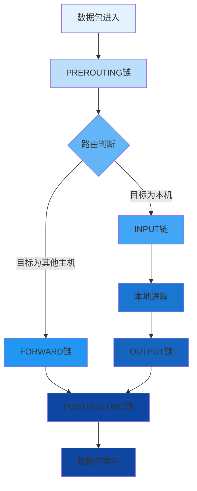

# Linux防火墙生产环境最佳实践：从iptables到nftables

## 情境(Situation)

在现代IT基础设施中，网络安全是保障业务连续性的关键。Linux防火墙作为网络安全的第一道防线，扮演着至关重要的角色。作为SRE工程师，掌握防火墙配置和管理技能是必备的职业素养。

然而，在生产环境中配置和维护防火墙并非易事：

- **规则管理复杂**：随着业务增长，防火墙规则数量激增，管理难度加大
- **性能要求高**：在高流量场景下，防火墙不能成为网络瓶颈
- **安全策略一致性**：确保不同服务器间的防火墙策略统一
- **故障排查困难**：网络问题定位时，防火墙规则往往是重要的排查对象
- **技术演进**：从iptables到nftables的迁移趋势

## 冲突(Conflict)

许多企业在实施Linux防火墙时面临以下挑战：

- **规则混乱**：缺乏统一的规则管理策略，规则重复或冲突
- **安全漏洞**：默认配置过于宽松，存在安全隐患
- **性能瓶颈**：规则过多导致防火墙性能下降
- **配置错误**：误配置导致业务中断
- **缺乏审计**：无法追踪规则变更历史

这些问题在生产环境中可能导致严重的安全事件或业务中断。

## 问题(Question)

如何在生产环境中构建一个安全、高效、可维护的Linux防火墙系统？

## 答案(Answer)

本文将从SRE视角出发，结合真实生产案例，提供一套完整的Linux防火墙生产环境最佳实践。核心方法论基于 [SRE面试题解析：iptables表与链](#4-iptables表与链)。

---

## 一、iptables基础回顾

### 1.1 五表五链工作机制

**五表**：

| 表 | 用途 | 包含链 | 优先级 |
|:--:|------|--------|--------|
| **raw** | 原始追踪，绕过连接跟踪 | PREROUTING, OUTPUT | 1 (最高) |
| **mangle** | 修改数据包标记/QoS | 所有五链 | 2 |
| **nat** | 网络地址转换 | PREROUTING, OUTPUT, POSTROUTING | 3 |
| **filter** | 默认表，包过滤 | INPUT, OUTPUT, FORWARD | 4 |
| **security** | SELinux强制访问控制 | INPUT, OUTPUT, FORWARD | 5 (最低) |

**五链**：

| 链 | 描述 | 适用场景 |
|:--:|------|----------|
| **PREROUTING** | 路由前处理 | 地址转换、流量标记 |
| **INPUT** | 入站流量处理 | 访问控制、入侵检测 |
| **FORWARD** | 转发流量处理 | 网关、路由器 |
| **OUTPUT** | 出站流量处理 | 应用访问控制 |
| **POSTROUTING** | 路由后处理 | 源地址转换 |

**数据包处理流程**：



### 1.2 基础命令

**查看规则**：
```bash
# 查看filter表所有链的规则
iptables -L -n -v

# 查看nat表规则
iptables -t nat -L -n -v

# 查看规则编号
iptables -L -n -v --line-numbers
```

**添加规则**：
```bash
# 允许SSH访问
iptables -A INPUT -p tcp --dport 22 -j ACCEPT

# 拒绝特定IP访问
iptables -A INPUT -s 192.168.1.100 -j DROP

# 允许已建立的连接
iptables -A INPUT -m state --state ESTABLISHED,RELATED -j ACCEPT
```

**删除规则**：
```bash
# 根据规则编号删除
iptables -D INPUT 5

# 根据规则内容删除
iptables -D INPUT -p tcp --dport 80 -j ACCEPT
```

**保存规则**：
```bash
# CentOS/RHEL
iptables-save > /etc/sysconfig/iptables

# Debian/Ubuntu
iptables-save > /etc/iptables/rules.v4
```

---

## 二、生产环境安全策略

### 2.1 基础安全策略

**默认拒绝策略**：

```bash
#!/bin/bash
# 基础防火墙配置脚本

# 清除现有规则
iptables -F
iptables -X
iptables -Z

# 设置默认策略
iptables -P INPUT DROP
iptables -P OUTPUT ACCEPT
iptables -P FORWARD DROP

# 允许回环接口
iptables -A INPUT -i lo -j ACCEPT

# 允许已建立的连接
iptables -A INPUT -m state --state ESTABLISHED,RELATED -j ACCEPT

# 允许SSH访问
iptables -A INPUT -p tcp --dport 22 -j ACCEPT

# 允许HTTP/HTTPS访问（如果需要）
iptables -A INPUT -p tcp --dport 80 -j ACCEPT
iptables -A INPUT -p tcp --dport 443 -j ACCEPT

# 允许ICMP（ping）
iptables -A INPUT -p icmp --icmp-type echo-request -j ACCEPT

# 记录被拒绝的连接
iptables -A INPUT -j LOG --log-prefix "[IPTABLES DROP]: " --log-level 6

# 保存规则
iptables-save > /etc/sysconfig/iptables

echo "基础防火墙配置完成"
```

### 2.2 服务器角色安全策略

**Web服务器**：

```bash
#!/bin/bash
# Web服务器防火墙配置

# 清除现有规则
iptables -F
iptables -X
iptables -Z

# 设置默认策略
iptables -P INPUT DROP
iptables -P OUTPUT ACCEPT
iptables -P FORWARD DROP

# 允许回环接口
iptables -A INPUT -i lo -j ACCEPT

# 允许已建立的连接
iptables -A INPUT -m state --state ESTABLISHED,RELATED -j ACCEPT

# 允许SSH访问（限制IP）
iptables -A INPUT -p tcp --dport 22 -s 192.168.1.0/24 -j ACCEPT

# 允许HTTP/HTTPS访问
iptables -A INPUT -p tcp --dport 80 -j ACCEPT
iptables -A INPUT -p tcp --dport 443 -j ACCEPT

# 允许ICMP（ping）
iptables -A INPUT -p icmp --icmp-type echo-request -j ACCEPT

# 记录被拒绝的连接
iptables -A INPUT -j LOG --log-prefix "[IPTABLES DROP]: " --log-level 6

# 保存规则
iptables-save > /etc/sysconfig/iptables

echo "Web服务器防火墙配置完成"
```

**数据库服务器**：

```bash
#!/bin/bash
# 数据库服务器防火墙配置

# 清除现有规则
iptables -F
iptables -X
iptables -Z

# 设置默认策略
iptables -P INPUT DROP
iptables -P OUTPUT ACCEPT
iptables -P FORWARD DROP

# 允许回环接口
iptables -A INPUT -i lo -j ACCEPT

# 允许已建立的连接
iptables -A INPUT -m state --state ESTABLISHED,RELATED -j ACCEPT

# 允许SSH访问（限制IP）
iptables -A INPUT -p tcp --dport 22 -s 192.168.1.0/24 -j ACCEPT

# 允许数据库访问（限制IP和端口）
iptables -A INPUT -p tcp --dport 3306 -s 192.168.1.0/24 -j ACCEPT  # MySQL
iptables -A INPUT -p tcp --dport 5432 -s 192.168.1.0/24 -j ACCEPT  # PostgreSQL

# 允许ICMP（ping）
iptables -A INPUT -p icmp --icmp-type echo-request -j ACCEPT

# 记录被拒绝的连接
iptables -A INPUT -j LOG --log-prefix "[IPTABLES DROP]: " --log-level 6

# 保存规则
iptables-save > /etc/sysconfig/iptables

echo "数据库服务器防火墙配置完成"
```

**邮件服务器**：

```bash
#!/bin/bash
# 邮件服务器防火墙配置

# 清除现有规则
iptables -F
iptables -X
iptables -Z

# 设置默认策略
iptables -P INPUT DROP
iptables -P OUTPUT ACCEPT
iptables -P FORWARD DROP

# 允许回环接口
iptables -A INPUT -i lo -j ACCEPT

# 允许已建立的连接
iptables -A INPUT -m state --state ESTABLISHED,RELATED -j ACCEPT

# 允许SSH访问（限制IP）
iptables -A INPUT -p tcp --dport 22 -s 192.168.1.0/24 -j ACCEPT

# 允许邮件服务端口
iptables -A INPUT -p tcp --dport 25 -j ACCEPT    # SMTP
iptables -A INPUT -p tcp --dport 110 -j ACCEPT   # POP3
iptables -A INPUT -p tcp --dport 143 -j ACCEPT   # IMAP
iptables -A INPUT -p tcp --dport 465 -j ACCEPT   # SMTPS
iptables -A INPUT -p tcp --dport 993 -j ACCEPT   # IMAPS
iptables -A INPUT -p tcp --dport 995 -j ACCEPT   # POP3S

# 允许ICMP（ping）
iptables -A INPUT -p icmp --icmp-type echo-request -j ACCEPT

# 记录被拒绝的连接
iptables -A INPUT -j LOG --log-prefix "[IPTABLES DROP]: " --log-level 6

# 保存规则
iptables-save > /etc/sysconfig/iptables

echo "邮件服务器防火墙配置完成"
```

### 2.3 高级安全策略

**速率限制**：

```bash
# 限制SSH连接速率，防止暴力破解
iptables -A INPUT -p tcp --dport 22 -m state --state NEW -m limit --limit 6/min --limit-burst 10 -j ACCEPT
iptables -A INPUT -p tcp --dport 22 -m state --state NEW -j DROP

# 限制HTTP请求速率，防止DDoS
iptables -A INPUT -p tcp --dport 80 -m limit --limit 20/second --limit-burst 100 -j ACCEPT
iptables -A INPUT -p tcp --dport 80 -j DROP
```

**连接跟踪**：

```bash
# 限制并发连接数
iptables -A INPUT -p tcp --dport 80 -m connlimit --connlimit-above 50 -j REJECT

# 限制单个IP的并发连接数
iptables -A INPUT -p tcp --dport 80 -m state --state NEW -m recent --set

# 限制单个IP的新连接速率
iptables -A INPUT -p tcp --dport 80 -m state --state NEW -m recent --update --seconds 60 --hitcount 20 -j DROP
```

**端口转发**：

```bash
# 启用IP转发
echo 1 > /proc/sys/net/ipv4/ip_forward

# 端口转发：将外部8080端口转发到内部192.168.1.100:80
iptables -t nat -A PREROUTING -p tcp --dport 8080 -j DNAT --to-destination 192.168.1.100:80
iptables -t nat -A POSTROUTING -d 192.168.1.100 -j MASQUERADE
```

---

## 三、iptables管理与自动化

### 3.1 规则管理最佳实践

**规则组织**：
- **按功能分组**：使用自定义链管理相关规则
- **规则顺序**：从具体到一般，拒绝规则在前
- **注释说明**：为重要规则添加注释

**自定义链示例**：

```bash
# 创建自定义链
iptables -N SSH_RULES
iptables -N WEB_RULES
iptables -N DB_RULES

# 引用自定义链
iptables -A INPUT -p tcp --dport 22 -j SSH_RULES
iptables -A INPUT -p tcp --dport 80 -j WEB_RULES
iptables -A INPUT -p tcp --dport 3306 -j DB_RULES

# 在自定义链中添加规则
iptables -A SSH_RULES -s 192.168.1.0/24 -j ACCEPT
iptables -A SSH_RULES -j DROP

iptables -A WEB_RULES -m state --state NEW -m limit --limit 20/second -j ACCEPT
iptables -A WEB_RULES -j ACCEPT

iptables -A DB_RULES -s 192.168.1.0/24 -j ACCEPT
iptables -A DB_RULES -j DROP
```

### 3.2 自动化管理脚本

**规则备份与恢复**：

```bash
#!/bin/bash
# iptables_backup.sh - 防火墙规则备份与恢复

BACKUP_DIR="/backup/iptables"
TIMESTAMP=$(date '+%Y%m%d%H%M%S')

# 确保备份目录存在
mkdir -p "$BACKUP_DIR"

# 备份规则
backup_rules() {
    local backup_file="$BACKUP_DIR/iptables_${TIMESTAMP}.rules"
    
    echo "备份防火墙规则到: $backup_file"
    iptables-save > "$backup_file"
    
    # 保留最近7天的备份
    find "$BACKUP_DIR" -name "iptables_*.rules" -mtime +7 -delete
    
    echo "备份完成"
}

# 恢复规则
restore_rules() {
    local backup_file="$1"
    
    if [[ ! -f "$backup_file" ]]; then
        echo "错误: 备份文件不存在: $backup_file"
        return 1
    fi
    
    echo "从备份文件恢复规则: $backup_file"
    iptables-restore < "$backup_file"
    
    # 保存到系统配置
    iptables-save > /etc/sysconfig/iptables
    
    echo "恢复完成"
}

# 列出备份
list_backups() {
    echo "可用的备份文件:"
    ls -la "$BACKUP_DIR/iptables_*.rules" | sort -r
}

# 主函数
main() {
    case "$1" in
        "backup")
            backup_rules
            ;;
        "restore")
            restore_rules "$2"
            ;;
        "list")
            list_backups
            ;;
        *)
            echo "用法: $0 {backup|restore|list}"
            ;;
    esac
}

# 执行主函数
main "$@"
```

**规则同步**：

```bash
#!/bin/bash
# iptables_sync.sh - 防火墙规则同步脚本

# 源服务器
SOURCE_SERVER="192.168.1.100"
# 目标服务器列表
TARGET_SERVERS=("192.168.1.101" "192.168.1.102" "192.168.1.103")
# 临时文件
TEMP_RULES="/tmp/iptables_rules.tmp"

# 从源服务器获取规则
echo "从源服务器获取规则: $SOURCE_SERVER"
ssh "$SOURCE_SERVER" "iptables-save" > "$TEMP_RULES"

if [[ $? -ne 0 ]]; then
    echo "错误: 无法从源服务器获取规则"
    exit 1
fi

# 同步到目标服务器
for server in "${TARGET_SERVERS[@]}"; do
    echo "同步规则到: $server"
    scp "$TEMP_RULES" "$server:/tmp/"
    
    ssh "$server" "iptables-restore < /tmp/iptables_rules.tmp && iptables-save > /etc/sysconfig/iptables"
    
    if [[ $? -eq 0 ]]; then
        echo "同步成功: $server"
    else
        echo "同步失败: $server"
    fi
done

# 清理临时文件
rm -f "$TEMP_RULES"

echo "规则同步完成"
```

### 3.3 配置管理

**Git版本控制**：

```bash
#!/bin/bash
# iptables_git.sh - 防火墙规则版本管理

CONFIG_DIR="/etc/iptables"

# 初始化Git仓库
initialize_git() {
    if [[ ! -d "$CONFIG_DIR/.git" ]]; then
        cd "$CONFIG_DIR"
        git init
        git config user.name "SRE Team"
        git config user.email "sre@example.com"
        git add .
        git commit -m "Initial commit"
    fi
}

# 提交变更
commit_changes() {
    local commit_message="$1"
    
    cd "$CONFIG_DIR"
    git add .
    git commit -m "$commit_message"
    git push origin main
}

# 回滚变更
rollback_changes() {
    local commit_hash="$1"
    
    cd "$CONFIG_DIR"
    git reset --hard "$commit_hash"
    iptables-restore < rules.v4
    
    echo "规则已回滚到: $commit_hash"
}

# 主函数
main() {
    case "$1" in
        "init")
            initialize_git
            ;;
        "commit")
            commit_changes "$2"
            ;;
        "rollback")
            rollback_changes "$2"
            ;;
        *)
            echo "用法: $0 {init|commit|rollback}"
            ;;
    esac
}

# 执行主函数
main "$@"
```

---

## 四、从iptables到nftables

### 4.1 iptables与nftables对比

| 特性 | iptables | nftables |
|:-----|:---------|:----------|
| 架构 | 多个独立工具（iptables、ip6tables、arptables） | 单一工具（nft） |
| 规则存储 | 线性规则列表 | 基于状态的规则 |
| 性能 | 规则越多性能越差 | 规则数量不影响性能 |
| 语法 | 复杂，需要记住多个命令 | 简洁，类似SQL语法 |
| 扩展性 | 有限 | 高度可扩展 |
| 支持 | 传统，逐渐被取代 | 现代，Linux 3.13+ |

### 4.2 nftables基础

**基本命令**：

```bash
# 查看规则
nft list ruleset

# 添加规则
nft add table inet filter
nft add chain inet filter input { type filter hook input priority 0 \; policy drop \; }
nft add rule inet filter input iif lo accept
nft add rule inet filter input ct state established,related accept
nft add rule inet filter input tcp dport 22 accept
nft add rule inet filter input tcp dport { 80, 443 } accept

# 删除规则
nft delete rule inet filter input handle 5

# 保存规则
nft list ruleset > /etc/nftables.conf

# 加载规则
nft -f /etc/nftables.conf
```

**nftables配置文件**：

```bash
# /etc/nftables.conf

flush ruleset

table inet filter {
    chain input {
        type filter hook input priority 0 \;
        policy drop \;
        iif "lo" accept \;
        ct state established,related accept \;
        tcp dport 22 accept \;
        tcp dport { 80, 443 } accept \;
        icmp type echo-request accept \;
        log prefix "[NFT DROP]: " \;
        drop \;
    }
    
    chain output {
        type filter hook output priority 0 \;
        policy accept \;
    }
    
    chain forward {
        type filter hook forward priority 0 \;
        policy drop \;
    }
}
```

### 4.3 迁移策略

**迁移步骤**：

1. **评估当前iptables规则**：
   ```bash
   iptables-save > iptables_backup.rules
   ```

2. **转换为nftables规则**：
   ```bash
   # 使用iptables-translate工具
   iptables-translate -f iptables_backup.rules > nftables_rules.conf
   ```

3. **测试nftables规则**：
   ```bash
   nft -f nftables_rules.conf
   nft list ruleset
   ```

4. **切换到nftables**：
   ```bash
   # 停止iptables服务
   systemctl stop iptables
   systemctl disable iptables
   
   # 启动nftables服务
   systemctl start nftables
   systemctl enable nftables
   ```

5. **验证迁移**：
   ```bash
   # 测试网络连接
   ping -c 4 google.com
   curl -I http://localhost
   ```

**迁移脚本**：

```bash
#!/bin/bash
# migrate_to_nftables.sh - 从iptables迁移到nftables

# 备份iptables规则
BACKUP_DIR="/backup/iptables"
mkdir -p "$BACKUP_DIR"
iptables-save > "$BACKUP_DIR/iptables_$(date +%Y%m%d).rules"

# 转换为nftables规则
echo "转换iptables规则到nftables..."
iptables-translate -f "$BACKUP_DIR/iptables_$(date +%Y%m%d).rules" > /etc/nftables.conf

# 检查转换结果
if [[ -s /etc/nftables.conf ]]; then
    echo "规则转换成功"
else
    echo "错误: 规则转换失败"
    exit 1
fi

# 停止iptables服务
echo "停止iptables服务..."
systemctl stop iptables 2>/dev/null
systemctl disable iptables 2>/dev/null

# 启动nftables服务
echo "启动nftables服务..."
systemctl start nftables
systemctl enable nftables

# 验证规则
echo "验证nftables规则..."
nft list ruleset

# 测试网络连接
echo "测试网络连接..."
ping -c 2 google.com

if [[ $? -eq 0 ]]; then
    echo "迁移成功！"
else
    echo "迁移后网络连接失败，正在回滚..."
    systemctl start iptables
    systemctl enable iptables
    systemctl stop nftables
    systemctl disable nftables
    echo "已回滚到iptables"
    exit 1
fi

echo "迁移到nftables完成"
```

---

## 五、生产环境案例分析

### 案例1：防止SSH暴力破解

**背景**：某服务器遭受SSH暴力破解攻击，导致系统负载升高

**问题分析**：
- 日志中出现大量SSH登录尝试
- 系统负载持续升高
- 正常SSH访问受到影响

**解决方案**：
```bash
# 限制SSH连接速率
iptables -A INPUT -p tcp --dport 22 -m state --state NEW -m recent --set

iptables -A INPUT -p tcp --dport 22 -m state --state NEW -m recent --update --seconds 60 --hitcount 5 -j DROP

iptables -A INPUT -p tcp --dport 22 -m state --state NEW -j ACCEPT
```

**效果**：
- 暴力破解攻击被有效阻止
- 系统负载恢复正常
- 正常SSH访问不受影响

### 案例2：DDoS攻击防护

**背景**：某Web服务器遭受DDoS攻击，导致服务不可用

**问题分析**：
- 大量来自不同IP的HTTP请求
- 服务器CPU和内存使用率飙升
- 合法用户无法访问网站

**解决方案**：
```bash
# 限制HTTP请求速率
iptables -A INPUT -p tcp --dport 80 -m limit --limit 20/second --limit-burst 100 -j ACCEPT

iptables -A INPUT -p tcp --dport 80 -j DROP

# 限制单个IP的并发连接数
iptables -A INPUT -p tcp --dport 80 -m connlimit --connlimit-above 50 -j REJECT
```

**效果**：
- DDoS攻击被有效缓解
- 服务器资源使用率恢复正常
- 合法用户可以正常访问网站

### 案例3：网络隔离与安全分区

**背景**：某企业需要将网络划分为不同安全区域，实现访问控制

**解决方案**：
```bash
# 创建安全区域链
iptables -N DMZ_CHAIN
iptables -N INTERNAL_CHAIN
iptables -N EXTERNAL_CHAIN

# 配置DMZ区域规则
iptables -A DMZ_CHAIN -s 192.168.1.0/24 -j ACCEPT  # 内部网络

# 配置内部区域规则
iptables -A INTERNAL_CHAIN -s 192.168.1.0/24 -j ACCEPT  # 内部网络

# 配置外部区域规则
iptables -A EXTERNAL_CHAIN -p tcp --dport 80 -j ACCEPT  # HTTP
iptables -A EXTERNAL_CHAIN -p tcp --dport 443 -j ACCEPT  # HTTPS

# 应用规则
iptables -A INPUT -i eth0 -j EXTERNAL_CHAIN  # 外部接口
iptables -A INPUT -i eth1 -j DMZ_CHAIN        # DMZ接口
iptables -A INPUT -i eth2 -j INTERNAL_CHAIN    # 内部接口
```

**效果**：
- 实现了网络隔离
- 不同安全区域间的访问得到有效控制
- 提高了整体网络安全性

---

## 六、故障排查与最佳实践

### 6.1 故障排查流程

**网络连接问题排查**：

1. **检查防火墙状态**：
   ```bash
   iptables -L -n -v
   systemctl status iptables
   ```

2. **检查具体规则**：
   ```bash
   iptables -L INPUT -n -v --line-numbers
   ```

3. **测试连接**：
   ```bash
   telnet server_ip port
   nc -zv server_ip port
   ```

4. **检查日志**：
   ```bash
   tail -f /var/log/messages | grep IPTABLES
   ```

5. **临时禁用防火墙测试**：
   ```bash
   systemctl stop iptables
   # 测试连接
   systemctl start iptables
   ```

### 6.2 常见问题与解决方案

| 问题 | 可能原因 | 解决方案 |
|:-----|:---------|:----------|
| SSH无法连接 | SSH端口未开放 | 添加SSH允许规则 |
| 网站无法访问 | HTTP/HTTPS端口未开放 | 添加Web服务允许规则 |
| 数据库连接失败 | 数据库端口未开放或IP限制 | 添加数据库访问规则 |
| 防火墙规则不生效 | 规则顺序错误 | 调整规则顺序 |
| 规则过多导致性能下降 | 规则数量过多 | 使用nftables或优化规则 |
| 规则冲突 | 规则逻辑矛盾 | 检查并清理冲突规则 |

### 6.3 最佳实践总结

**规则管理**：
- 使用默认拒绝策略，只开放必要端口
- 按功能和服务分组管理规则
- 为规则添加清晰的注释
- 使用版本控制管理规则变更

**性能优化**：
- 规则顺序：从具体到一般
- 避免使用复杂的匹配条件
- 对于大量规则，考虑使用nftables
- 定期清理过期和无效规则

**安全增强**：
- 限制源IP访问（尤其是管理端口）
- 实施速率限制，防止暴力破解和DDoS攻击
- 定期审计防火墙规则
- 保持防火墙规则与安全策略一致

**自动化管理**：
- 使用脚本自动化规则部署和同步
- 建立规则备份和恢复机制
- 监控防火墙状态和规则变更
- 集成到CI/CD流程中

---

## 总结

Linux防火墙是网络安全的重要组成部分，掌握iptables和nftables的配置与管理技能对SRE工程师至关重要。通过本文提供的最佳实践，你可以构建一个安全、高效、可维护的防火墙系统。

**核心要点**：

1. **安全基础**：采用默认拒绝策略，只开放必要服务
2. **规则管理**：按功能分组，使用版本控制
3. **性能优化**：合理组织规则，考虑使用nftables
4. **自动化**：脚本化管理，实现规则同步和备份
5. **持续改进**：定期审计和优化防火墙配置

> **延伸学习**：更多面试相关的iptables问题，请参考 [SRE面试题解析：iptables表与链](#4-iptables表与链)。

---

## 参考资料

- [iptables官方文档](https://netfilter.org/documentation/
- [nftables官方文档](https://wiki.nftables.org/wiki-nftables/index.php/Main_Page)
- [Linux防火墙最佳实践](https://access.redhat.com/documentation/en-us/red_hat_enterprise_linux/7/html/security_guide/chap-firewalls)
- [网络安全加固指南](https://cisecurity.org/cis-benchmarks/)
- [DDoS防护策略](https://www.cloudflare.com/learning/ddos/what-is-a-ddos-attack/)
- [SSH暴力破解防护](https://www.ssh.com/academy/ssh/brute-force)
- [Linux服务器安全加固](https://linux-audit.com/linux-server-hardening-guide/)
- [nftables迁移指南](https://wiki.archlinux.org/index.php/Nftables#Migrating_from_iptables)