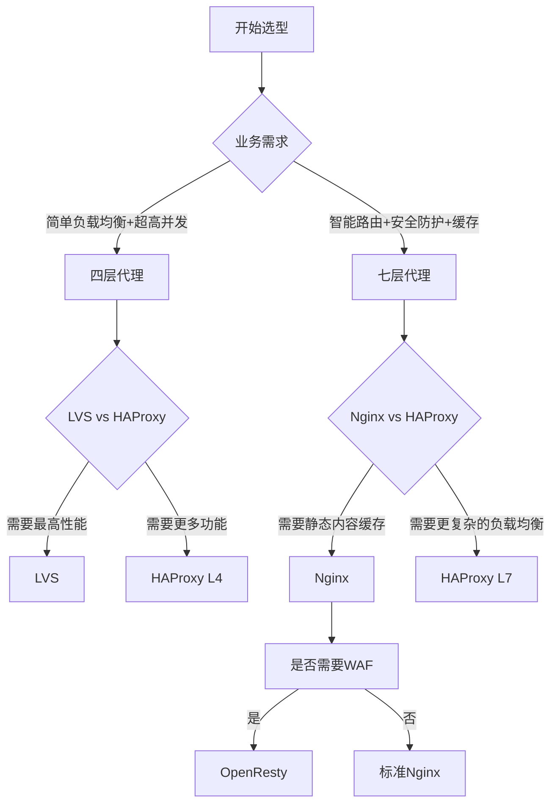

# 代理服务器生产环境最佳实践：从四层到七层的架构设计

## 情境(Situation)

在现代网络架构中，代理服务器是构建高可用、高性能系统的关键组件。作为SRE工程师，选择和配置合适的代理服务器直接影响系统的可靠性、性能和安全性。

然而，在生产环境中部署和管理代理服务器面临诸多挑战：

- **选型困难**：四层vs七层，不同场景下如何选择？
- **性能优化**：如何在高并发场景下保持高性能？
- **高可用设计**：如何避免单点故障？
- **安全配置**：如何防御常见的网络攻击？
- **监控管理**：如何及时发现和解决问题？

## 冲突(Conflict)

许多企业在实施代理服务器时遇到以下问题：

- **架构设计不合理**：选择了不适合业务场景的代理类型
- **配置优化不足**：默认配置无法满足生产环境需求
- **扩展性受限**：随着业务增长，代理服务器成为瓶颈
- **故障处理能力弱**：出现问题时无法快速定位和解决
- **安全意识淡薄**：缺乏必要的安全防护措施

这些问题在生产环境中可能导致服务中断、性能下降或安全事件。

## 问题(Question)

如何在生产环境中设计和部署高性能、高可用、安全的代理服务器架构？

## 答案(Answer)

本文将从SRE视角出发，结合真实生产案例，提供一套完整的代理服务器生产环境最佳实践。核心方法论基于 [SRE面试题解析：四层与七层代理的区别](#5-四层与七层代理的区别)。

---

## 一、代理服务器类型与选择

### 1.1 四层代理 vs 七层代理

**核心区别**：

| 维度 | 四层代理 (L4) | 七层代理 (L7) |
|:----:|:-------------:|:-------------:|
| **OSI层级** | 传输层 (TCP/UDP) | 应用层 (HTTP/HTTPS) |
| **识别依据** | IP + 端口 | URL、Header、Cookie |
| **性能** | ⚡ 高（仅解析头部） | 🐢 较低（完整协议解析） |
| **功能** | 负载均衡、端口转发 | 路由、SSL卸载、缓存、WAF |
| **延迟** | < 1ms | 1-5ms |
| **代表产品** | LVS、HAProxy(L4模式) | Nginx、HAProxy(L7模式) |

**选型决策树**：



### 1.2 常见代理服务器对比

| 产品 | 类型 | 优势 | 劣势 | 适用场景 |
|:-----|:-----|:-----|:-----|:----------|
| **LVS** | 四层 | 性能极高，支持百万并发 | 功能单一，配置复杂 | 超高并发场景 |
| **HAProxy** | 四层/七层 | 功能丰富，支持健康检查 | 性能略低于LVS | 中等并发，需要复杂功能 |
| **Nginx** | 七层 | 功能丰富，支持缓存 | 并发能力有限 | 中小型应用，需要静态缓存 |
| **Traefik** | 七层 | 自动服务发现，动态配置 | 性能一般 | 容器环境，微服务架构 |
| **Envoy** | 七层 | 现代化架构，可观测性强 | 配置复杂 | 云原生环境 |

---

## 二、四层代理最佳实践

### 2.1 LVS配置与优化

**LVS模式对比**：

| 模式 | 特点 | 优势 | 劣势 |
|:-----|:-----|:-----|:-----|
| **DR模式** | 直接路由，修改MAC地址 | 性能最高，网络流量小 | 需要RS与Director在同一网段 |
| **NAT模式** | 网络地址转换 | 配置简单，RS可在不同网段 | 性能较低，Director成为瓶颈 |
| **TUN模式** | IP隧道 | RS可在不同网段 | 配置复杂，需要支持IP隧道 |

**DR模式配置示例**：

```bash
#!/bin/bash
# lvs_dr_setup.sh - LVS DR模式配置脚本

# 配置参数
VIP="192.168.1.100"
RIPs=("192.168.1.101" "192.168.1.102" "192.168.1.103")
PORT=80

# 配置Director
echo "配置LVS Director..."

# 加载LVS模块
modprobe ip_vs
modprobe ip_vs_rr

# 配置VIP
ifconfig eth0:0 $VIP netmask 255.255.255.255 broadcast $VIP up

# 配置LVS规则
ipvsadm -C
ipvsadm -A -t $VIP:$PORT -s rr

for RIP in "${RIPs[@]}"; do
    ipvsadm -a -t $VIP:$PORT -r $RIP -g  # -g 表示DR模式
done

# 查看配置
ipvsadm -L -n

echo "LVS Director配置完成"

# 配置Real Server
echo "配置Real Server..."

for RIP in "${RIPs[@]}"; do
    ssh $RIP "ifconfig lo:0 $VIP netmask 255.255.255.255 broadcast $VIP up"
    ssh $RIP "echo 1 > /proc/sys/net/ipv4/conf/lo/arp_ignore"
    ssh $RIP "echo 2 > /proc/sys/net/ipv4/conf/lo/arp_announce"
    ssh $RIP "echo 1 > /proc/sys/net/ipv4/conf/all/arp_ignore"
    ssh $RIP "echo 2 > /proc/sys/net/ipv4/conf/all/arp_announce"
done

echo "Real Server配置完成"
```

**性能优化**：

```bash
# 系统参数优化
# /etc/sysctl.conf
net.ipv4.ip_forward = 1
net.ipv4.conf.all.rp_filter = 0
net.ipv4.conf.default.rp_filter = 0
net.ipv4.tcp_tw_reuse = 1
net.ipv4.tcp_tw_recycle = 0
net.ipv4.tcp_fin_timeout = 30
net.ipv4.tcp_keepalive_time = 300
net.ipv4.tcp_max_syn_backlog = 4096
net.core.somaxconn = 4096
net.core.netdev_max_backlog = 16384

# 应用配置
sysctl -p
```

### 2.2 HAProxy四层配置

**配置示例**：

```conf
# /etc/haproxy/haproxy.cfg

global
    log /dev/log local0
    log /dev/log local1 notice
    chroot /var/lib/haproxy
    stats socket /run/haproxy/admin.sock mode 660 level admin expose-fd listeners
    stats timeout 30s
    user haproxy
    group haproxy
    daemon
    maxconn 4096

defaults
    log global
    mode tcp
    option tcplog
    option dontlognull
    timeout connect 5000
    timeout client 50000
    timeout server 50000

frontend frontend_443
    bind *:443
    mode tcp
    default_backend backend_servers

backend backend_servers
    mode tcp
    balance roundrobin
    option tcp-check
    server server1 192.168.1.101:443 check inter 10s fall 3 rise 2
    server server2 192.168.1.102:443 check inter 10s fall 3 rise 2
    server server3 192.168.1.103:443 check inter 10s fall 3 rise 2

# 监控页面
listen stats
    bind *:9000
    mode http
    stats enable
    stats uri /stats
    stats auth admin:password
```

**高可用配置**：

```bash
#!/bin/bash
# haproxy_keepalived.sh - HAProxy高可用配置

# 安装Keepalived
yum install -y keepalived

# 配置Keepalived
cat > /etc/keepalived/keepalived.conf << EOF
vrrp_instance VI_1 {
    state MASTER
    interface eth0
    virtual_router_id 51
    priority 100
    advert_int 1
    authentication {
        auth_type PASS
        auth_pass haproxy_ha
    }
    virtual_ipaddress {
        192.168.1.100
    }
    notify_master /etc/keepalived/notify.sh
    notify_backup /etc/keepalived/notify.sh
    notify_fault /etc/keepalived/notify.sh
}
EOF

# 通知脚本
cat > /etc/keepalived/notify.sh << EOF
#!/bin/bash

case "$1" in
    "MASTER")
        systemctl start haproxy
        ;;
    "BACKUP")
        systemctl start haproxy
        ;;
    "FAULT")
        systemctl stop haproxy
        ;;
esac
EOF

chmod +x /etc/keepalived/notify.sh

# 启动服务
systemctl enable keepalived
systemctl start keepalived
systemctl enable haproxy
systemctl start haproxy

echo "HAProxy高可用配置完成"
```

---

## 三、七层代理最佳实践

### 3.1 Nginx配置与优化

**基础配置**：

```nginx
# /etc/nginx/nginx.conf

user nginx;
worker_processes auto;
worker_cpu_affinity auto;
pid /run/nginx.pid;

events {
    worker_connections 10240;
    use epoll;
    multi_accept on;
}

http {
    include /etc/nginx/mime.types;
    default_type application/octet-stream;
    
    # 日志配置
    log_format main '$remote_addr - $remote_user [$time_local] "$request" '
                      '$status $body_bytes_sent "$http_referer" '
                      '"$http_user_agent" "$http_x_forwarded_for"';
    access_log /var/log/nginx/access.log main;
    error_log /var/log/nginx/error.log warn;
    
    # 性能优化
    sendfile on;
    tcp_nopush on;
    tcp_nodelay on;
    keepalive_timeout 65;
    keepalive_requests 100;
    
    # 缓存配置
    proxy_cache_path /var/cache/nginx levels=1:2 keys_zone=cache_zone:10m max_size=10g inactive=60m use_temp_path=off;
    
    # 负载均衡配置
    upstream backend {
        least_conn;
        server 192.168.1.101:8080 max_fails=3 fail_timeout=30s;
        server 192.168.1.102:8080 max_fails=3 fail_timeout=30s;
        server 192.168.1.103:8080 max_fails=3 fail_timeout=30s;
    }
    
    # 服务器配置
    server {
        listen 80;
        server_name example.com;
        
        # 重定向到HTTPS
        return 301 https://$host$request_uri;
    }
    
    server {
        listen 443 ssl http2;
        server_name example.com;
        
        # SSL配置
        ssl_certificate /etc/ssl/certs/example.com.pem;
        ssl_certificate_key /etc/ssl/private/example.com.key;
        ssl_protocols TLSv1.2 TLSv1.3;
        ssl_ciphers ECDHE-RSA-AES256-GCM-SHA512:DHE-RSA-AES256-GCM-SHA512:ECDHE-RSA-AES256-GCM-SHA384:DHE-RSA-AES256-GCM-SHA384:ECDHE-RSA-AES256-SHA384;
        ssl_prefer_server_ciphers on;
        ssl_session_cache shared:SSL:10m;
        ssl_session_timeout 10m;
        
        # 代理配置
        location / {
            proxy_pass http://backend;
            proxy_http_version 1.1;
            proxy_set_header Upgrade $http_upgrade;
            proxy_set_header Connection 'upgrade';
            proxy_set_header Host $host;
            proxy_set_header X-Real-IP $remote_addr;
            proxy_set_header X-Forwarded-For $proxy_add_x_forwarded_for;
            proxy_set_header X-Forwarded-Proto $scheme;
            proxy_cache_bypass $http_upgrade;
            
            # 缓存配置
            proxy_cache cache_zone;
            proxy_cache_valid 200 302 10m;
            proxy_cache_valid 404 1m;
        }
        
        # 静态文件配置
        location /static/ {
            root /var/www/html;
            expires 30d;
        }
    }
}
```

**性能优化**：

```bash
# 系统参数优化
# /etc/sysctl.conf
net.core.somaxconn = 65535
net.ipv4.tcp_max_syn_backlog = 65535
net.ipv4.tcp_fin_timeout = 30
net.ipv4.tcp_keepalive_time = 300
net.ipv4.tcp_keepalive_probes = 5
net.ipv4.tcp_keepalive_intvl = 15
net.ipv4.tcp_tw_reuse = 1
net.ipv4.tcp_tw_recycle = 0

# 文件描述符限制
# /etc/security/limits.conf
nginx soft nofile 65535
nginx hard nofile 65535

# 应用配置
sysctl -p
```

### 3.2 HAProxy七层配置

**配置示例**：

```conf
# /etc/haproxy/haproxy.cfg

global
    log /dev/log local0
    log /dev/log local1 notice
    chroot /var/lib/haproxy
    stats socket /run/haproxy/admin.sock mode 660 level admin expose-fd listeners
    stats timeout 30s
    user haproxy
    group haproxy
    daemon
    maxconn 4096

defaults
    log global
    mode http
    option httplog
    option dontlognull
    option forwardfor
    option http-server-close
    timeout connect 5000
    timeout client 50000
    timeout server 50000

frontend frontend_http
    bind *:80
    mode http
    default_backend backend_servers

frontend frontend_https
    bind *:443 ssl crt /etc/haproxy/certs/example.com.pem
    mode http
    default_backend backend_servers

backend backend_servers
    mode http
    balance roundrobin
    option httpchk GET /health
    http-check expect status 200
    server server1 192.168.1.101:8080 check inter 10s fall 3 rise 2
    server server2 192.168.1.102:8080 check inter 10s fall 3 rise 2
    server server3 192.168.1.103:8080 check inter 10s fall 3 rise 2

# 监控页面
listen stats
    bind *:9000
    mode http
    stats enable
    stats uri /stats
    stats auth admin:password
```

**高级路由配置**：

```conf
# 基于URL的路由
frontend frontend_http
    bind *:80
    mode http
    
    acl url_api path_beg /api
    acl url_web path_beg /web
    
    use_backend backend_api if url_api
    use_backend backend_web if url_web
    default_backend backend_default

backend backend_api
    mode http
    balance roundrobin
    server api1 192.168.1.201:8080 check
    server api2 192.168.1.202:8080 check

backend backend_web
    mode http
    balance roundrobin
    server web1 192.168.1.301:8080 check
    server web2 192.168.1.302:8080 check

backend backend_default
    mode http
    balance roundrobin
    server default1 192.168.1.101:8080 check
```

---

## 四、负载均衡策略

### 4.1 常用负载均衡算法

| 算法 | 描述 | 适用场景 |
|:-----|:-----|:----------|
| **轮询 (Round Robin)** | 依次分配请求到后端服务器 | 后端服务器性能相近 |
| **最少连接 (Least Connections)** | 分配到当前连接数最少的服务器 | 后端服务器性能差异较大 |
| **IP哈希 (IP Hash)** | 根据客户端IP哈希分配 | 需要会话保持 |
| **URL哈希 (URL Hash)** | 根据请求URL哈希分配 | 缓存命中率要求高 |
| **权重轮询 (Weighted Round Robin)** | 根据权重分配请求 | 后端服务器性能差异较大 |
| **权重最少连接 (Weighted Least Connections)** | 根据权重和连接数分配 | 复杂场景的最佳选择 |

### 4.2 会话保持方案

**四层会话保持**：
- **源IP哈希**：基于客户端IP分配
- **连接跟踪**：保持TCP连接到同一服务器

**七层会话保持**：
- **Cookie插入**：代理服务器插入会话Cookie
- **Cookie重写**：重写应用Cookie
- **Session共享**：使用Redis等存储会话

**Nginx会话保持配置**：

```nginx
# IP哈希
upstream backend {
    ip_hash;
    server 192.168.1.101:8080;
    server 192.168.1.102:8080;
    server 192.168.1.103:8080;
}

# 一致性哈希
upstream backend {
    hash $request_uri consistent;
    server 192.168.1.101:8080;
    server 192.168.1.102:8080;
    server 192.168.1.103:8080;
}
```

**HAProxy会话保持配置**：

```conf
# Cookie插入
backend backend_servers
    mode http
    balance roundrobin
    cookie SERVERID insert indirect nocache
    server server1 192.168.1.101:8080 cookie s1 check
    server server2 192.168.1.102:8080 cookie s2 check
    server server3 192.168.1.103:8080 cookie s3 check

# 源IP哈希
backend backend_servers
    mode http
    balance source
    server server1 192.168.1.101:8080 check
    server server2 192.168.1.102:8080 check
    server server3 192.168.1.103:8080 check
```

---

## 五、安全配置

### 5.1 SSL/TLS配置

**Nginx SSL优化**：

```nginx
# 现代SSL配置
server {
    listen 443 ssl http2;
    server_name example.com;
    
    # SSL证书
    ssl_certificate /etc/ssl/certs/example.com.pem;
    ssl_certificate_key /etc/ssl/private/example.com.key;
    
    # TLS版本和密码套件
    ssl_protocols TLSv1.2 TLSv1.3;
    ssl_ciphers ECDHE-RSA-AES256-GCM-SHA512:DHE-RSA-AES256-GCM-SHA512:ECDHE-RSA-AES256-GCM-SHA384:DHE-RSA-AES256-GCM-SHA384:ECDHE-RSA-AES256-SHA384;
    ssl_prefer_server_ciphers on;
    
    # 会话缓存
    ssl_session_cache shared:SSL:10m;
    ssl_session_timeout 10m;
    
    # HSTS
    add_header Strict-Transport-Security "max-age=31536000; includeSubDomains" always;
    
    # OCSP Stapling
    ssl_stapling on;
    ssl_stapling_verify on;
    resolver 8.8.8.8 8.8.4.4 valid=300s;
    resolver_timeout 5s;
    
    # 其他配置
    ...
}
```

**HAProxy SSL配置**：

```conf
# SSL终止
frontend frontend_https
    bind *:443 ssl crt /etc/haproxy/certs/example.com.pem no-sslv3 no-tlsv10 no-tlsv11
    mode http
    default_backend backend_servers

# 高级SSL配置
frontend frontend_https
    bind *:443 ssl crt /etc/haproxy/certs/example.com.pem \
        ciphers ECDHE-RSA-AES256-GCM-SHA512:DHE-RSA-AES256-GCM-SHA512:ECDHE-RSA-AES256-GCM-SHA384 \
        ssl-min-ver TLSv1.2 \
        alpn h2,http/1.1
    mode http
    default_backend backend_servers
```

### 5.2 WAF集成

**Nginx + ModSecurity**：

```bash
# 安装ModSecurity
apt-get install -y nginx-module-modsecurity

# 配置ModSecurity
cat > /etc/nginx/modsecurity/main.conf << EOF
SecRuleEngine On
SecRequestBodyAccess On
SecRule REQUEST_HEADERS:Content-Type "^application/json" "id:1000,phase:1,pass,t:none,nolog,ctl:requestBodyProcessor=JSON"
Include /etc/nginx/modsecurity/crs/crs-setup.conf
Include /etc/nginx/modsecurity/crs/rules/*.conf
EOF

# Nginx配置
server {
    listen 443 ssl http2;
    server_name example.com;
    
    # SSL配置
    ...
    
    # ModSecurity配置
    modsecurity on;
    modsecurity_rules_file /etc/nginx/modsecurity/main.conf;
    
    # 其他配置
    ...
}
```

**OpenResty + Lua**：

```nginx
# OpenResty WAF配置
server {
    listen 443 ssl http2;
    server_name example.com;
    
    # SSL配置
    ...
    
    # Lua WAF
    access_by_lua_block {
        local waf = require "resty.waf"
        local w = waf:new()
        w:set_option("debug", false)
        w:set_option("mode", "ACTIVE")
        w:set_option("rules_file", "/etc/nginx/waf/rules.conf")
        local status, err = w:process_request()
        if not status then
            ngx.log(ngx.ERR, "WAF error: " .. err)
        end
    }
    
    # 其他配置
    ...
}
```

### 5.3 访问控制

**Nginx访问控制**：

```nginx
# IP白名单
location /admin/ {
    allow 192.168.1.0/24;
    deny all;
    proxy_pass http://backend;
}

# 基本认证
location /api/ {
    auth_basic "Restricted Area";
    auth_basic_user_file /etc/nginx/.htpasswd;
    proxy_pass http://backend;
}
```

**HAProxy访问控制**：

```conf
# IP白名单
frontend frontend_http
    bind *:80
    mode http
    
    acl allowed_ips src 192.168.1.0/24
    acl admin_path path_beg /admin
    
    http-request deny if admin_path !allowed_ips
    
    default_backend backend_servers

# 基本认证
frontend frontend_http
    bind *:80
    mode http
    
    acl auth_ok http_auth(http_users)
    acl api_path path_beg /api
    
    http-request auth realm "Restricted Area" if api_path !auth_ok
    
    default_backend backend_servers

userlist http_users
    user admin insecure-password password123
```

---

## 六、监控与故障排查

### 6.1 监控指标

**关键监控指标**：

| 指标 | 描述 | 告警阈值 |
|:-----|:-----|:----------|
| **连接数** | 当前活跃连接数 | 80% max_connections |
| **请求率** | 每秒请求数 | 基于基准值 |
| **错误率** | 错误请求占比 | >1% |
| **响应时间** | 请求平均响应时间 | >500ms |
| **后端健康** | 后端服务器状态 | 任何后端DOWN |
| **SSL握手** | SSL握手成功率 | <99% |

**Prometheus监控**：

```yaml
# prometheus.yml
scrape_configs:
  - job_name: 'nginx'
    static_configs:
      - targets: ['nginx-server:9113']
    metrics_path: /metrics
    scrape_interval: 15s
  
  - job_name: 'haproxy'
    static_configs:
      - targets: ['haproxy-server:9101']
    metrics_path: /metrics
    scrape_interval: 15s
```

**Grafana仪表板**：
- 连接数趋势图
- 请求率和错误率
- 后端服务器状态
- 响应时间分布
- SSL握手统计

### 6.2 日志管理

**Nginx日志配置**：

```nginx
# 访问日志格式
log_format json_log '{'
  '"time":"$time_iso8601",'
  '"remote_addr":"$remote_addr",'
  '"remote_user":"$remote_user",'
  '"request":"$request",'
  '"status":$status,'
  '"body_bytes_sent":$body_bytes_sent,'
  '"http_referer":"$http_referer",'
  '"http_user_agent":"$http_user_agent",'
  '"http_x_forwarded_for":"$http_x_forwarded_for",'
  '"request_time":$request_time,'
  '"upstream_response_time":$upstream_response_time'
'}';

access_log /var/log/nginx/access.log json_log;
```

**ELK Stack集成**：

```bash
# 配置Filebeat
cat > /etc/filebeat/filebeat.yml << EOF
filebeat.inputs:
- type: log
  paths:
    - /var/log/nginx/access.log
  json.keys_under_root: true
  json.overwrite_keys: true

output.elasticsearch:
  hosts: ["elasticsearch:9200"]
  index: "nginx-%{+yyyy.MM.dd}"

setup.kibana:
  host: "kibana:5601"

setup.template.name: "nginx"
setup.template.pattern: "nginx-*"
EOF
```

### 6.3 故障排查流程

**常见故障排查**：

1. **连接问题**：
   - 检查网络连通性：`ping`、`telnet`、`nc`
   - 检查防火墙规则：`iptables -L -n`
   - 检查代理服务器状态：`systemctl status nginx/haproxy`

2. **性能问题**：
   - 检查系统资源：`top`、`vmstat`、`iostat`
   - 检查连接数：`netstat -an | grep ESTABLISHED | wc -l`
   - 检查后端服务器状态：`curl -I http://backend-server/health`

3. **配置问题**：
   - 检查配置文件：`nginx -t`、`haproxy -c -f /etc/haproxy/haproxy.cfg`
   - 检查日志：`tail -f /var/log/nginx/error.log`
   - 测试配置：`curl -v http://example.com`

**故障排查脚本**：

```bash
#!/bin/bash
# proxy_troubleshoot.sh - 代理服务器故障排查脚本

# 检查网络连通性
check_network() {
    echo "检查网络连通性..."
    ping -c 3 $1
    telnet $1 $2
}

# 检查代理服务器状态
check_proxy_status() {
    echo "检查代理服务器状态..."
    systemctl status $1
    $1 -t 2>/dev/null || haproxy -c -f /etc/haproxy/haproxy.cfg
}

# 检查后端服务器状态
check_backend_status() {
    echo "检查后端服务器状态..."
    for server in "${BACKEND_SERVERS[@]}"; do
        curl -I -s $server/health | head -1
    done
}

# 检查系统资源
check_system_resources() {
    echo "检查系统资源..."
    top -b -n 1 | head -20
    vmstat 1 5
    iostat -x 1 5
}

# 主函数
main() {
    case "$1" in
        "network")
            check_network "$2" "$3"
            ;;
        "proxy")
            check_proxy_status "$2"
            ;;
        "backend")
            check_backend_status
            ;;
        "system")
            check_system_resources
            ;;
        "all")
            check_network "$2" "$3"
            check_proxy_status "$4"
            check_backend_status
            check_system_resources
            ;;
        *)
            echo "用法: $0 {network|proxy|backend|system|all}"
            ;;
    esac
}

# 执行主函数
main "$@"
```

---

## 七、生产环境案例分析

### 案例1：电商平台高并发架构

**背景**：某电商平台需要处理高峰期每秒10万+请求

**架构设计**：
- **接入层**：LVS DR模式（四层）
- **代理层**：Nginx集群（七层）
- **应用层**：微服务架构

**配置要点**：
- LVS配置：DR模式，RS与Director在同一网段
- Nginx配置：开启HTTP/2，配置SSL会话复用
- 负载均衡：LVS使用轮询，Nginx使用最少连接
- 会话保持：使用Redis共享会话

**效果**：
- 峰值QPS：12万/秒
- 响应时间：<100ms
- 系统稳定性：99.99%

### 案例2：金融系统安全架构

**背景**：某银行需要构建安全可靠的代理架构

**架构设计**：
- **接入层**：HAProxy（四层）
- **WAF层**：OpenResty + Lua
- **应用层**：银行核心系统

**配置要点**：
- HAProxy配置：开启SSL终止，配置健康检查
- OpenResty配置：集成WAF，防SQL注入、XSS攻击
- 访问控制：IP白名单，基本认证
- 监控：Prometheus + Grafana

**效果**：
- 安全防护：拦截率>99%
- 系统可用性：99.999%
- 合规性：满足PCI DSS要求

### 案例3：微服务架构服务网格

**背景**：某企业需要构建现代化微服务架构

**架构设计**：
- **入口层**：Traefik（七层）
- **服务网格**：Istio
- **微服务**：Kubernetes集群

**配置要点**：
- Traefik配置：自动服务发现，动态路由
- Istio配置：服务间通信，熔断，限流
- Kubernetes：HPA自动扩缩容
- 监控：Prometheus + Jaeger

**效果**：
- 服务发现：自动注册和发现
- 可观测性：全链路追踪
- 弹性伸缩：根据负载自动调整

---

## 八、最佳实践总结

### 8.1 架构设计

- **分层设计**：根据业务需求选择合适的代理层级
- **高可用**：部署多节点，实现自动故障转移
- **弹性伸缩**：根据负载自动调整资源
- **安全防护**：集成WAF，配置SSL/TLS

### 8.2 性能优化

- **系统调优**：调整内核参数，优化网络栈
- **配置优化**：根据硬件配置调整工作进程数
- **缓存策略**：合理使用缓存，减少后端负载
- **连接管理**：优化TCP连接参数，减少连接建立开销

### 8.3 运维管理

- **监控体系**：建立完善的监控和告警机制
- **日志管理**：集中化日志收集和分析
- **自动化**：脚本化配置管理和部署
- **灾备方案**：定期备份配置，制定应急预案

### 8.4 安全最佳实践

- **SSL/TLS**：使用现代加密协议和密码套件
- **访问控制**：实施IP白名单和认证机制
- **WAF集成**：防御常见Web攻击
- **定期审计**：检查配置漏洞和安全风险

---

## 总结

代理服务器是现代网络架构的重要组成部分，选择和配置合适的代理服务器对于构建高可用、高性能、安全的系统至关重要。通过本文提供的最佳实践，你可以根据业务需求设计和部署合适的代理架构。

**核心要点**：

1. **选型合适**：根据业务需求选择四层或七层代理
2. **性能优化**：合理配置系统和代理参数
3. **高可用设计**：部署多节点，实现故障自动转移
4. **安全防护**：集成SSL、WAF等安全措施
5. **监控运维**：建立完善的监控和运维体系

> **延伸学习**：更多面试相关的代理服务器问题，请参考 [SRE面试题解析：四层与七层代理的区别](#5-四层与七层代理的区别)。

---

## 参考资料

- [Nginx官方文档](https://nginx.org/en/docs/)
- [HAProxy官方文档](https://www.haproxy.com/documentation/)
- [LVS官方文档](http://www.linuxvirtualserver.org/documentation/)
- [Traefik官方文档](https://doc.traefik.io/traefik/)
- [Istio官方文档](https://istio.io/docs/)
- [SSL/TLS最佳实践](https://wiki.mozilla.org/Security/Server_Side_TLS)
- [Web应用防火墙(WAF)指南](https://owasp.org/www-community/Web_Application_Firewall)
- [高可用架构设计](https://aws.amazon.com/cn/architecture/well-architected/)
- [负载均衡最佳实践](https://cloud.google.com/load-balancing/docs/best-practices)
- [Kubernetes服务网格](https://kubernetes.io/docs/concepts/services-networking/service/)
- [性能优化指南](https://www.nginx.com/blog/tuning-nginx/)
- [安全加固指南](https://cisecurity.org/cis-benchmarks/)