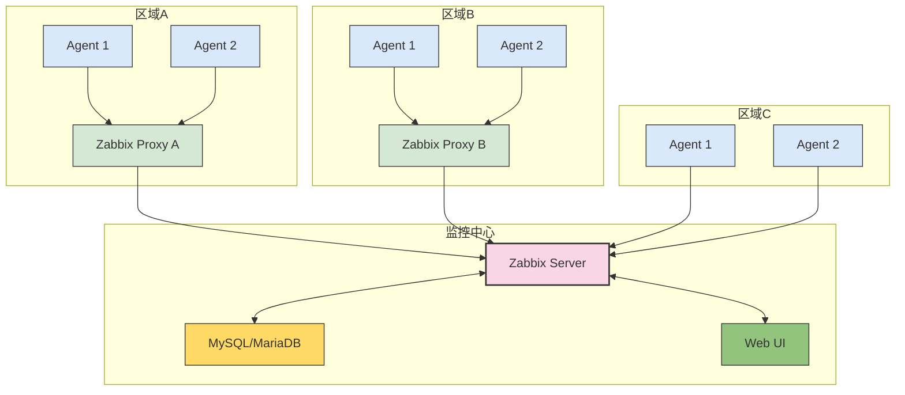

# Zabbix生产环境最佳实践：从架构设计到运维优化

## 情境(Situation)

在现代IT基础设施中，监控系统是保障业务连续性的关键组成部分。作为企业级监控的主流解决方案，Zabbix以其强大的功能、灵活的配置和开源特性被广泛采用。

然而，在生产环境中部署和维护Zabbix系统并非易事：

- **规模挑战**：从几十台服务器到数千台的规模扩张
- **性能瓶颈**：监控数据量激增导致的存储和处理压力
- **可靠性要求**：监控系统本身的高可用性保障
- **告警噪声**：避免过多的误报和漏报
- **维护成本**：如何降低日常运维的复杂度

## 冲突(Conflict)

许多企业在实施Zabbix时面临以下挑战：

- **架构设计不合理**：初期规划不足，导致后期难以扩展
- **配置管理混乱**：模板和告警规则管理无序
- **性能优化不当**：数据库性能瓶颈影响整体监控效果
- **告警策略失效**：告警风暴或重要告警被忽略
- **监控覆盖率不足**：关键业务指标未被监控

这些问题在生产环境中会直接影响系统的稳定性和故障响应速度。

## 问题(Question)

如何在生产环境中构建一个高性能、高可靠、易维护的Zabbix监控系统？

## 答案(Answer)

本文将从SRE视角出发，结合真实生产案例，提供一套完整的Zabbix生产环境最佳实践。核心方法论基于 [SRE面试题解析：Zabbix架构详解](#3-zabbix架构详解)。

---

## 一、架构设计最佳实践

### 1.1 架构选择

**单Server架构**：适用于中小规模环境（< 1000台主机）
- 优点：部署简单，维护成本低
- 缺点：单点故障，扩展性有限

**Proxy分布式架构**：适用于大规模环境（> 1000台主机）
- 优点：负载分散，支持地理分布式部署
- 缺点：部署复杂度增加

**高可用架构**：适用于关键业务系统
- 优点：无单点故障，服务连续性高
- 缺点：部署和维护复杂

### 1.2 架构设计决策树

| 环境规模 | 推荐架构 | 配置要点 |
|:--------:|:---------|:--------|
| 小型环境 (< 500台) | 单Server | 优化数据库配置 |
| 中型环境 (500-2000台) | 单Server + 本地Proxy | 合理划分监控网段 |
| 大型环境 (> 2000台) | 多Proxy + 负载均衡 | 区域化部署Proxy |
| 超大型环境 (> 10000台) | 多Server + Proxy | 按业务线划分监控域 |

### 1.3 部署架构示例



---

## 二、性能优化最佳实践

### 2.1 数据库优化

**MySQL配置优化**：

```cnf
# /etc/my.cnf.d/zabbix.cnf
[mysqld]
# 基本配置
innodb_file_per_table = 1
innodb_buffer_pool_size = 4G  # 建议为服务器内存的50-70%
innodb_log_file_size = 1G
innodb_log_buffer_size = 32M
innodb_flush_log_at_trx_commit = 2
innodb_flush_method = O_DIRECT

# 性能配置
max_connections = 1000
sort_buffer_size = 2M
read_buffer_size = 2M
read_rnd_buffer_size = 8M
join_buffer_size = 8M

# 查询缓存（适用于Zabbix 4.0+）
query_cache_type = 1
query_cache_size = 64M
query_cache_limit = 2M
```

**数据库分区**：

```sql
-- 为history和trends表创建分区
DELIMITER //
CREATE PROCEDURE create_zabbix_partitions()
BEGIN
    -- 创建历史表分区
    ALTER TABLE history PARTITION BY RANGE (clock) (
        PARTITION p202604 VALUES LESS THAN (UNIX_TIMESTAMP('2026-05-01 00:00:00')),
        PARTITION p202605 VALUES LESS THAN (UNIX_TIMESTAMP('2026-06-01 00:00:00')),
        PARTITION p202606 VALUES LESS THAN (UNIX_TIMESTAMP('2026-07-01 00:00:00')),
        PARTITION p202607 VALUES LESS THAN (UNIX_TIMESTAMP('2026-08-01 00:00:00')),
        PARTITION p202608 VALUES LESS THAN (UNIX_TIMESTAMP('2026-09-01 00:00:00')),
        PARTITION p202609 VALUES LESS THAN (UNIX_TIMESTAMP('2026-10-01 00:00:00'))
    );
    
    -- 创建趋势表分区
    ALTER TABLE trends PARTITION BY RANGE (clock) (
        PARTITION t202604 VALUES LESS THAN (UNIX_TIMESTAMP('2026-05-01 00:00:00')),
        PARTITION t202605 VALUES LESS THAN (UNIX_TIMESTAMP('2026-06-01 00:00:00')),
        PARTITION t202606 VALUES LESS THAN (UNIX_TIMESTAMP('2026-07-01 00:00:00')),
        PARTITION t202607 VALUES LESS THAN (UNIX_TIMESTAMP('2026-08-01 00:00:00')),
        PARTITION t202608 VALUES LESS THAN (UNIX_TIMESTAMP('2026-09-01 00:00:00')),
        PARTITION t202609 VALUES LESS THAN (UNIX_TIMESTAMP('2026-10-01 00:00:00'))
    );
END //
DELIMITER ;

CALL create_zabbix_partitions();
```

**定期清理**：

```bash
#!/bin/bash
# zabbix_cleanup.sh - Zabbix数据库清理脚本

DB_USER="zabbix"
DB_PASS="your_password"
DB_NAME="zabbix"

# 保留天数
HISTORY_DAYS=7
TRENDS_DAYS=30

# 清理历史数据
echo "清理${HISTORY_DAYS}天前的历史数据..."
mysql -u "$DB_USER" -p"$DB_PASS" "$DB_NAME" << EOF
DELETE FROM history WHERE clock < UNIX_TIMESTAMP(DATE_SUB(NOW(), INTERVAL ${HISTORY_DAYS} DAY));
DELETE FROM history_str WHERE clock < UNIX_TIMESTAMP(DATE_SUB(NOW(), INTERVAL ${HISTORY_DAYS} DAY));
DELETE FROM history_text WHERE clock < UNIX_TIMESTAMP(DATE_SUB(NOW(), INTERVAL ${HISTORY_DAYS} DAY));
DELETE FROM history_log WHERE clock < UNIX_TIMESTAMP(DATE_SUB(NOW(), INTERVAL ${HISTORY_DAYS} DAY));
OPTIMIZE TABLE history, history_str, history_text, history_log;
EOF

# 清理趋势数据
echo "清理${TRENDS_DAYS}天前的趋势数据..."
mysql -u "$DB_USER" -p"$DB_PASS" "$DB_NAME" << EOF
DELETE FROM trends WHERE clock < UNIX_TIMESTAMP(DATE_SUB(NOW(), INTERVAL ${TRENDS_DAYS} DAY));
DELETE FROM trends_uint WHERE clock < UNIX_TIMESTAMP(DATE_SUB(NOW(), INTERVAL ${TRENDS_DAYS} DAY));
OPTIMIZE TABLE trends, trends_uint;
EOF

echo "清理完成"
```

### 2.2 Zabbix Server优化

**zabbix_server.conf配置**：

```conf
# /etc/zabbix/zabbix_server.conf

# 基础配置
LogFile=/var/log/zabbix/zabbix_server.log
LogFileSize=0
PidFile=/var/run/zabbix/zabbix_server.pid
SocketDir=/var/run/zabbix
DBHost=localhost
DBName=zabbix
DBUser=zabbix
DBPassword=your_password

# 性能优化
StartPollers=30              # 轮询进程数，根据CPU核心数调整
StartPollersUnreachable=10   # 不可达主机轮询进程数
StartTrappers=10             # 陷阱处理进程数
StartPingers=5               # ICMP ping进程数
StartDiscoverers=5           # 自动发现进程数
StartHTTPPollers=10          # HTTP轮询进程数

# 缓存配置
CacheSize=512M               # 配置缓存大小
CacheUpdateFrequency=60      # 缓存更新频率
StartDBSyncers=8             # 数据库同步进程数
HistoryCacheSize=128M        # 历史数据缓存大小
HistoryIndexCacheSize=64M     # 历史索引缓存大小
TrendCacheSize=128M           # 趋势数据缓存大小

# 超时配置
Timeout=3                    # 超时时间
TrapperTimeout=30            # 陷阱超时时间

# 告警配置
AlertScriptsPath=/usr/lib/zabbix/alertscripts
ExternalScripts=/usr/lib/zabbix/externalscripts
```

**系统参数优化**：

```bash
# /etc/sysctl.conf
fs.file-max = 65535
net.core.somaxconn = 1024
net.ipv4.tcp_max_syn_backlog = 2048
net.ipv4.tcp_fin_timeout = 30
net.ipv4.tcp_keepalive_time = 300
net.ipv4.tcp_keepalive_probes = 5
net.ipv4.tcp_keepalive_intvl = 15

# 应用配置
sysctl -p

# 设置文件描述符限制
# /etc/security/limits.conf
zabbix soft nofile 65535
zabbix hard nofile 65535
```

### 2.3 Agent优化

**zabbix_agentd.conf配置**：

```conf
# /etc/zabbix/zabbix_agentd.conf

# 基础配置
PidFile=/var/run/zabbix/zabbix_agentd.pid
LogFile=/var/log/zabbix/zabbix_agentd.log
LogFileSize=0

# 服务器配置
Server=192.168.1.100           # Zabbix Server IP
ServerActive=192.168.1.100      # 主动模式Server IP
Hostname=web-server-01          # 主机名

# 性能优化
StartAgents=3                   # 被动模式启动的agent进程数
RefreshActiveChecks=120         # 主动检查刷新时间
BufferSend=5                    # 数据发送缓冲区大小（秒）
BufferSize=100                  # 数据缓冲区大小（值的数量）
MaxLinesPerSecond=200           # 每秒最大行数

# 安全配置
AllowRoot=0
User=zabbix
Include=/etc/zabbix/zabbix_agentd.d/
```

**主动模式vs被动模式**：

| 模式 | 适用场景 | 优点 | 缺点 |
|:-----|:---------|:-----|:-----|
| 被动模式 | 小规模环境，网络稳定 | 配置简单，实时性好 | 对Server压力大，容易超时 |
| 主动模式 | 大规模环境，网络不稳定 | 减轻Server压力，适合跨网段 | 配置复杂，实时性稍差 |

---

## 三、监控配置最佳实践

### 3.1 模板管理

**模板设计原则**：
- **模块化**：按服务类型创建独立模板
- **继承性**：使用模板继承减少重复配置
- **标准化**：统一命名规范和监控项配置

**推荐模板结构**：

```
Template OS Linux
├── Template App MySQL
├── Template App Nginx
├── Template App Redis
└── Template App Java
```

**模板最佳实践**：

```bash
#!/bin/bash
# zabbix_template_sync.sh - 模板同步脚本

TEMPLATE_DIR="/etc/zabbix/templates"
ZABBIX_URL="http://zabbix-server/zabbix"
ZABBIX_USER="Admin"
ZABBIX_PASS="zabbix"

# 导入模板
import_template() {
    local template_file="$1"
    local template_name=$(basename "$template_file" .xml)
    
    echo "导入模板: $template_name"
    
    curl -X POST "$ZABBIX_URL/api_jsonrpc.php" \
        -H "Content-Type: application/json" \
        -d "{
            \"jsonrpc\": \"2.0\",
            \"method\": \"configuration.import\",
            \"params\": {
                \"format\": \"xml\",
                \"source\": \"$(cat "$template_file" | sed 's/"/\\"/g')\",
                \"rules\": {
                    \"templates\": {
                        \"createMissing\": true,
                        \"updateExisting\": true
                    }
                }
            },
            \"id\": 1,
            \"auth\": \"$(get_auth_token)\"
        }"
}

# 获取认证令牌
get_auth_token() {
    curl -s -X POST "$ZABBIX_URL/api_jsonrpc.php" \
        -H "Content-Type: application/json" \
        -d "{
            \"jsonrpc\": \"2.0\",
            \"method\": \"user.login\",
            \"params\": {
                \"user\": \"$ZABBIX_USER\",
                \"password\": \"$ZABBIX_PASS\"
            },
            \"id\": 1
        }" | jq -r '.result'
}

# 同步所有模板
for template in "$TEMPLATE_DIR"/*.xml; do
    import_template "$template"
done

echo "模板同步完成"
```

### 3.2 告警策略

**告警级别设计**：

| 级别 | 描述 | 通知方式 | 处理时间 |
|:-----|:-----|:---------|:----------|
| 灾难 | 服务完全不可用 | 电话 + 短信 + 邮件 | 立即处理 |
| 高危 | 核心功能异常 | 短信 + 邮件 | 15分钟内 |
| 中危 | 非核心功能异常 | 邮件 | 4小时内 |
| 低危 | 性能或资源警告 | 邮件 | 24小时内 |

**告警抑制策略**：

```bash
#!/bin/bash
# zabbix_alert_suppress.sh - 告警抑制脚本

# 告警抑制配置
SUPPRESS_RULES=("高可用集群|备节点状态异常" "服务器|磁盘空间警告")

# 检查告警是否需要抑制
check_suppress() {
    local alert_subject="$1"
    local alert_message="$2"
    
    for rule in "${SUPPRESS_RULES[@]}"; do
        local pattern=$(echo "$rule" | cut -d'|' -f1)
        local message_pattern=$(echo "$rule" | cut -d'|' -f2)
        
        if echo "$alert_subject" | grep -q "$pattern" && \
           echo "$alert_message" | grep -q "$message_pattern"; then
            echo "告警已抑制: $alert_subject"
            return 1
        fi
    done
    
    return 0
}

# 主函数
main() {
    local subject="$1"
    local message="$2"
    
    if check_suppress "$subject" "$message"; then
        # 发送告警
        send_alert "$subject" "$message"
    fi
}

# 发送告警函数
send_alert() {
    local subject="$1"
    local message="$2"
    
    # 这里实现具体的告警发送逻辑
    echo "发送告警: $subject"
    # 邮件、短信、电话等通知方式
}

# 执行主函数
main "$@"
```

**告警聚合**：

```sql
-- 告警聚合查询
SELECT 
    itemid, 
    hostid, 
    COUNT(*) as alert_count, 
    MIN(clock) as first_alert, 
    MAX(clock) as last_alert
FROM alerts 
WHERE clock > UNIX_TIMESTAMP(DATE_SUB(NOW(), INTERVAL 24 HOUR))
GROUP BY itemid, hostid
ORDER BY alert_count DESC
LIMIT 10;
```

### 3.3 监控覆盖率

**关键监控项**：

| 系统类型 | 必须监控项 | 推荐监控项 |
|:---------|:-----------|:-----------|
| Linux服务器 | CPU、内存、磁盘、网络 | 进程、文件系统、系统负载 |
| Windows服务器 | CPU、内存、磁盘、网络 | 服务状态、进程、事件日志 |
| 数据库 | 连接数、查询性能、缓存命中率 | 慢查询、锁等待、复制状态 |
| 中间件 | 线程数、连接数、响应时间 | 错误率、队列长度、吞吐量 |
| 网络设备 | 接口流量、丢包率、延迟 | CPU使用率、内存使用率 |

**监控项配置示例**：

```bash
#!/bin/bash
# zabbix_monitor_setup.sh - 监控项配置脚本

HOSTNAME="$1"

# 基础监控项
BASE_ITEMS=("system.cpu.util[,avg1]","vm.memory.size[used]","vfs.fs.size[/,used]","net.if.in[eth0,bytes]")

# 应用监控项
APP_ITEMS=("mysql.status[Threads_connected]","nginx.stat[connections,active]")

# 添加监控项
add_item() {
    local host="$1"
    local key="$2"
    local name="$3"
    
    echo "添加监控项: $name ($key)"
    
    # 使用Zabbix API添加监控项
    # 这里实现具体的API调用
}

# 主函数
main() {
    echo "为主机 $HOSTNAME 配置监控项"
    
    # 添加基础监控项
    for item in "${BASE_ITEMS[@]}"; do
        key=$(echo "$item" | cut -d',' -f1)
        name=$(echo "$item" | cut -d',' -f2)
        add_item "$HOSTNAME" "$key" "$name"
    done
    
    # 添加应用监控项
    for item in "${APP_ITEMS[@]}"; do
        key=$(echo "$item" | cut -d',' -f1)
        name=$(echo "$item" | cut -d',' -f2)
        add_item "$HOSTNAME" "$key" "$name"
    done
    
    echo "监控项配置完成"
}

# 执行主函数
main "$HOSTNAME"
```

---

## 四、生产环境案例分析

### 案例1：Zabbix Server性能优化

**背景**：某电商平台的Zabbix监控系统在大促期间出现响应缓慢

**问题分析**：
- 监控主机数量：5000+台
- 监控项数量：200,000+
- 数据库：MySQL 5.7，8核16G内存
- 症状：Web界面响应时间>10秒，告警延迟

**解决方案**：
1. **数据库优化**：
   - 调整innodb_buffer_pool_size=10G
   - 启用表分区
   - 优化查询语句

2. **Zabbix Server优化**：
   - 增加StartPollers=50
   - 增加StartDBSyncers=16
   - 调整CacheSize=1024M

3. **架构调整**：
   - 部署3个Zabbix Proxy，按业务线划分
   - 启用主动模式

**效果**：
- Web界面响应时间<2秒
- 告警延迟<30秒
- 系统稳定性显著提升

### 案例2：告警策略优化

**背景**：某金融系统的Zabbix监控产生大量告警，导致告警疲劳

**问题分析**：
- 日均告警量：10,000+
- 误报率：>60%
- 重要告警被淹没

**解决方案**：
1. **告警级别重构**：
   - 重新定义告警级别和处理流程
   - 实施告警抑制和聚合

2. **告警规则优化**：
   - 调整阈值，减少误报
   - 实施告警依赖关系

3. **通知机制改进**：
   - 不同级别使用不同通知渠道
   - 工作时间和非工作时间采用不同策略

**效果**：
- 日均告警量减少至2,000+
- 误报率<10%
- 重要告警及时处理率达到100%

### 案例3：高可用架构部署

**背景**：某电信运营商需要Zabbix监控系统的高可用性

**解决方案**：
```bash
#!/bin/bash
# zabbix_ha_setup.sh - Zabbix高可用部署脚本

# 节点配置
NODE1="192.168.1.10"
NODE2="192.168.1.11"
VIP="192.168.1.100"

# 安装Keepalived
install_keepalived() {
    yum install -y keepalived
    
    # 配置Keepalived
    cat > /etc/keepalived/keepalived.conf << EOF
vrrp_instance VI_1 {
    state MASTER
    interface eth0
    virtual_router_id 51
    priority 100
    advert_int 1
    authentication {
        auth_type PASS
        auth_pass zabbix_ha
    }
    virtual_ipaddress {
        $VIP
    }
}
EOF
    
    systemctl enable keepalived
    systemctl start keepalived
}

# 配置MySQL主从复制
configure_mysql_replication() {
    # 主库配置
    cat > /etc/my.cnf.d/replication.cnf << EOF
[mysqld]
server-id = 1
log-bin = mysql-bin
binlog-format = ROW
EOF
    
    # 从库配置
    # 这里实现从库配置
    
    # 初始化复制
    # 这里实现复制初始化
}

# 配置Zabbix Server
configure_zabbix_server() {
    # 配置文件修改
    sed -i "s/DBHost=.*/DBHost=$VIP/" /etc/zabbix/zabbix_server.conf
    
    systemctl enable zabbix-server
    systemctl start zabbix-server
}

# 主函数
main() {
    echo "开始部署Zabbix高可用架构"
    
    # 安装Keepalived
    install_keepalived
    
    # 配置MySQL主从复制
    configure_mysql_replication
    
    # 配置Zabbix Server
    configure_zabbix_server
    
    echo "Zabbix高可用架构部署完成"
}

# 执行主函数
main
```

**效果**：
- 实现了Zabbix Server的自动故障转移
- 故障切换时间<30秒
- 监控服务零中断

---

## 五、运维管理最佳实践

### 5.1 日常维护

**定期维护任务**：

| 任务 | 频率 | 操作内容 |
|:-----|:-----|:----------|
| 数据库清理 | 每日 | 清理历史数据，优化表结构 |
| 日志轮换 | 每日 | 轮换Zabbix日志文件 |
| 配置备份 | 每周 | 备份Zabbix配置和数据库 |
| 性能检查 | 每周 | 检查系统性能指标 |
| 安全审计 | 每月 | 检查权限和安全配置 |

**维护脚本示例**：

```bash
#!/bin/bash
# zabbix_maintenance.sh - Zabbix日常维护脚本

# 日志配置
LOG_FILE="/var/log/zabbix/maintenance.log"

# 日志函数
log() {
    local level="$1"
    local message="$2"
    local timestamp="$(date '+%Y-%m-%d %H:%M:%S')"
    echo "[$timestamp] [$level] $message" >> "$LOG_FILE"
    echo "[$level] $message"
}

# 数据库清理
cleanup_database() {
    log "INFO" "开始数据库清理"
    
    # 调用清理脚本
    /opt/scripts/zabbix_cleanup.sh
    
    log "INFO" "数据库清理完成"
}

# 日志轮换
rotate_logs() {
    log "INFO" "开始日志轮换"
    
    # 轮换Zabbix日志
    logrotate -f /etc/logrotate.d/zabbix
    
    log "INFO" "日志轮换完成"
}

# 配置备份
backup_config() {
    log "INFO" "开始配置备份"
    
    local backup_dir="/backup/zabbix/$(date '+%Y%m%d')"
    mkdir -p "$backup_dir"
    
    # 备份配置文件
    cp -r /etc/zabbix/ "$backup_dir/"
    
    # 备份数据库
    mysqldump -u zabbix -p'password' zabbix > "$backup_dir/zabbix.sql"
    
    log "INFO" "配置备份完成: $backup_dir"
}

# 性能检查
check_performance() {
    log "INFO" "开始性能检查"
    
    # 检查Zabbix Server状态
    systemctl status zabbix-server
    
    # 检查数据库状态
    mysql -u zabbix -p'password' -e "SHOW GLOBAL STATUS LIKE 'Threads%'"
    
    # 检查系统负载
    uptime
    
    log "INFO" "性能检查完成"
}

# 主函数
main() {
    log "INFO" "开始Zabbix日常维护"
    
    cleanup_database
    rotate_logs
    backup_config
    check_performance
    
    log "INFO" "Zabbix日常维护完成"
}

# 执行主函数
main
```

### 5.2 故障排查

**常见故障及解决方案**：

| 故障现象 | 可能原因 | 解决方案 |
|:---------|:---------|:----------|
| Zabbix Server启动失败 | 数据库连接问题 | 检查数据库状态和连接配置 |
| 监控数据不更新 | Agent未运行 | 检查Agent状态和防火墙 |
| 告警不触发 | 触发器配置错误 | 检查触发器表达式和依赖关系 |
| Web界面响应慢 | 数据库性能问题 | 优化数据库配置和查询 |
| 数据采集超时 | 网络延迟或Agent负载高 | 调整超时设置或优化Agent |

**故障排查流程**：

1. **检查Zabbix Server状态**：
   ```bash
   systemctl status zabbix-server
   tail -f /var/log/zabbix/zabbix_server.log
   ```

2. **检查数据库状态**：
   ```bash
   mysql -u zabbix -p -e "SHOW PROCESSLIST;"
   mysql -u zabbix -p -e "SHOW GLOBAL STATUS LIKE 'Threads%';"
   ```

3. **检查Agent状态**：
   ```bash
   systemctl status zabbix-agent
   zabbix_get -s 127.0.0.1 -k system.uname
   ```

4. **检查网络连接**：
   ```bash
   ping zabbix-server
   telnet zabbix-server 10051
   ```

### 5.3 自动化运维

**API自动化**：

```python
#!/usr/bin/env python3
# zabbix_api.py - Zabbix API自动化脚本

import requests
import json

class ZabbixAPI:
    def __init__(self, url, username, password):
        self.url = url
        self.username = username
        self.password = password
        self.auth_token = None
        self.login()
    
    def login(self):
        payload = {
            "jsonrpc": "2.0",
            "method": "user.login",
            "params": {
                "user": self.username,
                "password": self.password
            },
            "id": 1
        }
        response = requests.post(self.url, json=payload)
        result = response.json()
        self.auth_token = result.get("result")
    
    def call(self, method, params):
        payload = {
            "jsonrpc": "2.0",
            "method": method,
            "params": params,
            "id": 1,
            "auth": self.auth_token
        }
        response = requests.post(self.url, json=payload)
        return response.json()
    
    def get_hosts(self):
        return self.call("host.get", {
            "output": ["hostid", "host"],
            "selectInterfaces": ["interfaceid", "ip"]
        })
    
    def create_host(self, host_name, ip_address, group_ids, template_ids):
        return self.call("host.create", {
            "host": host_name,
            "interfaces": [{
                "type": 1,
                "main": 1,
                "useip": 1,
                "ip": ip_address,
                "dns": "",
                "port": "10050"
            }],
            "groups": [{
                "groupid": group_id
            } for group_id in group_ids],
            "templates": [{
                "templateid": template_id
            } for template_id in template_ids]
        })

# 使用示例
if __name__ == "__main__":
    zabbix = ZabbixAPI(
        "http://zabbix-server/zabbix/api_jsonrpc.php",
        "Admin",
        "zabbix"
    )
    
    # 获取所有主机
    hosts = zabbix.get_hosts()
    print("主机列表:")
    for host in hosts.get("result", []):
        print(f"{host['host']} - {host['interfaces'][0]['ip']}")
    
    # 创建新主机
    # zabbix.create_host("new-server", "192.168.1.100", ["2"], ["10001"])
```

**配置管理**：

```bash
#!/bin/bash
# zabbix_config_management.sh - 配置管理脚本

# 配置仓库
CONFIG_REPO="git@github.com:your-org/zabbix-config.git"
CONFIG_DIR="/etc/zabbix"

# 同步配置
sync_config() {
    echo "同步配置从Git仓库"
    
    cd "$CONFIG_DIR"
    git pull
    
    echo "配置同步完成"
}

# 提交配置
commit_config() {
    local commit_message="$1"
    
    echo "提交配置到Git仓库"
    
    cd "$CONFIG_DIR"
    git add .
    git commit -m "$commit_message"
    git push
    
    echo "配置提交完成"
}

# 回滚配置
rollback_config() {
    local commit_hash="$1"
    
    echo "回滚配置到: $commit_hash"
    
    cd "$CONFIG_DIR"
    git reset --hard "$commit_hash"
    
    echo "配置回滚完成"
}

# 主函数
main() {
    case "$1" in
        "sync")
            sync_config
            ;;
        "commit")
            commit_config "$2"
            ;;
        "rollback")
            rollback_config "$2"
            ;;
        *)
            echo "用法: $0 {sync|commit|rollback}"
            ;;
    esac
}

# 执行主函数
main "$@"
```

---

## 六、最佳实践总结

### 6.1 架构设计

- **按需选择架构**：根据规模和需求选择合适的部署架构
- **分层部署**：使用Proxy实现负载分散和地理分布式部署
- **高可用设计**：关键环境实现Zabbix Server高可用
- **网络规划**：合理规划网络拓扑，确保监控流量顺畅

### 6.2 性能优化

- **数据库优化**：合理配置MySQL参数，实施表分区和定期清理
- **Server优化**：根据监控规模调整进程数和缓存大小
- **Agent优化**：合理选择主动/被动模式，优化配置参数
- **系统调优**：调整系统参数，提高网络和IO性能

### 6.3 监控配置

- **模板标准化**：建立统一的模板体系，实现配置标准化
- **告警策略**：设计合理的告警级别和抑制策略，减少告警噪声
- **监控覆盖**：确保关键指标和业务流程的监控覆盖率
- **配置管理**：使用版本控制管理配置，实现配置变更的可追溯

### 6.4 运维管理

- **自动化**：使用API和脚本实现自动化运维
- **定期维护**：建立定期维护机制，确保系统稳定运行
- **故障排查**：建立标准化的故障排查流程
- **持续改进**：定期评估和优化监控系统

---

## 总结

Zabbix作为企业级监控系统，在生产环境中的部署和维护需要系统化的最佳实践。通过合理的架构设计、性能优化、监控配置和运维管理，可以构建一个高性能、高可靠、易维护的Zabbix监控系统。

**核心要点**：

1. **架构适配**：根据监控规模选择合适的架构方案
2. **性能优先**：持续优化数据库和Server性能
3. **配置规范**：建立标准化的模板和告警体系
4. **自动化运维**：减少人工干预，提高运维效率
5. **持续改进**：定期评估和优化监控系统

> **延伸学习**：更多面试相关的Zabbix问题，请参考 [SRE面试题解析：Zabbix架构详解](#3-zabbix架构详解)。

---

## 参考资料

- [Zabbix官方文档](https://www.zabbix.com/documentation)
- [Zabbix性能调优指南](https://www.zabbix.com/documentation/current/manual/installation/optimization)
- [MySQL性能优化最佳实践](https://dev.mysql.com/doc/refman/8.0/en/optimization.html)
- [Zabbix API文档](https://www.zabbix.com/documentation/current/manual/api)