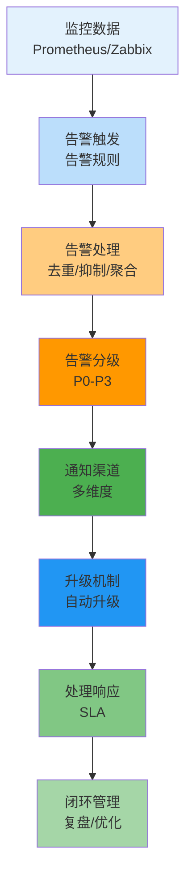

# 告警管理生产环境最佳实践：从设计到运营

## 情境(Situation)

告警是系统的"神经末梢"，是SRE工程师的生命线。在生产环境中，**一个好的告警系统能在故障扩散前发现问题**，而一个差的告警系统会产生"告警疲劳"导致重要问题被忽略。

作为SRE工程师，构建和维护一个有效的告警系统是保障服务可靠性的关键。告警系统不仅要能及时发现问题，还要能智能过滤噪声，确保团队只关注真正重要的问题。

## 冲突(Conflict)

许多SRE团队在告警管理中遇到以下挑战：

- **告警风暴**：短时间内产生大量重复告警
- **告警疲劳**：过多的低优先级告警导致重要告警被忽略
- **响应不及时**：缺乏有效的升级机制
- **告警噪声**：非关键问题产生过多告警
- **闭环管理缺失**：告警处理后缺乏复盘和优化
- **工具选择困难**：面对众多告警工具不知如何选择

## 问题(Question)

如何构建一个高效、智能的告警系统，实现及时发现问题、有效过滤噪声、快速响应处理和持续优化？

## 答案(Answer)

本文将从SRE视角出发，结合真实生产案例，提供一套完整的告警管理生产环境最佳实践。核心方法论基于 [SRE面试题解析：你们公司如何报警的？](#19-你们公司如何报警的)。

---

## 一、告警系统设计

### 1.1 告警体系架构



### 1.2 告警分级体系

| 级别 | 定义 | 影响范围 | 响应时间 | 通知方式 | 升级机制 | 示例 |
|:-----|:-----|:---------|:----------|:----------|:----------|:------|
| **P0** | 系统完全不可用 | 全局影响 | 立即响应 | 电话+短信+微信+钉钉 | 5分钟未响应升级 | 核心服务宕机、全站不可访问 |
| **P1** | 关键功能异常 | 部分功能 | 10分钟内 | 微信+钉钉+邮件 | 15分钟未响应升级 | 支付功能异常、API响应超时 |
| **P2** | 非核心功能异常 | 局部影响 | 30分钟内 | 邮件+钉钉 | 1小时未响应升级 | 后台管理功能异常、非关键API故障 |
| **P3** | 信息性提醒 | 无直接影响 | 24小时内 | 邮件 | 无升级 | 磁盘空间预警、CPU使用率高 |

### 1.3 告警触发条件

**关键指标告警**：

| 指标类型 | 告警条件 | 推荐阈值 | 检查频率 |
|:---------|:---------|:----------|:----------|
| **系统资源** | CPU使用率 | >90% 持续5分钟 | 1分钟 |
| | 内存使用率 | >90% 持续5分钟 | 1分钟 |
| | 磁盘使用率 | >85% 持续10分钟 | 5分钟 |
| | 磁盘IO | iowait >50% 持续5分钟 | 1分钟 |
| **网络** | 网络延迟 | >100ms 持续3分钟 | 30秒 |
| | 丢包率 | >1% 持续3分钟 | 30秒 |
| | 连接数 | >80% 最大连接数 | 1分钟 |
| **应用** | 响应时间 | >500ms 持续3分钟 | 30秒 |
| | 错误率 | >5% 持续5分钟 | 1分钟 |
| | QPS | >90% 最大QPS | 1分钟 |
| **数据库** | 查询响应时间 | >1s 持续3分钟 | 30秒 |
| | 连接数 | >80% 最大连接数 | 1分钟 |
| | 复制延迟 | >30秒 持续5分钟 | 1分钟 |

**业务指标告警**：

| 指标类型 | 告警条件 | 推荐阈值 | 检查频率 |
|:---------|:---------|:----------|:----------|
| **用户体验** | 页面加载时间 | >3s 持续3分钟 | 30秒 |
| | 转换率 | 下降>20% 持续10分钟 | 5分钟 |
| | 错误率 | >1% 持续5分钟 | 1分钟 |
| **业务量** | 订单量 | 下降>30% 持续10分钟 | 5分钟 |
| | 支付成功率 | <95% 持续5分钟 | 1分钟 |
| | 注册量 | 下降>50% 持续10分钟 | 5分钟 |

---

## 二、告警工具配置

### 2.1 Prometheus + Alertmanager

**告警规则配置**：

```yaml
# prometheus/rules/alerts.yml
groups:
  - name: system_alerts
    rules:
    - alert: HighCpuUsage
      expr: (100 - (avg by(instance) (irate(node_cpu_seconds_total{mode="idle"}[5m])) * 100) > 90
      for: 5m
      labels:
        severity: critical
        team: sre
      annotations:
        summary: "高CPU使用率"
        description: "{{ $labels.instance }} CPU使用率超过90%持续5分钟"

    - alert: HighMemoryUsage
      expr: (node_memory_MemTotal_bytes - node_memory_MemAvailable_bytes) / node_memory_MemTotal_bytes * 100 > 90
      for: 5m
      labels:
        severity: critical
        team: sre
      annotations:
        summary: "高内存使用率"
        description: "{{ $labels.instance }} 内存使用率超过90%持续5分钟"

    - alert: DiskSpaceLow
      expr: (node_filesystem_size_bytes{mountpoint="/"} - node_filesystem_free_bytes{mountpoint="/"}) / node_filesystem_size_bytes{mountpoint="/"} * 100 > 85
      for: 10m
      labels:
        severity: warning
        team: sre
      annotations:
        summary: "磁盘空间不足"
        description: "{{ $labels.instance }} 根分区使用率超过85%持续10分钟"
```

**Alertmanager配置**：

```yaml
# alertmanager.yml
global:
  resolve_timeout: 5m
  smtp_smarthost: 'smtp.example.com:587'
  smtp_from: 'alerts@example.com'
  smtp_auth_username: 'alerts@example.com'
  smtp_auth_password: 'password'

route:
  group_by: ['alertname', 'instance', 'severity']
  group_wait: 30s
  group_interval: 5m
  repeat_interval: 4h
  receiver: 'team-sre'
  routes:
  - match:
      severity: critical
    receiver: 'team-sre-p0'
    group_wait: 10s
  - match:
      severity: warning
    receiver: 'team-sre-p1'
    group_wait: 20s
  - match:
      severity: info
    receiver: 'team-sre-p3'
    group_wait: 30s

receivers:
- name: 'team-sre'
  email_configs:
  - to: 'sre@example.com'
    send_resolved: true
  wechat_configs:
  - corp_id: 'your_corp_id'
    api_url: 'https://qyapi.weixin.qq.com/cgi-bin/'
    to_party: '1'
    agent_id: 'your_agent_id'
    api_secret: 'your_api_secret'
    send_resolved: true

- name: 'team-sre-p0'
  email_configs:
  - to: 'sre@example.com'
    send_resolved: true
  wechat_configs:
  - corp_id: 'your_corp_id'
    api_url: 'https://qyapi.weixin.qq.com/cgi-bin/'
    to_party: '1'
    agent_id: 'your_agent_id'
    api_secret: 'your_api_secret'
    send_resolved: true
  pagerduty_configs:
  - service_key: 'your_pagerduty_key'
    send_resolved: true

- name: 'team-sre-p1'
  email_configs:
  - to: 'sre@example.com'
    send_resolved: true
  wechat_configs:
  - corp_id: 'your_corp_id'
    api_url: 'https://qyapi.weixin.qq.com/cgi-bin/'
    to_party: '1'
    agent_id: 'your_agent_id'
    api_secret: 'your_api_secret'
    send_resolved: true

- name: 'team-sre-p3'
  email_configs:
  - to: 'sre@example.com'
    send_resolved: true

inhibit_rules:
  - source_match:
      severity: 'critical'
    target_match:
      severity: 'warning'
    equal: ['alertname', 'instance']
```

### 2.2 Zabbix 告警配置

**告警媒介配置**：

1. **Email**：
   - 管理 → 报警媒介类型 → 创建媒体类型
   - 名称：Email
   - 类型：Email
   - SMTP服务器：smtp.example.com
   - SMTP服务器端口：587
   - SMTP HELO：example.com
   - SMTP电邮：alerts@example.com
   - 认证：用户名和密码
   - 用户名：alerts@example.com
   - 密码：password

2. **WeChat**：
   - 管理 → 报警媒介类型 → 创建媒体类型
   - 名称：WeChat
   - 类型：脚本
   - 脚本名称：wechat.sh
   - 脚本参数：
     - {ALERT.SENDTO}
     - {ALERT.SUBJECT}
     - {ALERT.MESSAGE}

**告警动作配置**：

1. **创建动作**：
   - 配置 → 动作 → 创建动作
   - 名称：SRE告警
   - 条件：触发器=告警

2. **操作**：
   - 步骤：1-3
   - 步骤持续时间：60s
   - 操作：发送消息到用户群组
   - 发送到用户群组：SRE Team
   - 仅送到：Email, WeChat

3. **恢复操作**：
   - 发送消息到用户群组
   - 发送到用户群组：SRE Team
   - 仅送到：Email, WeChat

4. **升级操作**：
   - 步骤：4
   - 步骤持续时间：300s
   - 操作：发送消息到用户群组
   - 发送到用户群组：SRE Team
   - 仅送到：SMS

### 2.3 Grafana 告警配置

**告警规则配置**：

1. **创建告警规则**：
   - 浏览 → 告警 → 新建告警规则
   - 名称：High CPU Usage
   - 数据源：Prometheus
   - 查询：(100 - (avg by(instance) (irate(node_cpu_seconds_total{mode="idle"}[5m])) * 100) > 90
   - 评估时间：5m
   - 标签：severity=critical, team=sre

2. **通知渠道配置**：
   - 管理 → 通知渠道 → 新建通知渠道
   - 名称：SRE Email
   - 类型：Email
   - 收件人：sre@example.com
   - 包含图像：启用
   - 发送恢复通知：启用

   - 名称：SRE WeChat
   - 类型：Webhook
   - URL：https://qyapi.weixin.qq.com/cgi-bin/webhook/send?key=your_key
   - HTTP方法：POST
   - 内容类型：application/json
   - 通知消息模板：
     ```json
     {
       "msgtype": "markdown",
       "markdown": {
         "content": "**{{ alert.status }}**\n{{ alert.name }}\n{{ alert.message }}\n{{ alert.url }}"
       }
     }
     ```

---

## 三、告警运营最佳实践

### 3.1 告警去重与抑制

**告警去重**：

```yaml
# Alertmanager去重配置
route:
  group_by: ['alertname', 'instance']  # 按告警名称和实例分组
  group_wait: 30s  # 等待30秒收集同类告警
  group_interval: 5m  # 同一组告警5分钟内只发送一次
  repeat_interval: 4h  # 重复告警4小时发送一次
```

**告警抑制**：

```yaml
# Alertmanager抑制规则
inhibit_rules:
  # 当关键服务宕机时，抑制依赖服务的告警
  - source_match:
      severity: 'critical'
      alertname: 'ServiceDown'
    target_match:
      severity: 'warning'
    equal: ['service']  # 按服务名称匹配

  # 当主机宕机时，抑制该主机上的所有告警
  - source_match:
      severity: 'critical'
      alertname: 'HostDown'
    target_match:
      severity: 'warning'
    equal: ['instance']  # 按实例匹配
```

**告警聚合**：

```yaml
# Prometheus告警聚合规则
groups:
  - name: aggregated_alerts
    rules:
    - alert: MultipleServicesDown
      expr: count(ALERTS{alertname="ServiceDown", alertstate="firing"}) > 3
      for: 5m
      labels:
        severity: critical
        team: sre
      annotations:
        summary: "多个服务宕机"
        description: "当前有{{ $value }}个服务宕机，可能存在系统性问题"
```

### 3.2 告警静默

**维护窗口静默**：

```bash
# Alertmanager静默API
curl -X POST "http://localhost:9093/api/v2/silences" \
  -H "Content-Type: application/json" \
  -d '{
    "matchers": [
      {"name": "instance", "value": "web-server-01", "isRegex": false}
    ],
    "startsAt": "2026-04-27T00:00:00Z",
    "endsAt": "2026-04-27T02:00:00Z",
    "createdBy": "sre-team",
    "comment": "系统维护窗口"
  }'
```

**手动静默**：

1. **Alertmanager UI**：
   - 访问 http://alertmanager:9093
   - 点击 "Silences" → "New Silence"
   - 设置匹配规则和时间范围
   - 保存静默规则

2. **Grafana UI**：
   - 浏览 → 告警 → 静默
   - 点击 "New Silence"
   - 设置匹配规则和时间范围
   - 保存静默规则

### 3.3 告警升级机制

**升级策略**：

| 级别 | 初始通知 | 首次升级 | 二次升级 | 最终升级 |
|:-----|:---------|:---------|:----------|:----------|
| **P0** | 立即通知所有SRE | 5分钟未响应 → 团队负责人 | 10分钟未响应 → 部门总监 | 15分钟未响应 → CTO |
| **P1** | 立即通知SRE on-call | 15分钟未响应 → 团队负责人 | 30分钟未响应 → 部门总监 | 60分钟未响应 → CTO |
| **P2** | 邮件通知SRE团队 | 60分钟未响应 → 团队负责人 | 120分钟未响应 → 部门总监 | 无 |
| **P3** | 邮件通知SRE团队 | 无 | 无 | 无 |

**PagerDuty配置**：

1. **创建服务**：
   - 服务 → 新建服务
   - 名称：SRE服务
   - 服务类型：技术服务
   - 集成：Prometheus

2. **创建轮值**：
   - 团队 → 轮值 → 新建轮值
   - 名称：SRE On-Call
   - 成员：SRE团队成员
   - 时间安排：7x24小时

3. **创建升级策略**：
   - 服务 → 选择服务 → 升级策略
   - 步骤1：通知当前On-Call
   - 步骤2：5分钟后通知团队所有成员
   - 步骤3：10分钟后通知团队负责人

### 3.4 告警响应流程

**标准响应流程**：

1. **确认告警**：
   - 收到告警后立即确认
   - 记录告警时间和详情

2. **初步分析**：
   - 查看监控面板
   - 检查相关日志
   - 确认影响范围

3. **故障定位**：
   - 分析相关指标
   - 检查最近变更
   - 定位根本原因

4. **故障处理**：
   - 执行应急预案
   - 实施修复方案
   - 验证修复效果

5. **告警关闭**：
   - 确认问题解决
   - 关闭相关告警
   - 记录处理过程

6. **事后复盘**：
   - 分析故障原因
   - 总结经验教训
   - 优化告警规则

**响应工具**：

```bash
#!/bin/bash
# alert_response.sh - 告警响应脚本

ALERT_NAME=$1
ALERT_INSTANCE=$2
ALERT_SEVERITY=$3
ALERT_TIME=$(date '+%Y-%m-%d %H:%M:%S')
LOG_FILE="/var/log/alert_response.log"

log() {
    echo "[$ALERT_TIME] $*" >> "$LOG_FILE"
}

confirm_alert() {
    log "确认告警: $ALERT_NAME"
    log "实例: $ALERT_INSTANCE"
    log "级别: $ALERT_SEVERITY"
    log "开始响应..."
}

check_monitoring() {
    log "查看监控面板..."
    # 打开监控面板的逻辑
}

check_logs() {
    log "检查日志..."
    # 检查相关日志的逻辑
}

analyze_metrics() {
    log "分析指标..."
    # 分析相关指标的逻辑
}

resolve_alert() {
    log "解决告警..."
    # 解决告警的逻辑
}

close_alert() {
    log "关闭告警..."
    # 关闭告警的逻辑
}

main() {
    confirm_alert
    check_monitoring
    check_logs
    analyze_metrics
    resolve_alert
    close_alert
    log "响应完成"
}

main
```

---

## 四、告警数据分析与优化

### 4.1 告警数据分析

**关键指标**：

| 指标 | 定义 | 计算公式 | 目标值 |
|:-----|:-----|:---------|:---------|
| **告警数量** | 单位时间内的告警总数 | 统计告警记录 | 合理范围 |
| **告警率** | 告警数量/监控指标数 | 告警数/指标数 | <1% |
| **误报率** | 误报数量/告警总数 | 误报数/告警总数 | <5% |
| **漏报率** | 漏报数量/实际故障数 | 漏报数/故障数 | <1% |
| **平均响应时间** | 告警到响应的平均时间 | 总响应时间/告警数 | P0<5min, P1<10min |
| **平均解决时间** | 告警到解决的平均时间 | 总解决时间/告警数 | P0<30min, P1<60min |
| **告警抑制率** | 被抑制的告警数/告警总数 | 抑制数/告警总数 | >50% |
| **告警聚合率** | 聚合后的告警数/原始告警数 | 聚合数/原始数 | >70% |

**分析工具**：

```python
#!/usr/bin/env python3
# alert_analyzer.py - 告警数据分析工具

import pandas as pd
import matplotlib.pyplot as plt
import seaborn as sns

# 加载告警数据
df = pd.read_csv('alerts.csv')

# 基本统计
print("=== 告警统计 ===")
print(f"总告警数: {len(df)}")
print(f"唯一告警类型: {df['alertname'].nunique()}")
print(f"平均响应时间: {df['response_time'].mean():.2f}分钟")
print(f"平均解决时间: {df['resolve_time'].mean():.2f}分钟")

# 按级别统计
print("\n=== 按级别统计 ===")
print(df['severity'].value_counts())

# 按类型统计
print("\n=== 按类型统计 ===")
print(df['alertname'].value_counts().head(10))

# 时间分布
print("\n=== 时间分布 ===")
df['hour'] = pd.to_datetime(df['timestamp']).dt.hour
print(df['hour'].value_counts().sort_index())

# 误报率
false_positives = df[df['status'] == 'false_positive']
false_positive_rate = len(false_positives) / len(df) * 100
print(f"\n误报率: {false_positive_rate:.2f}%")

# 可视化
plt.figure(figsize=(12, 6))

# 告警级别分布
plt.subplot(1, 2, 1)
sns.countplot(data=df, x='severity')
plt.title('告警级别分布')
plt.xticks(rotation=45)

# 告警类型分布
plt.subplot(1, 2, 2)
top_alerts = df['alertname'].value_counts().head(10)
sns.barplot(x=top_alerts.values, y=top_alerts.index)
plt.title('Top 10 告警类型')

plt.tight_layout()
plt.savefig('alert_analysis.png')
print("\n分析图表已保存到 alert_analysis.png")
```

### 4.2 告警优化策略

**优化步骤**：

1. **分析告警数据**：
   - 识别频繁告警的类型
   - 分析告警的时间分布
   - 统计误报和漏报情况

2. **优化告警规则**：
   - 调整告警阈值
   - 优化告警持续时间
   - 改进告警触发条件

3. **优化告警流程**：
   - 完善告警抑制规则
   - 优化告警聚合策略
   - 改进升级机制

4. **优化通知渠道**：
   - 调整通知方式
   - 优化通知内容
   - 完善通知时机

5. **持续改进**：
   - 定期回顾告警数据
   - 收集团队反馈
   - 迭代优化策略

**常见优化场景**：

| 问题 | 原因 | 解决方案 |
|:-----|:-----|:----------|
| **告警风暴** | 重复告警过多 | 配置去重和聚合 |
| **误报频繁** | 阈值设置不合理 | 调整告警阈值和持续时间 |
| **漏报** | 监控覆盖不足 | 增加关键指标监控 |
| **响应不及时** | 升级机制不完善 | 优化升级策略和通知渠道 |
| **告警疲劳** | 低优先级告警过多 | 调整告警级别和通知方式 |

### 4.3 告警自动化

**自动化响应**：

```yaml
# Prometheus自动修复规则
groups:
  - name: auto_remediation
    rules:
    - alert: HighCpuUsage
      expr: (100 - (avg by(instance) (irate(node_cpu_seconds_total{mode="idle"}[5m])) * 100) > 90
      for: 5m
      labels:
        severity: critical
        team: sre
        remediation: "restart_service"
      annotations:
        summary: "高CPU使用率"
        description: "{{ $labels.instance }} CPU使用率超过90%持续5分钟"
```

**自动化脚本**：

```bash
#!/bin/bash
# auto_remediation.sh - 自动修复脚本

ALERT_NAME=$1
ALERT_INSTANCE=$2
ALERT_REMEDIATION=$3
LOG_FILE="/var/log/auto_remediation.log"

echo "[$(date '+%Y-%m-%d %H:%M:%S')] 处理告警: $ALERT_NAME on $ALERT_INSTANCE" >> "$LOG_FILE"

s case "$ALERT_REMEDIATION" in
  "restart_service")
    echo "[$(date '+%Y-%m-%d %H:%M:%S')] 执行自动修复: 重启服务" >> "$LOG_FILE"
    ssh $ALERT_INSTANCE "systemctl restart problematic-service"
    ;;
  "clear_cache")
    echo "[$(date '+%Y-%m-%d %H:%M:%S')] 执行自动修复: 清理缓存" >> "$LOG_FILE"
    ssh $ALERT_INSTANCE "sync && echo 3 > /proc/sys/vm/drop_caches"
    ;;
  "scale_up")
    echo "[$(date '+%Y-%m-%d %H:%M:%S')] 执行自动修复: 扩容服务" >> "$LOG_FILE"
    kubectl scale deployment myapp --replicas=3
    ;;
  *)
    echo "[$(date '+%Y-%m-%d %H:%M:%S')] 无自动修复方案" >> "$LOG_FILE"
    ;;
esac

echo "[$(date '+%Y-%m-%d %H:%M:%S')] 自动修复完成" >> "$LOG_FILE"
```

---

## 五、告警工具对比与选择

### 5.1 主流告警工具对比

| 工具 | 类型 | 优势 | 劣势 | 适用场景 |
|:-----|:-----|:-----|:-----|:---------|
| **Prometheus + Alertmanager** | 开源 | 灵活强大，生态丰富，适合容器环境 | 配置复杂，需要较多维护 | 容器化环境、云原生架构 |
| **Zabbix** | 开源 | 成熟稳定，功能全面，支持传统服务器 | 界面较旧，性能一般 | 传统服务器、混合环境 |
| **Grafana Alerting** | 开源 | 可视化与告警一体化，用户友好 | 功能相对简单 | 已有Grafana部署 |
| **PagerDuty** | 商业 | 专业升级机制，全球覆盖 | 成本较高 | 企业级需求、全球团队 |
| **夜莺** | 国产 | 轻量化，适合国内，集成方便 | 生态相对小 | 中小团队、国内环境 |
| **Datadog** | 商业 | 全栈监控，智能告警 | 成本较高 | 云环境、微服务架构 |
| **New Relic** | 商业 | 应用性能监控，智能告警 | 成本较高 | SaaS应用、微服务 |
| **Nagios** | 开源 | 传统监控，稳定可靠 | 配置复杂，界面陈旧 | 传统数据中心 |

### 5.2 工具选择建议

**小型团队**（<10人）：
- **推荐**：Prometheus + Alertmanager 或 夜莺
- **理由**：开源免费，部署简单，功能满足基本需求

**中型团队**（10-50人）：
- **推荐**：Prometheus + Alertmanager + Grafana
- **理由**：功能丰富，生态完善，适合复杂环境

**大型企业**（>50人）：
- **推荐**：Prometheus + Alertmanager + PagerDuty 或 Datadog
- **理由**：专业升级机制，全球覆盖，适合大规模团队

**传统环境**：
- **推荐**：Zabbix
- **理由**：成熟稳定，支持传统服务器，功能全面

**云原生环境**：
- **推荐**：Prometheus + Alertmanager
- **理由**：专为云原生设计，与Kubernetes集成良好

---

## 六、最佳实践总结

### 6.1 告警设计原则

**核心原则**：
- **可操作**：告警必须是可操作的，能够明确指导处理
- **低噪声**：减少误报和重复告警，避免告警疲劳
- **及时**：告警必须及时，在故障扩散前发现问题
- **准确**：告警信息必须准确，包含足够的上下文
- **可扩展**：告警系统必须可扩展，适应业务增长

**设计要点**：
- **分级明确**：合理划分告警级别，制定相应的响应策略
- **去重抑制**：配置有效的去重和抑制规则，减少噪声
- **多渠道通知**：使用多种通知渠道，确保及时收到告警
- **自动升级**：建立完善的升级机制，确保问题得到处理
- **闭环管理**：建立告警处理的闭环，确保问题得到解决

### 6.2 运营最佳实践

**日常运营**：
- **定期回顾**：每周分析告警数据，优化告警规则
- **演练测试**：定期进行告警演练，确保响应流程有效
- **文档更新**：及时更新告警相关文档和应急预案
- **培训教育**：对团队成员进行告警相关培训

**持续优化**：
- **指标优化**：不断优化监控指标和告警阈值
- **流程优化**：持续改进告警处理流程
- **工具优化**：根据业务需求选择和优化告警工具
- **自动化**：逐步实现告警的自动化响应和修复

### 6.3 常见问题与解决方案

| 问题 | 症状 | 解决方案 |
|:-----|:-----|:----------|
| **告警风暴** | 短时间内产生大量告警 | 配置去重、抑制和聚合规则 |
| **告警疲劳** | 对告警麻木，忽略重要告警 | 调整告警级别，减少低优先级告警 |
| **误报频繁** | 告警触发但实际无问题 | 调整告警阈值和持续时间 |
| **漏报** | 实际故障但无告警 | 增加监控覆盖，优化告警规则 |
| **响应不及时** | 告警未及时处理 | 完善升级机制，优化通知渠道 |
| **闭环缺失** | 告警处理后无跟踪 | 建立告警处理的闭环管理 |

---

## 总结

告警管理是SRE工程师的核心技能之一，构建和维护一个有效的告警系统对于保障服务可靠性至关重要。

**核心要点**：

1. **告警设计**：合理设计告警体系，明确分级和响应策略
2. **工具配置**：选择合适的告警工具，正确配置告警规则
3. **运营管理**：实施有效的去重、抑制和升级机制
4. **数据分析**：定期分析告警数据，持续优化告警系统
5. **自动化**：逐步实现告警的自动化响应和修复
6. **持续改进**：建立闭环管理，不断优化告警流程

> **延伸学习**：更多面试相关的告警知识，请参考 [SRE面试题解析：你们公司如何报警的？](#19-你们公司如何报警的)。

---

## 参考资料

- [Prometheus官方文档](https://prometheus.io/docs/introduction/overview/)
- [Alertmanager官方文档](https://prometheus.io/docs/alerting/latest/alertmanager/)
- [Zabbix官方文档](https://www.zabbix.com/documentation/current/)
- [Grafana告警文档](https://grafana.com/docs/grafana/latest/alerting/)
- [PagerDuty官方文档](https://support.pagerduty.com/docs/)
- [夜莺官方文档](https://n9e.github.io/docs/)
- [SRE Google站点可靠性工程](https://sre.google/books/)
- [告警最佳实践](https://www.opsgenie.com/blog/alert-management-best-practices/)
- [监控告警设计](https://www.datadoghq.com/blog/alert-design-best-practices/)
- [告警疲劳解决方案](https://www.pagerduty.com/blog/alert-fatigue-solutions/)
- [Prometheus告警规则](https://prometheus.io/docs/prometheus/latest/configuration/alerting_rules/)
- [Alertmanager配置](https://prometheus.io/docs/alerting/latest/configuration/)
- [Zabbix告警配置](https://www.zabbix.com/documentation/current/en/manual/config/notifications)
- [Grafana告警配置](https://grafana.com/docs/grafana/latest/alerting/alerting-rules/)
- [告警SLA设计](https://www.atlassian.com/incident-management/kpis/sla-alerting)