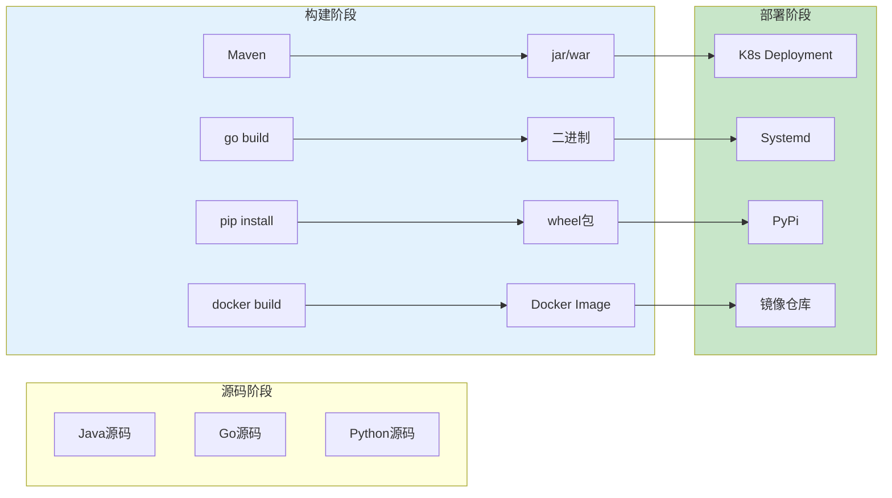
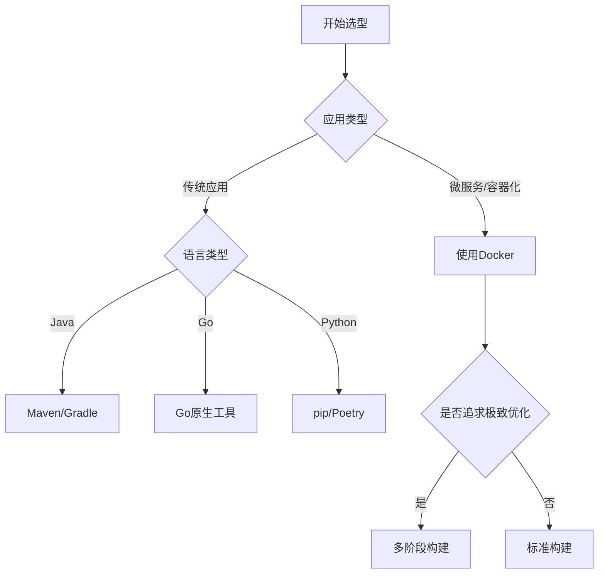

# 构建工具生产环境最佳实践：从Maven到Docker的工程化实践

## 情境(Situation)

应用交付是SRE的核心职责之一，而构建工具是CI/CD流水线的上游环节。不懂构建等于不懂发布。在现代微服务架构下，构建工具的选择和优化直接影响发布效率和系统可靠性。

在生产环境中管理构建流程面临诸多挑战：

- **构建速度慢**：依赖下载、编译时间长，影响发布效率
- **依赖管理混乱**：版本不一致、依赖冲突频繁
- **构建环境差异**：开发、测试、生产环境不一致，导致问题难以复现
- **构建产物体积大**：镜像臃肿、包体积大，部署慢
- **构建稳定性差**：频繁失败，影响发布流程
- **安全风险高**：依赖漏洞、构建过程安全问题

## 冲突(Conflict)

许多企业在构建管理中遇到以下问题：

- **构建流程不规范**：没有统一的构建标准，各团队各自为政
- **缓存利用不足**：没有充分利用构建缓存，每次都重新构建
- **依赖管理不当**：缺少依赖安全扫描和版本管理
- **多阶段构建缺失**：没有使用多阶段构建，镜像体积过大
- **构建过程不可控**：缺少构建监控和回滚机制

这些问题在生产环境中可能导致发布延期、版本不一致、部署失败、甚至安全漏洞。

## 问题(Question)

如何在生产环境中构建高效、稳定、安全的构建流程？

## 答案(Answer)

本文将从SRE视角出发，结合真实生产案例，提供一套完整的构建工具生产环境最佳实践。核心方法论基于 [SRE面试题解析：源代码构建工具](#8-源代码构建工具)。

---

## 一、主流构建工具对比与选型

### 1.1 主流语言构建工具

**主流构建工具对比**：

| 语言 | 构建工具 | 典型命令 | 产物 | 优势 |
|:----:|----------|----------|------|------|
| **Java** | Maven/Gradle | `mvn clean package -Dmaven.test.skip=true` | .jar/.war | 生态完善，依赖管理强 |
| **Go** | go build | `go build -o app main.go` | 二进制文件 | 快速编译，静态链接 |
| **Python** | pip/pyinstaller | `python3 -m py_compile app.py` | .pyc/独立可执行文件 | 简单易用，生态丰富 |
| **C/C++** | Make/CMake | `./configure && make && make install` | 可执行文件/库 | 高性能，平台支持好 |
| **容器化** | Docker | `docker build -t image:tag .` | OCI镜像 | 环境一致性，易于部署 |

**构建流程架构**：



### 1.2 构建工具选型决策

**选型决策树**：



---

## 二、Java构建最佳实践（Maven）

### 2.1 Maven基础配置

**标准pom.xml配置**：

```xml
<?xml version="1.0" encoding="UTF-8"?>
<project xmlns="http://maven.apache.org/POM/4.0.0"
         xmlns:xsi="http://www.w3.org/2001/XMLSchema-instance"
         xsi:schemaLocation="http://maven.apache.org/POM/4.0.0
         http://maven.apache.org/xsd/maven-4.0.0.xsd">
    
    <modelVersion>4.0.0</modelVersion>
    <groupId>com.example</groupId>
    <artifactId>my-app</artifactId>
    <version>1.0.0-SNAPSHOT</version>
    <packaging>jar</packaging>
    
    <name>My Application</name>
    <description>My Application Description</description>
    
    <properties>
        <java.version>17</java.version>
        <maven.compiler.source>${java.version}</maven.compiler.source>
        <maven.compiler.target>${java.version}</maven.compiler.target>
        <project.build.sourceEncoding>UTF-8</project.build.sourceEncoding>
    </properties>
    
    <dependencies>
        <dependency>
            <groupId>org.springframework.boot</groupId>
            <artifactId>spring-boot-starter-web</artifactId>
            <version>3.2.0</version>
        </dependency>
        
        <dependency>
            <groupId>org.springframework.boot</groupId>
            <artifactId>spring-boot-starter-test</artifactId>
            <version>3.2.0</version>
            <scope>test</scope>
        </dependency>
    </dependencies>
    
    <build>
        <plugins>
            <plugin>
                <groupId>org.springframework.boot</groupId>
                <artifactId>spring-boot-maven-plugin</artifactId>
                <version>3.2.0</version>
                <executions>
                    <execution>
                        <goals>
                            <goal>repackage</goal>
                        </goals>
                    </execution>
                </executions>
            </plugin>
        </plugins>
    </build>
</project>
```

### 2.2 Maven构建优化

**Maven构建优化脚本**：

```bash
#!/bin/bash
# maven_build_optimized.sh - 优化的Maven构建脚本

set -euo pipefail

# 配置Maven仓库缓存
export MAVEN_OPTS="-Xmx2048m -Xms512m -XX:MaxPermSize=256m"

# 跳过测试，加速构建
if [ "$1" = "fast" ]; then
    echo "快速构建模式（跳过测试）"
    mvn clean package -Dmaven.test.skip=true -DskipTests
else
    echo "标准构建模式"
    mvn clean verify
fi

# 构建统计
echo ""
echo "构建完成！"
echo "构建产物: target/my-app-1.0.0-SNAPSHOT.jar"
ls -lh target/
```

**settings.xml配置优化**：

```xml
<?xml version="1.0" encoding="UTF-8"?>
<settings xmlns="http://maven.apache.org/SETTINGS/1.0.0"
          xmlns:xsi="http://www.w3.org/2001/XMLSchema-instance"
          xsi:schemaLocation="http://maven.apache.org/SETTINGS/1.0.0
          http://maven.apache.org/xsd/settings-1.0.0.xsd">
    
    <localRepository>/data/maven/repository</localRepository>
    
    <mirrors>
        <mirror>
            <id>aliyun</id>
            <mirrorOf>central</mirrorOf>
            <name>Aliyun Maven</name>
            <url>https://maven.aliyun.com/repository/public</url>
        </mirror>
    </mirrors>
    
    <profiles>
        <profile>
            <id>optimized-build</id>
            <properties>
                <maven.compiler.fork>true</maven.compiler.fork>
                <maven.compiler.maxmem>2048m</maven.compiler.maxmem>
            </properties>
        </profile>
    </profiles>
    
    <activeProfiles>
        <activeProfile>optimized-build</activeProfile>
    </activeProfiles>
</settings>
```

### 2.3 Maven依赖安全扫描

**依赖安全扫描脚本**：

```bash
#!/bin/bash
# maven_dependency_scan.sh - Maven依赖安全扫描

# 使用OWASP Dependency-Check
echo "运行OWASP Dependency-Check扫描..."
mvn org.owasp:dependency-check-maven:8.0.0:check

# 使用Snyk扫描
echo "运行Snyk扫描..."
if command -v snyk &>/dev/null; then
    snyk test --severity-threshold=high
else
    echo "Snyk未安装，跳过"
fi

echo "依赖扫描完成"
```

---

## 三、Go构建最佳实践

### 3.1 Go标准构建

**标准Go构建脚本**：

```bash
#!/bin/bash
# go_build.sh - Go构建脚本

set -euo pipefail

# 配置变量
APP_NAME="myapp"
VERSION="1.0.0"
BUILD_DIR="./build"

# 创建构建目录
mkdir -p "$BUILD_DIR"

# 清理旧文件
echo "清理旧文件..."
rm -f "$BUILD_DIR/$APP_NAME"*

# 静态编译
echo "编译 $APP_NAME..."
CGO_ENABLED=0 GOOS=linux GOARCH=amd64 go build \
    -a \
    -installsuffix cgo \
    -ldflags "-s -w -X main.version=$VERSION -X main.buildDate=$(date +%Y-%m-%d)" \
    -o "$BUILD_DIR/$APP_NAME-$VERSION-linux-amd64" \
    ./cmd/$APP_NAME

# 编译其他平台（可选）
echo "编译其他平台..."
CGO_ENABLED=0 GOOS=darwin GOARCH=amd64 go build \
    -a \
    -installsuffix cgo \
    -ldflags "-s -w -X main.version=$VERSION" \
    -o "$BUILD_DIR/$APP_NAME-$VERSION-darwin-amd64" \
    ./cmd/$APP_NAME

# 构建结果
echo ""
echo "构建完成！"
ls -lh "$BUILD_DIR"
```

### 3.2 Go构建优化

**Go构建优化指南**：

| 优化项 | 方法 | 效果 |
|:------:|------|------|
| **静态编译** | `CGO_ENABLED=0` | 单文件部署，无依赖 |
| **优化链接** | `-ldflags "-s -w"` | 减小二进制体积 |
| **模块缓存** | 缓存 `$GOPATH/pkg/mod` | 加速依赖下载 |
| **并行编译** | `-j $(nproc)` | 充分利用多核CPU |
| **增量构建** | 使用go build缓存 | 快速重新编译 |

**高性能Go构建脚本**：

```bash
#!/bin/bash
# go_build_optimized.sh - 优化的Go构建脚本

set -euo pipefail

# 配置Go模块代理
export GOPROXY=https://goproxy.cn,direct
export GOSUMDB=off

# 下载依赖（利用缓存）
echo "下载依赖..."
go mod download

# 快速构建（用于测试）
echo "快速构建..."
go build -v ./...

# 静态编译生产版本
echo "静态编译生产版本..."
CGO_ENABLED=0 GOOS=linux GOARCH=amd64 go build \
    -a \
    -installsuffix cgo \
    -ldflags "-s -w" \
    -o build/app \
    ./cmd/app

# UPX压缩（可选）
if command -v upx &>/dev/null; then
    echo "使用UPX压缩二进制..."
    upx --best --lzma build/app
fi

echo "构建完成！"
ls -lh build/
```

---

## 四、Python构建最佳实践

### 4.1 Python依赖管理

**使用Poetry管理依赖**：

```bash
#!/bin/bash
# python_poetry_build.sh - Python Poetry构建

# 安装Poetry（如果未安装）
if ! command -v poetry &>/dev/null; then
    echo "安装Poetry..."
    curl -sSL https://install.python-poetry.org | python3 -
    export PATH="$HOME/.local/bin:$PATH"
fi

# 配置虚拟环境
poetry config virtualenvs.in-project true

# 安装依赖
echo "安装依赖..."
poetry install --no-root --only main

# 运行测试
echo "运行测试..."
poetry run pytest tests/

# 构建包
echo "构建包..."
poetry build

# 构建结果
ls -lh dist/
```

**requirements.txt最佳实践**：

```
# requirements.txt
flask==2.3.3
requests==2.31.0
gunicorn==21.2.0
redis==5.0.1
celery==5.3.4

# 开发依赖
pytest==7.4.0
black==23.7.0
flake8==6.1.0
```

### 4.2 Python虚拟环境隔离

**Python虚拟环境管理脚本**：

```bash
#!/bin/bash
# python_venv_build.sh - Python虚拟环境构建

# 创建虚拟环境
python3 -m venv venv

# 激活虚拟环境
source venv/bin/activate

# 升级pip
pip install --upgrade pip setuptools wheel

# 安装依赖
pip install -r requirements.txt

# 安装开发依赖
pip install -r requirements-dev.txt

# 验证安装
python3 -c "import sys, flask; print(f'Python: {sys.version}, Flask: {flask.__version__}')"

echo "虚拟环境构建完成！"
```

---

## 五、Docker多阶段构建最佳实践

### 5.1 多阶段构建原理

**多阶段构建原理**：


### 5.2 多语言多阶段构建Dockerfile

**Java + Docker多阶段构建**：

```dockerfile
# 第一阶段：构建
FROM maven:3.9-eclipse-temurin-17 AS builder

WORKDIR /app

# 只复制pom.xml，利用缓存
COPY pom.xml .
RUN mvn dependency:go-offline

# 复制源码并构建
COPY src ./src
RUN mvn clean package -Dmaven.test.skip=true

# 第二阶段：运行
FROM eclipse-temurin:17-jre-alpine

WORKDIR /app

# 只复制构建产物
COPY --from=builder /app/target/*.jar app.jar

EXPOSE 8080

ENTRYPOINT ["java", "-jar", "app.jar"]
```

**Go + Docker多阶段构建**：

```dockerfile
# 第一阶段：构建
FROM golang:1.21-alpine AS builder

WORKDIR /app

# 先复制go.mod/go.sum，利用缓存
COPY go.mod go.sum ./
RUN go mod download

# 复制源码并构建
COPY . .
RUN CGO_ENABLED=0 GOOS=linux go build -a -installsuffix cgo -ldflags "-s -w" -o app ./cmd/app

# 第二阶段：运行（使用distroless镜像）
FROM gcr.io/distroless/static:latest

WORKDIR /app

COPY --from=builder /app/app .

EXPOSE 8080

ENTRYPOINT ["./app"]
```

**Python + Docker多阶段构建**：

```dockerfile
# 第一阶段：构建依赖
FROM python:3.11-slim AS builder

WORKDIR /app

# 安装构建依赖
RUN apt-get update && apt-get install -y --no-install-recommends \
    gcc \
    && rm -rf /var/lib/apt/lists/*

# 复制依赖文件
COPY requirements.txt .

# 安装依赖到特定目录
RUN pip install --user --no-cache-dir -r requirements.txt

# 第二阶段：运行
FROM python:3.11-slim

WORKDIR /app

# 复制依赖
COPY --from=builder /root/.local/lib/python3.11/site-packages /usr/local/lib/python3.11/site-packages
COPY --from=builder /root/.local/bin /usr/local/bin

# 复制应用代码
COPY . .

EXPOSE 8080

CMD ["python", "app.py"]
```

### 5.3 Docker BuildKit优化

**BuildKit优化配置**：

```bash
# 启用BuildKit
export DOCKER_BUILDKIT=1
export COMPOSE_DOCKER_CLI_BUILD=1

# 使用BuildKit构建
docker build -t myapp:latest --progress=plain .

# 并行构建
# 利用--mount=type=cache缓存构建依赖
```

**使用BuildKit的Dockerfile**：

```dockerfile
# syntax=docker/dockerfile:1

FROM golang:1.21-alpine AS builder

WORKDIR /app

# 缓存Go模块
RUN --mount=type=cache,target=/go/pkg/mod \
    --mount=type=cache,target=/root/.cache/go-build \
    --mount=type=bind,source=go.mod,target=go.mod \
    --mount=type=bind,source=go.sum,target=go.sum \
    go mod download

COPY . .

RUN --mount=type=cache,target=/go/pkg/mod \
    --mount=type=cache,target=/root/.cache/go-build \
    CGO_ENABLED=0 GOOS=linux go build -a -installsuffix cgo -ldflags "-s -w" -o app ./cmd/app

FROM alpine:latest

WORKDIR /app

COPY --from=builder /app/app .

EXPOSE 8080

ENTRYPOINT ["./app"]
```

---

## 六、构建缓存最佳实践

### 6.1 构建缓存策略

**构建缓存矩阵**：

| 工具 | 缓存位置 | 缓存内容 | 缓存策略 |
|:----:|---------|---------|---------|
| **Maven** | `~/.m2/repository` | 依赖JAR | 长期缓存 |
| **Go** | `$GOPATH/pkg/mod` | Go模块 | 长期缓存 |
| **Docker** | Docker layer | 镜像层 | 智能缓存 |
| **npm** | `~/.npm` | npm包 | 长期缓存 |

### 6.2 CI/CD构建缓存配置

**GitLab CI缓存配置**：

```yaml
# .gitlab-ci.yml
image: maven:3.9-eclipse-temurin-17

variables:
  MAVEN_OPTS: "-Dmaven.repo.local=.m2/repository"

cache:
  key: ${CI_JOB_NAME}
  paths:
    - .m2/repository
    - target

build:
  stage: build
  script:
    - mvn clean package -Dmaven.test.skip=true
  artifacts:
    paths:
      - target/*.jar
```

**GitHub Actions缓存配置**：

```yaml
# .github/workflows/build.yml
name: Build

on:
  push:
    branches: [ main ]

jobs:
  build:
    runs-on: ubuntu-latest
    
    steps:
    - uses: actions/checkout@v4
    
    - name: Set up Go
      uses: actions/setup-go@v4
      with:
        go-version: '1.21'
        cache: true
    
    - name: Build
      run: CGO_ENABLED=0 go build -v ./...
```

---

## 七、构建监控与最佳实践

### 7.1 构建监控指标

**关键构建监控指标**：

| 指标 | 描述 | 告警阈值 |
|:-----|:------|---------|
| **构建时间** | 从开始到完成的时间 | >10分钟 |
| **构建成功率** | 成功构建的比例 | <90% |
| **缓存命中率** | 构建缓存的使用率 | <70% |
| **依赖下载时间** | 下载依赖的时间 | >2分钟 |
| **测试通过率** | 测试通过的比例 | <95% |

### 7.2 构建日志与可观测性

**结构化构建日志脚本**：

```bash
#!/bin/bash
# structured_build.sh - 结构化构建日志脚本

set -euo pipefail

# 日志函数
log() {
    local level="$1"
    local message="$2"
    echo "{\"level\":\"$level\",\"ts\":\"$(date +%s)\",\"msg\":\"$message\"}"
}

# 开始构建
log "info" "开始构建"

# 计时
START=$(date +%s)

# 执行构建
if mvn clean package -Dmaven.test.skip=true; then
    DURATION=$(($(date +%s) - START))
    log "info" "构建完成"
    log "info" "构建耗时: ${DURATION}秒"
else
    log "error" "构建失败"
    exit 1
fi
```

---

## 八、生产环境案例分析

### 案例1：微服务构建优化

**背景**：某公司微服务构建速度慢，平均构建时间15分钟，影响发布效率

**问题分析**：
- 没有利用缓存，每次都重新下载依赖
- 没有使用多阶段构建，镜像体积大
- 没有并行构建，效率低

**解决方案**：
1. **启用构建缓存**：配置Maven和Go模块缓存
2. **多阶段构建**：使用Docker多阶段构建减小镜像
3. **并行编译**：利用BuildKit并行构建
4. **优化依赖**：减少不必要的依赖

**效果**：
- 构建时间：15分钟 → 3分钟
- 镜像体积：500MB → 100MB
- 发布效率：提升5倍

### 案例2：构建环境一致性

**背景**：开发环境和生产环境不一致，经常出现"本地好的，线上坏了"

**问题分析**：
- JDK版本不一致
- 依赖版本不一致
- 操作系统环境差异

**解决方案**：
1. **容器化构建**：使用Docker统一构建环境
2. **版本锁定**：锁定依赖版本
3. **CI/CD集成**：使用统一的CI/CD流程

**效果**：
- 构建环境一致性：100%
- 环境问题减少：90%
- 发布稳定性：显著提升

### 案例3：构建安全加固

**背景**：发现项目依赖中存在严重安全漏洞

**问题分析**：
- 没有定期更新依赖
- 没有依赖安全扫描
- 依赖版本过旧

**解决方案**：
1. **依赖扫描**：集成OWASP Dependency-Check和Snyk
2. **自动更新**：使用Dependabot自动更新依赖
3. **安全策略**：建立依赖审核流程

**效果**：
- 安全漏洞发现率：100%
- 漏洞修复速度：显著提升
- 安全风险：有效降低

---

## 九、最佳实践总结

### 9.1 构建最佳实践要点

| 最佳实践 | 说明 | 收益 |
|:---------|-----|------|
| **多阶段构建** | 将构建和运行分离 | 减小镜像体积 |
| **构建缓存** | 利用缓存加速构建 | 缩短构建时间 |
| **依赖管理** | 锁定版本，定期扫描 | 稳定性和安全 |
| **环境一致性** | 容器化构建环境 | 可复现问题 |
| **并行构建** | 利用多核和BuildKit | 提高效率 |
| **监控告警** | 监控构建指标 | 及时发现问题 |

### 9.2 各语言构建总结

- **Java**：使用Maven/Gradle，配置优化参数，利用Maven缓存
- **Go**：静态编译，使用模块缓存，减小二进制体积
- **Python**：虚拟环境隔离，使用Poetry/pip，锁定依赖版本
- **容器**：多阶段构建，使用BuildKit优化，选择轻量级基础镜像

---

## 总结

构建工具是CI/CD流水线的重要环节，高效稳定的构建流程对保证发布质量和效率至关重要。通过本文提供的最佳实践，你可以构建出高效、稳定、安全的构建流程。

**核心要点**：

1. **工具选择**：根据语言和场景选择合适的构建工具
2. **多阶段构建**：利用多阶段构建减小镜像体积
3. **缓存优化**：充分利用构建缓存，加快构建速度
4. **安全扫描**：定期扫描依赖，确保安全
5. **监控告警**：建立完整的监控和告警机制

> **延伸学习**：更多面试相关的构建工具问题，请参考 [SRE面试题解析：源代码构建工具](#8-源代码构建工具)。

---

## 参考资料

- [Apache Maven官方文档](https://maven.apache.org/guides/index.html)
- [Go官方文档](https://golang.org/doc/)
- [Docker官方文档](https://docs.docker.com/)
- [Python包管理指南](https://packaging.python.org/)
- [BuildKit文档](https://docs.docker.com/build/buildkit/)
- [OWASP Dependency-Check](https://owasp.org/www-project-dependency-check/)
- [Snyk官网](https://snyk.io/)
- [GitHub Actions缓存](https://docs.github.com/en/actions/guides/caching-dependencies-to-speed-up-workflows)
- [GitLab CI/CD](https://docs.gitlab.com/ee/ci/)
- [Jenkins构建优化](https://www.jenkins.io/doc/book/pipeline/)
