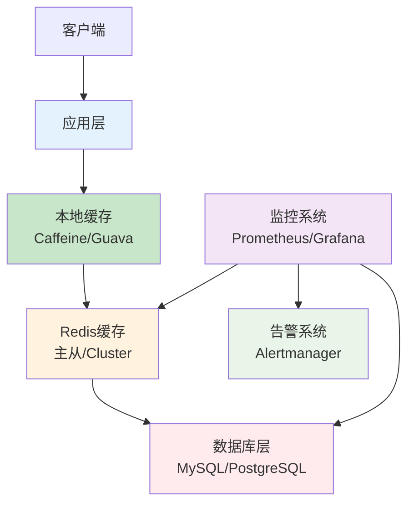

# 缓存问题处理生产环境最佳实践：击穿、穿透、雪崩与宕机应对策略

## 情境(Situation)

在构建高并发系统时，缓存是提升性能的关键组件。然而，随着业务流量的增长，缓存系统面临着各种挑战：热点数据过期导致数据库压力激增、恶意请求绕过缓存直接冲击数据库、大量缓存同时过期造成系统崩溃、缓存服务整体不可用等问题。

这些缓存问题如果处理不当，可能导致整个系统崩溃，给业务带来严重损失。作为SRE工程师，掌握缓存问题的识别与解决方案，是保障系统稳定性的核心技能。

## 冲突(Conflict)

许多SRE工程师在处理缓存问题时遇到以下挑战：

- **问题识别困难**：无法快速识别是哪种缓存问题
- **解决方案选择**：不知道哪种解决方案最适合特定场景
- **实施复杂度**：解决方案的实施和维护成本高
- **效果评估**：难以评估解决方案的实际效果
- **系统集成**：缓存解决方案与现有系统的集成困难
- **监控告警**：缺乏有效的监控和告警机制

## 问题(Question)

如何在生产环境中有效识别、预防和处理四大缓存问题（缓存击穿、缓存穿透、缓存雪崩、缓存宕机），确保系统的高可用性和稳定性？

## 答案(Answer)

本文将从SRE视角出发，结合真实生产案例，提供一套完整的缓存问题处理生产环境最佳实践。核心方法论基于 [SRE面试题解析：缓存四大问题](#26-缓存击穿缓存穿透缓存雪崩缓存宕机是什么怎么处理)。

---

## 一、缓存四大问题分析

### 1.1 问题定义与对比

**四大缓存问题对比表**：

| 问题 | 定义 | 特征 | 原因 | 影响 | 风险等级 |
|:-----|:-----|:-----|:-----|:-----|:----------|
| **缓存击穿** | 热点key过期，大量请求直接打到数据库 | 突发流量，集中在单个key | 热点数据过期 | 数据库压力激增，可能宕机 | ⭐⭐⭐ |
| **缓存穿透** | 查询不存在的数据，缓存和数据库都没有 | 持续的无效请求 | 恶意攻击、参数校验不当 | 数据库资源浪费，可能被DDoS | ⭐⭐⭐⭐ |
| **缓存雪崩** | 大量key同时过期，请求集中打数据库 | 短时间内大量key过期 | 缓存服务宕机、集中过期 | 数据库压力骤增，可能级联故障 | ⭐⭐⭐⭐⭐ |
| **缓存宕机** | 缓存服务整体不可用 | 缓存完全无响应 | 硬件故障、网络中断、配置错误 | 数据库承受全部流量，系统崩溃 | ⭐⭐⭐⭐⭐ |

### 1.2 问题识别方法

**快速识别缓存问题**：

| 症状 | 可能的问题 | 验证方法 |
|:-----|:-----------|:----------|
| 数据库CPU突增，单一SQL语句频繁执行 | 缓存击穿 | 检查慢查询日志，查看是否有热点key |
| 数据库查询大量不存在的数据 | 缓存穿透 | 分析查询日志，统计不存在数据的查询比例 |
| 大量缓存key同时过期，数据库压力骤增 | 缓存雪崩 | 检查缓存过期时间分布，查看监控曲线 |
| 缓存服务完全无响应，所有请求打数据库 | 缓存宕机 | 检查缓存服务状态，网络连接 |

### 1.3 问题影响评估

**影响范围评估**：

| 问题 | 影响范围 | 持续时间 | 恢复难度 | 业务影响 |
|:-----|:---------|:----------|:----------|:----------|
| **缓存击穿** | 局部 | 短暂 | 低 | 服务响应慢，可能影响热点功能 |
| **缓存穿透** | 全局 | 持续 | 中 | 系统整体性能下降，可能被DDoS |
| **缓存雪崩** | 全局 | 短暂 | 高 | 系统崩溃，服务不可用 |
| **缓存宕机** | 全局 | 较长 | 高 | 系统完全不可用，数据丢失风险 |

---

## 二、缓存击穿解决方案

### 2.1 问题分析

**缓存击穿的本质**：热点数据过期时，大量并发请求同时尝试获取数据，都发现缓存已过期，于是同时向数据库发起查询，导致数据库压力激增。

**常见场景**：
- 热门商品详情页
- 热门文章或视频
- 秒杀活动页面
- 热点新闻

### 2.2 解决方案

**方案1：互斥锁**

```python
import redis
import time

class CacheLock:
    def __init__(self, redis_client, lock_prefix="lock:"):
        self.redis = redis_client
        self.lock_prefix = lock_prefix
    
    def get_with_lock(self, key, db_query_func, expire=3600, lock_timeout=10):
        """带锁获取缓存"""
        # 尝试从缓存获取
        value = self.redis.get(key)
        if value:
            return value
        
        # 缓存不存在，尝试获取锁
        lock_key = f"{self.lock_prefix}{key}"
        lock_acquired = self.redis.set(lock_key, "1", nx=True, ex=lock_timeout)
        
        if lock_acquired:
            try:
                # 获取锁成功，查询数据库
                value = db_query_func()
                # 写入缓存
                self.redis.setex(key, expire, value)
                return value
            finally:
                # 释放锁
                self.redis.delete(lock_key)
        else:
            # 未获取到锁，短暂等待后重试
            time.sleep(0.1)
            return self.get_with_lock(key, db_query_func, expire, lock_timeout)

# 使用示例
redis_client = redis.Redis()
cache_lock = CacheLock(redis_client)

def get_product_detail(product_id):
    def query_db():
        # 从数据库查询
        return db.query(f"SELECT * FROM products WHERE id = {product_id}")
    
    return cache_lock.get_with_lock(
        f"product:{product_id}",
        query_db,
        expire=3600,
        lock_timeout=10
    )
```

**方案2：热点数据永不过期**

```python
class HotDataCache:
    def __init__(self, redis_client):
        self.redis = redis_client
    
    def get_hot_data(self, key, db_query_func):
        """获取热点数据（永不过期）"""
        value = self.redis.get(key)
        if value:
            # 缓存存在，直接返回
            # 后台异步更新缓存
            self._async_update(key, db_query_func)
            return value
        
        # 缓存不存在，同步更新
        value = db_query_func()
        # 永不过期
        self.redis.set(key, value)
        return value
    
    def _async_update(self, key, db_query_func):
        """异步更新缓存"""
        import threading
        
        def update_task():
            try:
                value = db_query_func()
                self.redis.set(key, value)
            except Exception as e:
                print(f"异步更新缓存失败: {e}")
        
        thread = threading.Thread(target=update_task)
        thread.daemon = True
        thread.start()

# 使用示例
hot_cache = HotDataCache(redis_client)

def get_hot_product(product_id):
    def query_db():
        return db.query(f"SELECT * FROM products WHERE id = {product_id}")
    
    return hot_cache.get_hot_data(f"hot:product:{product_id}", query_db)
```

**方案3：逻辑过期**

```python
class LogicExpireCache:
    def __init__(self, redis_client):
        self.redis = redis_client
    
    def get_with_logic_expire(self, key, db_query_func, expire=3600):
        """逻辑过期"""
        # 从缓存获取（包含过期时间）
        data = self.redis.get(key)
        if not data:
            # 缓存不存在，查询数据库并设置
            value = db_query_func()
            # 存储值和过期时间
            cache_data = {
                "value": value,
                "expire_time": time.time() + expire
            }
            self.redis.set(key, json.dumps(cache_data))
            return value
        
        # 解析缓存数据
        cache_data = json.loads(data)
        if time.time() < cache_data["expire_time"]:
            # 未过期，直接返回
            return cache_data["value"]
        
        # 已过期，异步更新
        self._async_update(key, db_query_func, expire)
        # 返回旧值，不阻塞请求
        return cache_data["value"]
    
    def _async_update(self, key, db_query_func, expire):
        """异步更新缓存"""
        import threading
        
        def update_task():
            try:
                value = db_query_func()
                cache_data = {
                    "value": value,
                    "expire_time": time.time() + expire
                }
                self.redis.set(key, json.dumps(cache_data))
            except Exception as e:
                print(f"异步更新缓存失败: {e}")
        
        thread = threading.Thread(target=update_task)
        thread.daemon = True
        thread.start()

# 使用示例
logic_cache = LogicExpireCache(redis_client)

def get_product(product_id):
    def query_db():
        return db.query(f"SELECT * FROM products WHERE id = {product_id}")
    
    return logic_cache.get_with_logic_expire(
        f"product:{product_id}",
        query_db,
        expire=3600
    )
```

### 2.3 最佳实践

**选择建议**：
- **互斥锁**：适合对一致性要求高的场景
- **永不过期**：适合变更不频繁的热点数据
- **逻辑过期**：适合对实时性要求不高的场景

**实施要点**：
- 锁的超时时间要合理，避免死锁
- 异步更新要做好异常处理
- 监控热点数据的访问情况

---

## 三、缓存穿透解决方案

### 3.1 问题分析

**缓存穿透的本质**：攻击者或恶意用户查询不存在的数据，这些数据在缓存和数据库中都不存在，导致每次请求都直接打到数据库。

**常见场景**：
- 恶意攻击：大量查询不存在的ID
- 业务错误：参数校验不当
- 爬虫抓取：无差别爬取

### 3.2 解决方案

**方案1：布隆过滤器**

```python
import redis
import mmh3
from bitarray import bitarray

class BloomFilter:
    def __init__(self, redis_client, key="bloom:filter", capacity=1000000, error_rate=0.01):
        self.redis = redis_client
        self.key = key
        self.capacity = capacity
        self.error_rate = error_rate
        self.num_hashes = int(-(math.log(error_rate) / math.log(2)))
        self.bit_size = int(self.capacity * -math.log(error_rate) / (math.log(2) ** 2))
    
    def add(self, item):
        """添加元素到布隆过滤器"""
        for i in range(self.num_hashes):
            index = mmh3.hash(item, i) % self.bit_size
            self.redis.setbit(self.key, index, 1)
    
    def contains(self, item):
        """检查元素是否在布隆过滤器中"""
        for i in range(self.num_hashes):
            index = mmh3.hash(item, i) % self.bit_size
            if not self.redis.getbit(self.key, index):
                return False
        return True
    
    def initialize(self, items):
        """批量初始化"""
        pipe = self.redis.pipeline()
        for item in items:
            for i in range(self.num_hashes):
                index = mmh3.hash(item, i) % self.bit_size
                pipe.setbit(self.key, index, 1)
        pipe.execute()

# 使用示例
bloom_filter = BloomFilter(redis_client)

# 初始化布隆过滤器
products = db.query("SELECT id FROM products")
bloom_filter.initialize([str(p["id"]) for p in products])

def get_product(product_id):
    # 先检查布隆过滤器
    if not bloom_filter.contains(str(product_id)):
        return None  # 一定不存在
    
    # 布隆过滤器存在，可能存在，再查缓存
    cache_key = f"product:{product_id}"
    value = redis_client.get(cache_key)
    if value:
        return value
    
    # 查数据库
    value = db.query(f"SELECT * FROM products WHERE id = {product_id}")
    if value:
        redis_client.setex(cache_key, 3600, value)
    else:
        # 空值也缓存，防止穿透
        redis_client.setex(cache_key, 60, "NULL")
    
    return value
```

**方案2：空值缓存**

```python
class NullCache:
    def __init__(self, redis_client, null_ttl=60):
        self.redis = redis_client
        self.null_ttl = null_ttl  # 空值缓存时间
    
    def get_with_null_cache(self, key, db_query_func, expire=3600):
        """带空值缓存的获取"""
        # 尝试从缓存获取
        value = self.redis.get(key)
        if value == "NULL":
            return None  # 空值，直接返回
        if value:
            return value
        
        # 缓存不存在，查询数据库
        value = db_query_func()
        if value:
            # 有值，正常缓存
            self.redis.setex(key, expire, value)
        else:
            # 空值，缓存较短时间
            self.redis.setex(key, self.null_ttl, "NULL")
        
        return value

# 使用示例
null_cache = NullCache(redis_client)

def get_user(user_id):
    def query_db():
        return db.query(f"SELECT * FROM users WHERE id = {user_id}")
    
    return null_cache.get_with_null_cache(
        f"user:{user_id}",
        query_db,
        expire=3600
    )
```

**方案3：参数校验**

```python
class ParameterValidator:
    def __init__(self):
        pass
    
    def validate_id(self, id_value, min_value=1, max_value=1000000):
        """验证ID参数"""
        if not isinstance(id_value, int):
            try:
                id_value = int(id_value)
            except:
                return False, "Invalid ID format"
        
        if id_value < min_value or id_value > max_value:
            return False, "ID out of range"
        
        return True, ""
    
    def validate_product_id(self, product_id):
        """验证商品ID"""
        return self.validate_id(product_id, 1, 1000000)

# 使用示例
validator = ParameterValidator()

def get_product(product_id):
    # 参数校验
    valid, msg = validator.validate_product_id(product_id)
    if not valid:
        return None, msg
    
    # 正常查询逻辑
    # ...
```

### 3.3 最佳实践

**选择建议**：
- **布隆过滤器**：适合数据量较大的场景
- **空值缓存**：实现简单，适合中小规模系统
- **参数校验**：作为第一道防线，必须实施

**实施要点**：
- 布隆过滤器要定期更新
- 空值缓存时间不宜过长
- 结合多种方案使用

---

## 四、缓存雪崩解决方案

### 4.1 问题分析

**缓存雪崩的本质**：大量缓存key在同一时间过期，导致大量请求同时打到数据库，造成数据库压力骤增。

**常见原因**：
- 缓存服务宕机
- 批量设置相同的过期时间
- 系统重启后缓存集中过期
- 缓存预热时设置相同过期时间

### 4.2 解决方案

**方案1：过期时间随机化**

```python
import random

class RandomExpireCache:
    def __init__(self, redis_client):
        self.redis = redis_client
    
    def set_with_random_expire(self, key, value, base_expire=3600, random_range=600):
        """设置缓存，添加随机过期时间"""
        # 计算过期时间：基础时间 + 随机时间
        expire = base_expire + random.randint(0, random_range)
        self.redis.setex(key, expire, value)
    
    def batch_set_with_random_expire(self, keys_values, base_expire=3600, random_range=600):
        """批量设置缓存"""
        pipe = self.redis.pipeline()
        for key, value in keys_values.items():
            expire = base_expire + random.randint(0, random_range)
            pipe.setex(key, expire, value)
        pipe.execute()

# 使用示例
random_cache = RandomExpireCache(redis_client)

# 单个设置
random_cache.set_with_random_expire("product:1001", "product data", 3600, 600)

# 批量设置
products = {"product:1001": "data1", "product:1002": "data2"}
random_cache.batch_set_with_random_expire(products, 3600, 600)
```

**方案2：多级缓存**

```python
from functools import lru_cache

class MultiLevelCache:
    def __init__(self, redis_client):
        self.redis = redis_client
        # 本地缓存（LRU）
        self.local_cache = lru_cache(maxsize=1000)
    
    def get(self, key, db_query_func, expire=3600):
        """多级缓存获取"""
        # 1. 本地缓存
        try:
            value = self.local_cache(key)
            return value
        except:
            pass
        
        # 2. Redis缓存
        value = self.redis.get(key)
        if value:
            # 更新本地缓存
            self.local_cache(key, value)
            return value
        
        # 3. 数据库
        value = db_query_func()
        if value:
            # 更新Redis缓存
            self.redis.setex(key, expire, value)
            # 更新本地缓存
            self.local_cache(key, value)
        
        return value

# 使用示例
multi_cache = MultiLevelCache(redis_client)

def get_product(product_id):
    def query_db():
        return db.query(f"SELECT * FROM products WHERE id = {product_id}")
    
    return multi_cache.get(f"product:{product_id}", query_db, 3600)
```

**方案3：熔断限流**

```python
class CircuitBreaker:
    def __init__(self, failure_threshold=5, timeout=60):
        self.failure_count = 0
        self.failure_threshold = failure_threshold
        self.timeout = timeout
        self.last_failure_time = 0
        self.state = "CLOSED"
    
    def call(self, func, fallback_func):
        """带熔断的调用"""
        current_time = time.time()
        
        # 检查是否应该从OPEN状态恢复到CLOSED状态
        if self.state == "OPEN" and current_time - self.last_failure_time > self.timeout:
            self.state = "CLOSED"
            self.failure_count = 0
        
        if self.state == "OPEN":
            # 熔断开启，调用降级函数
            return fallback_func()
        
        try:
            # 正常调用
            result = func()
            # 调用成功，重置失败计数
            self.failure_count = 0
            return result
        except Exception as e:
            # 调用失败，增加失败计数
            self.failure_count += 1
            self.last_failure_time = current_time
            
            # 检查是否应该开启熔断
            if self.failure_count >= self.failure_threshold:
                self.state = "OPEN"
            
            # 调用降级函数
            return fallback_func()

# 使用示例
breaker = CircuitBreaker()

def get_product_with_breaker(product_id):
    def normal_func():
        # 正常查询逻辑
        return get_product_from_cache_or_db(product_id)
    
    def fallback_func():
        # 降级处理
        return {"error": "Service temporarily unavailable"}
    
    return breaker.call(normal_func, fallback_func)
```

### 4.3 最佳实践

**选择建议**：
- **过期时间随机化**：基础方案，必须实施
- **多级缓存**：提升性能，减轻Redis压力
- **熔断限流**：保护数据库，防止级联故障

**实施要点**：
- 合理设置随机过期时间范围
- 本地缓存要控制大小
- 熔断阈值要根据实际情况调整

---

## 五、缓存宕机解决方案

### 5.1 问题分析

**缓存宕机的本质**：缓存服务整体不可用，所有请求直接打到数据库，可能导致数据库崩溃。

**常见原因**：
- 硬件故障：服务器宕机、磁盘损坏
- 网络问题：网络中断、DNS故障
- 配置错误：内存不足、连接数超限
- 软件bug：Redis版本bug、内存泄漏

### 5.2 解决方案

**方案1：熔断机制**

```python
class CacheCircuitBreaker:
    def __init__(self, redis_client, failure_threshold=5, timeout=60):
        self.redis = redis_client
        self.failure_threshold = failure_threshold
        self.timeout = timeout
        self.failure_count = 0
        self.last_failure_time = 0
        self.state = "CLOSED"
    
    def is_redis_available(self):
        """检查Redis是否可用"""
        try:
            self.redis.ping()
            return True
        except:
            return False
    
    def get(self, key, db_query_func):
        """带熔断的获取"""
        current_time = time.time()
        
        # 检查状态
        if self.state == "OPEN":
            if current_time - self.last_failure_time > self.timeout:
                # 尝试恢复
                if self.is_redis_available():
                    self.state = "CLOSED"
                    self.failure_count = 0
                else:
                    # 仍然不可用，直接查数据库
                    return db_query_func()
        
        try:
            # 尝试从Redis获取
            value = self.redis.get(key)
            if value:
                return value
            
            # Redis可用但缓存不存在，查数据库
            value = db_query_func()
            # 尝试写回缓存
            try:
                self.redis.setex(key, 3600, value)
            except:
                pass
            return value
        except Exception as e:
            # Redis不可用
            self.failure_count += 1
            self.last_failure_time = current_time
            
            if self.failure_count >= self.failure_threshold:
                self.state = "OPEN"
            
            # 直接查数据库
            return db_query_func()

# 使用示例
cache_breaker = CacheCircuitBreaker(redis_client)

def get_data_with_breaker(key):
    def query_db():
        return db.query(f"SELECT * FROM data WHERE key = '{key}'")
    
    return cache_breaker.get(key, query_db)
```

**方案2：本地缓存**

```python
class LocalCache:
    def __init__(self, max_size=10000, default_ttl=3600):
        self.cache = {}
        self.max_size = max_size
        self.default_ttl = default_ttl
        self.lock = threading.RLock()
    
    def get(self, key):
        """获取本地缓存"""
        with self.lock:
            if key in self.cache:
                value, expire_time = self.cache[key]
                if time.time() < expire_time:
                    return value
                # 过期，删除
                del self.cache[key]
        return None
    
    def set(self, key, value, ttl=None):
        """设置本地缓存"""
        with self.lock:
            # 检查缓存大小
            if len(self.cache) >= self.max_size:
                # 删除最旧的项
                oldest_key = next(iter(self.cache))
                del self.cache[oldest_key]
            
            # 设置缓存
            expire_time = time.time() + (ttl or self.default_ttl)
            self.cache[key] = (value, expire_time)
    
    def delete(self, key):
        """删除本地缓存"""
        with self.lock:
            if key in self.cache:
                del self.cache[key]

# 全局本地缓存实例
local_cache = LocalCache()

# 结合本地缓存和Redis
def get_data(key):
    # 先查本地缓存
    value = local_cache.get(key)
    if value:
        return value
    
    try:
        # 查Redis
        value = redis_client.get(key)
        if value:
            # 更新本地缓存
            local_cache.set(key, value)
            return value
    except:
        # Redis不可用，继续查数据库
        pass
    
    # 查数据库
    value = db.query(f"SELECT * FROM data WHERE key = '{key}'")
    if value:
        # 更新本地缓存
        local_cache.set(key, value)
        # 尝试更新Redis
        try:
            redis_client.setex(key, 3600, value)
        except:
            pass
    
    return value
```

**方案3：数据库限流**

```python
import redis
from functools import wraps

class RateLimiter:
    def __init__(self, redis_client, key_prefix="rate_limit:", limit=100, period=60):
        self.redis = redis_client
        self.key_prefix = key_prefix
        self.limit = limit  # 限制次数
        self.period = period  # 时间窗口（秒）
    
    def is_allowed(self, key):
        """检查是否允许请求"""
        full_key = f"{self.key_prefix}{key}"
        
        # 使用滑动窗口计数
        current_time = int(time.time())
        pipeline = self.redis.pipeline()
        
        # 移除窗口外的记录
        pipeline.zremrangebyscore(full_key, 0, current_time - self.period)
        # 添加当前请求
        pipeline.zadd(full_key, {str(current_time): current_time})
        # 设置过期时间
        pipeline.expire(full_key, self.period)
        # 获取当前窗口内的请求数
        pipeline.zcard(full_key)
        
        results = pipeline.execute()
        count = results[-1]
        
        return count <= self.limit
    
    def decorator(self, key_func=None):
        """限流装饰器"""
        def decorator(func):
            @wraps(func)
            def wrapper(*args, **kwargs):
                # 生成限流key
                if key_func:
                    key = key_func(*args, **kwargs)
                else:
                    key = "default"
                
                if not self.is_allowed(key):
                    raise Exception("Rate limit exceeded")
                
                return func(*args, **kwargs)
            return wrapper
        return decorator

# 使用示例
limiter = RateLimiter(redis_client, limit=100, period=60)

@limiter.decorator(lambda product_id: f"product:{product_id}")
def get_product(product_id):
    # 正常查询逻辑
    return db.query(f"SELECT * FROM products WHERE id = {product_id}")
```

### 5.3 最佳实践

**选择建议**：
- **熔断机制**：快速检测和响应缓存故障
- **本地缓存**：作为缓存宕机的应急方案
- **数据库限流**：保护数据库不被压垮

**实施要点**：
- 本地缓存要控制大小，避免内存溢出
- 限流策略要合理，避免影响正常请求
- 缓存恢复后要及时预热

---

## 六、综合解决方案

### 6.1 缓存架构设计

**高可用缓存架构**：



**架构组件说明**：

1. **本地缓存**：
   - 存储热点数据
   - 减少Redis访问
   - 缓存宕机时的应急方案

2. **Redis缓存**：
   - 主从复制保证高可用
   - Redis Cluster实现数据分片
   - 持久化保证数据安全

3. **数据库层**：
   - 最终数据源
   - 限流保护
   - 备份恢复

4. **监控告警**：
   - 实时监控缓存状态
   - 及时发现异常
   - 自动告警

### 6.2 缓存问题处理流程

**标准处理流程**：

1. **问题发现**：
   - 监控系统告警
   - 应用日志异常
   - 用户反馈

2. **快速止血**：
   - 缓存击穿：启用互斥锁
   - 缓存穿透：启用布隆过滤器
   - 缓存雪崩：快速扩容、启用熔断
   - 缓存宕机：启用本地缓存、数据库限流

3. **问题定位**：
   - 分析监控数据
   - 查看Redis日志
   - 检查数据库慢查询

4. **彻底解决**：
   - 优化缓存策略
   - 调整配置参数
   - 改进架构设计

5. **复盘总结**：
   - 记录问题原因
   - 制定预防措施
   - 更新监控策略

### 6.3 监控与告警

**关键监控指标**：

| 指标 | 描述 | 告警阈值 | 监控工具 |
|:-----|:-----|:---------|:----------|
| **缓存命中率** | 缓存命中次数/总请求次数 | < 80% | Prometheus |
| **缓存延迟** | 缓存响应时间 | > 10ms | Prometheus |
| **Redis内存使用** | 内存使用率 | > 80% | Prometheus |
| **Redis连接数** | 当前连接数 | > 80% 最大连接数 | Prometheus |
| **数据库QPS** | 数据库查询每秒 | 突增50% | Prometheus |
| **慢查询数** | 慢查询数量 | > 100 | Redis慢查询日志 |
| **缓存过期数量** | 过期key数量 | 突增 | Prometheus |

**告警配置**：

```yaml
# Prometheus告警规则
groups:
  - name: cache_alerts
    rules:
    - alert: CacheHitRateLow
      expr: cache_hit_rate < 0.8
      for: 5m
      labels:
        severity: warning
      annotations:
        summary: "缓存命中率低"
        description: "缓存命中率低于80%，持续5分钟"
    
    - alert: RedisMemoryHigh
      expr: redis_memory_used_bytes / redis_memory_max_bytes > 0.8
      for: 10m
      labels:
        severity: critical
      annotations:
        summary: "Redis内存使用过高"
        description: "Redis内存使用率超过80%，持续10分钟"
    
    - alert: DatabaseQPSHigh
      expr: rate(mysql_global_status_questions[5m]) > 1000
      for: 3m
      labels:
        severity: warning
      annotations:
        summary: "数据库QPS过高"
        description: "数据库QPS超过1000，持续3分钟"
```

---

## 七、生产环境案例分析

### 7.1 案例1：电商秒杀缓存击穿

**背景**：某电商平台在秒杀活动中，热点商品缓存过期，导致大量请求直接打到数据库，数据库崩溃。

**解决方案**：
1. **互斥锁**：实现分布式锁，只允许一个请求查询数据库
2. **热点数据永不过期**：对秒杀商品设置永不过期
3. **逻辑过期**：异步更新缓存，不阻塞请求

**实施效果**：
- 数据库压力降低90%
- 系统响应时间从5s降至100ms
- 秒杀活动顺利完成

### 7.2 案例2：API服务缓存穿透

**背景**：某API服务遭受恶意攻击，大量查询不存在的ID，导致数据库负载过高。

**解决方案**：
1. **布隆过滤器**：初始化所有有效ID
2. **空值缓存**：对不存在的数据缓存60秒
3. **参数校验**：加强ID范围校验

**实施效果**：
- 无效请求被拦截在缓存层
- 数据库QPS降低85%
- 系统恢复正常运行

### 7.3 案例3：系统重启缓存雪崩

**背景**：系统重启后，所有缓存key同时过期，导致数据库压力骤增。

**解决方案**：
1. **过期时间随机化**：添加300-600秒随机过期时间
2. **多级缓存**：启用本地缓存
3. **熔断限流**：保护数据库

**实施效果**：
- 缓存过期时间分散
- 数据库压力平稳
- 系统重启后无异常

### 7.4 案例4：Redis集群宕机

**背景**：Redis集群因网络故障完全不可用，所有请求打向数据库。

**解决方案**：
1. **熔断机制**：快速检测Redis故障
2. **本地缓存**：启用本地内存缓存
3. **数据库限流**：限制数据库QPS

**实施效果**：
- 系统保持可用
- 数据库未崩溃
- Redis恢复后自动切换回正常模式

---

## 八、最佳实践总结

### 8.1 预防措施

**日常预防**：

1. **缓存策略优化**：
   - 合理设置过期时间
   - 对热点数据特殊处理
   - 实施多级缓存

2. **监控体系**：
   - 建立完善的监控指标
   - 设置合理的告警阈值
   - 定期分析监控数据

3. **灾备方案**：
   - Redis主从复制
   - Redis Cluster
   - 本地缓存作为备份

4. **容量规划**：
   - 预估缓存容量
   - 定期清理过期数据
   - 监控内存使用

### 8.2 应急响应

**快速响应**：

1. **缓存击穿**：
   - 启用互斥锁
   - 临时禁用热点数据过期
   - 异步更新缓存

2. **缓存穿透**：
   - 启用布隆过滤器
   - 加强参数校验
   - 缓存空值

3. **缓存雪崩**：
   - 快速扩容Redis
   - 启用熔断机制
   - 分散过期时间

4. **缓存宕机**：
   - 启用本地缓存
   - 数据库限流
   - 快速恢复Redis服务

### 8.3 长期优化

**持续改进**：

1. **架构优化**：
   - 采用Redis Cluster
   - 实施读写分离
   - 考虑多级缓存架构

2. **代码优化**：
   - 封装缓存操作工具类
   - 统一缓存策略
   - 减少缓存依赖

3. **运维优化**：
   - 定期备份Redis数据
   - 监控Redis性能
   - 制定应急预案

4. **容量管理**：
   - 定期评估缓存容量
   - 优化数据结构
   - 清理无用缓存

---

## 总结

缓存问题是高并发系统的常见挑战，需要SRE工程师系统性地进行预防和处理。通过本文的介绍，我们深入了解了缓存击穿、缓存穿透、缓存雪崩、缓存宕机四大问题的成因和解决方案。

**核心要点**：

1. **缓存击穿**：使用互斥锁、热点数据永不过期、逻辑过期
2. **缓存穿透**：使用布隆过滤器、空值缓存、参数校验
3. **缓存雪崩**：使用过期时间随机化、多级缓存、熔断限流
4. **缓存宕机**：使用熔断机制、本地缓存、数据库限流

**最佳实践**：
- 结合多种解决方案
- 建立完善的监控体系
- 制定应急响应预案
- 持续优化缓存策略

通过科学的缓存设计和管理，我们可以充分发挥缓存的性能优势，同时避免缓存问题带来的系统风险，构建高可用、高性能的分布式系统。

> **延伸学习**：更多面试相关的缓存问题知识，请参考 [SRE面试题解析：缓存四大问题](#26-缓存击穿缓存穿透缓存雪崩缓存宕机是什么怎么处理)。

---

## 参考资料

- [Redis官方文档](https://redis.io/documentation)
- [缓存设计模式](https://martinfowler.com/eaaCatalog/cache.html)
- [布隆过滤器原理](https://en.wikipedia.org/wiki/Bloom_filter)
- [分布式锁实现](https://redis.io/topics/distlock)
- [缓存穿透解决方案](https://coolshell.cn/articles/17416.html)
- [Redis性能优化](https://redis.io/topics/performance)
- [高可用Redis架构](https://redis.io/topics/sentinel)
- [熔断机制设计](https://martinfowler.com/bliki/CircuitBreaker.html)
- [Rate Limiting](https://en.wikipedia.org/wiki/Rate_limiting)
- [多级缓存架构](https://medium.com/@joshgummersall/multi-level-caching-strategies-for-modern-applications-3b86b79f9038)
- [缓存一致性](https://www.baeldung.com/cs/cache-consistency)
- [Redis监控](https://redis.io/topics/monitoring)
- [数据库限流](https://engineering.classpass.com/building-a-scalable-rate-limiting-system-with-redis-977624b0b14a)