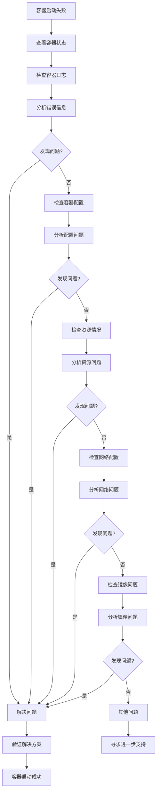

# 容器启动失败排查生产环境最佳实践：从日志分析到解决方案

## 情境(Situation)

在容器化环境中，容器启动失败是一个常见但棘手的问题。无论是新部署的容器还是运行中的容器重启，一旦启动失败，会直接影响服务的可用性。作为SRE工程师，快速定位和解决容器启动失败的问题，是确保系统稳定运行的关键技能。

## 冲突(Conflict)

在容器启动失败的排查过程中，SRE工程师经常面临以下挑战：

- **信息不足**：容器日志不完整或难以理解
- **排查路径不明确**：不知道从哪里开始排查
- **问题类型多样**：可能是配置、资源、网络或镜像问题
- **生产环境压力**：需要快速解决，避免服务中断
- **缺乏系统性方法**：没有标准化的排查流程

## 问题(Question)

如何建立一套系统化的容器启动失败排查流程，快速定位问题并有效解决，确保生产环境的稳定运行？

## 答案(Answer)

本文将从SRE视角出发，详细介绍容器启动失败的排查方法和最佳实践，涵盖排查流程、常见问题分析、解决方案和预防措施。核心方法论基于 [SRE面试题解析：如果一个容器起不来，如何排查出错原因](#37-如果一个容器起不来如何排查出错原因)。

---

## 一、容器启动失败排查流程

### 1.1 标准排查流程

**排查流程**：



**详细步骤**：

1. **查看容器状态**：确认容器的当前状态和退出码
2. **检查容器日志**：获取启动过程中的错误信息
3. **分析容器配置**：检查环境变量、挂载卷、网络配置等
4. **检查资源情况**：查看内存、CPU、磁盘和端口使用情况
5. **检查网络配置**：验证网络连接、DNS解析、端口映射等
6. **检查镜像问题**：确认镜像完整性、版本兼容性等
7. **验证解决方案**：应用修复后验证容器是否正常启动

### 1.2 核心命令

**查看容器状态**：

```bash
# 查看所有容器状态
docker ps -a

# 查看特定容器状态
docker ps -a | grep <容器名>

# 查看容器详细状态
docker inspect --format '{{ "{{" }}.State}}' <容器名>

# 查看容器退出码
docker inspect --format '{{ "{{" }}.State.ExitCode}}' <容器名>
```

**检查容器日志**：

```bash
# 查看容器日志
docker logs <容器名>

# 查看最后100行日志
docker logs --tail 100 <容器名>

# 实时跟踪日志
docker logs -f <容器名>

# 查看日志并显示时间戳
docker logs -t <容器名>

# 查看容器启动到失败的所有日志
docker logs --since 1h <容器名>
```

**检查容器配置**：

```bash
# 查看容器完整配置
docker inspect <容器名>

# 查看容器命令
docker inspect --format '{{ "{{" }}.Config.Cmd}}' <容器名>

# 查看环境变量
docker inspect --format '{{ "{{" }}.Config.Env}}' <容器名>

# 查看挂载卷
docker inspect --format '{{ "{{" }}.Mounts}}' <容器名>

# 查看端口映射
docker port <容器名>

# 查看资源限制
docker inspect --format '{{ "{{" }}.HostConfig}}' <容器名>
```

**检查资源情况**：

```bash
# 查看容器资源使用
docker stats <容器名>

# 查看宿主机内存使用
free -h

# 查看宿主机磁盘使用
df -h

# 查看端口占用
netstat -tulpn | grep <端口>
lsof -i :<端口>

# 查看CPU使用
top
```

**检查网络配置**：

```bash
# 查看容器网络配置
docker inspect --format '{{ "{{" }}.NetworkSettings}}' <容器名>

# 查看网络详情
docker network inspect <网络名>

# 测试网络连通性
docker run --rm busybox ping <目标IP>

# 测试DNS解析
docker run --rm busybox nslookup <域名>
```

**检查镜像问题**：

```bash
# 查看镜像信息
docker images <镜像名>

# 检查镜像完整性
docker image inspect <镜像名>

# 尝试运行镜像
docker run --rm <镜像名> <命令>

# 拉取最新镜像
docker pull <镜像名>
```

---

## 二、常见失败原因分析

### 2.1 配置错误

**环境变量问题**：
- **症状**：容器启动时提示环境变量缺失或错误
- **排查方法**：
  ```bash
  # 检查环境变量
  docker inspect --format '{{ "{{" }}.Config.Env}}' <容器名>
  
  # 验证环境变量文件
  cat .env
  ```
- **解决方案**：
  - 确保所有必需的环境变量都已设置
  - 使用.env文件管理环境变量
  - 检查环境变量格式是否正确

**端口冲突**：
- **症状**：容器启动失败，提示端口已被占用
- **排查方法**：
  ```bash
  # 检查端口占用
  netstat -tulpn | grep <端口>
  lsof -i :<端口>
  ```
- **解决方案**：
  - 更改容器端口映射
  - 停止占用端口的进程
  - 使用随机端口映射

**挂载卷权限**：
- **症状**：容器启动失败，提示权限被拒绝
- **排查方法**：
  ```bash
  # 检查挂载卷权限
  ls -la <宿主机挂载目录>
  
  # 检查容器内权限
  docker run --rm -v <宿主机目录>:<容器目录> <镜像名> ls -la <容器目录>
  ```
- **解决方案**：
  - 调整宿主机目录权限
  - 使用正确的用户权限运行容器
  - 检查SELinux或AppArmor配置

### 2.2 资源问题

**内存不足**：
- **症状**：容器启动失败，提示内存不足或被OOM killer杀死
- **排查方法**：
  ```bash
  # 查看宿主机内存使用
  free -h
  
  # 查看容器内存限制
  docker inspect --format '{{ "{{" }}.HostConfig.Memory}}' <容器名>
  ```
- **解决方案**：
  - 增加容器内存限制
  - 优化应用内存使用
  - 检查宿主机内存使用情况

**磁盘空间不足**：
- **症状**：容器启动失败，提示磁盘空间不足
- **排查方法**：
  ```bash
  # 查看宿主机磁盘使用
  df -h
  
  # 查看Docker镜像和容器占用
  docker system df
  ```
- **解决方案**：
  - 清理无用的镜像和容器
  - 增加磁盘空间
  - 配置Docker存储驱动

**CPU限制**：
- **症状**：容器启动缓慢或失败，CPU使用率高
- **排查方法**：
  ```bash
  # 查看宿主机CPU使用
  top
  
  # 查看容器CPU限制
  docker inspect --format '{{ "{{" }}.HostConfig.CpuShares}}' <容器名>
  ```
- **解决方案**：
  - 增加容器CPU限制
  - 优化应用CPU使用
  - 检查宿主机CPU负载

### 2.3 网络问题

**网络模式配置错误**：
- **症状**：容器无法连接网络或启动失败
- **排查方法**：
  ```bash
  # 检查容器网络模式
  docker inspect --format '{{ "{{" }}.HostConfig.NetworkMode}}' <容器名>
  
  # 查看网络详情
  docker network inspect <网络名>
  ```
- **解决方案**：
  - 确保网络存在且配置正确
  - 检查网络驱动是否支持
  - 尝试使用不同的网络模式

**DNS解析失败**：
- **症状**：容器启动失败，提示无法解析域名
- **排查方法**：
  ```bash
  # 测试DNS解析
  docker run --rm busybox nslookup google.com
  
  # 检查容器DNS配置
  docker inspect --format '{{ "{{" }}.HostConfig.Dns}}' <容器名>
  ```
- **解决方案**：
  - 配置正确的DNS服务器
  - 检查网络连接
  - 使用host网络模式

**防火墙阻止**：
- **症状**：容器启动失败，网络连接被拒绝
- **排查方法**：
  ```bash
  # 检查防火墙规则
  iptables -L
  
  # 测试网络连通性
  docker run --rm busybox ping <目标IP>
  ```
- **解决方案**：
  - 调整防火墙规则
  - 检查网络安全组配置
  - 确保网络策略允许容器通信

### 2.4 镜像问题

**镜像损坏**：
- **症状**：容器启动失败，提示镜像损坏或无法读取
- **排查方法**：
  ```bash
  # 检查镜像完整性
  docker image inspect <镜像名>
  
  # 尝试拉取镜像
  docker pull <镜像名>
  ```
- **解决方案**：
  - 重新拉取镜像
  - 检查镜像源是否可靠
  - 构建新的镜像

**版本不兼容**：
- **症状**：容器启动失败，提示版本不兼容或依赖缺失
- **排查方法**：
  ```bash
  # 查看镜像标签
  docker images <镜像名>
  
  # 检查应用依赖
  docker run --rm <镜像名> <依赖检查命令>
  ```
- **解决方案**：
  - 使用兼容的镜像版本
  - 检查应用依赖是否满足
  - 构建包含所有依赖的镜像

**启动命令错误**：
- **症状**：容器启动失败，提示命令不存在或执行失败
- **排查方法**：
  ```bash
  # 查看容器启动命令
  docker inspect --format '{{ "{{" }}.Config.Cmd}}' <容器名>
  
  # 测试启动命令
  docker run --rm <镜像名> <启动命令>
  ```
- **解决方案**：
  - 修正启动命令
  - 确保命令在容器中存在
  - 检查命令权限

---

## 三、故障排查实战

### 3.1 案例1：端口冲突

**问题描述**：
- 容器启动失败，提示端口80已被占用
- 日志显示：`bind() to 0.0.0.0:80 failed (98: Address already in use)`

**排查步骤**：

1. **检查容器状态**：
   ```bash
   docker ps -a | grep nginx
   # 输出：Exited (1) 2 minutes ago
   ```

2. **检查日志**：
   ```bash
   docker logs nginx
   # 输出：bind() to 0.0.0.0:80 failed (98: Address already in use)
   ```

3. **检查端口占用**：
   ```bash
   netstat -tulpn | grep 80
   # 输出：1234/nginx: master process
   ```

4. **解决方案**：
   - 方案1：更改容器端口映射
     ```bash
     docker run -d -p 8080:80 --name nginx nginx
     ```
   - 方案2：停止占用端口的进程
     ```bash
     kill 1234
     docker start nginx
     ```

### 3.2 案例2：内存不足

**问题描述**：
- 容器启动失败，被OOM killer杀死
- 日志显示：`Killed`

**排查步骤**：

1. **检查容器状态**：
   ```bash
   docker ps -a | grep app
   # 输出：Exited (137) 1 minute ago
   ```

2. **检查宿主机内存**：
   ```bash
   free -h
   # 输出：Mem: 1.9G used, 100M free
   ```

3. **检查容器内存限制**：
   ```bash
   docker inspect --format '{{ "{{" }}.HostConfig.Memory}}' app
   # 输出：536870912 (512MB)
   ```

4. **解决方案**：
   - 增加容器内存限制
     ```bash
     docker run -d --memory 1G --name app myapp
     ```
   - 优化应用内存使用
   - 增加宿主机内存

### 3.3 案例3：配置文件错误

**问题描述**：
- 容器启动失败，提示配置文件错误
- 日志显示：`Error: invalid configuration file`

**排查步骤**：

1. **检查容器状态**：
   ```bash
   docker ps -a | grep config
   # 输出：Exited (1) 30 seconds ago
   ```

2. **检查日志**：
   ```bash
   docker logs config
   # 输出：Error: invalid configuration file: /app/config.yml
   ```

3. **检查配置文件**：
   ```bash
   cat config.yml
   # 检查配置文件格式
   ```

4. **解决方案**：
   - 修正配置文件格式
   - 确保配置文件存在且可读
   - 使用正确的挂载路径

### 3.4 案例4：网络连接失败

**问题描述**：
- 容器启动失败，无法连接到外部服务
- 日志显示：`Connection refused`

**排查步骤**：

1. **检查容器状态**：
   ```bash
   docker ps -a | grep api
   # 输出：Exited (1) 1 minute ago
   ```

2. **检查日志**：
   ```bash
   docker logs api
   # 输出：Error: unable to connect to database: Connection refused
   ```

3. **检查网络连通性**：
   ```bash
   docker run --rm busybox ping database
   # 输出：ping: bad address 'database'
   ```

4. **解决方案**：
   - 确保数据库服务运行正常
   - 检查网络配置和DNS解析
   - 验证容器网络连接

---

## 四、预防措施

### 4.1 配置管理

**环境变量管理**：
- 使用.env文件或环境变量管理系统
- 为所有必需的环境变量设置默认值
- 验证环境变量的正确性

**配置文件管理**：
- 使用配置管理工具（如Consul、Etcd）
- 版本控制配置文件
- 定期备份配置文件

**示例**：
```bash
# 使用.env文件
cat > .env << EOF
DB_HOST=localhost
DB_PORT=3306
DB_USER=root
DB_PASSWORD=password
EOF

# 运行容器时使用环境变量文件
docker run --env-file .env --name app myapp
```

### 4.2 资源管理

**内存管理**：
- 根据应用需求设置合理的内存限制
- 监控内存使用情况
- 配置内存告警

**CPU管理**：
- 设置CPU限制和预留
- 监控CPU使用情况
- 避免CPU密集型操作

**磁盘管理**：
- 定期清理无用的镜像和容器
- 监控磁盘使用情况
- 配置磁盘告警

**示例**：
```bash
# 设置资源限制
docker run -d \
  --memory 1G \
  --cpus 2 \
  --name app \
  myapp

# 清理无用资源
docker system prune -f
```

### 4.3 网络管理

**网络规划**：
- 提前规划网络拓扑
- 使用自定义网络隔离不同应用
- 配置网络策略

**DNS管理**：
- 使用可靠的DNS服务器
- 配置容器DNS设置
- 监控DNS解析情况

**防火墙管理**：
- 配置合理的防火墙规则
- 定期检查网络安全组
- 确保容器网络通信安全

**示例**：
```bash
# 创建自定义网络
docker network create app-network

# 运行容器使用自定义网络
docker run -d --network app-network --name app myapp
```

### 4.4 镜像管理

**镜像版本管理**：
- 使用语义化版本标签
- 定期更新基础镜像
- 构建最小化镜像

**镜像安全**：
- 扫描镜像漏洞
- 使用官方或可信的镜像源
- 定期更新镜像

**示例**：
```bash
# 构建最小化镜像
cat > Dockerfile << EOF
FROM alpine:latest
RUN apk add --no-cache nginx
CMD ["nginx", "-g", "daemon off;"]
EOF

docker build -t my-nginx .
```

### 4.5 监控与告警

**容器监控**：
- 监控容器状态和健康检查
- 监控容器资源使用
- 监控容器日志

**告警配置**：
- 设置容器启动失败告警
- 设置资源使用告警
- 设置网络连接告警

**自动化响应**：
- 配置自动重启策略
- 实现故障自动恢复
- 建立故障处理流程

**示例**：
```bash
# 监控容器状态
docker run -d \
  --name app \
  --restart unless-stopped \
  myapp

# 健康检查
docker run -d \
  --name app \
  --health-cmd "curl -f http://localhost/ || exit 1" \
  --health-interval 30s \
  --health-timeout 10s \
  --health-retries 3 \
  myapp
```

---

## 五、生产环境最佳实践

### 5.1 标准化排查流程

**建立排查清单**：
- 容器状态检查
- 日志分析
- 配置验证
- 资源检查
- 网络测试
- 镜像验证

**文档化问题和解决方案**：
- 记录常见问题和解决方案
- 建立故障处理知识库
- 定期更新排查流程

**示例排查清单**：

| 检查项 | 命令 | 预期结果 | 异常处理 |
|:--------|:------|:----------|:----------|
| 容器状态 | `docker ps -a` | 容器存在，状态为Exited | 检查退出码 |
| 容器日志 | `docker logs <容器名>` | 无错误信息 | 分析错误原因 |
| 环境变量 | `docker inspect --format '{{ "{{" }}.Config.Env}}' <容器名>` | 所有必需变量存在 | 添加缺失变量 |
| 端口映射 | `docker port <容器名>` | 端口映射正确 | 检查端口冲突 |
| 资源使用 | `docker stats <容器名>` | 资源使用正常 | 调整资源限制 |
| 网络连接 | `docker run --rm busybox ping <目标>` | 网络连通 | 检查网络配置 |
| 镜像状态 | `docker images <镜像名>` | 镜像存在且完整 | 重新拉取镜像 |

### 5.2 自动化工具

**排查脚本**：

```bash
#!/bin/bash
# 容器启动失败排查脚本

if [ $# -eq 0 ]; then
    echo "Usage: $0 <container-name>"
    exit 1
fi

CONTAINER=$1

echo "=== 容器启动失败排查 ==="
echo "容器：$CONTAINER"
echo "日期：$(date)"
echo

# 1. 检查容器状态
echo "1. 容器状态："
docker ps -a | grep $CONTAINER

# 2. 检查退出码
exit_code=$(docker inspect --format '{{ "{{" }}.State.ExitCode}}' $CONTAINER 2>/dev/null)
if [ -n "$exit_code" ]; then
    echo "2. 退出码：$exit_code"
    case $exit_code in
        0) echo "   正常退出" ;;
        1) echo "   一般错误" ;;
        137) echo "   内存不足（OOM）" ;;
        139) echo "   段错误" ;;
        143) echo "   收到SIGTERM信号" ;;
        *) echo "   其他错误" ;;
    esac
fi

# 3. 检查容器日志
echo "\n3. 容器日志："
docker logs --tail 50 $CONTAINER

# 4. 检查容器配置
echo "\n4. 容器配置："
echo "   命令：$(docker inspect --format '{{ "{{" }}.Config.Cmd}}' $CONTAINER)"
echo "   环境变量：$(docker inspect --format '{{ "{{" }}.Config.Env}}' $CONTAINER)"
echo "   挂载卷：$(docker inspect --format '{{ "{{" }}.Mounts}}' $CONTAINER)"
echo "   端口映射：$(docker port $CONTAINER)"

# 5. 检查资源限制
echo "\n5. 资源限制："
echo "   内存：$(docker inspect --format '{{ "{{" }}.HostConfig.Memory}}' $CONTAINER)"
echo "   CPU：$(docker inspect --format '{{ "{{" }}.HostConfig.CpuShares}}' $CONTAINER)"

# 6. 检查网络配置
echo "\n6. 网络配置："
echo "   网络模式：$(docker inspect --format '{{ "{{" }}.HostConfig.NetworkMode}}' $CONTAINER)"
echo "   网络配置：$(docker inspect --format '{{ "{{" }}.NetworkSettings}}' $CONTAINER)"

# 7. 检查宿主机资源
echo "\n7. 宿主机资源："
echo "   内存使用：$(free -h | grep Mem)"
echo "   磁盘使用：$(df -h | grep /$)"
echo "   CPU使用：$(top -bn1 | grep Cpu)"

# 8. 检查端口占用
echo "\n8. 端口占用："
ports=$(docker inspect --format '{{ "{{" }}range $p, $conf := .NetworkSettings.Ports}}{{ "{{" }}$p}}{{ "{{" }}end}}' $CONTAINER)
if [ -n "$ports" ]; then
    for port in $ports; do
        host_port=$(echo $port | cut -d/ -f1)
        echo "   检查端口 $host_port:"
        netstat -tulpn 2>/dev/null | grep $host_port || echo "   未占用"
    done
fi

echo "\n=== 排查完成 ==="
echo "请根据以上信息分析问题原因并采取相应措施。"
```

**监控工具**：
- **Prometheus + Grafana**：监控容器状态和资源使用
- **ELK Stack**：收集和分析容器日志
- **Docker Health Check**：监控容器健康状态
- **Kubernetes**：容器编排和自动恢复

### 5.3 最佳实践总结

**预防为主**：
- 建立标准化的容器部署流程
- 配置合理的资源限制
- 实现自动化监控和告警

**快速响应**：
- 建立标准化的排查流程
- 使用自动化工具加速排查
- 保持冷静，系统分析问题

**持续改进**：
- 记录和分析故障案例
- 优化容器配置和部署流程
- 定期进行故障演练

**团队协作**：
- 建立故障处理团队协作机制
- 共享故障处理经验
- 定期进行技术培训

---

## 六、常见问题速查

### 6.1 退出码分析

| 退出码 | 含义 | 可能原因 | 解决方案 |
|:--------|:------|:----------|:----------|
| 0 | 正常退出 | 容器执行完成 | 无需处理 |
| 1 | 一般错误 | 应用错误、配置错误 | 检查应用日志和配置 |
| 126 | 命令不可执行 | 权限问题、命令不存在 | 检查命令权限和路径 |
| 127 | 命令未找到 | 命令不存在、PATH问题 | 检查命令是否存在 |
| 137 | 内存不足 | 应用内存使用超过限制 | 增加内存限制、优化应用 |
| 139 | 段错误 | 应用崩溃、内存访问错误 | 检查应用代码、更新应用 |
| 143 | 收到SIGTERM | 容器被停止 | 检查停止原因 |
| 255 | 退出码越界 | 应用返回无效退出码 | 检查应用退出码处理 |

### 6.2 常见错误信息

| 错误信息 | 可能原因 | 解决方案 |
|:----------|:----------|:----------|
| `Address already in use` | 端口冲突 | 更改端口映射、停止占用进程 |
| `Permission denied` | 权限问题 | 调整权限、使用正确用户 |
| `No space left on device` | 磁盘空间不足 | 清理磁盘、增加空间 |
| `Out of memory` | 内存不足 | 增加内存限制、优化应用 |
| `Connection refused` | 网络连接失败 | 检查网络配置、确保服务运行 |
| `invalid configuration` | 配置错误 | 修正配置文件 |
| `image not found` | 镜像不存在 | 拉取镜像、检查镜像名 |
| `exec format error` | 架构不兼容 | 使用正确架构的镜像 |

### 6.3 排查技巧

**快速定位问题**：
- 首先查看容器日志，寻找错误信息
- 检查容器状态和退出码
- 验证关键配置和资源

**系统性排查**：
- 按照标准流程逐步排查
- 记录每一步的排查结果
- 分析问题的根本原因

**预防复发**：
- 修复问题后验证解决方案
- 记录问题和解决方案
- 优化部署流程避免类似问题

---

## 总结

容器启动失败是容器化环境中的常见问题，掌握系统化的排查方法和最佳实践，对于SRE工程师来说至关重要。本文提供了一套完整的生产环境最佳实践，包括排查流程、常见问题分析、解决方案和预防措施。

**核心要点**：

1. **排查流程**：按照容器状态、日志、配置、资源、网络、镜像的顺序进行排查
2. **工具使用**：熟练使用docker ps、docker logs、docker inspect等命令
3. **问题分析**：根据错误信息和退出码快速定位问题
4. **解决方案**：针对不同类型的问题采取相应的解决措施
5. **预防措施**：建立标准化的部署流程和监控机制

通过本文的指导，希望能帮助SRE工程师更有效地排查和解决容器启动失败的问题，提高容器化环境的稳定性和可靠性，确保服务的持续可用。

> **延伸学习**：更多面试相关的容器故障排查知识，请参考 [SRE面试题解析：如果一个容器起不来，如何排查出错原因](#37-如果一个容器起不来如何排查出错原因)。

---

## 参考资料

- [Docker官方文档](https://docs.docker.com/)
- [Docker故障排查指南](https://docs.docker.com/engine/troubleshooting/)
- [容器退出码解析](https://docs.docker.com/engine/reference/run/#exit-status)
- [Docker日志管理](https://docs.docker.com/config/containers/logging/)
- [容器资源管理](https://docs.docker.com/config/containers/resource_constraints/)
- [容器网络故障排查](https://docs.docker.com/network/troubleshoot/)
- [Docker健康检查](https://docs.docker.com/engine/reference/builder/#healthcheck)
- [Kubernetes故障排查](https://kubernetes.io/docs/tasks/debug-application-cluster/debug-application/)
- [容器安全最佳实践](https://docs.docker.com/engine/security/)
- [Prometheus容器监控](https://prometheus.io/docs/guides/cadvisor/)
- [ELK Stack日志分析](https://www.elastic.co/what-is/elk-stack)
- [容器编排最佳实践](https://kubernetes.io/docs/concepts/configuration/overview/)
- [容器镜像安全扫描](https://docs.docker.com/engine/security/scan/)
- [Docker Compose故障排查](https://docs.docker.com/compose/troubleshooting/)
- [容器性能优化](https://docs.docker.com/config/containers/resource_constraints/)
- [容器网络架构](https://docs.docker.com/network/)
- [容器存储管理](https://docs.docker.com/storage/)
- [DevOps故障处理流程](https://www.atlassian.com/incident-management/devops)
- [SRE故障响应](https://sre.google/books/)
- [容器故障演练](https://www.docker.com/blog/how-to-perform-disaster-recovery-with-docker/)
- [容器监控告警](https://grafana.com/docs/grafana/latest/datasources/docker/)
- [容器部署最佳实践](https://docs.docker.com/engine/swarm/services/)
- [容器生命周期管理](https://kubernetes.io/docs/concepts/workloads/pods/pod-lifecycle/)