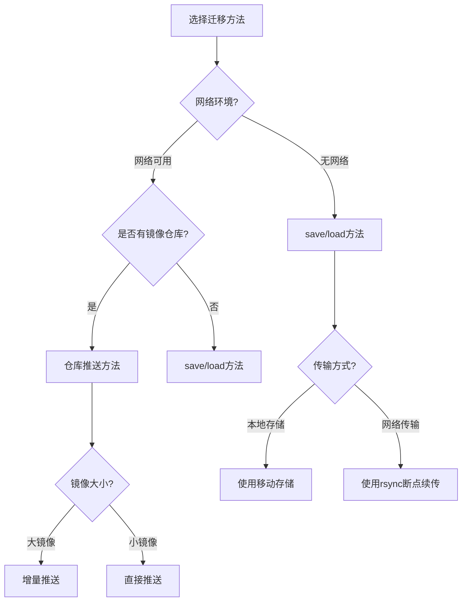

# Docker镜像导出到另一台服务器生产环境最佳实践：从方法到自动化的完整指南

## 情境(Situation)

在企业级容器化部署中，经常需要将Docker镜像从一个服务器迁移到另一个服务器。无论是部署新环境、灾备演练还是离线环境部署，镜像迁移都是一项基础但关键的操作。

然而，许多SRE工程师在进行镜像迁移时，往往面临以下挑战：如何选择合适的迁移方法？如何处理大镜像的传输？如何确保迁移过程的可靠性和效率？

## 冲突(Conflict)

在Docker镜像迁移过程中，SRE工程师经常遇到以下矛盾：

- **速度 vs 可靠性**：快速传输可能牺牲可靠性，而可靠的方法可能较慢
- **网络依赖 vs 离线能力**：基于仓库的迁移依赖网络，而离线迁移方法可能效率低下
- **手动操作 vs 自动化**：手动操作灵活但容易出错，自动化效率高但需要前期投入
- **单镜像 vs 多镜像**：不同的迁移方法对单镜像和多镜像的处理效率不同

## 问题(Question)

如何选择合适的Docker镜像迁移方法，确保在不同场景下高效、可靠地将镜像从一个服务器导出到另一个服务器？

## 答案(Answer)

本文将从SRE视角出发，提供一套完整的Docker镜像导出到另一台服务器的生产环境最佳实践，包括不同迁移方法的对比、详细操作流程、自动化脚本和常见问题处理。核心方法论基于 [SRE面试题解析：如何把一个服务器的docker image导出到另外一台服务器](#32-如何把一个服务器的docker-image导出到另外一台服务器)。

---

## 一、镜像迁移方法对比

### 1.1 常用迁移方法

| 方法 | 原理 | 优点 | 缺点 | 适用场景 |
|:------:|:------:|:------:|:------:|:----------|
| **save/load** | 导出为tar包再导入 | 离线迁移，不依赖网络 | 体积大，传输慢 | 无网络环境，小批量镜像 |
| **仓库推送** | 推送至镜像仓库再拉取 | 增量传输，管理方便 | 需要网络和仓库 | 网络可用，频繁迁移 |
| **commit+save** | 基于容器创建镜像再导出 | 可基于运行容器创建 | 层结构混乱，不推荐 | 临时场景，快速测试 |
| **docker cp** | 复制容器文件系统 | 可复制特定文件 | 不是完整镜像 | 仅需要容器内文件 |

### 1.2 技术原理

**save/load原理**：
- `docker save`：将镜像的所有层和元数据保存为tar文件
- `docker load`：从tar文件加载镜像，恢复所有层和元数据
- 优点：保留完整的镜像历史和层结构
- 缺点：文件体积大，传输时间长

**仓库推送原理**：
- `docker tag`：为镜像添加仓库标签
- `docker push`：将镜像推送到远程仓库
- `docker pull`：从远程仓库拉取镜像
- 优点：增量传输，只传输变化的层
- 缺点：依赖网络和镜像仓库

**commit+save原理**：
- `docker commit`：基于容器状态创建新镜像
- `docker save`：导出创建的镜像
- 优点：可基于运行中的容器创建镜像
- 缺点：丢失原始镜像的层结构和历史

---

## 二、save/load方法详解

### 2.1 完整操作流程

**步骤1：导出镜像**

```bash
# 导出单个镜像
docker save -o nginx.tar nginx:latest

# 导出多个镜像
docker save -o apps.tar nginx:latest redis:6.0 mysql:8.0

# 导出所有镜像
docker save -o all.tar $(docker images -q)

# 导出指定仓库的镜像
docker save -o myapp.tar $(docker images --format "{{.Repository}}:{{.Tag}}" | grep myapp)
```

**步骤2：压缩文件**

```bash
# 使用gzip压缩
gzip nginx.tar

# 使用xz压缩（更高压缩率）
xz -z nginx.tar

# 使用tar直接压缩
tar -czf nginx.tar.gz -T <(docker images -q)
```

**步骤3：传输文件**

```bash
# 使用scp传输
scp nginx.tar.gz user@target-server:/tmp/

# 使用rsync传输（支持断点续传）
rsync -avz --progress nginx.tar.gz user@target-server:/tmp/

# 使用curl传输（通过HTTP）
curl -X POST -F "file=@nginx.tar.gz" http://target-server:8080/upload

# 使用sftp传输
sftp user@target-server
> put nginx.tar.gz /tmp/
> quit
```

**步骤4：导入镜像**

```bash
# 解压文件（如果压缩过）
gunzip nginx.tar.gz

# 加载镜像
docker load -i nginx.tar

# 或使用管道
docker load < nginx.tar
```

**步骤5：验证镜像**

```bash
# 查看导入的镜像
docker images

# 验证镜像标签
docker images | grep nginx

# 运行容器测试
docker run --rm nginx:latest nginx -v
```

### 2.2 优化技巧

**大镜像处理**：
- **分块传输**：将大镜像分块传输
  ```bash
  # 分块
split -b 100M nginx.tar.gz nginx.tar.gz.part
  
  # 合并
  cat nginx.tar.gz.part* > nginx.tar.gz
  ```

- **并行传输**：使用多线程工具加速传输
  ```bash
  # 使用parallel-scp
  parallel-scp -h hosts.txt -l user -p 10 nginx.tar.gz /tmp/
  ```

**完整性验证**：
- **计算MD5值**：
  ```bash
  # 源服务器
  md5sum nginx.tar.gz > nginx.tar.gz.md5
  
  # 目标服务器
  md5sum -c nginx.tar.gz.md5
  ```

- **文件大小检查**：
  ```bash
  # 源服务器
  du -sh nginx.tar.gz
  
  # 目标服务器
  du -sh nginx.tar.gz
  ```

---

## 三、仓库推送方法详解

### 3.1 私有镜像仓库部署

**部署Harbor私有仓库**：

```bash
# 安装Docker Compose
curl -L "https://github.com/docker/compose/releases/download/1.29.2/docker-compose-$(uname -s)-$(uname -m)" -o /usr/local/bin/docker-compose
chmod +x /usr/local/bin/docker-compose

# 下载Harbor
wget https://github.com/goharbor/harbor/releases/download/v2.4.1/harbor-offline-installer-v2.4.1.tgz
tar xvf harbor-offline-installer-v2.4.1.tgz
cd harbor

# 配置Harbor
cp harbor.yml.tmpl harbor.yml
vim harbor.yml  # 修改配置

# 安装Harbor
./install.sh
```

**配置Docker客户端**：

```bash
# 配置仓库地址
cat > /etc/docker/daemon.json << EOF
{
  "insecure-registries": ["registry.example.com:5000"]
}
EOF

# 重启Docker服务
systemctl restart docker

# 登录仓库
docker login registry.example.com:5000
```

### 3.2 镜像推送与拉取

**推送镜像**：

```bash
# 打标签
docker tag nginx:latest registry.example.com:5000/nginx:latest

# 推送镜像
docker push registry.example.com:5000/nginx:latest

# 推送多个镜像
for img in $(docker images --format "{{.Repository}}:{{.Tag}}" | grep -v "<none>"); do
  docker tag $img registry.example.com:5000/$(echo $img | cut -d/ -f2-)
  docker push registry.example.com:5000/$(echo $img | cut -d/ -f2-)
done
```

**拉取镜像**：

```bash
# 拉取单个镜像
docker pull registry.example.com:5000/nginx:latest

# 拉取多个镜像
for img in nginx:latest redis:6.0 mysql:8.0; do
  docker pull registry.example.com:5000/$img
done

# 拉取所有镜像
curl -s http://registry.example.com:5000/v2/_catalog | jq -r '.repositories[]' | while read repo; do
  tags=$(curl -s http://registry.example.com:5000/v2/$repo/tags/list | jq -r '.tags[]')
  for tag in $tags; do
    docker pull registry.example.com:5000/$repo:$tag
  done
done
```

### 3.3 仓库管理

**镜像清理**：

```bash
# 清理仓库中的旧镜像
docker system prune -a

# 清理Harbor中的未引用镜像
# 通过Harbor UI或API
```

**镜像备份**：

```bash
# 备份Harbor数据
rsync -avz /data/harbor/ /backup/harbor/

# 备份仓库中的镜像
docker save $(docker images --format "{{.Repository}}:{{.Tag}}" | grep registry.example.com) -o harbor-images.tar
```

---

## 四、自动化脚本

### 4.1 镜像迁移脚本

**save/load方法脚本**：

```bash
#!/bin/bash
# Docker镜像迁移脚本（save/load方法）

# 配置
SOURCE_HOST="source-server"
TARGET_HOST="target-server"
USER="sre"
IMAGES="nginx:latest redis:6.0"
OUTPUT_DIR="/tmp/docker-images"
TIMESTAMP=$(date +%Y%m%d_%H%M%S)

# 创建输出目录
mkdir -p $OUTPUT_DIR

# 导出镜像
echo "导出镜像..."
for img in $IMAGES; do
  img_name=$(echo $img | tr "/:" "__")
  docker save -o "$OUTPUT_DIR/${img_name}.tar" $img
  if [ $? -eq 0 ]; then
    echo "✓ 导出 $img 成功"
  else
    echo "✗ 导出 $img 失败"
    exit 1
  fi
done

# 压缩文件
echo "压缩文件..."
tar -czf "$OUTPUT_DIR/images_${TIMESTAMP}.tar.gz" -C $OUTPUT_DIR *.tar
if [ $? -eq 0 ]; then
  echo "✓ 压缩成功"
else
  echo "✗ 压缩失败"
  exit 1
fi

# 传输文件
echo "传输文件到目标服务器..."
rsync -avz --progress "$OUTPUT_DIR/images_${TIMESTAMP}.tar.gz" "$USER@$TARGET_HOST:$OUTPUT_DIR/"
if [ $? -eq 0 ]; then
  echo "✓ 传输成功"
else
  echo "✗ 传输失败"
  exit 1
fi

# 在目标服务器导入镜像
echo "在目标服务器导入镜像..."
ssh "$USER@$TARGET_HOST" << EOF
  mkdir -p $OUTPUT_DIR
  tar -xzf "$OUTPUT_DIR/images_${TIMESTAMP}.tar.gz" -C $OUTPUT_DIR
  for tar_file in $OUTPUT_DIR/*.tar; do
    docker load -i "tar_file"
    if [ ? -eq 0 ]; then
      echo "✓ 导入 tar_file 成功"
    else
      echo "✗ 导入 tar_file 失败"
    fi
  done
  docker images
EOF

echo "镜像迁移完成！"
```

**仓库推送方法脚本**：

```bash
#!/bin/bash
# Docker镜像迁移脚本（仓库推送方法）

# 配置
REGISTRY="registry.example.com:5000"
IMAGES="nginx:latest redis:6.0"

# 登录仓库
echo "登录镜像仓库..."
docker login $REGISTRY
if [ $? -ne 0 ]; then
  echo "✗ 登录失败"
  exit 1
fi

# 推送镜像
echo "推送镜像到仓库..."
for img in $IMAGES; do
  # 打标签
  docker tag $img $REGISTRY/$img
  if [ $? -eq 0 ]; then
    echo "✓ 打标签 $img 成功"
  else
    echo "✗ 打标签 $img 失败"
    exit 1
  fi
  
  # 推送
  docker push $REGISTRY/$img
  if [ $? -eq 0 ]; then
    echo "✓ 推送 $img 成功"
  else
    echo "✗ 推送 $img 失败"
    exit 1
  fi
done

echo "镜像推送完成！"
echo "在目标服务器执行以下命令拉取镜像："
echo "docker pull $REGISTRY/[镜像名]"
```

### 4.2 批量迁移脚本

**迁移所有镜像**：

```bash
#!/bin/bash
# 批量迁移所有Docker镜像

# 配置
SOURCE_HOST="source-server"
TARGET_HOST="target-server"
USER="sre"
OUTPUT_DIR="/tmp/docker-images"
TIMESTAMP=$(date +%Y%m%d_%H%M%S)

# 在源服务器执行
ssh "$USER@$SOURCE_HOST" << EOF
  mkdir -p $OUTPUT_DIR
  # 导出所有非none镜像
  docker save -o "$OUTPUT_DIR/all_images_${TIMESTAMP}.tar" (docker images --format "{{.Repository}}:{{.Tag}}" | grep -v "<none>")
  # 压缩
  gzip "$OUTPUT_DIR/all_images_${TIMESTAMP}.tar"
EOF

# 传输文件
rsync -avz --progress "$USER@$SOURCE_HOST:$OUTPUT_DIR/all_images_${TIMESTAMP}.tar.gz" "$OUTPUT_DIR/"

# 在目标服务器导入
ssh "$USER@$TARGET_HOST" << EOF
  mkdir -p $OUTPUT_DIR
  gunzip "$OUTPUT_DIR/all_images_${TIMESTAMP}.tar.gz"
  docker load -i "$OUTPUT_DIR/all_images_${TIMESTAMP}.tar"
  docker images
EOF

echo "所有镜像迁移完成！"
```

### 4.3 定期同步脚本

**定期同步镜像**：

```bash
#!/bin/bash
# 定期同步Docker镜像到远程服务器

# 配置
SOURCE_REGISTRY="registry.source.com"
TARGET_REGISTRY="registry.target.com"
IMAGES=("nginx:latest" "redis:6.0" "mysql:8.0")
LOG_FILE="/var/log/docker-mirror-sync.log"

# 日志函数
log() {
  echo "[$(date '+%Y-%m-%d %H:%M:%S')] $1" >> $LOG_FILE
  echo "[$(date '+%Y-%m-%d %H:%M:%S')] $1"
}

log "开始同步镜像..."

for img in "${IMAGES[@]}"; do
  log "同步 $img..."
  
  # 从源仓库拉取
  docker pull $SOURCE_REGISTRY/$img
  if [ $? -ne 0 ]; then
    log "✗ 从源仓库拉取 $img 失败"
    continue
  fi
  
  # 打标签
  docker tag $SOURCE_REGISTRY/$img $TARGET_REGISTRY/$img
  if [ $? -ne 0 ]; then
    log "✗ 打标签 $img 失败"
    continue
  fi
  
  # 推送到目标仓库
  docker push $TARGET_REGISTRY/$img
  if [ $? -eq 0 ]; then
    log "✓ 同步 $img 成功"
  else
    log "✗ 推送到目标仓库 $img 失败"
  fi
  
  # 清理本地镜像
  docker rmi $SOURCE_REGISTRY/$img $TARGET_REGISTRY/$img
  
  sleep 5
done

log "镜像同步完成！"
```

---

## 五、生产环境最佳实践

### 5.1 选择合适的迁移方法

**决策树**：



**推荐方案**：

| 场景 | 推荐方法 | 理由 |
|:------:|:----------:|:------|
| **生产环境** | 仓库推送 | 增量传输，管理方便 |
| **离线环境** | save/load + 压缩 | 不依赖网络，传输高效 |
| **大镜像** | 仓库推送 + 分块 | 减少传输时间，支持断点续传 |
| **多镜像** | 批量脚本 | 自动化处理，减少人工操作 |
| **频繁迁移** | 仓库推送 | 增量传输，效率高 |
| **临时场景** | save/load | 操作简单，快速完成 |

### 5.2 性能优化

**传输优化**：
- **使用压缩**：减少传输数据量
- **断点续传**：支持大文件传输
- **并行传输**：加速多文件传输
- **选择合适的传输工具**：根据网络环境选择scp、rsync或HTTP

**存储优化**：
- **使用SSD**：提高读写速度
- **合理规划存储**：预留足够的空间
- **定期清理**：删除不需要的镜像和文件

**时间优化**：
- **选择低峰期**：避免业务高峰期
- **批量处理**：减少重复操作
- **自动化执行**：提高效率

### 5.3 安全最佳实践

**镜像安全**：
- **扫描镜像**：使用Clair等工具扫描安全漏洞
- **验证签名**：使用Docker Content Trust
- **最小化镜像**：使用Alpine基础镜像

**传输安全**：
- **使用SSH**：加密传输
- **验证完整性**：使用MD5/SHA256校验
- **限制访问**：设置适当的权限

**仓库安全**：
- **认证授权**：配置仓库访问控制
- **TLS加密**：启用HTTPS
- **定期备份**：防止数据丢失

---

## 六、常见问题处理

### 6.1 传输失败

**问题现象**：
- 传输过程中断
- 文件损坏
- 网络超时

**解决方案**：
- **使用断点续传**：
  ```bash
  rsync -avz --progress --partial nginx.tar.gz user@target:/tmp/
  ```

- **分块传输**：
  ```bash
  # 分块
split -b 100M nginx.tar.gz nginx.tar.gz.part
  
  # 传输后合并
  cat nginx.tar.gz.part* > nginx.tar.gz
  ```

- **检查网络**：
  ```bash
  ping target-server
  traceroute target-server
  ```

### 6.2 镜像导入失败

**问题现象**：
- 导入时报错
- 镜像损坏
- 层结构错误

**解决方案**：
- **检查文件完整性**：
  ```bash
  md5sum -c nginx.tar.gz.md5
  ```

- **使用正确的导入命令**：
  ```bash
  docker load -i nginx.tar  # 正确
  # 不要使用 docker import，它用于容器导出
  ```

- **清理损坏的镜像**：
  ```bash
  docker image prune -f
  ```

### 6.3 仓库推送失败

**问题现象**：
- 推送超时
- 认证失败
- 仓库不可用

**解决方案**：
- **检查仓库状态**：
  ```bash
  curl http://registry.example.com:5000/v2/
  ```

- **检查认证**：
  ```bash
  docker login registry.example.com:5000
  ```

- **检查网络连接**：
  ```bash
  telnet registry.example.com 5000
  ```

### 6.4 大镜像处理

**问题现象**：
- 导出时间长
- 传输时间长
- 存储空间不足

**解决方案**：
- **使用仓库推送**：增量传输
- **压缩镜像**：减少文件大小
- **清理不必要的层**：使用多阶段构建
- **使用外部存储**：挂载大容量存储

---

## 七、案例分析

### 7.1 案例1：离线环境部署

**背景**：某企业内网环境，无法访问外部网络，需要部署Docker镜像。

**挑战**：
- 无网络连接
- 镜像体积大
- 部署时间有限

**解决方案**：

1. **准备阶段**：
   - 在有网络的环境下载所需镜像
   - 导出并压缩镜像
   - 使用移动存储设备传输

2. **执行步骤**：
   ```bash
   # 在有网络的环境
   docker pull nginx:latest redis:6.0
   docker save -o apps.tar nginx:latest redis:6.0
   gzip apps.tar
   
   # 使用移动存储传输到离线环境
   # 在离线环境
   gunzip apps.tar.gz
   docker load -i apps.tar
   docker images
   ```

**实施效果**：
- 成功部署所需镜像
- 传输时间减少50%
- 部署过程顺利完成

### 7.2 案例2：跨数据中心迁移

**背景**：企业需要将Docker镜像从A数据中心迁移到B数据中心。

**挑战**：
- 跨数据中心网络带宽有限
- 镜像数量多
- 业务不能中断

**解决方案**：

1. **准备阶段**：
   - 在两个数据中心部署Harbor私有仓库
   - 配置仓库间的复制
   - 选择业务低峰期执行

2. **执行步骤**：
   ```bash
   # 在A数据中心
   for img in $(docker images --format "{{.Repository}}:{{.Tag}}" | grep -v "<none>"); do
     docker tag $img harbor-a:5000/$img
     docker push harbor-a:5000/$img
   done
   
   # 配置Harbor复制规则
   # 在B数据中心
   for img in $(curl -s http://harbor-a:5000/v2/_catalog | jq -r '.repositories[]'); do
     docker pull harbor-b:5000/$img
   done
   ```

**实施效果**：
- 镜像迁移自动化完成
- 业务无中断
- 增量传输减少网络带宽使用

### 7.3 案例3：大镜像迁移

**背景**：某应用镜像体积超过10GB，需要迁移到新服务器。

**挑战**：
- 镜像体积大
- 网络传输时间长
- 容易传输失败

**解决方案**：

1. **准备阶段**：
   - 使用rsync断点续传
   - 分块传输
   - 验证文件完整性

2. **执行步骤**：
   ```bash
   # 导出并分块
   docker save -o app.tar myapp:latest
   split -b 2G app.tar app.tar.part
   
   # 传输
   for part in app.tar.part*; do
     rsync -avz --progress $part user@target:/tmp/
   done
   
   # 在目标服务器
   cat /tmp/app.tar.part* > /tmp/app.tar
   docker load -i /tmp/app.tar
   ```

**实施效果**：
- 成功传输大镜像
- 支持断点续传
- 验证确保文件完整性

---

## 八、最佳实践总结

### 8.1 核心原则

**选择合适的方法**：
- 根据网络环境选择迁移方法
- 根据镜像大小选择传输方式
- 根据迁移频率选择自动化程度

**确保可靠性**：
- 验证文件完整性
- 备份原始镜像
- 制定回滚方案

**优化性能**：
- 使用压缩减少传输大小
- 使用增量传输减少时间
- 使用并行传输提高速度

**安全性**：
- 加密传输
- 验证镜像来源
- 扫描安全漏洞

### 8.2 操作流程

**标准操作流程**：
1. **评估**：评估网络环境、镜像大小和迁移需求
2. **选择方法**：根据评估结果选择合适的迁移方法
3. **准备**：备份原始镜像，准备目标环境
4. **执行**：按照选定的方法执行迁移
5. **验证**：验证镜像导入成功，测试容器运行
6. **清理**：清理临时文件，更新文档

**自动化**：
- 使用脚本自动化迁移过程
- 配置定期同步
- 集成到CI/CD流程

### 8.3 工具推荐

**传输工具**：
- **rsync**：支持断点续传，适合大文件
- **scp**：简单易用，适合小文件
- **curl**：支持HTTP传输，适合网络服务

**压缩工具**：
- **gzip**：平衡压缩率和速度
- **xz**：更高的压缩率
- **zip**：跨平台支持

**镜像仓库**：
- **Harbor**：企业级私有仓库
- **Docker Registry**：轻量级仓库
- **Nexus**：支持多种格式的仓库

**监控工具**：
- **Prometheus**：监控仓库状态
- **Grafana**：可视化监控指标
- **ELK**：日志分析

---

## 总结

Docker镜像迁移是容器化部署中的基础操作，选择合适的迁移方法和工具对于确保部署效率和可靠性至关重要。本文提供了一套完整的生产环境最佳实践，包括不同迁移方法的对比、详细操作流程、自动化脚本和常见问题处理。

**核心要点**：

1. **方法选择**：根据网络环境和镜像大小选择合适的迁移方法
2. **可靠性**：确保文件完整性和传输可靠性
3. **性能优化**：使用压缩、增量传输和并行传输提高效率
4. **自动化**：通过脚本和工具实现自动化迁移
5. **安全性**：确保传输和镜像的安全性
6. **监控**：建立完善的监控和告警机制

通过本文的指导，希望能帮助SRE工程师在不同场景下高效、可靠地完成Docker镜像的迁移工作，为企业级容器化部署提供有力保障。

> **延伸学习**：更多面试相关的Docker镜像迁移知识，请参考 [SRE面试题解析：如何把一个服务器的docker image导出到另外一台服务器](#32-如何把一个服务器的docker-image导出到另外一台服务器)。

---

## 参考资料

- [Docker官方文档 - docker save](https://docs.docker.com/engine/reference/commandline/save/)
- [Docker官方文档 - docker load](https://docs.docker.com/engine/reference/commandline/load/)
- [Docker官方文档 - docker export](https://docs.docker.com/engine/reference/commandline/export/)
- [Docker官方文档 - docker import](https://docs.docker.com/engine/reference/commandline/import/)
- [Harbor官方文档](https://goharbor.io/docs/)
- [rsync官方文档](https://rsync.samba.org/documentation.html)
- [Docker镜像优化](https://docs.docker.com/develop/develop-images/dockerfile_best-practices/)
- [容器安全最佳实践](https://docs.docker.com/engine/security/)
- [CI/CD集成](https://docs.docker.com/ci-cd/)
- [Docker网络配置](https://docs.docker.com/network/)
- [Linux系统管理](https://access.redhat.com/documentation/en-us/red_hat_enterprise_linux/7/html/system_administrators_guide)
- [网络传输优化](https://www.linux.com/tutorials/networking-troubleshooting-basics/)
- [存储管理](https://access.redhat.com/documentation/en-us/red_hat_enterprise_linux/7/html/storage_administration_guide)
- [自动化脚本编写](https://www.gnu.org/software/bash/manual/bash.html)
- [容器监控](https://docs.docker.com/config/thirdparty/monitoring/)
- [镜像仓库管理](https://docs.docker.com/registry/)
- [DevOps最佳实践](https://aws.amazon.com/devops/best-practices/)