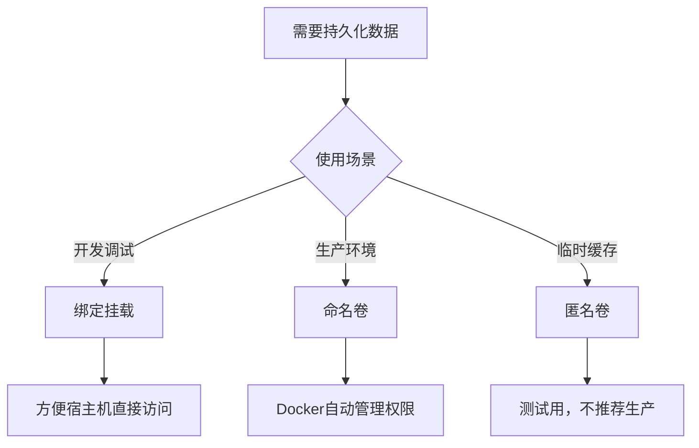

# Docker容器持久化存储最佳实践：从基础到生产

## 情境(Situation)

在容器化技术广泛应用的今天，Docker已经成为企业级应用部署的标准工具。然而，容器的临时性特性导致默认文件系统在容器删除后数据丢失，这对于数据库、配置文件、日志等重要数据来说是不可接受的。

作为SRE工程师，我们需要掌握容器持久化存储的最佳实践，通过合理的存储策略确保数据安全与可靠性，同时兼顾性能和可维护性。

## 冲突(Conflict)

在实际应用中，SRE工程师经常面临以下挑战：

- **数据丢失风险**：容器重启或删除导致重要数据丢失
- **性能问题**：不当的存储配置影响应用性能
- **管理复杂性**：多容器环境下的数据管理困难
- **跨主机迁移**：容器在不同主机间迁移时数据同步问题
- **安全隐患**：存储权限配置不当导致安全风险

## 问题(Question)

如何通过合理的持久化存储策略，确保容器数据的安全与可靠，同时优化存储性能和管理效率？

## 答案(Answer)

本文将从SRE视角出发，详细介绍Docker容器持久化存储的最佳实践，提供一套完整的生产环境解决方案。核心方法论基于 [SRE面试题解析：容器里面怎么做持久化？](#49-容器里面怎么做持久化)。

---

## 一、容器存储概述

### 1.1 存储类型对比

**Docker存储类型**：

| 存储类型 | 命令 | 存储位置 | 管理方式 | 推荐度 | 适用场景 |
|:---------|:------|:----------|:----------|:--------|:----------|
| **匿名卷** | `-v /data` | `/var/lib/docker/volumes/<随机ID>/_data` | Docker自动管理 | ⭐ | 临时缓存 |
| **绑定挂载** | `-v /host:/container` | 宿主机任意目录 | 用户管理 | ⭐⭐⭐ | 开发调试 |
| **命名卷** | `-v mydata:/data` | `/var/lib/docker/volumes/<卷名>/_data` | Docker自动管理 | ⭐⭐⭐⭐⭐ | 生产环境 |

### 1.2 存储选择流程

**存储方案选择流程**：



---

## 二、命名卷最佳实践

### 2.1 基础操作

**创建与管理**：

```bash
# 创建命名卷
docker volume create mydata

# 查看卷列表
docker volume ls

# 查看卷详情
docker volume inspect mydata

# 删除卷
docker volume rm mydata

# 清理未使用的卷
docker volume prune
```

**挂载方式**：

```bash
# 运行时挂载
docker run -d -v mydata:/app/data --name app-container nginx

# 自动创建（运行时不存在的卷）
docker run -d -v named-volume:/path/in/container nginx
```

### 2.2 高级配置

**卷驱动配置**：

```bash
# 使用local驱动，指定设备
docker volume create --driver local \
  --opt type=ext4 \
  --opt device=/dev/sdb1 \
  data_volume

# 使用NFS驱动
docker volume create --driver nfs \
  --opt type=nfs \
  --opt o=addr=192.168.1.100,rw \
  --opt device=:/exports/data \
  nfs_volume
```

**权限管理**：

```bash
# 设置卷权限
docker run -d \
  -v data_volume:/app/data \
  --user 1000:1000 \
  --name app-container nginx

# 只读挂载
docker run -d \
  -v data_volume:/app/data:ro \
  --name app-container nginx
```

---

## 三、绑定挂载最佳实践

### 3.1 基础操作

**挂载方式**：

```bash
# 挂载宿主机目录到容器
docker run -d \
  -v /host/path:/container/path \
  --name nginx nginx

# 只读挂载
docker run -d \
  -v /host/path:/container/path:ro \
  --name nginx nginx
```

### 3.2 权限管理

**权限设置**：

```bash
# 设置宿主机目录权限
chown -R 1000:1000 /host/path

# 容器内使用相同用户
docker run -d \
  -v /host/path:/container/path \
  --user 1000:1000 \
  --name app-container nginx
```

**Windows系统注意事项**：
- 使用绝对路径
- 注意路径分隔符（使用`/`而非`\`）
- 确保共享权限正确

---

## 四、Docker Compose配置

### 4.1 基础配置

**示例配置**：

```yaml
version: "3.8"
services:
  nginx:
    image: nginx
    volumes:
      - ./www:/usr/share/nginx/html  # 绑定挂载
      - nginx_conf:/etc/nginx/conf.d  # 命名卷
  mysql:
    image: mysql:8.0
    volumes:
      - mysql_data:/var/lib/mysql  # 命名卷
      - ./init.sql:/docker-entrypoint-initdb.d/init.sql  # 绑定挂载
    environment:
      - MYSQL_ROOT_PASSWORD=secret
      - MYSQL_DATABASE=app

volumes:
  nginx_conf:
  mysql_data:
    driver: local
    driver_opts:
      type: ext4
      device: /dev/sdb1
```

### 4.2 高级配置

**卷驱动配置**：

```yaml
volumes:
  nfs_data:
    driver: nfs
    driver_opts:
      type: nfs
      o: addr=192.168.1.100,rw
      device: :/exports/data
  ceph_data:
    driver: ceph
    driver_opts:
      monitors: 192.168.1.101:6789
      pool: rbd
      name: volume1
      secretfile: /etc/ceph/keyring
```

---

## 五、数据备份与恢复

### 5.1 备份策略

**全量备份**：

```bash
#!/bin/bash

VOLUME_NAME="mysql_data"
BACKUP_DIR="/backup"
DATE=$(date +%Y%m%d_%H%M%S)

# 创建备份
docker run --rm \
  -v "$VOLUME_NAME":/data \
  -v "$BACKUP_DIR":/backup \
  busybox \
  tar cvf "/backup/${VOLUME_NAME}_${DATE}.tar" /data

# 压缩备份
gzip "/backup/${VOLUME_NAME}_${DATE}.tar"

# 保留最近7天的备份
find "$BACKUP_DIR" -name "${VOLUME_NAME}_*.tar.gz" -mtime +7 -delete
```

**增量备份**：

```bash
#!/bin/bash

VOLUME_NAME="mysql_data"
BACKUP_DIR="/backup"
DATE=$(date +%Y%m%d_%H%M%S)

# 创建增量备份
docker run --rm \
  -v "$VOLUME_NAME":/data \
  -v "$BACKUP_DIR":/backup \
  alpine \
  sh -c "cd /data && rsync -av --link-dest=/backup/latest . /backup/${VOLUME_NAME}_${DATE}"

# 更新latest链接
ln -sf "${VOLUME_NAME}_${DATE}" "$BACKUP_DIR/latest"

# 保留最近5个增量备份
ls -1 "$BACKUP_DIR" | grep "${VOLUME_NAME}_" | sort | head -n -5 | xargs -r rm -rf
```

### 5.2 恢复策略

**从备份恢复**：

```bash
#!/bin/bash

VOLUME_NAME="mysql_data"
BACKUP_FILE="/backup/mysql_data_20260427_100000.tar.gz"

# 停止使用该卷的容器
docker stop $(docker ps -q --filter volume=$VOLUME_NAME)

# 恢复数据
docker run --rm \
  -v "$VOLUME_NAME":/data \
  -v "$(dirname $BACKUP_FILE)":/backup \
  busybox \
  sh -c "tar xvf /backup/$(basename $BACKUP_FILE) -C /"

# 启动容器
docker start $(docker ps -a -q --filter volume=$VOLUME_NAME)
```

**跨主机迁移**：

```bash
# 在源主机创建备份
docker run --rm \
  -v source_volume:/data \
  -v $(pwd):/backup \
  busybox \
  tar cvf /backup/volume_backup.tar /data

# 复制备份到目标主机
scp volume_backup.tar user@target-host:/tmp/

# 在目标主机恢复
docker run --rm \
  -v target_volume:/data \
  -v /tmp:/backup \
  busybox \
  tar xvf /backup/volume_backup.tar -C /
```

---

## 六、性能优化

### 6.1 存储类型选择

**存储类型对比**：

| 存储类型 | 性能 | 可靠性 | 成本 | 适用场景 |
|:---------|:------|:----------|:------|:----------|
| **本地SSD** | ⭐⭐⭐⭐⭐ | ⭐⭐⭐⭐ | ⭐⭐ | 高性能数据库 |
| **本地HDD** | ⭐⭐⭐ | ⭐⭐⭐⭐ | ⭐⭐⭐⭐⭐ | 大容量存储 |
| **NFS** | ⭐⭐ | ⭐⭐⭐ | ⭐⭐⭐ | 跨主机共享 |
| **Ceph** | ⭐⭐⭐ | ⭐⭐⭐⭐⭐ | ⭐⭐ | 大规模集群 |
| **云存储** | ⭐⭐⭐ | ⭐⭐⭐⭐⭐ | ⭐⭐⭐ | 云环境 |

### 6.2 挂载选项优化

**本地卷优化**：

```bash
# 优化挂载选项
docker run -d \
  --mount type=volume,source=data_volume,target=/app/data,volume-opt=o=sync \
  --name app-container nginx

# 使用noatime减少磁盘IO
docker volume create --driver local \
  --opt type=ext4 \
  --opt device=/dev/sdb1 \
  --opt o=noatime \
  data_volume
```

**NFS优化**：

```bash
# NFS挂载选项优化
docker volume create --driver local \
  --opt type=nfs \
  --opt o=addr=192.168.1.100,rw,noatime,rsize=32768,wsize=32768 \
  --opt device=:/exports/data \
  nfs_volume
```

### 6.3 文件系统选择

**文件系统对比**：

| 文件系统 | 性能 | 特性 | 适用场景 |
|:---------|:------|:----------|:----------|
| **ext4** | ⭐⭐⭐⭐ | 稳定，广泛使用 | 通用场景 |
| **xfs** | ⭐⭐⭐⭐⭐ | 大文件支持，高性能 | 大数据场景 |
| **btrfs** | ⭐⭐⭐ | 快照，压缩 | 需要高级特性 |
| **zfs** | ⭐⭐⭐⭐ | 快照， deduplication | 数据密集型应用 |

---

## 七、安全管理

### 7.1 权限控制

**最小权限原则**：

```bash
# 创建专用用户
docker run -d \
  -v data_volume:/app/data \
  --user 1000:1000 \
  --name app-container nginx

# 设置卷权限
docker run --rm \
  -v data_volume:/data \
  busybox \
  chown -R 1000:1000 /data
```

**只读挂载**：

```bash
# 配置文件使用只读挂载
docker run -d \
  -v config_volume:/etc/app:ro \
  --name app-container nginx
```

### 7.2 敏感数据管理

**使用Docker secrets**：

```bash
# 创建secret
docker secret create db_password < password.txt

# 在服务中使用
docker service create \
  --name mysql \
  --secret db_password \
  -e MYSQL_ROOT_PASSWORD_FILE=/run/secrets/db_password \
  mysql:8.0
```

**使用环境变量**：

```bash
# 使用环境变量
docker run -d \
  -v data_volume:/app/data \
  -e DATABASE_URL=mysql://user:${DB_PASSWORD}@db:3306/app \
  --name app-container nginx
```

---

## 八、企业级解决方案

### 8.1 容器编排集成

**Kubernetes存储**：

**存储类配置**：

```yaml
apiVersion: storage.k8s.io/v1
kind: StorageClass
metadata:
  name: managed-premium
default: true
provisioner: kubernetes.io/azure-disk
parameters:
  storageaccounttype: Premium_LRS
  kind: Managed
reclaimPolicy: Retain
allowVolumeExpansion: true
volumeBindingMode: Immediate
```

**持久卷声明**：

```yaml
apiVersion: v1
kind: PersistentVolumeClaim
metadata:
  name: mysql-pvc
spec:
  storageClassName: managed-premium
  accessModes:
    - ReadWriteOnce
  resources:
    requests:
      storage: 10Gi
```

**Pod配置**：

```yaml
apiVersion: v1
kind: Pod
metadata:
  name: mysql-pod
spec:
  containers:
  - name: mysql
    image: mysql:8.0
    volumeMounts:
    - name: mysql-data
      mountPath: /var/lib/mysql
  volumes:
  - name: mysql-data
    persistentVolumeClaim:
      claimName: mysql-pvc
```

### 8.2 存储监控

**关键监控指标**：
- 卷使用率
- IOPS性能
- 读写延迟
- 卷健康状态

**监控工具**：
- Prometheus + Grafana
- Docker原生监控
- 存储系统自带监控
- 云厂商监控服务

**告警配置**：

```yaml
# Prometheus告警规则
groups:
- name: storage_alerts
  rules:
  - alert: VolumeUsageHigh
    expr: (node_filesystem_size_bytes{mountpoint="/var/lib/docker"} - node_filesystem_free_bytes{mountpoint="/var/lib/docker"}) / node_filesystem_size_bytes{mountpoint="/var/lib/docker"} * 100 > 80
    for: 5m
    labels:
      severity: warning
    annotations:
      summary: "Volume usage high"
      description: "Volume usage on {{ $labels.instance }} is {{ $value }}%"

  - alert: StorageIOLatencyHigh
    expr: node_disk_io_time_seconds_total{device=~"sd.*|nvme.*"} / node_disk_io_ops_total{device=~"sd.*|nvme.*"} > 0.1
    for: 5m
    labels:
      severity: warning
    annotations:
      summary: "Storage IO latency high"
      description: "IO latency on {{ $labels.instance }}/{{ $labels.device }} is {{ $value }}s"
```

### 8.3 存储管理平台

**企业级存储管理**：

1. **Portworx**：
   - 容器原生存储
   - 高可用，数据加密
   - 支持Kubernetes

2. **Longhorn**：
   - 轻量级分布式存储
   - 支持Kubernetes
   - 快照和备份功能

3. **Rook**：
   - 基于Ceph的存储编排
   - 支持Kubernetes
   - 自动管理存储集群

4. **OpenEBS**：
   - 容器附加存储
   - 支持Kubernetes
   - 多种存储引擎

---

## 九、最佳实践总结

### 9.1 核心原则

**容器存储核心原则**：

1. **数据安全**：
   - 定期备份
   - 数据加密
   - 访问控制

2. **性能优化**：
   - 选择合适的存储类型
   - 优化挂载选项
   - 合理配置文件系统

3. **可维护性**：
   - 标准化存储配置
   - 自动化管理
   - 监控和告警

4. **成本控制**：
   - 根据需求选择存储类型
   - 合理规划存储容量
   - 清理未使用的存储

### 9.2 配置建议

**生产环境配置清单**：
- [ ] 使用命名卷进行持久化存储
- [ ] 选择合适的存储类型（SSD/HDD/NFS等）
- [ ] 配置合理的挂载选项
- [ ] 实施定期备份策略
- [ ] 使用非root用户运行容器
- [ ] 配置存储监控和告警
- [ ] 定期清理未使用的卷
- [ ] 实施存储容量规划

**推荐命令**：
- **创建卷**：`docker volume create --driver local --opt type=ext4 --opt device=/dev/sdb1 data_volume`
- **备份卷**：`docker run --rm -v data_volume:/data -v $(pwd):/backup busybox tar cvf /backup/backup.tar /data`
- **查看卷**：`docker volume inspect data_volume`
- **清理卷**：`docker volume prune`
- **监控卷**：`docker stats`

### 9.3 经验总结

**常见误区**：
- **使用匿名卷**：难以管理，不适合生产环境
- **权限配置不当**：导致安全风险或访问错误
- **备份策略缺失**：数据丢失风险
- **存储类型选择错误**：性能瓶颈
- **监控不足**：无法及时发现问题

**成功经验**：
- **标准化存储配置**：建立统一的存储管理规范
- **自动化备份**：定期自动备份关键数据
- **分层存储**：根据数据重要性选择存储类型
- **监控告警**：实时监控存储状态
- **灾备方案**：制定详细的灾难恢复计划

---

## 总结

Docker容器持久化存储是生产环境中的关键环节，直接关系到应用的可靠性和数据安全。通过本文介绍的最佳实践，您可以构建一个安全、高效、可靠的容器存储体系。

**核心要点**：

1. **存储选择**：生产环境优先使用命名卷，开发调试使用绑定挂载
2. **备份策略**：实施定期备份，确保数据安全
3. **性能优化**：选择合适的存储类型和挂载选项
4. **安全管理**：使用最小权限原则，保护敏感数据
5. **企业级解决方案**：集成容器编排，实施存储监控
6. **持续优化**：定期评估和调整存储策略

通过遵循这些最佳实践，我们可以确保容器数据的安全与可靠，同时优化存储性能和管理效率，为企业级应用提供坚实的存储基础。

> **延伸学习**：更多面试相关的容器持久化知识，请参考 [SRE面试题解析：容器里面怎么做持久化？](#49-容器里面怎么做持久化)。

---

## 参考资料

- [Docker官方文档 - 存储](https://docs.docker.com/storage/)
- [Docker官方文档 - 卷](https://docs.docker.com/storage/volumes/)
- [Docker官方文档 - 绑定挂载](https://docs.docker.com/storage/bind-mounts/)
- [Kubernetes官方文档 - 存储](https://kubernetes.io/docs/concepts/storage/)
- [Portworx](https://portworx.com/)
- [Longhorn](https://longhorn.io/)
- [Rook](https://rook.io/)
- [OpenEBS](https://openebs.io/)
- [Ceph](https://ceph.com/)
- [NFS](https://linux.die.net/man/5/nfs)
- [Ext4文件系统](https://en.wikipedia.org/wiki/Ext4)
- [XFS文件系统](https://en.wikipedia.org/wiki/XFS)
- [Btrfs文件系统](https://en.wikipedia.org/wiki/Btrfs)
- [ZFS文件系统](https://en.wikipedia.org/wiki/ZFS)
- [容器安全最佳实践](https://docs.docker.com/engine/security/)
- [容器性能优化](https://www.docker.com/blog/container-performance-optimization/)
- [容器存储模式](https://kubernetes.io/docs/concepts/storage/volumes/)
- [数据备份与恢复](https://docs.docker.com/storage/volumes/#back-up-restore-or-migrate-data-volumes)
- [企业级容器管理](https://www.docker.com/products/docker-enterprise)
- [微服务架构](https://microservices.io/)
- [容器编排](https://kubernetes.io/docs/concepts/overview/what-is-kubernetes/)
- [存储监控](https://prometheus.io/docs/introduction/overview/)
- [存储容量规划](https://www.netapp.com/blog/storage-capacity-planning/)
- [灾难恢复策略](https://www.ibm.com/topics/disaster-recovery)