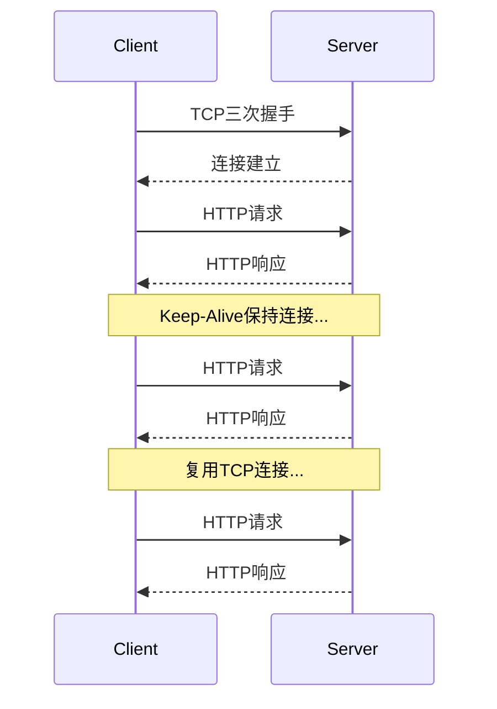
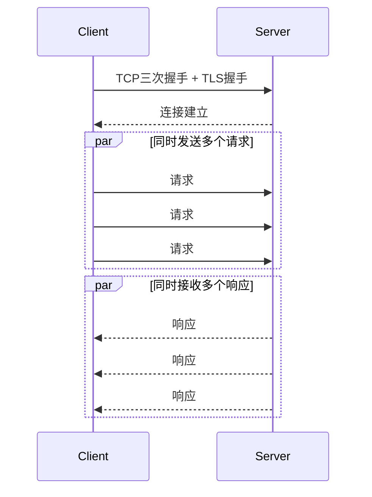
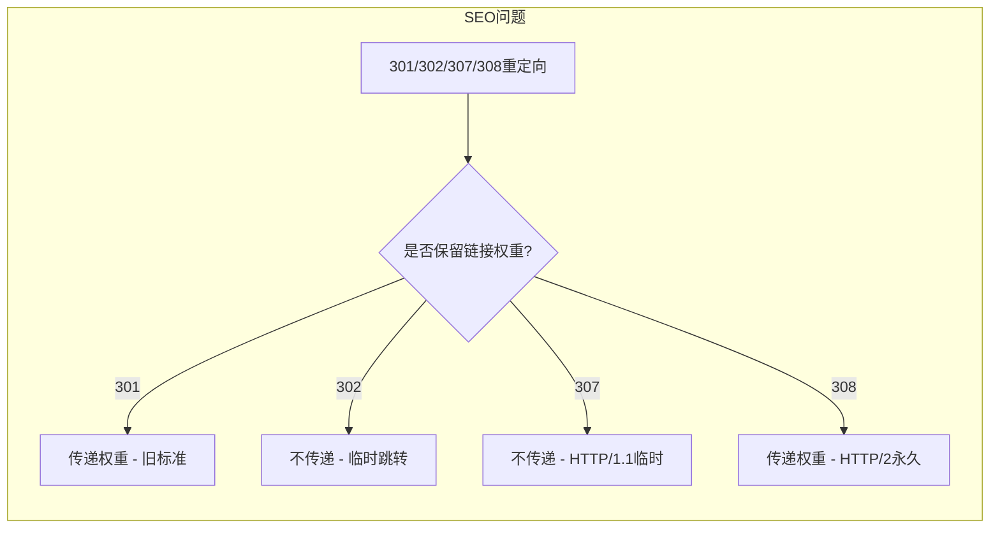
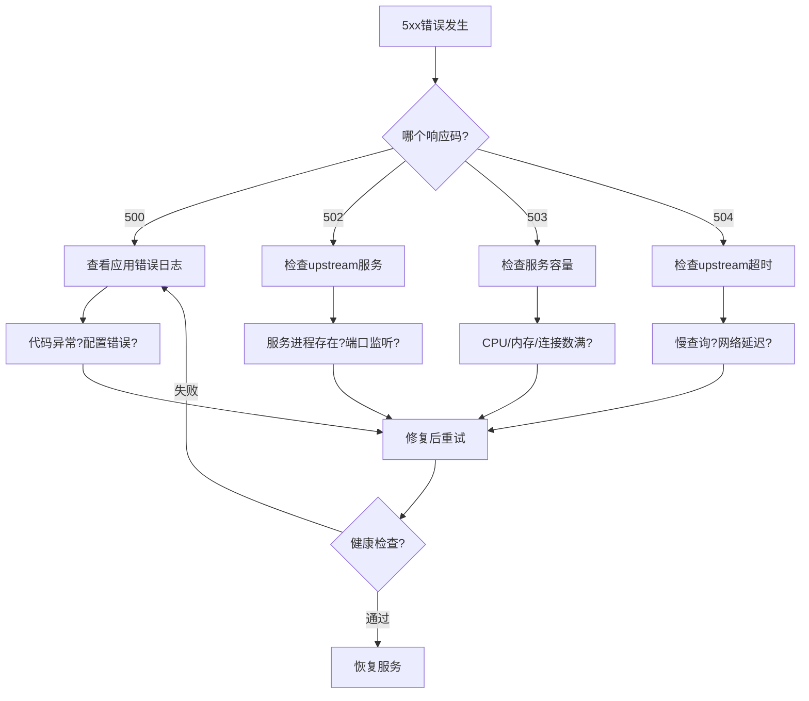

# HTTP协议生产环境最佳实践：从响应码诊断到缓存优化

## 情境(Situation)

HTTP（HyperText Transfer Protocol）是互联网的"通用语言"，是Web应用的基础协议。作为SRE工程师，我们每天都要与HTTP协议打交道：**排查Web故障需要解读响应码、分析性能需要理解连接复用、优化体验需要掌握缓存机制**。

在生产环境中，HTTP协议相关的问题非常常见：

- **客户端问题**：400 Bad Request、401 Unauthorized、403 Forbidden、404 Not Found
- **服务端问题**：500 Internal Error、502 Bad Gateway、503 Service Unavailable、504 Timeout
- **重定向问题**：301/302重定向导致循环、SEO问题
- **性能问题**：连接复用不足、缓存配置不当
- **安全问题**：HTTPvsHTTPS、明文传输敏感信息

## 冲突(Conflict)

许多工程师在处理HTTP相关问题时遇到以下困难：

- **响应码记忆混乱**：不清楚1xx/2xx/3xx/4xx/5xx的具体含义
- **重定向类型混淆**：不理解301/302/307/308的区别，SEO受影响
- **缓存机制不理解**：Cache-Control/ETag/Last-Modified关系不清
- **故障排查效率低**：无法从响应码快速定位问题根因
- **性能优化方向错误**：不了解HTTP/2/HTTP/3的优势和适用场景
- **安全问题忽视**：明文传输、证书配置不当

## 问题(Question)

如何在生产环境中高效使用HTTP协议进行Web故障排查和性能优化？

## 答案(Answer)

本文将从SRE视角出发，结合真实生产案例，提供一套完整的HTTP协议生产环境最佳实践。核心方法论基于 [SRE面试题解析：HTTP协议与响应码](#12-http协议与响应码)。

---

## 一、HTTP协议版本演进

### 1.1 版本对比

| 版本 | 核心改进 | 持久连接 | 多路复用 | 头部压缩 | 现状 |
|:----:|:---------|:--------:|:--------:|:--------:|:-----|
| **HTTP/1.0** | 基础协议 | ❌ 短连接 | ❌ | ❌ | 已废弃 |
| **HTTP/1.1** | 持久连接、管道化 | ✅ | ❌ | ❌ | 主流（50%+） |
| **HTTP/2** | 多路复用、Server Push | ✅ | ✅ | ✅ HPACK | 逐步普及 |
| **HTTP/3** | QUIC(UDP)、0-RTT | ✅ | ✅ | ✅ QPACK | 新兴 |

### 1.2 HTTP/1.1 vs HTTP/2 vs HTTP/3

**HTTP/1.1特性**：



**HTTP/2多路复用**：



### 1.3 Nginx配置不同HTTP版本

```nginx
# HTTP/1.1 配置
server {
    listen 80;
    listen 443 ssl http2;  # HTTP/2
    server_name example.com;

    # HTTP/2多路复用
    location /api/ {
        proxy_pass http://backend;
        proxy_http_version 1.1;
        proxy_set_header Connection "";
    }
}

# HTTP/3 (QUIC) 配置 - Nginx 1.25+
listen 443 ssl;
listen 443 quic;

# quic_rtts 5;
# quic_retry_on;
```

**curl测试不同版本**：

```bash
# 强制使用HTTP/1.1
curl -v --http1.1 https://example.com

# 强制使用HTTP/2
curl -v --http2 https://example.com

# 强制使用HTTP/3 (需要curl编译支持quic)
curl -v --http3 https://example.com

# 查看支持的HTTP版本
curl -v https://example.com 2>&1 | grep "SSL connection"
```

---

## 二、HTTP响应码深度解析

### 2.1 响应码分类速查

| 类别 | 含义 | 常见码 | 排查要点 |
|:----:|------|--------|----------|
| **1xx** | 信息响应 | 100 Continue, 101 Switching Protocols | 临时响应，继续处理 |
| **2xx** | 成功 | **200 OK**, 201 Created, 204 No Content | 正常 |
| **3xx** | 重定向 | **301/302**, 304 Not Modified, **307/308** | 注意SEO和缓存 |
| **4xx** | 客户端错误 | **400**, **401/403**, **404**, 429 Too Many Requests | 检查客户端请求 |
| **5xx** | 服务端错误 | **500**, **502**, **503**, **504** | 查看服务端日志 |

### 2.2 1xx 信息响应码

| 响应码 | 含义 | 场景 |
|:------:|:-----|:-----|
| **100 Continue** | 继续发送 | 客户端有较大body，先发送Expect: 100-continue |
| **101 Switching Protocols** | 协议切换 | WebSocket升级、HTTP->HTTPS |

**示例**：

```bash
# 100 Continue场景
curl -v -X POST \
     -H "Expect: 100-continue" \
     -H "Content-Type: application/json" \
     -d '{"large":"data"}' \
     https://example.com/api
```

### 2.3 2xx 成功响应码

| 响应码 | 含义 | 场景 |
|:------:|:-----|:-----|
| **200 OK** | 请求成功 | 标准成功响应 |
| **201 Created** | 资源创建 | POST创建新资源 |
| **202 Accepted** | 已接受 | 异步任务已接受 |
| **204 No Content** | 无内容 | DELETE成功，响应无body |

**典型响应头**：

```http
HTTP/1.1 200 OK
Server: nginx/1.20.1
Content-Type: application/json
Content-Length: 1234
Connection: keep-alive
Cache-Control: max-age=3600
ETag: "abc123"
Last-Modified: Mon, 27 Apr 2026 00:00:00 GMT
```

### 2.4 3xx 重定向响应码

**301 vs 302 vs 307 vs 308 对比**：

| 响应码 | 名称 | 方法改变 | Body保持 | 缓存 | SEO |
|:------:|:-----|:--------:|:--------:|:----:|:---:|
| **301** | Moved Permanently | ✅ 可能 | ✅ 通常 | ✅ 是 | ❌ 传递 |
| **302** | Found | ✅ 可能 | ❌ 不保持 | ⚠️ 未必 | ❌ 不传递 |
| **303** | See Other | ❌ 变为GET | ❌ | ❌ | ❌ |
| **307** | Temporary Redirect | ❌ 保持 | ✅ 保持 | ⚠️ | ❌ |
| **308** | Permanent Redirect | ❌ 保持 | ✅ | ✅ 是 | ✅ 传递 |

**SEO影响分析**：



**Nginx重定向配置**：

```nginx
# 301 永久重定向 - HTTP到HTTPS
server {
    listen 80;
    server_name example.com;
    return 301 https://$server_name$request_uri;
}

# 302 临时重定向
server {
    listen 80;
    server_name test.example.com;
    return 302 https://new.example.com$request_uri;
}

# 307 临时重定向（保持POST方法）
location /api/ {
    return 307 http://backup.example.com$request_uri;
}

# 308 永久重定向（保持方法）
server {
    listen 80;
    server_name old.example.com;
    return 308 https://new.example.com$request_uri;
}

# 伪静态重定向
rewrite ^/old-page\.html$ /new-page permanent;
rewrite ^/products/(\d+)$ /product?id=$1 last;
```

**常见问题排查**：

```bash
# 查看重定向链
curl -I -L https://example.com

# 输出示例
HTTP/1.1 301 Moved Permanently
Location: https://www.example.com
HTTP/2 301 
Location: https://example.com/
HTTP/2 200 OK

# 禁止跟随重定向
curl -I -I https://example.com  # -I 不跟随重定向
```

### 2.5 4xx 客户端错误响应码

**常见4xx响应码详解**：

| 响应码 | 含义 | 原因 | 解决方案 |
|:------:|:-----|:-----|:---------|
| **400** | Bad Request | 请求语法错误、参数错误 | 检查请求格式和参数 |
| **401** | Unauthorized | 未认证/Token过期 | 重新登录获取Token |
| **403** | Forbidden | 无权限/ACL拦截 | 检查用户权限 |
| **404** | Not Found | 路径错误/资源不存在 | 检查URL路径 |
| **405** | Method Not Allowed | 请求方法错误 | 使用正确的HTTP方法 |
| **408** | Request Timeout | 请求超时 | 增加超时时间 |
| **409** | Conflict | 资源冲突 | 检查并发操作 |
| **429** | Too Many Requests | 请求过于频繁 | 限流/退避重试 |

**常见故障排查**：

| 响应码 | 排查步骤 | 命令示例 |
|:------:|:---------|:---------|
| **401** | 检查Token/cookie | `curl -v -H "Authorization: Bearer xxx"` |
| **403** | 检查权限/ACL | 查看nginx日志是否有ACL拦截 |
| **404** | 检查路径/路由 | `curl -I https://example.com/path` |
| **429** | 检查限流配置 | 查看响应头`Retry-After` |

**生产环境调试脚本**：

```bash
#!/bin/bash
# http_debug.sh - HTTP问题排查脚本

URL="${1:-https://example.com}"
METHOD="${2:-GET}"

echo "=== HTTP响应码排查 ==="
echo "URL: $URL"
echo "Method: $METHOD"
echo ""

# 获取响应头
echo "--- 响应头信息 ---"
curl -sI "$URL" | head -20

echo ""
echo "--- 完整响应（限前100行） ---"
curl -s -w "\n[HTTP状态码: %{http_code}]\n[响应时间: %{time_total}s]\n" \
     -o /tmp/response.txt "$URL"
head -100 /tmp/response.txt

echo ""
echo "--- 响应码分析 ---"
HTTP_CODE=$(curl -s -o /dev/null -w "%{http_code}" "$URL")
case $HTTP_CODE in
    2*)
        echo "✅ 请求成功 (2xx)"
        ;;
    301|302|307|308)
        echo "⚠️ 重定向 - Location:"
        curl -sI "$URL" | grep -i location
        ;;
    400)
        echo "❌ 400 Bad Request - 检查请求参数"
        ;;
    401)
        echo "❌ 401 Unauthorized - Token过期或缺失"
        ;;
    403)
        echo "❌ 403 Forbidden - 权限不足"
        ;;
    404)
        echo "❌ 404 Not Found - 资源不存在"
        ;;
    429)
        echo "❌ 429 Too Many Requests - 请求被限流"
        ;;
    5*)
        echo "❌ 服务器错误 (5xx) - 查看服务端日志"
        ;;
    *)
        echo "❓ 未知响应码: $HTTP_CODE"
        ;;
esac
```

### 2.6 5xx 服务端错误响应码

**常见5xx响应码详解**：

| 响应码 | 含义 | 常见原因 | 解决方案 |
|:------:|:-----|:---------|:---------|
| **500** | Internal Server Error | 代码异常/配置错误 | 查看应用日志 |
| **502** | Bad Gateway | upstream服务挂了 | 检查后端服务状态 |
| **503** | Service Unavailable | 过载/维护/资源不足 | 扩容/等待恢复 |
| **504** | Gateway Timeout | upstream响应慢/超时 | 优化后端/增加超时 |

**故障排查流程**：



**502/503/504深度排查**：

```bash
#!/bin/bash
# backend_check.sh - 后端服务健康检查

BACKEND_HOST="192.168.1.100"
BACKEND_PORT="8080"

echo "=== 后端服务健康检查 ==="
echo "目标: $BACKEND_HOST:$BACKEND_PORT"
echo ""

# 1. 检查端口监听
echo "--- 端口监听状态 ---"
ss -tlnp | grep ":$BACKEND_PORT"

# 2. 检查进程状态
echo ""
echo "--- 后端进程状态 ---"
ps aux | grep -E "java|node|python" | grep -v grep

# 3. 检查连接数
echo ""
echo "--- Nginx到后端连接数 ---"
ss -tnp | grep "$BACKEND_HOST:$BACKEND_PORT" | wc -l

# 4. 检查后端响应
echo ""
echo "--- 后端响应测试 ---"
curl -s -o /dev/null -w "响应码: %{http_code}\n响应时间: %{time_total}s\n" \
     --connect-timeout 3 \
     "http://$BACKEND_HOST:$BACKEND_PORT/health"

# 5. 查看nginx错误日志
echo ""
echo "--- Nginx 502/503/504错误日志 ---"
tail -20 /var/log/nginx/error.log | grep -E "502|503|504|upstream"

# 6. upstream配置检查
echo ""
echo "--- Nginx upstream配置 ---"
grep -A5 "upstream" /etc/nginx/conf.d/*.conf
```

---

## 三、HTTP缓存机制深度解析

### 3.1 缓存相关响应头

**浏览器缓存流程**：

```mermaid
flowchart TD
    A[浏览器请求] --> B{本地缓存?}
    B -->|有 且未过期| C[使用缓存<br>200 OK (from cache)]
    B -->|有 但过期| D{服务端验证?}
    B -->|无| E[发送请求到服务器]
    
    D -->|ETag匹配| F[304 Not Modified<br>使用缓存]
    D -->|Last-Modified匹配| F
    D -->|不一致| E
    
    E --> G{服务器响应?}
    G -->|200| H[更新缓存]
    G -->|304| I[不更新缓存]
    
    H --> C
    F --> C
```

**响应头详解**：

| 响应头 | 作用 | 示例 |
|:-------|:-----|:-----|
| **Cache-Control** | 缓存控制指令 | `max-age=3600`, `no-cache`, `no-store` |
| **ETag** | 资源版本标识 | `"abc123"` |
| **Last-Modified** | 资源最后修改时间 | `Mon, 27 Apr 2026 00:00:00 GMT` |
| **Expires** | 过期时间（HTTP/1.0） | `Mon, 27 Apr 2026 12:00:00 GMT` |
| **Vary** | 缓存 vary条件 | `Accept-Encoding` |

**Cache-Control指令详解**：

| 指令 | 含义 | 客户端行为 |
|:-----|:-----|:-----------|
| `max-age=3600` | 缓存有效期3600秒 | 3600秒内直接使用缓存 |
| `s-maxage=7200` | 共享缓存有效期 | CDN等代理服务器使用 |
| `no-cache` | 需验证后使用 | 每次请求验证 |
| `no-store` | 禁止缓存 | 每次都从服务器获取 |
| `private` | 私有缓存 | 只有浏览器能缓存 |
| `public` | 公共缓存 | 可被CDN等缓存 |
| `must-revalidate` | 过期后必须验证 | 过期资源必须验证 |
| `proxy-revalidate` | 代理缓存必须验证 | 代理服务器行为 |

### 3.2 缓存配置实战

**Nginx缓存配置**：

```nginx
# 静态资源缓存
server {
    listen 80;
    server_name example.com;
    root /var/www/html;

    # 图片/CSS/JS缓存7天
    location ~* \.(jpg|jpeg|png|gif|ico|css|js)$ {
        expires 7d;
        add_header Cache-Control "public, max-age=604800";
    }

    # HTML不缓存
    location ~* \.html$ {
        expires -1;
        add_header Cache-Control "no-cache, no-store, must-revalidate";
    }

    # API响应不缓存
    location /api/ {
        proxy_pass http://backend;
        add_header Cache-Control "no-cache, no-store, must-revalidate";
        proxy_cache_bypass 1;
    }

    # 启用代理缓存
    proxy_cache_path /var/cache/nginx levels=1:2 keys_zone=my_cache:10m 
                     max_size=1g inactive=60m use_temp_path=off;

    location / {
        proxy_pass http://backend;
        proxy_cache my_cache;
        proxy_cache_valid 200 60m;
        proxy_cache_valid 404 1m;
        add_header X-Cache-Status $upstream_cache_status;
    }
}
```

**Nginx缓存状态响应头**：

```bash
# 查看X-Cache-Status
curl -I https://example.com/static/app.js

# 可能的值：
# MISS - 未命中缓存
# HIT - 命中缓存
# EXPIRED - 缓存过期
# STALE - 使用过期缓存（后端不可用）
# UPDATING - 正在更新缓存
# REVALIDATED - 已验证
```

**CDN缓存配置**：

```bash
# CDN响应头示例
HTTP/2 200
Server: nginx/1.20.1
Content-Type: application/javascript
Content-Length: 12345
Cache-Control: public, max-age=31536000
ETag: "abc123def456"
Last-Modified: Mon, 01 Jan 2024 00:00:00 GMT
Age: 3600  # 已被CDN缓存的时间
X-Cache: HIT from cdn.example.com
```

### 3.3 缓存验证请求

**条件请求**：

```bash
# 使用 ETag 验证
curl -I -H "If-None-Match: \"abc123\"" https://example.com/app.js
# 如果资源未变化，返回304 Not Modified

# 使用 Last-Modified 验证
curl -I -H "If-Modified-Since: Mon, 27 Apr 2026 00:00:00 GMT" https://example.com/app.js
# 如果资源未变化，返回304 Not Modified
```

**实际应用**：

```bash
#!/bin/bash
# cache_test.sh - 缓存测试脚本

URL="${1:-https://example.com}"

echo "=== 缓存测试 ==="
echo "URL: $URL"
echo ""

# 第一次请求
echo "--- 第一次请求 ---"
curl -sI "$URL" | grep -E "Cache-Control|ETag|Last-Modified|Expires|X-Cache"

echo ""
echo "--- 第二次请求（期望304或from cache） ---"
curl -sI "$URL" | grep -E "Cache-Control|ETag|Last-Modified|X-Cache"

# 获取ETag和Last-Modified
ETAG=$(curl -sI "$URL" | grep -i "etag" | cut -d' ' -f2 | tr -d '\r')
LAST_MODIFIED=$(curl -sI "$URL" | grep -i "last-modified" | cut -d' ' -f2- | tr -d '\r')

echo ""
echo "--- 使用ETag验证 ---"
if [[ -n "$ETAG" ]]; then
    curl -sI -H "If-None-Match: $ETAG" "$URL" | head -1
fi

echo ""
echo "--- 使用Last-Modified验证 ---"
if [[ -n "$LAST_MODIFIED" ]]; then
    curl -sI -H "If-Modified-Since: $LAST_MODIFIED" "$URL" | head -1
fi
```

---

## 四、生产环境问题排查

### 4.1 常见HTTP问题排查流程

```mermaid
flowchart TD
    A[用户报告问题] --> B{问题类型?}
    B -->|无法访问| C[检查网络连通性]
    B -->|访问慢| D[检查响应时间]
    B -->|返回错误| E[检查响应码]
    
    C --> C1[ping/traceroute]
    C1 --> C2{网络正常?}
    C2 -->|否| C3[联系网络团队]
    C2 -->|是| E
    
    D --> D1[curl测试响应时间]
    D1 --> D2{响应时间?>
    D2 -->|>1s| D3[分析慢请求]
    D2 -->|<1s| E
    
    E --> E1[根据响应码排查]
    E1 --> E2{响应码?}
    E2 -->|4xx| E3[检查客户端请求]
    E2 -->|5xx| E4[检查服务端日志]
    E2 -->|3xx| E5[检查重定向配置]
```

### 4.2 响应码问题排查脚本

```bash
#!/bin/bash
# http_troubleshoot.sh - HTTP问题排查脚本

URL="${1:-}"
METHOD="${2:-GET}"

if [[ -z "$URL" ]]; then
    echo "用法: $0 <URL> [METHOD]"
    echo "示例: $0 https://example.com/api GET"
    exit 1
fi

log() {
    echo "[$(date '+%H:%M:%S')] $1"
}

log "开始排查: $METHOD $URL"

# 1. DNS解析
log "DNS解析..."
dig +short $(echo $URL | sed 's|https\?://||' | cut -d/ -f1) | head -3

# 2. TCP连接
log "TCP连接..."
curl -s -o /dev/null -w "连接时间: %{time_connect}s\n" \
     --connect-timeout 5 "$URL"

# 3. TLS握手
log "TLS握手..."
curl -s -o /dev/null -w "TLS时间: %{time_appconnect}s\n" \
     --connect-timeout 5 "$URL"

# 4. 响应时间
log "总响应时间..."
curl -s -o /dev/null -w "总时间: %{time_total}s\n" \
     --connect-timeout 10 "$URL"

# 5. 响应码
log "HTTP响应码..."
HTTP_CODE=$(curl -s -o /dev/null -w "%{http_code}" "$URL")
log "响应码: $HTTP_CODE"

# 6. 响应头
log "关键响应头..."
curl -sI "$URL" | grep -E "Server|X-Request-Id|Cache-Control|Content-Type"

# 7. 问题分析
log "问题分析..."
case $HTTP_CODE in
    000)
        log "❌ 连接失败 - 检查网络或服务状态"
        ;;
    200|201|204)
        log "✅ 请求成功"
        ;;
    301|302|307|308)
        log "⚠️ 重定向 - Location: $(curl -sI $URL | grep -i location | cut -d' ' -f2)"
        ;;
    400)
        log "❌ 400 Bad Request - 检查请求参数和格式"
        ;;
    401)
        log "❌ 401 Unauthorized - 检查认证信息"
        ;;
    403)
        log "❌ 403 Forbidden - 检查权限配置"
        ;;
    404)
        log "❌ 404 Not Found - 检查URL路径"
        ;;
    429)
        log "❌ 429 Too Many Requests - 请求被限流"
        ;;
    500)
        log "❌ 500 Internal Server Error - 查看服务端日志"
        ;;
    502)
        log "❌ 502 Bad Gateway - 检查upstream服务"
        ;;
    503)
        log "❌ 503 Service Unavailable - 服务可能过载"
        ;;
    504)
        log "❌ 504 Gateway Timeout - 检查upstream超时配置"
        ;;
    *)
        log "❓ 未知响应码"
        ;;
esac
```

### 4.3 真实生产案例

**案例1：CDN缓存导致的问题**

**背景**：用户反映访问到的是旧版本页面

**排查**：
```bash
# 检查缓存头
curl -I https://example.com/index.html
# Cache-Control: public, max-age=86400
# ETag: "v2"

# 手动清除缓存
curl -X PURGE https://example.com/index.html

# 强制刷新
curl -H "Cache-Control: no-cache" https://example.com/index.html
```

**解决方案**：
```nginx
# 版本化文件名
location /static/app.v2.js {
    expires 30d;
    add_header Cache-Control "public, max-age=2592000";
}
```

**案例2：HTTPS证书问题**

**背景**：用户无法访问网站，浏览器提示证书错误

**排查**：
```bash
# 检查证书
openssl s_client -connect example.com:443 -servername example.com

# 检查证书过期
echo | openssl s_client -connect example.com:443 2>/dev/null | openssl x509 -noout -dates

# 检查证书链
openssl s_client -connect example.com:443 -showcerts
```

**解决方案**：
```nginx
# 正确配置证书
server {
    listen 443 ssl;
    server_name example.com;
    
    ssl_certificate /etc/nginx/ssl/fullchain.pem;
    ssl_certificate_key /etc/nginx/ssl/privkey.pem;
    
    ssl_protocols TLSv1.2 TLSv1.3;
    ssl_ciphers HIGH:!aNULL:!MD5;
    ssl_prefer_server_ciphers on;
}
```

**案例3：WebSocket连接问题**

**背景**：WebSocket连接总是断开

**排查**：
```bash
# 检查WebSocket握手
curl -I \
     -H "Connection: Upgrade" \
     -H "Upgrade: websocket" \
     -H "Sec-WebSocket-Version: 13" \
     -H "Sec-WebSocket-Key: dGhlIHNhbXBsZSBub25jZQ==" \
     https://example.com/ws

# 期望响应
# HTTP/1.1 101 Switching Protocols
# Upgrade: websocket
# Connection: Upgrade
```

**解决方案**：
```nginx
# Nginx WebSocket配置
location /ws/ {
    proxy_pass http://websocket_backend;
    proxy_http_version 1.1;
    proxy_set_header Upgrade $http_upgrade;
    proxy_set_header Connection "upgrade";
    proxy_read_timeout 86400;
}
```

---

## 五、HTTP安全最佳实践

### 5.1 HTTPS配置

**TLS版本选择**：

```nginx
# 推荐配置
ssl_protocols TLSv1.2 TLSv1.3;
ssl_ciphers 'ECDHE-ECDSA-AES128-GCM-SHA256:ECDHE-RSA-AES128-GCM-SHA256:ECDHE-ECDSA-AES256-GCM-SHA384:ECDHE-RSA-AES256-GCM-SHA384';
ssl_prefer_server_ciphers on;

# HSTS配置
add_header Strict-Transport-Security "max-age=31536000; includeSubDomains; preload" always;
```

**安全响应头**：

```nginx
add_header X-Frame-Options "SAMEORIGIN" always;
add_header X-Content-Type-Options "nosniff" always;
add_header X-XSS-Protection "1; mode=block" always;
add_header Referrer-Policy "no-referrer-when-downgrade" always;
add_header Content-Security-Policy "default-src 'self'; script-src 'self' 'unsafe-inline'; style-src 'self' 'unsafe-inline';" always;
```

### 5.2 限流配置

**Nginx限流**：

```nginx
# 基于IP的限流
limit_req_zone $binary_remote_addr zone=ip_limit:10m rate=10r/s;

# 基于服务器的限流
limit_req_zone $server_name zone=server_limit:10m rate=1000r/s;

server {
    location /api/ {
        limit_req zone=ip_limit burst=20 nodelay;
        limit_req_status 429;
    }
}
```

**多维度限流**：

```nginx
# IP + User-Agent限流
map $binary_remote_addr$http_user_agent $limit_key {
    default $binary_remote_addr;
    "~*bot" $binary_remote_addr;
}

limit_req_zone $limit_key zone=combined:10m rate=5r/s;
```

---

## 六、最佳实践总结

### 6.1 HTTP响应码速查

| 响应码 | 问题排查 | 解决方案 |
|:-------|:---------|:---------|
| **301/302** | 检查重定向目的地址 | 确认是否永久/临时迁移 |
| **400** | 检查请求格式和参数 | 修复客户端请求 |
| **401** | 检查认证Token | 重新登录获取Token |
| **403** | 检查权限配置 | 联系管理员开通权限 |
| **404** | 检查URL路径 | 确认资源路径是否正确 |
| **429** | 检查限流配置 | 降频或联系管理员 |
| **500** | 查看应用日志 | 修复代码或配置问题 |
| **502** | 检查upstream服务 | 重启后端服务 |
| **503** | 检查服务容量 | 扩容或等待恢复 |
| **504** | 检查upstream超时 | 优化慢查询或增加超时 |

### 6.2 缓存策略选择

| 资源类型 | Cache-Control | 缓存时间 |
|:---------|:--------------|:---------|
| **HTML页面** | no-cache | 每次验证 |
| **CSS/JS** | public, max-age | 7-30天 |
| **图片** | public, max-age | 30-90天 |
| **API响应** | no-store | 不缓存 |
| **用户数据** | private | 浏览器单独缓存 |

### 6.3 性能优化要点

1. **使用HTTP/2**：启用多路复用减少连接数
2. **启用缓存**：合理设置Cache-Control减少请求
3. **压缩传输**：启用Gzip/Brotli压缩
4. **CDN加速**：静态资源使用CDN
5. **连接复用**：使用Keep-Alive减少连接建立
6. **提前断开**：使用Connection: close测试

---

## 总结

HTTP协议是Web应用的基础，SRE工程师必须深入理解HTTP响应码、缓存机制和安全配置。通过本文提供的最佳实践，你可以更高效地排查Web故障和优化Web性能。

**核心要点**：

1. **响应码诊断**：根据响应码快速定位问题类型
2. **缓存机制**：合理配置Cache-Control减少请求
3. **版本演进**：了解HTTP/1.1/2/3的区别和优势
4. **安全配置**：正确配置HTTPS和安全响应头
5. **性能优化**：使用HTTP/2、CDN等提升性能

> **延伸学习**：更多面试相关的HTTP协议问题，请参考 [SRE面试题解析：HTTP协议与响应码](#12-http协议与响应码)。

---

## 参考资料

- [RFC 7231 - HTTP/1.1语义](https://tools.ietf.org/html/rfc7231)
- [RFC 7540 - HTTP/2](https://tools.ietf.org/html/rfc7540)
- [RFC 9110 - HTTP语义](https://www.rfc-editor.org/rfc/rfc9110)
- [MDN HTTP文档](https://developer.mozilla.org/zh-CN/docs/Web/HTTP)
- [Nginx HTTP模块文档](https://nginx.org/en/docs/http/)
- [Web缓存机制详解](https://developer.mozilla.org/zh-CN/docs/Web/HTTP/Caching)
- [HTTP安全响应头](https://developer.mozilla.org/zh-CN/docs/Web/HTTP/Headers#%E5%AE%89%E5%85%A8%E6%80%A7)
- [TLS最佳实践](https://wiki.mozilla.org/Security/Server_Side_TLS)
- [RFC 7540 HTTP/2](https://http2.github.io/http2-spec/)
- [QUIC协议草案](https://datatracker.ietf.org/doc/html/draft-ietf-quic-http)