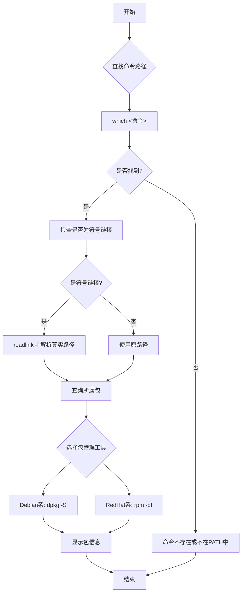

# Linux命令包查询生产环境最佳实践：从定位到管理的完整指南

## 情境(Situation)

在Linux系统管理中，经常会遇到以下场景：需要安装某个命令但不知道其所属的软件包，或者需要确认某个命令来自哪个包以进行版本管理。对于SRE工程师来说，快速准确地定位命令所属的软件包是一项基本技能，这不仅有助于系统维护，还能提高故障排查的效率。

## 冲突(Conflict)

在实际操作中，SRE工程师经常面临以下挑战：

- **命令路径复杂**：命令可能通过符号链接指向其他路径，增加了定位难度
- **多发行版差异**：不同Linux发行版使用不同的包管理工具，命令也有所不同
- **包依赖关系**：某些命令可能来自依赖包，需要了解完整的依赖链
- **手动安装的命令**：不在包管理系统范围内的命令难以追踪
- **版本管理**：需要确认命令的版本和所属包的版本以确保兼容性

## 问题(Question)

如何在不同Linux发行版中快速准确地查找命令所属的软件包，以及如何有效地管理这些包？

## 答案(Answer)

本文将从SRE视角出发，详细介绍Linux命令包查询的方法和最佳实践，涵盖不同发行版的工具使用、符号链接处理、包依赖分析等内容。核心方法论基于 [SRE面试题解析：如何查看某个命令属于哪个包](#35-如何查看某个命令属于哪个包)。

---

## 一、命令包查询基础

### 1.1 基本流程

**查询命令所属包的基本步骤**：

1. **定位命令路径**：使用`which`或`whereis`命令找到命令的路径
2. **检查符号链接**：使用`ls -la`检查是否为符号链接
3. **解析真实路径**：如果是符号链接，使用`readlink -f`解析真实路径
4. **查询所属包**：根据不同发行版使用相应的包管理工具

**流程图**：



### 1.2 常用命令

**定位命令路径**：

```bash
# 使用which查找命令路径
which ip
# 输出：/usr/sbin/ip

# 使用whereis查找命令路径（包含手册页）
whereis ip
# 输出：ip: /usr/sbin/ip /usr/share/man/man8/ip.8.gz

# 使用type查看命令类型
type ip
# 输出：ip is /usr/sbin/ip

# 使用command -v查看命令路径
command -v ip
# 输出：/usr/sbin/ip
```

**检查符号链接**：

```bash
# 检查是否为符号链接
ls -la /usr/sbin/ip
# 输出：/usr/sbin/ip -> /bin/ip*

# 查看链接详情
ls -l /usr/sbin/ip
# 输出：lrwxrwxrwx 1 root root 7 Apr 10  2023 /usr/sbin/ip -> ../bin/ip
```

**解析真实路径**：

```bash
# 解析符号链接真实路径
readlink -f /usr/sbin/ip
# 输出：/bin/ip

# 解析相对路径的符号链接
readlink -m /usr/sbin/ip
# 输出：/bin/ip

# 查看链接链
readlink -e /usr/sbin/ip
# 输出：/bin/ip
```

---

## 二、不同发行版的包查询方法

### 2.1 Debian/Ubuntu 系统

**使用dpkg**：

```bash
# 查找命令所属包
dpkg -S /bin/ip
# 输出：iproute2: /bin/ip

# 查找包的详细信息
dpkg -l iproute2
# 输出包的版本、描述等信息

# 列出包中的所有文件
dpkg -L iproute2
# 输出包中所有文件的路径
```

**使用apt**：

```bash
# 查找包含特定文件的包
apt-file search /bin/ip
# 输出：iproute2: /bin/ip

# 安装apt-file（如果未安装）
apt-get install apt-file
# 更新apt-file数据库
apt-file update

# 搜索包
apt search iproute2
# 显示包信息
apt show iproute2
```

### 2.2 RedHat/CentOS 系统

**使用rpm**：

```bash
# 查找命令所属包
rpm -qf /bin/ip
# 输出：iproute2-5.10.0-25.el8.x86_64

# 查看包的详细信息
rpm -qi iproute2
# 输出包的版本、描述、依赖等信息

# 列出包中的所有文件
rpm -ql iproute2
# 输出包中所有文件的路径

# 验证包的完整性
rpm -V iproute2
```

**使用yum/dnf**：

```bash
# 查找包含特定文件的包
yum provides /bin/ip
# 输出：iproute2-5.10.0-25.el8.x86_64 : Advanced IP routing and network device configuration tools

# 使用dnf（现代系统）
dnf provides /bin/ip

# 搜索包
yum search iproute2
dnf search iproute2

# 显示包信息
yum info iproute2
dnf info iproute2
```

### 2.3 其他发行版

**Arch Linux**：

```bash
# 查找命令所属包
pacman -Qo /bin/ip
# 输出：/usr/bin/ip is owned by iproute2 5.10.0-1

# 搜索包
pacman -Ss iproute2

# 显示包信息
pacman -Si iproute2
```

**SUSE Linux**：

```bash
# 查找命令所属包
rpm -qf /bin/ip
# 或
zypper search --provides /bin/ip

# 搜索包
zypper search iproute2

# 显示包信息
zypper info iproute2
```

---

## 三、高级查询技巧

### 3.1 处理符号链接

**符号链接解析**：

```bash
# 处理多层符号链接
readlink -f /usr/sbin/ip

# 脚本化处理
find_command_package() {
    local cmd=$1
    local path=$(which $cmd)
    if [ -z "$path" ]; then
        echo "Command not found: $cmd"
        return 1
    fi
    
    # 解析符号链接
    local real_path=$(readlink -f $path)
    
    # 根据系统类型查询包
    if command -v dpkg &> /dev/null; then
        dpkg -S $real_path
    elif command -v rpm &> /dev/null; then
        rpm -qf $real_path
    else
        echo "Unsupported package manager"
        return 1
    fi
}

# 使用示例
find_command_package ip
```

### 3.2 查找Python包

**Python包查询**：

```bash
# 查找Python模块所属包
pip show requests
# 输出包的详细信息

# 查找系统Python包
dpkg -S $(python3 -c "import requests; print(requests.__file__)")

# 查找Python命令所属包
pip show pip

# 查找Python可执行文件所属包
dpkg -S $(which python3)
```

### 3.3 查找手动安装的命令

**手动安装命令的定位**：

```bash
# 查找命令路径
which <command>

# 查看文件属性
file $(which <command>)

# 查看文件头
head -n 20 $(which <command>)

# 查找编译信息
strings $(which <command>) | grep -E "version|build"
```

### 3.4 批量查询

**批量查询命令所属包**：

```bash
# 批量查询多个命令
for cmd in ip ifconfig ss ping curl wget; do
    echo "=== $cmd ==="
    path=$(which $cmd 2>/dev/null)
    if [ -n "$path" ]; then
        real_path=$(readlink -f $path 2>/dev/null || echo $path)
        if command -v dpkg &> /dev/null; then
            dpkg -S $real_path 2>/dev/null || echo "Not found in dpkg"
        elif command -v rpm &> /dev/null; then
            rpm -qf $real_path 2>/dev/null || echo "Not found in rpm"
        fi
    else
        echo "Command not found"
    fi
done
```

---

## 四、包管理最佳实践

### 4.1 包安装与管理

**包安装**：

```bash
# Debian/Ubuntu
apt update
apt install <package>

# RedHat/CentOS 7
yum install <package>

# RedHat/CentOS 8+
dnf install <package>

# Arch Linux
pacman -S <package>

# SUSE Linux
zypper install <package>
```

**包更新**：

```bash
# Debian/Ubuntu
apt update && apt upgrade

# RedHat/CentOS 7
yum update

# RedHat/CentOS 8+
dnf update

# Arch Linux
pacman -Syu

# SUSE Linux
zypper update
```

**包卸载**：

```bash
# Debian/Ubuntu
apt remove <package>
apt purge <package>  # 同时删除配置文件

# RedHat/CentOS 7
yum remove <package>

# RedHat/CentOS 8+
dnf remove <package>

# Arch Linux
pacman -R <package>
pacman -Rns <package>  # 同时删除依赖和配置

# SUSE Linux
zypper remove <package>
```

### 4.2 依赖管理

**查看依赖**：

```bash
# Debian/Ubuntu
dpkg -s <package> | grep Depends
apt-cache depends <package>

# RedHat/CentOS
yum deplist <package>
dnf deplist <package>
rpm -qR <package>

# Arch Linux
pacman -Qi <package> | grep Depends

# SUSE Linux
zypper info <package> | grep Requires
```

**解决依赖问题**：

```bash
# Debian/Ubuntu
apt --fix-broken install

# RedHat/CentOS
yum clean all
yum update
dnf clean all
dnf update

# Arch Linux
pacman -Syu --overwrite '*'

# SUSE Linux
zypper clean
zypper refresh
```

### 4.3 包版本管理

**查看包版本**：

```bash
# Debian/Ubuntu
dpkg -l <package>
apt show <package> | grep Version

# RedHat/CentOS
yum info <package> | grep Version
dnf info <package> | grep Version
rpm -q <package>

# Arch Linux
pacman -Qi <package> | grep Version

# SUSE Linux
zypper info <package> | grep Version
```

**安装特定版本**：

```bash
# Debian/Ubuntu
apt install <package>=<version>

# RedHat/CentOS
yum install <package>-<version>
dnf install <package>-<version>

# Arch Linux
pacman -U /path/to/package-<version>.pkg.tar.zst

# SUSE Linux
zypper install <package>=<version>
```

---

## 五、生产环境应用

### 5.1 系统维护

**定期检查**：

```bash
# 检查系统中已安装的包
# Debian/Ubuntu
dpkg -l

# RedHat/CentOS
rpm -qa

# 检查包的健康状态
dpkg --audit  # Debian/Ubuntu
rpm -Va       # RedHat/CentOS
```

**清理无用包**：

```bash
# Debian/Ubuntu
apt autoremove
apt autoclean

# RedHat/CentOS
yum autoremove
dnf autoremove

# Arch Linux
pacman -Sc

# SUSE Linux
zypper clean
```

### 5.2 故障排查

**命令缺失问题**：

```bash
# 查找缺失命令所属包
# Debian/Ubuntu
apt-file search <command>

# RedHat/CentOS
yum provides */<command>
dnf provides */<command>

# 安装缺失的包
apt install <package>  # Debian/Ubuntu
yum install <package>  # RedHat/CentOS
dnf install <package>  # RedHat/CentOS 8+
```

**包冲突问题**：

```bash
# 检查包冲突
# Debian/Ubuntu
dpkg --configure -a

# RedHat/CentOS
yum check
dnf check

# 解决冲突
# Debian/Ubuntu
apt --fix-broken install

# RedHat/CentOS
yum remove <conflicting-package>
dnf remove <conflicting-package>
```

### 5.3 自动化脚本

**包查询脚本**：

```bash
#!/bin/bash
# 命令包查询脚本

if [ $# -eq 0 ]; then
    echo "Usage: $0 <command1> [command2 ...]"
    exit 1
fi

for cmd in "$@"; do
    echo "=== 查询命令: $cmd ==="
    
    # 查找命令路径
    path=$(which $cmd 2>/dev/null)
    if [ -z "$path" ]; then
        echo "❌ 命令未找到"
        continue
    fi
    echo "路径: $path"
    
    # 检查符号链接
    if [ -L "$path" ]; then
        echo "⚠️  是符号链接"
        real_path=$(readlink -f $path)
        echo "真实路径: $real_path"
        path=$real_path
    else
        echo "✅ 不是符号链接"
    fi
    
    # 查询所属包
    found=0
    if command -v dpkg &> /dev/null; then
        pkg=$(dpkg -S "$path" 2>/dev/null | cut -d: -f1)
        if [ -n "$pkg" ]; then
            echo "📦 所属包 (Debian): $pkg"
            # 显示包版本
            version=$(dpkg -l "$pkg" 2>/dev/null | grep "^ii" | awk '{print $3}')
            if [ -n "$version" ]; then
                echo "📌 版本: $version"
            fi
            found=1
        fi
    fi
    
    if [ $found -eq 0 ] && command -v rpm &> /dev/null; then
        pkg=$(rpm -qf "$path" 2>/dev/null)
        if [ -n "$pkg" ]; then
            echo "📦 所属包 (RedHat): $pkg"
            found=1
        fi
    fi
    
    if [ $found -eq 0 ]; then
        echo "❓ 未找到所属包（可能是手动安装）"
        # 检查文件类型
        file_type=$(file "$path" 2>/dev/null | cut -d: -f2 | trim)
        echo "📄 文件类型: $file_type"
    fi
    
    echo

done

# 辅助函数
function trim() {
    sed 's/^[[:space:]]*//;s/[[:space:]]*$//'
}
```

**包状态检查脚本**：

```bash
#!/bin/bash
# 包状态检查脚本

echo "=== 系统包状态检查 ==="
echo "日期: $(date)"
echo "主机: $(hostname)"
echo

# 检查系统类型
if command -v dpkg &> /dev/null; then
    echo "📦 包管理器: dpkg (Debian/Ubuntu)"
    total_packages=$(dpkg -l | grep -c "^ii")
    echo "📊 已安装包数量: $total_packages"
    
    # 检查损坏的包
    broken_packages=$(dpkg --audit 2>&1 | grep -c "problem")
    if [ $broken_packages -gt 0 ]; then
        echo "⚠️  损坏的包数量: $broken_packages"
    else
        echo "✅ 无损坏的包"
    fi
    
    # 检查可更新的包
    apt update > /dev/null 2>&1
    upgradable=$(apt list --upgradable 2>/dev/null | grep -c " upgradable")
    echo "🔄 可更新的包数量: $upgradable"
    
elif command -v rpm &> /dev/null; then
    echo "📦 包管理器: rpm (RedHat/CentOS)"
    total_packages=$(rpm -qa | wc -l)
    echo "📊 已安装包数量: $total_packages"
    
    # 检查包的完整性
    verify_output=$(rpm -Va 2>&1 | grep -v "^..5")  # 忽略文件大小变化
    if [ -n "$verify_output" ]; then
        echo "⚠️  存在完整性问题的包"
        echo "$verify_output"
    else
        echo "✅ 包完整性检查通过"
    fi
    
    # 检查可更新的包
    if command -v dnf &> /dev/null; then
        upgradable=$(dnf check-update 2>/dev/null | grep -v "^Last metadata" | wc -l)
    else
        upgradable=$(yum check-update 2>/dev/null | grep -v "^Loaded plugins" | wc -l)
    fi
    echo "🔄 可更新的包数量: $upgradable"
else
    echo "❌ 不支持的包管理器"
fi

echo

# 检查常用命令
common_commands=(ip ifconfig ss ping curl wget ssh docker kubectl)
echo "=== 常用命令检查 ==="

for cmd in "${common_commands[@]}"; do
    if command -v $cmd &> /dev/null; then
        echo "✅ $cmd: 已安装"
    else
        echo "❌ $cmd: 未安装"
    fi
done

echo

echo "=== 检查完成 ==="
```

---

## 六、常见问题处理

### 6.1 命令未找到

**问题现象**：
- 执行命令时提示 "command not found"
- 命令不在PATH环境变量中

**解决方案**：

1. **检查PATH环境变量**：
   ```bash
   echo $PATH
   # 确保命令所在目录在PATH中
   ```

2. **查找命令位置**：
   ```bash
   find / -name "<command>" 2>/dev/null
   ```

3. **安装缺失的包**：
   ```bash
   # Debian/Ubuntu
   apt install <package>
   
   # RedHat/CentOS
   yum install <package>
   dnf install <package>
   ```

4. **添加PATH**：
   ```bash
   # 临时添加
   export PATH=$PATH:/path/to/command
   
   # 永久添加（添加到~/.bashrc或/etc/profile）
   echo "export PATH=$PATH:/path/to/command" >> ~/.bashrc
   source ~/.bashrc
   ```

### 6.2 符号链接问题

**问题现象**：
- 符号链接指向不存在的文件
- 符号链接循环引用

**解决方案**：

1. **检查符号链接**：
   ```bash
   ls -la <link>
   readlink -f <link>
   ```

2. **修复符号链接**：
   ```bash
   # 删除损坏的链接
   rm <link>
   
   # 创建新的符号链接
   ln -s /path/to/target <link>
   ```

3. **查找损坏的符号链接**：
   ```bash
   find / -type l -exec test ! -e {} \; -print 2>/dev/null
   ```

### 6.3 包依赖冲突

**问题现象**：
- 安装包时提示依赖冲突
- 包版本不兼容

**解决方案**：

1. **查看依赖关系**：
   ```bash
   # Debian/Ubuntu
   apt-cache depends <package>
   
   # RedHat/CentOS
   yum deplist <package>
   dnf deplist <package>
   ```

2. **解决冲突**：
   ```bash
   # Debian/Ubuntu
   apt --fix-broken install
   
   # RedHat/CentOS
   yum remove <conflicting-package>
   dnf remove <conflicting-package>
   ```

3. **使用特定版本**：
   ```bash
   # 安装特定版本
   apt install <package>=<version>  # Debian/Ubuntu
   yum install <package>-<version>  # RedHat/CentOS
   ```

### 6.4 包管理工具故障

**问题现象**：
- apt/yum/dnf 命令执行失败
- 包数据库损坏

**解决方案**：

1. **清理缓存**：
   ```bash
   # Debian/Ubuntu
   apt clean
   apt autoclean
   
   # RedHat/CentOS 7
   yum clean all
   
   # RedHat/CentOS 8+
   dnf clean all
   ```

2. **修复包数据库**：
   ```bash
   # Debian/Ubuntu
   dpkg --configure -a
   
   # RedHat/CentOS
   rpm --rebuilddb
   ```

3. **重新初始化**：
   ```bash
   # Debian/Ubuntu
   apt update
   
   # RedHat/CentOS
   yum makecache
   dnf makecache
   ```

---

## 七、案例分析

### 7.1 案例1：网络命令缺失

**背景**：新部署的服务器缺少网络配置命令。

**现象**：
- 执行 `ip addr` 命令提示 "command not found"
- 无法配置网络接口

**分析**：
- 缺少 iproute2 包
- 系统最小化安装，未包含网络工具

**解决方案**：

```bash
# 安装iproute2包
# Debian/Ubuntu
apt update
apt install iproute2

# RedHat/CentOS
yum install iproute2
dnf install iproute2

# 验证安装
ip addr
```

**实施效果**：
- 网络命令可用
- 能够正常配置网络接口
- 系统网络功能恢复正常

### 7.2 案例2：Docker命令所属包查询

**背景**：需要确认Docker命令来自哪个包，以便进行版本管理。

**操作步骤**：

1. **查找Docker命令路径**：
   ```bash
   which docker
   # 输出：/usr/bin/docker
   ```

2. **检查是否为符号链接**：
   ```bash
   ls -la /usr/bin/docker
   # 输出：/usr/bin/docker -> /etc/alternatives/docker
   ```

3. **解析真实路径**：
   ```bash
   readlink -f /usr/bin/docker
   # 输出：/usr/bin/docker.io
   ```

4. **查询所属包**：
   ```bash
   # Debian/Ubuntu
   dpkg -S /usr/bin/docker.io
   # 输出：docker.io: /usr/bin/docker.io
   
   # RedHat/CentOS
   rpm -qf /usr/bin/docker
   # 输出：docker-20.10.8-1.el8.x86_64
   ```

**实施效果**：
- 确认了Docker命令所属的包
- 可以进行版本管理和升级
- 了解了包的依赖关系

### 7.3 案例3：包依赖冲突解决

**背景**：安装新软件时遇到依赖冲突。

**现象**：
- 执行 `apt install <package>` 时提示依赖冲突
- 系统包版本不兼容

**分析**：
- 现有包版本与新包要求的版本不匹配
- 存在包依赖链问题

**解决方案**：

1. **查看依赖关系**：
   ```bash
   apt-cache depends <package>
   ```

2. **解决冲突**：
   ```bash
   # 清理并更新
   apt clean
   apt update
   
   # 修复依赖
   apt --fix-broken install
   
   # 强制安装
   apt install -f <package>
   ```

3. **验证安装**：
   ```bash
   dpkg -l <package>
   ```

**实施效果**：
- 依赖冲突解决
- 软件成功安装
- 系统包状态正常

---

## 八、最佳实践总结

### 8.1 核心原则

**快速定位**：
- 掌握基本的命令路径查找方法
- 熟练使用符号链接解析工具
- 根据发行版选择合适的包查询命令

**系统管理**：
- 定期更新系统包
- 保持包数据库的完整性
- 合理管理包依赖关系

**故障排查**：
- 熟悉常见包管理问题的解决方案
- 建立包状态检查机制
- 自动化包管理任务

**安全意识**：
- 只从可信源安装包
- 定期检查包的完整性
- 及时更新安全补丁

### 8.2 工具推荐

**包管理工具**：
- **apt**：Debian/Ubuntu系统
- **yum/dnf**：RedHat/CentOS系统
- **pacman**：Arch Linux系统
- **zypper**：SUSE Linux系统

**辅助工具**：
- **apt-file**：Debian系文件查找
- **yum-utils**：RedHat系工具集
- **rpm2cpio**：RPM包提取
- **dpkg-deb**：DEB包操作

**监控工具**：
- **apticron**：Debian系包更新通知
- **yum-cron**：RedHat系自动更新
- **unattended-upgrades**：自动安全更新

### 8.3 经验总结

**常见误区**：
- **忽略符号链接**：直接使用符号链接路径查询包
- **跨发行版使用工具**：在RedHat系统使用dpkg命令
- **不检查依赖**：盲目安装包导致依赖冲突
- **忽视版本管理**：不关注包的版本兼容性

**成功经验**：
- **建立标准流程**：制定包查询和管理的标准流程
- **自动化管理**：编写脚本自动处理包管理任务
- **定期维护**：建立包状态检查和更新机制
- **知识积累**：记录常见命令所属包，建立知识库

---

## 总结

Linux命令包查询是系统管理和故障排查的基础技能，掌握不同发行版的包查询方法和包管理最佳实践，对于SRE工程师来说至关重要。本文提供了一套完整的生产环境最佳实践，包括命令路径查找、符号链接解析、不同发行版的包查询方法、包管理技巧和故障排查策略。

**核心要点**：

1. **基本流程**：which找路径 → ls看链接 → readlink解析 → dpkg/rpm查包
2. **发行版差异**：Debian系使用dpkg/apt，RedHat系使用rpm/yum/dnf
3. **符号链接处理**：使用readlink -f解析真实路径
4. **包管理**：定期更新、清理无用包、解决依赖冲突
5. **故障排查**：快速定位命令所属包，解决包依赖问题

通过本文的指导，希望能帮助SRE工程师更有效地管理Linux系统包，提高系统维护和故障排查的效率，确保系统的稳定运行。

> **延伸学习**：更多面试相关的Linux命令包查询知识，请参考 [SRE面试题解析：如何查看某个命令属于哪个包](#35-如何查看某个命令属于哪个包)。

---

## 参考资料

- [Debian包管理指南](https://www.debian.org/doc/manuals/debian-faq/ch-pkgtools.en.html)
- [RedHat包管理文档](https://access.redhat.com/documentation/en-us/red_hat_enterprise_linux/8/html/package_management/index)
- [Linux包管理基础](https://www.linux.com/learn/linux-101-introduction-package-management)
- [符号链接详解](https://www.gnu.org/software/coreutils/manual/html_node/readlink-invocation.html)
- [dpkg命令手册](https://man7.org/linux/man-pages/man1/dpkg.1.html)
- [rpm命令手册](https://man7.org/linux/man-pages/man8/rpm.8.html)
- [apt命令手册](https://man7.org/linux/man-pages/man8/apt.8.html)
- [yum命令手册](https://man7.org/linux/man-pages/man8/yum.8.html)
- [dnf命令手册](https://man7.org/linux/man-pages/man8/dnf.8.html)
- [pacman命令手册](https://man.archlinux.org/man/pacman.8)
- [zypper命令手册](https://en.opensuse.org/SDB:Zypper_manual)
- [Linux命令查询](https://command-not-found.com/)
- [包依赖分析工具](https://github.com/rpm-software-management/dnf)
- [系统维护最佳实践](https://access.redhat.com/documentation/en-us/red_hat_enterprise_linux/7/html/system_administrators_guide/chap-system_maintenance)
- [安全更新管理](https://ubuntu.com/security)
- [Linux性能优化](https://www.linux.com/tutorials/linux-performance-tuning-101-monitoring-and-tools/)
- [容器化环境的包管理](https://docs.docker.com/engine/reference/commandline/build/)
- [云环境的包管理](https://aws.amazon.com/premiumsupport/knowledge-center/ec2-linux-install-packages/)
- [自动化包管理](https://www.ansible.com/blog/how-to-automate-package-management-with-ansible)