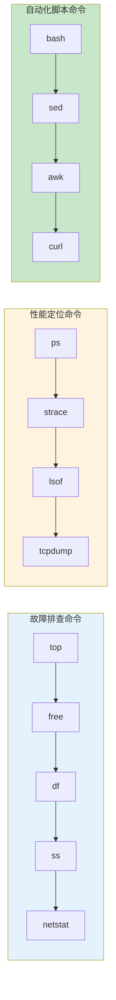

# Linux命令生产环境最佳实践：故障排查与自动化运维实战

## 情境(Situation)

Linux是服务器操作系统的霸主，占据90%以上的市场份额。作为SRE工程师，我们的日常工作离不开Linux命令：**故障排查用命令、性能分析用命令、自动化还是用命令**。不会Linux命令，等于不会运维。

在生产环境中，Linux命令是我们最常用的工具：

- **故障排查**：系统出现异常时，需要快速定位问题根源
- **性能分析**：系统性能下降时，需要找出瓶颈所在
- **日常运维**：部署、配置、监控都离不开命令行
- **自动化脚本**：将重复性工作自动化，提高效率
- **日志分析**：从海量日志中提取关键信息
- **网络诊断**：排查网络连接和通信问题

## 冲突(Conflict)

许多工程师在使用Linux命令时遇到以下问题：

- **命令记忆困难**：Linux命令众多，难以记住所有用法
- **效率低下**：逐个输入命令，浪费时间
- **问题定位慢**：不知道用什么命令来排查问题
- **脚本编写困难**：无法将常用操作编写成脚本
- **性能分析不全面**：只看到表面指标，无法深入分析
- **安全隐患**：命令使用不当可能导致安全问题

这些问题在生产环境中可能导致故障处理不及时、效率低下、操作失误等。

## 问题(Question)

如何在生产环境中高效使用Linux命令进行故障排查和自动化运维？

## 答案(Answer)

本文将从SRE视角出发，结合真实生产案例，提供一套完整的Linux命令生产环境最佳实践。核心方法论基于 [SRE面试题解析：Linux常用命令分类](#11-linux常用命令分类)。

---

## 一、Linux命令分类速查

### 1.1 七大场景命令速查表

**命令速查表**：

| 场景 | 核心命令 | 典型用法 | 用途 |
|:----:|:---------|:---------|:-----|
| **系统概览** | `top`/`htop`/`free`/`df`/`uname` | `top -bn1 \| head -20` | 快速查看资源占用 |
| **进程管理** | `ps`/`pidof`/`kill`/`pkill`/`pgrep` | `ps -ef \| grep java` | 查看和管理进程 |
| **文件操作** | `ls`/`cp`/`mv`/`rm`/`find`/`stat` | `find / -name "*.log" -mtime +7` | 查找和操作文件 |
| **权限管理** | `chmod`/`chown`/`chgrp`/`umask` | `chmod 755 script.sh` | 设置文件权限 |
| **磁盘管理** | `fdisk`/`parted`/`mkfs`/`mount`/`df` | `df -hT` | 查看磁盘使用情况 |
| **网络诊断** | `ss`/`netstat`/`ip`/`ping`/`curl`/`tcpdump` | `ss -tunlp \| grep LISTEN` | 网络连接和端口 |
| **文本处理** | `grep`/`sed`/`awk`/`cat`/`tail`/`sort`/`uniq` | `awk '/ERROR/ {print $1,$NF}' log` | 日志分析和提取 |

### 1.2 命令组合架构图



---

## 二、系统资源监控命令

### 2.1 CPU和进程监控

**top命令详解**：

```bash
# 基础用法
top                          # 实时显示系统状态
top -bn1                     # 非交互式，显示一次后退出
top -d 2                     # 每2秒刷新一次
top -p <PID>                 # 监控指定进程
top -u <username>            # 只显示指定用户的进程

# top内部命令（交互式）
h                           # 显示帮助
k                           # 终止进程
r                           # 重新设置进程优先级
M                           # 按内存使用排序
P                           # 按CPU使用排序
q                           # 退出top
1                           # 显示所有CPU核心
z                           # 彩色显示
```

**load average详解**：

```bash
# 查看load average
uptime
w
top

# 三个数字的含义
# load average: 0.58, 0.89, 0.92
#              1分钟   5分钟   15分钟

# 负载解读
# 单核CPU：load < 1 表示有空闲资源
# 4核CPU：load < 4 表示有空闲资源
```

**load异常情况分析**：

| 场景 | CPU使用率 | Load | 原因 |
|:-----|:---------:|:----:|:-----|
| **CPU密集型** | 100% | 高 | 计算任务繁忙 |
| **IO密集型** | 100% | 高 | 大量磁盘IO |
| **IO等待** | 低 | 高 | 等待IO完成 |
| **僵尸进程** | 低 | 高 | 进程僵死 |

### 2.2 内存监控

**free命令详解**：

```bash
# 基础用法
free                        # 以KB为单位显示
free -m                     # 以MB为单位显示
free -g                     # 以GB为单位显示
free -h                     # 人类可读格式显示
free -s 5                   # 每5秒刷新一次
free -c 10                  # 显示10次后退出

# 字段解读
#              total        used        free      shared   buffers     cached
# Mem:      32768256    26214400     6553856          0     524288    8388608
# -/+ buffers/cache:    17244160    15524096
# Swap:      8191996           0     8191996

# 计算实际可用内存
# available = free + buffers + cached
```

**内存分析脚本**：

```bash
#!/bin/bash
# memory_check.sh - 内存监控脚本

ALERT_THRESHOLD=85

check_memory() {
    local mem_usage=$(free | grep Mem | awk '{printf "%.0f", $3/$2 * 100}')
    local mem_total=$(free -h | grep Mem | awk '{print $2}')
    local mem_used=$(free -h | grep Mem | awk '{print $3}')
    local mem_free=$(free -h | grep Mem | awk '{print $7}')
    
    echo "=== 内存使用情况 ==="
    echo "总内存: $mem_total"
    echo "已使用: $mem_used"
    echo "可用内存: $mem_free"
    echo "使用率: ${mem_usage}%"
    
    if [[ $mem_usage -gt $ALERT_THRESHOLD ]]; then
        echo "警告：内存使用率超过${ALERT_THRESHOLD}%！"
        
        echo ""
        echo "=== 占用内存最多的进程 ==="
        ps -eo pid,ppid,%mem,%cpu,cmd --sort=-%mem | head -10
    fi
}

check_swap() {
    local swap_usage=$(free | grep Swap | awk '{printf "%.0f", $3/$2 * 100}')
    
    echo ""
    echo "=== Swap使用情况 ==="
    free -h | grep Swap
    
    if [[ $swap_usage -gt 50 ]]; then
        echo "警告：Swap使用率超过50%！"
    fi
}

main() {
    check_memory
    check_swap
}

main
```

### 2.3 磁盘监控

**df和du命令详解**：

```bash
# df - 显示磁盘空间使用情况
df                          # 显示所有文件系统
df -h                       # 人类可读格式
df -T                       # 显示文件系统类型
df -i                       # 显示inode使用情况
df -hT                      # 显示类型和人类可读格式

# du - 显示文件/目录大小
du                          # 当前目录大小
du -sh *                    # 各子目录大小
du -sh /var/log             # 指定目录大小
du -ah                      # 显示所有文件
du -h --max-depth=1         # 限制深度
du -sm /* 2>/dev/null | sort -rn | head -10  # 查找最大目录

# 查找大文件
find / -type f -size +100M -exec ls -lh {} \; 2>/dev/null
```

**磁盘IO监控**：

```bash
# iostat - 显示IO统计
iostat                      # 显示CPU和IO统计
iostat -x                   # 显示扩展统计
iostat -d 2 5              # 每2秒显示一次，共5次
iostat -x -s 2 5           # 显示IO统计

# iotop - 交互式IO监控
iotop                       # 交互式显示
iotop -o                   # 只显示有IO的进程
iotop -b                   # 批量模式

# pidstat - 进程IO统计
pidstat -d 2               # 每2秒显示IO统计
pidstat -p <PID> -d 2      # 指定进程IO统计
```

---

## 三、网络诊断命令

### 3.1 连接和端口监控

**ss命令详解**：

```bash
# 基础用法
ss                          # 显示所有连接
ss -a                       # 显示所有连接（包括监听）
ss -l                       # 只显示监听端口
ss -t                       # 只显示TCP连接
ss -u                       # 只显示UDP连接
ss -w                       # 显示RAW连接
ss -x                       # 显示UNIX域套接字

# 高级用法
ss -tunlp                   # TCP+UDP+监听+端口+进程
ss -tn state established     # 只显示已建立连接
ss -tn dst 192.168.1.100     # 过滤目标地址
ss -tn src :80               # 过滤源端口
ss -s                       # 显示汇总统计
ss -i                       # 显示TCP详细信息
ss -e                       # 显示扩展信息
```

**netstat命令详解**：

```bash
# 基础用法
netstat                      # 显示所有连接
netstat -a                   # 显示所有连接
netstat -l                   # 只显示监听端口
netstat -t                   # 只显示TCP
netstat -u                   # 只显示UDP
netstat -p                   # 显示进程信息
netstat -n                   # 数字地址（不解析主机名）

# 组合用法
netstat -tunlp               # TCP+UDP+监听+进程
netstat -anp | grep :80       # 查找占用80端口的进程
netstat -an | grep ESTABLISHED  # 查看已建立连接
netstat -an | awk '/^tcp/ {s[$NF]++} END {for(k in s) print k, s[k]}'  # 统计各状态数量
```

### 3.2 网络连通性测试

**ping和curl命令**：

```bash
# ping - 测试连通性
ping 8.8.8.8                 # 测试到8.8.8.8的连通性
ping -c 4 8.8.8.8           # 只ping 4次
ping -i 2 8.8.8.8           # 每2秒ping一次
ping -s 1024 8.8.8.8        # 指定数据包大小

# curl - 测试HTTP服务
curl -v http://example.com   # 显示详细输出
curl -I http://example.com   # 只显示响应头
curl -X GET http://example.com  # 指定请求方法
curl -H "Content-Type: application/json" \
     -d '{"key":"value"}' \
     http://example.com/api   # 发送POST请求
curl -o /dev/null -s -w "%{http_code}\n" http://example.com  # 显示HTTP状态码
curl --connect-timeout 5 -s http://example.com  # 设置超时
```

**traceroute和mtr命令**：

```bash
# traceroute - 路由追踪
traceroute 8.8.8.8           # 追踪到8.8.8.8的路由
traceroute -n 8.8.8.8        # 不解析主机名
traceroute -m 20 8.8.8.8    # 最大20跳
traceroute -w 3 8.8.8.8     # 每次探测超时3秒

# mtr - 融合ping和traceroute
mtr 8.8.8.8                  # 交互式显示
mtr -c 10 8.8.8.8           # 发送10个包后退出
mtr -r 8.8.8.8              # 报告模式
mtr -n 8.8.8.8              # 不解析主机名
```

### 3.3 抓包分析

**tcpdump命令详解**：

```bash
# 基础用法
tcpdump                      # 抓取所有数据包（需要root）
tcpdump -i eth0              # 指定网卡
tcpdump -c 100               # 只抓100个包
tcpdump -w capture.pcap      # 保存到文件
tcpdump -r capture.pcap     # 读取文件

# 表达式
tcpdump host 192.168.1.1     # 过滤主机
tcpdump port 80              # 过滤端口
tcpdump net 192.168.1.0/24   # 过滤网络
tcpdump tcp                  # 只抓TCP
tcpdump udp                  # 只抓UDP
tcpdump icmp                 # 只抓ICMP

# 组合过滤
tcpdump -i eth0 host 192.168.1.1 and port 80
tcpdump -i eth0 tcp and "port 80 or port 443"
tcpdump -i eth0 "tcp[tcpflags] & tcp-syn != 0"

# 高级用法
tcpdump -i eth0 -nn -vv      # 不解析，详细信息
tcpdump -i eth0 -A           # ASCII显示
tcpdump -i eth0 -XX          # HEX和ASCII显示
tcpdump -i eth0 'tcp[32:4] = 0x47455420'  # HTTP GET请求
```

---

## 四、日志分析命令

### 4.1 grep/sed/awk基础

**grep命令详解**：

```bash
# 基础用法
grep "ERROR" logfile.log     # 查找ERROR
grep -i "error" logfile.log  # 忽略大小写
grep -v "INFO" logfile.log   # 反向查找（不包含INFO的行）
grep -n "ERROR" logfile.log  # 显示行号
grep -c "ERROR" logfile.log  # 统计匹配行数
grep -A 5 "ERROR" logfile.log  # 显示匹配行后5行
grep -B 5 "ERROR" logfile.log  # 显示匹配行前5行

# 正则表达式
grep -E "ERROR|WARN" logfile.log  # 匹配ERROR或WARN
grep -E "[0-9]{3}-[0-9]{4}" logfile  # 匹配电话号码格式
grep "^2024" logfile.log       # 以2024开头的行

# 统计
grep -o "ERROR" logfile.log | wc -l  # 统计ERROR出现次数
grep -o "[0-9]\+\.[0-9]\+\.[0-9]\+\.[0-9]\+" logfile | sort | uniq -c  # 统计IP出现次数
```

**sed命令详解**：

```bash
# 基础用法
sed 's/old/new/' file           # 替换每行第一个old
sed 's/old/new/g' file           # 替换所有old
sed 's/old/new/2' file           # 只替换每行第二个old
sed -i 's/old/new/g' file        # 直接修改文件
sed '1d' file                    # 删除第1行
sed '/ERROR/d' file              # 删除包含ERROR的行
sed -n '10,20p' file             # 显示10-20行

# 高级用法
sed -E 's/(.*)ERROR(.*)/\1WARN\2/' file  # 使用捕获组
sed 's/[[:space:]]*$//' file     # 删除行尾空格
sed '/2024-01-01/,/2024-01-31/p' file  # 范围替换
```

**awk命令详解**：

```bash
# 基础用法
awk '{print $1}' file            # 打印第1列
awk '{print $1,$3}' file         # 打印第1、3列
awk -F: '{print $1}' /etc/passwd  # 指定分隔符
awk 'NR==10' file                # 打印第10行
awk 'NR>=10 && NR<=20' file      # 打印10-20行

# 条件过滤
awk '/ERROR/ {print $1,$NF}' file  # 包含ERROR的行
awk '$3 > 100 {print $0}' file   # 第3列大于100的行
awk -F, '$2 ~ /test/ {print}' file  # 第2列匹配test

# 统计计算
awk '{sum+=$1} END {print sum}' file  # 求和
awk '{sum+=$1; count++} END {print sum/count}' file  # 求平均
awk '{count[$1]++} END {for(k in count) print k, count[k]}' file  # 统计频率

# 格式化输出
awk 'BEGIN {printf "%-10s %-5s\n", "Name", "Score"} {printf "%-10s %-5s\n", $1, $2}' file
```

### 4.2 日志分析实战脚本

**日志统计脚本**：

```bash
#!/bin/bash
# log_analyzer.sh - 日志分析脚本

LOG_FILE="${1:-/var/log/nginx/access.log}"

echo "=== 日志分析报告 ==="
echo "分析文件: $LOG_FILE"
echo "分析时间: $(date)"
echo ""

# 总请求数
total_requests=$(wc -l < "$LOG_FILE")
echo "总请求数: $total_requests"

# HTTP状态码统计
echo ""
echo "=== HTTP状态码分布 ==="
awk '{print $9}' "$LOG_FILE" | sort | uniq -c | sort -rn

# 请求IP统计（Top 10）
echo ""
echo "=== 请求最多的IP（Top 10）==="
awk '{print $1}' "$LOG_FILE" | sort | uniq -c | sort -rn | head -10

# 热门URL（Top 10）
echo ""
echo "=== 热门URL（Top 10）==="
awk '{print $7}' "$LOG_FILE" | sort | uniq -c | sort -rn | head -10

# 错误请求统计
echo ""
echo "=== 4xx/5xx错误统计 ==="
awk '($9 >= 400 && $9 < 600) {print $9, $7}' "$LOG_FILE" | sort | uniq -c | sort -rn | head -10

# 响应时间统计
echo ""
echo "=== 响应时间分析 ==="
awk '{sum+=$NF; count++} END {print "平均响应时间: " sum/count "ms"}' "$LOG_FILE"

# 带宽统计
echo ""
echo "=== 带宽使用统计 ==="
awk '{sum+=$10} END {printf "总传输: %.2f MB\n", sum/1024/1024}' "$LOG_FILE"
```

**实时日志监控脚本**：

```bash
#!/bin/bash
# realtime_log_monitor.sh - 实时日志监控

LOG_FILE="${1:-/var/log/nginx/access.log}"
ALERT_ERROR_RATE=10

tail -f "$LOG_FILE" | while IFS= read -r line; do
    # 统计最近1分钟错误率
    errors=$(echo "$line" | awk '{if ($9 >= 400) print}')
    
    # 告警逻辑
    if [[ -n "$errors" ]]; then
        echo "[$(date '+%Y-%m-%d %H:%M:%S')] 错误: $line"
    fi
    
    # 显示实时状态
    requests_1m=$(tail -n 100 "$LOG_FILE" | awk '{print $9}' | wc -l)
    errors_1m=$(tail -n 100 "$LOG_FILE" | awk '{if ($9 >= 400) print}' | wc -l)
    
    if [[ $requests_1m -gt 0 ]]; then
        error_rate=$((errors_1m * 100 / requests_1m))
        if [[ $error_rate -gt $ALERT_ERROR_RATE ]]; then
            echo "警告：错误率超过${ALERT_ERROR_RATE}%！当前错误率: ${error_rate}%"
        fi
    fi
done
```

---

## 五、进程和资源管理

### 5.1 进程查看和管理

**ps命令详解**：

```bash
# 基础用法
ps                          # 显示当前终端的进程
ps -a                       # 显示所有终端的进程
ps -e                       # 显示所有进程
ps -f                       # 显示完整格式
ps -u                       # 显示用户导向

# 组合用法
ps -ef                      # 显示所有进程（标准格式）
ps -eLf                     # 显示线程
ps aux                      # BSD风格显示
ps -eo pid,ppid,%cpu,%mem,cmd --sort=-%cpu  # 按CPU排序
ps -eo pid,ppid,%cpu,%mem,cmd --sort=-%mem  # 按内存排序

# 查找特定进程
ps -ef | grep java           # 查找java进程
ps aux | grep nginx | grep -v grep  # 排除grep本身
pgrep -u root nginx          # 返回nginx的PID列表
pidof nginx                  # 返回nginx的主PID

# 进程树
pstree                       # 显示进程树
pstree -p                    # 显示PID
pstree -u username           # 按用户分组
```

**kill和进程控制**：

```bash
# kill - 发送信号
kill -l                       # 列出所有信号
kill -9 <PID>                 # 强制终止进程
kill -15 <PID>                # 正常终止进程（默认）
kill -SIGTERM <PID>           # 同-15
kill -SIGSTOP <PID>          # 暂停进程
kill -SIGCONT <PID>          # 继续进程

# pkill/killall - 批量管理
pkill nginx                   # 终止所有nginx进程
pkill -9 -u username          # 强制终止用户所有进程
killall nginx                 # 按名字终止
killall -9 nginx              # 强制终止

# 进程优先级
nice -n 10 command           # 以优先级10启动
renice 5 -p <PID>            # 修改进程优先级
renice -5 -u username        # 修改用户所有进程优先级
```

### 5.2 资源限制

**ulimit和cgroups**：

```bash
# ulimit - shell级别限制
ulimit -a                      # 显示所有限制
ulimit -n                      # 显示最大文件描述符
ulimit -n 65535                # 设置最大文件描述符
ulimit -u                      # 显示最大用户进程数
ulimit -u 4096                 # 设置最大用户进程数

# 永久配置
cat >> /etc/security/limits.conf << EOF
* soft nofile 65535
* hard nofile 65535
* soft nproc 4096
* hard nproc 4096
EOF

# cgroups - 系统级资源限制
# 创建cgroup
mkdir -p /sys/fs/cgroup/cpu/app1
echo 100000 > /sys/fs/cgroup/cpu/app1/cpu.cfs_quota_us
echo 50000 > /sys/fs/cgroup/cpu/app1/cpu.cfs_period_us
echo <PID> > /sys/fs/cgroup/cpu/app1/tasks
```

---

## 六、自动化运维脚本

### 6.1 系统健康检查脚本

**综合健康检查脚本**：

```bash
#!/bin/bash
# system_health_check.sh - 系统综合健康检查

ALERT_THRESHOLD_CPU=80
ALERT_THRESHOLD_MEM=85
ALERT_THRESHOLD_DISK=85

log() {
    echo "[$(date '+%Y-%m-%d %H:%M:%S')] $*"
}

check_cpu() {
    local cpu_usage=$(top -bn1 | grep "Cpu(s)" | awk '{print $2}' | cut -d'%' -f1)
    log "CPU使用率: ${cpu_usage}%"
    
    if (( $(echo "$cpu_usage > $ALERT_THRESHOLD_CPU" | bc -l) )); then
        log "警告：CPU使用率超过${ALERT_THRESHOLD_CPU}%！"
        echo "占用CPU最多的进程："
        ps -eo pid,%cpu,%mem,cmd --sort=-%cpu | head -5
    fi
}

check_memory() {
    local mem_usage=$(free | grep Mem | awk '{printf "%.0f", $3/$2 * 100}')
    log "内存使用率: ${mem_usage}%"
    
    if [[ $mem_usage -gt $ALERT_THRESHOLD_MEM ]]; then
        log "警告：内存使用率超过${ALERT_THRESHOLD_MEM}%！"
        echo "占用内存最多的进程："
        ps -eo pid,%cpu,%mem,cmd --sort=-%mem | head -5
    fi
}

check_disk() {
    local disk_usage=$(df -h / | tail -1 | awk '{print $5}' | sed 's/%//')
    log "磁盘使用率: ${disk_usage}%"
    
    if [[ $disk_usage -gt $ALERT_THRESHOLD_DISK ]]; then
        log "警告：磁盘使用率超过${ALERT_THRESHOLD_DISK}%！"
        echo "占用空间最多的目录："
        du -sh /* 2>/dev/null | sort -rh | head -5
    fi
}

check_load() {
    local load=$(uptime | awk -F'load average:' '{print $2}' | awk '{print $1}' | sed 's/,//')
    local cores=$(nproc)
    log "系统负载: $load (核心数: $cores)"
    
    local load_int=$(echo "$load" | cut -d'.' -f1)
    if [[ $load_int -gt $cores ]]; then
        log "警告：系统负载超过核心数！"
    fi
}

check_network() {
    log "网络连接状态："
    ss -tunl | grep LISTEN | wc -l
    log "监听端口数量："
    ss -tn | grep ESTABLISHED | wc -l
    log "已建立连接数量："
}

check_services() {
    log "关键服务状态："
    for service in nginx mysql redis; do
        if systemctl is-active --quiet "$service" 2>/dev/null; then
            log "$service: 运行正常"
        else
            log "$service: 运行异常"
        fi
    done
}

main() {
    log "===== 系统健康检查开始 ====="
    check_cpu
    check_memory
    check_disk
    check_load
    check_network
    check_services
    log "===== 系统健康检查完成 ====="
}

main
```

### 6.2 自动化部署脚本

**应用部署脚本**：

```bash
#!/bin/bash
# app_deploy.sh - 应用自动化部署脚本

set -euo pipefail

APP_NAME="myapp"
APP_DIR="/opt/$APP_NAME"
BACKUP_DIR="/backup/$APP_NAME"
VERSION="${1:-latest}"
DEPLOY_USER="deploy"

log() {
    echo "[$(date '+%Y-%m-%d %H:%M:%S')] [部署] $*"
}

# 备份当前版本
backup() {
    if [[ -d "$APP_DIR" ]]; then
        log "备份当前版本..."
        mkdir -p "$BACKUP_DIR"
        local backup_name="$(date +%Y%m%d_%H%M%S)"
        cp -r "$APP_DIR" "$BACKUP_DIR/${backup_name}"
        log "备份完成: $BACKUP_DIR/${backup_name}"
    fi
}

# 下载新版本
download() {
    log "下载新版本: $VERSION..."
    local download_url="https://artifacts.example.com/$APP_NAME/$VERSION/$APP_NAME.tar.gz"
    wget -q "$download_url" -O "/tmp/$APP_NAME.tar.gz"
    log "下载完成"
}

# 部署
deploy() {
    log "开始部署..."
    
    mkdir -p "$APP_DIR"
    tar -xzf "/tmp/$APP_NAME.tar.gz" -C "$APP_DIR"
    
    chown -R $DEPLOY_USER:$DEPLOY_USER "$APP_DIR"
    
    log "部署完成"
}

# 重启服务
restart() {
    log "重启服务..."
    
    systemctl restart "$APP_NAME"
    
    sleep 5
    
    if systemctl is-active --quiet "$APP_NAME"; then
        log "服务启动成功"
    else
        log "错误：服务启动失败"
        rollback
        exit 1
    fi
}

# 回滚
rollback() {
    log "执行回滚..."
    
    local latest_backup=$(ls -td "$BACKUP_DIR"/* | head -1)
    if [[ -n "$latest_backup" ]]; then
        rm -rf "$APP_DIR"
        cp -r "$latest_backup" "$APP_DIR"
        chown -R $DEPLOY_USER:$DEPLOY_USER "$APP_DIR"
        systemctl restart "$APP_NAME"
        log "回滚完成"
    else
        log "错误：没有可用的备份"
        exit 1
    fi
}

# 健康检查
health_check() {
    log "执行健康检查..."
    
    local max_attempts=10
    local attempt=0
    
    while [[ $attempt -lt $max_attempts ]]; do
        if curl -sf "http://localhost:8080/health" &>/dev/null; then
            log "健康检查通过"
            return 0
        fi
        
        attempt=$((attempt + 1))
        log "等待服务启动... (尝试 $attempt/$max_attempts)"
        sleep 3
    done
    
    log "错误：健康检查失败"
    return 1
}

# 主函数
main() {
    log "===== 开始部署 $APP_NAME 版本 $VERSION ====="
    
    backup
    download
    deploy
    
    if health_check; then
        log "===== 部署成功 ====="
    else
        rollback
        log "===== 部署失败，已回滚 ====="
        exit 1
    fi
}

main "$@"
```

---

## 七、生产环境案例分析

### 案例1：服务器负载过高排查

**背景**：某服务器负载突然升高，接近10（正常值<2）

**排查步骤**：
1. **查看系统负载**：`uptime` - 确认负载情况
2. **查看CPU使用率**：`top` - 确认CPU是否繁忙
3. **查看进程**：`ps -ef --sort=-%cpu | head` - 找出高CPU进程
4. **查看IO**：`iostat -x 2` - 确认是否是IO问题
5. **查看网络**：`ss -s` - 确认是否有网络攻击

**定位结果**：MySQL进行大量磁盘IO操作

**解决方案**：
```bash
# 优化MySQL配置
innodb_flush_log_at_trx_commit = 2
innodb_buffer_pool_size = 32G
```

**效果**：负载从10降到2

### 案例2：网站访问异常排查

**背景**：用户反映网站访问缓慢，部分请求超时

**排查步骤**：
1. **测试连通性**：`curl -v http://example.com` - 确认服务响应
2. **查看端口**：`ss -tunlp | grep 80` - 确认端口监听
3. **查看连接数**：`ss -an | grep :80 | wc -l` - 确认并发连接
4. **抓包分析**：`tcpdump -i eth0 port 80 -c 100` - 分析流量
5. **查看日志**：`tail -f access.log` - 分析访问日志

**定位结果**：CC攻击导致连接数暴增

**解决方案**：
```bash
# 限制连接数
iptables -A INPUT -p tcp --dport 80 -m connlimit --connlimit-above 100 -j DROP
# 封禁异常IP
iptables -A INPUT -p tcp --dport 80 -m recent --set --rsource
iptables -A INPUT -p tcp --dport 80 -m recent --update --seconds 60 --hitcount 10 -j DROP
```

**效果**：恢复正常访问

### 案例3：日志分析定位bug

**背景**：线上出现大量错误，但不知道原因

**排查步骤**：
1. **提取错误日志**：`grep ERROR app.log` - 找出所有错误
2. **统计错误类型**：`grep ERROR app.log | awk '{print $5}' | sort | uniq -c` - 分类统计
3. **分析时间分布**：`grep ERROR app.log | awk '{print $2}' | cut -d: -f1,2 | sort | uniq -c` - 时间分布
4. **查看关联日志**：`grep -A5 -B5 "ERROR.*NullPointerException" app.log` - 上下文

**定位结果**：数据库连接池泄漏

**解决方案**：
```sql
-- 增加连接池大小
SET GLOBAL max_connections = 2000;
-- 优化连接超时
SET GLOBAL wait_timeout = 600;
```

**效果**：错误消失

---

## 八、最佳实践总结

### 8.1 命令使用最佳实践

| 场景 | 推荐命令 | 说明 |
|:-----|:---------|:-----|
| **系统监控** | `top`/`htop`/`vmstat`/`iostat` | 实时监控系统资源 |
| **进程管理** | `ps`/`pidof`/`pgrep` | 查找和管理进程 |
| **网络诊断** | `ss`/`curl`/`tcpdump` | 网络连接和抓包 |
| **日志分析** | `grep`/`awk`/`sed` | 日志查找和统计 |
| **磁盘分析** | `df`/`du`/`ncdu` | 磁盘使用分析 |
| **性能分析** | `strace`/`lsof`/`pidstat` | 深入分析进程 |

### 8.2 脚本编写最佳实践

- **错误处理**：使用 `set -euo pipefail` 捕获错误
- **日志记录**：记录关键操作和错误信息
- **参数校验**：验证输入参数的合法性
- **回滚机制**：重要操作提供回滚能力
- **超时控制**：避免命令长时间挂起
- **并发控制**：避免资源竞争

### 8.3 故障排查最佳实践

1. **先外后内**：先检查网络连通性，再检查本地配置
2. **先轻后重**：先检查简单问题，再深入分析
3. **分层排查**：从应用、数据库、网络逐层定位
4. **保留现场**：排查前保存关键信息
5. **逐步排除**：排除不可能的因素，缩小范围
6. **记录过程**：记录排查步骤和发现

---

## 总结

Linux命令是SRE工程师最重要的工具之一，熟练掌握常用命令对故障排查、性能分析和自动化运维至关重要。通过本文提供的最佳实践，你可以更高效地使用Linux命令解决生产环境中的各种问题。

**核心要点**：

1. **系统监控**：熟练使用top/free/df/ss等命令监控系统状态
2. **网络诊断**：掌握ping/curl/tcpdump等命令排查网络问题
3. **日志分析**：精通grep/sed/awk等命令分析海量日志
4. **进程管理**：了解ps/kill/pgrep等命令控制进程
5. **自动化脚本**：编写脚本提高运维效率
6. **故障排查**：建立系统化的排查思路

> **延伸学习**：更多面试相关的Linux命令问题，请参考 [SRE面试题解析：Linux常用命令分类](#11-linux常用命令分类)。

---

## 参考资料

- [Linux命令大全](https://man.linuxde.net/)
- [GNU Coreutils文档](https://www.gnu.org/software/coreutils/manual/)
- [TCP/IP网络管理](https://www.tcpipguide.com/)
- [Awk编程指南](https://www.gnu.org/software/gawk/manual/)
- [Sed编辑器指南](https://www.gnu.org/software/sed/manual/)
- [Linux性能分析](https://www.brendangregg.com/linuxperf.html)
- [tcpdump高级用法](https://www.tcpdump.org/manpages/tcpdump.1.html)
- [strace调试指南](https://strace.io/)
- [系统监控工具](https://prometheus.io/)
- [日志分析ELK Stack](https://www.elastic.co/elk-stack)