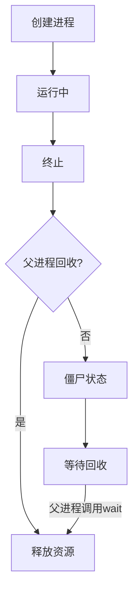
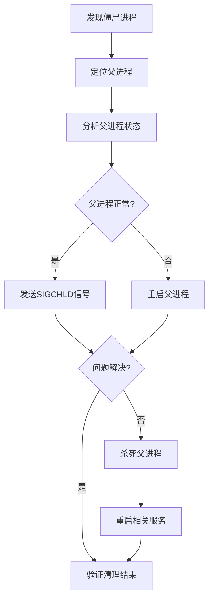

# Linux僵尸进程识别与处理生产环境最佳实践：从原理到解决方案

## 情境(Situation)

在Linux系统运维中，僵尸进程是一个常见但容易被忽视的问题。僵尸进程是指已经终止但未被父进程回收的进程，它们会占用进程表条目，虽然内存占用很小，但数量过多时会导致系统资源耗尽，影响系统稳定性。

作为SRE工程师，了解僵尸进程的产生原因、识别方法和处理策略，对于维护系统健康运行至关重要。

## 冲突(Conflict)

在处理僵尸进程时，SRE工程师经常面临以下挑战：

- **识别困难**：僵尸进程数量少时难以察觉，数量多时已经影响系统性能
- **处理复杂**：直接kill僵尸进程无效，需要从父进程入手
- **预防不足**：缺乏有效的监控和预防机制
- **影响评估**：难以评估僵尸进程对系统的实际影响

## 问题(Question)

如何有效地识别、处理和预防Linux系统中的僵尸进程，确保系统的稳定运行？

## 答案(Answer)

本文将从SRE视角出发，深入分析Linux僵尸进程的原理、识别方法和处理策略，提供一套完整的生产环境最佳实践。核心方法论基于 [SRE面试题解析：怎么查看僵尸态的进程](#33-怎么查看僵尸态的进程)。

---

## 一、僵尸进程原理

### 1.1 进程生命周期

**进程状态转换**：



**僵尸进程产生原因**：
1. 子进程执行完成并发送exit信号
2. 父进程未调用wait()或waitpid()系统调用
3. 子进程状态变为Z（Zombie）
4. 进程表条目未释放，占用系统资源

### 1.2 僵尸进程特征

| 特征 | 描述 | 影响 |
|:------:|:------:|:------:|
| **状态** | 进程状态显示为Z | 标识僵尸进程 |
| **进程名** | 进程名显示为<defunct> | 直观识别 |
| **内存占用** | 约占用1KB进程表空间 | 数量多时影响系统 |
| **可杀性** | 无法被kill命令杀死 | 需要特殊处理 |
| **资源占用** | 占用进程ID和进程表条目 | 可能导致PID耗尽 |

### 1.3 危害分析

**系统影响**：
- **进程表耗尽**：每个僵尸进程占用一个进程表条目，数量过多会导致无法创建新进程
- **系统性能下降**：进程表查找时间增加，系统调度效率降低
- **资源浪费**：虽然内存占用小，但累积效应不可忽视
- **诊断困难**：大量僵尸进程会干扰系统监控和故障排查

**业务影响**：
- **服务不可用**：无法创建新进程，导致服务无法启动
- **系统不稳定**：资源耗尽可能导致系统崩溃
- **监控告警**：触发进程数相关的告警

---

## 二、僵尸进程识别

### 2.1 常用命令

**ps命令**：

```bash
# 快速查找僵尸进程
ps aux | grep Z

# 查看僵尸进程详细信息
ps -eo pid,ppid,stat,cmd | grep Z

# 按状态排序，突出显示僵尸进程
ps -eo pid,ppid,stat,comm,etime --sort=-stat | grep Z

# 显示完整命令行
ps -ef | grep defunct
```

**top命令**：

```bash
# 查看全局状态
top
# 按shift+z高亮显示僵尸进程
# 查看Zombie计数（在top头部）
```

**pstree命令**：

```bash
# 树状显示进程关系，找到父进程
pstree -ap | grep -E 'Z|defunct'

# 以父进程为中心查看
tree -p <父PID>
```

**/proc文件系统**：

```bash
# 查找所有僵尸进程
ls /proc/*/stat | xargs grep Z

# 查看特定进程状态
cat /proc/<PID>/status | grep State
```

### 2.2 高级识别技巧

**批量识别**：

```bash
# 统计僵尸进程数量
ps aux | grep -c Z

# 查看僵尸进程及其父进程
echo "PID PPID STAT COMMAND"
echo "========================"
ps -eo pid,ppid,stat,cmd | grep Z
```

**监控脚本**：

```bash
#!/bin/bash
# 监控僵尸进程

ZOMBIE_COUNT=$(ps aux | grep -c Z)

if [ $ZOMBIE_COUNT -gt 0 ]; then
    echo "发现 $ZOMBIE_COUNT 个僵尸进程："
    ps -eo pid,ppid,stat,cmd | grep Z
    
    # 发送告警
    # alert.sh "发现 $ZOMBIE_COUNT 个僵尸进程"
fi
```

**可视化识别**：

```bash
# 使用htop查看
htop
# F4 过滤 "Z"

# 使用glances查看
glances
# 进程列表中状态为Z的进程
```

---

## 三、僵尸进程处理

### 3.1 处理流程

**标准处理流程**：



**详细步骤**：

1. **定位僵尸进程**：
   ```bash
   ps -eo pid,ppid,stat,cmd | grep Z
   ```

2. **找到父进程**：
   ```bash
   # 查看父进程信息
   ps -p <父PID> -o pid,ppid,stat,cmd
   
   # 查看父进程树
   pstree -ap <父PID>
   ```

3. **发送SIGCHLD信号**：
   ```bash
   # 促使父进程回收子进程
   kill -SIGCHLD <父PID>
   ```

4. **验证清理结果**：
   ```bash
   ps -eo pid,ppid,stat | grep Z
   ```

5. **如果SIGCHLD无效**：
   ```bash
   # 杀死父进程（谨慎操作）
   kill -9 <父PID>
   
   # 重启相关服务
   systemctl restart <服务名>
   ```

### 3.2 特殊情况处理

**父进程为init**：
- init进程会自动回收僵尸进程
- 通常不需要手动处理
- 如果持续存在，可能是系统级问题

**父进程为systemd**：
- systemd会管理子进程
- 检查服务状态：`systemctl status <服务名>`
- 重启服务：`systemctl restart <服务名>`

**大量僵尸进程**：
- 检查是否存在fork炸弹
- 检查应用程序是否存在bug
- 考虑重启系统（最后手段）

### 3.3 处理工具

**自动化处理脚本**：

```bash
#!/bin/bash
# 自动处理僵尸进程

# 查找僵尸进程
ZOMBIE_PROCS=$(ps -eo pid,ppid,stat | grep Z)

if [ -z "$ZOMBIE_PROCS" ]; then
    echo "没有发现僵尸进程"
    exit 0
fi

echo "发现僵尸进程："
echo "PID PPID STAT"
echo "=============="
echo "$ZOMBIE_PROCS"

# 提取父进程ID
PPIDS=$(echo "$ZOMBIE_PROCS" | awk '{print $2}' | sort -u)

echo "\n处理父进程："
for PPID in $PPIDS; do
    echo "处理父进程 $PPID"
    
    # 发送SIGCHLD信号
    kill -SIGCHLD $PPID
    sleep 2
    
    # 检查是否清理
    REMAINING=$(ps -eo ppid,stat | grep "^$PPID Z")
    if [ -z "$REMAINING" ]; then
        echo "✓ 父进程 $PPID 已清理僵尸进程"
    else
        echo "✗ 父进程 $PPID 清理失败"
        echo "  建议：检查父进程状态或重启相关服务"
    fi
done

# 验证结果
echo "\n清理后状态："
ZOMBIE_COUNT=$(ps aux | grep -c Z)
if [ $ZOMBIE_COUNT -eq 0 ]; then
    echo "✓ 所有僵尸进程已清理"
else
    echo "✗ 仍有 $ZOMBIE_COUNT 个僵尸进程"
    ps -eo pid,ppid,stat,cmd | grep Z
fi
```

**系统工具**：
- **supervisor**：管理进程，自动回收子进程
- **systemd**：现代系统的进程管理器
- **monit**：监控系统和服务

---

## 四、僵尸进程预防

### 4.1 代码层面预防

**正确的进程管理**：

```c
// C语言示例：正确处理子进程
#include <sys/types.h>
#include <sys/wait.h>
#include <unistd.h>
#include <stdio.h>

int main() {
    pid_t pid = fork();
    
    if (pid == 0) {
        // 子进程
        printf("子进程运行\n");
        sleep(1);
        printf("子进程退出\n");
        return 0;
    } else if (pid > 0) {
        // 父进程
        printf("父进程等待子进程\n");
        wait(NULL); // 关键：等待子进程结束
        printf("父进程回收子进程\n");
    } else {
        // fork失败
        perror("fork");
        return 1;
    }
    
    return 0;
}
```

**信号处理**：

```c
// 处理SIGCHLD信号
void sigchld_handler(int sig) {
    while (waitpid(-1, NULL, WNOHANG) > 0);
}

int main() {
    // 注册信号处理函数
    signal(SIGCHLD, sigchld_handler);
    
    // 后续代码...
}
```

### 4.2 系统层面预防

**服务管理**：
- **使用systemd**：现代Linux系统的标准服务管理器
- **使用supervisor**：轻量级进程管理器
- **使用容器**：隔离进程环境

**系统配置**：

```bash
# 调整进程数限制
# /etc/security/limits.conf
* soft nproc 65536
* hard nproc 65536

# 调整系统进程数限制
echo "kernel.pid_max=4194303" >> /etc/sysctl.conf
sysctl -p
```

### 4.3 监控与告警

**监控指标**：

| 指标 | 描述 | 告警阈值 | 监控命令 |
|:-----|:-----|:---------|:----------|
| **zombie_processes** | 僵尸进程数量 | >0 | `ps aux  grep -c Z` |
| **processes** | 总进程数 | >80% 最大进程数 | `ps -e  wc -l` |
| **pid_max_usage** | PID使用率 | >80% | `ps -e  wc -l  awk '{print $1/4194303*100}'` |

**Prometheus监控**：

```yaml
# prometheus.yml
scrape_configs:
  - job_name: 'node'
    static_configs:
      - targets: ['node-exporter:9100']

# 告警规则
groups:
  - name: zombie_process_alerts
    rules:
    - alert: ZombieProcesses
      expr: node_zombie_processes > 0
      for: 5m
      labels:
        severity: warning
      annotations:
        summary: "发现僵尸进程"
        description: "服务器 {{ $labels.instance }} 存在 {{ $value }} 个僵尸进程"
    
    - alert: TooManyZombieProcesses
      expr: node_zombie_processes > 10
      for: 5m
      labels:
        severity: critical
      annotations:
        summary: "僵尸进程数量过多"
        description: "服务器 {{ $labels.instance }} 存在 {{ $value }} 个僵尸进程，可能影响系统稳定"
```

**自动化监控脚本**：

```bash
#!/bin/bash
# 僵尸进程监控脚本

# 配置
THRESHOLD=1
ALERT_EMAIL="sre@example.com"
LOG_FILE="/var/log/zombie_monitor.log"

# 日志函数
log() {
    echo "[$(date '+%Y-%m-%d %H:%M:%S')] $1" >> $LOG_FILE
    echo "[$(date '+%Y-%m-%d %H:%M:%S')] $1"
}

# 检查僵尸进程
ZOMBIE_COUNT=$(ps aux | grep -c Z)

if [ $ZOMBIE_COUNT -gt $THRESHOLD ]; then
    log "告警：发现 $ZOMBIE_COUNT 个僵尸进程"
    
    # 收集详细信息
    DETAILS=$(ps -eo pid,ppid,stat,cmd | grep Z)
    log "详细信息："
    log "$DETAILS"
    
    # 发送邮件告警
    echo "发现 $ZOMBIE_COUNT 个僵尸进程\n\n详细信息：\n$DETAILS" | mail -s "[告警] 服务器僵尸进程异常" $ALERT_EMAIL
    
    # 尝试自动处理
    log "尝试自动处理..."
    PPIDS=$(ps -eo pid,ppid,stat | grep Z | awk '{print $2}' | sort -u)
    for PPID in $PPIDS; do
        log "向父进程 $PPID 发送SIGCHLD信号"
        kill -SIGCHLD $PPID
    done
    
    # 验证结果
    sleep 3
    NEW_COUNT=$(ps aux | grep -c Z)
    if [ $NEW_COUNT -lt $ZOMBIE_COUNT ]; then
        log "处理成功：僵尸进程从 $ZOMBIE_COUNT 减少到 $NEW_COUNT"
    else
        log "处理失败：僵尸进程仍为 $NEW_COUNT"
    fi
else
    log "正常：发现 $ZOMBIE_COUNT 个僵尸进程"
fi
```

---

## 五、生产环境最佳实践

### 5.1 日常巡检

**巡检流程**：
1. **检查僵尸进程**：定期执行 `ps aux | grep Z`
2. **检查进程表使用率**：`ps -e | wc -l`
3. **检查系统负载**：`top` 或 `uptime`
4. **检查服务状态**：`systemctl status`

**巡检脚本**：

```bash
#!/bin/bash
# 系统巡检脚本

echo "=== 系统巡检报告 ==="
echo "日期：$(date)"
echo "主机：$(hostname)"
echo ""

# 检查僵尸进程
echo "=== 僵尸进程检查 ==="
ZOMBIE_COUNT=$(ps aux | grep -c Z)
if [ $ZOMBIE_COUNT -gt 0 ]; then
    echo "发现 $ZOMBIE_COUNT 个僵尸进程："
    ps -eo pid,ppid,stat,cmd | grep Z
else
    echo "未发现僵尸进程"
fi

echo ""

# 检查进程表使用率
echo "=== 进程表检查 ==="
TOTAL_PROCS=$(ps -e | wc -l)
MAX_PROCS=$(sysctl kernel.pid_max | awk '{print $2}')
USAGE_PERCENT=$(echo "scale=2; $TOTAL_PROCS / $MAX_PROCS * 100" | bc)
echo "当前进程数：$TOTAL_PROCS"
echo "最大进程数：$MAX_PROCS"
echo "使用率：$USAGE_PERCENT%"

echo ""

# 检查系统负载
echo "=== 系统负载检查 ==="
uptime

echo ""

# 检查服务状态
echo "=== 服务状态检查 ==="
systemctl list-units --type=service --state=failed

echo ""
echo "=== 巡检完成 ==="
```

### 5.2 应急处理

**应急响应流程**：

1. **发现问题**：通过监控告警或巡检发现僵尸进程
2. **初步分析**：确定僵尸进程数量和父进程
3. **尝试处理**：发送SIGCHLD信号
4. **评估影响**：如果处理失败，评估重启父进程的影响
5. **执行处理**：必要时重启父进程或服务
6. **验证结果**：确认僵尸进程已清理
7. **记录问题**：更新事件记录和知识库

**应急处理脚本**：

```bash
#!/bin/bash
# 僵尸进程应急处理脚本

# 配置
LOG_FILE="/var/log/zombie_emergency.log"

# 日志函数
log() {
    echo "[$(date '+%Y-%m-%d %H:%M:%S')] $1" >> $LOG_FILE
    echo "[$(date '+%Y-%m-%d %H:%M:%S')] $1"
}

log "=== 僵尸进程应急处理开始 ==="

# 检查僵尸进程
ZOMBIE_COUNT=$(ps aux | grep -c Z)
if [ $ZOMBIE_COUNT -eq 0 ]; then
    log "未发现僵尸进程，退出"
    exit 0
fi

log "发现 $ZOMBIE_COUNT 个僵尸进程"
log "详细信息："
ps -eo pid,ppid,stat,cmd | grep Z

# 获取父进程
PPIDS=$(ps -eo pid,ppid,stat | grep Z | awk '{print $2}' | sort -u)
log "涉及的父进程：$PPIDS"

# 处理每个父进程
for PPID in $PPIDS; do
    log "处理父进程 $PPID"
    
    # 查看父进程信息
    PARENT_INFO=$(ps -p $PPID -o pid,ppid,stat,cmd)
    log "父进程信息："
    log "$PARENT_INFO"
    
    # 发送SIGCHLD信号
    log "发送SIGCHLD信号"
    kill -SIGCHLD $PPID
    sleep 2
    
    # 检查结果
    REMAINING=$(ps -eo ppid,stat | grep "^$PPID Z")
    if [ -z "$REMAINING" ]; then
        log "✓ 父进程 $PPID 清理成功"
    else
        log "✗ 父进程 $PPID 清理失败"
        log "尝试杀死并重启父进程"
        
        # 尝试获取服务名
        SERVICE=$(systemctl status $PPID 2>/dev/null | grep "Loaded:" | awk '{print $2}' | sed 's/\.service//')
        
        if [ -n "$SERVICE" ]; then
            log "父进程属于服务 $SERVICE"
            log "重启服务 $SERVICE"
            systemctl restart $SERVICE
            sleep 5
        else
            log "父进程不属于系统服务，直接杀死"
            kill -9 $PPID
            sleep 2
        fi
        
        # 再次检查
        NEW_REMAINING=$(ps -eo ppid,stat | grep "^$PPID Z")
        if [ -z "$NEW_REMAINING" ]; then
            log "✓ 父进程 $PPID 处理成功"
        else
            log "✗ 父进程 $PPID 处理失败，需要进一步分析"
        fi
    fi
done

# 最终验证
FINAL_COUNT=$(ps aux | grep -c Z)
log "最终僵尸进程数量：$FINAL_COUNT"

if [ $FINAL_COUNT -eq 0 ]; then
    log "✓ 所有僵尸进程已清理"
else
    log "✗ 仍有 $FINAL_COUNT 个僵尸进程未清理"
    log "建议：检查系统状态或重启系统"
fi

log "=== 僵尸进程应急处理结束 ==="
```

### 5.3 长期预防

**架构优化**：
- **使用容器**：进程隔离，减少相互影响
- **微服务架构**：减少单个进程的复杂度
- **无状态设计**：便于快速重启和扩展

**开发规范**：
- **正确处理子进程**：确保调用wait()或使用信号处理
- **使用线程替代进程**：减少进程管理复杂度
- **资源限制**：设置合理的进程数限制

**监控体系**：
- **实时监控**：使用Prometheus + Grafana
- **自动告警**：设置合理的阈值
- **定期分析**：识别潜在问题

**培训与文档**：
- **SRE培训**：了解僵尸进程的原理和处理方法
- **开发文档**：提供进程管理最佳实践
- **事件记录**：建立问题处理知识库

---

## 六、常见问题处理

### 6.1 僵尸进程持续存在

**问题现象**：
- 僵尸进程数量持续增加
- 发送SIGCHLD信号无效
- 父进程无法正常响应

**解决方案**：

1. **检查父进程**：
   ```bash
   ps -p <父PID> -o pid,ppid,stat,cmd,wchan
   ```

2. **检查系统调用**：
   ```bash
   strace -p <父PID>
   ```

3. **分析应用程序**：
   - 检查应用程序代码
   - 查看日志文件
   - 分析内存使用

4. **重启相关服务**：
   ```bash
   systemctl restart <服务名>
   ```

5. **作为最后手段**：
   ```bash
   # 重启系统
   shutdown -r now
   ```

### 6.2 大量僵尸进程

**问题现象**：
- 系统中存在大量僵尸进程
- 进程表使用率接近上限
- 系统性能下降

**解决方案**：

1. **紧急处理**：
   - 识别并重启问题服务
   - 必要时重启系统

2. **根因分析**：
   - 检查是否存在fork炸弹
   - 分析应用程序是否存在循环创建进程的bug
   - 检查系统是否被攻击

3. **预防措施**：
   - 设置进程数限制
   - 监控进程创建速率
   - 优化应用程序设计

### 6.3 僵尸进程导致服务不可用

**问题现象**：
- 无法创建新进程
- 服务启动失败
- 系统报错 "Cannot fork"

**解决方案**：

1. **紧急处理**：
   - 识别并处理僵尸进程
   - 释放进程表空间

2. **临时缓解**：
   ```bash
   # 增加进程数限制
   sysctl -w kernel.pid_max=4194303
   ```

3. **根本解决**：
   - 修复应用程序bug
   - 优化系统配置
   - 实施监控预警

---

## 七、案例分析

### 7.1 案例1：Web服务器僵尸进程

**背景**：某Web服务器运行Apache服务，出现大量僵尸进程。

**现象**：
- 僵尸进程数量持续增加
- 系统负载上升
- 新的HTTP连接无法建立

**分析**：
- Apache子进程执行完成后未被父进程回收
- 父进程Apache主进程 busy，无法处理SIGCHLD信号

**解决方案**：

1. **临时处理**：
   ```bash
   # 发送SIGCHLD信号
   kill -SIGCHLD <Apache主进程PID>
   
   # 重启Apache服务
   systemctl restart apache2
   ```

2. **长期解决**：
   - 调整Apache配置，增加MaxRequestWorkers
   - 优化应用程序，减少请求处理时间
   - 实施监控，及时发现问题

**实施效果**：
- 僵尸进程数量减少到0
- 系统负载恢复正常
- 服务响应速度提升

### 7.2 案例2：数据库连接池僵尸进程

**背景**：某应用使用数据库连接池，出现僵尸进程。

**现象**：
- 连接池进程产生大量僵尸子进程
- 数据库连接数异常增加
- 应用响应缓慢

**分析**：
- 连接池管理进程未正确回收子进程
- 每次数据库操作创建新进程但未回收

**解决方案**：

1. **代码修复**：
   - 检查连接池代码，确保调用wait()
   - 优化连接池设计，使用线程池替代进程池

2. **临时处理**：
   ```bash
   # 重启应用服务
   systemctl restart application
   ```

**实施效果**：
- 僵尸进程完全消失
- 数据库连接数恢复正常
- 应用性能提升

### 7.3 案例3：系统级僵尸进程

**背景**：某Linux服务器出现系统级僵尸进程，父进程为init。

**现象**：
- 僵尸进程父进程为1（init）
- 数量持续增加
- 系统运行正常，但监控告警

**分析**：
- init进程通常会自动回收僵尸进程
- 可能是内核bug或特殊系统调用导致

**解决方案**：

1. **检查系统日志**：
   ```bash
   journalctl -k | grep -i zombie
   ```

2. **更新系统**：
   ```bash
   apt update && apt upgrade
   ```

3. **重启系统**：
   ```bash
   shutdown -r now
   ```

**实施效果**：
- 僵尸进程完全清理
- 系统运行稳定
- 未再出现类似问题

---

## 八、最佳实践总结

### 8.1 核心原则

**识别及时**：
- 建立监控机制，及时发现僵尸进程
- 定期巡检，预防问题扩大

**处理得当**：
- 从父进程入手，正确处理僵尸进程
- 避免直接kill僵尸进程
- 谨慎操作，避免服务中断

**预防为主**：
- 优化应用程序，正确管理子进程
- 建立完善的监控体系
- 制定应急响应流程

**持续改进**：
- 分析问题根因，避免重复发生
- 更新知识库，积累处理经验
- 优化系统架构，减少僵尸进程产生

### 8.2 工具推荐

**监控工具**：
- **Prometheus**：实时监控系统指标
- **Grafana**：可视化监控数据
- **Nagios**：传统监控工具
- **Zabbix**：企业级监控解决方案

**系统工具**：
- **ps**：进程状态查看
- **top/htop**：系统资源监控
- **pstree**：进程树查看
- **strace**：系统调用分析
- **lsof**：文件描述符查看

**管理工具**：
- **systemd**：系统服务管理
- **supervisor**：进程管理
- **monit**：系统监控和自动恢复

### 8.3 经验总结

**常见误区**：
- **直接kill僵尸进程**：无效，僵尸进程已死亡
- **忽略少量僵尸进程**：可能是正常现象，但需要关注
- **过度反应**：轻微僵尸进程不需要重启系统
- **缺乏监控**：等到问题严重才发现

**成功经验**：
- **建立监控**：设置合理的告警阈值
- **自动化处理**：编写脚本自动处理常见情况
- **根因分析**：深入理解问题原因，避免重复发生
- **持续优化**：不断改进系统和应用程序设计

---

## 总结

Linux僵尸进程是系统运维中常见的问题，虽然单个僵尸进程影响不大，但数量过多时会导致系统资源耗尽，影响服务稳定性。本文提供了一套完整的生产环境最佳实践，包括僵尸进程的识别、处理和预防策略。

**核心要点**：

1. **识别方法**：使用ps、top、pstree等命令识别僵尸进程
2. **处理策略**：从父进程入手，发送SIGCHLD信号或重启父进程
3. **预防措施**：优化应用程序代码，正确管理子进程
4. **监控体系**：建立完善的监控和告警机制
5. **应急响应**：制定合理的应急处理流程

通过本文的指导，希望能帮助SRE工程师有效地识别、处理和预防Linux僵尸进程，确保系统的稳定运行，为业务提供可靠的基础设施支持。

> **延伸学习**：更多面试相关的僵尸进程知识，请参考 [SRE面试题解析：怎么查看僵尸态的进程](#33-怎么查看僵尸态的进程)。

---

## 参考资料

- [Linux进程管理](https://www.kernel.org/doc/Documentation/process/)
- [ps命令文档](https://man7.org/linux/man-pages/man1/ps.1.html)
- [signal(7) - Linux man page](https://man7.org/linux/man-pages/man7/signal.7.html)
- [wait(2) - Linux man page](https://man7.org/linux/man-pages/man2/wait.2.html)
- [systemd文档](https://www.freedesktop.org/software/systemd/man/systemd.html)
- [supervisor文档](http://supervisord.org/)
- [Prometheus文档](https://prometheus.io/docs/)
- [Linux性能优化](https://www.kernel.org/doc/Documentation/sysctl/)
- [进程管理最佳实践](https://access.redhat.com/documentation/en-us/red_hat_enterprise_linux/7/html/system_administrators_guide/chap-managing_processes)
- [系统监控指南](https://access.redhat.com/documentation/en-us/red_hat_enterprise_linux/7/html/system_administrators_guide/chap-system_monitoring_tools)
- [应急响应流程](https://en.wikipedia.org/wiki/Computer_security_incident_management)
- [僵尸进程处理](https://www.linux.com/tutorials/how-deal-zombie-processes-linux/)
- [Linux内核参数调优](https://www.kernel.org/doc/Documentation/sysctl/kernel.txt)
- [容器化最佳实践](https://kubernetes.io/docs/concepts/containers/)
- [微服务架构](https://microservices.io/)
- [DevOps最佳实践](https://aws.amazon.com/devops/best-practices/)