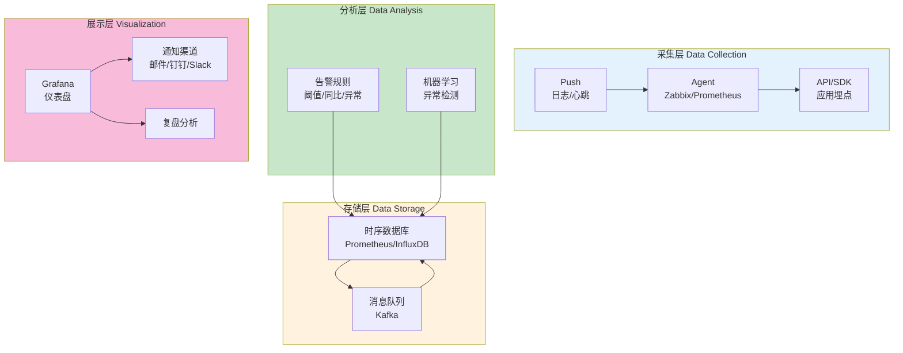
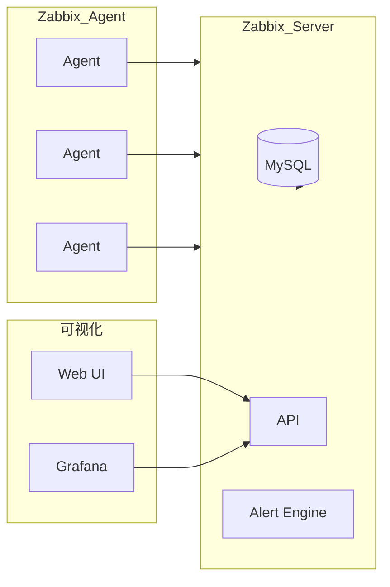
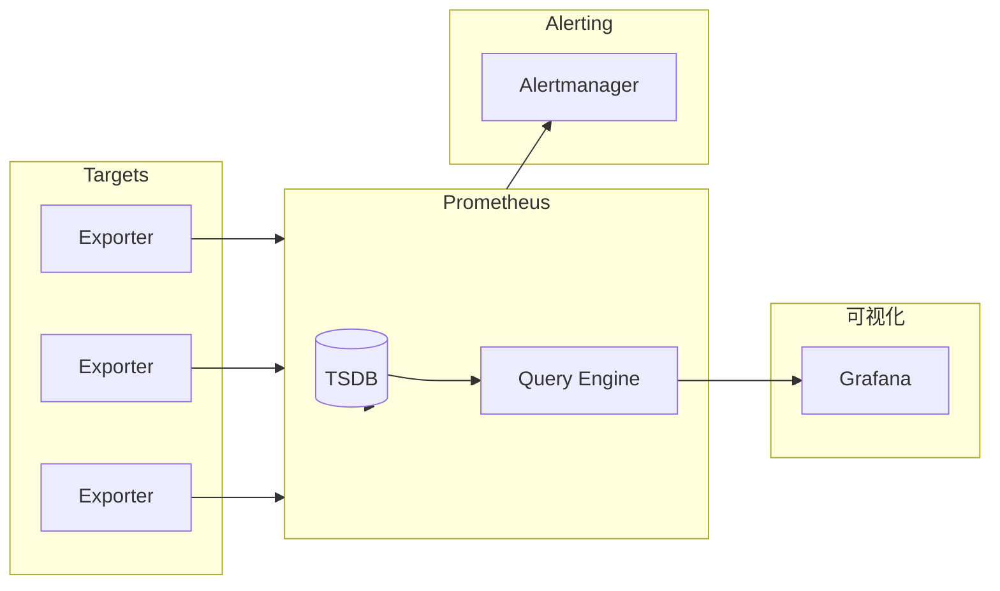
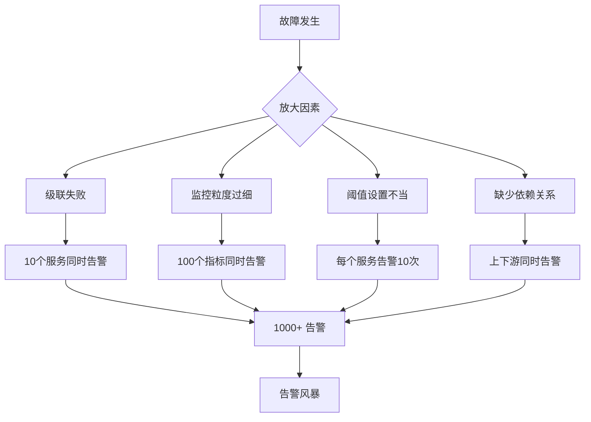
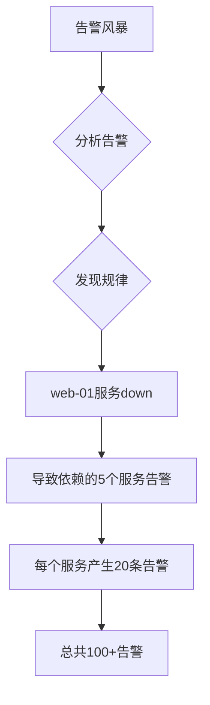

# 监控系统生产环境最佳实践：从架构设计到告警收敛

## 情境(Situation)

监控系统是SRE团队的生命线，是保障服务可用性的核心基础设施。正如Google SRE最佳实践所言：**监控与告警是SRE团队的眼睛**。没有监控，你就是在"盲飞"。监控系统的成熟度直接决定了MTTR（平均故障恢复时间）和SLO达成率。

在生产环境中，监控系统承担着关键职责：

- **故障预警**：提前发现潜在问题，避免故障发生
- **故障定位**：快速定位问题根因，缩短MTTR
- **性能分析**：分析系统性能瓶颈，指导容量规划
- **趋势预测**：预测资源需求，提前扩容
- **SLO监控**：监控SLO达成情况，保障服务质量
- **容量规划**：基于历史数据规划容量

## 冲突(Conflict)

许多团队在建设和维护监控系统时遇到以下问题：

- **监控碎片化**：各种监控系统孤立，数据不互通
- **告警风暴**：故障时收到海量告警，无法快速定位
- **告警疲劳**：真正重要的告警被淹没
- **监控过度**：采集过多无用指标，浪费资源
- **监控不足**：关键业务指标缺失
- **响应延迟**：告警通知延迟，影响故障处理
- **根因分析难**：无法快速定位故障根因

## 问题(Question)

如何构建一个高效、可靠的监控系统，实现故障预警、快速定位和告警收敛？

## 答案(Answer)

本文将从SRE视角出发，结合真实生产案例，提供一套完整的监控系统生产环境最佳实践。核心方法论基于 [SRE面试题解析：监控系统组成](#13-监控系统组成)。

---

## 一、监控系统四层架构

### 1.1 架构总览



### 1.2 采集层详解

**主动采集 vs 被动推送**：

| 模式 | 原理 | 优点 | 缺点 | 适用场景 |
|:----:|:-----|:-----|:-----|:---------|
| **Pull (主动采集)** | Prometheus定期拉取 | 易于管理、无需agent、支持服务发现 | 网络要求高、实时性差 | 服务数量固定的环境 |
| **Push (被动推送)** | Agent主动推送 | 实时性高、适合动态环境 | 需要agent、难以管理 | 短生命周期任务、动态扩缩容 |

**Prometheus Pull模式配置**：

```yaml
# prometheus.yml
global:
  scrape_interval: 15s
  evaluation_interval: 15s

scrape_configs:
  - job_name: 'node'
    static_configs:
      - targets: ['node-exporter:9100']
    
  - job_name: 'kubernetes-apis'
    kubernetes_sd_configs:
      - role: endpoints
    relabel_configs:
      - source_labels: [__meta_kubernetes_endpoint_port_name]
        action: keep
        regex: https
```

**Pushgateway推送模式配置**：

```yaml
# 对于短生命周期任务使用Pushgateway
- job_name: 'batch-jobs'
    pushgateway:
      base_url: http://pushgateway:9091
    honor_labels: true
    static_configs:
      - targets:
        - job1
        - job2
```

**Zabbix Agent主动模式**：

```bash
# zabbix_agentd.conf 配置
Server=192.168.1.100
ServerActive=192.168.1.100
RefreshActiveChecks=120
BufferSend=5
BufferSize=1000
```

### 1.3 存储层详解

**时序数据库选型**：

| 数据库 | 特点 | 优势 | 劣势 | 适用规模 |
|:-------|:-----|:-----|:-----|:---------|
| **Prometheus** | 本地存储，Pull模式 | 简单、活跃生态 | 扩展性有限 | 单机房、中小型 |
| **Thanos** | Prometheus + 对象存储 | 长期存储、全局视图 | 复杂 | 多机房、大规模 |
| **InfluxDB** | 写入性能高 | 高并发写入 | 集群版昂贵 | 高写入场景 |
| **VictoriaMetrics** | PromQL兼容 | 资源效率高 | 社区较小 | 成本敏感场景 |

**Thanos架构配置**：

```yaml
# Thanos Sidecar - 与Prometheus部署在一起
thanos sidecar \
    --prometheus.url=http://localhost:9090 \
    --tsdb.path=/var/prometheus \
    --objstore.config-file=bucket.yml

# Thanos Store Gateway - 访问对象存储
thanos store \
    --data-dir=/var/thanos/store \
    --objstore.config-file=bucket.yml

# Thanos Query - 全局查询
thanos query \
    --store=sidecar:10901 \
    --store=store:10901
```

**Kafka消息队列配置**：

```properties
# Kafka topic配置
num.partitions=6
replication.factor=3
retention.ms=604800000  # 7天
cleanup.policy=delete

# 消费者配置
group.id=metrics-consumer
enable.auto.commit=true
auto.offset.reset=earliest
```

### 1.4 分析层详解

**告警规则引擎**：

```yaml
# Prometheus告警规则示例
groups:
  - name: example
    rules:
    # 简单阈值告警
    - alert: HighCPUUsage
      expr: node_cpu_usage_total > 80
      for: 5m
      labels:
        severity: warning
      annotations:
        summary: "CPU使用率过高"
        description: "CPU使用率超过80%，当前值: {{ "{{" }} $value }}%"

    # 同比告警
    - alert: HighCPUUsageComparedToYesterday
      expr: |
        (node_cpu_usage_total - node_cpu_usage_total offset 1d) 
        / node_cpu_usage_total offset 1d > 0.5
      for: 10m
      labels:
        severity: critical
      annotations:
        summary: "CPU使用率同比上涨超过50%"

    # 异常检测（基于标准差）
    - alert: HighLatencyAnomaly
      expr: |
        histogram_quantile(0.99, rate(http_request_duration_seconds_bucket[5m])) 
        > (avg_over_time(histogram_quantile(0.99, rate(http_request_duration_seconds_bucket[5m]))[7d:1h]) * 3)
      for: 5m
      labels:
        severity: critical
```

**Alertmanager配置**：

```yaml
# alertmanager.yml
global:
  resolve_timeout: 5m
  smtp_smarthost: 'smtp.example.com:587'
  smtp_from: 'alert@example.com'

route:
  group_by: ['alertname', 'cluster']
  group_wait: 30s
  group_interval: 5m
  repeat_interval: 4h
  receiver: 'default'
  routes:
    - match:
        severity: critical
      receiver: 'critical-alerts'
      continue: true
    - match:
        severity: warning
      receiver: 'warning-alerts'

receivers:
  - name: 'default'
    webhook_configs:
      - url: 'http://dingtalk:8060/dingtalk/webhook'

  - name: 'critical-alerts'
    webhook_configs:
      - url: 'http://pagerduty:8090/webhook'
    pagerduty_configs:
      - service_key: 'YOUR_SERVICE_KEY'

  - name: 'warning-alerts'
    email_configs:
      - to: 'team@example.com'
```

### 1.5 展示层详解

**Grafana仪表盘设计原则**：

| 原则 | 说明 | 示例 |
|:-----|:-----|:-----|
| **从上到下** | 最重要的指标放顶部 | SLO状态 → 错误率 → 延迟 |
| **从左到右** | 概览到详情 | 全局视图 → 服务详情 |
| **颜色语义** | 绿色正常、黄色警告、红色严重 | 符合SLO绿色、超SLO黄色、故障红色 |
| **信息密度** | 适量信息、避免拥挤 | 每个Panel不超过6个指标 |

**Grafana仪表盘JSON**：

```json
{
  "dashboard": {
    "title": "SRE Overview Dashboard",
    "panels": [
      {
        "title": "SLO Status",
        "type": "stat",
        "gridPos": {"x": 0, "y": 0, "w": 6, "h": 4},
        "targets": [
          {
            "expr": "slo_compliance * 100",
            "legendFormat": "SLO %"
          }
        ],
        "fieldConfig": {
          "defaults": {
            "thresholds": {
              "mode": "absolute",
              "steps": [
                {"color": "red", "value": null},
                {"color": "yellow", "value": 99},
                {"color": "green", "value": 99.9}
              ]
            },
            "unit": "percent"
          }
        }
      }
    ]
  }
}
```

---

## 二、监控组件选型对比

### 2.1 主流监控工具对比

| 工具 | 类型 | 数据模型 | 采集方式 | 存储 | 告警 | 可视化 | 适用场景 |
|:----:|:----:|:--------:|:--------:|:----:|:----:|:------:|:---------|
| **Zabbix** | 综合监控 | 模板+Item | Agent/SSH/API | MySQL/PG | 内置 | 内置 | 传统IT基础设施 |
| **Prometheus** | 指标监控 | 时序+标签 | Pull/Push | 本地/远程 | Alertmanager | Grafana | 云原生、K8s环境 |
| **Grafana** | 可视化 | - | - | 多数据源 | - | 原生 | 通用仪表盘 |
| **Datadog** | SaaS监控 | 多维度 | Agent/API | 云端 | 内置 | 内置 | 云环境、混合环境 |
| **Prometheus + Thanos** | 指标监控 | 时序+标签 | Pull | 对象存储 | Alertmanager | Grafana | 大规模、多机房 |

### 2.2 Zabbix vs Prometheus对比

**Zabbix架构**：



**Prometheus架构**：



### 2.3 选择建议

| 场景 | 推荐方案 | 原因 |
|:-----|:---------|:-----|
| **小型团队、简单监控** | Zabbix | 一站式、安装简单 |
| **云原生、K8s环境** | Prometheus + Thanos | 生态丰富、云原生 |
| **大规模、多机房** | Prometheus + Thanos | 支持长期存储、全局视图 |
| **混合环境** | Datadog / Oracle OM | 多数据源集成 |
| **成本敏感** | VictoriaMetrics | 资源效率高 |

---

## 三、告警配置最佳实践

### 3.1 告警黄金法则

**告警配置原则**：

```
✅ 要告的：
  - 核心业务SLO（可用性、延迟、错误率）
  - 严重故障（服务不可用、数据丢失）
  - 性能拐点（资源使用率超过80%）
  - 安全事件（登录失败、异常访问）

❌ 不告的：
  - 资源闲置（CPU 5%、内存20%）
  - 偶发抖动（单次采样异常）
  - 非核心指标（开发测试环境）
  - 信息类指标（版本号、启动时间）
```

**告警分级标准**：

| 级别 | 名称 | 定义 | 响应时间 | 通知方式 |
|:----:|:----:|:-----|:--------:|:---------|
| **P1** | Critical | 服务不可用、数据丢失 | 5分钟 | 电话+短信 |
| **P2** | Warning | 服务降级、性能下降 | 15分钟 | 钉钉+邮件 |
| **P3** | Info | 需要关注、趋势预警 | 1小时 | 邮件 |

### 3.2 告警规则示例

**Prometheus告警规则**：

```yaml
groups:
  - name: infrastructure
    rules:
    # P1: 服务不可用
    - alert: ServiceDown
      expr: up{job="production"} == 0
      for: 1m
      labels:
        severity: critical
        level: P1
      annotations:
        summary: "服务 {{ "{{" }} $labels.instance }} 不可用"
        runbook: "https://runbook.example.com/service-down"

    # P2: 资源告警
    - alert: HighMemoryUsage
      expr: (1 - node_memory_MemAvailable_bytes / node_memory_MemTotal_bytes) * 100 > 85
      for: 5m
      labels:
        severity: warning
        level: P2
      annotations:
        summary: "内存使用率超过85%"
        description: "当前值: {{ "{{" }} $value }}%"

    # P3: 趋势预警
    - alert: DiskSpaceLowTrend
      expr: predict_linear(node_filesystem_avail_bytes{fstype!~"tmpfs"}[1h], 4*3600) < 0
      for: 10m
      labels:
        severity: info
        level: P3
      annotations:
        summary: "磁盘空间预计4小时内耗尽"
```

**Zabbix触发器配置**：

```bash
# 创建触发器（通过API）
curl -X POST http://zabbix/api_jsonrpc.php \
  -H "Content-Type: application/json" \
  -d '{
    "jsonrpc": "2.0",
    "method": "trigger.create",
    "params": {
      "description": "CPU使用率超过80%",
      "expression": "avg(/Linux CPU,5m)>80",
      "priority": 2,
      "tags": [
        {"tag": "level", "value": "P2"}
      ]
    },
    "auth": "'$ZABBIX_TOKEN'",
    "id": 1
  }'
```

### 3.3 告警收敛策略

**告警风暴原因分析**：



**告警聚合配置**：

```yaml
# Alertmanager路由配置
route:
  group_by: ['alertname', 'cluster', 'service']
  group_wait: 30s
  group_interval: 5m
  repeat_interval: 4h
  
  routes:
    # 按服务聚合
    - match:
        cluster: production
      receiver: 'production-alerts'
      group_by: ['alertname', 'service']
      
    # 按机房聚合
    - match:
        datacenter: shanghai
      receiver: 'shanghai-alerts'
      continue: true
```

**告警静默和抑制配置**：

```yaml
# Alertmanager抑制配置
inhibit_rules:
  # 当ServiceDown告警触发时，抑制该服务的其他告警
  - source_match:
      alertname: ServiceDown
    target_match:
      severity: critical
    equal: ['cluster', 'service']
    
  # 当整个集群down时，抑制单个实例的告警
  - source_match:
      alertname: ClusterDown
    target_match_re:
      alertname: InstanceDown
    equal: ['cluster']
```

**Python告警收敛脚本**：

```python
#!/usr/bin/env python3
# alert_correlation.py - 告警关联分析

import json
from datetime import datetime
from collections import defaultdict

class AlertCorrelator:
    def __init__(self):
        self.alerts = []
        self.correlation_rules = [
            {
                "name": "service_deps",
                "condition": lambda a: a.get("service"),
                "group_by": ["service"]
            },
            {
                "name": "host_deps",
                "condition": lambda a: a.get("host"),
                "group_by": ["host", "alertname"]
            }
        ]
    
    def add_alert(self, alert):
        """添加告警"""
        alert["timestamp"] = datetime.now().isoformat()
        self.alerts.append(alert)
    
    def correlate(self):
        """关联分析"""
        groups = defaultdict(list)
        
        for alert in self.alerts:
            # 按服务分组
            if "service" in alert:
                key = f"service:{alert['service']}"
                groups[key].append(alert)
            
            # 按主机分组
            if "host" in alert:
                key = f"host:{alert['host']}"
                groups[key].append(alert)
        
        return groups
    
    def generate_summary(self):
        """生成告警摘要"""
        correlated = self.correlate()
        
        summaries = []
        for group_key, alerts in correlated.items():
            if len(alerts) > 1:
                summary = {
                    "group": group_key,
                    "count": len(alerts),
                    "root_cause": self.identify_root_cause(alerts),
                    "alerts": alerts
                }
                summaries.append(summary)
        
        return summaries
    
    def identify_root_cause(self, alerts):
        """识别根因"""
        # 简单策略：第一个告警可能是根因
        # 实际应该根据告警类型和时间顺序判断
        return alerts[0] if alerts else None

# 使用示例
if __name__ == "__main__":
    correlator = AlertCorrelator()
    
    # 模拟告警数据
    alerts = [
        {"alertname": "HighCPU", "host": "web-01", "service": "web", "severity": "warning"},
        {"alertname": "HighMemory", "host": "web-01", "service": "web", "severity": "warning"},
        {"alertname": "ServiceDown", "host": "web-01", "service": "web", "severity": "critical"},
    ]
    
    for alert in alerts:
        correlator.add_alert(alert)
    
    summaries = correlator.generate_summary()
    print(json.dumps(summaries, indent=2, ensure_ascii=False))
```

---

## 四、SRE可观测性实践

### 4.1 黄金指标

**USE方法**：

| 指标类型 | 定义 | 示例 | 告警阈值 |
|:--------:|:-----|:-----|:---------|
| **Utilization** | 利用率 | CPU使用率、内存使用率 | > 80% |
| **Saturation** | 饱和度 | 队列长度、CPU队列 | > 10 |
| **Errors** | 错误率 | 5xx错误率、请求失败率 | > 1% |

**RED方法**：

| 指标类型 | 定义 | 示例 | SLO |
|:--------:|:-----|:-----|:-----|
| **Rate** | 请求率 | QPS、TPS | - |
| **Errors** | 错误率 | 5xx占比 | 可用性 > 99.9% |
| **Duration** | 延迟 | P50/P95/P99 | P99 < 500ms |

### 4.2 埋点规范

**Prometheus埋点示例**：

```python
#!/usr/bin/env python3
# metrics.py - Prometheus埋点示例

from prometheus_client import Counter, Histogram, Gauge, Summary
import random
import time

# 请求计数器
REQUEST_COUNT = Counter(
    "http_requests_total",
    "Total HTTP requests",
    ["method", "endpoint", "status"]
)

# 请求延迟直方图
REQUEST_LATENCY = Histogram(
    "http_request_duration_seconds",
    "HTTP request latency",
    ["method", "endpoint"],
    buckets=[0.01, 0.05, 0.1, 0.5, 1.0, 5.0]
)

# 当前活跃请求数
ACTIVE_REQUESTS = Gauge(
    "http_active_requests",
    "Number of active HTTP requests",
    ["method"]
)

# 业务指标
ORDER_COUNT = Counter(
    "orders_total",
    "Total number of orders",
    ["status", "payment_method"]
)

ORDER_AMOUNT = Summary(
    "order_amount_summary",
    "Order amount summary",
    ["payment_method"]
)

def track_request(method, endpoint):
    """请求跟踪装饰器"""
    def decorator(func):
        def wrapper(*args, **kwargs):
            ACTIVE_REQUESTS.labels(method=method).inc()
            start_time = time.time()
            
            try:
                result = func(*args, **kwargs)
                status = "success"
                return result
            except Exception as e:
                status = "error"
                raise
            finally:
                duration = time.time() - start_time
                REQUEST_COUNT.labels(
                    method=method,
                    endpoint=endpoint,
                    status=status
                ).inc()
                REQUEST_LATENCY.labels(
                    method=method,
                    endpoint=endpoint
                ).observe(duration)
                ACTIVE_REQUESTS.labels(method=method).dec()
        
        return wrapper
    return decorator

# 使用示例
@track_request("GET", "/api/orders")
def get_orders():
    time.sleep(random.uniform(0.01, 0.1))
    return {"orders": []}
```

### 4.3 多数据中心监控

**Thanos全局视图配置**：

```yaml
# Thanos Query配置 - 聚合多个Prometheus实例
thanos query \
    --store=prometheus-us-east:10901 \
    --store=prometheus-us-west:10901 \
    --store=prometheus-europe:10901 \
    --http-address=0.0.0.0:9090
```

**告警路由配置**：

```yaml
# 按数据中心分组
route:
  group_by: ['alertname', 'datacenter']
  routes:
    - match:
        datacenter: us-east
      receiver: 'us-east-oncall'
    - match:
        datacenter: us-west
      receiver: 'us-west-oncall'
```

---

## 五、生产环境案例分析

### 案例1：告警风暴处理

**背景**：凌晨3点收到200+告警，分布在10个服务、50台机器上

**问题分析**：


**根因**：web-01所在机柜掉电，导致web-01上的MySQL服务不可用

**解决方案**：
1. 配置告警依赖关系
2. 启用Alertmanager抑制规则
3. 设置告警聚合窗口

**配置修改**：
```yaml
# 添加依赖关系
inhibit_rules:
  - source_match:
      alertname: HostDown
    target_match_re:
      alertname: ".*Service.*"
    equal: ['cluster', 'host']
```

**效果**：下次类似故障只产生1-2条告警

### 案例2：SLO不达标排查

**背景**：本月SLO 99.9%未达成，实际达成率99.5%

**排查步骤**：

```bash
#!/bin/bash
# slo_analysis.sh - SLO分析脚本

SLO_TARGET=99.9
PERIOD="30d"

echo "=== SLO达成率分析 ==="

# 1. 计算总请求数和错误数
TOTAL_REQUESTS=$(promtool query instant \
    "sum(increase(http_requests_total[$PERIOD]))")
ERROR_REQUESTS=$(promtool query instant \
    "sum(increase(http_requests_total{status=~'5..'}[$PERIOD]))")

# 2. 计算错误率
ERROR_RATE=$(echo "scale=4; $ERROR_REQUESTS / $TOTAL_REQUESTS * 100" | bc)
SLO_ACTUAL=$(echo "scale=4; 100 - $ERROR_RATE" | bc)

echo "总请求数: $TOTAL_REQUESTS"
echo "错误请求数: $ERROR_REQUESTS"
echo "错误率: $ERROR_RATE%"
echo "SLO达成率: $SLO_ACTUAL%"

# 3. 找出主要错误来源
echo ""
echo "=== 主要错误来源 ==="
promtool query range \
    "topk(5, sum by (service, endpoint) (rate(http_requests_total{status=~'5..'}[5m])))"

# 4. 错误时间分布
echo ""
echo "=== 错误时间分布 ==="
promtool query range \
    "sum by (hour) (increase(http_requests_total{status=~'5..'}[1h]))"
```

**发现**：某API的慢查询导致大量5xx错误

**解决方案**：
1. 优化SQL查询
2. 增加缓存
3. 设置限流

### 案例3：监控迁移

**背景**：从Zabbix迁移到Prometheus，保留历史数据

**迁移方案**：

```bash
#!/bin/bash
# migrate_zabbix_to_prometheus.sh

# 1. 导出Zabbix历史数据
zabbix_export --history --format=json --output=history.json

# 2. 转换为Prometheus格式
python3 convert_zabbix_to_prometheus.py \
    --input history.json \
    --output metrics.prom

# 3. 使用Remote Read/Write集成
# prometheus.yml
remote_read:
  - url: http://zabbix-api:8080/api/v1/prometheus
    name: zabbix

remote_write:
  - url: http://prometheus:9090/api/v1/write
    name: thanos
```

---

## 六、最佳实践总结

### 6.1 监控建设路线图

| 阶段 | 目标 | 关键任务 |
|:----:|:-----|:---------|
| **Level 1** | 基础监控 | 主机/网络/应用存活 |
| **Level 2** | 性能监控 | CPU/内存/磁盘/网络 |
| **Level 3** | 业务监控 | QPS/延迟/错误率 |
| **Level 4** | 链路追踪 | 请求追踪、依赖分析 |
| **Level 5** | 智能监控 | 异常检测、预测告警 |

### 6.2 监控最佳实践Checklist

- [ ] **采集层**
  - [ ] 主机监控（CPU/内存/磁盘/网络）
  - [ ] 应用监控（进程/端口/日志）
  - [ ] 业务监控（QPS/延迟/错误率）
  - [ ] 链路追踪（依赖关系、调用链）

- [ ] **存储层**
  - [ ] 数据保留策略（30天热数据、1年冷数据）
  - [ ] 数据备份机制
  - [ ] 存储容量规划

- [ ] **分析层**
  - [ ] 告警规则覆盖核心指标
  - [ ] 告警分级明确（P1/P2/P3）
  - [ ] 告警收敛配置完善
  - [ ] 静默规则设置合理

- [ ] **展示层**
  - [ ] SLO仪表盘可查看
  - [ ] 告警历史可追溯
  - [ ] 趋势分析可对比

### 6.3 常见问题解决方案

| 问题 | 原因 | 解决方案 |
|:-----|:-----|:---------|
| **告警延迟** | 采集间隔过长 | 减小scrape_interval |
| **告警丢失** | Alertmanager配置错误 | 检查receivers配置 |
| **数据丢失** | 存储容量不足 | 扩容或清理旧数据 |
| **查询慢** | 指标基数过大 | 使用标签压缩、Recording Rules |
| **误报多** | 阈值设置不当 | 调整阈值、使用复合条件 |

---

## 总结

监控系统是SRE团队的重要基础设施，高效的监控系统可以显著提升故障发现和定位效率，降低MTTR。

**核心要点**：

1. **四层架构**：采集层→存储层→分析层→展示层，缺一不可
2. **告警收敛**：通过聚合、抑制、静默减少告警风暴
3. **SLO监控**：以业务SLO为核心设计监控指标
4. **黄金指标**：USE方法（Utilization/Saturation/Errors）和RED方法（Rate/Errors/Duration）
5. **持续优化**：根据实际情况调整监控策略

> **延伸学习**：更多面试相关的监控系统问题，请参考 [SRE面试题解析：监控系统组成](#13-监控系统组成)。

---

## 参考资料

- [Prometheus官方文档](https://prometheus.io/docs/)
- [Grafana官方文档](https://grafana.com/docs/)
- [Alertmanager配置指南](https://prometheus.io/docs/alerting/latest/configuration/)
- [Thanos架构设计](https://thanos.io/)
- [SRE Books - Monitoring Distributed Systems](https://sre.google/sre-book/monitoring-distributed-systems/)
- [Google SRE - The Four Golden Signals](https://sre.google/sre-book/monitoring-distributed-systems/#golden-signals)
- [USE Method - Netflix](http://www.brendangregg.com/usemethod.html)
- [RED Method - Weaveworks](https://www.weave.works/blog/the-red-method-key-metrics-for-microservices-success/)
- [Alertmanager抑制规则](https://prometheus.io/docs/alerting/latest/alertmanager/)
- [Zabbix Documentation](https://www.zabbix.com/documentation/)