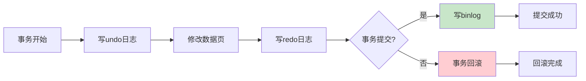
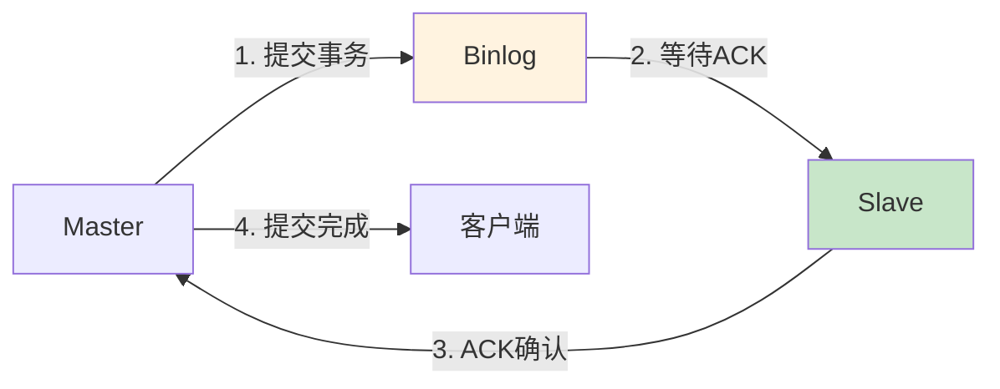

# MySQL生产环境最佳实践：从日志管理到主从复制的完整指南

## 情境(Situation)

MySQL是互联网应用最常用的数据库之一，其日志系统和主从复制机制是保障数据可靠性和业务连续性的基石。作为SRE工程师，理解MySQL日志原理、掌握主从复制配置、熟悉性能优化方法，对保障数据库稳定运行至关重要。

在MySQL生产环境中，我们面临诸多挑战：

- **数据可靠性要求高**：任何数据丢失或损坏都可能造成业务损失
- **性能压力大**：高并发场景下，数据库往往是系统瓶颈
- **可用性要求高**：数据库故障直接影响业务可用性
- **扩展性需求**：业务增长需要数据库能够水平扩展
- **运维复杂度高**：数据库配置、优化、备份等需要专业技能
- **故障定位难**：数据库问题往往隐蔽且排查困难

## 冲突(Conflict)

许多企业在MySQL运维中遇到以下问题：

- **日志管理不当**：日志配置不合理，导致性能下降或数据丢失
- **复制架构不完善**：主从复制配置错误，导致数据不一致或复制延迟
- **性能问题频发**：缺乏有效的性能优化手段，数据库成为瓶颈
- **备份恢复困难**：没有完善的备份机制，数据丢失风险高
- **监控体系缺失**：无法及时发现数据库问题
- **故障处理能力弱**：出现问题时无法快速定位和恢复

这些问题在生产环境中可能导致数据丢失、服务中断、性能下降等严重后果。

## 问题(Question)

如何在生产环境中构建高可靠、高性能、可扩展的MySQL数据库架构？

## 答案(Answer)

本文将从SRE视角出发，结合真实生产案例，提供一套完整的MySQL生产环境最佳实践。核心方法论基于 [SRE面试题解析：MySQL日志与主从复制](#10-mysql日志与主从复制)。

---

## 一、MySQL日志体系深度解析

### 1.1 五种日志类型对比

**MySQL日志分类**：

| 日志类型 | 作用 | 存储内容 | 关键参数 |
|:--------:|:-----|:---------|:---------|
| **binlog** | 复制和恢复 | 所有DDL/DML操作 | `log_bin`, `sync_binlog` |
| **redolog** | 事务持久化 | 物理修改日志（InnoDB） | `innodb_log_file_size` |
| **undolog** | 回滚和MVCC | 回滚段信息 | 自动管理 |
| **slowlog** | SQL优化 | 慢查询记录 | `long_query_time` |
| **errorlog** | 故障排查 | 启动/运行/错误信息 | `log_error` |

**日志写入流程**：



### 1.2 Binlog详解

**binlog作用**：
- 数据恢复：利用binlog进行point-in-time恢复
- 主从复制：binlog是复制的核心
- 审计追踪：记录所有数据变更

**binlog格式对比**：

| 格式 | 优点 | 缺点 | 适用场景 |
|:----:|:-----|:-----|:---------|
| **Statement** | 日志量小 | 某些函数不确定 | 非确定性SQL |
| **Row** | 准确记录每行变化 | 日志量大 | 数据一致性要求高 |
| **Mixed** | 兼顾两者 | 混合模式可能复杂 | 一般场景 |

**binlog配置示例**：

```ini
# my.cnf
[mysqld]
# 启用binlog
log-bin = /data/mysql/binlog/mysql-bin
binlog-format = ROW
sync-binlog = 1
expire-logs-days = 7
max-binlog-size = 1G
binlog-cache-size = 4M

# GTID模式（推荐）
gtid-mode = ON
enforce-gtid-consistency = ON
```

**binlog管理脚本**：

```bash
#!/bin/bash
# binlog_manager.sh - Binlog管理脚本

MYSQL_USER="root"
MYSQL_PASSWORD="password"
BINLOG_DIR="/data/mysql/binlog"

# 查看binlog列表
list_binlogs() {
    echo "=== Binlog列表 ==="
    mysql -u$MYSQL_USER -p$MYSQL_PASSWORD -e "SHOW BINARY LOGS;"
}

# 查看当前binlog位置
show_master_status() {
    echo "=== Master状态 ==="
    mysql -u$MYSQL_USER -p$MYSQL_PASSWORD -e "SHOW MASTER STATUS;"
}

# 清理旧的binlog
purge_old_logs() {
    local days=${1:-7}
    echo "清理${days}天前的binlog..."
    mysql -u$MYSQL_USER -p$MYSQL_PASSWORD -e "PURGE BINARY LOGS BEFORE DATE(NOW() - INTERVAL ${days} DAY);"
}

# 备份binlog
backup_binlog() {
    local backup_dir="/backup/binlog/$(date +%Y%m%d)"
    mkdir -p "$backup_dir"
    
    echo "备份binlog到 $backup_dir..."
    cp -r "$BINLOG_DIR"/* "$backup_dir/" 2>/dev/null || true
    
    echo "Binlog备份完成"
}

# 主函数
main() {
    case "$1" in
        "list")
            list_binlogs
            ;;
        "status")
            show_master_status
            ;;
        "purge")
            purge_old_logs "${2:-7}"
            ;;
        "backup")
            backup_binlog
            ;;
        *)
            echo "用法: $0 {list|status|purge [天数]|backup}"
            ;;
    esac
}

main "$@"
```

### 1.3 InnoDB日志配置

**redolog配置优化**：

```ini
# my.cnf - InnoDB日志配置
[mysqld]
# redo log配置
innodb-log-file-size = 2G
innodb-log-files-in-group = 3
innodb-log-group-home-dir = /data/mysql/redolog
innodb-flush-log-at-trx-commit = 1

# 崩溃恢复
innodb-flush-log-at-trx-commit = 1  # 最安全，每次提交刷盘
# innodb-flush-log-at-trx-commit = 2  # 性能更好，可能丢失1秒数据
```

**undolog配置**：

```ini
[mysqld]
# undo log配置
innodb-undo-tablespaces = 3
innodb-undo-directory = /data/mysql/undolog
innodb-undo-log-truncate = ON
```

### 1.4 慢查询日志配置

**slowlog配置**：

```ini
[mysqld]
# 慢查询日志
slow-query-log = 1
slow-query-log-file = /data/mysql/log/slow.log
long-query-time = 1
long_queries_not_using_indexes = 1
min-examined-row-limit = 1000
log-output = TABLE
```

**慢查询分析脚本**：

```bash
#!/bin/bash
# slow_query_analyzer.sh - 慢查询分析脚本

MYSQL_USER="root"
MYSQL_PASSWORD="password"

# 分析慢查询
analyze_slow_queries() {
    echo "=== 慢查询分析 ==="
    
    # 从slowlog中提取查询
    mysqldumpslow -s t -t 10 /data/mysql/log/slow.log 2>/dev/null || true
    
    # 从performance_schema分析
    mysql -u$MYSQL_USER -p$MYSQL_PASSWORD -e "
        SELECT 
            DIGEST AS '查询签名',
            COUNT_STAR AS '执行次数',
            SUM_TIMER_WAIT/1000000000000 AS '总耗时(秒)',
            AVG_TIMER_WAIT/1000000000000 AS '平均耗时(秒)',
            SUM_ROWS_EXAMINED AS '扫描行数',
            SUM_ROWS_SENT AS '返回行数'
        FROM performance_schema.events_statements_summary_by_digest
        WHERE DIGEST IS NOT NULL
        ORDER BY SUM_TIMER_WAIT DESC
        LIMIT 10;
    "
}

# 检查未使用索引的查询
check_missing_indexes() {
    echo "=== 未使用索引的查询 ==="
    mysql -u$MYSQL_USER -p$MYSQL_PASSWORD -e "
        SELECT 
            OBJECT_SCHEMA AS '库名',
            OBJECT_NAME AS '表名',
            INDEX_NAME AS '索引名',
            COUNT_READ AS '读取次数'
        FROM performance_schema.table_io_waits_summary_by_index_usage
        WHERE INDEX_NAME IS NOT NULL
        AND COUNT_READ = 0
        AND OBJECT_SCHEMA NOT IN ('mysql', 'information_schema', 'performance_schema')
        ORDER BY COUNT_READ ASC
        LIMIT 20;
    "
}

# 主函数
main() {
    analyze_slow_queries
    echo ""
    check_missing_indexes
}

main
```

---

## 二、主从复制最佳实践

### 2.1 主从复制原理

**复制架构**：


**复制原理速记**：Dump线程读binlog，IO线程接收，SQL线程回放

### 2.2 主库配置

**主库完整配置**：

```ini
[mysqld]
# 服务器ID
server-id = 1

# binlog配置
log-bin = /data/mysql/binlog/mysql-bin
binlog-format = ROW
sync-binlog = 1
expire-logs-days = 7
max-binlog-size = 1G

# GTID模式（推荐）
gtid-mode = ON
enforce-gtid-consistency = ON

# 复制相关
binlog-checksum = CRC32
binlog-row-image = FULL

# 性能优化
innodb-flush-log-at-trx-commit = 1
innodb-buffer-pool-size = 32G
innodb-io-capacity = 2000
innodb-io-capacity-max = 4000

# 网络优化
max-connections = 2000
wait-timeout = 28800
```

**创建复制用户**：

```sql
-- 创建复制用户
CREATE USER 'repl'@'%' IDENTIFIED BY 'StrongPassword123!';
GRANT REPLICATION SLAVE ON *.* TO 'repl'@'%';

-- 如果使用Row格式，需要额外权限
GRANT SELECT ON *.* TO 'repl'@'%';

FLUSH PRIVILEGES;
```

### 2.3 从库配置

**从库完整配置**：

```ini
[mysqld]
# 服务器ID（必须唯一）
server-id = 2

# relay log配置
relay-log = /data/mysql/relaylog/relay-bin
relay-log-purge = ON
relay-log-recovery = ON

# 只读模式（建议）
read-only = ON
super-read-only = ON

# GTID模式
gtid-mode = ON
enforce-gtid-consistency = ON

# 复制配置
slave-parallel-workers = 8
slave-parallel-type = LOGICAL_CLOCK
slave-preserve-commit-order = ON

# 跳过错误（谨慎使用）
# slave-skip-errors = 1062,1053

# 日志配置
log-error = /data/mysql/log/error.log
slow-query-log = 1
slow-query-log-file = /data/mysql/log/slow.log
```

### 2.4 主从复制配置脚本

**主从配置脚本**：

```bash
#!/bin/bash
# mysql_replication_setup.sh - MySQL主从复制配置脚本

set -euo pipefail

# 配置参数
MASTER_HOST="192.168.1.100"
MASTER_PORT=3306
MASTER_USER="repl"
MASTER_PASSWORD="password"
SLAVE_HOST="192.168.1.101"
SLAVE_PORT=3306
BACKUP_DIR="/backup/mysql"

log() {
    echo "[$(date '+%Y-%m-%d %H:%M:%S')] $*"
}

# 主库操作
setup_master() {
    log "配置主库..."
    
    mysql -u root -p"$MYSQL_ROOT_PASSWORD" << EOF
-- 创建复制用户
CREATE USER IF NOT EXISTS '$MASTER_USER'@'%' IDENTIFIED BY '$MASTER_PASSWORD';
GRANT REPLICATION SLAVE ON *.* TO '$MASTER_USER'@'%';
FLUSH PRIVILEGES;

-- 查看主库状态
SHOW MASTER STATUS;
EOF
}

# 备份主库数据
backup_master() {
    log "备份主库数据..."
    
    local backup_file="$BACKUP_DIR/mysql_backup_$(date +%Y%m%d_%H%M%S).sql.gz"
    
    mkdir -p "$BACKUP_DIR"
    
    mysqldump \
        --single-transaction \
        --master-data=2 \
        --flush-logs \
        --all-databases \
        -- gzip > "$backup_file"
    
    log "备份完成: $backup_file"
    echo "$backup_file"
}

# 从库操作
setup_slave() {
    local backup_file="$1"
    
    log "配置从库..."
    
    # 恢复数据
    log "恢复数据..."
    gunzip < "$backup_file" | mysql -u root -p"$MYSQL_ROOT_PASSWORD"
    
    # 获取binlog位置
    local log_file=$(grep "MASTER_LOG_FILE=" "$backup_file" | head -1 | sed "s/.*MASTER_LOG_FILE='\([^']*\)'.*/\1/")
    local log_pos=$(grep "MASTER_LOG_POS=" "$backup_file" | head -1 | sed "s/.*MASTER_LOG_POS=\([0-9]*\).*/\1/")
    
    log "Binlog位置: $log_file:$log_pos"
    
    # 配置复制
    mysql -u root -p"$MYSQL_ROOT_PASSWORD" << EOF
STOP SLAVE;

CHANGE MASTER TO
    MASTER_HOST='$MASTER_HOST',
    MASTER_PORT=$MASTER_PORT,
    MASTER_USER='$MASTER_USER',
    MASTER_PASSWORD='$MASTER_PASSWORD',
    MASTER_LOG_FILE='$log_file',
    MASTER_LOG_POS=$log_pos,
    GET_MASTER_PUBLIC_KEY=1;

START SLAVE;
EOF
    
    log "从库配置完成"
}

# 检查复制状态
check_replication() {
    log "检查复制状态..."
    
    mysql -u root -p"$MYSQL_ROOT_PASSWORD" -e "
        SHOW SLAVE STATUS\G
    " | grep -E "Slave_IO_Running|Slave_SQL_Running|Seconds_Behind_Master|Relay_Log_Pos"
}

# 主函数
main() {
    case "$1" in
        "master")
            setup_master
            ;;
        "backup")
            backup_master
            ;;
        "slave")
            if [[ -z "$2" ]]; then
                echo "用法: $0 slave <备份文件>"
                exit 1
            fi
            setup_slave "$2"
            ;;
        "check")
            check_replication
            ;;
        *)
            echo "用法: $0 {master|backup|slave <备份文件>|check}"
            ;;
    esac
}

main "$@"
```

### 2.5 GTID复制配置

**GTID模式配置**：

```ini
# 主库GTID配置
[mysqld]
gtid-mode = ON
enforce-gtid-consistency = ON
```

```ini
# 从库GTID配置
[mysqld]
gtid-mode = ON
enforce-gtid-consistency = ON
```

**GTID复制命令**：

```sql
-- 配置GTID复制
CHANGE MASTER TO
    MASTER_HOST='192.168.1.100',
    MASTER_AUTO_POSITION=1,
    MASTER_USER='repl',
    MASTER_PASSWORD='password';

-- 启动复制
START SLAVE;

-- 查看GTID状态
SHOW SLAVE STATUS\G
SHOW VARIABLES LIKE 'gtid%';
```

### 2.6 半同步复制配置

**半同步复制原理**：



**半同步复制配置**：

```sql
-- 安装半同步插件（主库）
INSTALL PLUGIN rpl_semi_sync_master SONAME 'semisync_master.so';

-- 安装半同步插件（从库）
INSTALL PLUGIN rpl_semi_sync_slave SONAME 'semisync_slave.so';

-- 启用半同步（主库）
SET GLOBAL rpl_semi_sync_master_enabled = ON;
SET GLOBAL rpl_semi_sync_master_timeout = 10000;  -- 10秒超时

-- 启用半同步（从库）
SET GLOBAL rpl_semi_sync_slave_enabled = ON;

-- 查看状态
SHOW STATUS LIKE 'rpl_semi%';
```

---

## 三、MySQL性能优化

### 3.1 关键配置参数

**InnoDB核心参数**：

```ini
[mysqld]
# 缓冲池配置
innodb-buffer-pool-size = 32G
innodb-buffer-pool-instances = 8
innodb-buffer-pool-load-at-startup = ON

# 日志配置
innodb-log-file-size = 2G
innodb-log-files-in-group = 3
innodb-flush-log-at-trx-commit = 1

# IO配置
innodb-io-capacity = 2000
innodb-io-capacity-max = 4000
innodb-flush-method = O_DIRECT

# 并发配置
innodb-thread-concurrency = 32
innodb-read-io-threads = 16
innodb-write-io-threads = 16

# 表配置
innodb-file-per-table = ON
innodb-file-format = Barracuda
innodb-stats-on-metadata = OFF
```

### 3.2 索引优化

**索引创建原则**：

| 原则 | 说明 | 示例 |
|:-----|:-----|:-----|
| **最左前缀** | 复合索引从左开始使用 | idx(a,b,c) 支持 a,ab,abc |
| **选择性高** | 选择性高的列在前 | UUID > 性别 |
| **覆盖索引** | 查询仅在索引中完成 | SELECT a,b FROM t INDEX(a,b) |
| **避免冗余** | 删除重复索引 | idx(a), idx(a,b) 冗余 |

**索引优化脚本**：

```sql
-- 检查未使用索引
SELECT 
    object_schema,
    object_name,
    index_name,
    count_read,
    count_write,
    count_fetch,
    count_insert,
    count_update,
    count_delete
FROM performance_schema.table_io_waits_summary_by_index_usage
WHERE index_name IS NOT NULL
AND object_schema NOT IN ('mysql', 'information_schema', 'performance_schema')
ORDER BY count_read ASC;

-- 检查冗余索引
SELECT 
    a.table_schema AS '数据库',
    a.table_name AS '表名',
    a.index_name AS '冗余索引',
    b.index_name AS '覆盖索引',
    a.column_name AS '列名'
FROM information_schema.statistics a
JOIN information_schema.statistics b
    ON a.table_schema = b.table_schema
    AND a.table_name = b.table_name
    AND a.column_name = b.column_name
WHERE a.index_name != b.index_name
AND a.non_unique = 1
AND b.index_name IN (
    SELECT index_name
    FROM information_schema.statistics
    WHERE table_schema = a.table_schema
    AND table_name = a.table_name
    AND seq_in_index = 1
);
```

### 3.3 SQL优化

**慢查询优化案例**：

```sql
-- 原始慢查询
SELECT * FROM orders 
WHERE DATE(created_at) = '2024-01-01'
AND status = 'completed';

-- 优化后（使用范围查询）
SELECT * FROM orders 
WHERE created_at >= '2024-01-01 00:00:00'
AND created_at < '2024-01-02 00:00:00'
AND status = 'completed';

-- 添加索引
ALTER TABLE orders ADD INDEX idx_created_status (created_at, status);

-- 优化JOIN
SELECT o.*, u.name 
FROM orders o
INNER JOIN users u ON o.user_id = u.id
WHERE o.created_at > '2024-01-01';

-- 确保使用索引
SELECT * FROM orders USE INDEX (idx_created_status)
WHERE created_at >= '2024-01-01';
```

**分页优化**：

```sql
-- 原始分页（性能差）
SELECT * FROM orders 
ORDER BY id DESC 
LIMIT 1000000, 20;

-- 优化1：使用游标分页
SELECT * FROM orders 
WHERE id < 1000000
ORDER BY id DESC 
LIMIT 20;

-- 优化2：使用延迟关联
SELECT o.* 
FROM orders o
INNER JOIN (
    SELECT id FROM orders 
    ORDER BY id DESC 
    LIMIT 1000000, 20
) t ON o.id = t.id;
```

### 3.4 性能监控脚本

**MySQL性能监控脚本**：

```bash
#!/bin/bash
# mysql_monitor.sh - MySQL性能监控脚本

MYSQL_USER="root"
MYSQL_PASSWORD="password"

log() {
    echo "[$(date '+%Y-%m-%d %H:%M:%S')] $*"
}

# 连接状态
check_connections() {
    log "=== 连接状态 ==="
    mysql -u$MYSQL_USER -p$MYSQL_PASSWORD -e "
        SHOW STATUS LIKE 'Threads_connected';
        SHOW STATUS LIKE 'Max_used_connections';
        SHOW VARIABLES LIKE 'max_connections';
        SHOW STATUS LIKE 'Connection_errors%';
    "
}

# 缓存命中率
check_cache_hit_ratio() {
    log "=== 缓存命中率 ==="
    mysql -u$MYSQL_USER -p$MYSQL_PASSWORD -e "
        SHOW STATUS LIKE 'Innodb_buffer_pool_read_requests';
        SHOW STATUS LIKE 'Innodb_buffer_pool_reads';
        SHOW STATUS LIKE 'Key_read_requests';
        SHOW STATUS LIKE 'Key_reads';
        SHOW STATUS LIKE 'Qcache_hits';
        SHOW STATUS LIKE 'Qcache_inserts';
    "
}

# 查询缓存（如果启用）
check_query_cache() {
    log "=== 查询缓存 ==="
    mysql -u$MYSQL_USER -p$MYSQL_PASSWORD -e "
        SHOW STATUS LIKE 'Qcache%';
        SHOW VARIABLES LIKE 'query_cache%';
    "
}

# 复制状态
check_replication() {
    log "=== 复制状态 ==="
    mysql -u$MYSQL_USER -p$MYSQL_PASSWORD -e "
        SHOW SLAVE STATUS\G
    " | grep -E "Slave_IO_Running|Slave_SQL_Running|Seconds_Behind_Master|Relay_Log_Pos|Exec_Master_Log_Pos"
}

# 锁状态
check_locks() {
    log "=== 锁等待 ==="
    mysql -u$MYSQL_USER -p$MYSQL_PASSWORD -e "
        SELECT 
            waiting_pid AS '等待进程',
            waiting_query AS '等待查询',
            blocking_pid AS '阻塞进程',
            blocking_query AS '阻塞查询'
        FROM performance_schema.events_statements_current
        WHERE waiting_time > 1000;
    "
}

# 主函数
main() {
    check_connections
    check_cache_hit_ratio
    check_replication
    check_locks
}

main
```

---

## 四、MySQL备份与恢复

### 4.1 备份策略

**全量备份脚本**：

```bash
#!/bin/bash
# mysql_full_backup.sh - MySQL全量备份脚本

set -euo pipefail

MYSQL_USER="root"
MYSQL_PASSWORD="password"
BACKUP_DIR="/backup/mysql/full"
DATE=$(date +%Y%m%d_%H%M%S)

log() {
    echo "[$(date '+%Y-%m-%d %H:%M:%S')] $*"
}

# 创建备份目录
mkdir -p "$BACKUP_DIR"

# 全量备份
full_backup() {
    local backup_file="$BACKUP_DIR/mysql_full_$DATE.sql.gz"
    
    log "开始全量备份..."
    
    mysqldump \
        --single-transaction \
        --master-data=2 \
        --flush-logs \
        --routines \
        --triggers \
        --events \
        --all-databases \
        -- gzip > "$backup_file"
    
    log "全量备份完成: $backup_file"
    ls -lh "$backup_file"
}

# 备份binlog
backup_binlog() {
    local binlog_backup_dir="$BACKUP_DIR/binlog_$DATE"
    mkdir -p "$binlog_backup_dir"
    
    log "备份binlog..."
    
    # 获取当前的binlog位置
    mysql -u$MYSQL_USER -p$MYSQL_PASSWORD -e "SHOW BINARY LOGS;" | tail -n +2 | awk '{print $1}' | while read log; do
        mysql -u$MYSQL_USER -p$MYSQL_PASSWORD -e "SHOW BINLOG EVENTS IN '$log'" | grep -v "Log_name" > "$binlog_backup_dir/$log.sql"
    done
    
    log "Binlog备份完成: $binlog_backup_dir"
}

# 清理旧备份
cleanup_old_backups() {
    local retention_days=${1:-7}
    
    log "清理${retention_days}天前的备份..."
    find "$BACKUP_DIR" -type d -mtime +$retention_days -exec rm -rf {} \; 2>/dev/null || true
    
    log "清理完成"
}

# 主函数
main() {
    full_backup
    backup_binlog
    cleanup_old_backups "${1:-7}"
    
    log "备份任务完成"
}

main "$@"
```

### 4.2 增量备份

**增量备份脚本**：

```bash
#!/bin/bash
# mysql_incremental_backup.sh - MySQL增量备份脚本

set -euo pipefail

MYSQL_USER="root"
MYSQL_PASSWORD="password"
BACKUP_DIR="/backup/mysql/incremental"
DATE=$(date +%Y%m%d)

log() {
    echo "[$(date '+%Y-%m-%d %H:%M:%S')] $*"
}

mkdir -p "$BACKUP_DIR/$DATE"

# 获取上次备份的binlog位置
get_last_position() {
    local pos_file="$BACKUP_DIR/.last_position"
    
    if [[ -f "$pos_file" ]]; then
        cat "$pos_file"
    else
        mysql -u$MYSQL_USER -p$MYSQL_PASSWORD -e "SHOW MASTER STATUS;" | tail -1 | awk '{print $1, $2}'
    fi
}

# 增量备份
incremental_backup() {
    local last_log=$(get_last_position | awk '{print $1}')
    local last_pos=$(get_last_position | awk '{print $2}')
    
    log "上次位置: $last_log:$last_pos"
    
    # 刷新日志创建新的binlog
    mysql -u$MYSQL_USER -p$MYSQL_PASSWORD -e "FLUSH LOGS;"
    
    # 备份binlog
    mysql -u$MYSQL_USER -p$MYSQL_PASSWORD -e "SHOW BINARY LOGS;" | tail -n +2 | awk '{print $1}' | while read log; do
        if [[ "$log" > "$last_log" ]] || [[ "$log" == "$last_log" ]]; then
            mysql -u$MYSQL_USER -p$MYSQL_PASSWORD -e "SHOW BINLOG EVENTS IN '$log'" > "$BACKUP_DIR/$DATE/$log.sql"
        fi
    done
    
    # 保存当前位置
    mysql -u$MYSQL_USER -p$MYSQL_PASSWORD -e "SHOW MASTER STATUS;" | tail -1 | awk '{print $1, $2}' > "$BACKUP_DIR/.last_position"
    
    log "增量备份完成: $BACKUP_DIR/$DATE"
}

# 主函数
main() {
    incremental_backup
}

main
```

### 4.3 数据恢复

**数据恢复脚本**：

```bash
#!/bin/bash
# mysql_restore.sh - MySQL数据恢复脚本

set -euo pipefail

MYSQL_USER="root"
MYSQL_PASSWORD="password"
BACKUP_DIR="/backup/mysql/full"

log() {
    echo "[$(date '+%Y-%m-%d %H:%M:%S')] $*"
}

# 全量恢复
full_restore() {
    local backup_file="$1"
    
    log "开始全量恢复: $backup_file"
    
    # 停止复制
    mysql -u$MYSQL_USER -p$MYSQL_PASSWORD -e "STOP SLAVE;"
    
    # 恢复数据
    gunzip < "$backup_file" | mysql -u$MYSQL_USER -p$MYSQL_PASSWORD
    
    log "全量恢复完成"
}

# Point-in-time恢复
pitr_restore() {
    local full_backup="$1"
    local target_time="$2"  # 格式: '2024-01-01 12:00:00'
    
    log "开始Point-in-time恢复，目标时间: $target_time"
    
    # 恢复全量备份
    full_restore "$full_backup"
    
    # 应用binlog到目标时间
    # 需要手动执行以下命令：
    # mysqlbinlog --stop-datetime="$target_time" /path/to/binlog | mysql
    
    log "Point-in-time恢复完成"
}

# 主函数
main() {
    case "$1" in
        "full")
            if [[ -z "$2" ]]; then
                echo "用法: $0 full <备份文件>"
                exit 1
            fi
            full_restore "$2"
            ;;
        "pitr")
            if [[ -z "$3" ]]; then
                echo "用法: $0 pitr <备份文件> <目标时间>"
                exit 1
            fi
            pitr_restore "$2" "$3"
            ;;
        *)
            echo "用法: $0 {full <备份文件>|pitr <备份文件> <目标时间>}"
            ;;
    esac
}

main "$@"
```

---

## 五、生产环境案例分析

### 案例1：主从复制延迟优化

**背景**：某电商平台主从复制延迟超过10秒，导致读写分离效果差

**问题分析**：
- 从库配置低，性能不足
- 大事务较多，SQL线程执行慢
- 网络带宽不足

**解决方案**：
1. **优化从库配置**：增加从库资源配置
2. **配置并行复制**：启用多线程复制
3. **优化大事务**：拆分大事务

**配置示例**：
```ini
# 从库并行复制配置
slave-parallel-workers = 8
slave-parallel-type = LOGICAL_CLOCK
slave-preserve-commit-order = ON
```

**效果**：
- 复制延迟：10秒 → 0.5秒
- 复制吞吐量：1000 TPS → 8000 TPS

### 案例2：MySQL性能优化

**背景**：某订单系统MySQL CPU使用率经常超过90%，响应时间超过1秒

**问题分析**：
- 缺少合适索引，全表扫描
- 缓冲池配置不合理
- 慢查询未优化

**解决方案**：
1. **添加索引**：根据慢查询添加合适索引
2. **优化缓冲池**：调整innodb-buffer-pool-size
3. **优化SQL**：重写慢查询

**效果**：
- CPU使用率：90% → 40%
- 响应时间：1秒 → 50毫秒
- 吞吐量：500 QPS → 3000 QPS

### 案例3：数据备份恢复演练

**背景**：某金融公司需要定期进行数据备份恢复演练

**问题分析**：
- 备份策略不完善
- 恢复时间过长
- 恢复流程不清晰

**解决方案**：
1. **完善备份策略**：每日全量 + 每小时增量
2. **自动化恢复流程**：编写自动化恢复脚本
3. **定期演练**：每月进行一次恢复演练

**配置示例**：
```bash
# 定时备份任务
0 2 * * * /opt/scripts/mysql_full_backup.sh
30 * * * * /opt/scripts/mysql_incremental_backup.sh
```

**效果**：
- 恢复时间：4小时 → 30分钟
- 恢复成功率：100%
- RTO：4小时 → 30分钟

---

## 六、最佳实践总结

### 6.1 日志管理最佳实践

| 最佳实践 | 说明 | 收益 |
|:---------|:-----|:-----|
| **binlog配置** | 启用Row格式，设置合适的expire | 数据恢复和复制可靠 |
| **redolog配置** | 设置合适的log-file-size | 事务性能和数据安全 |
| **slowlog优化** | 设置合理的阈值，定期分析 | SQL性能优化 |
| **错误日志** | 配置合理的日志级别 | 问题排查 |

### 6.2 主从复制最佳实践

| 最佳实践 | 说明 | 收益 |
|:---------|:-----|:-----|
| **GTID模式** | 使用GTID简化管理 | 故障切换简单 |
| **并行复制** | 配置多线程复制 | 减少延迟 |
| **半同步复制** | 保证数据不丢失 | 数据一致性 |
| **监控告警** | 监控复制状态 | 及时发现问题 |

### 6.3 性能优化最佳实践

| 优化项 | 方法 | 收益 |
|:-------|:-----|:-----|
| **缓冲池** | 设置为可用内存的70-80% | 提高缓存命中率 |
| **索引** | 定期分析慢查询，添加索引 | 减少全表扫描 |
| **SQL优化** | 重写慢查询 | 提升查询性能 |
| **配置参数** | 根据业务调整参数 | 最大化性能 |

### 6.4 备份恢复最佳实践

| 最佳实践 | 说明 | 收益 |
|:---------|:-----|:-----|
| **定期备份** | 每日全量 + 定期增量 | 数据安全 |
| **异地备份** | 备份到异地存储 | 灾难恢复 |
| **定期演练** | 定期进行恢复演练 | 确保备份可用 |
| **自动化** | 自动化备份和恢复流程 | 减少人为错误 |

---

## 总结

MySQL是互联网应用的核心数据库，其日志系统和主从复制机制是保障数据可靠性和业务连续性的关键。通过本文提供的最佳实践，你可以构建高可靠、高性能、可扩展的MySQL数据库架构。

**核心要点**：

1. **日志是基础**：理解binlog、redolog、undolog的作用和配置
2. **复制是保障**：配置完善的主从复制，确保数据安全
3. **性能是关键**：通过配置优化、索引优化、SQL优化提升性能
4. **备份是保险**：建立完善的备份恢复机制，确保数据可恢复
5. **监控是眼睛**：建立完善的监控体系，及时发现和解决问题

> **延伸学习**：更多面试相关的MySQL问题，请参考 [SRE面试题解析：MySQL日志与主从复制](#10-mysql日志与主从复制)。

---

## 参考资料

- [MySQL官方文档](https://dev.mysql.com/doc/refman/8.0/en/)
- [InnoDB日志配置](https://dev.mysql.com/doc/refman/8.0/en/innodb-redo-log.html)
- [主从复制配置](https://dev.mysql.com/doc/refman/8.0/en/replication-configuration.html)
- [GTID复制](https://dev.mysql.com/doc/refman/8.0/en/replication-gtids.html)
- [性能优化指南](https://dev.mysql.com/doc/refman/8.0/en/optimization.html)
- [MySQL监控](https://dev.mysql.com/doc/refman/8.0/en/monitoring.html)
- [备份恢复指南](https://dev.mysql.com/doc/refman/8.0/en/backup-and-recovery.html)
- [Percona Toolkit](https://www.percona.com/software/percona-toolkit)
- [MySQL Performance Schema](https://dev.mysql.com/doc/refman/8.0/en/performance-schema.html)
- [MySQL复制最佳实践](https://www.percona.com/blog/mysql-replication-best-practices/)