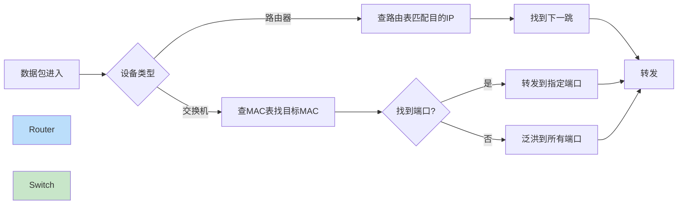
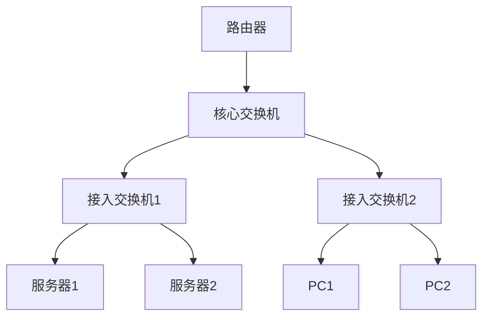
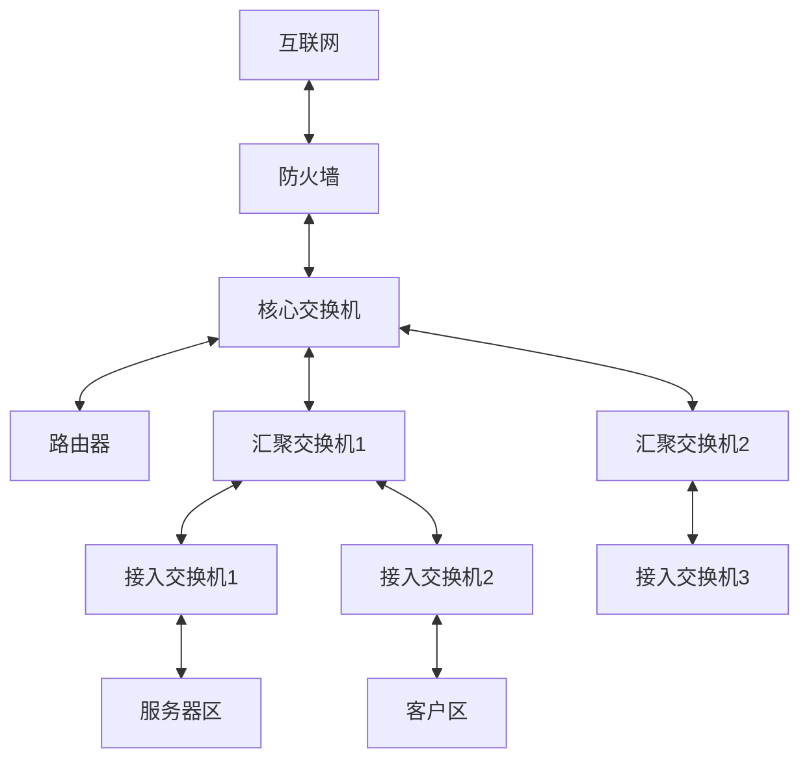
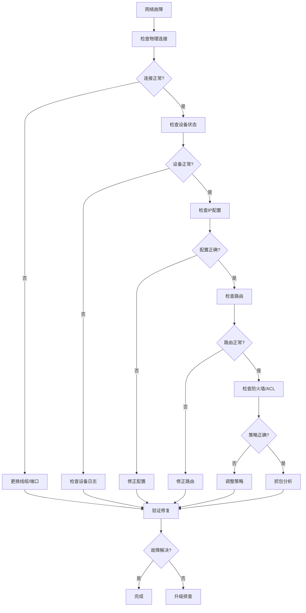

# 网络设备生产环境最佳实践：从路由器到交换机的架构设计

## 情境(Situation)

网络是现代IT基础设施的"血管"，SRE日常排查的故障中，60%以上与网络相关。路由器和交换机是网络的基础设备，正确理解和配置它们对保证业务连续性至关重要。

在生产环境中管理网络设备面临诸多挑战：

- **网络故障定位难**：网络问题往往表现为服务异常，排查路径长
- **配置复杂易出错**：网络设备配置繁琐，错误配置可能导致大规模故障
- **安全要求高**：网络设备是攻击的重要目标，需要完善的安全防护
- **性能优化难**：随着业务增长，网络设备性能需要持续优化
- **设备管理复杂**：多厂商设备、多种协议的混合管理

## 冲突(Conflict)

许多企业在网络设备管理中遇到以下问题：

- **配置不规范**：缺乏统一的配置标准，设备配置混乱
- **安全隐患多**：网络设备存在安全漏洞和配置风险
- **故障恢复慢**：缺乏完整的备份和恢复机制
- **监控不完善**：无法及时发现和预警网络问题
- **性能瓶颈多**：网络设备性能跟不上业务增长

这些问题在生产环境中可能导致服务中断、数据安全风险、业务损失。

## 问题(Question)

如何在生产环境中安全、高效、可靠地管理网络设备？

## 答案(Answer)

本文将从SRE视角出发，结合真实生产案例，提供一套完整的网络设备生产环境最佳实践。核心方法论基于 [SRE面试题解析：网络设备基础](#7-网络设备基础)。

---

## 一、网络设备基础概念

### 1.1 路由器 vs 交换机核心区别

**核心对比**：

| 维度 | 路由器 (Router) | 交换机 (Switch) |
|:----:|-----------------|-----------------|
| **工作层级** | OSI L3 网络层 | OSI L2 数据链路层 |
| **转发依据** | IP地址（路由表） | MAC地址（MAC表） |
| **核心功能** | 跨网段通信、路由选择 | 局域网内帧交换、VLAN隔离 |
| **广播域** | 每个接口独立广播域 | 默认全端口共享（VLAN可隔离） |
| **典型设备** | Cisco/Juniper/华为路由器 | Cisco/H3C/华为二层/三层交换机 |

**转发工作机制**：



### 1.2 VLAN基础概念

**VLAN Access模式 vs Trunk模式**：

| 特性 | Access模式 | Trunk模式 |
|:----:|:-----------|:----------|
| **端口用途** | 连接终端设备（服务器、PC） | 连接交换机、路由器 |
| **VLAN数量** | 单个VLAN | 多个VLAN（需要标记） |
| **802.1Q标签** | 不打标签 | 打802.1Q标签 |
| **应用场景** | 普通接入端口 | 交换机间互联 |

**802.1Q标签作用**：
- 在同一物理链路上传输多个VLAN的流量
- 每个帧添加VLAN ID标识（4字节标签）
- 允许网络设备区分不同VLAN的流量

### 1.3 网络架构选型

**中小网络架构**：



**大型网络架构**：



---

## 二、交换机配置最佳实践

### 2.1 VLAN配置

**Cisco交换机VLAN配置**：

```bash
# 创建VLAN
vlan 10
 name Server-VLAN
vlan 20
 name Client-VLAN
vlan 30
 name DMZ-VLAN

# Access端口配置
interface GigabitEthernet0/1
 switchport mode access
 switchport access vlan 10
 spanning-tree portfast
 spanning-tree bpduguard enable

# Trunk端口配置
interface GigabitEthernet0/24
 switchport mode trunk
 switchport trunk native vlan 99
 switchport trunk allowed vlan 10,20,30
 spanning-tree portfast trunk
```

**华为交换机VLAN配置**：

```bash
# 创建VLAN
vlan batch 10 20 30
vlan 10
 description Server-VLAN
vlan 20
 description Client-VLAN
vlan 30
 description DMZ-VLAN

# Access端口配置
interface GigabitEthernet0/0/1
 port link-type access
 port default vlan 10
 stp edged-port enable

# Trunk端口配置
interface GigabitEthernet0/0/24
 port link-type trunk
 port trunk allow-pass vlan 10 20 30
 port trunk pvid vlan 99
```

**Linux交换机VLAN配置**：

```bash
#!/bin/bash
# linux_vlan_config.sh - Linux交换机VLAN配置

# 加载VLAN模块
modprobe 8021q

# 创建VLAN子接口
ip link add link eth0 name eth0.10 type vlan id 10
ip link add link eth0 name eth0.20 type vlan id 20

# 配置IP地址
ip addr add 192.168.10.1/24 dev eth0.10
ip addr add 192.168.20.1/24 dev eth0.20

# 启用接口
ip link set eth0.10 up
ip link set eth0.20 up

# 永久配置（Debian/Ubuntu）
cat > /etc/network/interfaces << EOF
auto eth0
iface eth0 inet manual

auto eth0.10
iface eth0.10 inet static
    address 192.168.10.1
    netmask 255.255.255.0
    vlan-raw-device eth0

auto eth0.20
iface eth0.20 inet static
    address 192.168.20.1
    netmask 255.255.255.0
    vlan-raw-device eth0
EOF
```

### 2.2 Spanning Tree Protocol (STP) 配置

**Cisco STP配置**：

```bash
# 启用STP
spanning-tree mode rapid-pvst

# 设置根桥（核心交换机）
spanning-tree vlan 10,20,30 priority 4096

# 配置边缘端口
interface range GigabitEthernet0/1-20
 spanning-tree portfast
 spanning-tree bpduguard enable

# 配置环路防护
interface GigabitEthernet0/24
 spanning-tree loopguard enable

# 配置根防护
interface GigabitEthernet0/23
 spanning-tree guard root
```

**华为STP配置**：

```bash
# 启用RSTP
stp mode rstp

# 设置根桥
stp vlan 10 20 30 root primary

# 配置边缘端口
interface range GigabitEthernet0/0/1 to 0/0/20
 stp edged-port enable

# 配置BPDU防护
stp bpdu-protection

# 配置环路防护
interface GigabitEthernet0/0/24
 stp loop-protection
```

### 2.3 端口安全配置

**Cisco端口安全配置**：

```bash
# 端口安全配置
interface GigabitEthernet0/1
 switchport mode access
 switchport access vlan 10
 switchport port-security
 switchport port-security maximum 2
 switchport port-security mac-address sticky
 switchport port-security violation restrict
 spanning-tree portfast
 spanning-tree bpduguard enable

# 查看端口安全状态
show port-security
show port-security interface GigabitEthernet0/1
```

**华为端口安全配置**：

```bash
# 端口安全配置
interface GigabitEthernet0/0/1
 port link-type access
 port default vlan 10
 port-security enable
 port-security max-mac-num 2
 port-security mac-address sticky
 port-security protect-action restrict
 stp edged-port enable

# 查看端口安全状态
display port-security
display port-security interface GigabitEthernet0/0/1
```

---

## 三、路由器配置最佳实践

### 3.1 基本接口配置

**Cisco路由器接口配置**：

```bash
# 配置物理接口
interface GigabitEthernet0/0
 description Internet-Connection
 ip address 203.0.113.10 255.255.255.0
 no shutdown
 duplex auto
 speed auto

interface GigabitEthernet0/1
 description Internal-Network
 ip address 192.168.1.1 255.255.255.0
 no shutdown

# 配置子接口（VLAN间路由）
interface GigabitEthernet0/2
 no ip address
 no shutdown

interface GigabitEthernet0/2.10
 description VLAN10-Server
 encapsulation dot1Q 10
 ip address 192.168.10.1 255.255.255.0

interface GigabitEthernet0/2.20
 description VLAN20-Client
 encapsulation dot1Q 20
 ip address 192.168.20.1 255.255.255.0
```

**华为路由器接口配置**：

```bash
# 配置物理接口
interface GigabitEthernet0/0/0
 description Internet-Connection
 ip address 203.0.113.10 255.255.255.0
 duplex auto
 speed auto
 undo shutdown

interface GigabitEthernet0/0/1
 description Internal-Network
 ip address 192.168.1.1 255.255.255.0
 undo shutdown

# 配置子接口（VLAN间路由）
interface GigabitEthernet0/0/2
 undo shutdown

interface GigabitEthernet0/0/2.10
 description VLAN10-Server
 dot1q termination vid 10
 ip address 192.168.10.1 255.255.255.0

interface GigabitEthernet0/0/2.20
 description VLAN20-Client
 dot1q termination vid 20
 ip address 192.168.20.1 255.255.255.0
```

### 3.2 路由配置

**静态路由配置**：

```bash
# Cisco静态路由
ip route 10.0.0.0 255.255.0.0 192.168.1.2
ip route 0.0.0.0 0.0.0.0 203.0.113.1

# 华为静态路由
ip route-static 10.0.0.0 255.255.0.0 192.168.1.2
ip route-static 0.0.0.0 0.0.0.0 203.0.113.1
```

**OSPF动态路由配置**：

```bash
# Cisco OSPF配置
router ospf 1
 router-id 1.1.1.1
 network 192.168.1.0 0.0.0.255 area 0
 network 192.168.10.0 0.0.0.255 area 0
 passive-interface GigabitEthernet0/0

# 华为OSPF配置
ospf 1 router-id 1.1.1.1
 area 0
  network 192.168.1.0 0.0.0.255
  network 192.168.10.0 0.0.0.255

interface GigabitEthernet0/0/0
 ospf silent
```

### 3.3 NAT配置

**Cisco NAT配置**：

```bash
# 定义内部接口
interface GigabitEthernet0/1
 ip nat inside

# 定义外部接口
interface GigabitEthernet0/0
 ip nat outside

# 创建ACL，定义需要NAT的流量
access-list 10 permit 192.168.1.0 0.0.0.255
access-list 10 permit 192.168.10.0 0.0.0.255

# 配置动态NAT
ip nat pool NAT-POOL 203.0.113.20 203.0.113.30 netmask 255.255.255.0
ip nat inside source list 10 pool NAT-POOL overload

# 配置端口映射（静态NAT）
ip nat inside source static tcp 192.168.10.10 80 203.0.113.11 80 extendable

# 查看NAT状态
show ip nat translations
show ip nat statistics
```

**华为NAT配置**：

```bash
# 配置地址池
nat address-group 1 203.0.113.20 203.0.113.30

# 配置ACL
acl number 2000
 rule 10 permit source 192.168.1.0 0.0.0.255
 rule 20 permit source 192.168.10.0 0.0.0.255

# 在外部接口配置NAT
interface GigabitEthernet0/0/0
 nat outbound 2000 address-group 1
 nat server protocol tcp global 203.0.113.11 80 inside 192.168.10.10 80

# 查看NAT状态
display nat session
display nat address-group
```

---

## 四、网络设备安全配置

### 4.1 设备访问安全

**Cisco设备安全配置**：

```bash
# 禁用不必要的服务
no ip http server
no ip http secure-server
no service config
no service finger
no service pad

# 配置SSH
ip domain-name example.com
crypto key generate rsa modulus 2048
ip ssh version 2
ip ssh time-out 60
ip ssh authentication-retries 3

# 配置用户名和密码
username admin privilege 15 secret StrongPassword123!

# 配置VTY线路
line vty 0 15
 transport input ssh
 login local
 exec-timeout 15 0
 privilege level 15

# 启用密码加密
service password-encryption
enable secret StrongEnablePassword123!

# 配置登录保护
login block-for 120 attempts 5 within 60
```

**华为设备安全配置**：

```bash
# 禁用不必要的服务
undo http server enable
undo telnet server enable

# 配置SSH
rsa local-key-pair create 2048
ssh server enable
ssh timeout 60
ssh authentication-retries 3

# 配置AAA
aaa
 authentication-scheme default
  authentication-mode local
 authorization-scheme default
  authorization-mode local
 accounting-scheme default
  accounting-mode none
 domain default
  authentication-scheme default
  authorization-scheme default

# 配置用户
local-user admin password cipher StrongPassword123!
local-user admin privilege level 15
local-user admin service-type ssh

# 配置VTY
user-interface vty 0 15
 authentication-mode aaa
 protocol inbound ssh
 idle-timeout 15 0

# 配置登录保护
aaa
 local-aaa-server
  login fail-interval 60
  login retry-times 5
  login block-timer 120
```

### 4.2 网络访问控制列表（ACL）

**Cisco ACL配置**：

```bash
# 标准ACL
access-list 10 permit 192.168.1.0 0.0.0.255
access-list 10 deny any

# 扩展ACL
access-list 100 permit tcp any host 203.0.113.10 eq 80
access-list 100 permit tcp any host 203.0.113.10 eq 443
access-list 100 permit icmp any any echo-reply
access-list 100 permit icmp any any echo
access-list 100 deny ip any any

# 在接口应用ACL
interface GigabitEthernet0/0
 ip access-group 100 in

# 查看ACL
show access-lists
show ip access-lists
```

**华为ACL配置**：

```bash
# 基本ACL
acl number 2000
 rule 10 permit source 192.168.1.0 0.0.0.255
 rule 100 deny source any

# 高级ACL
acl number 3000
 rule 10 permit tcp any destination 203.0.113.10 0 destination-port eq 80
 rule 20 permit tcp any destination 203.0.113.10 0 destination-port eq 443
 rule 30 permit icmp any destination 203.0.113.10 0 icmp-type echo-reply
 rule 40 permit icmp any destination 203.0.113.10 0 icmp-type echo
 rule 100 deny ip any any

# 在接口应用ACL
interface GigabitEthernet0/0/0
 traffic-filter inbound acl 3000

# 查看ACL
display acl
display acl 3000
```

### 4.3 日志和监控配置

**Cisco日志配置**：

```bash
# 启用日志
logging on
logging buffered 16384 informational
logging console notifications

# 配置时间戳
service timestamps log datetime msec localtime show-timezone
service timestamps debug datetime msec localtime show-timezone

# 配置日志服务器
logging trap informational
logging host 192.168.1.100

# 配置NTP
ntp server 192.168.1.101 prefer
ntp server 0.pool.ntp.org
clock timezone UTC 0

# 查看日志
show logging
```

**华为日志配置**：

```bash
# 启用日志
info-center enable
info-center logbuffer size 16384
info-center console channel console

# 配置时间戳
info-center timestamp log date precision-time second
info-center timestamp debugging date precision-time second

# 配置日志服务器
info-center loghost 192.168.1.100
info-center source default channel loghost log level informational

# 配置NTP
ntp-service enable
ntp-service unicast-server 192.168.1.101 prefer
ntp-service unicast-server 0.pool.ntp.org
clock timezone UTC 0

# 查看日志
display logbuffer
```

---

## 五、网络设备配置管理

### 5.1 配置备份与恢复

**Cisco配置备份脚本**：

```bash
#!/bin/bash
# cisco_config_backup.sh - Cisco设备配置备份脚本

# 设备列表
DEVICES=("192.168.1.1" "192.168.1.2" "192.168.1.3")
USERNAME="admin"
PASSWORD="StrongPassword123!"
BACKUP_DIR="/backup/network"
DATE=$(date +%Y%m%d)

# 创建备份目录
mkdir -p "$BACKUP_DIR/$DATE"

# 备份每个设备
for device in "${DEVICES[@]}"; do
    echo "备份设备: $device"
    
    # 使用expect实现自动登录备份
    expect << EOF
spawn ssh $USERNAME@$device
expect "Password:"
send "$PASSWORD\r"
expect "#"
send "terminal length 0\r"
expect "#"
send "show running-config\r"
expect "#"
log_file "$BACKUP_DIR/$DATE/$device.cfg"
send "exit\r"
expect eof
EOF
    
    echo "设备 $device 备份完成"
done

# 清理旧备份（保留7天）
find "$BACKUP_DIR" -type d -mtime +7 -exec rm -rf {} \;

echo "所有设备备份完成"
```

**华为配置备份脚本**：

```bash
#!/bin/bash
# huawei_config_backup.sh - 华为设备配置备份脚本

DEVICES=("192.168.1.1" "192.168.1.2")
USERNAME="admin"
PASSWORD="StrongPassword123!"
BACKUP_DIR="/backup/network"
DATE=$(date +%Y%m%d)

mkdir -p "$BACKUP_DIR/$DATE"

for device in "${DEVICES[@]}"; do
    echo "备份设备: $device"
    
    expect << EOF
spawn ssh $USERNAME@$device
expect "Password:"
send "$PASSWORD\r"
expect ">"
send "system-view\r"
expect "]"
send "save\r"
expect "Yes or No? No:"
send "y\r"
expect "]"
send "display current-configuration\r"
log_file "$BACKUP_DIR/$DATE/$device.cfg"
expect "]"
send "quit\r"
send "quit\r"
expect eof
EOF
    
    echo "设备 $device 备份完成"
done

find "$BACKUP_DIR" -type d -mtime +7 -exec rm -rf {} \;
echo "所有设备备份完成"
```

### 5.2 配置版本控制

**Git管理网络配置**：

```bash
#!/bin/bash
# network_config_git.sh - 使用Git管理网络配置

CONFIG_DIR="/backup/network"
REPO_DIR="/backup/network/git"

# 初始化Git仓库
mkdir -p "$REPO_DIR"
cd "$REPO_DIR"
git init
git config user.name "Network-Bot"
git config user.email "network@example.com"

# 复制配置文件到仓库
cp -r "$CONFIG_DIR"/$(date +%Y%m%d)/* "$REPO_DIR/"

# 提交更改
git add .
git commit -m "Network config backup - $(date)"

# 推送到远程仓库（可选）
# git remote add origin git@github.com:example/network-configs.git
# git push -u origin main

# 查看变更历史
git log --oneline
```

### 5.3 配置审计与对比

**配置对比脚本**：

```bash
#!/bin/bash
# config_diff.sh - 配置文件对比脚本

BACKUP_DIR="/backup/network"
DEVICE="$1"

if [[ -z "$DEVICE" ]]; then
    echo "用法: $0 <设备IP>"
    exit 1
fi

# 查找最新的两个备份
BACKUPS=($(ls -d "$BACKUP_DIR"/20* | sort -r | head -2))

if [[ ${#BACKUPS[@]} -lt 2 ]]; then
    echo "没有足够的备份进行对比"
    exit 1
fi

OLD_BACKUP="${BACKUPS[1]}"
NEW_BACKUP="${BACKUPS[0]}"

OLD_CONFIG="$OLD_BACKUP/$DEVICE.cfg"
NEW_CONFIG="$NEW_BACKUP/$DEVICE.cfg"

if [[ ! -f "$OLD_CONFIG" || ! -f "$NEW_CONFIG" ]]; then
    echo "配置文件不存在"
    exit 1
fi

echo "对比设备 $DEVICE 的配置变化"
echo "旧配置: $OLD_CONFIG"
echo "新配置: $NEW_CONFIG"
echo "========================================="

# 使用diff对比配置
diff -u "$OLD_CONFIG" "$NEW_CONFIG" || true
```

---

## 六、网络监控与故障排查

### 6.1 网络监控指标

**关键监控指标**：

| 指标 | 描述 | 工具 | 告警阈值 |
|:-----|:-----|:-----|:---------|
| **接口状态** | 端口up/down | SNMP, ping | 任何down状态 |
| **接口带宽** | 输入/输出使用率 | SNMP, NetFlow | >80% |
| **CPU使用率** | 设备CPU占用率 | SNMP | >85% |
| **内存使用率** | 设备内存占用率 | SNMP | >90% |
| **错误包数** | CRC错误、丢弃包 | SNMP | >0 |
| **路由变化** | 路由表变更 | syslog | 频繁变化 |
| **网络延迟** | 端到端延迟 | ping, traceroute | >100ms |

**网络监控脚本**：

```bash
#!/bin/bash
# network_monitor.sh - 网络监控脚本

LOG_FILE="/var/log/network_monitor.log"

log() {
    local level="$1"
    local message="$2"
    echo "[$(date '+%Y-%m-%d %H:%M:%S')] [$level] $message" >> "$LOG_FILE"
}

# 检查设备连通性
check_connectivity() {
    DEVICES=("192.168.1.1" "192.168.1.2" "192.168.1.3")
    
    for device in "${DEVICES[@]}"; do
        if ping -c 3 -W 2 "$device" &>/dev/null; then
            log "INFO" "设备 $device 可达"
        else
            log "ERROR" "设备 $device 不可达！"
            send_alert "设备离线" "$device 无法ping通"
        fi
    done
}

# 检查网络延迟
check_latency() {
    TARGETS=("8.8.8.8" "192.168.1.100")
    
    for target in "${TARGETS[@]}"; do
        LATENCY=$(ping -c 5 -W 2 "$target" | grep "round-trip" | awk -F'/' '{print $5}' | cut -d'.' -f1)
        
        if [[ -n "$LATENCY" ]]; then
            log "INFO" "到 $target 的延迟: ${LATENCY}ms"
            
            if [[ $LATENCY -gt 100 ]]; then
                log "WARN" "网络延迟过高: $target = ${LATENCY}ms"
            fi
        fi
    done
}

# 发送告警
send_alert() {
    local subject="$1"
    local message="$2"
    
    echo "告警: $subject - $message"
}

# 主函数
main() {
    log "INFO" "========== 网络监控开始 =========="
    
    check_connectivity
    check_latency
    
    log "INFO" "========== 网络监控结束 =========="
}

main
```

### 6.2 网络故障排查

**常用排查命令**：

```bash
# 连通性检查
ping 192.168.1.1
traceroute 8.8.8.8

# ARP检查
arp -a
show arp  # Cisco
display arp  # Huawei

# 路由检查
ip route
show ip route  # Cisco
display ip routing-table  # Huawei

# 接口检查
ifconfig -a
ip link show
show interfaces  # Cisco
display interface  # Huawei

# DNS检查
nslookup example.com
dig example.com

# TCP连接检查
telnet 192.168.1.100 80
nc -zv 192.168.1.100 80

# 流量抓包
tcpdump -i eth0 -nn
tcpdump -i eth0 host 192.168.1.100
```

**网络故障排查流程**：



**网络故障排查脚本**：

```bash
#!/bin/bash
# network_troubleshoot.sh - 网络故障排查脚本

TARGET="$1"

if [[ -z "$TARGET" ]]; then
    echo "用法: $0 <目标IP>"
    exit 1
fi

echo "========== 网络故障排查 =========="
echo "目标: $TARGET"
echo ""

# 检查本地接口
echo "[1] 检查本地网络接口"
ip addr show
echo ""

# 检查默认网关
echo "[2] 检查默认网关"
ip route show default
echo ""

# 检查ARP表
echo "[3] 检查ARP表"
arp -a
echo ""

# 测试连通性
echo "[4] 测试连通性"
ping -c 5 "$TARGET"
echo ""

# 测试路由路径
echo "[5] 测试路由路径"
traceroute "$TARGET"
echo ""

# 测试DNS
echo "[6] 测试DNS解析"
nslookup "$TARGET" 2>/dev/null || echo "DNS解析失败"
echo ""

echo "========== 排查完成 =========="
```

---

## 七、生产环境案例分析

### 案例1：网络环路故障

**背景**：某企业网络出现严重的广播风暴，导致全网瘫痪

**问题分析**：
- 接入交换机因误操作形成环路
- STP配置不正确，未能阻止环路
- 导致广播风暴，占用全部带宽

**解决方案**：
1. **立即断开环路**：物理断开可疑的连接
2. **正确配置STP**：启用RSTP，配置边缘端口和BPDU防护
3. **加强端口配置**：配置端口安全，避免类似问题

**配置示例**：
```bash
# Cisco交换机STP加固
spanning-tree mode rapid-pvst

interface range GigabitEthernet0/1-20
 spanning-tree portfast
 spanning-tree bpduguard enable
 spanning-tree guard root

interface GigabitEthernet0/24
 spanning-tree loopguard enable
```

**效果**：
- 网络恢复正常
- 避免了类似环路问题再次发生
- STP配置更加规范

### 案例2：网络带宽瓶颈

**背景**：某公司核心网络带宽不足，业务高峰期经常出现网络拥堵

**问题分析**：
- 核心链路使用1Gbps带宽
- 业务流量持续增长，峰值超过900Mbps
- 未进行链路聚合

**解决方案**：
1. **链路聚合**：配置LACP，将两条1Gbps链路聚合为2Gbps
2. **流量负载均衡**：配置负载均衡算法
3. **网络监控**：加强流量监控和带宽预警

**配置示例**：
```bash
# Cisco链路聚合配置
interface Port-channel1
 switchport mode trunk
 switchport trunk allowed vlan 10,20,30

interface GigabitEthernet0/23
 channel-group 1 mode active
 spanning-tree guard root

interface GigabitEthernet0/24
 channel-group 1 mode active
 spanning-tree guard root
```

**效果**：
- 带宽容量：1Gbps → 2Gbps
- 带宽使用率：90% → 45%
- 用户体验：显著提升

### 案例3：网络设备安全加固

**背景**：某企业网络设备存在安全漏洞，需要进行安全加固

**问题分析**：
- 使用Telnet管理，密码明文传输
- 未禁用不必要的服务
- ACL配置不完善

**解决方案**：
1. **启用SSH**：配置SSH替代Telnet
2. **禁用服务**：关闭HTTP、Telnet等不必要服务
3. **配置ACL**：限制管理访问
4. **加强认证**：配置AAA，使用强密码

**配置示例**：
```bash
# Cisco安全加固
no service password-encryption
service password-encryption

no ip http server
no ip http secure-server
no service config

ip ssh version 2
username admin privilege 15 secret StrongPassword123!

line vty 0 15
 transport input ssh
 login local
 exec-timeout 15 0
```

**效果**：
- 安全风险显著降低
- 符合等保要求
- 设备管理更加安全

---

## 八、最佳实践总结

### 8.1 设备配置最佳实践

| 设备类型 | 配置要点 | 原因 |
|:---------|:---------|:-----|
| **交换机** | VLAN合理划分、STP/RSTP、端口安全 | 提高网络安全性和可靠性 |
| **路由器** | 路由优化、NAT配置、ACL | 实现安全的跨网段通信 |
| **所有设备** | SSH管理、日志记录、NTP | 便于管理和故障排查 |
| **备份策略** | 定期配置备份、版本控制 | 便于快速恢复和审计 |

### 8.2 安全加固要点

- **访问控制**：使用SSH，禁用Telnet
- **密码策略**：使用强密码，定期更换
- **服务管理**：禁用不必要的服务
- **ACL策略**：限制管理和业务访问
- **日志审计**：记录所有重要操作
- **固件更新**：定期更新设备固件

### 8.3 监控运维要点

- **全面监控**：接口状态、CPU/内存、流量、错误
- **告警机制**：设置合理阈值，及时通知
- **日志管理**：集中日志收集，定期审计
- **备份策略**：定期配置备份，版本控制
- **应急响应**：制定预案，定期演练

### 8.4 故障排查要点

- **分层排查**：从物理层到应用层逐步排查
- **工具使用**：充分使用ping、traceroute、tcpdump等工具
- **日志分析**：仔细分析设备日志
- **经验积累**：记录故障原因和解决方案

---

## 总结

网络设备是IT基础设施的重要组成部分，正确配置和管理网络设备对保证业务连续性和安全性至关重要。通过本文提供的最佳实践，你可以构建安全、可靠、高效的网络环境。

**核心要点**：

1. **规范配置**：遵循配置标准，减少人为错误
2. **安全加固**：完善设备安全措施，防范攻击
3. **监控运维**：建立全面的监控和运维体系
4. **备份恢复**：定期备份配置，确保快速恢复
5. **故障排查**：掌握排查方法，快速解决问题

> **延伸学习**：更多面试相关的网络设备问题，请参考 [SRE面试题解析：网络设备基础](#7-网络设备基础)。

---

## 参考资料

- [Cisco配置指南](https://www.cisco.com/c/en/us/support/index.html)
- [华为技术文档](https://support.huawei.com/enterprise/)
- [TCP/IP详解](http://www.tcpipguide.com/)
- [网络安全最佳实践](https://www.cisecurity.org/)
- [RFC 802.1Q标准](https://tools.ietf.org/html/rfc802.1Q)
- [OSPF协议详解](https://tools.ietf.org/html/rfc2328)
- [网络监控指南](https://www.nagios.org/)
- [网络故障排查](https://www.wireshark.org/)
- [网络设备配置备份](https://github.com/ytti/oxidized)
- [Ansible网络自动化](https://www.ansible.com/networking)