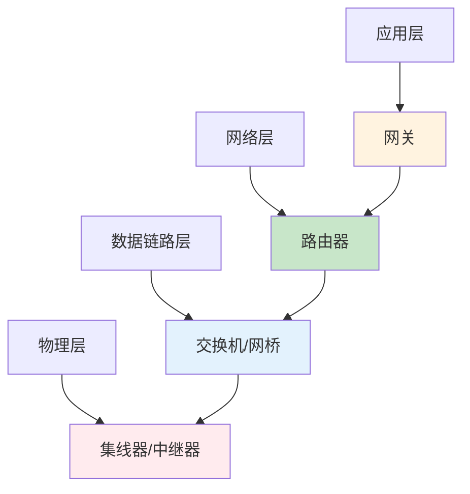

# 网络设备详解与生产环境应用：从原理到实践

## 情境(Situation)

在现代IT基础设施中，网络设备是构建网络架构的核心"积木"。从小型办公室到大型数据中心，各种网络设备（如集线器、交换机、路由器、网关等）承担着不同的职责，共同构成了高效、可靠的网络环境。

作为SRE工程师，深入理解各种网络设备的工作原理、特点和应用场景，是设计和维护高性能网络架构的基础。错误的设备选择或配置不当，可能导致网络性能瓶颈、安全漏洞或架构缺陷，直接影响业务系统的稳定性和可靠性。

## 冲突(Conflict)

许多SRE工程师在网络设备选型和应用中遇到以下挑战：

- **概念混淆**：对不同网络设备的工作原理和区别理解不清
- **选型困难**：不知道如何根据场景选择合适的网络设备
- **架构设计**：难以设计符合业务需求的网络架构
- **性能优化**：无法充分发挥网络设备的性能潜力
- **故障排查**：网络故障时难以快速定位问题
- **安全配置**：缺乏网络设备安全配置的最佳实践

## 问题(Question)

如何正确理解各种网络设备的工作原理和区别，以及如何在生产环境中选择和应用这些设备？

## 答案(Answer)

本文将从SRE视角出发，结合真实生产案例，提供一套完整的网络设备详解与生产环境应用指南。核心方法论基于 [SRE面试题解析：网桥，网关，路由器，集线器，交换器等网络设备有啥区别？](#23-网桥网关路由器集线器交换器等网络设备有啥区别)。

---

## 一、网络设备基础

### 1.1 OSI七层模型与网络设备

**OSI七层模型**：

| 层次 | 名称 | 功能 | 协议 | 网络设备 |
|:-----|:-----|:-----|:-----|:---------|
| **7** | 应用层 | 应用程序接口 | HTTP, FTP, SMTP | 网关 |
| **6** | 表示层 | 数据格式转换 | SSL, TLS | 网关 |
| **5** | 会话层 | 会话管理 | RPC, NetBIOS | 网关 |
| **4** | 传输层 | 端到端通信 | TCP, UDP | 四层交换机 |
| **3** | 网络层 | 路由选择 | IP, ICMP | 路由器 |
| **2** | 数据链路层 | 帧传输 | Ethernet, PPP | 交换机, 网桥 |
| **1** | 物理层 | 物理传输 | 双绞线, 光纤 | 集线器, 中继器 |

**网络设备在OSI模型中的位置**：



### 1.2 数据传输过程

**数据封装与解封装**：

1. **发送端**：数据从应用层开始，逐层向下封装（添加头部信息）
2. **传输**：通过物理介质传输数据
3. **接收端**：数据从物理层开始，逐层向上解封装（去除头部信息）

**各层数据单元**：
- 应用层：数据
- 传输层：段/报文
- 网络层：分组/数据包
- 数据链路层：帧
- 物理层：比特流

---

## 二、网络设备详解

### 2.1 集线器（Hub）

**工作原理**：
- 物理层设备，接收信号后放大并广播到所有端口
- 不理解MAC地址或IP地址，纯物理信号转发
- 所有设备共享同一带宽

**特点**：
- **带宽模式**：共享带宽，所有设备竞争使用
- **广播域**：同一个广播域，容易产生广播风暴
- **转发机制**：无智能转发，广播所有数据包
- **安全性**：低，所有端口都能接收到所有数据

**应用场景**：
- 小型临时网络
- 家庭网络（已逐渐被交换机取代）
- 网络测试和临时搭建

**缺点**：
- 带宽利用率低
- 安全性差
- 容易产生广播风暴
- 已逐渐被交换机淘汰

**技术参数**：
- **端口速率**：10Mbps, 100Mbps, 1000Mbps
- **端口数量**：4, 8, 16, 24口
- **接口类型**：RJ45, BNC, AUI

### 2.2 交换机（Switch）

**工作原理**：
- 数据链路层设备，学习并维护MAC地址表
- 基于MAC地址转发数据帧
- 每个端口独立带宽

**MAC地址学习机制**：
1. 接收数据帧时，记录源MAC地址和对应端口
2. 检查目标MAC地址，在MAC表中查找对应端口
3. 如果找到，将数据帧转发到对应端口
4. 如果未找到，广播到所有端口
5. 定期老化MAC表条目（默认300秒）

**特点**：
- **带宽模式**：独占带宽，每个端口独立带宽
- **广播域**：默认同一个广播域，支持VLAN隔离
- **转发机制**：基于MAC地址智能转发
- **安全性**：支持VLAN、端口安全等安全功能

**应用场景**：
- 局域网内部连接
- 企业网络核心设备
- 数据中心网络

**优势**：
- 高带宽利用率
- 低延迟
- 支持复杂网络拓扑
- 丰富的管理功能

**类型**：
- **二层交换机**：工作在数据链路层，基于MAC地址转发
- **三层交换机**：支持网络层功能，可实现路由功能
- **四层交换机**：支持传输层功能，基于端口号转发
- **多层交换机**：支持多层功能的综合交换机

**技术参数**：
- **端口速率**：100Mbps, 1Gbps, 10Gbps, 25Gbps, 40Gbps, 100Gbps
- **端口数量**：8, 16, 24, 48, 96口
- **交换容量**：Gbps, Tbps
- **转发性能**：Mpps, Gpps
- **支持功能**：VLAN, STP, QoS, ACL, PoE

### 2.3 网桥（Bridge）

**工作原理**：
- 数据链路层设备，连接两个或多个网段
- 基于MAC地址转发数据帧
- 隔离广播域，减少广播流量

**特点**：
- **带宽模式**：共享带宽（按网段）
- **广播域**：隔离广播域
- **转发机制**：基于MAC地址转发
- **安全性**：比集线器高，可隔离网段

**应用场景**：
- 局域网分段
- 连接不同物理网段
- 减少广播风暴

**优势**：
- 简单易用
- 成本低
- 有效隔离广播域

**类型**：
- **本地网桥**：连接同一物理位置的网段
- **远程网桥**：通过广域网连接不同位置的网段
- **透明网桥**：自动学习MAC地址
- **源路由网桥**：使用源路由算法

### 2.4 路由器（Router）

**工作原理**：
- 网络层设备，基于IP地址进行路由选择
- 维护路由表，根据路由表转发数据包
- 隔离广播域，提供安全隔离

**路由表更新原理**：
- **距离矢量协议**：如RIP，基于跳数选择路由
- **链路状态协议**：如OSPF，基于链路状态计算最短路径
- **路径向量协议**：如BGP，用于AS之间的路由

**特点**：
- **带宽模式**：独占带宽（按端口）
- **广播域**：隔离广播域
- **转发机制**：基于IP地址路由转发
- **安全性**：支持NAT、ACL等安全功能

**应用场景**：
- 网络边界设备
- 连接不同网络
- 企业出口网关

**优势**：
- 智能路由选择
- 安全隔离
- 支持多种路由协议
- 丰富的安全功能

**类型**：
- **家庭路由器**：小型网络使用
- **企业路由器**：中型网络使用
- **核心路由器**：大型网络核心
- **边缘路由器**：网络边缘设备

**技术参数**：
- **接口类型**：RJ45, SFP, SFP+, QSFP+
- **端口速率**：1Gbps, 10Gbps, 40Gbps, 100Gbps
- **路由表容量**：条目数
- **转发性能**：Mpps, Gpps
- **支持协议**：RIP, OSPF, BGP, EIGRP

### 2.5 网关（Gateway）

**工作原理**：
- 应用层设备，实现不同协议之间的转换
- 协议映射，异构网络互联
- 通常是软件或硬件与软件的结合

**特点**：
- **带宽模式**：视设备而定
- **广播域**：隔离广播域
- **转发机制**：协议转换
- **安全性**：支持各种安全功能

**应用场景**：
- 企业内网与互联网连接
- 不同协议网络互联
- 云服务接入

**优势**：
- 支持多协议
- 灵活适配不同网络
- 提供安全边界

**类型**：
- **协议网关**：实现不同协议之间的转换
- **应用网关**：提供特定应用的网关服务
- **安全网关**：提供安全功能的网关
- **云网关**：连接企业网络与云服务

---

## 三、网络设备对比

### 3.1 核心对比表

| 设备 | 工作层次 | 转发依据 | 带宽模式 | 广播域 | 主要功能 | 典型应用 |
|:-----|:---------|:---------|:---------|:--------|:---------|:----------|
| **集线器** | 物理层 | 无（广播） | 共享 | 同一个 | 信号放大 | 小型临时网络 |
| **交换机** | 数据链路层 | MAC地址表 | 独占（端口） | 同一个 | 帧转发 | 局域网内部 |
| **网桥** | 数据链路层 | MAC地址表 | 共享（网段） | 隔离 | 网段隔离 | 局域网分段 |
| **路由器** | 网络层 | 路由表 | 独占（端口） | 隔离 | 路由选择 | 网络边界 |
| **网关** | 应用层 | 协议映射 | 视设备而定 | 隔离 | 协议转换 | 异构网络互联 |

### 3.2 性能对比

| 设备 | 转发速度 | 带宽利用率 | 延迟 | 扩展性 | 安全性 |
|:-----|:---------|:------------|:-----|:---------|:--------|
| **集线器** | 低 | 低 | 高 | 低 | 低 |
| **交换机** | 高 | 高 | 低 | 高 | 中 |
| **网桥** | 中 | 中 | 中 | 中 | 中 |
| **路由器** | 中 | 高 | 中 | 高 | 高 |
| **网关** | 视设备而定 | 视设备而定 | 视设备而定 | 高 | 高 |

### 3.3 适用场景对比

| 场景 | 推荐设备 | 选型理由 |
|:-----|:---------|:----------|
| 办公室局域网 | 交换机 | 高带宽，支持VLAN |
| 网络边界 | 路由器 | 安全隔离，路由选择 |
| 异构网络互联 | 网关 | 协议转换 |
| 小型临时网络 | 集线器 | 成本低，简单易用 |
| 网段隔离 | 网桥 | 减少广播风暴 |
| 数据中心核心 | 三层交换机 | 高吞吐量，支持路由 |
| 企业出口 | 企业级路由器 | 安全功能，路由能力 |
| 云服务接入 | 云网关 | 协议适配，安全连接 |

---

## 四、网络架构设计

### 4.1 网络架构层次

**三层架构**：

```
+----------------+    +----------------+    +----------------+
|   核心层       |<-->|   汇聚层       |<-->|   接入层       |
+----------------+    +----------------+    +----------------+
| 高速转发       |    | 策略实施       |    | 用户接入       |
| 冗余设计       |    | 流量聚合       |    | 端口扩展       |
| 负载均衡       |    | VLAN管理       |    | 终端连接       |
```

**各层设备选择**：
- **核心层**：高性能三层交换机，支持高带宽和冗余
- **汇聚层**：三层交换机，支持VLAN和策略管理
- **接入层**：二层交换机，提供端口接入

### 4.2 小型网络架构（<50台设备）

**架构设计**：

```
+----------------+    +----------------+
| 宽带路由器     |<-->| 二层交换机     |
+----------------+    +----------------+
| 互联网接入     |    | 终端设备接入   |
| NAT转换        |    | 支持VLAN       |
| 基本安全功能   |    |                |
```

**设备选型**：
- **宽带路由器**：支持NAT、防火墙、QoS
- **二层交换机**：24-48口，支持VLAN

**适用场景**：
- 小型办公室
- 家庭网络
- 小型分支机构

### 4.3 中型网络架构（50-500台设备）

**架构设计**：

```
+----------------+    +----------------+    +----------------+
| 企业级路由器   |<-->| 三层交换机     |<-->| 二层交换机     |
+----------------+    +----------------+    +----------------+
| 互联网接入     |    | 核心交换       |    | 终端接入       |
| 安全功能       |    | 路由功能       |    | VLAN隔离       |
| 广域网连接     |    | 流量汇聚       |    |                |
```

**设备选型**：
- **企业级路由器**：支持多种路由协议，安全功能丰富
- **三层交换机**：支持路由，高带宽
- **二层交换机**：多个，按部门或区域部署

**适用场景**：
- 中型企业
- 学校
- 医院

### 4.4 大型网络架构（>500台设备）

**架构设计**：

```
+----------------+    +----------------+    +----------------+    +----------------+
| 核心路由器     |<-->| 核心交换机     |<-->| 汇聚交换机     |<-->| 接入交换机     |
+----------------+    +----------------+    +----------------+    +----------------+
| 互联网出口     |    | 高速转发       |    | 流量聚合       |    | 终端接入       |
| 广域网连接     |    | 冗余设计       |    | 策略实施       |    | VLAN隔离       |
| BGP路由        |    | 负载均衡       |    | VLAN管理       |    |                |
```

**设备选型**：
- **核心路由器**：高性能，支持BGP
- **核心交换机**：10G/40G/100G，冗余设计
- **汇聚交换机**：10G，支持策略管理
- **接入交换机**：1G，PoE支持

**适用场景**：
- 大型企业
- 数据中心
- 运营商网络

### 4.5 网络冗余设计

**冗余策略**：
- **设备冗余**：部署多台核心设备，实现负载均衡和故障切换
- **链路冗余**：多链路连接，防止单点故障
- **协议冗余**：使用STP、VRRP、HSRP等协议实现冗余

**冗余协议**：
- **STP**（生成树协议）：防止网络环路
- **VRRP**（虚拟路由冗余协议）：实现网关冗余
- **HSRP**（热备份路由协议）：Cisco专有，类似VRRP
- **ECMP**（等价多路径）：实现负载均衡

---

## 五、生产环境最佳实践

### 5.1 网络设备选型

**选型原则**：
1. **性能需求**：根据带宽、延迟、吞吐量等需求选择
2. **可靠性**：考虑设备冗余、故障恢复能力
3. **扩展性**：支持未来网络增长
4. **安全性**：支持安全功能和策略
5. **管理性**：支持集中管理和监控
6. **成本**：平衡性能和成本

**选型流程**：
1. **需求分析**：明确网络规模、业务需求、性能要求
2. **技术评估**：评估不同设备的技术参数和功能
3. **测试验证**：在测试环境验证设备性能
4. **成本分析**：评估设备成本和总拥有成本
5. **采购决策**：基于综合评估做出决策

### 5.2 网络设备配置

**交换机配置最佳实践**：

```bash
# 基本配置
hostname Switch-01
interface range gigabitethernet 0/1-24
switchport mode access
switchport access vlan 10
spanning-tree portfast

# VLAN配置
vlan 10
name Users
vlan 20
name Servers
vlan 30
name Management

# 三层接口
interface vlan 10
ip address 192.168.10.1 255.255.255.0
interface vlan 20
ip address 192.168.20.1 255.255.255.0

# 端口安全
interface gigabitethernet 0/1
switchport port-security
switchport port-security maximum 1
switchport port-security violation shutdown

# QoS配置
class-map match-all Voice
match dscp 46
policy-map QoS-Policy
class Voice
priority percent 20
class class-default
bandwidth percent 80
interface gigabitethernet 0/1
service-policy output QoS-Policy
```

**路由器配置最佳实践**：

```bash
# 基本配置
hostname Router-01
interface gigabitethernet 0/0
ip address 192.168.1.1 255.255.255.0
no shutdown
interface gigabitethernet 0/1
ip address 203.0.113.1 255.255.255.0
no shutdown

# 路由配置
router ospf 1
network 192.168.1.0 0.0.0.255 area 0

# NAT配置
ip access-list standard NAT-ACL
permit 192.168.1.0 0.0.0.255
interface gigabitethernet 0/1
ip nat outside
interface gigabitethernet 0/0
ip nat inside
ip nat inside source list NAT-ACL interface gigabitethernet 0/1 overload

# ACL配置
ip access-list extended INBOUND-ACL
permit tcp any any eq 80
permit tcp any any eq 443
deny ip any any
interface gigabitethernet 0/1
ip access-group INBOUND-ACL in

# 安全配置
line vty 0 4
login local
transport input ssh
ip ssh version 2
```

### 5.3 网络监控

**监控内容**：
- **设备状态**：CPU、内存、温度
- **端口状态**：接口利用率、错误率、丢包率
- **链路质量**：延迟、抖动、丢包
- **流量分析**：带宽使用、流量分布
- **安全事件**：异常流量、攻击检测

**监控工具**：
- **Zabbix**：综合网络监控
- **Nagios**：网络设备监控
- **PRTG**：网络监控和分析
- **SolarWinds**：网络性能监控
- **NetFlow**：流量分析

**监控指标**：

| 指标 | 阈值 | 说明 |
|:-----|:-----|:-----|
| **CPU使用率** | > 70% | 设备负载过高 |
| **内存使用率** | > 80% | 内存不足 |
| **端口利用率** | > 80% | 带宽不足 |
| **接口错误率** | > 0.1% | 物理连接问题 |
| **链路延迟** | > 100ms | 网络延迟过高 |
| **丢包率** | > 1% | 网络质量差 |

### 5.4 网络安全

**安全策略**：
- **访问控制**：实施ACL，限制访问
- **VLAN隔离**：按功能和安全级别划分VLAN
- **端口安全**：限制端口连接设备数量
- **SSH访问**：禁用telnet，使用SSH
- **固件更新**：定期更新设备固件
- **密码管理**：使用强密码，定期更换
- **日志管理**：启用日志，集中管理

**安全配置**：

```bash
# 禁用不必要的服务
no service telnet
no service finger
no ip http server

# 启用SSH
ip ssh version 2
ip ssh time-out 60
ip ssh authentication-retries 3

# 配置登录超时
line vty 0 4
exec-timeout 15 0

# 配置SNMP安全
snmp-server community public RO
snmp-server community private RW
snmp-server host 192.168.1.100 version 2c public

# 启用日志
logging buffered 16384 debugging
logging host 192.168.1.100
```

### 5.5 网络故障排查

**排查流程**：
1. **识别问题**：确认故障现象和影响范围
2. **收集信息**：查看设备状态、日志、监控数据
3. **定位问题**：使用工具和命令定位故障点
4. **分析原因**：分析故障产生的原因
5. **实施修复**：执行修复操作
6. **验证恢复**：确认故障已解决
7. **记录总结**：记录故障原因和解决方案

**常用排查命令**：

| 设备 | 命令 | 功能 |
|:-----|:-----|:-----|
| **交换机** | `show interface status` | 查看接口状态 |
| | `show mac address-table` | 查看MAC地址表 |
| | `show spanning-tree` | 查看生成树状态 |
| | `show vlan` | 查看VLAN配置 |
| **路由器** | `show interface` | 查看接口状态 |
| | `show ip route` | 查看路由表 |
| | `show ip arp` | 查看ARP表 |
| | `ping` | 测试网络连通性 |
| | `traceroute` | 跟踪路由路径 |
| | `show log` | 查看系统日志 |

**常见故障及解决方案**：

| 故障 | 症状 | 可能原因 | 解决方案 |
|:-----|:-----|:---------|:----------|
| **网络不通** | 无法ping通 | 物理连接问题 | 检查线缆、接口状态 |
| | | IP配置错误 | 检查IP地址和子网掩码 |
| | | 路由问题 | 检查路由表和路由配置 |
| **网络慢** | 延迟高 | 带宽不足 | 增加带宽或优化流量 |
| | | 网络拥塞 | 实施QoS，优化流量 |
| | | 设备负载高 | 升级设备或优化配置 |
| **广播风暴** | 网络瘫痪 | 环路问题 | 启用STP，检查网络拓扑 |
| | | 病毒攻击 | 隔离感染设备，杀毒 |
| **安全问题** | 未授权访问 | 密码泄露 | 更改密码，加强访问控制 |
| | | 攻击行为 | 配置ACL，启用防火墙 |

---

## 六、网络设备维护

### 6.1 日常维护

**维护任务**：
- **配置备份**：定期备份设备配置
- **固件更新**：及时更新设备固件
- **健康检查**：定期检查设备状态
- **性能监控**：监控设备性能指标
- **安全审计**：定期进行安全审计
- **文档更新**：更新网络文档和拓扑图

**维护周期**：

| 任务 | 周期 | 说明 |
|:-----|:-----|:-----|
| **配置备份** | 每周 | 备份设备配置文件 |
| **固件检查** | 每月 | 检查是否有新固件 |
| **健康检查** | 每周 | 检查设备状态和日志 |
| **性能分析** | 每月 | 分析网络性能数据 |
| **安全审计** | 每季度 | 进行安全配置审计 |
| **文档更新** | 每季度 | 更新网络文档和拓扑图 |

### 6.2 配置管理

**配置管理流程**：
1. **版本控制**：使用Git等工具管理配置文件
2. **变更管理**：实施变更审批流程
3. **配置模板**：建立标准化配置模板
4. **配置验证**：部署前验证配置正确性
5. **回滚机制**：准备配置回滚方案

**配置备份脚本**：

```bash
#!/bin/bash
# backup_network_config.sh - 网络设备配置备份

TIMESTAMP=$(date +%Y%m%d_%H%M%S)
BACKUP_DIR="/backup/network/$TIMESTAMP"

mkdir -p "$BACKUP_DIR"

# 备份交换机配置
for switch in switch-01 switch-02;
do
    echo "备份 $switch 配置..."
    ssh admin@$switch "show running-config" > "$BACKUP_DIR/$switch.cfg"
done

# 备份路由器配置
for router in router-01 router-02;
do
    echo "备份 $router 配置..."
    ssh admin@$router "show running-config" > "$BACKUP_DIR/$router.cfg"
done

# 压缩备份文件
tar -czf "$BACKUP_DIR.tar.gz" "$BACKUP_DIR"
rm -rf "$BACKUP_DIR"

echo "备份完成: $BACKUP_DIR.tar.gz"
```

### 6.3 故障管理

**故障响应流程**：
1. **故障检测**：通过监控系统发现故障
2. **故障分类**：根据影响范围和严重程度分类
3. **故障响应**：按照故障级别启动响应流程
4. **故障处理**：实施故障修复方案
5. **故障恢复**：验证故障已解决
6. **故障分析**：进行根因分析，提出改进措施

**故障级别**：

| 级别 | 影响范围 | 响应时间 | 处理流程 |
|:-----|:---------|:---------|:----------|
| **P0** | 全网故障 | 立即 | 紧急响应，24小时处理 |
| **P1** | 重要业务 | 30分钟内 | 优先处理，4小时内解决 |
| **P2** | 部分业务 | 1小时内 | 常规处理，8小时内解决 |
| **P3** | 单个设备 | 2小时内 | 计划处理，24小时内解决 |

### 6.4 容量规划

**容量规划流程**：
1. **流量分析**：分析历史流量数据
2. **增长预测**：预测未来流量增长
3. **容量评估**：评估现有设备容量
4. **扩容计划**：制定设备扩容计划
5. **实施扩容**：按计划实施扩容

**容量指标**：
- **带宽利用率**：峰值不超过70%
- **设备CPU**：峰值不超过70%
- **设备内存**：峰值不超过80%
- **端口使用率**：不超过80%

---

## 七、案例分析

### 7.1 小型企业网络升级

**背景**：
- 小型企业，50台设备
- 原网络使用集线器，经常出现网络卡顿
- 新增服务器和办公设备，需要更稳定的网络

**解决方案**：
1. **设备升级**：用二层交换机替换集线器
2. **网络分段**：使用VLAN将网络分为办公区、服务器区和管理区
3. **安全加强**：配置端口安全和访问控制
4. **监控部署**：部署网络监控系统

**效果**：
- 网络性能显著提升
- 广播风暴减少
- 安全性能增强
- 故障定位更快速

### 7.2 中型企业网络改造

**背景**：
- 中型企业，200台设备
- 网络架构混乱，管理困难
- 业务增长快，需要更灵活的网络

**解决方案**：
1. **架构优化**：实施核心-汇聚-接入三层架构
2. **设备升级**：使用三层交换机和企业级路由器
3. **冗余设计**：部署双核心设备，实现负载均衡
4. **自动化管理**：使用网络管理系统

**效果**：
- 网络可靠性提高
- 管理效率提升
- 扩展性增强
- 故障恢复时间缩短

### 7.3 大型数据中心网络设计

**背景**：
- 大型数据中心，1000+台设备
- 要求高可靠性、低延迟、高带宽
- 支持云计算和虚拟化

**解决方案**：
1. **架构设计**：采用Spine-Leaf架构
2. **设备选型**：使用100G核心交换机，40G汇聚交换机
3. **网络虚拟化**：部署VXLAN，支持多租户
4. **SDN集成**：使用软件定义网络，提高灵活性
5. **安全设计**：实施零信任架构

**效果**：
- 网络延迟降低
- 带宽利用率提高
- 自动化程度提升
- 安全性增强

---

## 总结

网络设备是构建现代网络架构的基础，深入理解各种网络设备的工作原理、特点和应用场景，对于SRE工程师来说至关重要。通过本文的介绍，我们了解了从物理层到应用层的各种网络设备，以及它们在生产环境中的最佳实践。

**核心要点**：

1. **设备原理**：不同网络设备工作在OSI模型的不同层次，具有不同的转发机制
2. **选型指南**：根据网络规模、业务需求选择合适的设备
3. **架构设计**：采用分层架构，确保网络的可扩展性和可靠性
4. **配置优化**：合理配置设备参数，提高网络性能和安全性
5. **监控维护**：建立完善的监控和维护体系，确保网络稳定运行
6. **故障管理**：建立有效的故障响应和处理流程
7. **容量规划**：根据业务增长，及时进行容量规划和扩容

> **延伸学习**：更多面试相关的网络设备知识，请参考 [SRE面试题解析：网桥，网关，路由器，集线器，交换器等网络设备有啥区别？](#23-网桥网关路由器集线器交换器等网络设备有啥区别)。

---

## 参考资料

- [网络设备基础](https://www.cisco.com/c/en/us/training-events/training-certifications/certifications/associate/ccna-routing-switching.html)
- [OSI七层模型](https://en.wikipedia.org/wiki/OSI_model)
- [交换机工作原理](https://www.cisco.com/c/en/us/support/docs/switches/catalyst-6500-series-switches/10556-12.html)
- [路由器工作原理](https://www.cisco.com/c/en/us/support/docs/routers/10000-series-routers/10715-3.html)
- [网络架构设计](https://www.cisco.com/c/en/us/td/docs/solutions/CVD/Campus/cisco-campus-lan-wlan-design-guide.html)
- [网络安全最佳实践](https://www.cisco.com/c/en/us/solutions/enterprise-networks/network-security-best-practices.html)
- [网络监控工具](https://www.zabbix.com/documentation/current/manual/network_monitoring)
- [网络故障排查](https://www.cisco.com/c/en/us/support/docs/troubleshooting/ip-communication/118369-tshoot-nexus.html)
- [数据中心网络设计](https://www.cisco.com/c/en/us/solutions/data-center-virtualization/unified-fabric/nexus-7000-series-switches.html)
- [SDN技术](https://www.cisco.com/c/en/us/solutions/software-defined-networking/overview.html)
- [VXLAN技术](https://www.cisco.com/c/en/us/td/docs/switches/datacenter/nexus9000/sw/7-x/vxlan/configuration/guide/b_Cisco_Nexus_9000_Series_NX-OS_VXLAN_Configuration_Guide_7x/b_Cisco_Nexus_9000_Series_NX-OS_VXLAN_Configuration_Guide_7x_chapter_0100.html)
- [网络设备选型指南](https://www.cisco.com/c/en/us/products/switches/index.html)
- [网络性能优化](https://www.cisco.com/c/en/us/solutions/enterprise-networks/network-performance-management.html)
- [网络冗余设计](https://www.cisco.com/c/en/us/solutions/enterprise-networks/high-availability-network-design.html)
- [网络容量规划](https://www.cisco.com/c/en/us/td/docs/solutions/Enterprise/WAN_and_MAN/WANMAN_Design/SD_WAN_Design/SDWAN_Chapter_5.html)