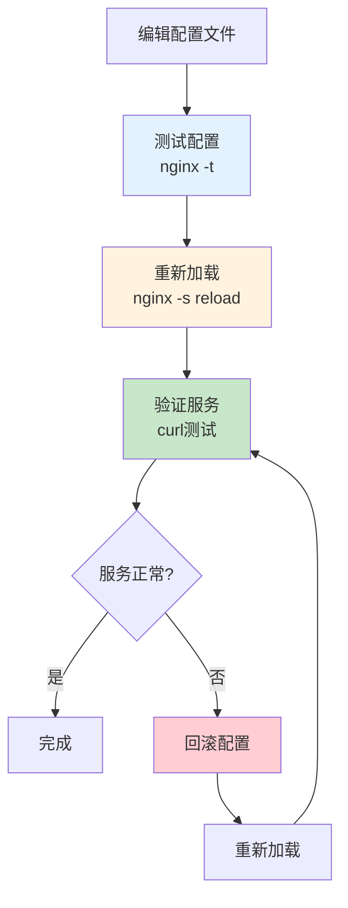

# Nginx运维生产环境最佳实践：从配置定位到性能优化

## 情境(Situation)

Nginx是现代Web架构中最流行的反向代理和负载均衡器，广泛应用于生产环境。在实际工作中，**Nginx往往是前任或第三方部署的**，你不知道它的安装方式、配置文件在哪、日志路径是什么。

快速定位Nginx配置和日志信息，是SRE排查Web问题的**第一步**。掌握Nginx的运维技能，对于保障Web服务的高可用性和性能至关重要。

## 冲突(Conflict)

许多SRE工程师在Nginx运维中遇到以下挑战：

- **配置定位困难**：不同安装方式导致配置文件位置不统一
- **日志管理混乱**：日志路径不明确，日志轮转配置不当
- **配置更新风险**：重启服务导致服务中断
- **性能问题定位**：不知道如何分析和优化Nginx性能
- **故障排查困难**：缺乏系统的故障排查方法
- **安全配置缺失**：默认配置存在安全隐患

## 问题(Question)

如何在生产环境中高效管理Nginx，实现配置快速定位、日志规范管理、零宕机更新和性能优化？

## 答案(Answer)

本文将从SRE视角出发，结合真实生产案例，提供一套完整的Nginx运维生产环境最佳实践。核心方法论基于 [SRE面试题解析：Nginx配置文件和日志文件在哪里？怎么找？](#17-nginx配置文件和日志文件在哪里怎么找)。

---

## 一、Nginx配置文件定位

### 1.1 五步定位法


### 1.2 定位方法详解

**方法1：nginx -t（最直接）**

```bash
# 语法测试，直接显示配置文件路径
nginx -t

# 输出示例
# nginx: the configuration file /etc/nginx/nginx.conf syntax is ok
# nginx: configuration file /etc/nginx/nginx.conf test is successful

# 指定配置文件测试
nginx -t -c /path/to/nginx.conf

# 只测试不输出
nginx -t -q
```

**方法2：nginx -V（查安装信息）**

```bash
# 查看编译参数
nginx -V

# 输出示例
# nginx version: nginx/1.18.0
# built by gcc 9.3.0 (Ubuntu 9.3.0-17ubuntu1~20.04)
# built with OpenSSL 1.1.1f  31 Mar 2020
# TLS SNI support enabled
# configure arguments: --prefix=/etc/nginx --conf-path=/etc/nginx/nginx.conf --error-log-path=/var/log/nginx/error.log --http-log-path=/var/log/nginx/access.log

# 提取配置文件路径
nginx -V 2>&1 | grep -oP "conf-path=\K\S+"

# 提取安装前缀
nginx -V 2>&1 | grep -oP "prefix=\K\S+"
```

**方法3：ps aux（查看进程）**

```bash
# 查看Nginx进程
ps aux | grep nginx

# 输出示例
# root      1234  0.0  0.1  55680  1100 ?        Ss   10:00   0:00 nginx: master process /usr/sbin/nginx -c /etc/nginx/nginx.conf
# www-data 1235  0.0  0.1  56084  1200 ?        S    10:00   0:00 nginx: worker process
# www-data 1236  0.0  0.1  56084  1200 ?        S    10:00   0:00 nginx: worker process

# 提取配置文件路径
ps aux | grep "nginx: master" | grep -oP " -c \K\S+"

# 查看master进程PID
pgrep -f "nginx: master"
```

**方法4：lsof（查看打开的文件）**

```bash
# 查看Nginx进程打开的文件
lsof -p $(pgrep -f "nginx: master")

# 查看配置文件
lsof -p $(pgrep -f "nginx: master") | grep -i conf

# 查看日志文件
lsof -p $(pgrep nginx) | grep -i log

# 查看所有worker进程
lsof -p $(pgrep -f "nginx: worker")
```

**方法5：find（文件搜索）**

```bash
# 搜索配置文件
find / -name nginx.conf -type f 2>/dev/null

# 搜索所有Nginx配置
find / -name "*.conf" -path "*/nginx/*" 2>/dev/null

# 搜索日志目录
find / -type d -name "nginx" 2>/dev/null

# 搜索可执行文件
find / -name nginx -type f 2>/dev/null
```

### 1.3 常见安装方式路径对照

| 安装方式 | 配置文件 | 日志文件 | 可执行文件 | 启动脚本 |
|:---------|:---------|:---------|:-----------|:---------|
| **YUM/RPM** | `/etc/nginx/nginx.conf` | `/var/log/nginx/` | `/usr/sbin/nginx` | `/usr/sbin/nginx` |
| **APT/Debian** | `/etc/nginx/nginx.conf` | `/var/log/nginx/` | `/usr/sbin/nginx` | `/usr/sbin/nginx` |
| **编译安装** | `/usr/local/nginx/conf/nginx.conf` | `/usr/local/nginx/logs/` | `/usr/local/nginx/sbin/nginx` | `/usr/local/nginx/sbin/nginx` |
| **Docker** | `/etc/nginx/nginx.conf` | `/var/log/nginx/` | `/usr/sbin/nginx` | `/docker-entrypoint.sh` |
| **Homebrew** | `/usr/local/etc/nginx/nginx.conf` | `/usr/local/var/log/nginx/` | `/usr/local/opt/nginx/bin/nginx` | `brew services` |

### 1.4 配置文件结构

```bash
# 主配置文件
/etc/nginx/nginx.conf

# 配置目录结构
/etc/nginx/
├── nginx.conf              # 主配置文件
├── conf.d/                 # 扩展配置目录
│   ├── default.conf        # 默认站点配置
│   ├── app.conf            # 应用配置
│   └── api.conf            # API配置
├── sites-available/        # 可用站点
│   ├── default
│   └── example.com
├── sites-enabled/          # 启用站点（符号链接）
│   ├── default -> ../sites-available/default
│   └── example.com -> ../sites-available/example.com
├── snippets/               # 配置片段
│   ├── fastcgi-php.conf
│   └── ssl-params.conf
└── modules-available/       # 可用模块
    └── modules-enabled/    # 启用模块
```

---

## 二、Nginx日志管理

### 2.1 日志类型

| 日志类型 | 默认路径 | 用途 | 格式 |
|:---------|:---------|:-----|:-----|
| **访问日志** | `/var/log/nginx/access.log` | 记录所有HTTP请求 | 自定义 |
| **错误日志** | `/var/log/nginx/error.log` | 记录错误信息 | 默认 |
| **重写日志** | `/var/log/nginx/rewrite.log` | 记录URL重写 | 自定义 |
| **SSL日志** | `/var/log/nginx/ssl.log` | 记录SSL握手 | 自定义 |

### 2.2 日志配置

**访问日志配置**：

```nginx
# 在http块中定义日志格式
http {
    # 标准日志格式
    log_format main '$remote_addr - $remote_user [$time_local] "$request" '
                    '$status $body_bytes_sent "$http_referer" '
                    '"$http_user_agent" "$http_x_forwarded_for"';

    # 详细日志格式
    log_format detailed '$remote_addr - $remote_user [$time_local] '
                       '"$request" $status $body_bytes_sent '
                       '"$http_referer" "$http_user_agent" '
                       '$request_time $upstream_response_time '
                       '$upstream_addr $upstream_status';

    # JSON日志格式（便于ELK分析）
    log_format json escape=json '{'
        '"time": "$time_iso8601",'
        '"remote_addr": "$remote_addr",'
        '"remote_user": "$remote_user",'
        '"request": "$request",'
        '"status": $status,'
        '"body_bytes_sent": $body_bytes_sent,'
        '"request_time": $request_time,'
        '"http_referrer": "$http_referer",'
        '"http_user_agent": "$http_user_agent",'
        '"http_x_forwarded_for": "$http_x_forwarded_for"'
    '}';

    # 应用日志格式
    access_log /var/log/nginx/access.log main;
    access_log /var/log/nginx/access_json.log json;
}
```

**错误日志配置**：

```nginx
# 错误日志级别：debug, info, notice, warn, error, crit, alert, emerg
error_log /var/log/nginx/error.log warn;

# 不同级别分别记录
error_log /var/log/nginx/error.log notice;
error_log /var/log/nginx/error_debug.log debug;

# 关闭错误日志（不推荐）
error_log /dev/null crit;
```

### 2.3 日志轮转

**logrotate配置**：

```bash
# /etc/logrotate.d/nginx
/var/log/nginx/*.log {
    daily                     # 每天轮转
    missingok                 # 文件不存在不报错
    rotate 14                 # 保留14天
    compress                  # 压缩旧日志
    delaycompress             # 延迟压缩
    notifempty                # 空文件不轮转
    create 0640 www-data adm  # 创建新文件
    sharedscripts            # 共享脚本
    postrotate
        [ -f /var/run/nginx.pid ] && kill -USR1 `cat /var/run/nginx.pid`
    endscript
}
```

### 2.4 日志分析工具

**常用命令**：

```bash
# 查看实时日志
tail -f /var/log/nginx/access.log

# 查看最后100行
tail -n 100 /var/log/nginx/access.log

# 统计状态码
awk '{print $9}' /var/log/nginx/access.log | sort | uniq -c | sort -rn

# 统计访问IP
awk '{print $1}' /var/log/nginx/access.log | sort | uniq -c | sort -rn | head -20

# 统计访问URL
awk '{print $7}' /var/log/nginx/access.log | sort | uniq -c | sort -rn | head -20

# 查找404错误
grep " 404 " /var/log/nginx/access.log

# 查找5xx错误
grep " 5[0-9][0-9] " /var/log/nginx/access.log

# 统计每分钟请求数
awk '{print $4}' /var/log/nginx/access.log | cut -d: -f2,3 | uniq -c
```

---

## 三、Nginx信号控制

### 3.1 信号类型

| 信号 | 命令 | 作用 | 是否中断服务 |
|:-----|:-----|:-----|:-------------|
| **TERM** | nginx -s stop | 快速停止 | 是 |
| **INT** | nginx -s stop | 快速停止 | 是 |
| **QUIT** | nginx -s quit | 优雅停止 | 否 |
| **HUP** | nginx -s reload | 重新加载配置 | 否 |
| **USR1** | nginx -s reopen | 重新打开日志 | 否 |
| **USR2** | nginx -s upgrade | 升级可执行文件 | 否 |
| **WINCH** | nginx -s quit | 优雅关闭worker进程 | 否 |

### 3.2 信号控制命令

**优雅停止**：

```bash
# 优雅停止Nginx
nginx -s quit

# 或发送QUIT信号
kill -QUIT $(cat /var/run/nginx.pid)

# 等待当前请求处理完成后停止
# 不接受新请求
```

**快速停止**：

```bash
# 快速停止Nginx
nginx -s stop

# 或发送TERM信号
kill -TERM $(cat /var/run/nginx.pid)

# 立即停止，不等待当前请求完成
```

**重新加载配置**：

```bash
# 重新加载配置（零宕机）
nginx -s reload

# 或发送HUP信号
kill -HUP $(cat /var/run/nginx.pid)

# 重新加载配置文件，不中断服务
# 新worker进程使用新配置
# 旧worker进程处理完当前请求后退出
```

**重新打开日志**：

```bash
# 重新打开日志文件
nginx -s reopen

# 或发送USR1信号
kill -USR1 $(cat /var/run/nginx.pid)

# 用于日志轮转后重新打开日志文件
```

### 3.3 零宕机配置更新

**配置更新流程**：



**配置更新脚本**：

```bash
#!/bin/bash
# nginx_config_reload.sh - Nginx配置更新脚本

CONFIG_FILE="/etc/nginx/nginx.conf"
BACKUP_DIR="/etc/nginx/backup"
TIMESTAMP=$(date +%Y%m%d_%H%M%S)

# 创建备份目录
mkdir -p "$BACKUP_DIR"

# 备份当前配置
echo "备份当前配置..."
cp "$CONFIG_FILE" "$BACKUP_DIR/nginx.conf.$TIMESTAMP"

# 测试配置
echo "测试配置..."
if nginx -t -c "$CONFIG_FILE"; then
    echo "配置测试通过"
else
    echo "配置测试失败，请检查配置"
    exit 1
fi

# 重新加载配置
echo "重新加载配置..."
nginx -s reload

# 验证服务
echo "验证服务..."
sleep 2
if curl -s -o /dev/null -w "%{http_code}" http://localhost | grep -q "200\|301\|302"; then
    echo "服务正常"
    echo "配置更新成功"
else
    echo "服务异常，回滚配置"
    cp "$BACKUP_DIR/nginx.conf.$TIMESTAMP" "$CONFIG_FILE"
    nginx -s reload
    echo "已回滚到之前配置"
    exit 1
fi
```

---

## 四、Nginx性能优化

### 4.1 核心配置优化

**worker_processes优化**：

```nginx
# 设置worker进程数（通常等于CPU核心数）
worker_processes auto;

# 或指定具体数量
worker_processes 4;

# 绑定worker进程到CPU核心
worker_cpu_affinity auto;

# 或手动绑定（4核CPU）
worker_cpu_affinity 0001 0010 0100 1000;
```

**worker_connections优化**：

```nginx
events {
    # 每个worker进程的最大连接数
    worker_connections 10240;

    # 使用epoll事件模型（Linux）
    use epoll;

    # 允许同时接受多个连接
    multi_accept on;
}
```

**缓冲区优化**：

```nginx
http {
    # 客户端请求头缓冲区
    client_header_buffer_size 4k;
    large_client_header_buffers 8 16k;

    # 客户端请求体缓冲区
    client_body_buffer_size 128k;
    client_max_body_size 10m;

    # 输出缓冲区
    output_buffers 4 32k;

    # 上游服务器缓冲区
    proxy_buffer_size 4k;
    proxy_buffers 8 4k;
    proxy_busy_buffers_size 8k;
}
```

**超时优化**：

```nginx
http {
    # 客户端超时
    client_body_timeout 12;
    client_header_timeout 12;
    keepalive_timeout 65;
    send_timeout 10;

    # 上游服务器超时
    proxy_connect_timeout 60;
    proxy_send_timeout 60;
    proxy_read_timeout 60;
}
```

### 4.2 缓存优化

**静态资源缓存**：

```nginx
http {
    # 开启缓存
    proxy_cache_path /var/cache/nginx levels=1:2 keys_zone=my_cache:10m max_size=1g inactive=60m use_temp_path=off;

    server {
        location ~* \.(jpg|jpeg|png|gif|ico|css|js|svg|woff|woff2|ttf|eot)$ {
            # 缓存时间
            expires 30d;
            add_header Cache-Control "public, immutable";

            # 缓存配置
            proxy_cache my_cache;
            proxy_cache_valid 200 30d;
            proxy_cache_use_stale error timeout updating http_500 http_502 http_503 http_504;
            proxy_cache_background_update on;
            proxy_cache_lock on;
        }
    }
}
```

### 4.3 压缩优化

```nginx
http {
    # 开启gzip压缩
    gzip on;
    gzip_vary on;
    gzip_min_length 1024;
    gzip_comp_level 6;
    gzip_types text/plain text/css text/xml text/javascript application/json application/javascript application/xml+rss application/rss+xml font/truetype font/opentype application/vnd.ms-fontobject image/svg+xml;
    gzip_disable "msie6";
}
```

### 4.4 连接优化

```nginx
http {
    # 开启keepalive
    keepalive_timeout 65;
    keepalive_requests 100;

    # 上游服务器keepalive
    upstream backend {
        server 192.168.1.10:8080;
        server 192.168.1.11:8080;
        keepalive 32;
        keepalive_timeout 60s;
        keepalive_requests 100;
    }

    server {
        location / {
            proxy_pass http://backend;
            proxy_http_version 1.1;
            proxy_set_header Connection "";
        }
    }
}
```

---

## 五、Nginx故障排查

### 5.1 常见问题

| 问题 | 可能原因 | 解决方案 |
|:-----|:---------|:----------|
| **502 Bad Gateway** | 上游服务不可用 | 检查上游服务状态 |
| **504 Gateway Timeout** | 上游服务响应超时 | 增加超时时间 |
| **413 Request Entity Too Large** | 上传文件过大 | 增加client_max_body_size |
| **403 Forbidden** | 权限问题 | 检查文件权限 |
| **404 Not Found** | 路径错误 | 检查location配置 |
| **配置测试失败** | 配置语法错误 | 检查配置文件 |

### 5.2 排查工具

**配置测试**：

```bash
# 测试配置
nginx -t

# 测试指定配置文件
nginx -t -c /path/to/nginx.conf

# 查看详细错误信息
nginx -T
```

**日志分析**：

```bash
# 查看错误日志
tail -f /var/log/nginx/error.log

# 查找特定错误
grep "error" /var/log/nginx/error.log

# 统计错误类型
awk '{print $9}' /var/log/nginx/error.log | sort | uniq -c
```

**连接测试**：

```bash
# 测试HTTP连接
curl -I http://localhost

# 测试HTTPS连接
curl -I https://localhost

# 查看响应头
curl -v http://localhost

# 测试特定URL
curl http://localhost/api/health
```

### 5.3 实战案例

**案例1：502错误排查**

**背景**：用户反馈网站返回502错误

**排查**：
```bash
# 1. 查看Nginx错误日志
tail -f /var/log/nginx/error.log
# 发现：connect() failed (111: Connection refused) while connecting to upstream

# 2. 检查上游服务状态
systemctl status php-fpm
# 发现：php-fpm服务未启动

# 3. 启动上游服务
systemctl start php-fpm

# 4. 验证服务
curl http://localhost
```

**案例2：504超时排查**

**背景**：API请求经常超时

**排查**：
```bash
# 1. 查看错误日志
grep "upstream timed out" /var/log/nginx/error.log

# 2. 检查超时配置
grep -A 5 "proxy_read_timeout" /etc/nginx/nginx.conf

# 3. 增加超时时间
vim /etc/nginx/nginx.conf
proxy_read_timeout 120;

# 4. 重新加载配置
nginx -s reload
```

---

## 六、最佳实践总结

### 6.1 配置管理规范

**配置文件管理**：
- 使用版本控制系统管理配置文件
- 配置变更前进行备份
- 使用nginx -t测试配置
- 使用nginx -s reload零宕机更新

**日志管理规范**：
- 合理设置日志级别
- 配置日志轮转
- 定期清理旧日志
- 使用结构化日志格式

### 6.2 性能优化建议

**核心优化**：
- worker_processes设置为auto或CPU核心数
- worker_connections根据业务调整
- 开启keepalive连接复用
- 合理配置缓冲区大小

**缓存优化**：
- 启用静态资源缓存
- 配置合理的缓存时间
- 使用proxy_cache加速响应
- 定期清理缓存

**压缩优化**：
- 开启gzip压缩
- 合理设置压缩级别
- 选择合适的压缩类型

### 6.3 安全配置建议

**基础安全**：
- 隐藏Nginx版本号
- 限制请求大小
- 配置访问控制
- 启用HTTPS

**访问控制**：
- 使用allow/deny限制访问
- 配置IP白名单
- 使用basic认证
- 集成OAuth2认证

---

## 总结

Nginx运维是SRE工程师的核心技能之一，掌握配置定位、日志管理、信号控制、性能优化和故障排查等技能，可以有效保障Web服务的高可用性和性能。

**核心要点**：

1. **配置定位**：掌握五步定位法，快速找到配置文件
2. **日志管理**：规范日志配置，合理轮转，有效分析
3. **信号控制**：理解信号机制，实现零宕机更新
4. **性能优化**：优化核心参数，提升服务性能
5. **故障排查**：掌握排查工具，快速定位问题
6. **安全配置**：加强安全防护，保障服务安全

> **延伸学习**：更多面试相关的Nginx知识，请参考 [SRE面试题解析：Nginx配置文件和日志文件在哪里？怎么找？](#17-nginx配置文件和日志文件在哪里怎么找)。

---

## 参考资料

- [Nginx官方文档](https://nginx.org/en/docs/)
- [Nginx性能优化指南](https://www.nginx.com/blog/tuning-nginx/)
- [Nginx配置最佳实践](https://github.com/nginx/nginx/wiki/BestPractices)
- [Nginx信号控制](https://nginx.org/en/docs/control.html)
- [Nginx日志管理](https://nginx.org/en/docs/http/ngx_http_log_module.html)
- [Nginx缓存配置](https://nginx.org/en/docs/http/ngx_http_proxy_module.html#proxy_cache)
- [Nginx安全配置](https://nginx.org/en/docs/http/ngx_http_core_module.html#server_name)
- [Nginx故障排查](https://www.nginx.com/blog/troubleshooting-nginx/)
- [Nginx性能测试](https://www.nginx.com/blog/testing-the-performance-of-nginx-and-nginx-plus/)
- [Nginx反向代理](https://nginx.org/en/docs/http/ngx_http_proxy_module.html)