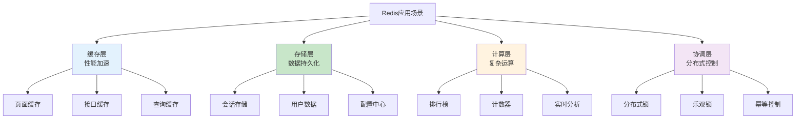

# Redis应用场景生产环境最佳实践：缓存、队列、锁与分析

## 情境(Situation)

在现代互联网架构中，Redis已成为解决高并发场景的利器。从电商秒杀到直播互动，从分布式锁到实时分析，Redis以其卓越的性能和丰富的数据结构，支撑着无数应用的稳定运行。

作为SRE工程师，理解Redis的各种应用场景及其最佳实践，是构建高性能、高可用系统的基础。正确选择Redis的应用场景，不仅能显著提升系统性能，还能有效减轻数据库压力，降低运营成本。

## 冲突(Conflict)

许多SRE工程师在使用Redis时遇到以下挑战：

- **场景选择困难**：不知道何时该用Redis，何时该用其他存储
- **数据结构选择**：面对多种数据结构，不知道如何选择最优方案
- **缓存问题**：缓存穿透、击穿、雪崩等问题频发
- **可靠性问题**：消息丢失、锁失效等可靠性问题难以解决
- **性能瓶颈**：高并发场景下Redis性能下降
- **架构设计**：如何设计Redis与其他组件的协作架构

## 问题(Question)

如何在生产环境中正确选择和应用Redis的各种场景，实现高性能、高可用的系统架构？

## 答案(Answer)

本文将从SRE视角出发，结合真实生产案例，提供一套完整的Redis应用场景生产环境最佳实践。核心方法论基于 [SRE面试题解析：Redis在什么场景下使用？](#25-redis在什么场景下使用)。

---

## 一、Redis应用场景概览

### 1.1 核心应用场景

**Redis应用场景全景图**：



### 1.2 场景与数据结构对应

| 场景 | 推荐数据结构 | 时间复杂度 | 内存效率 | 适用规模 |
|:-----|:-------------|:-----------|:---------|:----------|
| **缓存** | String/Hash | O(1) | 中 | 任意规模 |
| **会话存储** | Hash | O(1) | 中 | 任意规模 |
| **消息队列** | List/Stream | O(1) | 高 | 中小规模 |
| **排行榜** | Sorted Set | O(log N) | 低 | 大规模 |
| **分布式锁** | String | O(1) | 高 | 任意规模 |
| **实时分析** | Hash/Set | O(1) | 中 | 大规模 |
| **位图** | String | O(1) | 极高 | 超大规模 |
| **地理位置** | Geo | O(log N) | 中 | 大规模 |

---

## 二、缓存场景

### 2.1 缓存类型

**缓存架构分层**：

```
+----------------+    +----------------+    +----------------+
|   应用层        |<-->|   Redis缓存     |<-->|   数据库层      |
+----------------+    +----------------+    +----------------+
| 本地缓存        |    |   分布式缓存    |    |   主数据库      |
| Guava Cache    |    |   Redis        |    |   MySQL        |
| Caffeine       |    |   Memcached    |    |   PostgreSQL   |
+----------------+    +----------------+    +----------------+
```

**缓存类型对比**：

| 类型 | 优点 | 缺点 | 适用场景 |
|:-----|:-----|:-----|:----------|
| **本地缓存** | 无网络开销，极快 | 内存有限，不共享 | 热点数据，极高频访问 |
| **分布式缓存** | 共享，可扩展 | 有网络开销 | 通用缓存场景 |
| **混合缓存** | 综合优势 | 实现复杂 | 高性能要求场景 |

### 2.2 缓存读写策略

**Cache Aside（旁路缓存）**：

```python
def get_user(user_id):
    # 1. 先查缓存
    user = redis.get(f"user:{user_id}")
    if user:
        return json.loads(user)
    
    # 2. 缓存不存在，查数据库
    user = db.query("SELECT * FROM users WHERE id = ?", user_id)
    
    # 3. 写入缓存
    redis.setex(f"user:{user_id}", 3600, json.dumps(user))
    
    return user

def update_user(user_id, data):
    # 1. 更新数据库
    db.execute("UPDATE users SET ... WHERE id = ?", user_id, data)
    
    # 2. 删除缓存（而不是更新）
    redis.delete(f"user:{user_id}")
```

**Read Through（读穿透）**：

```python
def get_user(user_id):
    # 由缓存层自动处理读写
    return cache.get(f"user:{user_id}", lambda: db.query(user_id))
```

**Write Through（写穿透）**：

```python
def update_user(user_id, data):
    # 同时更新缓存和数据库
    cache.set(f"user:{user_id}", data)
    db.execute("UPDATE users SET ...", user_id, data)
```

**Write Behind（异步写回）**：

```python
def update_user(user_id, data):
    # 只更新缓存，异步写回数据库
    cache.set(f"user:{user_id}", data)
    # 异步任务批量写回数据库
    queue.push({"action": "update", "user_id": user_id, "data": data})
```

### 2.3 缓存问题及解决方案

**缓存穿透**：

| 问题 | 原因 | 解决方案 |
|:-----|:-----|:----------|
| **缓存穿透** | 查询不存在的数据 | 布隆过滤器/缓存空值 |
| **缓存击穿** | 热点key过期时大量请求 | 互斥锁/永不过期 |
| **缓存雪崩** | 大量key同时过期 | 过期时间随机化/多级缓存 |

**缓存穿透解决方案**：

```python
# 方案1：布隆过滤器
from bloom_filter import BloomFilter

bloom = BloomFilter(capacity=1000000, error_rate=0.01)

def get_product(product_id):
    # 布隆过滤器判断
    if product_id not in bloom:
        return None  # 一定不存在
    
    # 布隆过滤器存在，可能存在，继续查Redis和数据库
    product = redis.get(f"product:{product_id}")
    if product:
        return json.loads(product)
    
    product = db.query("SELECT * FROM products WHERE id = ?", product_id)
    if product:
        redis.setex(f"product:{product_id}", 3600, json.dumps(product))
        bloom.add(product_id)
    
    return product

# 方案2：缓存空值
def get_product(product_id):
    product = redis.get(f"product:{product_id}")
    if product == "NULL":  # 空值标记
        return None
    
    if product:
        return json.loads(product)
    
    product = db.query("SELECT * FROM products WHERE id = ?", product_id)
    if product:
        redis.setex(f"product:{product_id}", 3600, json.dumps(product))
    else:
        # 缓存空值，减少数据库压力
        redis.setex(f"product:{product_id}", 60, "NULL")
    
    return product
```

**缓存击穿解决方案**：

```python
# 方案1：互斥锁
import redis.lock

def get_product_with_lock(product_id):
    lock = redis.lock(f"lock:product:{product_id}", timeout=10)
    
    if lock.acquire(blocking=True, blocking_timeout=5):
        try:
            product = redis.get(f"product:{product_id}")
            if product:
                return json.loads(product)
            
            product = db.query("SELECT * FROM products WHERE id = ?", product_id)
            if product:
                redis.setex(f"product:{product_id}", 3600, json.dumps(product))
            
            return product
        finally:
            lock.release()
    else:
        # 获取锁失败，短暂等待后重试
        time.sleep(0.1)
        return get_product_with_lock(product_id)

# 方案2：永不过期 + 异步更新
def get_product_never_expire(product_id):
    product = redis.get(f"product:{product_id}")
    if product:
        return json.loads(product)
    
    product = db.query("SELECT * FROM products WHERE id = ?", product_id)
    if product:
        # 永不过期
        redis.set(f"product:{product_id}", json.dumps(product))
        # 异步更新缓存
        queue.push({"action": "refresh", "key": f"product:{product_id}"})
    
    return product
```

**缓存雪崩解决方案**：

```python
# 方案1：过期时间随机化
def set_product(product_id, product):
    # 基础过期时间 + 随机偏移量
    expire = 3600 + random.randint(0, 600)
    redis.setex(f"product:{product_id}", expire, json.dumps(product))

# 方案2：多级缓存
L1_CACHE = CaffeineCache(max_size=10000)
L2_CACHE = RedisCache()

def get_product(product_id):
    # L1缓存
    product = L1_CACHE.get(product_id)
    if product:
        return product
    
    # L2缓存
    product = L2_CACHE.get(f"product:{product_id}")
    if product:
        L1_CACHE.set(product_id, product)
        return product
    
    # 数据库
    product = db.query("SELECT * FROM products WHERE id = ?", product_id)
    if product:
        L2_CACHE.set(f"product:{product_id}", product)
        L1_CACHE.set(product_id, product)
    
    return product
```

### 2.4 缓存配置最佳实践

```bash
# 缓存过期策略
# 根据数据特性设置TTL
# 热点数据：较短TTL，确保持久化
# 冷数据：较长TTL，减少访问

# 内存淘汰策略
maxmemory 4gb
maxmemory-policy allkeys-lru
# 推荐：allkeys-lru（内存不足时删除最近最少使用的key）
```

---

## 三、会话存储

### 3.1 会话存储架构

**分布式会话架构**：

```
+----------------+    +----------------+    +----------------+
|   负载均衡器    |<-->|   应用服务器    |<-->|   Redis        |
+----------------+    +----------------+    +----------------+
|   保持会话       |    |   读取会话       |    |   存储会话       |
|   粘性会话/轮询  |    |   读写用户数据   |    |   Session数据   |
+----------------+    +----------------+    +----------------+
```

### 3.2 会话存储实现

**会话数据结构设计**：

```python
# 会话数据结构（Hash）
# Key: session:{session_id}
# Fields: user_id, username, email, login_time, last_active, permissions

def create_session(user_id, username):
    session_id = generate_uuid()
    session_key = f"session:{session_id}"
    
    # 存储会话信息
    redis.hset(session_key, mapping={
        "user_id": user_id,
        "username": username,
        "login_time": datetime.now().isoformat(),
        "last_active": datetime.now().isoformat(),
    })
    
    # 设置过期时间（30分钟无操作过期）
    redis.expire(session_key, 1800)
    
    return session_id

def get_session(session_id):
    session_key = f"session:{session_id}"
    
    # 获取会话
    session = redis.hgetall(session_key)
    if not session:
        return None
    
    # 更新最后活跃时间
    redis.hset(session_key, "last_active", datetime.now().isoformat())
    # 重置过期时间
    redis.expire(session_key, 1800)
    
    return session

def update_session(session_id, **kwargs):
    session_key = f"session:{session_id}"
    redis.hset(session_key, mapping=kwargs)
    redis.expire(session_key, 1800)

def delete_session(session_id):
    session_key = f"session:{session_id}"
    redis.delete(session_key)
```

**会话续期策略**：

```python
# 方案1：每次访问续期
def get_session_with_renew(session_id):
    session = get_session(session_id)
    if session:
        redis.expire(f"session:{session_id}", 1800)
    return session

# 方案2：滑动过期
def get_session_sliding(session_id):
    session_key = f"session:{session_id}"
    
    # 获取剩余TTL
    ttl = redis.ttl(session_key)
    if ttl < 0:
        return None
    
    # 剩余TTL小于10分钟时续期
    if ttl < 600:
        redis.expire(session_key, 1800)
    
    return redis.hgetall(session_key)
```

---

## 四、消息队列

### 4.1 消息队列选择

**Redis消息队列对比**：

| 特性 | List | Stream | Pub/Sub | 适用场景 |
|:-----|:-----|:--------|:---------|:----------|
| **消息持久化** | 支持 | 支持 | 不支持 | 需要持久化 |
| **消息确认** | 不支持 | 支持 | 不支持 | 需要确认 |
| **消费者组** | 不支持 | 支持 | 不支持 | 多消费者 |
| **消息堆积** | 受内存限制 | 受内存限制 | 无堆积 | 大流量场景 |
| **延迟队列** | Sorted Set | 不支持 | 不支持 | 延迟任务 |

### 4.2 List实现消息队列

**生产者-消费者模式**：

```python
# 生产者
def send_task(task_data):
    task_id = generate_uuid()
    task = {
        "task_id": task_id,
        "data": task_data,
        "created_at": datetime.now().isoformat()
    }
    # LPUSH生产，BRPOP消费（先进先出）
    redis.lpush("queue:tasks", json.dumps(task))
    return task_id

# 消费者
def process_tasks():
    while True:
        # 阻塞等待任务
        result = redis.brpop("queue:tasks", timeout=0)
        if result:
            _, task_json = result
            task = json.loads(task_json)
            try:
                process_task(task)
            except Exception as e:
                # 失败重试或放入死信队列
                redis.lpush("queue:tasks:failed", task_json)
                log_error(e)
```

### 4.3 Stream实现消息队列

**Stream特性**：

```python
# 生产者
def send_event(event_type, event_data):
    event_id = redis.xadd(
        "stream:events",
        {"type": event_type, "data": json.dumps(event_data)},
        maxlen=100000  # 限制队列长度
    )
    return event_id

# 消费者（消费者组模式）
def create_consumer_group():
    try:
        redis.xgroup_create("stream:events", "group1", id="0", mkstream=True)
    except redis.ResponseError as e:
        if "BUSYGROUP" not in str(e):
            raise

def consume_events():
    create_consumer_group()
    
    while True:
        # 读取新消息
        results = redis.xreadgroup(
            "group1",          # 消费者组
            "consumer1",        # 消费者ID
            {"stream:events": ">"},  # 读取新消息
            count=10,
            block=5000          # 阻塞5秒
        )
        
        for stream, messages in results or []:
            for message_id, fields in messages:
                try:
                    process_message(fields)
                    # 确认消息
                    redis.xack("stream:events", "group1", message_id)
                except Exception as e:
                    # 处理失败，放入重试队列
                    redis.xadd("stream:events:retry", fields)
                    redis.xack("stream:events", "group1", message_id)
                    log_error(e)
```

### 4.4 延迟队列

**基于Sorted Set的延迟队列**：

```python
# 生产者
def send_delay_task(task_data, delay_seconds):
    task_id = generate_uuid()
    execute_time = time.time() + delay_seconds
    
    task = {
        "task_id": task_id,
        "data": task_data,
        "created_at": datetime.now().isoformat()
    }
    
    # 按执行时间排序
    redis.zadd("queue:delay", {json.dumps(task): execute_time})
    return task_id

# 消费者
def process_delay_tasks():
    while True:
        # 获取已到期的任务
        now = time.time()
        tasks = redis.zrangebyscore("queue:delay", 0, now, start=0, num=10)
        
        for task_json in tasks:
            task = json.loads(task_json)
            try:
                process_task(task)
                # 删除已处理的任务
                redis.zrem("queue:delay", task_json)
            except Exception as e:
                # 处理失败，增加延迟重试
                redis.zadd("queue:delay", {task_json: now + 60})
                log_error(e)
        
        time.sleep(1)  # 避免CPU空转
```

---

## 五、排行榜与计数器

### 5.1 排行榜实现

**Sorted Set排行榜**：

```python
# 游戏排行榜
class GameLeaderboard:
    def __init__(self, leaderboard_key):
        self.key = leaderboard_key
    
    def add_player(self, player_id, score):
        """添加/更新玩家分数"""
        redis.zadd(self.key, {player_id: score})
    
    def increment_score(self, player_id, increment):
        """增加玩家分数"""
        redis.zincrby(self.key, increment, player_id)
    
    def get_rank(self, player_id):
        """获取玩家排名（0-based）"""
        rank = redis.zrevrank(self.key, player_id)
        return rank + 1 if rank is not None else None
    
    def get_top_n(self, n):
        """获取Top N玩家"""
        return redis.zrevrange(self.key, 0, n - 1, withscores=True)
    
    def remove_player(self, player_id):
        """移除玩家"""
        redis.zrem(self.key, player_id)
    
    def get_players_around(self, player_id, count=5):
        """获取玩家周围的排名"""
        rank = redis.zrevrank(self.key, player_id)
        if rank is None:
            return []
        
        start = max(0, rank - count)
        end = rank + count
        return redis.zrevrange(self.key, start, end, withscores=True)

# 使用示例
leaderboard = GameLeaderboard("game:leaderboard:season1")

# 添加玩家
leaderboard.add_player("player_001", 1000)
leaderboard.add_player("player_002", 1500)
leaderboard.add_player("player_003", 1200)

# 增加分数
leaderboard.increment_score("player_001", 50)

# 获取排名
print(f"Player 001 rank: {leaderboard.get_rank('player_001')}")

# 获取Top 10
print(f"Top 10: {leaderboard.get_top_n(10)}")
```

### 5.2 计数器实现

**高频计数器**：

```python
# 接口调用计数
def increment_counter(counter_key, time_window):
    """带时间窗口的计数器"""
    now = time.time()
    window_key = f"{counter_key}:{int(now // time_window)}"
    
    # 使用Hash存储窗口内的计数
    pipe = redis.pipeline()
    pipe.hincrby(window_key, "count", 1)
    pipe.expire(window_key, time_window * 2)
    pipe.execute()
    
    # 获取当前窗口计数
    return redis.hget(window_key, "count")

# 实时统计
def increment_stats(stats_key, dimension, value=1):
    """维度统计"""
    redis.hincrbyfloat(stats_key, f"{dimension}:count", value)
    redis.hincrbyfloat(stats_key, f"{dimension}:sum", value)

def get_stats(stats_key, dimension):
    """获取统计信息"""
    data = redis.hgetall(stats_key)
    count_key = f"{dimension}:count"
    sum_key = f"{dimension}:sum"
    
    count = float(data.get(count_key, 0))
    total = float(data.get(sum_key, 0))
    avg = total / count if count > 0 else 0
    
    return {
        "count": count,
        "sum": total,
        "avg": avg
    }

# 使用示例
increment_counter("api:requests:user:123", 60)  # 每分钟计数
increment_stats("page:views", "home")  # 页面访问统计
```

---

## 六、分布式锁

### 6.1 分布式锁实现

**基础分布式锁**：

```python
import redis
import uuid
import time

class DistributedLock:
    def __init__(self, redis_client, lock_name, timeout=30):
        self.redis = redis_client
        self.lock_name = f"lock:{lock_name}"
        self.timeout = timeout
        self.lock_value = str(uuid.uuid4())
        self.acquired = False
    
    def acquire(self, blocking=True, blocking_timeout=None):
        """获取锁"""
        start_time = time.time()
        
        while True:
            # SET NX EX 原子操作
            self.acquired = self.redis.set(
                self.lock_name,
                self.lock_value,
                nx=True,
                ex=self.timeout
            )
            
            if self.acquired:
                return True
            
            if not blocking:
                return False
            
            # 检查阻塞超时
            if blocking_timeout:
                elapsed = time.time() - start_time
                if elapsed >= blocking_timeout:
                    return False
            
            time.sleep(0.001)  # 避免CPU空转
    
    def release(self):
        """释放锁（Lua脚本保证原子性）"""
        lua_script = """
        if redis.call('get', KEYS[1]) == ARGV[1] then
            return redis.call('del', KEYS[1])
        else
            return 0
        end
        """
        if self.acquired:
            self.redis.eval(lua_script, 1, self.lock_name, self.lock_value)
            self.acquired = False
    
    def extend(self, additional_time=None):
        """延长锁的过期时间"""
        lua_script = """
        if redis.call('get', KEYS[1]) == ARGV[1] then
            return redis.call('expire', KEYS[1], ARGV[2])
        else
            return 0
        end
        """
        if self.acquired:
            expire_time = additional_time or self.timeout
            return self.redis.eval(lua_script, 1, self.lock_name, self.lock_value, expire_time)
        return False
    
    def __enter__(self):
        self.acquire()
        return self
    
    def __exit__(self, exc_type, exc_val, exc_tb):
        self.release()
        return False

# 使用示例
lock = DistributedLock(redis, "order:create:10001", timeout=30)
if lock.acquire(blocking=True, blocking_timeout=10):
    try:
        # 执行业务逻辑
        create_order()
    finally:
        lock.release()
else:
    raise Exception("获取锁失败")

# 使用上下文管理器
with DistributedLock(redis, "order:create:10001") as lock:
    create_order()
```

### 6.2 分布式锁进阶

**可重入锁**：

```python
class ReentrantLock:
    def __init__(self, redis_client, lock_name, timeout=30):
        self.redis = redis_client
        self.lock_name = f"lock:{lock_name}"
        self.timeout = timeout
        self.lock_value = str(uuid.uuid4())
        self.thread_id = threading.get_ident()
        self.acquired = False
    
    def acquire(self, blocking=True, blocking_timeout=None):
        """获取锁（可重入）"""
        # 检查是否是同一线程
        current_value = self.redis.get(self.lock_name)
        if current_value:
            if current_value.decode() == f"{self.thread_id}:{self.lock_value}":
                # 重入，计数+1
                self.redis.hincrby(f"lock:count:{self.lock_name}", self.thread_id, 1)
                self.acquired = True
                return True
        
        # 尝试获取锁
        full_value = f"{self.thread_id}:{self.lock_value}"
        self.acquired = self.redis.set(
            self.lock_name,
            full_value,
            nx=True,
            ex=self.timeout
        )
        
        if self.acquired:
            # 初始化计数
            self.redis.hset(f"lock:count:{self.lock_name}", self.thread_id, 1)
        
        return self.acquired
    
    def release(self):
        """释放锁"""
        full_value = f"{self.thread_id}:{self.lock_value}"
        current_value = self.redis.get(self.lock_name)
        
        if current_value and current_value.decode() == full_value:
            count = int(self.redis.hget(f"lock:count:{self.lock_name}", self.thread_id) or 1)
            if count > 1:
                # 重入计数-1
                self.redis.hincrby(f"lock:count:{self.lock_name}", self.thread_id, -1)
            else:
                # 最后一个，释放锁
                self.redis.delete(self.lock_name)
                self.redis.delete(f"lock:count:{self.lock_name}")
```

**红锁（RedLock）**：

```python
class RedLock:
    def __init__(self, redis_clients, timeout=10):
        self.clients = redis_clients
        self.timeout = timeout
        self.quorum = len(redis_clients) // 2 + 1
    
    def lock(self, resource, ttl_ms=10000):
        """获取红锁"""
        lock_value = str(uuid.uuid4())
        ttl = ttl_ms / 1000.0
        
        acquired = 0
        for client in self.clients:
            if self._try_acquire(client, resource, lock_value, ttl):
                acquired += 1
        
        if acquired >= self.quorum:
            return lock_value
        
        # 获取失败，释放所有锁
        self._release_all(resource, lock_value)
        return None
    
    def _try_acquire(self, client, resource, value, ttl):
        try:
            return client.set(
                f"lock:{resource}",
                value,
                nx=True,
                ex=int(ttl)
            )
        except:
            return False
    
    def _release_all(self, resource, value):
        for client in self.clients:
            try:
                lua_script = """
                if redis.call('get', KEYS[1]) == ARGV[1] then
                    return redis.call('del', KEYS[1])
                else
                    return 0
                end
                """
                client.eval(lua_script, 1, f"lock:{resource}", value)
            except:
                pass
    
    def unlock(self, resource, lock_value):
        """释放红锁"""
        self._release_all(resource, lock_value)
```

---

## 七、位图应用

### 7.1 位图基本操作

**签到系统**：

```python
class SignSystem:
    def __init__(self, redis_client):
        self.redis = redis_client
    
    def sign(self, user_id, date=None):
        """用户签到"""
        if date is None:
            date = datetime.now()
        
        key = f"sign:{user_id}:{date.year}:{date.month:02d}"
        day_offset = date.day - 1  # 0-based index
        
        return self.redis.setbit(key, day_offset, 1)
    
    def check_sign(self, user_id, date):
        """检查签到状态"""
        key = f"sign:{user_id}:{date.year}:{date.month:02d}"
        day_offset = date.day - 1
        
        return self.redis.getbit(key, day_offset) == 1
    
    def get_sign_count(self, user_id, year, month):
        """获取月签到天数"""
        key = f"sign:{user_id}:{year}:{month:02d}"
        return self.redis.bitcount(key)
    
    def get_sign_calendar(self, user_id, year, month):
        """获取月签到日历"""
        key = f"sign:{user_id}:{year}:{month:02d}"
        bitmap = self.redis.get(key)
        
        if not bitmap:
            return [0] * 31
        
        return [1 if (bitmap[i // 8] >> (i % 8)) & 1 else 0 for i in range(31)]
    
    def get_continuous_days(self, user_id, end_date):
        """获取连续签到天数"""
        continuous = 0
        current_date = end_date
        
        while True:
            if self.check_sign(user_id, current_date):
                continuous += 1
                current_date -= timedelta(days=1)
            else:
                break
        
        return continuous

# 使用示例
sign_system = SignSystem(redis)

# 签到
sign_system.sign("user_001")

# 检查签到
is_signed = sign_system.check_sign("user_001", datetime.now())
print(f"Today signed: {is_signed}")

# 获取月签到天数
count = sign_system.get_sign_count("user_001", 2024, 1)
print(f"January 2024 signed days: {count}")

# 获取连续签到天数
continuous = sign_system.get_continuous_days("user_001", datetime.now())
print(f"Continuous signed days: {continuous}")
```

### 7.2 位图统计

**DAU统计**：

```python
class DAUTracker:
    def __init__(self, redis_client):
        self.redis = redis_client
    
    def record_dau(self, date=None):
        """记录DAU（按日期存储）"""
        if date is None:
            date = datetime.now()
        
        key = f"dau:{date.year}:{date.month:02d}:{date.day:02d}"
        return key
    
    def add_user(self, date, user_id):
        """添加活跃用户"""
        key = self.record_dau(date)
        # 使用用户ID的哈希值作为位偏移量
        offset = hash(user_id) % 100000000  # 1亿用户规模
        return self.redis.setbit(key, offset, 1)
    
    def get_dau(self, date):
        """获取DAU"""
        key = self.record_dau(date)
        return self.redis.bitcount(key)
    
    def get_dau_range(self, start_date, end_date):
        """获取日期范围内DAU"""
        total_dau = 0
        current = start_date
        
        while current <= end_date:
            key = self.record_dau(current)
            total_dau += self.redis.bitcount(key)
            current += timedelta(days=1)
        
        return total_dau

# 使用示例
dau_tracker = DAUTracker(redis)

# 记录活跃用户
today = datetime.now()
dau_tracker.add_user(today, "user_001")
dau_tracker.add_user(today, "user_002")

# 获取DAU
dau = dau_tracker.get_dau(today)
print(f"Today's DAU: {dau}")
```

---

## 八、实时分析

### 8.1 UV/PV统计

**实时统计系统**：

```python
class RealtimeStats:
    def __init__(self, redis_client):
        self.redis = redis_client
    
    def record_page_view(self, page_id, user_id=None):
        """记录页面访问"""
        key = f"stats:pv:{page_id}"
        pipe = self.redis.pipeline()
        
        # PV +1
        pipe.incr(key)
        # 设置过期时间（48小时）
        pipe.expire(key, 48 * 3600)
        
        # 如果有用户ID，记录UV
        if user_id:
            uv_key = f"stats:uv:{page_id}"
            pipe.sadd(uv_key, user_id)
            pipe.expire(uv_key, 48 * 3600)
        
        pipe.execute()
    
    def get_stats(self, page_id):
        """获取页面统计"""
        pipe = self.redis.pipeline()
        
        pv_key = f"stats:pv:{page_id}"
        uv_key = f"stats:uv:{page_id}"
        
        pipe.get(pv_key)
        pipe.scard(uv_key)
        
        results = pipe.execute()
        
        return {
            "pv": int(results[0] or 0),
            "uv": int(results[1] or 0)
        }

# 使用示例
stats = RealtimeStats(redis)

# 记录访问
stats.record_page_view("home", "user_001")
stats.record_page_view("product:123", "user_001")
stats.record_page_view("product:123", "user_002")

# 获取统计
home_stats = stats.get_stats("home")
print(f"Home - PV: {home_stats['pv']}, UV: {home_stats['uv']}")
```

### 8.2 实时排行

**实时投票系统**：

```python
class VotingSystem:
    def __init__(self, redis_client):
        self.redis = redis_client
    
    def vote(self, topic_id, option_id, user_id):
        """投票"""
        # 检查是否已投票
        voted_key = f"vote:voted:{topic_id}"
        if self.redis.sismember(voted_key, user_id):
            return False, "已投票"
        
        # 记录投票
        pipe = self.redis.pipeline()
        
        # 记录用户已投票
        pipe.sadd(voted_key, user_id)
        pipe.expire(voted_key, 7 * 24 * 3600)  # 7天过期
        
        # 增加选项票数
        option_key = f"vote:options:{topic_id}"
        pipe.zincrby(option_key, 1, option_id)
        pipe.expire(option_key, 7 * 24 * 3600)
        
        pipe.execute()
        
        return True, "投票成功"
    
    def get_results(self, topic_id):
        """获取投票结果"""
        option_key = f"vote:options:{topic_id}"
        voted_key = f"vote:voted:{topic_id}"
        
        pipe = self.redis.pipeline()
        pipe.zrevrange(option_key, 0, -1, withscores=True)
        pipe.scard(voted_key)
        
        results = pipe.execute()
        
        options = results[0] or []
        total_votes = int(results[1] or 0)
        
        return {
            "total_votes": total_votes,
            "options": [
                {"option_id": option, "votes": int(score), "percentage": round(score / total_votes * 100, 2) if total_votes > 0 else 0}
                for option, score in options
            ]
        }

# 使用示例
voting = VotingSystem(redis)

# 投票
voting.vote("election_001", "option_A", "user_001")
voting.vote("election_001", "option_B", "user_002")
voting.vote("election_001", "option_A", "user_003")

# 获取结果
results = voting.get_results("election_001")
print(f"Total votes: {results['total_votes']}")
for opt in results['options']:
    print(f"{opt['option_id']}: {opt['votes']} ({opt['percentage']}%)")
```

---

## 九、高可用架构

### 9.1 Redis Sentinel架构

**Sentinel应用场景**：

```python
from redis.sentinel import Sentinel

# Sentinel配置
sentinel = Sentinel([
    ('sentinel-1', 26379),
    ('sentinel-2', 26379),
    ('sentinel-3', 26379)
], socket_timeout=0.1)

# 获取主节点
master = sentinel.master_for('mymaster', password='mypassword')
slave = sentinel.slave_for('mymaster', password='mypassword')

# 读操作（从节点）
def read_data(key):
    return slave.get(key)

# 写操作（主节点）
def write_data(key, value):
    return master.set(key, value)
```

### 9.2 Redis Cluster架构

**Cluster应用场景**：

```python
from redis.cluster import RedisCluster

# Cluster配置
rc = RedisCluster(
    host='redis-cluster',
    port=6379,
    password='mypassword',
    skip_full_coverage_check=True
)

# 自动路由
def get_user(user_id):
    # Redis Cluster自动处理路由
    return rc.get(f"user:{user_id}")

def get_user_orders(user_id):
    # 多key操作（需确保在同一slot）
    pipe = rc.pipeline()
    pipe.get(f"user:{user_id}")
    pipe.lrange(f"orders:{user_id}", 0, -1)
    return pipe.execute()
```

---

## 十、最佳实践总结

### 10.1 场景选择指南

| 需求 | 推荐方案 | 替代方案 |
|:-----|:---------|:----------|
| **高性能缓存** | String/Hash | Memcached |
| **分布式会话** | Hash + TTL | Spring Session |
| **消息队列** | Stream | RabbitMQ/Kafka |
| **延迟任务** | Sorted Set | RabbitMQ Delayed Message |
| **排行榜** | Sorted Set | MongoDB |
| **分布式锁** | String (SET NX EX) | ZooKeeper |
| **实时统计** | Hash/Set | ClickHouse |
| **签到系统** | String (Bitmap) | MySQL |
| **去重** | Set | Bloom Filter |
| **地理位置** | Geo | MongoDB Geo |

### 10.2 架构设计原则

1. **读写分离**：读操作可以走从节点，写操作走主节点
2. **数据分片**：大流量场景使用Cluster分片
3. **容量规划**：预估数据量，合理分配内存
4. **监控告警**：监控关键指标，及时处理问题
5. **容灾备份**：定期备份，支持快速恢复

### 10.3 常见问题处理

| 问题 | 症状 | 解决方案 |
|:-----|:-----|:----------|
| **内存不足** | OOM | 调整maxmemory，配置淘汰策略 |
| **连接数过多** | 连接拒绝 | 调整maxclients，使用连接池 |
| **命令阻塞** | 请求超时 | 避免使用KEYS等危险命令 |
| **数据丢失** | 持久化失败 | 检查AOF/RDB配置 |
| **主从切换** | 读写失败 | 使用Sentinel自动切换 |

---

## 总结

Redis作为互联网架构的标配，其丰富的应用场景为系统设计提供了强大的支持。通过本文的介绍，我们深入了解了Redis在缓存、会话存储、消息队列、排行榜、分布式锁、位图和实时分析等场景的最佳实践。

**核心要点**：

1. **缓存场景**：选择合适的缓存策略，处理穿透、击穿、雪崩问题
2. **会话存储**：使用Hash结构，实现分布式会话管理
3. **消息队列**：List适合简单队列，Stream适合复杂场景
4. **排行榜**：使用Sorted Set，实现实时排行
5. **分布式锁**：使用SET NX EX，配合Lua脚本保证原子性
6. **位图应用**：适合签到、DAU等大规模布尔统计
7. **高可用**：使用Sentinel或Cluster保证服务可用性

> **延伸学习**：更多面试相关的Redis应用场景知识，请参考 [SRE面试题解析：Redis在什么场景下使用？](#25-redis在什么场景下使用)。

---

## 参考资料

- [Redis官方文档](https://redis.io/documentation)
- [Redis应用场景](https://redis.io/topics/data-types)
- [Redis缓存指南](https://redis.io/topics/lru-cache)
- [Redis分布式锁](https://redis.io/topics/distlock)
- [Redis Stream](https://redis.io/topics/streams-intro)
- [Redis持久化](https://redis.io/topics/persistence)
- [Redis Sentinel](https://redis.io/topics/sentinel)
- [Redis Cluster](https://redis.io/topics/cluster-tutorial)
- [Redis数据类型](https://redis.io/topics/data-types-intro)
- [Redis性能优化](https://redis.io/topics/performance)
- [布隆过滤器](https://en.wikipedia.org/wiki/Bloom_filter)
- [缓存架构设计](https://coolshell.cn/articles/17416.html)