# Redis优化生产环境最佳实践：从内存到高可用的全面优化策略

## 情境(Situation)

Redis作为高并发系统的核心组件，其性能直接决定了整个系统的响应速度和稳定性。然而，许多SRE工程师在使用Redis时，由于缺乏系统性的优化策略，导致Redis性能瓶颈、内存溢出、服务宕机等问题频发。

在生产环境中，Redis的优化不仅仅是简单的配置调整，而是一个涉及内存管理、命令使用、高可用架构、持久化策略和监控告警的系统工程。只有通过全面的优化，才能让Redis发挥最大性能，同时保证系统的稳定性。

## 冲突(Conflict)

许多SRE工程师在Redis优化过程中遇到以下挑战：

- **内存管理困难**：内存使用率高、内存碎片严重
- **性能瓶颈**：命令执行慢、响应时间长
- **高可用架构复杂**：主从复制、哨兵、集群配置复杂
- **持久化策略选择**：数据安全与性能的平衡
- **监控告警体系不完善**：无法及时发现和处理问题
- **版本升级风险**：升级过程中服务中断

## 问题(Question)

如何在生产环境中系统性地优化Redis，实现高性能、高可用、高稳定的运行状态？

## 答案(Answer)

本文将从SRE视角出发，结合真实生产案例，提供一套完整的Redis优化生产环境最佳实践。核心方法论基于 [SRE面试题解析：Redis优化](#27-你redis做了哪些优化)。

---

## 一、Redis优化体系

### 1.1 优化维度

**Redis优化全景图**：

```mermaid
flowchart TD
    A["Redis优化体系"] --> B["内存优化<br>数据结构+配置"]
    A --> C["性能优化<br>命令+IO"]
    A --> D["高可用优化<br>主从+集群"]
    A --> E["持久化优化<br>RDB+AOF"]
    A --> F["监控优化<br>指标+告警"]
    A --> G["安全优化<br>访问控制"]
    
    B --> B1["数据结构选择"]
    B --> B2["内存配置"]
    B --> B3["淘汰策略"]
    B --> B4["内存碎片整理"]
    
    C --> C1["命令优化"]
    C --> C2["慢查询处理"]
    C --> C3["多线程I/O"]
    C --> C4["网络优化"]
    
    D --> D1["主从复制"]
    D --> D2["Sentinel"]
    D --> D3["Cluster"]
    D --> D4["故障转移"]
    
    E --> E1["RDB配置"]
    E --> E2["AOF配置"]
    E --> E3["混合持久化"]
    E --> E4["备份策略"]
    
    F --> F1["关键指标"]
    F --> F2["监控工具"]
    F --> F3["告警配置"]
    F --> F4["性能分析"]
    
    G --> G1["认证配置"]
    G --> G2["网络安全"]
    G --> G3["危险命令禁用"]
    G --> G4["数据加密"]
    
    style B fill:#e3f2fd
    style C fill:#c8e6c9
    style D fill:#fff3e0
    style E fill:#ffebee
    style F fill:#f3e5f5
    style G fill:#e8f5e8
```



### 1.2 优化优先级

**优化优先级矩阵**：

| 优化维度 | 优先级 | 影响范围 | 实施难度 | 回报周期 |
|:---------|:-------|:----------|:----------|:----------|
| **内存优化** | ⭐⭐⭐ | 全局 | 中 | 短 |
| **性能优化** | ⭐⭐⭐ | 全局 | 中 | 短 |
| **高可用优化** | ⭐⭐⭐ | 全局 | 高 | 中 |
| **持久化优化** | ⭐⭐ | 全局 | 低 | 中 |
| **监控优化** | ⭐⭐ | 全局 | 低 | 长 |
| **安全优化** | ⭐⭐ | 全局 | 低 | 长 |

---

## 二、内存优化

### 2.1 数据结构选择

**数据结构对比**：

| 数据结构 | 时间复杂度 | 内存效率 | 适用场景 | 最佳实践 |
|:---------|:-----------|:---------|:----------|:----------|
| **String** | O(1) | 低 | 简单缓存 | value < 10KB |
| **Hash** | O(1) | 中 | 对象存储 | field < 1000 |
| **List** | O(1)/O(n) | 高 | 队列、列表 | 长度控制 |
| **Set** | O(1)/O(n) | 中 | 去重、交集 | 成员 < 10000 |
| **Sorted Set** | O(log n) | 低 | 排行榜、有序 | 成员 < 10000 |
| **HyperLogLog** | O(1) | 极高 | 基数统计 | 精度要求低 |
| **Bitmap** | O(1) | 极高 | 位操作、签到 | 布尔数据 |
| **Geospatial** | O(log n) | 中 | 地理位置 | 距离计算 |

**数据结构最佳实践**：

```python
# 推荐使用方式

# String：存储小数据
redis.setex("user:session:123", 3600, "{\"user_id\": 123, \"username\": \"admin\"}")

# Hash：存储对象
hash_data = {
    "id": "1001",
    "name": "iPhone 15",
    "price": "6999",
    "stock": "100"
}
redis.hset("product:1001", mapping=hash_data)

# List：作为队列
redis.lpush("task:queue", "task1", "task2", "task3")

# Set：去重
redis.sadd("user:123:tags", "java", "python", "redis")

# Sorted Set：排行榜
redis.zadd("game:leaderboard", {"player1": 1000, "player2": 999})

# HyperLogLog：UV统计
redis.pfadd("page:views:20240101", "user1", "user2", "user3")

# Bitmap：签到
redis.setbit("user:123:checkin:202401", 0, 1)  # 1月1日签到

# Geospatial：附近的人
redis.geoadd("users:location", 116.404, 39.915, "user1")
```

### 2.2 内存配置

**核心内存配置**：

```bash
# redis.conf
maxmemory 4gb              # 最大内存
maxmemory-policy allkeys-lru  # 淘汰策略

# 推荐的淘汰策略选择
# noeviction：不淘汰，返回错误
# allkeys-lru：所有key中删除最近最少使用
# volatile-lru：有过期时间的key中删除最近最少使用
# allkeys-random：所有key中随机删除
# volatile-random：有过期时间的key中随机删除
# volatile-ttl：有过期时间的key中删除剩余TTL最短的
# allkeys-lfu：所有key中删除最不经常使用
# volatile-lfu：有过期时间的key中删除最不经常使用
```

**压缩数据结构配置**：

```bash
# 压缩数据结构配置
hash-max-ziplist-entries 512
hash-max-ziplist-value 64
list-max-ziplist-size -2  # -2 表示按元素数限制
set-max-intset-entries 512
zset-max-ziplist-entries 128
zset-max-ziplist-value 64
```

**系统内存优化**：

```bash
# 允许内存超分配
echo 1 > /proc/sys/vm/overcommit_memory

# 关闭透明大页（减少内存碎片）
echo never > /sys/kernel/mm/transparent_hugepage/enabled

# 调整swappiness（减少交换）
echo 0 > /proc/sys/vm/swappiness
```

### 2.3 内存碎片整理

**内存碎片分析**：

```bash
# 查看内存碎片率
redis-cli info memory | grep mem_fragmentation_ratio

# 理想范围：1.0-1.5
# 碎片率 > 1.5：需要整理
# 碎片率 < 1.0：可能存在内存交换
```

**主动碎片整理**：

```bash
# redis.conf
activedefrag yes
active-defrag-ignore-bytes 100mb
active-defrag-threshold-lower 10
active-defrag-threshold-upper 100
active-defrag-cycle-min 25
active-defrag-cycle-max 75

# 手动触发内存整理（谨慎使用）
redis-cli DEBUG SEGFAULT  # 不推荐生产环境使用
```

### 2.4 大键管理

**识别大键**：

```bash
# 使用redis-cli识别大键
redis-cli --bigkeys

# 按内存大小排序
redis-cli --bigkeys -i 0.1  # 每100ms执行一次，减少影响

# 使用SCAN查找大键
redis-cli --scan --pattern "*" | xargs -I {} redis-cli debug object {} | grep serializedlength
```

**大键处理策略**：

```python
# 大键拆分策略
def split_large_list(key, chunk_size=1000):
    """拆分大List"""
    items = []
    while True:
        chunk = redis.lpop(key)
        if not chunk:
            break
        items.append(chunk)
        if len(items) >= chunk_size:
            # 保存为多个小List
            chunk_key = f"{key}:chunk:{int(time.time())}_{len(items)}"
            for item in items:
                redis.rpush(chunk_key, item)
            items = []
    
    # 处理剩余部分
    if items:
        chunk_key = f"{key}:chunk:{int(time.time())}_{len(items)}"
        for item in items:
            redis.rpush(chunk_key, item)

def split_large_hash(key, chunk_size=100):
    """拆分大Hash"""
    cursor = 0
    while True:
        cursor, fields = redis.hscan(key, cursor=cursor, count=chunk_size)
        if not fields:
            break
        
        # 保存为多个小Hash
        chunk_key = f"{key}:chunk:{int(time.time())}_{len(fields)}"
        redis.hset(chunk_key, mapping=fields)
        # 删除原Hash中的字段
        redis.hdel(key, *fields.keys())
```

---

## 三、性能优化

### 3.1 命令优化

**高危命令清单**：

| 命令 | 风险 | 替代方案 |
|:-----|:-----|:----------|
| `KEYS` | O(n)，阻塞所有操作 | `SCAN` 分批获取 |
| `FLUSHALL` | O(n)，清空所有数据 | 避免使用 |
| `FLUSHDB` | O(n)，清空当前数据库 | 避免使用 |
| `SMEMBERS` | O(n)，返回集合所有成员 | `SRANDMEMBER` 或 `SSCAN` |
| `HGETALL` | O(n)，返回哈希所有字段 | 只获取需要的字段 |
| `LRANGE 0 -1` | O(n)，返回列表所有元素 | 指定范围 |
| `SINTER` | O(n*m)，交集运算 | 限制集合大小 |

**命令优化实践**：

```python
# 使用SCAN代替KEYS
def scan_keys(pattern, count=100):
    """分批扫描键"""
    cursor = 0
    keys = []
    while True:
        cursor, batch = redis.scan(cursor, match=pattern, count=count)
        keys.extend(batch)
        if cursor == 0:
            break
    return keys

# 使用Pipeline减少网络往返
def batch_operations(operations):
    """批量操作"""
    pipe = redis.pipeline()
    for op, *args in operations:
        getattr(pipe, op)(*args)
    return pipe.execute()

# 使用UNLINK代替DEL
def safe_delete(key):
    """安全删除大键"""
    try:
        # Redis 4.0+支持UNLINK
        return redis.unlink(key)
    except:
        # 回退到DEL
        return redis.delete(key)

# 使用Lua脚本原子操作
def atomic_operation(script, keys, args):
    """执行Lua脚本"""
    return redis.eval(script, len(keys), *keys, *args)
```

### 3.2 慢查询处理

**慢查询配置**：

```bash
# redis.conf
slowlog-log-slower-than 10000  # 10ms以上为慢查询
slowlog-max-len 1000          # 慢查询日志长度
```

**慢查询分析**：

```bash
# 查看慢查询
redis-cli slowlog get 10

# 查看慢查询数量
redis-cli slowlog len

# 重置慢查询
redis-cli slowlog reset
```

**慢查询监控脚本**：

```python
import redis
import time

def monitor_slowlog(redis_client, threshold=10000, interval=60):
    """监控慢查询"""
    last_count = redis_client.slowlog_len()
    
    while True:
        current_count = redis_client.slowlog_len()
        if current_count > last_count:
            # 有新的慢查询
            slowlogs = redis_client.slowlog_get(current_count - last_count)
            for log in slowlogs:
                duration = log['duration']
                command = ' '.join(log['args'])
                if duration > threshold:
                    print(f"[SLOWLOG] {duration}ms: {command}")
        
        last_count = current_count
        time.sleep(interval)

# 使用示例
# monitor_slowlog(redis_client)
```

### 3.3 多线程I/O（Redis 6.0+）

**多线程配置**：

```bash
# redis.conf
io-threads 4            # 线程数（建议为CPU核心数的一半）
io-threads-do-reading yes  # 开启多线程读

# 注意：命令执行仍然是单线程的
# 多线程只用于网络I/O的读写
```

**多线程适用场景**：
- 高并发读取场景
- 大value场景
- 高带宽网络环境

**多线程性能测试**：

```bash
# 使用redis-benchmark测试
redis-benchmark -h localhost -p 6379 -c 100 -n 100000 -t get,set

# 对比多线程前后的性能
```

### 3.4 网络优化

**网络配置**：

```bash
# redis.conf
tcp-keepalive 300            # TCP保活
maxclients 10000              # 最大客户端数
tcp-backlog 511               # TCP backlog队列

# 系统网络优化
echo 65535 > /proc/sys/net/core/somaxconn  # 提高连接队列
echo 1 > /proc/sys/net/ipv4/tcp_tw_reuse   # 重用TIME_WAIT连接
echo 30 > /proc/sys/net/ipv4/tcp_fin_timeout  # 缩短FIN等待时间
```

**连接池配置**：

```python
import redis

# 连接池配置
pool = redis.ConnectionPool(
    host='localhost',
    port=6379,
    password='yourpassword',
    db=0,
    max_connections=100,
    decode_responses=True
)

# 使用连接池
redis_client = redis.Redis(connection_pool=pool)
```

---

## 四、高可用优化

### 4.1 主从复制

**主从复制配置**：

```bash
# 主节点配置（无需特殊配置）

# 从节点配置
replicaof 192.168.1.100 6379  # 主节点地址和端口
replica-read-only yes        # 从节点只读
repl-backlog-size 1G         # 复制缓冲区大小
replica-serve-stale-data yes  # 主节点不可用时，从节点继续提供服务
```

**主从复制监控**：

```bash
# 查看主从状态
redis-cli info replication

# 检查复制延迟
redis-cli info replication | grep -E "master_repl_offset|slave_repl_offset"

# 手动触发全量同步
redis-cli slaveof no one
redis-cli slaveof 192.168.1.100 6379
```

### 4.2 Redis Sentinel

**Sentinel配置**：

```bash
# sentinel.conf
port 26379
dir /tmp
sentinel monitor mymaster 192.168.1.100 6379 2
sentinel down-after-milliseconds mymaster 30000
sentinel failover-timeout mymaster 180000
sentinel parallel-syncs mymaster 1
sentinel auth-pass mymaster yourpassword
```

**Sentinel管理**：

```bash
# 查看Sentinel状态
redis-cli -p 26379 info

# 查看主节点信息
redis-cli -p 26379 sentinel get-master-addr-by-name mymaster

# 手动触发故障转移
redis-cli -p 26379 sentinel failover mymaster

# 查看Sentinel集群
redis-cli -p 26379 sentinel masters
```

### 4.3 Redis Cluster

**Cluster配置**：

```bash
# redis.conf
cluster-enabled yes
cluster-config-file nodes-6379.conf
cluster-node-timeout 15000
cluster-replica-validity-factor 10
cluster-migration-barrier 1
cluster-require-full-coverage yes
```

**Cluster管理**：

```bash
# 创建集群（3主3从）
redis-cli --cluster create \
    192.168.1.100:7000 \
    192.168.1.100:7001 \
    192.168.1.100:7002 \
    192.168.1.100:7003 \
    192.168.1.100:7004 \
    192.168.1.100:7005 \
    --cluster-replicas 1

# 查看集群状态
redis-cli -p 7000 cluster info

# 查看节点信息
redis-cli -p 7000 cluster nodes

# 重新分片
redis-cli --cluster reshard 192.168.1.100:7000

# 手动故障转移
redis-cli -p 7001 cluster failover
```

**Cluster槽位管理**：

```bash
# 查看槽位分布
redis-cli -p 7000 cluster slots

# 手动分配槽位
redis-cli --cluster addslots 192.168.1.100:7000 0-5460
```

### 4.4 高可用架构选择

**架构对比**：

| 架构 | 优点 | 缺点 | 适用场景 |
|:-----|:-----|:-----|:----------|
| **主从复制** | 简单易用 | 手动故障转移 | 小规模部署 |
| **Sentinel** | 自动故障转移 | 不支持数据分片 | 中等规模 |
| **Cluster** | 自动故障转移 + 数据分片 | 配置复杂 | 大规模部署 |

**选择建议**：
- **< 10GB数据**：主从 + Sentinel
- **10GB-100GB数据**：Redis Cluster
- **> 100GB数据**：多个Redis Cluster

---

## 五、持久化优化

### 5.1 RDB优化

**RDB配置**：

```bash
# redis.conf
save 3600 1      # 1小时1次写操作
save 300 100     # 5分钟100次写操作
save 60 10000    # 1分钟10000次写操作

rdbcompression yes    # 开启压缩
rdbchecksum yes       # 开启校验
```

**RDB性能优化**：

```bash
# 避免在业务高峰期生成RDB
# 选择在低峰期执行

# 控制RDB文件大小
# 定期清理过期数据

# 使用BGSAVE而不是SAVE
redis-cli bgsave
```

### 5.2 AOF优化

**AOF配置**：

```bash
# redis.conf
appendonly yes
appendfsync everysec  # 每秒刷盘（平衡性能和安全）
# appendfsync always   # 每次写入刷盘（性能差）
# appendfsync no      # 由操作系统决定（可能丢失数据）

auto-aof-rewrite-percentage 100  # 当AOF文件增长100%时重写
auto-aof-rewrite-min-size 64mb   # 最小重写大小
```

**AOF重写优化**：

```bash
# 手动触发AOF重写
redis-cli bgrewriteaof

# 监控AOF重写状态
redis-cli info persistence | grep aof_
```

### 5.3 混合持久化

**混合持久化配置**：

```bash
# redis.conf
appendonly yes
aof-use-rdb-preamble yes  # 开启混合持久化
```

**混合持久化优势**：
- 快速恢复（RDB部分）
- 数据完整性（AOF部分）
- 文件紧凑（RDB压缩）

### 5.4 持久化策略选择

**策略对比**：

| 策略 | 优点 | 缺点 | 适用场景 |
|:-----|:-----|:-----|:----------|
| **RDB** | 紧凑、快速 | 可能丢数据 | 缓存场景 |
| **AOF** | 数据安全 | 文件大、恢复慢 | 数据持久化 |
| **混合持久化** | 综合优势 | 配置复杂 | 生产环境推荐 |

**推荐配置**：

```bash
# 生产环境推荐
appendonly yes
appendfsync everysec
aof-use-rdb-preamble yes
save 3600 1 300 100 60 10000
```

---

## 六、监控优化

### 6.1 关键监控指标

**核心指标**：

| 指标 | 描述 | 告警阈值 | 监控命令 |
|:-----|:-----|:---------|:----------|
| **内存使用率** | used_memory_rss / 系统内存 | > 80% | `info memory` |
| **命令延迟** | 命令执行时间 | > 100ms | `latency monitor` |
| **连接数** | 当前连接数 | > 80% 最大连接数 | `info clients` |
| **复制延迟** | 主从复制延迟 | > 10s | `info replication` |
| **持久化状态** | AOF/RDB状态 | 失败 | `info persistence` |
| **慢查询数** | 慢查询数量 | > 100 | `slowlog len` |
| **内存碎片率** | 内存碎片比例 | > 1.5 | `info memory` |
| **CPU使用率** | Redis进程CPU | > 70% | 系统监控 |

### 6.2 监控工具

**Prometheus + Grafana**：

```yaml
# prometheus.yml
scrape_configs:
  - job_name: 'redis'
    static_configs:
      - targets: ['redis-exporter:9121']

# 使用redis_exporter
# docker run -d --name redis-exporter -p 9121:9121 oliver006/redis_exporter --redis.addr=redis://redis:6379
```

**Grafana仪表板**：
- [Redis Dashboard](https://grafana.com/grafana/dashboards/763)
- [Redis Cluster Dashboard](https://grafana.com/grafana/dashboards/11835)

### 6.3 告警配置

**Prometheus告警规则**：

```yaml
groups:
  - name: redis_alerts
    rules:
    - alert: RedisMemoryUsageHigh
      expr: redis_memory_used_bytes / redis_memory_max_bytes * 100 > 80
      for: 5m
      labels:
        severity: warning
      annotations:
        summary: "Redis内存使用率高"
        description: "Redis内存使用率超过80%，持续5分钟"
    
    - alert: RedisCommandLatency
      expr: redis_command_duration_seconds_sum / redis_command_duration_seconds_count > 0.1
      for: 3m
      labels:
        severity: warning
      annotations:
        summary: "Redis命令延迟高"
        description: "Redis命令延迟超过100ms，持续3分钟"
    
    - alert: RedisReplicationLag
      expr: redis_master_repl_offset - redis_repl_offset > 10000
      for: 5m
      labels:
        severity: critical
      annotations:
        summary: "Redis复制延迟"
        description: "Redis从节点复制延迟超过10000，持续5分钟"
```

### 6.4 性能分析

**Redis性能分析工具**：

```bash
# 使用redis-cli --latency测试延迟
redis-cli --latency -h localhost -p 6379

# 使用redis-cli --latency-history监控延迟历史
redis-cli --latency-history -h localhost -p 6379

# 使用redis-cli --memkeys分析内存使用
redis-cli --memkeys -h localhost -p 6379

# 使用redis-cli --bigkeys分析大键
redis-cli --bigkeys -h localhost -p 6379
```

**内存分析**：

```bash
# 查看内存使用详情
redis-cli info memory

# 分析内存使用情况
redis-cli memory usage key
redis-cli memory stats
```

---

## 七、安全优化

### 7.1 认证配置

```bash
# redis.conf
requirepass yourStrongPassword

# 连接方式
redis-cli -a yourStrongPassword
# 或
redis-cli
AUTH yourStrongPassword
```

### 7.2 网络安全

```bash
# redis.conf
bind 127.0.0.1 192.168.1.100  # 绑定IP
protected-mode yes              # 保护模式

# 防火墙配置
iptables -A INPUT -s 192.168.1.0/24 -p tcp --dport 6379 -j ACCEPT
iptables -A INPUT -p tcp --dport 6379 -j DROP
```

### 7.3 危险命令禁用

```bash
# redis.conf
rename-command FLUSHALL ""
rename-command FLUSHDB ""
rename-command CONFIG "CONFIG_9e829e09e8e9e8e9"
rename-command KEYS "KEYS_9e829e09e8e9e8e9"
```

### 7.4 数据加密

**传输加密**：

```bash
# 使用SSL/TLS
# 需要Redis 6.0+
# redis.conf
tls-port 6379
tls-cert-file /path/to/cert.pem
tls-key-file /path/to/key.pem
tls-ca-cert-file /path/to/ca.pem
```

---

## 八、版本选择与升级

### 8.1 版本选择

**推荐版本**：
- **Redis 6.2**：稳定版本，支持多线程I/O
- **Redis 7.0**：更多新特性，性能进一步优化
- **Redis 7.2**：最新稳定版本，增强功能

**版本特性对比**：

| 版本 | 主要特性 | 适用场景 |
|:-----|:---------|:----------|
| **6.0** | 多线程I/O、ACL | 生产环境 |
| **6.2** | 客户端缓存、时间序列 | 生产环境推荐 |
| **7.0** | 函数、Streams增强 | 新特性尝鲜 |
| **7.2** | 内存优化、性能提升 | 追求最新特性 |

### 8.2 升级策略

**升级步骤**：

1. **备份数据**：
   ```bash
   redis-cli bgsave
   cp /var/lib/redis/dump.rdb /backup/
   ```

2. **测试环境验证**：
   - 在测试环境部署新版本
   - 验证数据兼容性
   - 测试性能和功能

3. **滚动升级**：
   - 先升级从节点
   - 再升级主节点（通过故障转移）
   - 监控升级过程

4. **回滚方案**：
   - 准备回滚脚本
   - 保留旧版本配置
   - 测试回滚流程

**升级注意事项**：
- 检查配置文件兼容性
- 验证数据持久化格式
- 测试应用程序兼容性
- 监控升级后的性能

---

## 九、最佳实践案例

### 9.1 案例1：内存优化

**背景**：某电商平台Redis内存使用率超过90%，频繁触发内存淘汰。

**解决方案**：
1. **数据结构优化**：将大Hash拆分为多个小Hash
2. **压缩配置**：启用ziplist压缩
3. **淘汰策略**：调整为volatile-lru
4. **内存碎片整理**：启用activedefrag

**实施效果**：
- 内存使用率降至60%
- 内存碎片率从1.8降至1.2
- 性能提升30%

### 9.2 案例2：性能优化

**背景**：某API服务Redis响应时间超过100ms。

**解决方案**：
1. **命令优化**：使用SCAN代替KEYS
2. **Pipeline**：批量操作减少网络往返
3. **多线程I/O**：启用4线程I/O
4. **网络优化**：调整TCP参数

**实施效果**：
- 响应时间降至20ms
- QPS提升200%
- 系统稳定性显著提高

### 9.3 案例3：高可用优化

**背景**：某金融系统Redis单点故障，导致服务中断。

**解决方案**：
1. **Redis Cluster**：部署3主3从集群
2. **Sentinel**：配置3节点Sentinel
3. **监控告警**：完善监控体系
4. **故障演练**：定期进行故障转移演练

**实施效果**：
- 服务可用性达到99.99%
- 故障自动恢复时间<30秒
- 系统稳定性大幅提升

### 9.4 案例4：持久化优化

**背景**：某社交平台Redis AOF文件过大，恢复时间长。

**解决方案**：
1. **混合持久化**：启用AOF+RDB混合持久化
2. **AOF重写**：调整重写策略
3. **备份策略**：完善备份机制

**实施效果**：
- AOF文件大小减少70%
- 恢复时间从10分钟降至1分钟
- 数据安全性提高

---

## 十、最佳实践总结

### 10.1 配置最佳实践

**生产环境推荐配置**：

```bash
# 内存配置
maxmemory 4gb
maxmemory-policy allkeys-lru

# 数据结构压缩
hash-max-ziplist-entries 512
hash-max-ziplist-value 64
list-max-ziplist-size -2
set-max-intset-entries 512
zset-max-ziplist-entries 128
zset-max-ziplist-value 64

# 性能配置
slowlog-log-slower-than 10000
slowlog-max-len 1000
io-threads 4
io-threads-do-reading yes

# 持久化配置
appendonly yes
appendfsync everysec
aof-use-rdb-preamble yes
save 3600 1 300 100 60 10000

# 高可用配置
cluster-enabled yes
cluster-config-file nodes-6379.conf

# 安全配置
requirepass yourStrongPassword
bind 127.0.0.1 192.168.1.100
protected-mode yes
```

### 10.2 运维最佳实践

**日常运维**：
1. **定期备份**：每日RDB备份，每周异地备份
2. **性能监控**：实时监控关键指标
3. **容量规划**：每月进行容量评估
4. **故障演练**：每季度进行故障转移演练
5. **版本管理**：定期评估版本升级

**应急响应**：
1. **内存溢出**：调整maxmemory，检查大键
2. **性能下降**：分析慢查询，优化命令
3. **主从故障**：触发故障转移，检查网络
4. **持久化失败**：检查磁盘空间，修复AOF

### 10.3 开发最佳实践

**开发规范**：
1. **Key设计**：使用命名空间，避免冲突
2. **命令使用**：避免危险命令，使用Pipeline
3. **数据结构**：根据场景选择合适结构
4. **过期时间**：合理设置TTL，避免内存泄漏
5. **错误处理**：妥善处理Redis异常

**代码示例**：

```python
import redis
import json

class RedisClient:
    def __init__(self, host='localhost', port=6379, password=None, db=0):
        self.pool = redis.ConnectionPool(
            host=host,
            port=port,
            password=password,
            db=db,
            max_connections=100,
            decode_responses=True
        )
        self.client = redis.Redis(connection_pool=self.pool)
    
    def get(self, key):
        """获取缓存"""
        try:
            return self.client.get(key)
        except Exception as e:
            print(f"Redis get error: {e}")
            return None
    
    def set(self, key, value, expire=None):
        """设置缓存"""
        try:
            if expire:
                return self.client.setex(key, expire, value)
            else:
                return self.client.set(key, value)
        except Exception as e:
            print(f"Redis set error: {e}")
            return False
    
    def batch_get(self, keys):
        """批量获取"""
        try:
            pipe = self.client.pipeline()
            for key in keys:
                pipe.get(key)
            return pipe.execute()
        except Exception as e:
            print(f"Redis batch get error: {e}")
            return []
    
    def batch_set(self, key_value_pairs, expire=None):
        """批量设置"""
        try:
            pipe = self.client.pipeline()
            for key, value in key_value_pairs.items():
                if expire:
                    pipe.setex(key, expire, value)
                else:
                    pipe.set(key, value)
            return pipe.execute()
        except Exception as e:
            print(f"Redis batch set error: {e}")
            return []

# 使用示例
redis_client = RedisClient(password='yourpassword')
redis_client.set('user:123', json.dumps({'id': 123, 'name': 'admin'}), 3600)
user_data = redis_client.get('user:123')
```

---

## 总结

Redis优化是一个系统性工程，需要从内存管理、性能优化、高可用架构、持久化策略、监控告警和安全配置等多个维度入手。通过本文的介绍，我们深入了解了Redis优化的各个方面，并提供了详细的实施指南。

**核心要点**：

1. **内存优化**：选择合适的数据结构，合理配置内存参数，定期进行内存碎片整理
2. **性能优化**：优化命令使用，处理慢查询，启用多线程I/O，优化网络配置
3. **高可用优化**：根据业务规模选择合适的高可用架构，定期进行故障演练
4. **持久化优化**：选择合适的持久化策略，定期备份数据，确保数据安全
5. **监控优化**：建立完善的监控体系，及时发现和处理问题
6. **安全优化**：配置认证，限制网络访问，禁用危险命令

通过科学的优化策略和持续的运维管理，我们可以充分发挥Redis的性能潜力，构建高可用、高性能的分布式系统。

> **延伸学习**：更多面试相关的Redis优化知识，请参考 [SRE面试题解析：Redis优化](#27-你redis做了哪些优化)。

---

## 参考资料

- [Redis官方文档](https://redis.io/documentation)
- [Redis性能优化](https://redis.io/topics/performance)
- [Redis内存优化](https://redis.io/topics/memory-optimization)
- [Redis持久化](https://redis.io/topics/persistence)
- [Redis高可用](https://redis.io/topics/sentinel)
- [Redis Cluster](https://redis.io/topics/cluster-tutorial)
- [Redis监控](https://redis.io/topics/monitoring)
- [Redis安全](https://redis.io/topics/security)
- [Redis命令参考](https://redis.io/commands)
- [Redis配置](https://redis.io/topics/config)
- [Redis数据类型](https://redis.io/topics/data-types)
- [Redis复制](https://redis.io/topics/replication)
- [Redis最佳实践](https://redis.io/topics/latency)
- [Prometheus Redis Exporter](https://github.com/oliver006/redis_exporter)
- [Grafana Redis Dashboard](https://grafana.com/grafana/dashboards/763)