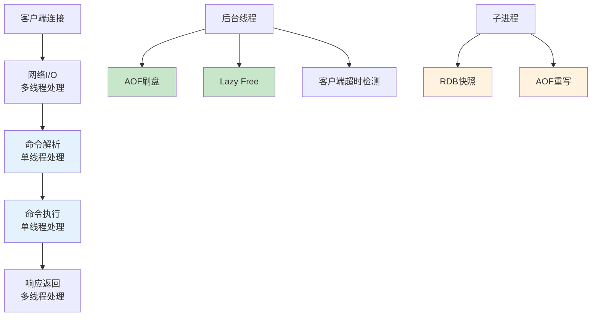
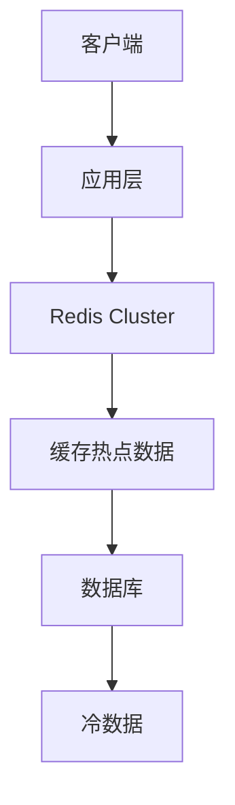

# Redis性能优化生产环境最佳实践：从线程模型到架构设计

## 情境(Situation)

在现代互联网架构中，Redis作为高性能的键值存储系统，广泛应用于缓存、会话管理、消息队列、排行榜等场景。Redis的性能神话与其独特的线程模型密切相关，但许多SRE工程师对Redis的线程模型存在误解，认为"单线程"就意味着性能有限。

事实上，Redis的核心处理确实是单线程的，但这正是其高性能的关键所在。理解Redis的线程模型，能帮你**合理使用Redis、避开性能陷阱、优化架构设计**，构建高可用的缓存系统。

## 冲突(Conflict)

许多SRE工程师在使用Redis时遇到以下挑战：

- **线程模型误解**：认为Redis是纯单线程，无法利用多核CPU
- **性能瓶颈**：不了解导致Redis性能下降的原因
- **数据结构选择**：不知道如何根据场景选择合适的数据结构
- **持久化策略**：难以平衡性能和数据安全
- **内存管理**：内存使用率过高或内存碎片
- **连接管理**：连接数过多导致性能下降

## 问题(Question)

如何正确理解Redis的线程模型，并通过合理的配置和使用，充分发挥Redis的性能潜力？

## 答案(Answer)

本文将从SRE视角出发，结合真实生产案例，提供一套完整的Redis性能优化生产环境最佳实践。核心方法论基于 [SRE面试题解析：Redis是单线程的吗？](#24-redis是单线程的吗)。

---

## 一、Redis线程模型深度解析

### 1.1 Redis线程模型架构

**Redis线程模型架构图**：



**Redis线程分工**：

| 组件 | 线程类型 | 职责 | 说明 |
|:-----|:---------|:-----|:-----|
| **网络I/O** | 多线程（6.0+） | 网络读写 | 6.0之前为单线程 |
| **命令解析** | 单线程 | 解析命令 | 事件循环处理 |
| **命令执行** | 单线程 | 执行命令 | 核心处理逻辑 |
| **后台任务** | 多线程 | 异步任务 | 持久化、删除等 |
| **子进程** | 多进程 | 持久化 | RDB、AOF重写 |

### 1.2 Redis版本演进

**Redis线程模型演进**：

| 版本 | 核心线程 | 后台线程 | 子进程 | 多线程I/O | 特点 |
|:-----|:---------|:---------|:--------|:-----------|:-----|
| **Redis 3.x** | 单线程 | 无 | 有 | 无 | 纯单线程 |
| **Redis 4.x** | 单线程 | 有（Lazy Free） | 有 | 无 | 引入后台线程 |
| **Redis 5.x** | 单线程 | 增强 | 有 | 无 | Stream数据结构 |
| **Redis 6.0+** | 单线程 | 增强 | 有 | 可选 | 多线程I/O |
| **Redis 7.0+** | 单线程 | 进一步增强 | 有 | 稳定 | 多线程I/O稳定 |

### 1.3 为什么Redis选择单线程

**核心优势**：

1. **避免锁竞争**：
   - 单线程无需考虑并发访问数据时的锁问题
   - 避免了锁的开销和死锁风险
   - 代码简单，易于维护和调试

2. **无上下文切换**：
   - 单线程无需频繁切换CPU时间片
   - 避免了上下文切换的开销
   - 更好地利用CPU缓存

3. **原子操作**：
   - 所有操作都是原子的
   - 简化了事务处理
   - 更容易实现分布式锁

4. **高效数据结构**：
   - Redis内部数据结构经过高度优化
   - 单线程也能达到极高的吞吐量
   - 内存操作本身就是非常快的

**性能瓶颈**：

- **CPU密集型操作**：如排序、聚合操作
- **大键操作**：如SMEMBERS、HGETALL
- **持久化操作**：fork时的阻塞
- **网络I/O**：高并发下的网络传输

### 1.4 Redis 6.0+多线程I/O

**多线程I/O配置**：

```bash
# redis.conf
io-threads 4            # 线程数（建议为CPU核心数/2到核心数）
io-threads-do-reading yes  # 开启多线程读

# 注意：命令执行仍然是单线程的
# 多线程只用于网络I/O的读写
```

**适用场景**：
- 高并发读取场景
- 大value场景
- 高带宽网络环境

**不适用场景**：
- CPU密集型操作
- 低并发场景（额外开销）
- 小value场景

---

## 二、Redis性能优化

### 2.1 避免阻塞命令

**高危命令列表**：

| 命令 | 风险 | 替代方案 |
|:-----|:-----|:----------|
| `KEYS` | O(n)，阻塞所有操作 | `SCAN` 分批获取 |
| `FLUSHALL` | O(n)，清空所有数据 | 避免使用，或用UNLINK |
| `FLUSHDB` | O(n)，清空当前数据库 | 避免使用 |
| `SMEMBERS` | O(n)，返回集合所有成员 | 使用SRANDMEMBER |
| `HGETALL` | O(n)，返回哈希所有字段 | 只获取需要的字段 |
| `LRANGE 0 -1` | O(n)，返回列表所有元素 | 指定范围 |
| `SINTER` | O(n*m)，交集运算 | 限制集合大小 |

**安全命令示例**：

```bash
# 使用SCAN代替KEYS
SCAN 0 MATCH user:* COUNT 100
SCAN 0 MATCH product:* COUNT 100

# 使用UNLINK代替DEL
UNLINK user:session:12345
UNLINK key:that:exists:in:large:quantity

# 使用LRANGE指定范围
LRANGE mylist 0 99    # 获取前100个
LRANGE mylist -100 -1  # 获取后100个

# 使用 SSCAN代替SMEMBERS
SSCAN myset 0 COUNT 100
```

### 2.2 Pipeline和事务

**Pipeline使用**：

```bash
# 普通执行（多次网络往返）
SET key1 value1
GET key1
SET key2 value2
GET key2

# Pipeline执行（一次网络往返）
Pipeline:
  SET key1 value1
  GET key1
  SET key2 value2
  GET key2
```

**Python Pipeline示例**：

```python
import redis

r = redis.Redis(host='localhost', port=6379)

# 使用Pipeline减少网络往返
pipe = r.pipeline()
pipe.set('key1', 'value1')
pipe.get('key1')
pipe.set('key2', 'value2')
pipe.get('key2')
results = pipe.execute()

print(results)  # [True, 'value1', True, 'value2']
```

**事务使用**：

```python
# 使用事务保证原子性
pipe = r.pipeline(transaction=True)
pipe.set('key1', 'value1')
pipe.incr('counter')
pipe.set('key2', 'value2')
pipe.execute()  # 原子执行
```

**Lua脚本**：

```lua
-- 原子执行的Lua脚本
local key = KEYS[1]
local value = redis.call('GET', key)
if value then
    redis.call('DEL', key)
    return 1
else
    return 0
end
```

### 2.3 数据结构选择

**数据结构对比**：

| 数据结构 | 时间复杂度 | 适用场景 | 内存效率 | 注意事项 |
|:---------|:-----------|:---------|:---------|:----------|
| **String** | O(1) | 简单缓存 | 低（简单存储） | value大小控制 |
| **Hash** | O(1) | 对象存储 | 中 | field数量控制 |
| **List** | O(1)/O(n) | 队列、列表 | 高 | 长度控制 |
| **Set** | O(1)/O(n) | 去重、交集 | 中 | 成员数量控制 |
| **Sorted Set** | O(log n) | 排行榜、有序 | 低 | 成员数量控制 |
| **HyperLogLog** | O(1) | 基数统计 | 极高 | 精度有限 |
| **Bitmap** | O(1) | 位操作、签到 | 极高 | 位偏移量 |
| **Geospatial** | O(log n) | 地理位置 | 中 | 距离计算 |

**最佳实践**：

```bash
# String：存储少量数据（value < 10KB）
SET product:info:1001 '{"name":"iPhone","price":6999}'
GET product:info:1001

# Hash：存储对象（field数量 < 1000）
HSET user:1001 name "John" email "john@example.com" age "30"
HGET user:1001 name
HGETALL user:1001

# List：适合队列（长度控制 < 10000）
LPUSH task:queue '{"task":"job1"}'
BRPOP task:queue 0  # 阻塞等待

# Set：适合去重和交集（成员数量 < 10000）
SADD user:1001:tags "java" "redis" "mysql"
SISMEMBER user:1001:tags "java"

# Sorted Set：适合排行榜（成员数量控制）
ZADD leaderboard 1000 "user1" 999 "user2" 998 "user3"
ZREVRANGE leaderboard 0 9 WITHSCORES

# HyperLogLog：适合基数统计
PFADD page:views:20240101 "192.168.1.1" "192.168.1.2"
PFCOUNT page:views:20240101

# Bitmap：适合签到、状态位
SETBIT user:1001:checkin:2024 0 1  # 1月1日签到
BITCOUNT user:1001:checkin:2024   # 统计签到天数
```

### 2.4 内存优化

**内存配置**：

```bash
# redis.conf
maxmemory 4gb              # 最大内存
maxmemory-policy allkeys-lru  # 内存淘汰策略
maxmemory-samples 5          # LRU样本数

# 内存淘汰策略
# noeviction：不淘汰，返回错误
# allkeys-lru：所有key中删除最近最少使用
# volatile-lru：有过期时间的key中删除最近最少使用
# allkeys-random：所有key中随机删除
# volatile-random：有过期时间的key中随机删除
# volatile-ttl：有过期时间的key中删除剩余TTL最短的
# allkeys-lfu：所有key中删除最不经常使用
# volatile-lfu：有过期时间的key中删除最不经常使用
```

**内存碎片整理**：

```bash
# 开启主动碎片整理
activedefrag yes
active-defrag-ignore-bytes 100mb
active-defrag-threshold-lower 10
active-defrag-threshold-upper 100

# 手动触发
DEBUG SEGFAULT  # 触发内存重分配（不推荐生产环境）
```

**内存优化技巧**：

```bash
# 使用压缩数据结构
hash-max-ziplist-entries 512
hash-max-ziplist-value 64
list-max-ziplist-size -2
set-max-intset-entries 512
zset-max-ziplist-entries 128
zset-max-ziplist-value 64

# 使用短字符串
SET user:1:name "John"      # 短字符串
HSET user:1 name "John"     # Hash字段

# 避免大键
# 存储大对象时使用压缩
SET big:data:1 "compressed..."
```

### 2.5 连接优化

**连接配置**：

```bash
# redis.conf
maxclients 10000              # 最大客户端数
timeout 300                    # 客户端超时（秒）
tcp-keepalive 60              # TCP保活
tcp-backlog 511               # TCP backlog队列

# 客户端连接池配置（Python示例）
import redis
pool = redis.ConnectionPool(
    max_connections=50,
    host='localhost',
    port=6379
)
r = redis.Redis(connection_pool=pool)
```

**连接优化策略**：

```python
# 使用连接池
pool = redis.ConnectionPool(
    max_connections=100,
    host='localhost',
    port=6379,
    decode_responses=True
)

# 使用Pipeline减少连接创建
pipe = pool.pipeline()
for i in range(1000):
    pipe.set(f'key:{i}', f'value:{i}')
pipe.execute()

# 使用SCAN代替KEYS减少连接时间
for key in r.scan_iter('user:*', count=100):
    # 处理每个key
    pass
```

---

## 三、Redis持久化策略

### 3.1 RDB持久化

**RDB配置**：

```bash
# redis.conf
save 900 1      # 900秒内至少有1个key变化
save 300 10     # 300秒内至少有10个key变化
save 60 10000   # 60秒内至少有10000个key变化

stop-writes-on-bgsave-error yes
rdbcompression yes
rdbchecksum yes
dbfilename dump.rdb
dir /var/lib/redis
```

**RDB优点**：
- 紧凑的二进制文件，适合备份
- 恢复速度快
- fork子进程，不阻塞主线程

**RDB缺点**：
- 可能丢失最后一次快照后的数据
- fork时可能阻塞主线程
- 大数据量时fork时间长

**RDB操作命令**：

```bash
# 手动触发RDB快照
BGSAVE  # 后台异步保存

# 查看RDB保存状态
LASTSAVE  # 返回Unix时间戳
INFO persistence

# 恢复数据
# 只需将dump.rdb文件放入dir配置目录
```

### 3.2 AOF持久化

**AOF配置**：

```bash
# redis.conf
appendonly yes
appendfilename "appendonly.aof"
appendfsync everysec  # everysec: 每秒同步（推荐）
# appendfsync always   # 每次写入同步（性能差）
# appendfsync no      # 由操作系统决定（可能丢失数据）

no-appendfsync-on-rewrite yes
auto-aof-rewrite-percentage 100
auto-aof-rewrite-min-size 64mb
aof-load-truncated yes
aof-use-rdb-preamble yes  # 混合持久化
```

**AOF优点**：
- 数据安全性更高
- 支持混合持久化
- 易于理解和修改

**AOF缺点**：
- 文件比RDB大
- 可能比RDB慢
- 恢复速度比RDB慢

**AOF重写**：

```bash
# 手动触发AOF重写
BGREWRITEAOF

# 查看AOF状态
INFO persistence
```

### 3.3 混合持久化

**混合持久化配置**：

```bash
# redis.conf
appendonly yes
appendfsync everysec
aof-use-rdb-preamble yes  # 开启混合持久化
```

**混合持久化流程**：

1. AOF重写时，先以RDB格式写入AOF文件头部
2. 然后追加Redis命令到AOF文件
3. 恢复时先加载RDB部分，再执行后续命令

**混合持久化优势**：
- 快速恢复（RDB部分）
- 数据完整性（AOF部分）
- 文件紧凑（RDB压缩）

### 3.4 持久化策略选择

**策略对比**：

| 策略 | 优点 | 缺点 | 适用场景 |
|:-----|:-----|:-----|:----------|
| **RDB** | 紧凑、快速 | 可能丢数据 | 缓存、备份 |
| **AOF everysec** | 平衡安全和性能 | 比RDB慢 | 一般生产环境 |
| **AOF always** | 数据最安全 | 性能差 | 关键数据 |
| **混合持久化** | 综合优势 | 配置复杂 | 生产环境推荐 |

**推荐配置**：

```bash
# 生产环境推荐配置
# RDB + AOF混合持久化
save 900 1
save 300 10
save 60 10000

appendonly yes
appendfsync everysec
aof-use-rdb-preamble yes
aof-load-truncated yes
```

---

## 四、Redis高可用架构

### 4.1 Redis Sentinel

**Sentinel架构**：

```
+----------------+
|   客户端        |
+----------------+
       |
       v
+----------------+
| Sentinel集群    |  (3个Sentinel节点)
+----------------+
       |
       v
+----------------+    +----------------+
|   Master        |<-->|   Slave1       |
+----------------+    +----------------+
       |
       v
+----------------+
|   Slave2        |
+----------------+
```

**Sentinel配置**：

```bash
# sentinel-1.conf
port 26379
sentinel monitor mymaster 127.0.0.1 6379 2
sentinel down-after-milliseconds mymaster 5000
sentinel parallel-syncs mymaster 1
sentinel failover-timeout mymaster 180000
```

**Sentinel管理命令**：

```bash
# 查看Sentinel状态
redis-cli -p 26379 INFO

# 查看主节点
redis-cli -p 26379 SENTINEL get-master-addr-by-name mymaster

# 手动故障转移
redis-cli -p 26379 SENTINEL failover mymaster
```

### 4.2 Redis Cluster

**Cluster架构**：

```
                    +----------------+
                    |   客户端        |
                    +----------------+
                           |
         +-----------------+-----------------+
         |                 |                 |
         v                 v                 v
   +-----------+     +-----------+     +-----------+
   | Slot 0-5460|     |Slot 5461-10922|Slot 10923-16383|
   +-----------+     +-----------+     +-----------+
         |                 |                 |
         v                 v                 v
   +-----------+     +-----------+     +-----------+
   | Master1    |<-->| Master2    |<-->| Master3    |
   +-----------+     +-----------+     +-----------+
   | Slave1     |     | Slave2     |     | Slave3     |
   +-----------+     +-----------+     +-----------+
```

**Cluster配置**：

```bash
# redis.conf
cluster-enabled yes
cluster-config-file nodes-6379.conf
cluster-node-timeout 15000
cluster-replica-validity-factor 10
cluster-migration-barrier 1
```

**Cluster管理命令**：

```bash
# 创建集群
redis-cli --cluster create 127.0.0.1:7000 127.0.0.1:7001 127.0.0.1:7002 \
  --cluster-replicas 1

# 查看集群状态
redis-cli -p 7000 cluster info

# 查看节点
redis-cli -p 7000 cluster nodes

# 重新分片
redis-cli --cluster reshard 127.0.0.1:7000

# 故障转移
redis-cli -p 7001 cluster failover
```

### 4.3 高可用方案选择

**方案对比**：

| 方案 | 数据分片 | 自动故障转移 | 客户端支持 | 适用场景 |
|:-----|:---------|:-------------|:-----------|:----------|
| **主从复制** | 否 | 否 | 简单 | 小规模部署 |
| **Sentinel** | 否 | 是 | 需适配 | 中等规模 |
| **Cluster** | 是 | 是 | 需适配 | 大规模部署 |

**选择建议**：
- **< 10台Redis**：主从 + Sentinel
- **10-100台Redis**：Redis Cluster
- **> 100台Redis**：多个Redis Cluster

---

## 五、Redis安全配置

### 5.1 认证配置

```bash
# redis.conf
requirepass yourStrongPassword
```

**连接方式**：

```bash
# 方法1：命令行认证
redis-cli -a yourStrongPassword

# 方法2：连接后认证
redis-cli
AUTH yourStrongPassword

# 方法3：配置文件认证（推荐）
CONFIG SET requirepass yourStrongPassword
```

### 5.2 网络安全

```bash
# redis.conf
bind 127.0.0.1 192.168.1.100  # 绑定IP
port 6379
protected-mode yes              # 保护模式

# 防火墙配置
iptables -A INPUT -s 192.168.1.0/24 -p tcp --dport 6379 -j ACCEPT
iptables -A INPUT -p tcp --dport 6379 -j DROP
```

### 5.3 危险命令禁用

```bash
# redis.conf
rename-command FLUSHALL ""
rename-command FLUSHDB ""
rename-command CONFIG "CONFIG_9e829e09e8e9e8e9"
rename-command KEYS "KEYS_9e829e09e8e9e8e9"
```

---

## 六、监控与故障排查

### 6.1 关键监控指标

**Redis INFO命令**：

```bash
# 查看所有信息
INFO

# 查看特定 section
INFO memory
INFO stats
INFO replication
INFO clients
INFO persistence
```

**关键指标**：

| 指标 | 说明 | 告警阈值 |
|:-----|:-----|:---------|
| `used_memory` | 已使用内存 | > maxmemory * 80% |
| `connected_clients` | 连接数 | > maxclients * 80% |
| `blocked_clients` | 阻塞客户端数 | > 0 |
| `rejected_connections` | 拒绝连接数 | > 0 |
| `slowlog_len` | 慢查询数 | > 100 |
| `mem_fragmentation_ratio` | 内存碎片率 | > 1.5 |

### 6.2 慢查询日志

```bash
# 配置慢查询
slowlog-log-slower-than 10000  # 10ms
slowlog-max-len 128

# 查看慢查询
SLOWLOG GET 10
SLOWLOG LEN
SLOWLOG RESET
```

### 6.3 常见故障排查

**故障排查流程**：

| 症状 | 可能原因 | 排查命令 | 解决方案 |
|:-----|:---------|:---------|:----------|
| **响应慢** | 阻塞命令 | SLOWLOG GET | 避免使用KEYS等 |
| **OOM** | 内存不足 | INFO memory | 调整maxmemory |
| **连接拒绝** | 连接数满 | INFO clients | 调整maxclients |
| **数据丢失** | 持久化配置 | INFO persistence | 调整持久化策略 |
| **复制延迟** | 网络或负载 | INFO replication | 优化网络或减少负载 |
| **fork失败** | 内存不足 | INFO stats | 增加内存或减少fork |

**故障恢复流程**：

1. **确认故障**：查看日志和监控
2. **切换服务**：使用Sentinel或Cluster自动切换
3. **数据恢复**：根据持久化文件恢复
4. **服务验证**：验证数据完整性和服务正常
5. **故障分析**：根因分析并制定改进措施

---

## 七、最佳实践总结

### 7.1 配置建议

**生产环境配置**：

```bash
# 内存配置
maxmemory 4gb
maxmemory-policy allkeys-lru

# 持久化配置
save 900 1
save 300 10
save 60 10000
appendonly yes
appendfsync everysec
aof-use-rdb-preamble yes

# 连接配置
maxclients 10000
timeout 300
tcp-keepalive 60

# 安全配置
requirepass yourStrongPassword
bind 127.0.0.1 <your_ip>
protected-mode yes

# 慢查询配置
slowlog-log-slower-than 10000
slowlog-max-len 128
```

### 7.2 开发规范

**开发规范**：

1. **Key设计**：
   - 使用有意义的命名： `user:session:{user_id}`
   - 避免大Key：value大小 < 10KB
   - 设置过期时间：TTL要合理

2. **命令使用**：
   - 使用Pipeline批量操作
   - 使用Scan代替Keys
   - 使用Unlink代替Del

3. **连接管理**：
   - 使用连接池
   - 合理设置超时
   - 及时释放连接

4. **监控运维**：
   - 监控关键指标
   - 定期备份数据
   - 记录慢查询

### 7.3 架构设计建议

**缓存架构**：



**高可用架构**：
- **小规模**：主从 + Sentinel
- **大规模**：Redis Cluster
- **混合部署**：缓存 + 持久化分离

---

## 总结

Redis的"单线程"设计是其高性能的关键，通过避免锁竞争和上下文切换，Redis能够达到极高的吞吐量。但理解Redis的线程模型，正确使用数据结构和命令，合理配置持久化和内存策略，才能真正发挥Redis的性能潜力。

**核心要点**：

1. **线程模型**：Redis核心单线程，但后台有多线程和子进程
2. **避免阻塞**：使用Scan代替Keys，使用Unlink代替Del
3. **数据结构**：根据场景选择合适的数据结构
4. **内存管理**：合理配置maxmemory和淘汰策略
5. **持久化策略**：推荐混合持久化
6. **高可用**：使用Sentinel或Cluster保证高可用
7. **监控运维**：持续监控关键指标，及时处理故障

> **延伸学习**：更多面试相关的Redis知识，请参考 [SRE面试题解析：Redis是单线程的吗？](#24-redis是单线程的吗)。

---

## 参考资料

- [Redis官方文档](https://redis.io/documentation)
- [Redis线程模型](https://redis.io/topics/threaded-io)
- [Redis性能优化](https://redis.io/topics/performance)
- [Redis持久化](https://redis.io/topics/persistence)
- [Redis安全](https://redis.io/topics/security)
- [Redis Sentinel](https://redis.io/topics/sentinel)
- [Redis Cluster](https://redis.io/topics/cluster-tutorial)
- [Redis配置](https://redis.io/topics/config)
- [Redis数据类型](https://redis.io/topics/data-types)
- [Redis命令](https://redis.io/commands)
- [Redis监控](https://redis.io/topics/monitoring)
- [Redis内存优化](https://redis.io/topics/memory-optimization)
- [Redis复制](https://redis.io/topics/replication)
- [Redis过期策略](https://redis.io/topics/lru-cache)
- [Redis最佳实践](https://redis.io/topics/latency)