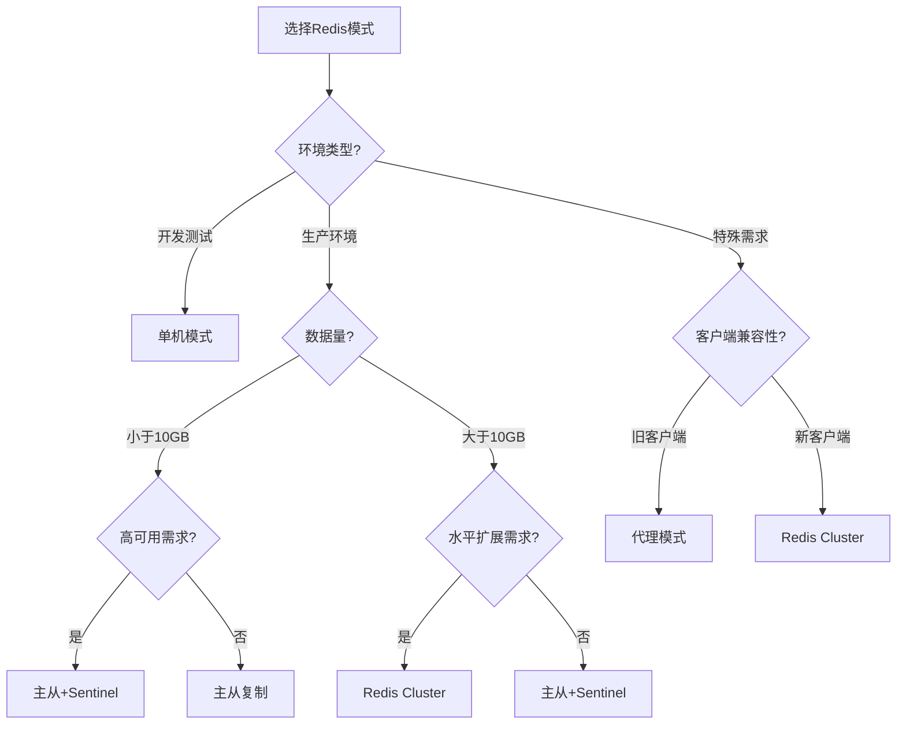

# Redis工作模式生产环境最佳实践：从单机到集群的完整指南

## 情境(Situation)

在企业级应用中，Redis的部署模式选择直接影响系统的性能、可用性和可扩展性。从简单的单机部署到复杂的集群架构，Redis提供了多种工作模式以满足不同场景的需求。

然而，许多SRE工程师在选择Redis工作模式时，往往面临以下挑战：如何根据业务规模和需求选择合适的部署模式？不同模式的配置和维护要点是什么？如何确保系统的高可用性和扩展性？

## 冲突(Conflict)

在Redis工作模式选择中，SRE工程师经常遇到以下矛盾：

- **简单性 vs 高可用性**：单机模式部署简单，但缺乏高可用性；集群模式高可用，但配置复杂
- **性能 vs 扩展性**：主从复制提升读性能，但无法水平扩展；Cluster模式支持水平扩展，但增加了系统复杂度
- **成本 vs 可靠性**：更多的节点意味着更高的成本，但也带来更高的可靠性
- **维护复杂度 vs 功能需求**：不同模式的维护复杂度不同，需要根据实际需求平衡

## 问题(Question)

如何深入理解Redis的各种工作模式，根据业务场景选择合适的部署架构，并在生产环境中实现最佳配置和维护？

## 答案(Answer)

本文将从SRE视角出发，深入分析Redis的各种工作模式，提供详细的配置指南和最佳实践，并结合真实生产案例，帮助你做出明智的部署架构选择。核心方法论基于 [SRE面试题解析：Redis的工作模式](#30-redis的工作模式有哪些)。

---

## 一、Redis工作模式概述

### 1.1 工作模式分类

Redis提供以下五种主要工作模式：

| 模式 | 架构 | 核心特点 | 适用场景 |
|:------:|:------:|:----------:|:----------|
| **单机模式** | 单节点 | 部署简单，无HA | 开发测试环境 |
| **主从复制** | 一主多从 | 读写分离，手动故障切换 | 读多写少场景 |
| **主从+Sentinel** | 主从+哨兵 | 自动故障转移，高可用 | 生产环境 |
| **Redis Cluster** | 多主多从 | 水平扩展，自动分片 | 大规模应用 |
| **代理模式** | 代理+多实例 | 简化客户端管理 | 兼容旧客户端 |

### 1.2 架构演进

**Redis架构演进路径**：

1. **单机模式** → 2. **主从复制** → 3. **主从+Sentinel** → 4. **Redis Cluster**

**演进原因**：
- **性能需求**：读写分离提升读性能
- **高可用需求**：自动故障转移确保服务持续可用
- **扩展性需求**：数据分片支持大规模数据
- **可靠性需求**：多副本确保数据安全

---

## 二、单机模式

### 2.1 架构特点

**架构**：单个Redis实例

**核心特点**：
- 部署简单，配置最少
- 无高可用机制
- 性能受单节点限制
- 适合开发测试环境

### 2.2 配置与部署

**基本配置**：

```bash
# redis.conf 单机模式配置
port 6379
dir /var/lib/redis
maxmemory 2gb
maxmemory-policy allkeys-lru
dbfilename dump.rdb
save 3600 1 300 100 60 10000
appendonly yes
appendfsync everysec
```

**部署命令**：

```bash
# 启动Redis服务
systemctl start redis

# 验证服务状态
systemctl status redis

# 测试连接
redis-cli ping
```

### 2.3 适用场景

- **开发环境**：快速部署，便于开发测试
- **测试环境**：功能验证，性能测试
- **小型应用**：低流量、非关键业务
- **临时环境**：短期使用，快速搭建

---

## 三、主从复制

### 3.1 架构特点

**架构**：一主多从

**核心特点**：
- 主节点负责写操作
- 从节点负责读操作
- 数据自动同步
- 手动故障切换

**复制原理**：
1. 从节点连接主节点，发送SYNC命令
2. 主节点生成RDB文件并发送给从节点
3. 从节点加载RDB文件
4. 主节点持续发送写命令到从节点
5. 从节点执行这些命令，保持数据同步

### 3.2 配置与部署

**主节点配置**：

```bash
# redis.conf 主节点配置
port 6379
bind 0.0.0.0
dir /var/lib/redis
appendonly yes
appendfsync everysec
```

**从节点配置**：

```bash
# redis.conf 从节点配置
port 6380
bind 0.0.0.0
dir /var/lib/redis-slave
replicaof 192.168.1.100 6379  # 主节点IP和端口
replica-read-only yes  # 从节点只读
```

**部署步骤**：

1. **启动主节点**：
   ```bash
   redis-server /etc/redis/redis.conf
   ```

2. **启动从节点**：
   ```bash
   redis-server /etc/redis/redis-slave.conf
   ```

3. **验证复制状态**：
   ```bash
   # 在主节点执行
   redis-cli info replication
   
   # 在从节点执行
   redis-cli -p 6380 info replication
   ```

### 3.3 读写分离

**客户端配置**：

```python
import redis

# 主节点（写操作）
master_client = redis.Redis(host='192.168.1.100', port=6379, db=0)

# 从节点（读操作）
slave_clients = [
    redis.Redis(host='192.168.1.101', port=6380, db=0),
    redis.Redis(host='192.168.1.102', port=6381, db=0)
]

# 写操作使用主节点
def write_data(key, value):
    return master_client.set(key, value)

# 读操作轮询使用从节点
import random
def read_data(key):
    client = random.choice(slave_clients)
    return client.get(key)
```

### 3.4 适用场景

- **读多写少**：如新闻网站、内容管理系统
- **数据备份**：从节点作为备份
- **负载均衡**：分散读请求
- **故障恢复**：主节点故障时手动切换到从节点

---

## 四、主从+Sentinel

### 4.1 架构特点

**架构**：主从复制 + Sentinel集群

**核心特点**：
- 自动故障转移
- 监控主从状态
- 配置中心功能
- 高可用性保障

**Sentinel工作原理**：
1. **监控**：定期检查主从节点状态
2. **通知**：当节点异常时发送通知
3. **自动故障转移**：主节点故障时选举新主节点
4. **配置更新**：更新客户端配置

### 4.2 配置与部署

**Sentinel配置**：

```bash
# sentinel.conf
port 26379
dir /tmp
sentinel monitor mymaster 192.168.1.100 6379 2  # 主节点监控，需要2个Sentinel同意故障判断
sentinel down-after-milliseconds mymaster 30000  # 30秒无响应视为下线
sentinel failover-timeout mymaster 180000  # 故障转移超时时间
sentinel parallel-syncs mymaster 1  # 故障转移后，从节点同步主节点的并发数
```

**部署步骤**：

1. **部署主从复制**：参考主从复制部分

2. **部署Sentinel**：
   ```bash
   # 启动3个Sentinel实例
   redis-sentinel /etc/redis/sentinel1.conf
   redis-sentinel /etc/redis/sentinel2.conf
   redis-sentinel /etc/redis/sentinel3.conf
   ```

3. **验证Sentinel状态**：
   ```bash
   redis-cli -p 26379 info sentinel
   ```

### 4.3 客户端连接

**Python客户端连接**：

```python
import redis
from redis.sentinel import Sentinel

# 连接Sentinel
sentinel = Sentinel([
    ('192.168.1.100', 26379),
    ('192.168.1.101', 26379),
    ('192.168.1.102', 26379)
], socket_timeout=0.1)

# 获取主节点和从节点
def get_master_client():
    master_address = sentinel.discover_master('mymaster')
    return redis.Redis(host=master_address[0], port=master_address[1])

def get_slave_client():
    slave_addresses = sentinel.discover_slaves('mymaster')
    if slave_addresses:
        slave_address = random.choice(slave_addresses)
        return redis.Redis(host=slave_address[0], port=slave_address[1])
    return None

# 写操作使用主节点
master_client = get_master_client()
master_client.set('key', 'value')

# 读操作使用从节点slave_client = get_slave_client()
if slave_client:
    print(slave_client.get('key'))
```

### 4.4 故障转移流程

**故障转移步骤**：

1. **检测故障**：Sentinel检测到主节点下线
2. **选举领导者**：Sentinel集群选举领导者
3. **选择新主节点**：从从节点中选择最合适的节点作为新主节点
4. **执行故障转移**：
   - 让选中的从节点停止复制，成为主节点
   - 让其他从节点复制新主节点
   - 更新Sentinel配置
5. **通知客户端**：客户端通过Sentinel发现新主节点

### 4.5 适用场景

- **生产环境**：需要高可用性的业务系统
- **关键业务**：不能接受服务中断的应用
- **中等规模**：数据量小于10GB的场景
- **需要自动故障转移**：减少人工干预

---

## 五、Redis Cluster

### 5.1 架构特点

**架构**：多主多从，数据分片

**核心特点**：
- 数据自动分片到多个主节点
- 每个主节点有多个从节点
- 自动故障转移
- 水平扩展能力
- 支持1000+节点

**数据分片原理**：
- Redis Cluster将整个键空间分为16384个哈希槽
- 每个主节点负责一部分哈希槽
- 客户端根据键的哈希值确定所属槽位，直接访问对应节点

### 5.2 配置与部署

**Redis Cluster配置**：

```bash
# redis.conf 集群节点配置
port 7000
bind 0.0.0.0
dir /var/lib/redis-cluster/node1
cluster-enabled yes
cluster-config-file nodes.conf
cluster-node-timeout 15000
appendonly yes
appendfsync everysec
```

**部署步骤**：

1. **准备节点**：
   ```bash
   # 创建6个节点目录
   mkdir -p /var/lib/redis-cluster/node{1..6}
   
   # 复制配置文件
   for i in {1..6}; do
       cp /etc/redis/redis.conf /var/lib/redis-cluster/node$i/
       sed -i "s/port 6379/port 700$i/" /var/lib/redis-cluster/node$i/redis.conf
       sed -i "s|dir /var/lib/redis|dir /var/lib/redis-cluster/node$i|" /var/lib/redis-cluster/node$i/redis.conf
       sed -i "s/cluster-enabled no/cluster-enabled yes/" /var/lib/redis-cluster/node$i/redis.conf
   done
   ```

2. **启动节点**：
   ```bash
   for i in {1..6}; do
       redis-server /var/lib/redis-cluster/node$i/redis.conf
   done
   ```

3. **创建集群**：
   ```bash
   redis-cli --cluster create \
       127.0.0.1:7001 127.0.0.1:7002 127.0.0.1:7003 \
       127.0.0.1:7004 127.0.0.1:7005 127.0.0.1:7006 \
       --cluster-replicas 1
   ```

4. **验证集群状态**：
   ```bash
   redis-cli -c -p 7001 cluster info
   redis-cli -c -p 7001 cluster nodes
   ```

### 5.3 客户端连接

**Python客户端连接**：

```python
import rediscluster

# 连接Redis Cluster
startup_nodes = [
    {'host': '192.168.1.100', 'port': 7001},
    {'host': '192.168.1.100', 'port': 7002},
    {'host': '192.168.1.100', 'port': 7003}
]

# 创建集群客户端
rc = rediscluster.RedisCluster(
    startup_nodes=startup_nodes,
    decode_responses=True
)

# 操作集群
rc.set('key', 'value')
print(rc.get('key'))

# 查看集群信息
print(rc.cluster_info())
print(rc.cluster_nodes())
```

### 5.4 水平扩展

**添加节点步骤**：

1. **启动新节点**：
   ```bash
   # 启动新的主节点
   redis-server /var/lib/redis-cluster/node7/redis.conf
   
   # 启动新的从节点
   redis-server /var/lib/redis-cluster/node8/redis.conf
   ```

2. **添加主节点**：
   ```bash
   redis-cli --cluster add-node 127.0.0.1:7007 127.0.0.1:7001
   ```

3. **重新分片**：
   ```bash
   redis-cli --cluster reshard 127.0.0.1:7001
   ```

4. **添加从节点**：
   ```bash
   redis-cli --cluster add-node 127.0.0.1:7008 127.0.0.1:7001 --cluster-slave --cluster-master-id <master-node-id>
   ```

### 5.5 适用场景

- **大规模应用**：数据量超过10GB
- **高并发场景**：需要水平扩展
- **多租户环境**：需要数据隔离
- **云原生环境**：容器化部署

---

## 六、代理模式

### 6.1 架构特点

**架构**：代理 + 多Redis实例

**核心特点**：
- 客户端只与代理通信
- 代理处理节点发现和故障转移
- 简化客户端配置
- 支持旧客户端

**常用代理**：
- **Twemproxy**：Twitter开发，轻量级代理
- **Redis Cluster Proxy**：Redis官方代理
- **Codis**：豌豆荚开发，支持自动分片

### 6.2 配置与部署

**Twemproxy配置**：

```yaml
# nutcracker.yml
alpha:
  listen: 127.0.0.1:22121
  hash: fnv1a_64
  distribution: ketama
  auto_eject_hosts: true
  redis:
    servers:
    - 127.0.0.1:6379:1
    - 127.0.0.1:6380:1
```

**部署步骤**：

1. **安装Twemproxy**：
   ```bash
   apt-get install twemproxy
   ```

2. **配置Twemproxy**：
   ```bash
   cp nutcracker.yml /etc/twemproxy/
   ```

3. **启动Twemproxy**：
   ```bash
   service twemproxy start
   ```

4. **客户端连接**：
   ```bash
   redis-cli -p 22121
   ```

### 6.3 适用场景

- **旧客户端兼容**：不支持Cluster协议的客户端
- **简化配置**：客户端无需关心集群拓扑
- **统一入口**：所有Redis操作通过代理
- **监控集中**：代理提供统一监控

---

## 七、模式选择决策指南

### 7.1 决策树



### 7.2 选择建议

| 场景 | 推荐模式 | 原因 |
|:------:|:----------:|:------|
| **开发测试** | 单机模式 | 部署简单，快速搭建 |
| **小型生产** | 主从+Sentinel | 高可用，配置简单 |
| **中型生产** | 主从+Sentinel | 数据量适中，高可用 |
| **大型生产** | Redis Cluster | 水平扩展，支持大规模 |
| **读多写少** | 主从复制 | 读写分离，提升性能 |
| **旧客户端** | 代理模式 | 兼容旧系统 |
| **容器环境** | Redis Cluster | 云原生友好，易于扩展 |

---

## 八、生产环境最佳实践

### 8.1 硬件配置

**推荐配置**：

| 模式 | CPU | 内存 | 存储 | 网络 |
|:------:|:------:|:------:|:------:|:------:|
| **单机模式** | 2核 | 4GB | SSD 100GB | 千兆网卡 |
| **主从复制** | 4核 | 8GB+ | SSD 200GB | 千兆网卡 |
| **主从+Sentinel** | 4核 | 8GB+ | SSD 200GB | 千兆网卡 |
| **Redis Cluster** | 8核+ | 16GB+ | SSD 500GB+ | 万兆网卡 |

### 8.2 配置优化

**通用优化**：

```bash
# redis.conf 通用优化
maxmemory 80%  # 内存限制
maxmemory-policy allkeys-lru  # 内存淘汰策略
disable-thp yes  # 关闭透明大页
hz 10  # 降低频率，减少CPU使用
tcp-keepalive 60  # TCP保活
```

**主从复制优化**：

```bash
# 从节点优化
replica-serve-stale-data yes  # 从节点可提供过期数据
replica-read-only yes  # 从节点只读
repl-diskless-sync yes  # 无盘同步，减少I/O
repl-diskless-sync-delay 5  # 无盘同步延迟
repl-ping-replica-period 10  # 从节点 ping 主节点频率
```

**Sentinel优化**：

```bash
# sentinel.conf 优化
sentinel monitor mymaster 192.168.1.100 6379 2
sentinel down-after-milliseconds mymaster 30000
sentinel failover-timeout mymaster 180000
sentinel parallel-syncs mymaster 1
sentinel heartbeat-interval 1000  # 心跳间隔
```

**Redis Cluster优化**：

```bash
# redis.conf 集群优化
cluster-enabled yes
cluster-config-file nodes.conf
cluster-node-timeout 15000
cluster-require-full-coverage no  # 部分槽不可用时仍可提供服务
cluster-slave-validity-factor 10  # 从节点有效性因子
```

### 8.3 监控与告警

**关键监控指标**：

| 指标 | 描述 | 告警阈值 | 监控命令 |
|:-----|:-----|:---------|:----------|
| **uptime_in_seconds** | 运行时间 | <3600 | `info server` |
| **connected_clients** | 客户端连接数 | >1000 | `info clients` |
| **used_memory_rss** | 内存使用 | >90% maxmemory | `info memory` |
| **keyspace_hits/misses** | 缓存命中率 | <80% | `info stats` |
| **replication_delay** | 复制延迟 | >10s | `info replication` |
| **cluster_state** | 集群状态 | fail | `cluster info` |
| **sentinel_status** | Sentinel状态 | error | `info sentinel` |

**Prometheus监控**：

```yaml
# prometheus.yml
scrape_configs:
  - job_name: 'redis'
    static_configs:
      - targets: ['redis-exporter:9121']

  - job_name: 'redis-sentinel'
    static_configs:
      - targets: ['sentinel-exporter:9517']
```

**告警规则**：

```yaml
groups:
  - name: redis_alerts
    rules:
    - alert: RedisDown
      expr: redis_up == 0
      for: 5m
      labels:
        severity: critical
      annotations:
        summary: "Redis实例宕机"
        description: "Redis实例 {{ $labels.instance }} 已宕机超过5分钟"
    
    - alert: RedisMemoryUsageHigh
      expr: redis_memory_used_bytes / redis_memory_max_bytes > 0.8
      for: 10m
      labels:
        severity: warning
      annotations:
        summary: "Redis内存使用过高"
        description: "Redis实例 {{ $labels.instance }} 内存使用超过80%"
    
    - alert: RedisReplicationLag
      expr: redis_replication_offset_master - redis_replication_offset_replica > 10000
      for: 5m
      labels:
        severity: warning
      annotations:
        summary: "Redis复制延迟"
        description: "Redis从节点 {{ $labels.instance }} 复制延迟超过10000字节"
```

### 8.4 备份与恢复

**备份策略**：

1. **RDB备份**：
   ```bash
   # 每天凌晨2点执行备份
   0 2 * * * redis-cli BGSAVE && cp /var/lib/redis/dump.rdb /backup/redis/dump.rdb.$(date +%Y%m%d)
   ```

2. **AOF备份**：
   ```bash
   # 每天备份AOF文件
   0 3 * * * cp /var/lib/redis/appendonly.aof /backup/redis/appendonly.aof.$(date +%Y%m%d)
   ```

3. **Cluster备份**：
   ```bash
   # 备份所有节点
   for port in 7001 7002 7003 7004 7005 7006; do
       redis-cli -p $port BGSAVE
       sleep 60
       cp /var/lib/redis-cluster/node${port: -1}/dump.rdb /backup/redis-cluster/node${port: -1}_dump.rdb.$(date +%Y%m%d)
   done
   ```

**恢复流程**：

1. **单机模式恢复**：
   ```bash
   systemctl stop redis
   cp /backup/redis/dump.rdb /var/lib/redis/
   systemctl start redis
   ```

2. **主从模式恢复**：
   ```bash
   # 恢复主节点
   systemctl stop redis-master
   cp /backup/redis/dump.rdb /var/lib/redis/
   systemctl start redis-master
   
   # 重启从节点
   systemctl restart redis-slave
   ```

3. **Cluster模式恢复**：
   ```bash
   # 停止所有节点
   for port in 7001 7002 7003 7004 7005 7006; do
       redis-cli -p $port shutdown
   done
   
   # 恢复每个节点
   for port in 7001 7002 7003 7004 7005 7006; do
       cp /backup/redis-cluster/node${port: -1}_dump.rdb.$(date +%Y%m%d) /var/lib/redis-cluster/node${port: -1}/dump.rdb
   done
   
   # 启动所有节点
   for port in 7001 7002 7003 7004 7005 7006; do
       redis-server /var/lib/redis-cluster/node${port: -1}/redis.conf
   done
   ```

---

## 九、案例分析

### 9.1 案例1：电商平台Redis架构

**背景**：某电商平台，日交易量超过100万，Redis存储用户会话、购物车和商品缓存，数据量约8GB。

**挑战**：
- 高并发读写
- 服务高可用
- 数据安全
- 水平扩展

**解决方案**：
1. **架构选择**：主从+Sentinel
2. **部署**：
   - 1主2从
   - 3个Sentinel节点
   - 读写分离
3. **配置**：
   - 主节点：8核16GB内存
   - 从节点：4核8GB内存
   - SSD存储
4. **监控**：
   - Prometheus + Grafana
   - 实时监控复制状态
   - 自动告警

**实施效果**：
- 服务可用性：99.99%
- 响应时间：<10ms
- 故障恢复时间：<30秒
- 业务零中断

### 9.2 案例2：金融系统Redis架构

**背景**：某金融系统，Redis存储交易数据和用户会话，数据量约20GB，要求高可用和数据安全。

**挑战**：
- 数据一致性
- 高可用性
- 水平扩展
- 监管合规

**解决方案**：
1. **架构选择**：Redis Cluster
2. **部署**：
   - 3主3从
   - 数据分片
   - 跨机房部署
3. **配置**：
   - 每个节点：8核16GB内存
   - SSD存储
   - 万兆网络
4. **监控**：
   - 多维度监控
   - 异地灾备
   - 定期演练

**实施效果**：
- 服务可用性：99.999%
- 数据安全性：零丢失
- 水平扩展：支持50GB+数据
- 合规性：满足监管要求

---

## 总结

Redis的工作模式从单机到集群，提供了不同级别的可用性和扩展性。选择合适的工作模式需要根据业务需求、数据规模和性能要求综合考虑。

**核心要点**：

1. **单机模式**：适合开发测试环境，部署简单
2. **主从复制**：适合读多写少场景，提升读性能
3. **主从+Sentinel**：适合生产环境，提供高可用性
4. **Redis Cluster**：适合大规模应用，支持水平扩展
5. **代理模式**：适合旧客户端兼容，简化配置

通过本文的介绍，我们深入了解了Redis的各种工作模式及其最佳实践，希望能帮助你在生产环境中做出明智的架构选择，确保Redis系统的高性能、高可用和可扩展性。

> **延伸学习**：更多面试相关的Redis工作模式知识，请参考 [SRE面试题解析：Redis的工作模式](#30-redis的工作模式有哪些)。

---

## 参考资料

- [Redis官方文档 - 主从复制](https://redis.io/topics/replication)
- [Redis官方文档 - Sentinel](https://redis.io/topics/sentinel)
- [Redis官方文档 - Cluster](https://redis.io/topics/cluster-tutorial)
- [Redis官方文档 - 持久化](https://redis.io/topics/persistence)
- [Twemproxy官方文档](https://github.com/twitter/twemproxy)
- [Redis Cluster Proxy](https://github.com/RedisLabs/redis-cluster-proxy)
- [Codis官方文档](https://github.com/CodisLabs/codis)
- [Prometheus Redis Exporter](https://github.com/oliver006/redis_exporter)
- [Grafana Redis Dashboard](https://grafana.com/grafana/dashboards/763)
- [Redis性能优化](https://redis.io/topics/optimization)
- [Redis最佳实践](https://redis.io/topics/latency)
- [Linux系统调优](https://www.kernel.org/doc/Documentation/sysctl/vm.txt)
- [容器化部署Redis](https://kubernetes.io/docs/tasks/run-application/run-redis/)