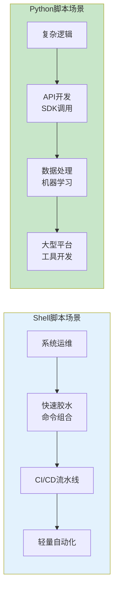
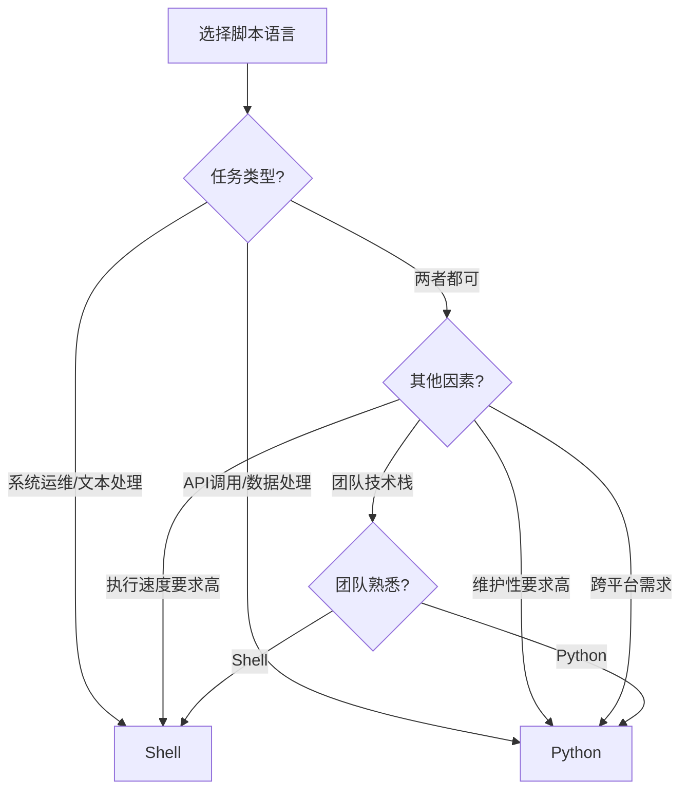
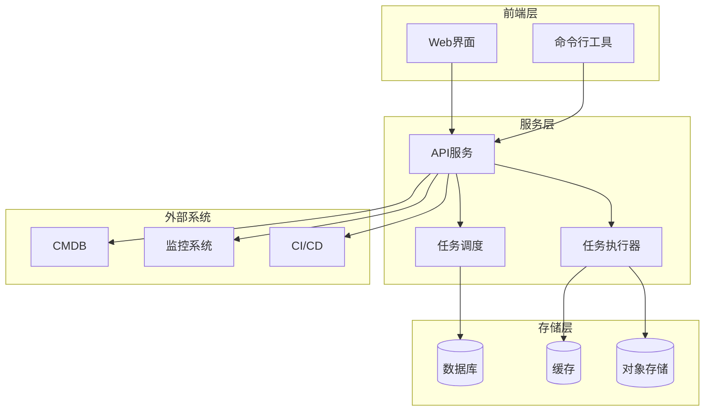

# 脚本开发生产环境最佳实践：从Shell到Python的自动化之路

## 情境(Situation)

在SRE的日常工作中，脚本开发是一项核心技能。Google SRE有句名言：**"If it's not automated, it's not scalable"**。脚本能力直接决定你能把多少重复劳动变成自动化，直接影响你的工作效率和职业价值。

脚本在生产环境中承担着重要职责：

- **日常运维**：日志分析、备份恢复、系统检查
- **故障排查**：快速定位问题、收集诊断信息
- **自动化部署**：应用发布、配置管理、环境搭建
- **监控告警**：自定义监控、告警通知、指标采集
- **数据处理**：日志统计、报表生成、数据分析
- **CI/CD**：流水线集成、代码检查、测试自动化

## 冲突(Conflict)

许多SRE工程师在脚本开发中遇到以下问题：

- **工具选择困难**：不知道什么时候用Shell，什么时候用Python
- **质量控制差**：脚本缺乏错误处理、日志记录、参数校验
- **可维护性低**：代码结构混乱、命名不规范、缺少文档
- **性能问题**：脚本执行效率低、资源占用高
- **安全性差**：硬编码密码、权限控制不当、注入风险
- **跨平台兼容性**：在不同环境下运行失败
- **缺少版本控制**：脚本管理混乱、难以追踪变更

## 问题(Question)

如何在生产环境中开发高质量、高可靠性的自动化脚本？

## 答案(Answer)

本文将从SRE视角出发，结合真实生产案例，提供一套完整的脚本开发生产环境最佳实践。核心方法论基于 [SRE面试题解析：脚本开发经验](#14-脚本开发经验)。

---

## 一、Shell vs Python 选择指南

### 1.1 适用场景对比



### 1.2 详细对比表

| 维度 | Shell | Python | 推荐场景 |
|:----:|:-------|:--------|:----------|
| **优势** | 系统命令集成、启动快、一行搞定 | 生态丰富、可读性强、可维护 | - |
| **劣势** | 复杂逻辑弱、跨平台差 | 启动慢、需要环境 | - |
| **擅长** | 文本处理、管道组合、定时任务 | API调用、数据处理、Web服务 | - |
| **性能** | 启动快、系统调用高效 | 计算密集型任务性能好 | - |
| **适用场景** | 日志分析、备份脚本、监控采集、系统维护 | CMDB同步、自动化平台、告警收敛、数据处理 | - |
| **学习曲线** | 低（基础命令）- 中（高级功能） | 中（基础）- 高（高级库） | - |
| **代表命令** | `grep`, `sed`, `awk`, `xargs`, `find` | `requests`, `pandas`, `argparse`, `logging` | - |
| **最佳实践** | 短小精悍、管道组合 | 模块化、面向对象 | - |

### 1.3 选择决策树



---

## 二、Shell脚本最佳实践

### 2.1 基础规范

**文件头规范**：

```bash
#!/bin/bash
# 脚本名称: backup.sh
# 描述: 系统备份脚本
# 作者: SRE Team
# 日期: 2026-04-27
# 版本: 1.0.0
# 依赖: rsync, tar, gzip

set -euo pipefail
```

**核心选项说明**：

| 选项 | 含义 | 用途 |
|:-----|:-----|:-----|
| `-e` | 遇到错误立即退出 | 防止错误传播 |
| `-u` | 遇到未定义变量退出 | 防止变量错误 |
| `-o pipefail` | 管道中任一命令失败则整体失败 | 捕获管道错误 |

### 2.2 错误处理

**错误处理函数**：

```bash
# 错误处理函数
error_exit() {
    local error_msg="$1"
    local exit_code="${2:-1}"
    
    echo "[ERROR] $error_msg"
    log_error "$error_msg"
    
    # 清理工作
    cleanup
    
    exit "$exit_code"
}

# 清理函数
cleanup() {
    # 清理临时文件
    rm -f "$TEMP_FILE" 2>/dev/null
    
    # 清理锁文件
    rm -f "$LOCK_FILE" 2>/dev/null
}

# 捕获信号
trap cleanup SIGINT SIGTERM

# 使用示例
if ! command -v rsync >/dev/null 2>&1; then
    error_exit "rsync not found, please install it"
fi
```

### 2.3 日志记录

**日志函数**：

```bash
# 日志级别
LOG_LEVEL="INFO"  # DEBUG, INFO, WARNING, ERROR

# 日志文件
LOG_FILE="/var/log/backup.log"

# 确保日志目录存在
mkdir -p "$(dirname "$LOG_FILE")"

# 日志函数
log_debug() {
    if [[ "$LOG_LEVEL" == "DEBUG" ]]; then
        local msg="[DEBUG] $(date '+%Y-%m-%d %H:%M:%S') $*"
        echo "$msg"
        echo "$msg" >> "$LOG_FILE"
    fi
}

log_info() {
    if [[ "$LOG_LEVEL" =~ ^(DEBUG|INFO)$ ]]; then
        local msg="[INFO] $(date '+%Y-%m-%d %H:%M:%S') $*"
        echo "$msg"
        echo "$msg" >> "$LOG_FILE"
    fi
}

log_warning() {
    if [[ "$LOG_LEVEL" =~ ^(DEBUG|INFO|WARNING)$ ]]; then
        local msg="[WARNING] $(date '+%Y-%m-%d %H:%M:%S') $*"
        echo "$msg"
        echo "$msg" >> "$LOG_FILE"
    fi
}

log_error() {
    local msg="[ERROR] $(date '+%Y-%m-%d %H:%M:%S') $*"
    echo "$msg"
    echo "$msg" >> "$LOG_FILE"
}

# 使用示例
log_info "开始备份任务"
log_debug "备份源: $SOURCE"
log_debug "备份目标: $DEST"
```

### 2.4 参数处理

**参数解析**：

```bash
# 参数默认值
BACKUP_DIR="/data/backup"
RETENTION_DAYS=7
VERBOSE=false

# 帮助信息
show_help() {
    cat << EOF
Usage: $0 [OPTIONS]

备份系统重要数据

Options:
  -d, --dir DIR       备份目录 (默认: $BACKUP_DIR)
  -r, --retention DAYS  保留天数 (默认: $RETENTION_DAYS)
  -v, --verbose       详细模式
  -h, --help          显示帮助信息

Examples:
  $0                    # 使用默认配置
  $0 -d /backup -r 14   # 备份到/backup，保留14天
  $0 -v                 # 详细模式
EOF
}

# 解析参数
while [[ $# -gt 0 ]]; do
    case "$1" in
        -d|--dir)
            BACKUP_DIR="$2"
            shift 2
            ;;
        -r|--retention)
            RETENTION_DAYS="$2"
            shift 2
            ;;
        -v|--verbose)
            VERBOSE=true
            LOG_LEVEL="DEBUG"
            shift
            ;;
        -h|--help)
            show_help
            exit 0
            ;;
        *)
            echo "Unknown option: $1"
            show_help
            exit 1
            ;;
    esac
done

# 验证参数
if [[ ! -d "$BACKUP_DIR" ]]; then
    error_exit "Backup directory $BACKUP_DIR does not exist"
fi

if ! [[ "$RETENTION_DAYS" =~ ^[0-9]+$ ]]; then
    error_exit "Retention days must be a number"
fi
```

### 2.5 实战脚本示例

**Nginx日志分析脚本**：

```bash
#!/bin/bash
# 脚本名称: nginx_log_analyzer.sh
# 描述: Nginx日志分析脚本

set -euo pipefail

# 配置
LOG_FILE="/var/log/nginx/access.log"
ERROR_LOG="/var/log/nginx/error.log"
OUTPUT_DIR="/tmp/log_analysis"

# 确保输出目录存在
mkdir -p "$OUTPUT_DIR"

# 日志函数
log_info() {
    echo "[$(date '+%Y-%m-%d %H:%M:%S')] INFO: $*"
}

log_error() {
    echo "[$(date '+%Y-%m-%d %H:%M:%S')] ERROR: $*" >&2
}

# 主函数
main() {
    log_info "开始分析Nginx日志"
    
    # 检查日志文件
    if [[ ! -f "$LOG_FILE" ]]; then
        log_error "日志文件 $LOG_FILE 不存在"
        exit 1
    fi
    
    # 1. 统计IP访问量TOP10
    log_info "统计IP访问量TOP10"
    awk '{print $1}' "$LOG_FILE" | sort | uniq -c | sort -rn | head -10 > "$OUTPUT_DIR/ip_top10.txt"
    
    # 2. 统计HTTP状态码分布
    log_info "统计HTTP状态码分布"
    awk '{print $9}' "$LOG_FILE" | sort | uniq -c | sort -rn > "$OUTPUT_DIR/status_codes.txt"
    
    # 3. 统计访问最多的URL
    log_info "统计访问最多的URL"
    awk '{print $7}' "$LOG_FILE" | sort | uniq -c | sort -rn | head -10 > "$OUTPUT_DIR/url_top10.txt"
    
    # 4. 统计响应时间超过1秒的请求
    log_info "统计响应时间超过1秒的请求"
    awk '{if ($NF > 1) print $0}' "$LOG_FILE" | sort -kNF -rn | head -20 > "$OUTPUT_DIR/slow_requests.txt"
    
    # 5. 统计错误日志
    log_info "统计错误日志"
    if [[ -f "$ERROR_LOG" ]]; then
        grep -E "error|warn" "$ERROR_LOG" | tail -100 > "$OUTPUT_DIR/error_summary.txt"
    fi
    
    # 6. 生成报告
    log_info "生成分析报告"
    cat > "$OUTPUT_DIR/report.txt" << EOF
Nginx日志分析报告
==================
生成时间: $(date '+%Y-%m-%d %H:%M:%S')
分析文件: $LOG_FILE

1. IP访问量TOP10:
$(cat "$OUTPUT_DIR/ip_top10.txt")

2. HTTP状态码分布:
$(cat "$OUTPUT_DIR/status_codes.txt")

3. 访问最多的URL TOP10:
$(cat "$OUTPUT_DIR/url_top10.txt")

4. 慢请求（响应时间>1秒）TOP20:
$(cat "$OUTPUT_DIR/slow_requests.txt")

5. 最近错误日志:
$(cat "$OUTPUT_DIR/error_summary.txt")
EOF
    
    log_info "分析完成，报告生成在: $OUTPUT_DIR/report.txt"
}

# 执行主函数
main
```

**系统健康检查脚本**：

```bash
#!/bin/bash
# 脚本名称: system_health_check.sh
# 描述: 系统健康检查脚本

set -euo pipefail

# 配置
ALERT_THRESHOLD_CPU=80
ALERT_THRESHOLD_MEM=85
ALERT_THRESHOLD_DISK=85
ALERT_THRESHOLD_LOAD=1.5

# 日志文件
LOG_FILE="/var/log/system_health.log"

# 确保日志目录存在
mkdir -p "$(dirname "$LOG_FILE")"

# 日志函数
log() {
    local level="$1"
    shift
    local msg="[$(date '+%Y-%m-%d %H:%M:%S')] [$level] $*"
    echo "$msg"
    echo "$msg" >> "$LOG_FILE"
}

# 检查CPU
check_cpu() {
    local cpu_usage=$(top -bn1 | grep "Cpu(s)" | awk '{print $2}' | cut -d'%' -f1)
    log "INFO" "CPU使用率: ${cpu_usage}%"
    
    if (( $(echo "$cpu_usage > $ALERT_THRESHOLD_CPU" | bc -l) )); then
        log "WARNING" "CPU使用率超过${ALERT_THRESHOLD_CPU}%"
        return 1
    fi
    
    return 0
}

# 检查内存
check_memory() {
    local mem_total=$(free -m | grep Mem | awk '{print $2}')
    local mem_used=$(free -m | grep Mem | awk '{print $3}')
    local mem_usage=$((mem_used * 100 / mem_total))
    
    log "INFO" "内存使用率: ${mem_usage}%"
    
    if [[ $mem_usage -gt $ALERT_THRESHOLD_MEM ]]; then
        log "WARNING" "内存使用率超过${ALERT_THRESHOLD_MEM}%"
        return 1
    fi
    
    return 0
}

# 检查磁盘
check_disk() {
    local disk_usage=$(df -h / | tail -1 | awk '{print $5}' | sed 's/%//')
    log "INFO" "磁盘使用率: ${disk_usage}%"
    
    if [[ $disk_usage -gt $ALERT_THRESHOLD_DISK ]]; then
        log "WARNING" "磁盘使用率超过${ALERT_THRESHOLD_DISK}%"
        return 1
    fi
    
    return 0
}

# 检查系统负载
check_load() {
    local load=$(uptime | awk -F'load average:' '{print $2}' | awk '{print $1}' | sed 's/,//')
    local cores=$(nproc)
    local load_per_core=$(echo "scale=2; $load / $cores" | bc)
    
    log "INFO" "系统负载: $load (核心数: $cores, 每核负载: $load_per_core)"
    
    if (( $(echo "$load_per_core > $ALERT_THRESHOLD_LOAD" | bc -l) )); then
        log "WARNING" "每核负载超过${ALERT_THRESHOLD_LOAD}"
        return 1
    fi
    
    return 0
}

# 检查网络
check_network() {
    local ping_result=$(ping -c 4 8.8.8.8 2>/dev/null | tail -1 | awk '{print $4}')
    
    if [[ -z "$ping_result" ]]; then
        log "ERROR" "网络连接失败"
        return 1
    else
        log "INFO" "网络连接正常"
        return 0
    fi
}

# 主函数
main() {
    log "INFO" "开始系统健康检查"
    
    local issues=0
    
    check_cpu || issues=$((issues + 1))
    check_memory || issues=$((issues + 1))
    check_disk || issues=$((issues + 1))
    check_load || issues=$((issues + 1))
    check_network || issues=$((issues + 1))
    
    if [[ $issues -eq 0 ]]; then
        log "INFO" "系统健康检查通过"
        exit 0
    else
        log "WARNING" "系统健康检查发现 $issues 个问题"
        exit 1
    fi
}

# 执行主函数
main
```

---

## 三、Python脚本最佳实践

### 3.1 项目结构

**标准项目结构**：

```
my_script_project/
├── README.md
├── requirements.txt
├── setup.py
├── src/
│   ├── __init__.py
│   ├── main.py
│   ├── utils/
│   │   ├── __init__.py
│   │   ├── logger.py
│   │   ├── config.py
│   │   └── helpers.py
│   └── scripts/
│       ├── __init__.py
│       ├── backup.py
│       └── monitor.py
└── tests/
    ├── __init__.py
    └── test_utils.py
```

### 3.2 基础规范

**文件头规范**：

```python
#!/usr/bin/env python3
"""
脚本名称: backup.py
描述: 系统备份脚本
作者: SRE Team
日期: 2026-04-27
版本: 1.0.0
依赖: requests, PyYAML
"""

import os
import sys
import logging
from datetime import datetime

# 配置日志
logging.basicConfig(
    level=logging.INFO,
    format='%(asctime)s - %(name)s - %(levelname)s - %(message)s',
    filename='/var/log/backup.log'
)
logger = logging.getLogger(__name__)
```

### 3.3 错误处理

**异常处理**：

```python
def backup_file(source, destination):
    """
    备份文件
    
    Args:
        source: 源文件路径
        destination: 目标文件路径
    
    Returns:
        bool: 备份是否成功
    
    Raises:
        FileNotFoundError: 源文件不存在
        PermissionError: 权限不足
    """
    try:
        logger.info(f"开始备份: {source} -> {destination}")
        
        # 检查源文件
        if not os.path.exists(source):
            raise FileNotFoundError(f"源文件不存在: {source}")
        
        # 确保目标目录存在
        os.makedirs(os.path.dirname(destination), exist_ok=True)
        
        # 复制文件
        with open(source, 'rb') as src, open(destination, 'wb') as dst:
            dst.write(src.read())
        
        logger.info(f"备份成功: {source} -> {destination}")
        return True
        
    except Exception as e:
        logger.error(f"备份失败: {str(e)}")
        raise
```

### 3.4 配置管理

**配置文件**：

```yaml
# config.yml
backup:
  source_dirs:
    - /data/app
    - /etc/nginx
  destination: /backup
  retention_days: 7
  exclude_patterns:
    - "*.log"
    - "*.tmp"
    - "__pycache__"

logging:
  level: INFO
  file: /var/log/backup.log
  format: "%(asctime)s - %(levelname)s - %(message)s"

alerts:
  enabled: true
  webhook: "https://example.com/webhook"
  threshold: 5
```

**配置加载**：

```python
import yaml
import os

def load_config(config_file='config.yml'):
    """加载配置文件"""
    try:
        with open(config_file, 'r', encoding='utf-8') as f:
            config = yaml.safe_load(f)
        return config
    except Exception as e:
        logger.error(f"加载配置文件失败: {str(e)}")
        raise

# 全局配置
CONFIG = load_config()
```

### 3.5 参数解析

**使用argparse**：

```python
import argparse

def parse_args():
    """解析命令行参数"""
    parser = argparse.ArgumentParser(
        description='系统备份脚本',
        formatter_class=argparse.RawTextHelpFormatter
    )
    
    parser.add_argument(
        '-c', '--config',
        default='config.yml',
        help='配置文件路径 (默认: config.yml)'
    )
    
    parser.add_argument(
        '-d', '--dry-run',
        action='store_true',
        help='模拟运行，不执行实际备份'
    )
    
    parser.add_argument(
        '-v', '--verbose',
        action='store_true',
        help='详细模式'
    )
    
    parser.add_argument(
        '-f', '--force',
        action='store_true',
        help='强制备份，覆盖已有文件'
    )
    
    return parser.parse_args()

# 示例
if __name__ == '__main__':
    args = parse_args()
    logger.info(f"配置文件: {args.config}")
    logger.info(f"模拟运行: {args.dry_run}")
    logger.info(f"详细模式: {args.verbose}")
    logger.info(f"强制备份: {args.force}")
```

### 3.6 实战脚本示例

**企业微信告警通知**：

```python
#!/usr/bin/env python3
"""
脚本名称: wechat_alert.py
描述: 企业微信告警通知脚本
"""

import requests
import json
import sys
import logging

# 配置日志
logging.basicConfig(
    level=logging.INFO,
    format='%(asctime)s - %(name)s - %(levelname)s - %(message)s'
)
logger = logging.getLogger(__name__)

def send_wechat(webhook_url, alarm_title, alarm_content, mentioned_list=None):
    """
    发送企业微信告警
    
    Args:
        webhook_url: 企业微信机器人webhook URL
        alarm_title: 告警标题
        alarm_content: 告警内容
        mentioned_list: 提及的用户列表
    
    Returns:
        dict: 响应结果
    """
    try:
        payload = {
            "msgtype": "markdown",
            "markdown": {
                "content": f"### {alarm_title}\n>{alarm_content}\n>来源：SRE监控系统"
            }
        }
        
        if mentioned_list:
            payload["markdown"]["mentioned_list"] = mentioned_list
        
        headers = {
            "Content-Type": "application/json"
        }
        
        logger.info(f"发送微信告警: {alarm_title}")
        resp = requests.post(
            webhook_url,
            json=payload,
            headers=headers,
            timeout=10
        )
        
        resp.raise_for_status()
        result = resp.json()
        
        if result.get("errcode") == 0:
            logger.info("微信告警发送成功")
        else:
            logger.error(f"微信告警发送失败: {result.get('errmsg')}")
        
        return result
        
    except Exception as e:
        logger.error(f"发送微信告警失败: {str(e)}")
        raise

def send_dingtalk(webhook_url, alarm_title, alarm_content, at_mobiles=None):
    """
    发送钉钉告警
    """
    try:
        payload = {
            "msgtype": "markdown",
            "markdown": {
                "title": alarm_title,
                "text": f"### {alarm_title}\n{alarm_content}\n> 来源：SRE监控系统"
            }
        }
        
        if at_mobiles:
            payload["at"] = {
                "atMobiles": at_mobiles,
                "isAtAll": False
            }
        
        headers = {
            "Content-Type": "application/json"
        }
        
        logger.info(f"发送钉钉告警: {alarm_title}")
        resp = requests.post(
            webhook_url,
            json=payload,
            headers=headers,
            timeout=10
        )
        
        resp.raise_for_status()
        result = resp.json()
        
        if result.get("errcode") == 0:
            logger.info("钉钉告警发送成功")
        else:
            logger.error(f"钉钉告警发送失败: {result.get('errmsg')}")
        
        return result
        
    except Exception as e:
        logger.error(f"发送钉钉告警失败: {str(e)}")
        raise

if __name__ == "__main__":
    if len(sys.argv) < 4:
        print(f"用法: {sys.argv[0]} <webhook_url> <title> <content> [mentions]")
        sys.exit(1)
    
    webhook_url = sys.argv[1]
    title = sys.argv[2]
    content = sys.argv[3]
    mentions = sys.argv[4].split(',') if len(sys.argv) > 4 else None
    
    if 'qyapi.weixin.qq.com' in webhook_url:
        send_wechat(webhook_url, title, content, mentions)
    elif 'oapi.dingtalk.com' in webhook_url:
        send_dingtalk(webhook_url, title, content, mentions)
    else:
        print("不支持的webhook URL")
        sys.exit(1)
```

**CMDB同步脚本**：

```python
#!/usr/bin/env python3
"""
脚本名称: cmdb_sync.py
描述: 服务器信息同步到CMDB
"""

import os
import json
import logging
import requests
from datetime import datetime

# 配置日志
logging.basicConfig(
    level=logging.INFO,
    format='%(asctime)s - %(name)s - %(levelname)s - %(message)s',
    filename='/var/log/cmdb_sync.log'
)
logger = logging.getLogger(__name__)

class CMDBConnector:
    """CMDB连接器"""
    
    def __init__(self, api_url, api_key):
        self.api_url = api_url
        self.api_key = api_key
        self.headers = {
            "Content-Type": "application/json",
            "Authorization": f"Bearer {api_key}"
        }
    
    def get_server(self, server_id):
        """获取服务器信息"""
        url = f"{self.api_url}/servers/{server_id}"
        try:
            resp = requests.get(url, headers=self.headers, timeout=10)
            resp.raise_for_status()
            return resp.json()
        except Exception as e:
            logger.error(f"获取服务器信息失败: {str(e)}")
            return None
    
    def create_server(self, server_data):
        """创建服务器"""
        url = f"{self.api_url}/servers"
        try:
            resp = requests.post(url, json=server_data, headers=self.headers, timeout=10)
            resp.raise_for_status()
            return resp.json()
        except Exception as e:
            logger.error(f"创建服务器失败: {str(e)}")
            return None
    
    def update_server(self, server_id, server_data):
        """更新服务器信息"""
        url = f"{self.api_url}/servers/{server_id}"
        try:
            resp = requests.put(url, json=server_data, headers=self.headers, timeout=10)
            resp.raise_for_status()
            return resp.json()
        except Exception as e:
            logger.error(f"更新服务器信息失败: {str(e)}")
            return None

def get_server_info():
    """获取本地服务器信息"""
    server_info = {}
    
    # 获取主机名
    server_info['hostname'] = os.uname().nodename
    
    # 获取IP地址
    import socket
    server_info['ip_address'] = socket.gethostbyname(socket.gethostname())
    
    # 获取系统信息
    server_info['os'] = os.uname().sysname
    server_info['os_version'] = os.uname().release
    
    # 获取CPU信息
    try:
        with open('/proc/cpuinfo', 'r') as f:
            cpu_info = f.read()
        server_info['cpu_model'] = cpu_info.split('model name')[1].split('\n')[0].split(':')[1].strip()
        server_info['cpu_cores'] = str(os.cpu_count())
    except Exception as e:
        logger.error(f"获取CPU信息失败: {str(e)}")
    
    # 获取内存信息
    try:
        with open('/proc/meminfo', 'r') as f:
            mem_info = f.read()
        total_mem = mem_info.split('MemTotal:')[1].split('\n')[0].split(':')[1].strip()
        server_info['memory'] = total_mem
    except Exception as e:
        logger.error(f"获取内存信息失败: {str(e)}")
    
    # 获取磁盘信息
    try:
        import subprocess
        df_output = subprocess.check_output(['df', '-h'], text=True)
        server_info['disk_info'] = df_output
    except Exception as e:
        logger.error(f"获取磁盘信息失败: {str(e)}")
    
    # 获取时间戳
    server_info['last_sync'] = datetime.now().isoformat()
    
    return server_info

def main():
    """主函数"""
    logger.info("开始同步服务器信息到CMDB")
    
    # 配置
    API_URL = "https://cmdb.example.com/api/v1"
    API_KEY = "YOUR_API_KEY"
    
    # 初始化CMDB连接器
    cmdb = CMDBConnector(API_URL, API_KEY)
    
    # 获取服务器信息
    server_info = get_server_info()
    logger.info(f"获取服务器信息: {server_info['hostname']}")
    
    # 检查服务器是否存在
    existing_server = cmdb.get_server(server_info['hostname'])
    
    if existing_server:
        # 更新服务器信息
        logger.info("服务器已存在，更新信息")
        result = cmdb.update_server(server_info['hostname'], server_info)
    else:
        # 创建新服务器
        logger.info("服务器不存在，创建新记录")
        result = cmdb.create_server(server_info)
    
    if result:
        logger.info("CMDB同步成功")
    else:
        logger.error("CMDB同步失败")

if __name__ == "__main__":
    main()
```

---

## 四、脚本开发最佳实践

### 4.1 通用最佳实践

**代码质量**：

- ✅ **遵循PEP8/Shell规范**：代码风格一致
- ✅ **模块化设计**：功能分离，易于维护
- ✅ **参数化配置**：避免硬编码
- ✅ **错误处理**：完善的异常捕获和处理
- ✅ **日志记录**：详细的日志信息
- ✅ **文档完善**：函数文档、使用说明
- ✅ **测试覆盖**：单元测试、集成测试
- ✅ **版本控制**：Git管理，提交规范

**安全性**：

- ✅ **避免硬编码密码**：使用环境变量或配置文件
- ✅ **输入验证**：防止注入攻击
- ✅ **权限控制**：最小权限原则
- ✅ **敏感信息保护**：加密存储
- ✅ **网络安全**：HTTPS、证书验证
- ✅ **代码审计**：定期检查安全问题

**性能优化**：

- ✅ **避免重复计算**：缓存结果
- ✅ **批量处理**：减少系统调用
- ✅ **并行处理**：提高效率
- ✅ **内存管理**：避免内存泄漏
- ✅ **IO优化**：减少磁盘操作
- ✅ **网络优化**：减少HTTP请求

### 4.2 版本控制和部署

**Git工作流**：

```bash
# 初始化仓库
git init

# 添加.gitignore
echo "*.pyc" > .gitignore
echo "__pycache__/" >> .gitignore
echo "*.log" >> .gitignore
echo "*.swp" >> .gitignore
echo "config.yml" >> .gitignore

# 提交代码
git add .
git commit -m "feat: 初始版本"

# 分支管理
git checkout -b feature/new-feature
# 开发完成后
git checkout main
git merge feature/new-feature
```

**部署策略**：

```bash
# 复制脚本到目标服务器
scp backup.sh user@server:/usr/local/bin/

# 设置执行权限
ssh user@server "chmod +x /usr/local/bin/backup.sh"

# 添加到crontab
ssh user@server "echo '0 2 * * * /usr/local/bin/backup.sh' | crontab -"

# 配置环境变量
ssh user@server "echo 'export API_KEY=YOUR_KEY' >> ~/.bashrc"
```

### 4.3 持续集成

**GitHub Actions配置**：

```yaml
# .github/workflows/ci.yml
name: CI

on:
  push:
    branches: [ main ]
  pull_request:
    branches: [ main ]

jobs:
  test:
    runs-on: ubuntu-latest
    steps:
    - uses: actions/checkout@v2
    
    - name: Set up Python
      uses: actions/setup-python@v2
      with:
        python-version: '3.9'
    
    - name: Install dependencies
      run: |
        python -m pip install --upgrade pip
        if [ -f requirements.txt ]; then pip install -r requirements.txt; fi
        pip install pytest flake8
    
    - name: Lint with flake8
      run: |
        flake8 . --count --select=E9,F63,F7,F82 --show-source --statistics
        flake8 . --count --exit-zero --max-complexity=10 --max-line-length=127 --statistics
    
    - name: Test with pytest
      run: |
        pytest tests/ -v

  deploy:
    needs: test
    runs-on: ubuntu-latest
    if: github.ref == 'refs/heads/main'
    steps:
    - uses: actions/checkout@v2
    
    - name: Deploy to production
      run: |
        # 部署脚本
        rsync -avz --exclude='.git' . user@server:/opt/scripts/
```

---

## 五、自动化平台设计

### 5.1 架构设计

**平台架构**：



### 5.2 技术选型

| 组件 | 技术 | 版本 | 选型理由 |
|:-----|:-----|:-----|:---------|
| **前端** | Vue.js | 3.x | 响应式框架，生态丰富 |
| **后端** | FastAPI | 0.95+ | 高性能，自动生成API文档 |
| **数据库** | PostgreSQL | 15.x | 支持复杂查询，事务可靠 |
| **缓存** | Redis | 7.0+ | 任务队列，实时数据 |
| **消息队列** | Celery + Redis | 5.x | 分布式任务执行 |
| **认证** | JWT | - | 无状态认证，易于扩展 |
| **部署** | Docker + Kubernetes | - | 容器化，易于管理 |

### 5.3 核心功能模块

**任务管理**：
- 任务创建、编辑、删除
- 任务执行历史
- 任务依赖关系
- 任务参数管理

**脚本管理**：
- 脚本版本控制
- 脚本执行环境管理
- 脚本权限控制
- 脚本模板库

**监控告警**：
- 任务执行状态监控
- 异常告警通知
- 执行时间统计
- 成功率分析

**用户管理**：
- 角色权限控制
- 操作审计日志
- 个人设置

### 5.4 开发流程

**开发流程**：
1. **需求分析**：明确功能需求和技术指标
2. **架构设计**：设计系统架构和模块划分
3. **原型开发**：快速搭建原型验证可行性
4. **核心开发**：实现核心功能模块
5. **测试验证**：单元测试、集成测试、性能测试
6. **部署上线**：容器化部署、监控配置
7. **迭代优化**：根据反馈持续优化

**遇到的挑战和解决方案**：

| 挑战 | 解决方案 |
|:-----|:---------|
| **任务执行并发** | 使用Celery分布式任务队列 |
| **脚本执行安全** | 沙箱环境隔离，资源限制 |
| **系统可扩展性** | 微服务架构，容器化部署 |
| **数据一致性** | 事务管理，幂等设计 |
| **监控告警** | 集成Prometheus和Grafana |

---

## 六、生产环境案例分析

### 案例1：日志分析平台

**背景**：每天产生TB级日志，需要自动化分析

**解决方案**：
- 使用Shell脚本收集日志
- 使用Python脚本进行分析
- 基于ELK Stack存储和检索
- 定时任务自动生成报告

**技术栈**：
- Shell + Python + Elasticsearch + Kibana
- 每日处理10TB日志，分析时间从4小时减少到30分钟

### 案例2：自动化部署平台

**背景**：多环境部署需要标准化流程

**解决方案**：
- Python Flask API服务
- Celery任务执行
- Ansible自动化部署
- Web界面统一管理

**技术栈**：
- Python + Flask + Celery + Ansible + Vue.js
- 部署时间从小时级减少到分钟级

### 案例3：监控告警平台

**背景**：多系统监控，告警风暴问题

**解决方案**：
- Python脚本采集指标
- Prometheus存储
- 告警规则配置
- 智能告警收敛

**技术栈**：
- Python + Prometheus + Alertmanager + Grafana
- 告警数量减少90%，MTTR从1小时减少到15分钟

---

## 七、最佳实践总结

### 7.1 脚本开发Checklist

- [ ] **功能完整性**
  - [ ] 核心功能实现
  - [ ] 边界情况处理
  - [ ] 异常处理
  - [ ] 日志记录

- [ ] **代码质量**
  - [ ] 代码风格一致
  - [ ] 变量命名规范
  - [ ] 函数职责单一
  - [ ] 文档完善

- [ ] **安全性**
  - [ ] 输入验证
  - [ ] 权限控制
  - [ ] 敏感信息保护
  - [ ] 安全审计

- [ ] **性能**
  - [ ] 执行效率
  - [ ] 资源占用
  - [ ] 可扩展性
  - [ ] 可靠性

- [ ] **部署维护**
  - [ ] 版本控制
  - [ ] 依赖管理
  - [ ] 配置管理
  - [ ] 监控告警

### 7.2 工具推荐

**Shell工具**：
- **bash**：基础Shell环境
- **zsh**：增强Shell体验
- **awk**：文本处理
- **sed**：文本替换
- **grep**：模式匹配
- **xargs**：参数处理
- **find**：文件查找
- **rsync**：文件同步

**Python库**：
- **requests**：HTTP客户端
- **click**：命令行工具
- **pyyaml**：YAML配置
- **logging**：日志管理
- **argparse**：参数解析
- **datetime**：时间处理
- **json**：JSON处理
- **subprocess**：系统调用
- **concurrent.futures**：并发处理

**开发工具**：
- **VS Code**：代码编辑器
- **PyCharm**：Python IDE
- **ShellCheck**：Shell脚本检查
- **flake8**：Python代码检查
- **pytest**：Python测试
- **Git**：版本控制

### 7.3 学习资源

- [Shell Scripting Tutorial](https://www.shellscript.sh/)
- [Python官方文档](https://docs.python.org/3/)
- [Real Python](https://realpython.com/)
- [The Linux Command Line](https://linuxcommand.org/)
- [Python Cookbook](https://python3-cookbook.readthedocs.io/)
- [Advanced Bash-Scripting Guide](https://tldp.org/LDP/abs/html/)
- [Google Shell Style Guide](https://google.github.io/styleguide/shellguide.html)
- [PEP 8 -- Style Guide for Python Code](https://peps.python.org/pep-0008/)

---

## 总结

脚本开发是SRE工程师的核心技能之一，掌握Shell和Python脚本开发能力可以显著提升工作效率，实现自动化运维。

**核心要点**：

1. **工具选择**：根据场景选择Shell或Python
2. **代码质量**：遵循最佳实践，保证代码可维护性
3. **安全性**：注意安全问题，避免安全漏洞
4. **性能优化**：优化执行效率，减少资源占用
5. **持续集成**：自动化测试和部署
6. **平台化**：从脚本到平台，提升规模化能力

> **延伸学习**：更多面试相关的脚本开发问题，请参考 [SRE面试题解析：脚本开发经验](#14-脚本开发经验)。

---

## 参考资料

- [Shell Scripting Best Practices](https://google.github.io/styleguide/shellguide.html)
- [Python Best Practices](https://peps.python.org/pep-0008/)
- [The Art of Command Line](https://github.com/jlevy/the-art-of-command-line)
- [Python Cookbook](https://www.oreilly.com/library/view/python-cookbook/0596007973/)
- [Effective Python](https://effectivepython.com/)
- [Advanced Bash-Scripting Guide](https://tldp.org/LDP/abs/html/)
- [Python Testing with pytest](https://pytest.org/)
- [Git Best Practices](https://git-scm.com/book/en/v2)
- [Docker Best Practices](https://docs.docker.com/develop/dev-best-practices/)
- [CI/CD Best Practices](https://www.atlassian.com/continuous-delivery/principles/continuous-integration-vs-delivery-vs-deployment)