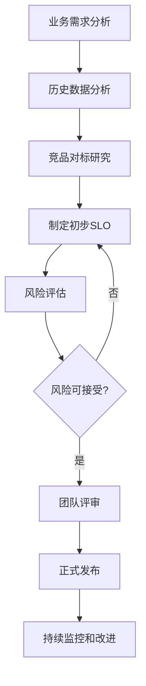
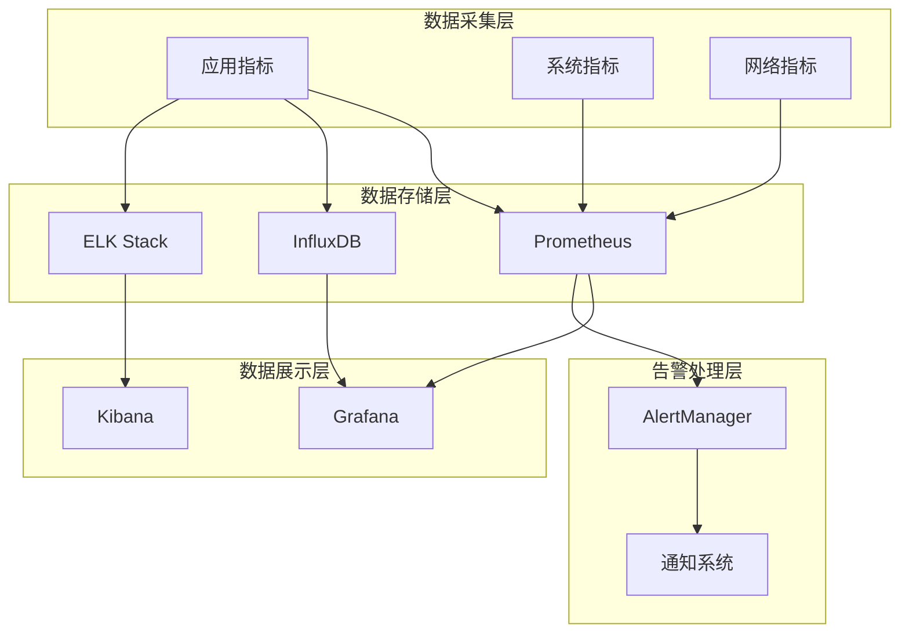
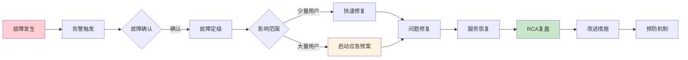
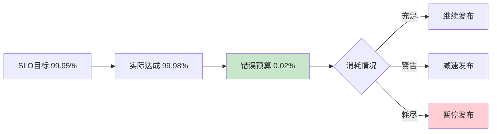

# SRE工程师生产环境最佳实践：从SLO制定到自动化运维的完整指南

## 情境(Situation)

SRE（Site Reliability Engineering）是Google提出的核心理念，它是用软件工程思维解决运维问题，让可靠性成为产品特性而非运维负担。作为SRE工程师，我们的目标是构建高可靠、高可用、高性能的系统，同时不断提升研发交付效率。

在SRE实际工作中，我们面临诸多挑战：

- **可靠性要求高**：业务对系统可用性要求极高，任何故障都可能造成重大损失
- **变更风险大**：频繁发布变更容易引入故障，需要完善的变更管理
- **故障响应快**：故障发生时需要快速定位和恢复，减少业务影响
- **效率提升难**：在保证可靠性的同时提升交付效率是一个持续挑战
- **团队协作难**：SRE需要与研发、产品、运维等多个团队协作
- **技术演进快**：新技术新架构不断涌现，需要持续学习和适应

## 冲突(Conflict)

许多企业在SRE实践中遇到以下问题：

- **SLO定义模糊**：缺乏明确的可靠性目标，无法量化评估系统可靠性
- **监控体系不完善**：监控指标不全面，告警阈值不合理，漏报误报严重
- **故障处理不规范**：故障响应流程混乱，缺乏标准化处理程序
- **变更风险高**：缺乏完善的变更评审和回滚机制
- **自动化程度低**：大量人工操作，效率低下且容易出错
- **团队协作不畅**：SRE与研发边界不清，责任划分模糊

这些问题在生产环境中可能导致故障频发、恢复时间长、用户体验差等问题。

## 问题(Question)

如何在生产环境中建立完善的SRE体系，实现可靠性与效率的平衡？

## 答案(Answer)

本文将从SRE视角出发，结合真实生产案例，提供一套完整的SRE生产环境最佳实践。核心方法论基于 [SRE面试题解析：SRE工程师岗位职责](#9-sre工程师岗位职责)。

---

## 一、SRE核心概念：SLO/SLI/SLA

### 1.1 三者关系解析

**SLO/SLI/SLA定义**：

| 概念 | 全称 | 定义 | 示例 |
|:----:|:-----|:-----|:-----|
| **SLI** | Service Level Indicator | 服务级别指标，实际测量的可靠性指标 | 请求成功率、延迟、P99值 |
| **SLO** | Service Level Objective | 服务级别目标，期望的可靠性目标 | 99.95%可用性、<200ms延迟 |
| **SLA** | Service Level Agreement | 服务级别协议，与客户的合同承诺 | 99.9%可用性、赔偿条款 |

**三者关系**：


**层级关系**：
- **SLI是基础**：实际测量的指标数据
- **SLO是目标**：基于SLI制定的目标，通常比SLA更严格
- **SLA是承诺**：对外的法律/商业承诺

### 1.2 SLI指标制定

**常见SLI指标**：

| 指标类型 | 指标名称 | 定义 | 测量方法 |
|:--------:|:---------|:-----|:---------|
| **可用性** | 请求成功率 | 成功请求数 / 总请求数 | 监控系统统计 |
| **延迟** | 响应时间 | 请求从发起到收到响应的时间 | P50/P95/P99 |
| **吞吐量** | QPS/TPS | 每秒处理的请求数 | 监控系统统计 |
| **错误** | 错误率 | 错误请求数 / 总请求数 | 监控系统统计 |
| **一致性** | 数据准确性 | 正确数据 / 总数据 | 应用埋点 |

**SLI测量实现**：

```python
#!/usr/bin/env python3
# sli_collector.py - SLI指标采集器

import time
import json
from datetime import datetime
from typing import Dict, List

class SLICollector:
    def __init__(self, service_name: str):
        self.service_name = service_name
        self.metrics = {
            "total_requests": 0,
            "successful_requests": 0,
            "failed_requests": 0,
            "latencies": [],
            "errors": []
        }
    
    def record_request(self, success: bool, latency: float, error: str = None):
        self.metrics["total_requests"] += 1
        
        if success:
            self.metrics["successful_requests"] += 1
        else:
            self.metrics["failed_requests"] += 1
            if error:
                self.metrics["errors"].append(error)
        
        self.metrics["latencies"].append(latency)
    
    def calculate_sli(self) -> Dict:
        total = self.metrics["total_requests"]
        if total == 0:
            return {}
        
        latencies = sorted(self.metrics["latencies"])
        n = len(latencies)
        
        return {
            "service": self.service_name,
            "timestamp": datetime.now().isoformat(),
            "availability": self.metrics["successful_requests"] / total,
            "error_rate": self.metrics["failed_requests"] / total,
            "latency_p50": latencies[int(n * 0.5)] if n > 0 else 0,
            "latency_p95": latencies[int(n * 0.95)] if n > 0 else 0,
            "latency_p99": latencies[int(n * 0.99)] if n > 0 else 0,
            "latency_avg": sum(latencies) / n if n > 0 else 0,
            "total_requests": total
        }
    
    def export_prometheus(self) -> str:
        sli = self.calculate_sli()
        if not sli:
            return ""
        
        output = f'''# HELP {self.service_name}_availability Service availability
# TYPE {self.service_name}_availability gauge
{self.service_name}_availability {{ "{{" }}service="{self.service_name}"}} {sli["availability"]}

# HELP {self.service_name}_error_rate Error rate
# TYPE {self.service_name}_error_rate gauge
{self.service_name}_error_rate {{ "{{" }}service="{self.service_name}"}} {sli["error_rate"]}

# HELP {self.service_name}_latency_p99 Latency P99
# TYPE {self.service_name}_latency_p99 gauge
{self.service_name}_latency_p99 {{ "{{" }}service="{self.service_name}"}} {sli["latency_p99"]}
'''
        return output

if __name__ == "__main__":
    collector = SLICollector("my-service")
    
    for i in range(1000):
        import random
        success = random.random() > 0.001
        latency = random.gauss(100, 20)
        collector.record_request(success, latency)
    
    sli = collector.calculate_sli()
    print(json.dumps(sli, indent=2))
```

### 1.3 SLO制定方法

**SLO制定流程**：



**SLO阈值制定原则**：

| 场景 | 推荐SLO | 说明 |
|:-----|:--------|:-----|
| **核心业务** | 99.99% | 几乎零容忍故障 |
| **重要业务** | 99.95% | 年度停机不超过4.5小时 |
| **一般业务** | 99.9% | 年度停机不超过9小时 |
| **内部工具** | 99.5% | 可接受一定停机时间 |

**SLO配置示例（Prometheus规则）**：

```yaml
# slo_rules.yml
groups:
- name: slo_availability
  rules:
  - record: job:slo_availability:ratio90d
    expr: |
      1 - (
        sum(rate(http_requests_total{job="my-service",status=~"5.."}[90d]))
        /
        sum(rate(http_requests_total{job="my-service"}[90d]))
      )
  
  - alert: SLOBreachWarning
    expr: job:slo_availability:ratio90d < 0.9995
    for: 5m
    labels:
      severity: warning
    annotations:
      summary: "SLO可用性接近阈值"
      description: "{{ "{{" }} $value | humanizePercentage }} 可用性低于99.95% SLO"
  
  - alert: SLOBreachCritical
    expr: job:slo_availability:ratio90d < 0.999
    for: 1m
    labels:
      severity: critical
    annotations:
      summary: "SLO可用性已突破阈值"
      description: "{{ "{{" }} $value | humanizePercentage }} 可用性低于99.9% SLA"
```

---

## 二、SRE核心职责实践

### 2.1 可用性保障

**监控体系架构**：



**监控系统部署脚本**：

```bash
#!/bin/bash
# prometheus_stack_setup.sh - Prometheus监控栈部署

# 安装Prometheus
echo "安装Prometheus..."
wget https://github.com/prometheus/prometheus/releases/download/v2.47.0/prometheus-2.47.0.linux-amd64.tar.gz
tar xvf prometheus-2.47.0.linux-amd64.tar.gz
mv prometheus-2.47.0.linux-amd64 /opt/prometheus

# 配置Prometheus
cat > /opt/prometheus/prometheus.yml << EOF
global:
  scrape_interval: 15s
  evaluation_interval: 15s

alerting:
  alertmanagers:
    - static_configs:
        - targets:
            - alertmanager:9093

rule_files:
  - "slo_rules.yml"
  - "alert_rules.yml"

scrape_configs:
  - job_name: 'prometheus'
    static_configs:
      - targets: ['localhost:9090']

  - job_name: 'node-exporter'
    static_configs:
      - targets: ['node-exporter:9100']

  - job_name: 'my-app'
    static_configs:
      - targets: ['my-app:8080']
EOF

# 创建systemd服务
cat > /etc/systemd/system/prometheus.service << EOF
[Unit]
Description=Prometheus Monitoring
After=network.target

[Service]
ExecStart=/opt/prometheus/prometheus --config.file=/opt/prometheus/prometheus.yml
Restart=always
User=prometheus

[Install]
WantedBy=multi-user.target
EOF

# 安装Grafana
echo "安装Grafana..."
apt-get install -y grafana

# 启动服务
systemctl daemon-reload
systemctl enable prometheus
systemctl start prometheus
systemctl enable grafana-server
systemctl start grafana-server

echo "Prometheus监控栈部署完成"
```

**告警规则配置**：

```yaml
# alert_rules.yml
groups:
- name: service_alerts
  rules:
  - alert: HighErrorRate
    expr: rate(http_requests_total{status=~"5.."}[5m]) > 0.01
    for: 2m
    labels:
      severity: critical
    annotations:
      summary: "服务错误率过高"
      description: "服务 {{ "{{" }} $labels.instance }} 错误率超过1%，当前值: {{ "{{" }} $value | humanizePercentage }}"
  
  - alert: HighLatency
    expr: histogram_quantile(0.99, rate(http_request_duration_seconds_bucket[5m])) > 2
    for: 5m
    labels:
      severity: warning
    annotations:
      summary: "服务延迟过高"
      description: "服务 {{ "{{" }} $labels.instance }} P99延迟超过2秒，当前值: {{ "{{" }} $value }}s"
  
  - alert: ServiceDown
    expr: up{job="my-app"} == 0
    for: 1m
    labels:
      severity: critical
    annotations:
      summary: "服务不可用"
      description: "服务 {{ "{{" }} $labels.instance }} 已经宕机超过1分钟"
```

### 2.2 故障响应流程

**故障处理流程**：



**故障处理脚本**：

```bash
#!/bin/bash
# incident_handler.sh - 故障处理脚本

set -euo pipefail

INCIDENT_ID=$(date +%Y%m%d%H%M%S)
LOG_FILE="/var/log/incidents/${INCIDENT_ID}.log"
ALERT_THRESHOLD_CPU=85
ALERT_THRESHOLD_MEM=90

log() {
    local level="$1"
    local message="$2"
    echo "[$(date '+%Y-%m-%d %H:%M:%S')] [$level] $message" | tee -a "$LOG_FILE"
}

# 初始化
mkdir -p /var/log/incidents
log "INFO" "===== 故障处理开始 ====="
log "INFO" "故障ID: $INCIDENT_ID"

# 检查系统资源
check_resources() {
    log "INFO" "检查系统资源..."
    
    CPU_USAGE=$(top -bn1 | grep "Cpu(s)" | awk '{print $2}' | cut -d'%' -f1)
    MEM_USAGE=$(free | grep Mem | awk '{printf "%.0f", $3/$2 * 100}')
    
    log "INFO" "CPU使用率: ${CPU_USAGE}%"
    log "INFO" "内存使用率: ${MEM_USAGE}%"
    
    if (( $(echo "$CPU_USAGE > $ALERT_THRESHOLD_CPU" | bc -l) )); then
        log "WARN" "CPU使用率过高!"
    fi
    
    if (( $(echo "$MEM_USAGE > $ALERT_THRESHOLD_MEM" | bc -l) )); then
        log "WARN" "内存使用率过高!"
    fi
}

# 检查服务状态
check_services() {
    log "INFO" "检查服务状态..."
    
    SERVICES=("nginx" "mysql" "redis" "app")
    
    for service in "${SERVICES[@]}"; do
        if systemctl is-active --quiet "$service"; then
            log "INFO" "服务 $service: 运行正常"
        else
            log "ERROR" "服务 $service: 运行异常!"
            
            # 尝试自动重启
            log "INFO" "尝试重启服务 $service..."
            systemctl restart "$service"
            
            sleep 5
            
            if systemctl is-active --quiet "$service"; then
                log "INFO" "服务 $service 重启成功"
            else
                log "ERROR" "服务 $service 重启失败，需要人工介入"
            fi
        fi
    done
}

# 健康检查
health_check() {
    log "INFO" "执行健康检查..."
    
    ENDPOINTS=("http://localhost:8080/health" "http://localhost:8080/ready")
    
    for endpoint in "${ENDPOINTS[@]}"; do
        if curl -sf "$endpoint" &>/dev/null; then
            log "INFO" "健康检查 $endpoint: 通过"
        else
            log "ERROR" "健康检查 $endpoint: 失败"
        fi
    done
}

# 故障定级
classify_incident() {
    local severity="$1"
    
    case "$severity" in
        1)
            log "CRITICAL" "故障定级: P1 - 严重故障，影响大量用户"
            ;;
        2)
            log "ERROR" "故障定级: P2 - 中等故障，影响部分用户"
            ;;
        3)
            log "WARN" "故障定级: P3 - 轻微故障，影响少量用户"
            ;;
    esac
}

# 主函数
main() {
    local severity="${1:-3}"
    
    check_resources
    check_services
    health_check
    classify_incident "$severity"
    
    log "INFO" "===== 故障处理完成 ====="
}

main "$@"
```

### 2.3 变更管理

**变更评审检查清单**：

```markdown
# 变更评审检查清单

## 变更前
- [ ] 变更方案已评审并批准
- [ ] 回滚方案已制定并测试
- [ ] 变更时间窗口已确认
- [ ] 通知相关干系人
- [ ] 监控告警已准备
- [ ] 值班人员已确认

## 变更中
- [ ] 按照变更方案执行
- [ ] 实时监控变更影响
- [ ] 记录变更执行步骤
- [ ] 异常情况及时暂停

## 变更后
- [ ] 验证服务正常运行
- [ ] 确认监控告警正常
- [ ] 观察业务指标正常
- [ ] 更新变更记录
- [ ] 通知干系人变更完成
```

**灰度发布脚本**：

```bash
#!/bin/bash
# canary_deploy.sh - 灰度发布脚本

set -euo pipefail

APP_NAME="myapp"
NEW_VERSION="1.2.0"
REPLICAS=10
CANARY_PERCENT=10

log() {
    echo "[$(date '+%Y-%m-%d %H:%M:%S')] $*"
}

# 更新灰度版本
update_canary() {
    log "更新灰度版本..."
    
    kubectl set image deployment/$APP_NAME $APP_NAME=$APP_NAME:$NEW_VERSION
    kubectl patch deployment/$APP_NAME -p '{"spec":{"replicas":'$CANARY_PERCENT'}}'
    
    log "灰度版本已更新到 ${NEW_VERSION}，副本数: ${CANARY_PERCENT}%"
}

# 观察灰度
observe_canary() {
    log "观察灰度指标..."
    
    for i in {1..30}; do
        ERROR_RATE=$(kubectl exec -it deploy/$APP_NAME -- curl -s http://localhost:8080/metrics | grep error_rate | awk '{print $2}')
        
        log "当前错误率: $ERROR_RATE"
        
        if (( $(echo "$ERROR_RATE > 0.05" | bc -l) )); then
            log "错误率过高，自动回滚!"
            rollback_canary
            exit 1
        fi
        
        sleep 10
    done
}

# 完整发布
full_deploy() {
    log "执行完整发布..."
    
    kubectl patch deployment/$APP_NAME -p '{"spec":{"replicas":'$REPLICAS'}}'
    
    log "发布完成!"
}

# 回滚
rollback_canary() {
    log "回滚灰度版本..."
    
    kubectl rollout undo deployment/$APP_NAME
    kubectl patch deployment/$APP_NAME -p '{"spec":{"replicas":'$REPLICAS'}}'
    
    log "回滚完成!"
}

# 主函数
main() {
    log "===== 开始灰度发布 ====="
    log "应用: $APP_NAME"
    log "新版本: $NEW_VERSION"
    
    update_canary
    observe_canary
    full_deploy
    
    log "===== 灰度发布完成 ====="
}

main
```

---

## 三、SRE工具与自动化

### 3.1 自动化工具矩阵

**SRE自动化工具栈**：

| 领域 | 工具 | 用途 |
|:----:|:-----|:-----|
| **监控** | Prometheus + Grafana | 指标采集和可视化 |
| **日志** | ELK Stack | 日志收集和分析 |
| **追踪** | Jaeger | 分布式追踪 |
| **告警** | AlertManager | 告警管理 |
| **容器** | Kubernetes | 容器编排 |
| **CI/CD** | GitLab CI / ArgoCD | 持续集成和交付 |
| **配置** | Ansible | 自动化配置 |
| **秘密** | Vault | 密钥管理 |
| **文档** | Wiki | 知识管理 |

### 3.2 自动化运维脚本

**自动化健康检查脚本**：

```bash
#!/bin/bash
# auto_health_check.sh - 自动化健康检查脚本

set -euo pipefail

CHECK_INTERVAL=60
LOG_FILE="/var/log/health_check.log"

log() {
    echo "[$(date '+%Y-%m-%d %H:%M:%S')] $*" >> "$LOG_FILE"
}

# 检查服务健康
check_service_health() {
    local service="$1"
    local endpoint="$2"
    local expected_code="${3:-200}"
    
    local actual_code=$(curl -s -o /dev/null -w "%{http_code}" "$endpoint" 2>/dev/null || echo "000")
    
    if [[ "$actual_code" == "$expected_code" ]]; then
        log "OK: $service 健康检查通过"
        return 0
    else
        log "FAIL: $service 健康检查失败 (期望: $expected_code, 实际: $actual_code)"
        return 1
    fi
}

# 检查系统资源
check_system_resources() {
    local cpu_usage=$(top -bn1 | grep "Cpu(s)" | awk '{print $2}' | cut -d'%' -f1)
    local mem_usage=$(free | grep Mem | awk '{printf "%.0f", $3/$2 * 100}')
    local disk_usage=$(df -h / | tail -1 | awk '{print $5}' | sed 's/%//')
    
    log "系统资源 - CPU: ${cpu_usage}%, 内存: ${mem_usage}%, 磁盘: ${disk_usage}%"
    
    if (( $(echo "$cpu_usage > 90" | bc -l) )); then
        log "WARN: CPU使用率过高"
    fi
    
    if (( mem_usage > 90 )); then
        log "WARN: 内存使用率过高"
    fi
    
    if (( disk_usage > 90 )); then
        log "WARN: 磁盘使用率过高"
    fi
}

# 检查端口监听
check_port_listening() {
    local port="$1"
    
    if netstat -tuln 2>/dev/null | grep -q ":$port "; then
        log "OK: 端口 $port 正常监听"
        return 0
    else
        log "FAIL: 端口 $port 未监听"
        return 1
    fi
}

# 主函数
main() {
    log "===== 健康检查开始 ====="
    
    # 检查关键服务
    check_service_health "nginx" "http://localhost:80" || true
    check_service_health "app" "http://localhost:8080/health" || true
    
    # 检查系统资源
    check_system_resources
    
    # 检查关键端口
    check_port_listening 80
    check_port_listening 443
    check_port_listening 3306
    check_port_listening 6379
    
    log "===== 健康检查完成 ====="
}

# 循环执行
while true; do
    main
    sleep "$CHECK_INTERVAL"
done
```

**自动化扩缩容脚本**：

```bash
#!/bin/bash
# auto_scaling.sh - 基于指标的自动扩缩容脚本

set -euo pipefail

NAMESPACE="default"
DEPLOYMENT="myapp"
MIN_REPLICAS=3
MAX_REPLICAS=10
CPU_THRESHOLD=70
MEM_THRESHOLD=80

log() {
    echo "[$(date '+%Y-%m-%d %H:%M:%S')] $*"
}

# 获取当前副本数
get_current_replicas() {
    kubectl get deployment $DEPLOYMENT -n $NAMESPACE -o jsonpath='{.spec.replicas}'
}

# 获取CPU使用率
get_cpu_usage() {
    kubectl top pods -n $NAMESPACE -l app=$DEPLOYMENT --no-headers 2>/dev/null | \
        awk '{sum+=$2; count++} END {print count>0 ? sum/count : 0}' | sed 's/%//'
}

# 获取内存使用率
get_mem_usage() {
    kubectl top pods -n $NAMESPACE -l app=$DEPLOYMENT --no-headers 2>/dev/null | \
        awk '{sum+=$3; count++} END {print count>0 ? sum/count : 0}' | sed 's/%//'
}

# 扩容
scale_up() {
    local current=$1
    local new=$((current + 1))
    
    if [[ $new -le $MAX_REPLICAS ]]; then
        log "扩容: $current -> $new"
        kubectl scale deployment $DEPLOYMENT -n $NAMESPACE --replicas=$new
    fi
}

# 缩容
scale_down() {
    local current=$1
    local new=$((current - 1))
    
    if [[ $new -ge $MIN_REPLICAS ]]; then
        log "缩容: $current -> $new"
        kubectl scale deployment $DEPLOYMENT -n $NAMESPACE --replicas=$new
    fi
}

# 主函数
main() {
    local current=$(get_current_replicas)
    local cpu=$(get_cpu_usage)
    local mem=$(get_mem_usage)
    
    log "当前副本数: $current, CPU: ${cpu}%, 内存: ${mem}%"
    
    # 基于CPU扩容
    if (( $(echo "$cpu > $CPU_THRESHOLD" | bc -l) )); then
        log "CPU使用率超过阈值 ($CPU_THRESHOLD%)"
        scale_up $current
    # 基于内存扩容
    elif (( $(echo "$mem > $MEM_THRESHOLD" | bc -l) )); then
        log "内存使用率超过阈值 ($MEM_THRESHOLD%)"
        scale_up $current
    # 资源使用低，缩容
    elif (( $(echo "$cpu < 20 && $mem < 40" | bc -l) )); then
        log "资源使用率低，考虑缩容"
        scale_down $current
    fi
}

main
```

---

## 四、SRE指标与度量

### 4.1 核心SRE指标

**四大黄金指标**：

| 指标 | 描述 | 目标 | 测量方法 |
|:-----|:-----|:-----|:---------|
| **延迟** | 请求响应时间 | P99 < 200ms | Prometheus histogram |
| **流量** | 系统吞吐量 | QPS > 1000 | 请求率统计 |
| **错误** | 请求错误率 | < 0.1% | 错误计数统计 |
| **饱和度** | 资源利用率 | < 80% | 系统监控 |

**SRE效率指标**：

| 指标 | 描述 | 计算公式 | 目标 |
|:-----|:-----|:---------|:-----|
| **MTTR** | 平均恢复时间 | 故障总时长 / 故障次数 | < 30分钟 |
| **MTBF** | 平均故障间隔 | 系统运行时间 / 故障次数 | > 30天 |
| **部署频率** | 发布频率 | 部署次数 / 时间 | 越高越好 |
| **变更失败率** | 变更失败比例 | 失败变更 / 总变更 | < 5% |
| **发布周期** | 从提交到上线 | 时间差 | < 1小时 |

**指标收集脚本**：

```bash
#!/bin/bash
# sre_metrics.sh - SRE指标收集脚本

set -euo pipefail

METRICS_FILE="/var/log/sre_metrics.json"
DATE=$(date +%Y-%m-%d)

log_metrics() {
    local mttr=$1
    local mtbf=$2
    local deploy_freq=$3
    local change_fail_rate=$4
    
    cat > "$METRICS_FILE" << EOF
{
    "date": "$DATE",
    "mttr": $mttr,
    "mtbf": $mtbf,
    "deploy_frequency": $deploy_freq,
    "change_failure_rate": $change_fail_rate,
    "timestamp": "$(date -Iseconds)"
}
EOF
    
    echo "SRE指标已记录到 $METRICS_FILE"
    cat "$METRICS_FILE"
}

# 计算MTTR（示例）
calculate_mttr() {
    local total_incident_time=120
    local incident_count=4
    echo "scale=2; $total_incident_time / $incident_count" | bc
}

# 计算MTBF（示例）
calculate_mtbf() {
    local total_uptime=43200
    local incident_count=2
    echo "scale=2; $total_uptime / ($incident_count + 1)" | bc
}

# 计算部署频率（示例）
calculate_deploy_freq() {
    local deploy_count=50
    local days=30
    echo "scale=2; $deploy_count / $days" | bc
}

# 计算变更失败率（示例）
calculate_change_fail_rate() {
    local failed_changes=2
    local total_changes=50
    echo "scale=4; $failed_changes / $total_changes" | bc
}

# 主函数
main() {
    local mttr=$(calculate_mttr)
    local mtbf=$(calculate_mtbf)
    local deploy_freq=$(calculate_deploy_freq)
    local change_fail_rate=$(calculate_change_fail_rate)
    
    log_metrics $mttr $mtbf $deploy_freq $change_fail_rate
}

main
```

### 4.2 仪表板配置

**Grafana SRE仪表板配置**：

```json
{
  "dashboard": {
    "title": "SRE 核心指标仪表板",
    "panels": [
      {
        "title": "服务可用性",
        "type": "stat",
        "targets": [
          {
            "expr": "job:slo_availability:ratio30d",
            "legendFormat": "可用性"
          }
        ],
        "fieldConfig": {
          "thresholds": {
            "steps": [
              {"value": 0, "color": "red"},
              {"value": 0.999, "color": "yellow"},
              {"value": 0.9999, "color": "green"}
            ]
          }
        }
      },
      {
        "title": "请求延迟 P99",
        "type": "graph",
        "targets": [
          {
            "expr": "histogram_quantile(0.99, rate(http_request_duration_seconds_bucket[5m]))",
            "legendFormat": "P99延迟"
          }
        ]
      },
      {
        "title": "错误率",
        "type": "graph",
        "targets": [
          {
            "expr": "rate(http_requests_total{status=~\"5..\"}[5m])",
            "legendFormat": "5xx错误率"
          }
        ]
      },
      {
        "title": "MTTR 趋势",
        "type": "graph",
        "targets": [
          {
            "expr": "mttr_minutes",
            "legendFormat": "MTTR (分钟)"
          }
        ]
      }
    ]
  }
}
```

---

## 五、生产环境案例分析

### 案例1：MTTR优化实践

**背景**：某公司MTTR（平均恢复时间）过长，平均需要2小时才能恢复故障

**问题分析**：
- 故障定位时间长，缺乏有效的监控和追踪
- 故障处理流程不规范，依赖人工操作
- 回滚机制不完善，变更风险高

**解决方案**：
1. **完善监控体系**：部署Prometheus + Grafana，实现全链路监控
2. **标准化故障处理**：制定故障处理SOP，明确处理步骤
3. **自动化回滚**：实现一键回滚机制
4. **建立值班制度**：7x24小时值班，快速响应

**效果**：
- MTTR：120分钟 → 25分钟
- 故障定位时间：60分钟 → 5分钟
- 恢复时间：60分钟 → 20分钟

### 案例2：SLO达成率提升

**背景**：某核心服务的SLO（99.95%）频繁被突破，影响业务

**问题分析**：
- 缺乏有效的容量规划
- 变更风险高，经常因变更导致故障
- 监控告警不及时，响应慢

**解决方案**：
1. **容量规划优化**：实施自动扩缩容，根据负载动态调整
2. **变更管理强化**：实施灰度发布，降低变更风险
3. **监控告警优化**：调整告警阈值，减少误报漏报
4. **架构优化**：实施多活架构，提高系统可靠性

**效果**：
- SLO达成率：85% → 99.97%
- 可用性：99.9% → 99.99%
- 变更失败率：15% → 2%

### 案例3：发布效率提升

**背景**：某公司发布周期长，平均需要2周才能完成一个版本的发布

**问题分析**：
- 人工操作多，部署过程繁琐
- 测试环节耗时，环境准备复杂
- 审批流程长，沟通成本高

**解决方案**：
1. **CI/CD流水线**：实现自动化构建、测试、部署
2. **环境标准化**：使用容器化，环境一致性
3. **审批简化**：实施自动化审批，减少人工干预
4. **特性开关**：使用特性开关，实现快速开关功能

**效果**：
- 发布周期：14天 → 2天
- 部署频率：2次/月 → 4次/周
- 人工操作：80% → 10%

---

## 六、最佳实践总结

### 6.1 SRE实施要点

| 领域 | 最佳实践 | 关键动作 |
|:-----|:---------|:---------|
| **SLO制定** | 基于业务制定SLO | 历史数据分析、竞品对标 |
| **监控告警** | 全链路监控 | 指标采集、日志聚合、告警阈值 |
| **故障处理** | 标准化流程 | SOP制定、自动化工具、值班制度 |
| **变更管理** | 灰度发布 | 渐进式发布、快速回滚 |
| **容量规划** | 自动扩缩容 | 基于指标的自动调整 |
| **效率提升** | 自动化运维 | 脚本化、工具化、平台化 |

### 6.2 SRE与DevOps对比

| 维度 | DevOps | SRE |
|:----:|:------:|:---:|
| **核心目标** | 提升交付效率 | 保障系统可靠性 |
| **关注点** | CI/CD、敏捷开发 | 可用性、性能、SLO |
| **方法** | 自动化、协作 | 量化指标、错误预算 |
| **文化** | 打破壁垒、协作 | 接受失败、持续改进 |
| **指标** | 部署频率、周期 | MTTR、MTBF、SLO |

### 6.3 持续改进机制

**错误预算策略**：



---

## 总结

SRE是保障系统可靠性的核心理念和实践，通过SLO/SLI/SLA体系、完善的监控告警、规范的故障处理流程、自动化的运维工具，可以有效提升系统的可靠性和运维效率。

**核心要点**：

1. **SLO是核心**：明确可靠性目标，量化评估系统表现
2. **监控是基础**：建立全链路监控体系，及时发现和定位问题
3. **流程是关键**：制定标准化的故障处理和变更管理流程
4. **自动化是手段**：通过自动化工具提升效率和一致性
5. **持续改进**：基于指标数据，持续优化和改进

> **延伸学习**：更多面试相关的SRE问题，请参考 [SRE面试题解析：SRE工程师岗位职责](#9-sre工程师岗位职责)。

---

## 参考资料

- [Google SRE Books](https://sre.google/sre-book/table-of-contents/)
- [SRE Fundamentals](https://sre.google/workbook/overview/)
- [SLI/SLO/SLA Guide](https://cloud.google.com/blog/products/gcp/defining-slos-for-google-cloud-platform-services-a1b13ca60c58)
- [PostgreSQL监控指南](https://www.postgresql.org/docs/current/monitoring.html)
- [Prometheus官方文档](https://prometheus.io/docs/introduction/overview/)
- [Grafana官方文档](https://grafana.com/docs/)
- [Kubernetes监控最佳实践](https://kubernetes.io/docs/concepts/workloads/pods/pod-lifecycle/)
- [SRE仪表板设计](https://grafana.com/grafana/dashboards/)
- [故障复盘指南](https://sre.google/sre-book/postmortem-culture/)
- [错误预算策略](https://sre.google/workbook/error-budgets/)