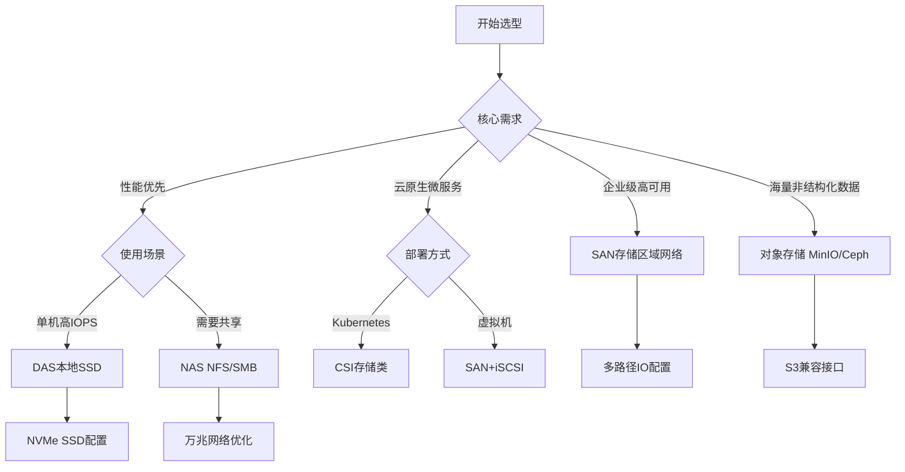

# 存储系统生产环境最佳实践：从DAS到对象存储的架构设计

## 情境(Situation)

在现代IT基础设施中，存储系统是保障业务连续性和数据安全的核心组件。作为SRE工程师，选择和配置合适的存储架构直接影响系统的性能、可靠性和成本效率。

然而，在生产环境中部署和管理存储系统面临诸多挑战：

- **性能瓶颈**：存储IO延迟影响整体系统响应时间
- **容量规划**：数据增长难以预测，容量规划困难
- **高可用设计**：单点故障可能导致数据丢失和服务中断
- **成本控制**：如何在性能和成本之间取得平衡
- **技术演进**：传统存储与云原生存储、对象存储的选择

## 冲突(Conflict)

许多企业在实施存储系统时遇到以下问题：

- **选型不当**：选择了不适合业务场景的存储类型
- **性能问题**：存储性能无法满足高并发业务需求
- **可用性差**：缺乏冗余设计，数据丢失风险高
- **扩展困难**：无法平滑扩展存储容量
- **运维复杂**：存储系统管理和维护难度大

这些问题在生产环境中可能导致业务性能下降、数据丢失或服务中断。

## 问题(Question)

如何在生产环境中设计和部署高性能、高可靠、可扩展的存储系统？

## 答案(Answer)

本文将从SRE视角出发，结合真实生产案例，提供一套完整的存储系统生产环境最佳实践。核心方法论基于 [SRE面试题解析：存储类型详解](#6-存储类型详解)。

---

## 一、存储类型深度解析

### 1.1 DAS/NAS/SAN三种架构对比

**核心区别**：

| 类型 | 协议 | 性能 | 延迟 | 共享性 | 扩展性 | 成本 |
|:----:|------|:----:|:----:|:------:|:------:|:----:|
| **DAS** | 直连 | ⚡⚡⚡ | < 1ms | ❌ 独占 | 有限 | 低 |
| **NAS** | NFS/SMB | ⚡⚡ | 5-20ms | ✅ 文件级共享 | 中等 | 中 |
| **SAN** | iSCSI/FC | ⚡⚡⚡ | 1-5ms | ✅ 块级共享 | 高 | 高 |

**IO模型区别**：

| 类型 | IO模型 | 数据单元 | 适用场景 |
|:----:|:------:|:--------:|:---------|
| **DAS** | 块设备 | 块 | 数据库、高性能计算 |
| **NAS** | 文件系统 | 文件 | 文件共享、备份 |
| **SAN** | 块设备 | 块 | 虚拟化、企业级应用 |
| **对象存储** | REST API | 对象 | 云原生应用、大数据分析 |

### 1.2 存储架构选型决策树



### 1.3 存储性能指标

**关键性能指标**：

| 指标 | 描述 | 目标值 | 测量方法 |
|:-----|:-----|:------:|:---------|
| **IOPS** | 每秒输入输出操作数 | 根据业务需求 | fio测试 |
| **吞吐量** | 每秒数据传输量 | >500MB/s | fio测试 |
| **延迟** | IO操作响应时间 | <1ms | iostat |
| **带宽** | 并发IO通道宽度 | 根据HBA卡 | 设备规格 |
| **利用率** | 存储设备使用率 | <80% | 监控工具 |

---

## 二、DAS存储最佳实践

### 2.1 本地SSD/NVMe配置

**Linux存储配置**：

```bash
#!/bin/bash
# local_storage_setup.sh - 本地存储配置脚本

# 查看磁盘信息
lsblk -d -o NAME,SIZE,TYPE,MODEL,SERIAL
fdisk -l | grep -E "^Disk /dev/"
nvme list

# 分区和格式化
parted -s /dev/nvme0n1 mklabel gpt
parted -s /dev/nvme0n1 mkpart primary xfs 0% 100%

# XFS文件系统（高性能场景）
mkfs.xfs -f -b size=4096 -d su=64k,sw=1 /dev/nvme0n1p1

# ext4文件系统（通用场景）
mkfs.ext4 -E stride=128,stripe-width=128 /dev/nvme0n1p1

# 挂载配置
mkdir -p /data
mount -o noatime,nodiratime,discard /dev/nvme0n1p1 /data

# 添加到fstab
echo "/dev/nvme0n1p1 /data xfs defaults,noatime,nodiratime,discard 0 2" >> /etc/fstab

# 查看挂载结果
df -h /data
mount | grep /data
```

**存储优化参数**：

```bash
# /etc/sysctl.conf - 存储优化参数

# VM层面
vm.swappiness = 10
vm.dirty_ratio = 15
vm.dirty_background_ratio = 5
vm.vfs_cache_pressure = 50

# IO调度器（NVMe使用noop）
echo "noop" > /sys/block/nvme0n1/queue/scheduler
echo "deadline" > /sys/block/sda/queue/scheduler

# IO队列深度
echo 2048 > /sys/block/nvme0n1/queue/nr_requests
echo 2048 > /sys/block/sda/queue/nr_requests

# 预读优化
blockdev --setra 4096 /dev/nvme0n1
blockdev --setra 4096 /dev/sda
```

### 2.2 RAID配置与优化

**RAID级别选择**：

| RAID级别 | 冗余能力 | 性能 | 容量利用率 | 适用场景 |
|:--------:|:--------:|:----:|:----------:|:---------|
| **RAID 0** | 无 | 最高 | 100% | 临时数据、性能测试 |
| **RAID 1** | 镜像 | 中等 | 50% | 系统盘、重要数据 |
| **RAID 5** | 单盘容错 | 较高 | (n-1)/n | 通用存储 |
| **RAID 6** | 双盘容错 | 较高 | (n-2)/n | 高可靠存储 |
| **RAID 10** | 镜像+条带化 | 高 | 50% | 数据库、高IOPS场景 |

**RAID配置示例**：

```bash
#!/bin/bash
# raid_setup.sh - RAID配置脚本

# 安装mdadm
apt-get install -y mdadm

# 创建RAID 10
mdadm --create /dev/md0 --level=10 --raid-devices=4 /dev/sda /dev/sdb /dev/sdc /dev/sdd

# 查看RAID信息
cat /proc/mdstat
mdadm --detail /dev/md0

# 格式化
mkfs.xfs -f /dev/md0

# 挂载
mkdir -p /data
mount /dev/md0 /data

# 保存RAID配置
mdadm --detail --scan >> /etc/mdadm/mdadm.conf

# 监控RAID状态
mdadm --event --scan &
```

### 2.3 数据库存储最佳实践

**MySQL存储配置**：

```bash
#!/bin/bash
# mysql_storage_setup.sh - MySQL存储配置脚本

# 创建独立分区
parted -s /dev/nvme0n1 mklabel gpt
parted -s /dev/nvme0n1 mkpart primary xfs 0% 100%

# 格式化并挂载
mkfs.xfs -f /dev/nvme0n1p1
mkdir -p /data/mysql
mount /dev/nvme0n1p1 /data/mysql

# 创建MySQL目录结构
mkdir -p /data/mysql/{data,log,binlog,tmp}
chown -R mysql:mysql /data/mysql

# 复制现有数据（如果需要）
# systemctl stop mysql
# cp -a /var/lib/mysql/* /data/mysql/

# 配置MySQL
cat >> /etc/mysql/my.cnf << EOF
[mysqld]
datadir=/data/mysql/data
log_error=/data/mysql/log/error.log
slow_query_log_file=/data/mysql/log/slow.log
binlog_space_limit=100G
tmpdir=/data/mysql/tmp
EOF

# 重启MySQL
systemctl restart mysql

# 验证配置
mysql -e "SHOW VARIABLES LIKE 'datadir';"
mysql -e "SHOW VARIABLES LIKE 'log_error';"
```

**PostgreSQL存储配置**：

```bash
#!/bin/bash
# postgresql_storage_setup.sh - PostgreSQL存储配置脚本

# 创建独立分区
parted -s /dev/nvme0n1 mklabel gpt
parted -s /dev/nvme0n1 mkpart primary xfs 0% 100%

# 格式化并挂载
mkfs.xfs -f /dev/nvme0n1p1
mkdir -p /data/postgresql
mount /dev/nvme0n1p1 /data/postgresql

# 创建PostgreSQL目录结构
mkdir -p /data/postgresql/{data,wal,backup}
chown -R postgres:postgres /data/postgresql

# 配置PostgreSQL
cat >> /etc/postgresql/14/main/postgresql.conf << EOF
data_directory = '/data/postgresql/data'
wal_level = replica
max_wal_size = '4GB'
min_wal_size = '1GB'
archive_mode = on
archive_command = 'test ! -f /data/postgresql/wal/%f && cp %p /data/postgresql/wal/%f'
EOF

# 重启PostgreSQL
systemctl restart postgresql

# 验证配置
psql -c "SHOW data_directory;"
```

---

## 三、NAS存储最佳实践

### 3.1 NFS服务器配置

**NFS服务器配置**：

```bash
#!/bin/bash
# nfs_server_setup.sh - NFS服务器配置脚本

# 安装NFS服务
apt-get install -y nfs-kernel-server nfs-common

# 创建共享目录
mkdir -p /data/nfs/{shared,backup,media}
chmod -R 755 /data/nfs

# 配置exports文件
cat > /etc/exports << EOF
/data/nfs/shared 192.168.1.0/24(rw,sync,no_subtree_check,no_root_squash)
/data/nfs/backup 192.168.1.0/24(rw,sync,no_subtree_check) 10.0.0.0/8(ro,sync,no_subtree_check)
/data/nfs/media 192.168.1.0/24(rw,sync,no_subtree_check,all_squash,anonuid=1000,anongid=1000)
EOF

# 导出共享
exportfs -ra

# 查看导出状态
exportfs -v

# 启动服务
systemctl enable nfs-server
systemctl start nfs-server

# 防火墙配置（如需要）
iptables -A INPUT -p tcp --dport 2049 -j ACCEPT
iptables -A INPUT -p udp --dport 2049 -j ACCEPT
```

**NFS客户端配置**：

```bash
#!/bin/bash
# nfs_client_setup.sh - NFS客户端配置脚本

# 安装NFS客户端
apt-get install -y nfs-common

# 创建挂载点
mkdir -p /mnt/nfs/{shared,backup,media}

# 挂载NFS共享
mount -t nfs4 -o rw,sync,hard,intr,timeo=600,retrans=2 192.168.1.100:/data/nfs/shared /mnt/nfs/shared

# 配置自动挂载（/etc/fstab）
cat >> /etc/fstab << EOF
192.168.1.100:/data/nfs/shared /mnt/nfs/shared nfs4 defaults,async,hard,intr,timeo=600 0 0
192.168.1.100:/data/nfs/backup /mnt/nfs/backup nfs4 defaults,async,ro,hard,intr,timeo=600 0 0
EOF

# 验证挂载
df -h | grep nfs
mount | grep nfs
```

### 3.2 SMB/CIFS配置

**Samba服务器配置**：

```bash
#!/bin/bash
# samba_setup.sh - Samba服务器配置脚本

# 安装Samba
apt-get install -y samba samba-common-bin

# 备份配置文件
cp /etc/samba/smb.conf /etc/samba/smb.conf.bak

# 配置Samba
cat > /etc/samba/smb.conf << EOF
[global]
workgroup = WORKGROUP
server string = Samba Server
security = user
map to guest = Bad User
dns proxy = no

[shared]
path = /data/smb/shared
browseable = yes
read only = no
create mask = 0664
directory mask = 0775
valid users = @smbusers

[backup]
path = /data/smb/backup
browseable = yes
read only = yes
guest ok = no
valid users = backupuser

[media]
path = /data/smb/media
browseable = yes
public = yes
read only = yes
EOF

# 创建共享目录
mkdir -p /data/smb/{shared,backup,media}
chmod -R 755 /data/smb

# 创建Samba用户
useradd -M -s /sbin/nologin backupuser
smbpasswd -a backupuser

# 设置目录权限
chown -R backupuser:smbusers /data/smb/backup

# 测试配置
testparm

# 重启服务
systemctl enable smbd
systemctl restart smbd
systemctl enable nmbd
systemctl restart nmbd

# 防火墙配置
iptables -A INPUT -p tcp --dport 445 -j ACCEPT
iptables -A INPUT -p tcp --dport 139 -j ACCEPT
```

### 3.3 NAS性能优化

**NFS性能优化**：

```bash
# 服务端优化
cat >> /etc/sysctl.conf << EOF
# NFS优化
fs.nfs.nfs_callback_tcpport = 65401
sunrpc.tcp_slot_table_entries = 128
sunrpc.udp_slot_table_entries = 128
EOF

sysctl -p

# 客户端优化挂载选项
mount -t nfs4 \
    -o rw,sync,noatime,nodiratime,hard,intr,timeo=600,retrans=2,\
    rsize=1048576,wsize=1048576 \
    192.168.1.100:/data/nfs/shared /mnt/nfs/shared

# rsize/wsize：最大读写块大小，千兆网络建议1MB
# timeo：超时时间，单位0.1秒
# retrans：重传次数
```

---

## 四、SAN存储最佳实践

### 4.1 iSCSI配置

**iSCSI服务器配置（Target）**：

```bash
#!/bin/bash
# iscsi_target_setup.sh - iSCSI Target配置脚本

# 安装iSCSI Target
apt-get install -y tgt

# 查看可用磁盘
lsblk -d

# 创建iSCSI卷
cat > /etc/tgt/conf.d/iscsi.conf << EOF
<target iqn.2026-04.com.example:storage.lun1>
    backing-store /dev/sdb
    initiator-address 192.168.1.0/24
    incominguser chap_user chap_secret
    outgoinguser chap_target target_secret
    bs-type=io_uring
    sync=direct
    sg_inq_vendor_id=1
</target>

<target iqn.2026-04.com.example:storage.lun2>
    backing-store /dev/sdc
    initiator-address 192.168.1.0/24
    incominguser chap_user2 chap_secret2
    bs-type=io_uring
    sync=direct
</target>
EOF

# 查看配置
tgtadm --mode target --op show

# 重启服务
systemctl enable tgt
systemctl restart tgt

# 防火墙配置
iptables -A INPUT -p tcp --dport 3260 -j ACCEPT
```

**iSCSI客户端配置（Initiator）**：

```bash
#!/bin/bash
# iscsi_initiator_setup.sh - iSCSI Initiator配置脚本

# 安装iSCSI Initiator
apt-get install -y open-iscsi

# 配置Initiator
cat > /etc/iscsi/initiatorname.iscsi << EOF
InitiatorName=iqn.2026-04.com.example:client.initiator1
EOF

# 发现目标
iscsiadm -m discovery -t sendtargets -p 192.168.1.100

# 查看发现的节点
iscsiadm -m node

# 登录到目标
iscsiadm -m node --targetname "iqn.2026-04.com.example:storage.lun1" \
    --portal 192.168.1.100:3260 --login

# 配置CHAP认证
iscsiadm -m node --targetname "iqn.2026-04.com.example:storage.lun1" \
    --portal 192.168.1.100:3260 --op update \
    --name node.session.auth.authmethod --value=CHAP

iscsiadm -m node --targetname "iqn.2026-04.com.example:storage.lun1" \
    --portal 192.168.1.100:3260 --op update \
    --name node.session.auth.username --value=chap_user

iscsiadm -m node --targetname "iqn.2026-04.com.example:storage.lun1" \
    --portal 192.168.1.100:3260 --op update \
    --name node.session.auth.password --value=chap_secret

# 查看连接状态
iscsiadm -m session -P3

# 分区和格式化
fdisk -l | grep sd
parted -s /dev/sdb mklabel gpt
parted -s /dev/sdb mkpart primary xfs 0% 100%
mkfs.xfs -f /dev/sdb1

# 挂载
mkdir -p /mnt/san
mount /dev/sdb1 /mnt/san

# 配置自动挂载
echo "/dev/sdb1 /mnt/san xfs defaults,_netdev 0 2" >> /etc/fstab
```

### 4.2 多路径IO配置

**多路径IO配置**：

```bash
#!/bin/bash
# multipath_setup.sh - 多路径IO配置脚本

# 安装多路径工具
apt-get install -y multipath-tools

# 配置多路径
cat > /etc/multipath.conf << EOF
defaults {
    user_friendly_names yes
    find_multipaths yes
    path_grouping_policy multibus
    failback immediate
    rr_weight priorities
    no_path_retry fail
}

blacklist {
    devnode "^(ram|raw|loop|fd|md|dm-|sr-|cdrom|initramfs)"
}

devices {
    device {
        vendor ".*"
        product ".*"
        path_grouping_policy multibus
        features "0"
        hardware_handler "0"
        path_selector "round-robin 0"
        path_checker tur
        prio const
    }
}
EOF

# 启动多路径服务
systemctl enable multipath-tools
systemctl start multipathd

# 查看多路径状态
multipath -ll

# 查看所有路径
multipath -v3 | grep -E "sd[a-z]|dm-[0-9]"
```

### 4.3 SAN存储性能优化

**存储网络优化**：

```bash
# 网络优化参数
cat >> /etc/sysctl.conf << EOF
# 网络IO优化
net.ipv4.tcp_timestamps = 0
net.ipv4.tcp_sack = 1
net.core.rmem_max = 16777216
net.core.wmem_max = 16777216
net.ipv4.tcp_rmem = 4096 87380 16777216
net.ipv4.tcp_wmem = 4096 65536 16777216
net.core.netdev_max_backlog = 250000
EOF

sysctl -p

# 网卡中断优化
for eth in $(ls /sys/class/net/ | grep -E "^eth[0-9]+$"); do
    echo "optimizing $eth"
    # 开启自适应队列
    ethtool -K $eth tx-nocache-copy on
    # 设置队列数
    ethtool -G $eth rx 4096 tx 4096
done
```

---

## 五、对象存储最佳实践

### 5.1 MinIO部署与配置

**MinIO单节点部署**：

```bash
#!/bin/bash
# minio_single_setup.sh - MinIO单节点部署脚本

# 下载MinIO
wget https://dl.min.io/server/minio/release/linux-amd64/minio
chmod +x minio
mv minio /usr/local/bin/

# 创建数据目录
mkdir -p /data/minio/{data,config}
chown -R root:root /data/minio

# 配置环境变量
cat > /etc/default/minio << EOF
MINIO_ROOT_USER=minioadmin
MINIO_ROOT_PASSWORD=minioadmin_secret_password
MINIO_VOLUMES="/data/minio/data"
MINIO_OPTS="--console-address :9001"
MINIO_REGION_NAME="us-east-1"
EOF

# 创建Systemd服务
cat > /etc/systemd/system/minio.service << EOF
[Unit]
Description=MinIO
After=network.target

[Service]
EnvironmentFile=/etc/default/minio
ExecStart=/usr/local/bin/minio server \$MINIO_VOLUMES \$MINIO_OPTS
Restart=always
RestartSec=10
StandardOutput=journal
StandardError=journal

[Install]
WantedBy=multi-user.target
EOF

# 启动服务
systemctl enable minio
systemctl start minio

# 查看状态
systemctl status minio
journalctl -f -u minio

# 测试连接
mc alias set myminio http://localhost:9000 minioadmin minioadmin_secret_password
mc admin info myminio
```

**MinIO分布式部署**：

```bash
#!/bin/bash
# minio_distributed_setup.sh - MinIO分布式部署脚本

# 节点列表
NODES=("node1" "node2" "node3" "node4")
DATA_DIRS=("/data/minio/data1" "/data/minio/data2")

# 创建数据目录
for node in "${NODES[@]}"; do
    ssh $node "mkdir -p /data/minio/data{1,2}"
    ssh $node "chmod -R 755 /data/minio"
done

# 启动MinIO（每个节点执行）
export MINIO_ROOT_USER=minioadmin
export MINIO_ROOT_PASSWORD=minioadmin_secret_password
export MINIO_VOLUMES="http://node{1,2,3,4}:9000/data/minio/data{1,2}"

minio server \$MINIO_VOLUMES \
    --console-address ":9001" \
    --api-threads-per-network=1024 \
    --pool 2

# 配置mc客户端
mc alias set myminio-cluster \
    http://node1:9000 \
    minioadmin \
    minioadmin_secret_password

# 创建bucket
mc mb myminio-cluster/mybucket
mc anonymous set download myminio-cluster/mybucket

# 配置bucket策略
mc admin policy create myminio-cluster readwrite /etc/minio/policies/readwrite.json
```

### 5.2 对象存储客户端使用

**S3cmd配置与使用**：

```bash
#!/bin/bash
# s3cmd_setup.sh - S3cmd配置脚本

# 安装s3cmd
apt-get install -y s3cmd

# 配置s3cmd
s3cmd --configure

# 或者手动配置
cat > ~/.s3cfg << EOF
[default]
access_key = minioadmin
secret_key = minioadmin_secret_password
host_base = localhost:9000
host_bucket = localhost:9000
use_https = False
signature_v2 = True
multipart_chunk_size_mb = 128
EOF

# 基本操作
s3cmd ls s3://
s3cmd mb s3://mybucket
s3cmd put file.txt s3://mybucket/
s3cmd get s3://mybucket/file.txt
s3cmd del s3://mybucket/file.txt
s3cmd rb s3://mybucket

# 同步目录
s3cmd sync ./data/ s3://mybucket/data/ --delete-removed
s3cmd sync s3://mybucket/data/ ./backup/ --delete-removed
```

**Python boto3客户端**：

```python
#!/usr/bin/env python3
# s3_client.py - S3兼容存储客户端

import boto3
from botocore.config import Config

class S3Client:
    def __init__(self, endpoint, access_key, secret_key):
        self.client = boto3.client(
            's3',
            endpoint_url=endpoint,
            aws_access_key_id=access_key,
            aws_secret_access_key=secret_key,
            config=Config(
                signature_version='s3v4',
                retries={'max_attempts': 3}
            )
        )
    
    def list_buckets(self):
        return self.client.list_buckets()
    
    def create_bucket(self, bucket_name):
        return self.client.create_bucket(Bucket=bucket_name)
    
    def upload_file(self, bucket, file_path, object_key):
        return self.client.upload_file(file_path, bucket, object_key)
    
    def download_file(self, bucket, object_key, file_path):
        return self.client.download_file(bucket, object_key, file_path)
    
    def list_objects(self, bucket, prefix=''):
        return self.client.list_objects_v2(
            Bucket=bucket,
            Prefix=prefix
        )
    
    def delete_object(self, bucket, object_key):
        return self.client.delete_object(Bucket=bucket, Key=object_key)
    
    def generate_presigned_url(self, bucket, object_key, expiration=3600):
        return self.client.generate_presigned_url(
            'get_object',
            Params={'Bucket': bucket, 'Key': object_key},
            ExpiresIn=expiration
        )

if __name__ == "__main__":
    s3 = S3Client(
        endpoint="http://localhost:9000",
        access_key="minioadmin",
        secret_key="minioadmin_secret_password"
    )
    
    # 创建bucket
    s3.create_bucket("test-bucket")
    
    # 上传文件
    s3.upload_file("test-bucket", "/path/to/file.txt", "object-key")
    
    # 获取预签名URL
    url = s3.generate_presigned_url("test-bucket", "object-key")
    print(f"预签名URL: {url}")
```

---

## 六、存储监控与备份

### 6.1 存储监控指标

**关键监控指标**：

| 指标 | 描述 | 工具 | 告警阈值 |
|:-----|:-----|:-----|:---------|
| **IOPS** | 每秒IO操作数 | iostat | 90%最大值 |
| **吞吐量** | 数据传输速率 | iostat | 90%最大值 |
| **延迟** | IO响应时间 | iostat | >10ms |
| **利用率** | 设备使用率 | df, iostat | >85% |
| **容量** | 已用/可用空间 | df | >80% |
| **错误率** | IO错误次数 | smartctl | >0 |

**监控脚本**：

```bash
#!/bin/bash
# storage_monitor.sh - 存储监控脚本

LOG_FILE="/var/log/storage_monitor.log"
ALERT_THRESHOLD=85

log() {
    local level="$1"
    local message="$2"
    echo "[$(date '+%Y-%m-%d %H:%M:%S')] [$level] $message" >> "$LOG_FILE"
}

check_disk_usage() {
    log "INFO" "检查磁盘使用率..."
    
    df -h | grep -vE "^Filesystem|tmpfs|devtmpfs|loop" | while read line; do
        usage=$(echo "$line" | awk '{print $5}' | sed 's/%//')
        mount=$(echo "$line" | awk '{print $6}')
        
        if [[ $usage -gt $ALERT_THRESHOLD ]]; then
            log "WARN" "磁盘使用率过高: $mount = ${usage}%"
            
            # 发送告警（集成到监控系统的逻辑）
            send_alert "磁盘使用率告警" "挂载点: $mount, 使用率: ${usage}%"
        else
            log "INFO" "磁盘使用率正常: $mount = ${usage}%"
        fi
    done
}

check_disk_io() {
    log "INFO" "检查磁盘IO状态..."
    
    iostat -x 1 5 | grep -E "^Device|%util" >> "$LOG_FILE"
    
    # 检查IO错误
    iostat -x | grep -E "sd[a-z]|nvme" | while read line; do
        errors=$(echo "$line" | awk '{print $NF}')
        if [[ $(echo "$errors > 0" | bc) -eq 1 ]]; then
            device=$(echo "$line" | awk '{print $1}')
            log "ERROR" "磁盘IO错误: $device, 错误数: $errors"
        fi
    done
}

check_smart_status() {
    log "INFO" "检查SMART状态..."
    
    for disk in $(ls /dev/sd[a-z] /dev/nvme* 2>/dev/null); do
        smart_status=$(smartctl -H "$disk" 2>/dev/null | grep -E "SMART|result|PASSED|FAILED")
        if [[ -n "$smart_status" ]]; then
            log "INFO" "$disk: $smart_status"
        fi
    done
}

check_mount_status() {
    log "INFO" "检查挂载状态..."
    
    # 检查关键挂载点
    MOUNT_POINTS=("/data" "/mnt/nfs" "/mnt/san" "/mnt/backup")
    
    for mount_point in "${MOUNT_POINTS[@]}"; do
        if mountpoint -q "$mount_point"; then
            log "INFO" "$mount_point 已挂载"
        else
            log "ERROR" "$mount_point 未挂载！"
            send_alert "挂载点异常" "$mount_point 未挂载"
        fi
    done
}

send_alert() {
    local subject="$1"
    local message="$2"
    
    # 这里实现告警发送逻辑
    # 可以集成到Zabbix、Prometheus或其他监控系统
    echo "告警: $subject - $message"
}

# 主函数
main() {
    log "INFO" "========== 存储监控开始 =========="
    
    check_disk_usage
    check_disk_io
    check_smart_status
    check_mount_status
    
    log "INFO" "========== 存储监控结束 =========="
}

# 执行主函数
main
```

### 6.2 数据备份策略

**备份脚本**：

```bash
#!/bin/bash
# backup_script.sh - 数据备份脚本

set -euo pipefail

# 配置参数
BACKUP_ROOT="/backup"
SOURCE_DIRS=("/data/mysql" "/data/postgresql" "/etc")
DATE=$(date '+%Y%m%d')
BACKUP_DIR="${BACKUP_ROOT}/${DATE}"
LOG_FILE="${BACKUP_ROOT}/backup_${DATE}.log"
RETENTION_DAYS=7

# 日志函数
log() {
    local level="$1"
    local message="$2"
    echo "[$(date '+%Y-%m-%d %H:%M:%S')] [$level] $message" >> "$LOG_FILE"
}

# 创建备份目录
mkdir -p "$BACKUP_DIR"

# 备份数据库
backup_databases() {
    log "INFO" "开始备份数据库..."
    
    # MySQL备份
    if command -v mysqldump &>/dev/null; then
        mysqldump --all-databases --single-transaction --routines --triggers | \
            gzip > "${BACKUP_DIR}/mysql_all_$(date +%Y%m%d_%H%M%S).sql.gz"
        log "INFO" "MySQL备份完成"
    fi
    
    # PostgreSQL备份
    if command -v pg_dumpall &>/dev/null; then
        su - postgres -c "pg_dumpall" | gzip > "${BACKUP_DIR}/postgresql_all_$(date +%Y%m%d_%H%M%S).sql.gz"
        log "INFO" "PostgreSQL备份完成"
    fi
}

# 备份配置文件
backup_configs() {
    log "INFO" "开始备份配置文件..."
    
    tar -czf "${BACKUP_DIR}/configs_$(date +%Y%m%d_%H%M%S).tar.gz" /etc 2>/dev/null
    log "INFO" "配置文件备份完成"
}

# 备份应用数据
backup_app_data() {
    log "INFO" "开始备份应用数据..."
    
    for source_dir in "${SOURCE_DIRS[@]}"; do
        if [[ -d "$source_dir" ]]; then
            dirname=$(basename "$source_dir")
            tar -czf "${BACKUP_DIR}/${dirname}_$(date +%Y%m%d_%H%M%S).tar.gz" "$source_dir"
            log "INFO" "应用数据备份完成: $source_dir"
        fi
    done
}

# 备份到远程存储
backup_to_remote() {
    log "INFO" "开始备份到远程存储..."
    
    # 使用rsync同步到远程服务器
    rsync -avz --delete "$BACKUP_DIR/" remote_server:/backup/daily/
    
    # 或者上传到对象存储
    # mc mirror "$BACKUP_DIR" myminio/backups/
    
    log "INFO" "远程备份完成"
}

# 清理过期备份
cleanup_old_backups() {
    log "INFO" "清理过期备份（保留${RETENTION_DAYS}天）..."
    
    find "$BACKUP_ROOT" -type d -name "20*" -mtime +$RETENTION_DAYS -exec rm -rf {} \;
    
    log "INFO" "清理完成"
}

# 验证备份
verify_backup() {
    log "INFO" "验证备份完整性..."
    
    for backup_file in $(find "$BACKUP_DIR" -name "*.tar.gz" -o -name "*.sql.gz"); do
        if ! gzip -t "$backup_file" 2>/dev/null; then
            log "ERROR" "备份文件损坏: $backup_file"
            return 1
        fi
    done
    
    log "INFO" "备份验证完成"
}

# 主函数
main() {
    log "INFO" "========== 备份开始 =========="
    
    backup_databases
    backup_configs
    backup_app_data
    backup_to_remote
    verify_backup
    cleanup_old_backups
    
    log "INFO" "========== 备份完成 =========="
}

# 执行主函数
main
```

### 6.3 存储性能测试

**fio性能测试脚本**：

```bash
#!/bin/bash
# storage_perf_test.sh - 存储性能测试脚本

set -euo pipefail

DEVICE="${1:-/dev/sdb}"
TEST_FILE="/tmp/fio_test"
RESULT_FILE="/tmp/fio_results.txt"

echo "========== 存储性能测试 ==========" | tee "$RESULT_FILE"
echo "测试设备: $DEVICE" | tee -a "$RESULT_FILE"
echo "测试时间: $(date)" | tee -a "$RESULT_FILE"
echo "" | tee -a "$RESULT_FILE"

# 安装fio（如需要）
if ! command -v fio &>/dev/null; then
    apt-get install -y fio
fi

# 顺序读取测试
echo "========== 顺序读取测试 ==========" | tee -a "$RESULT_FILE"
fio --name=seqread --filename="$TEST_FILE" --ioengine=libaio --rw=read \
    --bs=1m --numjobs=4 --runtime=60 --time_based=1 \
    --group_reporting --size=10G 2>/dev/null | tee -a "$RESULT_FILE"

# 顺序写入测试
echo "" | tee -a "$RESULT_FILE"
echo "========== 顺序写入测试 ==========" | tee -a "$RESULT_FILE"
fio --name=seqwrite --filename="$TEST_FILE" --ioengine=libaio --rw=write \
    --bs=1m --numjobs=4 --runtime=60 --time_based=1 \
    --group_reporting --size=10G 2>/dev/null | tee -a "$RESULT_FILE"

# 随机读取测试
echo "" | tee -a "$RESULT_FILE"
echo "========== 随机读取测试 ==========" | tee -a "$RESULT_FILE"
fio --name=randread --filename="$TEST_FILE" --ioengine=libaio --rw=randread \
    --bs=4k --numjobs=8 --runtime=60 --time_based=1 \
    --group_reporting --size=10G 2>/dev/null | tee -a "$RESULT_FILE"

# 随机写入测试
echo "" | tee -a "$RESULT_FILE"
echo "========== 随机写入测试 ==========" | tee -a "$RESULT_FILE"
fio --name=randwrite --filename="$TEST_FILE" --ioengine=libaio --rw=randwrite \
    --bs=4k --numjobs=8 --runtime=60 --time_based=1 \
    --group_reporting --size=10G 2>/dev/null | tee -a "$RESULT_FILE"

# 混合读写测试
echo "" | tee -a "$RESULT_FILE"
echo "========== 混合读写测试 (70/30) ==========" | tee -a "$RESULT_FILE"
fio --name=mixrw --filename="$TEST_FILE" --ioengine=libaio --rw=randrw \
    --bs=4k --numjobs=4 --runtime=60 --time_based=1 \
    --rwmixread=70 --group_reporting --size=10G 2>/dev/null | tee -a "$RESULT_FILE"

# 清理测试文件
rm -f "$TEST_FILE"

echo "" | tee -a "$RESULT_FILE"
echo "========== 测试完成 ==========" | tee -a "$RESULT_FILE"
```

---

## 七、生产环境案例分析

### 案例1：电商数据库存储优化

**背景**：某电商平台的数据库存储性能不足，导致订单处理缓慢

**问题分析**：
- 数据库使用普通HDD，IOPS不足
- 数据库与应用共享磁盘，争抢IO资源
- 未配置RAID，数据安全性低

**解决方案**：
1. **存储分离**：将数据库迁移到独立NVMe SSD
2. **RAID配置**：配置RAID 10保护数据
3. **参数优化**：调整MySQL InnoDB参数

**配置示例**：
```bash
# 使用Fusion-io NVMe SSD
# 创建RAID 10卷
mdadm --create /dev/md0 --level=10 --raid-devices=4 \
    /dev/nvme0n1 /dev/nvme1n1 /dev/nvme2n1 /dev/nvme3n1

# XFS文件系统优化
mkfs.xfs -f -b size=4096 -d su=64k,sw=4 /dev/md0

# MySQL优化参数
innodb_buffer_pool_size=32G
innodb_log_file_size=4G
innodb_flush_log_at_trx_commit=2
innodb_io_capacity=2000
innodb_io_capacity_max=4000
```

**效果**：
- IOPS提升：1000 → 80000
- 订单处理时间：3秒 → 200毫秒
- 数据库可用性：99.9% → 99.99%

### 案例2：媒体公司NAS存储扩容

**背景**：某媒体公司的NAS存储空间不足，需要扩容

**问题分析**：
- 原NAS容量20TB，已使用90%
- 文件共享性能下降
- 无法快速扩容

**解决方案**：
1. **添加新存储**：新增40TB存储
2. **配置LVM**：使用LVM管理多盘
3. **性能优化**：优化NFS参数

**配置示例**：
```bash
# 添加新磁盘到LVM
pvcreate /dev/sdb
vgextend vg_nas /dev/sdb
lvextend -L +40T /dev/vg_nas/lv_data

# 扩展XFS文件系统
xfs_growfs /dev/vg_nas/lv_data

# NFS优化
echo "rsize=1048576,wsize=1048576,async,noatime,nodiratime" >> /etc/fstab
```

**效果**：
- 总容量：20TB → 60TB
- 使用率：90% → 30%
- 文件共享性能：提升40%

### 案例3：金融系统对象存储部署

**背景**：某金融公司需要构建合规的对象存储系统

**问题分析**：
- 海量非结构化数据存储需求
- 需要S3兼容接口
- 数据合规性要求

**解决方案**：
1. **MinIO分布式部署**：4节点集群
2. **数据保护**：配置Erasure Coding
3. **安全加固**：启用TLS和IAM

**配置示例**：
```bash
# MinIO分布式集群配置
export MINIO_ROOT_USER=minioadmin
export MINIO_ROOT_PASSWORD=complex_password
export MINIO_VOLUMES="http://node{1-4}:9000/data/disk{1,2}"

minio server $MINIO_VOLUMES \
    --console-address ":9001" \
    -- erasure-code \
    -- compress

# 启用TLS
cp private.key /etc/minio/certs/
cp public.crt /etc/minio/certs/
```

**效果**：
- 存储容量：100TB
- 数据持久性：99.9999%
- S3 API兼容性：100%

---

## 八、最佳实践总结

### 8.1 存储选型

| 场景 | 推荐存储 | 原因 |
|:-----|:---------|:-----|
| **高性能数据库** | DAS + NVMe SSD | 低延迟、高IOPS |
| **文件共享** | NAS + NFS/SMB | 跨平台共享、易管理 |
| **虚拟化存储** | SAN + iSCSI | 块级共享、高可用 |
| **海量非结构化数据** | 对象存储 MinIO/Ceph | S3兼容、易扩展 |
| **容器持久化存储** | CSI + NFS/对象存储 | Kubernetes原生支持 |

### 8.2 性能优化要点

- **本地存储**：使用NVMe SSD，配置RAID 10
- **NAS存储**：使用万兆网络，优化rsize/wsize
- **SAN存储**：配置多路径IO，优化队列深度
- **对象存储**：使用高性能网络，配置Erasure Coding

### 8.3 高可用设计

- **数据冗余**：RAID、复制、Erasure Coding
- **路径冗余**：多路径IO、多网络绑定
- **服务冗余**：Keepalived、双机热备
- **定期备份**：本地+远程、快照+归档

### 8.4 运维管理

- **监控体系**：IOPS、吞吐量、延迟、容量
- **容量规划**：定期评估增长趋势
- **性能测试**：定期进行fio测试
- **灾备方案**：制定并演练恢复流程

---

## 总结

存储系统是IT基础设施的核心组件，选择合适的存储架构和配置对业务性能和数据安全至关重要。通过本文提供的最佳实践，你可以根据业务需求设计和部署高性能、高可靠的存储系统。

**核心要点**：

1. **选型合适**：根据性能、共享性、成本选择合适的存储类型
2. **性能优化**：针对不同存储类型进行系统级和应用级优化
3. **高可用设计**：实施数据冗余和服务冗余
4. **监控运维**：建立完善的监控和运维体系
5. **数据保护**：制定并执行备份策略

> **延伸学习**：更多面试相关的存储问题，请参考 [SRE面试题解析：存储类型详解](#6-存储类型详解)。

---

## 参考资料

- [Linux存储管理指南](https://www.kernel.org/doc/html/latest/admin-guide/devices.html)
- [XFS文件系统文档](https://xfs.org/index.php/XFS_Documentation)
- [NFS最佳实践](https://www.nginx.com/resources/wiki/start/topics/examples/nfs/)
- [iSCSI技术详解](https://access.redhat.com/documentation/en-us/red_hat_enterprise_linux/7/html/storage_administration_guide/ch-iscsi)
- [MinIO官方文档](https://docs.min.io/)
- [Ceph存储文档](https://docs.ceph.com/)
- [RAID配置指南](https:// raid.wiki.kernel.org/index.php/Linux_Raid)
- [fio性能测试工具](https://fio.readthedocs.io/)
- [存储IO调度器](https://www.kernel.org/doc/Documentation/block/switching-scheduler.md)
- [LVM管理指南](https://www.redhat.com/sysadmin/lvm-linear-vs-striped)