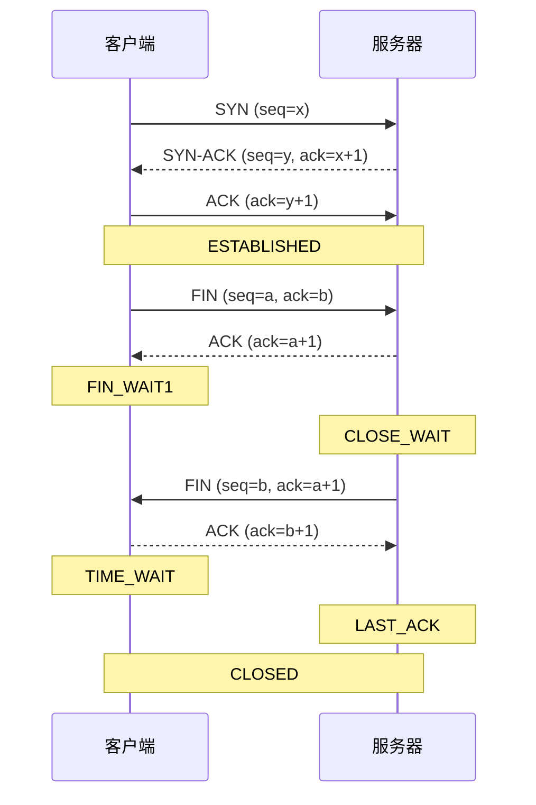
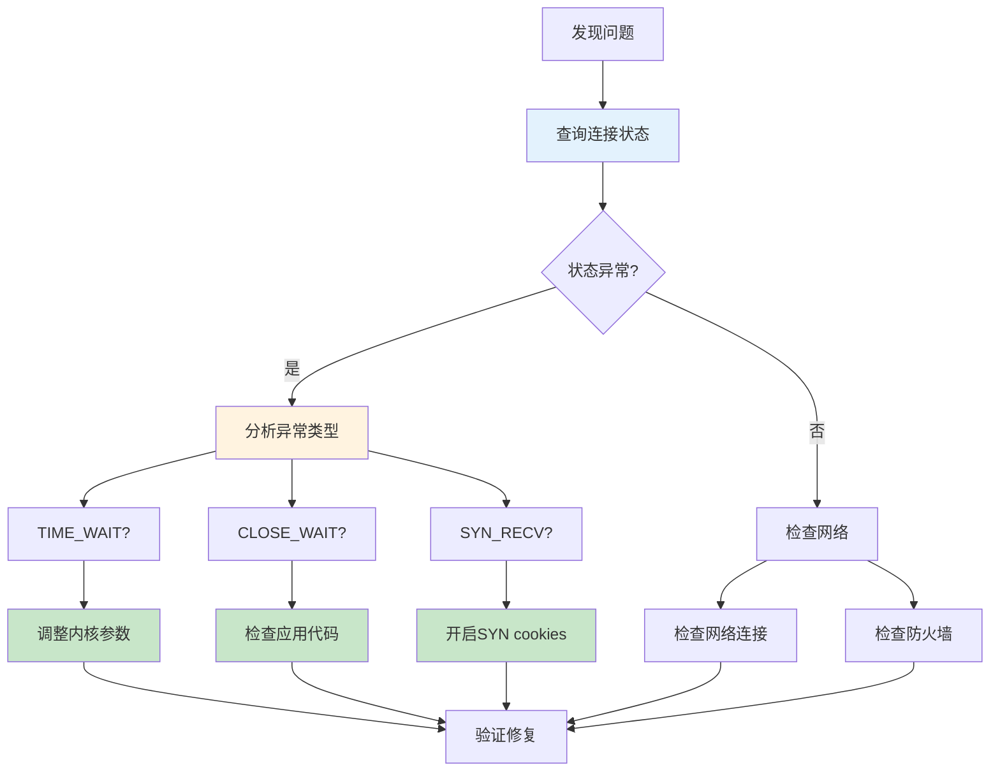

# TCP连接管理生产环境最佳实践：从状态分析到性能优化

## 情境(Situation)

TCP连接是网络通信的基础，连接状态是网络健康的"体温计"。在生产环境中，**大量TIME_WAIT可能导致端口耗尽，CLOSE_WAIT往往暗示应用内存泄漏**，ESTABLISHED突增可能是DDoS攻击。

作为SRE工程师，掌握TCP连接状态的查询、分析和优化技能，对于保障服务的高可用性和性能至关重要。不会查TCP状态，就像医生不会量体温。

## 冲突(Conflict)

许多SRE工程师在TCP连接管理中遇到以下挑战：

- **连接状态异常**：大量TIME_WAIT或CLOSE_WAIT状态
- **性能问题**：高并发下连接处理能力不足
- **故障排查困难**：难以快速定位网络问题
- **内核参数调优**：不知道如何调整TCP参数
- **安全风险**：SYN攻击防护不足
- **监控缺失**：缺乏连接状态的有效监控

## 问题(Question)

如何在生产环境中高效管理TCP连接，实现状态快速查询、异常及时发现、性能优化和安全防护？

## 答案(Answer)

本文将从SRE视角出发，结合真实生产案例，提供一套完整的TCP连接管理生产环境最佳实践。核心方法论基于 [SRE面试题解析：如何查询当前Linux主机上各种TCP连接状态的个数？TCP连接状态有多少种？](#18-如何查询当前linux主机上各种tcp连接状态的个数tcp连接状态有多少种)。

---

## 一、TCP连接状态基础

### 1.1 TCP状态转换图



### 1.2 TCP状态详解

| 状态 | 含义 | 常见原因 | 处理方法 |
|:-----|:-----|:---------|:----------|
| **LISTEN** | 监听状态 | 服务器正常 | 无需处理 |
| **SYN_SENT** | 发送SYN后等待 | 连接超时 | 检查网络 |
| **SYN_RECV** | 收到SYN后等待 | SYN攻击 | 开启SYN cookies |
| **ESTABLISHED** | 连接已建立 | 正常业务 | 监控数量 |
| **FIN_WAIT1** | 主动关闭等待ACK | 网络延迟 | 调整超时 |
| **FIN_WAIT2** | 等待对方FIN | 应用未关闭 | 检查应用 |
| **TIME_WAIT** | 等待2MSL | 主动关闭方 | 优化参数 |
| **CLOSE_WAIT** | 被动关闭等待应用 | 应用内存泄漏 | 检查代码 |
| **LAST_ACK** | 被动关闭等待ACK | 网络延迟 | 调整超时 |
| **CLOSING** | 双方同时关闭 | 并发关闭 | 正常现象 |
| **CLOSED** | 连接完全关闭 | 正常结束 | 无需处理 |

### 1.3 2MSL原理

**MSL（Maximum Segment Lifetime）**：报文最大生存时间，默认60秒

**TIME_WAIT状态持续2MSL的原因**：
1. **保证最后一个ACK能到达对方**：防止ACK丢失导致对方重发FIN
2. **等待网络中残留的报文过期**：避免新连接收到旧连接的报文
3. **确保连接完全关闭**：让连接的所有资源有足够时间释放

---

## 二、TCP连接状态查询

### 2.1 常用工具对比

| 工具 | 命令 | 适用场景 | 效率 | 优势 |
|:-----|:-----|:---------|:-----|:------|
| **ss** | `ss -s` | 快速总览 | ⭐⭐⭐ | 高效，适合高并发 |
| **ss** | `ss -nta` | 详细查看 | ⭐⭐⭐ | 输出简洁，信息完整 |
| **netstat** | `netstat -s` | 统计信息 | ⭐⭐ | 传统工具，兼容性好 |
| **netstat** | `netstat -nta` | 详细查看 | ⭐ | 效率低，适合小环境 |
| **lsof** | `lsof -i` | 进程关联 | ⭐⭐ | 查看进程与端口关系 |
| **ss** | `ss -o` | 详细选项 | ⭐⭐⭐ | 显示定时器信息 |

### 2.2 核心查询命令

**快速统计总览**：

```bash
# 快速查看连接统计
ss -s

# 输出示例
# Total: 12345 (kernel 13500)
# TCP:   1234 (estab 456, closed 789, orphaned 0, synrecv 0, timewait 321/0), ports 456
# Transport Total     IP        IPv6
# *         12345     -         -        
# RAW       0         0         0        
# UDP       123       45        78       
# TCP       456       321       135      
# INET      579       366       213      
# FRAG      0         0         0        
```

**按状态统计个数**：

```bash
# 推荐：使用ss统计（高效）
ss -nta | awk '{print $1}' | sort | uniq -c | sort -nr

# 传统：使用netstat统计（较慢）
netstat -nta | awk '{print $6}' | sort | uniq -c | sort -nr

# 输出示例
# 456 ESTAB
# 321 TIME-WAIT
# 123 LISTEN
# 45 CLOSE-WAIT
# 12 SYN-SENT
# 5 SYN-RECV
```

**查看特定状态**：

```bash
# 查看TIME_WAIT状态
ss -nta | grep TIME-WAIT

# 查看CLOSE_WAIT状态
ss -nta | grep CLOSE-WAIT

# 查看SYN_RECV状态
ss -nta | grep SYN-RECV

# 查看ESTABLISHED状态
ss -nta | grep ESTAB
```

**查看特定端口**：

```bash
# 查看80端口连接
ss -nta | grep :80

# 查看443端口连接
ss -nta | grep :443

# 查看3306端口连接
ss -nta | grep :3306
```

**进程关联查看**：

```bash
# 查看所有网络连接的进程
lsof -i

# 查看特定端口的进程
lsof -i :80
lsof -i :443

# 查看特定进程的连接
lsof -p <PID>

# 查看ESTABLISHED连接的进程
ss -ntap | grep ESTAB
```

### 2.3 高级查询技巧

**按源IP统计**：

```bash
# 统计每个IP的连接数
ss -nta | awk '{print $4}' | cut -d: -f1 | sort | uniq -c | sort -nr

# 统计特定端口的IP连接数
ss -nta | grep :80 | awk '{print $4}' | cut -d: -f1 | sort | uniq -c | sort -nr
```

**按目标端口统计**：

```bash
# 统计每个端口的连接数
ss -nta | awk '{print $5}' | cut -d: -f2 | sort | uniq -c | sort -nr

# 统计特定状态的端口连接数
ss -nta | grep ESTAB | awk '{print $5}' | cut -d: -f2 | sort | uniq -c | sort -nr
```

**连接时间统计**：

```bash
# 查看连接时间（需要内核支持）
ss -nto | grep ESTAB | awk '{print $6, $4, $5}'

# 输出示例：timer:(keepalive,2h45m0s,0) 192.168.1.100:54321 10.0.0.1:80
```

**连接状态变化监控**：

```bash
#!/bin/bash
# tcp_monitor.sh - TCP连接状态监控脚本

INTERVAL=5
LOG_FILE="/var/log/tcp_monitor.log"

log() {
    echo "[$(date '+%Y-%m-%d %H:%M:%S')] $*" >> "$LOG_FILE"
}

monitor() {
    while true; do
        log "=== TCP连接状态统计 ==="
        ss -s >> "$LOG_FILE"
        log "=== 按状态统计 ==="
        ss -nta | awk '{print $1}' | sort | uniq -c | sort -nr >> "$LOG_FILE"
        log ""        sleep $INTERVAL
    done
}

monitor
```

---

## 三、TCP连接问题分析

### 3.1 常见问题识别

| 问题 | 现象 | 可能原因 | 解决方案 |
|:-----|:-----|:---------|:----------|
| **TIME_WAIT过多** | ss -s显示大量timewait | 短连接过多 | 调整内核参数 |
| **CLOSE_WAIT过多** | ss -s显示大量closewait | 应用未关闭连接 | 检查应用代码 |
| **SYN_RECV过多** | ss -s显示大量synrecv | SYN攻击 | 开启SYN cookies |
| **ESTABLISHED突增** | 连接数突然增加 | DDoS攻击 | 限流防护 |
| **FIN_WAIT1/FIN_WAIT2过多** | 大量半关闭状态 | 网络延迟 | 调整超时参数 |
| **端口耗尽** | 无法建立新连接 | 端口复用不足 | 调整端口范围 |

### 3.2 TIME_WAIT问题分析

**原因**：
- 短连接场景（HTTP/1.0）
- 服务端主动关闭连接
- 高并发场景下连接快速建立和关闭

**影响**：
- 占用本地端口
- 消耗系统资源
- 可能导致端口耗尽

**解决方案**：

```bash
# 临时调整（立即生效）
sysctl -w net.ipv4.tcp_tw_reuse=1
sysctl -w net.ipv4.tcp_tw_recycle=1
sysctl -w net.ipv4.tcp_fin_timeout=30
sysctl -w net.ipv4.tcp_max_tw_buckets=5000
sysctl -w net.ipv4.ip_local_port_range="1024 65535"

# 永久调整
cat >> /etc/sysctl.conf << EOF
# TCP TIME_WAIT优化
net.ipv4.tcp_tw_reuse = 1
net.ipv4.tcp_tw_recycle = 1
net.ipv4.tcp_fin_timeout = 30
net.ipv4.tcp_max_tw_buckets = 5000
net.ipv4.ip_local_port_range = 1024 65535
EOF

# 应用配置
sysctl -p
```

### 3.3 CLOSE_WAIT问题分析

**原因**：
- 应用程序未正确关闭socket
- 应用程序异常（死锁、阻塞）
- 网络异常导致连接未正常关闭

**影响**：
- 占用系统资源
- 可能导致文件描述符耗尽
- 影响服务性能

**解决方案**：

```bash
# 查找CLOSE_WAIT状态的进程
ss -ntap | grep CLOSE-WAIT

# 查看进程详情
ps aux | grep <PID>

# 分析应用代码
# 1. 检查是否正确关闭socket
# 2. 检查异常处理是否完整
# 3. 检查超时设置是否合理

# 示例：正确的socket关闭方式（Python）
import socket

s = socket.socket(socket.AF_INET, socket.SOCK_STREAM)
try:
    s.connect(("example.com", 80))
    # 业务逻辑
finally:
    s.close()  # 确保关闭
```

### 3.4 SYN攻击防护

**原因**：
- 攻击者发送大量SYN包但不完成三次握手
- 服务器资源被耗尽

**影响**：
- 服务不可用
- 系统资源耗尽

**解决方案**：

```bash
# 临时调整
sysctl -w net.ipv4.tcp_syncookies=1
sysctl -w net.ipv4.tcp_max_syn_backlog=4096
sysctl -w net.ipv4.tcp_synack_retries=2
sysctl -w net.ipv4.tcp_syn_retries=2

# 永久调整
cat >> /etc/sysctl.conf << EOF
# SYN攻击防护
net.ipv4.tcp_syncookies = 1
net.ipv4.tcp_max_syn_backlog = 4096
net.ipv4.tcp_synack_retries = 2
net.ipv4.tcp_syn_retries = 2
EOF

# 应用配置
sysctl -p
```

---

## 四、TCP性能优化

### 4.1 内核参数优化

**基础优化**：

```bash
# 临时调整
sysctl -w net.core.somaxconn=65535
sysctl -w net.ipv4.tcp_max_syn_backlog=65535
sysctl -w net.ipv4.tcp_fin_timeout=30
sysctl -w net.ipv4.tcp_keepalive_time=600
sysctl -w net.ipv4.tcp_keepalive_probes=3
sysctl -w net.ipv4.tcp_keepalive_intvl=15
sysctl -w net.core.netdev_max_backlog=65535
sysctl -w net.ipv4.tcp_fastopen=3

# 永久调整
cat >> /etc/sysctl.conf << EOF
# TCP基础优化
net.core.somaxconn = 65535
net.ipv4.tcp_max_syn_backlog = 65535
net.ipv4.tcp_fin_timeout = 30
net.ipv4.tcp_keepalive_time = 600
net.ipv4.tcp_keepalive_probes = 3
net.ipv4.tcp_keepalive_intvl = 15
net.core.netdev_max_backlog = 65535
net.ipv4.tcp_fastopen = 3
EOF

# 应用配置
sysctl -p
```

**高并发优化**：

```bash
# 临时调整
sysctl -w net.ipv4.tcp_tw_reuse=1
sysctl -w net.ipv4.tcp_tw_recycle=1
sysctl -w net.ipv4.ip_local_port_range="1024 65535"
sysctl -w net.ipv4.tcp_max_tw_buckets=5000
sysctl -w net.ipv4.tcp_max_orphans=32768
sysctl -w net.ipv4.tcp_slow_start_after_idle=0
sysctl -w net.ipv4.tcp_no_metrics_save=1
sysctl -w net.ipv4.tcp_moderate_rcvbuf=1

# 永久调整
cat >> /etc/sysctl.conf << EOF
# 高并发优化
net.ipv4.tcp_tw_reuse = 1
net.ipv4.tcp_tw_recycle = 1
net.ipv4.ip_local_port_range = 1024 65535
net.ipv4.tcp_max_tw_buckets = 5000
net.ipv4.tcp_max_orphans = 32768
net.ipv4.tcp_slow_start_after_idle = 0
net.ipv4.tcp_no_metrics_save = 1
net.ipv4.tcp_moderate_rcvbuf = 1
EOF

# 应用配置
sysctl -p
```

**内存优化**：

```bash
# 临时调整
sysctl -w net.core.rmem_max=16777216
sysctl -w net.core.wmem_max=16777216
sysctl -w net.ipv4.tcp_rmem="4096 87380 16777216"
sysctl -w net.ipv4.tcp_wmem="4096 65536 16777216"
sysctl -w net.ipv4.tcp_mem="16777216 16777216 16777216"

# 永久调整
cat >> /etc/sysctl.conf << EOF
# 内存优化
net.core.rmem_max = 16777216
net.core.wmem_max = 16777216
net.ipv4.tcp_rmem = 4096 87380 16777216
net.ipv4.tcp_wmem = 4096 65536 16777216
net.ipv4.tcp_mem = 16777216 16777216 16777216
EOF

# 应用配置
sysctl -p
```

### 4.2 应用层优化

**HTTP优化**：

```nginx
# Nginx配置
http {
    # 开启keepalive
    keepalive_timeout 65;
    keepalive_requests 100;
    
    # 调整缓冲区
    client_header_buffer_size 4k;
    large_client_header_buffers 8 16k;
    client_body_buffer_size 128k;
    
    # 调整超时
    client_body_timeout 12;
    client_header_timeout 12;
    send_timeout 10;
}
```

**Socket优化**：

```python
# Python socket优化
import socket
import time

# 创建socket
s = socket.socket(socket.AF_INET, socket.SOCK_STREAM)

# 设置选项
s.setsockopt(socket.SOL_SOCKET, socket.SO_REUSEADDR, 1)
s.setsockopt(socket.IPPROTO_TCP, socket.TCP_NODELAY, 1)
s.setsockopt(socket.SOL_SOCKET, socket.SO_KEEPALIVE, 1)
s.setsockopt(socket.IPPROTO_TCP, socket.TCP_KEEPIDLE, 600)
s.setsockopt(socket.IPPROTO_TCP, socket.TCP_KEEPINTVL, 15)
s.setsockopt(socket.IPPROTO_TCP, socket.TCP_KEEPCNT, 3)

# 绑定和监听
s.bind(("0.0.0.0", 8080))
s.listen(128)

# 接受连接
while True:
    conn, addr = s.accept()
    # 处理连接
    conn.close()
```

**数据库连接池**：

```python
# Redis连接池
import redis

pool = redis.ConnectionPool(
    host='localhost',
    port=6379,
    db=0,
    max_connections=100,
    socket_keepalive=True,
    socket_timeout=30
)
r = redis.Redis(connection_pool=pool)

# MySQL连接池
import pymysql
from DBUtils.PooledDB import PooledDB

pool = PooledDB(
    creator=pymysql,
    maxconnections=100,
    mincached=20,
    maxcached=50,
    maxshared=30,
    blocking=True,
    maxusage=None,
    setsession=[],
    ping=0,
    host='localhost',
    user='root',
    password='password',
    database='test',
    charset='utf8mb4'
)

# 获取连接
conn = pool.connection()
cursor = conn.cursor()
cursor.execute('SELECT 1')
print(cursor.fetchone())
cursor.close()
conn.close()  # 实际上是返回连接池
```

### 4.3 负载均衡优化

**Nginx负载均衡**：

```nginx
http {
    upstream backend {
        server 192.168.1.10:8080 max_fails=3 fail_timeout=30s;
        server 192.168.1.11:8080 max_fails=3 fail_timeout=30s;
        server 192.168.1.12:8080 max_fails=3 fail_timeout=30s;
        
        # 健康检查
        check interval=3000 rise=2 fall=3 timeout=1000;
        
        # 连接复用
        keepalive 32;
        keepalive_timeout 60s;
        keepalive_requests 100;
    }
    
    server {
        listen 80;
        server_name example.com;
        
        location / {
            proxy_pass http://backend;
            proxy_http_version 1.1;
            proxy_set_header Connection "";
            proxy_set_header Host $host;
            proxy_set_header X-Real-IP $remote_addr;
            proxy_set_header X-Forwarded-For $proxy_add_x_forwarded_for;
        }
    }
}
```

**HAProxy负载均衡**：

```haproxy
frontend http_front
    bind *:80
    default_backend http_back

backend http_back
    balance roundrobin
    option http-keep-alive
    timeout http-keep-alive 60s
    server server1 192.168.1.10:8080 check inter 3s fall 3 rise 2
    server server2 192.168.1.11:8080 check inter 3s fall 3 rise 2
    server server3 192.168.1.12:8080 check inter 3s fall 3 rise 2
```

---

## 五、TCP连接监控

### 5.1 系统监控

**Prometheus监控**：

```yaml
# node_exporter 已包含TCP连接监控

# 自定义监控规则
groups:
  - name: tcp_status
    rules:
    - alert: TcpTimeWaitHigh
      expr: node_sockstat_TCP_timewait >= 1000
      for: 5m
      labels:
        severity: warning
      annotations:
        summary: "TIME_WAIT连接数过高"
        description: "TIME_WAIT连接数已超过1000，可能导致端口耗尽"
    
    - alert: TcpCloseWaitHigh
      expr: node_sockstat_TCP_closewait >= 100
      for: 5m
      labels:
        severity: critical
      annotations:
        summary: "CLOSE_WAIT连接数过高"
        description: "CLOSE_WAIT连接数已超过100，可能存在应用内存泄漏"
    
    - alert: TcpSynRecvHigh
      expr: node_sockstat_TCP_synrecv >= 100
      for: 5m
      labels:
        severity: critical
      annotations:
        summary: "SYN_RECV连接数过高"
        description: "SYN_RECV连接数已超过100，可能遭受SYN攻击"
```

**Grafana仪表盘**：

1. **TCP连接状态面板**：显示各种状态的连接数
2. **连接趋势面板**：显示连接数的历史趋势
3. **端口使用面板**：显示端口使用情况
4. **异常状态告警**：当连接状态异常时触发告警

### 5.2 自定义监控

**TCP连接监控脚本**：

```bash
#!/bin/bash
# tcp_connection_monitor.sh - TCP连接监控脚本

INTERVAL=60
ALERT_EMAIL="admin@example.com"
LOG_FILE="/var/log/tcp_monitor.log"

# 阈值
TIME_WAIT_THRESHOLD=1000
CLOSE_WAIT_THRESHOLD=100
SYN_RECV_THRESHOLD=100

log() {
    echo "[$(date '+%Y-%m-%d %H:%M:%S')] $*"
    echo "[$(date '+%Y-%m-%d %H:%M:%S')] $*" >> "$LOG_FILE"
}

check_tcp_status() {
    log "=== TCP连接状态检查 ==="
    
    # 获取连接状态
    ss_output=$(ss -s)
    log "$ss_output"
    
    # 提取状态数量
    time_wait=$(echo "$ss_output" | grep -oP "timewait \K\d+")
    close_wait=$(echo "$ss_output" | grep -oP "closed \K\d+")
    syn_recv=$(echo "$ss_output" | grep -oP "synrecv \K\d+")
    established=$(echo "$ss_output" | grep -oP "estab \K\d+")
    
    log "TIME_WAIT: $time_wait"
    log "CLOSE_WAIT: $close_wait"
    log "SYN_RECV: $syn_recv"
    log "ESTABLISHED: $established"
    
    # 检查阈值
    alerts=()
    
    if [ "$time_wait" -gt "$TIME_WAIT_THRESHOLD" ]; then
        alerts+="TIME_WAIT连接数过高: $time_wait"
    fi
    
    if [ "$close_wait" -gt "$CLOSE_WAIT_THRESHOLD" ]; then
        alerts+="CLOSE_WAIT连接数过高: $close_wait"
    fi
    
    if [ "$syn_recv" -gt "$SYN_RECV_THRESHOLD" ]; then
        alerts+="SYN_RECV连接数过高: $syn_recv"
    fi
    
    # 发送告警
    if [ ${#alerts[@]} -gt 0 ]; then
        message="TCP连接状态异常：\n"
        for alert in "${alerts[@]}"; do
            message+="- $alert\n"
        done
        message+="\n详细信息:\n$ss_output"
        
        log "发送告警: $message"
        echo "$message" | mail -s "TCP连接状态告警" $ALERT_EMAIL
    fi
}

main() {
    while true; do
        check_tcp_status
        sleep $INTERVAL
    done
}

main
```

**TCP连接分析工具**：

```python
#!/usr/bin/env python3
# tcp_analyzer.py - TCP连接分析工具

import subprocess
import re
import time
import json

def get_tcp_status():
    """获取TCP连接状态"""
    result = subprocess.run(['ss', '-s'], capture_output=True, text=True)
    output = result.stdout
    
    # 解析输出
    status = {}
    
    # 提取TCP统计
    tcp_match = re.search(r'TCP:\s+inet\s+(\d+)\s+established,\s+(\d+)\s+closed,.*timewait\s+(\d+)/(\d+)', output)
    if tcp_match:
        status['established'] = int(tcp_match.group(1))
        status['closed'] = int(tcp_match.group(2))
        status['timewait'] = int(tcp_match.group(3))
    
    # 提取详细状态
    ss_result = subprocess.run(['ss', '-nta'], capture_output=True, text=True)
    lines = ss_result.stdout.strip().split('\n')[1:]  # 跳过标题行
    
    status_counts = {}
    for line in lines:
        parts = line.split()
        if len(parts) < 5:
            continue
        state = parts[0]
        status_counts[state] = status_counts.get(state, 0) + 1
    
    status['details'] = status_counts
    return status

def analyze_tcp_status(status):
    """分析TCP连接状态"""
    alerts = []
    
    # 检查TIME_WAIT
    if status.get('timewait', 0) > 1000:
        alerts.append(f"TIME_WAIT连接数过高: {status['timewait']}")
    
    # 检查CLOSE_WAIT
    if status['details'].get('CLOSE-WAIT', 0) > 100:
        alerts.append(f"CLOSE_WAIT连接数过高: {status['details']['CLOSE-WAIT']}")
    
    # 检查SYN_RECV
    if status['details'].get('SYN-RECV', 0) > 100:
        alerts.append(f"SYN_RECV连接数过高: {status['details']['SYN-RECV']}")
    
    return alerts

def main():
    """主函数"""
    while True:
        status = get_tcp_status()
        alerts = analyze_tcp_status(status)
        
        print(f"[{time.strftime('%Y-%m-%d %H:%M:%S')}]")
        print(json.dumps(status, indent=2))
        
        if alerts:
            print("\n告警:")
            for alert in alerts:
                print(f"- {alert}")
        
        print("\n" + "-" * 50 + "\n")
        time.sleep(60)

if __name__ == "__main__":
    main
```

---

## 六、TCP连接故障排查

### 6.1 排查流程



### 6.2 实战案例

**案例1：TIME_WAIT过多**

**背景**：高并发Web服务，端口耗尽，无法建立新连接

**排查**：
```bash
# 1. 查看连接状态
ss -s
# 发现：timewait 15000+

# 2. 分析原因
# 短连接场景，服务端主动关闭连接

# 3. 解决方案
sysctl -w net.ipv4.tcp_tw_reuse=1
sysctl -w net.ipv4.tcp_tw_recycle=1
sysctl -w net.ipv4.tcp_fin_timeout=30
sysctl -w net.ipv4.ip_local_port_range="1024 65535"

# 4. 验证
ss -s
# timewait 降至正常水平
```

**案例2：CLOSE_WAIT过多**

**背景**：应用响应缓慢，服务器负载升高

**排查**：
```bash
# 1. 查看连接状态
ss -s
# 发现：closewait 200+

# 2. 查找相关进程
ss -ntap | grep CLOSE-WAIT
# 发现：Python应用占用大量CLOSE-WAIT连接

# 3. 分析应用代码
# 发现：应用未正确关闭socket连接

# 4. 修复代码
# 确保在finally块中关闭socket

# 5. 验证
ss -s
# closewait 降至0
```

**案例3：SYN攻击**

**背景**：服务器突然无法响应，CPU和内存使用率升高

**排查**：
```bash
# 1. 查看连接状态
ss -s
# 发现：synrecv 500+

# 2. 开启SYN cookies
sysctl -w net.ipv4.tcp_syncookies=1
sysctl -w net.ipv4.tcp_max_syn_backlog=4096

# 3. 配置防火墙
iptables -A INPUT -p tcp --syn -m limit --limit 20/s --limit-burst 100 -j ACCEPT
iptables -A INPUT -p tcp --syn -j DROP

# 4. 验证
ss -s
# synrecv 降至正常水平
```

---

## 七、最佳实践总结

### 7.1 监控与告警

**监控指标**：
- TIME_WAIT连接数
- CLOSE_WAIT连接数
- SYN_RECV连接数
- ESTABLISHED连接数
- 端口使用情况
- TCP重传率

**告警阈值**：
- TIME_WAIT > 1000
- CLOSE_WAIT > 100
- SYN_RECV > 100
- ESTABLISHED突增50%

### 7.2 性能优化建议

**内核参数**：
- `net.ipv4.tcp_tw_reuse`：开启TIME_WAIT复用
- `net.ipv4.tcp_tw_recycle`：开启TIME_WAIT快速回收
- `net.ipv4.tcp_fin_timeout`：减少FIN_WAIT2超时
- `net.ipv4.ip_local_port_range`：扩大端口范围
- `net.core.somaxconn`：增加监听队列大小
- `net.ipv4.tcp_max_syn_backlog`：增加SYN队列大小

**应用优化**：
- 使用长连接（keepalive）
- 实现连接池
- 正确关闭socket连接
- 设置合理的超时参数
- 优化应用架构

### 7.3 安全防护

**SYN攻击防护**：
- 开启SYN cookies
- 调整SYN队列大小
- 配置防火墙限流
- 使用DDoS防护服务

**连接安全**：
- 使用TLS/SSL加密
- 配置合适的超时
- 实现连接认证
- 监控异常连接

### 7.4 工具推荐

**命令行工具**：
- **ss**：高效的连接查看工具
- **netstat**：传统连接查看工具
- **lsof**：进程关联查看工具
- **tcpdump**：网络抓包工具
- **iftop**：网络流量监控工具

**监控工具**：
- **Prometheus**：监控系统
- **Grafana**：可视化工具
- **Zabbix**：监控系统
- **Nagios**：监控系统
- **Datadog**：云监控平台

**分析工具**：
- **Wireshark**：网络协议分析
- **tcpdump**：网络抓包
- **ss**：连接状态分析
- **netstat**：连接统计

---

## 总结

TCP连接管理是SRE工程师的核心技能之一，掌握连接状态的查询、分析和优化方法，可以有效保障服务的高可用性和性能。

**核心要点**：

1. **状态分析**：掌握TCP 11种状态的含义和常见问题
2. **查询工具**：熟练使用ss、netstat等工具查询连接状态
3. **性能优化**：合理调整内核参数和应用配置
4. **故障排查**：快速定位和解决连接问题
5. **监控告警**：建立完善的连接状态监控机制
6. **安全防护**：防范SYN攻击等安全威胁

> **延伸学习**：更多面试相关的TCP连接知识，请参考 [SRE面试题解析：如何查询当前Linux主机上各种TCP连接状态的个数？TCP连接状态有多少种？](#18-如何查询当前linux主机上各种tcp连接状态的个数tcp连接状态有多少种)。

---

## 参考资料

- [RFC 793 - Transmission Control Protocol](https://tools.ietf.org/html/rfc793)
- [TCP状态机详解](https://en.wikipedia.org/wiki/Transmission_Control_Protocol#Protocol_operation)
- [Linux内核文档](https://www.kernel.org/doc/Documentation/networking/ip-sysctl.txt)
- [ss命令手册](https://man7.org/linux/man-pages/man8/ss.8.html)
- [netstat命令手册](https://man7.org/linux/man-pages/man8/netstat.8.html)
- [TCP/IP详解 卷1：协议](https://www.amazon.com/TCP-IP-Illustrated-Vol-Protocol/dp/0201633469)
- [Linux性能优化](https://www.oreilly.com/library/view/linux-performance-optimization/9781492056541/)
- [高并发系统设计](https://www.amazon.com/Designing-Data-Intensive-Applications-Reliable-Maintainable/dp/1449373321)
- [网络安全最佳实践](https://www.cisecurity.org/cis-benchmarks/)
- [Prometheus监控](https://prometheus.io/docs/introduction/overview/)
- [Grafana仪表盘](https://grafana.com/docs/grafana/latest/dashboards/)
- [Nginx性能优化](https://www.nginx.com/blog/tuning-nginx/)
- [Redis连接池](https://redis.io/topics/clients)
- [MySQL连接池](https://dev.mysql.com/doc/refman/8.0/en/connection-pooling.html)