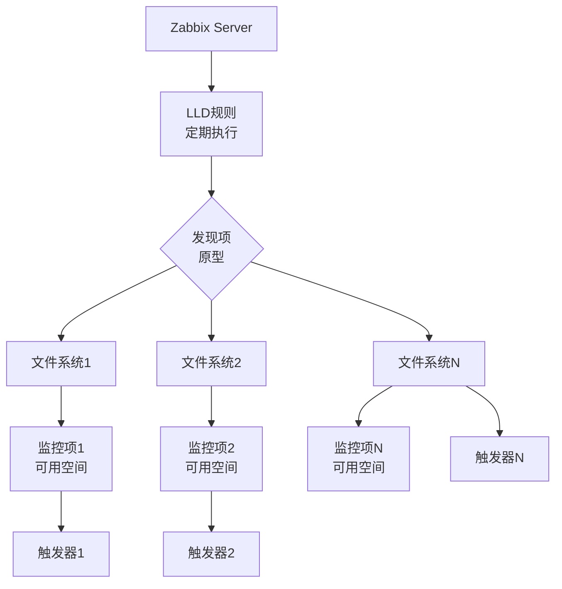
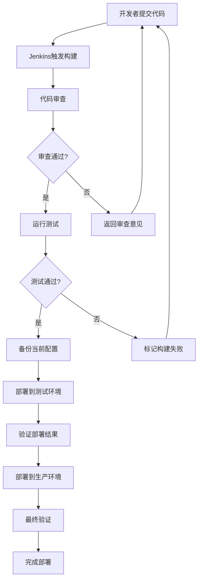

# Zabbix自动化运维生产环境最佳实践：从手动到智能

## 情境(Situation)

在大规模生产环境中，手动管理Zabbix监控系统面临三大痛点：**配置漂移、人为错误、扩展性差**。当服务器数量达到数百台时，手动添加主机、配置监控项会消耗大量时间，且容易出错。更糟糕的是，手动管理难以保证配置的一致性，导致监控效果参差不齐，故障排查困难。

作为SRE工程师，如何将监控管理从"手动操作"升级为"代码化管理"，提高效率的同时保证一致性，成为了必须解决的挑战。

## 冲突(Conflict)

许多SRE工程师在Zabbix自动化运维过程中遇到以下挑战：

- **手动管理效率低**：数百台服务器需要逐一配置，耗时耗力
- **配置不一致**：不同工程师、不同时间点的配置存在差异
- **变更难以追溯**：配置变更没有记录，难以回滚和审计
- **扩展性差**：新增服务器需要重复手动操作
- **故障响应慢**：监控配置更新滞后，影响故障发现
- **测试困难**：没有测试环境验证配置变更

## 问题(Question)

如何实现Zabbix的自动化运维，实现监控即代码，提高效率和一致性？

## 答案(Answer)

本文将从SRE视角出发，结合真实生产案例，提供一套完整的Zabbix自动化运维生产环境最佳实践。核心方法论基于 [SRE面试题解析：如何做Zabbix的自动化运维？](#22-如何做zabbix的自动化运维)。

---

## 一、Zabbix自动化运维体系

### 1.1 自动化工具链

**核心工具**：

| 工具 | 用途 | 核心功能 | 适用场景 |
|:----:|------|----------|:----------|
| **Ansible** | 批量部署 | Agent安装配置 | 新环境初始化 |
| **Zabbix API** | 程序化操作 | 主机/模板管理 | 动态扩缩容 |
| **LLD** | 自动发现 | 端口/文件系统发现 | 动态监控项 |
| **Git** | 配置管理 | 版本控制 | 变更管理 |
| **Jenkins** | CI/CD | 配置部署 | 持续集成 |
| **Terraform** | 基础设施 | Zabbix资源编排 | 基础设施即代码 |

**自动化架构**：

```
+----------------+    +----------------+    +----------------+
|   Git仓库      |<-->|   Jenkins      |<-->|  Zabbix Server |
+----------------+    +----------------+    +----------------+
        ^                    ^                      ^
        |                    |                      |
        v                    v                      v
+----------------+    +----------------+    +----------------+
|  Ansible       |    |  Terraform     |    |  Zabbix API    |
|  Playbook      |    |  Scripts       |    |  Scripts       |
+----------------+    +----------------+    +----------------+
```

### 1.2 自动化实施路线图

**阶段一：基础自动化**
- Ansible批量部署Agent
- 自动注册配置
- 基础模板标准化

**阶段二：配置自动化**
- Zabbix API脚本化
- 模板导出导入自动化
- 主机批量管理

**阶段三：高级自动化**
- LLD动态监控
- Git配置管理
- CI/CD流水线

**阶段四：智能化**
- 自动扩缩容集成
- 智能告警处理
- 自动化故障恢复

---

## 二、自动注册与自动发现

### 2.1 Agent自动注册

**Agent端配置**：

```bash
# zabbix_agent2.conf 关键配置
Server=zabbix-server:10051          # 被动模式服务器
ServerActive=zabbix-server:10051     # 主动模式服务器
HostnameItem=system.hostname         # 自动获取主机名
HostMetadataItem=system.uname        # 元数据用于自动分类
RefreshActiveChecks=120              # 主动检查刷新间隔（秒）
BufferSize=100                       # 数据缓冲区大小

# 自定义元数据（可选）
# HostMetadataItem=system.sw.arch    # 操作系统架构
# HostMetadataItem=net.if.dns        # DNS域名
```

**自动注册规则配置**：

1. **创建自动注册动作**：
   - 路径：配置 → 动作 → 自动注册
   - 条件：HostMetadata 包含特定关键字
   - 操作：添加到主机组、链接模板

2. **主机组自动分配**：

| HostMetadata | 主机组 | 模板 |
|:-------------|:-------|:-----|
| `linux` | Linux服务器 | Template OS Linux |
| `windows` | Windows服务器 | Template OS Windows |
| `docker` | Docker主机 | Template Docker |
| `kubernetes` | K8S节点 | Template K8S |

**自动注册优势**：
- **零接触部署**：Agent安装后自动注册，无需手动配置
- **动态扩展**：新服务器自动加入监控
- **一致性**：所有服务器配置标准统一

### 2.2 低级别发现（LLD）

**LLD工作原理**：



**文件系统发现**：

```bash
# vfs.fs.discovery key返回JSON格式
{
    "data": [
        {"{#FSNAME}": "/", "{#FSTYPE}": "ext4"},
        {"{#FSNAME}": "/home", "{#FSTYPE}": "ext4"},
        {"{#FSNAME}": "/data", "{#FSTYPE}": "xfs"}
    ]
}
```

**LLD监控项原型**：

| 监控项 | Key | 类型 | 说明 |
|:-------|:-----|:-----|:-----|
| **磁盘空间** | vfs.fs.size[{#FSNAME},pused] | 数字(无正负) | 磁盘使用百分比 |
| **磁盘可用空间** | vfs.fs.size[{#FSNAME},free] | 数字(无正负) | 可用空间字节 |
| **磁盘总空间** | vfs.fs.size[{#FSNAME},total] | 数字(无正负) | 总空间字节 |
| **磁盘inode** | vfs.fs.inode[{#FSNAME},pused] | 数字(无正负) | inode使用百分比 |

**LLD触发器原型**：

| 触发器 | 表达式 | 严重性 | 说明 |
|:-------|:-------|:-------|:-----|
| **磁盘空间不足** | `last(/Template OS Linux/vfs.fs.size[{#FSNAME},pused])>85` | 警告 | 使用率超过85% |
| **磁盘空间严重不足** | `last(/Template OS Linux/vfs.fs.size[{#FSNAME},pused])>95` | 严重 | 使用率超过95% |

**网络接口发现**：

```bash
# net.if.discovery key返回JSON格式
{
    "data": [
        {"{#IFNAME}": "eth0", "{#IFTYPE}": "ether", "{#IP}": "192.168.1.100"},
        {"{#IFNAME}": "lo", "{#IFTYPE}": "loopback", "{#IP}": "127.0.0.1"}
    ]
}
```

**LLD监控项原型**：

| 监控项 | Key | 类型 | 说明 |
|:-------|:-----|:-----|:-----|
| **接口状态** | net.if.status[{#IFNAME}] | 数字(无正负) | 接口状态 |
| **接口流入速率** | net.if.in[{#IFNAME}] | 数字(浮点) | 入流量字节/秒 |
| **接口流出速率** | net.if.out[{#IFNAME}] | 数字(浮点) | 出流量字节/秒 |

**端口发现**：

```bash
# net.tcp.port.listen discovery key返回JSON格式
{
    "data": [
        {"{#PORT}": "22", "{#SERVICE}": "ssh"},
        {"{#PORT}": "80", "{#SERVICE}": "http"},
        {"{#PORT}": "443", "{#SERVICE}": "https"}
    ]
}
```

**进程发现**：

```bash
# proc.num discovery key返回JSON格式
{
    "data": [
        {"{#NAME}": "nginx", "{#CMDLINE}": "nginx: master"},
        {"{#NAME}": "mysqld", "{#CMDLINE}": "mysqld"}
    ]
}
```

---

## 三、Ansible批量部署

### 3.1 Ansible Playbook

**基础部署Playbook**：

```yaml
# zabbix-agent-deploy.yml
---
- name: 部署Zabbix Agent
  hosts: all
  become: yes
  vars:
    zabbix_server: zabbix-server.example.com
    zabbix_version: "6.0"
    zabbix_agent_port: 10050
    
  tasks:
    - name: 添加Zabbix仓库
      yum_repository:
        name: zabbix
        description: Zabbix Official Repository
        baseurl: https://repo.zabbix.com/zabbix/{{ zabbix_version }}/rhel8/x86_64/
        gpgkey: https://repo.zabbix.com/zabbix.key
        gpgcheck: yes
        enabled: yes
      when: ansible_os_family == "RedHat"
    
    - name: 安装Zabbix Agent
      package:
        name:
          - zabbix-agent2
          - zabbix-agent2-selinux
        state: present
    
    - name: 配置Zabbix Agent
      template:
        src: zabbix_agent2.conf.j2
        dest: /etc/zabbix/zabbix_agent2.conf
        owner: root
        group: root
        mode: 0644
      notify: restart zabbix agent
    
    - name: 启动Zabbix Agent
      service:
        name: zabbix-agent2
        state: started
        enabled: yes
    
    - name: 配置防火墙
      firewalld:
        service: zabbix-agent
        permanent: yes
        state: enabled
      when: ansible_facts['firewall'] is defined

  handlers:
    - name: restart zabbix agent
      service:
        name: zabbix-agent2
        state: restarted
```

**Agent配置文件模板**：

```bash
# zabbix_agent2.conf.j2
PidFile=/run/zabbix/zabbix_agent2.pid
LogFile=/var/log/zabbix/zabbix_agent2.log
LogFileSize=10

Server={{ zabbix_server }}
ServerActive={{ zabbix_server }}
Hostname={{ ansible_hostname }}
HostMetadataItem=system.uname

RefreshActiveChecks=120
BufferSend=5
BufferSize=100
MaxLinesPerSecond=20

Timeout=10

Include=/etc/zabbix/zabbix_agent2.d/*.conf
```

**主动模式部署Playbook**：

```yaml
# zabbix-agent-active-mode.yml
---
- name: 部署Zabbix Agent（主动模式）
  hosts: all
  become: yes
  vars:
    zabbix_server: zabbix-server.example.com
    zabbix_proxy: zabbix-proxy.example.com
    
  tasks:
    - name: 安装Zabbix Agent
      package:
        name: zabbix-agent2
        state: present
    
    - name: 配置Zabbix Agent（主动模式）
      template:
        src: zabbix_agent2_active.conf.j2
        dest: /etc/zabbix/zabbix_agent2.conf
      notify: restart zabbix agent
    
    - name: 创建主动模式配置目录
      file:
        path: /etc/zabbix/zabbix_agent2.d/active
        state: directory
        owner: zabbix
        group: zabbix
        mode: 0755
    
    - name: 启动Zabbix Agent
      service:
        name: zabbix-agent2
        state: started
        enabled: yes

  handlers:
    - name: restart zabbix agent
      service:
        name: zabbix-agent2
        state: restarted
```

### 3.2 主机组和模板管理

**批量创建主机组**：

```yaml
# zabbix-hostgroups.yml
---
- name: 创建Zabbix主机组
  hosts: localhost
  gather_facts: no
  vars:
    zabbix_url: http://zabbix-server/api_jsonrpc.php
    zabbix_user: Admin
    zabbix_password: zabbix
    
  tasks:
    - name: 获取认证令牌
      uri:
        url: "{{ zabbix_url }}"
        method: POST
        body_format: json
        body:
          jsonrpc: "2.0"
          method: "user.login"
          params:
            user: "{{ zabbix_user }}"
            password: "{{ zabbix_password }}"
          id: 1
        register: login_result
    
    - name: 创建主机组
      uri:
        url: "{{ zabbix_url }}"
        method: POST
        body_format: json
        body:
          jsonrpc: "2.0"
          method: "hostgroup.create"
          params:
            name: "{{ item.name }}"
          auth: "{{ login_result.json.result }}"
          id: 2
      loop:
        - { name: "Linux Servers" }
        - { name: "Windows Servers" }
        - { name: "Docker Hosts" }
        - { name: "Kubernetes Nodes" }
        - { name: "Database Servers" }
        - { name: "Web Servers" }
        - { name: "Application Servers" }
```

**批量部署主机**：

```yaml
# zabbix-hosts-batch.yml
---
- name: 批量创建Zabbix主机
  hosts: localhost
  gather_facts: no
  vars:
    zabbix_url: http://zabbix-server/api_jsonrpc.php
    zabbix_user: Admin
    zabbix_password: zabbix
    zabbix_templates:
      linux: "Template OS Linux"
      windows: "Template OS Windows"
    
  tasks:
    - name: 获取认证令牌
      uri:
        url: "{{ zabbix_url }}"
        method: POST
        body_format: json
        body:
          jsonrpc: "2.0"
          method: "user.login"
          params:
            user: "{{ zabbix_user }}"
            password: "{{ zabbix_password }}"
          id: 1
        register: login_result
    
    - name: 批量创建主机
      uri:
        url: "{{ zabbix_url }}"
        method: POST
        body_format: json
        body:
          jsonrpc: "2.0"
          method: "host.create"
          params:
            host: "{{ item.name }}"
            interfaces:
              - type: 1
                main: 1
                useip: 1
                ip: "{{ item.ip }}"
                port: "10050"
            groups:
              - groupid: "{{ item.groupid }}"
            templates:
              - templateid: "{{ item.templateid }}"
          auth: "{{ login_result.json.result }}"
          id: 2
      loop:
        - { name: "web-01", ip: "192.168.1.101", groupid: "5", templateid: "10001" }
        - { name: "web-02", ip: "192.168.1.102", groupid: "5", templateid: "10001" }
        - { name: "db-01", ip: "192.168.1.201", groupid: "6", templateid: "10002" }
```

---

## 四、Zabbix API自动化

### 4.1 API基础

**Python API封装**：

```python
#!/usr/bin/env python3
"""
Zabbix API Python封装
"""

import requests
import json
from typing import Optional, Dict, List, Any


class ZabbixAPI:
    def __init__(self, url: str, user: str, password: str):
        self.url = url
        self.user = user
        self.password = password
        self.auth_token: Optional[str] = None
        self.headers = {"Content-Type": "application/json-rpc"}
    
    def login(self) -> str:
        """登录获取认证令牌"""
        payload = {
            "jsonrpc": "2.0",
            "method": "user.login",
            "params": {
                "user": self.user,
                "password": self.password
            },
            "id": 1
        }
        response = requests.post(
            self.url, 
            data=json.dumps(payload), 
            headers=self.headers
        )
        result = response.json()
        if "error" in result:
            raise Exception(f"Login failed: {result['error']}")
        self.auth_token = result["result"]
        return self.auth_token
    
    def call(self, method: str, params: Dict[str, Any]) -> Any:
        """调用API方法"""
        if not self.auth_token:
            self.login()
        
        payload = {
            "jsonrpc": "2.0",
            "method": method,
            "params": params,
            "auth": self.auth_token,
            "id": 2
        }
        response = requests.post(
            self.url,
            data=json.dumps(payload),
            headers=self.headers
        )
        result = response.json()
        if "error" in result:
            raise Exception(f"API call failed: {result['error']}")
        return result["result"]
    
    def get_hosts(self, **kwargs) -> List[Dict]:
        """获取主机列表"""
        return self.call("host.get", kwargs)
    
    def create_host(self, **kwargs) -> str:
        """创建主机"""
        return self.call("host.create", kwargs)
    
    def update_host(self, hostid: str, **kwargs) -> Dict:
        """更新主机"""
        kwargs["hostid"] = hostid
        return self.call("host.update", kwargs)
    
    def delete_host(self, hostid: str) -> Dict:
        """删除主机"""
        return self.call("host.delete", [hostid])
    
    def get_templates(self, **kwargs) -> List[Dict]:
        """获取模板列表"""
        return self.call("template.get", kwargs)
    
    def get_groups(self, **kwargs) -> List[Dict]:
        """获取主机组列表"""
        return self.call("hostgroup.get", kwargs)
    
    def create_graph(self, **kwargs) -> str:
        """创建图形"""
        return self.call("graph.create", kwargs)
    
    def create_trigger(self, **kwargs) -> str:
        """创建触发器"""
        return self.call("trigger.create", kwargs)
    
    def logout(self):
        """登出"""
        if self.auth_token:
            self.call("user.logout", {})
            self.auth_token = None
```

### 4.2 主机管理自动化

**主机批量创建脚本**：

```python
#!/usr/bin/env python3
"""
批量创建Zabbix主机
"""

from zabbix_api import ZabbixAPI

def batch_create_hosts():
    api = ZabbixAPI(
        url="http://zabbix-server/api_jsonrpc.php",
        user="Admin",
        password="zabbix"
    )
    api.login()
    
    hosts = [
        {"name": "web-01", "ip": "192.168.1.101", "group": "Web Servers", "template": "Template OS Linux"},
        {"name": "web-02", "ip": "192.168.1.102", "group": "Web Servers", "template": "Template OS Linux"},
        {"name": "web-03", "ip": "192.168.1.103", "group": "Web Servers", "template": "Template OS Linux"},
        {"name": "db-01", "ip": "192.168.1.201", "group": "Database Servers", "template": "Template OS Linux"},
        {"name": "db-02", "ip": "192.168.1.202", "group": "Database Servers", "template": "Template OS Linux"},
    ]
    
    for host in hosts:
        try:
            result = api.create_host(
                host=host["name"],
                interfaces=[{
                    "type": 1,
                    "main": 1,
                    "useip": 1,
                    "ip": host["ip"],
                    "port": "10050"
                }],
                groups=[{"groupid": api.get_groups(filter={"name": host["group"]})[0]["groupid"]}],
                templates=[{"templateid": api.get_templates(filter={"host": host["template"]})[0]["templateid"]}]
            )
            print(f"Created host: {host['name']} (ID: {result['hostids'][0]})")
        except Exception as e:
            print(f"Failed to create host {host['name']}: {e}")
    
    api.logout()

if __name__ == "__main__":
    batch_create_hosts()
```

**主机状态管理脚本**：

```python
#!/usr/bin/env python3
"""
主机状态管理：启用/禁用/删除
"""

from zabbix_api import ZabbixAPI

def manage_host_status():
    api = ZabbixAPI(
        url="http://zabbix-server/api_jsonrpc.php",
        user="Admin",
        password="zabbix"
    )
    api.login()
    
    # 获取所有已禁用主机
    disabled_hosts = api.get_hosts(output=["hostid", "name", "status"], filter={"status": "1"})
    print(f"Disabled hosts: {len(disabled_hosts)}")
    for host in disabled_hosts:
        print(f"  - {host['name']} ({host['hostid']})")
    
    # 获取所有已启用主机
    enabled_hosts = api.get_hosts(output=["hostid", "name", "status"], filter={"status": "0"})
    print(f"\nEnabled hosts: {len(enabled_hosts)}")
    for host in enabled_hosts:
        print(f"  - {host['name']} ({host['hostid']})")
    
    # 批量禁用主机
    host_ids = [host["hostid"] for host in enabled_hosts[:5]]
    if host_ids:
        print(f"\nDisabling hosts: {host_ids}")
        api.call("host.massupdate", {
            "hosts": [{"hostid": hid} for hid in host_ids],
            "status": "1"
        })
    
    # 批量删除主机
    # host_ids = ["12345", "12346"]
    # api.call("host.delete", host_ids)
    
    api.logout()

if __name__ == "__main__":
    manage_host_status()
```

**模板管理脚本**：

```python
#!/usr/bin/env python3
"""
模板导入导出自动化
"""

import json
from zabbix_api import ZabbixAPI

def export_template(template_name: str, output_file: str):
    """导出模板到JSON文件"""
    api = ZabbixAPI(
        url="http://zabbix-server/api_jsonrpc.php",
        user="Admin",
        password="zabbix"
    )
    api.login()
    
    templates = api.get_templates(filter={"host": template_name}, output="extend")
    if not templates:
        print(f"Template {template_name} not found")
        return
    
    template = templates[0]
    template_id = template["templateid"]
    
    # 获取模板的监控项、触发器、图形等
    items = api.call("item.get", {"templateids": [template_id]})
    triggers = api.call("trigger.get", {"templateids": [template_id]})
    graphs = api.call("graph.get", {"templateids": [template_id]})
    dashboards = api.call("template.get", {"templateids": [template_id], "selectDashboards": "extend"})
    
    export_data = {
        "template": template,
        "items": items,
        "triggers": triggers,
        "graphs": graphs,
        "dashboards": dashboards
    }
    
    with open(output_file, "w", encoding="utf-8") as f:
        json.dump(export_data, f, indent=2, ensure_ascii=False)
    
    print(f"Template {template_name} exported to {output_file}")
    api.logout()

def import_template(input_file: str):
    """从JSON文件导入模板"""
    with open(input_file, "r", encoding="utf-8") as f:
        import_data = json.load(f)
    
    api = ZabbixAPI(
        url="http://zabbix-server/api_jsonrpc.php",
        user="Admin",
        password="zabbix"
    )
    api.login()
    
    # 导入配置
    result = api.call("configuration.import", {
        "format": "json",
        "rules": {
            "templates": {"createMissing": True, "updateExisting": True},
            "items": {"createMissing": True, "updateExisting": True},
            "triggers": {"createMissing": True, "updateExisting": True},
            "graphs": {"createMissing": True, "updateExisting": True}
        },
        "source": json.dumps(import_data)
    })
    
    if result:
        print(f"Template imported successfully")
    else:
        print(f"Template import failed")
    
    api.logout()

if __name__ == "__main__":
    export_template("Template OS Linux", "template_linux_export.json")
```

---

## 五、配置管理与CI/CD

### 5.1 Git配置管理

**目录结构**：

```bash
zabbix-config/
├── README.md
├── LICENSE
├── templates/
│   ├── linux/
│   │   ├── template_os_linux.yaml
│   │   ├── template_web_server.yaml
│   │   └── template_database.yaml
│   ├── windows/
│   │   └── template_os_windows.yaml
│   └── docker/
│       └── template_docker.yaml
├── scripts/
│   ├── zabbix_api.py
│   ├── backup_config.py
│   └── restore_config.py
├── playbooks/
│   ├── deploy_agent.yml
│   ├── create_hosts.yml
│   └── update_templates.yml
├── ci/
│   ├── Jenkinsfile
│   └── test_config.sh
└── docs/
    ├── getting_started.md
    └── best_practices.md
```

**模板版本控制**：

```yaml
# templates/linux/template_os_linux.yaml
---
template:
  name: "Template OS Linux"
  description: "Linux操作系统基础监控模板"
  version: "1.0.0"
  author: "SRE Team"
  
groups:
  - name: "Templates/Operation System"
  
items:
  - name: "CPU空闲率"
    type: "Zabbix Agent"
    key: "system.cpu.util[,idle]"
    value_type: "浮点数"
    units: "%"
    delay: "30s"
    
  - name: "内存可用空间"
    type: "Zabbix Agent"
    key: "vm.memory.size[available]"
    value_type: "数字(无正负)"
    units: "B"
    delay: "60s"
    
  - name: "磁盘空间 /"
    type: "Zabbix Agent"
    key: "vfs.fs.size[/,pused]"
    value_type: "数字(无正负)"
    units: "%"
    delay: "60s"
    
triggers:
  - name: "CPU使用率过高"
    expression: "last(/Template OS Linux/system.cpu.util[,idle])<20"
    priority: "警告"
    description: "CPU空闲率低于20%"
    
  - name: "内存可用空间不足"
    expression: "last(/Template OS Linux/vm.memory.size[available])<1G"
    priority: "警告"
    description: "内存可用空间低于1GB"
```

**提交规范**：

```
feat: 添加新模板
fix: 修复模板配置问题
docs: 更新文档
style: 代码格式调整
refactor: 重构模板配置
perf: 性能优化
test: 添加测试
chore: 维护任务
```

### 5.2 CI/CD流水线

**Jenkinsfile**：

```groovy
pipeline {
    agent any
    
    environment {
        ZABBIX_URL = credentials('zabbix-url')
        ZABBIX_USER = credentials('zabbix-user')
        ZABBIX_PASSWORD = credentials('zabbix-password')
    }
    
    stages {
        stage('Checkout') {
            steps {
                checkout scm
            }
        }
        
        stage('Validate') {
            steps {
                sh '''
                    echo "验证配置语法..."
                    ./ci/validate_yaml.sh templates/
                '''
            }
        }
        
        stage('Test') {
            steps {
                sh '''
                    echo "运行测试..."
                    ./ci/test_config.sh
                '''
            }
        }
        
        stage('Backup') {
            steps {
                sh '''
                    echo "备份当前配置..."
                    python3 scripts/backup_config.py --output /tmp/zabbix_backup_$(date +%Y%m%d)
                '''
                archiveArtifacts artifacts: '/tmp/zabbix_backup_*', fingerprint: true
            }
        }
        
        stage('Deploy') {
            when {
                branch 'main'
            }
            steps {
                sh '''
                    echo "部署到生产环境..."
                    python3 scripts/update_templates.py --env production
                '''
            }
        }
        
        stage('Verify') {
            steps {
                sh '''
                    echo "验证部署结果..."
                    python3 scripts/verify_deployment.py
                '''
            }
        }
    }
    
    post {
        always {
            cleanWs()
        }
        success {
            echo '部署成功！'
        }
        failure {
            echo '部署失败！'
        }
    }
}
```

**配置验证脚本**：

```bash
#!/bin/bash
# ci/validate_yaml.sh - 验证YAML语法

set -e

TEMPLATE_DIR="${1:-templates}"

echo "验证模板配置..."

for file in $(find "$TEMPLATE_DIR" -name "*.yaml" -o -name "*.yml"); do
    echo "检查文件: $file"
    python3 -c "
import yaml
import sys
try:
    with open('$file', 'r') as f:
        yaml.safe_load(f)
    print('  ✓ YAML语法正确')
except Exception as e:
    print(f'  ✗ YAML语法错误: {e}')
    sys.exit(1)
"
done

echo "验证完成！"
```

**测试配置脚本**：

```bash
#!/bin/bash
# ci/test_config.sh - 测试配置

set -e

ZABBIX_URL="${ZABBIX_URL:-http://zabbix-server/api_jsonrpc.php}"

echo "测试Zabbix连接..."
python3 -c "
from zabbix_api import ZabbixAPI
import os

api = ZabbixAPI(
    url=os.getenv('ZABBIX_URL', '$ZABBIX_URL'),
    user=os.getenv('ZABBIX_USER', 'Admin'),
    password=os.getenv('ZABBIX_PASSWORD', 'zabbix')
)
api.login()
print('  ✓ Zabbix API连接成功')
api.logout()
"

echo "验证模板配置..."
for template in $(ls templates/linux/*.yaml 2>/dev/null || true); do
    echo "  测试模板: $template"
    # 添加具体测试逻辑
done

echo "测试完成！"
```

---

## 六、自动化运维最佳实践

### 6.1 监控即代码

**核心原则**：

1. **版本控制**：所有监控配置纳入Git版本控制
2. **代码审查**：所有变更经过代码审查
3. **自动化测试**：配置变更前进行自动化测试
4. **环境一致**：测试、预发布、生产环境配置一致
5. **可追溯**：所有变更有记录，支持回滚

**工作流程**：



### 6.2 标准化模板

**模板层级设计**：

| 层级 | 模板名称 | 说明 | 依赖 |
|:-----|:---------|:-----|:-----|
| **基础层** | Template OS Linux | 操作系统基础监控 | 无 |
| **中间层** | Template Web Server | Web服务监控 | Template OS Linux |
| **应用层** | Template Nginx | Nginx监控 | Template Web Server |
| **业务层** | Template Business App | 业务应用监控 | 应用相关模板 |

**模板继承关系**：

```
Template OS Linux
    ├── Template Web Server
    │       ├── Template Nginx
    │       │       └── Template Nginx Performance
    │       ├── Template Apache
    │       │       └── Template Apache Performance
    │       └── Template PHP-FPM
    │               └── Template PHP-FPM Performance
    ├── Template Database
    │       ├── Template MySQL
    │       │       └── Template MySQL Performance
    │       ├── Template PostgreSQL
    │       │       └── Template PostgreSQL Performance
    │       └── Template Redis
    │               └── Template Redis Performance
    └── Template Docker
            └── Template Container
```

### 6.3 自动备份与恢复

**备份脚本**：

```python
#!/usr/bin/env python3
"""
Zabbix配置自动备份
"""

import os
import json
import tarfile
import datetime
from zabbix_api import ZabbixAPI

def backup_zabbix_config(output_dir: str):
    api = ZabbixAPI(
        url="http://zabbix-server/api_jsonrpc.php",
        user="Admin",
        password="zabbix"
    )
    api.login()
    
    timestamp = datetime.datetime.now().strftime("%Y%m%d_%H%M%S")
    backup_file = os.path.join(output_dir, f"zabbix_backup_{timestamp}")
    
    os.makedirs(backup_file, exist_ok=True)
    
    # 备份主机
    print("备份主机配置...")
    hosts = api.get_hosts(output="extend")
    with open(os.path.join(backup_file, "hosts.json"), "w") as f:
        json.dump(hosts, f, indent=2)
    
    # 备份模板
    print("备份模板配置...")
    templates = api.get_templates(output="extend")
    with open(os.path.join(backup_file, "templates.json"), "w") as f:
        json.dump(templates, f, indent=2)
    
    # 备份主机组
    print("备份主机组...")
    groups = api.get_groups(output="extend")
    with open(os.path.join(backup_file, "groups.json"), "w") as f:
        json.dump(groups, f, indent=2)
    
    # 导出完整配置
    print("导出完整配置...")
    export_data = api.call("configuration.export", {
        "format": "json",
        "options": {
            "templates": [t["templateid"] for t in templates],
            "hosts": [h["hostid"] for h in hosts],
            "groups": [g["groupid"] for g in groups]
        }
    })
    with open(os.path.join(backup_file, "full_export.json"), "w") as f:
        json.dump(export_data, f, indent=2)
    
    # 打包备份
    print("打包备份文件...")
    tar_file = f"{backup_file}.tar.gz"
    with tarfile.open(tar_file, "w:gz") as tar:
        tar.add(backup_file, arcname=os.path.basename(backup_file))
    
    # 清理临时目录
    import shutil
    shutil.rmtree(backup_file)
    
    print(f"备份完成: {tar_file}")
    api.logout()
    return tar_file

if __name__ == "__main__":
    import sys
    output_dir = sys.argv[1] if len(sys.argv) > 1 else "/tmp"
    backup_zabbix_config(output_dir)
```

**恢复脚本**：

```python
#!/usr/bin/env python3
"""
Zabbix配置恢复
"""

import os
import json
import tarfile
from zabbix_api import ZabbixAPI

def restore_zabbix_config(backup_file: str):
    api = ZabbixAPI(
        url="http://zabbix-server/api_jsonrpc.php",
        user="Admin",
        password="zabbix"
    )
    api.login()
    
    # 解压备份文件
    print(f"解压备份文件: {backup_file}")
    with tarfile.open(backup_file, "r:gz") as tar:
        extract_dir = backup_file.replace(".tar.gz", "")
        tar.extractall(path=os.path.dirname(backup_file))
    
    # 恢复主机组
    print("恢复主机组...")
    with open(os.path.join(extract_dir, "groups.json"), "r") as f:
        groups = json.load(f)
    
    for group in groups:
        try:
            existing = api.get_groups(filter={"name": group["name"]})
            if not existing:
                api.call("hostgroup.create", {"name": group["name"]})
                print(f"  创建主机组: {group['name']}")
            else:
                print(f"  主机组已存在: {group['name']}")
        except Exception as e:
            print(f"  创建主机组失败 {group['name']}: {e}")
    
    # 导入完整配置
    print("导入完整配置...")
    with open(os.path.join(extract_dir, "full_export.json"), "r") as f:
        export_data = json.load(f)
    
    result = api.call("configuration.import", {
        "format": "json",
        "rules": {
            "templates": {"createMissing": True, "updateExisting": True},
            "hosts": {"createMissing": True, "updateExisting": True},
            "groups": {"createMissing": True, "updateExisting": True},
            "items": {"createMissing": True, "updateExisting": True},
            "triggers": {"createMissing": True, "updateExisting": True},
            "graphs": {"createMissing": True, "updateExisting": True}
        },
        "source": export_data
    })
    
    if result:
        print("配置恢复成功！")
    else:
        print("配置恢复失败！")
    
    # 清理临时文件
    import shutil
    shutil.rmtree(extract_dir)
    
    api.logout()

if __name__ == "__main__":
    import sys
    if len(sys.argv) < 2:
        print("用法: python restore_config.py <backup_file>")
        sys.exit(1)
    restore_zabbix_config(sys.argv[1])
```

### 6.4 变更审计

**变更记录**：

```python
#!/usr/bin/env python3
"""
变更审计日志
"""

from zabbix_api import ZabbixAPI
from datetime import datetime
import json

def audit_changes(days: int = 7):
    api = ZabbixAPI(
        url="http://zabbix-server/api_jsonrpc.php",
        user="Admin",
        password="zabbix"
    )
    api.login()
    
    # 获取最近的审计日志
    audit_logs = api.call("auditlog.get", {
        "output": "extend",
        "limit": 1000,
        "sortfield": "clock",
        "sortorder": "DESC"
    })
    
    # 按用户分组统计
    user_changes = {}
    for log in audit_logs:
        user = log["userid"]
        if user not in user_changes:
            user_changes[user] = []
        user_changes[user].append(log)
    
    # 输出审计报告
    print("=" * 60)
    print(f"Zabbix变更审计报告（最近{days}天）")
    print("=" * 60)
    
    for user_id, changes in user_changes.items():
        user_info = api.call("user.get", {"userids": [user_id]})
        if user_info:
            username = user_info[0]["alias"]
        else:
            username = user_id
        
        print(f"\n用户: {username}")
        print(f"变更次数: {len(changes)}")
        
        for change in changes[:5]:  # 只显示前5条
            timestamp = datetime.fromtimestamp(int(change["clock"]))
            print(f"  [{timestamp}] {change['action']} - {change['resourcetype']}")
    
    api.logout()

if __name__ == "__main__":
    audit_changes()
```

---

## 七、常见问题与解决方案

### 7.1 自动注册失败

**问题表现**：
- Agent已安装但未出现在Zabbix前端
- 自动注册动作未触发

**排查步骤**：

```bash
# 1. 检查Agent日志
tail -f /var/log/zabbix/zabbix_agent2.log

# 2. 检查Agent配置
cat /etc/zabbix/zabbix_agent2.conf | grep -E "ServerActive|Hostname|HostMetadata"

# 3. 测试主动连接
zabbix_agent2 -t "system.hostname"

# 4. 检查Zabbix Server日志
tail -f /var/log/zabbix/zabbix_server.log | grep auto
```

**常见原因**：
- ServerActive配置错误
- HostMetadata不匹配自动注册规则
- 防火墙阻止10051端口
- 主机名冲突

### 7.2 API调用失败

**问题表现**：
- API调用返回错误
- 认证令牌失效

**排查步骤**：

```python
# 添加调试日志
import requests

response = requests.post(url, data=json.dumps(payload), headers=headers)
print(f"Status Code: {response.status_code}")
print(f"Response: {response.text}")

# 检查错误信息
result = response.json()
if "error" in result:
    print(f"Error Code: {result['error']['code']}")
    print(f"Error Message: {result['error']['message']}")
    print(f"Error Data: {result['error']['data']}")
```

**常见错误码**：
- `-32602`：无效的参数
- `-32500`：应用层认证失败
- `-32400`：认证令牌无效或过期

### 7.3 LLD发现异常

**问题表现**：
- 监控项未自动创建
- 发现规则不执行

**排查步骤**：

```bash
# 1. 手动测试LLD Key
zabbix_agent2 -t "vfs.fs.discovery"
zabbix_agent2 -t "net.if.discovery"

# 2. 检查LLD规则配置
# 在Zabbix前端：配置 → 模板 → 相应的LLD规则

# 3. 查看Zabbix Server日志
tail -f /var/log/zabbix/zabbix_server.log | grep lld
```

---

## 总结

Zabbix自动化运维是现代IT运维的必然趋势，通过实现监控即代码，我们可以显著提高运维效率，保证配置一致性，实现可追溯的变更管理。

**核心要点**：

1. **自动注册**：实现Agent零接触部署
2. **LLD动态发现**：自动监控新增资源
3. **Ansible批量部署**：标准化批量部署
4. **API程序化操作**：实现动态扩缩容
5. **Git版本控制**：配置变更可追溯
6. **CI/CD流水线**：自动化测试和部署
7. **自动备份恢复**：保障业务连续性

> **延伸学习**：更多面试相关的Zabbix自动化运维知识，请参考 [SRE面试题解析：如何做Zabbix的自动化运维？](#22-如何做zabbix的自动化运维)。

---

## 参考资料

- [Zabbix官方文档](https://www.zabbix.com/documentation/current/)
- [Zabbix API文档](https://www.zabbix.com/documentation/current/manual/api/reference/)
- [Ansible官方文档](https://docs.ansible.com/)
- [Zabbix API Python封装](https://github.com/bubba0077/zabbix)
- [GitLab CI/CD文档](https://docs.gitlab.com/ee/ci/)
- [Jenkins文档](https://www.jenkins.io/doc/)
- [Terraform Zabbix Provider](https://registry.terraform.io/providers/nicolastoulemont/zabbix/latest/docs)
- [监控即代码最佳实践](https://www.datadoghq.com/blog/monitoring-as-code/)
- [Zabbix自动化运维案例](https://www.zabbix.com/case_studies)
- [LLD高级配置](https://www.zabbix.com/documentation/current/manual/discovery/low_level_discovery)
- [Zabbix模板分享](https://share.zabbix.com/)
- [Ansible Galaxy Zabbix角色](https://galaxy.ansible.com/cl03-bt3-tq-hw/zabbix)