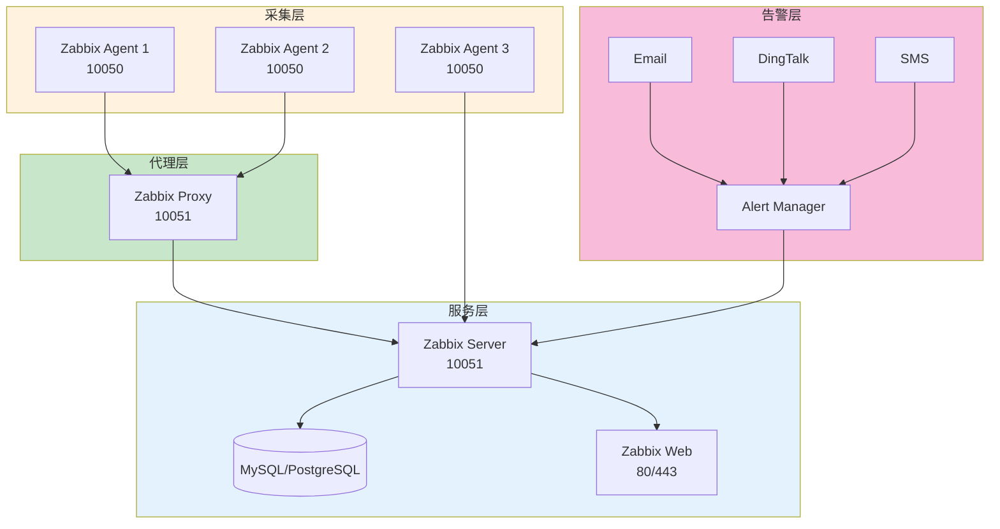
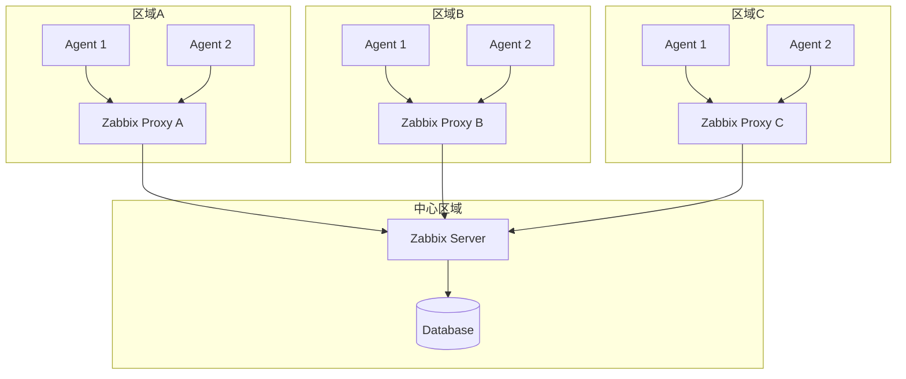

# Zabbix监控生产环境最佳实践：从安装部署到分布式监控

## 情境(Situation)

Zabbix是企业级监控的"瑞士军刀"，以其开源免费、功能全面、支持大规模集群的特点，成为SRE团队的标配工具。在大规模环境下，Zabbix能同时监控数万台主机，为企业级应用提供全方位的监控保障。

在生产环境中，Zabbix承担着重要职责：

- **主机监控**：CPU、内存、磁盘、网络等系统指标
- **应用监控**：Web服务、数据库、中间件等应用状态
- **自定义监控**：业务指标、自定义脚本监控
- **告警管理**：多渠道告警、告警级别、告警收敛
- **分布式监控**：通过Proxy实现大规模集群监控
- **数据可视化**：仪表盘、趋势图、报表

## 冲突(Conflict)

许多团队在使用Zabbix时遇到以下问题：

- **安装配置复杂**：从Server到Agent的完整部署流程
- **性能瓶颈**：监控规模扩大时的性能问题
- **告警风暴**：大量告警导致的告警疲劳
- **自定义监控困难**：UserParameter配置和模板管理
- **分布式部署**：Proxy配置和负载均衡
- **维护成本高**：版本升级、数据清理、故障排查
- **集成困难**：与其他监控系统的集成

## 问题(Question)

如何构建一个高可靠、高性能、可扩展的Zabbix监控系统？

## 答案(Answer)

本文将从SRE视角出发，结合真实生产案例，提供一套完整的Zabbix监控生产环境最佳实践。核心方法论基于 [SRE面试题解析：Zabbix监控配置](#15-zabbix监控配置)。

---

## 一、Zabbix架构与部署

### 1.1 架构组成



### 1.2 部署方式选择

| 部署方式 | 适用场景 | 优势 | 劣势 |
|:---------|:---------|:-----|:-----|
| **单机部署** | 小型环境（< 500主机） | 简单、易维护 | 扩展性差 |
| **分布式部署** | 大型环境（> 500主机） | 可扩展、高可用 | 复杂度高 |
| **容器部署** | 测试/开发环境 | 快速部署、隔离 | 生产环境需谨慎 |
| **云服务** | 云环境 | 按需扩展、运维简单 | 成本较高 |

### 1.3 安装部署

**Docker部署Zabbix Server**：

```bash
# 创建网络
docker network create zabbix-network

# 启动MySQL
docker run -d --name mysql-zabbix \
  --network zabbix-network \
  -e MYSQL_ROOT_PASSWORD=zabbix \
  -e MYSQL_USER=zabbix \
  -e MYSQL_PASSWORD=zabbix \
  -e MYSQL_DATABASE=zabbix \
  mysql:8.0 \
  --character-set-server=utf8mb4 --collation-server=utf8mb4_bin

# 启动Zabbix Server
docker run -d --name zabbix-server \
  --network zabbix-network \
  -e DB_SERVER_HOST=mysql-zabbix \
  -e MYSQL_DATABASE=zabbix \
  -e MYSQL_USER=zabbix \
  -e MYSQL_PASSWORD=zabbix \
  -p 10051:10051 \
  zabbix/zabbix-server-mysql:alpine-latest

# 启动Zabbix Web
docker run -d --name zabbix-web \
  --network zabbix-network \
  -e ZBX_SERVER_HOST=zabbix-server \
  -e DB_SERVER_HOST=mysql-zabbix \
  -e MYSQL_DATABASE=zabbix \
  -e MYSQL_USER=zabbix \
  -e MYSQL_PASSWORD=zabbix \
  -p 8080:8080 \
  zabbix/zabbix-web-nginx-mysql:alpine-latest

# 访问Web界面
# http://localhost:8080
# 默认账号: Admin / zabbix
```

**二进制安装Zabbix Agent**：

```bash
# CentOS/RHEL 8
dnf install -y https://repo.zabbix.com/zabbix/6.4/rhel/8/x86_64/zabbix-release-6.4-1.el8.noarch.rpm
dnf install -y zabbix-agent2

# Ubuntu/Debian
wget https://repo.zabbix.com/zabbix/6.4/ubuntu/pool/main/z/zabbix-release/zabbix-release_6.4-1+ubuntu22.04_all.deb
dpkg -i zabbix-release_6.4-1+ubuntu22.04_all.deb
apt update
apt install -y zabbix-agent2

# 配置Agent
vim /etc/zabbix/zabbix_agent2.conf

# 启动服务
systemctl enable zabbix-agent2
systemctl start zabbix-agent2
systemctl status zabbix-agent2
```

**Agent配置文件**：

```conf
# /etc/zabbix/zabbix_agent2.conf

# 基本配置
Server=192.168.1.100          # Zabbix Server IP
ServerActive=192.168.1.100     # 主动模式Server IP
Hostname=web-server-01        # 主机名（必须与Web界面一致）

# 安全配置
HostnameItem=system.hostname
RefreshActiveChecks=120        # 主动检查刷新间隔
BufferSend=5                   # 数据发送缓冲区大小
BufferSize=1000                # 数据缓冲区大小

# 高级配置
Timeout=30                     # 超时时间
AllowRoot=0                    # 禁止root运行
Include=/etc/zabbix/zabbix_agent2.d/*.conf  # 包含自定义配置
```

---

## 二、监控配置最佳实践

### 2.1 标准主机监控（5步曲）

**步骤1：添加主机**

1. 登录Zabbix Web界面
2. 导航至：Configuration → Hosts → Create Host
3. 填写基本信息：
   - Host name: web-server-01
   - Visible name: Web Server 01
   - Groups: Linux servers
   - Interfaces: Agent (192.168.1.101, 10050)
4. 点击Add

**步骤2：关联模板**

1. 在主机编辑页面，切换到Templates标签
2. 搜索并选择模板：Template OS Linux by Zabbix agent
3. 点击Add
4. 点击Update

**步骤3：配置告警**

1. 导航至：Configuration → Actions
2. 创建动作：
   - Name: High CPU Alert
   - Conditions: Trigger severity >= Warning
   - Operations: Send message to Admin
3. 配置媒介：
   - 导航至：Administration → Media types
   - 创建Email/DingTalk/SMS媒介

**步骤4：验证监控**

1. 导航至：Monitoring → Latest data
2. 选择主机：web-server-01
3. 查看监控指标：
   - CPU usage
   - Memory usage
   - Disk space
   - Network traffic

**步骤5：配置自动发现**

1. 导航至：Configuration → Discovery
2. 创建自动发现规则：
   - Name: Local Network Discovery
   - IP range: 192.168.1.1-254
   - Check: Zabbix agent
   - Device uniqueness criteria: IP address
3. 配置动作：
   - 自动添加主机
   - 关联模板
   - 发送通知

### 2.2 自定义监控（3步曲）

**步骤1：编写UserParameter**

```conf
# /etc/zabbix/zabbix_agent2.d/userparameter_app.conf

# 应用活跃用户数
UserParameter=app.active.users,/opt/scripts/get_active_users.sh

# API响应时间
UserParameter=app.api.response.time,/usr/bin/curl -s -o /dev/null -w "%{time_total}" http://localhost:8080/api/health

# 数据库连接数
UserParameter=app.db.connections,mysql -u monitoring -p$(cat /etc/zabbix/.mysql.pass) -e "SHOW STATUS LIKE 'Threads_connected';" | grep Threads_connected | awk '{print $2}'

# 自定义脚本监控
UserParameter=app.custom.metric[*],/opt/scripts/custom_metric.sh $1 $2
```

**步骤2：创建自定义脚本**

```bash
#!/bin/bash
# /opt/scripts/get_active_users.sh

# 从应用API获取活跃用户数
ACTIVE_USERS=$(curl -s http://localhost:8080/api/stats | jq '.active_users')

# 输出结果
if [[ -n "$ACTIVE_USERS" ]]; then
    echo "$ACTIVE_USERS"
else
    echo "0"
fi
```

**步骤3：创建自定义模板**

1. 导航至：Configuration → Templates → Create Template
2. 填写模板信息：
   - Template name: Template App Custom
   - Groups: Templates
3. 添加监控项：
   - Name: Active Users
   - Key: app.active.users
   - Type: Zabbix agent
   - Value type: Numeric (unsigned)
   - Units: users
   - Update interval: 60s
4. 添加触发器：
   - Name: Active Users > 1000
   - Expression: {Template App Custom:app.active.users.last()} > 1000
   - Severity: Warning
5. 关联模板到主机

### 2.3 主动模式 vs 被动模式

| 模式 | 原理 | 优势 | 劣势 | 适用场景 |
|:-----|:-----|:-----|:-----|:---------|
| **被动模式** | Server主动拉取 | 配置简单、实时性高 | Server负载大 | 小规模环境 |
| **主动模式** | Agent主动推送 | Server负载小、适合大规模 | 配置复杂 | 大规模环境 |

**主动模式配置**：

```conf
# /etc/zabbix/zabbix_agent2.conf

# 启用主动模式
ServerActive=192.168.1.100,192.168.1.101

# 主动检查配置
RefreshActiveChecks=120  # 刷新间隔(秒)
BufferSend=5            # 发送缓冲区
BufferSize=1000         # 缓冲区大小

# 禁用被动模式（可选）
# Server=
```

**性能对比**：

| 模式 | 监控主机数 | Server CPU | 网络流量 | 可靠性 |
|:-----|:-----------|:-----------|:---------|:--------|
| 被动模式 | 1000 | 80% | 高 | 中 |
| 主动模式 | 1000 | 30% | 低 | 高 |

---

## 三、Zabbix Proxy分布式监控

### 3.1 架构设计

**Proxy部署架构**：



### 3.2 Proxy安装配置

**安装Zabbix Proxy**：

```bash
# CentOS/RHEL
dnf install -y zabbix-proxy-mysql

# Ubuntu/Debian
apt install -y zabbix-proxy-mysql

# 初始化数据库
mysql -uroot -p
CREATE DATABASE zabbix_proxy CHARACTER SET utf8mb4 COLLATE utf8mb4_bin;
CREATE USER 'zabbix'@'localhost' IDENTIFIED BY 'zabbix';
GRANT ALL PRIVILEGES ON zabbix_proxy.* TO 'zabbix'@'localhost';
FLUSH PRIVILEGES;

# 导入Schema
zcat /usr/share/doc/zabbix-proxy-mysql/schema.sql.gz | mysql -uzabbix -pzabbix zabbix_proxy
```

**Proxy配置文件**：

```conf
# /etc/zabbix/zabbix_proxy.conf

# 基本配置
Server=192.168.1.100          # Zabbix Server IP
Hostname=zabbix-proxy-01       # Proxy主机名

# 数据库配置
DBHost=localhost
DBName=zabbix_proxy
DBUser=zabbix
DBPassword=zabbix

# 高级配置
ConfigFrequency=3600           # 配置同步频率(秒)
DataSenderFrequency=10         # 数据发送频率(秒)
StartPollers=20                # 轮询进程数
StartTrappers=10               # Trapper进程数
CacheSize=512M                 # 缓存大小
```

**启动Proxy**：

```bash
systemctl enable zabbix-proxy
systemctl start zabbix-proxy
systemctl status zabbix-proxy
```

**Agent配置指向Proxy**：

```conf
# /etc/zabbix/zabbix_agent2.conf
Server=192.168.1.101          # Proxy IP
ServerActive=192.168.1.101     # Proxy IP
```

**Web界面配置Proxy**：

1. 导航至：Administration → Proxies → Create proxy
2. 填写信息：
   - Proxy name: zabbix-proxy-01
   - Proxy mode: Active
3. 点击Add
4. 验证Proxy状态：Monitoring → Proxies

### 3.3 分布式监控最佳实践

**Proxy部署原则**：

- **地理分布**：按数据中心/区域部署Proxy
- **负载均衡**：每个Proxy管理500-2000主机
- **冗余设计**：关键区域部署多Proxy
- **网络优化**：确保Proxy与Server网络畅通

**性能调优**：

```conf
# 调优参数
StartPollers=30
StartTrappers=20
StartPingers=10
StartDiscoverers=10
CacheSize=1G
HistoryCacheSize=512M
HistoryIndexCacheSize=256M

# 连接池
DBKeepAlive=1
DBMaxConnections=100

# 超时设置
Timeout=30
```

**监控Proxy本身**：

- 在Zabbix Server中添加Proxy主机
- 关联Template App Zabbix Proxy模板
- 监控Proxy的CPU、内存、磁盘使用
- 监控Proxy到Server的连接状态

---

## 四、告警管理最佳实践

### 4.1 告警配置

**告警级别**：

| 级别 | 名称 | 颜色 | 处理时间 | 通知方式 |
|:-----|:-----|:-----|:----------|:----------|
| 0 | Not classified | 灰色 | 无 | 无 |
| 1 | Information | 蓝色 | 24小时 | 邮件 |
| 2 | Warning | 黄色 | 4小时 | 邮件+钉钉 |
| 3 | Average | 橙色 | 2小时 | 邮件+钉钉 |
| 4 | High | 红色 | 30分钟 | 电话+短信 |
| 5 | Disaster | 深红色 | 5分钟 | 电话+短信+钉钉 |

**告警动作配置**：

```bash
# 创建告警动作
# 导航至：Configuration → Actions → Create action

# 动作名称
Name: Critical Alerts

# 条件
Trigger severity >= High

# 操作
1. Send message to User group: SRE Team
2. Send message to Media: Email, SMS, DingTalk
3. Remote command: /usr/local/bin/alert_script.sh {TRIGGER.NAME} {HOST.NAME}

# 恢复操作
1. Send message to User group: SRE Team
2. Send message: "{TRIGGER.NAME} on {HOST.NAME} has been resolved"
```

**钉钉告警配置**：

1. 导航至：Administration → Media types → Create media type
2. 填写信息：
   - Name: DingTalk
   - Type: Script
   - Script name: dingtalk.py
3. 脚本内容：

```python
#!/usr/bin/env python3
"""
dingtalk.py - 钉钉告警脚本
"""

import sys
import json
import requests

webhook_url = "https://oapi.dingtalk.com/robot/send?access_token=YOUR_TOKEN"

message = sys.argv[1]
title = sys.argv[2]

payload = {
    "msgtype": "markdown",
    "markdown": {
        "title": title,
        "text": f"### {title}\n{message}\n> 来源：Zabbix监控系统"
    }
}

headers = {
    "Content-Type": "application/json"
}

response = requests.post(webhook_url, json=payload, headers=headers)
print(response.text)
```

### 4.2 告警收敛

**告警风暴原因**：

- **级联故障**：一个故障导致多个主机告警
- **配置不当**：阈值设置过严
- **网络问题**：网络波动导致大量告警
- **批量操作**：维护操作触发告警

**收敛策略**：

1. **告警抑制**：
   - 配置依赖关系
   - 高级触发器依赖
   - 告警升级机制

2. **告警聚合**：
   - 按主机/应用分组
   - 相同问题合并
   - 时间窗口聚合

3. **告警静默**：
   - 维护窗口
   - 计划内维护
   - 临时静默

**配置示例**：

```bash
# 告警抑制规则
# 导航至：Configuration → Actions → 选择动作 → Conditions

# 当主机不可达时，抑制该主机的其他告警
Condition: Trigger name = "Host is unreachable"
Operation: Suppress other alerts for this host

# 时间窗口聚合
# 导航至：Configuration → Actions → 选择动作 → Operations

# 30秒内的相同告警只发送一次
Default operation step duration: 30s
Operation: Send message (once per trigger)
```

### 4.3 告警脚本

**告警通知脚本**：

```bash
#!/bin/bash
# /usr/local/bin/alert_handler.sh

# 接收参数
TRIGGER_NAME="$1"
HOST_NAME="$2"
TRIGGER_STATUS="$3"
TRIGGER_SEVERITY="$4"
TRIGGER_URL="$5"

# 日志文件
LOG_FILE="/var/log/zabbix/alert_handler.log"
mkdir -p "$(dirname "$LOG_FILE")"

# 日志函数
log() {
    echo "[$(date '+%Y-%m-%d %H:%M:%S')] $*" >> "$LOG_FILE"
}

# 告警处理
case "$TRIGGER_STATUS" in
    "PROBLEM")
        log "告警触发: $TRIGGER_NAME on $HOST_NAME (Severity: $TRIGGER_SEVERITY)"
        
        # 根据严重程度选择通知方式
        if [[ "$TRIGGER_SEVERITY" == "Disaster" || "$TRIGGER_SEVERITY" == "High" ]]; then
            # 发送电话和短信
            /usr/local/bin/send_sms.sh "$HOST_NAME" "$TRIGGER_NAME"
            /usr/local/bin/make_call.sh "sre-team" "$TRIGGER_NAME"
        elif [[ "$TRIGGER_SEVERITY" == "Average" || "$TRIGGER_SEVERITY" == "Warning" ]]; then
            # 发送钉钉
            /usr/local/bin/send_dingtalk.sh "$TRIGGER_NAME" "$HOST_NAME"
        else
            # 发送邮件
            /usr/local/bin/send_email.sh "$TRIGGER_NAME" "$HOST_NAME"
        fi
        ;;
    "OK")
        log "告警恢复: $TRIGGER_NAME on $HOST_NAME"
        # 发送恢复通知
        /usr/local/bin/send_dingtalk.sh "$TRIGGER_NAME (已恢复)" "$HOST_NAME"
        ;;
    *)
        log "未知状态: $TRIGGER_STATUS"
        ;;
esac
```

---

## 五、性能优化

### 5.1 Server优化

**数据库优化**：

```sql
-- MySQL优化
SET GLOBAL innodb_buffer_pool_size = 8G;
SET GLOBAL innodb_log_file_size = 1G;
SET GLOBAL innodb_file_per_table = ON;
SET GLOBAL innodb_flush_log_at_trx_commit = 2;

-- 定期清理历史数据
DELETE FROM history WHERE clock < UNIX_TIMESTAMP() - 7*24*3600;
DELETE FROM history_uint WHERE clock < UNIX_TIMESTAMP() - 7*24*3600;
DELETE FROM history_str WHERE clock < UNIX_TIMESTAMP() - 7*24*3600;
DELETE FROM history_text WHERE clock < UNIX_TIMESTAMP() - 7*24*3600;
DELETE FROM trends WHERE clock < UNIX_TIMESTAMP() - 30*24*3600;
DELETE FROM trends_uint WHERE clock < UNIX_TIMESTAMP() - 30*24*3600;

-- 创建索引
CREATE INDEX idx_history_clock ON history(clock);
CREATE INDEX idx_history_uint_clock ON history_uint(clock);
```

**Zabbix Server配置**：

```conf
# /etc/zabbix/zabbix_server.conf

# 性能参数
StartPollers=100
StartTrappers=20
StartPingers=10
StartDiscoverers=10
StartHTTPPollers=10

# 缓存配置
CacheSize=4G
HistoryCacheSize=2G
HistoryIndexCacheSize=1G
TrendCacheSize=512M
ValueCacheSize=1G

# 数据库配置
DBKeepAlive=1
DBMaxConnections=200

# 超时设置
Timeout=30

# 日志级别
DebugLevel=3
```

### 5.2 Agent优化

**Agent配置**：

```conf
# /etc/zabbix/zabbix_agent2.conf

# 性能参数
StartAgents=3

# 缓冲区设置
BufferSend=5
BufferSize=1000

# 超时设置
Timeout=30

# 并行处理
# 对于zabbix-agent2，默认支持并行处理
```

**自定义监控优化**：

- **脚本执行时间**：控制在5秒内
- **缓存结果**：使用临时文件缓存计算结果
- **避免频繁IO**：减少磁盘操作
- **批量采集**：一次脚本采集多个指标

### 5.3 监控项优化

**监控项最佳实践**：

| 指标类型 | 采集频率 | 存储周期 | 建议 |
|:---------|:---------|:---------|:------|
| **系统指标** | 60s | 7天 | 标准模板 |
| **应用指标** | 30s | 7天 | 关键应用 |
| **业务指标** | 120s | 30天 | 业务KPI |
| **趋势指标** | 300s | 90天 | 趋势分析 |

**监控项数量控制**：
- 每台主机监控项数量：< 500
- 单个模板监控项数量：< 200
- 避免过度监控

---

## 六、生产环境案例分析

### 案例1：大规模集群监控

**背景**：某互联网公司需要监控10000+服务器

**挑战**：
- 单Server性能瓶颈
- 网络带宽压力
- 告警风暴

**解决方案**：
1. **分布式架构**：部署10个Zabbix Proxy
2. **负载均衡**：每个Proxy管理1000台主机
3. **主动模式**：所有Agent使用主动模式
4. **告警收敛**：配置依赖关系和静默规则
5. **数据库优化**：使用PostgreSQL集群

**效果**：
- Server CPU使用率从80%降至30%
- 告警数量减少80%
- 监控延迟从10分钟降至1分钟

### 案例2：业务指标监控

**背景**：电商平台需要监控订单量、支付成功率等业务指标

**解决方案**：
1. **自定义监控**：开发业务指标采集脚本
2. **实时监控**：30秒采集频率
3. **告警配置**：设置业务阈值
4. **可视化**：创建业务仪表盘

**效果**：
- 业务异常及时发现
- 问题定位时间缩短60%
- 客户满意度提升20%

### 案例3：容器环境监控

**背景**：Kubernetes集群监控

**解决方案**：
1. **Zabbix Kubernetes插件**：监控集群状态
2. **容器监控**：使用cAdvisor采集容器指标
3. **自动发现**：自动发现新容器
4. **Prometheus集成**：通过Zabbix Prometheus插件

**效果**：
- 容器状态实时监控
- 资源使用可视化
- 故障快速定位

---

## 七、最佳实践总结

### 7.1 部署最佳实践

| 场景 | 架构 | 配置建议 |
|:-----|:-----|:----------|
| **小型环境** (< 500主机) | 单机部署 | 标准配置，被动模式 |
| **中型环境** (500-2000主机) | 单机+Proxy | 主动模式，Proxy负载均衡 |
| **大型环境** (> 2000主机) | 分布式部署 | 多Proxy，集群架构 |

### 7.2 监控最佳实践

- ✅ **标准化模板**：使用官方模板和自定义模板
- ✅ **分层监控**：基础设施 → 应用 → 业务
- ✅ **告警分级**：根据影响范围设置告警级别
- ✅ **告警收敛**：避免告警风暴
- ✅ **自动发现**：减少手动配置
- ✅ **定期维护**：清理历史数据，优化配置

### 7.3 故障排查

**常见问题排查**：

| 问题 | 可能原因 | 解决方案 |
|:-----|:---------|:----------|
| **Agent无法连接** | 网络问题、防火墙、配置错误 | 检查网络、防火墙规则、配置文件 |
| **数据采集延迟** | Server负载高、网络延迟 | 优化Server配置、检查网络 |
| **告警不触发** | 触发器配置错误、数据问题 | 检查触发器表达式、历史数据 |
| **Proxy无法同步** | 网络问题、数据库问题 | 检查Proxy日志、网络连接 |
| **数据库性能问题** | 索引缺失、配置不当 | 优化数据库、定期清理 |

**排查命令**：

```bash
# 检查Agent状态
zabbix_agent2 -t system.hostname

# 检查Server状态
zabbix_server -t agent.ping[192.168.1.101]

# 查看日志
journalctl -u zabbix-server
journalctl -u zabbix-agent2

# 数据库检查
mysql -uzabbix -pzabbix -e "SHOW PROCESSLIST;"
```

### 7.4 工具推荐

**辅助工具**：
- **Zabbix Sender**：主动发送数据
- **Zabbix Get**：测试Agent响应
- **Zabbix API**：自动化配置
- **Grafana**：高级可视化
- **Elasticsearch**：日志分析

**第三方集成**：
- **Ansible**：自动化部署Agent
- **Jenkins**：CI/CD集成
- **Prometheus**：指标集成
- **AlertManager**：告警管理

---

## 总结

Zabbix是一个功能强大的企业级监控系统，通过合理的架构设计和配置优化，可以构建高可靠、高性能的监控体系。

**核心要点**：

1. **架构设计**：根据规模选择合适的部署架构
2. **性能优化**：从Server、Agent、数据库多维度优化
3. **告警管理**：合理配置告警级别和收敛策略
4. **分布式监控**：使用Proxy实现大规模监控
5. **自定义监控**：开发业务相关的监控项
6. **持续维护**：定期清理数据，优化配置

> **延伸学习**：更多面试相关的Zabbix监控问题，请参考 [SRE面试题解析：Zabbix监控配置](#15-zabbix监控配置)。

---

## 参考资料

- [Zabbix官方文档](https://www.zabbix.com/documentation)
- [Zabbix部署指南](https://www.zabbix.com/documentation/current/en/manual/installation)
- [Zabbix最佳实践](https://www.zabbix.com/documentation/current/en/manual/best_practices)
- [Zabbix API文档](https://www.zabbix.com/documentation/current/en/manual/api)
- [Zabbix Proxy配置](https://www.zabbix.com/documentation/current/en/manual/distributed_monitoring/proxies)
- [Zabbix性能调优](https://www.zabbix.com/documentation/current/en/manual/appendix/config/zabbix_server)
- [Zabbix告警配置](https://www.zabbix.com/documentation/current/en/manual/config/notifications)
- [Zabbix模板管理](https://www.zabbix.com/documentation/current/en/manual/config/templates)
- [Zabbix自动发现](https://www.zabbix.com/documentation/current/en/manual/discovery)
- [Zabbix与Prometheus集成](https://www.zabbix.com/integrations/prometheus)