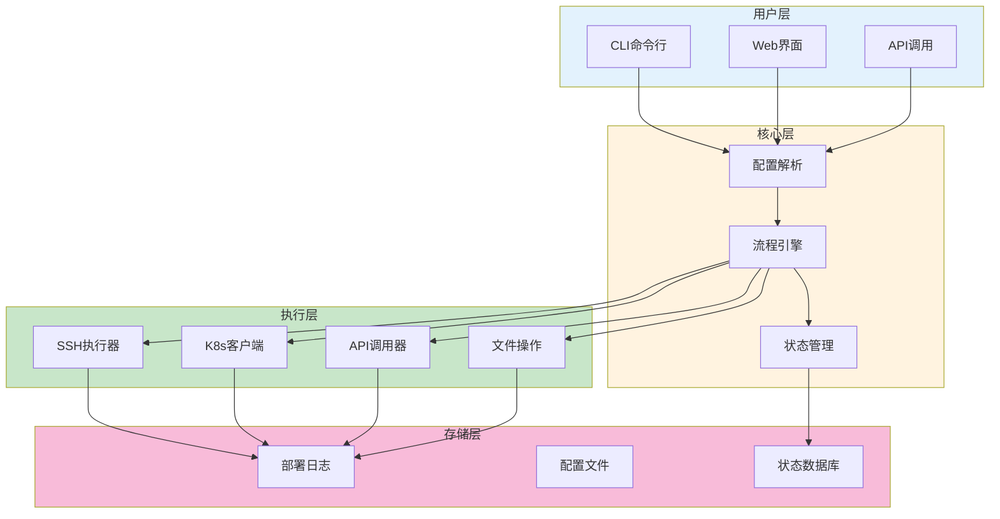

# 自动化工具开发生产环境最佳实践

## 情境(Situation)

在DevOps/SRE工作中，自动化是提高效率、减少人为错误的关键。开发自动化工具能够显著提升运维效率，实现"自动化一切可以自动化的事情"。

## 冲突(Conflict)

许多团队在自动化工具开发中面临以下挑战：
- **重复劳动**：手动执行重复任务效率低下
- **人为错误**：手动操作容易出错
- **缺乏标准化**：不同人执行同一任务方式不同
- **工具维护困难**：缺乏版本控制和文档
- **扩展性不足**：工具难以适应业务变化

## 问题(Question)

如何设计和开发高效、可靠、可维护的自动化工具？

## 答案(Answer)

本文将基于真实生产案例，分享一个自动化部署工具的开发经验，展示自动化工具开发的最佳实践。

---

## 一、项目背景与挑战

### 1.1 问题描述

在某大型金融科技公司，部署流程面临以下问题：
- **部署流程复杂**：涉及多个环境（开发、测试、预发、生产）
- **手动操作繁琐**：每次部署需要执行10+个步骤
- **部署时间长**：单次部署耗时30-60分钟
- **风险高**：手动操作容易出错

### 1.2 目标设定

| 目标 | 指标 | 现状 | 目标 |
|:----:|------|------|------|
| **部署效率** | 部署时间 | 30-60分钟 | <10分钟 |
| **准确性** | 部署失败率 | 5% | <1% |
| **可追溯性** | 部署记录 | 无 | 完整记录 |
| **一致性** | 部署标准化 | 人工判断 | 自动化执行 |

---

## 二、技术方案设计

### 2.1 架构设计



### 2.2 目录结构

```
deploy-tool/
├── app/
│   ├── __init__.py
│   ├── cli.py              # CLI入口
│   ├── config.py           # 配置管理
│   ├── engine.py           # 流程引擎
│   ├── executor.py         # 执行器基类
│   ├── executors/          # 执行器实现
│   │   ├── ssh_executor.py
│   │   ├── k8s_executor.py
│   │   └── api_executor.py
│   ├── logger.py           # 日志管理
│   ├── models.py           # 数据模型
│   └── utils.py            # 工具函数
├── configs/
│   ├── environments.yaml   # 环境配置
│   └── pipelines.yaml      # 部署流程配置
├── tests/
│   ├── test_engine.py
│   ├── test_executor.py
│   └── test_config.py
├── README.md
└── requirements.txt
```

---

## 三、核心代码实现

### 3.1 CLI入口

```python
#!/usr/bin/env python3
"""
部署工具CLI入口
"""

import argparse
import logging
from app.cli import DeployCLI

def main():
    parser = argparse.ArgumentParser(description='自动化部署工具')
    subparsers = parser.add_subparsers(dest='command', help='可用命令')
    
    # deploy命令
    deploy_parser = subparsers.add_parser('deploy', help='执行部署')
    deploy_parser.add_argument('--env', required=True, help='目标环境')
    deploy_parser.add_argument('--app', required=True, help='应用名称')
    deploy_parser.add_argument('--version', required=True, help='版本号')
    deploy_parser.add_argument('--dry-run', action='store_true', help='模拟运行')
    deploy_parser.add_argument('--force', action='store_true', help='强制部署')
    
    # status命令
    status_parser = subparsers.add_parser('status', help='查看部署状态')
    status_parser.add_argument('--deploy-id', help='部署ID')
    
    # rollback命令
    rollback_parser = subparsers.add_parser('rollback', help='回滚部署')
    rollback_parser.add_argument('--deploy-id', required=True, help='部署ID')
    
    args = parser.parse_args()
    
    logging.basicConfig(
        level=logging.INFO,
        format='%(asctime)s - %(levelname)s - %(message)s'
    )
    
    cli = DeployCLI()
    
    if args.command == 'deploy':
        cli.deploy(
            env=args.env,
            app=args.app,
            version=args.version,
            dry_run=args.dry_run,
            force=args.force
        )
    elif args.command == 'status':
        cli.status(deploy_id=args.deploy_id)
    elif args.command == 'rollback':
        cli.rollback(deploy_id=args.deploy_id)
    else:
        parser.print_help()

if __name__ == '__main__':
    main()
```

### 3.2 流程引擎

```python
"""
部署流程引擎
"""

import logging
from typing import List, Dict
from app.executor import ExecutorFactory

logger = logging.getLogger(__name__)

class DeploymentEngine:
    def __init__(self, config: Dict):
        self.config = config
        self.executor_factory = ExecutorFactory()
    
    def run_pipeline(self, pipeline_name: str, context: Dict) -> bool:
        """
        执行部署流程
        """
        pipeline = self.config.get('pipelines', {}).get(pipeline_name)
        if not pipeline:
            logger.error(f"找不到流程配置: {pipeline_name}")
            return False
        
        logger.info(f"开始执行流程: {pipeline_name}")
        
        for step in pipeline.get('steps', []):
            step_name = step.get('name')
            step_type = step.get('type')
            step_config = step.get('config', {})
            
            logger.info(f"执行步骤: {step_name}")
            
            try:
                executor = self.executor_factory.create(step_type)
                result = executor.execute(step_config, context)
                
                if not result:
                    logger.error(f"步骤 {step_name} 执行失败")
                    return False
                
                # 更新上下文
                context.update(result.get('context', {}))
                
            except Exception as e:
                logger.error(f"步骤 {step_name} 执行异常: {str(e)}")
                return False
        
        logger.info(f"流程 {pipeline_name} 执行完成")
        return True
```

### 3.3 SSH执行器

```python
"""
SSH执行器 - 执行远程命令
"""

import logging
import paramiko
from typing import Dict

logger = logging.getLogger(__name__)

class SSHExecutor:
    def __init__(self):
        self.ssh_client = None
    
    def _connect(self, host: str, port: int, username: str, key_path: str):
        """建立SSH连接"""
        self.ssh_client = paramiko.SSHClient()
        self.ssh_client.set_missing_host_key_policy(paramiko.AutoAddPolicy())
        self.ssh_client.connect(
            hostname=host,
            port=port,
            username=username,
            key_filename=key_path
        )
    
    def _execute_command(self, command: str) -> Dict:
        """执行命令"""
        stdin, stdout, stderr = self.ssh_client.exec_command(command)
        exit_status = stdout.channel.recv_exit_status()
        
        return {
            'stdout': stdout.read().decode('utf-8'),
            'stderr': stderr.read().decode('utf-8'),
            'exit_status': exit_status
        }
    
    def execute(self, config: Dict, context: Dict) -> Dict:
        """
        执行SSH操作
        config: {
            'host': '目标主机',
            'port': 22,
            'username': '用户名',
            'key_path': '密钥路径',
            'commands': ['命令1', '命令2']
        }
        """
        host = config.get('host')
        port = config.get('port', 22)
        username = config.get('username')
        key_path = config.get('key_path')
        commands = config.get('commands', [])
        
        logger.info(f"SSH连接: {username}@{host}:{port}")
        
        try:
            self._connect(host, port, username, key_path)
            
            for cmd in commands:
                # 替换上下文变量
                cmd_with_context = cmd.format(**context)
                logger.info(f"执行命令: {cmd_with_context}")
                
                result = self._execute_command(cmd_with_context)
                
                if result['exit_status'] != 0:
                    logger.error(f"命令执行失败: {result['stderr']}")
                    return {'success': False, 'error': result['stderr']}
                
                logger.info(f"命令输出: {result['stdout']}")
            
            return {'success': True}
            
        except Exception as e:
            logger.error(f"SSH执行异常: {str(e)}")
            return {'success': False, 'error': str(e)}
        
        finally:
            if self.ssh_client:
                self.ssh_client.close()
```

### 3.4 Kubernetes执行器

```python
"""
Kubernetes执行器 - 部署应用到K8s
"""

import logging
from kubernetes import client, config
from typing import Dict

logger = logging.getLogger(__name__)

class KubernetesExecutor:
    def __init__(self):
        self.client = None
    
    def _init_client(self, kubeconfig_path: str = None):
        """初始化K8s客户端"""
        if kubeconfig_path:
            config.load_kube_config(config_file=kubeconfig_path)
        else:
            config.load_incluster_config()
        
        self.client = client.AppsV1Api()
    
    def execute(self, config: Dict, context: Dict) -> Dict:
        """
        执行K8s操作
        config: {
            'kubeconfig': 'kubeconfig路径',
            'namespace': '命名空间',
            'deployment': '部署名称',
            'image': '镜像地址',
            'replicas': 副本数
        }
        """
        namespace = config.get('namespace', 'default')
        deployment_name = config.get('deployment')
        image = config.get('image').format(**context)
        replicas = config.get('replicas', 3)
        kubeconfig_path = config.get('kubeconfig')
        
        logger.info(f"K8s部署: {namespace}/{deployment_name}")
        
        try:
            self._init_client(kubeconfig_path)
            
            # 获取当前部署
            deployment = self.client.read_namespaced_deployment(
                name=deployment_name,
                namespace=namespace
            )
            
            # 更新镜像
            deployment.spec.template.spec.containers[0].image = image
            deployment.spec.replicas = replicas
            
            # 执行更新
            self.client.patch_namespaced_deployment(
                name=deployment_name,
                namespace=namespace,
                body=deployment
            )
            
            logger.info(f"部署更新成功: {image}")
            return {'success': True, 'context': {'deployment_image': image}}
            
        except Exception as e:
            logger.error(f"K8s执行异常: {str(e)}")
            return {'success': False, 'error': str(e)}
```

---

## 四、配置文件设计

### 4.1 环境配置

```yaml
# configs/environments.yaml
environments:
  development:
    description: "开发环境"
    kubernetes:
      kubeconfig: ~/.kube/dev-config
      namespace: dev
    servers:
      - host: dev-server-01
        port: 22
        username: deploy
  
  staging:
    description: "预发环境"
    kubernetes:
      kubeconfig: ~/.kube/staging-config
      namespace: staging
    servers:
      - host: staging-server-01
        port: 22
        username: deploy
  
  production:
    description: "生产环境"
    kubernetes:
      kubeconfig: ~/.kube/prod-config
      namespace: prod
    servers:
      - host: prod-server-01
        port: 22
        username: deploy
      - host: prod-server-02
        port: 22
        username: deploy
```

### 4.2 流程配置

```yaml
# configs/pipelines.yaml
pipelines:
  backend-deploy:
    description: "后端服务部署流程"
    steps:
      - name: "代码拉取"
        type: ssh
        config:
          host: "{{ env_servers.0.host }}"
          username: "{{ env_servers.0.username }}"
          commands:
            - "cd /opt/app && git pull origin {{ version }}"
      
      - name: "依赖安装"
        type: ssh
        config:
          host: "{{ env_servers.0.host }}"
          username: "{{ env_servers.0.username }}"
          commands:
            - "cd /opt/app && pip install -r requirements.txt"
      
      - name: "构建镜像"
        type: ssh
        config:
          host: "{{ env_servers.0.host }}"
          username: "{{ env_servers.0.username }}"
          commands:
            - "docker build -t registry.example.com/{{ app }}:{{ version }} ."
            - "docker push registry.example.com/{{ app }}:{{ version }}"
      
      - name: "K8s部署"
        type: kubernetes
        config:
          kubeconfig: "{{ env_kubernetes.kubeconfig }}"
          namespace: "{{ env_kubernetes.namespace }}"
          deployment: "{{ app }}"
          image: "registry.example.com/{{ app }}:{{ version }}"
          replicas: 3
      
      - name: "健康检查"
        type: api
        config:
          url: "https://{{ env_kubernetes.namespace }}.example.com/{{ app }}/health"
          method: GET
          timeout: 30
          retries: 3
```

---

## 五、测试与验证

### 5.1 单元测试

```python
"""
测试部署流程引擎
"""

import unittest
from unittest.mock import Mock, patch
from app.engine import DeploymentEngine

class TestDeploymentEngine(unittest.TestCase):
    def setUp(self):
        self.config = {
            'pipelines': {
                'test-pipeline': {
                    'steps': [
                        {
                            'name': 'test-step',
                            'type': 'ssh',
                            'config': {'command': 'echo hello'}
                        }
                    ]
                }
            }
        }
        self.engine = DeploymentEngine(self.config)
    
    @patch('app.engine.ExecutorFactory')
    def test_run_pipeline_success(self, mock_factory):
        """测试流程执行成功"""
        mock_executor = Mock()
        mock_executor.execute.return_value = {'success': True}
        mock_factory.return_value.create.return_value = mock_executor
        
        result = self.engine.run_pipeline('test-pipeline', {})
        
        self.assertTrue(result)
        mock_executor.execute.assert_called_once()
    
    @patch('app.engine.ExecutorFactory')
    def test_run_pipeline_failure(self, mock_factory):
        """测试流程执行失败"""
        mock_executor = Mock()
        mock_executor.execute.return_value = {'success': False}
        mock_factory.return_value.create.return_value = mock_executor
        
        result = self.engine.run_pipeline('test-pipeline', {})
        
        self.assertFalse(result)
    
    def test_pipeline_not_found(self):
        """测试流程不存在"""
        result = self.engine.run_pipeline('non-existent', {})
        
        self.assertFalse(result)

if __name__ == '__main__':
    unittest.main()
```

---

## 六、实施效果

### 6.1 效果对比

| 指标 | 实施前 | 实施后 | 提升幅度 |
|:----:|--------|--------|----------|
| **部署时间** | 30-60分钟 | <10分钟 | 70%+ |
| **部署失败率** | 5% | <1% | 80%+ |
| **人工操作步骤** | 10+ | 1个命令 | 90%+ |
| **部署频率** | 每周2-3次 | 每天多次 | 显著提升 |

### 6.2 关键改进点

1. **自动化执行**：所有步骤自动执行，无需人工干预
2. **标准化流程**：确保每次部署执行相同的步骤
3. **完整日志**：记录所有操作，便于问题排查
4. **错误处理**：失败时自动回滚，减少风险
5. **可扩展性**：支持新增环境和流程

---

## 七、最佳实践总结

### 7.1 自动化工具开发原则

| 原则 | 说明 | 实践建议 |
|:----:|------|----------|
| **模块化设计** | 将工具拆分为独立模块 | 执行器模式、插件化架构 |
| **配置驱动** | 使用配置文件定义行为 | YAML/JSON配置 |
| **错误处理** | 完善的错误处理和回滚机制 | try-except、状态管理 |
| **日志记录** | 详细的日志记录 | 结构化日志、日志级别 |
| **测试覆盖** | 单元测试和集成测试 | pytest、mock |
| **文档完善** | 清晰的文档和使用说明 | README、API文档 |

### 7.2 常见问题与解决方案

| 问题 | 症状 | 解决方案 |
|:-----|:-----|:----------|
| **配置复杂** | 配置文件难以维护 | 使用模板和变量 |
| **错误难以定位** | 失败时不知道哪里出错 | 详细日志和错误信息 |
| **扩展性差** | 添加新功能困难 | 插件化设计、接口抽象 |
| **安全性问题** | 敏感信息泄露 | 使用环境变量、密钥管理 |
| **兼容性问题** | 不同环境配置差异 | 环境隔离、配置继承 |

---

## 总结

自动化工具开发是SRE工程师的核心能力之一。通过合理的架构设计、模块化实现、完善的测试和文档，可以创建高效、可靠、可维护的自动化工具，显著提升运维效率。

> **延伸阅读**：更多自动化相关面试题，请参考 [SRE面试题解析：基于JD与简历匹配分析]()。

---

## 参考资料

- [Python CLI开发指南](https://docs.python.org/3/library/argparse.html)
- [Paramiko SSH库](https://www.paramiko.org/)
- [Kubernetes Python客户端](https://github.com/kubernetes-client/python)
- [pytest测试框架](https://docs.pytest.org/)
