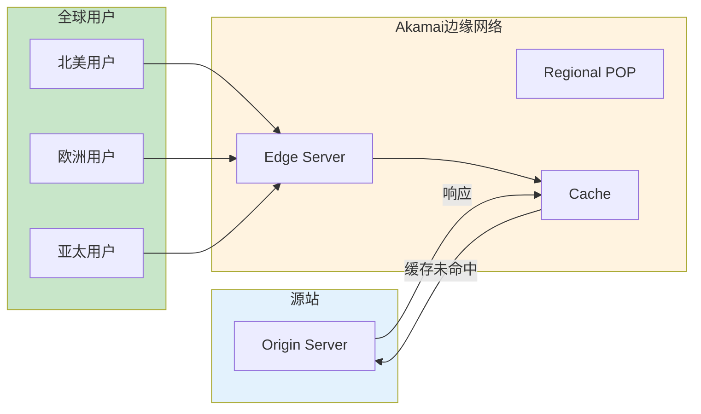
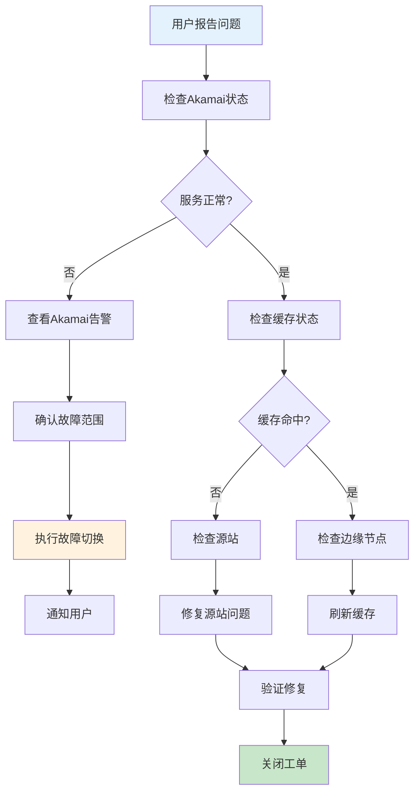

# CDN技术实践（Akamai）生产环境最佳实践

## 情境(Situation)

内容分发网络(CDN)是提升用户体验的关键基础设施。Akamai作为全球领先的CDN提供商，能够有效加速静态资源和动态内容的分发，降低延迟，提高可用性。

## 冲突(Conflict)

许多团队在CDN使用方面面临以下挑战：
- **配置复杂**：CDN配置参数多，优化难度大
- **缓存策略不当**：缓存命中率低，回源请求过多
- **安全漏洞**：边缘节点可能成为攻击入口
- **性能监控不足**：难以评估CDN效果
- **故障排查困难**：跨区域问题定位复杂

## 问题(Question)

如何设计和优化CDN架构，确保全球用户获得最佳的内容访问体验？

## 答案(Answer)

本文将基于真实生产案例，提供一套完整的CDN技术实践最佳实践指南。

---

## 一、CDN架构设计

### 1.1 CDN架构概览



### 1.2 Akamai服务类型

| 服务类型 | 说明 | 适用场景 |
|:--------:|------|----------|
| **Akamai Intelligent Platform** | 全球边缘网络 | 静态内容加速 |
| **Akamai Dynamic Site Accelerator** | 动态内容加速 | API、动态页面 |
| **Akamai Media Delivery** | 媒体内容分发 | 视频、音频 |
| **Akamai Ion** | 移动端优化 | 移动应用加速 |
| **Akamai Kona Site Defender** | Web应用防护 | DDoS防护、WAF |

---

## 二、缓存策略配置

### 2.1 缓存规则配置

```yaml
# Akamai缓存规则
cache_rules:
  static_assets:
    pattern: "^/static/.*\\.(css|js|png|jpg|jpeg|gif|svg|ico)$"
    ttl: 86400  # 24小时
    cache_level: "aggressive"
    edge_purge: true
  
  images:
    pattern: "^/images/.*"
    ttl: 604800  # 7天
    cache_level: "aggressive"
    optimization: "image_manager"
  
  api_responses:
    pattern: "^/api/v1/.*"
    ttl: 60  # 1分钟
    cache_level: "basic"
    vary: ["Accept", "Authorization"]
  
  html_pages:
    pattern: "^/.*\\.html$"
    ttl: 300  # 5分钟
    cache_level: "standard"
    edge_purge: true
```

### 2.2 缓存优化策略

```yaml
# 缓存优化策略
cache_optimization:
  cache_key:
    include_query_string: false
    vary_headers:
      - "Accept-Encoding"
      - "Accept-Language"
  
  cache_control:
    override_origin: true
    default_ttl: 3600
  
  stale_while_revalidate:
    enabled: true
    ttl: 86400
  
  prefetch:
    enabled: true
    patterns:
      - "^/static/.*"
      - "^/images/.*"
```

---

## 三、安全配置

### 3.1 WAF配置

```yaml
# Akamai WAF规则
waf_rules:
  rulesets:
    - name: "OWASP Top 10"
      enabled: true
      action: "block"
    
    - name: "SQL Injection"
      enabled: true
      action: "block"
    
    - name: "Cross-Site Scripting"
      enabled: true
      action: "block"
    
    - name: "Path Traversal"
      enabled: true
      action: "block"
  
  custom_rules:
    - name: "Block suspicious User-Agents"
      condition: "User-Agent matches /(bot|crawler|spider)/i"
      action: "deny"
    
    - name: "Rate limiting"
      condition: "Client IP exceeds 100 requests/minute"
      action: "throttle"
```

### 3.2 DDoS防护配置

```yaml
# Akamai DDoS防护配置
ddos_protection:
  enabled: true
  
  attack_types:
    - "SYN Flood"
    - "UDP Flood"
    - "HTTP Flood"
    - "DNS Amplification"
  
  mitigation_strategy:
    - "Rate limiting"
    - "Traffic scrubbing"
    - "Anycast routing"
    - "Behavioral analysis"
  
  alerting:
    enabled: true
    threshold: "50% capacity"
    notification_channels:
      - "email"
      - "slack"
      - "pagerduty"
```

---

## 四、性能优化

### 4.1 内容优化

```yaml
# 内容优化配置
content_optimization:
  image_optimization:
    enabled: true
    formats: ["webp", "avif"]
    quality: 80
    responsive: true
  
  minification:
    enabled: true
    html: true
    css: true
    js: true
  
  compression:
    enabled: true
    algorithms: ["gzip", "brotli"]
  
  lazy_loading:
    enabled: true
    images: true
    videos: true
```

### 4.2 边缘计算配置

```yaml
# Akamai EdgeWorkers配置
edge_workers:
  - name: "Dynamic Content Optimization"
    script: |
      addEventListener('fetch', event => {
        event.respondWith(handleRequest(event.request));
      });
      
      async function handleRequest(request) {
        // 添加缓存控制头
        let response = await fetch(request);
        let headers = new Headers(response.headers);
        headers.set('X-Cache-Hit', response.headers.get('X-Cache') || 'MISS');
        return new Response(response.body, { headers });
      }
  
  - name: "A/B Testing"
    script: |
      addEventListener('fetch', event => {
        event.respondWith(abTest(event.request));
      });
      
      async function abTest(request) {
        // 根据用户Cookie决定版本
        const cookie = request.headers.get('Cookie');
        const version = cookie && cookie.includes('version=B') ? 'B' : 'A';
        return fetch(`/api/v1/${version}${request.url.pathname}`);
      }
```

---

## 五、监控与告警

### 5.1 监控指标

```yaml
# Akamai监控指标
monitoring_metrics:
  cache:
    - name: "Cache Hit Ratio"
      target: "> 90%"
      unit: "%"
    
    - name: "Origin Requests"
      target: "< 10% of total requests"
      unit: "%"
  
  performance:
    - name: "Average Latency"
      target: "< 100ms"
      unit: "ms"
    
    - name: "P95 Latency"
      target: "< 300ms"
      unit: "ms"
  
  availability:
    - name: "Uptime"
      target: "> 99.99%"
      unit: "%"
    
    - name: "Error Rate"
      target: "< 1%"
      unit: "%"
```

### 5.2 告警配置

```yaml
# Akamai告警配置
alerts:
  - name: "Cache Hit Ratio Low"
    condition: "cache_hit_ratio < 80%"
    severity: "warning"
    notification: ["slack", "email"]
  
  - name: "Origin Error Rate High"
    condition: "origin_error_rate > 5%"
    severity: "critical"
    notification: ["slack", "pagerduty"]
  
  - name: "Latency Spike"
    condition: "p95_latency > 500ms"
    severity: "warning"
    notification: ["slack"]
  
  - name: "DDoS Attack Detected"
    condition: "ddos_attack_detected = true"
    severity: "critical"
    notification: ["pagerduty", "email"]
```

---

## 六、故障排查

### 6.1 故障排查流程



### 6.2 常用命令

```bash
#!/bin/bash
# Akamai故障排查脚本

AKAMAI_HOST="api.example.com"

echo "=== Akamai故障排查 ==="

# 检查缓存状态
echo ""
echo "1. 检查缓存状态"
curl -I "https://$AKAMAI_HOST/static/test.txt" | grep "X-Cache"

# 检查边缘节点
echo ""
echo "2. 检查边缘节点"
curl -I "https://$AKAMAI_HOST/" | grep "X-Akamai-Edge"

# 检查响应时间
echo ""
echo "3. 检查响应时间"
curl -w "Time: %{time_total}s\n" -o /dev/null -s "https://$AKAMAI_HOST/"

# 刷新缓存
echo ""
echo "4. 刷新缓存 (如需)"
read -p "是否刷新缓存? (y/n): " -n 1 -r
echo
if [[ $REPLY =~ ^[Yy]$ ]]; then
    akamai purge --type fast --url "https://$AKAMAI_HOST/static/*"
    echo "缓存刷新请求已发送"
fi

echo ""
echo "=== 排查完成 ==="
```

---

## 七、最佳实践总结

### 7.1 CDN优化原则

| 原则 | 说明 | 实践建议 |
|:----:|------|----------|
| **缓存优先** | 尽可能缓存内容 | 设置合理TTL |
| **分层缓存** | 不同内容不同策略 | 静态/动态分开 |
| **内容优化** | 优化传输内容 | 压缩、图片优化 |
| **安全防护** | 启用WAF/DDoS防护 | Akamai Kona |
| **实时监控** | 监控关键指标 | 告警及时响应 |

### 7.2 常见问题与解决方案

| 问题 | 症状 | 解决方案 |
|:-----|:-----|:----------|
| **缓存命中率低** | 回源请求多 | 优化缓存规则 |
| **延迟高** | 用户响应慢 | 检查边缘节点 |
| **缓存污染** | 旧内容不更新 | 正确的缓存刷新 |
| **安全攻击** | 请求异常 | 启用WAF防护 |
| **配置错误** | 服务异常 | 配置审查流程 |

---

## 总结

CDN是提升用户体验的关键基础设施。通过合理配置缓存策略、优化内容传输、启用安全防护和实时监控，可以确保全球用户获得最佳的内容访问体验。

> **延伸阅读**：更多CDN相关面试题，请参考 [SRE面试题解析：基于JD与简历匹配分析]()。

---

## 参考资料

- [Akamai官方文档](https://techdocs.akamai.com/)
- [Akamai Developer](https://developer.akamai.com/)
- [Akamai CLI](https://github.com/akamai/cli)
- [CDN最佳实践](https://www.akamai.com/blog/topics/performance)
