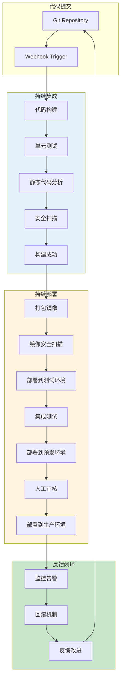
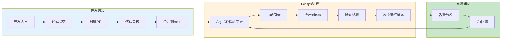

# CI/CD流水线设计与管理生产环境最佳实践

## 情境(Situation)

CI/CD（持续集成/持续部署）是DevOps实践的核心，是实现软件快速、可靠交付的关键。一个设计良好的CI/CD流水线能够自动化构建、测试和部署流程，显著提高开发效率和软件质量。

## 冲突(Conflict)

许多团队在CI/CD实践中面临以下挑战：
- **流水线不稳定**：经常失败，影响开发效率
- **安全漏洞**：代码在部署前未经过充分的安全扫描
- **部署风险**：缺乏回滚机制，部署失败影响业务
- **环境一致性问题**：开发、测试、生产环境差异导致部署失败
- **缺乏标准化**：不同项目使用不同的CI/CD工具和流程

## 问题(Question)

如何设计一个稳定、安全、可扩展的CI/CD流水线，实现高效的持续集成和持续部署？

## 答案(Answer)

本文将基于真实生产案例，提供一套完整的CI/CD流水线设计与管理最佳实践指南。

---

## 一、CI/CD流水线架构设计

### 1.1 流水线架构概览



### 1.2 流水线阶段详解

| 阶段 | 关键任务 | 工具/技术 | 成功标准 |
|:----:|----------|-----------|----------|
| **代码提交** | Git推送、Webhook触发 | Git、GitHub/GitLab | 代码成功推送到指定分支 |
| **代码构建** | 编译、依赖管理 | Maven、Gradle、Go Build | 构建成功，生成可执行文件 |
| **单元测试** | 自动化单元测试 | JUnit、pytest、Go Test | 测试覆盖率>80%，无失败 |
| **静态分析** | 代码质量检查 | SonarQube、Checkstyle | 代码质量达标，无严重问题 |
| **安全扫描** | 漏洞检测、依赖扫描 | OWASP Dependency-Check、Snyk | 无高危漏洞 |
| **打包镜像** | Docker镜像构建 | Docker、BuildKit | 镜像构建成功并推送到仓库 |
| **镜像扫描** | 镜像安全检查 | Trivy、Clair | 镜像无高危漏洞 |
| **部署测试** | 部署到测试环境 | Jenkins、ArgoCD | 部署成功，服务正常运行 |
| **集成测试** | 端到端测试 | Selenium、Postman | 集成测试通过 |
| **部署预发** | 部署到预发环境 | ArgoCD、Flux | 预发环境部署成功 |
| **人工审核** | 业务验证、发布审批 | Jenkins Approval、ArgoCD UI | 审核通过 |
| **部署生产** | 生产环境部署 | ArgoCD、Canary发布 | 零停机部署成功 |

---

## 二、Jenkins流水线配置实践

### 2.1 Jenkinsfile最佳实践

```groovy
// Jenkinsfile - 声明式流水线
pipeline {
    agent {
        kubernetes {
            yaml '''
apiVersion: v1
kind: Pod
spec:
  containers:
  - name: jnlp
    image: jenkins/jnlp-slave:latest
    resources:
      limits:
        memory: "2Gi"
        cpu: "1"
      requests:
        memory: "1Gi"
        cpu: "0.5"
  - name: maven
    image: maven:3.8.6-openjdk-11
    command: ["sleep", "99999"]
    resources:
      limits:
        memory: "4Gi"
        cpu: "2"
      requests:
        memory: "2Gi"
        cpu: "1"
  - name: docker
    image: docker:20.10
    command: ["sleep", "99999"]
    volumeMounts:
    - name: docker-sock
      mountPath: /var/run/docker.sock
  volumes:
  - name: docker-sock
    hostPath:
      path: /var/run/docker.sock
'''
        }
    }
    
    environment {
        IMAGE_NAME = "myapp"
        IMAGE_TAG = "${BUILD_NUMBER}-${GIT_COMMIT.substring(0, 7)}"
        REGISTRY = "registry.example.com"
    }
    
    stages {
        stage('Checkout') {
            steps {
                git branch: 'main', url: 'https://github.com/example/myapp.git'
            }
        }
        
        stage('Build') {
            steps {
                container('maven') {
                    sh 'mvn clean package -DskipTests'
                }
            }
        }
        
        stage('Unit Test') {
            steps {
                container('maven') {
                    sh 'mvn test'
                }
            }
            post {
                always {
                    junit 'target/surefire-reports/*.xml'
                }
            }
        }
        
        stage('Static Analysis') {
            steps {
                container('maven') {
                    sh 'mvn sonar:sonar -Dsonar.host.url=http://sonarqube:9000'
                }
            }
        }
        
        stage('Security Scan') {
            steps {
                container('maven') {
                    sh 'mvn org.owasp:dependency-check-maven:check'
                }
            }
        }
        
        stage('Build Docker Image') {
            steps {
                container('docker') {
                    sh "docker build -t ${REGISTRY}/${IMAGE_NAME}:${IMAGE_TAG} ."
                    sh "docker push ${REGISTRY}/${IMAGE_NAME}:${IMAGE_TAG}"
                }
            }
        }
        
        stage('Image Security Scan') {
            steps {
                sh "trivy image ${REGISTRY}/${IMAGE_NAME}:${IMAGE_TAG} --exit-code 1 --severity HIGH,CRITICAL"
            }
        }
        
        stage('Deploy to Test') {
            steps {
                sh "helm upgrade --install myapp-test ./helm-chart \
                    --namespace test \
                    --set image.tag=${IMAGE_TAG} \
                    --set env=test"
            }
        }
        
        stage('Integration Test') {
            steps {
                sh 'curl -s http://myapp-test/api/health | grep "OK"'
            }
        }
        
        stage('Deploy to Staging') {
            when {
                branch 'main'
            }
            steps {
                sh "helm upgrade --install myapp-staging ./helm-chart \
                    --namespace staging \
                    --set image.tag=${IMAGE_TAG} \
                    --set env=staging"
            }
        }
        
        stage('Manual Approval') {
            when {
                branch 'main'
            }
            steps {
                input message: 'Approve deployment to production?', submitter: 'sre-team'
            }
        }
        
        stage('Deploy to Production') {
            when {
                branch 'main'
            }
            steps {
                sh "helm upgrade --install myapp-prod ./helm-chart \
                    --namespace prod \
                    --set image.tag=${IMAGE_TAG} \
                    --set env=prod \
                    --set replicaCount=3"
            }
        }
    }
    
    post {
        success {
            slackSend channel: '#cicd', message: "Pipeline succeeded: ${BUILD_URL}"
        }
        failure {
            slackSend channel: '#cicd', message: "Pipeline failed: ${BUILD_URL}"
            emailext to: 'sre-team@example.com',
                     subject: "Pipeline Failed: ${BUILD_URL}",
                     body: "Check the build at ${BUILD_URL}"
        }
    }
}
```

### 2.2 Jenkins安全配置

```groovy
// Jenkins安全最佳实践配置

// 1. 凭证管理 - 使用Jenkins Credentials Plugin
credentials {
    usernamePassword(
        id: 'docker-registry',
        usernameVariable: 'DOCKER_USER',
        passwordVariable: 'DOCKER_PASS',
        description: 'Docker registry credentials'
    )
    
    string(
        id: 'slack-webhook',
        value: 'https://hooks.slack.com/services/XXX',
        description: 'Slack webhook URL'
    )
}

// 2. 流水线安全 - 限制脚本执行
pipeline {
    agent any
    options {
        // 禁止使用不安全的方法
        disableConcurrentBuilds()
        timestamps()
        // 设置构建超时时间
        timeout(time: 60, unit: 'MINUTES')
        // 清理工作空间
        deleteDirs()
    }
}
```

---

## 三、GitOps与ArgoCD实践

### 3.1 ArgoCD应用配置

```yaml
# ArgoCD Application配置
apiVersion: argoproj.io/v1alpha1
kind: Application
metadata:
  name: myapp
  namespace: argocd
spec:
  project: default
  source:
    repoURL: 'https://github.com/example/myapp-config.git'
    targetRevision: HEAD
    path: environments/prod
  destination:
    server: 'https://kubernetes.default.svc'
    namespace: prod
  syncPolicy:
    automated:
      prune: true
      selfHeal: true
    syncOptions:
      - CreateNamespace=true
      - PruneLast=true
    retry:
      limit: 5
      backoff:
        duration: 5s
        maxDuration: 3m
        factor: 2
```

### 3.2 GitOps工作流程



---

## 四、部署策略最佳实践

### 4.1 部署策略对比

| 策略 | 适用场景 | 风险等级 | 回滚难度 | 实现复杂度 |
|:----:|----------|:--------:|:--------:|:----------:|
| **蓝绿部署** | 大规模、关键业务 | 低 | 低 | 中 |
| **金丝雀发布** | 新功能发布、A/B测试 | 中 | 低 | 高 |
| **滚动更新** | 常规更新、无状态服务 | 中 | 中 | 低 |
| **灰度发布** | 用户分阶段体验 | 低 | 低 | 高 |

### 4.2 蓝绿部署配置

```yaml
# Kubernetes蓝绿部署配置
apiVersion: apps/v1
kind: Deployment
metadata:
  name: myapp-blue
spec:
  replicas: 3
  selector:
    matchLabels:
      app: myapp
      version: blue
  template:
    metadata:
      labels:
        app: myapp
        version: blue
    spec:
      containers:
      - name: myapp
        image: registry.example.com/myapp:v1.0.0
        ports:
        - containerPort: 8080

---
apiVersion: apps/v1
kind: Deployment
metadata:
  name: myapp-green
spec:
  replicas: 0
  selector:
    matchLabels:
      app: myapp
      version: green
  template:
    metadata:
      labels:
        app: myapp
        version: green
    spec:
      containers:
      - name: myapp
        image: registry.example.com/myapp:v2.0.0
        ports:
        - containerPort: 8080

---
apiVersion: v1
kind: Service
metadata:
  name: myapp-service
spec:
  selector:
    app: myapp
    version: blue
  ports:
  - protocol: TCP
    port: 80
    targetPort: 8080
```

```bash
# 蓝绿部署脚本
#!/bin/bash

# 1. 部署绿环境
kubectl scale deployment myapp-green --replicas=3

# 2. 等待绿环境就绪
kubectl wait --for=condition=available deployment/myapp-green --timeout=5m

# 3. 切换流量到绿环境
kubectl patch service myapp-service -p '{"spec":{"selector":{"version":"green"}}}'

# 4. 验证绿环境运行正常
curl -s http://myapp-service/api/health | grep "OK"

# 5. 如果验证失败，回滚到蓝环境
# kubectl patch service myapp-service -p '{"spec":{"selector":{"version":"blue"}}}'
```

### 4.3 金丝雀发布配置

```yaml
# Argo Rollouts金丝雀发布配置
apiVersion: argoproj.io/v1alpha1
kind: Rollout
metadata:
  name: myapp
spec:
  replicas: 10
  selector:
    matchLabels:
      app: myapp
  template:
    metadata:
      labels:
        app: myapp
    spec:
      containers:
      - name: myapp
        image: registry.example.com/myapp:v1.0.0
        ports:
        - containerPort: 8080
  strategy:
    canary:
      steps:
      - setWeight: 10
      - pause:
          duration: 30m
      - setWeight: 50
      - pause:
          duration: 1h
      - setWeight: 100
      analysis:
        templates:
        - templateName: success-rate
        startingStep: 1
        args:
        - name: service-name
          value: myapp-service
```

---

## 五、流水线安全最佳实践

### 5.1 安全扫描集成

```bash
# 依赖安全扫描
snyk test --severity-threshold=high

# 容器镜像扫描
trivy image registry.example.com/myapp:latest \
  --exit-code 1 \
  --severity HIGH,CRITICAL \
  --format json \
  --output trivy-report.json

# 代码安全扫描
gitleaks detect --report-format json --report-path gitleaks-report.json
```

### 5.2 凭证管理策略

| 类型 | 存储方式 | 使用场景 | 轮换周期 |
|:----:|----------|----------|----------|
| **API密钥** | Jenkins Credentials | 代码仓库、云服务 | 90天 |
| **数据库密码** | HashiCorp Vault | 数据库访问 | 60天 |
| **SSH密钥** | Jenkins Credentials | 服务器访问 | 180天 |
| **Docker凭证** | Docker Config | 镜像仓库 | 90天 |

---

## 六、流水线监控与优化

### 6.1 关键指标监控

| 指标 | 描述 | 目标值 |
|:----:|------|--------|
| **构建成功率** | 成功构建次数/总构建次数 | >95% |
| **平均构建时间** | 构建阶段平均耗时 | <15分钟 |
| **部署频率** | 单位时间内部署次数 | 根据业务需求 |
| **MTTR** | 从故障到恢复的平均时间 | <30分钟 |
| **代码覆盖率** | 单元测试覆盖比例 | >80% |

### 6.2 流水线优化策略

```bash
# 构建缓存优化
# Maven缓存
export MAVEN_OPTS="-Dmaven.repo.local=/cache/maven"

# Go模块缓存
export GOPATH=/cache/go

# Docker构建缓存
docker build --cache-from=registry.example.com/myapp:latest .

# 并行执行优化
# Jenkins并行阶段
parallel {
    stage('Test Service A') { ... }
    stage('Test Service B') { ... }
    stage('Test Service C') { ... }
}
```

---

## 七、最佳实践总结

### 7.1 流水线设计原则

| 原则 | 说明 | 实践建议 |
|:----:|------|----------|
| **原子性** | 每个阶段独立、可测试 | 阶段失败立即终止 |
| **可重复性** | 相同输入产生相同输出 | 使用固定版本依赖 |
| **安全性** | 代码和镜像经过安全扫描 | 集成Snyk、Trivy |
| **可观测性** | 完整的日志和指标 | 集成Prometheus、Grafana |
| **回滚能力** | 支持快速回滚 | 使用蓝绿/金丝雀发布 |

### 7.2 常见问题与解决方案

| 问题 | 症状 | 解决方案 |
|:-----|:-----|:----------|
| **流水线不稳定** | 经常失败 | 添加重试机制、增加超时时间 |
| **构建时间过长** | 影响开发效率 | 引入缓存、并行执行 |
| **安全漏洞** | 部署后发现漏洞 | 集成安全扫描、设置质量门禁 |
| **部署失败** | 生产环境服务不可用 | 实施蓝绿/金丝雀发布 |
| **环境不一致** | 测试通过但生产失败 | 使用容器化确保环境一致 |

---

## 总结

CI/CD流水线是DevOps的核心基础设施，设计一个稳定、安全、高效的流水线需要综合考虑架构设计、安全集成、部署策略和监控优化。通过遵循最佳实践，可以实现软件的快速、可靠交付。

> **延伸阅读**：更多CI/CD相关面试题，请参考 [SRE面试题解析：基于JD与简历匹配分析]()。

---

## 参考资料

- [Jenkins官方文档](https://www.jenkins.io/doc/)
- [ArgoCD官方文档](https://argo-cd.readthedocs.io/)
- [GitOps最佳实践](https://www.gitops.tech/)
- [CNCF CI/CD最佳实践白皮书](https://github.com/cncf/tag-security/blob/main/security-whitepaper/v1.0.md)
- [OWASP安全扫描指南](https://owasp.org/www-project-dependency-check/)
