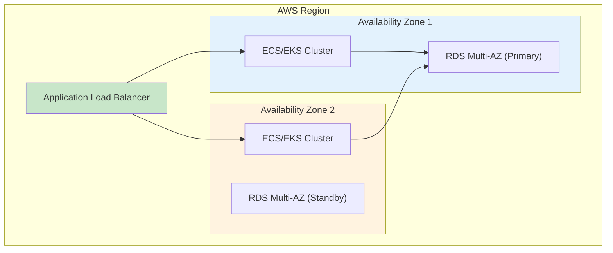
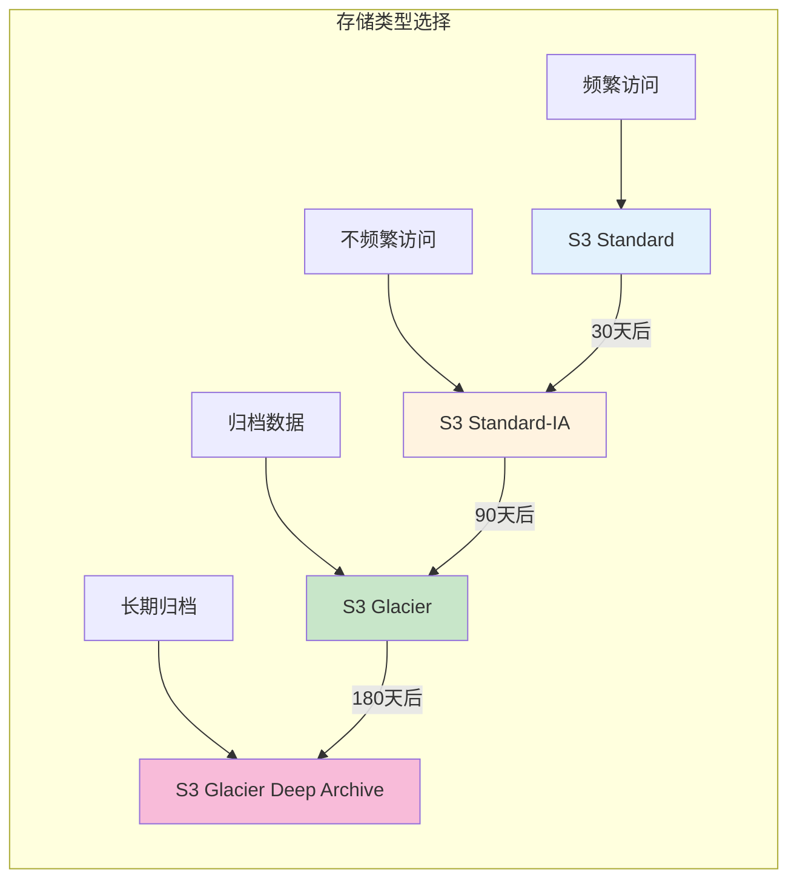

# 云架构设计与优化生产环境最佳实践

## 情境(Situation)

在当今数字化转型的浪潮中，云架构设计已成为企业IT基础设施的核心。作为DevOps/SRE工程师，设计和优化云架构不仅关系到系统的稳定性和可靠性，还直接影响企业的运营成本和业务敏捷性。

## 冲突(Conflict)

许多企业在云架构设计中面临以下挑战：
- **高可用设计不足**：单点故障导致业务中断
- **成本失控**：云资源使用缺乏规划，费用超支
- **安全合规风险**：缺乏统一的安全策略和合规管控
- **性能瓶颈**：架构设计未能充分利用云原生优势
- **扩展性不足**：无法快速响应业务增长需求

## 问题(Question)

如何设计一个高可用、高性能、安全合规且成本优化的云架构？

## 答案(Answer)

本文将基于真实生产案例，提供一套完整的云架构设计与优化最佳实践指南。

---

## 一、高可用架构设计

### 1.1 多可用区部署策略



| 组件 | 部署策略 | 高可用保障 |
|:----:|----------|------------|
| **计算层** | 跨AZ部署ECS/EKS集群 | 自动故障转移 |
| **负载均衡** | 跨AZ配置ALB/NLB | 流量自动路由 |
| **数据库** | RDS Multi-AZ部署 | 自动故障转移(RTO<30s) |
| **存储** | S3跨区域复制 | 数据冗余备份 |

### 1.2 弹性伸缩配置

```yaml
# Auto Scaling Group配置示例
AutoScalingGroup:
  Type: AWS::AutoScaling::AutoScalingGroup
  Properties:
    MinSize: 2
    MaxSize: 10
    DesiredCapacity: 4
    AvailabilityZones: !GetAZs ''
    LaunchTemplate:
      LaunchTemplateId: !Ref EC2LaunchTemplate
    TargetGroupARNs:
      - !Ref ALBTargetGroup
    Tags:
      - Key: Name
        Value: !Sub "${Environment}-app-server"

# 扩展策略
ScalingPolicy:
  Type: AWS::AutoScaling::ScalingPolicy
  Properties:
    AdjustmentType: ChangeInCapacity
    AutoScalingGroupName: !Ref AutoScalingGroup
    Cooldown: 300
    ScalingAdjustment: 2

# 云监控告警触发扩展
CloudWatchAlarmHighCPU:
  Type: AWS::CloudWatch::Alarm
  Properties:
    AlarmDescription: "High CPU Usage Trigger"
    MetricName: CPUUtilization
    Namespace: AWS/EC2
    Statistic: Average
    Period: 60
    EvaluationPeriods: 5
    Threshold: 70
    ComparisonOperator: GreaterThanThreshold
    AlarmActions:
      - !GetAtt ScalingPolicy.Arn
```

**弹性伸缩策略要点**：
- **扩容条件**：CPU>70%持续5分钟，增加2个实例
- **缩容条件**：CPU<30%持续10分钟，减少1个实例
- **冷却期**：300秒，避免频繁扩缩容
- **实例保护**：关键实例标记为不可终止

---

## 二、成本优化策略

### 2.1 实例类型选择策略

| 实例类型 | 适用场景 | 成本优势 |
|:--------:|----------|----------|
| **On-Demand** | 不可预测的工作负载 | 灵活无承诺 |
| **Reserved Instance** | 稳定的长期工作负载 | 节省30%-75% |
| **Spot Instance** | 容错性高的批处理任务 | 节省70%-90% |
| **Savings Plan** | 灵活的使用承诺 | 节省20%-65% |

```bash
# 成本优化实践命令

# 1. 查看未使用的EBS快照
aws ec2 describe-snapshots --owner-id self --query 'Snapshots[?StartTime<`2024-01-01`]'

# 2. 清理未使用的AMI
aws ec2 describe-images --owners self --query 'Images[?CreationDate<`2024-01-01`]'

# 3. 查看EC2实例利用率
aws cloudwatch get-metric-statistics \
  --metric-name CPUUtilization \
  --namespace AWS/EC2 \
  --start-time $(date -d '30 days ago' +%Y-%m-%dT%H:%M:%S) \
  --end-time $(date +%Y-%m-%dT%H:%M:%S) \
  --period 86400 \
  --statistics Average \
  --dimensions Name=InstanceId,Value=i-12345678
```

### 2.2 存储优化策略



| 存储类型 | 存储成本(GB/月) | 检索成本 | 适用场景 |
|:--------:|-----------------|----------|----------|
| **S3 Standard** | $0.023 | 无 | 频繁访问(<30天) |
| **S3 Standard-IA** | $0.0125 | $0.01/GB | 不频繁访问(30-90天) |
| **S3 Glacier** | $0.004 | $0.05/GB | 归档(90-180天) |
| **S3 Glacier Deep Archive** | $0.00125 | $0.25/GB | 长期归档(>180天) |

---

## 三、安全合规架构

### 3.1 VPC安全设计

```yaml
# VPC网络架构
VPC:
  Type: AWS::EC2::VPC
  Properties:
    CidrBlock: 10.0.0.0/16
    EnableDnsSupport: true
    EnableDnsHostnames: true

# 公有子网（面向互联网）
PublicSubnet1:
  Type: AWS::EC2::Subnet
  Properties:
    VpcId: !Ref VPC
    CidrBlock: 10.0.1.0/24
    AvailabilityZone: !Select [0, !GetAZs '']
    MapPublicIpOnLaunch: true

# 私有子网（应用服务器）
PrivateSubnet1:
  Type: AWS::EC2::Subnet
  Properties:
    VpcId: !Ref VPC
    CidrBlock: 10.0.2.0/24
    AvailabilityZone: !Select [0, !GetAZs '']
    MapPublicIpOnLaunch: false

# NAT网关（私有子网访问外网）
NATGateway:
  Type: AWS::EC2::NatGateway
  Properties:
    AllocationId: !GetAtt ElasticIP.AllocationId
    SubnetId: !Ref PublicSubnet1
```

### 3.2 IAM最佳实践

```yaml

‘# IAM角色最小权限原则
AWSTemplateFormatVersion: '2010-09-09'
Resources:
  ECSServiceRole:
    Type: AWS::IAM::Role
    Properties:
      AssumeRolePolicyDocument:
        Version: '2012-10-17'
        Statement:
          - Effect: Allow
            Principal:
              Service: ecs.amazonaws.com
            Action: sts:AssumeRole
      Policies:
        - PolicyName: ECSServicePolicy
          PolicyDocument:
            Version: '2012-10-17'
            Statement:
              - Effect: Allow
                Action:
                  - logs:CreateLogStream
                  - logs:PutLogEvents
                  - ecr:GetAuthorizationToken
                  - ecr:BatchCheckLayerAvailability
                  - ecr:GetDownloadUrlForLayer
                  - ecr:BatchGetImage
                Resource: '*'
```

**IAM安全要点**：
- **最小权限原则**：只授予必要的权限
- **避免长期密钥**：使用IAM角色而非Access Key
- **定期审计**：使用AWS Config检查IAM配置
- **权限边界**：使用Permission Boundary限制最大权限

---

## 四、性能优化策略

### 4.1 CDN加速配置

```bash
# CloudFront配置示例
aws cloudfront create-distribution --distribution-config '{
  "Origins": {
    "Items": [
      {
        "Id": "my-origin",
        "DomainName": "my-bucket.s3.amazonaws.com",
        "S3OriginConfig": {
          "OriginAccessIdentity": "origin-access-identity/cloudfront/ABC123"
        }
      }
    ],
    "Quantity": 1
  },
  "DefaultCacheBehavior": {
    "TargetOriginId": "my-origin",
    "ViewerProtocolPolicy": "redirect-to-https",
    "MinTTL": 86400,
    "MaxTTL": 31536000,
    "DefaultTTL": 604800
  },
  "PriceClass": "PriceClass_100",
  "Enabled": true
}'
```

### 4.2 数据库性能优化

| 优化策略 | 实现方式 | 性能提升 |
|:--------:|----------|----------|
| **只读副本** | 创建RDS只读副本分担读压力 | 读性能提升3-5倍 |
| **缓存层** | Redis/Memcached缓存热点数据 | 查询延迟降低80% |
| **查询优化** | SQL索引优化、查询重写 | 查询速度提升10-100倍 |
| **连接池** | 数据库连接池配置 | 连接复用，减少开销 |

---

## 五、灾难恢复策略

### 5.1 RTO与RPO定义

| 业务级别 | RTO(恢复时间目标) | RPO(恢复点目标) | 策略 |
|:--------:|-------------------|-------------------|------|
| **核心业务** | <30分钟 | <15分钟 | 多AZ+跨区域复制 |
| **重要业务** | <1小时 | <1小时 | 多AZ部署 |
| **一般业务** | <4小时 | <4小时 | 单AZ+定期备份 |

### 5.2 备份策略配置

```bash
# AWS Backup配置
aws backup create-backup-plan --backup-plan '{
  "BackupPlanName": "DailyBackup",
  "Rules": [
    {
      "RuleName": "Daily",
      "TargetBackupVaultName": "MyVault",
      "ScheduleExpression": "cron(0 2 * * ? *)",
      "StartWindowMinutes": 60,
      "CompletionWindowMinutes": 120,
      "Lifecycle": {
        "DeleteAfterDays": 35,
        "MoveToColdStorageAfterDays": 7
      }
    }
  ]
}'
```

---

## 六、最佳实践总结

### 6.1 架构设计原则

| 原则 | 说明 | 实践建议 |
|:----:|------|----------|
| **高可用** | 消除单点故障 | 多AZ部署、自动故障转移 |
| **弹性伸缩** | 根据负载自动调整 | 基于指标的扩缩容策略 |
| **安全合规** | 最小权限、加密传输 | IAM角色、TLS加密 |
| **成本优化** | 合理选择资源类型 | RI/Spot实例、存储生命周期 |
| **可观测性** | 全面监控与日志 | CloudWatch、X-Ray |

### 6.2 常见问题与解决方案

| 问题 | 症状 | 解决方案 |
|:-----|:-----|:----------|
| **单点故障** | 单个组件故障导致业务中断 | 多AZ部署、冗余设计 |
| **成本超支** | 云费用超出预算 | RI/Spot实例、资源清理、成本监控 |
| **安全漏洞** | 未授权访问风险 | IAM最小权限、安全组严格配置 |
| **性能瓶颈** | 响应延迟增加 | CDN加速、缓存层、数据库优化 |
| **合规风险** | 未满足监管要求 | AWS Config、GuardDuty、定期审计 |

---

## 总结

云架构设计是一个综合性的工程实践，需要平衡可用性、性能、安全和成本。通过合理的多AZ部署、弹性伸缩配置、安全策略和成本优化措施，可以构建一个稳定、高效、安全的云基础设施。

> **延伸阅读**：更多云架构相关面试题，请参考 [SRE面试题解析：基于JD与简历匹配分析]()。

---

## 参考资料

- [AWS Well-Architected Framework](https://aws.amazon.com/architecture/well-architected/)
- [AWS Cost Optimization Best Practices](https://docs.aws.amazon.com/whitepapers/latest/cost-optimization-pillar/cost-optimization-pillar.html)
- [AWS Security Best Practices](https://docs.aws.amazon.com/whitepapers/latest/aws-security-best-practices/welcome.html)
- [AWS High Availability Best Practices](https://docs.aws.amazon.com/whitepapers/latest/building-fault-tolerant-applications-on-aws/building-fault-tolerant-applications-on-aws.html)
