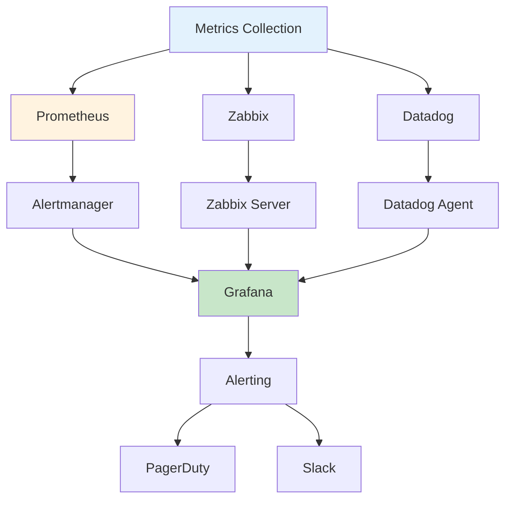

# 云认证与技术栈深度生产环境最佳实践

## 情境(Situation)

云技术认证是衡量专业技能的重要标准，而深入的技术栈知识是解决复杂问题的基础。在面试中，认证和技术深度往往是评估候选人能力的关键因素。

## 冲突(Conflict)

许多技术人员面临以下挑战：
- **认证与实践脱节**：拥有认证但缺乏实际经验
- **技术广度与深度平衡**：了解多种技术但缺乏深入理解
- **知识更新滞后**：技术快速发展，知识容易过时
- **技能证明困难**：难以向面试官证明实际能力

## 问题(Question)

如何系统地提升技术栈深度，并通过认证有效证明自己的专业能力？

## 答案(Answer)

本文将基于真实经验，提供一套完整的云认证与技术栈提升最佳实践指南。

---

## 一、云认证体系

### 1.1 AWS认证路径

```yaml
# AWS认证路径
aws_certifications:
  foundational:
    - name: "AWS Cloud Practitioner"
      description: "云基础概念"
      target: "初学者"
    
  associate:
    - name: "AWS Solutions Architect - Associate"
      description: "架构设计"
      target: "解决方案架构师"
    
    - name: "AWS Developer - Associate"
      description: "开发实践"
      target: "开发者"
    
    - name: "AWS SysOps Administrator - Associate"
      description: "运维管理"
      target: "运维工程师"
    
  professional:
    - name: "AWS Solutions Architect - Professional"
      description: "高级架构设计"
      target: "高级架构师"
    
    - name: "AWS DevOps Engineer - Professional"
      description: "DevOps实践"
      target: "DevOps工程师"
    
  specialty:
    - name: "AWS Security - Specialty"
      description: "安全专家"
      target: "安全工程师"
    
    - name: "AWS Advanced Networking - Specialty"
      description: "网络专家"
      target: "网络工程师"
```

### 1.2 GCP认证路径

```yaml
# GCP认证路径
gcp_certifications:
  foundational:
    - name: "Google Cloud Digital Leader"
      description: "云基础概念"
      target: "业务人员"
    
  professional:
    - name: "Associate Cloud Engineer"
      description: "云工程师基础"
      target: "初级工程师"
    
    - name: "Professional Cloud Architect"
      description: "云架构师"
      target: "架构师"
    
    - name: "Professional Cloud Developer"
      description: "云开发者"
      target: "开发者"
    
    - name: "Professional Cloud DevOps Engineer"
      description: "DevOps工程师"
      target: "DevOps工程师"
    
    - name: "Professional Cloud Security Engineer"
      description: "安全工程师"
      target: "安全工程师"
```

### 1.3 认证价值评估

| 认证 | 难度 | 价值 | 适用场景 |
|:----:|:----:|:----:|----------|
| **AWS SAA** | 中等 | 高 | 架构设计岗位 |
| **AWS DevOps Pro** | 高 | 很高 | DevOps岗位 |
| **GCP PCA** | 中等 | 高 | Google Cloud岗位 |
| **Azure AZ-104** | 中等 | 高 | Azure岗位 |

---

## 二、技术栈深度提升

### 2.1 技能矩阵

```yaml
# 技能矩阵
skill_matrix:
  cloud_platforms:
    - name: "AWS"
      level: "expert"
      skills:
        - "EC2, S3, RDS, VPC"
        - "Lambda, API Gateway"
        - "CloudFormation, CDK"
        - "CloudWatch, X-Ray"
    
    - name: "GCP"
      level: "advanced"
      skills:
        - "GCE, GCS, BigQuery"
        - "Cloud Functions"
        - "Terraform"
        - "Stackdriver"
    
    - name: "Alibaba Cloud"
      level: "intermediate"
      skills:
        - "ECS, OSS, RDS"
        - "SLB, VPC"
  
  devops_tools:
    - name: "CI/CD"
      level: "expert"
      tools:
        - "Jenkins, GitHub Actions"
        - "ArgoCD, Flux"
        - "SonarQube, Snyk"
    
    - name: "IaC"
      level: "expert"
      tools:
        - "Terraform, Ansible"
        - "CloudFormation"
        - "Kustomize"
    
    - name: "Containerization"
      level: "expert"
      tools:
        - "Docker, Kubernetes"
        - "Helm, Istio"
        - "Prometheus, Grafana"
  
  programming:
    - name: "Python"
      level: "advanced"
      use_cases:
        - "自动化脚本"
        - "数据处理"
        - "API开发"
    
    - name: "Shell/Bash"
      level: "expert"
      use_cases:
        - "系统脚本"
        - "CI/CD流水线"
        - "运维自动化"
```

### 2.2 技术深度评估

```yaml
# 技术深度评估框架
skill_assessment:
  evaluation_dimensions:
    - name: "理论知识"
      weight: 20%
    
    - name: "实践经验"
      weight: 40%
    
    - name: "问题解决"
      weight: 25%
    
    - name: "架构设计"
      weight: 15%
  
  proficiency_levels:
    - name: "初级"
      description: "了解基本概念"
      score_range: "0-30"
    
    - name: "中级"
      description: "能够独立完成任务"
      score_range: "31-60"
    
    - name: "高级"
      description: "能够解决复杂问题"
      score_range: "61-85"
    
    - name: "专家"
      description: "能够设计架构和指导他人"
      score_range: "86-100"
```

---

## 三、监控工具对比

### 3.1 监控工具对比

| 工具 | 类型 | 优势 | 适用场景 |
|:----:|:----:|:----:|----------|
| **Prometheus** | 开源 | 灵活、可扩展 | 云原生环境 |
| **Zabbix** | 开源 | 成熟、功能全面 | 传统运维 |
| **Datadog** | SaaS | 一体化平台 | 多云环境 |
| **Dynatrace** | SaaS | AI驱动 | 智能运维 |
| **Instana** | SaaS | 自动发现 | 微服务 |
| **Splunk** | 日志 | 强大搜索 | 日志分析 |

### 3.2 监控架构设计



---

## 四、负载均衡实践

### 4.1 负载均衡架构

```yaml
# 负载均衡配置
load_balancing:
  architecture:
    - name: "L4 Load Balancer"
      layer: "TCP/UDP"
      tools: ["LVS", "HAProxy", "NLB"]
    
    - name: "L7 Load Balancer"
      layer: "HTTP/HTTPS"
      tools: ["Nginx", "HAProxy", "ALB"]
    
  high_availability:
    - name: "Keepalived"
      description: "VRRP高可用"
      failover_time: "< 1秒"
    
    - name: "DNS Failover"
      description: "DNS级别故障切换"
      ttl: "30秒"
  
  health_check:
    - name: "TCP检查"
      port: 80
      interval: 10s
    
    - name: "HTTP检查"
      path: "/health"
      expected_code: 200
      interval: 5s
```

### 4.2 Nginx配置示例

```nginx
# Nginx负载均衡配置
http {
    upstream backend {
        server backend1.example.com weight=5;
        server backend2.example.com weight=3;
        server backend3.example.com weight=2;
        
        ip_hash;
        keepalive 64;
    }
    
    server {
        listen 80;
        server_name api.example.com;
        
        location / {
            proxy_pass http://backend;
            proxy_set_header Host $host;
            proxy_set_header X-Real-IP $remote_addr;
            proxy_set_header X-Forwarded-For $proxy_add_x_forwarded_for;
            
            proxy_connect_timeout 10s;
            proxy_send_timeout 60s;
            proxy_read_timeout 60s;
            
            proxy_next_upstream error timeout invalid_header http_500 http_502 http_503;
        }
        
        location /health {
            access_log off;
            return 200 "OK";
        }
    }
}
```

### 4.3 LVS配置示例

```bash
#!/bin/bash
# LVS配置脚本

# 创建虚拟IP
VIP="192.168.1.100"
INTERFACE="eth0"

# 配置LVS
ipvsadm -A -t $VIP:80 -s rr

# 添加后端服务器
ipvsadm -a -t $VIP:80 -r 192.168.1.101:80 -g
ipvsadm -a -t $VIP:80 -r 192.168.1.102:80 -g
ipvsadm -a -t $VIP:80 -r 192.168.1.103:80 -g

# 配置Keepalived
cat > /etc/keepalived/keepalived.conf <<EOF
vrrp_instance VI_1 {
    state MASTER
    interface $INTERFACE
    virtual_router_id 51
    priority 100
    advert_int 1
    
    virtual_ipaddress {
        $VIP
    }
}
EOF

systemctl restart keepalived
```

---

## 五、代码质量管理

### 5.1 SonarQube配置

```yaml
# SonarQube配置
sonarqube:
  analysis:
    - name: "代码质量门"
      conditions:
        - "bugs < 10"
        - "vulnerabilities < 5"
        - "code_smells < 50"
        - "coverage > 80%"
        - "duplication < 5%"
  
  rules:
    - name: "Java规则集"
      profile: "Sonar way"
    
    - name: "Python规则集"
      profile: "Sonar way"
    
    - name: "JavaScript规则集"
      profile: "Sonar way"
```

### 5.2 Nexus仓库配置

```yaml
# Nexus仓库配置
nexus:
  repositories:
    - name: "maven-releases"
      type: "hosted"
      format: "maven2"
      policy: "release"
    
    - name: "maven-snapshots"
      type: "hosted"
      format: "maven2"
      policy: "snapshot"
    
    - name: "maven-central"
      type: "proxy"
      format: "maven2"
      remote_url: "https://repo.maven.apache.org/maven2/"
    
    - name: "npm-registry"
      type: "proxy"
      format: "npm"
      remote_url: "https://registry.npmjs.org/"
  
  security:
    - name: "匿名访问"
      enabled: false
    
    - name: "角色权限"
      roles:
        - "admin"
        - "developer"
        - "readonly"
```

---

## 六、最佳实践总结

### 6.1 技能提升原则

| 原则 | 说明 | 实践建议 |
|:----:|------|----------|
| **认证与实践结合** | 认证是基础，实践是关键 | 边学边做项目 |
| **深度优先** | 精通核心技术 | 专注1-2个领域 |
| **持续学习** | 技术不断发展 | 定期学习新技术 |
| **知识分享** | 教是最好的学 | 写博客、做分享 |
| **项目实践** | 实战经验最重要 | 参与实际项目 |

### 6.2 常见问题与解决方案

| 问题 | 症状 | 解决方案 |
|:-----|:-----|:----------|
| **认证无用论** | 认证不能代表能力 | 认证+项目经验结合 |
| **技术过时** | 知识跟不上技术发展 | 建立学习习惯 |
| **技能不全面** | 只懂单一技术 | 制定学习计划 |
| **证明能力难** | 面试难以展示实力 | 准备项目案例 |

---

## 总结

技术认证和技术栈深度是职业发展的重要支撑。通过系统的学习、实践和认证，可以有效提升专业能力，为职业发展打下坚实基础。

> **延伸阅读**：更多技术认证相关面试题，请参考 [SRE面试题解析：基于JD与简历匹配分析]()。

---

## 参考资料

- [AWS认证指南](https://aws.amazon.com/certification/)
- [GCP认证指南](https://cloud.google.com/certification)
- [Azure认证指南](https://learn.microsoft.com/en-us/certifications/)
- [SonarQube官方文档](https://docs.sonarqube.org/)
- [Nexus官方文档](https://help.sonatype.com/repomanager3/)
