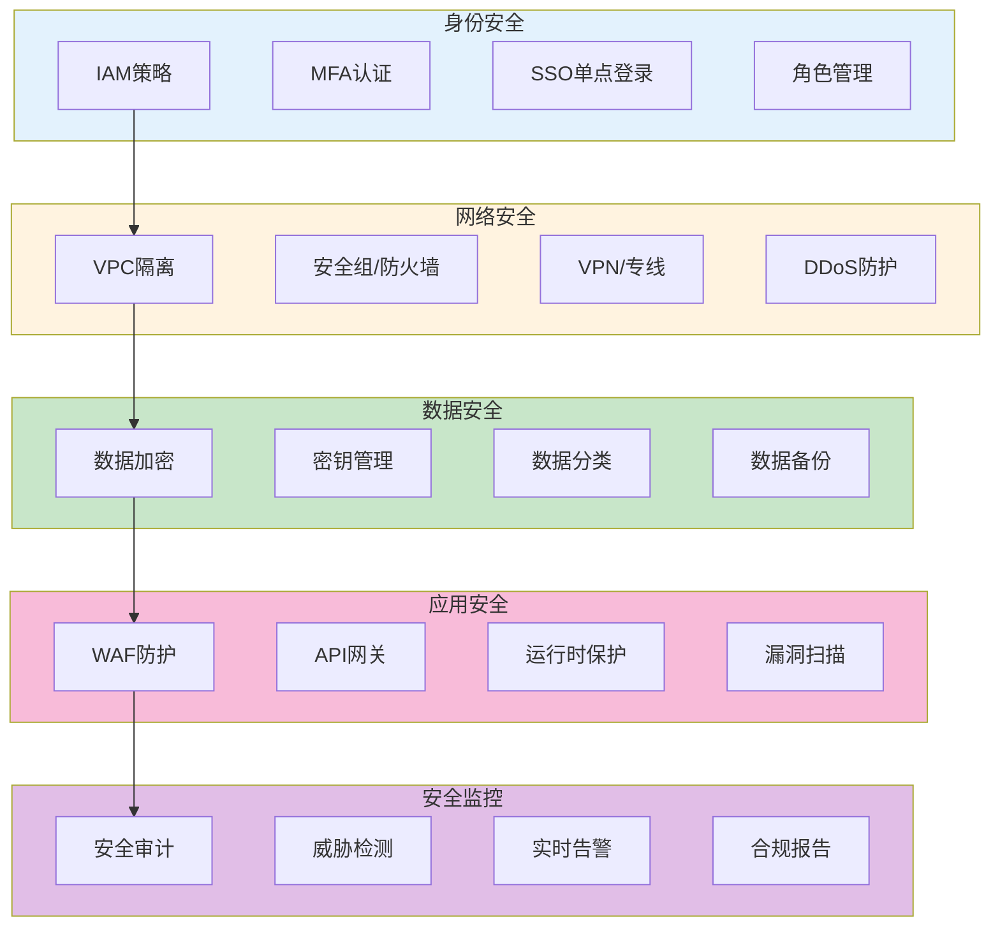

# 云安全最佳实践生产环境最佳实践

## 情境(Situation)

随着企业上云趋势的加速，云安全已成为企业IT安全的重中之重。云环境的多租户特性、动态基础设施和远程访问模式带来了新的安全挑战。

## 冲突(Conflict)

许多企业在云安全方面面临以下挑战：
- **身份管理复杂**：多云环境下的身份认证和授权难以统一管理
- **数据泄露风险**：敏感数据在传输和存储过程中可能被窃取
- **配置错误**：云服务配置不当导致安全漏洞
- **合规要求严格**：满足行业合规标准难度大
- **安全监控不足**：缺乏有效的安全监控和告警机制

## 问题(Question)

如何在多云环境中建立一套完整的安全体系，有效防止数据泄露和未授权访问？

## 答案(Answer)

本文将基于真实生产案例，提供一套完整的云安全最佳实践指南。

---

## 一、云安全架构设计

### 1.1 云安全架构概览



### 1.2 零信任架构

```yaml
# 零信任架构配置
zero_trust:
  identity_verification:
    - always_verify: true
    - mfa_required: true
    - device_trust: true
  
  least_privilege:
    - minimum_permissions: true
    - regular_review: true
    - temporary_access: true
  
  microsegmentation:
    - network_isolation: true
    - service_mesh: true
    - encrypted_traffic: true
  
  continuous_monitoring:
    - real_time_analytics: true
    - anomaly_detection: true
    - automated_response: true
```

---

## 二、身份与访问管理

### 2.1 IAM最佳实践

```yaml
# AWS IAM策略示例
{
    "Version": "2012-10-17",
    "Statement": [
        {
            "Effect": "Allow",
            "Action": [
                "s3:GetObject",
                "s3:ListBucket"
            ],
            "Resource": [
                "arn:aws:s3:::my-bucket",
                "arn:aws:s3:::my-bucket/*"
            ],
            "Condition": {
                "IpAddress": {
                    "aws:SourceIp": ["192.168.1.0/24"]
                }
            }
        }
    ]
}
```

### 2.2 SSO配置

```yaml
# Azure AD SSO配置
apiVersion: microsoft.graph/v1.0
kind: Application
metadata:
  name: "myapp-sso"
properties:
  signInAudience: "AzureADMyOrg"
  replyUrlsWithType:
    - url: "https://myapp.example.com/callback"
      type: "Web"
  requiredResourceAccess:
    - resourceAppId: "00000003-0000-0000-c000-000000000000"
      resourceAccess:
        - id: "e1fe6dd8-ba31-4d61-89e7-88639da4683d"
          type: "Scope"
```

### 2.3 访问密钥管理

```yaml
# 密钥轮换策略
key_rotation:
  max_key_age: 90 days
  rotation_frequency: 30 days
  alert_before_expiry: 7 days
  emergency_rotation:
    enabled: true
    triggers:
      - key_compromised
      - policy_violation
      - audit_failure
```

---

## 三、数据加密与保护

### 3.1 静态数据加密

```yaml
# AWS S3加密配置
Resources:
  SecureBucket:
    Type: AWS::S3::Bucket
    Properties:
      BucketName: "secure-data-bucket"
      BucketEncryption:
        ServerSideEncryptionConfiguration:
          - ServerSideEncryptionByDefault:
              SSEAlgorithm: AES256
          - ServerSideEncryptionRule:
              ApplyServerSideEncryptionByDefault:
                SSEAlgorithm: aws:kms
                KMSMasterKeyID: !Ref MyKMSKey

  MyKMSKey:
    Type: AWS::KMS::Key
    Properties:
      Description: "S3加密密钥"
      KeyPolicy:
        Version: "2012-10-17"
        Statement:
          - Effect: Allow
            Principal:
              AWS: !Sub "arn:aws:iam::${AWS::AccountId}:root"
            Action: kms:*
            Resource: "*"
```

### 3.2 传输加密

```yaml
# Nginx TLS配置
server {
    listen 443 ssl;
    server_name api.example.com;
    
    ssl_certificate /etc/nginx/certs/api.crt;
    ssl_certificate_key /etc/nginx/certs/api.key;
    
    ssl_protocols TLSv1.2 TLSv1.3;
    ssl_ciphers HIGH:!aNULL:!MD5;
    ssl_prefer_server_ciphers on;
    
    ssl_session_cache shared:SSL:1m;
    ssl_session_timeout 5m;
    
    location / {
        proxy_pass http://backend;
        proxy_set_header Host $host;
        proxy_set_header X-Forwarded-For $remote_addr;
        proxy_set_header X-Forwarded-Proto $scheme;
    }
}
```

### 3.3 数据分类分级

```yaml
# 数据分类策略
data_classification:
  public:
    description: "公开数据"
    examples: ["公开文档", "营销材料"]
    protection_level: "低"
  
  internal:
    description: "内部数据"
    examples: ["内部文档", "非敏感报告"]
    protection_level: "中"
  
  confidential:
    description: "机密数据"
    examples: ["用户数据", "业务数据"]
    protection_level: "高"
  
  restricted:
    description: "受限数据"
    examples: ["财务数据", "密码"]
    protection_level: "最高"
```

---

## 四、网络安全

### 4.1 VPC隔离配置

```yaml
# AWS VPC配置
Resources:
  MyVPC:
    Type: AWS::EC2::VPC
    Properties:
      CidrBlock: "10.0.0.0/16"
      EnableDnsSupport: true
      EnableDnsHostnames: true
      Tags:
        - Key: Name
          Value: "production-vpc"
  
  PublicSubnet1:
    Type: AWS::EC2::Subnet
    Properties:
      VpcId: !Ref MyVPC
      CidrBlock: "10.0.1.0/24"
      AvailabilityZone: "us-east-1a"
      MapPublicIpOnLaunch: true
  
  PrivateSubnet1:
    Type: AWS::EC2::Subnet
    Properties:
      VpcId: !Ref MyVPC
      CidrBlock: "10.0.100.0/24"
      AvailabilityZone: "us-east-1a"
      MapPublicIpOnLaunch: false
  
  SecurityGroup:
    Type: AWS::EC2::SecurityGroup
    Properties:
      GroupDescription: "Web Server Security Group"
      VpcId: !Ref MyVPC
      SecurityGroupIngress:
        - IpProtocol: tcp
          FromPort: 80
          ToPort: 80
          CidrIp: "0.0.0.0/0"
        - IpProtocol: tcp
          FromPort: 443
          ToPort: 443
          CidrIp: "0.0.0.0/0"
      SecurityGroupEgress:
        - IpProtocol: "-1"
          FromPort: -1
          ToPort: -1
          CidrIp: "0.0.0.0/0"
```

### 4.2 DDoS防护配置

```yaml
# AWS Shield配置
Resources:
  MyShieldProtection:
    Type: AWS::Shield::Protection
    Properties:
      Name: "API Protection"
      ResourceArn: !GetAtt MyLoadBalancer.Arn
  
  MyShieldDRT:
    Type: AWS::Shield::ProtectionGroup
    Properties:
      ProtectionGroupId: "critical-resources"
      Aggregation: "MAX"
      Pattern: "ARBITRARY"
      Members:
        - !GetAtt MyLoadBalancer.Arn
        - !GetAtt MyAPI.Arn
```

---

## 五、安全监控与审计

### 5.1 安全审计配置

```yaml
# AWS CloudTrail配置
Resources:
  SecurityTrail:
    Type: AWS::CloudTrail::Trail
    Properties:
      TrailName: "security-audit-trail"
      S3BucketName: !Ref AuditBucket
      IsLogging: true
      IsMultiRegionTrail: true
      EnableLogFileValidation: true
      IncludeGlobalServiceEvents: true

  AuditBucket:
    Type: AWS::S3::Bucket
    Properties:
      BucketName: "security-audit-logs"
      AccessControl: Private
      BucketEncryption:
        ServerSideEncryptionConfiguration:
          - ServerSideEncryptionByDefault:
              SSEAlgorithm: AES256
```

### 5.2 安全告警规则

```yaml
# CloudWatch安全告警
security_alerts:
  - name: "RootAccountUsage"
    description: "检测根账户活动"
    pattern: '{$.userIdentity.type = "Root" && $.userIdentity.invokedBy NOT EXISTS}'
    severity: "critical"
    actions:
      - "sns:security-alerts"
      - "pagerduty:critical"
  
  - name: "UnusualLogin"
    description: "检测异常登录行为"
    pattern: '{$.eventName = "ConsoleLogin" && $.sourceIPAddress NOT IN ["192.168.1.0/24"]}'
    severity: "high"
    actions:
      - "sns:security-alerts"
  
  - name: "PrivilegeEscalation"
    description: "检测权限提升行为"
    pattern: '{$.eventName = "CreatePolicy" || $.eventName = "AttachPolicy"}'
    severity: "critical"
    actions:
      - "sns:security-alerts"
      - "pagerduty:critical"
```

---

## 六、合规管理

### 6.1 合规检查清单

```yaml
# 安全合规检查清单
compliance_checklist:
  network:
    - name: "VPC隔离"
      description: "确认VPC配置正确"
      check: "aws ec2 describe-vpcs"
      pass_criteria: "至少2个私有子网"
    
    - name: "安全组限制"
      description: "确认安全组只允许必要端口"
      check: "aws ec2 describe-security-groups"
      pass_criteria: "没有开放所有端口的安全组"
  
  identity:
    - name: "MFA启用"
      description: "确认所有用户启用MFA"
      check: "aws iam list-users"
      pass_criteria: "所有用户已启用MFA"
    
    - name: "AccessKey轮换"
      description: "确认AccessKey定期轮换"
      check: "aws iam list-access-keys"
      pass_criteria: "所有密钥年龄<90天"
  
  data:
    - name: "S3加密"
      description: "确认S3存储桶加密"
      check: "aws s3api get-bucket-encryption"
      pass_criteria: "所有存储桶启用加密"
```

### 6.2 合规扫描脚本

```bash
#!/bin/bash
# 云安全合规扫描脚本

set -e

echo "=== 云安全合规扫描 ==="

# 检查安全组
echo ""
echo "1. 检查安全组配置"
echo "------------------"
open_sg=$(aws ec2 describe-security-groups --query \
  'SecurityGroups[?IpPermissions[?IpRanges[?CidrIp==`0.0.0.0/0` && ToPort==-1]]].GroupId' \
  --output text)

if [ -n "$open_sg" ]; then
  echo "❌ 发现开放所有端口的安全组: $open_sg"
  exit 1
else
  echo "✅ 所有安全组配置正确"
fi

# 检查MFA配置
echo ""
echo "2. 检查MFA配置"
echo "--------------"
users_without_mfa=$(aws iam list-users --query \
  'Users[?!not_null(MfaDevices)] | length(@)' \
  --output text)

if [ "$users_without_mfa" -gt 0 ]; then
  echo "❌ 有 $users_without_mfa 个用户未启用MFA"
  exit 1
else
  echo "✅ 所有用户已启用MFA"
fi

# 检查S3加密
echo ""
echo "3. 检查S3加密"
echo "-------------"
unencrypted_buckets=$(aws s3api list-buckets --query \
  'Buckets[].Name' --output text | while read bucket; do
  encryption=$(aws s3api get-bucket-encryption --bucket "$bucket" 2>/dev/null || echo "NONE")
  if [ "$encryption" = "NONE" ]; then
    echo "$bucket"
  fi
done)

if [ -n "$unencrypted_buckets" ]; then
  echo "❌ 以下存储桶未加密: $unencrypted_buckets"
  exit 1
else
  echo "✅ 所有存储桶已加密"
fi

echo ""
echo "=== 扫描完成 ==="
exit 0
```

---

## 七、最佳实践总结

### 7.1 云安全原则

| 原则 | 说明 | 实践建议 |
|:----:|------|----------|
| **零信任** | 不相信任何实体 | 验证每个访问请求 |
| **最小权限** | 只授予必要权限 | IAM角色精细化配置 |
| **数据加密** | 传输和存储都加密 | TLS + 静态加密 |
| **持续监控** | 实时安全监控 | CloudWatch/Security Hub |
| **合规优先** | 满足合规要求 | 定期合规扫描 |

### 7.2 常见问题与解决方案

| 问题 | 症状 | 解决方案 |
|:-----|:-----|:----------|
| **身份泄露** | 密钥被泄露 | 使用Vault管理密钥 |
| **配置错误** | 安全组开放过度 | 自动化配置检查 |
| **数据泄露** | 敏感数据暴露 | 数据加密+访问控制 |
| **攻击检测慢** | 安全事件发现延迟 | 实时威胁检测 |
| **合规差距** | 不符合监管要求 | 定期合规审计 |

---

## 总结

云安全是企业上云的关键保障。通过建立零信任架构、实施严格的身份管理、加密保护数据、建立完善的监控体系，可以有效防止数据泄露和未授权访问。

> **延伸阅读**：更多云安全相关面试题，请参考 [SRE面试题解析：基于JD与简历匹配分析]()。

---

## 参考资料

- [AWS安全最佳实践](https://docs.aws.amazon.com/whitepapers/latest/aws-security-best-practices/)
- [GCP安全文档](https://cloud.google.com/security)
- [Azure安全中心](https://azure.microsoft.com/en-us/products/security-center/)
- [CIS云安全基准](https://www.cisecurity.org/cis-benchmarks/)
- [NIST网络安全框架](https://www.nist.gov/cyberframework)
