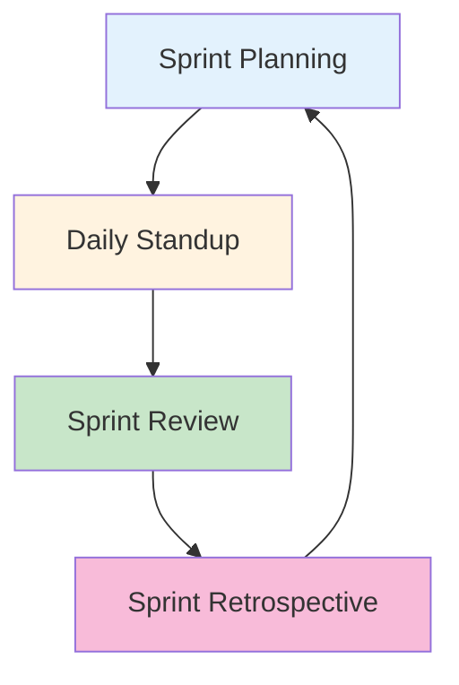
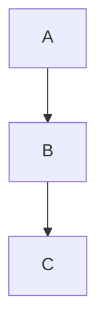
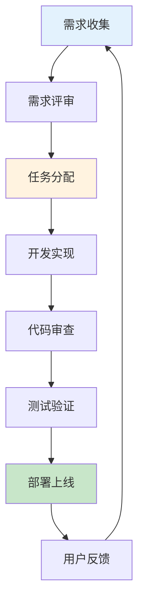

# 协作工具与团队管理生产环境最佳实践

## 情境(Situation)

高效的团队协作是DevOps成功的关键。在分布式团队和跨文化环境中，选择合适的协作工具并建立有效的管理流程尤为重要。

## 冲突(Conflict)

许多团队在协作工具使用方面面临以下挑战：
- **工具碎片化**：使用多种工具导致信息分散
- **流程不规范**：缺乏标准化的工作流程
- **沟通效率低**：信息传递不及时、不准确
- **知识共享困难**：文档管理混乱，知识沉淀不足
- **跨团队协作障碍**：不同团队使用不同工具和流程

## 问题(Question)

如何选择和配置协作工具，建立高效的团队协作和项目管理体系？

## 答案(Answer)

本文将基于真实生产案例，提供一套完整的协作工具与团队管理最佳实践指南。

---

## 一、协作工具选型

### 1.1 工具矩阵

| 工具类型 | 推荐工具 | 主要用途 |
|:--------:|----------|----------|
| **项目管理** | Jira | 敏捷开发、任务追踪 |
| **文档管理** | Confluence | 知识管理、文档协作 |
| **即时通讯** | Slack | 团队沟通、通知集成 |
| **代码协作** | GitHub/GitLab | 版本控制、代码审查 |
| **会议协作** | Zoom/Teams | 远程会议、屏幕共享 |
| **持续集成** | Jenkins/GitHub Actions | 自动化构建部署 |

### 1.2 Jira配置最佳实践

```yaml
# Jira工作流配置
workflow:
  name: "DevOps Standard Workflow"
  states:
    - name: "To Do"
      description: "待处理"
    
    - name: "In Progress"
      description: "进行中"
      transitions:
        - from: "To Do"
        - from: "Review"
    
    - name: "Review"
      description: "代码审查"
      transitions:
        - from: "In Progress"
    
    - name: "Testing"
      description: "测试中"
      transitions:
        - from: "Review"
    
    - name: "Done"
      description: "已完成"
      transitions:
        - from: "Testing"
    
    - name: "Blocked"
      description: "阻塞"
      transitions:
        - from: "In Progress"
        - from: "Review"
```

### 1.3 Jira看板配置

```yaml
# Jira看板列配置
kanban_columns:
  - name: "Backlog"
    issue_types: ["Story", "Bug", "Task"]
    max_issues: null
  
  - name: "To Do"
    issue_types: ["Story", "Bug", "Task"]
    max_issues: 10
  
  - name: "In Progress"
    issue_types: ["Story", "Bug", "Task"]
    max_issues: 5  # WIP限制
  
  - name: "Review"
    issue_types: ["Story", "Bug", "Task"]
    max_issues: 3
  
  - name: "Testing"
    issue_types: ["Story", "Bug", "Task"]
    max_issues: 5
  
  - name: "Done"
    issue_types: ["Story", "Bug", "Task"]
    max_issues: null
```

---

## 二、敏捷项目管理

### 2.1 Scrum流程



### 2.2 Sprint规划模板

```markdown
# Sprint规划模板

## 基本信息
- **Sprint编号**: Sprint 24
- **时间范围**: 2024-01-15 ~ 2024-01-29
- **团队**: DevOps Team
- **Scrum Master**: Zhang San

## Sprint目标
完成用户认证模块的重构，提升系统安全性和性能。

## 待办事项

| 优先级 | 任务 | 预估故事点 | 负责人 |
|--------|------|-----------|--------|
| P0 | 实现OAuth2认证 | 8 | Li Si |
| P0 | 集成Redis缓存 | 5 | Wang Wu |
| P1 | 更新API文档 | 3 | Zhao Liu |
| P1 | 性能测试 | 5 | Zhang San |
| P2 | 代码审查 | 3 | Team |

## 风险评估

| 风险 | 概率 | 影响 | 缓解措施 |
|------|------|------|----------|
| OAuth2集成复杂 | 中 | 高 | 提前研究文档 |
| 性能测试环境不足 | 低 | 中 | 协调测试资源 |

## 会议安排
- Daily Standup: 每天 10:00-10:15
- Sprint Review: 2024-01-28 14:00
- Sprint Retrospective: 2024-01-29 10:00
```

### 2.3 燃尽图配置

```yaml
# Jira燃尽图配置
burnup_chart:
  sprint_duration: 14 days
  ideal_line: true
  actual_work_completed: true
  scope_change: true
  
  metrics:
    - name: "Story Points"
      type: "sum"
      field: "Story Points"
```

---

## 三、文档管理与知识共享

### 3.1 Confluence文档结构

```yaml
# Confluence空间结构
confluence_space:
  name: "DevOps Handbook"
  
  pages:
    - name: "首页"
      children:
        - name: "团队介绍"
        - name: "目录导航"
        - name: "更新日志"
    
    - name: "流程规范"
      children:
        - name: "CI/CD流程"
        - name: "部署流程"
        - name: "故障处理流程"
        - name: "代码审查规范"
    
    - name: "技术文档"
      children:
        - name: "架构设计"
        - name: "API文档"
        - name: "数据库设计"
        - name: "监控配置"
    
    - name: "运维手册"
      children:
        - name: "日常运维"
        - name: "应急响应"
        - name: "备份恢复"
        - name: "性能调优"
    
    - name: "培训资料"
      children:
        - name: "新员工培训"
        - name: "工具使用指南"
        - name: "最佳实践分享"
```

### 3.2 文档模板

```markdown
# 文档模板

## 标题
简短描述文档内容

## 概述
文档的目的和范围

## 背景
为什么需要这份文档

## 详细内容
### 3.1 第一部分
详细说明

### 3.2 第二部分
详细说明

## 流程图


## 相关文档
- [链接1](url)
- [链接2](url)

## 更新记录
| 日期 | 作者 | 变更内容 |
|------|------|----------|
| 2024-01-15 | Zhang San | 初始版本 |
```

---

## 四、即时通讯与通知集成

### 4.1 Slack集成配置

```yaml
# Slack通知集成
slack_integrations:
  jira:
    enabled: true
    channels:
      - "#devops-alerts"
      - "#team-notifications"
    events:
      - issue_created
      - issue_updated
      - issue_resolved
      - sprint_started
      - sprint_completed
  
  jenkins:
    enabled: true
    channels:
      - "#ci-cd-status"
    events:
      - build_started
      - build_succeeded
      - build_failed
      - deployment_started
      - deployment_completed
  
  prometheus:
    enabled: true
    channels:
      - "#alerts-critical"
    events:
      - alert_firing
      - alert_resolved
```

### 4.2 通知格式规范

```yaml
# 通知格式规范
notification_format:
  success:
    emoji: ":white_check_mark:"
    color: "#36a64f"
  
  warning:
    emoji: ":warning:"
    color: "#ff9f1a"
  
  error:
    emoji: ":x:"
    color: "#ff4757"
  
  info:
    emoji: ":information_source:"
    color: "#375f9b"
```

---

## 五、跨团队协作

### 5.1 协作流程



### 5.2 跨团队沟通机制

```yaml
# 跨团队沟通机制
cross_team_communication:
  daily_sync:
    time: "10:00-10:15"
    participants: ["Dev", "Ops", "Product"]
    purpose: "同步进度、阻塞问题"
  
  weekly_planning:
    time: "周一 14:00-15:00"
    participants: ["Dev", "Ops", "Product", "QA"]
    purpose: "规划本周工作、资源协调"
  
  monthly_retrospective:
    time: "每月最后一周"
    participants: ["All"]
    purpose: "回顾月度工作、改进流程"
  
  ad_hoc_meetings:
    channel: "#cross-team"
    purpose: "临时问题讨论"
```

---

## 六、Scrum Master最佳实践

### 6.1 Scrum Master职责

```yaml
# Scrum Master职责
scrum_master_responsibilities:
  process_facilitation:
    - 组织Sprint规划会议
    - 主持每日站会
    - 组织Sprint评审会议
    - 主持Sprint回顾会议
  
  team_support:
    - 移除团队障碍
    - 提供敏捷指导
    - 支持团队成长
    - 保护团队免受干扰
  
  process_improvement:
    - 跟踪敏捷指标
    - 识别改进机会
    - 推动流程优化
    - 持续学习改进
```

### 6.2 敏捷指标跟踪

```yaml
# 敏捷指标
agile_metrics:
  velocity:
    description: "每个Sprint完成的故事点"
    target: "稳定增长"
  
  sprint_goal_achievement:
    description: "Sprint目标达成率"
    target: "> 80%"
  
  cycle_time:
    description: "从需求到交付的时间"
    target: "持续减少"
  
  defect_rate:
    description: "交付后的缺陷率"
    target: "< 5%"
  
  team_happiness:
    description: "团队满意度"
    target: "> 4/5"
```

---

## 七、最佳实践总结

### 7.1 协作工具原则

| 原则 | 说明 | 实践建议 |
|:----:|------|----------|
| **统一工具** | 使用统一的工具栈 | Jira + Confluence + Slack |
| **自动化集成** | 工具间自动同步 | Webhook集成 |
| **文档即代码** | 文档版本化管理 | 存储在Git仓库 |
| **持续更新** | 保持文档最新 | 定期审查更新 |
| **知识共享** | 建立知识库 | Confluence空间 |

### 7.2 常见问题与解决方案

| 问题 | 症状 | 解决方案 |
|:-----|:-----|:----------|
| **信息分散** | 找不到需要的信息 | 建立统一知识库 |
| **沟通不畅** | 信息传递延迟 | 建立定期同步机制 |
| **流程混乱** | 工作流程不清晰 | 标准化工作流程 |
| **文档过时** | 文档与实际不符 | 文档审查机制 |
| **团队效率低** | 重复劳动多 | 自动化+模板化 |

---

## 总结

高效的团队协作是DevOps成功的关键。通过选择合适的协作工具、建立标准化流程和持续改进机制，可以显著提升团队效率和协作质量。

> **延伸阅读**：更多团队协作相关面试题，请参考 [SRE面试题解析：基于JD与简历匹配分析]()。

---

## 参考资料

- [Jira官方文档](https://support.atlassian.com/jira-software-cloud/docs/)
- [Confluence官方文档](https://support.atlassian.com/confluence-cloud/docs/)
- [Slack集成指南](https://api.slack.com/)
- [Scrum Guide](https://scrumguides.org/)
